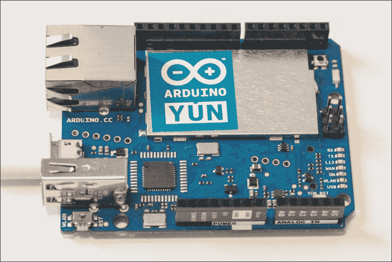
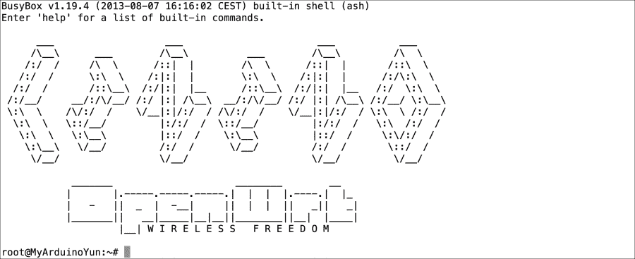
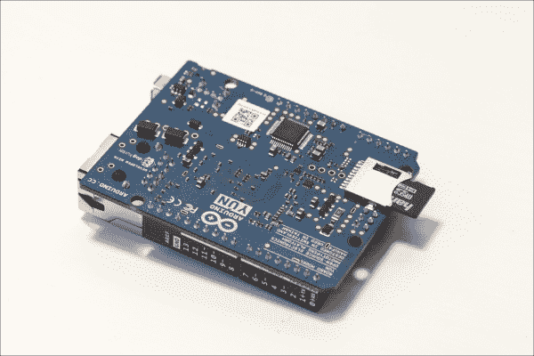
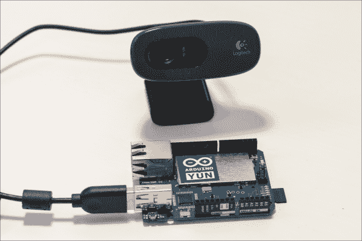
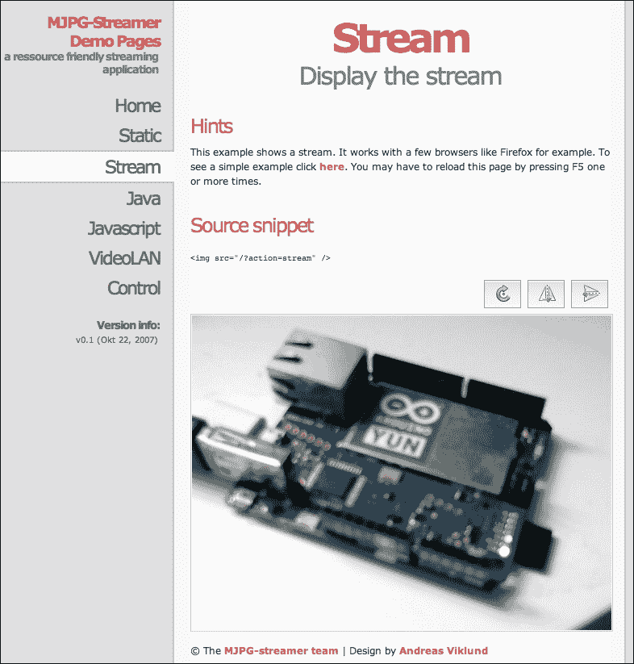
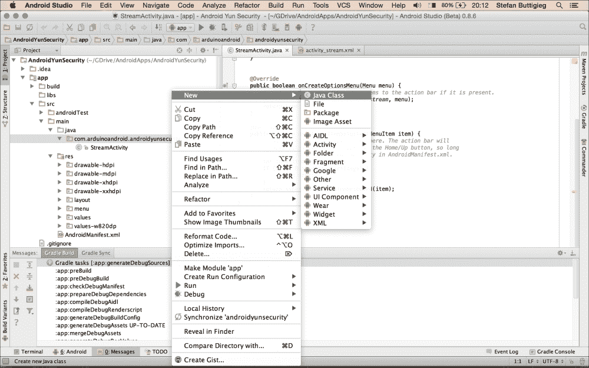
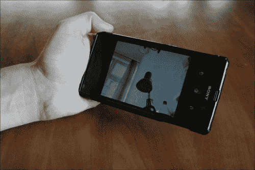

# 第五章：Wi-Fi 远程安全摄像头

在本章中，我们将构建一个 Wi-Fi 远程安全摄像头。摄像头本身将基于 Arduino Yùn 和一个标准的 USB 网络摄像头。Arduino Yùn 是一款功能强大的 Arduino 板，它集成了 Linux 机器和 Wi-Fi 连接。Arduino Yùn 将接收来自摄像头的视频并在本地 Wi-Fi 网络上进行流式传输。

然后，我们将能够从我们的物理 Android 设备访问视频流。这将使我们能够在家里任何地方访问我们的视频流，提供移动灵活性。

从本章，你将学习如何：

+   使用 Arduino Yùn 并连接一个 USB 摄像头到它

+   配置 Yùn 以通过你的本地 Wi-Fi 网络传输视频

+   构建一个 Android 应用程序以从 USB 摄像头获取流

# 硬件和软件要求

Wi-Fi 远程安全摄像头项目基于 Arduino Yùn 板。Arduino Yùn 是一款功能强大的 Arduino 板，集成了 Wi-Fi，并基于一个非常小的 Linux 发行版 OpenWrt。它还带有一个 USB 端口，以便你可以连接硬盘、摄像头或其他 USB 设备。我们将在这个项目中使用所有这些功能。

以下是在本项目中使用的电路板图片：



你还需要一个 USB 摄像头来与 Yùn 一起进行实时视频流。基本上，你可以获取任何兼容**USB 视频类**（**UVC**）的摄像头。对于这个项目，我使用了 Logitech C270 HD 摄像头。

如果你计划将摄像头用于其他应用，例如在 Yùn 上记录静态图片，你还需要一张 microSD 卡来保存数据。最后，你需要一条微型 USB 线来为 Yùn 供电。以下是本章所需的所有硬件组件列表：

+   Arduino Yùn ([`www.adafruit.com/products/1498`](https://www.adafruit.com/products/1498))

+   一款 UVC 兼容的 USB 摄像头([`en.wikipedia.org/wiki/List_of_USB_video_class_devices`](http://en.wikipedia.org/wiki/List_of_USB_video_class_devices))

+   一条微型 USB 线

+   一张 4GB 的 microSD 卡，这是可选的([`www.adafruit.com/products/102`](https://www.adafruit.com/products/102))

你需要按照官方指南配置你的 Arduino Yùn，以便它能够连接到你的 Wi-Fi 网络：

[`arduino.cc/en/Guide/ArduinoYùn`](http://arduino.cc/en/Guide/ArduinoYùn)

注意，如果你在代理服务器后面，你可能会在配置 Arduino Yùn 时遇到问题。如果是这种情况，尝试禁用代理以查看是否解决问题。

如果你的 Yùn 不是最新的，你可能需要将 OpenWrt（Yùn 的操作系统）更新到最新版本。该过程在指南中有描述，可以在[`arduino.cc/en/Tutorial/YùnSysupgrade`](http://arduino.cc/en/Tutorial/YùnSysupgrade)找到。

Wi-Fi 配置完成后，我们将安装处理摄像头和在本地 Wi-Fi 网络上直播视频所需的包。转到终端（如果你使用 Windows，请使用终端软件，如 PuTTY 或 OpenSSH），并输入以下命令：

```java
ssh root@yourYùnName.local

```

当然，你需要将命令替换为你配置时定义的 Arduino Yùn 的名称。如果你忘记了板子的名称，你需要重置 Yùn 并重新配置。

你将被提示输入你在 Yùn 配置步骤中定义的密码。然后，你会看到一个类似于以下截图的屏幕：



你现在已登录到 Arduino Yùn。你可以输入以下命令来更新可用包的列表：

```java
opkg update

```

然后输入以下命令来安装直播视频所需的包：

```java
opkg install kmod-video-uvc mjpg-streamer

```

## 硬件配置

这个项目的硬件配置非常简单。首先，将格式化好的 microSD 卡插入 Arduino Yùn SD 卡读卡器，如下面的截图所示：



然后，只需将 USB 摄像头连接到 Yùn 的主 USB 端口，如下面的截图所示：



要完成项目的硬件配置，只需通过 micro USB 端口连接到电源即可（实际上，你甚至不需要将其连接到电脑，Arduino Yùn 可以完全独立工作！）。

## 设置视频流

我们现在将设置 Arduino Yùn，使其持续直播视频。再次使用以下命令登录到你的 Arduino Yùn：

```java
ssh root@yourYùnName

```

再次，将命令替换为你 Arduino Yùn 的名称。然后输入以下命令：

```java
mjpg_streamer -i "input_uvc.so -d /dev/video0 -r 640x480 -f 25" -o "output_http.so -p 8080 -w /www/webcam" &

```

这基本上意味着它将以 640 x 480 的分辨率，每秒 25 帧的速度，在`8080`端口开始直播。

你应该在终端内看到一系列命令被打印出来，这意味着 Yùn 现在正在你的 Wi-Fi 网络上直播视频。现在，打开你喜欢的网页浏览器，输入`yourYùnName.local:8080`。

这将打开主流媒体界面，你可以选择所需的流媒体类型。要测试访问流本身，请转到`http://arduinoYùn.local:8080/stream.html`。

注意，此链接仅在你自己的本地 Wi-Fi 网络内有效。你会看到一个来自你的 Arduino Yùn 的实时流，如下面的截图所示：



## 在 Android 上实现全屏流媒体播放器

在这个项目中，我们将实现一个非常简单的 Android 应用程序，该程序将显示来自我们的 Arduino Yùn 的 MJPEG 流。我们假设您已经在 Android Studio 的首选项中开启了`Auto-Import`功能。如果没有，请通过前往**Auto-Import**首选项并选择所有可用选项来激活它。**Auto-Import**首选项在 Mac 和 Windows 上的位置如下：

+   **Mac**：**Android Studio** > **Preferences** > **Editor** > **Auto-Import**

+   **Windows**：**File** > **Settings** > **Editor** > **Auto-Import**

在设置好所有必要的设置后，我们将首先创建一个新项目，在**New Project**设置中选择以下内容：

+   **名称**：`Android Yùn Security`

+   **最小 SDK**：`15`

+   **项目**：`Blank Activity`

+   **活动名称**：`StreamActivity`

在这个项目中，我们将与三个 Java 类一起工作，并需要创建两个类，即`MjpegInputStream`和`MjpegView`。Java 类如下：

+   `StreamActivity`（在启动新项目时创建的主要活动）

+   `MjpegInputStream`

+   `MjpegView`

要创建一个新类，您需要前往`app` > `src` > `main` > `java` > `com.domainofyourchoice.androidYùnsecurity`。

右键单击包名，然后选择**New** > **Java Class**，如下面的截图所示：



首先要考虑的是；如果我们不声明网络用户权限，这个应用程序将无法工作。因此，我们前往`AndroidManifest.xml`文件，并在包名下方添加以下代码行：

```java
<uses-permission android:name="android.permission.INTERNET"/>
<uses-permission android:name="android.permission.ACCESS_WIFI_STATE"
```

完成后，Android 清单将如下所示：

```java
<?xml version="1.0" encoding="utf-8"?>
<manifest 
    package="com.arduinoandroid.androidYùnsecurity" >

    <uses-permission android:name="android.permission.ACCESS_WIFI_STATE"/>
    <uses-permission android:name="android.permission.INTERNET"/>

    <application
        android:allowBackup="true"
        android:icon="@drawable/ic_launcher"
        android:label="@string/app_name"
        android:theme="@style/AppTheme" >
        <activity
            android:name=".StreamActivity"
            android:label="@string/app_name" >
            <intent-filter>
                <action android:name="android.intent.action.MAIN" />

                <category android:name="android.intent.category.LAUNCHER" />
            </intent-filter>
        </activity>
    </application>

</manifest>
```

然后，我们前往`StreamActivity.java`文件，在那里我们将开始我们的主要流媒体活动。在这个项目中，我们将使用 ASync 任务来进行网络活动。

我们首先声明`String TAG`（我们将用它进行日志记录）和`MjpegView`（它指的是我们已创建的类的实例）：

```java
public class StreamActivity extends Activity {
    private static final String TAG = "MjpegActivity";

    private MjpegView mv;
```

在`onCreate`方法中，我们将声明我们的 URL，并声明一系列参数以将视频流设置为全屏。重要的是要将`youripaddress`替换为您可以从 Arduino Yùn 网络面板轻松找到的 IP 地址：

```java
    public void onCreate(Bundle savedInstanceState) {
        super.onCreate(savedInstanceState);

        //sample public ca
        String URL = "http://youripaddress:8080/?action=stream";

        requestWindowFeature(Window.FEATURE_NO_TITLE);
        getWindow().setFlags(WindowManager.LayoutParams.FLAG_FULLSCREEN,
                WindowManager.LayoutParams.FLAG_FULLSCREEN);

        mv = new MjpegView(this);
        setContentView(mv);

        new DoRead().execute(URL);
    }
```

我们还需要声明`onPause()`方法，该方法将在 Android 应用程序关闭时实现，该方法将暂停实时流，以避免使用 Android 设备的电池资源：

```java
    public void onPause() {
        super.onPause();
        mv.stopPlayback();
    }
```

然后，我们将实现`DoRead AsyncTask`，该任务将执行`HttpRequest`并与 Arduino Yùn 服务器通信：

```java
    public class DoRead extends AsyncTask<String, Void, MjpegInputStream> {
        protected MjpegInputStream doInBackground(String... url) {

            HttpResponse res = null;
            DefaultHttpClient httpclient = new DefaultHttpClient();
            Log.d(TAG, "1\. Sending http request");
            try {
                res = httpclient.execute(new HttpGet(URI.create(url[0])));
                Log.d(TAG, "2\. Request finished, status = " + res.getStatusLine().getStatusCode());
                if(res.getStatusLine().getStatusCode()==401){
                    //You must turn off camera User Access Control before this will work
                    return null;
                }
                return new MjpegInputStream(res.getEntity().getContent());
            } catch (ClientProtocolException e) {
                e.printStackTrace();
                Log.d(TAG, "Request failed-ClientProtocolException", e);
                //Error connecting to camera
            } catch (IOException e) {
                e.printStackTrace();
                Log.d(TAG, "Request failed-IOException", e);
                //Error connecting to camera
            }

            return null;
        }
```

在`StreamActivity.Java`类中，我们将实现`onPostExecute()`，它是`AsyncTask` API 的一部分，将确保视频流播放器在主 UI 线程中显示：

```java
        protected void onPostExecute(MjpegInputStream result) {
            mv.setSource(result);
            mv.setDisplayMode(MjpegView.SIZE_BEST_FIT);
            mv.showFps(true);
        }
    }
}
```

然后，我们将打开`MjpegInputStream.java`文件，在那里我们将声明所有必要的代码，以解析从 Arduino Yùn 流到 Android 设备的流数据：

```java
public class MjpegInputStream extends DataInputStream {
    private static final String TAG = "MjpegInputStream";

    private final byte[] SOI_MARKER = { (byte) 0xFF, (byte) 0xD8 };
    private final byte[] EOF_MARKER = { (byte) 0xFF, (byte) 0xD9 };
    private final String CONTENT_LENGTH = "Content-Length";
    private final static int HEADER_MAX_LENGTH = 100;
    private final static int FRAME_MAX_LENGTH = 40000 + HEADER_MAX_LENGTH;
    private int mContentLength = -1;

    public MjpegInputStream(InputStream in) {
        super(new BufferedInputStream(in, FRAME_MAX_LENGTH));
    }

    private int getEndOfSeqeunce(DataInputStream in, byte[] sequence) throws IOException {
        int seqIndex = 0;
        byte c;
        for(int i=0; i < FRAME_MAX_LENGTH; i++) {
            c = (byte) in.readUnsignedByte();
            if(c == sequence[seqIndex]) {
                seqIndex++;
                if(seqIndex == sequence.length) {
                    return i + 1;
                }
            } else {
                seqIndex = 0;
            }
        }
        return -1;
    }

    private int getStartOfSequence(DataInputStream in, byte[] sequence) throws IOException {
        int end = getEndOfSeqeunce(in, sequence);
        return (end < 0) ? (-1) : (end - sequence.length);
    }

    private int parseContentLength(byte[] headerBytes) throws IOException, NumberFormatException {
        ByteArrayInputStream headerIn = new ByteArrayInputStream(headerBytes);
        Properties props = new Properties();
        props.load(headerIn);
        return Integer.parseInt(props.getProperty(CONTENT_LENGTH));
    }

    public Bitmap readMjpegFrame() throws IOException {
        mark(FRAME_MAX_LENGTH);
        int headerLen = getStartOfSequence(this, SOI_MARKER);
        reset();
        byte[] header = new byte[headerLen];
        readFully(header);
        try {
            mContentLength = parseContentLength(header);
        } catch (NumberFormatException nfe) {
            nfe.getStackTrace();
            Log.d(TAG, "catch NumberFormatException hit", nfe);
            mContentLength = getEndOfSeqeunce(this, EOF_MARKER);
        }
        reset();
        byte[] frameData = new byte[mContentLength];
        skipBytes(headerLen);
        readFully(frameData);
        return BitmapFactory.decodeStream(new ByteArrayInputStream(frameData));
    }
}
```

最后但同样重要的是，我们将前往`MjpegView.java`，在那里我们将声明多个重要方法来整合我们所有的应用程序流程。`MjpegView.java`类可在[`git.io/_Mu_Gw`](http://git.io/_Mu_Gw)找到。

将你版本中的`MjpegView.java`类内的所有代码替换为在线仓库中的代码，并确保包名和其他类引用与项目中的相匹配。

一旦你确保所有`import`语句都包含在每个类中，并使用`Auto-Import`功能，你就可以继续构建应用并在连接到同一 Wi-Fi 网络的物理设备上测试它，该设备连接到 Arduino Yùn。

最终项目应该看起来如下：



## 如何进一步

在基本的 Android 应用上进行有趣的实现和进一步改进，可以包括在摄像头前检测到运动时能够捕捉快照的功能。这可以通过 Android 的 OpenCV 库实现，该库可在[`opencv.org/platforms/android.html`](http://opencv.org/platforms/android.html)找到。

此外，用户界面可以改进，包括捕捉特定场景照片的功能。这个项目也可以与稍后将要讨论的移动机器人项目结合，以拥有一个可以通过同一 Android 应用程序控制的实时流移动机器人。修改这种设置的用例是无限的，从远程婴儿监控到医疗监测设备。

# 摘要

让我们总结一下本章我们做了什么。我们学习了如何将 USB 摄像头连接到 Arduino Yùn，并配置 Arduino 板使其将视频流传输到我们的本地 Wi-Fi 网络。然后我们创建了一个新的 Android 应用程序，在 Android 手机或平板电脑上观看摄像头的视频流。因此，我们创建了一个基于 Arduino 和 Android 的简单 Wi-Fi 安全摄像头。

在下一章中，我们将做一些不同的事情。我们将使用 Android 手机的陀螺仪来控制连接到 Arduino 板上的伺服电机。我们只需倾斜 Android 手机就能控制伺服电机的旋转角度。
