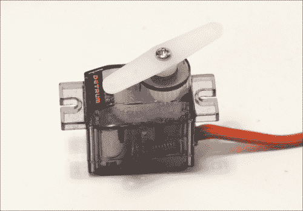
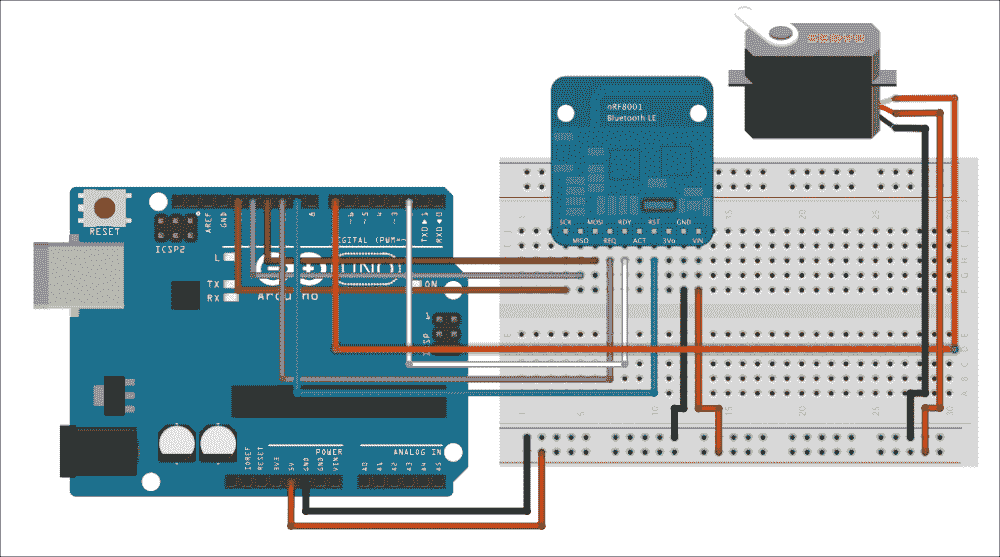
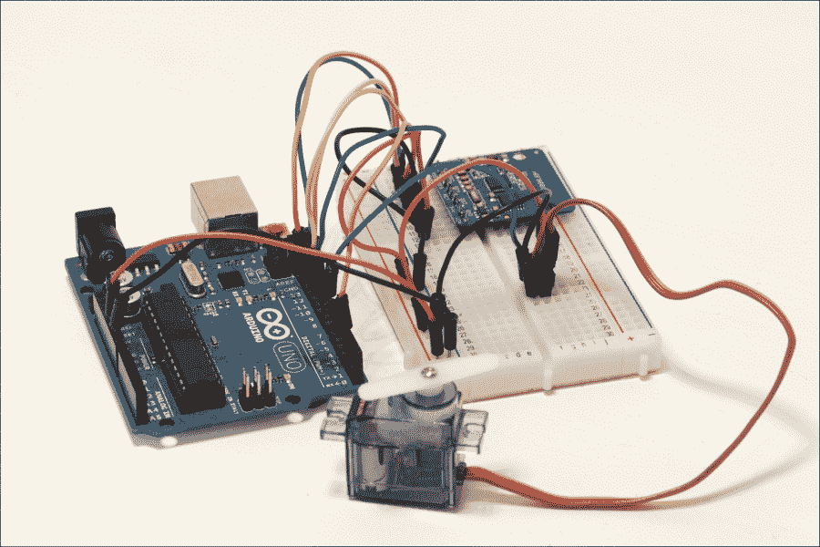
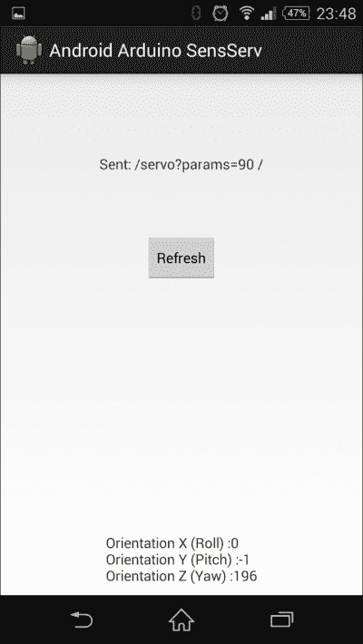

# 第六章 Android 手机传感器

到目前为止，在这本书中，我们已经使用 Android 设备来控制 Arduino 项目，并从连接到 Arduino 板的传感器中获取读数。在本章中，我们将做一些不同的事情：我们将使用手机的传感器来控制 Arduino 板。

我们将把一个伺服电机连接到 Arduino 板上，以便可以从 Android 手机上控制它。伺服电机基本上是一种可以由微控制器精确控制角位置的电机。我们将再次使用 BLE 来接收来自 Android 设备的命令。

在 Android 端，我们将连续测量来自手机陀螺仪传感器的数据，并将这些数据转换为伺服电机有意义的命令。目标是伺服电机持续跟随 Android 设备的移动。

在本章中，您将学习如何：

+   将伺服电机连接到 Arduino 平台

+   编写一个通过 BLE 接收命令的草图

+   编写一个 Android 应用程序，使用 Android 手机的陀螺仪控制伺服电机

# 硬件和软件要求

您需要为这个项目准备的第一件事是一个 Arduino Uno 板。

然后您需要一个 BLE 模块。我们选择了 Adafruit nRF8001 芯片，因为它附带了一个不错的 Arduino 库，并且已经有现成的 Android 应用程序示例来控制该模块。

对于伺服电机，我们选择了一个简单的 5V 伺服电机模块。您可以使用任何品牌的模块，只要它能用 5V 电压等级控制即可。以下是本项目使用的伺服电机的图片：



最后，您需要一个面包板和一些跳线来制作不同的连接。

这是项目所需的组件列表：

+   Arduino Uno（[`www.adafruit.com/product/50`](https://www.adafruit.com/product/50)）

+   Adafruit nRF8001 BLE 扩展板（[`www.adafruit.com/product/1697`](https://www.adafruit.com/product/1697)）

+   5V 伺服电机（[`www.adafruit.com/product/1143`](https://www.adafruit.com/product/1143)）

+   面包板（[`www.adafruit.com/products/64`](https://www.adafruit.com/products/64)）

+   跳线（[`www.adafruit.com/products/1957`](https://www.adafruit.com/products/1957)）

在软件方面，您需要常用的 Arduino IDE。建议您使用 Arduino IDE 版本 1.5.7 来学习本章内容。

您需要以下库：

+   可以在[`github.com/adafruit/Adafruit_nRF8001`](https://github.com/adafruit/Adafruit_nRF8001)找到的 nRF8001 板库

+   可以在[`github.com/marcoschwartz/aREST`](https://github.com/marcoschwartz/aREST)找到的 aREST 库

要安装某个库，只需将`library`文件夹提取到您的`Arduino/libra ries`文件夹中。

## 配置硬件

现在我们来为项目进行必要的硬件连接。为了帮助您，以下是项目的原理图：



第一步是将蓝牙模块放置在面包板上。然后，将 Arduino 板上的电源供应连接到面包板：Arduino 板的 5V 连接到红色电源轨，**GND**连接到蓝色电源轨。

我们将连接 BLE 模块。首先，连接模块的电源：**GND**连接到蓝色电源轨，**VIN**连接到红色电源轨。之后，您需要连接负责 SPI 接口的不同电线：**SCK**连接到 Arduino 引脚**13**，**MISO**连接到 Arduino 引脚**12**，**MOSI**连接到 Arduino 引脚**11**。然后，将**REQ**引脚连接到 Arduino 引脚**10**。最后，将**RDY**引脚连接到 Arduino 引脚**2**，将**RST**引脚连接到 Arduino 引脚**9**。如果您需要连接此模块的额外帮助，可以访问制造商指南[`learn.adafruit.com/getting-started-with-the-nrf8001-bluefruit-le-breakout`](https://learn.adafruit.com/getting-started-with-the-nrf8001-bluefruit-le-breakout)。

对于伺服电机，将伺服电机的红色电缆连接到红色电源轨，将黑色电缆连接到蓝色电源轨。最后，将剩余的电缆连接到 Arduino 板的 7 号引脚。

以下是为该项目组装的图片：



## 测试伺服电机

现在，我们将编写一个非常简单的草图来测试伺服电机，并查看 Arduino Servo 库的工作情况。以下是这部分完整的草图：

```java
#include <Servo.h>

// Create servo object
Servo myservo;

// Servo position
int pos = 0;   

void setup()
{
  // Attaches the servo on pin 7 to the servo object
  myservo.attach(7);  
}

void loop()
{
  // Goes from 0 degrees to 180 degrees
  for(pos = 0; pos < 180; pos += 1)
  {                                  
    myservo.write(pos);              
    delay(15);                       
  }

  // Goes from 180 degrees to 0 degrees
  for(pos = 180; pos >= 1; pos -= 1)     
  {                                
    myservo.write(pos);              
    delay(15);                  
  }
}
```

现在让我们看看草图的细节。这首先是通过以下方式包含 Servo 库：

```java
#include <Servo.h>
```

然后，我们创建一个 Servo 库的实例：

```java
Servo myservo;
```

我们还将声明一个名为`pos`的变量，它将包含伺服电机的角位置：

```java
int pos = 0;   
```

在此之后，在草图中的`setup()`函数中，我们将伺服电机连接到 Arduino 板上的 7 号引脚：

```java
myservo.attach(7);   
```

在此之后，我们将`pos`变量从`0`扫描到`180`，这意味着我们覆盖了伺服电机的所有可能的角位置：

```java
for(pos = 0; pos < 180; pos += 1)
{                                  
  myservo.write(pos);              
  delay(15);                       
}
```

在这个测试代码中，我们将使用类似的循环使伺服电机向相反方向移动。

### 注意

注意，本章的所有代码都可以在本书的 GitHub 仓库[`github.com/marcoschwartz/arduino-android-blueprints`](https://github.com/marcoschwartz/arduino-android-blueprints)中找到。

现在是时候测试这个 Arduino 草图了。只需将代码上传到 Arduino 板。你应该会看到伺服电机向一个方向完全移动，然后返回到起始位置。之后，这个循环应该会重复。如果一切正常，你可以继续到下一节。

# 编写 Arduino 草图

现在，我们将编写一个草图来通过 BLE 控制伺服电机。以下是这部分完整的草图：

```java
#include <SPI.h>
#include "Adafruit_BLE_UART.h"
#include <aREST.h>
#include <Servo.h>

// Lightweight mode
#define LIGHTWEIGHT 1

// Pins
#define ADAFRUITBLE_REQ 10
#define ADAFRUITBLE_RDY 2     // This should be pin 2 or 3
#define ADAFRUITBLE_RST 9

// Create servo object
Servo myservo;

// Create aREST instance
aREST rest = aREST();

// Servo position
int pos = 0;   

// BLE instance
Adafruit_BLE_UART BTLEserial = Adafruit_BLE_UART(ADAFRUITBLE_REQ, ADAFRUITBLE_RDY, ADAFRUITBLE_RST);

void setup()
{
   // Start Serial
  Serial.begin(115200);

  // Attaches the servo on pin 7 to the servo object
  myservo.attach(7);  

  // Start BLE
  BTLEserial.begin();

  // Give name and ID to device
  rest.set_id("001");
  rest.set_name("servo_control");

  // Expose function to API
  rest.function("servo",servoControl);
}

void loop()
{
  // Tell the nRF8001 to do whatever it should be working on.
  BTLEserial.pollACI();

  // Ask what is our current status
  aci_evt_opcode_t status = BTLEserial.getState();

  // Handle REST calls
  if (status == ACI_EVT_CONNECTED) {
    rest.handle(BTLEserial);
  }
}

// Control servo from REST API
int servoControl(String command) {

  // Get position from command
  int pos = command.toInt();
  Serial.println(pos);

  myservo.write(pos);              

  return 1;
}
```

现在让我们看看这个草图的细节。它首先包含项目所需的库：

```java
#include <SPI.h>
#include "Adafruit_BLE_UART.h"
#include <aREST.h>
#include <Servo.h>
```

我们还将声明我们想要使用 aREST 库的轻量级模式：

```java
#define LIGHTWEIGHT 1
```

然后，我们将定义蓝牙模块连接到的引脚：

```java
#define ADAFRUITBLE_REQ 10
#define ADAFRUITBLE_RDY 2     // This should be an interrupt pin, on Uno thats #2 or #3
#define ADAFRUITBLE_RST 9
```

我们还将创建 Servo 库的一个实例：

```java
Servo myservo;
```

我们还需要创建 aREST 库的一个实例：

```java
aREST rest = aREST();
```

我们还需要创建 nRF8001 库的一个实例：

```java
Adafruit_BLE_UART BTLEserial = Adafruit_BLE_UART(ADAFRUITBLE_REQ, ADAFRUITBLE_RDY, ADAFRUITBLE_RST);
```

在草图中的`setup()`函数中，我们将伺服电机连接到 Arduino 板的 7 号引脚：

```java
myservo.attach(7);  
```

我们还将初始化 BLE 板：

```java
BTLEserial.begin();
```

然后，我们将为板子提供一个名称和 ID：

```java
rest.set_id("001");
rest.set_name("servo_control");
```

我们还将将`servoControl`函数暴露给 aREST API，以便我们可以通过蓝牙访问它。我们将在稍后看到`servoControl`函数的详细信息：

```java
rest.function("servo",servoControl);
```

在草图中的`loop()`函数中，我们将轮询蓝牙芯片以查看是否有设备连接到它：

```java
BTLEserial.pollACI();
```

我们将把芯片的状态存储到`status`变量中：

```java
aci_evt_opcode_t status = BTLEserial.getState();
```

然后，如果状态显示有设备连接到蓝牙芯片，我们将处理任何传入的请求：

```java
if (status == ACI_EVT_CONNECTED) {
  rest.handle(BTLEserial);
}
```

现在我们来看看我们将用于远程控制伺服电机的`servoControl`函数的详细情况。它简单地接受一个字符串作为输入，包含我们想要应用在伺服电机上的位置：

```java
int servoControl(String command) {

  // Get position from command
  int pos = command.toInt();
  Serial.println(pos);

  myservo.write(pos);              

  return 1;
}
```

### 注意

注意，本章的所有代码都可以在本书的 GitHub 仓库[`github.com/marcoschwartz/arduino-android-blueprints`](https://github.com/marcoschwartz/arduino-android-blueprints)中找到。

您现在可以将代码上传到 Arduino 板，并进入下一节。

## 设置 Android 应用程序项目

在这个项目中，我们将设计一个非常简单的 Android 应用程序，该程序将在单行文本视图中显示蓝牙回调，并在另一个文本视图中显示传感器输出。这次，我们还将实现一个**刷新**按钮，如果需要刷新，它将重新启动蓝牙回调。

项目中更复杂的部分是访问我们可用的硬件传感器，以便向伺服发送命令并根据我们 Android 设备的 x 轴方向旋转轴，该方向由设备中包含的陀螺仪硬件确定。

重要的是要注意，由于不同的硬件设置，传感器读数和数据可能在不同的 Android 设备之间有所不同。然而，您也可以将此项目作为基准来进一步探索。

我们将假设您已经在**首选项**选项中打开了`自动导入`功能。如果没有，请通过转到**自动导入**首选项并选择所有可用选项来激活它。**自动导入**首选项在 Mac 和 Windows 上的位置如下：

+   在 Mac 上，导航到**Android Studio** | **首选项** | **编辑器** | **自动导入**。

+   在 Windows 上，导航到**文件** | **设置** | **编辑器** | **自动导入**。

在所有必要的设置就绪后，我们将首先创建一个新的项目，在**新建项目**设置中选择以下内容：

+   **名称**：Android 陀螺仪伺服控制

+   **最小 SDK**：`18`

+   **项目**：`Blank Activity`

+   **活动名称**：`MainScreen`

为了使这个项目工作，我们首先需要转到 Android 的`Manifest`文件，该文件位于`app` > `src` > `main` > `AndroidManifest.xml`。

## 布局 Android 用户界面和权限

一旦我们打开文件，我们需要添加访问蓝牙和陀螺仪传感器硬件的权限。最终的 Android `Manifest.xml`文件将如下所示：

```java
<?xml version="1.0" encoding="utf-8"?>
<manifest 
    package="com.arduinoandroid.androidarduinosensserv" >

    <uses-permission android:name="android.hardware.sensor.gyroscope"/>
    <uses-permission android:name="android.permission.BLUETOOTH"/>
    <uses-permission android:name="android.permission.BLUETOOTH_ADMIN"/>

    <application
        android:allowBackup="true"
        android:icon="@drawable/ic_launcher"
        android:label="@string/app_name"
        android:theme="@style/AppTheme" >
        <activity
            android:name=".MainScreen"
            android:label="@string/app_name" >
            <intent-filter>
                <action android:name="android.intent.action.MAIN" />

                <category android:name="android.intent.category.LAUNCHER" />
            </intent-filter>
        </activity>
    </application>

</manifest>
```

在这个特定的项目中，我们不会强调将用户界面做得非常精致，相反，我们将更多地关注使方向传感器与伺服电机适当地协同工作。

在我们的项目中，我们将导航到主布局文件，可以通过导航到`app` > `src` > `res` > `layout` > `activity_main_screen.xml`来访问。

以下代码将实现一个线性布局，包含两个`TextView`模块和一个按钮。请将您项目中的当前代码替换为以下代码：

```java
<LinearLayout 
    android:layout_width="fill_parent"
    android:layout_height="fill_parent"
    android:orientation="vertical"
    android:weightSum="1">

    <TextView
        android:id="@+id/btView"
        android:layout_width="wrap_content"
        android:layout_height="wrap_content"
        android:layout_gravity="center_horizontal"
        android:layout_marginTop="80dp"
        android:text="bluetooth text"
        android:textAppearance="?android:attr/textAppearanceSmall" />

    <Button
        android:id="@+id/refreshButton"
        style="?android:attr/buttonStyleSmall"
        android:layout_width="wrap_content"
        android:layout_height="wrap_content"
        android:layout_gravity="center_horizontal"
        android:layout_marginTop="60dp"
        android:text="Refresh" />

    <TextView
        android:id="@+id/tv"
        android:layout_width="wrap_content"
        android:layout_height="wrap_content"
        android:layout_gravity="bottom|center_horizontal"
        android:layout_marginTop="250dp"
        android:text="Gyro output" />
</LinearLayout>
```

## 设置应用程序的内部结构

然后，我们将继续到`MainScreen.java`文件，该文件位于`app` > `src` > `main` > `java` > `package name` > `MainScreen.java`。

然后，我们将用以下代码替换当前代码，我们将逐步讲解，并启用**自动导入**；Android Studio 将自动导入我们项目所需的全部语句。

我们首先声明一个扩展`Activity`的类，并且，我们还需要为 Java 类添加实现`SensorEventListener`的能力，这包括检测`传感器活动`所需的主要方法：

```java
public class MainScreen extends Activity implements SensorEventListener {
```

以下是需要声明的所有变量，以便与 BLE 模块一起工作，日志标签用于日志记录，用户界面元素，处理程序方法，以及蓝牙特性：

```java
    // UUIDs for UAT service and associated characteristics.
    public static UUID UART_UUID = UUID.fromString("6E400001-B5A3-F393-E0A9-E50E24DCCA9E");
    public static UUID TX_UUID = UUID.fromString("6E400002-B5A3-F393-E0A9-E50E24DCCA9E");
    public static UUID RX_UUID = UUID.fromString("6E400003-B5A3-F393-E0A9-E50E24DCCA9E");
// UUID for the BTLE client characteristic which is necessary for notifications.
    public static UUID CLIENT_UUID = UUID.fromString("00002902-0000-1000-8000-00805f9b34fb");

    //Getting the name for Log Tags
    private final String LOG_TAG = MainScreen.class.getSimpleName();

    /**
     * Indicates which angle we are currently pointing the phone (and hence servo) in:
     * -2: 0-45 degrees
     * -1: 45-90 degrees
     * 0: 90 degrees
     * 1: 90-135 degrees
     * 2: 135-180 degrees
     * <p/>
     * Default is the neutral position, i.e. 0.
     */
    int currentPosition = 0;

    long lastSensorChangedEventTimestamp = 0;

    //Declaring UI Elements
    private TextView gyroTextView;
    private TextView bluetoothTv;

    //Declaring SensorManager variables
    private SensorManager sensorManager;

    //Sensor Delay Methods
    int PERIOD = 1000000000; // read sensor data each second
    Handler handler;
    boolean canTransmitSensorData = false;
    boolean isHandlerLive = false;

    private boolean areServicesAccessible = false;
```

### 注意

为 Adafruit 蓝牙模块定制的 UART 服务使用以下 UUID，这是您需要知道以使我们的 Android 应用程序与适当的特性进行通信的值。有一个特性用于 TX，另一个用于 RX，类似于 UART 使用两条线发送和接收数据的方式如下：

**UART 服务 UUID**：6E400001-B5A3-F393-E0A9-E50E24DCCA9E

**TX 特性 UUID**：6E400002-B5A3-F393-E0A9-E50E24DCCA9E

**RX 特性 UUID**：6E400003-B5A3-F393-E0A9-E50E24DCCA9E

在我们的项目中，处理所有回调的蓝牙逻辑的完整内容可以在我们的 GitHub 仓库中找到。包含所有蓝牙逻辑的主要 Java 活动位于[`git.io/XSHnow`](http://git.io/XSHnow)。

在以下代码段中，我们将声明当活动被创建时会发生什么，并设置所有必要的函数以使应用程序逻辑连接到布局文件。

在`onCreate()`方法中，我们还将初始化`SensorManager`类，这将需要我们访问系统的服务。

```java
    @Override
    public void onCreate(Bundle savedInstanceState) {
        super.onCreate(savedInstanceState);
        setContentView(R.layout.activity_main_screen);

        handler = new Handler();

        // Setup the refresh button
        final Button refreshButton = (Button) findViewById(R.id.refreshButton);
        refreshButton.setOnClickListener(new View.OnClickListener() {
            @Override
            public void onClick(View view) {
                restartScan();
            }
        });

        //get the TextView from the layout file
        gyroTextView = (TextView) findViewById(R.id.tv);
        bluetoothTv = (TextView) findViewById(R.id.btView);

        //get a hook to the sensor service
        sensorManager = (SensorManager) getSystemService(SENSOR_SERVICE);
    }
```

在`onStart()`方法中，我们将使用`SensorManager`类来注册我们将要使用的传感器类型。在这种情况下，我们将使用定向传感器，并设置`SENSOR_DELAY_NORMAL`，我们稍后需要修改它以确保每次调用之间有足够的延迟。在`onStart()`方法中，我们还将初始化蓝牙适配器以开始监听设备。

```java
    @Override
    protected void onStart() {
        super.onResume();

        /*register the sensor listener to listen to the gyroscope sensor, use the
        callbacks defined in this class, and gather the sensor information as quick
        as possible*/
        sensorManager.registerListener(this,
                sensorManager.getDefaultSensor(Sensor.TYPE_ORIENTATION),
                SensorManager.SENSOR_DELAY_NORMAL
        );

        //handler.post(processSensors);

        // Scan for all BTLE devices.
        // The first one with the UART service will be chosen--see the code in the scanCallback.

        bluetoothAdaper = BluetoothAdapter.getDefaultAdapter();

        startScan();
    }
```

当应用关闭时，始终重要的是注销传感器监听器并断开 BLE 连接，以防止电池耗尽和设备内存资源。

```java
    //When this Activity isn't visible anymore
    @Override
    protected void onStop() {
        //unregister the sensor listener
        sensorManager.unregisterListener(this);
        //disconnect and close Bluetooth Connection for better reliability
        if (gatt != null) {
            gatt.disconnect();
            gatt.close();
            gatt = null;
            tx = null;
            rx = null;
        }

        super.onStop();
        areServicesAccessible = false;
    }
```

以下代码将处理所有需要实现的`Sensor`方法，以确保每次传感器读取之间有足够的延迟，并向蓝牙启用的 Arduino 发送必要的命令，以便伺服电机根据设备的*x*轴旋转轴。

```java
    //SENSOR METHODS

    private final Runnable processSensors = new Runnable() {
        @Override
        public void run() {
            // Do work with the sensor values.
            canTransmitSensorData = !canTransmitSensorData;
            // The Runnable is posted to run again here:
            handler.postDelayed(this, PERIOD);
        }
    };

    @Override
    public void onAccuracyChanged(Sensor arg0, int arg1) {
        //Do nothing.
    }

    @Override
    public void onSensorChanged(SensorEvent event) {

        if ((event.accuracy != SensorManager.SENSOR_STATUS_UNRELIABLE)
                && (event.timestamp - lastSensorChangedEventTimestamp > PERIOD)) {

            System.out.println(event.timestamp - lastSensorChangedEventTimestamp);
            lastSensorChangedEventTimestamp = event.timestamp;

            // Truncate to an integer, since precision loss is really not a serious
            // matter here, and it will make it much easier (and cheaper) to compare.
            // We will also log the integer values of [2]
            int xTilt = (int) event.values[2];
            int yTilt = (int) event.values[1];
            int zTilt = (int) event.values[0];

            gyroTextView.setText("Orientation X (Roll) :" + xTilt + "\n" +
                    "Orientation Y (Pitch) :" + yTilt + "\n" +
                    "Orientation Z (Yaw) :" + zTilt);

            //Log.i(LOG_TAG, "The XTilt is:" + String.valueOf(xTilt));

            if (areServicesAccessible) {
                turnServoFinegrained(xTilt);
            }
        }
    }

    private void turnServoFinegrained(int xTilt) {

        // Default to vertical position
        int rotationAngle = 90;

        // Turn left
        if (xTilt > 0) {
            rotationAngle = 90 - xTilt;
        }

        // Turn right
        else {
            rotationAngle = 90 + Math.abs(xTilt);
        }

        String setServoMessage = "/servo?params=" + rotationAngle + " /";
        tx.setValue(setServoMessage.getBytes(Charset.forName("UTF-8")));
        if (gatt.writeCharacteristic(tx)) {
            writeSensorData("Sent: " + setServoMessage);
        } else {
            writeSensorData("Couldn't write TX characteristic!");
        }
    }
```

以下代码将确保发送到 BLE 模块的命令显示在我们的用户界面布局的蓝牙文本输出中。

```java
    private void writeSensorData(final CharSequence text) {
        runOnUiThread(new Runnable() {
            @Override
            public void run() {
                Log.e(LOG_TAG, text.toString());
                //bluetoothTv = (TextView) findViewById(R.id.btView);
                output = text.toString();
                bluetoothTv.setText(output);
            }
        });
    }
}
```

一旦你编写了所有代码，你可以在我们的 GitHub 仓库中轻松地跟随，该仓库位于[`github.com/marcoschwartz/arduino-android-blueprints/tree/master/chapter6`](https://github.com/marcoschwartz/arduino-android-blueprints/tree/master/chapter6)，请确保你有一个运行安卓 4.3 或更高版本并且蓝牙已开启的物理设备。一旦构建了项目，你应该会看到以下截图类似的内容：



## 如何更进一步

来自安卓应用的定向读取可以在应用中通过实时图表进一步可视化，并且这个项目可以进一步发展并集成到一个远程对象控制应用中，在这个应用中，安卓智能手机的用户可以从特定距离控制连接到伺服电机的对象。

这种动作的简单而实用的应用可以是打开大门或通过陀螺仪控制移动机器人。安卓智能手机还有许多其他传感器可供我们使用，例如加速度计和磁力计，这些传感器可以有效地用于控制连接到 Arduino 微控制器的不同组件。

# 摘要

在本章中，我们学习了如何利用安卓手机上最重要的传感器之一——陀螺仪传感器，以便能够控制 Arduino 控制的伺服电机。我们通过 Arduino 配备 Adafruit BLE 模块和运行 4.3 或更高版本的安卓操作系统的可能性来实现这种通信和动作。

本章还为本章之后的内容提供了基础步骤，后者将访问安卓设备最重要的硬件之一。
