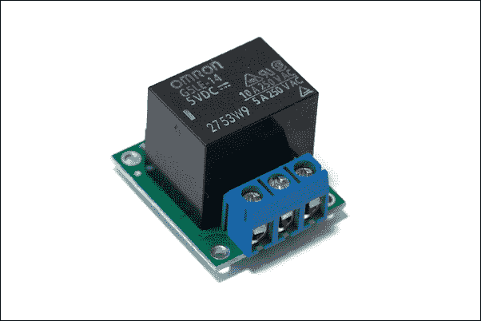
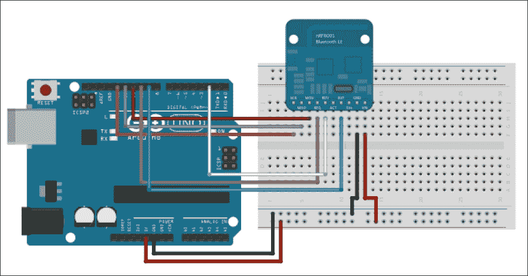
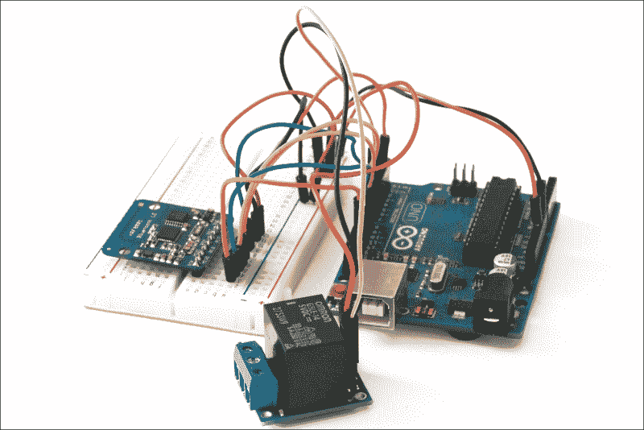
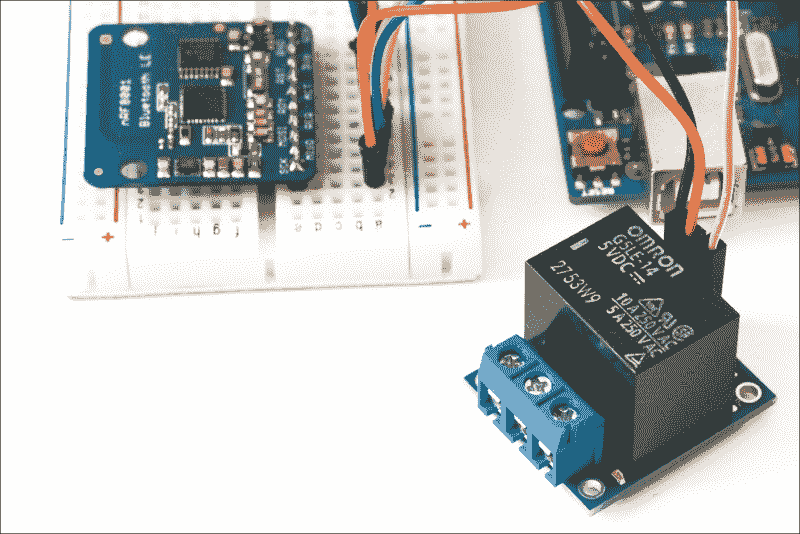
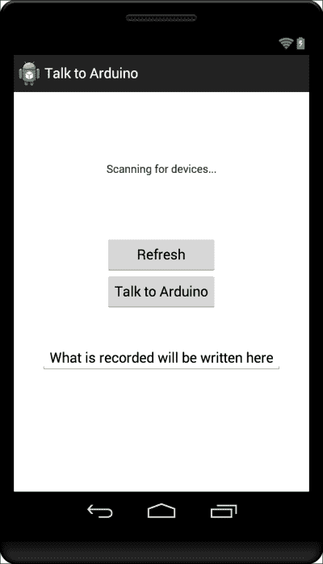

# 第七章。语音激活 Arduino

在本章中，我们将使用安卓设备的一个新特性来控制 Arduino 系统：语音识别。我们将通过从手机发送语音命令来控制连接到 Arduino 板上的继电器。

这个继电器可以连接到很多东西。例如，它可以连接到电动门锁，这样你只需对着手机说话就可以打开和关闭门。你还可以将继电器连接到灯泡，通过向手机发出语音命令来开关灯泡。

在本章中，你将学习如何：

+   将一个继电器和一个蓝牙模块连接到 Arduino 板，以便可以从 Android 应用程序中控制它

+   使用 Android 语音 API 构建应用程序

+   通过语音控制 Arduino 板上的继电器

# 硬件和软件要求

对于这个项目，你首先需要一块 Arduino Uno 板。

然后你需要一个 BLE 模块。我们选择了 Adafruit nRF8001 芯片，因为它附带了一个不错的 Arduino 库，并且已经有现成的 Android 应用程序示例来控制该模块。

你还需要一个继电器模块。对于这个项目，我们使用了 Polulu 的 5V 继电器模块，这与我们在前几章中使用的是同一个。这是本章中我们使用的继电器的图片：



最后，为了进行不同的电气连接，你还需要一个面板和一些跳线。

这是你需要为这个项目准备的所有硬件组件列表，以及如何在网络上找到这些组件的链接：

+   Arduino Uno 板（[`www.adafruit.com/product/50`](http://www.adafruit.com/product/50)）

+   5V 继电器模块（[`www.pololu.com/product/2480`](http://www.pololu.com/product/2480)）

+   Adafruit nRF8001 扩展板（[`www.adafruit.com/products/1697`](https://www.adafruit.com/products/1697)）

+   面板（[`www.adafruit.com/product/64`](https://www.adafruit.com/product/64)）

+   跳线（[`www.adafruit.com/product/758`](https://www.adafruit.com/product/758)）

注意，这些都是我们在前几章中已经使用过的组件。

在软件方面，你需要以下内容：

+   Arduino IDE（[`arduino.cc/en/Main/Software`](http://arduino.cc/en/Main/Software)）

+   Arduino aREST 库（[`github.com/marcoschwartz/aREST/`](https://github.com/marcoschwartz/aREST/)）

+   用于 BLE 芯片的 nRF8001 Arduino 库（[`github.com/adafruit/Adafruit_nRF8001`](https://github.com/adafruit/Adafruit_nRF8001)）

要安装一个特定的库，只需将文件夹提取到你的`Arduino/libraries`文件夹中（如果尚不存在，则创建此文件夹）。

## 配置硬件

现在我们将构建项目的硬件部分。为了帮助你，以下是无继电器连接的项目原理图：



注意，这些说明与上一章相同。因此，如果您仍然在桌子上构建了相同的配置，您可以直接使用相同的配置。

第一步是将蓝牙模块放置在面包板上。然后，将 Arduino 板上的电源连接到面包板：Arduino 板的 5V 连接到红色电源轨，**GND**连接到蓝色电源轨。

我们现在将连接 BLE 模块。首先，连接模块的电源：**GND**连接到蓝色电源轨，**VIN**连接到红色电源轨。之后，您需要连接负责 SPI 接口的不同电线：**SCK**连接到 Arduino 引脚**13**，**MISO**连接到 Arduino 引脚**12**，**MOSI**连接到 Arduino 引脚**11**。然后，将**REQ**引脚连接到 Arduino 引脚**10**。最后，将**RDY**引脚连接到 Arduino 引脚**2**，将**RST**引脚连接到 Arduino 引脚**9**。

对于继电器模块，将**VCC**引脚连接到面包板上的红色电源轨，将**GND**引脚连接到蓝色电源轨。最后，将继电器的**SIG**引脚连接到 Arduino 板的**7**号引脚。

下图是组装好的项目的概述图（有关元件之间的精确连接，请参阅前面的说明）：



可以看到继电器和 BLE 模块的特写图像如下：



# 编写 Arduino 草图

我们现在将编写草图以从 Android 设备控制继电器。请注意，这与上一章中的草图相同，所以如果您已经在上一个章节中完成了这部分，您可以跳过它。以下是本部分的完整草图：

```java
// Control Arduino board from BLE

// Libraries
#include <SPI.h>
#include "Adafruit_BLE_UART.h"
#include <aREST.h>

// Pins
#define ADAFRUITBLE_REQ 10
#define ADAFRUITBLE_RDY 2   // Should be pin 2 or 3
#define ADAFRUITBLE_RST 9

// Relay pin
const int relay_pin = 7;

// Create aREST instance
aREST rest = aREST();

// BLE instance
Adafruit_BLE_UART BTLEserial = Adafruit_BLE_UART(ADAFRUITBLE_REQ, ADAFRUITBLE_RDY, ADAFRUITBLE_RST);

void setup(void)
{  
  // Start Serial
  Serial.begin(115200);

  // Start BLE
  BTLEserial.begin();

  // Give name and ID to device
  rest.set_id("001");
  rest.set_name("relay_control");

   // Init relay pin
  pinMode(relay_pin,OUTPUT);
}

void loop() {  

  // Tell the nRF8001 to do whatever it should be working on.
  BTLEserial.pollACI();

  // Ask what is our current status
  aci_evt_opcode_t status = BTLEserial.getState();

  // Handle REST calls
  if (status == ACI_EVT_CONNECTED) {
    rest.handle(BTLEserial);
  }
 }
```

现在，让我们看看草图的细节。它首先导入 nRF8001 模块和 aREST 库所需的库：

```java
#include <SPI.h>
#include "Adafruit_BLE_UART.h"
#include <aREST.h>
```

然后，我们将定义 BLE 模块连接到的引脚：

```java
#define ADAFRUITBLE_REQ 10
#define ADAFRUITBLE_RDY 2     // This should be an interrupt pin, on Uno thats #2 or #3
#define ADAFRUITBLE_RST 9
```

我们还需要声明继电器连接到的引脚：

```java
const int relay_pin = 7;
```

在此之后，我们可以创建一个用于处理通过蓝牙传入的请求的 aREST API 实例：

```java
aREST rest = aREST();
```

我们还将创建 nRF8001 芯片库的实例：

```java
Adafruit_BLE_UART BTLEserial = Adafruit_BLE_UART(ADAFRUITBLE_REQ, ADAFRUITBLE_RDY, ADAFRUITBLE_RST);
```

现在，在草图中的`setup()`函数中，我们将初始化串行通信并打印一条欢迎信息，如下所示：

```java
BTLEserial.begin();
```

我们还将为设备命名：

```java
rest.set_id("001");
rest.set_name("relay_control");
```

最后，我们将设置继电器引脚，使其成为输出：

```java
pinMode(relay_pin,OUTPUT);
```

现在，在草图中的`loop()`函数中，我们将检查 BLE 芯片的状态：

```java
BTLEserial.pollACI();
aci_evt_opcode_t status = BTLEserial.getState();
```

然后，如果任何设备连接到芯片，我们将使用 aREST 库处理任何传入的请求：

```java
if (status == ACI_EVT_CONNECTED) {
  rest.handle(BTLEserial);
}
```

注意，本章的所有代码都可以在本书的 GitHub 仓库[`github.com/marcoschwartz/arduino-android-blueprints`](https://github.com/marcoschwartz/arduino-android-blueprints)中找到。

现在是时候将草图上传到您的 Arduino 板上了。完成此操作后，您可以继续开发 Android 应用，通过 BLE 草图控制 Arduino 板。

## 设置 Android 应用

在这个项目中，我们将实现一个利用语音识别 API 的 Android 应用程序，并将输出文本在`EditText`字段中。在后台，我们还将包括 BLE 服务，以便连接到 BLE 模块并能够向其发送消息。一旦我们设置了 BLE 和语音识别 API，我们就可以通过设置条件将它们连接起来，如果语音被识别为`开启`，则继电器将开启，而如果被识别为`关闭`，则继电器将关闭。

我们将假设您已经在首选项中切换了`自动导入`功能。如果没有，请通过转到**自动导入**首选项并选择所有可用选项来激活它。**自动导入**首选项在 Mac 和 Windows 上的位置如下：

+   在 Mac 上，导航到**Android Studio** > **首选项** > **编辑器** > **自动导入**

+   在 Windows 上，导航到**文件** > **设置** > **编辑器** > **自动导入**

在所有必要的设置就绪后，我们将首先创建一个新的项目，在**新建项目**设置中选择以下内容：

+   **名称**: `与 Arduino 对话`

+   **最小 SDK**: `18`

+   **项目**: `空白活动`

+   **活动名称**: `MainScreen`

+   **域名**: `arduinoandroid.com`

为了使这个项目工作，我们首先需要转到 Android 的`Manifest`文件，该文件位于`app` > `src` > `main` > `java` > `包名` > `AndroidManifest.xml`。

## 设计 Android 用户界面和权限

一旦我们打开文件，我们需要添加访问蓝牙功能的权限；这将允许我们向 Arduino 传输语音消息。以下两行 XML 需要添加到 Android 的`Manifest`文件中：

```java
    <uses-permission android:name="android.permission.BLUETOOTH"/>
    <uses-permission android:name="android.permission.BLUETOOTH_ADMIN"/>
```

我们接下来要做的步骤是设置一个非常基本的 Android 布局文件，以便我们能够实现应用程序的功能，并允许用户激活语音识别意图。

在我们的项目中，我们将导航到主布局文件，该文件可以通过`app` > `src` > `res` > `layout` > `activity_speech.xml`访问。

通过用以下代码替换当前代码，我们将添加一个包含两个按钮、一个`EditText`字段和一个`TextView`字段的相对布局，这将使我们能够看到语音输入的结果：

```java
<RelativeLayout 

    android:layout_width="match_parent"
    android:layout_height="match_parent"
    android:paddingLeft="@dimen/activity_horizontal_margin"
    android:paddingRight="@dimen/activity_horizontal_margin"
    android:paddingTop="@dimen/activity_vertical_margin"
    android:paddingBottom="@dimen/activity_vertical_margin"
    tools:context=".SpeechActivity">

    <Button
        android:layout_width="wrap_content"
        android:layout_height="wrap_content"
        android:text="Talk to Arduino"
        android:id="@+id/talktoArduino"
        android:layout_centerVertical="true"
        android:layout_centerHorizontal="true" />

    <EditText
        android:layout_width="wrap_content"
        android:layout_height="wrap_content"
        android:id="@+id/recordedTalk"
        android:text="What is recorded will be written here"
        android:layout_alignParentBottom="true"
        android:layout_centerHorizontal="true"
        android:layout_marginBottom="139dp" />

    <TextView
        android:layout_width="wrap_content"
        android:layout_height="wrap_content"
        android:textAppearance="?android:attr/textAppearanceSmall"
        android:text="Bluetooth Output"
        android:id="@+id/btView"
        android:layout_marginTop="76dp"
        android:layout_alignParentTop="true"
        android:layout_centerHorizontal="true" />

    <Button
        android:layout_width="wrap_content"
        android:layout_height="wrap_content"
        android:text="Refresh"
        android:id="@+id/refreshBtn"
        android:layout_above="@+id/talktoArduino"
        android:layout_alignStart="@+id/talktoArduino"
        android:layout_alignEnd="@+id/talktoArduino" />
</RelativeLayout>
```

## 编写应用程序的内部代码

然后，我们将转到`MainScreen.java`文件，该文件位于`app` > `src` > `main` > `java` > `包名` > `MainScreen.java`。

然后，我们将用以下代码替换当前代码，我们将逐步讲解，并启用**自动导入**；Android Studio 将自动导入我们项目所需的所有语句。

### 注意

您可以自由地通过 GitHub 仓库跟随项目，那里提供了我们书中用户所需的所有源代码。仓库地址为[`github.com/marcoschwartz/arduino-android-blueprints/tree/master/chapter7/TalktoArduino`](https://github.com/marcoschwartz/arduino-android-blueprints/tree/master/chapter7/TalktoArduino)。

我们将从声明扩展`Activity`的类开始：

```java
public class SpeechActivity extends Activity {
```

以下是需要声明的所有变量，以便与 BLE 模块一起工作，用于日志记录的日志标签，用户界面元素，以及用于语音识别请求的蓝牙特征：

```java
    private static final int VOICE_RECOGNITION_REQUEST = 1;

    //Getting the name for Log Tags
    private final String LOG_TAG = SpeechActivity.class.getSimpleName();

    //Declare U.I Elements
    private Button startTalk;
    private Button refresh;
    private EditText speechInput;
    private TextView btv;

    // UUIDs for UAT service and associated characteristics.
    public static UUID UART_UUID = UUID.fromString("6E400001-B5A3-F393-E0A9-E50E24DCCA9E");
    public static UUID TX_UUID = UUID.fromString("6E400002-B5A3-F393-E0A9-E50E24DCCA9E");
    public static UUID RX_UUID = UUID.fromString("6E400003-B5A3-F393-E0A9-E50E24DCCA9E");
    // UUID for the BTLE client characteristic which is necessary for notifications.
    public static UUID CLIENT_UUID = UUID.fromString("00002902-0000-1000-8000-00805f9b34fb");

    // BTLE stateta
    private BluetoothAdapter adapter;
    private BluetoothGatt gatt;
    private BluetoothGattCharacteristic tx;
    private BluetoothGattCharacteristic rx;

    private boolean areServicesAccessible = false;
```

在`OnCreate()`方法中，我们将初始化我们之前实现的用户界面布局，并将用户界面元素连接到我们代码中的不同方法：

```java
    @Override
    protected void onCreate(Bundle savedInstanceState) {
        super.onCreate(savedInstanceState);
        setContentView(R.layout.activity_speech);
        startTalk = (Button) findViewById(R.id.talktoArduino);
        refresh = (Button) findViewById(R.id.refreshBtn);
        speechInput = (EditText) findViewById(R.id.recordedTalk);
        btv = (TextView) findViewById(R.id.btView);

        startTalk.setOnClickListener(new View.OnClickListener() {
            @Override
            public void onClick(View view) {
                recordSpeech();
            }
        });

        refresh.setOnClickListener(new View.OnClickListener() {
            @Override
            public void onClick(View view) {
                restartScan();
            }
        });

    }
```

`recordSpeech()`方法允许我们启动 Google 语音识别意图，我们可以修改将显示给用户的消息。在这种情况下，我们决定用提示“您现在可以向 Arduino 发送命令”替换默认文本：

```java
    public void recordSpeech() {

        Intent intent = new Intent(RecognizerIntent.ACTION_RECOGNIZE_SPEECH);

        intent.putExtra(RecognizerIntent.EXTRA_LANGUAGE_MODEL, RecognizerIntent.LANGUAGE_MODEL_FREE_FORM);

        intent.putExtra(RecognizerIntent.EXTRA_PROMPT, "You can now send a command to the Arduino");

        startActivityForResult(intent, VOICE_RECOGNITION_REQUEST);
    }
```

`onActivityResult()`方法允许应用程序处理已识别的内容，并根据接收到的内容实现方法。在以下方法中，我们将识别出的语音输出到我们之前设置的`EditText`字段中，并根据输出结果，通过 BLE 发送命令来打开或关闭继电器：

```java
    @Override

    protected void onActivityResult(int requestCode, int resultCode, Intent data) {

        if (requestCode == VOICE_RECOGNITION_REQUEST && resultCode == RESULT_OK) {

            ArrayList<String> matches = data.getStringArrayListExtra(RecognizerIntent.EXTRA_RESULTS);

            String userInput = matches.get(0);

            TextView textSaid = (TextView) findViewById(R.id.recordedTalk);

            textSaid.setText(matches.get(0));

            //add an if else loop or case statement

            if (userInput.equalsIgnoreCase("switch on")) {
                String setOutputMessage = "/digital/7/1 /";
                tx.setValue(setOutputMessage.getBytes(Charset.forName("UTF-8")));
                if (gatt.writeCharacteristic(tx)) {
                    writeSensorData("Sent: " + setOutputMessage);
                } else {
                    writeSensorData("Couldn't write TX characteristic!");
                }
            } else if (userInput.equalsIgnoreCase("switch off")) {
                String setOutputMessage = "/digital/7/0 /";
                tx.setValue(setOutputMessage.getBytes(Charset.forName("UTF-8")));
                if (gatt.writeCharacteristic(tx)) {
                    writeSensorData("Sent: " + setOutputMessage);
                } else {
                    writeSensorData("Couldn't write TX characteristic!");
                }
            }

        }
        super.onActivityResult(requestCode, resultCode, data);
    }
```

以下代码处理确保蓝牙回调输出被发送到其关联的`TextView`：

```java
    private void writeSensorData(final CharSequence text) {
        Log.e(LOG_TAG, text.toString());
        btv.setText(text.toString());
    }
```

在这里，我们将处理所有需要实现以连接到 BLE 模块的`BluetoothGattCallback`类：

```java
    // BTLE device scanning bluetoothGattCallback.

    // Main BTLE device bluetoothGattCallback where much of the logic occurs.
    private BluetoothGattCallback bluetoothGattCallback = new BluetoothGattCallback() {
        // Called whenever the device connection state changes, i.e. from disconnected to connected.
        @Override
        public void onConnectionStateChange(BluetoothGatt gatt, int status, int newState) {
            super.onConnectionStateChange(gatt, status, newState);
            if (newState == BluetoothGatt.STATE_CONNECTED) {
                writeSensorData("Connected!");
                // Discover services.
                if (!gatt.discoverServices()) {
                    writeSensorData("Failed to start discovering services!");
                }
            } else if (newState == BluetoothGatt.STATE_DISCONNECTED) {
                writeSensorData("Disconnected!");
            } else {
                writeSensorData("Connection state changed.  New state: " + newState);
            }
        }

        // Called when services have been discovered on the remote device.
        // It seems to be necessary to wait for this discovery to occur before
        // manipulating any services or characteristics.
        public void onServicesDiscovered(BluetoothGatt gatt, int status) {
            super.onServicesDiscovered(gatt, status);
            if (status == BluetoothGatt.GATT_SUCCESS) {
                writeSensorData("Service discovery completed!");
            } else {
                writeSensorData("Service discovery failed with status: " + status);
            }
            // Save reference to each characteristic.
            tx = gatt.getService(UART_UUID).getCharacteristic(TX_UUID);
            rx = gatt.getService(UART_UUID).getCharacteristic(RX_UUID);

            // Setup notifications on RX characteristic changes (i.e. data received).
            // First call setCharacteristicNotification to enable notification.
            if (!gatt.setCharacteristicNotification(rx, true)) {
                writeSensorData("Couldn't set notifications for RX characteristic!");
            }

            // Next update the RX characteristic's client descriptor to enable notifications.
            if (rx.getDescriptor(CLIENT_UUID) != null) {
                BluetoothGattDescriptor desc = rx.getDescriptor(CLIENT_UUID);
                desc.setValue(BluetoothGattDescriptor.ENABLE_NOTIFICATION_VALUE);
                if (!gatt.writeDescriptor(desc)) {
                    writeSensorData("Couldn't write RX client descriptor value!");
                }
            } else {
                writeSensorData("Couldn't get RX client descriptor!");
            }
            areServicesAccessible = true;
        }
    };
```

在以下`onStart()`和`onStop()`方法中，我们确保开始扫描 BLE 设备，并在关闭应用程序时停止蓝牙扫描，以防止电池耗尽并确保优化前台运行的任务的设备内存资源：

```java
    protected void onStart() {
        Log.d(LOG_TAG,"onStart has been called");
        super.onStart();
        // / Scan for all BTLE devices.
        // The first one with the UART service will be chosen--see the code in the scanCallback.
        adapter = BluetoothAdapter.getDefaultAdapter();
        startScan();
    }

    //When this Activity isn't visible anymore
    protected void onStop() {
        Log.d(LOG_TAG,"onStop has been called");
        //disconnect and close Bluetooth Connection for better reliability
        if (gatt != null) {
            gatt.disconnect();
            gatt.close();
            gatt = null;
            tx = null;
            rx = null;
        }
        super.onStop();
    }
```

以下方法处理蓝牙扫描回调的启动、停止和重新启动：

```java
    private void startScan() {
        if (!adapter.isEnabled()) {
            adapter.enable();
        }
        if (!adapter.isDiscovering()) {
            adapter.startDiscovery();
        }
        writeSensorData("Scanning for devices...");
        adapter.startLeScan(scanCallback);
    }

    private void stopScan() {
        if (adapter.isDiscovering()) {
            adapter.cancelDiscovery();
        }
        writeSensorData("Stopping scan");
        adapter.stopLeScan(scanCallback);
    }

    private void restartScan() {
        stopScan();
        startScan();
    }
```

`scanCallback()`方法主要关注获取蓝牙设备地址和保持 Android 设备和 BLE 模块之间必要连接的主要逻辑：

```java
    /**
     * Main callback following an LE device scan
     */
    private BluetoothAdapter.LeScanCallback scanCallback = new BluetoothAdapter.LeScanCallback() {
        // Called when a device is found.
        @Override
        public void onLeScan(BluetoothDevice bluetoothDevice, int i, byte[] bytes) {
            Log.d(LOG_TAG, bluetoothDevice.getAddress());

            writeSensorData("Found device: " + bluetoothDevice.getAddress());

            // Check if the device has the UART service.
            if (BluetoothUtils.parseUUIDs(bytes).contains(UART_UUID)) {
                // Found a device, stop the scan.
                adapter.stopLeScan(scanCallback);
                writeSensorData("Found UART service!");
                // Connect to the device.
                // Control flow will now go to the bluetoothGattCallback functions when BTLE events occur.
                gatt = bluetoothDevice.connectGatt(getApplicationContext(), false, bluetoothGattCallback);
            }
        }
    };
}
```

与本书的前几章相比，您会注意到我们将 UUID 解析转移到了`utility`类中，以便重构代码并使我们的代码更易于阅读。为了创建一个`utility`类，我们首先需要右键点击我们的包名，创建一个新的包，并将其命名为`Bluetooth`。

在此之后，我们将右键点击新包，选择**新建** > **Java 类**，并将新类命名为`BluetoothUtils`。

在这两个步骤之后，我们将替换类中的代码为以下代码：

```java
public class BluetoothUtils {

    // Filtering by custom UUID is broken in Android 4.3 and 4.4, see:
    //   http://stackoverflow.com/questions/18019161/startlescan-with-128-bit-uuids-doesnt-work-on-native-android-ble-implementation?noredirect=1#comment27879874_18019161
    // This is a workaround function from the SO thread to manually parse advertisement data.
    public static List<UUID> parseUUIDs(final byte[] advertisedData) {
        List<UUID> uuids = new ArrayList<UUID>();

        int offset = 0;
        while (offset < (advertisedData.length - 2)) {
            int len = advertisedData[offset++];
            if (len == 0)
                break;

            int type = advertisedData[offset++];
            switch (type) {
                case 0x02: // Partial list of 16-bit UUIDs
                case 0x03: // Complete list of 16-bit UUIDs
                    while (len > 1) {
                        int uuid16 = advertisedData[offset++];
                        uuid16 += (advertisedData[offset++] << 8);
                        len -= 2;
                        uuids.add(UUID.fromString(String.format("%08x-0000-1000-8000-00805f9b34fb", uuid16)));
                    }
                    break;
                case 0x06:// Partial list of 128-bit UUIDs
                case 0x07:// Complete list of 128-bit UUIDs
                    // Loop through the advertised 128-bit UUID's.
                    while (len >= 16) {
                        try {
                            // Wrap the advertised bits and order them.
                            ByteBuffer buffer = ByteBuffer.wrap(advertisedData, offset++, 16).order(ByteOrder.LITTLE_ENDIAN);
                            long mostSignificantBit = buffer.getLong();
                            long leastSignificantBit = buffer.getLong();
                            uuids.add(new UUID(leastSignificantBit,
                                    mostSignificantBit));
                        } catch (IndexOutOfBoundsException e) {
                            // Defensive programming.
                            //Log.e(LOG_TAG, e.toString());
                            continue;
                        } finally {
                            // Move the offset to read the next uuid.
                            offset += 15;
                            len -= 16;
                        }
                    }
                    break;
                default:
                    offset += (len - 1);
                    break;
            }
        }
        return uuids;
    }
}
```

一旦你包含了这段代码，你就可以在你的安卓物理设备上构建并运行这个应用，该设备运行 Android 4.3 或更高版本，并且连接到互联网，因为大多数语音识别服务都是通过互联网工作的。

当你加载应用时，你应该从以下内容开始：



## 如何更进一步

这个基础项目提供了无限的可能性，你可能会包含其他可识别的命令，以便连接其他组件和传感器，从而增强你语音激活应用的功能。我们希望这个基础项目能够激发你进一步改进你的项目。

# 摘要

让我们总结一下本章所做的工作。像往常一样，我们将一个 BLE 模块连接到 Arduino 板上，以便它可以通过安卓手机接收命令。我们还连接了一个简单的继电器模块到板上，通过安卓应用程序来控制它。然后我们设计了一个应用，使用安卓语音引擎根据用户对安卓手机说的话来控制继电器。

在下一章中，我们将使用安卓手机的另一个功能来控制 Arduino 项目：NFC。我们将使用 NFC 通过将手机放在 Arduino NFC 保护板前，来控制继电器的状态。
