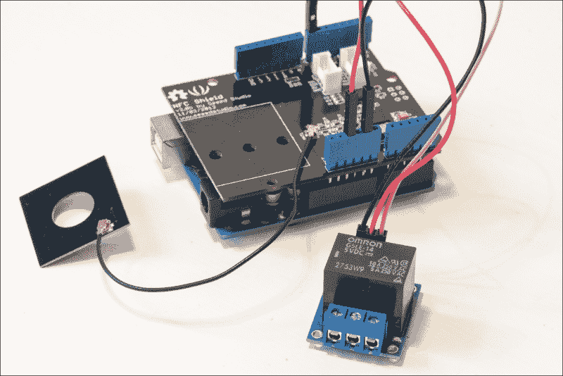
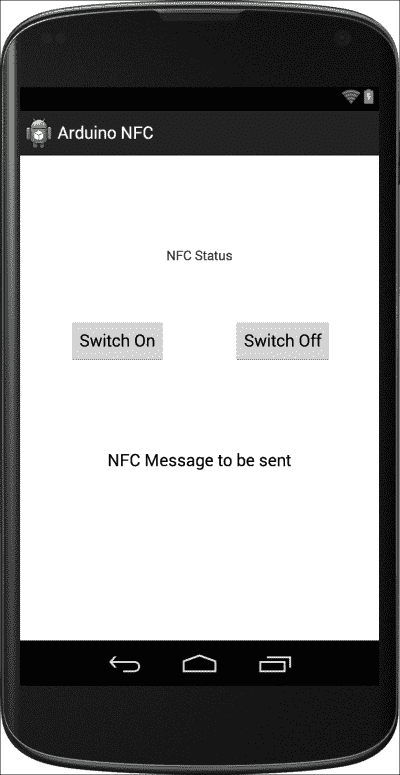

# 第八章 控制通过 NFC 的 Arduino 板

在本章中，我们将看到将 Arduino **近场通信**（**NFC**）盾牌从 Seeed Studio 集成到具有 NFC 功能的 Android 应用程序的能力，该应用程序使用**Android Beam**技术将消息从 Android 应用程序发送到 NFC 盾牌天线。NFC 允许两个靠近的设备之间进行即时通信，这使得它成为打开门锁或支付服务的完美技术。

在本章中，我们将制作一个智能家居应用程序。NFC 盾牌将连接到 Arduino Uno 板，以及继电器。因此，我们将能够根据 Android 应用程序发送的消息切换继电器的开关。

这个基线项目将帮助你开发使用 NFC 的有趣项目，并可能扩展此类项目的功能。

以下将是本章的主要收获：

+   将 NFC 盾牌连接到 Arduino 板

+   构建一个与 NFC Arduino 盾牌通信的 Android 应用程序

+   通过 NFC 从 Android 设备打开和关闭继电器

# 硬件和软件要求

对于这个项目，你首先需要一块 Arduino Uno 板。

然后，你需要一个 NFC 盾牌。市场上有很多 NFC 盾牌，但为了这个项目，我们选择了来自 SeeedStudio 的 NFC 盾牌 V2.0。我们做出这个选择是因为该盾牌有良好的文档，并且因为已经有了一些示例代码可用。

你还需要一个继电器模块。对于这个项目，我们使用了 Polulu 的 5V 继电器模块。

最后，为了进行不同的电气连接，你需要一些跳线。

以下是你将需要用于此项目的所有硬件组件列表，以及在网上找到这些组件的链接：

+   Arduino Uno 板（[`www.adafruit.com/product/50`](http://www.adafruit.com/product/50)）

+   5V 继电器模块（[`www.pololu.com/product/2480`](http://www.pololu.com/product/2480)）

+   Arduino NFC 盾牌（[`www.seeedstudio.com/depot/nfc-shield-v20-p-1370.html`](http://www.seeedstudio.com/depot/nfc-shield-v20-p-1370.html)）

+   面包板（[`www.adafruit.com/product/64`](https://www.adafruit.com/product/64)）

+   跳线（[`www.adafruit.com/product/758`](https://www.adafruit.com/product/758)）

在软件方面，你当然需要 Arduino IDE。你还需要以下库来使 NFC 芯片工作：

1.  首先，下载 PN532 库（[`github.com/Seeed-Studio/PN532`](https://github.com/Seeed-Studio/PN532)），并将所有文件夹放入 Arduino 的`libraries`文件夹中。

1.  然后，下载 NDEF 库（[`github.com/don/NDEF`](https://github.com/don/NDEF)），并将其放入 Arduino 的`libraries`文件夹中，并将文件夹重命名为`NDEF`。

## 配置硬件

现在，让我们组装项目。第一步是将 NFC 盾牌放在 Arduino Uno 板上，并将 NFC 读取器连接到盾牌。请注意，NFC 可能没有焊接引脚；在这种情况下，您需要自己焊接盾牌上的引脚。要将 NFC 读取器连接到盾牌，只需通过盾牌上的天线连接器连接读取器即可。

现在，让我们连接继电器。只需将继电器模块的**VCC**引脚连接到 Arduino 板的 5V 引脚，将**GND**引脚连接到板的**GND**引脚。最后，将继电器的**SIG**引脚连接到 Arduino 板的**8**号引脚。

以下是你应该得到的结果：



## 测试 NFC 盾牌

在编写通过 NFC 控制继电器的应用程序之前，我们首先确保盾牌功能正常，并且所有库都已正确安装。为此，我们将编写一个简单的 Arduino 草图。以下是这个部分的完整代码：

```java
#include <SPI.h>
#include <PN532_SPI.h>
#include <PN532.h>
#include <NfcAdapter.h>

// NFC instances
PN532_SPI pn532spi(SPI, 10);
NfcAdapter nfc = NfcAdapter(pn532spi);

void setup(void) {

  // Start Serial
  Serial.begin(9600);

  // Start NFC chip
  Serial.println("NFC shield started");
  nfc.begin();
}

void loop(void) {

  // Start scan
  Serial.println("\nScan a NFC tag\n");
  if (nfc.tagPresent())
  {
    NfcTag tag = nfc.read();
    tag.print();
  }
  delay(5000);
}
```

让我们现在看看这个草图的细节。它首先包含所需的库：

```java
#include <SPI.h>
#include <PN532_SPI.h>
#include <PN532.h>
#include <NfcAdapter.h>
```

然后，我们可以使用这两行代码创建 NFC 适配器的实例：

```java
PN532_SPI pn532spi(SPI, 10);
NfcAdapter nfc = NfcAdapter(pn532spi);
```

现在，在草图的`setup()`函数中，我们将初始化串行通信：

```java
Serial.begin(9600);
```

我们还将启动 NFC 芯片，并在串行监视器上打印一条消息：

```java
nfc.begin();
Serial.println("NFC shield started");
```

现在，在草图的`loop()`函数中，我们将检查是否存在 NFC 标签，如果是这样，我们将读取它：

```java
if (nfc.tagPresent())
{
  NfcTag tag = nfc.read();
  tag.print();
}
  delay(5000);
}
```

### 注意

注意，本书的 GitHub 仓库[`github.com/marcoschwartz/arduino-android-blueprints`](https://github.com/marcoschwartz/arduino-android-blueprints)中可以找到本章的所有代码。

现在，您可以将草图上传到 Arduino 板，并打开串行监视器。您应该看到 NFC 芯片正在初始化，然后它开始检查可用的标签。如果您有一个简单的 NFC 标签，您现在可以测试它了。

例如，您也可以使用来自 SeeedStudio 的简单标签([`www.seeedstudio.com/depot/MifareOne-RFID-Tag-1356MHz-p-923.html`](http://www.seeedstudio.com/depot/MifareOne-RFID-Tag-1356MHz-p-923.html))。

这些标签实际上比实际的 RFID 技术要简单，但它们足以测试我们的项目。

# 编写 Arduino 草图

现在，我们将编写将接收来自 Android NFC 应用的命令的代码。此代码的目标是当 NFC 盾牌从 Android 设备接收到给定代码时切换继电器的开或关。由于这部分代码相当长，我们将将其分成几个部分，分别详细说明。

代码首先包含所需的库：

```java
#include "SPI.h"
#include "PN532_SPI.h"
#include "snep.h"
#include "NdefMessage.h"
```

我们还将定义继电器连接的引脚：

```java
#define RELAY_PIN 8
```

然后，我们将定义从 Android 应用接收的代码，以切换继电器的开或关：

```java
#define RELAY_ON "oWnHV6uXre"
```

我们还需要创建 NFC 芯片的实例：

```java
PN532_SPI pn532spi(SPI, 10);
SNEP nfc(pn532spi);
```

要存储通过 NFC 从 Android 手机来的数据，我们将创建一个 `char` 缓冲区：

```java
uint8_t ndefBuf[128];
```

在草图中的 `setup()` 函数中，我们将开始串行通信：

```java
Serial.begin(9600);
Serial.println("NFC Peer to Peer Light Switch");
```

我们还将声明继电器引脚为输出：

```java
pinMode(RELAY_PIN, OUTPUT);
```

现在，在 `loop()` 函数中，我们将不断检查通过 NFC 从手机来的数据：

```java
Serial.println("Waiting for message from Peer");
int msgSize = nfc.read(ndefBuf, sizeof(ndefBuf));
```

现在，如果消息的大小不为零，我们将存储它，处理它，然后检查它是否包含我们之前定义的正确密钥。如果是这样，我们将切换继电器的状态。以下代码块正是执行相同的操作：

```java
if (msgSize > 0) {

    // Read message
    NdefMessage message  = NdefMessage(ndefBuf, msgSize);

    // Make sure there is at least one NDEF Record
    if (message.getRecordCount() > 0) {

      NdefRecord record = message.getRecord(0);
      Serial.println("Got first record");

      // Check the TNF and Record Type
      if (record.getTnf() == TNF_MIME_MEDIA && record.getType() == "application/com.arduinoandroid.arduinonfc") {
        Serial.println("Type is OK");

        // Get the bytes from the payload
        int payloadLength = record.getPayloadLength();
        byte payload[payloadLength];
        record.getPayload(payload);

        // Convert the payload to a String
        String payloadAsString = "";
        for (int c = 0; c < payloadLength; c++) {
          payloadAsString += (char)payload[c];
        }

        // Print out the data on the Serial monitor
        Serial.print("Payload is ");Serial.println(payloadAsString);

        // Modify the state of the light, based on the tag contents
        if (payloadAsString == RELAY_ON) {
            digitalWrite(RELAY_PIN, HIGH);
        } else {
            digitalWrite(RELAY_PIN, LOW);    
        }
      } else {
        Serial.print("Expecting TNF 'Mime Media' (0x02) with type 'application/com.arduinoandroid.arduinonfc' but found TNF ");
        Serial.print(record.getTnf(), HEX);
        Serial.print(" type ");
        Serial.println(record.getType());
      }
    }
  }
}
```

注意，本章的所有代码都可以在书的 GitHub 仓库中找到，网址为 [`github.com/marcoschwartz/arduino-android-blueprints`](https://github.com/marcoschwartz/arduino-android-blueprints)。

您现在可以将代码上传到 Arduino 板，并继续开发 Android 应用程序。

## 设置 Android 应用

在这个项目中，我们将实现一个利用 NFC API 和硬件的 Android 应用，允许我们发送 MIME-type 消息来切换继电器的开关。

我们假设您已经在您的首选项中打开了 `自动导入` 功能。如果没有，请通过转到 **自动导入** 首选项并选择所有可用选项来激活它。**自动导入** 首选项在 Mac 和 Windows 上的位置如下：

+   在 Mac 上，导航到 **Android Studio** > **首选项**| **编辑器**| **自动导入**

+   在 Windows 上，导航到 **文件** | **设置** > **编辑器** > **自动导入**

在所有必要的设置到位后，我们首先创建一个新的项目，在 **New Project** 设置中，我们将选择以下内容：

+   **名称**：`Arduino NFC`

+   **最小 SDK**：`18`

+   **项目**：`Blank Activity`

+   **活动名称**：MainScreen

+   **域名**：`arduinoandroid.com`

为了使这个项目工作，我们首先需要转到 Android 的 `Manifest` 文件，该文件位于 `app` > `src` > `main` > `AndroidManifest.xml`。

## 布局 Android 用户界面和权限

一旦我们打开文件，我们需要添加权限，以便 Android 应用能够访问 NFC 硬件。我们需要在我们的 `AndroidManifest.xml` 文件中添加以下两行代码，以便访问用户权限和实际 NFC 硬件：

```java
<uses-permission android:name="android.permission.NFC" />
<uses-feature android:name="android.hardware.nfc" android:required="true" />
```

下一步是设置基本的 Android 布局文件。这将允许我们实现一个由两个按钮（开关）和一个文本视图组成用户界面。

TextView 中的文本将是我们将发送到我们的 NFC 防护罩的消息。第一步是导航到 Android 布局文件，该文件位于 `app` > `src` > `res` > `layout` > `activity_nfc.xml`。

一旦我们在这个布局文件中，我们将切换到 Android 布局文件的文本视图，并将当前代码替换为以下代码行：

```java
<RelativeLayout 

    android:layout_width="match_parent"
    android:layout_height="match_parent"
    android:paddingLeft="@dimen/activity_horizontal_margin"
    android:paddingRight="@dimen/activity_horizontal_margin"
    android:paddingTop="@dimen/activity_vertical_margin"
    android:paddingBottom="@dimen/activity_vertical_margin"
    tools:context=".NFCActivity">

    <TextView
        android:text="NFC Status"
        android:layout_width="wrap_content"
        android:layout_height="wrap_content"
        android:id="@+id/nfcTextStatus"
        android:layout_marginTop="83dp"
        android:layout_alignParentTop="true"
        android:layout_centerHorizontal="true" />

    <Button
        android:layout_width="wrap_content"
        android:layout_height="wrap_content"
        android:text="Switch On"
        android:id="@+id/switchOnBtn"
        android:layout_marginTop="59dp"
        android:layout_below="@+id/nfcTextStatus"
        android:layout_toLeftOf="@+id/nfcTextStatus"
        android:layout_toStartOf="@+id/nfcTextStatus" />

    <Button
        android:layout_width="wrap_content"
        android:layout_height="wrap_content"
        android:text="Switch Off"
        android:id="@+id/switchOffBtn"
        android:layout_alignTop="@+id/switchOnBtn"
        android:layout_toRightOf="@+id/nfcTextStatus"
        android:layout_toEndOf="@+id/nfcTextStatus" />

    <TextView
        android:layout_width="wrap_content"
        android:layout_height="wrap_content"
        android:textAppearance="?android:attr/textAppearanceMedium"
        android:text="NFC Message to be sent"
        android:id="@+id/messageToBeam"
        android:layout_below="@+id/switchOnBtn"
        android:layout_centerHorizontal="true"
        android:layout_marginTop="93dp" />

</RelativeLayout>
```

到目前为止，我们应该有一个如下所示的东西：



## 编写应用程序的内部代码

然后，我们将转到 `MainScreen.java` 文件，该文件位于 `app` > `src` > `main` > `java` > `package name` > `NFCActivity.java`。

我们将逐步在我们的代码中实现项目。请不要担心导入正确的语句，因为如果你开启了 **Auto-Import** 功能，Android Studio 将会自动导入我们项目所需的所有语句。如果没有，请按照本章 Android 部分的说明操作。

欢迎您通过 GitHub 仓库跟随项目，其中包含了本书读者的所有源代码。本章的仓库地址为 [`github.com/marcoschwartz/arduino-android-blueprints/tree/master/chapter8/ArduinoNFC`](https://github.com/marcoschwartz/arduino-android-blueprints/tree/master/chapter8/ArduinoNFC)。

我们将首先声明用户界面的变量以及启动 NFC 所必需的变量：

```java
    //Declaring the User Interface Variables for mStatusText as a TextView
    private TextView mStatusText;
    private TextView messageToBeam;
    private Button switchOn;
    private Button switchOff;

    //Initializing the NFC Adapater for sending messages
    NfcAdapter mNfcAdapter;
    private static final int BEAM_BEAMED = 0x1001;
    public static final String MIMETYPE = "application/com.arduinoandroid.arduinonfc";

    //Keys for Opening and Closing the Relay
    String open_key = "oWnHV6uXre";
    String close_key = "C19HNuqNU4";

    //Getting the name for Log Tags
    private final String TAG = NFCActivity.class.getSimpleName();
```

在 `onCreate` 方法中，我们将实现多个匿名类，我们将逐步介绍它们。

在第一部分，我们将连接用户界面元素到主要的 Android 代码：

```java
        mStatusText = (TextView) findViewById(R.id.nfcTextStatus);
        messageToBeam = (TextView) findViewById(R.id.messageToBeam);
        switchOn = (Button) findViewById(R.id.switchOnBtn);
        switchOff = (Button) findViewById(R.id.switchOffBtn);
```

然后，在下面的代码中，我们需要将 `onClickListeners` 设置到我们的按钮上，以便能够将 `TextView` 部分更改为正确的文本，以便通过我们的 NFC 防护罩发送消息。在这个代码部分使用术语 *beam*，因为 **Android Beam** 是 Android 移动操作系统的功能，允许通过 NFC 传输数据。

```java
// Adding OnClick Listeners to the Buttons
        switchOn.setOnClickListener(new View.OnClickListener() {
            @Override
            public void onClick(View view) {
                messageToBeam.setText(open_key);
            }
        });

        switchOff.setOnClickListener(new View.OnClickListener() {
            @Override
            public void onClick(View view) {
                messageToBeam.setText(close_key);
            }
        });
```

为了提升用户体验，我们需要向用户发送消息，告知他们无法使用这个 Android 应用程序，因为他们设备上没有启用 NFC：

```java
// Check for available NFC Adapter
        mNfcAdapter = NfcAdapter.getDefaultAdapter(this);
        if (mNfcAdapter == null) {
            mStatusText.setText("NFC is not available on this device.");
        }
```

在 `onCreate()` 方法中，我们还将实现基本的 NFC 回调函数，以便能够通过 NFC 发送和接收消息：

```java
// Register to create and NDEF message when another device is in range
        mNfcAdapter.setNdefPushMessageCallback(new NfcAdapter.CreateNdefMessageCallback() {
            @Override
            public NdefMessage createNdefMessage(NfcEvent event) {
                //the variable message is from the EditText field
                String message = messageToBeam.getText().toString();
                String text = (message);
                byte[] mime = MIMETYPE.getBytes(Charset.forName("US-ASCII"));
                NdefRecord mimeMessage = new NdefRecord(
                        NdefRecord.TNF_MIME_MEDIA, mime, new byte[0], text
                        .getBytes());
                NdefMessage msg = new NdefMessage(
                        new NdefRecord[]{
                                mimeMessage,
                                NdefRecord
                                        .createApplicationRecord("com.arduinoandroid.arduinonfc")});
                return msg;
            }
        }, this);

        // And handle the send status
        mNfcAdapter.setOnNdefPushCompleteCallback(
                new NfcAdapter.OnNdefPushCompleteCallback() {

                    @Override
                    public void onNdefPushComplete(NfcEvent event) {
                        mHandler.obtainMessage(BEAM_BEAMED).sendToTarget();
                    }
                }, this);
```

我们还需要实现一个名为 `Handler` 的方法，该方法将通过 NFC 状态文本视图通知用户消息是否已通过 NFC 发送：

```java
   @SuppressLint("HandlerLeak")
    private final Handler mHandler = new Handler() {
        @Override
        public void handleMessage(Message message) {
            switch (message.what) {
                case BEAM_BEAMED:
                    mStatusText.setText("Your message has been beamed");
                    break;
            }
        }
    };
```

为了完整性，我们还将包括必要的读取通过 NFC 发送的 NDEF 消息的方法，并通过不在应用程序中包含多个实例来提高应用程序的性能：

```java
    @Override
    public void onResume() {
        super.onResume();
        // Did we receive an NDEF message?

        Intent intent = getIntent();
        if (NfcAdapter.ACTION_NDEF_DISCOVERED.equals(intent.getAction())) {
            try {
                Parcelable[] rawMsgs = intent
                        .getParcelableArrayExtra(NfcAdapter.EXTRA_NDEF_MESSAGES);

                // we created the message, so we know the format
                NdefMessage msg = (NdefMessage) rawMsgs[0];
                NdefRecord[] records = msg.getRecords();
                byte[] firstPayload = records[0].getPayload();
                String message = new String(firstPayload);
                mStatusText.setText(message);
            } catch (Exception e) {
                Log.e(TAG, "Error retrieving beam message.", e);
            }
        }
    }

    @Override
    public void onNewIntent(Intent intent) {
        setIntent(intent);
    }
```

一旦包含了所有的方法，你应该能够构建应用程序，并在具有 NFC 功能的 Android 物理设备上运行它，该设备运行 Android 4.3 或更高版本，并且设置中已激活 Android Beam。

你可以通过点击 **开关** 按钮来开启中继，并将手机至少对准 NFC 防护罩 5 到 10 秒，此时用户界面将缩小。在此之后，你需要再次点击用户界面来发送你的消息。

## 如何进一步学习

这个项目主要关注使用 NFC 传输消息，并由 Arduino NFC 防护罩读取。

理想的用户体验将是用户只需将手机轻触 NFC 屏蔽器并打开灯光。这可以通过**主机卡仿真**或进一步修改此基础项目来实现。

# 摘要

在本章中，我们学习了设置 NFC 功能 Android 应用的基本要素。此应用通过 NFC 屏蔽器和 Android 4.3 及以上版本的 NFC 功能与 Arduino 通信。

在本章中，我们强调了使用 NFC 进行用户参与型项目的机遇。在下一章中，我们将进一步提升这一层次，并使用蓝牙来给用户提供控制并参与与机器人互动的机会。
