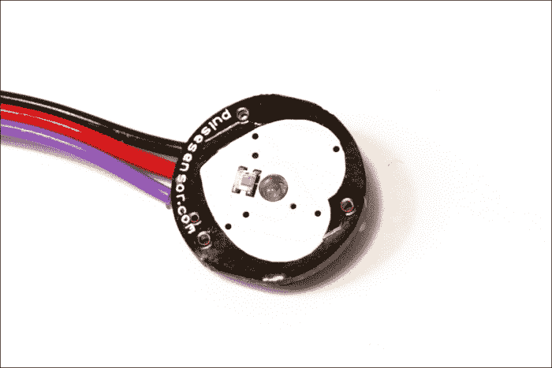
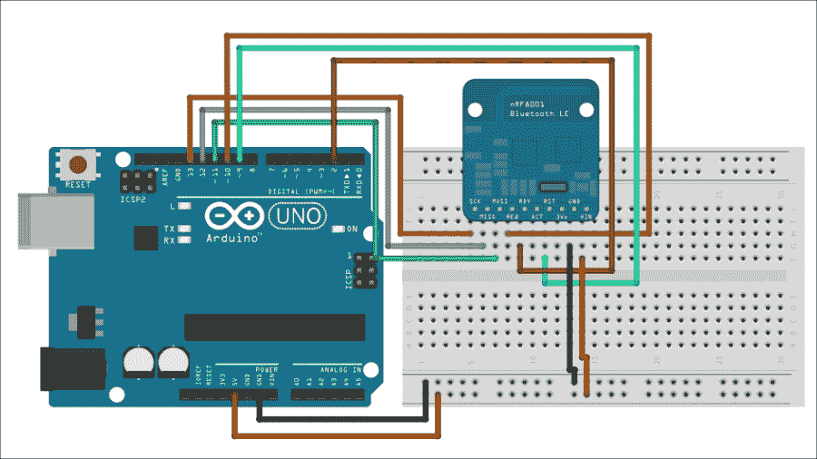
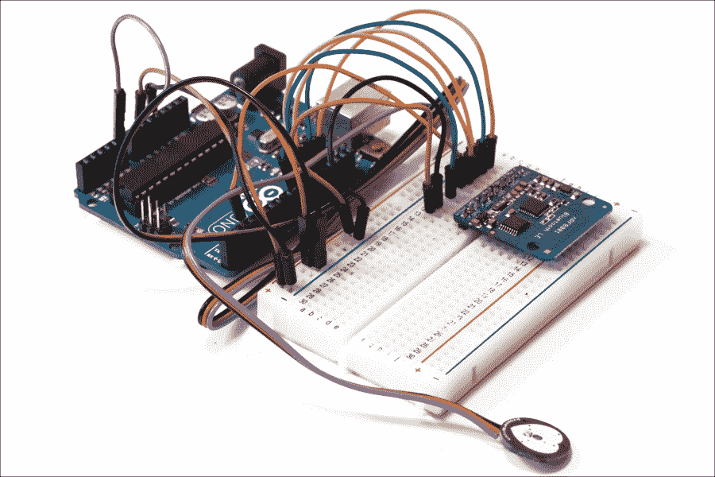
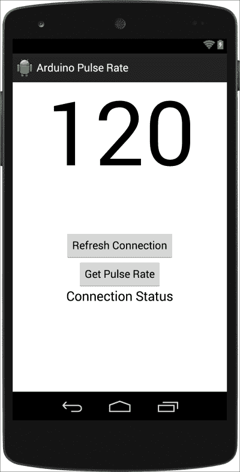
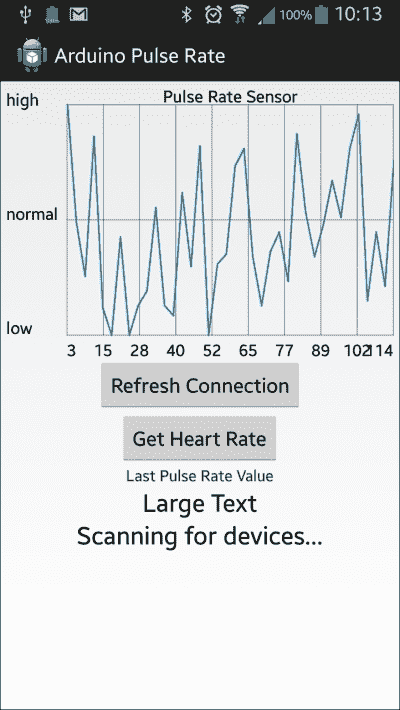

# 第十章 脉搏率传感器

在本章中，我们将开始探索在健康环境中使用 Arduino 和 Android 的可能性。开始这样冒险最自然的方式是创建一个涉及开源脉搏率传感器的项目。这个传感器将连接到一个配备 BLE 的 Arduino。数据将以有趣的方式在 Android 应用程序中显示，以使体验尽可能无缝。

本章的主要收获如下：

+   使用 Arduino 脉搏率传感器测量心率

+   将 BLE 模块连接到 Arduino 以传输脉搏率数据

+   在 Android 应用程序中可视化这些数据

# 硬件和软件要求

首先，让我们看看这个项目需要哪些东西。像往常一样，我们将使用 Arduino Uno 板。

你还需要一个心率传感器，这是本章最重要的组件。我们使用了一个与 Arduino 兼容的传感器，简单称为脉搏传感器（[`pulsesensor.com/`](http://pulsesensor.com/)）。

以下是我们使用的传感器的图片：



对于无线通信，我们使用了之前章节中使用的 nRF8001 BLE 扩展板。

最后，你需要一个面包板和一些跳线来连接不同部件。

这是你需要为这个项目准备的硬件清单，以及在网上找到这些部件的链接：

+   Arduino Uno 板（[`www.adafruit.com/products/50`](https://www.adafruit.com/products/50)）

+   nRF8001 扩展板（[`www.adafruit.com/products/1697`](https://www.adafruit.com/products/1697)）

+   心率传感器（[`pulsesensor.myshopify.com/products/pulse-sensor-amped`](http://pulsesensor.myshopify.com/products/pulse-sensor-amped)）

+   面包板（[`www.adafruit.com/products/64`](https://www.adafruit.com/products/64)）

+   跳线（[`www.adafruit.com/products/1957`](https://www.adafruit.com/products/1957)）

在软件方面，你当然需要 Arduino IDE。你还需要以下内容：

+   nRF8001 芯片的库，可在[`github.com/adafruit/Adafruit_nRF8001`](https://github.com/adafruit/Adafruit_nRF8001)找到

+   用于向机器人发送命令的 aREST 库，可在[`github.com/marcoschwartz/aREST`](https://github.com/marcoschwartz/aREST)找到

## 配置我们的硬件

我们现在将通过以下步骤来构建项目：

1.  首先，将 BLE 扩展板连接到 Arduino Uno 板。

1.  将模块放置在面包板上。

1.  连接模块的电源：**GND**连接到原型板**GND**，**VIN**连接到原型板+5V。

1.  连接负责 SPI 接口的不同电线：**SCK**连接到 Arduino 引脚**13**，**MISO**连接到 Arduino 引脚**12**，**MOSI**连接到 Arduino 引脚**11**。

1.  然后将**REQ**引脚连接到 Arduino 引脚 10。

1.  最后，将**RDY**引脚连接到 Arduino 引脚**2**，将**RST**引脚连接到 Arduino 引脚**9**。

    以下是一个帮助您完成这一部分的示意图：

    

1.  现在，连接脉搏率传感器实际上非常简单。你只需要将红色电线连接到 Arduino +5V 引脚，黑色电线连接到 Arduino GND 引脚，其余引脚连接到 Arduino A0 引脚。

这是一张完全组装好的项目的图片：



如果您想了解更多关于脉搏率传感器的信息，您可以访问官方文档[`pulsesensor.myshopify.com/pages/code-and-guide`](http://pulsesensor.myshopify.com/pages/code-and-guide)。

## 测试传感器

我们现在将编写一些基本的代码来确保脉搏传感器正确接线且没有损坏。多亏了传感器的创造者的工作，实际上从传感器读数中提取心率是非常容易的。以下草图首先定义了大量的变量，这些变量是计算**每分钟心跳次数**（**BPM**）所必需的：

```java
// Sensor and pins variables
int pulsePin = 0;
int blinkPin = 13;

// Pulse rate variable
volatile int BPM;    

// Raw signal
volatile int Signal;

// Interval between beats
volatile int IBI = 600; // Default Inter Beats Interval

// Becomes true when the pulse is high
volatile boolean Pulse = false;

// Becomes true when Arduino finds a pulse (QS stands for Quantified Self here)
volatile boolean QS = false;
```

在草图的`setup()`函数中，我们简单地启动串行通信并初始化从脉搏传感器读取的读数：

```java
// Start Serial
Serial.begin(115200);

// Sets up to read Pulse Sensor signal every 2mS
interruptSetup();
```

然后，在草图的`loop()`函数中，我们不断检查是否找到了心跳，如果是这样，我们就在串行监视器上打印出来：

```java
  // If heart beat is found
  if (QS == true) {

    // Print heart rate      
    Serial.print("Heart rate: ");            
    Serial.println(BPM);

    // Reset the Quantified Self flag for next time      
    QS = false;                       
   }

  // Wait 20 ms
  delay(20);
}
```

### 注意

注意，本章中使用的所有代码都可以在书的 GitHub 仓库[`github.com/marcoschwartz/arduino-android-blueprints`](https://github.com/marcoschwartz/arduino-android-blueprints)中找到。

现在是测试代码的时候了。在将代码上传到你的板子之前，建议你观看[`pulsesensor.myshopify.com/blogs/news/7406100-getting-started-video`](http://pulsesensor.myshopify.com/blogs/news/7406100-getting-started-video)上的视频，以便了解如何正确地将传感器放在指尖上。

现在，你可以将代码上传到你的 Arduino 板上，并打开串行监视器。然后将传感器放在你的指尖上。过了一会儿（最初可能会有一些奇怪的读数），你应该在串行监视器上看到你的心率。当你知道值在 60 到 100 BPM 之间时（如果你处于休息状态），你就知道它是正确的。

# 编写 Arduino 草图

既然我们已经确认传感器工作正常，我们可以为这一章编写最终的 Arduino 草图。这个草图将像之前一样执行 BPM 测量，并且将通过 aREST API 公开 BPM 变量，以便可以通过蓝牙访问测量结果。由于草图与测试草图非常相似，我们在这里只详细说明更改。

草图首先导入所需的库：

```java
#include <SPI.h>
#include "Adafruit_BLE_UART.h"
#include <aREST.h>
```

我们还定义了 BLE 模块连接的引脚：

```java
#define ADAFRUITBLE_REQ 10
#define ADAFRUITBLE_RDY 2     // This should be an interrupt pin, on Uno thats #2 or #3
#define ADAFRUITBLE_RST 9
```

然后我们创建了一个 aREST 库和 BLE 模块的实例：

```java
aREST rest = aREST();

// BLE instance
Adafruit_BLE_UART BTLEserial = Adafruit_BLE_UART(ADAFRUITBLE_REQ, ADAFRUITBLE_RDY, ADAFRUITBLE_RST);
```

我们还需要定义一个变量，该变量将包含 BPM 测量值，并且将暴露给 API：

```java
int bpm = 0;
```

在`setup()`函数中，我们需要初始化 BLE 模块：

```java
BTLEserial.begin();
```

我们还为项目命名并分配 ID：

```java
rest.set_id("1");
rest.set_name("pulse_sensor");
```

仍然在`setup()`函数中，我们将 BPM 变量暴露给 aREST API：

```java
rest.variable("bpm",&bpm);
```

在草图中的`loop()`函数中，我们将测量的 BPM 分配给暴露给 API 的变量：

```java
bpm = BPM;
```

然后，像往常一样，我们使用 aREST API 处理 BLE 模块上的传入请求：

```java
// Tell the nRF8001 to do whatever it should be working on.
BTLEserial.pollACI();

// Ask what is our current status
aci_evt_opcode_t status = BTLEserial.getState();

// Handle REST calls
if (status == ACI_EVT_CONNECTED) {
    rest.handle(BTLEserial);
  }
}
```

注意，本章的所有代码都可以在本书的 GitHub 仓库中找到，网址为[`github.com/marcoschwartz/arduino-android-blueprints`](https://github.com/marcoschwartz/arduino-android-blueprints)。您现在可以将代码上传到 Arduino 板，并继续开发 Android 应用程序。

## 设置 Android 应用程序

我们将要创建的 Android 应用程序将使我们能够在 Android 应用程序中显示由心率传感器测量的数据。此外，它将显示 BLE 连接状态，并且有一个**刷新**按钮，允许我们刷新蓝牙回调。

我们假设您已经在您的首选项中打开了`自动导入`功能。如果没有，请通过转到**自动导入**首选项并选择所有可用选项来激活它。**自动导入**首选项在 Mac 和 Windows 上的位置如下：

+   在 Mac 上，导航到**Android Studio** > **首选项** > **编辑器** > **自动导入**

+   在 Windows 上，导航到**文件** > **设置** > **编辑器** > **自动导入**

在所有必要的设置就绪后，我们将开始创建一个新项目，在**新建项目**设置向导中，我们将选择以下内容：

+   **名称**：`Pulse Rate Sensor`

+   **最小 SDK**：`18`

+   **项目**：`Blank Activity`

+   **活动名称**：`PulseActivity`

+   **域名**：`arduinoandroid.com`

## 布局 Android 用户界面和设置权限

为了使这个项目工作，我们首先需要转到 Android 的`Manifest`文件，该文件位于`app` > `src` > `main` > `AndroidManifest.xml`。

由于这个 Android 应用程序使用 BLE 将 Android 物理设备连接到心率传感器，因此我们需要将以下权限添加到 Android 的`Manifest`文件中：

```java
    <uses-permission android:name="android.permission.BLUETOOTH"/>
    <uses-permission android:name="android.permission.BLUETOOTH_ADMIN"/>
```

我们接下来要采取的下一步是设置非常基本的 Android 布局文件，以便我们能够实现应用程序功能。

在我们的项目中，我们将导航到主布局文件，该文件可以通过`app` > `src` > `res` > `layout` > `activity_pulse.xml`访问。

Android 用户界面设计中有多种布局格式，在这种情况下，我们将实现两个线性布局：一个将设计为充当图表视图的占位符，另一个将支持不同的按钮和文本视图。

将布局文件中当前可用的代码替换为以下代码：

```java
<?xml version="1.0" encoding="utf-8"?>

<LinearLayout

    android:orientation="vertical"
    android:layout_width="fill_parent"
    android:layout_height="fill_parent">

    <LinearLayout
        android:id="@+id/rest"
        android:layout_width="fill_parent"
        android:layout_height="250dip"
        android:orientation="vertical"
        android:weightSum="1">

        <TextView
            android:layout_width="match_parent"
            android:layout_height="wrap_content"
            android:textAppearance="?android:attr/textAppearanceLarge"
            android:id="@+id/pulseValueView"
            android:layout_gravity="center_horizontal"
            android:textSize="150dp"
            android:gravity="center"
            android:text="120"/>
    </LinearLayout>

    <Button
        android:layout_width="wrap_content"
        android:layout_height="wrap_content"
        android:text="Refresh Connection"
        android:id="@+id/refreshBtn"
        android:layout_gravity="center_horizontal" />

    <Button
        android:layout_width="wrap_content"
        android:layout_height="wrap_content"
        android:text="Get Pulse Rate"
        android:id="@+id/heartRateBtn"
        android:layout_gravity="center_horizontal" />

    <TextView
        android:layout_width="wrap_content"
        android:layout_height="wrap_content"
        android:textAppearance="?android:attr/textAppearanceLarge"
        android:text="Connection Status"
        android:id="@+id/connectionStsView"
        android:layout_gravity="center_horizontal" />
</LinearLayout>
```

最终结果将在 IDE 中呈现如下：



文本 **120** 的目的是作为一个占位文本，以确保在用户界面中有足够的空间来容纳脉搏率读数。在最终实现中，您可以选择删除占位文本，使其为空。

## 编写应用程序的内部代码

我们需要首先声明所有必要的变量，这些变量用于与蓝牙逻辑、用户界面和日志记录一起工作：

```java
    //Logging Variables
    private final String LOG_TAG = PulseActivity.class.getSimpleName();

    //User Interface Variables
    Button getPulseRate;
    Button refreshButton;
    TextView pulseRateView;
    TextView connectionStsView;

    //Data Output
    private String output;

    // UUIDs for UAT service and associated characteristics.
    public static UUID UART_UUID = UUID.fromString("6E400001-B5A3-F393-E0A9-E50E24DCCA9E");
    public static UUID TX_UUID = UUID.fromString("6E400002-B5A3-F393-E0A9-E50E24DCCA9E");
    public static UUID RX_UUID = UUID.fromString("6E400003-B5A3-F393-E0A9-E50E24DCCA9E");

    // UUID for the BTLE client characteristic which is necessary for notifications.
    public static UUID CLIENT_UUID = UUID.fromString("00002902-0000-1000-8000-00805f9b34fb");

    // BTLE stateta
    private BluetoothAdapter adapter;
    private BluetoothGatt gatt;
    private BluetoothGattCharacteristic tx;
    private BluetoothGattCharacteristic rx;

    private boolean areServicesAccessible = false;
```

在此之后，我们需要在 `onCreate()` 方法中将用户界面元素连接到用户界面，并将 `onClickListener` 类设置到 **获取脉搏率** 和 **刷新** 按钮上，这将允许我们请求脉搏率传感器数据并刷新蓝牙连接：

```java
        //Connect U.I Elements
        getPulseRate = (Button) findViewById(R.id.heartRateBtn);
        pulseRateView = (TextView) findViewById(R.id.pulseValueView);
        connectionStsView = (TextView) findViewById(R.id.connectionStsView);
        refreshButton = (Button) findViewById(R.id.refreshBtn);

        getPulseRate.setOnClickListener(new View.OnClickListener() {
            @Override
            public void onClick(View view) {
                String setOutputMessage = "/bpm /";
                tx.setValue(setOutputMessage.getBytes(Charset.forName("UTF-8")));
                if (gatt.writeCharacteristic(tx)) {
                    writeConnectionData("Sent: " + setOutputMessage);
                } else {
                    writeConnectionData("Couldn't write TX characteristic!");
                }
            }
        });

        refreshButton.setOnClickListener(new View.OnClickListener() {
            @Override
            public void onClick(View view) {
                restartScan();
            }
        });
    }
```

由于我们在项目中使用蓝牙，我们需要实现允许我们获取字符数据序列、将它们转换为字符串，并将其最终连接到用户界面以显示数据的方法：

```java
    private void writeConnectionData(final CharSequence text) {
        Log.e(LOG_TAG, text.toString());
        connectionStsView.setText(text.toString());
    }

    private void writeSensorData(final CharSequence text) {
        runOnUiThread(new Runnable() {
            @Override
            public void run() {
                Log.e(LOG_TAG,text.toString());
                output=text.toString().trim();

                if (output.length() > 0 && output.length() <=3) {
                    pulseRateView.setText(output);
                }
                else {
                    return;
                }
            }
        });
    }
```

以下方法将允许我们执行必要的蓝牙回调，并通过 BLE 模块从 Arduino 脉搏率传感器发送或接收数据：

```java
    // BTLE device scanning bluetoothGattCallback.

    // Main BTLE device bluetoothGattCallback where much of the logic occurs.
    private BluetoothGattCallback bluetoothGattCallback = new BluetoothGattCallback() {
        // Called whenever the device connection state changes, i.e. from disconnected to connected.
        @Override
        public void onConnectionStateChange(BluetoothGatt gatt, int status, int newState) {
            super.onConnectionStateChange(gatt, status, newState);
            if (newState == BluetoothGatt.STATE_CONNECTED) {
                writeConnectionData("Connected!");
                // Discover services.
                if (!gatt.discoverServices()) {
                    writeConnectionData("Failed to start discovering services!");
                }
            } else if (newState == BluetoothGatt.STATE_DISCONNECTED) {
                writeConnectionData("Disconnected!");
            } else {
                writeConnectionData("Connection state changed.  New state: " + newState);
            }
        }

        // Called when services have been discovered on the remote device.
        // It seems to be necessary to wait for this discovery to occur before
        // manipulating any services or characteristics.
        public void onServicesDiscovered(BluetoothGatt gatt, int status) {
            super.onServicesDiscovered(gatt, status);
            if (status == BluetoothGatt.GATT_SUCCESS) {
                writeConnectionData("Service discovery completed!");
            } else {
                writeConnectionData("Service discovery failed with status: " + status);
            }
            // Save reference to each characteristic.
            tx = gatt.getService(UART_UUID).getCharacteristic(TX_UUID);
            rx = gatt.getService(UART_UUID).getCharacteristic(RX_UUID);

            // Setup notifications on RX characteristic changes (i.e. data received).
            // First call setCharacteristicNotification to enable notification.
            if (!gatt.setCharacteristicNotification(rx, true)) {
                writeConnectionData("Couldn't set notifications for RX characteristic!");
            }

            // Next update the RX characteristic's client descriptor to enable notifications.
            if (rx.getDescriptor(CLIENT_UUID) != null) {
                BluetoothGattDescriptor desc = rx.getDescriptor(CLIENT_UUID);
                desc.setValue(BluetoothGattDescriptor.ENABLE_NOTIFICATION_VALUE);
                if (!gatt.writeDescriptor(desc)) {
                    writeConnectionData("Couldn't write RX client descriptor value!");
                }
            } else {
                writeConnectionData("Couldn't get RX client descriptor!");
            }
            areServicesAccessible = true;
        }
        // Called when a remote characteristic changes (like the RX characteristic).
        @Override
        public void onCharacteristicChanged(BluetoothGatt gatt, BluetoothGattCharacteristic characteristic) {
            super.onCharacteristicChanged(gatt, characteristic);
            writeSensorData(characteristic.getStringValue(0));
        }
    };

private BluetoothAdapter.LeScanCallback scanCallback = new BluetoothAdapter.LeScanCallback() {
        // Called when a device is found.
        @Override
        public void onLeScan(BluetoothDevice bluetoothDevice, int i, byte[] bytes) {
            Log.d(LOG_TAG, bluetoothDevice.getAddress());

            writeConnectionData("Found device: " + bluetoothDevice.getAddress());

            // Check if the device has the UART service.
            if (BluetoothUtils.parseUUIDs(bytes).contains(UART_UUID)) {
                // Found a device, stop the scan.
                adapter.stopLeScan(scanCallback);
                writeConnectionData("Found UART service!");
                // Connect to the device.
                // Control flow will now go to the bluetoothGattCallback functions when BTLE events occur.
                gatt = bluetoothDevice.connectGatt(getApplicationContext(), false, bluetoothGattCallback);
            }
        }
    };
}
```

Android 应用程序生命周期允许我们在其不同阶段实现方法，因此在下述代码中，我们将实现两个方法，允许我们在应用程序激活时开始蓝牙扫描，并在用户退出应用程序时停止蓝牙扫描和其他相关活动：

```java
    protected void onStart() {
        Log.d(LOG_TAG,"onStart has been called");
        super.onStart();
        // / Scan for all BTLE devices.
        // The first one with the UART service will be chosen--see the code in the scanCallback.
        adapter = BluetoothAdapter.getDefaultAdapter();
        startScan();
    }

    //When this Activity isn't visible anymore
    protected void onStop() {
        Log.d(LOG_TAG,"onStop has been called");
        //disconnect and close Bluetooth Connection for better reliability
        if (gatt != null) {
            gatt.disconnect();
            gatt.close();
            gatt = null;
            tx = null;
            rx = null;
        }
        super.onStop();
    }
```

我们还将包括一些方法，这些方法有助于 BLE 扫描回调，并使我们能够重构代码并保持代码整洁：

```java
    //BLUETOOTH METHODS
    private void startScan() {
        if (!adapter.isEnabled()) {
            adapter.enable();
        }
        if (!adapter.isDiscovering()) {
            adapter.startDiscovery();
        }
        writeConnectionData("Scanning for devices...");
        adapter.startLeScan(scanCallback);
    }

    private void stopScan() {
        if (adapter.isDiscovering()) {
            adapter.cancelDiscovery();
        }
        writeConnectionData("Stopping scan");
        adapter.stopLeScan(scanCallback);
    }

    private void restartScan() {
        stopScan();
        startScan();
    }
```

与前几章不同，UUID 解析已被移动到 `utility` 类中，以便重构代码并使其更易读。为了创建一个 `utility` 类，我们首先需要右键点击我们的包名，并创建一个新的包，命名为 `Bluetooth`。

然后，我们将右键点击新包，选择 **新建** > **Java 类**，并将新类命名为 `BluetoothUtils`。

在这两个步骤之后，我们将用以下代码替换类中的代码：

```java
public class BluetoothUtils {

    // Filtering by custom UUID is broken in Android 4.3 and 4.4, see:
    //   http://stackoverflow.com/questions/18019161/startlescan-with-128-bit-uuids-doesnt-work-on-native-android-ble-implementation?noredirect=1#comment27879874_18019161
    // This is a workaround function from the SO thread to manually parse advertisement data.
    public static List<UUID> parseUUIDs(final byte[] advertisedData) {
        List<UUID> uuids = new ArrayList<UUID>();

        int offset = 0;
        while (offset < (advertisedData.length - 2)) {
            int len = advertisedData[offset++];
            if (len == 0)
                break;

            int type = advertisedData[offset++];
            switch (type) {
                case 0x02: // Partial list of 16-bit UUIDs
                case 0x03: // Complete list of 16-bit UUIDs
                    while (len > 1) {
                        int uuid16 = advertisedData[offset++];
                        uuid16 += (advertisedData[offset++] << 8);
                        len -= 2;
                        uuids.add(UUID.fromString(String.format("%08x-0000-1000-8000-00805f9b34fb", uuid16)));
                    }
                    break;
                case 0x06:// Partial list of 128-bit UUIDs
                case 0x07:// Complete list of 128-bit UUIDs
                    // Loop through the advertised 128-bit UUID's.
                    while (len >= 16) {
                        try {
                            // Wrap the advertised bits and order them.
                            ByteBuffer buffer = ByteBuffer.wrap(advertisedData, offset++, 16).order(ByteOrder.LITTLE_ENDIAN);
                            long mostSignificantBit = buffer.getLong();
                            long leastSignificantBit = buffer.getLong();
                            uuids.add(new UUID(leastSignificantBit,
                                    mostSignificantBit));
                        } catch (IndexOutOfBoundsException e) {
                            // Defensive programming.
                            //Log.e(LOG_TAG, e.toString());
                            continue;
                        } finally {
                            // Move the offset to read the next uuid.
                            offset += 15;
                            len -= 16;
                        }
                    }
                    break;
                default:
                    offset += (len - 1);
                    break;
            }
        }
        return uuids;
    }
}
```

在这一点上，您可以继续构建并运行项目，在运行 Android 4.3 且蓝牙已开启的 Android 物理设备上。为了获取此项目中的脉搏率，您需要按照之前提到的说明操作，并点击 **获取脉搏率** 按钮。

## 如何进一步

我们相信，通过可能包括来自多个在线渠道的其他健康相关传感器，并将相关数据在图表中显示，这个项目可以进一步发展。

Android 图形视图库支持使用多个序列进行多个输入。有关此信息的更多信息，可以在官方文档网站 [`android-graphview.org/`](http://android-graphview.org/) 获取。

这个应用在 Android 图形视图下的截图可能类似于以下内容：



还可以对用户界面和用户体验进行进一步的改进，其中数据可以通过处理程序或定时器实现实时更新。最后，这种类型的应用中可以包含的最先进集成之一是与 Google Fit SDK 的集成，这是谷歌的专有健康数据平台。另一个选择是使用云存储 API 和本地数据库存储健康数据。

# 摘要

在本章中，我们将之前章节所学的内容进行了整合，创建了一个基准项目来测量我们的脉搏率。

我们通过创建一个 Android 应用实现了这一点，该应用显示了连接到 Arduino Uno 的脉搏率传感器的数据。这两个设备之间的通信是通过蓝牙进行的。

本书中所介绍的所有基准项目都是为了激励你发挥创意，解决日常挑战。我们已经意识到，将 Arduino 和 Android 结合的可能性是无限的，我们希望你能突破可能的局限。
