# 第三章：Wi-Fi 电源插头

Wi-Fi 电源插头是一种设备，通过它可以控制连接到它的电器，以两种方式打开和关闭：

+   从你的 iOS 设备手动操作

+   自动设置定时器

例如，你可以在每天下午 6 点开启你的灌溉系统 30 分钟，但如果看到你的草坪变黄，你可以手动开启系统进行额外的浇水。

现在，这种设备在市场上以合理的价格就可以买到，但自己制作一个将让你了解它是如何工作的，并适应你自己的需求。

与第一章中的项目相比，我们将使用 Wi-Fi 作为通信协议。这将允许你在不在家的时候也能访问设备。

本章分为以下部分：

+   Wi-Fi 电源插头要求：我们将简要设定项目要求

+   硬件：我们将描述项目所需的硬件和电子电路

+   Arduino 代码：我们将为 Arduino 编写代码以控制外部设备并与 iOS 设备通信

+   iOS 代码：我们将为 iOS 设备编写代码

+   如何从世界任何地方访问你的电源插头

+   如何更进一步：更多改进项目和学习的想法

# Wi-Fi 电源插头要求

我们将构建一个能够：

+   通过从 iOS 设备接收命令来打开和关闭连接到它的电器

+   在特定时间打开和关闭电器，持续预定义的时间

伴随的 iOS 应用程序需要手动控制电源插头和管理定时器。

# 硬件

正如我们在第一章中提到的，*Arduino 和 iOS – 平台和集成*，我们需要一个 Wi-Fi 屏蔽器([`www.arduino.cc/en/Main/ArduinoWiFiShield`](http://www.arduino.cc/en/Main/ArduinoWiFiShield))和一个格式化为 FAT16 的微 SD 卡（更多详情请查看：[`www.arduino.cc/en/Reference/SDCardNotes`](http://www.arduino.cc/en/Reference/SDCardNotes))。SD 卡用于在 Arduino 断电时永久存储激活时间，因此其大小不是那么重要。

## 额外的电子组件

在这个项目中，我们需要一些额外的组件：

+   光隔离器 MOC3041

+   330 Ω电阻，0.5 W

+   330 Ω电阻，0.25 W

+   红色 LED

+   三相可控硅 BTA08-600

三相可控硅在 600 V 下可承受 8 安培均方根电流，在 220 V 下大约是 1700 瓦。如果你有一个更强大的外部设备，你可以使用同一系列的其他三相可控硅型号（例如，BTA16）。

## 电子电路

下面的图片显示了我们需要的项目电子电路的电原理图：

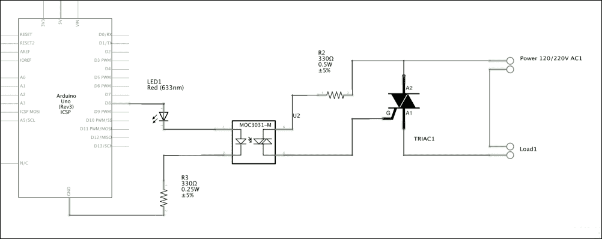

以下图片展示了如何在面包板上安装电路。

### 小贴士

不要忘记安装 Wi-Fi 盾牌，并将微型 SD 卡插入其中。

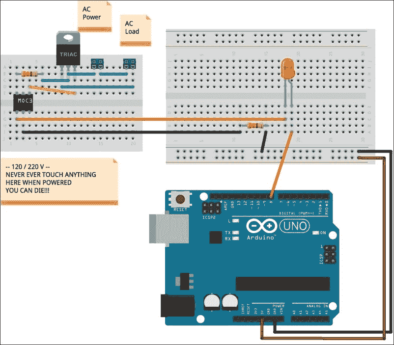

### 小贴士

此电路使用电源线（120 V 或 220 V）。触摸任何带电源线电压的部分可能极其危险，甚至可能致命。即使是经验丰富的专业人士也可能会受伤或死亡，所以*请*务必非常小心。这意味着如果你从未操作过电源线电压，你需要在一个熟练的人的监督下进行。

*再次提醒，如果你之前没有这样做过，请避免自己操作电源线。你将是对自己、你的亲属和你的物品可能造成的任何损害的唯一责任人。你已经收到警告！*

如果你觉得操作电源线不安全，你仍然可以通过仅使用 LED 和电阻替换电源电路来享受这个项目。

为了给外部设备供电，我们使用晶闸管([`bit.ly/1MzmIYs`](http://bit.ly/1MzmIYs))，它允许你使用小电流控制交流负载。由于电源插头使用电源线，周围的电压很高（120-220 V），并且可能会烧毁 Arduino。因此，在低电压电路（Arduino）和高电压电路（晶闸管）之间放置了一个光电隔离器([`bit.ly/1TV1JFc`](http://bit.ly/1TV1JFc))。基本上，它是一个 LED 和一个低功率晶闸管在同一小封装中。当 LED 开启时，由于光电效应会产生小电流，并极化低功率晶闸管的栅极，从而切换它。这里的主要点是光电隔离了 LED 和晶闸管。

晶体管和继电器可以替换晶闸管和光电隔离器，但继电器是一个机电装置，容易在短时间内出现故障。

打开和关闭 Arduino 上的光电隔离器 LED 非常简单，因为它连接到一个数字引脚（在我们的例子中是 8 号引脚），并通过`digitalWrite(<PIN>, HIGH | LOW)`进行控制。与光电隔离器串联的外部 LED 仅用于监控目的。

### 小贴士

**控制更多设备**

如果你需要控制更多设备，你可以复制电源电路（光电隔离器和晶闸管）并将其连接到另一个数字引脚。然后你需要调整 Arduino 代码和 iOS 代码。

# Arduino 代码

此项目的完整代码可以从这里下载：

[`www.packtpub.com/books/content/support`](https://www.packtpub.com/books/content/support)

为了更好地理解下一段落的解释，你应该在阅读时打开下载的代码。

电源插头需要在不同的时间激活外部设备，然后关闭它。我们将*激活*称为开启-关闭周期。每个激活都可以用一个方波表示（见以下图表）。

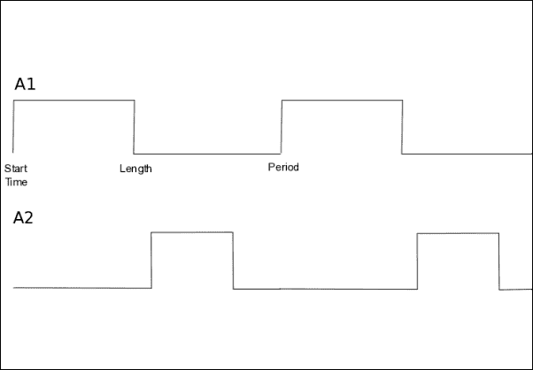

每个激活从其**开始时间**开始，持续**长度**（在此期间设备处于开启状态），并在**周期**时间后重复。一次性激活的周期等于 0。

我们将使用此图来理解 Arduino 代码。

应用程序可以管理存储在全局数组`activations`中的`NUMBER_OF_ACTIVATIONS`个激活。每个激活是一个新类型，定义如下：

```swift
typedef struct  {
  char                name[21];
  unsigned long       startTime;      // seconds since midnight 1/1/1970
  uint16_t       length;         // minutes
  uint16_t       period;         // minutes
} activation;
```

为了使代码尽可能简单（并且节省闪存空间），我们将整个数组保存到 SD 文件中，即使不是所有的激活都被设置。如果一个激活被设置，那么它的名称就会被设置。

### 提示

**闪存**

闪存存储 Arduino 上运行的程序。Arduino UNO 有 32K 的闪存，其中 0.5K 用于引导加载程序。引导加载程序是一段小代码，允许通过 USB 编程 UNO，而不是使用外部在电路编程器（例如，AVR-ISP 或 STK500）。

## 设置代码

请参考下载的代码，因为设置代码相当简单，不需要详细解释。

因为我们要处理时间，而 Arduino 没有实时时钟，我们需要从网络上的网络时间协议服务器获取当前时间（[`bit.ly/1NyCVM7`](http://bit.ly/1NyCVM7)）；这就是函数`askTime`所做的工作。请求通过 UPD（[`bit.ly/1MzmQHb`](http://bit.ly/1MzmQHb)）发送，答案在 2390 端口接收。当接收到数据包时，它通过`readTime`函数（见`loop`函数）转换为 Unix 时间。

### 提示

**Unix 时间**

Unix 时间或 Posix 时间定义为自 1970 年 1 月 1 日星期四 00:00:00 协调世界时（UTC）以来经过的秒数（[`bit.ly/1E6LP3m`](http://bit.ly/1E6LP3m)）。

## 主程序

让我们从简化版的主循环开始：

```swift
void loop() {

  WiFiClient client;

  client = server.available();

  if (client) {
    Serial.println(F("iOS Device connected"));

    // Waits for client disconnection
    while (client.connected()) {

      // Waits for data and process them

      while (client.available()) {

      }

    }

    Serial.println(F("iOS Device disconnected"));
  }

  //Serial.println(millis() / 1000 - lastActivation);
  if (millis() / 1000 - lastActivation >= ACTIVATION_CHECK_INTERVAL && !manualMode) {

    lastActivation = millis() / 1000;
    checkActivations();
  }

  delay(50);
}
```

### 提示

**闪存中的字符串**

通常 Arduino 会将静态字符串存储在 RAM 中。由于 RAM 也用于存储变量，我们可以使用 F()符号将静态字符串移动到闪存中。例如，`Serial.println("iOS Device disconnected")`会浪费 23 个字节的 RAM 来存储字符串`"iOS Device disconnected"`。相反，写入`Serial.println(F("iOS Device disconnected"))`将使字符串存储在闪存中。

变量`server`代表监听连接的 TCP 服务器。如果一个新的客户端连接并且有可读数据，`available`将返回一个`WiFiClient`实例（`client`），可以用来读取数据。当客户端连接时，（函数`connected`返回 true），我们检查是否有数据可用。函数`available`返回可读字节数，所以当它返回一个大于 0 的数字时，我们可以读取数据并处理它们。

函数`millis`返回自板子开启以来经过的毫秒数，以下指令：

```swift
if (millis() / 1000 - lastActivation >= ACTIVATION_CHECK_INTERVAL && !manualMode) {

    lastActivation = millis() / 1000;
    checkActivations();
  }
```

函数`checkActivations`每`ACTIVATION_CHECK_INTERVAL`秒被调用一次。

`checkActivations`函数检查每个激活（具有名称），并根据当前时间开启或关闭设备。

如果当前时间在激活开始时间和激活开始时间加上激活长度之间，设备必须开启。

请注意，开始时间是自 1970 年 1 月 1 日起的秒数。另一方面，长度是以分钟为单位的。

如果设备已开启且当前时间大于开始时间加上激活长度，则必须关闭设备。然后激活周期减去一个周期，以便为下一次激活做好准备。

```swift
activations[i].startTime += 60 * activations[i].period;
```

### 注意

由于`checkActivations`每`ACTIVATION_CHECK_INTERVAL`秒调用一次，激活可能会比其原始时间延迟`ACTIVATION_CHECK_INTERVAL`。

现在我们可以查看从 iOS 设备接收到的命令（参考下载的代码）。

每个命令以一个字节开始，表示命令代码，其后跟任何附加数据。

如果第一个字节是：

+   `'A'`：Arduino 使用`sendActivations`函数将所有激活发送到 iOS 设备。

+   `'U'`：其后跟一个字节，表示要更新的激活（idx）的索引，以及`sizeof(activation)`字节，表示要更新的激活。这些字节通过`memcpy((uint8_t *)&activations[idx], (uint8_t *)&inBuffer[2], sizeof(activation))`复制到现有的激活中。

+   `'D'`：其后跟一个字节，表示要删除的激活（idx）的索引。

+   `'S'`：其后跟一个字节，表示设备的新状态，该状态通过`digitalWrite(PHOTOISOLATOR_PIN, HIGH)`或`digitalWrite(PHOTOISOLATOR_PIN, LOW)`设置。如果用户强制设置设备状态，程序进入手动模式，并忽略激活。

此外，在 iOS 设备连接之前，Arduino 使用`sendStatus`函数发送其状态，第一个字节是操作模式（手动或自动），第二个字节是设备状态（开启或关闭）。

我们必须查看的最后一个函数是`updateActivations`。假设我们设置了一个在下午 1 点开始的持续 1 分钟的激活，每 2 分钟重复一次。在下午 12:59，我们关闭 Arduino，然后在下午 2 点重新启动。由于下午 2 点 > 下午 1:02（现在 > `startTime` + 60 *周期），激活不再启动。`updateActivations`正好具有将重复激活时间移位的目的，以便它们可以正确触发。

`updateActivations`随后从`setup`函数调用，当用户返回到自动操作时，因为手动操作期间不会检查和正确更新激活。

使用`millis`函数计算当前时间可能在几天后导致显著的误差，因此我们通过 NTP 服务器定期更新时间：

```swift
  // Time synchronization
  if (millis() / 1000 > TIME_SYNC_INTERVAL && !updatingTime) {

    updatingTime = true;
    askTime();
  }
```

`TIME_SYNC_INTERVAL`的预定义值每 24 小时更新当前时间。

# iOS 代码

在本章中，我们将查看 iOS 应用程序，手动打开和关闭电器，并管理自动操作的激活。

该项目的完整代码可以从这里下载：

[`www.packtpub.com/books/content/support`](https://www.packtpub.com/books/content/support)

为了更好地理解下一段落的解释，您应该在阅读时打开下载的代码。

## 创建 Xcode 项目

第一步是创建一个新的项目。我们将再次使用模板 Tabbed Application，因为它提供了两个视图控制器。在这个项目中，我们还将添加另一个。

让我们创建一个新的 Tabbed Application 项目，就像上一章中做的那样，并将其命名为`PowerPlug`。然后：

1.  将`FirstViewController`重命名为`PowerPlugViewController`。

1.  将`SecondViewController`重命名为`WiFiConnectionViewController`。

在本章中，我们将使用一个额外的库（`CocoaAsyncSocket`，见[`bit.ly/1NGHDHE`](http://bit.ly/1NGHDHE)），它简化了通过 TCP/IP 套接字进行通信。要安装库，您可以按照以下步骤操作：

1.  打开 URL [`bit.ly/1NGHDHE`](http://bit.ly/1NGHDHE)。

1.  点击页面右侧的**下载 ZIP**按钮。文件`CocoaAsyncSocket-master.zip`将被下载到`下载`文件夹中。

1.  解压下载的文件。

1.  定位`GCDAsyncSocket.h`和`GCDAsyncSocket.m`。

1.  将这些文件拖动并放到 Xcode 项目中**PowerPlug**组中。

1.  确保此选项设置为**如果需要则复制项目**（见以下截图）并点击**下一步**。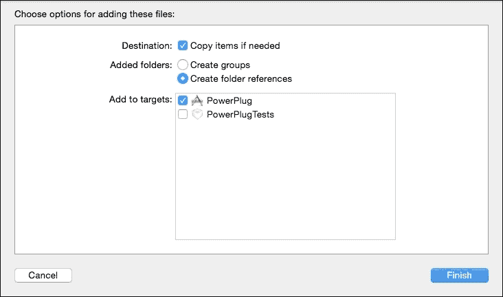

## 添加新的视图控制器

我们现在添加所需的额外视图控制器类和额外的视图控制器图形容器，按照以下步骤进行：

1.  在左侧面板中选择`PowerPlug`文件夹，然后右键点击它。

1.  选择**新建文件…**。

1.  在左侧面板中选择**iOS 源**，在右侧面板中选择**Cocoa Touch 类**，然后点击**下一步**。

1.  在列表框的**子类**中，选择**UITableViewController**。

1.  在**类**字段中输入`ActivationsTableViewController`（参考下一张截图）并点击**下一步**。

1.  在下一个窗口中点击**保存**。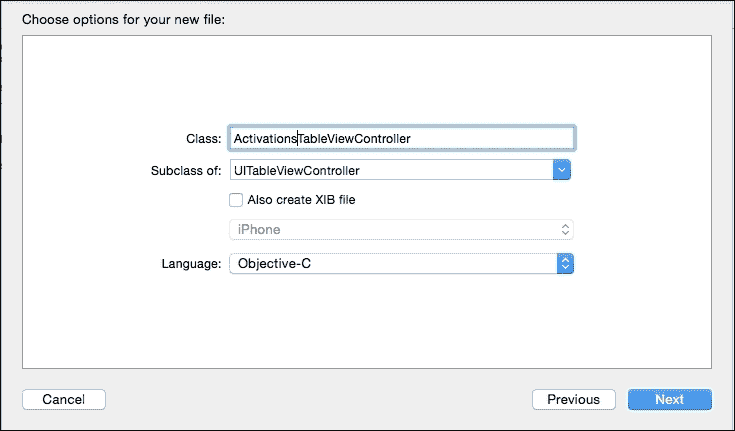

1.  在左侧面板中选择**Main.storyboard**。

1.  打开实用工具面板（**视图** | **实用工具** | **显示实用工具**）。

1.  在实用工具面板的搜索字段中输入`UIViewController`。

1.  将 UIViewController 拖动到故事板中。

1.  选择刚刚添加的视图控制器。

1.  打开身份检查器（**视图** | **实用工具** | **显示** **身份检查器**，或在下一张图片中点击红色圆圈图标）。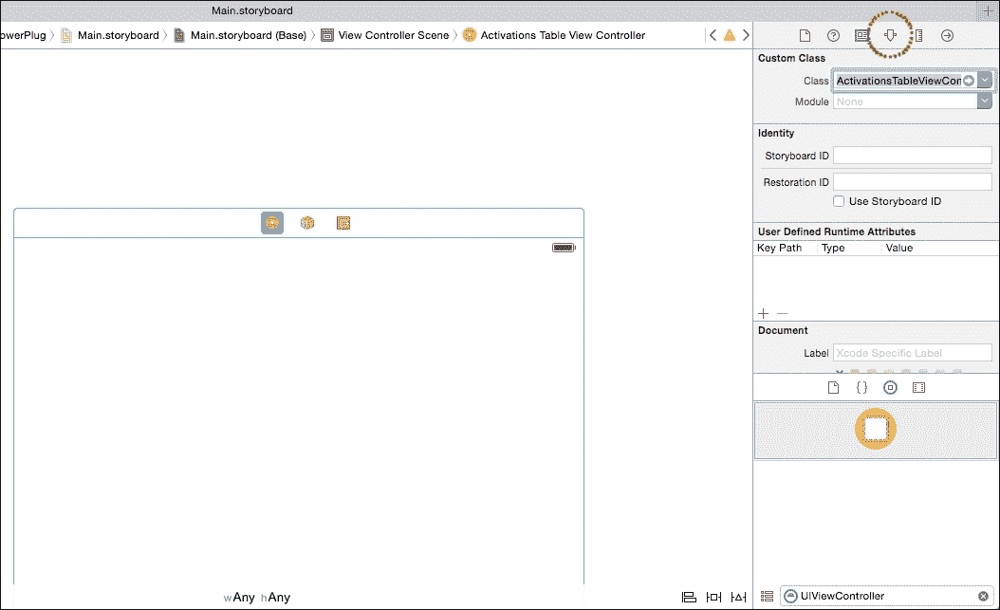

1.  在**类**列表框中，选择**ActivationsTableViewController**。现在视图控制器类和 GUI 已经绑定在一起。

1.  现在我们必须将新的视图控制器添加到主视图控制器的标签栏中。按下*控制*键，将鼠标指针从**标签栏控制器**拖动到**ActivationsTableViewController**，然后释放（见下一张截图）。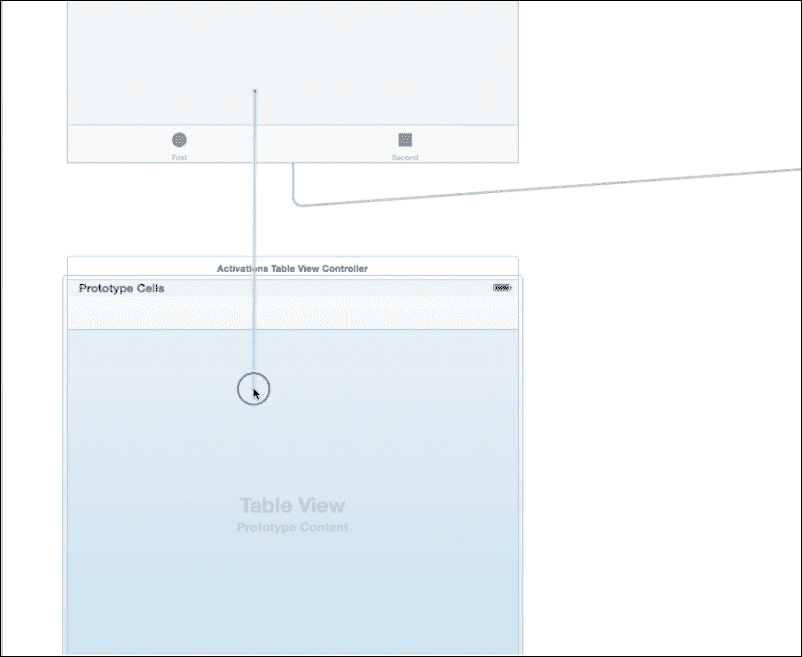

1.  当出现下一张截图所示的小对话框时，选择**关系** **切换** | **视图控制器**。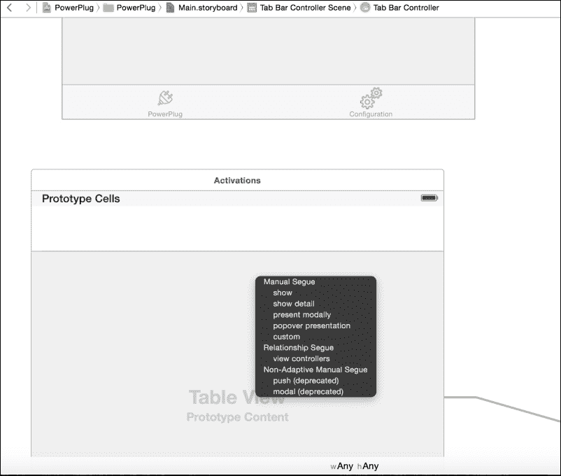

现在新的视图控制器已添加到**标签栏**（见下一张截图）。

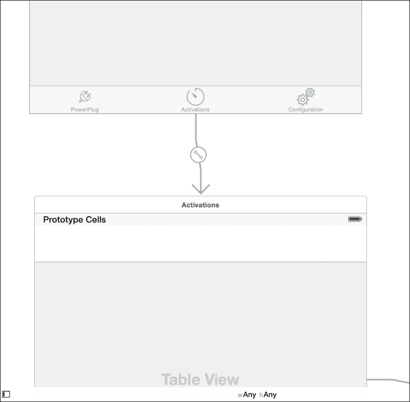

我们需要新的视图控制器在标签栏中是第二个。要移动它，您可以单击并拖动它到所需的位置。

不要忘记更改工具栏中的文本，分别改为`PowerPlug`、`Activations`和`Configuration`。

### 注意

在下载的代码中，您会发现每个视图控制器可以使用三个图标。

由于我们需要显示表格中元素的具体信息，我们需要在导航控制器中嵌入 ActivationsTableViewController：

1.  选择**ActivationsTableViewController**。

1.  选择**编辑器** | **嵌入在…** | **导航控制器**。

最终的结构应该类似于下一张截图所示：

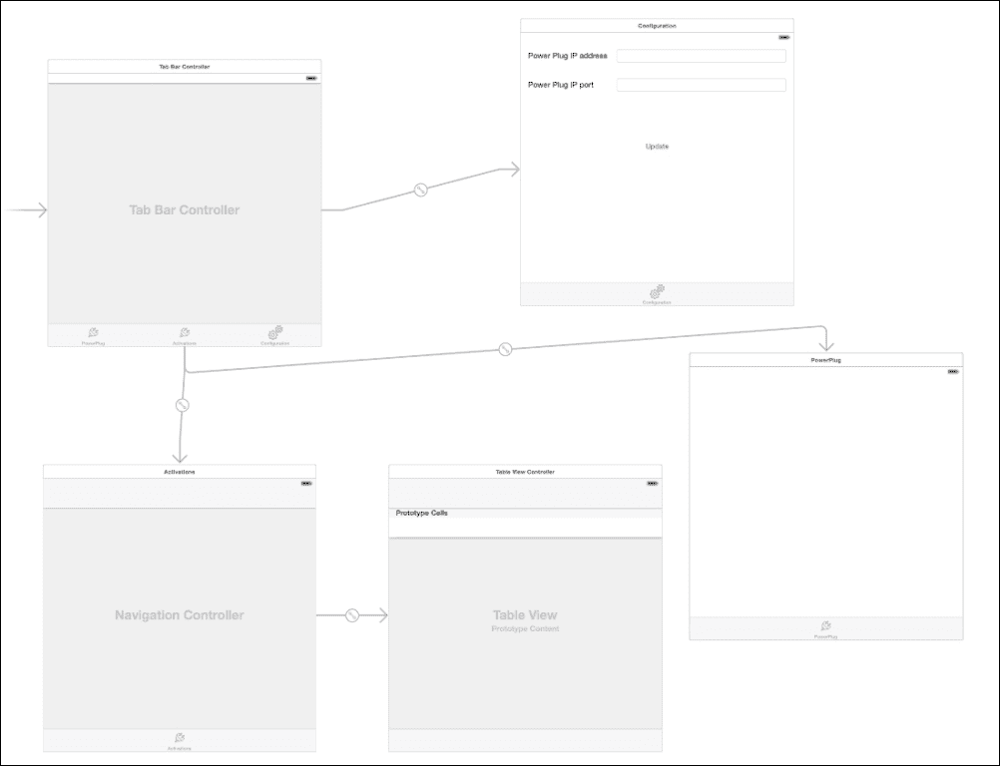

## 为存储每个激活的信息添加类

要存储每个激活的信息，我们需要一个名为`Activation`的类。

### 提示

**模型-视图-控制器**

从技术角度讲，我们现在正在创建模型-视图-控制器模式的“模型”。您可以在以下位置找到 MVC 模式的简要介绍：[`apple.co/1hkUDbU`](http://apple.co/1hkUDbU) 和完整的讨论：[`apple.co/1EEpNzL`](http://apple.co/1EEpNzL)。

要创建类：

1.  在左侧面板中选择**PowerPlug**组，右键单击它，然后选择**新建文件…**。

1.  在左侧面板中选择**源**，在右侧面板中选择**Cocoa Touch 类**，然后点击**下一步**。

1.  在**子类**列表框中选择**NSObject**。

1.  在**类文本字段**中输入`Activation`（见下一图）并点击**下一步**。

1.  点击**保存**。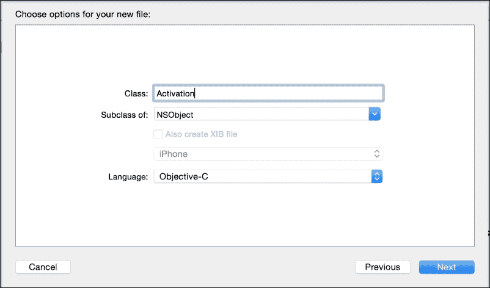

1.  打开`Activation.h`文件并输入以下代码：

    ```swift
    @interface Activation : NSObject

    @property (nonatomic,strong) NSString   *name;
    @property (nonatomic,strong) NSDate     *start;
    @property                    NSInteger  length;   // minutes
    @property                    NSInteger  period;   // minutes

    @end
    ```

项目现在已准备好进行下一步，我们可以开始处理视图控制器。

## 设计 WiFiConnectionViewController 的应用程序用户界面

正如我们在上一个项目中做的那样，我们从视图控制器开始，这允许我们输入连接信息。

它由两个标签、两个输入 IP 地址的字段、分配给 Arduino 的 IP 端口和一个更新连接信息的按钮组成。

请参考以下截图来设计它：

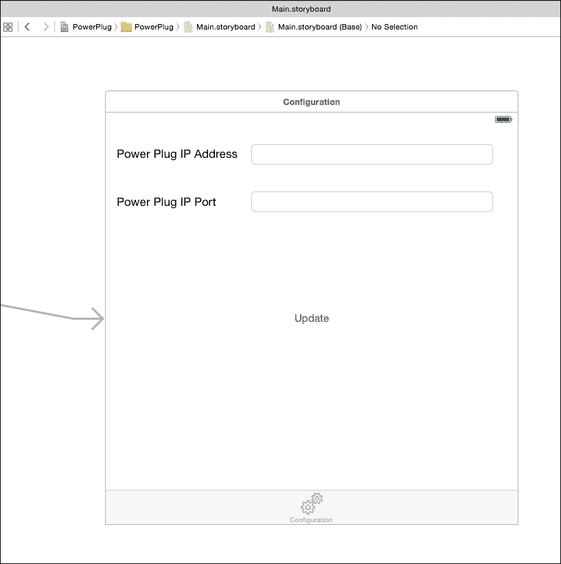

由于这两个字段只接受数字和句点，我们可以设置一个合适的键盘来帮助用户。为此：

1.  选择一个字段。

1.  打开身份检查器（**视图** | **实用工具** | **显示** **身份检查器**）。

1.  在**键盘类型**列表框中选择**数字和标点**。

现在，在`WiFiConnectionViewController.m`中将用户界面组件链接到以下代码：

```swift
@interface WiFiConnectionViewController ()

@property (strong, nonatomic) IBOutlet UITextField *ipField;
@property (strong, nonatomic) IBOutlet UITextField *portField;

@end

and:

- (IBAction)updateConnectionInformation:(UIButton *)sender {

}
```

不要忘记将`UITextFields`代理链接到视图控制器。

请参考下载的代码以获取更多详细信息，并将您的结果与提供的应用程序进行比较。

## 为 PowerPlugViewController 设计应用程序用户界面

此视图控制器管理与电源插头的手动操作，该插头能够手动开关连接设备的电源。

此视图控制器的最终布局如图所示：

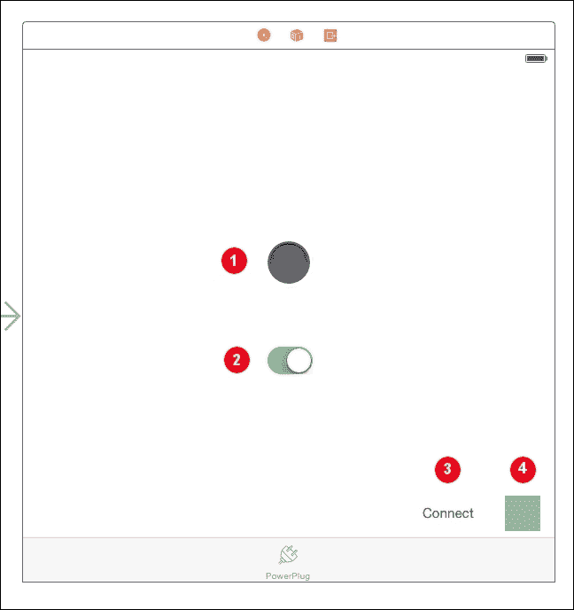

编号为**1**的组件是一个`UIImageView`，其目的是显示连接的电器是开启还是关闭。要添加此组件，只需拖放并选择要显示的图像（在下载的项目中可以找到的`LEDdisabled.png`），使用**属性检查器**。图像视图的大小为 60 × 60，可以通过添加适当的布局约束来设置。

编号为**2**的组件是一个开关按钮（`UISwitch`），用于手动开关电器。我们可以像处理其他组件一样将此组件添加到容器中。

编号为**3**的组件是一个按钮（`UIButton`），用于在连接丢失时重新连接到 Arduino；编号为**4**的组件是一个`UIView`，通过其颜色（浅灰色：未连接，绿色：已连接）显示 Arduino 是否已连接。

一旦添加了组件和所需的自动布局约束，您可以将组件链接到以下代码：

```swift
@interface PowerPlugViewController ()

@property (strong, nonatomic) IBOutlet UIImageView  *applianceStatus;
@property (strong, nonatomic) IBOutlet UIView       *connectionStatus;
@property (strong, nonatomic) IBOutlet UISwitch     *manualOperationButton;

@end
```

## 为 ActivationsTableViewController 设计应用程序用户界面

ActivationsTableViewController 视图控制器以表格形式显示所有现有的激活。

首先，我们必须添加一个类来存储表格中每一行单元格的信息。要添加此类，请遵循前几章中用于从`UITableViewCell`派生并调用类`ActivationTableViewCell`的相同步骤（见下一张截图）。

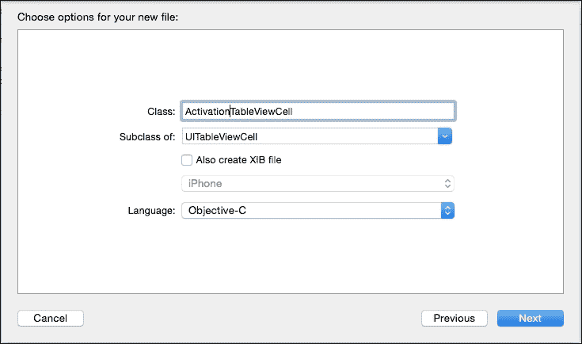

在`ActivationTableViewCell.h`文件中，按照以下方式更改代码：

```swift
@interface ActivationTableViewCell : UITableViewCell

@property (strong, nonatomic) IBOutlet UILabel *name;
@property (strong, nonatomic) IBOutlet UILabel *start;
@property (strong, nonatomic) IBOutlet UILabel *end;
@property (strong, nonatomic) IBOutlet UILabel *period;

@end
```

现在我们可以创建一个自定义单元格来显示电源插头的每个激活信息，并将其与 ActivationTableViewCell 链接。我们将只展示主要步骤，但您可以参考下载的代码以获取所有详细信息。

1.  在**Main.storyboard**中，选择**ActivationsTableViewController**，然后选择其中的**原型单元格**。

1.  打开身份检查器，并在**类**列表框中选择**激活单元格视图控制器**。

1.  选择属性检查器。

1.  在**标识符**字段中输入`activationCell`。

1.  选择大小检查器，并在**行高**字段中选择 66。

1.  现在，您可以输入标签（UILabel）以显示每个激活的不同信息，更改颜色和字体大小，并添加以单元格原型结束的布局约束，如下一个屏幕截图所示：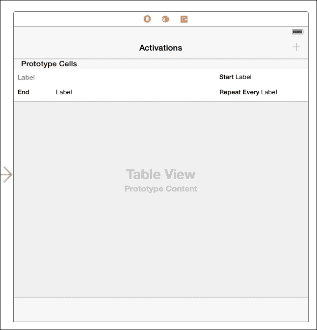

现在我们必须将单元格组件链接到类 ActivationTableViewCell。

1.  前往**编辑器** | **显示文档大纲**（您也可以使用下一个屏幕截图中圈红的图标打开此面板）。

1.  定位到**激活表格视图控制器** **场景**并展开它（见下一个屏幕截图）。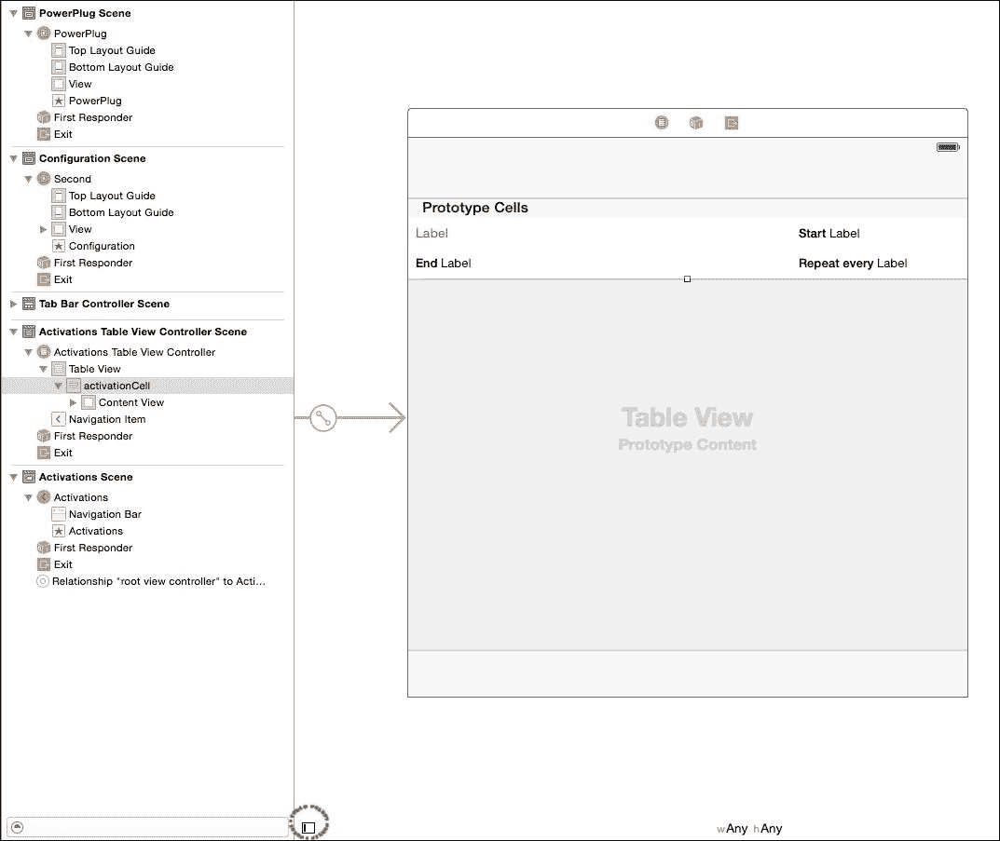

1.  选择**激活单元**并右键点击它。

1.  按住*控制*键，将类的每个属性拖到相关的图形组件上（见下一个屏幕截图）。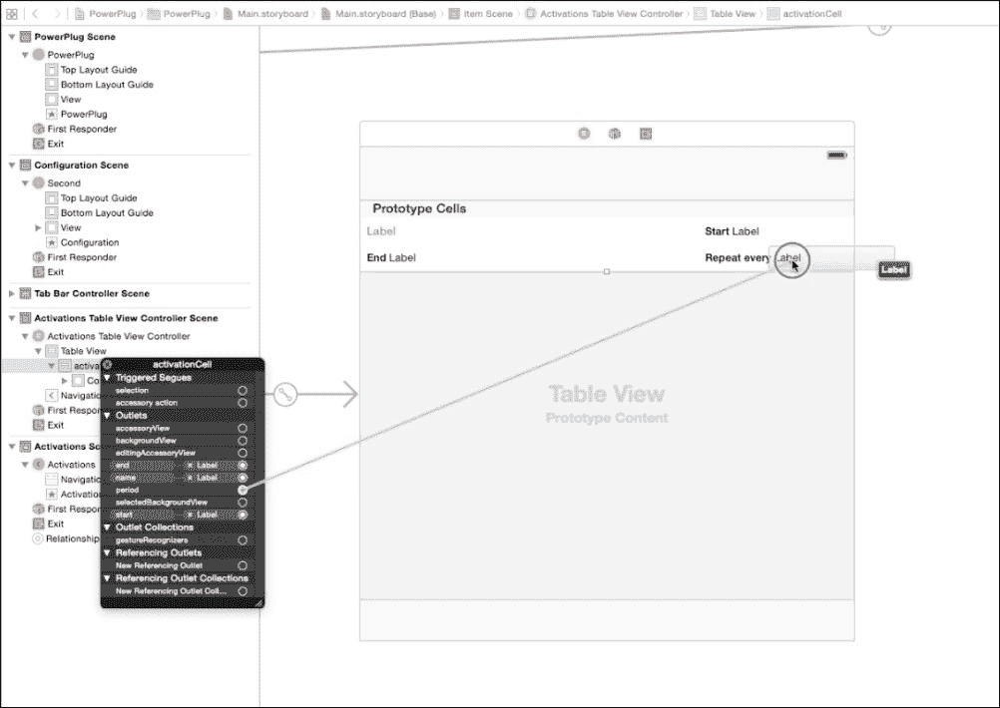

我们需要完成最后一步：创建输入和编辑每个激活的视图控制器（ActivationViewController）。

我们开始添加一个从 UIViewController 继承的新类，称为`ActivationViewController`，然后我们将新的视图控制器拖放到**Main.Storyboard**中，并在**身份检查器**中将它的类更改为`ActivationViewController`。

此视图控制器使用了两个新的组件：

+   UIDatePicker：它允许用户选择一个日期。在我们的情况下，是激活必须开始的日期。

+   UISegmentControl：它允许用户轻松选择激活的长度以及激活必须启动的频率。

控制器的最终布局如下截图所示：

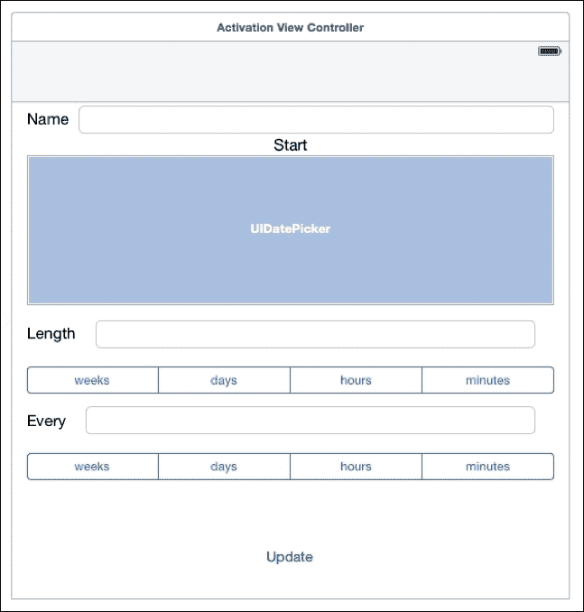

组件可以像我们已经学过的那样拖入容器中，我们可以设置它们的布局约束，就像在其他视图控制器中做的那样。组件通常与代码链接：

```swift
@property (nonatomic,weak) Activation *activation;

@property (strong, nonatomic) IBOutlet UITextField          *nameField;
@property (strong, nonatomic) IBOutlet UIDatePicker         *date;
@property (strong, nonatomic) IBOutlet UITextField          *length;
@property (strong, nonatomic) IBOutlet UISegmentedControl   *lengthScale;
@property (strong, nonatomic) IBOutlet UITextField          *period;
@property (strong, nonatomic) IBOutlet UISegmentedControl   *periodScale;

@end
```

为了编辑激活，我们需要在用户点击表格的行时显示 ActivationViewController。为此，我们必须从单元格创建一个 segue 到具有以下步骤的视图控制器：

1.  按住*控制*键，将鼠标指针从单元格拖到 ActivationViewController（见下一个屏幕截图）。

1.  当出现黑色对话框时，选择**显示**：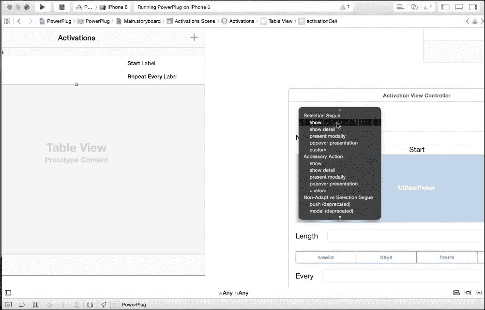

您可以在下载的代码中找到有关 ActivationViewController 的所有详细信息。

这个 ActivationsTableViewController 最后完成了。在我们开始编写视图控制器的代码之前，让我们先喘口气，喝杯咖啡。这是一段漫长而复杂的过程，我们实际上应该喝杯咖啡（或者如果你更喜欢的话，喝茶！）。

## 为 WiFiConnectionViewController 编写代码

此视图控制器的作用是确保用户输入分配给 Arduino 的 IP 地址和 IP 端口以连接到它。

在这个项目中，我们将把信息存储在文件中，而不是像我们在 Pet Door Locker 中做的那样存储在用户偏好设置中。

当点击更新按钮时，执行以下代码：

```swift
- (IBAction)updateConnectionInformation:(UIButton *)sender {

    if (![self validateIpAddress:_ipField.text]) {

        …

        return;
    }

    if ([_portField.text integerValue]<0 || [_portField.text integerValue]>65535) {

        …

        return;
    }

    NSMutableDictionary *connectionInformation = [[NSMutableDictionary alloc] init];

    [connectionInformation setValue:_ipField.text forKey:@"IP"];
    [connectionInformation setValue:_portField.text forKey:@"PORT"];

    NSArray *paths = NSSearchPathForDirectoriesInDomains(NSDocumentDirectory, NSUserDomainMask, YES);
    NSString *documentsDirectory = [paths objectAtIndex:0];
    NSString *path = [documentsDirectory stringByAppendingPathComponent:@"connection.plist"];

    [connectionInformation writeToFile:path atomically:YES];
}
```

两个字段的值存储在 `NSMutableDictionary` (`connectionInformation`) 中，并存储在一个名为 `writeToFile` 的文件中。此文件保存在名为 `documentsDirectory` 的目录中，该目录仅对应用程序可访问。

在保存信息之前，我们需要检查 IP 地址是否格式正确，端口是否在允许的范围内（有关所有详细信息，请参阅下载的代码）。

由于我们设置了文本字段的代理属性，每次用户完成字段的编辑时，以下方法之一将被调用，我们可以使用 `resignFirstResponder` 来隐藏键盘。

```swift
- (void)textFieldDidEndEditing:(UITextField *)textField {

    [textField resignFirstResponder];
}

- (BOOL)textFieldShouldReturn:(UITextField *)textField {

    [textField resignFirstResponder];

    return YES;
}
```

当我们点击文本字段 Period 时，键盘会覆盖它（至少在像 iPhone 这样的较小设备上）。为了避免这个问题，我们可以使用几个 UITextView 的代理方法将整个视图向上移动。当我们点击字段时，会调用 `textFieldDidBeginEditing` 方法，当我们退出字段或点击回车时，也会调用 `textFieldDidBeginEditing` 方法。

在 `textFieldDidBeginEditing` 方法中，我们可以翻译字段，通过将转换变换分配给字段来实现：

```swift
self.view.transform = CGAffineTransformMakeTranslation(0, -100);
```

然后我们以这两个附加方法结束：

```swift
- (void)textFieldDidBeginEditing:(UITextField *)textField {

    if ([textField isEqual:_period]) {

        self.view.transform = CGAffineTransformMakeTranslation(0, -100);
    }

}

- (void)textFieldDidEndEditing:(UITextField *)textField {

    if ([textField isEqual:_period]) {

        self.view.transform = CGAffineTransformMakeTranslation(0, 0);
    }
}
```

每次显示此视图控制器时，两个字段都会用现有值填充。

```swift
- (void)viewDidLoad {
    [super viewDidLoad];

    NSArray *paths = NSSearchPathForDirectoriesInDomains(NSDocumentDirectory, NSUserDomainMask, YES);
    NSString *documentsDirectory = [paths objectAtIndex:0];
    NSString *path = [documentsDirectory stringByAppendingPathComponent:@"connection.plist"];

    NSDictionary *connectionInformation = [NSDictionary dictionaryWithContentsOfFile:path];

    if (connectionInformation != nil) {
        _ipField.text = [connectionInformation objectForKey:@"IP"];
        _portField.text = [connectionInformation objectForKey:@"PORT"];
    }

}
```

## 为 AppDelegate 编写代码

在这个项目中，Arduino 的连接和通信由 `AppDelegate` 管理。

为了这个目的，我们需要一些属性：

```swift
@interface AppDelegate ()

@property (strong, nonatomic) GCDAsyncSocket                    *socket;
@property (strong, nonatomic) NSMutableArray                    *activations;

@property (strong, nonatomic) PowerPlugViewController           *powerPlugViewController;
@property (strong, nonatomic) ActivationsTableViewController    *activationsViewController;

@end
```

`socket` 属性（由我们添加的库提供）是一个用于从 Arduino 发送和接收数据的通道。数组 `activations` 存储了用户创建的所有激活。

当应用启动或进入前台时，它开始与 Arduino 建立连接：

```swift
-(void)connect {

    NSError *err = nil;

    NSArray *paths = NSSearchPathForDirectoriesInDomains(NSDocumentDirectory, NSUserDomainMask, YES);
    NSString *documentsDirectory = [paths objectAtIndex:0];
    NSString *path = [documentsDirectory stringByAppendingPathComponent:@"connection.plist"];

    NSDictionary *connectionInformation = [NSDictionary dictionaryWithContentsOfFile:path];

    if (![_socket connectToHost:[connectionInformation objectForKey:@"IP"]
                         onPort:[[connectionInformation objectForKey:@"PORT"] integerValue]
                          error:&err]) {
        NSLog(@"Connection Failed %@", [err localizedDescription]);

        return;
    }

    [_socket readDataWithTimeout:5 tag:0];
}
```

如果与 Arduino 的连接成功，将调用代理方法 `didConnectToHost`。

`readDataWithTimeout` 方法允许您从对端接收数据：当有数据可用时，调用 `didReadData` 方法。

由于我们设置了超时（5 秒），如果在这么长时间内没有接收到数据，则调用 `socketDidDisconnect` 方法。

让我们看看每个方法。

```swift
- (void)socket:(GCDAsyncSocket *)sender didConnectToHost:(NSString *)host port:(UInt16)port {

    [_powerPlugViewController arduinoConnected];
}
```

这里，我们只是通知 `PowerPlugViewController` 实例连接已成功。

```swift
- (void)socketDidDisconnect:(GCDAsyncSocket *)sock withError:(NSError *)error {

    [_powerPlugViewController arduinoDisconnected];
    _activations = nil;
}
```

在这里，我们只是通知 `PowerPlugViewController` 实例 Arduino 已断开连接，并且我们释放了我们正在使用的激活。

从 Arduino 我们可以接收两种类型的消息：

+   **状态**：它以字符 `'S'` 开头，后面跟着两个字节：

    +   第一个字节为 1 如果电器是手动开启的，否则为 0

    +   第二个字节是电器的状态：如果关闭则为 0，如果开启则为 1

+   **激活**：它以字符 `'A'` 开头，后面跟着 `ACTIVATION_SIZE_ON_ARDUINO * NUMBER_OF_ACTIVATIONS` 个字节，这些字节代表激活

在以下方法中接收来自 Arduino 的消息，并按照之前的规则进行处理。

```swift
- (void)socket:(GCDAsyncSocket *)sender didReadData:(NSData *)data withTag:(long)tag {

    NSLog(@"Bytes received %lu",(unsigned long)[data length]);

    if ([data length]<3) {
        return;
    }

    NSString* answerType = [[NSString alloc] initWithData:[data subdataWithRange:NSMakeRange(0, 1)]
                                             encoding:NSASCIIStringEncoding];

    // S<manual><appliance status>
    // A<activations>

    if ([answerType isEqualToString:@"S"]) {

        BOOL manual;
        BOOL status;

        [[data subdataWithRange:NSMakeRange(1, 1)] getBytes: &manual length: 1];
        [[data subdataWithRange:NSMakeRange(2, 1)] getBytes: &status length: 1];

        [_powerPlugViewController updateStatus:manual applianceStatus:status];
    }

    if ([answerType isEqualToString:@"A"]) {

        if (data.length < (ACTIVATION_SIZE_ON_ARDUINO * NUMBER_OF_ACTIVATIONS + 1)) {

            NSLog(@"Error reading data");

            return;
        }

        for (int i=0; i<NUMBER_OF_ACTIVATIONS; i++) {

            NSData *nameData = [data subdataWithRange:NSMakeRange(1+ACTIVATION_SIZE_ON_ARDUINO*i, 21)];
            NSString *name = [NSString stringWithCString:nameData.bytes encoding:NSASCIIStringEncoding];

            if (name.length>0) {

                NSData *startData = [data subdataWithRange:NSMakeRange(1+ACTIVATION_SIZE_ON_ARDUINO*i+21, 4)];

                NSInteger start=0;
                [startData getBytes: &start length: 4];

                NSData *lengthData = [data subdataWithRange:NSMakeRange(1+ACTIVATION_SIZE_ON_ARDUINO*i+21+4, 2)];

                NSInteger length=0;
                [lengthData getBytes: &length length: 2];

                NSData *periodData = [data subdataWithRange:NSMakeRange(1+ACTIVATION_SIZE_ON_ARDUINO*i+21+4+2, 2)];

                NSInteger period=0;
                [periodData getBytes: &period length: 2];

                Activation *activation = [[Activation alloc] init];
                activation.name = name;
                activation.start = [NSDate dateWithTimeIntervalSince1970:start];
                activation.length = length;
                activation.period = period;

                [_activations addObject:activation];
            }
        }

        [_activationsViewController dataReceived];
    }

    [sender readDataWithTimeout:5 tag:0];
}
```

如果收到状态消息，`PowerPlugViewController` 实例会被通知：

```swift
 [_powerPlugViewController updateStatus:manual applianceStatus:status];
```

如果收到激活消息，每个激活都会添加到 `_activations` 中：

```swift
[_activations addObject:activation];
```

最后，ActivationsViewController 的实例会被通知所有激活都可用：

```swift
[_activationsViewController dataReceived];
```

AppDelegate 也实现了 PowerPlugViewController 和 ActivationsViewController 视图控制器的代理方法。

对于 ActivationsViewController，实现的方法是 `getActivations`、`updateActivationOfIndex` 和 `deleteActivationOfIndex`。

当 ActivationsViewController 需要显示配置的激活列表时，会调用 `getActivations` 方法。

```swift
-(NSMutableArray *)getActivations {

    if (_activations == nil) {

        _activations = [[NSMutableArray alloc] init];

        NSString *message = @"A";
        [_socket writeData:[message dataUsingEncoding:NSASCIIStringEncoding] withTimeout:-1 tag:0];

        [_activationsViewController dataRequested];

        return _activations;
    }

    return _activations;
}
```

如果 `_activations` 为空，则向 Arduino 发送一条消息，它将响应所有激活的列表。消息非常简单：只有一个字节，值为 `'A'`（激活）。

消息实际上是通过调用 Arduino 发送的：

```swift
[_socket writeData:[message dataUsingEncoding:NSASCIIStringEncoding] withTimeout:-1 tag:0];
```

当激活被更新（或添加）时，ActivationsViewController 会调用 `updateActivationOfIndex` 方法。当需要删除激活时，ActivationsViewController 会调用 `deleteActivationOfIndex` 方法。

对于这两个方法的完整实现，请查看下载的代码。

为 PowerPlugViewController 实现的方法是 `sendSwitchCommand` 和 `reconnect`，它们非常简单，你可以直接从下载的代码中理解它们。

## 编写 PowerPlugViewController 的代码

这个视图控制器管理连接到电源插座的电器的手动操作。

首先，我们需要声明这个视图控制器响应的代理方法和消息。

```swift
@protocol PowerPlugViewControllerDelegate <NSObject>

-(void)sendSwitchCommand:(BOOL)on;
-(void)reconnect;

@end

@interface PowerPlugViewController : UIViewController 

-(void)arduinoConnected;
-(void)arduinoDisconnected;
-(void)updateStatus:(BOOL)manual applianceStatus:(BOOL)applianceStatus;

@property (strong, nonatomic) id<PowerPlugViewControllerDelegate> delegate;

@end
```

这个视图控制器非常简单，其方法相当自解释和直观。我们只需要看看 `updateStatus` 方法：

```swift
-(void)updateStatus:(BOOL)manual applianceStatus:(BOOL)applianceStatus {

    _manualOperationButton.on = manual;

    if (applianceStatus)
        _applianceStatus.image = [UIImage imageNamed:@"LEDon.png"];
    else
        _applianceStatus.image = [UIImage imageNamed:@"LEDoff.png"];
}
```

当 `applianceStatus` 为真时，电器被开启，我们将图像 `LEDon.png` 设置到 imageView (`_applianceStatus`) 中。这个图像模拟了一个开启的 LED。当电器关闭时，显示的图像是 `LEDoff.png`，模拟了一个关闭的 LED。

## 编写 ActivationsTableViewController 的代码

此视图控制器管理激活列表，允许用户添加、删除和更新每个激活。它基于 UITableView 组件，这是 UIKit 中最常用且功能强大的组件之一。

让我们从`ActivationsTableViewController.h`开始：

```swift
@protocol ActivationsTableViewControllerDelegate <NSObject>

-(NSMutableArray *)getActivations;
-(void)updateActivationOfIndex:(uint8_t)index;
-(void)deleteActivationOfIndex:(uint8_t)index;

@end

@interface ActivationsTableViewController : UITableViewController <ActivationViewControllerDelegate>

@property (strong, nonatomic) id<ActivationsTableViewControllerDelegate> delegate;

-(void)dataRequested;
-(void)dataReceived;

@end
```

到目前为止，你应该能够识别出视图控制器响应的代理协议和消息。

让我们从 UITableView 代理方法的实现开始。第一个是`numberOfRowsInSection`，当表格需要知道它需要显示多少项时会被调用：

```swift
- (NSInteger)tableView:(UITableView *)tableView numberOfRowsInSection:(NSInteger)section {

    return [_delegate getActivations].count;
}
```

这不需要很多解释。`cellForRowAtIndexPath`方法由 UIViewTable 为每个要显示的行调用：

```swift
- (UITableViewCell *)tableView:(UITableView *)tableView cellForRowAtIndexPath:(NSIndexPath *)indexPath {

    ActivationTableViewCell *cell = [tableView dequeueReusableCellWithIdentifier:@"activationCell"];
    if (cell == nil) {
        cell = [[ActivationTableViewCell alloc] initWithStyle:UITableViewCellStyleDefault reuseIdentifier:@"activationCell"];
    }

    Activation *activation = [_delegate getActivations][indexPath.row];

    cell.name.text = activation.name;

    NSDateFormatter *dateFormatter =  [[NSDateFormatter alloc] init];
    [dateFormatter setDateStyle:NSDateFormatterShortStyle];
    [dateFormatter setTimeStyle:NSDateFormatterMediumStyle];

    NSDate *endDate = [activation.start dateByAddingTimeInterval:60*activation.length];
    cell.start.text = [dateFormatter stringFromDate:activation.start];
    cell.end.text = [dateFormatter stringFromDate:endDate];

    ….

    return cell;
}
```

调用方法`[tableView dequeueReusableCellWithIdentifier:@"activationCell"]`我们得到一个单元格，并填充一个激活的值。

如果上一个函数返回 nil，则没有可用的单元格，必须创建一个：

```swift
cell = [[ActivationTableViewCell alloc] initWithStyle:UITableViewCellStyleDefault reuseIdentifier:@"activationCell"];
```

查看下载的代码以查看完整的方法实现。

当从 UITableView 中删除一行时，会调用以下方法：

```swift
- (void)tableView:(UITableView *)tableView commitEditingStyle:(UITableViewCellEditingStyle)editingStyle forRowAtIndexPath:(NSIndexPath *)indexPath {

    if (editingStyle == UITableViewCellEditingStyleDelete) {

        [[_delegate getActivations] removeObjectAtIndex:indexPath.row];

        [tableView deleteRowsAtIndexPaths:[NSArray arrayWithObject:indexPath] withRowAnimation:UITableViewRowAnimationFade];

        [_delegate deleteActivationOfIndex:indexPath.row];
    }
}
```

方法`deleteRowsAtIndexPaths`从表中删除行，而代理方法`deleteActivationOfIndex`创建一个消息，然后发送到 Arduino 以删除一个激活。

在设计界面时，我们从一个表格单元格到 ActivationViewController 创建了一个转场，以便当用户点击表格行时，ActivationViewController 会出现。

在启动 ActivationViewController 之前，会调用`prepareForSegue`方法：

```swift
- (void)prepareForSegue:(UIStoryboardSegue *)segue sender:(id)sender {

    ActivationViewController *activationViewController = (ActivationViewController *)[segue destinationViewController];
    activationViewController.delegate = self;

    NSIndexPath *p = [self.tableView indexPathForSelectedRow];

    NSMutableArray *activations = [_delegate getActivations];
    if (activations==nil)
        return;

    _selectedActivationIndex = p.row;

    [self.tableView deselectRowAtIndexPath:p animated:NO];
}
```

在这里，我们设置 ActivationViewController 的代理属性，并存储所选行的索引。

### 提示

**转场标识符**

对于从视图控制器开始的每个转场，都会调用`prepareForSegue`方法。通常，不同的目标视图控制器需要不同的初始化代码。在 Interface Builder 中，您可以设置每个转场的**标识符**，并使用这些说明来区分转场：

```swift
if ([segue.identifier isEqualToString:"<identifier>"]) {
….
}
```

ActivationViewController 需要两个代理方法，这些方法不需要任何解释：

第一项是`getActivation`：

```swift
-(Activation *)getActivation {

    return [_delegate getActivations][_selectedActivationIndex];
}
```

第二个是`update`：

```swift
-(void)update {

    [self.delegate updateActivationOfIndex:_selectedActivationIndex];
    [self.tableView reloadData];
}
```

我们只是指出，`[self.tableView reloadData]`强制表格视图重新加载数据，从调用`numberOfRowsInSection`开始，然后为每一行调用`cellForRowAtIndexPath`。

## 为 ActivationTableViewController 编写代码

此视图控制器除了获取用户输入的值和更新所选激活外，没有做更多的事情。

要了解详细信息，请参阅书中提供的代码。

## 测试和调整

当您完成应用程序后，您可以按照以下步骤测试系统：

1.  在 Arduino 草图中将 IP 信息（IP、网关等）和网络信息（SSID、密码）更改以适应您自己的网络配置。您可能需要访问路由器配置页面以获取此信息。

1.  将草图上传到 Arduino。

1.  检查 Arduino 控制台是否有任何错误信息。

1.  将驱动电路连接到电源线和外部设备（一盏灯就可以完成这项工作）。请遵循所有必要的安全措施，以避免任何电击。

1.  在你的设备或模拟器上运行 iOS 应用程序。

1.  点击配置并输入你在 Arduino 草图设置的 IP 地址和端口。

1.  点击电源插座，连接并开关按钮。你应该看到外部设备相应地打开和关闭。然后关闭你的设备。

1.  点击激活并输入一个激活码。你应该看到你的设备会根据你输入的时间和值自动打开和关闭。

如果你无法从 NTP 服务器获取时间，你可以尝试更改地址。要找到新的地址，你可以查看链接[`tf.nist.gov/tf-cgi/servers.cgi`](http://tf.nist.gov/tf-cgi/servers.cgi)或向地址`time.nist.gov`发送`ping`并使用返回的地址。

# 如何从世界任何地方访问电源插座

在本节中，你将学习如何从家庭网络外部访问你的 Arduino 板的基础知识。换句话说，你将能够通过移动网络使用 iOS 应用程序访问你家庭路由器/防火墙后面的电源插座。

### 注意

本节仅提供参考，因为市场上有很多路由器，网络配置也很多，实际上不可能提供完整的指南。无论如何，通过这个简要概述，你应该能够配置自己的设备。

## 端口转发

下一个图片显示了典型家庭网络的配置。

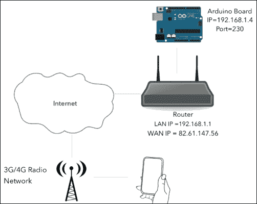

假设你的 IP 地址如下：

+   路由器 WAN IP：82.61.147.56

+   路由器 LAN IP：192.168.1.1

+   Arduino 板 IP：192.168.1.4

通常，你的 Arduino 板在内部网络中的 IP 地址对外部网络不可见，至少除非你明确配置你的路由器。这种配置称为 IP 端口转发。

基本上，此配置指示路由器将它在特定端口接收到的流量转发到另一个 IP 地址上的特定端口。

话虽如此，你的端口转发配置必须类似于以下这样：

(82.61.147.56, 230) --> (192.168.1.4, 230)

访问你的路由器配置页面（通常通过浏览器），你应该能够获取到你的互联网服务提供商分配给你的路由器的当前 IP 地址并配置端口转发。阅读你的路由器手册以了解如何设置此配置。

一旦你配置了端口转发，你可以使用以下方式访问 Arduino 板：

+   **IP**：82.61.147.56（或者更好的是，分配给你自己路由器的实际 IP 地址）

+   **端口**：230

### 小贴士

**请注意安全！**

一旦你启用了端口转发，任何人都可以访问它。这意味着任何人都可以轻松地访问你的电源插座并控制它。我们应该实现一个协议，该协议验证 iOS 设备，并加密所有交换的消息。不幸的是，Arduino 没有足够的处理能力和内存来完成这项任务。如果你想保持 iOS 设备和 Arduino 之间的通信安全，你必须设置一个虚拟专用网络（[`bit.ly/1ENoe3o`](http://bit.ly/1ENoe3o)）。有许多路由器提供 VPN，iOS 原生支持它。

## 动态 DNS

通常，每次你的路由器连接到互联网时，它都会获得一个不同的公共 IP 地址。因此，每次你的路由器重启时，你都需要更改 Arduino Manager 的 IP 地址。这并不实用。

许多**动态域名服务**（**DDNS**）可以将相同的名称动态地关联到你的路由器 IP 地址，即使地址发生变化。大多数都是免费的，其中包括：NoIP、yDNS 和 FreeDNS。

大多数路由器都配备了可用的 DDNS 客户端，易于配置；否则，你可能需要在连接到你的网络的计算机上安装简单的软件。

请访问服务提供商的网站进行注册，获取安装和配置步骤。此外，检查你的路由器以确定 DDNS 服务的可用性。

一旦你配置了你选择的动态 DNS 服务，假设你选择了一个像`powerplug.something.com`这样的域名，你可以通过以下方式访问 Arduino：

+   **IP**: `powerplug.something.com`

+   **端口**: 230

并且你不需要在重启路由器时更改它们。

# 如何更进一步

我们开发的项目可以通过许多方式改进，以下是一些你可以尝试的改进：

+   使用更多的 Arduino 引脚和更多的驱动电路控制更多的外部设备。

+   检查并向用户报告不同激活之间的任何冲突。

# 摘要

在本章中，你构建了一个设备，允许你手动或自动控制外部设备（如灯、洗衣机、咖啡壶等），按你的喜好开启和关闭，或指定时间开启和关闭。

你已经学会了不使用继电器制作电源电路，并从 Arduino 管理它。

在 Arduino 上，你已经学会了编写程序，读取和写入 SD 卡，使用 Wi-Fi 盾牌与 iOS 设备和外部服务（获取当前时间）进行通信，以及管理外部电源电路以控制外部设备。

在 iOS 上，你已经学会了如何使用 UITableView 设计一个中等复杂的应用程序的用户界面，它是与用户交互最常用的组件之一。你现在能够理解 MVC 模式并利用它在自己的程序中。此外，你已经学会了通过 TCP 套接字处理 TCP/IP 通信。

下一章将介绍如何使用 iOS 设备提供的硬件特性（加速度计）来控制漫游机器人，编写 Arduino 和 iOS 代码。
