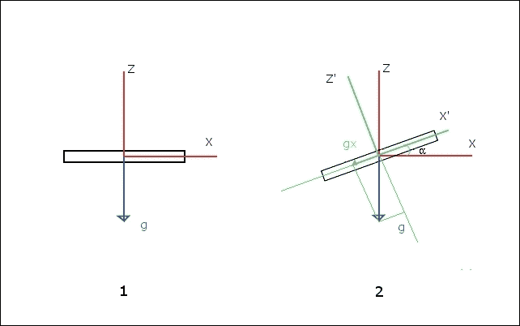
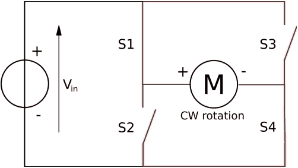
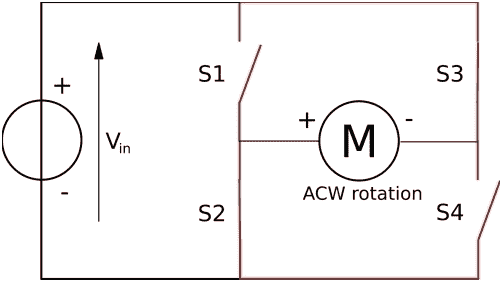
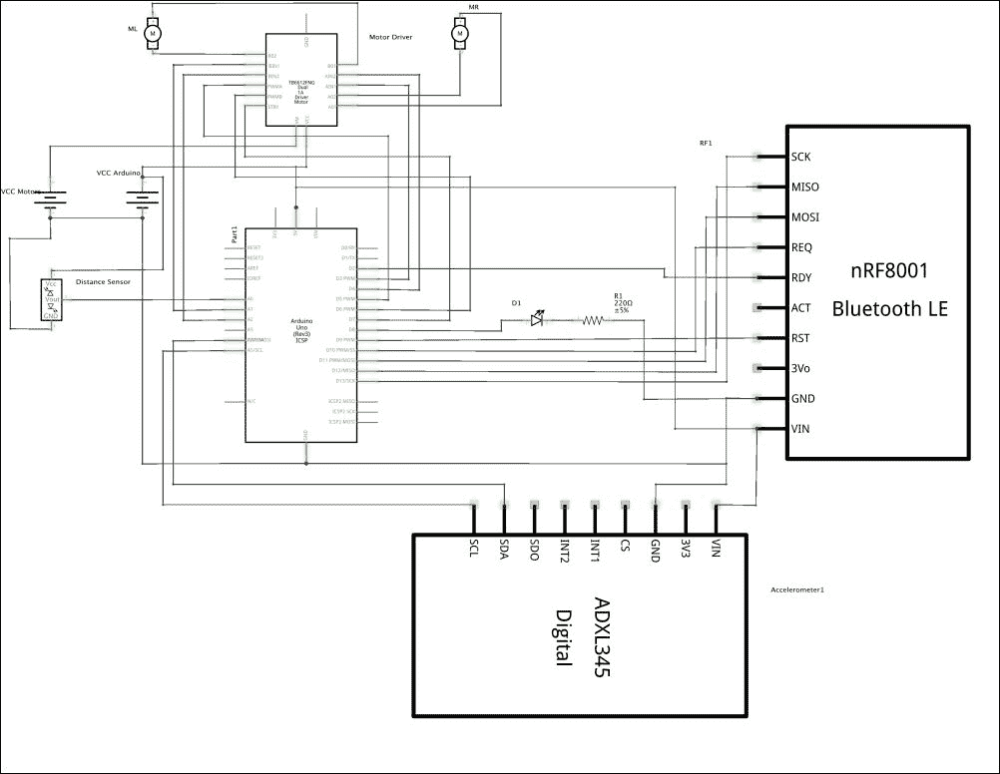
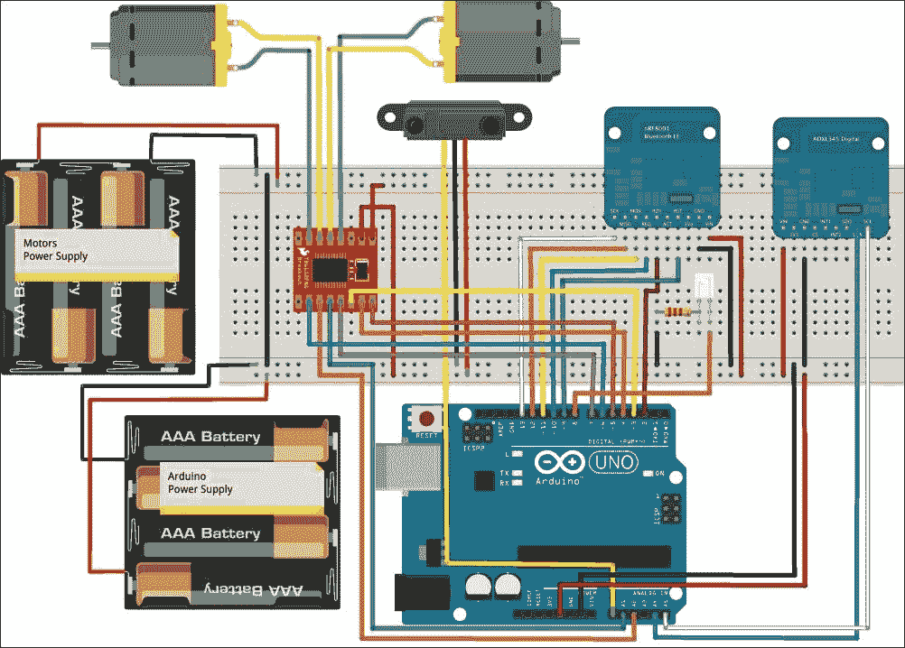
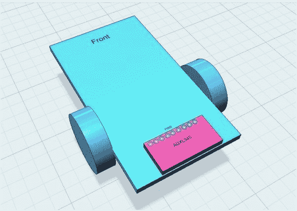
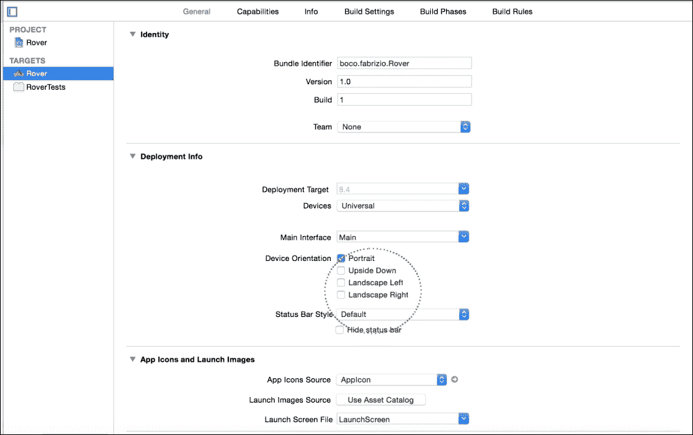
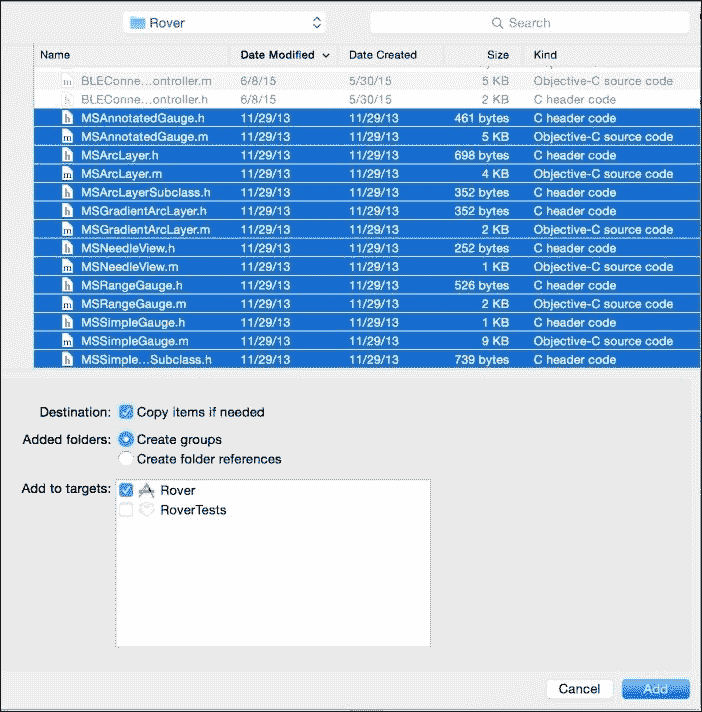
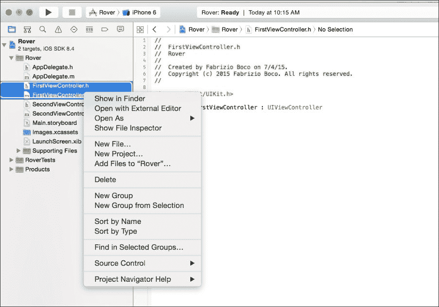
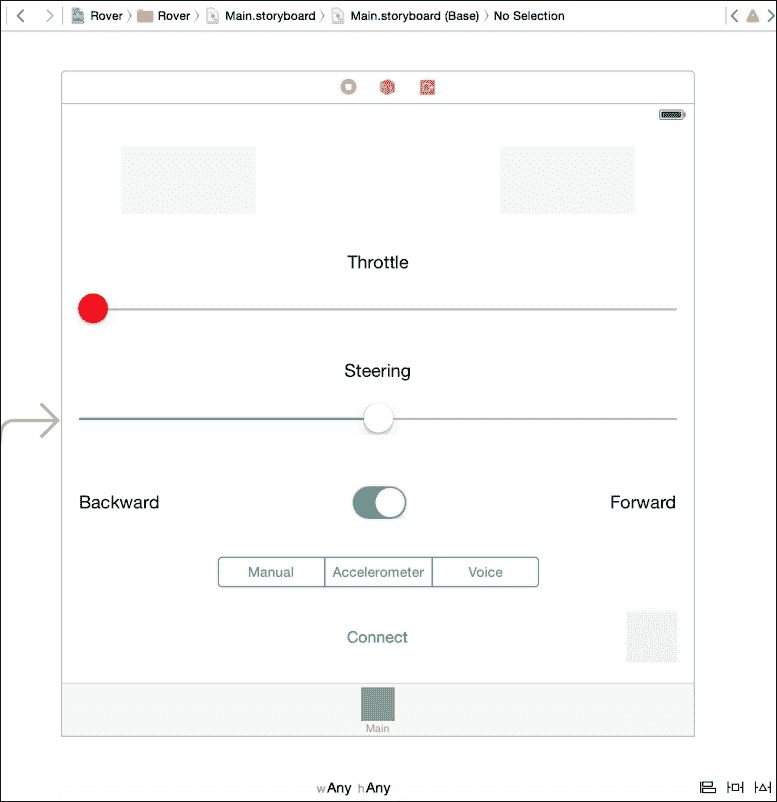

# 第四章：iOS 导航车

在本章中，我们将构建可以用来控制导航车机器人的软件。这有什么新意？孩子们已经玩遥控玩具多年了，有时我们仍然会玩这样的玩具！

然而，我们将构建一个可以通过以下三种不同方式由 iOS 设备控制的机器人：

+   通过手动命令：iOS 控制上的两个滑块：导航车的转向和油门

+   通过 iOS 设备在空间中的移动：通过左右移动 iOS 设备，你可以控制转向，通过前后移动 iOS 设备，你可以控制油门

+   通过使用语音命令：通过说出几个语音命令，iOS 设备可以控制转向和油门

很酷，不是吗？让我们迅速开始这段令人着迷的机器人之旅，同时不忘这里学到的技术可以用于许多其他项目。

本章分为以下部分：

+   iOS 导航车需求：我们将简要设定项目需求

+   硬件：我们将描述项目所需的硬件和电子电路

+   Arduino 代码：我们将编写 Arduino 代码来控制外部设备并与 iOS 设备通信

+   iOS 代码：我们将为 iOS 设备编写代码

+   如何更进一步：将提供更多想法来改进项目并学习更多

# iOS 导航车需求

我们将开发 Arduino 和 iOS 软件来完成以下工作：

+   通过以下方式从 iOS 设备控制由两个电机驱动的导航车的方向和速度：

    +   使用手动命令

    +   在空间中移动 iOS 设备

    +   使用语音命令

+   避免障碍

+   测量斜率和倾斜角度，以便机器人不会翻倒

+   通过使用蓝牙 BLE 在导航车和 iOS 应用程序之间来回传输命令和信息。

# 硬件

我们将假设你已经构建了一个像以下网站展示的导航车机器人：

+   [`bit.ly/1MzmIYs`](http://bit.ly/1MzmIYs)

+   [`bit.ly/1Jo9qJS`](http://bit.ly/1Jo9qJS)

+   [`bit.ly/1i7oTag`](http://bit.ly/1i7oTag)

你也可以购买两个电机和两个轮子（更多信息，请访问 [`bit.ly/1i7oWTG`](http://bit.ly/1i7oWTG) 和 [`bit.ly/1KeHtdf`](http://bit.ly/1KeHtdf))，并用金属或木材自己制作底盘。

你可以在 eBay ([`www.ebay.com`](http://www.ebay.com)) 以可承受的价格找到你可能需要的所有东西。

## 额外的电子组件

在这个项目中，我们需要一些额外的组件：

+   Sparkfun DC Motor Driver TB6612FBG ([`www.sparkfun.com/products/9457`](https://www.sparkfun.com/products/9457) 或 [`www.adafruit.com/product/2448`](http://www.adafruit.com/product/2448))

+   Sharp GP2Y0A21YK 距离测量传感器单元 ([`www.sparkfun.com/products/242`](https://www.sparkfun.com/products/242))，它可以由 Arduino 代码中更改最小的类似单元替换

+   Adafruit ADXL345 三轴加速度计 ([`www.adafruit.com/products/1231`](http://www.adafruit.com/products/1231))

+   330 Ω 电阻 0.25w

+   一个红色 LED

## 什么是加速度计？

在本节中，我们将简要讨论加速度计是什么以及如何使用它。

加速度计是一种测量其三个轴上加速度的设备，并返回三个与加速度成正比的电压信号。

加速度计测量的加速度给我们提供了关于加速度计相对于地球重力场的倾斜信息。

要了解加速度与加速度计倾斜的关系，让我们检查以下图示的情况，我们只考虑两个轴（*z* 和 *x*）：



在图 **1** 中，加速度计的 *z* 轴与重力（**g**）平行，而 *x* 轴与重力正交。因此，沿 *x* 轴的加速度为零。在图 **2** 中，加速度计以角度 **α** 旋转。沿加速度计 *x* 轴的加速度是 gx，gx 是加速度计返回的沿 x 轴的加速度。总之，通过旋转加速度计，我们得到沿加速度计 *x* 轴的加速度，它与旋转本身成正比。同样，对于指向页面内部的 *y* 轴也是如此。

在这个项目中，我们利用这种特性将加速度计安装到探测车上来测量其在横向和纵向轴上的倾斜。同时，我们使用 iOS 设备的加速度计来测量设备倾斜，以控制探测车的方向和速度。

## 电子电路

当直流电机通电时，它会朝一个方向旋转，而当电压极性反转时，它会朝相反的方向旋转。

以下电路图展示了如何使用开关来给直流电机供电，以反转电压极性和旋转方向。在以下电路图中，电机按顺时针方向旋转：



而在第二种情况下，它按逆时针方向旋转：



晶体管可以替换开关，通过电子信号来控制方向。用晶体管替换四个开关的电路称为 H 桥 ([`bit.ly/1JBmdrE`](http://bit.ly/1JBmdrE))。

基本上，H 桥是一种电路，允许你通过两个输入信号来控制直流电机的方向。当第一个信号为高，第二个信号为低时，电机朝一个方向运行；当第一个信号为低，第二个信号为高时，电机朝相反方向运行。要控制电机的速度，我们还需要一个 PWM 信号（[`www.arduino.cc/en/Tutorial/PWM`](https://www.arduino.cc/en/Tutorial/PWM)）。TB6612FBG 电机驱动器包含两个 H 桥电路，可以为两个电机提供高达 1A 的电源。

以下表格，源自 TB6612FBG 数据表，描述了如何使用可用的输入信号来控制电机：

| 输入 | 输出 |
| --- | --- |
| **IN1** | **IN2** | **PWM** | **STBY** | **OUT1** | **OUT2** | **模式** |
| H | H | H/L | H | L | L | 短时制动 |
| L | H | H | H | L | H | 电机运行 |
| L | H | L | L | 短时制动 |
| H | L | H | H | H | L | 电机朝相反方向运行 |
| L | H | L | L | 短时制动 |
| L | L | H | H | 关闭（高阻抗） | 停止 |
| H/L | H/L | H/L | L | 关闭（高阻抗） | 等待 |

要使电机朝一个方向运行，我们必须将 IN1 置低，IN2 置高。PWM 信号控制电机速度。要使电机朝相反方向运行，我们必须将 IN1 置高，IN2 置低，PWM 信号仍然控制电机的速度。

PWM 信号可以通过 Arduino 的`analogWrite`函数生成。

以下电子电路图是我们项目所需的：



如要求，我们需要一个具有模拟输出的距离传感器；随着到前方物体的距离减小，输出电压降低。输出电压与距离之间的关系不是线性的（参见通过访问[`www.sparkfun.com/datasheets/Components/GP2Y0A21YK.pdf`](https://www.sparkfun.com/datasheets/Components/GP2Y0A21YK.pdf)获取的数据表），但在感兴趣的范围内可以线性化。在我们的应用中，我们只需要在漫游车非常接近障碍物时停止它。因此，我们不太关心实际距离。红色 LED 指示障碍物非常接近漫游车。

ADXL345 是一款 3 轴加速度计。它测量其三个轴上的加速度（单位为[m/s²]）。当漫游车完全静止且水平时，x 轴上的加速度为 0 m/s²，y 轴上的加速度为 0 m/s²，z 轴上的加速度为 9.8 m/s²，这是由于重力作用。当漫游车未水平时，沿轴读取的值不同。当测量的值超过阈值时，我们知道漫游车将要翻倒。

下图显示了如何在面包板上安装电路：



你可以看到我们使用了两个不同的电源，一个用于 Arduino 和电子元件，另一个用于电机。这样做的原因如下：

1.  电机可能需要与电子元件不同的电压。电机电源可以有不同的电压，高达 15V，这是 TB6612FBG 芯片所需的。

1.  电机会产生大量的电噪声，可能会干扰电子设备。在这个配置中，电子设备和电机是电隔离的。

1.  机器人可以运行更长的时间，特别是使用可充电电池。

### 小贴士

**电机布线**

如果一个电机以错误的方向旋转，你必须反转其电线。

## 如何使机器人转向

当两个电机以相同的速度旋转时，机器人直线行驶。要使其向右转，降低右轮的速度。我们降低的速度越多，机器人转得越厉害。这与使机器人向左转的方法完全相同。

也就是说，Arduino 代码必须管理两个电机的旋转速度，以控制电机的方向。

## 如何安装加速度计

确保加速度计板安装正确位置非常重要，以便正确读取加速度并与下一章中显示的 Arduino 代码一起工作。加速度计板必须用螺母和螺栓紧紧固定在机器人底盘上（最好使用两个螺母和螺栓，每个侧面一个）。

方案如下所示：



# Arduino 代码

该项目的完整代码可以从[`www.packtpub.com/books/content/support`](https://www.packtpub.com/books/content/support)下载。

为了更好地理解下几段中的解释，请在阅读时打开下载的代码。

在继续之前，我们需要从 Adafruit 安装以下额外的库：

+   **Adafruit ADXL345**：这是用来从 ADXL345 加速度计获取测量数据的

+   **Adafruit Unified Sensor**：这是一个通用的库，需要从上一个库中获取

要将库安装到 Arduino IDE 中，请打开菜单 **草图** | **包含库** | **管理库 …**。有关更多信息，请参阅第二章, *蓝牙宠物门锁*。

## 设置代码

请参考下载的代码，因为设置代码相当简单，不需要详细解释。

请注意，`currentSpeed`、`leftSpeed` 和 `rightSpeed` 分别是：机器人的当前速度、用于使机器人向左转的左轮速度降低，以及用于使机器人向右转的右轮速度降低。它们显然都在设置函数中设置为零。

`goingForward` 变量表示机器人是向前还是向后移动，它最初被设置为是（向前）。

最后几行初始化加速度计，这是库所要求的。`xOffset`和`yOffset`变量是关于在漫游车静止和平面时调整加速度计读数的。我们将在*测试和调整*部分讨论它们。

## 电机控制函数

在解释主代码之前，我们将查看以下电机控制函数：

+   `forward`: 这配置电机控制，使漫游车向前移动

+   `backward`: 这配置电机控制，使漫游车向后移动

+   `brake`: 这使漫游车停止

+   `throttle`: 这控制着漫游车的速度和方向

从之前的 TB6612FBG 表格（第 2 行）来看，为了使电机前进，我们需要将 IN1 设置为低，IN2 设置为高。这正是`forward`函数对两个电机所做的：

```swift
void forward() {

  digitalWrite(STBY, HIGH);

  digitalWrite(MR_I1, LOW);
  digitalWrite(MR_I2, HIGH);

  digitalWrite(ML_I1, LOW);
  digitalWrite(ML_I2, HIGH);
}
```

`backward`函数类似。从之前的表格第 3 行来看，我们需要将 IN1 设置为高，IN2 设置为低以改变方向，如下所示：

```swift
void backward() {

  digitalWrite(STBY, HIGH);

  digitalWrite(MR_I1, HIGH);
  digitalWrite(MR_I2, LOW);

  digitalWrite(ML_I1, HIGH);
  digitalWrite(ML_I2, LOW);
}
```

在这两个函数中，我们设置`STBY`为`HIGH`，以防我们之前通过将`STBY`设置为`LOW`来停止了漫游车。

再次，通过使用表格（第 5 行），使用以下函数来停止漫游车：

```swift
void brake(void) {

  digitalWrite(MR_I1, LOW);
  digitalWrite(MR_I2, LOW);

  digitalWrite(ML_I1, LOW);
  digitalWrite(ML_I2, LOW);

  digitalWrite(STBY, HIGH);
}
```

`throttle`函数非常重要，因为它控制着漫游车的速度和方向：

```swift
void throttle(int requiredSpeed, int requiredLeftSpeed, int requiredRightSpeed) {

  analogWrite(ML_PWM, requiredSpeed - requiredLeftSpeed);
  analogWrite(MR_PWM, requiredSpeed - requiredRightSpeed);
}
```

要设置每个电机的速度，我们必须将适当的 PWM 信号设置到 PWM 引脚。

如果你需要使漫游车直线行驶，设置的速度应使两个电机相等。否则，降低位于漫游车侧轮的速度，这是我们想要转向的方向。

## 主程序

漫游车控制软件的`loop`函数并不复杂，如下所示：

```swift
void loop() {

  uart.pollACI();

  if (iOSConnected) {

    // Check accelerometer
    if (millis() - lastAccelerometerCheck > ACCELEROMETER_CHECK_INTERVAL) {

      char buffer[32];
      char xBuffer[6];
      char yBuffer[6];

      lastAccelerometerCheck = millis();

      sensors_event_t event;

      accel.getEvent(&event);

      event.acceleration.x += xOffset;
      event.acceleration.y += yOffset;

      dtostrf(event.acceleration.x, 0, 2, xBuffer);
      dtostrf(event.acceleration.y, 0, 2, yBuffer);

      snprintf(buffer, 32, "%s:%s", xBuffer, yBuffer);
      uart.write((uint8_t *)buffer, strlen(buffer));

      //        Serial.print("X: "); Serial.print(event.acceleration.x); Serial.print("  ");
      //        Serial.print("Y: "); Serial.print(event.acceleration.y); Serial.print("  ");Serial.println("m/s² ");

    }
  }

  // Reads distance

  distance = 0;
  for (int i = 0; i < 16; i++)
    distance += analogRead(DISTANCEPIN);
  distance = distance / 16;

  if (distance > DISTANCETHRESHOLD) {
    leftSpeed = 0;
    rightSpeed = 0;
    throttle(0, 0, 0);
    digitalWrite(DISTANCEINDICATORPIN, HIGH);
  }
  else {
    digitalWrite(DISTANCEINDICATORPIN, LOW);
  }
}
```

当 iOS 设备连接后，每经过`ACCELEROMETER_CHECK_INTERVAL`毫秒，沿*x*和*y*轴的加速度值都会发送到 iOS 设备。然后，读取距离传感器。如果障碍物的距离大于`DISTANCETHRESHOLD`，漫游车停止，并且漫游车上的 LED 灯亮起。

由于距离传感器的读数相当多变（就像大多数模拟传感器一样），以下几行使用了 16 次读数的平均值：

```swift
for (int i = 0; i < 16; i++)
    distance += analogRead(DISTANCEPIN);
  distance = distance / 16;
```

要控制漫游车，iOS 功能必须发送以下命令：

+   F: 这用于使漫游车向前移动。

+   B: 这用于使漫游车向后移动。

+   T=<速度>: 这用于以<速度>的速度移动漫游车。速度范围在 0-100 之间。

+   R=<速度>: 这用于通过将右电机当前速度降低到<速度>来使漫游车向右移动。速度范围在 0-100 之间。

+   L=<速度>: 这用于通过将左电机当前速度降低到<速度>来使漫游车向左移动。速度范围在 0-100 之间。

如我们从第二章中的*蓝牙宠物门锁*项目所知，*蓝牙宠物门锁*，iOS 控制器的命令在`rxCallback`函数中被接收：

```swift
void rxCallback(uint8_t *buffer, uint8_t len) {

  if (len > 0) {

    char value[32];

    if (buffer[0] == 'F') {

      forward();
      goingForward = true;
    }

    if (buffer[0] == 'B') {

      backward();
      goingForward = false;
    }

    if (buffer[0] == 'T') {

      strncpy(value, (const char *)&buffer[2], len - 2);
      value[len - 2] = 0;

      currentSpeed = map(atoi(value), 0, 100, 0, 255);
      if (currentSpeed == 0) {
        rightSpeed = 0;
        leftSpeed = 0;
      }
    }

    if (buffer[0] == 'R') {

      strncpy(value, (const char *)&buffer[2], len - 2);
      value[len - 2] = 0;
      //Serial.print("Right Speed "); Serial.println(atoi(value));
      rightSpeed = map(atoi(value), 0, 100, 0, currentSpeed);
      leftSpeed = 0;
    }

    if (buffer[0] == 'L') {

      strncpy(value, (const char *)&buffer[2], len - 2);
      value[len - 2] = 0;

      leftSpeed = map(atoi(value), 0, 100, 0, currentSpeed);
      rightSpeed = 0;
    }

    throttle(currentSpeed, leftSpeed, rightSpeed);
  }

}
```

F(Forward)和 B(Backward)命令处理起来非常简单，因为我们有相应的函数可以调用。

对于 T(hrottle)命令，我们在`value`变量中获取所需的速度降低值，并将其从 0-100 的范围按比例缩放到 0-255 的范围（`currentSpeed = map(atoi(value), 0, 100, 0, 255)`）。这是 PWM 信号的预期范围。

函数通过调用`throttle`函数结束，该函数为两个电机设置速度，从而设置 PWM 信号。

对于 R(ight)命令，我们在`value`变量中获取所需的速度降低值。然后，我们将 0-100 的范围按比例缩放到 0-`currentSpeed`的范围。实际上，右电机速度降低不能超过实际电机速度。换句话说，当命令值为 255（最大旋转速度）时，右电机的速度降低到 0，探测车向右转。对于 L(eft)命令也是如此。

# iOS 代码

在本章中，我们将查看远程控制探测车的 iOS 应用程序。这个应用程序允许我们通过两个滑块手动控制探测车，这两个滑块模拟方向盘和油门。

然而，我们将通过使用 iOS 设备加速度计甚至语音命令将应用程序推进得更远。这些技术也可以成功地应用于许多其他项目。

让我们一步一步来，这样你可以理解每一个重要的细节。我们将从手动控制开始。和往常一样，这个项目的完整代码可以从[`www.packtpub.com/books/content/support`](https://www.packtpub.com/books/content/support)下载。

为了更好地理解下一段落的解释，请在阅读时打开下载的代码。

## 创建 Xcode 项目

我们将创建一个新的项目，就像之前章节中做的那样。以下是新项目的参数：

+   **项目类型**：分页应用

+   **产品名称**：探测车

+   **语言**：Objective-C

+   **设备**：通用

在项目的选项中，我们需要取消选择以下选项：

+   **横屏向右**

+   **横屏向左**

我们这样做是因为我们打算使用 iOS 加速度计，我们不希望设备旋转时屏幕也旋转（见以下截图）。要访问项目的选项，请执行以下步骤：

1.  在 Xcode 的左侧窗格中选择项目。

1.  在右侧窗格中选择**通用**选项卡。

我们需要额外的代码和图形组件来通过两个仪表显示探测车的倾斜角度。该库可以从[`github.com/sabymike/MSSimpleGauge`](https://github.com/sabymike/MSSimpleGauge)下载。

要安装额外的代码，请执行以下步骤：

1.  打开前面的链接，点击右侧的**下载 ZIP**按钮。

1.  解压下载的 ZIP 文件。

1.  打开`Gauges`文件夹，并将文件复制到项目的`Rover`文件夹中。

1.  在 Xcode 中选择**Rover**组，右键单击它。选择**将文件添加到"Rover"…**。然后，选择您刚刚复制的文件，并点击**添加**。确保已选中**如果需要则复制项**（见以下截图）：

1.  在 Xcode 中，选择您刚刚添加的文件，右键单击它们，选择**从选择新建组**，然后输入`Gauges`。这有助于我们保持代码的整洁。

1.  为了避免编译错误，打开文件`MSArcLayer.h`，并在`#import <QuartzCore/QuartzCore.h>`之前添加`#import <UIKit/UIKit.h>`。

我们还需要库接受语音命令（OpenEars），可以从[`www.politepix.com/openears/`](http://www.politepix.com/openears/)下载。

点击**下载 OpenEars**按钮。要安装库，您必须执行以下步骤：

1.  解压缩下载的文件。

1.  在您下载的发行版中，有一个名为`Framework`的文件夹。将`Framework`文件夹拖放到 Xcode 中的您的应用程序项目中。

现在我们已经配置了所需的附加库，我们可以开始创建应用程序。

此项目的结构非常接近 Pet Door Locker。因此，我们可以通过以下步骤重用至少一部分用户界面和代码：

1.  选择**FirstViewController.h**和**FirstViewController.m**，右键单击它们，并点击**删除**（见以下截图）。然后，点击**移动到废纸篓**：

1.  通过使用相同的程序，删除**SecondViewController**和**Main.storyboard**。

1.  在 Xcode 中打开**PetDoorLocker**项目。

1.  选择以下文件，并将它们拖放到**Rover**项目中：

    +   **PetDoorLockerViewController.h**

    +   **PetDoorLockerViewController.m**

    +   **BLEConnectionViewController.h**

    +   **BLEConnectionViewController.m**

    +   **Main.storyboard**

    确保已选中**如果需要则复制项**，然后点击**完成**：

    ### 注意

    如果您已经将图标添加到标签栏中，别忘了也将它们拖放过来。

    1.  使用我们在前几章中使用的相同程序，将`PetDoorLockerViewController`重命名为`RoverViewController`。

    1.  打开**Main.storyboard**并定位主**视图**控制器。

    1.  删除以下 GUI 组件：

        +   **门状态**、**温度**、**标签**和**锁**标签

        +   **开关**组件

    1.  将状态视图移至**连接**按钮附近，并更新其布局约束。

    1.  添加如图所示的 GUI 组件和相关布局约束：

        在顶部，有两个 UIView，其大小为 64 x 128，类为 MSRangeGauge（在属性检查器中更改它）

1.  对于**节流**滑块，转到属性检查器并设置以下值：

    +   **最小值**：0

    +   **最大值**：100

    +   **当前值**：0

    +   **滑块拇指**：红色或您喜欢的任何颜色

1.  对于 **Steering** 滑块，转到属性检查器并设置以下值：

    +   **最小值**：0

    +   **最大值**：200

    +   **当前值**：100

1.  对于分段控制器，转到属性检查器并将 **Segments** 设置为 3。

1.  通过双击每个分段并输入以下值来更改标题：

    +   手动

    +   加速度计

    +   语音

1.  选择视图控制器容器，并在身份检查器中，将 **Class** 更改为 **RoverViewController**。

1.  在 `RoverViewController.h` 文件中，添加 `#import "MSRangeGauge.h"`。

1.  将 GUI 组件连接到 RoverViewController 代码，如下所示：

    ```swift
    @property (strong, nonatomic) IBOutlet UIView               *connectionStatus;
    @property (strong, nonatomic) IBOutlet MSRangeGauge         *verticalIndicator;
    @property (strong, nonatomic) IBOutlet MSRangeGauge         *horizontalIndicator;
    @property (strong, nonatomic) IBOutlet UISlider             *throttleSlider;
    @property (strong, nonatomic) IBOutlet UISlider             *steeringWheelSlider;
    @property (strong, nonatomic) IBOutlet UISwitch             *directionSwitch;
    @property (strong, nonatomic) IBOutlet UISegmentedControl   *modeSegment;
    ```

    ### 注意

    在你的 `RoverViewController.m` 中，还有一些对旧项目的引用。不要担心这些引用。我们将在以下部分中删除它们。

1.  将油门滑块连接到方法，如下所示：`(IBAction)throttleChanged:(UISlider *)sender`。

1.  将转向滑块连接到方法，如下所示：`(IBAction)steeringWheelChanged:(UISlider *)sender`。

1.  将前后开关连接到方法，如下所示：`(IBAction)directionChanged:(UISwitch *)sender`。

1.  将模式分段控制器与方法连接，如下所示：`(IBAction)modeChange:(UISegmentedControl *)sender`。

## 编写 BLEConnectionViewController 的代码

由于我们已经从 PetDoorLocker 项目中复制了这个视图控制器，我们不需要对其进行更改。

我们节省了一些工作！

## 编写 RoverViewController 的代码

首先，我们必须通过以下步骤从之前的 PetDoorLocker 项目中删除不再需要的多余代码：

1.  打开 `RoverViewController.m`。

1.  删除以下行：

    ```swift
    @property (strong, nonatomic) IBOutlet UIView       *doorStatus;
    @property (strong, nonatomic) IBOutlet UILabel      *temperature;
    @property (strong, nonatomic) IBOutlet UISwitch     *manualLockSwitch;
    ```

1.  删除代码中关于 `_temperature` 和 `_doorStatus` 的行。如有疑问，请参考下载的代码。

1.  清空 `dataReceived` 函数；我们稍后会重写它：

    ```swift
    -(void)dataReceived:(NSString *)content {

    }
    ```

1.  完全删除 `switchChanged` 函数。

我们现在可以开始编写新的代码来控制我们的漫游车。

让我们从简单的部分开始——从漫游车接收加速度数据。这些数据提供了关于漫游车沿其纵向和横向轴倾斜的信息。

此信息将通过我们在主屏幕中添加的两个仪表（RMRangeGauges）显示。仪表必须在 `viewDidLoad` 方法中初始化，如下所示：

```swift
- (void)viewDidLoad {

    [super viewDidLoad];

    _centralManager = [[CBCentralManager alloc] initWithDelegate:self queue:nil];

    _verticalIndicator.transform = CGAffineTransformMakeRotation(M_PI/2);

    _verticalIndicator.minValue = 0;
    _verticalIndicator.maxValue = 200;
    _verticalIndicator.upperRangeValue = 130;
    _verticalIndicator.lowerRangeValue = 70;
    _verticalIndicator.value = 100;
    _verticalIndicator.fillArcFillColor = [UIColor colorWithRed:.9 green:.1 blue:.1 alpha:1];
    _verticalIndicator.rangeFillColor   = [UIColor colorWithRed:.2 green:.9 blue:.2 alpha:1];

    _horizontalIndicator.minValue = 0;
    _horizontalIndicator.maxValue = 200;
    _horizontalIndicator.upperRangeValue = 130;
    _horizontalIndicator.lowerRangeValue = 70;
    _horizontalIndicator.value = 100;
    _horizontalIndicator.fillArcFillColor = [UIColor colorWithRed:.9 green:.1 blue:.1 alpha:1];
    _horizontalIndicator.rangeFillColor   = [UIColor colorWithRed:.2 green:.9 blue:.2 alpha:1];

    …

}
```

代码非常易于理解，多亏了方法的自文档命名。

由于仪表是水平的，并且没有显示指针垂直方向的功能，我们使用以下指令：

```swift
_verticalIndicator.transform = CGAffineTransformMakeRotation(M_PI/2);
```

通过前面的代码，我们将第一个仪表旋转 90 度，以便更好地指示垂直倾斜。

倾斜数据以字符串形式通过 `dataReceived` 方法接收：<垂直倾斜>:<水平倾斜>，并将值设置为两个仪表，如下所示：

```swift
-(void)dataReceived:(NSString *)content {

    NSArray *components = [content componentsSeparatedByString:@":"];
    if (components.count != 2) {
        return;
    }

    float x = [components[0] floatValue];
    float y = [components[1] floatValue];

    _verticalIndicator.value = 100+20*y;
    _horizontalIndicator.value = 100+20*x;
}
```

在 `didDisconnectPeripheral` 方法中，当蓝牙设备断开连接时调用，我们必须通过添加以下行来重置两个仪表的位置：

```swift
    _verticalIndicator.value = 100;
    _horizontalIndicator.value = 100;
```

由于我们有三种操作漫游车的方式——手动、使用 iOS 加速度计和通过语音命令——我们将把代码编写分成三个不同的部分，以便更好地理解代码。

### 控制漫游车的手动代码

对于这个场景，我们需要编写管理油门滑块的代码来控制漫游车的速度，控制方向的转向滑块，以及控制其前进或后退运动的开关。

油门滑块的代码相当简单，因为我们只需要以 T=<速度>的形式向漫游车发送一条消息，如下所示：

```swift
- (IBAction)throttleChanged:(UISlider *)sender {

    NSInteger throttle = sender.value;

    NSString *msg = [NSString stringWithFormat:@"T=%ld",(long)throttle];

    NSData* data;
    data=[msg dataUsingEncoding:NSUTF8StringEncoding];

    [_arduinoDevice writeValue:data forCharacteristic:_sendCharacteristic type:CBCharacteristicWriteWithoutResponse];
}
```

用于控制方向的方 法并不复杂。它根据滑块相对于中间位置的位置发送两条消息——R=<速度>使漫游车向右转，L=<速度>使漫游车向左转：

```swift
- (IBAction)steeringWheelChanged:(UISlider *)sender {

    NSInteger steering = sender.value-100;

    NSString *msg;

    if (steering>0) {

        msg = [NSString stringWithFormat:@"R=%ld",(long)steering];
    }
    else {
        msg = [NSString stringWithFormat:@"L=%ld",(long)-steering];
    }

    NSData* data;
    data=[msg dataUsingEncoding:NSUTF8StringEncoding];

    [_arduinoDevice writeValue:data forCharacteristic:_sendCharacteristic type:CBCharacteristicWriteWithoutResponse];
}
```

为了完成对两个滑块的管理，我们需要更改`didConnectPeripheral`方法，以便当 iOS 设备连接到漫游车时，两个滑块重置到初始位置，如下所示：

```swift
- (void)centralManager:(CBCentralManager *)central didConnectPeripheral:(CBPeripheral *)peripheral {

    _steeringWheelSlider.value = 100;
    _throttleSlider.value = 0;

    [peripheral discoverServices:@[[CBUUID UUIDWithString:NRF8001BB_SERVICE_UUID]]];
}
```

我们需要编写的最后一个方法是控制前后方向。我们需要向漫游车发送两条简单的消息——`F`表示前进，`B`表示后退：

```swift
- (IBAction)directionChanged:(UISwitch *)sender {

    NSData* data;

    if (sender.on) {
        data=[@"F" dataUsingEncoding:NSUTF8StringEncoding];
    }
    else {
        data=[@"B" dataUsingEncoding:NSUTF8StringEncoding];
    }

    [_arduinoDevice writeValue:data forCharacteristic:_sendCharacteristic type:CBCharacteristicWriteWithoutResponse];

    _throttleSlider.value = 0;
    [self throttleChanged:_throttleSlider];
}
```

为了避免不希望的行为，每次我们切换方向时，通过调用`[self throttleChanged:_throttleSlider]`方法将速度设置为 0，使漫游车停止。

我们现在准备好进行漫游车的第一次测试。

### 使用手动驾驶测试漫游车

要进行第一次漫游车测试，你可以使用以下步骤：

1.  上传 Arduino 代码并检查控制台是否有任何错误信息。如果一切顺利，Arduino 就准备好控制你的漫游车了。

1.  打开两个电机和 Arduino 本身。

1.  将 iOS 应用程序上传到你的设备。

1.  前往第二个标签页以扫描蓝牙 BLE 扩展板。

1.  转到第一个标签页，并逐步增加油门滑块。你应该能看到漫游车向前移动。

1.  你可以通过移动转向滑块来使其左右移动。

1.  转动方向开关，漫游车停止。再次增加速度时，漫游车将朝相反方向移动。

1.  当上坡时，你会看到垂直和/或水平仪表的指针上下左右移动。

1.  当遇到障碍物时，漫游车应该在碰撞之前停止。

### 小贴士

**奇怪的漫游车移动**

如果漫游车移动到错误的方向，你可能没有正确连接一个或两个电机。交换错误方向旋转的电机线。

**奇怪的仪表指示**

如果仪表似乎没有根据斜坡移动，现在不必过于担心这个问题。我们稍后会校准它们。现在，我们只需要检查数据是否从漫游车正确传输到 iOS 设备。

### 小贴士

**缺失的仪表指示**

如果你没有看到仪表的任何指示，可能是在 ADXL345 设备布线时出现了错误。首先，请再次检查 Arduino 控制台是否有任何错误消息。如果这没有帮助，请从 Arduino 代码（`main loop`）中的以下两行取消注释：

```swift
Serial.print("X: ")
Serial.print(event.acceleration.x); Serial.print("  ");
Serial.print("Y: "); Serial.print(event.acceleration.y);
Serial.print("  ");Serial.println("m/s² ");
```

再次连接 iOS 设备并检查 Arduino 控制台。如果你能看到打印的数字，那么加速度计正在工作，你必须再次检查 iOS 代码。

**机器人撞到障碍物**

距离传感器对障碍物的形状、反射率和位置敏感，有时它无法避开它们。这就是为什么在现实世界的机器人中同时使用不同类型的传感器，并在不同的位置使用的原因。为了检查传感器是否正确连接并且按预期工作，你可以在以下行（在`main loop`中）取消注释：

```swift
Serial.print("D: "); Serial.println(distance);
```

现在，你应该能够在 Arduino 控制台中看到距离。

### 通过 iOS 加速度计控制机器人的代码

我们现在将通过使用 iOS 加速度计来控制转向和油门来改进我们的应用程序。

正如我们之前所学的，iOS 设备位置的任何偏差都可以被测量并使用，通过我们安装在机器人上的加速度计发送适当的命令。

要访问加速度计信息，我们需要使用`CMMotionManager`类。首先，我们在`RoverViewController.h`中添加`#import <CoreMotion/CoreMotion.h>`。然后，我们创建一个属性，如下所示：

```swift
@interface RoverViewController ()

…

@property (strong, nonatomic) CMMotionManager       *motionManager;

…

@end
```

最后，我们在`viewDidLoad`方法中初始化它，如下所示：

```swift
- (void)viewDidLoad {

    [super viewDidLoad];

…
    _motionManager = [[CMMotionManager alloc] init];
…
}
```

当在分段控制器上选择第二个按钮时，加速度计被激活，并调用相关的方法：

```swift
- (IBAction)modeChange:(UISegmentedControl *)sender {

    _throttleSlider.value = 0;
    _steeringWheelSlider.value = 100;

    if (_modeSegment.selectedSegmentIndex==1) {

        …
        [self useAccelerometer];
    }

    …
}
```

`useAccelerometer`方法实际上激活了加速度计：

```swift
-(void)useAccelerometer {

    [_motionManager setDeviceMotionUpdateInterval:0.2];
    [_motionManager startDeviceMotionUpdatesUsingReferenceFrame:CMAttitudeReferenceFrameXArbitraryZVertical
                                                        toQueue:[NSOperationQueue mainQueue]
                                                    withHandler:^(CMDeviceMotion *motion, NSError *error) {

                                                        CMQuaternion quat = motion.attitude.quaternion;

                                                        [self sendAccelerometersCommands:quat];
                                                    }];
}
```

`[_motionManager setDeviceMotionUpdateInterval:0.2]`方法指示运动管理器每 0.2 秒更新我们的代码，以加速度值。

下一个方法实际上开始更新我们的加速度计值代码，这些值是在处理程序块中接收到的。

幸运的是，iOS 不仅提供了设备三个轴的实际加速度值，还提供了四元数。不要害怕这个名字！它们只是简单地表示 iOS 设备在三维空间中的方向和旋转（如果你喜欢数学，请访问[`en.wikipedia.org/wiki/Quaternions_and_spatial_rotation`](https://en.wikipedia.org/wiki/Quaternions_and_spatial_rotation)）。从它们中，你可以轻松计算出 iOS 设备的俯仰和滚转两个角度（见以下图像）。

如果你喜欢数学，请访问[`en.wikipedia.org/wiki/Conversion_between_quaternions_and_Euler_angles`](https://en.wikipedia.org/wiki/Conversion_between_quaternions_and_Euler_angles)：


滚转用于改变漫游车的运动方向，俯仰用于控制油门。`-(void)sendAccelerometersCommands:(CMQuaternion)quad`方法计算这两个角度并生成需要发送到漫游车的消息，就像我们在`throttleChanged`和`steeringWheelChanged`中做的那样。

### 通过 iOS 设备移动来驾驶漫游车

为了测试漫游车，点击加速度计，切换到前进，并垂直握持 iOS 设备。通过在俯仰轴周围移动设备（参见上一张图片），漫游车应该开始向前移动。设备移动得越远，漫游车的速度就越快。通过向后移动设备，漫游车的速度会降低，你可以通过这种移动来停止漫游车。

为了使漫游车向左或向右转，设备必须围绕滚转轴向左或向右转动。

为了使命令更加或更少地响应，你可以尝试更改代码更新的频率，以新的加速度值，如下所示：

```swift
[_motionManager setDeviceMotionUpdateInterval:0.2];
```

不要忘记，增加更新间隔会增加电池消耗。这种权衡严格与你的漫游车和你的需求相关。

### 通过语音命令控制漫游车的代码

语音识别多年来一直是一个挑战，但现在，你可以在几分钟内将此功能添加到你的应用程序中。

我们已经添加了所需的库。因此，我们可以通过以下步骤开始添加所需的代码：

1.  打开`RoverViewController.h`并添加`#import <OpenEars/OEEventsObserver.h>`。

1.  将接口从`@interface RoverViewController : UIViewController <CBCentralManagerDelegate, CBPeripheralDelegate>`更改为`@interface RoverViewController : UIViewController <CBCentralManagerDelegate, CBPeripheralDelegate, OEEventsObserverDelegate>`。

1.  打开`RoverViewController.m`并添加以下导入：

    ```swift
    #import <OpenEars/OELanguageModelGenerator.h>
    #import <OpenEars/OEPocketsphinxController.h>
    #import <OpenEars/OEAcousticModel.h>
    #import <Slt/Slt.h>
    #import <OpenEars/OEFliteController.h>
    ```

1.  添加以下属性：

    ```swift
    @property (strong, nonatomic) NSString              *lmPath;
    @property (strong, nonatomic) NSString              *dicPath;

    @property (strong, nonatomic) OEEventsObserver      *openEarsEventsObserver;
    @property (strong, nonatomic) OEFliteController     *fliteController;
    @property (strong, nonatomic) Slt                   *slt;
    ```

1.  通过在`viewDidLoad`方法中添加以下代码来初始化属性。`words`数组包含将被识别的语音命令。其余的代码来自库的文档：

    ```swift
        NSMutableArray *words = [[NSMutableArray alloc] initWithArray:@[@"RIGHT", @"LEFT", @"CENTER", @"FORWARD", @"SLOWFORWARD", @"FASTFORWARD", @"BACKWARD", @"SLOWBACKWARD", @"FASTBACKWARD",@"STOP"]];

        _fliteController = [[OEFliteController alloc] init];
        _slt = [[Slt alloc] init];

        OELanguageModelGenerator *lmGenerator = [[OELanguageModelGenerator alloc] init];

        NSError *err=nil;
        NSString  *name = @"RoverVoiceControl";

        err = [lmGenerator generateLanguageModelFromArray:words withFilesNamed:name forAcousticModelAtPath:[OEAcousticModel pathToModel:@"AcousticModelEnglish"]];

        if(err == nil) {

            _lmPath = [lmGenerator pathToSuccessfullyGeneratedLanguageModelWithRequestedName:name];
            _dicPath = [lmGenerator pathToSuccessfullyGeneratedDictionaryWithRequestedName:name];

        } else {
            NSLog(@"Error: %@",[err localizedDescription]);
        }
    ```

1.  按以下方式更改`modeChange`方法（当它们未被使用时关闭语音命令识别和/或加速度计）：

    ```swift
    - (IBAction)modeChange:(UISegmentedControl *)sender {

        _throttleSlider.value = 0;
        _steeringWheelSlider.value = 100;

        if (_modeSegment.selectedSegmentIndex==0) {
            [[OEPocketsphinxController sharedInstance] stopListening];
            [_motionManager stopDeviceMotionUpdates];
        }

        if (_modeSegment.selectedSegmentIndex==1) {

            [[OEPocketsphinxController sharedInstance] stopListening];
            [self useAccelerometer];
        }

        if (_modeSegment.selectedSegmentIndex==2) {

            [_motionManager stopDeviceMotionUpdates];
            [self useVoice];
        }
    }
    ```

1.  添加以下`useVoice`方法。它激活语音命令的监听并配置库，以便在识别到语音命令时调用`pocketsphinxDidReceiveHypothesis`代理方法：

    ```swift
    -(void)useVoice {

        [[OEPocketsphinxController sharedInstance] setActive:TRUE error:nil];

        [[OEPocketsphinxController sharedInstance] startListeningWithLanguageModelAtPath:_lmPath
                                                                        dictionaryAtPath:_dicPath
                                                                     acousticModelAtPath:[OEAcousticModel pathToModel:@"AcousticModelEnglish"]
                                                                     languageModelIsJSGF:NO];

        [[OEPocketsphinxController sharedInstance] setSecondsOfSilenceToDetect:.7];
        [[OEPocketsphinxController sharedInstance] setVadThreshold:3.0];

        _openEarsEventsObserver = [[OEEventsObserver alloc] init];
        [_openEarsEventsObserver setDelegate:self];
    }
    ```

1.  添加`pocketsphinxDidReceiveHypothesis`方法，可以从下载的代码中复制。它除了格式化和向漫游车发送命令之外，没有做太多，就像我们已经为其他模式做了那样。我们只需要指出以下内容：

    +   `hypothesis`参数是一个包含已识别命令的字符串。

    +   `[_fliteController say:hypothesis withVoice:self.slt]`调用允许你听到由你的 iOS 设备发音的已识别命令。

        ```swift
        - (void) pocketsphinxDidReceiveHypothesis:(NSString *)hypothesis recognitionScore:(NSString *)recognitionScore utteranceID:(NSString *)utteranceID {

            [_fliteController say:hypothesis withVoice:self.slt];

            NSString *msg=nil;

            if ([hypothesis isEqualToString:@"FORWARD"]) {

                [_arduinoDevice writeValue:[@"F" dataUsingEncoding:NSUTF8StringEncoding] forCharacteristic:_sendCharacteristic type:CBCharacteristicWriteWithoutResponse];

                msg = [NSString stringWithFormat:@"T=%ld",60l];
            }

            …

            NSData* data;
            data=[msg dataUsingEncoding:NSUTF8StringEncoding];

            [_arduinoDevice writeValue:data forCharacteristic:_sendCharacteristic type:CBCharacteristicWriteWithoutResponse];
        }
        ```

1.  要完成应用，我们必须在`AppDelegate.m`文件中的`applicationDidEnterBackground`方法中添加几行代码，以便在应用被发送到后台时断开与漫游车的连接：

    ```swift
        UITabBarController *tabController = (UITabBarController *)_window.rootViewController;
        RoverViewController *roverController = tabController.viewControllers[0];

        [roverController disconnect];
    ```

### 通过语音命令控制漫游车

要尝试此功能，你必须点击“语音”然后说出任何可用的命令。当应用程序识别出语音命令时，它会发音已识别的命令，漫游车将相应地开始移动。

请注意，语音识别需要一些时间。因此，漫游车不太灵敏。语音模式更适合在开阔空间和长时间导航时使用（无论这对漫游车意味着什么！）。

如果你遇到触发语音识别的低背景噪音，你可以将此调用中的值在 1.5-3.5 的范围内提高：

```swift
[[OEPocketsphinxController sharedInstance] setVadThreshold:3.0]
```

要使漫游车稍微更灵敏，你可以尝试减少在语音结束后应用等待尝试识别语音的时间（默认值为 0.7 秒），如下所示：

```swift
[[OEPocketsphinxController sharedInstance] setSecondsOfSilenceToDetect:.7];
```

## 测试和调整

我们已经测试了漫游车的所有驾驶模式，但我们可能仍然会从安装在漫游车本身的加速度计中获得不可靠的读数。

要校准加速度计的读数，请使用以下程序：

1.  确保 ADXL345 牢固地安装在漫游车上，并且其轴与漫游车的纵向和横向轴平行。

1.  将漫游车放置在坚实、平坦的表面上，并使用水平仪确保漫游车处于水平状态。

1.  在 Arduino 代码的`loop`函数中注释掉以下行并上传：

    ```swift
          Serial.print("X: "); Serial.print(event.acceleration.x); Serial.print("  ");
          Serial.print("Y: "); Serial.print(event.acceleration.y); Serial.print("  ");Serial.println("m/s² ");
    ```

1.  通过 USB 线为 Arduino 供电并打开控制台。

1.  连接 iOS 设备。加速度读数在控制台上显示在两个轴上。它们应该是 0 或非常接近 0。如果不是这样，读取 10 到 20 次，计算平均值，并将这些值放入`setup`函数中的`xOffset`和`yOffset`变量。

现在，加速度计的读数应该更加一致，iOS 设备上的两个指针可以帮助你在崎岖地形上驾驶漫游车，避免翻车。

# 如何更进一步

以下是一些改进项目的建议：

1.  在 iOS 应用程序中显示前方障碍物的距离。

1.  当漫游车的倾斜超过一定阈值时停止漫游车。

1.  添加更多距离传感器或将距离传感器安装在伺服电机上，以便漫游车能够检测到其周围的障碍物。

1.  安装不同类型的传感器以更好地避免障碍物（例如，超声波距离传感器或激光距离传感器）。

1.  允许 iOS 设备横屏方向。提示——你需要通过使用`ViewController`类提供的某个方向代理方法（`willTransitionToTraitCollection, viewWillTransitionToSize`）来获取实际的 iOS 设备方向。

语音识别可以在许多项目中使用，因为它设置非常简单，而且效果相当不错。你可以开始将语音识别添加到 Wi-Fi 电源插头项目中。

如果你需要一个挑战，尝试通过让无人驾驶车意识到自己的位置来使其自主移动。（提示——你可以使用粒子滤波器来完成这个任务，但这是一个非常困难的主题。谷歌汽车就是基于这个以及其他很多技术）。

# 摘要

你被引入了令人着迷的机器人世界和遥控车辆的世界。你学习了如何编写 Arduino 代码来控制直流电机的速度和旋转方向，使用模拟红外传感器测量距离，以及通过加速度计测量沿三个轴的加速度。

你学习了如何在 iOS 设备上使用新的图形组件，如`UISlider`和`UISegmentedControl`，并利用 iOS 设备配备的加速度计。此外，你还学习了如何使用一个功能强大且易于使用的语音识别和文本到语音库来改进你的项目。

不要忘记，你现在有一辆可以驾驶的无人驾驶车，其他人不会认为你很奇怪；你并不是像孩子一样玩耍，你正在学习机器人！和你的无人驾驶车一起享受乐趣吧！

这一章节相当长，项目也很复杂，但现在我们可以喘口气了。在下一章中，我们将构建一个非常简单但极其强大的项目。它通过保持几乎相同的音量来控制电视机的音量，即使广告正在播放也是如此。即使项目相当简单，你也会学到很多关于红外发射器和接收器以及数字信号处理的知识。
