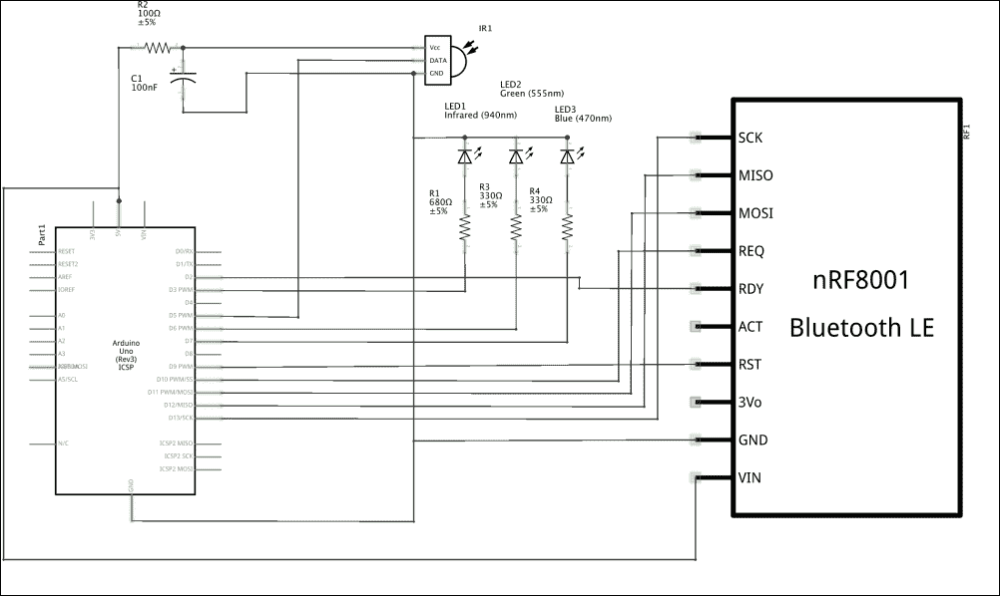
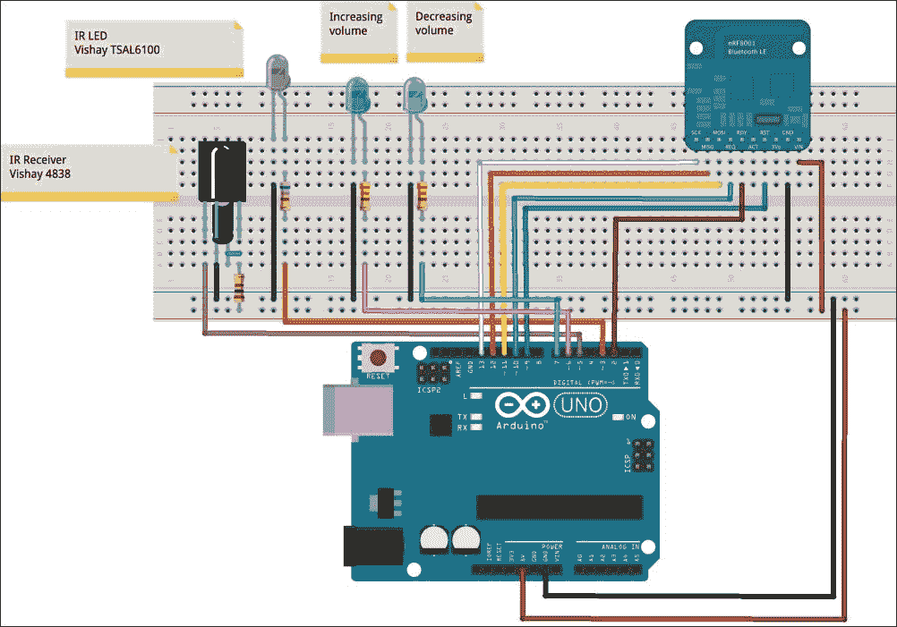
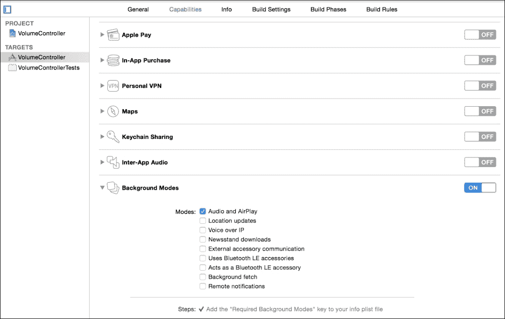
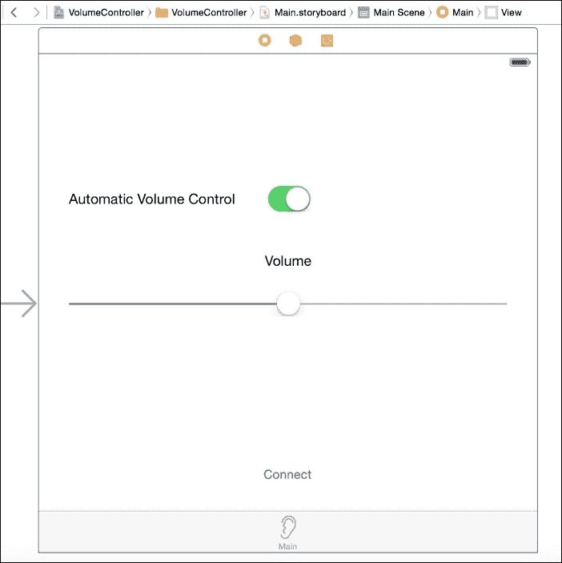
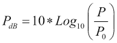
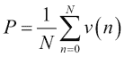

# 第五章. 电视恒定音量控制器

我不太看电视，但当我看的时候，我通常会完全放松并入睡。我知道电视不是用来让你入睡的，但它对我就是这样做的。不幸的是，广告的音量非常高，它们会把我吵醒。如果每五分钟就有一个广告把我吵醒，我怎么能放松呢？

你能相信吗？在两个广告之间的一个午睡中，我想出了一个基于 iOS 和 Arduino 的解决方案。

这并不复杂。iOS 设备监听电视的音频，当音频级别超过预设阈值时，iOS 设备会通过蓝牙发送消息到 Arduino，Arduino 控制电视音量，模拟传统的红外遥控器。当音量低于另一个阈值时，也会发生完全相同的情况。最终结果是电视音量几乎保持恒定，不受电视播放内容的影响。这有助于我睡得更久！

你在本章中将学习到的技术以多种不同的方式有用。你可以用红外遥控器实现任何目的，或者你可以控制许多不同的设备，例如 CD/DVD 播放器、立体声音响、Apple TV、投影仪等等，直接从 Arduino 和 iOS 设备上操作。就像往常一样，这取决于你的想象力。

# 恒定音量控制器要求

我们的目的是设计一个基于 Arduino 的设备，通过模拟传统的遥控器来使电视音量几乎保持恒定，以及一个 iOS 应用程序，该应用程序监控电视并决定何时降低或提高电视音量。

# 硬件

大多数电视都可以通过红外遥控器控制，它发送信号来控制音量、更换频道以及控制电视的所有其他功能。

红外遥控器使用一个载波信号（通常为 38 KHz），这种信号很容易从噪声和干扰中分离出来。

载波信号通过遵循不同的规则（编码）来打开和关闭，以便传输 0 和 1 的数字值。

红外接收器通过低通滤波器去除载波信号，并通过返回一个清晰的 0 和 1 序列来解码剩余的信号。

### 小贴士

**红外遥控器理论**

你可以在[`bit.ly/1UjhsIY`](http://bit.ly/1UjhsIY)找到有关红外遥控器的更多信息。

我们将通过使用红外 LED 来模拟红外遥控器，它将发送可以被我们的电视接收的特定信号。

另一方面，我们可以通过设计一个解调器和解码器，使用光电晶体管接收红外信号并将其解码成可理解的数字序列。

现在，电子设备非常简单；一个红外接收器模块（Vishay 4938）将处理信号解调、噪声消除、触发和解码的复杂性。它可以直接连接到 Arduino，使一切变得非常简单。

在本章的项目中，我们需要一个红外接收器来发现我们自己的红外遥控器（以及电视）所使用的编码规则。

## 额外的电子组件

在这个项目中，我们还需要以下额外的组件：

+   Vishay TSAL6100 红外 LED

+   Vishay TSOP 4838 红外接收模块

+   电阻 100Ω

+   电阻 680Ω

+   电解电容 0.1μF

## 电子电路

以下图片展示了我们为项目所需的电路的电原理图：



红外接收器将仅用于捕获电视遥控器的信号，以便我们的电路可以模拟它们。

然而，一个红外 LED 始终用于向电视发送命令。其他两个 LED 将在 Arduino 增加或减少音量时显示。它们是可选的，可以省略。

如往常一样，蓝牙设备用于接收 iOS 设备的命令。

### 小贴士

**在 Arduino 电流限制内供电红外 LED**

从 TSAL6100 的数据表中，我们知道正向电压是 1.35V。因此，R1 上的电压降为*5-1.35 = 3.65V*，Arduino 提供给 LED 的电流大约为*3.65/680=5.3 mA*。每个引脚允许的最大电流是 40 mA（推荐值为 20 mA）。所以，我们在 Arduino 的限制范围内。如果你的电视远离 LED，你可能需要降低 R1 电阻以获得更多电流（和红外光）。使用新的 R1 值在之前的计算中检查你是否在 Arduino 的限制范围内。有关 Arduino 引脚电流的更多信息，请查看[`bit.ly/1JosGac`](http://bit.ly/1JosGac)。

以下图示展示了如何在面包板上安装电路：



# Arduino 代码

该项目的全部代码可以从[`www.packtpub.com/books/content/support`](https://www.packtpub.com/books/content/support)下载。

为了更好地理解以下段落中的解释，请在阅读时打开下载的代码。

在这个项目中，我们将使用红外遥控库，它帮助我们编码和解码红外信号。

该库可以从[`bit.ly/1Isd8Ay`](http://bit.ly/1Isd8Ay)下载，并按照以下步骤安装：

1.  导航到[`bit.ly/1Isd8Ay`](http://bit.ly/1Isd8Ay)的发布页面，以获取最新版本并下载`IRremote.zip`文件。

1.  解压你喜欢的文件。

1.  打开**查找器**，然后是`应用程序`文件夹（*Shift* + *Control* + *A*）。

1.  定位 Arduino 应用程序。

1.  右键单击并选择**显示包内容**。

1.  定位`Java`文件夹，然后是`libraries`。

1.  将`IRremote`文件夹（在第 2 步中解压）复制到`libraries`文件夹中。

1.  如果 Arduino 正在运行，请重新启动 Arduino。

在这个项目中，我们需要以下两个 Arduino 程序：

+   一个用于获取你的红外遥控器发送的用于增加和减少音量的代码

+   另一个是 Arduino 必须运行的用于自动控制电视音量的主程序

让我们从用于获取红外遥控器代码的代码开始。

## 解码器设置代码

在本节中，我们将参考下载的 `Decode.ino` 程序，该程序用于发现您遥控器使用的代码。

由于设置代码相当简单，不需要详细解释；它只是初始化库以接收和解码消息。

## 解码器主程序

在本节中，我们将参考下载的 `Decode.ino` 程序；主代码接收来自电视遥控器的信号并输出相应的代码，这些代码将被包含在主程序中以模拟遥控器本身。

一旦程序运行，如果您按下遥控器上的任何按钮，控制台将显示以下内容：

```swift
For IR Scope: 
+4500 -4350 … 

For Arduino sketch: 
unsigned int raw[68] = {4500,4350,600,1650,600,1600,600,1600,…};
```

第二行是我们需要的。请参阅 *测试和调整* 部分以获取如何使用这些数据的详细说明。

现在，我们将查看将在 Arduino 上持续运行的 main 代码。

## 设置代码

在本节中，我们将参考 `Arduino_VolumeController.ino` 程序。设置函数初始化 nRF8001 板并配置可选监控 LED 的引脚。

## 主程序

`loop` 函数只是调用 `polACI` 函数以允许正确管理来自 nRF8001 板的传入消息。

该程序接受来自 iOS 设备的以下两条消息（参看 `rxCallback` 函数）：

+   `D` 用于降低音量

+   `I` 用于增加音量

以下两个函数通过发送两个 `up` 和 `down` 缓冲区通过红外 LED 来执行实际的音量增加和减少：

```swift
void volumeUp() {
  irsend.sendRaw(up, VOLUME_UP_BUFFER_LEN, 38);
  delay(20);
}

void volumeDown() {
  irsend.sendRaw(down, VOLUME_DOWN_BUFFER_LEN, 38);
  delay(20);
  irsend.sendRaw(down, VOLUME_DOWN_BUFFER_LEN, 38);
  delay(20);
}
```

`up` 和 `down` 缓冲区，`VOLUME_UP_BUFFER_LEN` 和 `VOLUME_DOWN_BUFFER_LEN`，是在 Decode.ino 程序的帮助下准备的（参见 *测试和调整* 部分）。

# iOS 代码

在本章中，我们将探讨一个 iOS 应用程序，该应用程序监控电视音量并将音量增加或减少命令发送到 Arduino 板，以保持所需的音量值。

该项目的完整代码可以从 [`www.packtpub.com/books/content/support`](https://www.packtpub.com/books/content/support) 下载。

为了更好地理解以下段落中的解释，请在阅读时打开下载的代码。

## 创建 Xcode 项目

我们将创建一个新的项目，就像我们在前面的章节中所做的那样。以下是你需要遵循的步骤：

以下是新项目的参数：

+   **项目类型**: 选项卡式应用程序

+   **产品名称**: VolumeController

+   **语言**: Objective-C

+   **设备**: 通用

要为此项目设置功能，请执行以下步骤：

1.  在 Xcode 的左侧面板中选择项目。

1.  在右侧面板中选择 **功能**。

1.  打开**后台模式**选项，并选择**音频和 AirPlay**（参见图示）。这允许 iOS 设备在 iOS 设备屏幕关闭或应用进入后台时也能监听音频信号：

由于此项目的结构与 Pet Door Locker 非常相似，我们可以通过以下步骤重用用户界面和代码的一部分（更多详情，请参阅第四章中的 iOS Guided Rover 项目[iOS Guided Rover]，我们在这里几乎做了同样的事情）：

1.  选择**FirstViewController.h**和**FirstViewController.m**，右键单击它们，点击**删除**，然后选择**移动到废纸篓**。

1.  使用相同的步骤，删除**SecondViewController**和**Main.storyboard**。

1.  在 Xcode 中打开**PetDoorLocker**项目。

1.  选择以下文件，并将它们拖放到此项目中（参见图示）。

    +   **BLEConnectionViewController.h**

    +   **BLEConnectionViewController.m**

    +   **Main.storyboard**

    确保选中**如果需要则复制项目**，然后点击**完成**。

1.  复制用于 BLEConnectionViewController 视图控制器的图标。

1.  创建一个新的视图控制器类，并将其命名为`VolumeControllerViewController`。

1.  打开**Main.storyboard**并定位主视图控制器。

1.  删除所有图形组件。

1.  打开身份检查器，将**类**更改为**VolumeControllerViewController**。

现在，我们准备好创建新应用所需的内容。

## 为 VolumeControllerViewController 设计用户界面

这个视图控制器是应用程序的主要视图控制器，并且只包含以下组件：

+   控制音量开关的开关

+   设置电视设置所需音量的滑块

一旦添加了组件及其布局约束，最终结果将类似于以下截图：



一旦 GUI 组件与视图控制器的代码链接，我们将得到以下代码：

```swift
@interface VolumeControllerViewController ()

@property (strong, nonatomic) IBOutlet UISlider     *volumeSlider;

@end

and with:
- (IBAction)switchChanged:(UISwitch *)sender {
…
}
- (IBAction)volumeChanged:(UISlider *)sender {
…
}
```

## 为 BLEConnectionViewController 编写代码

由于我们从 Pet Door Locker 项目复制了这个视图控制器，所以我们不需要更改它，除了将用于存储外围设备 UUID 的密钥从`PetDoorLockerDevice`更改为`VolumeControllerDevice`。

我们保存了一些工作！

现在，我们准备好开始处理 VolumeControllerViewController，这更有趣。

## 为 VolumeControllerViewController 编写代码

这是应用程序的主要部分；几乎所有事情都发生在这里。

我们需要一些属性，如下所示：

```swift
@interface VolumeControllerViewController ()

@property (strong, nonatomic) IBOutlet UISlider  *volumeSlider;

@property (strong, nonatomic) CBCentralManager   *centralManager;
@property (strong, nonatomic) CBPeripheral       *arduinoDevice;
@property (strong, nonatomic) CBCharacteristic   *sendCharacteristic;

@property (nonatomic,strong) AVAudioEngine       *audioEngine;

@property float                                  actualVolumeDb;
@property float                                  desiredVolumeDb;
@property float                                  desiredVolumeMinDb;
@property float                                  desiredVolumeMaxDb;

@property NSUInteger                             increaseVolumeDelay;

@end
```

其中一些用于管理蓝牙通信，不需要过多解释。`audioEngine`是`AVAudioEngine`的实例，它允许我们将 iOS 设备麦克风捕获的音频信号转换为数值样本。通过分析这些样本，我们可以获得与电视音量直接相关的信号功率（音量越高，信号功率越大）。

### 小贴士

**模拟-数字转换**

将模拟信号转换为表示信号自身在不同时间的振幅的数字序列的操作，称为模拟-数字转换。Arduino 模拟输入执行完全相同的操作。与数字-模拟转换一起，它是数字信号处理的基本操作，以及将音乐存储在我们的设备中并以合理的质量播放。更多详情，请访问[`bit.ly/1N1QyXp`](http://bit.ly/1N1QyXp)。

`actualVolumeDb`属性存储实际测量为 dB（分贝）的信号音量。

### 小贴士

**分贝（dB）**

分贝（dB）是一个对数单位，表示物理量两个值之间的比率。关于信号的功率，其分贝值按照以下公式计算：



在这里，P 是信号的功率，P[0]是参考功率。你可以在[`bit.ly/1LZQM0m`](http://bit.ly/1LZQM0m)了解更多关于分贝的信息。我们必须指出，如果 P < P[0]，则 P[dB]的值将低于零。因此，分贝值通常是负值，0dB 表示信号的最大功率。

`desiredVolumeDb`属性存储期望的音量，以 dB 为单位，用户通过应用主标签页中的音量滑块来控制此值；`desiredVolumeMinDb`和`desiredVolumeMaxDb`是从`desiredVolumeDb`派生出来的。

代码中最重要的一部分在`viewDidLoad`方法中（参考下载的代码）。

首先，我们实例化`AudioEngine`并获取默认的输入节点，即麦克风，如下所示：

```swift
    _audioEngine = [[AVAudioEngine alloc] init];
    AVAudioInputNode *input = [_audioEngine inputNode];
```

`AVAudioEngine`是一个非常强大的类，它允许数字音频信号处理。我们只是刚刚触及它的功能。

### 小贴士

**AVAudioEngine**

你可以通过访问[`apple.co/1kExe35`](http://apple.co/1kExe35)（AVAudioEngine 的实际应用）和[`apple.co/1WYG6Tp`](http://apple.co/1WYG6Tp)了解更多关于 AVAudioEngine 的信息。

我们将要使用的`AVAudioEngine`和其他函数要求我们添加以下导入：

```swift
#import <AVFoundation/AVFoundation.h>
#import <Accelerate/Accelerate.h>
```

通过在我们的输入节点总线上的输入上安装音频节，我们可以获取 iOS 设备所监听的信号的数值表示，如下所示：

```swift
[input installTapOnBus:0 bufferSize:8192 format:[input inputFormatForBus:0] block:^(AVAudioPCMBuffer* buffer, AVAudioTime* when) {
…
…
}];
```

一旦有新的数据缓冲区可用，代码块就会被调用，数据可以被处理。现在，我们可以看看将音频数据样本转换为实际控制电视的命令的代码：

```swift
for (UInt32 i = 0; i < buffer.audioBufferList->mNumberBuffers; i++) {

    Float32 *data = buffer.audioBufferList->mBuffers[i].mData;
    UInt32 numFrames = buffer.audioBufferList->mBuffers[i].mDataByteSize / sizeof(Float32);

  // Squares all the data values
    vDSP_vsq(data, 1, data, 1, numFrames*buffer.audioBufferList->mNumberBuffers);

            // Mean value of the squared data values: power of the signal
    float meanVal = 0.0;
    vDSP_meanv(data, 1, &meanVal, numFrames*buffer.audioBufferList->mNumberBuffers);

    // Signal power in Decibel
    float meanValDb = 10 * log10(meanVal);

    _actualVolumeDb = _actualVolumeDb + 0.2*(meanValDb - _actualVolumeDb);

    if (fabsf(_actualVolumeDb) < _desiredVolumeMinDb && _centralManager.state == CBCentralManagerStatePoweredOn && _sendCharacteristic != nil) {

        //printf("Decrease volume\n");

        NSData* data=[@"D" dataUsingEncoding:NSUTF8StringEncoding];
        [_arduinoDevice writeValue:data forCharacteristic:_sendCharacteristic type:CBCharacteristicWriteWithoutResponse];

        _increaseVolumeDelay = 0;
    }

    if (fabsf(_actualVolumeDb) > _desiredVolumeMaxDb && _centralManager.state == CBCentralManagerStatePoweredOn && _sendCharacteristic != nil) {

        _increaseVolumeDelay++;
    }

    if (_increaseVolumeDelay > 10) {

        //printf("Increase volume\n");

        _increaseVolumeDelay = 0;

        NSData* data=[@"I" dataUsingEncoding:NSUTF8StringEncoding];
                [_arduinoDevice writeValue:data forCharacteristic:_sendCharacteristic type:CBCharacteristicWriteWithoutResponse];
            }
        }
```

在我们的案例中，`for`循环只执行一次，因为我们只有一个缓冲区，我们只使用一个通道。

一个信号（由*N*个样本表示）的功率可以通过以下公式计算：



这里，*v* 是第 n 个信号样本的值。

因为功率计算必须在实时进行，我们将使用以下由加速框架提供的函数：

+   `vDSP_vsq`：此函数计算每个输入向量元素的平方

+   `vDSP_meanv`：此函数计算输入向量元素的均值

### 小贴士

**加速框架**

加速框架是一个用于数字信号处理的必备工具，它可以帮助你节省在实现最常用算法的时间，并且主要提供针对内存占用和性能优化的算法实现。有关加速框架的更多信息，请参阅[`apple.co/1PYIKE8`](http://apple.co/1PYIKE8)和[`apple.co/1JCJWYh`](http://apple.co/1JCJWYh)。

最终，信号功率存储在`_actualVolumeDb`中。当`_actualVolumeDb`的模数低于`_desiredVolumeMinDb`时，电视的音量太高，我们需要向 Arduino 发送消息来降低它。别忘了`_actualVolumeDb`是一个负数；当电视音量增加时，模数会减小这个数。相反，当电视音量降低时，`_actualVolumeDb`的模数会增加，并且当它高于`_desiredVolumeMaxDb`时，我们需要向 Arduino 发送消息来增加电视的音量。

在对话中的暂停期间，即使说话的音量没有改变，信号的功率往往会降低。如果没有任何调整，在对话期间会持续不断地向电视发送增加和减少的消息。为了避免这种行为，我们只在信号功率超过阈值一段时间后发送音量增加消息（当`_increaseVolumeDelay`大于 10 时）。

我们可以看看其他不复杂的视图控制器方法。

当属于视图控制器的视图出现时，会调用以下方法：

```swift
-(void)viewDidAppear:(BOOL)animated {

     [super viewDidAppear:animated];

    NSError* error = nil;

    [self connect];

    _actualVolumeDb = 0;
    [_audioEngine startAndReturnError:&error];

    if (error) {
        NSLog(@"Error %@",[error description]);
    }

}
```

在这个函数中，我们连接到 Arduino 板并启动音频引擎，以便开始监听电视。

当视图从屏幕消失时，会调用`viewDidDisappear`方法，然后我们断开与 Arduino 的连接并停止音频引擎，如下所示：

```swift
-(void)viewDidDisappear:(BOOL)animated {

     [self viewDidDisappear:animated];

    [self disconnect];

    [_audioEngine pause];
}
```

当开关被操作时调用的方法（`switchChanged`）相当简单：

```swift
- (IBAction)switchChanged:(UISwitch *)sender {

    NSError* error = nil;

    if (sender.on) {
        [_audioEngine startAndReturnError:&error];

        if (error) {
            NSLog(@"Error %@",[error description]);
        }
        _volumeSlider.enabled = YES;
    }
    else {
        [_audioEngine stop];
        _volumeSlider.enabled = NO;
    }
}
```

当音量滑块改变时调用的方法如下：

```swift
- (IBAction)volumeChanged:(UISlider *)sender {

    _desiredVolumeDb = 50.*(1-sender.value);
    _desiredVolumeMaxDb = _desiredVolumeDb + 2;
    _desiredVolumeMinDb = _desiredVolumeDb - 3;
}
```

我们只设置所需的音量和上下阈值。

用于管理蓝牙连接和数据传输的其他方法不需要解释，因为它们与之前的项目完全一样。

## 测试和调整

我们现在准备好测试我们新的神奇系统，并花更多的时间看电视（或者睡更多的午觉！）让我们执行以下步骤：

1.  加载`Decoder.ino`草图并打开 Arduino IDE 控制台。

1.  将电视遥控器指向 TSOP4838 接收器，并按下增加音量的按钮。你应该在控制台看到如下内容：

    ```swift
    For IR Scope: 
    +4500 -4350 … 

    For Arduino sketch: 
    unsigned int raw[68] = {4500,4350,600,1650,600,1600,600,1600,…};
    ```

1.  复制大括号之间的所有值。

1.  打开`Arduino_VolumeController.ino`文件，并将以下值粘贴进去：

    ```swift
    unsigned int up[68] = {9000, 4450, …..,};
    ```

1.  检查两个向量的长度（例如示例中的 68）是否相同，如有必要进行修改。

1.  将电视遥控器指向 TSOP4838 接收器，并按下降低音量的按钮。复制值并粘贴如下：

    ```swift
    unsigned int down[68] = {9000, 4400, ….,};
    ```

1.  检查两个向量的长度（例如示例中的 68）是否相同，如有必要进行修改。

1.  将`Arduino_VolumeController.ino`上传到 Arduino，并将红外 LED 指向电视。

1.  打开 iOS 应用程序，扫描 nRF8001，然后转到主标签页。

1.  点击连接，然后通过触摸滑块设置所需的音量。

1.  现在，你应该看到蓝色 LED 和绿色 LED 闪烁。电视的音量应该稳定到所需的值。

为了检查一切是否正常工作，请使用遥控器增加电视的音量；你应该立即看到蓝色 LED 闪烁，音量降低到预设值。同样，通过使用遥控器降低音量，你应该看到绿色 LED 闪烁，电视的音量增加。

小憩一下，广告就不会将你吵醒！

# 如何更进一步

以下是在此项目中可以实施的一些改进：

1.  改变频道和控制其他电视功能。

1.  通过拍手来打开或关闭电视。

1.  添加一个按钮来静音电视。

1.  在接收到电话时静音电视。

总之，你可以使用你学到的红外技术用于许多其他目的。例如，你可以修改第四章中的漫游项目，“iOS 引导式漫游”，通过红外遥控器控制机器人。查看 IRremote 库提供的其他功能，以了解其他提供的选项。你可以在`IRremote`库文件夹中找到存储的`IRremote.h`中的所有可用功能。

在 iOS 端，尝试使用 AV Audio Engine 和用于处理信号的 Accelerate 框架进行实验。

# 摘要

本章重点介绍了一个简单但实用的项目，并教你如何使用红外线将数据从 Arduino 发送和接收。你在这里学到的基本电路和程序有许多不同的应用。

在 iOS 平台上，你学习了从设备麦克风和 DSP（数字信号处理）捕获声音的非常基础的知识。这让你可以利用 iOS 平台的处理能力来扩展你的 Arduino 项目。

下一章将会非常精彩。你将神奇地打开你的车库门；你甚至不需要触摸你的 iOS 设备就能做到这一点。你还将了解到很多关于 iBeacon 技术的知识。你的想象力将是你的唯一限制！
