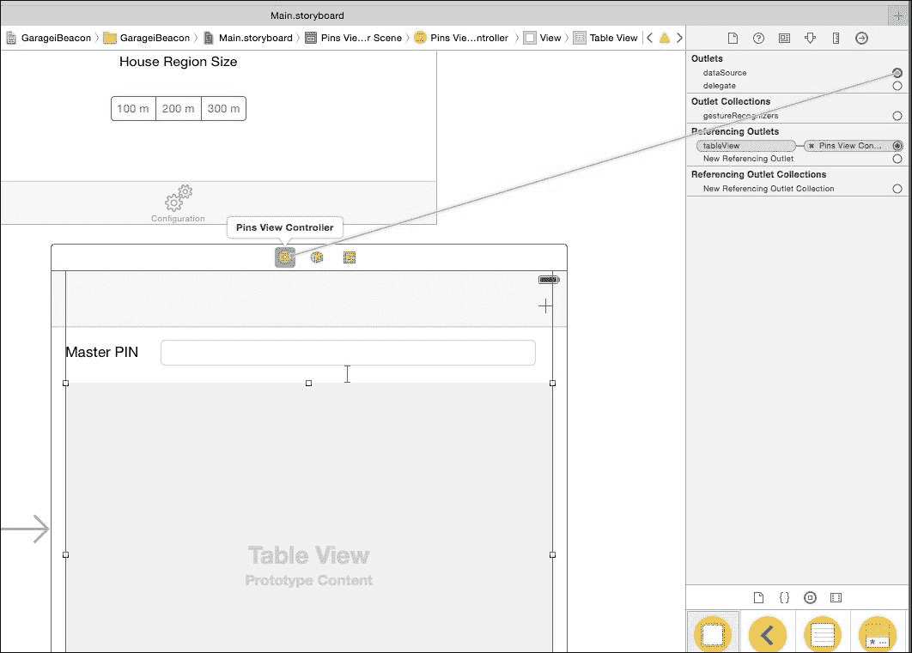

# 第六章：自动车库门开启器

这个项目是关于一种基于蓝牙 BLE 通信协议的新兴技术——iBeacon。基本上，iBeacon 是一种持续传输独特编码信号的小型设备。iOS 设备可以检测 iBeacon，以确定其与 iBeacon 的距离是更近还是更远，并触发动作。

### 小贴士

**iBeacon 是苹果的技术**

iBeacon 是由苹果公司发明的一项技术，该协议尚未公开（如果你在互联网上找到了任何信息，谷歌是你的朋友）。因此，要使用 iBeacon 设备，你需要一个 iOS 设备和苹果公司提供的 API。

另一个正在出现的标准也可以与 Android 设备一起工作——AltBeacon（更多信息，请访问[`bit.ly/1KsXD17`](http://bit.ly/1KsXD17)）。AltBeacon 网站也为 iOS 提供了大量有用的信息。

我们将使用这些技术在我们靠近车库门时立即打开它。你可能想知道这与传统的车库遥控器或 iOS 设备上可用的众多遥控应用程序有什么区别。主要区别是这一切都是自动发生的（自动魔法？）；你甚至不需要触摸你的手机。信不信由你，你甚至不需要控制器应用程序运行。

### 小贴士

**没有车库？**

这个项目可以用来打开任何类型的门，但你可能需要调整或更换你的锁，使其能够通过电信号控制。或者，你也可以使用这个项目来控制内部/外部灯光。绝对不会感到无聊！

让我们通过更仔细地了解 iBeacon 来开始吧。

# iBeacon – 技术概述

iBeacon 是一种小型设备，利用蓝牙 BLE 技术在其周围建立区域。任何支持蓝牙 BLE 的 iOS 设备都可以确定自己是否进入了该区域，并大致估算与 iBeacon 的距离。

我们可以在每件博物馆艺术品附近放置一个 iBeacon，并编写一个 iOS 应用程序，当参观者靠近时立即显示艺术品信息。这是一个典型的 iBeacon 应用示例。

iBeacon 通过三个值唯一标识——UUID（一个 16 字节的通用标识符）、major（2 字节）和 minor（2 字节），这些值通过蓝牙信号持续传输。

### 小贴士

**所有你需要了解的** **关于 iBeacon 的信息**

你可以在[`developer.apple.com/ibeacon/`](https://developer.apple.com/ibeacon/)和[`developer.apple.com/ibeacon/Getting-Started-with-iBeacon.pdf`](https://developer.apple.com/ibeacon/Getting-Started-with-iBeacon.pdf)找到所有你需要了解的信息。

参考下图的下一个图，你可以看到 iBeacon 周围有一个区域（即 iBeacon 区域）。当 iOS 设备穿过这个区域的边界并进入时，注册了这个区域的 iOS 应用程序（使用 iBeacon 的 UUID、major 和 minor）会收到一个“进入”通知；当 iOS 设备穿过区域的边界并退出时，会收到一个“退出”通知。

我们将在以下章节中详细讨论这个问题：


在开阔空间中，iBeacon 区域大约有 30 米宽，但这个大小很大程度上取决于硬件设计、配置、障碍物以及安装方式。

当在区域内时，iOS 设备可以持续监控与 iBeacon 设备的距离。这个距离以远、近或立即返回。苹果没有声明这些距离的实际大小，很可能是由于这些距离实际上受到 iBeacon 的发射功率、iBeacon 与 iOS 设备之间的障碍物、iOS 设备的朝向以及其他因素的影响。无论如何，这些信息可以用来根据与 iBeacon 的距离改变应用程序的行为。

### 小贴士

**iBeacon 距离计算**

iOS 设备可以检测到 iBeacon 的信号强度。它可以通过一个描述距离衰减的公式来计算与 iBeacon 的距离。不幸的是，由于 iBeacon 信号有很多波动，并且其传播受到许多因素的影响，这个公式对距离的估计非常不准确。为了在实际应用中使用这个值，必须使用概率技术来获取距离的估计值。我们无法在本书中涵盖这些技术。

iOS 处理 iBeacon 通知的一个有趣特性是，即使应用程序没有运行，进入和退出通知也会被接收，并且它们会启动应用程序。为了节省 iOS 设备的电量，应用程序只运行几秒钟（大约 3 秒钟）然后暂停。然后，应用程序必须在这个短暂的时间间隔内完成每一个操作。

我必须指出，通常情况下，iOS 应用在穿过 iBeacon 区域时几乎立即就会收到进入通知。相反，退出通知可能在穿过区域边界后几分钟才会收到。

# 汽车库门开启器的要求和设计限制

了解 iBeacon 的能力后，想象一个车库门开启器的工作方式并不困难。iBeacon 安装在车库门后面。一个带有 BLE 板的 Arduino 监听来自 iOS 设备的命令并控制车库门开启器。iOS 应用程序在进入 iBeacon 区域时发送“打开”命令，在退出 iBeacon 区域时发送“关闭”命令。非常简单，不是吗？

不幸的是，我们必须面对接收退出通知时可能出现的长时间延迟。当你开车时，你可以在几分钟内覆盖很大的距离，远离你的车库；iOS 设备无法在这么长时间内连接到 Arduino。

此外，在查看下一张图片后，你可能意识到 iBeacon 区域也可能只覆盖房子的一部分。显然，我们不希望带着 iOS 设备在口袋里在房子周围走动时，车库门会随机开启和关闭。


一个简单的解决方案是在房子的各个地方添加所需的 iBeacon，所有这些 iBeacon 都具有相同的 UUID、major 和 minor，以扩展 iBeacon 区域。

然而，这个解决方案将会太昂贵。我们将利用 iOS 的另一个电源特性来克服这两个问题——地理围栏：


我们可以注册一个地理围栏区域（使用中心点的纬度和经度以及半径），覆盖我们整个房子。一旦穿过地理围栏区域的边界，我们会收到通知（或者更好的是，两个通知——一个在进入区域时，另一个在离开区域时）。

你可能会想知道为什么我们不简单地只使用地理围栏区域来开启车库门。不这样做的原因是地理围栏通知并不非常精确。它们可能有很大的延迟，并且可能不在所有区域工作。通过结合这两种技术，我们得到了我们想要实现的确切结果。

我们最终克服了所有涉及在 iBeacon 区域内跟踪设备进入和从地理围栏区域退出的设计挑战。这就是自动车库门开启器的工作原理：

1.  让我们假设我们同时位于两个区域之外。当我们穿过地理围栏区域时，不会发生任何事情，因为应用程序只识别退出通知。

1.  一旦我们穿过离车库几米远的 iBeacon 区域，iOS 设备就会收到通知，并发送一个开启命令到控制门的 Arduino 板，从而打开门。

1.  门会在短时间内自动关闭。这允许我们将车停放在车库内。

1.  从现在起，穿过 iBeacon 区域的行为将被忽略。然后，如果我们移动到房子周围时穿过 iBeacon 区域，车库将不会开启。

1.  当我们离开时，我们最终会穿过地理围栏区域。这个事件再次启用了接收 iBeacon 进入通知。我们处于与步骤 1 中描述的相同状态。

我们可以使用以下状态图来描述应用程序的行为（严格来说，它是一个 Mealy 状态机；更多信息，请访问[`bit.ly/1hmZs3V`](http://bit.ly/1hmZs3V)）：


我们显然不希望其他人打开我们的车库。因此，每个授权用户必须通过使用 PIN（个人识别号码）来识别自己。分配新的 PIN，您允许其他人获取对车库的访问权限。您可以通过从授权列表中移除 PIN 来撤销访问权限。

然后，应用程序必须管理 PIN，我们需要一个主 PIN，它被连接到 Arduino 代码中。只有知道主 PIN 的人才有权管理 PIN。

### 提示

**安全警告！**

即使 iOS 应用需要 PIN 才能打开车库门，该应用也不是完全安全的，因为它不提供任何加密机制。任何人都可以通过使用蓝牙协议嗅探器来访问 PIN。这并不容易，但却是可能的。我们已经警告过您！使通信安全可能是学习更多关于加密以及如何在 Arduino 上使用有限的内存和处理器能力实现加密的好机会。

# 硬件

我们需要的最主要硬件组件是 iBeacon。我们使用的是[`redbear.net`](http://redbear.net)上展示的那个。市场上几乎任何价格都有很多产品。在选择 iBeacon 时，请确保它与 iBeacon Apple 协议兼容，因为有些产品并不兼容。

### 提示

**作为 iBeacon 的 iOS 设备**

如果您有两个 iOS 设备，您可以使用其中一个作为通过 iTunes 商店中可用的应用程序运行的 iBeacon。我已经为这个目的发布了自己的应用程序，可以在[`apple.co/1hmZt80`](http://apple.co/1hmZt80)找到。

根据 iBeacon 外壳，它可以安装在车库内部或外部。如果放置在较高的位置会更好。通常，为 iBeacon 供电的电池应该至少可以使用一年。定位时，无论如何都要考虑更换电池。

## 附加电子元件

在这个项目中，我们需要以下附加元件：

+   一个 P2N2222 BJT 晶体管（详见文本）

+   一个 BS170 NMOSFET 晶体管（详见文本）

+   一个 10K 欧姆电阻（详见文本）

+   一个 1.5K 欧姆电阻（详见文本）

+   一个 1N4001 二极管（详见文本）

+   一个继电器：线圈电压 5V，接触电流最大 1A（详见文本）

## 电子电路

以下图片显示了项目所需的电子电路的电原理图：


通常，继电器电流约为 40 mA，这超过了 Arduino 可以提供的最大电流。有一些继电器消耗的电流更少，但为了避免烧毁 Arduino，我们可以使用晶体管来供电继电器。当继电器关闭时，线圈中储存的能量会以反向电流的形式放电到晶体管上，这可能会损坏晶体管。二极管（反向恢复二极管）短路这个电流，保护晶体管免受损坏。

下面的图示展示了如何在面包板上安装电路：


电磁继电器是一种消耗电流的机电设备，容易发生故障。因此，你可以通过使用 N-MOSFET 来使用更可靠的电路。这个替代电路在下面的图中展示：


下面的图示展示了如何在面包板上安装电路：


R1 电阻下拉 MOSFET 的栅极。因此，当驱动引脚（7）为低电平且引脚在 Arduino 的供电阶段浮动时，它会关闭。

### 注意

你可能需要将 R1 的值调整到 1K 到 1M 的范围内，以确保当不需要时 MOSFET 不会打开。

### 小贴士

**使用 RFduino 而不是 Arduino**

对于这个项目，我们可以使用 RFduino 而不是 Arduino（更多信息，请访问[`www.rfduino.com`](http://www.rfduino.com)）。它与 Arduino 兼容，还包括蓝牙设备和相关的软件栈。此外，它还可以同时充当 iBeacon。一个设备可以满足项目的所有硬件需求。它没有我们将用来存储引脚的 EEPROM，但我们可以将它们存储在闪存中。这个项目的原始版本是在 RFduino 上，并且是一个商业产品。对于这本书，我选择使用 Arduino 来避免购买另一件硬件，因为 RFduino 需要更复杂的代码来同时使用蓝牙接收命令和充当 iBeacon。你可以尝试自己在这个 RFduino 上构建项目。这可以是一个学习更多的好机会。查看 RFduino。它是一个惊人的产品！

# Arduino 代码

这个项目的完整代码可以从[`www.packtpub.com/books/content/support`](https://www.packtpub.com/books/content/support)下载。

为了更好地理解下一段落的解释，请在阅读时打开下载的代码。

在这个项目中，我们将使用 EEPROM 来存储引脚。实际上，当没有供电时，这种内存不会丢失其内容。

要存储一个引脚，我们使用第一个字符来表示是否使用，并使用最后五个字符来存储实际的引脚（正好是五个字符长）。引脚在 EEPROM 中按顺序存储，从地址 0 开始。

## 设置代码

请参考下载的代码。由于设置代码相当简单，不需要详细的解释。

设置代码与其他项目的设置代码没有太大区别。让我们来看看 EEPROM 初始化的部分：

```swift
void setup() {

  // EEPROM INITIALIZATION - FIRST TIME ONLY

  for (int i = 0; i < 6*NUMBER_OF_PINS; i++)
    EEPROM[i] = 0;

  // Set the master PIN

  EEPROM[0] = 1;
  EEPROM[1] = '1';
  EEPROM[2] = '2';
  EEPROM[3] = '3';
  EEPROM[4] = '4';
  EEPROM[5] = '5';

…

}
```

`for`循环初始化用于初始化引脚的 EEPROM 位置为 0。这个循环只需要在代码第一次执行时执行，否则它会清除存储的引脚。在*测试和调整*部分，我们将提供更多细节。

最后几行将主 PIN 从位置 1（示例中的主 PIN 为 12345）写入。位置 0 设置为 1，以指示下一个五个位置用于存储 PIN。

## 主程序

循环函数非常简单。它只检查门是否已经打开，然后通过调用`pulseOutput`函数（该函数使继电器脉冲 300 毫秒）来关闭`CLOSING_DOOR_INTERVAL`。

Arduino 代码的其余部分用于在`rxCallback`函数中接收到的消息上做出反应。

每条消息由一个 PIN（五个字符）和一些其他字符组成。该 PIN 将被检查，如果未识别，则消息将被拒绝。

主要消息用于打开车库门：<PIN>O=1，其中<PIN>是分配给开门用户的 5 个字符长的 PIN。当它被接收时，它会触发继电器并打开门。

以下所有其他消息都与 PIN 管理相关：

+   `P`，当 iOS 设备请求当前存储在 Arduino EEPROM 中的 PIN 列表。

+   `A`，当 iOS 设备需要添加新的 PIN 时。命令后的下一个 5 个字节是实际的 PIN。

+   `E`，当 iOS 设备需要更新现有的 PIN 时。命令后的第一个字节是需要编辑的 PIN 的索引，其后是 5 个字节的新 PIN。

+   `D`，当 iOS 设备需要删除现有的 PIN 时。命令后的第一个字节是需要删除的 PIN 的索引。

实现每个命令的功能不需要太多解释。请注意，主 PIN（EEPROM 中的位置 0 处的 PIN）永远不会传输到 iOS 应用程序。要更改主 PIN，必须直接在代码中更改。`printPins`函数（将所有存储的 PIN 输出）可以帮助你理解函数的工作方式。注释掉代码中已经存在的调用。

# iOS 代码

在本章中，我们将查看 iOS 应用程序，该应用程序监控 iBeacon 区域和地理围栏区域，并发送命令打开门。该应用程序还管理可以分配给亲属、访客和朋友的 PIN，以便打开你的车库。

该应用程序还可以像传统遥控器一样手动打开车库门。

该项目的完整代码可以从[`www.packtpub.com/books/content/support`](https://www.packtpub.com/books/content/support)下载。

为了更好地理解下一段落的解释，请在阅读时打开下载的代码。

## 创建 Xcode 项目

我们将创建一个新的项目，就像在前几章中做的那样。以下是你需要执行的步骤：

以下是新项目的参数：

+   **项目类型**：标签应用

+   **产品名称**：GarageiBeacon

+   **语言**：Objective-C

+   **设备**：通用

我们必须为此项目设置一个能力，如下所示：

1.  在 Xcode 的左侧面板中选择项目。

1.  在右侧面板中选择 **能力**。

1.  打开 **Background Modes** 选项并选择 **位置更新**（见以下截图）：

由于这个项目的结构非常接近宠物门锁，我们可以通过以下步骤重用一部分用户界面和代码（更多详情，请回到第四章中关于 iOS 引导漫游器的项目[part0033.xhtml#aid-VF2I1 "第四章. iOS 引导漫游器"]，*iOS 引导漫游器*，在那里我们几乎做了与这次相同的事情）：

1.  选择 **FirstViewController.h** 和 **FirstViewController.m**，右键点击它们，点击 **删除**，然后选择 **移动到废纸篓**。

1.  使用相同的程序，删除 **SecondViewController** 和 **Main.storyboard**。

1.  在 Xcode 中打开 **PetDoorLocker** 项目。

1.  选择以下文件并将它们拖放到此项目中：

    +   **BLEConnectionViewController.h**

    +   **BLEConnectionViewController.m**

    +   **Main.storyboard**

    确保已选择 **如果需要则复制项目**，然后点击 **完成**。

1.  复制用于 BLEConnectionViewController 视图控制器的图标。

1.  创建一个新的视图控制器类，名为 `GarageViewController`。

1.  打开 **Main.storyboard** 并定位主视图控制器。

1.  删除所有图形组件。

1.  打开 **身份检查器**并将 **类** 更改为 **GarageViewController**。

1.  为了使位置请求授权正确，我们需要添加一个新文件。通过导航到 **文件** | **新建** | **文件…** 然后选择 **iOS - 资源** 和 **字符串文件**。点击 **下一步**并输入文件名，`InfoPlist`。最后，点击 **创建**。

1.  打开新创建的文件并输入以下行：

    ```swift
    NSLocationAlwaysUsageDescription = "This is required in order to make Garage iBeacon working properly.";
    ```

现在，我们已准备好创建新的应用程序！

## 为 BLEConnectionViewController 设计用户界面

我们必须向这个视图控制器添加许多组件以添加我们的个人 PIN 和与地理围栏区域相关的信息。

到目前为止，您应该已经精通添加 UIKit 组件及其相关的布局约束。因此，我们不会在这个主题上花费太多时间。您的最终结果应该类似于以下图片。无论如何，如果您需要，您始终可以参考下载的代码：


我们还需要将 **PIN** 文本字段的代理出口设置为 BLEConnectionViewController，以便知道何时发生变化。您可以通过使用连接检查器来完成此操作。

对于 PIN 文本字段，我们需要屏蔽将要输入的值。为此，请执行以下步骤：

1.  选择字段。

1.  打开属性检查器。

1.  选择 **Secure Text Entry** 复选框。

将新组件链接到代码，您应该得到以下结果：

```swift
@interface BLEConnectionViewController ()

@property (strong, nonatomic) IBOutlet UILabel      *deviceUUIDLabel;

@property (strong, nonatomic) IBOutlet UITextField *pinField;
@property (strong, nonatomic) IBOutlet UITextField *longitudeField;
@property (strong, nonatomic) IBOutlet UITextField *latitudeField;
@property (strong, nonatomic) IBOutlet UISegmentedControl   *houseRegionSizeSegment;

@property (strong, nonatomic) CBCentralManager      *centralManager;
@property (strong, nonatomic) NSTimer               *scanningTimer;

@end
```

**设置房屋位置**按钮将用于设置围绕房屋的地理围栏区域中心，而**房屋区域大小**段将用于设置地理围栏区域的半径。

按钮连接到以下方法：

```swift
- (IBAction)startLocating:(id)sender {

}
```

该段连接到以下内容：

```swift
- (IBAction)regionSizeChanged:(UISegmentedControl *)sender {

}
```

## 设计 GarageViewController 的用户界面

这个视图控制器是应用程序的主要视图控制器，它应该包含一个手动打开/关闭车库门的按钮，以防万一！

由于这是一个学习项目，我们添加了一些组件，以便用户能够获得更多关于其相对于 iBeacon 和地理围栏区域位置的信息。

GUI 应该看起来像以下截图：


这次，两个按钮都有一个背景（你可以从下载的代码中复制它；它被命名为 `buttonBackground.png`）。要添加它，选择按钮，打开**属性检查器**，然后为**背景**选择**buttonBackground.png**（见以下截图）：


不要忘记将**文本颜色**更改为白色。

你还可以从下载的项目中复制三个 LED 图像（`blueLED.png` 和 `grayLED.png`）。

一旦将 GUI 组件链接到代码，你应该得到以下结果：

```swift
@interface GarageViewController ()

@property (strong, nonatomic) IBOutlet UIImageView  *houseRegionIndicator;
@property (strong, nonatomic) IBOutlet UIImageView  *garageRegionIndicator;
@property (strong, nonatomic) IBOutlet UIImageView *readyToOpenIndicator;

@end
```

此外，两个按钮分别链接到两个方法，如下所示：

```swift
- (IBAction)manualOperation:(UIButton *)sender {
}
```

和：

```swift
- (IBAction)simulateHomeRegionExit:(UIButton *)sender {
}
```

## 设计 PinsViewController 的用户界面

我们需要另一个视图控制器来管理 PIN。创建并链接到主视图控制器，就像我们在前面的项目中做的那样，并将其嵌入到导航控制器中。为此，选择新的视图控制器，导航到 **Editor** | **Embed In Navigation Controller**。这创建了一个导航栏，我们可以在其中放置一个用于添加 PIN 的按钮（见以下截图中的圆形区域）。

GUI 组件在以下截图中显示。基本上，它们是一个用于显示启用 PIN 的 Table View 和一个可以输入主 PIN 的字段。只有知道主 PIN 的人才能管理其他 PIN：


在继续下一节之前，执行以下步骤：

1.  创建一个名为 PinsViewController 的新类，该类继承自 UIViewController。

1.  在故事板中选择 PinsViewController，打开身份检查器，并将 **Class** 选择为 PinsViewController。

1.  打开连接检查器（浏览 **View** | **Utilities** | **Show Connections Inspector**）。

1.  选择 Table View，将 dataSource 和 delegate 输出口拖到 PinsViewController 类（见以下截图）。这告诉 Table View 向 PinsViewController 请求显示的项目和通知事件：

1.  将主 PIN 字段的控制委托设置为视图控制器。

1.  为主 PIN 设置 **安全文本输入** 复选框。

1.  将 GUI 组件与代码链接起来，你应该得到以下结果：

    ```swift
    @interface PinsViewController ()

    @property (strong, nonatomic) IBOutlet UITableView *tableView;
    @property (strong, nonatomic) IBOutlet UITextField *pinField;

    @end
    ```

    以及以下方法：

    ```swift
    - (IBAction)addPin:(id)sender {
    }
    ```

## 为 BLEConnectionViewController 编写代码

由于我们从 Pet Door Locker 项目中复制了这个视图控制器，我们只需要做几处修改。

首先，我们需要打开 **BLEConnectionViewController.h** 文件并添加以下导入：

```swift
#import <CoreLocation/CoreLocation.h>
```

我们还需要对以下行进行修改：

```swift
@interface BLEConnectionViewController : UIViewController < CBCentralManagerDelegate>

@end
```

将前面的行更改为以下内容：

```swift
@interface BLEConnectionViewController : UIViewController <CLLocationManagerDelegate, CBCentralManagerDelegate>

@end
```

然后，打开 `BLEConnectionViewController.m` 文件，进行其余的修改。让我们添加一个新属性，如下所示：

```swift
@property (strong, nonatomic) CLLocationManager     *locationManager;
```

位置管理器允许我们通过我们 iOS 设备的 GPS 接收器获取我们房屋的地理坐标。这将用于创建地理围栏区域。

要初始化位置管理器，我们必须将 `viewDidAppear` 方法更改为以下内容：

```swift
-(void)viewDidAppear:(BOOL)animated {

     [super viewDidAppear:animated];

    _locationManager = [[CLLocationManager alloc] init];
[_locationManager requestAlwaysAuthorization];

    _centralManager = [[CBCentralManager alloc] initWithDelegate:self queue:nil];
}
```

位置管理器必须经过用户授权才能工作。因此，我们需要发出以下方法调用：

```swift
[_locationManager requestAlwaysAuthorization];
```

调用此方法，iOS 会启动一个包含我们在上一节中添加到 InfoPlist 文件中的消息的授权请求。开始接收您自己房屋位置的所需代码如下：

```swift
- (IBAction)startLocating:(id)sender {

    _locationManager.delegate = self;
    _locationManager.distanceFilter = kCLDistanceFilterNone;
    _locationManager.desiredAccuracy = kCLLocationAccuracyBest;
    [_locationManager startUpdatingLocation];
}
```

这段代码不需要任何解释。

一旦 GPS 接收器定位了位置，就会调用以下方法，我们可以存储房屋的经纬度：

```swift
- (void)locationManager:(CLLocationManager *)manager didUpdateLocations:(NSArray *)locations {

    [manager stopUpdatingLocation];
    CLLocation *currentLocation = [locations objectAtIndex:0];

    _latitudeField.text = [NSString stringWithFormat:@"%f",currentLocation.coordinate.latitude];
    _longitudeField.text = [NSString stringWithFormat:@"%f",currentLocation.coordinate.longitude];

    NSUserDefaults *userDefaults = [NSUserDefaults standardUserDefaults];

    [userDefaults setObject:[NSNumber numberWithFloat:currentLocation.coordinate.latitude] forKey:@"HouseLatitude"];
    [userDefaults setObject:[NSNumber numberWithFloat:currentLocation.coordinate.longitude] forKey:@"HouseLongitude"];
    [userDefaults synchronize];

    sleep(2);  // To be sure that monitoring of region started - To avoid kCLErrorDomain error 5 
}
```

请注意，一旦坐标可用，我们就停止位置管理器来更新它们（`[manager stopUpdatingLocation]`）。我们这样做是为了节省电池电量，因为我们不再检查坐标来确定我们是否在房屋周围的区域内。请参阅以下部分以了解我们如何获取这些信息。

当我们更改地理围栏区域的大小时，会调用以下方法：

```swift
- (IBAction)regionSizeChanged:(UISegmentedControl *)sender {

    NSUserDefaults *userDefaults = [NSUserDefaults standardUserDefaults];

    [userDefaults setObject:[NSNumber numberWithFloat:sender.selectedSegmentIndex+1] forKey:@"HouseSize"];
    [userDefaults synchronize];
}
```

这是我们存储区域本身大小的位置。

我们需要编写的最后一个方法是在 PIN 修改后存储个人 PIN：

```swift
- (BOOL)textFieldShouldReturn:(UITextField *)textField {

    [textField resignFirstResponder];

    NSUserDefaults *userDefaults = [NSUserDefaults standardUserDefaults];

    [userDefaults setObject:textField.text forKey:@"GarageiBeaconPIN"];
    [userDefaults synchronize];

    return YES;
}
```

要在视图控制器启动时初始化文本字段的值，将 `viewDidLoad` 方法更改为以下内容：

```swift
- (void)viewDidLoad {

    [super viewDidLoad];

    _deviceUUIDLabel.text = [[NSUserDefaults standardUserDefaults] objectForKey:@"GarageiBeaconDevice"];
    _pinField.text = [[NSUserDefaults standardUserDefaults] objectForKey:@"GarageiBeaconPIN"];

    _latitudeField.text = [[[NSUserDefaults standardUserDefaults] objectForKey:@"HouseLatitude"] stringValue];
    _longitudeField.text = [[[NSUserDefaults standardUserDefaults] objectForKey:@"HouseLongitude"] stringValue];
}
```

当视图控制器不在屏幕上显示时，我们可以释放位置管理器和中央管理器，如下所示：

```swift
-(void)viewDidDisappear:(BOOL)animated {
    [super viewDidDisappear:animated];

    _centralManager = nil;
    _locationManager = nil;
}
```

现在，我们已经准备好开始编写 GarageViewController 的代码了，它要有趣得多。

## 为 GarageViewController 编写代码

由于我们同时使用位置管理器和中央管理器，我们需要更新 **GarageViewController.h** 文件，添加所需的包含和协议，以以下内容结束：

```swift
#import <CoreLocation/CoreLocation.h>
#import <CoreBluetooth/CoreBluetooth.h>

@interface GarageViewController : UIViewController <CLLocationManagerDelegate, CBCentralManagerDelegate, CBPeripheralDelegate>

@end
```

然后，我们打开 **GarageViewController.m** 文件，添加代码来管理来自地理围栏区域和 iBeacon 区域的通知，并向 Arduino 发送开启消息。

添加以下属性：

```swift
@property (nonatomic,strong) CLLocationManager      *locationManager;
@property (nonatomic,strong) CBCentralManager       *centralManager;

@property (strong, nonatomic) CBPeripheral          *arduinoDevice;
@property (strong, nonatomic) CBCharacteristic      *sendCharacteristic;

@property                     BOOL                  insideHouse;
```

然后，我们可以添加用于管理与 Arduino 蓝牙通信的代码。此代码几乎与我们在前几章中使用的一样。因此，我们不必在这方面花费太多时间。我们只需指出以下几点：

+   由于我们没有通过蓝牙从 Arduino 接收任何数据，因此可以删除`didUpdateValueForCharacteristic`函数，我们也不需要寻找用于接收数据的特征

+   一旦应用程序连接到 Arduino，它立即发送开启命令

`didDiscoverCharacteristicsForService`方法与我们用于其他项目的略有不同：

```swift
- (void)peripheral:(CBPeripheral *)peripheral didDiscoverCharacteristicsForService:(CBService *)service error:(NSError *)error {

    if (error) {

        NSLog(@"Error %@",[error localizedDescription]);

        return;
    }

    for (CBService *service in peripheral.services) {

        if ([service.UUID.UUIDString isEqualToString:NRF8001BB_SERVICE_UUID]) {

            for (CBCharacteristic *characteristic in service.characteristics) {

                if ([characteristic.UUID.UUIDString isEqualToString:NRF8001BB_CHAR_TX_UUID]) {

                    _sendCharacteristic = characteristic;

                    // Device connected - Sending opening command

                    NSData      *data;
                    NSString    *msg;

                    msg = [[NSString alloc] initWithFormat:@"%@O=1",[[NSUserDefaults standardUserDefaults] objectForKey:@"GarageiBeaconPIN"]];
                    data=[msg dataUsingEncoding:NSUTF8StringEncoding];

                    [_arduinoDevice writeValue:data forCharacteristic:_sendCharacteristic type:CBCharacteristicWriteWithoutResponse];

                    // Disconnects

                    [_centralManager cancelPeripheralConnection:_arduinoDevice];
                }
            }
        }
    }
}
```

一旦启动视图控制器，我们必须初始化位置管理器，并创建地理围栏区域和 iBeacon 区域，如果它们尚未创建：

```swift
- (void)viewDidLoad {

    [super viewDidLoad];

    _centralManager = [[CBCentralManager alloc] initWithDelegate:self queue:nil];

    _locationManager = [[CLLocationManager alloc] init];
    _locationManager.delegate = self;

    _locationManager.desiredAccuracy = kCLLocationAccuracyBest;
    _locationManager.distanceFilter = kCLDistanceFilterNone;
    _locationManager.activityType = CLActivityTypeOther;

    [_locationManager requestAlwaysAuthorization];

    for (CLRegion *region in _locationManager.monitoredRegions) {

        [_locationManager requestStateForRegion:region];
    }

    _arduinoDevice = nil;

    // Monitoring change of UserDefaults

    [[NSUserDefaults standardUserDefaults] addObserver:self
                                            forKeyPath:@"HouseLongitude"
                                               options:NSKeyValueObservingOptionNew
                                               context:NULL];

    [[NSUserDefaults standardUserDefaults] addObserver:self
                                            forKeyPath:@"HouseSize"
                                               options:NSKeyValueObservingOptionNew
                                               context:NULL];

    [self addObserver:self
           forKeyPath:@"insideHouse"
              options:NSKeyValueObservingOptionNew
              context:NULL];
}
```

一旦位置管理器初始化并由用户授权，将调用以下方法并创建 iBeacon 区域（我们将在本节后面讨论实际的 iBeacon 区域创建）：

```swift
- (void)locationManager:(CLLocationManager *)manager didChangeAuthorizationStatus:(CLAuthorizationStatus)status {

    if (status == kCLAuthorizationStatusAuthorizedAlways && _centralManager.state == CBCentralManagerStatePoweredOn) {
        [self createGaregeRegionIfNeeded];
    }
}
```

然后我们调用一个方法：

```swift
[[NSUserDefaults standardUserDefaults] addObserver:self
                                            forKeyPath:@"HouseLongitude"
                                               options:NSKeyValueObservingOptionNew
                                               context:NULL];
```

此方法在用户默认设置中激活了一个键值观察者，其中存储有关地理围栏区域的信息。

### 提示

**键值观察**

关于键值观察的更多信息，请参阅苹果文档[`apple.co/1PZ6aJm`](http://apple.co/1PZ6aJm)。

现在，每次`HouseLongitude`发生变化时，`observeValueForKeyPath`方法都会被调用，这使我们能够创建或更新地理围栏区域。请注意，当用户定位房子时，`HouseLongitude`在 BLEConnectionViewController 中发生变化。KVO 技术允许我们自动保持地理围栏区域的更新。KVO 还设置为`HouseSize`用户默认属性，以便在用户更改区域大小时更新区域。

我们还可以为`insideHouse`属性设置 KVO。我们将在稍后讨论这一点。

让我们看看`observeValueForKeyPath`方法，其中实际上创建了地理围栏区域：

```swift
-(void)observeValueForKeyPath:(NSString *)aKeyPath ofObject:(id)anObject change:(NSDictionary *)aChange context:(void *)aContext {

    if ([aKeyPath isEqualToString:@"insideHouse"]) {

        if (_insideHouse)
            _readyToOpenIndicator.image = [UIImage imageNamed:@"grayLED.png"];
        else
            _readyToOpenIndicator.image = [UIImage imageNamed:@"blueLED.png"];

        return;
    }

    CLLocationCoordinate2D center;

    center.latitude = [[[NSUserDefaults standardUserDefaults] objectForKey:@"HouseLatitude"] floatValue];
    center.longitude = [[[NSUserDefaults standardUserDefaults] objectForKey:@"HouseLongitude"] floatValue];

    double radius = [[[NSUserDefaults standardUserDefaults] objectForKey:@"HouseSize"] doubleValue];
    radius = (radius == 0) ? 1 : radius;

    //NSLog(@"Latitude %f Longitude %f Radius %f",center.latitude, center.longitude, radius);

    CLCircularRegion *houseRegion = [[CLCircularRegion alloc] initWithCenter:center
radius:100\. * radius
identifier:@"House Region"];
    houseRegion.notifyOnEntry = YES;
    houseRegion.notifyOnExit = YES;

    [_locationManager startMonitoringForRegion:houseRegion];
    [_locationManager requestStateForRegion:houseRegion];
}
```

要创建地理围栏区域，我们需要定义其中心，即房子的位置，以及一个手动选择的半径。然后，调用以下：

```swift
[_locationManager startMonitoringForRegion:houseRegion];
```

iOS 知道我们需要在进入或退出地理围栏区域时立即接收通知。因此，我们调用：

```swift
[_locationManager requestStateForRegion:houseRegion];
```

我们请求 iOS 确定我们是在地理围栏区域内还是外部，并调用`locationManager:(CLLocationManager *)manager didDetermineState:(CLRegionState)state forRegion:(CLRegion *)region`方法来通知我们（我们将在后面讨论此方法）。

让我们看看如何创建 iBeacon。记住，当位置管理器获得授权并且中央管理器（它管理蓝牙连接和通信）开启时，会调用以下方法以创建 iBeacon 区域：

```swift
-(void)createGaregeRegionIfNeeded {

    NSArray *regions = [_locationManager.monitoredRegions allObjects];

    NSPredicate *p = [NSPredicate predicateWithFormat:@"identifier == %@",@"Garage Region"];
    NSArray *garageRegions = [regions filteredArrayUsingPredicate:p];

    if (garageRegions.count == 0 && _centralManager.state == CBCentralManagerStatePoweredOn) {

        NSUUID *beaconUUID = [[NSUUID alloc] initWithUUIDString:@"00000000-0000-0000-0000-0000000000FF"];

        CLBeaconRegion *beaconRegion = [[CLBeaconRegion alloc] initWithProximityUUID:beaconUUID
                                                                               major:0
                                                                               minor:1
                                                                          identifier:@"Garage Region"];
        beaconRegion.notifyEntryStateOnDisplay = YES;

        [_locationManager startMonitoringForRegion:beaconRegion];
        [_locationManager requestStateForRegion:beaconRegion];
    }
}
```

区域的创建与地理围栏区域的创建非常相似。这次，区域有一个 UUID、一个 major 和一个 minor，而不是一个中心和半径。

一旦创建了 iBeacon 区域，我们就请求 iOS 开始监控它(`[_locationManager startMonitoringForRegion:beaconRegion]`)，并立即告诉我们我们是否在区域内部或外部(`[_locationManager requestStateForRegion:beaconRegion]`)。

现在，让我们看看代码中最重要的一部分——实际管理区域边界跨越并发送打开车库门命令的代码。

每次我们进入一个区域，都会调用`didEnterRegion`方法：

```swift
- (void)locationManager:(CLLocationManager *)manager didEnterRegion:(CLRegion *)region  {

    UILocalNotification* localNotification = [[UILocalNotification alloc] init];
    localNotification.fireDate = nil;
    localNotification.alertBody = [NSString stringWithFormat:@"Entering %@",region.identifier];
    localNotification.timeZone = [NSTimeZone defaultTimeZone];
    localNotification.soundName = @"Chime.aiff";
    [[UIApplication sharedApplication] presentLocalNotificationNow:localNotification];

    if ([region.identifier isEqualToString:@"Garage Region"]) {

        [_locationManager startRangingBeaconsInRegion:(CLBeaconRegion *)region];

        if (_insideHouse)
            return;

        NSString *deviceIdentifier = [[NSUserDefaults standardUserDefaults] objectForKey:@"GarageiBeaconDevice"];

        if (deviceIdentifier!=nil && _arduinoDevice==nil) {

            NSArray *devices = [_centralManager retrievePeripheralsWithIdentifiers:@[[CBUUID UUIDWithString:deviceIdentifier]]];
            if (devices.count == 0) {
                return;
            }

            _arduinoDevice = devices[0];
            _arduinoDevice.delegate = self;
        }

        [_centralManager connectPeripheral:_arduinoDevice options:nil];

        [self setInsideHouse:YES];
    }
}
```

前几行向用户发送本地通知，告知他们已经进入了区域边界。

如果你正在进入 iBeacon 区域，并且你在房子内部(`_insideHouse = YES`)，则不会发生任何事。这意味着如果 iBeacon 区域无法覆盖整个房子，并且如果你通过进入房子内部离开 iBeacon 区域，你不会意外地打开车库门。

如果你不在房子里，应用程序会通过蓝牙连接到 Arduino，并打开车库门。别忘了实际的开启命令是发送到`didDiscoverCharacteristicsForService`方法的。

现在先忘记`[_locationManager startRangingBeaconsInRegion:(CLBeaconRegion *)region]`。

### 提示

**启用本地通知**

为了发送本地通知，它们必须得到用户的授权。为此，我们需要在应用程序启动时立即调用`[application registerUserNotificationSettings:[UIUserNotificationSettings settingsForTypes:UIUserNotificationTypeAlert|UIUserNotificationTypeBadge|UIUserNotificationTypeSound categories:nil]]`方法。`didFinishLaunchingWithOptions`方法是我们调用它的地方。

每次我们进入一个区域，都会调用`didExitRegion`方法：

```swift
- (void)locationManager:(CLLocationManager *)manager didExitRegion:(CLRegion *)region {

UILocalNotification* localNotification = [[UILocalNotification alloc] init];
    localNotification.fireDate = nil;
    localNotification.alertBody = [NSString stringWithFormat:@"Exiting %@",region.identifier];
    localNotification.timeZone = [NSTimeZone defaultTimeZone];
    localNotification.soundName = @"Chime.aiff";
    [[UIApplication sharedApplication] presentLocalNotificationNow:localNotification];

    [_locationManager stopRangingBeaconsInRegion:(CLBeaconRegion *)region];

    if ([region.identifier isEqualToString:@"House Region"]) {

        [self setInsideHouse:NO];
    }
}
```

在发送本地通知后，如果我们正在退出地理围栏区域，我们可以将`insideHouse`属性设置为`NO`，这样当我们再次进入 iBeacon 区域时，就会发送开启命令。现在先忘记`[_locationManager stopRangingBeaconsInRegion:(CLBeaconRegion *)region]`。

为什么我们不使用传统的代码(`_insideHouse = YES`)来设置属性？在`viewDidLoad`方法中，我们为属性设置了一个观察者，以便每次它改变时，都会调用`observeValueForKeyPath`。传统的代码不会启动`observeValueForKeyPath`方法，我们需要使用`[self setInsideHouse:NO]`代替。当`observeValueForKeyPath`因为`insideHouse`改变而被调用时，我们更新`readyToOpen`的图像，让用户了解应用程序是否会在进入 iBeacon 区域时发送开启命令。为此，我们需要将这些代码行放入`observeValueForKeyPath`方法中：

```swift
    if ([aKeyPath isEqualToString:@"insideHouse"]) {

        if (_insideHouse)
            _readyToOpenIndicator.image = [UIImage imageNamed:@"grayLED.png"];
        else
            _readyToOpenIndicator.image = [UIImage imageNamed:@"blueLED.png"];

        return;
    }
```

### 提示

**后台工作**

iBeacon 技术与地理围栏特别有趣的地方在于，即使在应用在后台运行或根本未运行时，`didEnterRegion`和`didExitRegion`也会被调用。不幸的是，当应用未运行时，iOS 会启动它并保持运行一段时间（大约 3 秒）以节省电池。因此，任何需要响应事件的动作都必须非常迅速。在代码中，我们只是连接到 Arduino 并发送一些字节到它，这比 3 秒的时间要少得多。

我们需要编写的最后一个相关方法是`didDetermineState`，当需要确定设备相对于一个区域的位置（调用`[_locationManager startMonitoringForRegion:beaconRegion]`或`[_locationManager startMonitoringForRegion:houseRegion]`）或当 iOS 识别到有变化时会被调用。在这个函数中，我们更新指示器，以视觉方式告知用户他们位于被监控区域之一，如下所示：

```swift
- (void)locationManager:(CLLocationManager *)manager didDetermineState:(CLRegionState)state forRegion:(CLRegion *)region {

    switch (state) {

        case CLRegionStateInside:
            NSLog(@"Inside %@",region.identifier);
            break;

        case CLRegionStateOutside:
            NSLog(@"Outside %@",region.identifier);
            break;

        case CLRegionStateUnknown:
            NSLog(@"Unknown %@",region.identifier);
            break;
    }

    if ([region.identifier isEqualToString:@"Garage Region"]) {

        if (state==CLRegionStateInside) {

            _garageRegionIndicator.image = [UIImage imageNamed:@"blueLED.png"];
        }
        else {

            _garageRegionIndicator.image = [UIImage imageNamed:@"grayLED.png"];
        }
    }

    if ([region.identifier isEqualToString:@"House Region"]) {

        if (state==CLRegionStateInside) {

            _houseRegionIndicator.image = [UIImage imageNamed:@"blueLED.png"];
        }
        else {

            [self setInsideHouse:NO];
            _houseRegionIndicator.image = [UIImage imageNamed:@"grayLED.png"];
        }
    }

}
```

注意，视觉信息（在 iBeacon 和地理围栏区域内，准备打开车库门）并不是严格必需的。我们将其放入应用中是为了让你尝试使用 iBeacon 和地理围栏。

最后两个方法如下：

+   `manualOperation`：通过发送开启命令手动打开车库门。

+   `simulateHomeRegionExit`：通过手动将`insideHouse`属性设置为`NO`来模拟从地理围栏区域退出。这在调试阶段或如果你希望在不实际开车离开你的房子的情况下了解应用的工作原理时可能很有用（我们确实这样做了很多次！）。

代码非常简单，不需要太多解释：

```swift
- (IBAction)manualOperation:(UIButton *)sender {

    NSString *deviceIdentifier = [[NSUserDefaults standardUserDefaults] objectForKey:@"GarageiBeaconDevice"];

    if (deviceIdentifier!=nil && _arduinoDevice==nil) {

        NSArray *devices = [_centralManager retrievePeripheralsWithIdentifiers:@[[CBUUID UUIDWithString:deviceIdentifier]]];
        if (devices.count == 0) {
            return;
        }
        _arduinoDevice = devices[0];
        _arduinoDevice.delegate = self;
    }

    if (_arduinoDevice != nil) {
        [_centralManager connectPeripheral:_arduinoDevice options:nil];
    }
}

- (IBAction)simulateHomeRegionExit:(UIButton *)sender {

    //_insideHouse = NO; // This doesn't fire the KVO !
    [self setInsideHouse:NO];
}
```

最后两个方法（我们保证！）你需要查看的是以下内容：

+   `didRangeBeacons`：这个方法在本项目中没有使用，但我们展示了它，因为它可能在另一个 iBeacon 项目中非常有用，因为它可以估算 iOS 设备和每个范围内的 iBeacon 之间的距离。可以通过使用`[_locationManager startRangingBeaconsInRegion:(CLBeaconRegion *)region]`和`[_locationManager stopRangingBeaconsInRegion:(CLBeaconRegion *)region]`分别启动和停止 iBeacon 的测距。

+   `monitoringDidFailForRegion`：这个方法告诉我们是否在监控任何区域时出现了问题。永远不要忘记实现它。

```swift
-(void)locationManager:(CLLocationManager *)manager didRangeBeacons:(NSArray *)beacons inRegion:(CLBeaconRegion *)region {

    if ([beacons count] == 0) {
        return;
    }

    CLBeacon *b = beacons[0];

    if (b.proximity == CLProximityFar) {

        NSLog(@"Far");
    }

    if (b.proximity == CLProximityNear) {

        NSLog(@"Near");
    }

    if (b.proximity == CLProximityImmediate) {

        NSLog(@"Immediate");
    }

    if (b.proximity == CLProximityUnknown) {

        NSLog(@"Unknown");
    }
}

- (void)locationManager:(CLLocationManager *)manager monitoringDidFailForRegion:(CLRegion *)region withError:(NSError *)error {

    UIAlertView *alert = [[UIAlertView alloc] initWithTitle:NSLocalizedString(@"Error",nil)
                                                    message:[NSString stringWithFormat:@"Region Monitoring Failed for the region: %@\n%@",[region identifier],[error localizedDescription]]
                                                   delegate:self
                                          cancelButtonTitle:@"Ok"
                                          otherButtonTitles:nil,nil];

    NSLog(@"%@",[error localizedDescription]);

    [alert show];
}
```

## 为 PinsViewController 编写代码

这个视图控制器管理着授权你的亲戚和朋友访问你的车库所需的 PIN 码。它几乎与 Power Plug 项目中的 ActivationsTableViewController 以相同的方式工作。因此，我们不会在这个问题上花费太多时间。

这里的主要区别在于我们只需要输入一个 PIN，为它创建一个屏幕没有意义。我们利用 UIAlertView 的一个特性。通过将其样式设置为`UIAlertViewStylePlainTextInput`，它将显示一个文本框，我们可以输入 PIN。这非常简单方便。

你应该能够自己编写这个视图控制器，并将你的结果与下载的代码进行比较。让我们试试。

## 测试和调整

我们现在已准备好测试这个项目并给邻居留下深刻印象。首先，你必须设置 iBeacon 参数。如果你使用 RedLab iBeacon，你可以通过免费从 iTunes Store 获取的 iOS 应用来设置它（[`itunes.apple.com/it/app/redbear-beacontool/id828819434?l=en&mt=8`](https://itunes.apple.com/it/app/redbear-beacontool/id828819434?l=en&mt=8)）。

你必须输入以下值：

+   **UUID**：00000000-0000-0000-0000-0000000000FF

+   **主要**：0

+   **次要**：1

+   **广告间隔**：250 ms

+   **TX 功率**：0

### 注意

仔细检查 UUID。它是一个长字符串，任何错误都会阻止 iBeacon 被应用程序识别。

### 小贴士

**调整 iBeacon 参数**

一旦一切按预期工作，你可以尝试降低 TX 功率和/或广告间隔。它们越低，你就能节省更多的电量，iBeacon 在没有更换电池的情况下工作的时间就越长。此外，降低 TX 功率允许你在靠近车库时发送开启命令。让我们进行一些测试，以检测最适合你的值。

如果你使用的是不同的 iBeacon，请询问制造商如何设置参数，以确保它们完全相同。

现在，你应该将 iBeacon 放置在你车库门附近的高处，并保持关闭状态。

将继电器触点或 MOSFET 引脚连接到你的车库门开启器（请参阅本章开头提供的电气图）。市面上有很多不同的型号，所以你需要自己来做。一般建议是将继电器输出（或连接到 MOSFET 的输出）并联到你用来手动开启和关闭车库门的按钮。查看你的车库门开启器说明书以获取更多信息和建议。

在开始测试阶段之前，我们需要设置 Arduino 代码，以便正确清理 EEPROM 并存储主 PIN。为此，请执行以下步骤：

1.  在`setup`函数中，注释掉以下行，这些行清理 EEPROM 并存储主 PIN：

    ```swift
      for (int i = 0; i < 6*NUMBER_OF_PINS; i++)
        EEPROM[i] = 0;

      // Set the master PIN

      EEPROM[0] = 1;     // Don't change this
      EEPROM[1] = '1';
      EEPROM[2] = '2';
      EEPROM[3] = '3';
      EEPROM[4] = '4';
      EEPROM[5] = '5';
    ```

    ### 注意

    你可以将主 PIN（12345）更改为你喜欢的代码。

1.  将代码上传到 Arduino。

1.  再次注释掉之前的代码并将其上传到 Arduino。现在，EEPROM 已清除，主 PIN 已存储。

现在，当你打开应用时，你会看到一个消息。你必须通过选择**允许**来响应此消息：


在应用中打开配置标签页，扫描 RF8001，选择您的个人 PIN，将其输入到 PIN 字段中，然后点击设置房屋位置。几秒钟后，您应该看到通过 GPS 获取到的您家的经纬度。

将**房屋区域大小**设置为 100 米。只有当您在屋内时车库门意外打开，或者您有一个非常大的房子（真幸运！），才将其更改为更高的值。

点击**PINS**标签页，输入主 PIN（如果未在 Arduino 代码中更改，则为`12345`），然后点击*Enter*。您应该看到一个空列表。点击添加按钮（**+**）并输入您之前选择的个人 PIN。

点击主标签页，然后点击**打开**按钮。现在，您的车库应该打开，然后大约 30 秒后关闭。

### 注意

要更改关闭延迟时间，您必须更改 Arduino 代码中的 CLOSING_DOOR_INTERVAL 的值。此外，为了操作车库门开启器，Arduino 会短接控制线大约 300 毫秒。如果这对您的设备来说不够，您可以在`pulseOutput`函数中更改延迟。

现在，我们将测试最令人兴奋的功能——自动打开车库：

1.  再次打开主标签页。

1.  您应该看到**在房屋区域**指示灯已开启，**在车库区域**指示灯已关闭，以及**准备打开**指示灯已开启。

1.  如果**准备打开**指示灯是关闭的，请点击**模拟退出**。

1.  关闭您的应用，将其发送到后台或从任务列表中关闭。

1.  打开 iBeacon。

1.  您应该在屏幕上看到一个通知，并听到短促的声音，然后您的车库门应该开始打开。

1.  现在，如果您在屋内或屋外移动，您的车库不应该再打开（**准备打开**指示灯应该保持关闭状态）。

1.  驾车离开您的住所，直到您从 iOS 设备中听到声音通知。请安全驾驶。在驾驶时，您不需要看您的 iOS 设备。声音通知会提醒您。

1.  停车并检查应用。现在，**准备打开**指示灯应该已开启。

1.  驾车返回您的住所。一旦您靠近 iBeacon，您应该会听到通知，并且车库门应该开始打开。

现在，您已经准备好让您的邻居们印象深刻了！

# 如何进一步操作

可以对这个项目进行的改进如下：

+   直接从应用中设置自动门关闭间隔，而不是更改 Arduino 代码。

+   在进入和离开车库时开关车库灯。

+   通过使用汽车发动机产生的噪音而不是手动操作来从内部打开车库门。这需要监听 iOS 设备上的电机噪音并将其与预先录制的电机噪音进行比较。这样做是为了避免意外情况下车库内或外的噪音打开门的情况。对于信号比较，你可以使用两个信号的互相关操作（查看 iOS 中可用的 Accelerate 框架），但你必须注意，获取的信号和预先录制的信号可能长度不同，或者可能存在时间偏移。好吧，这是一个大挑战，但这本书的最后一章，你现在应该已经是 Arduino 和 iOS 编程的大师了。数字信号处理是一门你可能感兴趣的技艺。

+   通过使用翻板开关、霍尔效应传感器或超声波距离传感器来检查车库门是否有效关闭，并将通知发送到您的手机。您可能需要 WiFi 盾牌来利用可用的物联网服务之一发送通知。

# 摘要

在构建这个项目的过程中，你学到了很多，特别是在 iOS 方面。你学会了如何创建和管理地理围栏和 iBeacon 区域。这为 iOS 上的许多不同项目打开了大门，无论是与 Arduino 集成还是不集成。此外，你还学会了如何监控属性的变化（KVO），这是一种在 Model-View-Controller 模型帮助下，位于良好编程基础的技术。这可以多次应用。在 Arduino 上，你学会了如何使用 EEPROM 来存储需要永久存储在板上以控制程序行为的信息。

这个项目结束了 Arduino 和 iOS 编程以及这两个平台集成的漫长旅程。

希望你在阅读这本书、编码和构建至少一些提议的项目（或者也许全部！）的过程中感到愉快！主要的是，我希望你更多地了解了 Arduino、iOS 及其集成，从现在开始，你可以设计和构建你自己的项目。

制作一些革命性和改变游戏规则的项目，享受乐趣吧！
