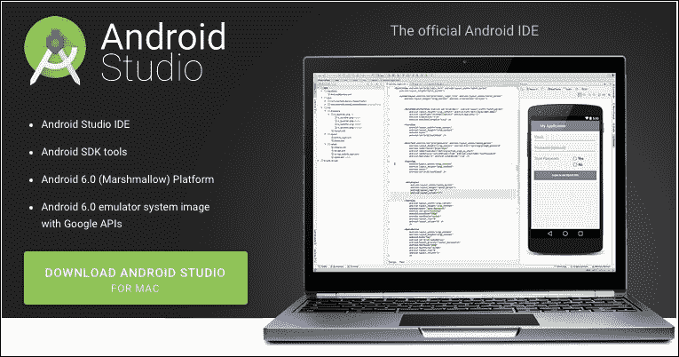
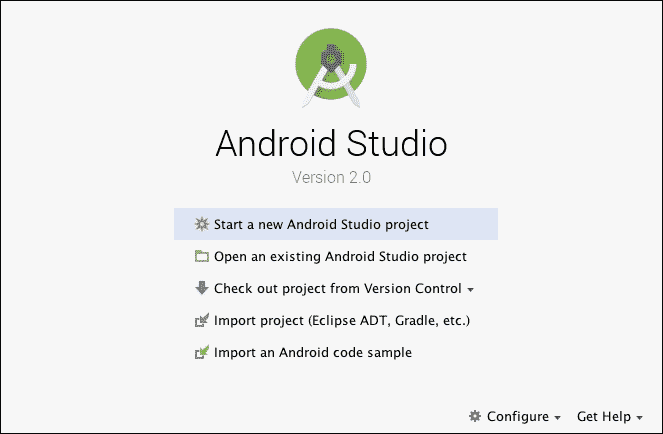
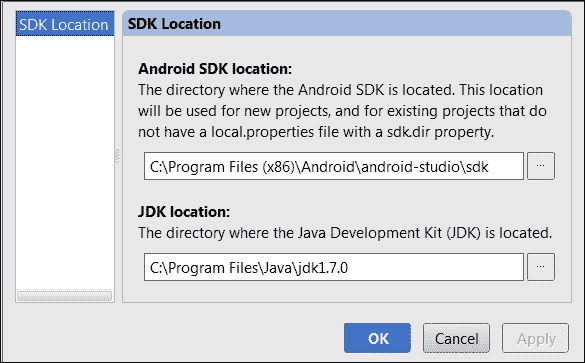
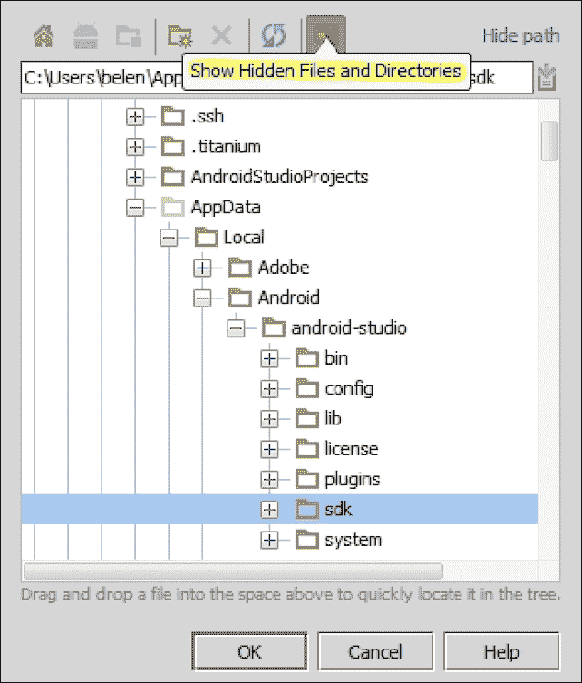

# 第一章. 安装和配置 Android Studio

新的官方谷歌 **集成开发环境**（**IDE**）Android Studio 2.0，拥有其丰富的功能，准备供大家探索。你希望如何制作自己的 Android 应用程序，并将这些应用程序发布到 Google Play 商店供其他用户使用？你能轻松做到吗？你该如何实现？

本章将向您展示如何准备您的 Android Studio 新安装，并帮助您在新环境中迈出第一步。我们将从为安装准备系统并下载所需文件开始。我们将看到运行 Android Studio 首次时出现的欢迎屏幕，并正确配置 **Android 软件开发工具包**（**SDK**），以便您准备好创建您的第一个应用程序。

本章我们将涵盖以下主题：

+   安装 Android Studio

+   首次运行 Android Studio

+   配置 Android SDK

# 安装准备

开始使用 Android Studio 的先决条件是在您的系统上安装 Java。系统还必须能够找到 Java 安装。这可以通过在您的系统上安装 **Java 开发工具包**（**JDK**）并设置一个名为 `JAVA_HOME` 的环境变量来实现，该变量指向系统中的 JDK 文件夹。检查此环境变量以避免在安装 Android Studio 时出现问题。

# 下载 Android Studio

您可以从 Android 开发者工具网页 [`developer.android.com/sdk/index.html`](http://developer.android.com/sdk/index.html) 通过点击下载按钮下载 Android Studio 安装包，如图所示。对于 Windows 系统，此包将是一个 `EXE` 文件，对于 Mac OS X 系统，是一个 `DMG` 文件，对于 Linux 系统，是一个 `TGZ` 文件：

# 安装 Android Studio

在 Windows 中，启动 `EXE` 文件。默认安装目录是 `\Users\<your_user_name>\AppData\Local\Android\android-studio`。`AppData` 目录通常是一个隐藏目录。

在 Mac OS X 中，打开 `DMG` 文件，将 Android Studio 拖到您的 `Applications` 文件夹中。默认安装目录是 `/Applications/Android\ Studio.app`。

在 Linux 系统中，解压 `TGZ` 文件并执行位于 `android-studio/bin/` 目录下的 `studio.sh` 脚本。

如果您在安装过程中或后续步骤中遇到任何问题，您可以通过检查 附录，*获取帮助*，来获取有关问题和已知问题的帮助。

# 首次运行 Android Studio

执行 Android Studio 并等待其完全加载。第一次执行 Android Studio 可能需要几分钟。第一次执行 Android Studio 时，您将看到一个欢迎屏幕。如图所示，欢迎屏幕提供了启动新项目、打开项目、导入项目或执行更高级操作（如从版本控制系统检出项目或修改配置选项）的选项：

让我们来看看欢迎屏幕上可用的各种选项：

+   **启动新的 Android Studio 项目**：这将从零开始创建一个新的 Android 项目

+   **打开现有的 Android Studio 项目**：这会打开一个现有项目。

+   **从版本控制系统检出项目**：这会通过从版本控制系统导入现有源创建一个新的项目。

+   **导入项目（Eclipse ADT、Gradle 等）**：这会通过从您的系统导入现有源创建一个新的项目。

+   **导入 Android 代码示例**：这会导入一个包含来自 GitHub 的官方 Google 代码示例的项目（[`github.com/googlesamples`](https://github.com/googlesamples)）。

欢迎屏幕除了主要操作外，还包含一个配置菜单和帮助菜单，如下所述：

+   **配置**：这会打开配置菜单。配置菜单有以下选项：

    +   **SDK 管理器**：这会打开将在第六章（*工具*）中解释的 Android SDK 工具。

    +   **首选项**：这会打开 Android Studio 首选项。

    +   **插件**：这会打开 Android Studio 的插件管理器。

    +   **导入设置**：这会从文件（`.jar`）导入设置。

    +   **导出设置**：这会将设置导出到一个文件（`.jar`）。

    +   **设置仓库**：这允许您输入外部代码仓库的 URL。

    +   **检查更新**：这会检查是否有可用的 Android Studio 更新。

    +   **项目默认值**：这会打开项目默认设置菜单。

    +   **设置**：这会打开模板项目设置。这些设置也可以通过 Android Studio 设置访问（**配置** | **设置**）。

    +   **项目结构**：这会打开项目和平台设置。

    +   **运行配置**：这会打开运行和调试设置。

+   **获取帮助**：这会打开帮助菜单：

    +   **帮助主题**：这会打开 Android Studio 帮助，一个在线版本。

    +   **每日提示**：这会打开一个包含每日提示的对话框。

    +   **默认快捷键参考**：这会打开一个包含默认快捷键的在线 PDF 文件。

    +   **插件开发**：这会打开一个包含插件开发者信息的 JetBrains 网站。

# 配置 Android SDK

必须正确配置的基本功能是 Android SDK。尽管 Android Studio 会自动安装可用的最新 Android SDK，因此您应该已经拥有创建您的第一个应用程序所需的一切。检查它并了解我们如何更改它是很重要的。

在 Android Studio 欢迎屏幕中，导航到 **配置** | **项目默认值** | **项目结构**。在 SDK 位置，您应该选择一个如以下截图所示的 **Android SDK 位置**。此选定的 SDK 位置将是我们在 Android 项目中使用的默认位置；然而，我们可以稍后为需要特殊设置的特定项目更改它。

如果您在 Android Studio 中没有配置 Android SDK，那么我们必须手动添加它。

要完成这个任务，请点击省略号（**...**）按钮添加 Android SDK，然后选择 SDK 的主目录。通过导航到您的 Android Studio 安装目录来检查您是否已安装它。您应该找到一个名为 `sdk` 的文件夹，其中包含 Android SDK 及其工具。Android Studio 的安装目录可能位于一个隐藏文件夹中；因此，请点击以下截图中突出显示的按钮以**显示隐藏的文件和文件夹**：

如果您希望使用与 Android Studio 一起提供的不同位置的 Android SDK，请选择此选项。例如，如果您之前使用了 Eclipse 的 **Android 开发工具**（**ADT**）插件，那么您系统中已经安装了 Android SDK。

# 摘要

我们已成功为 Android Studio 准备了系统并安装了我们的 Android Studio 实例。我们第一次运行 Android Studio，现在我们知道了欢迎屏幕上的选项。您还学会了如何配置我们的 Android SDK 并手动安装它，以防您希望使用不同的版本。完成这些任务后，您的系统将运行并配置好以创建您的第一个项目。

在下一章中，您将了解项目概念以及它包含应用程序所需的一切，从类到库。我们将创建我们的第一个项目，并讨论向导中可用的不同类型的活动。
