# 第二章：开始一个项目

现在您已经安装了 Android Studio，接下来要做的是熟悉其功能。您需要了解创建项目时必要的字段和形式因素。此外，您可能需要选择活动类型以创建主要活动。您如何使用 Android Studio 实现这一点？

在本章中，我们将讨论如何创建一个新项目，其中包含开始所需的基本内容。我们将使用 Android Studio 向导来创建项目，并遍历项目配置字段。我们还将从向导中可用的不同类型的活动中选择一个作为我们的主要活动。

本章我们将涵盖以下主题：

+   创建新项目

+   选择参数

+   从不同类型的活动中选择主要活动

+   定制您的活动

# 创建新项目

要创建新项目，请从欢迎屏幕中选择**开始新的 Android Studio 项目**选项。如果您不在欢迎屏幕上，请导航到**文件** | **新建项目**。这将打开**新项目**向导，如下截图所示：


## 配置项目

**新项目**向导中显示的字段如下：

+   **应用程序名称**: 这是显示在 Google Play 上的名称，也是用户看到的名称。

+   **公司域名**: 这是用于创建您应用程序包名的公司或域名。

+   **包名**: 这是您应用程序的唯一标识符，通常采用`com.company_name.app_name`或`reverse_company_domain.app_name`的形式。这种形式可以降低与其他应用程序名称冲突的风险。基于**公司域名**和**应用程序名称**字段，建议一个默认的包名。您可以通过点击**编辑**来更改包名。

+   **项目位置**: 这是您系统中保存项目的目录。

完成您项目的信息并点击**下一步**按钮。这将带您进入第二个屏幕。此屏幕允许您选择您的平台以及项目将在不同设备上支持的最小 SDK。

## 选择形式因素

由于 Android 扩展到不同类型的设备，您可能希望选择一个或多个要包含在项目中的平台和设备类型。对于每种设备类型，您可以选择不同的最小 SDK。Android 支持的设备如下：

+   **手机和平板电脑**: 这些是用于为手机和/或平板电脑创建应用程序的标准 Android 平台。

+   **可穿戴设备**: 这是一个用于为智能手表等可穿戴设备设计应用程序的 Android Wear 平台。

+   **电视**: 这是一个用于为大型屏幕（如电视）设计应用程序的 Android TV 平台。

+   **Android Auto**：这是 Android 平台的一个扩展，使您的应用能够在汽车中运行。Android Auto 没有平台选择器，因为它依赖于标准的**手机和平板**项目。您的应用需要针对 Android 5.0 或更高版本以支持 Android Auto。

+   **Glass**：这是一个用于为 Google Glass 设备设计应用的 Android Glass 平台。

一旦您决定了您的设备，您可以选择您的应用程序支持的最小 SDK。使用较旧 SDK 的设备将无法安装您的应用程序。尝试在支持的设备和可用功能之间达到平衡。如果您的应用程序不需要最新 SDK 中发布的具体功能，那么您可以选择较旧的**应用程序编程接口**(**API**)。谷歌发布的关于平台分布的最新仪表板显示，97.3%的设备使用 Android 4.0.3 冰淇淋三明治或更高版本。如果您选择 Android 2.3.3 姜饼，那么这个比例几乎达到 100%。您可以通过点击**帮助我选择**链接来查看这些值。官方 Android 仪表板也可在[`developer.android.com/about/dashboards/index.html`](http://developer.android.com/about/dashboards/index.html)找到。

要将任何平台和 SDK 包含到您的项目中，您需要在您的系统中安装它们。安装新平台通常使用一个名为 Android SDK Manager 的工具，这将在第六章*工具*中解释。您现在不必使用该管理器，因为创建新项目的向导会为您完成所有工作。

检查**手机**和**平板**选项，并将最小 SDK 设置为`API 16`。之后，点击**下一步**。如果需要，将安装所需组件。如果是这种情况，安装完成后再次点击**下一步**。这将带您进入下一个屏幕，您可以在其中选择活动类型。

## 选择活动类型

活动是与用户在应用程序中交互的屏幕相关联的组件。活动的逻辑在一个名为活动的 Java 类中实现，该类位于您的项目源文件夹内。Android 应用程序通常有多个屏幕，通常基于多个活动。应用程序的所有活动都必须在`AndroidManifest.xml`文件中声明。在任何 Android 应用程序中都是强制性的，因为它描述了关于应用程序的基本信息。在第三章*导航项目*中，您将了解项目结构和`AndroidManifest.xml`文件。

当应用程序启动时，它显示应用程序的主屏幕。**新建项目**向导的这一步创建您应用程序的主活动，这是您应用程序的主要入口点。您可以将要创建的活动类型指定为主活动。您可以在完成创建新项目后不添加活动，但您需要在完成创建项目后添加主活动。您还可以通过修改`AndroidManifest.xml`文件在项目后期更改主活动。一旦创建项目，您就可以添加新活动以完善您的应用程序。要创建新活动，您可以通过在菜单中导航到**文件** | **新建** | **活动** | **图库**来使用此相同的向导步骤。

可以选择的活动类型如下：

+   **基本活动**：此模板创建一个带有操作栏和浮动操作按钮的活动。操作栏包括标题和选项菜单。操作栏可以提供导航模式和用户操作。您可以在[`developer.android.com/guide/topics/ui/actionbar.html`](http://developer.android.com/guide/topics/ui/actionbar.html)了解更多关于操作栏的信息。

    ### 注意

    您可以在[`www.google.com/design/spec/components/buttons-floating-action-button.html`](https://www.google.com/design/spec/components/buttons-floating-action-button.html)了解更多关于浮动操作按钮的信息。

    以下截图显示了**基本活动**：

    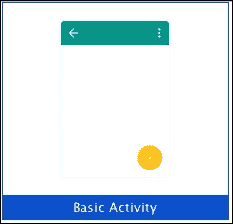

    如果您选择此模板，Android Studio 将创建一个包含两个布局文件（`activity_main.xml`和`content_main.xml`）和主活动类的项目。主布局（`activity_main.xml`）声明了操作栏和浮动操作按钮，并通过添加以下 XML 声明包含内容布局（`content_main.xml`）：

    ```java
    <include layout="@layout/content_main" />
    ```

+   **空活动**：此操作创建一个空白活动。以下是显示**空活动**的截图：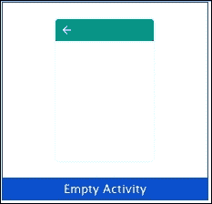

+   **全屏活动**：此模板在全屏视图中隐藏系统的用户界面（如通知栏）。默认情况下，全屏模式与当用户触摸设备屏幕时出现的操作栏交替。以下截图显示了**全屏活动**：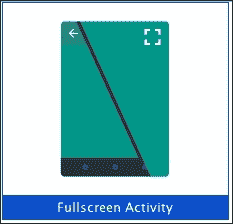

    如果您选择此模板，Android Studio 将创建一个包含主活动及其主布局的项目。主活动包含处理全屏模式的所有逻辑。例如，您会注意到两个辅助方法用于隐藏和显示操作栏：

    ```java
    private void hide() {
       …
    }

    private void show() {
       …
    }
    ```

    您还会注意到用于配置操作栏是否在延迟后自动隐藏以及该延迟时间的常量变量：

    ```java
    /**
     * Whether or not the system UI should be auto-hidden after
     * {@link #AUTO_HIDE_DELAY_MILLIS} milliseconds.
     */
    private static final boolean AUTO_HIDE = true;
    /**
     * If {@link #AUTO_HIDE} is set, the number of milliseconds to wait after
     * user interaction before hiding the system UI.
     */
    private static final int AUTO_HIDE_DELAY_MILLIS = 3000;
    ```

+   **Google AdMob Ads Activity**：此模板创建一个包含 **AdMob 广告** 的活动。此模板的目的是显示允许应用盈利的广告。以下截图显示了 **Google AdMob Ads Activity**：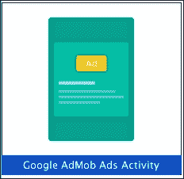

    如果你选择此模板，Android Studio 将创建一个包含主活动及其主布局的项目。主活动包含创建（`newInterstitialAd` 方法）、加载（`loadInterstitial` 方法）和显示（`showInterstital` 方法）广告的所有逻辑，这些广告保存在 `InterstitialAd` 对象中。

+   **Google Maps Activity**：此模板创建一个包含片段中 Google 地图的新活动。片段是活动中的用户界面的一部分。片段可以在多个活动中重用，并且可以在单个活动中组合多个片段。有关片段的更多信息，请参阅 [`developer.android.com/guide/components/fragments.html`](https://developer.android.com/guide/components/fragments.html)。如下截图所示：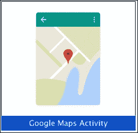

    如果你选择此模板，Android Studio 将创建一个包含主活动和一个包含以下地图片段的布局的项目：

    ```java
    <fragment 

    android:id="@+id/map"
    android:name="com.google.android.gms.maps.SupportMapFragment"
    android:layout_width="match_parent"
    android:layout_height="match_parent"
    tools:context="com.example.mapstest.MapsActivity" />
    ```

+   **登录活动**：此模板创建一个视图作为登录屏幕，允许用户使用电子邮件和密码登录或注册。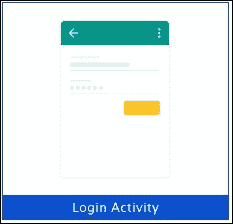

    如果你选择此模板，Android Studio 将创建一个包含主活动及其布局的项目。主布局包含：一个用于显示登录进度的 `ProgressBar`，一个用于用户电子邮件的 `AutoCompleteTextView`，一个用于用户密码的 `EditText`，以及一个用于登录的 `Button`。

    主活动包括自动完成电子邮件的代码，从字段之间切换焦点的代码，一个用于在后台执行登录的 `AsyncTask` 类，以及显示登录进度的代码。

+   **主/详细流程**：此模板将屏幕分为两个部分：左侧菜单和右侧所选项目的详细信息。在较小屏幕上，仅显示一个部分，但在较大屏幕上，同时显示两个部分。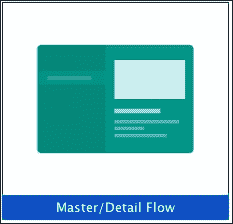

    如果你选择此模板，Android Studio 将创建一个包含两个活动（列表活动和详细活动）的项目。项目还包含两个活动的布局：列表布局和详细布局。还有一些额外的类，例如详细片段和用于创建主列表的布局。

+   **导航抽屉活动**：此模板创建了一个带有导航抽屉的新活动。它在一个从左侧面板拉到屏幕上的面板中显示主要导航选项。您可以在 [`developer.android.com/design/patterns/navigation-drawer.html`](https://developer.android.com/design/patterns/navigation-drawer.html) 上了解更多关于导航抽屉的信息。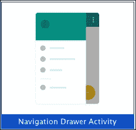

    此模板包含一个实现 `NavigationView.OnNavigationItemSelectedListener` 接口的主活动。此监听器允许活动在用户从抽屉菜单中选择选项时接收事件。事件在主活动实现的 `onNavigationItemSelected` 方法中接收：

    ```java
    @Override
    public boolean onNavigationItemSelected(MenuItem item) {
       …
    }
    ```

    主布局是 `DrawerLayout`，其中包含一个 `NavigationView` 对象。项目中也创建了额外的布局，用于主内容、主顶部栏和抽屉头部视图。

+   **滚动活动**：此模板创建了一个垂直滚动的活动。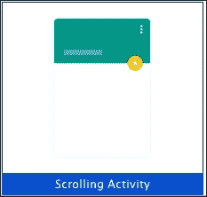

    此模板包含一个主活动和主布局。主布局包含一个 `Toolbar` 并包括滚动内容布局：

    ```java
    <include layout=""@layout/content_scrolling"" />
    ```

    内容布局是 `NestedScrollView`。

+   **设置活动**：此选项创建一个带有设置列表的偏好设置活动。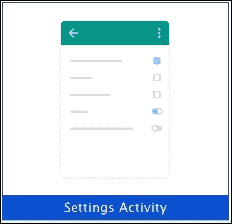

    此模板包含两个活动：主活动和偏好设置活动。偏好设置活动扩展了 `PreferenceActivity` 类并重写了构建偏好屏幕的方法。偏好设置内容是通过定义 `PreferenceScreen` 组件的 XML 文件配置的。

+   **标签活动**：此选项创建一个带有类似 **基本活动** 的操作栏的空白活动，但它还包括一个导航元素。导航元素可以是标签用户界面（固定或可滚动的标签）、水平滑动或旋转菜单。Android Studio 生成的项目内容取决于所选的导航元素。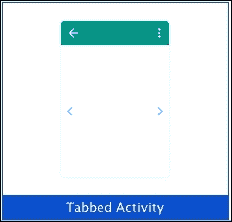

选择 **空活动** 并点击 **下一步**。

# 自定义您的活动

在 **新建项目** 向导的最后一步，您可以稍微自定义一下您的活动。这种自定义将决定您的一些类和资源文件的名称。您也可以从该向导中自定义片段的使用或导航类型。

以下截图显示了 **空活动** 的自定义屏幕：

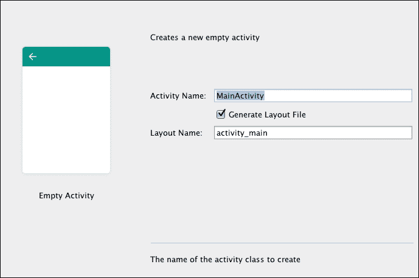

活动的基本自定义有以下选项：

+   **活动名称**：主活动类的名称。

+   **布局名称**：如果您勾选了 **生成布局文件** 选项，您可以创建一个与您的活动关联的布局。此字段允许您指定与主活动关联的布局名称，它将在资源文件夹中创建。

根据之前步骤中选择的活动类型，您可以自定义更多参数。以下截图显示了**基本活动**的自定义：

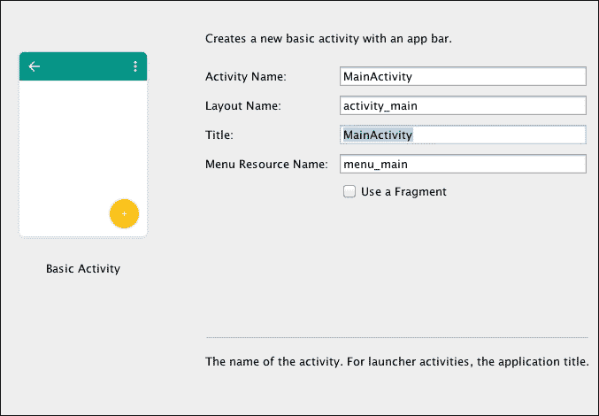

除了活动和布局名称外，您还可以配置以下选项：

+   **标题**：默认情况下，这将用于活动和动作栏。

+   **菜单资源名称**：配置菜单项的资源文件名称。

有其他仅适用于一种活动类型的自定义选项，例如**AdMob 广告活动**和**标签页活动**。**AdMob 广告活动**包含一个额外的选项，**广告格式**，这是广告的格式。格式可以是**插页式**或**横幅式**。**标签页活动**包括两个额外的选项：**片段布局名称**，这是与活动内容片段关联的布局名称；以及**导航样式**，这是导航类型。您可以选择以下三种替代方案之一进行导航：

+   滑动视图（**Swipe Views**），如图所示的下截图：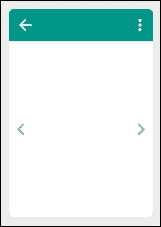

    此种导航类型使用`ViewPager`组件来显示片段。`ViewPager`对象在主活动中通过`SectionsPagerAdapter`对象进行配置。它提供了`ViewPager`所需的片段。除了包含`ViewPager`的主布局外，还创建了一个片段布局：`fragment_main.xml`。

+   动作栏中的标签页（**Action Bar Tabs**），如图所示的下截图：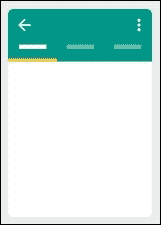

    此种导航类型使用与**Swipe Views**导航类型相同的组件和文件，以及一个`TabLayout`对象。`TabLayout`对象需要接收`ViewPager`对象，该对象在主活动的`onCreate`方法中设置：

    ```java
    TabLayout tabLayout = (TabLayout) findViewById(R.id.tabs);
    tabLayout.setupWithViewPager(mViewPager);
    ```

+   使用动作栏中的下拉列表（**Action Bar Spinner**），如图所示的下截图：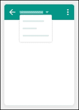

    此种导航类型使用`Spinner`组件来显示片段。`Spinner`对象在主活动中通过`ThemedSpinnerAdapter`进行配置。它提供了`Spinner`所需的片段。除了包含`ViewPager`的主布局外，还创建了一个片段布局：`fragment_main.xml`。

要完成本章，我们选择**空活动**。保留自定义中的默认值并点击**完成**。

在您的项目中将创建一个**空活动**。此活动也在`AndroidManifest.xml`文件中配置为应用程序的主活动，通过设置以下 intent 过滤器操作：

```java
<activity
    android:name=".MainActivity"
    android:label="@string/app_name" >
    <intent-filter>
        <action android:name="android.intent.action.MAIN" />
        <category android:name="android.intent.category.LAUNCHER" />
    </intent-filter>
</activity>
```

`android.intent.action.MAIN` 动作将活动设置为应用程序的主要入口点。`android.intent.category.LAUNCHER` 类别表示入口点应作为启动器中的顶级应用程序出现。我们将在第三章*导航项目*中检查这个`AndroidManifest.xml`文件。

# 摘要

我们已经使用 Android Studio 向导创建了我们第一个项目，并填写了配置字段。我们还了解了不同类型的活动。

在下一章中，我们将探讨 Android Studio 结构的各个元素。我们将了解如何创建新类、添加和访问库以及配置项目。
