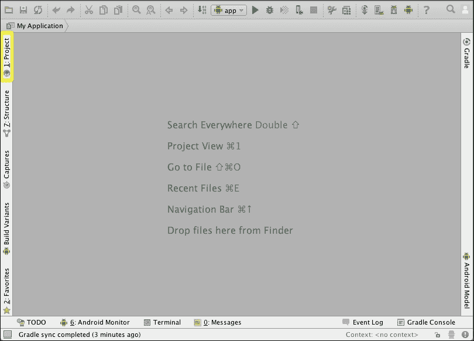
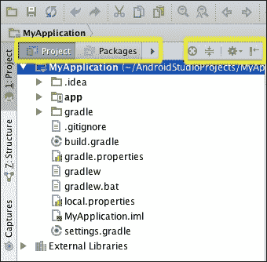
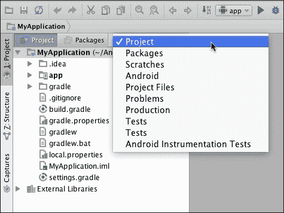
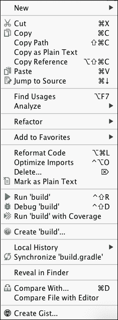
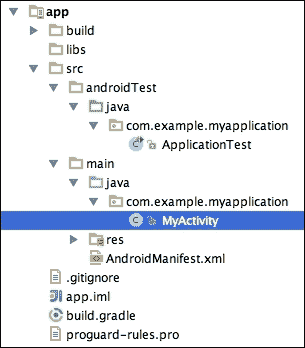
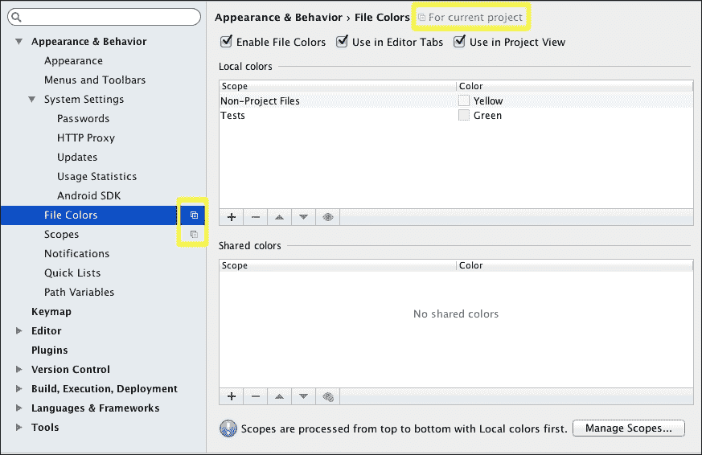
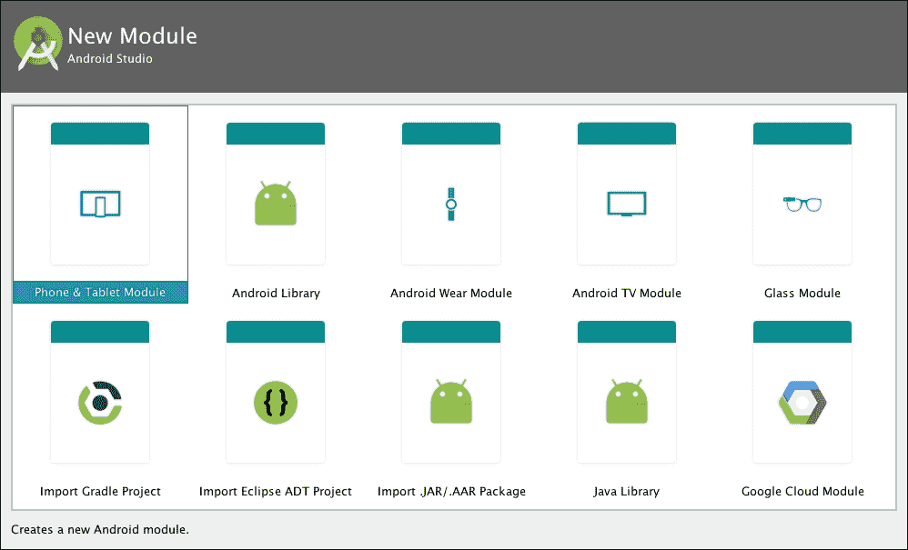

# 第三章：项目导航

现在您已经创建了第一个 Android Studio 项目，您将理解正在发生的事情。在您开始编程之前，您需要熟悉项目中的导航。一切是如何结构的？您可以在项目中更改哪些设置？如何更改这些设置以及它们代表什么？

本章旨在介绍 Android Studio 中项目的结构。我们将从理解项目导航面板开始。然后，我们将查看我们项目中最重要的文件夹——`build`、`gen`和`libs`——以及`src/main`下的文件夹，您将学习如何更改项目设置。

本章我们将涵盖以下主题：

+   导航面板

+   项目结构

+   修改项目属性

# 项目导航面板

初始时，在 Android Studio 的主视图中不显示任何项目或文件，如下一截图所示。如 Android Studio 建议，按*Alt* +*1*，或者在 Mac 上按*cmd 1*，以打开项目视图。您也可以通过点击屏幕左侧边缘的**项目**按钮来打开它：



**项目**视图显示了打开的项目列表。这些项目以分层视图显示。我们可以从项目资源管理器的左上角更改视图类型。在**项目**视图的右上角，有一些操作和一个下拉菜单来配置所选的**项目**视图类型。以下截图显示了这些操作：



从左上角打开视图选择器，查看您可以选择的完整视图类型列表，以下截图显示了这些类型：



这些是可用于在项目中导航的视图类型：

+   **项目**：此视图显示了项目的目录结构。

+   **包**：它只显示包结构。

+   **Scratches**：它只显示您在项目中创建的 Scratches 文件。Scratches 文件是可运行和可调试的文件，用于代码原型设计。您可以通过导航到**工具** | **新建 Scratches 文件**来使用菜单选项创建一个新的 Scratches 文件。

+   **Android**：它只显示您作为开发者将包含或编辑应用程序文件的文件夹。此视图非常方便，可以轻松访问您真正需要的所有文件。这些文件夹仅与列在简化结构中的 Android 应用程序相关：`java`类文件夹、`res`资源文件夹、`manifest`文件和 Gradle 脚本。由于此视图类型的目的是展示简化结构，因此它不匹配实际的文件夹结构。

+   **作用域**（**项目文件**、**问题**、**生产**、**测试**和**Android 仪器测试**）：作用域是项目文件、包和文件夹的子集。如果你选择一个预定义的作用域，你可以从**项目**视图右上角的配置菜单创建自己的自定义作用域。打开配置菜单并选择**编辑作用域**选项。默认情况下，你会看到以下预定义的作用域：

    +   **项目文件**：此作用域显示你项目中的所有文件

    +   **问题**：此作用域显示你项目中有错误的文件

    +   **生产**：此作用域显示你项目中所有非测试文件

    +   **测试**：此作用域显示你项目中的所有测试文件

    +   **Android 仪器测试**：此作用域显示所有仪器化测试文件

右键单击项目名称以打开上下文菜单或单击项目中的任何元素。如以下截图所示，从该菜单中，我们可以：

+   创建并添加新元素到项目

+   在项目中剪切、复制、粘贴或重命名文件

+   在项目中查找元素

+   分析和重新格式化代码

+   构建项目

+   比较文件

+   在资源管理器中打开文件

# 项目结构

我们可以使用**项目**视图类型在项目导航面板中检查项目结构。项目结构包括一个名为我们应用程序的文件夹。此文件夹包含应用程序结构和文件。应用程序结构的最重要元素位于`app`目录中。这些包括以下内容：

+   `build/`: 这是一个包含在构建应用程序后编译的资源以及由 Android 工具生成的类的文件夹，例如包含对应用程序资源引用的`R.java`文件。

+   `libs/`: 这是一个包含从我们的代码中引用的库的文件夹。

+   `src/androidTest/`: 这是一个包含需要测试的 Java 类测试类的文件夹。

+   `src/main/`: 这是一个包含我们应用程序源代码的文件夹。你将通常在此文件夹中处理所有文件。`main`文件夹按以下方式细分：

    +   `java/`: 这是一个包含按包组织 Java 类的文件夹。我们创建的每个类都将位于我们的项目包命名空间（`com.example.myapplication`）中。当我们创建第一个项目时，我们也创建了它的主活动，因此活动类应该在这个包中。以下截图显示了项目结构中的此主活动类

    +   `res/`: 这是一个包含项目资源的文件夹，例如指定布局和菜单的 XML 文件，或图像文件。

    +   `AndroidManifest.xml`: 这是 Android 项目中的一个基本文件，当我们创建项目时自动生成。此文件声明了 Android 系统运行应用程序所需的基本信息：包名、版本、活动、权限、意图或所需的硬件。

+   `build.gradle`: 这是一个用于构建我们应用程序的脚本文件。我们将在本章的*Gradle*子节中讨论如何配置此文件中的选项。

## 资源文件夹

这些资源都是与我们的应用程序相关的非代码资产。例如图像或字符串等元素从代码中外部化作为资源，这使得在不更改代码的情况下更新它们变得容易。资源的一些例子包括颜色、图像、图形、布局、字符串和样式。资源被分配到以下文件夹：

+   `anim/`: 这是一个包含动画对象的 XML 文件的文件夹。

+   `color/`: 这是一个包含我们应用程序中使用的颜色状态列表的文件夹。颜色状态列表定义了颜色和基于组件状态的颜色变化。

+   `drawable/`: 这是一个包含图像和描述我们应用程序中使用的可绘制对象的 XML 文件的文件夹。

+   `mipmap/`: 这是一个包含应用程序启动器图标的文件夹。有不同分辨率的 drawable 文件夹。当我们创建第一个项目时，还创建了一个默认的应用程序图标。这个名为`ic_launcher.png`的图标已经存在于这些文件夹中。

+   `layout/`: 这是一个包含视图及其元素的 XML 定义的文件夹。

+   `menu/`: 这是一个包含应用程序菜单的 XML 定义的文件夹。

+   `values/`: 这是一个包含定义名称-值对的 XML 文件的文件夹。这些值可以是颜色、字符串或样式。有不同类型的值文件夹，它们被分类到不同的屏幕选项中，以适应界面；例如，当应用程序在平板电脑上运行时，可以放大组件或字体。 

我们的基本项目包含一些基本资源。因此，这里讨论的所有文件夹并不一定默认包含。

## 清单文件

`AndroidManifest.xml`文件是一个强制性的文件，它包含 Android 系统运行应用程序所需的必要信息。清单文件必须包含的两个基本 XML 标签如下：

+   `<manifest>`: XML 文件中的根元素。`package`属性定义了应用程序的 Java 包名，这是应用程序的唯一标识符。此元素的其它属性允许您设置版本代码（`android:versionCode`）或版本名称（`android:versionName`）。

+   `<application>`：此元素在 `<manifest>` 中包含您的应用的其余元素，例如活动（`<activity>`）、服务（`<service>`）或内容提供者（`<provider>`）元素。您可以为此元素指定几个属性，例如，将应用设置为可调试（`android:debuggable`）、为应用设置用户可读的标签（`android:label`）或设置您的应用是否允许备份（`android:allowBackup`）。

清单文件还声明了您的应用需要的权限和功能。例如，如果您的应用需要互联网访问，则必须在清单文件中添加它：

```java
<uses-permission android:name="android.permission.INTERNET" />
```

您也可以通过清单文件将有关 SDK 的信息呈现给 Android 系统。使用 `<uses-sdk>` 元素及其属性来指示您的应用支持的最小 SDK 版本和目标 SDK。

## Gradle

Android Studio 中的应用使用 **Gradle** 构建。它是一个与 Android Studio 独立但完全集成的构建自动化工具。Gradle 使用基于 Groovy 的可扩展和声明式 **领域特定语言**（**DSL**），Groovy 是一种面向对象的 Java 平台编程语言。Gradle 构建文件由一个或多个项目组成，每个项目包含一个或多个任务。任务代表要构建的工作片段。您可以在 [`www.gradle.org/`](http://www.gradle.org/) 上了解更多关于 Gradle 的信息。

构建过程的配置声明在 Android 项目中包含的 Gradle 构建文件中。如前所述，在项目结构中，Android 应用的构建配置文件定义在 `/app/build.gradle` 文件中。我们可以在该文件中配置的一些主要选项如下：

+   **变体**：我们可以使用相同的工程配置应用的不同版本，例如，创建演示版和付费版。变体依赖于构建类型（`buildTypes` 标签）和产品风味配置（`productFlavors` 标签）。例如，两个构建类型是 `debug` 和 `release`，两个产品风味是演示版和付费版。在您的应用 Gradle 构建文件中，您将找到用于发布的 `buildType`：

    ```java
    buildTypes {
       release {
          …
       }
    }
    ```

+   **依赖项**：我们可以指示我们的项目对其他模块或库的本地或远程依赖项。这些依赖项在 `dependencies` 标签下声明。在您的应用 Gradle 构建文件中，您将找到一个对项目 `lib` 文件夹中包含的 JAR 文件的依赖项，以及对 JUnit 测试框架的依赖项：

    ```java
    dependencies {
        compile fileTree(dir: 'libs', include: ['*.jar'])
        testCompile 'junit:junit:4.12'
    }
    ```

+   **清单条目**：我们可以在构建文件中覆盖 Android 清单文件的一些条目，提供 `manifest` 文件的动态配置。例如，我们可以覆盖包名、最小 SDK 或目标 SDK 的值。这些配置定义在 `android/defaultConfig` 标签下：

    ```java
    defaultConfig {
        applicationId "com.example.myapplication"
        minSdkVersion 16
        targetSdkVersion 23
        versionCode 1
        versionName "1.0"
    }
    ```

+   **签名**: 我们可以为发布版本激活应用程序签名。构建系统使用默认证书来签名应用程序的调试版本。我们也可以配置我们的密钥和证书来签名发布版本。这些配置定义在`android/signingConfigs`标签下。你将在第九章准备发布中学习如何为你的应用签名。

# 项目设置

你可以通过**文件** | **设置**和**文件** | **项目结构**来导航到包含项目设置的对话框。这两个选项也在工具栏中可用：


从项目视图中选择你的项目，并导航到**文件**菜单中的**设置**。**设置**对话框的左侧面板显示了以下部分结构化的选项：

+   **外观与行为**: 你可以更改 Android Studio 的外观和行为，例如字体大小、主题、更新、密码或范围管理。

+   **快捷键映射**: 这管理键盘快捷键。

+   **编辑器**: 这通过选择颜色、使用模板或更改编码来自定义代码编辑器。默认编码是 UTF-8。你将在第四章使用代码编辑器中了解更多关于**编辑器**设置的信息。

+   **插件**: 这管理插件。你可以安装和删除插件，启用或禁用它们，或者你可以检查它们的版本。

+   **版本控制**: 在本节中，你可以找到与版本控制相关的设置；例如，你可以配置后台执行或添加要忽略的文件。版本控制将在第六章工具中更详细地解释。

+   **构建**、**执行**、**部署**: 在本节中，你可以配置构建工具，如 Gradle、编译器和调试器。

+   **语言与框架**: 这些是与你的项目中使用的框架相关的设置。

+   **工具**: 本节包括与其它工具相关的设置。你可以管理网络浏览器、终端或添加服务器证书。

其中一些设置是通用设置，但其他一些设置仅适用于当前项目。你可以通过它们旁边的图标或设置标题中的标签**当前项目**来区分当前项目设置，如下一张截图所示：



除了这些**设置**之外，在**项目结构**对话框中还有进一步的设置。导航到**文件** | **项目结构**菜单。设置包括以下内容：

+   **SDK 位置**: 你可以更改项目的 SDK。在第一章安装和配置 Android Studio 中，我们选择了一个 SDK 作为默认值。在这个屏幕上，我们可以更改这个 SDK，但仅限于当前项目。

+   **项目**: 您可以更改 Gradle 版本或插件和库仓库。

+   **开发者服务**: 您可以在您的应用中配置多个开发者服务。可用的服务包括以下内容：**广告**（AdMob）、**分析**（Google Analytics）、**身份验证**（Google Sign-In）、**云**（Firebase）和**通知**（Google Cloud Messaging）。

+   **模块**: 根据 IntelliJ IDEA ([`www.jetbrains.com/idea/webhelp/module.html`](http://www.jetbrains.com/idea/webhelp/module.html)) 的定义，以下是一个模块的定义：

    > *"一个模块是一个可以独立编译、运行、测试和调试的功能单元。"*

    此 **模块** 菜单显示现有模块及其功能的列表。我们项目中的默认模块是 `app` 模块。设置选项卡对应以下 Gradle 构建文件配置：**属性**、**签名**、**变体**、**构建类型**和**依赖项**。

您可以通过点击 **项目结构** 对话框左上角的添加按钮向您的项目添加新模块。此操作将打开一个模块选择向导，如下面的截图所示：



您可以选择以下模块类型之一：**手机和平板模块**、**Android 库**、**Android Wear 模块**、**Android TV 模块**、**Glass 模块**、**导入 Gradle 项目**、**导入 Eclipse ADT 项目**、**导入 .JAR/.AAR 包**、**Java 库**或**Google Cloud 模块**。

# 摘要

我们看到了在 Android Studio 中项目是如何呈现的，以及创建项目时默认包含哪些文件夹。我们探讨了这些文件夹存在的原因，并检查了 `AndroidManifest.xml` 文件及其用途。我们还浏览了 **首选项** 和 **项目结构** 对话框中的项目设置。到目前为止，您应该知道如何在 Android Studio 中操作和导航项目。

在下一章中，我们将讨论如何使用文本编辑器。对文本编辑器的适当了解对于提高我们的编程效率非常重要。您将了解编辑器设置以及如何自动完成代码、使用预生成的代码块以及导航代码。您还将了解一些有用的快捷键。
