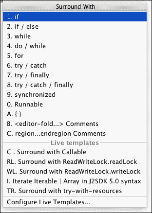

# 第四章 使用代码编辑器

现在你已经创建了你的第一个项目，并且学会了如何在不同文件夹、子文件夹和文件之间导航，现在是时候开始编程了。你有没有想过能够更高效地编程？你该如何加快你的开发过程？你想要学习有用的快捷键吗？例如，你如何一次性注释多行，查找和替换字符串，或者在方法调用中更快地移动到不同的参数？

在本章中，你将学习如何使用和自定义代码编辑器，以便在编程时感到更加舒适。了解代码编辑器的基本功能以增加你的生产力是值得的。你将了解代码补全和代码生成。最后，你将学习一些有用的快捷键和热键来加快开发过程。

本章我们将涵盖以下主题：

+   自定义代码编辑器

+   代码补全

+   代码生成

+   查找相关内容

+   有用的快捷键

# 自定义编辑器设置

要打开编辑器设置，导航到**文件** | **设置**。在左侧面板的**IDE 设置**部分，选择**编辑器**。**编辑器**设置分布在几个类别中：**通用**、**颜色与字体**、**代码样式**、**检查**、**文件和代码模板**、**文件编码**、**实时模板**、**文件类型**、**版权**、**Emmet**、**图像**、**意图**、**语言注入**、**拼写**和**TODO**。

在本节以及本章接下来的几节中，我们将解释一些最有趣的内容。

## 通用

在**编辑器**设置下选择**通用**设置。这将在右侧面板中显示设置。其中一些最有趣的选项如下：

+   **鼠标** | **使用 Ctrl + 鼠标滚轮更改字体大小（缩放）**：勾选此选项允许我们使用鼠标滚轮更改编辑器的字体大小，就像我们在其他程序（如网页浏览器）中做的那样。

+   **其他** | **鼠标移动时显示快速文档**：勾选此选项可以在我们将鼠标移至代码片段并等待 500 毫秒后，在小型对话框中显示有关代码的快速文档。你可以更改默认的 500 毫秒延迟值。当我们再次移动鼠标时，对话框会自动消失，但如果我们将鼠标移入对话框，则可以详细查看文档。这对于阅读方法的功能和识别其参数而不需要导航到它非常有用。以下截图显示了此功能：

**通用**设置也分布在几个子类别中：

+   **自动导入**: 此类别配置当我们将使用未导入当前类的类的代码粘贴到编辑器时，编辑器的行为方式。默认情况下，当我们这样做时，会弹出一个窗口，提示我们添加`import`命令。如果我们勾选了**自动添加不明确的导入**选项，则`import`命令会自动添加，无需我们的交互。

+   **外观**: 此类别配置编辑器的外观。我们建议检查以下两个选项：

    +   **显示行号**: 这会在编辑器的左侧边缘显示行号。当我们进行调试或检查日志时，这可能非常有用。

    +   **显示方法分隔符**: 这在视觉上分隔类的各个方法。

+   **代码补全**: 此类别配置代码补全选项。我们将在下一节中详细检查代码补全。

+   **代码折叠**: 此类别可以折叠或展开代码块，使我们能够隐藏不编辑的代码块，简化代码视图。我们可以使用编辑器中的图标折叠或展开块，如图中所示，或者使用**代码**中的**折叠**菜单。

+   **控制台**: 此配置控制台。您可以修改命令历史大小或折叠的行数。

+   **编辑器标签**: 此配置编辑器标签。我们建议您选择**用星号标记已修改的标签**选项，以便轻松检测已修改和未保存的文件。

+   **后缀补全**: 这配置了一种称为后缀补全的代码补全类型。我们将在下一节中详细检查代码补全。

+   **智能键**: 此类别配置在键入时自动执行的操作，例如添加闭合括号、引号或标签，以及在我们按下*Enter*键时缩进行。

## 颜色与字体

此类别更改字体和颜色。有许多选项和元素可以配置（关键字、数字、警告、错误、注释、字符串等）。您可以从**颜色与字体**设置的主屏幕配置中保存配置为方案。

## 代码样式

**代码样式**设置仅影响当前项目。您可以从此设置类别的主面板中保存样式配置为方案。您可以为以下几种文件类型分别配置：**C/C++**、**Groovy**、**HTML**、**Java**、**JSON**、**Properties**、**XML**和其他文件类型。

以下是一些您可以配置的样式功能：

+   **制表符和缩进**: 配置是否要使用制表符或空格（我们建议不要使用制表符）以及它们的某些属性，例如大小或缩进。

+   **空格**: 配置在括号前、运算符周围、左大括号前、关键字前等插入空格。

+   **换行和括号**: 配置行断点、括号放置（例如，**行尾**或**下一行**）、参数放置、控制语句等。

+   **空白行**: 配置空白行的插入，例如在导入之前或之后、方法体周围或字段周围。

适当的代码风格可以使你的代码更容易理解。如果代码由多个开发者编写或你的代码与其他开发者共享，使用通用的代码风格非常重要。

## 文件和代码模板

此类别允许你编辑和创建文件、文件头或代码的模板。**文件和代码模板**设置仅影响当前项目。你可以从设置类别的主面板保存样式配置为方案。 

你可以使用详细面板中解释的一些预定义变量来更改你项目的文件头模板（`${PACKAGE_NAME}`, `${USER}`, `${DATE}`, `${TIME}`, `${PROJECT_NAME}` 等）。

点击**文件和代码模板**设置的**包含**选项卡，并选择**文件头**模板。每次创建新文件时，都会添加以下头部：

```java
/**
 * Created by ${USER} on ${DATE}.
 */
```

你可以通过添加文件包来修改它：

```java
/**
 * ${PACKAGE_NAME}
 * Created by ${USER} on ${DATE}.
 */
```

你还可以创建和修改在创建新活动、片段、服务、资源文件等时应用的模板。例如，这是活动的模板：

```java
package ${PACKAGE_NAME};

import android.app.Activity;
import android.os.Bundle;

#parse("File Header.java")
public class ${NAME} extends Activity {
    @Override
    public void onCreate(Bundle savedInstanceState) {
        super.onCreate(savedInstanceState);
    }
}
```

你可以在 IntelliJ IDEA 文档中了解更多信息，链接为 [`www.jetbrains.com/help/idea/2016.1/file-and-code-templates.html`](https://www.jetbrains.com/help/idea/2016.1/file-and-code-templates.html)。

# 代码补全

**代码补全**通过使用基于我们刚刚输入的内容动态生成的建议列表自动完成代码，帮助我们快速编写代码。

基本代码补全是在我们输入时出现的建议列表，如下面的截图所示。如果列表没有显示，按 *Ctrl* 和 *空格键* 打开它：


继续输入，从列表中选择一个命令，然后按 *Enter* 键或双击以将其添加到你的代码中。如果你正在编写的代码是一个表达式，并且想要以否定形式插入该表达式，则从建议列表中选择该表达式，而不是按 *Enter* 键或双击它，按感叹号键 (*!*)。表达式将以否定形式添加。

代码补全的另一个实用功能是**语句补全**。输入一个语句，按*Ctrl* + *Shift* + *Enter*（在 OS X 上为*Cmd* + *Shift* + *Enter*），注意如何自动添加结束标点符号。如果你在输入`if`关键字后按这些键，将添加括号和方括号以完成条件语句。此快捷键也可以用于完成方法声明。开始输入一个方法，在输入开括号或方法参数后，按*Ctrl* + *Shift* + *Enter*（在 OS X 上为*Cmd* + *Shift* + *Enter*）。将添加闭括号和方括号以完成方法规范。

## 智能类型补全

另一种代码补全类型是**智能类型**代码补全。如果你正在输入一个带有`String`参数的方法调用命令，那么只建议`String`对象。这种智能补全发生在赋值语句的右侧、方法调用的参数、返回语句或变量初始化器中。要打开智能建议列表，请按*Ctrl* + *Shift*键，然后按空格键。

要显示这两种类型建议列表之间的差异，在你的代码中创建两个不同类的对象，`String`和`int`。然后调用一个带有`String`参数的方法，例如`Log`类的`i`方法。在输入`String`参数时，注意打开基本建议列表（*Ctrl* + 空格键），如下一个截图所示，以及打开智能类型建议列表（*Ctrl* + *Shift* + 空格键），如第二个截图所示：


在第一个列表中，如前一个截图所示，建议了两个对象，尽管`int`对象与参数类不匹配。在第二个列表中，如以下截图所示，只建议`String`对象：


## 后缀补全

**后缀补全**是一种代码补全类型，它将已输入的表达式进行转换。转换取决于你写的后缀、上下文和表达式的类型。后缀表达式在基本代码补全建议列表中建议。以下是一个后缀模板示例`notnull`，如以下截图所示：


当你将`notnull`模板应用于表达式`expr`时，表达式将转换为`if (expr != null)`。前一个截图中的表达式在执行`notnull`转换后成为以下代码：

```java
if (savedInstanceState != null) {
}
```

如果你只想在建议列表中看到可用的后缀模板，请按*Ctrl* + *J*（在 OS X 上为*Cmd* + *J*）。下一个截图中的对话框列出了可以应用于当前表达式的所有可用后缀模板：


您可以从**编辑器**设置中管理不同的后缀模板，在**常规** | **后缀完成**中。所有可用模板的完整列表及其描述在右侧面板中显示。

下一张截图显示了`for`后缀模板的描述和转换：


# 代码生成

要在类中生成代码块，请导航到**代码** | **生成**，或者按*Alt* + *Insert*快捷键 (*在 OS X 上为*Cmd* + *N*)。将显示如下对话框：


从**生成**菜单中，您可以生成构造函数、获取器和设置器方法、超方法调用，或者`equals`和`toString`方法。我们还可以重写或委派方法。

生成代码的另一种方式是将一些代码用语句（`if`、`if/else`、`while`、`for`、`try/catch`等）包围起来。选择一行代码，并导航到**代码** | ** Surround With**，或者按*Ctrl* + *Alt* + *T* (*在 OS X 上为*Cmd* + *Alt* + *T*)。以下截图显示了** Surround With**选项的菜单：



第三种选项，如前一张截图所示，是插入一个**Live Template**。您可以使用** Surround With**选项将代码包围在一个**Live Template**中，或者导航到**代码** | ** Surround with Live Templates**，或者按*Ctrl* + *Alt* + *J* (*在 OS X 上为*Cmd* + *Alt* + *J*)。

导航到**代码** | **插入 Live Templates**，或者按*Ctrl* + *J* (*在 OS X 上为*Cmd* + *J*)以打开可用 Live Templates 的对话框。这些模板可以插入用于迭代集合、数组、列表等的代码；用于打印格式化字符串的代码；用于抛出异常的代码；或用于添加静态和最终变量的代码。对话框的左侧显示每个模板的前缀。如果您在编辑器中输入前缀并按*Tab*键，代码模板将自动添加。

在我们主活动的`onCreate`方法末尾输入`inn`并按*Tab*键。将出现一个条件块。在这个新块中，输入`soutv`并再次按*Tab*键。结果如下：

```java
protected void onCreate(Bundle savedInstanceState) {
    super.onCreate(savedInstanceState);
    setContentView(R.layout.activity_main);

    if (savedInstanceState != null) {
 System.out.println("savedInstanceState = " + savedInstanceState);
 }
}
```

# 导航代码

导航到声明或类型声明最直接的方式是按下*Ctrl* (*在 OS X 上为*Cmd*)并点击显示为链接的方法名称。此选项也可以从**导航** | **声明**菜单或按*Ctrl* + *B* (*在 OS X 上为*Cmd* + *B*)访问。

我们可以从编辑器的左侧边缘导航到方法层次结构。在属于方法层次结构的方法声明旁边，有一个图标指示方法是否实现接口方法、实现抽象类方法、覆盖超类方法，或者被其他后代实现或覆盖。点击这些图标以导航到层次结构中的方法。此选项也可以通过**导航** | **超类方法**或**导航** | **实现**访问。你可以在我们第一个项目的活动主类（`MainActivity.java`）中测试它，如下面的截图所示：


在编辑器的左侧边缘，你可以找到另一种类型的导航图标。打开你的主活动类，查看下一个截图所示的**转到相关文件**图标：


从**转到相关文件**菜单，你可以导航到与当前文件和类相关的文件。在这个例子中，相关文件是与你的活动关联的布局文件以及应用清单文件。

与代码导航相关的另一个有用工具是**自定义区域**的使用。自定义区域是你想要分组并命名的代码片段。例如，如果一个类有多个方法，我们可以创建一些自定义区域来在这些方法之间分配它们。区域有一个名称或描述，并且可以通过代码折叠来折叠或展开。

要创建一个自定义区域，我们可以使用代码生成。选择代码片段，导航到**代码** | **环绕**，并选择以下两个选项之一：

+   **<editor-fold…> 注释**

+   **region…endregion 注释**

这两个选项都创建一个区域，但使用不同的样式。

当我们使用自定义区域时，我们可以使用**导航**菜单中的**自定义折叠**菜单来导航到它们。其余的导航选项都可以从**导航**菜单中访问。以下是一些选项：

+   **类**/**文件**/**符号**：通过名称查找类、文件或符号。

+   **行**：此选项通过编号跳转到代码行。

+   **上次编辑位置**：这会导航到最近的更改点。

+   **测试**：这会导航到当前类的测试。

+   **文件结构**：这会打开一个对话框，显示文件结构。打开我们主活动的文件结构，观察结构是如何呈现的，显示方法列表以及指示元素类型或可见性的图标，如下面的截图所示：

+   **类型层次结构**：这会打开一个对话框，显示所选对象的类型层次结构。

+   **方法层次结构**：这会打开一个对话框，显示所选方法的方法层次结构。

+   **调用层次结构**：这会打开一个对话框，显示所选方法的调用层次结构。

+   **下一个高亮错误**：这会导航到下一个错误。

+   **上一个高亮错误**: 这将导航到上一个错误。

+   **下一个方法**: 这将导航到下一个方法。

+   **前一种方法**: 这将导航到前一种方法。

# 有用的快捷键

您可以通过 **设置** 中的 **键映射** 选项找到所有可用的快捷键并更改它们。如果您双击操作，将显示 **编辑快捷键** 菜单。从该菜单中，您可以删除快捷键或添加新的快捷键，这可以是键盘快捷键、鼠标快捷键或缩写。

以下列表中包含了一些 Windows 和 OS X 的有用快捷键：

+   *Ctrl* + *W* (*Alt* + 向上箭头在 OS X 上): 这将根据语法选择表达式。按这些键重复以扩展选择。相反的命令是 *Ctrl* + *Shift* + *W* (*Alt* + 向上箭头在 OS X 上)。

+   *Ctrl* + */* (*Cmd* + */* 在 OS X 上): 这将对所选代码的每一行进行注释。要使用块注释，请使用 *Ctrl* + *Shift* + */* (*Alt* + *Cmd* + */* 在 OS X 上)。

+   *Ctrl* + *Alt* + *I*: 这将缩进所选代码。这在清理你完成编写后的代码块或方法时非常有用。

+   *Ctrl* + *Alt* + *O*: 这将优化导入，删除未使用的导入，并重新排序其余的导入。

+   *Shift* + *Ctrl* + 方向键 (*Alt* + *Shift* + 方向键在 OS X 上): 这将所选代码移动到上一行或下一行。

+   *Alt* + 方向键 (*Ctrl* + 方向键在 OS X 上): 这将在编辑器的打开标签页之间切换。

+   *Ctrl* + *F* (*Cmd* + *F* 在 OS X 上): 这将在编辑器的活动标签页中查找字符串。

+   *Ctrl* + *R* (*Cmd* + *R* 在 OS X 上): 这将在编辑器的活动标签页中替换字符串。

+   *Ctrl* + *A* (*Cmd* + *A* 在 OS X 上): 这将选择打开文件的全部代码。

+   *Ctrl* + *D* (*Cmd* + *D* 在 OS X 上): 这将复制所选代码并将其粘贴到选择的末尾。如果没有选择代码，则整个行将被复制并粘贴到新行中。

+   *Ctrl* + *Y* (*Cmd* + *Delete* 在 OS X 上): 这将删除整行，而不留下空白行。

+   *Ctrl* + *Shift* + *U* (*Cmd* + *Shift* + *U* 在 OS X 上): 这将切换大小写。

+   *Ctrl* + *O* (*Cmd* + *O* 在 OS X 上): 这将打开一个搜索框，以便在项目类中导航。

+   *Ctrl* + *Shift* + *O* (*Cmd* + *Shift* + *O* 在 OS X 上): 这将打开一个搜索框，以便在项目文件中导航。

+   *Ctrl* + *Shift* + *A* (*Cmd* + *Shift* + *A* 在 OS X 上): 这将打开一个搜索框，以便在 IDE 中导航到可用的操作。

+   *Tab*: 这将移动到下一个参数。

# 摘要

到本章结束时，您应该已经学会了一些有用的技巧和提示，以便充分利用代码编辑器。您现在知道如何使用代码补全、代码生成以及一些有用的快捷键来加快不同的操作。我们还自定义了我们的代码编辑器，现在可以开始编程了。

在下一章中，我们将开始使用布局创建我们的第一个用户界面。你将学习如何使用图形向导创建布局，以及通过使用基于文本的视图编辑 XML 布局文件。我们将使用文本视图组件创建我们的第一个应用程序，一个经典的*Hello World*示例。你还将学习如何为多个屏幕尺寸准备我们的应用程序，并适应不同的设备方向。最后，你将了解 UI 主题以及如何处理事件。

### 小贴士

**下载示例代码**

代码本书的序言中详细说明了下载代码包的步骤。本书的代码包也托管在 GitHub 上，网址为[`github.com/PacktPublishing/Android_Studio_2_Essentials_Second_Edition_Code`](https://github.com/PacktPublishing/Android_Studio_2_Essentials_Second_Edition_Code)。我们还有其他来自我们丰富图书和视频目录的代码包，可在[`github.com/PacktPublishing/`](https://github.com/PacktPublishing/)找到。去看看它们吧！
