# 第五章 创建用户界面

现在我们已经创建了第一个项目，并且熟悉了代码编辑器和其功能，我们将通过创建用户界面来开始我们的应用程序。在 Android Studio 中创建用户界面有不止一种方法吗？你如何向用户界面添加组件？你是否曾经想过如何让你的应用程序支持不同的屏幕尺寸和分辨率？

本章重点介绍使用布局创建用户界面。布局可以通过图形视图或基于文本的视图创建。你将学习如何使用这两种方式来创建你的布局。我们还将使用简单的组件编写一个`Hello World`应用程序。由于有超过 18,000 种 Android 设备类型，你将了解不同屏幕类型上的碎片化问题，我们将讨论如何为这个问题准备我们的应用程序。我们将以处理我们应用程序中的事件的基本概念结束本章。

本章我们将涵盖以下主题：

+   现有的布局编辑器

+   创建新布局

+   添加组件

+   支持不同屏幕

+   更改 UI 主题

+   处理事件

# 图形编辑器

在我们的项目中打开位于 `/src/main/res/layout/activity_main.xml` 的主布局。图形编辑器将默认打开。图形编辑器的中心面板是**预览**，在这里你可以查看你的布局看起来如何。从**预览**中你可以看到，最初这个主布局只包含一个带有**Hello World!**信息的文本视图。要切换图形和文本编辑器，请点击屏幕底部的**设计**和**文本**标签，如图所示：

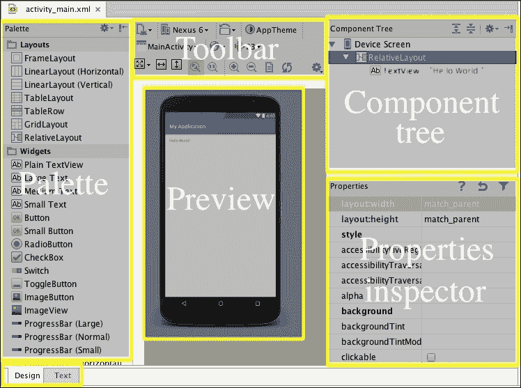

**工具栏**选项包含一些可以用来更改布局样式和预览的选项。以下截图所示的**工具栏**选项将在本章中解释：

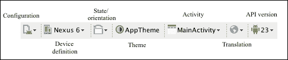

**组件树**面板显示了布局中放置的组件作为层次结构。在我们的布局中有两个组件：一个作为根元素的**RelativeLayout**，以及一个显示**Hello World!**信息的**TextView**。当你选择**组件树**面板上的一个元素时，该元素在**预览**中突出显示，其属性列在**属性**检查器面板中。它显示了从布局中选择的组件的属性，并允许我们更改它们。**调色板**列出了可以放置在我们布局中的现有**用户界面**（**UI**）组件。它将组件组织在不同的类别中。让我们看看**组件调色板**中可用的选项：

+   **布局**: 布局是一个容器对象，用于在屏幕上分布组件。UI 的根元素是一个布局对象，但布局也可以包含更多的布局，从而创建一个由布局结构化的组件层次结构。建议尽可能保持此布局层次结构简单。我们的主布局以**RelativeLayout**作为根元素。

+   **Widgets**: 这个类别包含文本视图、按钮、复选框、开关、图像视图、进度条、滑动条、评分条、旋转器和网页视图等选项。它们是最常用的组件，并且被用于大多数布局中。我们的主布局在根相对布局内包含**TextView**。

+   **文本字段**: 这些是可以编辑的字段，用户可以在其中输入不同类别的文本。不同选项之间的区别在于用户可以输入的文本类型。

+   **容器**: 这个类别将具有共同行为的组件分组。单选按钮组、列表视图、网格视图、滚动视图和标签宿主是一些例子。

+   **日期和时间**: 这个类别包含以日历或时钟形式相关的日期和时间组件。

+   **专家**: 这个类别中的组件不如**Widgets**类别中的组件常见，但值得一看。

+   **自定义**: 这个类别包含允许我们包含自定义组件的组件，这些组件通常是我们的项目中的其他布局。

# 基于文本的编辑器

通过点击**文本**选项卡将图形编辑器更改为文本编辑器：

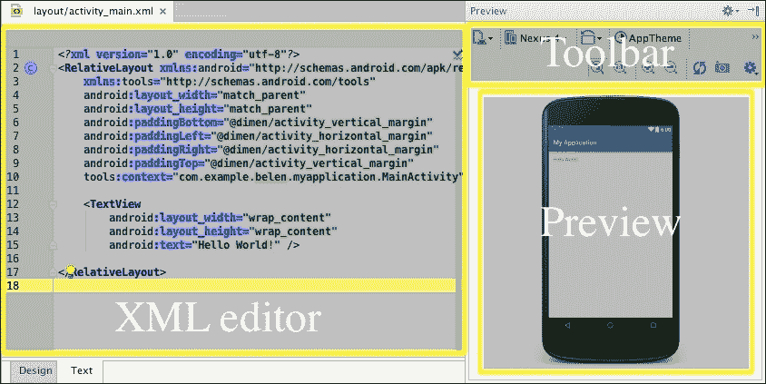

**工具栏**面板与图形编辑器上的相同。**预览**窗口显示布局，但不能更改。要更改，您应该使用**设计**选项卡。组件是通过它们的 XML 声明添加到布局中的。属性也是通过 XML 声明配置的。与图形编辑器一样，文本编辑器包含两个 XML 元素：作为根元素的相对布局和根布局内的文本视图元素。

XML 标签名称定义了我们声明的组件类型。对于相对布局，我们使用`RelativeLayout`标签，对于文本视图，我们使用`TextView`标签。我们可以通过在 XML 标签中包含属性来向元素添加属性。例如，我们主布局中的文本视图有三个属性：

+   `android:layout_width`，`wrap_content`值：此属性设置元素在其父元素内部的高度。`wrap_content`值意味着元素的高度将由其内容宽度决定。您可以为此属性设置的另一个默认值是`match_parent`，这意味着元素将具有与其父元素相同的宽度。

+   `android:layout_height`，`wrap_content`值：此属性设置元素在其父元素内部的高度。值的行为与宽度相同。

+   `android:text`，值为`Hello World!`：此属性设置要在文本视图中显示的文本。

# 创建新布局

当我们创建主活动时，关联的布局也会被创建。这是在创建活动时创建布局的一种方式。

要添加一个不创建新活动的独立布局，在`layout`文件夹（`res/layout/`）上右键单击，然后导航到**新建** | **布局资源文件**。你还可以使用相同的右键菜单通过导航到**新建** | **XML** | **布局 XML 文件**来创建布局文件。你还可以使用顶部的**文件**菜单导航到这两个选项。下一个截图将显示以下对话框以配置新的布局组件：

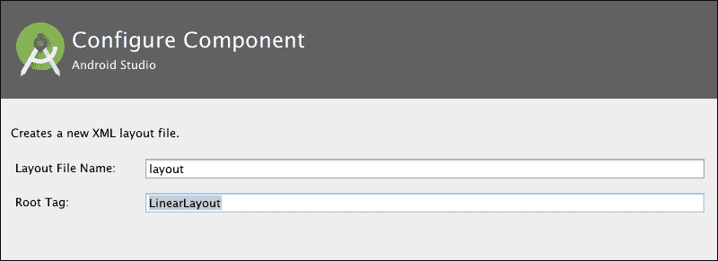

输入**布局文件名**和**根标签**。我们主布局的根元素是一个相对布局，但你可以选择不同的根标签。布局有五种类型：

+   **FrameLayout**：这种布局通常在屏幕的一个安排区域内只显示一个子组件。如果添加了多个子组件，则视图将堆叠显示。

+   **LinearLayout**：这种布局通过将子组件一个接一个地排列在一个方向上来显示其子组件。线性布局有两种类型：垂直和水平，这由布局的`android:orientation`属性来识别。

+   **TableLayout**：这种布局通过在行和列中分配子组件来显示其子组件。除了表格布局外，还需要使用**TableRow**元素来创建行和列的分配。

+   **GridLayout**：这种布局通过在矩形网格中显示其子组件。子组件可以使用`rowSpec`和`columnSpec`等属性填充多个单元格。

+   **RelativeLayout**：这种布局通过子组件之间的相对位置来显示其子组件。你必须使用子视图中的位置属性来确定它们的位置。至少需要一个子视图具有相对于父视图的位置属性，这样该子视图以及相对于它的视图就可以在父布局内定位。这些属性中的一些是`android:layout_below`、`android:layout_toLeftOf`或`android:layout_alignBottom`。

一旦创建了布局，可以使用编辑器将其关联的活动更改为不同的活动。如果布局没有活动，任何现有的活动都可以从编辑器中链接到它。要完成此操作，在布局编辑器的工具栏中搜索**关联活动**选项，点击它，然后选择**关联到其他活动**选项，如图所示：

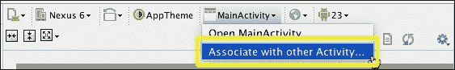

将打开一个对话框，列出你项目的所有活动，你可以从中选择一个。

# 添加组件

我们的主要布局是一个相对布局，包含一个显示**Hello World!**的文本视图。现在让我们添加一个新的组件。最简单的方法是使用图形编辑器，所以打开**设计**选项卡。选择一个组件并将其拖动到布局预览中；例如，导航到**文本字段**中的**姓名**组件，并将其放置在文本视图下方。

由于我们的根布局是相对布局，当你拖动布局中的元素时，会显示一些参考线。当你尝试在布局中拖放元素时，与位置相关的属性也会在**预览**的顶部部分显示。以下截图中的这些线和建议的属性可以帮助你正确地对齐屏幕上的元素。它们还有助于你设置元素相对于布局中已存在的其他元素的位置。

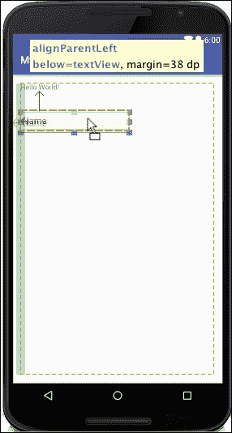

上一截图中的**预览**面板中建议的属性将文本字段对齐到父元素的左侧（**alignParentLeft**），将文本字段的位置设置为在**Hello World!**文本视图下方（**below=textView**），并为文本视图添加 38 dp 的边距（**margin=38 dp**）。

在**组件树**视图中，现在有一个新的`editText`对象。保持文本字段选中状态，以检查在**属性**检查器中加载的属性。让我们更改其中一些属性，并观察布局预览和**组件树**中的差异：

+   **layout:width**：此选项将使字段的宽度适应其内容。其当前值是`wrap_content`。将其更改为`match_parent`以适应父布局的宽度（根相对布局）。

+   **提示**：将字段的提示信息设置为`Enter your name`。当字段为空时，提示信息会显示出来，以指示应输入的信息。由于字段有一个默认值`Name`，所以提示信息是不可见的。

+   **id**：当前的 ID 是`@+id/editText`。ID 将在代码中使用以获取对对象的访问权限，并在组件树中显示。此 ID 也可以由布局中的其他元素使用，以确定它们相对于它的相对位置。将其更改为`@+id/editText_name`以方便地从其他文本字段中区分它。检查**组件树**窗口中组件 ID 是否也已更改，如下面的截图所示：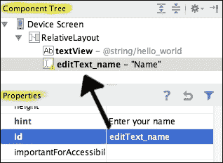

+   **text**：这将删除此字段的值。现在应该可以看到提示信息。

如果我们切换到文本编辑器，我们可以看到我们编辑过的文本字段的 XML 定义：

```java
<EditText
    android:layout_width="match_parent"
    android:layout_height="wrap_content"
    android:inputType="textPersonName"
    android:ems="10"
    android:id="@+id/editText_name"
    android:layout_marginTop="38dp"
	android:layout_below="@+id/textView"
	android:layout_alignParentLeft="true"
    android:hint="Enter your name"
/>
```

XML 定义的属性有推荐的顺序。特定的顺序有助于在阅读代码时理解代码，并使修改元素更容易。选择`EditText`代码定义并执行**代码**菜单中的**格式化代码**操作。现在属性顺序已更改，将`android:id`放置在第一个位置：

```java
<EditText
    android:id="@+id/editText_name"
    android:layout_width="match_parent"
    android:layout_height="wrap_content"
    android:layout_alignParentLeft="true"
    android:layout_below="@+id/textView"
    android:layout_marginTop="38dp"
	android:ems="10"
	android:hint="Enter your name"
    android:inputType="textPersonName" 
/>
```

当你在布局中拖动编辑文本时，你可以检查与图形编辑器中显示的属性相匹配的位置属性（`android:layout_marginTop`、`android:layout_below`和`android:layout_alignParentLeft`）。请注意，`android:layout_below`属性使用文本视图的 ID 来识别它。

从文本编辑器，也可以更改现有组件及其属性。将文本视图 ID（`android:id`属性）从`@+id/textView`更改为`@+id/textView_greeting`。具有描述性的 ID 很重要，因为它将被我们的代码使用。描述性变量名允许代码自我说明。您需要将所有对文本视图 ID 的引用更改为新 ID。

让我们这次使用文本编辑器添加另一个组件。按**打开标签**键并开始键入`Button`。将出现一个建议列表，以帮助您完成代码。让建议列表出现并选择一个`Button`对象。在`Button`标签内，添加以下属性：

+   `android:id`，值为`@+id/button_accept`：这创建了 ID 属性。

+   `android:layout_width`，值为`wrap_content`：这使宽度适应按钮内容。

+   `android:layout_height`，值为`wrap_content`：这使高度适应按钮内容。

+   `android:layout_below`，值为`@id/editText_name`：这将在名称文本字段下方放置按钮。我们通过其 ID（`@id/editText_name`）引用名称文本字段。

+   `android:layout_centerHorizontal`，值为`true`：这将在父布局中水平居中按钮。

+   `android:text`，具有`Accept`值：这设置了按钮的文本。向组件添加文本的推荐方式是将它添加到`strings.xml`文件中。组件应配置为使用字符串标识符，而不是直接使用字符串。为了简单起见，我们直接将字符串添加到按钮中。

按钮的最终 XML 定义如下：

```java
<Button
  android:id="@+id/button_accept"
  android:layout_width="wrap_content"
  android:layout_height="wrap_content"
  android:layout_below="@+id/editText_name"
  android:layout_centerHorizontal="true"
  android:text="Accept"
/>
```

按钮在**预览**中显示。下一张截图显示，如果我们切换到图形编辑器，按钮将在其中显示，并在**组件树**中显示：

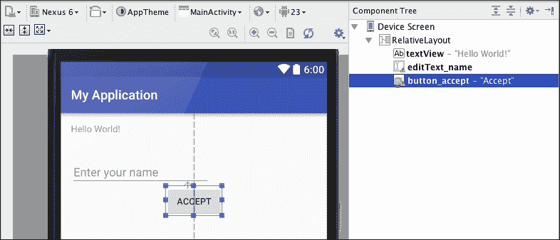

## 组件属性

我们在主布局中添加或修改的属性也可以通过代码进行修改，而不仅仅是使用布局编辑器。例如，如果你在代码中有一个`Button`对象，你可以使用`setText`方法来更改其文本：

```java
myButton.setText("Accept");
```

可用于`View`对象的某些属性如下：

+   `android:alpha`: 这个 XML 属性设置视图的 alpha 值，介于`0`和`1`之间，表示视图的不透明度。您也可以使用代码中的`setAlpha`方法。

+   `android:background`: 这个 XML 属性设置视图的背景。您也可以使用代码中的`setBackground`方法。

+   `android:clickable`: 这个 XML 属性设置视图是否可点击，是否接收点击事件。您也可以使用代码中的`setClicklable`方法。

+   `android:elevation`: 这个 XML 属性设置视图的抬升值，即其 z 深度值。您也可以使用代码中的`setElevation`方法。

+   `android:fadeScrollbars`: 这个 XML 属性设置当滚动条未使用时是否淡出。您也可以使用代码中的`setScrollbarFadingEnabled`方法。

+   `android:focusable`: 这个 XML 属性设置视图是否可以获取焦点。您也可以使用代码中的`setFocusable`方法。

+   `android:foreground`: 这个 XML 属性设置视图的前景。您也可以使用代码中的`setForeground`方法。

+   `android:foregroundTint`: 这个 XML 属性设置视图前景的着色颜色。您也可以使用代码中的`setForegroundTintList`方法。

+   `android:id`: 这个 XML 属性设置视图的标识符。您也可以使用代码中的`setId`方法。

+   `android:minHeight`: 这个 XML 属性设置视图应具有的最小高度。您也可以使用代码中的`setMinimumHeight`方法。

+   `android:minWidth`: 这个 XML 属性设置视图应具有的最小宽度。您也可以使用代码中的`setWidth`方法。

+   `android:padding`: 这个 XML 属性设置视图四边的填充。您也可以使用代码中的`setPadding`方法。与此属性类似的还有：`android:paddingBottom`、`android:paddingEnd`、`android:paddingLeft`、`android:paddingRight`、`android:paddingStart`和`android:paddingTop`。

+   `android:scrollIndicators`: 这个 XML 属性设置是否为视图显示滚动指示器。您也可以使用代码中的`setScrollIndicators`方法。

+   `android:textAlignment`: 这个 XML 属性设置视图中文本的对齐方式。您也可以使用代码中的`setTextAlignment`方法。

+   `android:visibility`: 这个 XML 属性设置视图是否可见。您也可以使用代码中的`setVisibility`方法。

除了`View`对象属性外，`View`子类还可以提供一些更具体的属性。例如，`TextView`对象也有这些属性：`android:editable`、`android:fontFamily`、`android:hint`、`android:text`或`android:textColor`。

# 支持多屏幕

在创建 Android 应用程序时，我们必须考虑到存在多种屏幕尺寸和屏幕分辨率。检查我们的布局在不同屏幕配置中的显示方式非常重要。为了实现这一点，Android Studio 提供了一个功能，可以在**设计**模式下更改渲染布局预览的虚拟设备。

我们可以在工具栏中找到这个功能，点击它以打开可用设备定义的列表，如下面的截图所示：

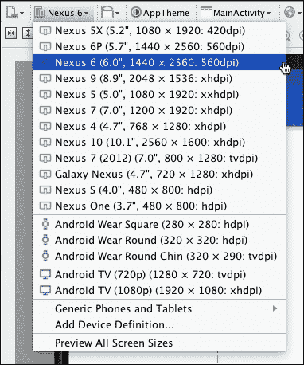

尝试其中一些。平板设备与 Nexus 系列设备等之间的差异非常明显。我们应该将视图适配到我们应用程序支持的所有屏幕配置，以确保它们能够最优显示。请注意，Android Wear（**方形**、**圆形**和**带下巴的圆形**设计）和 Android TV 都有设备定义。

设备定义指示屏幕尺寸、分辨率和屏幕密度。Android 屏幕密度包括 ldpi、mdpi、tvdpi、hdpi、xhdpi，甚至 xxhdpi。让我们看看它们的值：

+   **ldpi**：这是**低密度每英寸点数**，其值约为 120 dpi

+   **mdpi**：这是**中等密度每英寸点数**，其值约为 160 dpi

+   **tvdpi**：这是**中等密度每英寸点数**，其值约为 213 dpi

+   **hdpi**：这是**高密度每英寸点数**，其值约为 240 dpi

+   **xhdpi**：这是**超高密度每英寸点数**，其值约为 320 dpi

+   **xxhdpi**：这是**超超高密度每英寸点数**，其值约为 480 dpi

+   **xxxhdpi**：这是**超超超高密度每英寸点数**，其值约为 640 dpi

Google 发布的最新仪表板显示，大多数设备具有高密度屏幕（42.3%），其次是 xhdpi（24.8%）和 xxhdpi（15.0%）。因此，通过使用这三个屏幕密度测试我们的应用程序，我们可以覆盖所有设备的 82.1%。如果您想覆盖更多比例的设备，还可以使用 mdpi 屏幕（12.9%）测试您的应用程序，这样覆盖率将达到所有设备的 95.0%。官方 Android 仪表板可在[`developer.android.com/about/dashboards`](http://developer.android.com/about/dashboards)找到。

另一个需要考虑的问题是**设备方向**。我们想在应用程序中支持横屏模式吗？如果是的话，那么我们必须在横屏方向测试我们的布局。在工具栏上，点击**布局状态**选项以更改模式，从纵向切换到横屏或从横屏切换到纵向。

如果我们的应用程序支持横屏模式，并且布局在此方向上未按预期显示，我们可能需要创建布局的变体。点击工具栏的第一个图标，即 **配置以在 IDE 中渲染此布局** 选项，并选择 **创建横屏变体** 选项，如图下所示：

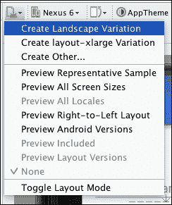

在编辑器中将打开一个新的布局。此布局已在 `resources` 文件夹下的 `layout-land` 目录中创建，并使用与横屏布局相同的名称 - `/src/main/res/layout-land/activity_main.xml`。Android 系统将根据当前设备方向决定需要使用哪个版本的布局。现在，我们可以编辑新的布局变体，使其完美符合横屏模式。

同样，我们可以为超大型屏幕创建布局的变体。选择 **创建 layout-xlarge 变体** 选项。新布局将在 `layout-xlarge` 文件夹中创建，使用与原始布局相同的名称 - `/src/main/res/layout-xlarge/activity_main.xml`。Android 将分为实际屏幕尺寸的小型、正常、大型和超大型：

+   **小型**：本类别中的屏幕至少为 426 dp x 320 dp。

+   **正常**：本类别中的屏幕至少为 470 dp x 320 dp。

+   **大型**：本类别中的屏幕至少为 640 dp x 480 dp。

+   **超大型**：本类别中的屏幕至少为 960 dp x 720 dp。

**密度无关像素**（**dp**）相当于在 160 dpi 屏幕上的一个物理像素。谷歌发布的最新仪表板显示，大多数设备具有正常屏幕尺寸（85.1%），其次是大型屏幕尺寸（8.2%）。官方的 Android 仪表板可在 [`developer.android.com/about/dashboards`](http://developer.android.com/about/dashboards) 查找。

要同时显示多个设备配置，请点击工具栏中的 **配置以在 IDE 中渲染此布局** 选项，并选择 **预览所有屏幕尺寸** 选项，或者点击 **预览代表性样本** 选项以仅打开最重要的屏幕尺寸，如图下所示。我们还可以通过右键单击并从菜单中选择 **删除** 选项来删除任何样本。此菜单的另一个有用操作是 **保存截图** 选项。它允许我们捕获布局预览的截图：

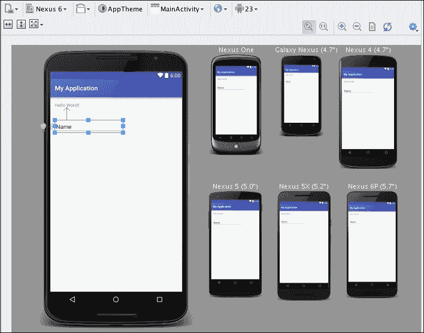

如果我们创建了不同的布局变体，我们可以通过选择 **预览布局版本** 选项来预览所有这些变体。如果我们想预览不同 Android 版本的布局外观，我们可以使用 **预览 Android 版本** 选项。

现在我们已经了解了如何添加不同的组件以及如何为不同屏幕优化我们的布局，让我们开始使用主题。

# 更改 UI 主题

布局和小部件使用我们项目的默认 UI 主题创建。我们可以通过创建样式来更改 UI 元素的外观。样式可以分组以创建主题，主题可以应用于活动或整个应用。一些主题是默认提供的，例如**Material Design**或**Holo**样式。样式和主题作为资源创建在`/src/res/values`文件夹下。

为了继续我们的示例，我们将更改我们在应用中使用的主题的默认颜色。使用图形编辑器，您可以看到我们的布局所选的主题在工具栏中显示为**AppTheme**。此主题是为我们的项目创建的，可以在`styles`文件中的`/src/res/values/styles.xml`找到。

打开`styles`文件。Android Studio 建议我们使用**主题编辑器**。您可以点击消息链接，或者您可以导航到**工具** | **Android** | **主题编辑器**来打开它。您可以在下一张屏幕截图中看到**主题编辑器**：

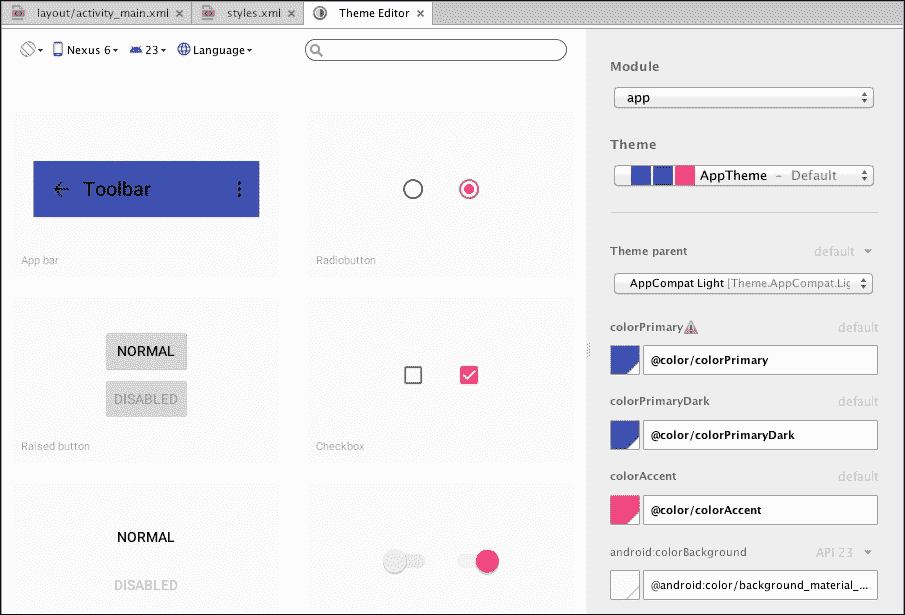

左侧面板显示了不同的 UI 组件的外观。例如，您可以查看应用栏、不同类型的按钮、文本视图或状态栏的外观。**主题编辑器**的右侧面板包含主题的设置。您可以从右侧面板更改值，并查看**主题编辑器**左侧面板中的组件如何变化。

在右侧配置面板中，您可以更改**主题**以进行修改，您可以更改所选主题的**主题父级**，并且可以更改主题颜色。您会注意到**AppTheme**默认是另一个主题`Theme.AppCompat.Light.DarkActionBar`的扩展。

让我们尝试更改我们应用的主颜色。按照以下步骤操作：

1.  在**主题编辑器**的右侧面板中查找**colorPrimary**属性。

1.  点击**colorPrimary**属性的彩色方块。以下屏幕截图将打开颜色选择器：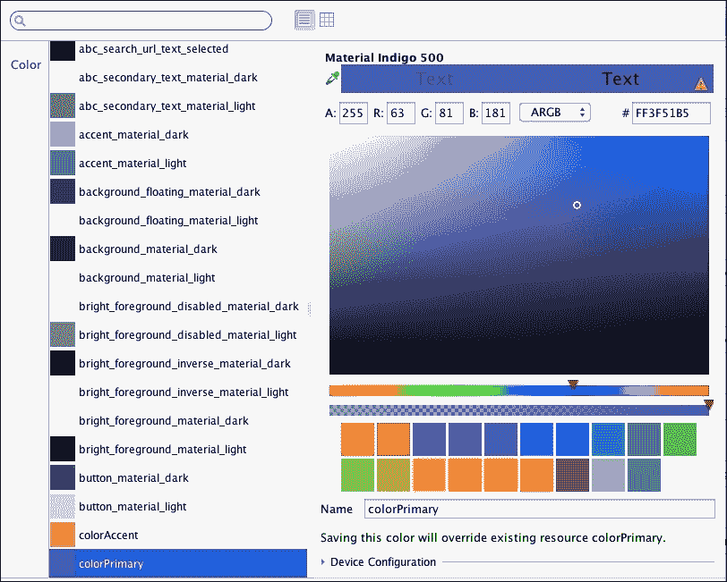

1.  选择不同的颜色，然后点击**确定**按钮。请注意，主题已更改，现在应用栏在**主题编辑器**中显示新颜色。

1.  打开您的主布局文件。布局预览的颜色也发生了变化。由于我们在主题中而不是仅在布局中配置了它，因此此主题主颜色将应用于所有我们的布局。

颜色的规范保存在`/src/res/values/colors.xml`中的`colors`文件中。这是`colors`文件当前的内容：

```java
<resources>
    <color name="colorPrimary">#009688</color>
    <color name="colorPrimaryDark">#303F9F</color>
    <color name="colorAccent">#FF4081</color>
</resources>
```

您也可以从该文件更改颜色。修改`colorPrimaryDark`，保存文件，并注意在**主题编辑器**中，状态栏颜色已更改为新颜色。切换到您的主布局文件，并观察布局预览也已更改为显示状态栏中的新颜色。

要完全更改布局主题，请在图形编辑器的工具栏中单击主题选项。现在将打开主题选择对话框，显示可用的主题列表，如下面的屏幕截图所示：

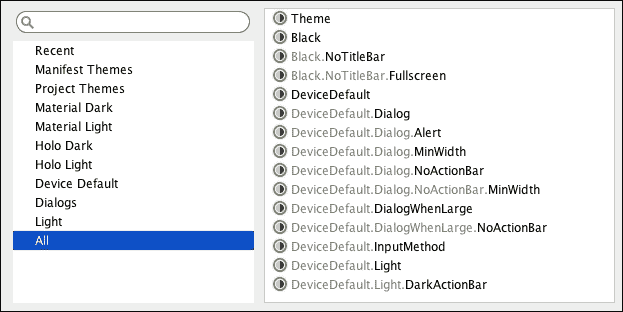

在我们自己的项目中创建的主题列在 **项目主题** 部分中。**清单主题** 部分显示了在应用程序清单文件（`/src/main/AndroidManifest.xml`）中配置的主题。**所有** 部分列出了所有可用的主题。

# 处理事件

如果应用程序的其余部分无法与之交互，则用户界面将毫无用处。Android 中的事件是在用户与我们的应用程序交互时生成的。所有 UI 小部件都是 `View` 类的子类，并且它们共享以下监听器处理的一些事件：

+   `OnClickListener`: 这捕捉了用户点击视图元素时的事件。要在视图中配置此监听器，请使用 `setOnClickListener` 方法。`OnClickListener` 接口声明以下方法以接收点击事件：

    ```java
    public abstract void onClick(View v)
    ```

+   `OnCreateContextMenu`: 这捕捉了用户在视图元素上执行长按操作并希望打开上下文菜单时的事件。要在视图中配置此监听器，请使用 `setOnCreateContextMenu` 方法。`OnCreateContextMenu` 接口声明以下方法以接收长按事件：

    ```java
    public abstract void onCreateContextMenu(ContextMenu menu, View v, ContextMenu.ContextMenuInfo menuInfo)
    ```

+   `OnDragListener`: 这捕捉了用户拖动并放下事件元素时的事件。要在视图中配置此监听器，请使用 `setOnDragListener` 方法。`OnDragListener` 接口声明以下方法以接收拖动事件：

    ```java
    public abstract boolean onDrag(View v, DragEvent event)
    ```

+   `OnFocusChangedListener`: 这捕捉了用户在相同视图中从一个元素导航到另一个元素时的事件。要在视图中配置此监听器，请使用 `setOnFocusChangedListener` 方法。`OnFocusChangedListener` 接口声明以下方法以接收焦点更改事件：

    ```java
    public abstract void onFocusChange(View v, boolean hasFocus)
    ```

+   `OnHoverListener`: 这捕捉了用户在元素上移动时的事件。要在视图中配置此监听器，请使用 `setOnHoverListener` 方法。`OnHoverListener` 接口声明以下方法以接收悬停事件：

    ```java
    public abstract boolean onHover(View v, MotionEvent event)
    ```

+   `OnKeyListener`: 这捕捉了用户在视图元素具有焦点时按下任何键的事件。要在视图中配置此监听器，请使用 `setOnKeyListener` 方法。`OnKeyListener` 接口声明以下方法以接收按键事件：

    ```java
    public abstract boolean onKey(View v, int keyCode, KeyEvent event)
    ```

+   `OnLayoutChangeListener`: 这捕捉了视图布局因布局处理而更改其边界时的事件。要在视图中配置此监听器，请使用 `setOnLayoutChangeListener` 方法。`OnLayoutChangeListener` 接口声明以下方法以接收布局更改事件：

    ```java
    public abstract void onLayoutChange(View v,
    int left, int top, int right, int bottom,
    int oldLeft, int oldTop, int oldRight, int oldBottom)
    ```

+   `OnLongClickListener`：这个监听器捕获用户触摸视图元素并保持触摸的事件。要在视图中配置这个监听器，使用`setOnLongClickListener`方法。`OnLongClickListener`接口声明以下方法来接收长按事件：

    ```java
    public abstract boolean onLongClick(View v)
    ```

+   `OnScrollChangeListener`：这个监听器捕获视图滚动位置改变的事件。要在视图中配置这个监听器，使用`setOnScrollChangeListener`方法。`OnScrollChangeListener`接口声明以下方法来接收滚动改变事件：

    ```java
    public abstract void onScrollChange(View v, 
    int scrollX, int scrollY, 
    int oldScrollX, int oldScrollY)
    ```

+   `OnTouchListener`：这个监听器捕获用户触摸视图元素的事件。要在视图中配置这个监听器，使用`setOnTouchListener`方法。`OnTouchListener`接口声明以下方法来接收触摸事件：

    ```java
    public abstract boolean onTouch(View v, MotionEvent event)
    ```

除了这些标准事件和监听器之外，一些 UI 小部件还有一些更具体的事件和监听器。复选框可以注册一个监听器来捕获其状态改变时的事件（`OnCheckedChangeListener`），而旋转选择器可以注册一个监听器来捕获项目被点击时的事件（`OnItemClickListener`）。

最常见的捕获事件是当用户点击视图元素时。有一个简单的方法来处理它——使用视图属性。在我们的布局中选择**接受**按钮，并查找`onClick`属性。这个属性指示当用户按下按钮时将执行的方法的名称。这个方法必须在关联当前布局的活动（在这种情况下是我们的主活动`MainActivity.java`）中创建。将此属性的值设置为`onAcceptClick`。

打开主活动以创建方法定义。当视图被点击时，事件回调方法必须是公共的，并具有`void`返回类型。它接收被点击的视图作为参数。此方法将在用户每次点击按钮时执行：

```java
public void onAcceptClick(View v) {
  // Action when the button is pressed
}
```

从主活动，我们可以与界面的所有组件进行交互，所以当用户按下**接受**按钮时，我们的代码可以读取名称字段中的文本，并将问候语更改为包含该名称。

要获取`view`对象的引用，使用从`Activity`类继承的`findViewById`方法。此方法接收组件的 ID，并返回对应该 ID 的`View`对象。返回的视图对象必须转换为它的特定类，以便使用其方法，例如`EditText`类的`getText`方法，以获取用户输入的名称：

```java
public void onAcceptClick(View v) {
  TextView tvGreeting =
    (TextView) findViewById(R.id.textView_greeting);
  EditText etName = (EditText) findViewById(R.id.editText_name);

  if(0 < etName.getText().length()) {
    tvGreeting.setText("Hello " + et_name.getText());
  }
}
```

在方法的头两行，获取布局元素的引用：包含问候语的文本视图和用户可以输入名字的文本字段。组件是通过它们的 ID 找到的，即我们在布局文件中元素属性中指定的相同 ID。所有资源 ID 都包含在`R`类中。`R`类在构建阶段自动生成，因此我们不应该编辑它。如果这个类没有自动生成，那么可能是一些资源文件中存在错误。

下一行是一个条件语句，用于检查用户是否输入了名字。如果他们输入了名字，文本将被替换为包含该名字的新问候语。在接下来的章节中，你将学习如何在模拟器中执行我们的应用程序，我们就能测试这段代码。

如果我们想要处理的事件不是用户的点击，那么我们必须通过代码在活动的`onCreate`方法中创建并添加监听器。有两种方法可以做到这一点：

+   在活动中实现监听器接口，然后添加未实现的方法。接口所需的方法是用于接收事件的方法。

+   在活动文件中创建一个私有的匿名监听器实现。接收事件的方法在这个对象中实现。

最后，必须使用设置方法（如`setOnClickListener`、`setOnCreateContextMenu`、`setOnDragListener`、`setOnFocusChange`、`setOnKeyListener`等）将监听器实现分配给视图元素。监听器分配通常包含在活动的`onCreate`方法中。如果监听器在同一个活动中实现，那么传递给设置方法的参数是使用`this`关键字表示的自身活动，如下面的代码所示：

```java
Button bAccept = (Button) findViewById(R.id.button_accept);
bAccept.setOnClickListener(this);
```

活动应该实现监听器和监听器接口所需的`onClick`方法：

```java
public class MainActivity extends Activity 
implements View.OnClickListener {
  @Override
  public void onClick(View view) {
    // Action when the button is pressed
  }
```

如果我们使用一个私有的匿名类来实现它，代码如下所示：

```java
bAccept.setOnClickListener(new View.OnClickListener() {
    @Override
    public void onClick(View v) {
        // Action when the button is pressed
    }
});
```

# 摘要

在这一章中，我们看到了如何使用图形和基于文本的编辑器创建和编辑用户界面布局。我们完成了我们的第一个小型应用程序，并使用一些基本组件对其进行了升级。你现在应该能够创建一个简单的布局，并使用不同的样式、屏幕尺寸和屏幕分辨率进行测试。你还了解了不同的可用 UI 主题。最后，你学习了关于事件以及如何使用监听器处理它们的内容。

在下一章中，你将了解 Android Studio 中一些有用的工具。我们将经常使用 SDK Manager 来安装不同的包。你还将了解 AVD Manager，用于测试不同虚拟设备上的应用程序。我们将使用 Javadoc 实用工具为我们的项目生成 Javadoc 文档，你还将了解 Android Studio 中可用的版本控制系统。
