# 第八章。调试

调试环境是集成开发环境（IDE）最重要的功能之一。使用调试工具可以让你轻松优化应用程序并提高其性能。你希望在 Android Studio 编程时使用调试工具吗？Android Studio 包含了 **Dalvik 调试监控服务器**（**DDMS**）调试工具。

在本章中，您将从学习 **运行** 和 **调试** 选项以及如何在之前章节中创建的 Android 虚拟设备中模拟应用程序开始。您将深入了解 **调试器**、**控制台** 和 **日志输出** 选项卡。您还将学习在使用调试器时如何使用断点。我们将以关于 Android Studio DDMS 中包含的高级调试工具的每个选项卡的信息结束本章，以及层次视图。

本章我们将讨论以下主题：

+   调试

+   日志输出

+   即时运行

+   设备监控工具

+   层次视图

# 运行和调试

Android 应用程序可以通过 USB 连接在真实设备上或在虚拟设备中使用模拟器运行。虚拟设备使我们能够在不同的硬件和软件配置上测试我们的应用程序。在本章中，我们将使用模拟器来运行和调试我们的应用程序，因为它简单且灵活。

要直接运行应用程序，请导航到 **运行** | **运行 'app'**。您也可以从工具栏中点击播放图标。要调试应用程序，请导航到 **运行** | **调试 'app'** 或从工具栏中点击虫子图标。如果您的应用程序已经运行，您可以通过导航到 **运行** | **附加调试器到 Android 进程** 来启动调试模式。

当我们选择 **调试 'app'** 选项时，会打开一个选择设备的对话框。**已连接设备**部分用于选择正在运行的设备；列出了当前连接的设备，无论是真实设备还是虚拟设备。**可用模拟器**部分用于启动模拟器的新实例；列出了可用的虚拟设备。您也可以使用 **创建新模拟器** 按钮从该对话框创建新的模拟器。此选项将打开 第六章 中解释的虚拟设备配置对话框。此对话框中的最后一个选项是 **为将来启动使用相同选择** 复选框。如果您想在未来跳过此步骤，请选中此复选框。

从 **可用模拟器** 部分选择在 第六章 中创建的虚拟设备，如以下截图所示，然后点击 **确定**。

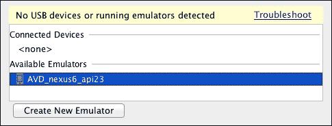

模拟器将被启动。下次我们运行或调试应用程序时，模拟器将正在运行，因此我们将从 **已连接设备** 部分选择它。

在调试过程中，您会注意到，在下一张截图所示的 Android Studio 的底部，有一个新的面板，**调试**，其中包含两个选项卡：**调试器**和**控制台**。**Android Monitor** 选项卡包含另外两个工具：**日志输出**和**监视器**。

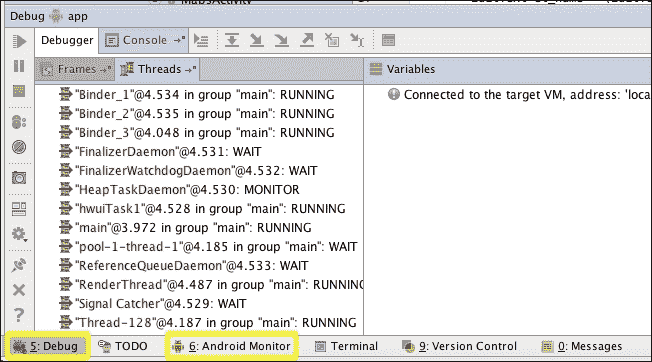

## 控制台

**控制台**显示在启动或运行模拟器时发生的事件。打开它以检查消息并确认模拟器和应用程序正在正确执行。应该出现的操作是：

+   **等待设备**：这是启动模拟器时的起点。

+   **上传文件**（`adb push` 命令）：此事件表示应用程序被打包并存储在设备中。

+   **安装**（`adb shell pm` install 命令）：此事件表示应用程序正在设备中安装。安装后，应打印出成功消息。

+   **启动应用程序**（`adb shell am start` 命令）：此事件发生在应用程序开始执行时。

+   **等待进程**：此事件发生在应用程序正在运行且调试系统试图连接到设备中的应用程序进程时。

在前一步骤成功后，应用程序将在模拟器中可见。通过在文本输入中键入任何名称并点击**接受**按钮来测试它。问候消息应该会改变。

## 调试器

**调试器**管理断点、控制代码执行并显示变量的信息。要在您的代码中添加断点，只需单击代码行的左侧边缘。一个红色点将出现在代码行旁边以指示断点。要删除断点，请单击它。如果您右键单击一个断点，一个小对话框中将出现更多选项，您可以在其中点击**更多**以打开显示在下图中所示的**断点**窗口：

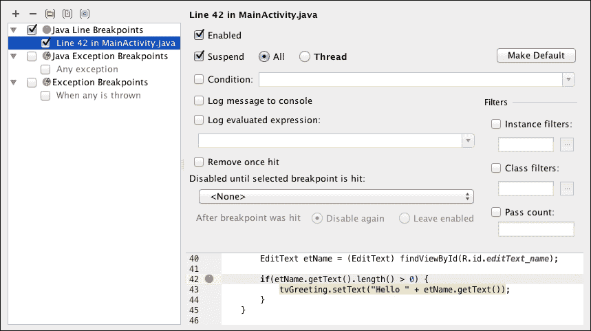

您也可以通过导航到 **运行** | **查看断点...** 来打开 **断点** 窗口。在 **断点** 窗口的左侧面板中，列出了您应用程序的所有断点。您可以添加新的断点、删除它们或启用和禁用它们。您可以启用 **异常断点**，当您的应用程序运行时抛出异常时，它将被触发。如果您从左侧面板中选择一个断点，您可以使用右侧面板对其进行配置。例如，您可以为断点设置条件、将消息记录到控制台，或者一旦触发就将其删除。

在我们主活动的 `onAcceptClick` 方法中的条件语句中添加一个断点，然后再次调试应用程序，如下所示：

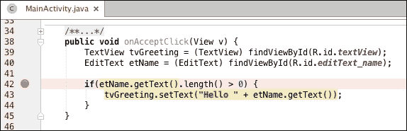

在应用中输入你的名字并点击**接受**按钮。当执行到达断点时，它会暂停，并打开**调试器**标签页。由于我们在分配文本之前在条件语句中添加了断点，所以我们的问候信息没有改变。

从调试器标签页，我们可以检查方法调用层次和执行点处的变量状态。可用的变量包括`v`方法的参数、通过`findViewById`方法获得的`TextView`和`EditText`对象，以及当前活动的引用（`this`）。展开名为`etName`的`EditText`对象，如图所示，并搜索`mText`属性。这个属性应该包含你之前输入的名字：

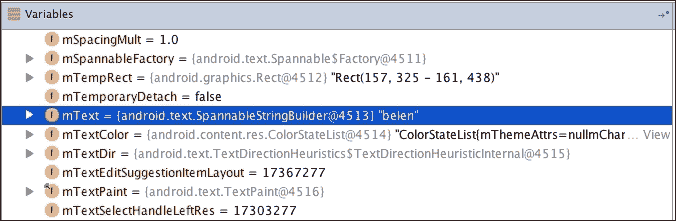

右键点击`EditText`对象以打开一个包含更多选项的菜单，并选择**评估表达式...**。**评估表达式**对话框允许你在所选对象的环境中查询方法。例如，输入`etName.getText()`并按*Enter*键来评估表达式。表达式的结果将显示如下截图：

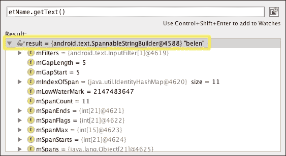

当你的应用执行在断点处停止时，你可以执行以下操作：

+   要执行下一行代码而不进入方法调用，你可以导航到**运行** | **步过**，点击**调试**面板顶部工具栏中的按钮，或者按此选项指示的键盘快捷键，通常是*F8*键。

+   要进入方法调用，你可以导航到**运行** | **进入**，点击**调试**面板顶部工具栏中的按钮，或者按*F7*键。

+   要选择你想要进入的方法，你可以导航到**运行** | **智能进入**或按*Shift* + *F7*。

+   要将光标位置移动到你的代码中，你可以导航到**运行** | **运行到光标**，点击**调试**面板顶部工具栏中的按钮，或者按*Alt* + *F9*。

+   要恢复执行直到下一个断点，你可以导航到**运行** | **恢复程序**，点击**调试**面板左侧工具栏中的按钮，或者按*F9*键。

+   要停止执行，你可以导航到**运行** | **停止**，点击**调试**面板左侧工具栏中的按钮，或者按*Ctrl* + *F2*（在 OS X 上为*Cmd* + *F2*）。

这些选项以及其他选项也可以从调试器标签页作为图标快捷方式使用。

展开名为`tvGreeting`的对象以检查其`mText`属性的值。现在，跳过条件语句和`setText`方法的调用。注意`mText`属性的值是如何变化的，这将在下一个截图中显示。最后，恢复执行以便设备屏幕上的问候信息发生变化。

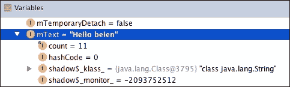

在`if`子句内创建一个新的断点。我们可以添加一个条件到断点端点，这样只有当用户输入的名称是`"no name"`时，执行才会暂停，否则执行将像往常一样继续。以下**断点**窗口的截图显示了断点详情：


在断点的**条件**字段中，添加以下条件，该条件比较用户在名称字段（`etName`）中输入的文本：

```java
etName.getText().toString().equals("no name")
```

现在，如果你在应用程序中输入你的名字，没有断点会暂停执行。如果你输入`"no name"`，执行将在最近创建的断点处暂停。

## LogCat

**LogCat**是 Android 日志系统，它显示运行设备上 Android 系统生成的所有日志消息。日志消息有多个重要性级别。从**LogCat**标签页，我们可以通过这些级别过滤日志消息。例如，如果我们选择信息级别作为过滤器，那么来自**信息**、**警告**和**错误**级别的消息将会显示。级别在以下图表中显示：

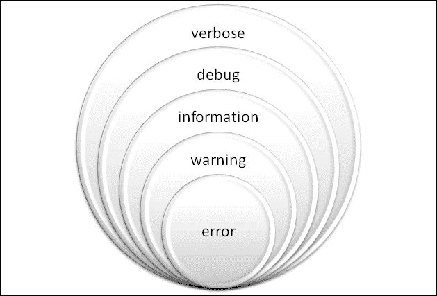

要从我们的代码中打印日志消息，我们需要导入`Log`类。这个类为每个级别都有一个方法：`v`方法用于详细输出，`d`方法用于调试，`i`方法用于信息，`w`方法用于警告，`e`方法用于错误级别。这些方法接收两个字符串参数。第一个字符串参数通常用于标识消息的源类，第二个字符串参数用于标识消息本身。为了标识源类，我们建议使用一个常量、静态字符串标签。然而，在下一个示例中，我们直接使用字符串以简化代码。将以下日志消息添加到主活动的`onAcceptClick`方法中：

```java
if(etName.getText().length() > 0) {
  Log.i("MainActivity", "Name read: " + etName.getText());
  tvGreeting.setText("Hello " + etName.getText());
} 
else {
  Log.w("MainActivity", "No name typed, greeting didn't change");
}
```

我们有一个日志消息用于通知我们用户输入获取的名称，还有一个日志消息用于在用户没有输入名称时打印警告。移除我们之前创建的所有断点，然后调试应用程序。

**Android Monitor**中的**LogCat**标签页默认打印了当前应用程序生成的日志消息。阅读应用程序的消息有时可能很复杂，你需要过滤这些消息。在**LogCat**标签页中，有一个可展开的列表，你可以通过其重要性级别过滤日志消息。你还可以使用搜索字段查找特定的日志消息。还有一个可展开的列表来配置一些额外的过滤器：**无过滤器**选项显示设备生成的所有日志；**仅显示所选应用程序**选项显示仅由你的应用程序生成的日志；**编辑过滤器配置**选项允许你创建更复杂的过滤器。选择**编辑过滤器配置**来检查此选项。将打开一个创建过滤器的对话框，如图所示：

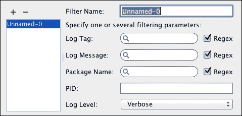

日志消息可以通过它们的**日志标签**、**日志消息**或打印它们的包名进行过滤。日志还可以通过**进程 ID**（**PID**）或它们的级别进行过滤。

创建一个名为`MyApplication`的新过滤器，通过**包名**写入`com.example.myapplication`（我们的应用程序包名），然后点击**确定**。现在，**日志猫**日志已经被过滤，更容易阅读我们的消息。现在，执行以下步骤：

1.  将焦点放在**模拟器**窗口上，在应用程序中输入一个名称，然后点击**接受**。观察我们的日志消息是如何在**日志猫**视图中打印出来的。

1.  从应用程序中删除您的名称，然后点击**接受**。这次，会打印出一个警告消息。注意每种消息所使用的不同颜色。

## 监控器

**监控器**面板位于 Android Studio 的右下角。选择运行您应用程序的设备或模拟器，并从两个顶部可展开的列表中选择与您的应用程序相对应的进程。有四个监控器可用：

+   **内存**：这显示了所选应用程序随时间变化的可用和已分配内存，如下面的截图所示：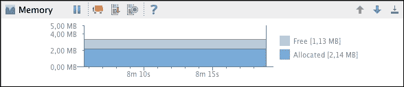

+   **CPU**：这显示了应用程序的实时 CPU 使用情况，如下面的截图所示：

+   **网络**：这显示了应用程序的网络使用情况，如下面的截图所示：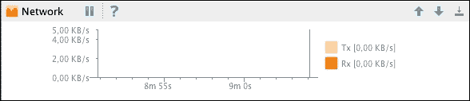

+   **GPU**：这显示了应用程序的 GPU 使用情况，表示执行、处理、准备和绘制帧的时间，如下面的截图所示：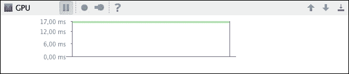

# 即时运行

即时运行是 Android Studio 2.0 中引入的新功能，允许您在应用程序在设备上运行时更新它，而无需构建新的 APK。此功能减少了部署时间。

即时运行需要 SDK 15 或更高版本，尽管建议使用 SDK 21 或更高版本。您还需要将 Android Plugin for Gradle 更新到 2.0 或更高版本。即时运行适用于模拟器和真实设备。

在您的应用程序首次部署后，您会注意到运行/调试图标已更改，并有一个额外的闪电图标，如下面的截图所示：


下次您点击**调试**按钮时，Android Studio 将分析代码中的更改，以使应用程序的部署更快，而不是创建一个新的 APK 并进行完整部署。根据需要推送到应用程序的代码，有三种类型的更新：

+   **热交换**：这是最快的交换方式。如果您更改现有方法的代码，则会执行此类型的交换。Android Studio 将创建一个具有新代码的存根方法并重新启动当前活动。

    如果你不想在热插拔后 Android Studio 重启当前活动，你可以在设置屏幕中禁用此行为。即时运行设置位于主设置中的**构建、执行、部署**部分。以下截图显示了即时运行设置屏幕：

    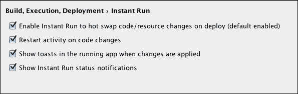

    你可以通过禁用**代码更改时重启活动**选项来禁用活动的重启。

+   **热交换**：如果你更改或删除了现有资源，则会执行此类型的交换。Android Studio 将始终重启当前活动，并且你不能禁用此行为。

+   **冷交换**：这是最慢的交换，需要 API 21 或更高版本。如果设备运行的 API 低于 21，Android Studio 将创建一个新的 APK 并执行完整部署。如果代码更改是结构性的，例如更改父类、实现的接口、字段或方法签名，则会执行此类型的交换。Android Studio 将在冷交换中重启你的应用。

如果你更改了应用清单或影响应用清单的任何内容，例如清单中引用的资源，Android Studio 将部署一个新的构建。

在你的应用中更改一些代码，例如，将`Hello`文本消息更改为`Goodbye`消息：

```java
tvGreeting.setText("Goodbye " + etName.getText());
```

点击带有闪电的**调试**按钮。由于你更改了方法中的代码，Android Studio 将执行热插拔。你会在当前活动重启时注意到闪烁。

当热插拔完成后，Android Studio 底部部分会显示一条消息，如下一张截图所示：


如消息中所示，代码更改已应用，当前活动已重启。输入一个名称并点击`接受`。文本消息现在是`Goodbye`：

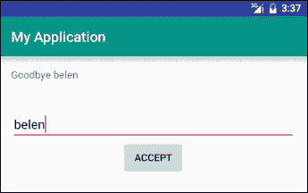

从设置中禁用**代码更改时重启活动**选项以观察差异。将代码改回`Hello`文本消息并调试应用。现在没有闪烁，当热插拔完成后，Android Studio 中显示的消息现在不同：

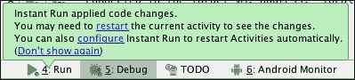

当热插拔完成后，模拟器中也会显示一条消息，如下一张截图所示。在这种情况下，显示的消息是：*应用代码更改，未重启活动*。

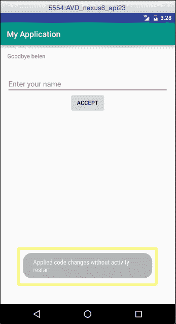

现在更改一个资源，例如，将`EditText`的提示更改为以下内容：

```java
android:hint="Please, enter your name"
```

点击带有闪电的**调试**按钮。由于你更改了一个资源，这次 Android Studio 将执行热交换。你会注意到当前活动再次重启。底部部分显示相同的消息：

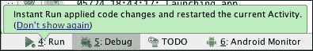

如果你想完全禁用即时运行，你可以从设置屏幕中通过取消勾选**启用即时运行以在部署时热交换代码/资源更改（默认启用）**选项来实现。

# Android 设备监控器

DDMS 是 SDK 中提供的更高级的调试工具。DDMS 可以通过 Android Studio 中的**Android 设备监控器**工具访问。该工具能够监控真实设备和模拟器。

要打开 DDMS 视角，导航到**工具** | **Android** | **Android 设备监控器**。您也可以从工具栏中点击 Android 设备监控器图标。将打开一个新窗口，其中包含 DDMS 视角。

在窗口的左侧部分，显示了连接设备的列表。目前，只列出了我们的虚拟设备。在**设备**部分，也展示了每个设备上运行的进程列表。我们应该能够定位到我们在之前启动的设备上的应用程序。从**设备**部分的工具栏中，我们可以使用停止标志图标停止一个进程。我们还可以通过点击相机图标来对虚拟设备进行屏幕截图。其他一些选项将在稍后解释。

在窗口的右侧部分，提供了有关设备的详细信息。这些信息分为七个标签页：**线程**、**堆**、**分配跟踪器**、**网络统计**、**文件资源管理器**、**模拟器控制**和**系统信息**。DDMS 视角中已集成的**日志输出**位于窗口的底部部分。

## 线程

**线程**标签显示属于所选进程的线程列表。从**设备**部分选择我们的应用程序进程。进程通过包名标识，在本例中为`com.example.myapplication`，然后从**设备**部分的工具栏中点击**更新线程**图标按钮，线程将被加载到标签页的内容中：

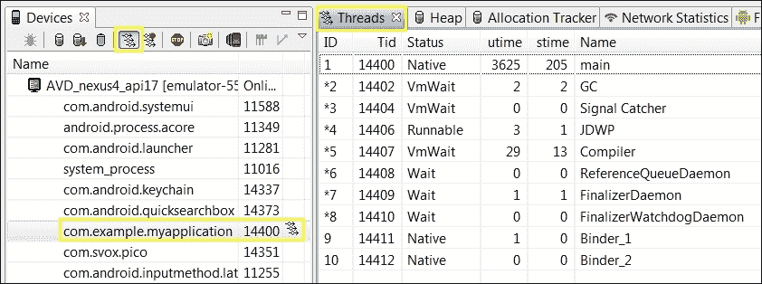

第一列是线程的 ID。**状态**列表示线程的状态，**utime**表示线程执行用户代码所花费的总时间，**stime**表示线程执行系统代码所花费的总时间，而**名称**表示线程的名称。我们感兴趣的线程是那些花费时间执行我们用户代码的线程。

如果我们在应用程序中创建除主线程之外的线程，这个**线程**工具很有用。我们可以检查它们是否在应用程序的某个点上执行，以及它们的执行时间是否适中。

### 方法分析

方法分析是一种测量所选进程中方法执行性能的工具。测量的参数是调用次数和执行过程中所花费的 CPU 时间。有以下两种类型的时间消耗：

+   **独占时间**：这是方法执行所花费的时间。

+   **包含时间**：这是方法执行所花费的总时间。这个度量包括方法内部任何被调用的方法所花费的时间。这些被调用的函数被称为其**子方法**。

要收集方法分析数据，从**设备**部分选择我们的应用程序进程，并点击**设备**部分的工具栏中的**开始方法分析**图标，紧邻**更新线程**图标。将显示一个对话框，让您选择您喜欢的分析选项。**基于样本的分析**使用采样频率进行分析，这种分析对运行时性能的影响较小，可以进行配置。基于样本的分析在 Android 4.4 及更高版本中可用。**基于跟踪的分析**分析所有方法的进入和退出。

在应用程序中执行一些操作；例如，在我们的示例应用程序中，输入一个名称并点击**接受**按钮以执行主活动的`onAcceptClick`方法。通过点击**停止方法分析**图标按钮来停止方法分析。

当方法分析停止时，在 DDMS 视图中打开一个新的标签，显示结果跟踪。在新标签的顶部，方法调用以时间图的形式表示；每一行属于一个线程。在跟踪的底部，方法花费的时间总结以表格形式表示。

按名称排序方法以搜索我们的`onAcceptClick`方法（`com.example.myapplication.MainActivity.onAcceptClick`）。点击它以展开其执行的详细信息。现在，注意以下事实：

+   在`onAcceptClick`方法内部调用的子方法列出来。我们可以看到`EditText.getText`方法、`Activity.findViewById`方法和`TextView.setText`方法，我们确实在方法内部直接调用了这些方法，如下一张截图所示。

+   **调用/总数**列详细说明了调用次数。例如，我们可以看到`Activity.findViewById`方法被调用了两次（**2/2**值）——一次用于找到`TextView`对象，另一次用于找到`EditText`对象。

+   **独占时间**列对于父或子方法没有值，因为它们自己定义了这种测量时间的类型：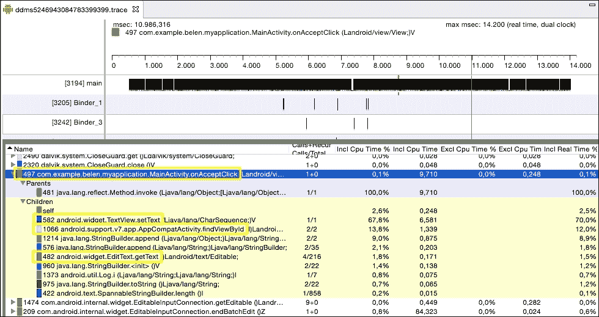

方法分析非常有用，可以检测执行时间过长的方法，并随后对其进行优化。我们可以识别最昂贵的操作，以避免对它们进行不必要的调用。

## 堆

**堆**标签显示堆内存使用信息和所选进程的统计信息。选择应用程序进程，并从**设备**部分的工具栏中点击**更新堆**图标按钮来启用它。垃圾收集器（**GC**）执行后，将显示堆信息。要强制执行，请点击**触发 GC**按钮或从**设备**部分的工具栏中的垃圾图标。

第一张表格显示了堆使用的摘要：总大小、已分配空间、空闲空间和已分配对象的数量。**统计**表格提供了堆中按类型分配的对象的以下详细信息：对象数量（**计数**列）、这些对象的总大小（**总大小**列）、最小对象的大小（**最小**列）和最大对象的大小（**最大**列）、中值大小（**中值**列）和平均大小（**平均**列）。选择一种类型以加载底部的条形图。

图表显示了按大小（以字节为单位）计数的对象数量。如果我们右键单击图表，我们可以更改其属性（标题、颜色、字体、标签等）并将其保存为 PNG 格式的图像：

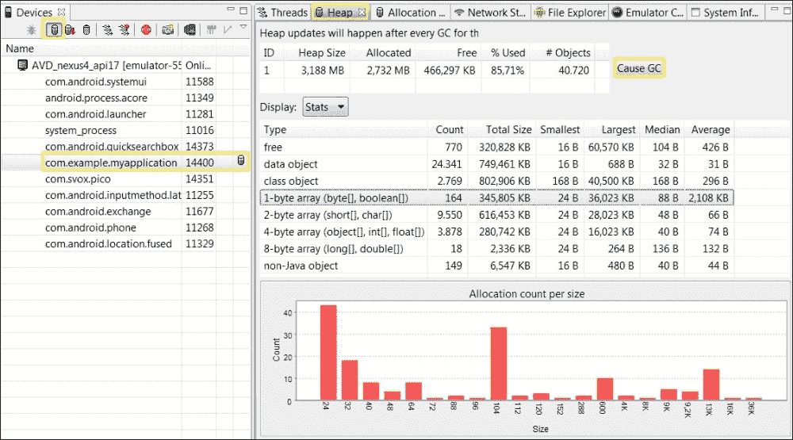

## 分配跟踪器

**分配跟踪器**选项卡显示了所选进程的内存分配。选择应用程序进程并点击**开始跟踪**按钮以开始跟踪内存信息。然后，点击**获取分配**按钮以获取已分配对象的列表。

我们可以使用选项卡顶部的过滤器来过滤我们自己的类中分配的对象。在过滤器中输入我们的包名`com.example.myapplication`。对于每个对象，表格显示了其分配大小（**分配大小**）、线程（**线程**）、对象或类（**分配类**）以及对象被分配的方法（**分配在**）。点击任何对象以查看更多信息，例如，分配它的行号。

如您在下一张截图中所见，在主活动的`onAcceptClick`中分配了一个`java.lang.StringBuilder`对象。在底部部分，您可以检查其分配的详细信息：

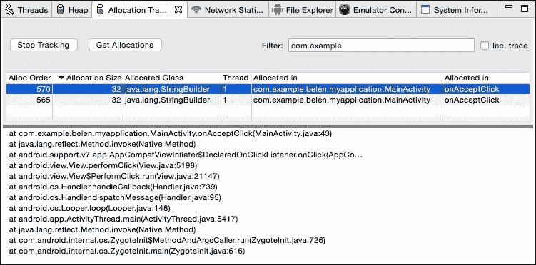

最后，点击**停止跟踪**按钮。

分配跟踪器对于检查我们在应用程序中进行某些交互时分配的对象非常有用，以便改进内存使用。

## 网络统计

**网络统计**选项卡显示了我们的应用程序如何使用网络资源。要获取任何使用网络的网络统计信息，请点击**开始**按钮。数据传输将开始在图表中显示。

网络统计信息对于优化我们代码中的网络请求和控制执行过程中的数据传输非常有用。

## 文件资源管理器

**文件资源管理器**选项卡展示了设备的整个文件系统。我们可以检查每个元素的大小、日期或权限。导航到`/data/app/`以搜索我们的`com.example.myapplication.apk`应用程序包文件。

## 模拟器控制

**模拟控制**选项卡允许我们在虚拟设备中模拟一些特殊状态或活动。我们可以在不同的环境和情况下测试我们的应用程序，以检查其是否按预期运行。如果我们的应用程序具有依赖于设备物理位置的功能，我们可以使用模拟位置。以下是一些这些特殊状态：

+   **电话状态**：此功能允许您选择语音和数据状态及其速度和延迟

+   **电话操作**：此功能用于模拟来电或短信

+   **位置控制**：此功能用于设置设备的地理位置

## 系统信息

**系统信息**选项卡以图表形式显示了设备的帧渲染时间、总 CPU 负载和总内存使用情况。我们可以搜索我们的应用程序，并轻松地将其与设备上运行的其余进程进行比较。

我们可以更改图表的属性，如颜色、字体和标题，并将它们保存为 PNG 格式的图像。要打开这些选项，请右键单击图表元素。

在我们的应用程序在前台运行时，打开 CPU 负载并保存图表。然后，关闭应用程序，通过单击**从设备更新**按钮来更新 CPU 负载。注意两个图表之间的差异以及空闲百分比的增长，如下面的截图所示：

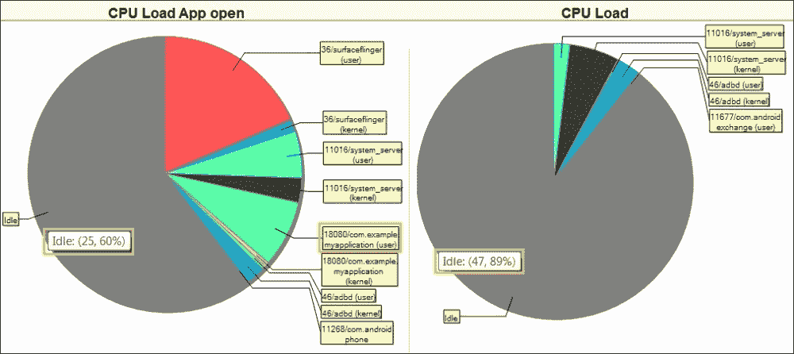

## 层次视图

Android 设备监视器除了 DDMS 之外还包含第二个视角——**层次视图**。在 Android 设备顶部栏中，您可以从一个视角切换到另一个视角。顶部栏中的两个选项在下一张截图中显示：


打开**层次视图**视角，并从左侧列表中选择您的应用程序。在左侧面板中，单击以下图标（**将视图层次结构加载到树视图中**操作）：


视图层次结构按如下截图所示加载：

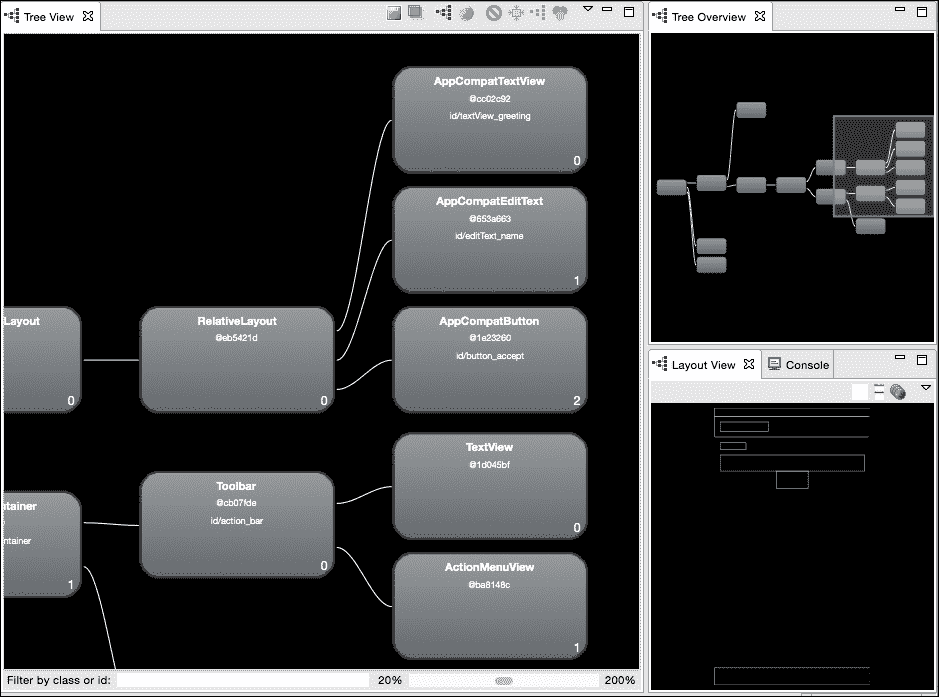

有三个不同的面板：

+   **树形概览**：此面板显示了完整视图层次结构的概览。

+   **树形视图**：此面板详细显示了视图层次结构的一个特定区域。在层次结构的底部，我们可以找到 ID 为`textView_greeting`的`TextView`，ID 为`editText_name`的`EditText`，以及 ID 为`button_accept`的`Button`。它们的父视图是`RelativeLayout`。

+   **布局视图**：此面板显示布局视图。

如果您选择其中一个视图元素，您可以看到其详细信息。以下截图显示了`button_accept`按钮的详细信息：

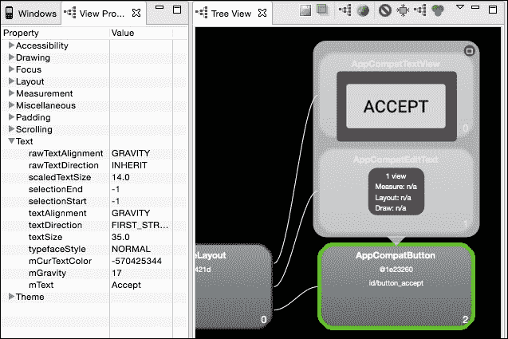

从左侧面板打开**视图属性**选项卡。您可以检查按钮的属性，例如`mText`属性，其值为`Accept`。

在**树视图**面板的顶部，有一些操作，比如将树视图保存为 PNG 图像或捕获窗口层为 Photoshop 文件。

# 摘要

现在你已经了解了你应用程序的不同启动选项，以及如何使用控制台和**LogCat**进行调试。我们还看到了如何调试应用程序以及如何解释 DDMS 在每个可用标签页提供的数据。

在下一章中，我们将使用 Android Studio 为我们的应用程序发布做准备。首先，你将学习在发布模式下构建应用程序之前需要准备应用程序的必要步骤。你还将了解应用程序是如何在`APK`文件中压缩的，以及如何生成你自己的`APK`文件。最后，你将学习如何作为开发者获取你的证书以及如何生成一个已签名的`APK`文件，使其准备好发布。
