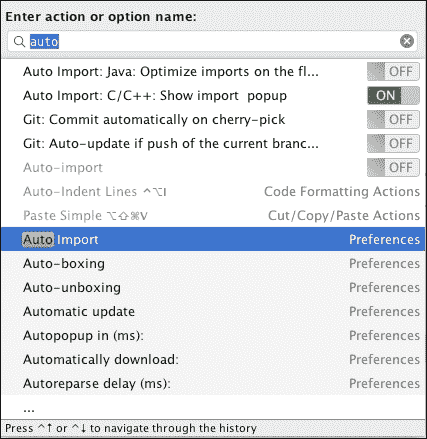
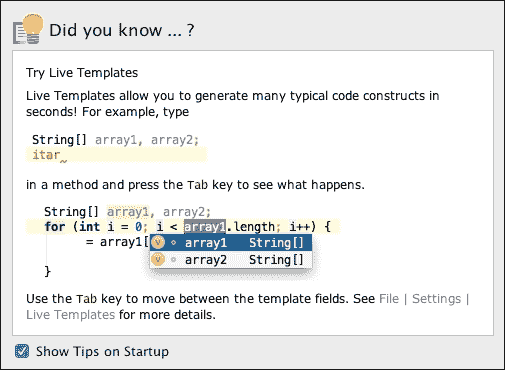
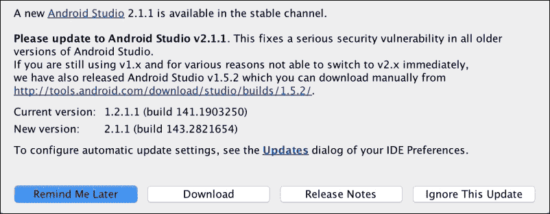
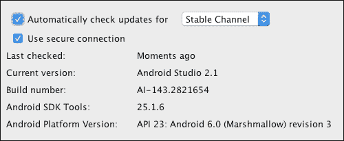

# 附录 A. 获取帮助

在使用新的 IDE 开发应用程序时，总会对如何执行某些操作产生疑问。一个成功的 IDE 通常包括帮助向导和文档，帮助用户解决不同的问题。您想知道如何使用 Android Studio 获取帮助吗？

在最后一章中，我们将学习关于 Android Studio 文档和帮助主题的内容。我们将学习官方文档中可在线访问的官方 Android 网站上的主题。最后，我们将学习如何使用更新功能保持我们的 Android Studio 实例更新。

以下主题包括：

+   Android Studio 帮助

+   在线文档

+   Android Studio 更新

# 从 Android Studio 获取帮助

Android Studio 文档可在 Android 开发者网站上找到，网址为 [`developer.android.com/studio`](https://developer.android.com/studio)。Android Studio 文档也包含在 IntelliJ IDEA 网络帮助中。您可以通过 Android Studio 的菜单 **帮助** | **在线文档** 访问此文档，或访问 [`tools.android.com/welcome-to-android-studio`](http://tools.android.com/welcome-to-android-studio)。

您可以导航到 **帮助** | **帮助主题** 直接打开文档内容树，或访问 [`www.jetbrains.com/idea/webhelp/intellij-idea.html`](http://www.jetbrains.com/idea/webhelp/intellij-idea.html)。还有一些在线视频教程可供参考，网址为 [`tv.jetbrains.net/`](http://tv.jetbrains.net/)。

要快速查找 Android Studio 的操作，我们可以使用 **帮助** | **查找操作** 选项。输入您要查找的操作，将显示匹配的操作列表。您可以直接从列表对话框中更改一些首选项值，或者点击导航到它们。以下截图显示了 **查找操作** 功能。

Android Studio 提供了每日提示功能。每日提示通过对话框解释 Android Studio 的一些技巧。每次打开 Android Studio 时，都会显示此对话框。我们可以使用 **上一个提示** 和 **下一个提示** 按钮浏览更多提示。通过取消选择 **启动时显示提示** 复选框，我们可以禁用此功能。可以通过导航到 **帮助** | **每日提示** 打开提示对话框。下一屏显示的是每日提示屏幕的示例。

# Android 在线文档

由 Google 提供的官方 Android 文档可在 [`developer.android.com/`](http://developer.android.com/) 获取。此文档包含所有必要的指南，不仅教授如何编程 Android 应用程序，还教授如何为 Android 设计以及如何分发和推广我们的应用程序。由于该网站内容丰富，以下列出了一些对本书各章节中知识扩展有用的具体指南：

1.  第一章，*安装和配置 Android Studio*：

    +   Android Studio 文档，在 [`developer.android.com/tools/studio/index.html`](http://developer.android.com/tools/studio/index.html)

    +   已知问题，在 [`tools.android.com/knownissues`](http://tools.android.com/knownissues)

1.  第二章，*开始项目*：

    +   应用栏，在 [`developer.android.com/training/appbar/index.html`](https://developer.android.com/training/appbar/index.html)

    +   浮动操作按钮，在 [`www.google.com/design/spec/components/buttons-floating-action-button.html`](https://www.google.com/design/spec/components/buttons-floating-action-button.html)

    +   碎片，在 [`developer.android.com/guide/components/fragments.html`](https://developer.android.com/guide/components/fragments.html)

    +   导航抽屉，在 [`www.google.com/design/spec/patterns/navigation-drawer.html`](https://www.google.com/design/spec/patterns/navigation-drawer.html)

    +   使用代码模板，在 [`developer.android.com/studio/projects/templates.html`](https://developer.android.com/studio/projects/templates.html)

1.  第三章，*导航项目*：

    +   管理你的项目，在 [`developer.android.com/studio/projects/index.html`](https://developer.android.com/studio/projects/index.html)

    +   应用程序清单，在 [`developer.android.com/guide/topics/manifest/manifest-intro.html`](https://developer.android.com/guide/topics/manifest/manifest-intro.html)

1.  第四章，*使用代码编辑器*：

    +   默认快捷键映射参考，在 [`resources.jetbrains.com/assets/products/intellij-idea/IntelliJIDEA_ReferenceCard_mac.pdf`](https://resources.jetbrains.com/assets/products/intellij-idea/IntelliJIDEA_ReferenceCard_mac.pdf)

    +   文件和代码模板，在 [`www.jetbrains.com/help/idea/2016.1/file-and-code-templates.html`](https://www.jetbrains.com/help/idea/2016.1/file-and-code-templates.html)

1.  第五章，*创建用户界面*：

    +   布局，在 [`developer.android.com/guide/topics/ui/declaring-layout.html`](http://developer.android.com/guide/topics/ui/declaring-layout.html)

    +   输入控件，在 [`developer.android.com/guide/topics/ui/controls.html`](http://developer.android.com/guide/topics/ui/controls.html)

    +   输入事件，请参阅[`developer.android.com/guide/topics/ui/ui-events.html`](http://developer.android.com/guide/topics/ui/ui-events.html)

    +   支持多屏幕，请参阅[`developer.android.com/guide/practices/screens_support.html`](http://developer.android.com/guide/practices/screens_support.html)

1.  第六章，*工具*：

    +   SDK 管理器，请参阅[`developer.android.com/studio/intro/update.html`](https://developer.android.com/studio/intro/update.html)

    +   创建和管理虚拟设备，请参阅[`developer.android.com/studio/run/managing-avds.html`](https://developer.android.com/studio/run/managing-avds.html)

    +   Android 模拟器，请参阅[`developer.android.com/studio/run/emulator.html`](https://developer.android.com/studio/run/emulator.html)

    +   为您的应用设置版本，请参阅[`developer.android.com/studio/publish/versioning.html`](https://developer.android.com/studio/publish/versioning.html)

1.  第七章，*Google Play 服务*：

    +   Google Play 服务，请参阅[`developers.google.com/android/guides/overview`](https://developers.google.com/android/guides/overview)

1.  第八章，*调试*：

    +   使用 DDMS，请参阅[`developer.android.com/studio/profile/ddms.html`](https://developer.android.com/studio/profile/ddms.html)

    +   读取和写入日志，请参阅[`developer.android.com/studio/debug/index.html`](https://developer.android.com/studio/debug/index.html)

    +   使用 Traceview 和 dmtracedump 进行性能分析，请参阅[`developer.android.com/studio/profile/traceview.html`](https://developer.android.com/studio/profile/traceview.html)

    +   关于 Instant Run，请参阅[`developer.android.com/studio/run/index.html`](https://developer.android.com/studio/run/index.html)

1.  第九章，*准备发布*：

    +   发布您的应用，请参阅[`developer.android.com/studio/publish/index.html`](https://developer.android.com/studio/publish/index.html)

    +   配置您的构建，请参阅[`developer.android.com/studio/build/index.html`](https://developer.android.com/studio/build/index.html)

# 更新

从 **帮助** 菜单中，我们可以检查 Android Studio 的更新。导航到 **帮助** | **检查更新** （在 Mac 上为 **Android Studio** | **检查更新**）。当检查完成后，如果存在尚未安装的 Android Studio 更新，更新信息将在对话框中显示。此对话框在以下屏幕截图中显示：

我们可以查看当前版本和新版本代码。我们可以选择是否忽略更新（点击**忽略此更新**按钮），稍后更新（点击**稍后提醒我**按钮），查看关于更新的在线发布说明（点击**发布说明**按钮），或者安装更新（点击**下载**按钮）。点击最后一个选项以更新 Android Studio。更新首先开始下载，然后 Android Studio 将重新启动，并安装更新。

如果我们已安装了 Android Studio 的最新版本，将显示以下消息：

**您已安装了 Android Studio 的最新版本。**

**要配置自动更新设置，请参阅您的 IDE 设置中的更新对话框**

点击**更新**链接以打开更新配置对话框，如图所示。此对话框提供了当前版本详细信息、Android SDK Tools 版本、Android 平台版本或上次检查更新的时间。我们可以选择是否让 Android Studio 自动检查更新以及要检查哪种类型的更新：**Canary Channel**、**Dev Channel**、**Beta Channel**或**Stable Channel**。

我们可以通过导航到菜单**帮助** | **Android Studio 的新功能**来检查最近 Android Studio 更新的信息。这些信息可在[`tools.android.com/recent`](http://tools.android.com/recent)在线获取。要获取我们当前拥有的 Android Studio 版本或甚至系统中的 Java 版本，请导航到**帮助** | **关于**（在 Mac 上为**Android Studio** | **关于 Android Studio**）。

# 摘要

我们已经学习了如何在需要帮助时使用 Android Studio 文档。我们还了解了更新功能，以确保始终安装 Android Studio 的最新版本。到本章结束时，用户应该能够使用在线文档和帮助主题搜索帮助，并保持其 Android Studio 更新，以便使用最新的功能。
