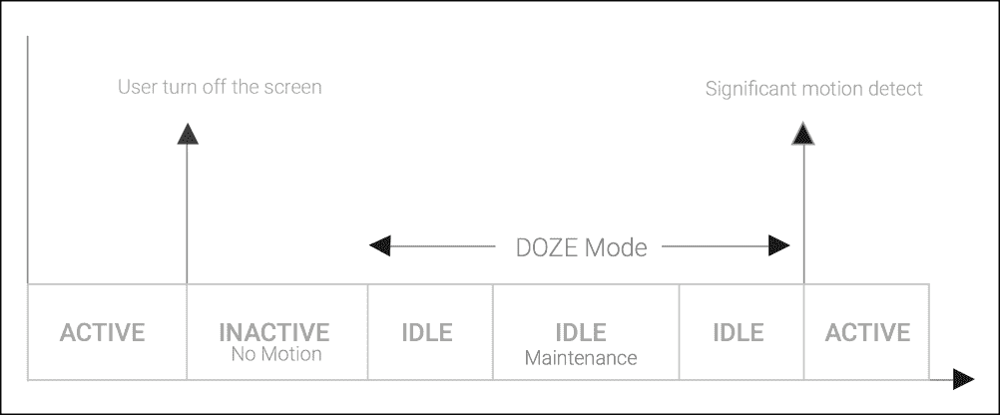

# 第六章. 使用 AlarmManager 安排工作

在整本书中，我们一直将保持前台应用程序的响应性作为我们的主要关注点，我们已经探索了许多将工作从主线程移开并在后台运行的方法。

在我们迄今为止的所有讨论中，我们都希望尽快完成工作，因此尽管我们将它移动到了后台线程，但我们仍然与正在进行的线程操作并发执行工作，例如更新用户界面和响应用户交互。

在本章中，我们将学习如何使用`AlarmManager`将工作推迟到未来某个时间运行，无需用户干预，甚至在必要时从空闲状态唤醒设备。同时，我们将向您介绍 Android Marshmallow 6 引入的一些节能特性，并解释如何使您的应用程序适应这一新范式。

在本章中，我们将涵盖以下主题：

+   使用 AlarmManager 安排闹钟

+   取消闹钟

+   安排重复闹钟

+   在 Doze 模式下安排闹钟

+   设置闹钟

+   调试 AlarmManager 闹钟

+   使用 Activity 处理闹钟

+   使用 BroadcastReceivers 处理闹钟

+   使用 WakeLock 保持唤醒状态

+   系统启动时恢复闹钟

+   AlarmManager 的应用

# 介绍 AlarmManager

在第二章中，*使用 Looper、Handler 和 HandlerThread 执行工作*，我们学习了如何使用`postDelayed`、`postAtTime`、`sendMessageDelayed`和`sendMessageAtTime`在`HandlerThread`上安排工作。这些机制在我们应用程序在前台运行时对短期调度工作来说是不错的。

然而，如果我们想要在遥远的未来某个时间点安排一个操作运行，我们可能会遇到问题。首先，我们的应用程序可能在到达那个时间之前被终止，从而消除了 Handler 运行这些计划操作的机会。其次，设备可能处于睡眠状态，并且当其 CPU 关闭时，它无法运行我们计划的任务。

### 注意

解决这个问题的方法是使用一种替代的调度方法，它被设计用来克服这些问题：`AlarmManager`。

`android.app.AlarmManager`是一个自 Android SDK 第一版以来就存在的类，它提供了一个高级 API，可以在用户定义的特定时间或时间窗口将来触发 Intent。这些计划由 Android 系统管理，考虑到设备的电源周期和状态，以保持低能耗。

此外，`AlarmManager`是一个提供比 Handler 更强大调度能力的系统服务。作为一个系统服务，AlarmManager 不能被终止，并且在某些条件下，它可以从睡眠状态唤醒设备以发送计划好的闹钟。

`android.app.AlarmManager`的主要特性如下：

+   **从空闲状态唤醒设备的能力**：用户能够控制系统应该如何处理在节能模式下设置的闹钟

+   **取消闹钟**：一种基于 Intent 比较取消先前创建的闹钟的机制

+   **更新闹钟**：一种更新现有预定闹钟的机制

+   **精确和不精确闹钟**：一个能够控制我们调度精确度的 API

+   **由 Android 系统管理的调度**：即使您的应用程序没有运行，闹钟也会触发，并且不会消耗任何应用程序资源来管理计时器

# 使用 AlarmManager 安排闹钟

正如我们之前所说的，所有的闹钟操作都是通过单例对象`AlarmManager`管理的，这是一个 Android 全局系统服务，任何可以访问`Context`实例的类都可以获取它。例如，在一个`Activity`中，我们可以通过以下代码从任何成员方法中获取`AlarmManager`：

```java
AlarmManager am = (AlarmManager)getSystemService(ALARM_SERVICE);
```

一旦我们有了`AlarmManager`的引用，我们就可以在所选时间安排一个闹钟，将`PendingIntent`对象传递给`Service`、`Activity`或`BroadcastReceiver`。最简单的方法是使用`set`方法：

```java
void set(int type, long triggerAtMillis, PendingIntent operation)
```

当我们设置闹钟时，我们必须也指定一个`type`标志——`set`方法的第一个参数。`type`标志设置闹钟应该触发的条件以及我们为计划使用哪个时钟。

有两种条件和两种时钟，导致四种可能的`type`设置。

第一个条件指定当设备在预定闹钟时间处于睡眠状态时，设备是否会唤醒——闹钟是否为`wakeup`闹钟。

时钟为我们设置的计划提供了一个参考时间，定义了当我们设置`triggerAtMillis`的值时我们确切的意思。我们可以基于以下时间参考来制定计划：

+   已过时间系统时钟——`android.os.SystemClock`——测量自设备启动以来经过的毫秒数，包括任何在深度睡眠中度过的时间。根据系统时钟，当前时间可以通过以下代码找到：

    ```java
    SystemClock.elapsedRealtime()
    ```

+   实时时钟（Unix 时间）- 以毫秒为单位测量自 Unix 纪元以来的时间。根据实时时钟，当前时间可以通过以下方式找到：

    ```java
    System.currentTimeMillis()
    ```

### 注意

在 Java 中，`System.currentTimeMillis()`返回自 1970 年 1 月 1 日午夜协调世界时（UTC）以来的毫秒数——一个被称为 Unix 纪元的时间点。

UTC 是国际上公认的**格林威治标准时间**（**GMT**）的继任者，并构成了表达国际时区的基础，这些时区通常定义为相对于 UTC 的正数或负数偏移。

给定这两种条件和两种时钟，这些是我们设置闹钟时可以使用的四种可能的`type`值：

+   `android.app.AlarmManager.ELAPSED_REALTIME`：这将在系统时钟相对于的相对时间安排闹钟。如果设备在预定时间处于睡眠状态，它将不会立即交付；相反，闹钟将在设备下一次唤醒时交付。

+   `android.app.AlarmManager.ELAPSED_REALTIME_WAKEUP`：这将在系统时钟相对于的相对时间安排闹钟。如果设备处于睡眠状态，它将被唤醒以在预定时间交付闹钟。

+   `android.app.AlarmManager.RTC`：这将在 UTC 相对于 Unix 纪元安排闹钟。如果设备在预定时间处于睡眠状态，闹钟将在设备下一次唤醒时交付。

+   `android.app.AlarmManager.RTC_WAKEUP`：这将在 Unix 纪元相对于的相对时间安排闹钟。如果设备在预定时间处于睡眠状态，它将被唤醒，并且闹钟将在预定时间交付。

我们将开始设置一个特定时间的闹钟，在初始启动后的 24 小时后响起。我们将使用`java.lang.concurrent`包中的`TimeUnit`类来计算毫秒时间。为了设置之前的闹钟，我们需要计算 24 小时中的毫秒数，如下面的代码所示：

```java
long delay = TimeUnit.HOURS.toMillis(24L);
am.set(AlarmManager.ELAPSED_REALTIME, delay, pending);
```

我们可以使用系统时间设置一个五分钟后的闹钟，通过将五分钟加到当前时间。使用系统时钟，它看起来像这样：

```java
long delay = TimeUnit.MINUTES.toMillis(5L);
long time = System.currentTimeMillis() + delay;
am.set(AlarmManager.RTC, time, pending);
```

要设置一个今天晚上 9:00 的闹钟（或者如果今天已经过了 9:00，则是明天），我们可以使用`Calendar`类进行一些时间计算：

```java
Calendar calendar = Calendar.getInstance();
// Tomorrow at 9 if already passed 9pm today
if (calendar.get(Calendar.HOUR_OF_DAY) >= 21) {
    calendar.add(Calendar.DATE, 1);
}
calendar.set(Calendar.HOUR_OF_DAY, 21);
calendar.set(Calendar.MINUTE, 0);
calendar.set(Calendar.SECOND, 0);
am.set(AlarmManager.RTC, calendar.getTimeInMillis(), pending);
```

到目前为止的任何示例都不会在闹钟时间设备处于睡眠状态时唤醒设备。为了做到这一点，我们需要使用其中一个`WAKEUP`闹钟条件，例如：

```java
am.set(AlarmManager.ELAPSED_REALTIME_WAKEUP, delay, pending);
am.set(AlarmManager.RTC_WAKEUP, time, pending);
```

也很重要的是要理解，当闹钟时间在过去的任何时候，闹钟将在我们调用`AlarmManager`设置闹钟功能后立即响起。

## 在最近的 Android 版本中设置闹钟

如果我们的应用程序针对的 API 级别低于 19（KitKat），计划中的闹钟将在闹钟时间准时运行。对于针对 KitKat 或更高版本的应用程序，计划被认为是近似的，系统可能会重新排序或分组闹钟以最小化唤醒次数并节省电池。

从 API 级别 23 开始，Android 开发团队又前进了一步，在 Android 系统中引入了 Doze 模式，以减少设备从电源适配器断开、静止不动且用户长时间未使用时的电池消耗。

Doze 系统将尝试减少设备的唤醒频率，推迟后台任务、网络更新、同步以及我们宝贵的闹钟，直到设备退出 Doze 模式或定期维护窗口运行以执行挂起的任务、某些闹钟或与网络的同步。维护窗口完成后，如果在此期间未使用设备，设备将再次进入 Doze 模式：



图 6.1：Doze 模式时间线

Doze 模式可能会影响您的应用程序，并将您的警报推迟到维护窗口出现，除非您使用 `setAndAllowWhileIdle()` 和 `setExactAndAllowWhileIdle()` 方法来允许在深度空闲状态下执行警报。

此外，在长期不活跃的情况下，Doze 模式维护窗口运行的次数将更少，因此这种新机制对我们调度的影响会增加，从而导致警报时间的不确定性增加。

在 Doze 模式期间，应用程序也不允许访问网络，WakeLocks 被忽略，并且不会执行 Wi-Fi 扫描。

如果我们需要精确调度，并且您针对的是 Marshmallow 或更高版本，我们应该使用在 API 级别 23 中引入的新的 `setExactAndAllowWhileIdle()` 方法：

```java
am.setExactAndAllowWhileIdle(AlarmManager.RTC_WAKEUP, time, pending);
```

### 注意

Android 系统有保护措施，防止频繁触发精确警报的滥用。`AlarmManager` 只唤醒设备并每分钟调度一个警报，在低功耗模式下，每 15 分钟可能只有一次。

如果您的应用程序针对的版本在 KitKat（API Level 19）和 Marshmallow（API Level 23）之间，`setExact` 方法就足够用于时间精度：

```java
am.setExact(AlarmManager.RTC_WAKEUP, time, pending);
```

但在我们尝试调用它之前，我们需要检查这些方法是否存在；否则，我们的应用程序在早期 API 级别运行时将会崩溃。让我们绘制我们的新精确警报代码：

```java
if (Build.VERSION.SDK_INT >= 23) {
  // Wakes up the device in Doze Mode
  am.setExactAndAllowWhileIdle(AlarmManager.RTC_WAKEUP, time, pending);
} else if (Build.VERSION.SDK_INT >= 19) {
  // Wakes up the device in Idle Mode
  am.setExact(AlarmManager.RTC_WAKEUP, time, pending);
} else {
  // Old APIs
  am.set(AlarmManager.RTC_WAKEUP, time, pending);
}
```

这将在所有平台上在指定的时间精确发出警报。

不要忘记，您只有在真正需要时才应使用精确调度，例如，在特定时间向用户发送警报。对于大多数其他情况，允许系统稍微调整我们的计划以保护电池寿命通常是可接受的。

Android Marshmallow API Level 23 还提供了 `setAndAllowWhileIdle` 函数，允许我们在 Doze 模式下创建一个警报，但与 `setExactAndAllowWhileIdle()` 相比，精确度较低。

系统将尝试在整个系统中批量处理这类警报，以最小化设备唤醒的次数，从而减少系统的能耗。以下是创建一个在 10 小时后触发的警报的代码：

```java
long delay = TimeUnit.HOURS.toMillis(10L);
long time = System.currentTimeMillis() + delay;

if (Build.VERSION.SDK_INT >= 23) {
     am.setAndAllowWhileIdle(AlarmManager.RTC_WAKEUP, time, pending);
}
```

## 在 Doze 模式下测试您的警报

为了测试您的应用程序在 Doze 模式下的行为，Android SDK 团队向 dumpsys 工具添加了一些新命令，以便从命令行手动更改设备的电源状态。

还需要记住，Doze 模式要求您的设备从充电器上拔下。为了强制设备进入未连接充电器的状态，我们应该在具有访问 SDK 工具的命令行上运行以下命令：

```java
# Emulate a charger unplug
adb shell dumpsys battery unplug
# Emulate a charger plug in
adb shell dumpsys battery set ac 1
```

然后，为了进入空闲模式，我们应该关闭屏幕并运行以下命令：

```java
// Enable the doze mode, step required on Android Emulator
adb shell dumpsys deviceidle enable
// To goes directly go IDLE mode
adb shell dumpsys deviceidle force-idle
```

将设备置于空闲模式后，我们可以通过运行以下命令来启用维护窗口：

```java
// Goes from IDLE -> IDLE_MAINTENANCE state
adb shell dumpsys deviceidle step
```

如果我们再次运行相同的步骤，设备将返回到空闲状态；然而，如果我们想返回到活动状态，我们应该运行下一个命令：

```java
// Goes from IDLE,IDLE_MAINTENANCE -> ACTIVE state
adb shell dumpsys deviceidle disable
```

使用这些便捷的命令，我们能够验证即使在深度空闲状态下，闹钟也会响起。

## 设置窗口闹钟

KitKat 中增加的一个功能是`setWindow()`，它通过允许我们指定闹钟必须送达的时间窗口，在精确和不精确闹钟之间提供了一个折中方案。这仍然允许系统在效率方面进行一些调整，但让我们可以选择允许多少自由度。

这是如何使用`sentindo()`在 3 分钟窗口内安排闹钟的示例——最早从现在起 5 分钟，最晚从现在起 8 分钟——使用实时时钟：

```java
if (Build.VERSION.SDK_INT >= 19) {
  long delay = TimeUnit.MINUTES.toMillis(5L);
  long window = TimeUnit.MINUTES.toMillis(3L);
  long time = System.currentTimeMillis() + delay; 
  am.setWindow(AlarmManager.RTC_WAKEUP, time, window, pending);
}
```

## 调试 AlarmManager 闹钟

Android 系统附带了一个便捷的诊断工具，它会向开发者输出设备上注册的闹钟列表。要获取列表，我们从命令行运行以下命令：

```java
adb shell dumpsys alarm

```

在我们为 Android API Level 23 创建精确的 5 分钟闹钟后，系统将在命令输出中输出我们的注册闹钟。

```java
...
Batch{bfce57 num=1 start=6199180 end=6199180 flgs=0x5}:
RTC_WAKEUP #0: Alarm{
 d38d44 type 0 when 1449181419460  
    com.packpublishing.asynchronousandroid}
 tag=*walarm*:my_alarm
 type=0 whenElapsed=+58s670ms when=2015-12-03 22:23:39
    window=0 repeatInterval=0 count=0 flags=0x5
    operation=PendingIntent{a58bbe0: PendingIntentRecord{
     466e99 android broadcastIntent}}
```

闹钟系统试图通过批量执行闹钟以节省电池，因此第一行包含我们的闹钟所属的闹钟批量的信息。

批处理输出格式的详细信息如下所示列表：

+   `bfce57`：批处理内部标识号。

+   `num=1`：此批处理中的闹钟数量。

+   `start=6199180`：它指的是批处理应该开始的时间，以系统启动以来的已流逝毫秒数表示。

+   `end=6199180`：它指的是批处理结束的时间，以系统启动以来的已流逝毫秒数表示。

在批处理内部，我们的闹钟在以下字段中得到了详细描述：

+   `d38d44`：系统使用的内部标识号。

+   `type 0 (RTC_WAKEUP)`：闹钟类型。

+   `when`：基于时钟时间的闹钟时间（自纪元以来的毫秒数）。

+   `tag=*walarm*:my_alarm`：在 Intent 中指定的操作。

+   `com.packpublishing.asynchronousandroid`：创建闹钟的应用程序包。

+   `whenElapsed=+58s670ms`：指的是自系统启动以来，此闹钟将被触发的时刻。

+   `when= 2015-12-03 22:23:39`：此闹钟将被触发的日期/时间。

+   `window= 180000`：当使用`setWindow()`方法时，指的是窗口字段中指定的值。

+   `repeatInterval=0`：在重复闹钟中用于指定重复之间的间隔。

+   `count=0`：闹钟响起的次数。

+   `operation= PendingIntent...`：将被触发的挂起意图。

# 取消闹钟

一旦设置了闹钟，可以通过调用`AlarmManger.cancel`方法并使用与要取消的闹钟匹配的意图来非常容易地取消闹钟。

匹配过程使用 Intent 的 `filterEquals` 方法，该方法比较两个 `Intent` 的动作、数据、类型、类、组件、包和类别，以测试等价性。我们可能在 Intent 中设置的任何 extras 都不考虑在内。

在下面的代码中，我们将向您展示如何创建一个在 1 小时后触发的闹钟，以及取消代码，使用不同的 intent 实例来取消它：

```java
// Function to set the Alarm
void set1HourAlarm(long time) {
  AlarmManager am= (AlarmManager) getSystemService(ALARM_SERVICE);
  long time = in1HourTime();
  am.set(AlarmManager.RTC, time, createPendingIntent(time));
}

// Cancel the alarm
void cancel1HourAlarm(long time) {
  AlarmManager am= (AlarmManager) getSystemService(ALARM_SERVICE);
  // Remove the alarms matching the Intent
  am.cancel(createPendingIntent(time));
}

// Creates the Pending Intent to set and cancel the alarm
PendingIntent createPendingIntent(long time) {
  Intent intent = new Intent("my_alarm");
  PendingIntent pending = PendingIntent.
    getBroadcast(this, ALARM_CODE, intent,
                 PendingIntent.FLAG_UPDATE_CURRENT);
  // extras don't affect matching
  intent.putExtra("exactTime", time);
  return pending;
}
// Calculate the Time
long in1HourTime() {
  long delay = TimeUnit.MINUTES.toMillis(5L);
  long time = System.currentTimeMillis() + delay;
  return time;
}
```

由于在我们的示例中我们使用相同的方法来构建设置和取消 `PendingIntent`，因此两者都将具有相同的动作和匹配，所以如果 `AlarmManager.cancel` 运行并找到匹配项，Android 系统将从已启用闹钟列表中删除之前设置的闹钟。

### 注意

要调试您的闹钟取消操作，您可以使用 `adb shell dumpsys` alarm 再次验证闹钟是否已从系统闹钟批次中消失。

重要的是要意识到，无论何时我们使用带有 `FLAG_UPDATE_CURRENT` 的 pending intent 创建闹钟，我们都会隐式更新任何现有的闹钟，使用新的 Intent 和其 extras。

# 设置重复闹钟

除了设置一次性闹钟外，我们还有使用 `setRepeating()` 和 `setInexactRepeating()` 来安排重复闹钟的选项。这两种方法都接受一个额外的参数，该参数定义了重复闹钟的间隔（以毫秒为单位）。通常，建议避免使用 `setRepeating()`，始终使用 `setInexactRepeating()`，允许系统优化设备唤醒，并在运行不同 Android 版本的设备上提供更一致的行为：

```java
   void setRepeating(
       int type, long triggerAtMillis,
       long intervalMillis, PendingIntent operation);

   void setInexactRepeating(
       int type, long triggerAtMillis,
       long intervalMillis, PendingIntent operation)
```

`AlarmManager` 提供了一些方便的常量用于典型的重复间隔：

```java
   AlarmManager.INTERVAL_FIFTEEN_MINUTES
   AlarmManager.INTERVAL_HALF_HOUR
   AlarmManager.INTERVAL_HOUR
   AlarmManager.INTERVAL_HALF_DAY
   AlarmManager.INTERVAL_DAY
```

现在让我们构建一个示例，创建一个大约 2 小时后送达的重复闹钟，然后每隔大约 15 分钟重复一次，如下所示：

```java
Intent intent = new Intent("my_alarm");
PendingIntent broadcast = PendingIntent.getBroadcast(
  this, 0, intent,PendingIntent.FLAG_UPDATE_CURRENT);
long start = System.currentTimeMillis() +
             TimeUnit.HOURS.toMillis(2L);
AlarmManager am = (AlarmManager)
                  getSystemService(ALARM_SERVICE);
am.setRepeating(
  AlarmManager.RTC_WAKEUP, start,
  AlarmManager.INTERVAL_FIFTEEN_MINUTES, broadcast);
```

从 API 级别 19 开始，所有重复闹钟都是不精确的——也就是说，即使我们的应用程序针对 KitKat 或更高版本，即使我们使用 `setRepeating()`，我们的重复闹钟也会是不精确的。为了在所有 Android 版本中实现类似的不精确行为，您应该使用 `setInexactRepeating()`（API 级别 3）而不是 `setRepeating()`：

```java
am.setInexactRepeating(
  AlarmManager.RTC_WAKEUP, start,
  AlarmManager.INTERVAL_FIFTEEN_MINUTES, broadcast);
```

不精确重复告诉系统，您的闹钟时间可能会调整以减少设备频繁唤醒并提高系统的整体电源效率。

如果我们真的需要精确重复闹钟，我们可以使用 `setExact()`/`setExactAndAllowWhileIdle()`，而不是使用 `setExact()`，并在处理当前闹钟的同时安排下一个闹钟。

之后，我们可能会增加重复闹钟的间隔，甚至可以通过调用带有匹配先前 Intent 和 `FLAG_UPDATE_CURRENT` 标志的 Intent 的 `setRepeating()` 来更改 `Intent` Extras，如下面的代码所示：

```java
Intent intent = new Intent("my_alarm");
PendingIntent broadcast = PendingIntent.getBroadcast(
  this, 0, intent, PendingIntent.FLAG_UPDATE_CURRENT);
// Updates the delivery intent extras
intent.putExtra("my_int",3);
am.setRepeating(
  AlarmManager.RTC_WAKEUP, System.currentTimeMillis(),
  AlarmManager.INTERVAL_HALF_HOUR, broadcast);
```

# 设置闹钟

从 API 级别 21 开始，`setAlarmClock`，该函数设置一个新的闹钟并显示状态栏闹钟图标，被引入到 `AlarmManager` 类中：

```java
 void setAlarmClock(AlarmClockInfo info, PendingIntent operation)
```

在下一个示例中，我们将创建一个闹钟，明天晚上 10:00 分响起：

```java
Intent intent = new Intent("my_clock_alarm");
Calendar calendar = Calendar.getInstance();
calendar.add(Calendar.DATE, 1);
calendar.set(Calendar.HOUR_OF_DAY, 22);
calendar.set(Calendar.MINUTE, 0);
calendar.set(Calendar.SECOND, 0);

PendingIntent broadcast = PendingIntent.getBroadcast(
                                   AlarmClockActivity.this, 0, intent, 
                                   PendingIntent.FLAG_UPDATE_CURRENT);

// Only applies to newer versions
If ( Build.VERSION.SDK_INT >= 21 ) {

  AlarmClockInfo alarmInfo = new AlarmClockInfo(          
     calendar.getTimeInMillis(),    
     // Create a Pending intent to show Alarm Details
     createShowDetailsPI());
  am.setAlarmClock(alarmInfo, broadcast);

} else {

  am.set(AlarmManager.RTC_WAKEUP,
         calendar.getTimeInMillis(), broadcast);
}
...
PendingIntent createShowDetailsPI() {
    ntent showIntent = new Intent(AlarmClockActivity.this,
                                  ShowAlarmActivity.class);
    return PendingIntent.getActivity(AlarmClockActivity.this, 0,
                                     showIntent,                                                 
                                     PendingIntent.
                                       FLAG_UPDATE_CURRENT);
}
```

如果你使用的是最新设备，一旦我们设置了之前的警报，我们会在系统状态栏上看到时钟图标：


要取消闹钟，我们必须使用匹配的意图调用`cancel`方法：

```java
Intent intent = new Intent("my_clock_alarm");
PendingIntent broadcast = PendingIntent.getBroadcast(
  this, 0, intent, PendingIntent.FLAG_UPDATE_CURRENT);
am.cancel(broadcast);
```

# 处理警报

到目前为止，我们已经学习了如何在`AlarmManager`单例服务上安排精确和不精确的警报，因此在这个时候，我们准备看看如何在任何 Android 应用程序组件中处理警报。

实际上，我们可以安排任何可以用`PendingIntent`启动的事情，这意味着我们可以使用警报来启动活动、服务和`BroadcastReceivers`。为了指定我们的警报目标，我们需要使用`PendingIntent`的静态工厂方法：

```java
PendingIntent.getActivities(Context, int,Intent[],int)
PendingIntent.getActivity(Context,int, Intent, int)
PendingIntent.getService(Context,int, Intent, int)
PendingIntent.getBroadcast(Context,int, Intent, int)
```

所有提供的静态方法都用于创建一个挂起意图，接收一个 Context 对象、一个用于标识挂起意图的整数请求代码、一个 Intent 或 Intent 数组，这些 Intent 将被发送到组件，最后是一个整数，用于指定`PendingIntent`标志。

在工厂方法上使用的`PendingIntent`标志在 Intent 处理中起着重要作用，因此理解我们可以用来指示系统如何处理已存在的 intent、使 intent 不可变或设置只发送一次的 intent 的标志至关重要：

+   `FLAG_CANCEL_CURRENT`：表示系统应使现有意图无效并生成一个新的 Intent。

+   `FLAG_NO_CREATE`：如果`PendingIntent`尚不存在，则不会创建新的意图，并且工厂方法返回`null`。

+   `FLAG_ONE_SHOT`：表示创建的挂起意图只能使用一次。

+   `FLAG_UPDATE_CURRENT`：表示如果挂起意图已经存在，则挂起意图将被此意图替换，包括所有附加信息。

+   `FLAG_IMMUTABLE`：表示创建的挂起意图之后不能被修改。此标志仅从 API 级别 23 开始可用。

在大多数情况下，我们希望完全用新的 intent 替换现有的 intent，因此使用`FLAG_UPDATE_CURRENT`是正确的标志值。

在接下来的章节中，我们将为可以使用`AlarmManager`的每种类型的`PendingIntent`构建示例。

# 使用活动处理警报

从警报启动`Activity`就像使用通过调用`PendingIntent`的静态`getActivity`方法创建的`PendingIntent`注册警报一样简单。

当警报送达时，`Activity`将被启动并带到前台，取代任何当前正在使用的应用程序。请注意，这可能会让用户感到惊讶，甚至可能让他们感到烦恼！

当启动带有警报的活动时，我们可能希望设置`Intent.FLAG_ACTIVITY_CLEAR_TOP`；这样，如果应用程序已经在运行，并且我们的目标`Activity`已经在后台栈中，新的意图将被发送到旧的`Activity`，并且其上所有其他活动都将被关闭：

```java
   Intent intent = new Intent(context, HomeActivity.class);
   intent.setFlags(Intent.FLAG_ACTIVITY_CLEAR_TOP);
   PendingIntent pending = PendingIntent.getActivity(
       Context, 0, intent, PendingIntent.FLAG_UPDATE_CURRENT);
```

并非所有 Activity 都适合用`getActivity`启动。我们可能需要启动一个通常出现在应用深处的`Activity`，在那里按下后退不会退出到主屏幕，而是返回到后栈中的下一个`Activity`。

让我们设想一个情况，我们想要启动一个将显示模型详细信息的`Activity`，并且我们想要在后台栈中有一个列出模型的`Activity`。

这就是`getActivities`发挥作用的地方。通过`getActivities`，我们可以将多个`Activity`推送到应用程序的后栈，允许我们填充后栈以在用户按下“后退”时创建所需的导航流程。为此，我们通过向`getActivities`发送 Intent 数组来创建我们的`PendingIntent`：

```java
   Intent first = new Intent(context, ListActivity.class);
   Intent second = new Intent(context, DetailActivity.class);
   first.setFlags(Intent.FLAG_ACTIVITY_CLEAR_TOP);

   PendingIntent pending = PendingIntent.getActivities(
       context, 0,
       new Intent[]{first, second},
       PendingIntent.FLAG_UPDATE_CURRENT);
```

Intent 数组指定了按顺序启动的`Activity`。当这个警报被传递时，事件发生的逻辑顺序如下：

1.  如果应用程序已经在运行，那么在`ListActivity`之上的后栈中的任何 Activity 都将被完成并移除，因为我们设置了`Intent.FLAG_ACTIVITY_CLEAR_TOP`标志。

1.  `ListActivity`被（重新）启动。

1.  `DetailActivity`被启动并放置在`ListActivity`的后栈之上。`DetailActivity`成为前台`Activity`。

使用`Activity`处理警报是一个值得了解的知识点，但不是我们经常使用的技巧，因为它非常侵入性。我们更有可能希望在后台处理警报，我们将在下一节中探讨这一点。

# 使用 BroadcastReceiver 处理警报

我们已经在第五章中遇到了`BroadcastReceiver`，在*与服务交互*中，我们使用它在一个`Activity`中接收来自`Service`的广播。在本节中，我们将使用`BroadcastReceiver`来处理在`AlarmManager`上设置的警报。

`BroadcastReceivers`可以在运行时动态注册和注销，就像我们在第五章中做的那样，与`Service`一起，或者使用 Android 清单文件中的`<receiver>`元素静态注册，并且可以接收无论如何注册的警报。

使用静态注册的接收器处理警报更为常见，因为这些对系统来说是已知的，并且可以在应用程序当前未运行时通过警报启动应用程序。

让我们实现一个静态定义的`BroadcastReceiver`，当警报响起时能够向一个电话号码发送短信。首先，我们将在清单文件中定义我们的`BroadcastReceiver`：

```java
<receiver android:name=".chapter6.SMSDispacther">
  <intent-filter>
    <action android:name="sms_dispacther"/>
  </intent-filter>
</receiver>
```

`<intent-filter>`元素给我们提供了机会，通过指定应该匹配的动作、数据和类别来说明我们想要接收哪些 Intent。

现在是时候编写代码来设置日程安排了。为此，我们将创建一个提供设置目的地号码、延迟消息发送的小时数和要发送的消息文本的表单的`Activity`。

在`SMSDispatchActivity`活动上，我们将为`sms_dispatcher`动作创建一个`PendingIntent`，通过 Intent 附加信息传递所需的参数：

```java
public class SMSDispatchActivity extends Activity {
  // UI Code omitted for brevity
  …
  private OnClickListener mSubmit = new OnClickListener() {
    ...
    // Calculate the scheduled time
    // time = now + N*hours
    long delay = TimeUnit.HOURS.toMillis(hours);
    long time = System.currentTimeMillis() + delay;

    // Store the UI Form on the Intent
    intent.putExtra(SMSDispatcher.TO_KEY, phoneMumber);
    intent.putExtra(SMSDispatcher.TEXT_KEY, text);

    // Create the Broadcast Pending Intent
    PendingIntent broadcast = PendingIntent.getBroadcast(
      getBaseContext(), 0, intent,
      PendingIntent.FLAG_UPDATE_CURRENT);  

    // Set an exact Alarm
    if (Build.VERSION.SDK_INT >= 23) {
      am.setExactAndAllowWhileIdle(AlarmManager.RTC_WAKEUP, time,
                                   broadcast);
    } else if (Build.VERSION.SDK_INT >= 19) {
      am.setExact(AlarmManager.RTC_WAKEUP, time, broadcast);
    } else {
      am.set(AlarmManager.RTC_WAKEUP, time, broadcast);
    }
  }
}
```

当这个闹钟到期时，`AlarmManager`即使在深度空闲状态下也会唤醒设备（如果它还没有醒来）并将 Intent 传递给`BroadcastReceiver`的`onReceive`方法。闹钟管理器将保持唤醒锁，直到闹钟接收器的`onReceive()`运行。因此，它保证了设备至少会保持唤醒状态，直到`onReceive`完成，这意味着我们可以在设备被允许返回睡眠之前完成一些工作。

## 与`BroadcastReceiver`一起工作

当系统向我们的`BroadcastReceiver`发送闹钟时，它是在主线程上进行的，因此适用通常的主线程限制；我们不能执行网络操作，也不应该执行重型处理或使用阻塞操作。

此外，静态注册的`BroadcastReceiver`具有非常有限的生命周期。它不能创建除了吐司或通过`NotificationManager`发布的通知之外的用户界面元素，`onReceive`方法必须在 10 秒内完成，否则其进程可能会被杀死，并且一旦`onReceive`完成，接收器的生命周期就结束了。

由于我们需要的工作不是密集型的，我们可以在`onReceive`期间简单地完成它：

```java
public class SMSDispatcher extends BroadcastReceiver {

  public static final String TO_KEY = "to";
  public static final String TEXT_KEY = "text";

  @Override
  public void onReceive(Context context, Intent intent) {
     // Retrieve the Destination number and the
    // message from the intent extras
    String to = intent.getStringExtra(TO_KEY);
    String text = intent.getStringExtra(TEXT_KEY);

    Log.i("SMS Dispatcher", "Delivering message to " + to);
    SmsManager sms = SmsManager.getDefault();   
    sms.sendTextMessage(to, null, text, null, 0), null);
  }
}
```

就这样；一旦闹钟触发，`BroadcastReceiver.onReceive`将被调用，将短信发送到目标号码，文本由 UI 表单指定。

我们可以通过在收到来自移动网络的消息投递报告时向用户发送通知来使这更有用。

首先，我们将在`AndroidManifest.xml`中添加一个新的动作，由我们的`BroadcastReceiver`处理：

```java
<receiver android:name=".chapter6.SMSDispatcher">
  <intent-filter>
      <action android:name="sms_dispatch"/>
  </intent-filter>
  <intent-filter>
      <action android:name="sms_delivered"/>
  </intent-filter>
</receiver>
```

接下来，我们将更改`onReceive`方法以处理两种类型的`Intent`：

```java
@Override
public void onReceive(Context context, Intent intent) {

    if ( intent.getAction().equals(DELIVERED_ACTION) ) {
      processDispatch(context, intent);
    } else if (intent.getAction().equals(DISPATCH_ACTION)) {
      processDelivered(context, intent);
    }
}
```

接下来，更新代码以调度消息以设置新的`PendingIntent`用于消息投递报告：

```java
void processDispatch(Context context, Intent intent) {
  ...
  Intent deliveredIntent = new Intent("sms_delivered");
  deliveredIntent.putExtra(SMSDispatcher.TO_KEY, to);
  deliveredIntent.putExtra(SMSDispatcher.TEXT_KEY, text);
  sms.sendTextMessage(to, null, text, null,
    PendingIntent.getBroadcast(context,
      DISPATCH_ACTION.hashCode(), deliveredIntent, 0));
}
```

最后，我们添加代码来处理消息投递报告意图，并在通知抽屉中通知用户，如果消息已成功投递：

```java
void processDelivered(Context context, Intent intent) {
  String to = intent.getStringExtra(TO_KEY);
  String text = intent.getStringExtra(TEXT_KEY);
  String title = null;
  switch (getResultCode()) {
  case Activity.RESULT_OK:
    title = "Message Delivered to " + to;
    break;
  default:
    title = "Message Delivery failed to " + to;
    break;
  }
  NotificationCompat.Builder builder = new
    NotificationCompat.Builder(context)
      .setContentTitle(title)
      .setContentText(text)
      .setSmallIcon(android.R.drawable.stat_notify_chat)
      .setStyle(new NotificationCompat.BigTextStyle()
         .bigText(text));
  NotificationManager nm = (NotificationManager)
                           context.getSystemService(
                             Context.NOTIFICATION_SERVICE);
  nm.notify(intent.hashCode(), builder.build());
}
```

虽然我们可以在`BroadcastReceiver`中花费最多 10 秒进行工作，但我们实际上不应该这样做——如果当闹钟触发时应用处于前台，那么如果`onReceive`在主线程上完成超过一百毫秒，用户将感受到明显的延迟。超过 10 秒的预算将导致系统终止应用并报告后台 ANR。

此外，如果我们尝试在后台线程中执行`onReceive`工作并且`onReceive`返回，Android 系统允许回收组件。每当没有其他 Android 组件运行时，系统可能会考虑进程为空，并积极将其杀死，立即停止我们的后台工作。

为了避免 UI 闪烁和 `BroadcastReceiver` 回收，在 Android API Level 11 上，`BroacastReceiver.goAsync` 方法被宣布将工作委托给后台线程，最多 10 秒——我们将在下一节中讨论这一点。

## 使用 `goAsync` 进行异步工作

如果我们的应用程序针对最低 API 级别 11，我们可以使用 `BroadcastReceiver.goAsync` 的一个功能来并行执行 `onReceive` 执行：

```java
public final PendingResult goAsync()
```

使用 `goAsync`，我们可以在整个操作仍在 10 秒预算内完成的情况下，将 `BroadcastReceiver` 实例的生存期延长到其 `onReceive` 方法的完成之后。

如果我们调用 `goAsync`，系统在 `onReceive` 方法完成后不会认为 `BroadcastReceiver` 已经完成。相反，`BroadcastReceiver` 会继续存在，直到我们调用返回给我们的 `PendingResult` 上的 `finish` 方法。我们必须确保在 10 秒预算内调用 `finish`，否则系统将使用后台 ANR 杀死进程。

使用 `goAsync`，我们可以使用任何适当的并发结构（例如，`AsyncTask`）将工作卸载到后台线程，并且设备保证会保持唤醒状态，直到我们调用 `PendingResult` 上的 `finish`。

让我们更新我们的短信调度器以异步发送消息：

```java
public void onReceive(final Context context, final Intent intent) {
   ...
   final PendingResult result = goAsync();
   AsyncTaskCompat.executeParallel(
    new AsyncTask<Void, Void, Void>() {
      @Override
      protected Void doInBackground(Void... params) {
        try {
          // ... do some work here, for up to 10 seconds
          processDispatch(context, intent);
        } finally {
          result.setResultCode(Activity.RESULT_OK);
         result.finish();
        }
        return null;
      }
    });
   ...
}
```

### 注意

`AsyncTaskCompat` 自 Android Support Library 21.0.0 版本以来可用，允许开发者以向后兼容的方式在多个线程池上并行执行多个 `AsyncTask`。

这很好，尽管其效用受到 10 秒预算和碎片化（它仅适用于 API 级别 11 及以上）的影响。在下一节中，我们将探讨使用服务安排长时间运行的操作。

# 使用服务处理闹钟

就像启动活动一样，从闹钟启动 `Service` 涉及安排适当的 `PendingIntent` 实例，这次使用静态的 `getService` 方法：

```java
Intent intent = new Intent(this,SMSDispatcherIntentService.class);
intent.putExtra(SMSDispatcherIntentService.TO_KEY, phoneNumber);
intent.putExtra(SMSDispatcherIntentService.TEXT_KEY, text);
PendingIntent service = PendingIntent.getService(
   context, 0, intent, PendingIntent.FLAG_UPDATE_CURRENT);
am.set(AlarmManager.RTC_WAKEUP, time, service);
```

正如你所知道的那样，`Service` 应该在 AndroidManifest.xml 中全局定义，使用服务元素。鉴于我们正在使用类名显式调用它，我们只需要定义服务类：

```java
<service android:name=".chapter6.SMSDispatcherIntentService" >
</service>
```

我们几乎肯定希望我们的 `Service` 在主线程之外执行其工作，因此通过这种方式将工作发送到 `IntentService` 似乎是理想的，`IntentService` 也会在完成工作后停止自己。如果设备是唤醒状态，这会可靠地工作。

然而，如果设备处于睡眠状态，我们可能会遇到潜在问题。`AlarmManager` 文档告诉我们，关于设备唤醒状态的唯一保证是它将保持唤醒状态，直到 `BroadcastReceiver` 的 `onReceive` 方法完成。

由于直接启动 `Service` 不涉及 `BroadcastReceiver`，并且无论如何都是异步操作，因此无法保证设备返回睡眠状态之前 `Service` 已经启动，因此工作可能直到设备下一次唤醒才完成。

这几乎肯定不是我们想要的行为。我们想要确保 `Service` 启动并完成其工作，无论设备在闹钟送达时是否处于唤醒状态。为此，我们需要一个 `BroadcastReceiver` 和一点显式的电源管理，正如我们接下来将要看到的。

## 使用 WakeLock 保持唤醒

在本章的早期，我们了解到我们可以使用 `BroadcastReceiver` 来处理闹钟，甚至可以在后台工作长达 10 秒，尽管这仅限于运行 API 级别 11 或更高版本的设备。

在上一节中，我们看到直接使用服务处理闹钟并不是调度长时间运行工作的可靠解决方案，因为没有保证我们的 `Service` 在设备返回睡眠状态之前启动。

我们遇到了问题！如果我们想要在闹钟响应时执行长时间运行的工作，我们需要一种克服这些限制的解决方案。

我们真正想要的是启动一个 `Service` 来处理后台工作，并保持设备唤醒，直到 `Service` 完成其工作。幸运的是，我们可以通过结合 `BroadcastReceiver` 的唤醒保证来启动 `Service`，然后使用 `PowerManager` 和 `WakeLock` 进行显式的电源管理来保持设备唤醒。

如你所猜，`WakeLock` 是一种强制设备保持唤醒状态的方法。`WakeLocks` 有多种类型，允许应用程序在不同的亮度级别上保持屏幕开启，或者仅仅为了在后台工作而保持 CPU 运行。为了使用 `WakeLocks`，我们的应用程序必须在清单中请求额外的权限：

```java
  <uses-permission android:name="android.permission.WAKE_LOCK" />
```

系统可能受到四种不同类型的唤醒锁（wakelock）的影响，它们对系统电源管理的影响各不相同：

+   `PowerManager.PARTIAL_WAKE_LOCK`：确保 CPU 开启，屏幕和键盘保持当前状态（空闲或唤醒）。

+   `PowerManager.SCREEN_DIM_WAKE_LOCK`：确保 CPU 开启，屏幕开启，可能处于暗淡状态，键盘可以保持关闭。

+   `PowerManager.SCREEN_BRIGHT_WAKE_LOCK`：确保 CPU 开启，屏幕全亮度，键盘可以保持关闭。

+   `PowerManager.FULL_WAKE_LOCK`：确保 CPU 开启，屏幕和键盘背光处于全亮度。

为了在我们使用 `Service` 进行后台工作时保持 CPU 运行，我们只需要 `PARTIAL_WAKE_LOCK`，它不会保持屏幕开启，并且我们可以像这样从 `PowerManager` 请求它：

```java
PowerManager pm = (PowerManager)ctx.getSystemService(
                     Context.POWER_SERVICE);
WakeLock lock = pm.newWakeLock(
  PowerManager.PARTIAL_WAKE_LOCK, "my_app");

// Acquire the Power Lock
lock.acquire();

// Do your work here while CPU will stay on …

// Release the Power lock
lock.release();
```

我们需要在 `BroadcastReceiver` 的 `onReceive` 方法中获取一个 `WakeLock`，并找到一种方法将其传递给我们的 `Service`，以便 `Service` 在完成其工作后可以释放锁。

不幸的是，`WakeLock` 实例是不可序列化的，所以我们不能仅仅通过 Intent 将它们发送到 `Service`。最简单的解决方案是将 `WakeLock` 实例作为一个静态属性来管理，这样 `BroadcastReceiver` 和目标 Service 都可以访问它。

这并不难实现，但实际上我们不需要自己实现它——我们可以使用方便的 v4 支持库类`WakefulBroadcastReceiver`。

`WakefulBroadcastReceiver`公开了两个静态方法，负责获取和释放部分`WakeLock`。我们可以通过一个对`startWakefulService`的调用获取`WakeLock`并启动`Service`：

```java
ComponentName startWakefulService(Context context, Intent intent);
```

当我们的`Service`完成其工作后，它可以通过对`completeWakefulIntent`的相应调用释放`WakeLock`：

```java
boolean completeWakefulIntent(Intent intent);
```

现在，我们将更新我们的 SMS 计划`BroadcastReceiver`以获取`wakelock`并通过`startWakefulService`分发意图：

```java
public class WakefulSMSDispatcher extends BroadcastReceiver {

  @Override
  public void onReceive(Context context, Intent intent) {
    // Forward intent to SMSDispatcherIntentService class,
    // the wakeful receiver is needed in case the
    // schedule is triggered while the device
    // is asleep otherwise the service may not have time to
    // receive the intent.
    intent.setClass(context, SMSDispatcherIntentService.class);
    WakefulBroadcastReceiver.startWakefulService(context, intent);
  }
}
```

我们必须确保在`Service`完成其工作后释放`WakeLock`，否则我们会在不必要地保持 CPU 供电的情况下耗尽电池。让我们实现`IntentService`，它从唤醒的`BroadcastReceiver`接收意图并在服务后台线程发送消息：

```java
public class SMSDispatcherIntentService extends IntentService {

  @Override
  protected void onHandleIntent(Intent intent) {
    try {
      ...
      sms.sendTextMessage(to, null, text, null, null);
    } finally {
      WakefulBroadcastReceiver.completeWakefulIntent(intent);
    }
  }
}
```

这很棒——通过使用静态注册的`BroadcastReceiver`，我们确保即使在闹钟时间到来时我们的应用程序没有运行，我们也能接收到闹钟。当我们接收到闹钟时，我们获取一个`WakeLock`，在`Service`启动并执行可能长时间运行的工作期间保持设备唤醒。

一旦我们的工作完成，我们释放`WakeLock`以允许设备再次睡眠并节省电力。

# 系统重启后的闹钟重置

`AlarmManager`服务是一个方便的类，可以安排在 Android 应用程序上执行工作；然而，当设备关闭或重启时，由于系统在系统重启之间不会保留它们，所以所有的闹钟都会丢失。

要重置闹钟，我们应该持久化你的闹钟并创建一个`BroadcastReceiver`，在系统启动时设置我们的闹钟：

```java
public class BootBroadcastReceiver extends BroadcastReceiver {

  @Override
  public void onReceive(Context context, Intent intent) {
    // Retrieve the persisted alarms
    List<SMSSchedule> persistedAlarms = getStoredSchedules();
    // Set again the alarms
    ...
  }
  List<SMSSchedule> getStoredSchedules() {...}
}
```

为了存储我们的闹钟，我们创建了一个`POJO`类`SMSSchedule`作为我们计划的模型。

其次，在 AndroidManifest 中，我们必须注册我们的`BroadcastReceiver`以接收启动事件：

```java
<receiver
    android:name=".chapter6.BootBroadcastReceiver"
    android:enabled="true" >
    <intent-filter>
        <action android:name="android.intent.action.BOOT_COMPLETED" />
    </intent-filter>
</receiver>
```

最后，我们将添加接收启动完成事件的权限：

```java
<uses-permission android:name="android.permission.RECEIVE_BOOT_COMPLETED" />
```

现在，在系统重启后，我们重新创建我们的闹钟，即使在系统重启后它们也会触发。我们还建议在系统重启后调整使用`ELAPSED_REALTIME`的闹钟，因为基于那些闹钟的时钟将被重新启动。

# AlarmManager 的应用

`AlarmManager`允许我们在没有用户干预的情况下安排工作运行。

这意味着我们可以预先安排工作，例如，准备数据，以便我们的应用程序在用户下次打开应用程序时向用户展示，或者通过通知提醒用户有关新或更新的信息。

理想的使用案例包括定期检查新电子邮件、短信调度、时间通知、定期数据处理、下载新版的期刊出版物（例如，日报和杂志），或将设备上的数据上传到云备份服务。

`AlarmManager` 能够有效地启动未来的工作，但应该谨慎使用 API 以保持应用程序的电池功耗处于低水平。为了实现这一点，开发者应尽量保持警报频率在一定的水平以下，并使用确切的设置函数，只有在真正必要时才强制设备唤醒。

# 摘要

在本章中，我们学习了如何为我们的应用程序安排在遥远的未来某个时间执行工作，无论是作为一次性操作还是定期执行。

我们学习了如何设置与系统时钟或实时相关的警报，如何唤醒设备从深度睡眠和 Doze 模式，如何在我们不再需要它们时取消警报，以及如何在最新的 Android 版本上设置精确的警报。

同时，我们向读者介绍了 Doze 模式，这是一种新的电源管理功能，通过将作业和任务推迟到维护窗口来节省电池周期。我们学习了如何测试我们的警报，考虑到由 Doze 模式引入的新电源管理状态。

我们学习了如何调试使用 `AlarmManager` 创建的警报，以及如何分析 `dumpsys` 命令打印出的信息。

我们的探索涵盖了响应警报的各种选项，包括将 `Activity` 带到前台或直接在 `BroadcastReceiver` 中执行工作，同步或异步。

最后，我们安排了一个 `IntentService` 使用 `WakeLock` 启动，以防止在完成长时间运行的后台工作期间 CPU 关闭电源，并在结束时学习了如何使用启动 `BroadcastReceiver` 在系统启动后重新创建警报。

`AlarmManager` 是一个非常有用的类，可以用于在后台安排工作，但它也有一些主要的缺点。首先，它没有考虑到设备的当前上下文，比如设备是否连接到充电器，或者设备是否连接到 Wi-Fi 网络。其次，我们只能根据时间条件来安排我们的后台工作。

为了解决这些问题，Android 团队在 Android Lollipop API 级别 5.0 中引入了 `JobScheduler` API；这是一个允许根据多个时间和上下文标准执行后台工作的 API。

在下一章中，我们将解释如何使用 `JobScheduler` API 来安排只有在适当的能源和环境设备条件满足时才会运行的任务。
