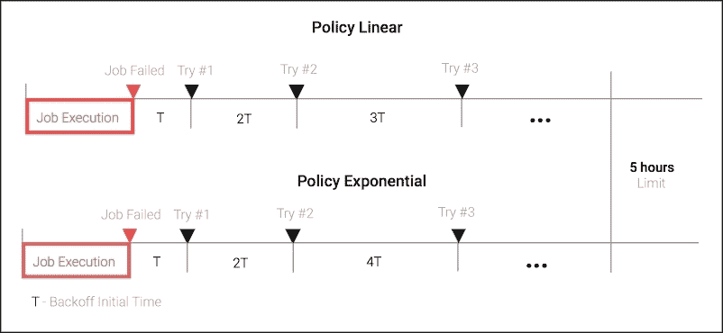

# 第七章. 探索 JobScheduler API

到目前为止，我们一直在使用 Handler 中的时间条件来安排短期未来的后台工作，以及使用 Android Alarm Manager 来安排长期未来的工作。

那些能够在未来确切和不确切的时间执行未来任务的 API 用于触发事件、在后台刷新数据或执行无需用户干预的任务。我们在上一章中详细介绍的 AlarmManager 能够唤醒设备从深度空闲状态，并在不考虑设备电池状态的情况下执行工作。

在本章中，我们将学习如何与 JobScheduler 一起工作，在满足多个前提条件并考虑设备能耗环境的情况下在后台执行任务。

在本章中，我们将涵盖以下内容：

+   JobScheduler 简介

+   设置 JobScheduler 运行标准

+   使用标准控制你的任务执行

+   如何使用 JobService 安排工作

+   使用 JobScheduler 执行重复任务

+   获取待处理的 JobScheduler 计划列表

+   如何在 JobScheduler 中取消任务

# JobScheduler 简介

在项目 Volta 的伞形项目下，Android 开发团队在 API 级别 21 的 Lollipop 版本中引入了一些增强功能和特性，旨在提高 Android 平台上的功耗。除了引入用于监控和跟踪 Android 平台电池使用的工具外，还正式发布了一个用于调度后台任务的新 API，以帮助开发者。当用于支持开发者应用程序的任务不需要执行时间时，它可以节省额外的电力周期，并且可以推迟到设备具有更好的电池和网络环境时再执行。

API 的创建并非为了完全替代 `AlarmManager`；然而，`JobScheduler` API 能够执行更好的电池管理并提供额外的行为。

与 Scheduler API 一起引入的主要功能如下：

+   **减少功耗**：作业任务可以延迟，直到设备充电或有规律地批量运行

+   **重启后持久化任务**：我们能够安装跨设备重启持久化任务的作业计划

+   **更好的网络带宽管理**：作业可以延迟，直到有更高带宽的网络可用，例如当 Wi-Fi 网络连接可用时

+   **减少侵入性执行**：作业可以延迟，直到用户不再与设备交互

`JobScheduler` 是一个单例系统服务，我们可以通过一个 `Context` 对象实例来检索，使用类似于以下代码的方式：

```java
JobScheduler js = (JobScheduler)
     getSystemService(Context.JOB_SCHEDULER_SERVICE);
```

`JobScheduler` 单例服务实例对象帮助我们管理正在运行的任务，并提供成员函数来安排、取消和检索延迟作业的列表。

一旦我们有了`JobScheduler`服务的引用，我们可以通过将`JobInfo`传递给`JobScheduler.schedule`函数来安排一个作业：

```java
int schedule(JobInfo job);
```

`JobInfo`是框架中使用的对象，其中我们指定了关于作业本身的所有信息，以及应满足以启动作业执行的所有条件，以及将被启动以执行所需工作的单元`JobService`。

要构建一个`JobInfo`对象，一个常见的工厂模式，被称为软件工程中的`Builder`模式，并在静态内部类`JobInfo.Builder`中实现，可用于构建传递给`JobScheduler`的`JobInfo`对象。该模式为我们提供了一种在干净、逐步的基础上构建多参数`JobInfo`的方法，并使用`Builder`设置函数来定义`JobInfo`参数。

首先，我们将必须使用以下构造函数来构建一个`JobInfo.Builder`对象：

```java
Builder(int jobId, ComponentName jobService)
```

`jobId`是一个内部数字，用于在`JobScheduler`服务中识别您的作业，第二个参数用于设置当系统验证所有先决条件都已满足以执行作业时将被调用的`JobService`派生类。

让我们编写一些代码来展示这一点：

```java
ComponentName jobSrvc= new ComponentName(ctx, MyJobService.class);
JobInfo.Builder jobIBuilder = new JobInfo.Builder(MY_JOB_ID,
                                                  jobSrvc);
```

# 设置运行标准

使用`Builder`对象引用，我们可以开始设置作业参数和先决条件，使用`Builder`对象中可用的成员函数。

让我们考虑几个例子。在我们的第一个例子中，作业应该只在有 Wi-Fi 网络可用时启动，因此为了实现这一点，我们必须使用以下代码来设置网络可用性先决条件：

```java
jobIBuilder.setRequiredNetworkType(JobInfo.NETWORK_TYPE_UNMETERED);
```

无计量网络连接意味着您有一个没有每月数据使用限制的连接，并且当您超过使用限制时不会收费。当未指定网络类型时，作为条件，默认值是`NETWORK_TYPE_NONE`，这意味着作业将在任何网络上下文中运行，甚至在没有网络连接的情况下。除了之前的网络类型标准之外，还有`NETWORK_TYPE_ANY`，它确定作业可以在有网络连接可用时运行。

要指定仅在设备插入并充电时运行的作业：

```java
jobIBuilder.setRequiresCharging(true);
```

当作业仅在设备处于空闲模式时运行：

```java
jobIBuilder.setRequiresDeviceIdle(true);
```

空闲模式意味着作业仅在设备未被使用并且有一段时间未被使用时运行。这可能是在执行更重的计算的最佳时间，因为用户不会注意到设备资源已被分配给您的作业，因此计算不会干扰用户交互。默认情况下，任何作业都不需要空闲模式来运行。

如此持久化您的作业执行，以跨设备重启：

```java
jobIBuilder.setPersisted(true);
```

例如，对于`AlarmManager`作业，如果您的应用程序有权接收完成的启动权限，作业计划将仅在重启后幸存。为了实现这一点，请将以下行添加到`Android Manifest`文件中：

```java
<uses-permission android:name="android.permission.RECEIVE_BOOT_COMPLETED" />
```

在您想要安排周期性任务的情况下，您可以设置后续执行之间的毫秒间隔：

```java
long interval = TimeUnit.HOURS.toMillis(5L);
jobIBuilder.setPeriodic(interval);
```

这是一个不精确的间隔，因为 Android 系统会尝试将任务分批处理以节省一些电池周期。

当您想定义一个最大延迟时间来运行您的任务时，我们可以指定一个时间截止点，任务必须在此时间运行，然后它将运行，无论其他准则是否满足：

```java
long maxExecutionTime = TimeUnit.MINUTES.toMillis(5L);
jobIBuilder.setOverrideDeadline(maxExecutionTime);
```

在下面的代码中，我们将一个小时设置为延迟执行这个任务的最大时间，因此，如果其他先决条件未满足，一个小时后，系统将独立于其他准则运行这个任务：

```java
jobIBuilder.setOverrideDeadline(TimeUnit.HOURS.toMillis(1L));
```

另一方面，我们也可以将一个最小延迟时间指定为这个任务的准则：

```java
jobIBuilder.setMinimumLatency(TimeUnit.SECONDS.toMillis(120));
```

使用上述值，我们的任务将不会在接下来的`120`秒内运行，因为我们已经将最大延迟时间作为任务的先决条件。

### 注意

`setMinimumLatency`和`setOverrideDeadline`不适用于周期性任务，应避免在周期性任务计划中使用这些准则。如果这些准则中的任何一个在周期性任务中使用，当调用构建时将抛出`IllegalArgumentException`异常。

当任务失败时，为了指定重试策略，我们必须指定`backoff`初始值，该值决定了重试之间的间隔和重试增加策略。`JobScheduler` API 提供了两种策略，定义了重试时间在后续尝试之间增加的方式：

+   `BACKOFF_POLICY_LINEAR`: 重试之间的间隔时间呈线性增长—`initial_backoff_millis * num_retries`

+   `BACKOFF_POLICY_EXPONENTIAL`: 重试之间的间隔时间呈指数增长—`initial_backoff_millis * 2 ^ (num_retries)`

退避间隔将增加，直到达到五小时的退避时间（`JobInfo. MAX_BACKOFF_DELAY_MILLIS`），初始默认值是`30`秒（`JobInfo .DEFAULT_INITIAL_BACKOFF_MILLIS`）。

现在，在下面的示例中，我们将向您展示如何为我们的`jobInfo`对象创建线性退避策略和指数退避策略：

```java
// Initial Backoff of 10 minutes that grows linearly
jobIBuilder.setBackoffCriteria(TimeUnit.MINUTES.toMillis(10L),
JobInfo.BACKOFF_POLICY_LINEAR);

// Initial Backoff of 3 minutes that grows exponentially
jobIBuilder.setBackoffCriteria(TimeUnit.MINUTES.toMillis(3),
JobInfo.BACKOFF_POLICY_EXPONENTIAL);
```

`builder`类还提供了一个方法，用于设置一些参数，以便通过`PersistableBundle`对象传递任务：

```java
PersistableBundle bundle = new PersistableBundle();
bundle.putInt(MY_JOB_ARG1,2);
jobIBuilder.setExtras(bundle);
```

### 注意

`PersistableBundle`是一种特殊类型的包，可以保存和稍后恢复。其主要目的是将参数传递给延迟任务执行。

一旦我们有了安排我们定义的任务的所有准则，我们就能构建我们的`JobInfo`并使用它将任务执行纳入我们的应用程序：

```java
JobInfo.Builder jobIBuilder = ...
// Set Criterias
JobInfo jobInfo = jobIBuilder.setRequiresCharging(true)

setRequiresDeviceIdle(true).
                                             ...
                                             build();
```

# 安排任务

已经定义了准则并且有了`JobInfo`对象，我们就拥有了设置我们应用程序任务所需的所有实体。所以现在让我们通过一个真实示例向您展示如何创建一个任务。

我们的示例将使用调度器 API 安排的作业同步存储在设备文件中的用户账户信息与 HTTP Web 服务。用户界面将提供一个 UI，我们可以在此处更新用户信息，一个按钮用于将信息保存到内部文件，以及一个按钮用于设置同步作业，该作业将上传账户信息到 Web 服务。

首先，让我们定义我们的作业先决条件和参数：

+   我们的作业应该在设备充电时运行以节省电池

+   我们的作业应该在未计费的网络可用时运行以节省移动网络带宽

+   我们的作业应该在设备空闲时运行，因为我们不希望降低 UI 的响应速度

+   我们的作业必须在安排后至少运行一次，在八小时内

+   我们的作业应该在设备重启后仍然运行

`JobInfo`对象需要一个`ID`来在所有`JobSchedule`方法中标识作业，因此为了确保一致性，使用一个`public static int`来标识它是一个好主意：

```java
  static final int ACC_BACKUP_JOB_ID ="AccountBackJobService"
  hashCode();
```

后续调用取消或列出作业创建必须使用在此处定义的相同`jobId`。

由于我们在设备内部使用文件存储账户信息，因此用于检索账户信息的文件名需要作为参数传递给作业。同样的原则也适用于远程 Web 服务端点。

为了转发所需的参数，我们必须构建`PersistableBundle`，将文件名和端点路径作为包参数传递：

```java
private static final String SYNC_FILE = "account.json";
private static final String SYNC_PATH = "account_sync";
private static final String SYNC_PATH_KEY = "path";
...
PersistableBundle bundle = new PersistableBundle();
// Forward filename where the account information is stored
bundle.putString(SyncTask.SYNC_FILE_KEY,SYNC_FILE);
// Forward the HTTP Path used to upload the account information
bundle.putString(SyncTask.SYNC_PATH_KEY,SYNC_PATH);
```

一旦声明了标准并且我们有了服务的标识符和类名，我们就能够使用`Builder`内部类创建我们的`JobInfo`，如下面的代码所示：

```java
ComponentName serviceName = new ComponentName(this,
  AccountBackupJobService.class);

// Setup the Job Information and criterias over a builder
JobInfo jobInfo = new JobInfo.
   Builder(ACC_BACKUP_JOB_ID, serviceName)
    .setRequiresCharging(true)
    .setRequiredNetworkType(JobInfo.NETWORK_TYPE_UNMETERED)
    .setRequiresDeviceIdle(true)
    .setPersisted(true)
    .setOverrideDeadline(TimeUnit.HOURS.toMillis(8L))
    .setExtras(bundle)
    .build();
```

现在我们已经准备好使用`JobScheduler`服务来安排作业：

```java
// Get a Reference to the Service
JobScheduler jobScheduler = (JobScheduler) 
   getSystemService(JOB_SCHEDULER_SERVICE);

int result = jobScheduler.schedule(jobInfo);

if ( result == JobScheduler.RESULT_FAILURE ) {
  // Failed to setup the job 
  Toast.makeText(AccountInfoActivity.this, 
                 "Failed to setup a sharedpref backup job", 
                 Toast.LENGTH_SHORT).show();
} else {
  // Schedule Success 
  Toast.makeText(SharedPrefActivity.this,
                 "SharedPrefBack job successfully scheduled",
                 Toast.LENGTH_SHORT).show();
}
```

如果失败，JobScheduler 的`schedule`方法将返回`RESULT_FAILURE`，在成功的情况下将返回我们在`JobInfo.Builder`构造函数中定义的作业标识符。

现在，既然我们已经安排了我们的作业，是时候在`JobService`子类中编写备份行为。在下一节中，我们将详细介绍如何实现一个与`JobScheduler`框架良好协作的`JobService`。

# 实现`JobService`

我们的`JobService`子类是即将执行艰苦工作并接收回调的实体，一旦满足`JobInfo`中指定的所有标准。为了实现我们自己的服务，我们必须从`JobService`扩展并重写启动和停止回调，如下面的代码所示：

```java
public class AccountBackupJobService extends JobService {
    @Override
    public boolean onStartJob(JobParameters params) {
      // Start your job here
        return false;
    } 
    @Override
    public boolean onStopJob(JobParameters params) {
        // Stop your job here
        return false;
    }
}
```

`onStartJob`回调函数在主线程上运行，如果作业需要进行异步处理，则应返回`true`以指示它仍在后台线程上执行工作。`callback`函数还接收`JobInfo`包中指定的额外参数。

`onStopJob`在系统需要取消作业执行，因为`jobInfo`中指定的标准不再满足时自动调用。

例如，我们的任务需要在设备处于空闲状态时运行，因此，如果设备因为用户开始与设备交互而离开空闲模式，`onStopJob`将被调用以暂时放弃执行。

在这个函数中，我们应该释放分配给我们的任务的任何资源，并停止任何正在进行的后台处理。这个返回`boolean`类型的函数将指示你是否希望根据在任务创建时指定的相同标准重试此任务，或者放弃任务执行。你应该使用`true`来根据在任务创建期间指定的重试标准重新安排此任务。

在我们添加服务业务逻辑之前，我们必须将我们的`Service`类添加到`AndroidManifest.xml`中，并且我们必须使用`android.permission.BIND_JOB_SERVICE`权限保护我们的服务：

```java
<service 
   android:name=".chapter7.AccountBackupJobService"
   android:exported="true"
   android:permission="android.permission.BIND_JOB_SERVICE" />
```

关于你的`JobService`实现有两个重要的事情需要记住：

1.  一、`onStartJob`和`onStopJob`回调将在主线程上运行，你有责任将你的服务的长时间运行执行转移到单独的线程上，以防止由于主线程中的阻塞操作而在你的应用程序中出现任何 ANR 对话框。

1.  第二，当你的`JobService`回调正在运行或直到你明确调用`jobFinished`方法（在这种情况下，你在`onStartJob`函数中返回`true`）时，Android 系统将为你获取并保持一个`WakeLock`。如果你不这样做，告诉系统你的任务执行已完成。`WakeLock`将保持你的设备唤醒，并浪费你的设备电池。这可能会让用户生气，并成为用户卸载应用程序的原因，因为你的应用程序会浪费资源、电池，并影响用户体验。

现在我们已经学习了关于`JobService`的理论，让我们编写代码，在后台处理线程上执行与远程服务器的账户同步操作，而不是在主线程上。

考虑到到目前为止学习的 Android 结构，我们将使用在第三章中学习的`AsyncTask`结构，*探索 AsyncTask*，因为它简单，并创建一个用于上传账户信息的`AsyncTask`子类：

```java
public class Result<T> {
    public T result;
    public Exception exc;
}

public class SyncTask extends 
  AsyncTask<JobParameters, Void, Result<JobParameters>> {

  // Parameter Keys for parameter arguments
  public static final String SYNC_FILE_KEY = "file";
  public static final String SYNC_ENDPOINT_KEY = "http_endpoint";

   // Variable used to store a reference to the service
  private final JobService jobService;

  // Constructor
  public SyncTask(JobService jobService) {
        this.jobService = jobService;
  } 
  ...
}
```

作为起点，我们指定了通用的`AsyncTask`类参数类型，将`JobParameters`设置为`doInBackground`的参数，将`Result`设置为从`doInBackground`返回的类型，并将其传递给`onPostExecute`函数。

然后，我们创建用于在 bundle 中传递信息的最终常量键。

`Result`类型也会从之前的会话中恢复，以便在后台执行过程中发生错误时返回错误。

不深入细节，我们将实现负责将数据上传到远程 Web 服务的`doInBackground`代码：

```java
@Override
protected Result<JobParameters> doInBackground(
  JobParameters... params) {

  Result<JobParameters> result = new Result<JobParameters>();
  HttpURLConnection urlConn = null;
  try {
    URL url;
    ...
         // Retrieve the file to upload from the parameters
         // passed in 
    String file = params[0].getExtras().
                                  getString(SYNC_FILE_KEY);
         // Remote WebService Path
    String endpoint = params[0].getExtras().
                             getString(SYNC_ENDPOINT_KEY);
    url = new URL ("http://<webs_host>:<webs_port>/" 
                        + endpoint);
    ...
    // Load the account information stored internally
    String body = Util.loadJSONFromFile(jobService, file);
    // Write the information to the remote service
            uploadJsonToServer(urlConn, body);
    // Process Server Response
         ...
  } catch (Exception e) {
    result.exc = e;
  } finally {
     if ( urlConn != null) {
      urlConn.disconnect();
     }
  }
  return result;
}
```

为了简洁，这里省略了一些实现细节，但我们已经实现了`doInBackground`函数来读取存储在设备文件上的内部 JSON 数据，并通过`HttpURLConnection`上传它。显示表单的 Android `Activity`会将按钮保存并同步到最终用户。当按下**保存**按钮时，会将账户信息存储在`account.json`本地文件中。

当点击**同步**按钮时，将安排与我们的远程 HTTP 服务器同步数据的任务。当我们定义的作业标准得到满足时，`doInBackground`会被调用以在后台执行同步过程。

现在我们有了上传数据到我们服务器的代码，让我们通过处理响应和服务器错误来完成它：

```java
try {
  ...
  int resultCode = urlConn.getResponseCode();
  if ( resultCode != HttpURLConnection.HTTP_OK ) {
    throw new Exception("Failed to sync with server :" + 
        resultCode);
  }
  result.result = params[0];
...
```

当发生异常时，例如服务器宕机或发生服务器内部错误，异常会通过我们的`Result`对象传播到`onPostExecute`以进行进一步处理。

注意，我们正在小心处理错误情况，因此，为了将后台工作的结果通知用户，我们将编写一个在主线程上运行的`onPostExecute`函数，该函数将发布一个系统通知，告知用户任务是否成功完成或彻底失败：

```java
@Override
protected void onPostExecute(Result<JobParameters> result) {

  NotificationCompat.Builder builder =
    new NotificationCompat.Builder(jobService);
  ...
  if ( result.exc != null ) {
    // Error handling 
    jobService.jobFinished(result.result, true);
    builder.setContentTitle("Failed to sync account")
    .setContentText("Failed to sync account " + result.exc);
  } else {
    // Success handling
    builder.setContentTitle("Account Updated")
      .setContentText("Updated Account Sucessfully at " + 
             new Date().toString());
    jobService.jobFinished(result.result, false);
  }
  nm.notify(NOTIFICACTION_ID, builder.build());
}
```

当任务完成时，我们调用`jobFinished(JobParameters params, boolean needsRescheduled)`来让系统知道我们已完成该任务；然而，当发生异常时，我们通过将第二个`jobFinished`参数设置为`true`来通知系统我们未能成功完成任务。

当一个完成的作业失败并需要重新安排时，我们将第二个`jobService.jobFinished`参数传递为`false`，调度器 API 将使用`JobInfo`对象中指定的回退时间重新安排我们的作业。然而，由于我们的作业仅在空闲模式下执行，失败的作业将被添加到调度器队列，并在未来的空闲维护窗口中重新执行，而不使用`JobInfo`中指定的回退时间。

总是调用`jobFinished`来释放分配给作业的`WakeLock`，并通知系统它可以处理额外的作业。

如果一切顺利，通知抽屉中应该会出现一个通知，显示成功消息和上次成功同步的时间。

最后，我们可以更新`SyncJobService`代码以启动和停止`SyncTask`的执行：

```java
public class SyncJobService extends JobService {

    private static final String TAG = "SyncJobService";
    SyncTask mJob = null;
    @Override
    public boolean onStartJob(JobParameters params) {
        Log.i(TAG, "on start job: " + params.getJobId());
        if ( mJob != null ){
            mJob = new SyncTask(this);
            mJob.execute(params);
            return true;
        }
        return false;
    }

    @Override
    public boolean onStopJob(JobParameters params) {
        Log.i(TAG, "on stop job: " + params.getJobId());
        if ( mJob != null ){
            mJob.cancel(true);
            mJob = null;
        }
        return true;
    }    
}
```

# 列出挂起的作业

与`AlarmManager` API 不同，调度器 API 提供了列出您应用程序所有挂起计划的能力。这个实用的功能可以帮助我们识别将要执行的作业，并相应地处理该列表。检索到的列表可以帮助我们定位我们想要取消的挂起作业。

`JobScheduler`服务类有一个具有以下签名的`instance`方法：

```java
public List<JobInfo> getAllPendingJobs();
```

此方法将返回一个`JobInfo`对象列表，我们可以使用它来观察在构建工作期间的工作参数集：

+   每个工作的工作标准：

    +   `getNetworkType()`

    +   `isRequireDeviceIdle()`

    +   `isRequireCharging()`

    +   `getMinLatencyMillis()`

    +   `isPeriodic()`

    +   `getIntervalMillis()`

    +   `isPersisted()`

    +   `getMaxExecutionDelayMillis()`

+   将由`JobScheduler`回调以执行作业的`JobService`子类——`getService()`

+   作业参数：`getExtras()`

+   重试策略：`getInitialBackoffMillis()`和`getBackoffPolicy()`

好的，现在我们准备好创建一个 Activity 来打印我们应用程序的待处理工作列表：

```java
public class JobListActivity extends Activity {

  @Override
  protected void onCreate(Bundle savedInstanceState) {
   ...
JobScheduler jobScheduler = (JobScheduler)
       getSystemService(JOB_SCHEDULER_SERVICE);

    // Get the list of scheduled jobs
    List<JobInfo> jobList = jobScheduler.getAllPendingJobs();
    // Initialize the adapter job list
    JobListRecyclerAdapter adapter = 
      new JobListRecyclerAdapter(this, jobList);

    rv.setAdapter(adapter);
    // Set the Job Counter
    TextView jobCountTv = (TextView)findViewById(R.id.jobCount);
    jobCountTv.setText(Integer.toString(jobList.size()));
  }
}
```

为了在 UI 中列出待处理的工作，我们使用了支持库的`RecyclerView`类，它是`ListView`的一个更高级版本，简化了创建大量`Views`的过程。

首先，我们将构建我们的`ViewHolder`来保存将显示`jobId`和`Service`端点的行视图的引用：

```java
public class JobListRecyclerAdapter extends
  RecyclerView.Adapter<JobListRecyclerAdapter.JobViewHolder> {
       …
  public static class JobViewHolder extends
    RecyclerView.ViewHolder {
    // References to the Views
    CardView cv;
    TextView jobId;
    TextView serviceName;

    JobViewHolder(View itemView) {
      super(itemView);
      cv = (CardView)itemView.findViewById(R.id.cv);
      jobId = (TextView)itemView.findViewById(R.id.jobIdTv);
      serviceName = (TextView) 
        itemView.findViewById(R.id.className);
   }
 }
}
```

要将`jobInfo`参数绑定到当前的`ViewHolder`，我们将编写`RecyclerView.onBindViewHolder`来根据当前的`JobInfo`设置信息：

```java
@Override
public void onBindViewHolder(
  JobListRecyclerAdapter.JobViewHolder holder, int position) {
  // Retrieve the job for the current list row
  final JobInfo ji = mJobList.get(position);
  // Update the UI Views with the Job Info
  holder.jobId.setText(Integer.toString(ji.getId()));
  holder.serviceName.setText(ji.getService().getClassName());
}
```

是的，多亏了`getAllPendingJobs`，我们有了我们工作列表，而且我们还可以通过编程方式分析它，以创建围绕当前应用程序情况的行为。

故意省略了一些代码；然而，完整的源代码可以在 Packt Publishing 网站上找到。查看完整的源代码，可以欣赏到如何使用 recycler view 和 card view 构建工作列表 UI。

要完全随意地操作作业，我们只需要在本章中覆盖一个 CRUD（创建、读取、更新、删除）操作——即删除操作。删除作业操作由`cancel`函数提供，将在下一节中详细介绍。

# 取消作业

有一些情况下，我们希望为用户提供取消作业的能力，因为环境情况已经改变或者执行作业不再有意义——例如，用户更改了作业依赖的信息，作业就不再适用。`JobScheduler`服务通过以下`cancel`和`cancelAll`方法为我们提供了作业取消的支持：

```java
void cancel(int jobId);

void cancelAll();
```

第一个方法`cancel(jobId)`允许我们使用从`schedule(JobInfo job)`函数返回的作业标识符或`JobInfo`对象上的`jobId`取消一个特定的作业。

`cancelAll()`方法允许我们取消由当前应用程序通过`JobScheduler`注册的已安排的任务。

使用前一个示例中的`JobInfo`，我们可以通过传递作业标识符来取消一个特定的作业：

```java
  final JobInfo ji = ...;
  JobScheduler jobScheduler = (JobScheduler)
        mContext.getSystemService(mContext.JOB_SCHEDULER_SERVICE);
  // Cancel a Specific Job based on the JobInfo->jobId
  jobScheduler.cancel(ji.getId());
```

每当我们取消一个安排时，该任务将从`JobScheduler`未来执行队列中删除，并且将不再由`SyncJobService`或任何其他`JobService`执行。

# 安排周期性工作

到目前为止，我们已经安排了一次性作业，但你是否知道还有一个选项可以安排在周期性间隔内执行作业。这类作业可能是执行重复备份或重复网络操作（如应用程序用户数据备份）的完美结构。

让我们更新我们的 `AccountInfoActivity` 以安排定期执行账户同步作业。

我们将首先为我们的周期性作业定义一个新的作业标识符：

```java
static final int SYNC_PER_JOB_ID = "SyncJobPerService".hashCode();
```

我们可以像这样安排一个周期性作业，大约每 12 小时执行一次：

```java
JobInfo.Builder builder = new JobInfo.Builder(SYNC_PER_JOB_ID,
   serviceName);
builder.setRequiresDeviceIdle(true)  
  // Persist the schedule across the device reboots
 .setPersisted(true)
 .setPeriodic(TimeUnit.HOURS.toMillis(12L))
  .setRequiredNetworkType(JobInfo.NETWORK_TYPE_UNMETERED)
  .setRequiresDeviceIdle(true)
  .setExtras(bundle);

// Schedule the repeating job
JobScheduler jobScheduler = (JobScheduler) getSystemService(JOB_SCHEDULER_SERVICE);
jobScheduler.schedule(builder.build());
```

现在，我们能够安排在设备空闲且 Wi-Fi 网络可用的情况下定期在后台运行同步作业。作业调度将由系统持久化，并在设备启动后重新启用，直到我们明确取消作业或通过 `cancelAll()` 取消所有作业。

# `JobScheduler` 的应用

`JobScheduler` API 允许我们在满足某些条件下，在未来无需用户干预的情况下异步调度工作。此 API 还能够通过推迟作业执行直到设备充电或连接到非计费网络（如 Wi-Fi 网络）来减少能耗。

理想情况包括诸如可以推迟且不需要精确时间执行的数据库备份、定期上传用户数据到网络以及配置参数的下载等。因此，通常不需要立即运行且数据不需要为用户消费准备好的作业。在不影响用户体验的情况下减少应用程序的能耗将增加设备电池寿命，从而提高用户体验。

`JobScheduler` 可以覆盖大多数 `AlarmManager` 的用例，尽管它提供了优化设备资源获取的高级功能。作为附加功能，此 API 提供了一种创建在设备关闭和重启后仍然有效的调度方式。

唯一的缺点是 `JobScheduler` 仅在 Android 5.0（Lollipop）中引入。因此，您需要将应用程序的目标设置为 API 版本 21 或更高版本，以与该 API 交互。

在 2016 年 7 月撰写本文时，45% 的 Android 设备运行支持 `JobScheduler` 的 Android 版本。要获取关于按版本划分的 Android 市场份额的最新信息，请查看 Android 开发者仪表板。

# 摘要

在本章中，我们探讨了 `JobSheduler` API，并展示了如何使用它来安排在满足我们定义的一组条件时启动的后台工作。

我们详细学习了如何设置 API 支持的不同标准，以及如何根据 `JobInfo` 对象进行调度，该对象在设备充电且未使用时启动作业。

同时，我们学习了如何实现一个异步的`JobService`，它能够在后台执行行中运行，并通过释放所有获取的资源（`WakeLock`，`...`）来正确完成作业执行。

之后，我们使用`getAllPendingJobs`创建了一个示例代码，用于列出我们应用程序中所有挂起的调度器 API 作业。从示例中，我们学习了如何在我们的应用程序中取消特定作业或所有挂起的作业。

最后，我们使用`JobSheduler` API 构建了一个持久和周期性的调度，它每隔 12 小时唤醒设备并执行我们的作业。

在下一章中，我们将学习如何使用有效的异步库和协议从网络传输数据，而不会耗尽电池。
