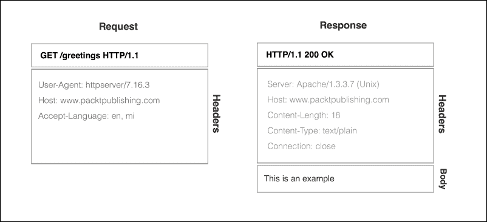

# 第八章。与网络交互

到目前为止，我们一直在使用 HttpURLConnection HTTP 客户端来在网络之间传输数据，例如从 HTTP 服务器下载图像以及与远程 HTTP 服务器同步信息。我们一直在盲目地使用这个 Android HTTP 客户端，而没有深入了解其内部结构和提供的功能，这个框架为我们透明地处理 HTTP 协议。

在本章中，我们将深入了解 HttpURLConnection 的高级功能以及使用 HTTP 协议异步和安全地与远程服务器通信的新技术。

同时，我们将学习如何使用定制的 HTTP 客户端通过安全通道进行通信，调整 HTTP 客户端以处理网络延迟，以及如何与 Web API 交互。

在本章中，我们将涵盖以下内容：

+   介绍 Android HTTP 客户端

+   异步执行 HTTP 请求

+   与 JSON Web API 交互

+   与 XML Web API 交互

+   优化 HTTP 超时

+   通过 SSL 会话安全通信

+   HTTP 开源库

# 介绍 Android HTTP 客户端

近年来，从远程服务器发送和接收数据的能力已成为所有应用程序都应该强制执行的基本功能，以创建动态和令人印象深刻的体验。今天，几乎每个应用程序都使用网络来检索数据信息，执行远程业务逻辑操作，以及下载或上传资源。

应用程序与远程服务器之间的网络交互通常定义为一系列请求/响应消息，这些消息通过网络协议在网络中传输。

通常情况下，HTTP 协议常用于在各个对等体之间传输消息，Android SDK 提供了两个高级 HTTP 客户端，可以直接发送和接收数据：`AndroidHttpClient` 和 `HttpURLConnection`。

HTTP 通信协议是一个无状态的、基于文本的应用协议，由 **互联网工程任务组**（**IETF**）和 **万维网联盟**（**W3C**）维护，并在互联网上广泛用于在客户端（通常称为用户代理）和服务器之间交换数据。

该协议随着时间的推移进行了一些改进，但大多数服务器和客户端基于 HTTP 1.1 的实现，这是原始 HTTP 1.0 的修订版，它引入了连接重用功能和分块传输编码到原始协议中。

在典型的 HTTP 流程中，客户端，即启动操作的实体，通过连接向服务器发送请求并等待服务器的响应。在另一端，服务器从通信通道读取请求，处理请求，并将响应发送回客户端。在下一图中，我们可以可视化两个对等体之间交换的请求和响应示例：



2015 年 5 月发布的新的 HTTP 修订版 2.0 尚未得到广泛采用，并且在 Android SDK 中没有官方支持。

在初步介绍 HTTP 协议之后，我们将尝试比较 Android SDK 上可用的 HTTP 客户端。

## AndroidHttpClient

基于 Apache HTTP 客户端的`AndroidHttpClient`客户端库自 API 级别 9（姜饼）以来已被弃用，但它提供了一个大而灵活的 API，用于支持 cookie 管理、超时自定义、基本身份验证方案和安全通信通道的 HTTP 服务器访问。

在 API 级别 8（蜂巢）和 API 级别 7（闪电）上，此客户端比`HttpURLConnection`更稳定。

在 API 级别 23（棉花糖）中，由于缺乏透明的响应压缩和响应缓存，已移除对此客户端的支持，转而使用`HttpURLConnection`。

## HttpURLConnection

此客户端框架支持安全通信会话（HTTPS）、透明的响应压缩、响应缓存、网络超时自定义、网络连接轮询、IPv6 支持、代理服务器和流式传输。

根据 Google 的说法，在 API 级别 8（蜂巢）之前，此客户端存在一些重要问题，可能会破坏 HTTP 连接的重用。

### 注意

自 Android 4.4（奇巧）以来，此实现引擎基于开源的 OkHttp Square 库。

由于`HttpURLConnection`是 Google 为 API 级别 9 以上的 Android 版本推荐的 HTTP 客户端，因此我们将基于此 HTTP 客户端编写代码示例。然而，通过使用基于 API 级别的不同 Android HTTP 客户端，我们可以超越这种碎片化问题：

```java
if (Build.VERSION.SDK_INT >= 9) {
    // After Gingerbread, use the google recommended
    // client, HttpUrlConnection
    ...
}  else {
    // Prior to Gingerbread, use the Apache based
    // client, AndroidHttpClient
    ...
}
```

在下一节中，我们将开始编写基于`HttpURLConnection`的 HTTP 异步工具包，并探索客户端提供的先进功能，以与远程对等方进行通信。

# 异步执行 HTTP 请求

到目前为止，我们一直在使用`HttpURLConnection`客户端和`AsyncTask`在我们的代码示例中异步检索远程数据。

虽然此解决方案在大多数情况下可以工作，但我们可能会在我们的应用程序中产生大量的重复代码。

在本节中，我们将创建一个整洁的高级异步 HTTP 客户端，以在主线程之外执行远程请求，并使用回调处理程序将请求的结果转发到应用程序的主线程。这种方法与应用程序 UI 模型很好地配合，因为执行在主线程上的回调处理程序能够使用从服务器检索的数据更新 UI。

首先，让我们定义我们的异步客户端应该遵守的基本接口，以在后台执行远程请求：

```java
public interface AsyncHTTPClient {
    void execute(HTTPRequest request, ResponseHandler handler);
}
```

`HTTPRequest`类是一个 Java 模型，用于定义构建 HTTP 请求所需的所有参数。我们将省略一些实现细节，但借助`Builder`类，我们将能够定义 HTTP 请求动词、请求 URL、HTTP 头、HTTP 查询参数和 HTTP 正文：

```java
public class HTTPRequest {

  final Verb mVerb;
  final String mUrl;
  final List<Header> mHeaders;
  final Map<String, String> mParameters;
  final Body mBody;

  private HTTPRequest(Builder builder) {...}
  }
```

`ResponseHandler` 是一个类，它定义了当服务器发送成功或失败响应，或者在操作执行过程中发生异常时将被调用的回调。因此，我们将定义一个抽象的 `ResponseHandler` 类供子类实现：

```java
public abstract class ResponseHandler {

    // Method invoked when a success response is returned
    // 200 Response Code
    abstract public void onSuccess(HTTPResponse response) ;

    // Method invoked when a failure response is returned
    // 4XX, 50X 	
    abstract public void onFailure(HTTPResponse response) ;

    // Method Invoked when an error happens
    abstract public void onError(Throwable error);
}
```

当响应或错误准备好被发送到处理器时，所有回调方法都会自动转发到主线程。所有网络和输入/输出操作以及内存分配都必须在后台线程上完成，以避免任何 UI 不希望的暂停。

当服务器返回 HTTP 响应时，根据响应消息返回的代码，将调用以下方法之一，`onSuccess` 或 `OnFailure`。因此，当任何回调被调用时，将传递一个 `HTTPResponse` 对象以进行进一步处理。

目前，`HTTPResponse` 类携带有关请求代码、响应头和响应体的信息：

```java
public class HTTPResponse {

    final int mResponseCode;
    final List<Header> mHeaders;
    final Body mBody;

}
```

已经定义了基类和接口后，让我们在 `HttpURLConnection` 类的帮助下实现我们的异步高级客户端。

由于我们已经知道如何基于 `AsyncTask` 类构建后台处理管道，为了简单起见，我们将基于这个结构实现我们的实现。将来，你可以用 `AsyncTaskLoader` 替换 `AsyncTask` 以支持配置更改：

```java
 public class HTTPAsyncTask extends
  AsyncTask<HTTPRequest, Void, Result<HTTPResponse>> {

  // Response Handler to be invoked In onPostExecute
  // on the UI Thread
  final ResponseHandler mHandler;

  // Handler is passed on the constructor
  public  HTTPAsyncTask(ResponseHandler handler) {
    this.mHandler = handler;
  }
  ...
}
```

如前述代码所示，我们的 `AsyncTask` 的输入参数类型是 `HTTPRequest`，因此将一个类型为 `Result<HTTPResponse>` 的对象发送到 UI 线程。结果是一个泛型类，如前几章所述，它能够携带错误或 `HTTPResponse` 对象。

已经定义了 `HTTPAsyncTask` 的泛型参数后，现在是我们重写 `doInBackground` 以在后台发送 HTTP 请求并处理响应的时候了：

```java
@Override
protected Result<HTTPResponse> doInBackground(HTTPRequest... params) {

  HTTPRequest request = params[0];
  Body body = null;
  HttpURLConnection conn = null;
  Result<HTTPResponse> response = new Result<HTTPResponse>();
  try {

    // Retrieve the request URL from the request object
    URL url = new URL(request.mUrl);

    // Opens up the connection to the remote peer
    conn = (HttpURLConnection) url.openConnection();

    // Set the HTTP Request verb
    conn.setRequestMethod(request.mVerb);

    // set The HTTP Request Headers
    setRequestHeaders(conn,request);

    // Allows Receiving data on the response
    conn.setDoInput(true);

    // Retrieve the response code
    int responseCode = conn.getResponseCode();

    // Build the HTTP Response Object
    HTTPResponse.Builder builder = new HTTPResponse.Builder()
    .setResponseCode(responseCode);

    // Fill the HTTP Response Headers
    fillHeaders(conn.getHeaderFields(), builder);

    // Read the Body from the Connection Input Stream
    // using a factory
    body = BodyFactory.read(conn.getContentType(),
                              conn.getInputStream());
    // Set the HTTPResponse body
    builder.setBody(body);
    // Build the HTTP Response Object
    response.result = builder.build();
  } catch (Exception e) {
    response.error = e;
  } finally {
    if ( conn != null ) {
      conn.disconnect();
  }
  }
  return response;
  }

// Write any header to the Request Ex: Accept: text/xml
void setRequestHeaders(HttpURLConnection con, HTTPRequest request ) {
  for (Header header : request.mHeaders) {
    con.addRequestProperty(header.getName(), header.getValue());
  }
}
```

`openConnection` 将与 `URL` 对象中指定的资源建立 TCP 连接。一旦建立连接，并且我们尝试检索状态行响应代码时，我们的 HTTP 请求头和体被发送到网络。

一旦读取到状态行，我们就处理接收到的 HTTP 响应头，并将它们存储在我们的响应对象中以供进一步处理。你可能已经知道，HTTP 响应可能包含与请求 URL 上指定的资源相关的 HTTP 消息体数据。

为了进一步处理，数据将从连接的 `InputStream` 中消费，以构建一个 `Body` 对象。为了检测在 HTTP 响应中接收到的数据内容类型，客户端应该查看头 Content-Type 的内容。为了简化这种识别，`HttpURLConnection` 类提供了一个成员方法 `getContentType()`，它直接从头中检索内容。

体的消费和构建是在以下代码中显示的 `BodyFactory` 类上完成的：

```java
public class BodyFactory {

  public static Body read(String mimeType,
                          InputStream is) throws IOException {
    Body result = null;
    if ( mimeType.startsWith("text") ) {
      result = new TextPlainBody(mimeType);
      result.consume(is);
    }    
    return result;
  }
}
```

由于我们知道内容类型，我们准备好消费体并存储在 `Body` 对象上接收的字节，以便由我们的 `ResponseHandler` 进行进一步处理。

`Body` 是一个抽象类，它本身无法读取任何类型的内容，尽管我们可以直接扩展 `Body` 类来从接收到的数据构建文本体。

我们的 `Body` 子类，称为 `TextPlainBody`，将实现抽象的 consume 函数，以便从 `InputStream` 构建体。

```java
abstract void consume(InputStream is)
  throws IOException;
```

为了简洁起见，省略了 `TextPlainBody` 的消费代码，尽管完整的源代码可以从 Packt Publishing 网站下载。查看 `TextPlainBody` 的源代码，以了解我们如何使用 `InputStream` 构建字符串。

目前，我们只支持 `text/*` 类型；然而，在接下来的章节中，我们将扩展 `BodyFactory` 类以支持其他有趣的 MIME 类型，例如 JSON 文档。

一旦完全读取响应体，与远程服务器的连接将被关闭，并且释放连接持有的资源。

### 注意

连接不会立即被销毁，而是推送到连接池以供将来使用。在池中空闲一定时间（`idleTimeout`）后，连接将被销毁。

在 `doInBackground` 执行期间，可能会出现网络或输入/输出异常，为了避免应用程序崩溃，我们必须捕获并将它们通过 `result.error` 传递给 `postExecute` 函数，然后传递给在执行开始时指定的 `ResponseHandler`。

从 AsyncTask 的方法中传播的未检查异常将使我们的应用程序崩溃，因此我们必须仔细测试并在必要时处理这些异常。

为了使我们的 `AsyncTask` 子类有用，我们必须编写 `onPostExecute` 函数，将响应或错误转发到 `ResponseHandler` 对象：

```java
protected void onPostExecute(Result<HTTPResponse> result) {

  if ( result.error != null ) {
    mHandler.onError(result.error);
  } else if ( result.obj.mResponseCode ==
              HttpURLConnection.HTTP_OK ) {
    mHandler.onSuccess(result.obj);
  } else {
    mHandler.onFailure(result.obj);
  }
}
```

### 注意

如前所述，在 第三章 中，*探索 AsyncTask*，`onPostExecute` 回调将在主线程上执行，因此你应该避免在以下回调中进行任何耗时操作：`onError`、`onSucess` 和 `onFailure`。

剩下的只是调用我们的 `AsyncTask`，来自我们的 `AsyncHTTPClient` 子类—`PacktAsyncHTTPClient`：

```java
public class PacktAsyncHTTPClient implements AsyncHTTPClient {

  @Override
  public void execute( HTTPRequest request,
                       ResponseHandler handler) {
    // Execute the HTTP Request on the default AsyncTask Executor
    new HTTPAsyncTask(handler).execute(request);
  }
  ...
 }
```

太好了！现在我们有一个支持文本 MIME 类型的核心异步 HTTP 客户端实现。在下一节中，我们将使用我们的高级客户端从远程服务器检索文本消息。

## 获取文本响应

使用支持文本响应的异步 HTTP 客户端，我们能够利用它来获取动态文本，因此让我们创建一个活动来显示远程 URL 资源上可用的文本。

首先，我们必须使用 `HTTPRequest.Builder` 类构建我们的 `HTTPRequest`：

```java
protected void onCreate(Bundle savedInstanceState) {
   ...
  HTTPRequest.Builder builder = new HTTPRequest.Builder();
  // Set the HTTP Verb to GET
  builder.setVerb(HTTPRequest.Verb.GET);
  // Sets location of the remote resource
  builder.setUrl("http://<hostname>:<port>/greetings");
  // Build the request object
  HTTPRequest request =  builder.build();
  ...
}
```

我们希望引起您的注意，您应该将 `<hostname>` 和 `<port>` 替换为使其适用于您的 HTTP 服务器。

如前所述，为了在我们的异步客户端`AsyncHTTPClient`上执行请求，我们必须向`execute`方法提供一个`ResponseHandler`对象。此外，我们还想定义一个对象，该对象使用获取到的文本更新 UI。

首先，我们将扩展我们的`ResponseHandler`抽象类，创建一个类来处理体内容，并将响应转发给接收文本消息作为输入的回调。

```java
public abstract class TextResponseHandler 
  extends ResponseHandler {
   // Response Callback receiving the string body
    abstract void onSuccess(String response);

    @Override
    public void onSuccess(HTTPResponse response) {
        TextPlainBody body = (TextPlainBody)response.mBody;
        // Invoke the callback that receives a string
        onSuccess(body.getContent());
    }
}
```

接下来，我们需要完成我们的`Activity`代码以发送 HTTP 请求，同时我们还将显示一个进度对话框，让用户意识到后台正在进行某些操作：

```java
HTTPRequest request =  builder.build();
// Create a client Instance object
PacktAsyncHTTPClient client = new PacktAsyncHTTPClient();
// Enable a progress bar
ProgressBar pb =(ProgressBar) findViewById(R.id.loading);
pb.setVisibility(View.VISIBLE);
// Retrieve the response on the background
client.execute(request,textResponseHandler);
...
```

现在，我们只需要定义我们的`textResponseHandler`，这是一个实现了`TextReponseHandler`的匿名内部类，它更新`View`以显示接收到的字符串，并关闭已启用的不确定进度对话框：

```java
TextResponseHandler greetingsHandler = new TextResponseHandler() {

  // Invoked when request was processed with success by the server
  @Override
  void onSuccess(String response) {

    // Update the View with the String received on the 
    // HTTP body
    EditText et = (EditText) findViewById(R.id.inputText);
    et.setText(response);
    dismissProgress();
  }

  // Invoked when the served returned an error
  @Override
  public void onFailure(HTTPResponse response) {
    Log.e("GreetingsActivity", "Server returned an error: " + 
          response.mResponseCode + " " + 
          response.mResponseMessage);
    dismissProgress();
  }

  // Invoked when an error happened
  @Override
  public void onError(Throwable error) {
    Log.e("GreetingsActivity", "Exception happened: " + 
           error.getMessage(), error);
    dismissProgress();
  }  
};
```

注意，所有回调函数都将在主线程上执行，因此在这些函数中，你应该遵循黄金法则，不要阻塞线程，以避免 UI 延迟。

当服务器返回错误或在执行过程中发生异常时，分别调用以下回调方法，`onFailure`和`OnError`。

从远程服务器读取文本资源支持是一个良好的起点，尽管在大多数情况下，我们打算与远程服务器通信以交换结构化文档格式，例如 JSON、XML，甚至是二进制数据。

## 与 JSON Web API 交互

我们之前的`TextResponseHandler`能够处理填充有文本响应的通用响应`HTTPResponse`，并将来自 JSON Web API 的字符串转发给`TextResponseHandler onReceive(String)`回调。

现在，我们想更进一步，将`doInBackground`返回的`HTTPResponse`转换为表示我们业务逻辑中模型的**普通 Java 对象**（**POJO**）。为了实现这一点，我们必须将 HTTP 体上返回的 JSON 结构化内容转换为之前定义的 Java 对象。

为了将处理转发到上面定义的回调，我们将创建`JSONResponseHandler`，它是`ResponseHandler`的抽象子类，实现了`onSuccess(HTTPResponse)`、`onFailure(HTTPResponse)`，并将对象分别转换为`<ResponseType>`和`<ErrorType>`。

```java
public abstract class JsonResponseHandler<ResponseType, ErrorType> extends ResponseHandler {

  abstract public void onSuccess(ResponseType response);
  abstract public void onFailure(ErrorType response);
  ...
}
```

为了支持不同体内容的处理，我们的`BodyFactory`需要更新。因此，在我们继续到`JSONResponseHandler`实现之前，我们将更新我们的`BodyFactory`函数以支持`application/json`媒体类型：

```java
public class BodyFactory {

  public static Body read(String mimeType,
                         InputStream is)
    throws IOException {

    ...
    } else if ( mimeType.startsWith("application/json")){
      result = new RawBody(mimeType);
      result.consume(is);
    }  
    return result;
  }
}
```

注意，我们从网络读取内容，并将数据存储在一个名为`RawBody`的新`Body`类中，该类简单地存储来自 HTTP 响应体的内容，在一个内部字节数据缓冲区中。

### 注意

存储整个体可能适用于我们的简单客户端用例。尽管如此，如果我们愿意处理具有兆字节数据的体，我们必须使用另一种策略来读取和消费体，分块消费体，或将体保存到本地文件系统中。

在设备内存中已经存储了带有 JSON Web API 的体之后，我们准备好使用我们的`JSONResponseHandler`来处理它。

### 将 Java 对象转换为 JSON

为了将 JSON 文档格式转换为普通对象，我们将使用一个在 Android 社区中非常著名的开源库——Google GSON 库：[`github.com/google/gson`](https://github.com/google/gson)。

GSON 库，这是一个由 Google 开发和维护的库，能够将 Java 对象转换为 JSON 对象，反之亦然。

因此，在你继续之前，请确保将库添加到你的 Gradle 或 Eclipse 项目中：

```java
compile 'com.google.code.gson:gson:2.5'
```

为了将协议编码的内容体转换为 POJO，我们将定义`BodyDecoder`接口：

```java
public interface BodyDecoder <T> {
    T decode(Body body) throws Exception ;
}
```

为了将 POJO 转换为`Body`对象，我们将定义`BodyEncoder`接口：

```java
public interface BodyEncoder<T> {
    Body encode(T obj,String mimeType) throws Exception;
}
```

要将 JSON 文档解码为 POJO，我们必须继承这个泛型接口，并编写代码来使用 GSON 库处理 JSON 解码：

```java
public class JSONConverter<POJO> 
  implements BodyEncoder<POJO>, BodyDecoder<POJO> {
  // Store the Generic Type information
  private final Type pojoType;

  JSONConverter(Type pojoType) {
    this.pojoType = pojoType;
  }

  @Override
  public POJO decode(Body body) throws Exception {
    Gson gson = new Gson();
    RawBody rawBody = (RawBody) body;
    InputStream is = null;
    POJO obj = null;
    try {
      is = new ByteArrayInputStream(rawBody.getContent());
      BufferedReader bfReader = 
        new BufferedReader(new InputStreamReader(is));
      obj = gson.fromJson(bfReader, pojoType);
    } finally {
      if (is != null) is.close();
    }
    return obj;
  }
}
```

最后，我们准备好实现我们的泛型`JSONResponseHandler`，它将`onSuccess`和`onFailure`方法返回的转换后的 JSON 结构文档转发到泛型类型`Response`和`Error`。

下面是`JsonResponseHandler`代码的示例：

```java
public abstract class JsonResponseHandler<ResponseType, ErrorType>
  extends ResponseHandler {
   // Store the Response Type class information
    private final Type responseType;
   // Store the Error Type class information
    private final Type errorType;

    JsonResponseHandler(Type responseType, Type errorType) {
        this.responseType = responseType;
        this.errorType = errorType;
    }

  // Callback invoked on the main Thread that converts
  // a body to a POJO object
  @Override
  public void onSuccess(HTTPResponse response) {
    RawBody body = (RawBody)response.mBody;

    if ( body != null ) {
      Response obj = null;
      try {
        obj = new JSONConverter<Response>(responseType).
                decode(body);
        onSuccess(obj); 
      } catch (Exception e) {
        onError(e);
      }

    } else {
      onSuccess((Response)null);
    }
  }
  @Override
  public void onFailure(HTTPResponse response) {...}
}
```

这个泛型类能够消费从`onSuccess`或`onFailure`传递过来的`RawBody`对象，并暴露两个泛型类型参数。第一个`Response`是一个泛型类型，它指定了成功响应（`onSuccess`）的 POJO 类类型，而`Error`泛型类型指定了错误函数（`onFailure`）的 POJO 类类型。

当任何接收`HTTPResponse`的回调函数被调用时，借助 GSON 库，我们将存储在`RawBody`上的 JSON 文档转换为响应/错误对象。

`onFailure`函数被省略了，因为它的代码与`onSuccess`方法非常相似；然而，你可以在 Packt Publishing 网站上查看完整的源代码以了解差异。

最后，我们准备好通过从 HTTP JSON 体中读取一个模型来测试我们的异步客户端：

```java
  Content-Type: application/json

   [
     {
      "userId": 1,
      "id": 1,
      "title": "..",
      "body": "..."
     },...
   ]
```

为了测试我们的客户端，我们将利用`JSONPlaceHolder`（[`jsonplaceholder.typicode.com/`](http://jsonplaceholder.typicode.com/)），一个用于测试和原型设计的假在线 REST API。

在我们尝试访问它之前，让我们定义我们将用于示例的`User` POJO 类：

```java
public class User {
  public int id;
  public String name;
  public String username;
  public String email;
  public String phone;
  public String website;
}
```

然后，我们将为`failure`函数定义一个 POJO 类：

```java
public class Error {
  public int resultCode;
  public String resultMessage;
}
```

为了显示从模拟 API 返回的模型，我们将创建一个新的`UserListActivity`，该活动将实现`JSONResponseHandler`并显示所有用户的姓名和电子邮件，这些信息由从[`jsonplaceholder.typicode.com/users`](http://jsonplaceholder.typicode.com/users)返回的 JSON 文档提供。

让我们先定义一个`JsonResponseHandler<List<User>,Error>`匿名类，该类接收一个用户列表作为成功回调的参数`List<User>`，以及一个`Error`对象作为失败回调的参数。

`onSuccess(List<User>)`将更新一个显示姓名后跟电子邮件的`ListView`：

```java
JsonResponseHandler<List<User>, Error> jsonResponseHandler =
  new JsonResponseHandler<List<User>, Error>(
    new TypeToken<ArrayList<User>>() {} .getType(),
    new TypeToken<Error>() {} .getType()) {
      // On Success Callback
      @Override
      public void onSuccess(List<User> users) {
        // Update the List View with the a List Adapter that displays
        // the user name and email per user
        ListView listView = (ListView) findViewById(R.id.usersList);
        ListAdapter adapter = new UserListAdapter(
          UserListActivity.this, users);
        listView.setAdapter(adapter);
      }
      // Prints the Error object
      @Override
      public void onFailure(Error response) {
        Log.e("UserListActivity",
              "Error happened retrieving greetings " +
              response.toString());
      }
      @Override
      public void onError(Throwable error) {
      // Do Something with the exception
      }
    };
```

剩下的就是编写 Activity 的`onCreate`函数，该函数构建 HTTP 请求并将请求 GET /users 分派给`JSONPlaceHolder` API：

```java
@Override
protected void onCreate(Bundle savedInstanceState) {
  super.onCreate(savedInstanceState);
  setContentView(R.layout.user_list_layout);

  HTTPRequest.Builder builder = new HTTPRequest.Builder();
  // Set the HTTP Verb to GET
  builder.setVerb(HTTPRequest.Verb.GET);
  // Sets location of the remote resource
  builder.setUrl("http://jsonplaceholder.typicode.com/users");

  // Notify the server that the client is able to receive json
  // documents
  builder.addHeader(new Header("Accept","application/json"));
  HTTPRequest request = builder.build();

  PacktAsyncHTTPClient client = new PacktAsyncHTTPClient();
  client.execute(request, jsonResponseHandler);
}
```

当服务器向我们请求发送响应时，`JSONResponseHandler`对象将解码包含 10 个用户的 JSON 文档，并将文档转换为`List<User>`对象。

JSON 数据交换格式因其简单性、可读性、紧凑性和缺乏数据结构刚性，在互联网上部署的大多数最近 API 和 Web 服务中得到了广泛使用。

然而，基于 XML 的远程 Web 服务，主要基于 SOA 数据交换协议，仍然存在，以覆盖我们想要有更严格的数据模型模式验证和建模、内置命名空间支持和高级信息提取工具的高级用例。

尽管基于 XML 的 API 仍然很常见，但基于 XML 的 API 在行业中已经失去了一些吸引力，因此在下一段中，我们将扩展我们的工具集以支持在 HTTP 请求上对 XML 内容的编码和解码。

## 与 XML Web API 交互

在过去的 10 年里，基于 XML 的消息 API 已经成功用于在应用程序和远程服务器之间交换数据（SOAP）和运行远程过程（XML-RPC）。此外，如今，一些 REST API 使用 JSON 和 XML 支持构建，因此开发者需要决定他们是否想使用 XML 或 JSON 文档与 API 交互。

在这个想法的指导下，我们将扩展我们的工具集以交换 XML 消息，以便与远程服务器通信。

在前面的章节中，我们实现了一个`ResponseHandler`来解码 HTTP 主体上发送的 JSON 文档，但现在我们想要更进一步，添加对在 HTTP 请求中发送 XML 文档的支持。

如果我们回顾一下`HTTPAsyncTask`的细节，支持请求体传输所需的代码缺失；因此，这是重写代码以携带 HTTP 请求实体体的完美时机：

```java
@Override
protected Result<HTTPResponse> doInBackground(HTTPRequest... params) {
  ...
  if ( request.mBody != null ) {
    // Allows Sending data on the request
    conn.setDoOutput(true);
    // Specifies The Content-Type based on the Body Mime Type
    conn.setRequestProperty(
      "Content-type", request.mBody.getMimeType());
    // Retrieves the connection stream to write content
    OutputStream os = conn.getOutputStream();
    request.mBody.write(os);
  }
  // Retrieve the response code
  int responseCode = conn.getResponseCode();
  ...
}
```

在前面的代码中，当`HTTPRequest`对象上有可用体时，在我们尝试读取响应状态行的`responseCode`之前，我们从`HttpURLConnection`检索输出流，并将存储在`Body`对象上的内容写入。

除了写入的数据外，`Context-Type` 标头根据正文的多媒体类型设置在 HTTP 请求头部分。

现在，我们已经准备好在 HTTP 请求和响应中发送和接收实体体，因此现在我们可以开始编写我们的 XML 实现示例。

在接下来的段落中，并遵循 JSON 部分，我们将编写将 API 请求序列化为 XML 文档的代码，以及将接收到的 XML 文档反序列化为 API 响应对象的代码。

### 将 Java 对象转换为 XML

要从 Java 对象反序列化和序列化到 XML 以及反之亦然，我们将使用开源库 SimpleXML ([`simple.sourceforge.net/`](http://simple.sourceforge.net/))；因此，为了使用它，请将此库添加到您的应用程序外部依赖项列表中。

如果您使用 Android Studio，以下是在您的 `build.gradle` 依赖项列表中需要添加的内容：

```java
dependencies {
  ...
  compile('org.simpleframework:simple-xml:2.7.+'){
        exclude module: 'stax'
        exclude module: 'stax-api'
        exclude module: 'xpp3'
  }
}
```

在定义了 `User` 模型之后，我们将构建一个名为 `GetUserInfo` 的 `APIRequest`，它将获取请求中提交的用户标识符的用户详细信息（`GetUserInfoResponse`）。

为了进一步描述，让我们定义 API 请求 POJO 对象：

```java
@Root(name = "GetUserInfo")
@Namespace(prefix="p", 
  reference="https://www.packtpub.com/asynchronous_android")
public class GetUserInfo {

    @Namespace(reference=
      "https://www.packtpub.com/asynchronous_android")
    @Element(name="UserId")
    public String userId;
         // … Setters and Getters
}
```

让我们定义 API 响应 POJO 对象：

```java
@Root
@Namespace(prefix = "p",
  reference = "https://www.packtpub.com/asynchronous_android")
public class GetUserInfoResponse {

  @Element(name = "User")
  @Namespace(prefix = "p", 
    reference = "https://www.packtpub.com/asynchronous_android" )
  private User user = new User();
  // … Setters and Getters
}
```

对于其他类，如 `User`、`Address` 和 `Company` 的注解与上面类似，所有元素都引用了 `https://www.packtpub.com/asynchronous_android` 命名空间，因此为了简洁，我们将省略 POJO 的更改。

在完成 Java 对象与 XML 请求和响应消息之间的映射后，让我们开始编写将 `GetUserInfo` 对象转换为 XML 文档的代码。

要将 Java 对象编码为 XML 文档，我们将通过 SimpleXML 的帮助，将这个通用接口子类化，以将 POJO 通用类型编码到 XML 文档中：

```java
public class XMLConverter<POJO>
  implements Encoder<POJO>{

  private final Class<POJO> clazz;
  XMLConverter(Class<POJO> clazz){ this.clazz = clazz; }

  @Override
  public Body encode(POJO obj, String mimeType)
    throws Exception {

    // Creates SimpleXML Serializer Instance
    Serializer serializer = new Persister();
    ByteArrayOutputStream output = new ByteArrayOutputStream();

    // Converts from obj -> xml document
    serializer.write(obj, output);

    // Build a RawBody body
    RawBody body = new RawBody(mimeType);
    output.close();

    // Stores the result on the body
    body.setContent(output.toByteArray());
    return body;
  }
}
```

### 将 XML 转换为 Java 对象

要将 XML 文档解码为 Java POJO 对象，我们将向 `XMLConverter` 类定义接口中添加 `BodyDecoder<POJO>`，并编写使用 SimpleXML 库将 XML 文档转换为 POJO 通用类的代码：

```java
public class XMLConverter<POJO>
  implements BodyEncoder<POJO>, BodyDecoder<POJO> {

  ...
  @Override
  public POJO decode(Body body) throws Exception {
    // Instantiate a SimpleXML Serializer
    Serializer serializer = new Persister();
    InputStream is = null;
    RawBody rawBody = (RawBody)body;
    POJO obj = null;
    try {
      is = new ByteArrayInputStream(rawBody.getContent());
      BufferedReader bfReader =
        new BufferedReader(new InputStreamReader(is));
      obj = (POJO) serializer.read(clazz, bfReader);
    } finally {
      if ( is != null ) is.close();
    }
    return obj;
  }
  ...
}
```

在 XML 序列化和反序列化已经就绪的情况下，让我们开始编写活动，该活动将使用上面定义的 `GetUserInfo` 和 `GetUserInfoResponse` 从远程服务器检索用户信息，并在 UI 上显示用户信息。

为了测试我们的客户端，我们将使用可模拟的 [`www.mockable.io/`](https://www.mockable.io/) 网络应用程序创建一个假 XML WebService。这个网络应用程序允许我们创建可配置的 REST API，它返回静态 JSON 或 XML 文档作为对客户端的响应，因此这个工具将非常有助于在受控环境中测试我们的客户端。

当向以下 URI 发送任何 HTTP 请求时，我们的假 HTTP API 将返回以下 XML 文档，[`demo1472539.mockable.io/GetUserInfo`](http://demo1472539.mockable.io/GetUserInfo)：

```java
<?xml version="1.0"  ?>
<p:GetUserInfoResponse
   >
 <p:User>
   <p:Id>12</p:Id>
   <p:Name>John</p:Name>
   <p:Username>John</p:Username>
   ...
   <p:Company>
        <p:Name>Packt</p:Name>
        ...
    </p:Company>
  </p:User>
  </p:GetUserInfoResponse>
```

为了将`onSuccess(HTTPRequest)`和`onFailure(HTTPResponse)`回调接收到的`HTTPResponse`对象转换为领域模型，我们必须子类化`ResponseHandler`抽象类并创建反序列化通用 POJO 类的代码：

```java
public abstract class XMLResponseHandler
   <Response, Error> extends ResponseHandler {

  // Class used to by Simple to convert to the ResponseTYpe
  private final Class<Response> responseClass;

  private final Class<Error> errorClass;

  XMLResponseHandler(Class<Response> responseClass,
                     Class<Error> errorClass) {
    this.responseClass = responseClass;
    this.errorClass = errorClass;
  }

  // Callback invoked with the converted Response  object instance
  abstract public void onSuccess(Response response);

  // Callback invoked with the converted Error object instance
  abstract public void onFailure(Error response);

  // Convert the body to a POJO object using the our converter
  @Override
  public void onSuccess(HTTPResponse response) {
    RawBody body = (RawBody)response.mBody;

    if ( body != null ) {
      Response obj = null;
      try {
        obj = new XMLConverter<Response>(responseClass)
        decode(body);
        onSuccess(obj);
      } catch (Exception e) {
        onError(e);
      }
    } else { onSuccess((Response)null); }
  }
 //.. Failure elided for brevity
}
```

现在，我们已经准备好收集从我们的模拟服务器发出的`GetUserInfoResponse`，因此让我们在我们的`Activity`中实现一个匿名内部`XMLResponseHandler`子类，该子类将使用用户详细信息更新 UI：

```java
XMLResponseHandler<GetUserInfoResponse, Error> xmlResponseHandler
  = new XMLResponseHandler<GetUserInfoResponse,Error>(
      GetUserInfoResponse.class, Error.class) {

  // Updates the UI with the user details
  @Override
  public void onSuccess(GetUserInfoResponse getUserInfoResponse) {
    TextView nameTv = (TextView)findViewById(R.id.nameValue);
    TextView emailTv = (TextView)findViewById(R.id.emailValue);

    nameTv.setText(getUserInfoResponse.getUser().name);
    emailTv.setText(getUserInfoResponse.getUser().email);

  }
  @Override
  public void onFailure(Error response) {
    // Do Something with the Error 
  }
  @Override
  public void onError(Throwable error) {
    // Do Something with the Throwable
  }
};
```

为了完成我们的`Activity`，我们需要构建请求，并使用`HTTPAsyncTask`类帮助我们的异步客户端在后台执行我们的需求：

```java
HTTPRequest.Builder builder = new HTTPRequest.Builder();
// Set the HTTP POST Verb
builder.setVerb(HTTPRequest.Verb.POST);

// Set location of the remote resource
builder.setUrl("http://demo1472539.mockable.io/GetUserInfo");

// Tell the Server that you are able to consume 
// application/xml contents on the response
builder.addHeader(new Header("Accept", "application/xml"));

// Build the Request Body object
GetUserInfo query = new GetUserInfo();
query.setUserId("123");
try {
  // Encode the POJO into a XML Document
  Body body = new XMLConverter<GetUserInfo>(GetUserInfo.class)
                .encode(query, "application/xml");
  builder.setBody(body);
} catch (Exception e) {
  // Catch and display and error to the user
  ...
}
PacktAsyncHTTPClient client = new PacktAsyncHTTPClient();
client.execute(builder.build(), xmlResponseHandler);
```

一旦从模拟服务器返回响应，UI 将根据模拟端点指定的 XML 更新，以显示用户名、电子邮件和其他属性。

关于错误流程没有提及；然而，我将挑战你创建一个返回错误对象的模拟端点，以练习`onError`回调。带有错误流程的完整源代码可以从 Packt Publishing 网站下载。看看它，以欣赏错误处理是如何实现的。错误 XML 文档可能类似于以下内容：

```java
<?xml version="1.0"?>
<p:Error   
   >
 <p:ResultCode>1000</p:ResultCode>
 <p:ResultMessage>The LDAP Server is down</p:ResultMessage>
</p:Error>
```

到目前为止，我们已经涵盖了在 HTTP 客户端和服务器之间交换数据时在行业中使用的最常见格式（文本、XML 和 JSON）。每种格式都有其自身的优势；然而，由于其紧凑性和简单性（易于解析、语法等），JSON 格式已被 API 设计者、电子产品制造商和**软件即服务（SaaS**）供应商广泛采用。

在此过程中，我们将构建一个核心框架，它可以很容易地扩展以支持不同的数据交换格式，如 YAML 或二进制协议。因此，你可能需要编写自己的`BodyEncoder`、`BodyDecoder`和`ResponseHandler`以适应标准数据格式，甚至是你自己的数据格式。

在本节中，我们将向读者介绍在用于处理请求执行中网络延迟的`HttpUrlConnection`上可用的超时设置。

# 自定义 HTTP 超时

当`HttpUrlConnection`通过低带宽网络（2G、3G 等）连接、读取或写入内容时，不可避免地会暴露于不可预测的通信延迟。此外，除了移动网络延迟外，当 HTTP 服务器在高流量情况下，可能会引入显著的服务延迟（服务器延迟）。

虽然`HttpUrlConnection`使用的默认超时值已经足够长，可以应对这些延迟，但在某些特殊情况下，你可能需要根据你的需求自定义默认值。例如，当前往应用服务器时，HTTP 请求会经过一些代理。

`HttpUrlConnection`提供了两个成员方法，可以用来更改默认的超时时间：

```java
void setConnectTimeout(int timeoutMillis)
void setReadTimeout(int timeoutMillis)
```

`setConnectTimeout(int)`能够重新定义客户端被允许等待的最大时间（以毫秒为单位），直到与远程主机的 TCP 连接建立（服务器关闭）。每当连接失败时，例如，如果服务器关闭或由于资源不足无法及时响应，将抛出`ConnectTimeoutException`，因此你应该小心处理这个异常，并在你的代码中干净地处理它。

当主机名解析为多个地址时，客户端将依次尝试连接，超时将适用多次。如果超时设置为`0`，连接将被阻塞，直到 TCP 超时到期，在 Android 上这通常是几分钟。

`setReadTimeout(int)`定义了客户端被允许在读取操作上阻塞的最大时间，直到允许读取任何可用数据。默认值`0`将无限期地阻塞读取操作，直到数据变得可用、远程对等方断开连接或套接字上发生错误。当超时时间大于`0`且超时到期时没有数据可用，将抛出`SocketTimeoutException`。

现在我们已经理解了每个超时时间的含义，让我们更新我们的`HTTPRequest.Builder`，添加一些新的设置方法：

```java
public class HTTPRequest {
  ...
  public static class Builder {

    private int mReadTimeout = 0; // Default Value
    private int mConnectTimeout = 0; // Default Value

    public void setConnectTimeout(int connectTimeoutMs) {
      this.mConnectTimeout = connectTimeoutMs;
    }
    public void setReadTimeout(int readTimeoutMs) {
      this.mReadTimeout = readTimeoutMs;
    }
  }
}
```

最后，我们必须更新`HTTPAsyncTask`，以设置在`HTTPRequest`上指定的超时，在用于连接远程服务器的`HttpURLConnection`对象上：

```java
public class HTTPAsyncTask extends 
  AsyncTask<HTTPRequest, Void, Result<HTTPResponse>> {
   @Override
   protected Result<HTTPResponse> doInBackground(
    HTTPRequest... params) {    
      conn = (HttpURLConnection) url.openConnection();
      conn.setReadTimeout(request.mReadTimeout);
      conn.setConnectTimeout(request.mConnectTimeout);
      ...
  }
}
```

强烈建议你在几个网络延迟级别下测试你自定义的超时设置，并考虑到当服务器负载时，它可能延迟响应几秒钟的时间。

典型的网络延迟可能在 LTE 移动网络上从 80-120 毫秒到 GPRS 移动网络上的 150-550 毫秒不等。

当你在互联网上运行应用程序并需要处理敏感数据，例如个人信息、支付信息或商业文件时，使用一层安全层来保护你的通信渠道，以隐藏交换的数据免受外部攻击者或避免任何欺骗攻击，这一点非常重要。在下一节中，我们将扩展我们的高级客户端以支持到远程服务器的安全 SSL 连接通道。

# 在 SSL 会话中安全通信

到目前为止，我们一直使用普通连接与远程 HTTP 服务器进行通信。尽管这些类型的连接在交换的数据不敏感时可能符合你的应用程序需求，但有些情况下我们必须使用安全通道来发送或接收数据，以防止第三方读取或更改网络上交换的数据。

为了与远程服务器设置 SSL 会话，我们的客户端在加密工具的帮助下将创建一个加密通信通道，其中所有数据都使用在安全连接握手期间交换的秘密密钥进行加密的对称加密。除此之外，使用先前交换的秘密密钥接收和加密的内容将与其他对等公钥进行验证，以证明数据是从正确的来源发送和签名的。

在建立连接的过程中，作为 SSL 握手的一部分，服务器必须证明它持有受信任证书的私钥。受信任的证书是指可以从我们的受信任**证书颁发机构**（**CA**s）列表中获取的证书，或者它是由您的受信任 CA 之一签发的。

### 注意

Android 平台自带一组知名受信任的 CA 列表，帮助我们确保大多数互联网上服务器的身份。

因此，当我们联系由知名 CA 签发的证书的服务器时，之前用于创建 HTTPS 连接的代码不需要任何更改：

```java
URL url = new URL("https://packtpub.com");
con = (HttpsURLConnection) url.openConnection();
```

此代码示例将创建一个使用 Android 平台默认加密加密套件的 SSL 连接，并验证服务器是否与平台 CA 相匹配。

尽管这在大多数情况下都能工作，但可能需要使用特定的 CA、一组受信任的证书，或者仅使用最安全的加密套件（TLSv1）。在开发者必须构建自己的`SSLContext`并指定自己的`TrustManagers`和`KeyManagers`以成功连接到远程服务器的情况下。

在接下来的段落中，我们将扩展我们的客户端以使用存储在 Java 密钥库中的私钥和 CA，以便验证和与由我们管理的**证书颁发机构**（**CA**）管理的服务器进行通信。

首先，我们将创建一个`SSLOptions`类，在该类中我们定义了在 SSL 会话中想要使用的加密套件：

```java
public class SSLOptions {

  enum CipherSuite {
    DEFAULT("Default"), // Supported on Android API Level > 9
    SSL("SSL"), // Supported on Android API Level > 9
    SSLv3("SSLv3"), // Supported on Android API Level > 9
    TLS("TLS"), // Supported on Android API Level > 1
    TLSv1("TLSv1"), // Supported on Android API Level > 1+
    TLSv1_1("TLSv1.1"), // Supported on Android API Level > 16+
    TLSv1_2("TLSv1.2"); // Supported on Android API Level > 16+
 ...
  }
  // Cipher Suite used on the connection
  final CipherSuite cipherSuite; 
  final SSLContext sslContext;

  public SSLOptions(Context ctx, Builder builder)
    throws Exception {
    ...
    // Build up our own SSLContext
    sslContext = SSLContext.
    getInstance(cipherSuite.toString());
 // Will use the Android default KeyManager and TrustManager
    sslContext.init(null,null,new SecureRandom());
  }  

  public static class Builder {   
    private CipherSuite cipherSuite = CipherSuite.DEFAULT;
    ...         
    SSLOptions build(Context ctx) throws Exception {
      return new SSLOptions(ctx, this);
    }
  }
}
```

通过前面的代码，我们能够控制`SSLContext`使用的加密套件；然而，为了使用我们自己的私钥、证书和受信任的 CA，我们必须使用自己的`TrustManager`和`KeyManager`初始化`SSLContext`：

```java
void init(KeyManager[] km, TrustManager[] tm, SecureRandom sr)
```

为了简单起见，我们将从存储在应用程序资源目录中的密钥库文件中加载我们的`KeyManagers`和`TrustManager`。Java 密钥库可在 Packt Publishing 网站上找到。因此，在我们继续之前，请从 Packt 网站下载`asynchronous_client.ks`文件，其中包含一个可用的私钥、一个证书以及作为受信任权威机构签发证书的自定义 CA 证书。

### 注意

注意，您可以构建自己的`TrustManager`和`KeyManager`自定义子类，可以从不同的来源加载私钥和证书，但为了简单起见，我们将从文件中加载它们。

让我们借助 keytool 应用程序查看我们的 `asynchronous_client.ks java` 密钥库文件。

在命令行中，请运行以下命令以列出密钥库的内容：

```java
keytool -list -v -keystore asynchronous_client.ks -storetype BKS provider org.bouncycastle.jce.provider.BouncyCastleProvider providerpath bcprov-jdk15on-146.jar

Alias name: asynchronous_client
Entry type: PrivateKeyEntry
Certificate[1]:
Owner: C=UK,ST=Birmingham,L=Birmingham,O=Packt Publishing,OU=Packt Publishing,CN=asynchronous_client
Issuer: C=UK,…,CN=packt
Certificate[2]:
Owner: C=UK,…,CN=packt

Alias name: ca
Entry type: trustedCertEntry
Owner: C=UK,…,CN=packt
Issuer: C=UK,…,CN=packt
```

我们的自定义密钥库文件，它将作为受信任的存储文件和密钥库文件，包含一个名为 `asynchronous_client` 的公钥和私钥以及一个名为 ca 的受信任 CA。keytool 需要 Bouncy Castle 提供者 JAR 来读取文件内容，因此，请在此之前从 Packt 网站下载该文件。

注意，由于我们有 `C=UK`，`ST=Birmingham`，`L=Birmingham`，`O=Packt Publishing` 和 `CN=packt` 作为受信任 CA，我们将允许我们的 HTTP 连接到由该机构签署的 SSL 端点或所有中间证书都值得信赖的证书（一个受信任的证书链）。

### 注意

每个 Android 设备都预装了一个受信任证书列表，这些证书可以用来验证一个安全的远程对等实体。

既然我们已经了解了密钥库和受信任存储库的详细信息，让我们更新我们的 SSL 选项以从 `asynchronous_client.ks` 加载 `KeyManager` 和 `TrustManager`：

```java
public class SSLOptions {
  final CipherSuite cipherSuite; 
  final SSLContext sslContext;
  private final  String keyStore;
  private final String keyStorePassword;
  private final String trustStore;
  private final String trustStorePassword;
  ...

  public SSLOptions(Context ctx, Builder builder)
    throws Exception {
    ...
    sslContext = initSSLContext(ctx);
  }
  // Initialize the SSLContect with loaded 
  private SSLContext initSSLContext(Context ctx)
    throws Exception {

    KeyManagerFactory kmf = getKeyManagerFactory(ctx);
    TrustManagerFactory tmf = getTrustManagerFactory(ctx);
    // Use the cipher suite defined SSL, SSLv3 , TLS, TLSv1,
    SSLContext result = SSLContext.getInstance(
                          cipherSuite.toString());

    result.init( kmf != null ? kmf.getKeyManagers() : null ,
                 tmf != null ? tmf.getTrustManagers() : null,
                 new SecureRandom());
    return result;
  }
}
```

注意，我们使用 `KeyManagerFactory` 和 `TrustManagerFactory` 返回的 Keymanager 列表和 `TrustManager` 列表初始化 SSLContext。因此，下一步是编写代码成员方法来获取我们的工厂。所以，让我们从 `getKeyManagerFactory` 开始：

```java
KeyManagerFactory getKeyManagerFactory(Context ctx)
  throws Exception {
  KeyManagerFactory kmf = null;
  // Initialize Key store
  if ( keyStore != null ) {
    // Load the file keystore from the assets directory
    InputStream keyStoreIs = ctx.getResources().
                              getAssets().open(keyStore);
    String algorithm = KeyManagerFactory.getDefaultAlgorithm();
    kmf = KeyManagerFactory.getInstance(algorithm);

    // Create BouncyCastle Key Store 
    KeyStore ks = KeyStore.getInstance("BKS");

    // Load the Keymanagers available on the file using
    // a password
    ks.load(keyStoreIs, keyStorePassword.toCharArray());
    kmf.init(ks, keyStorePassword.toCharArray());
  }
  return kmf;
}
```

之前的代码将从我们之前准备的 BCS 密钥库中加载一个公钥和私钥。因此，剩下的就是 `getTrustManagerFactory` 函数，用于加载我们的受信任 CA：

```java
TrustManagerFactory getTrustManagerFactory(Context ctx)
  throws Exception {

  TrustManagerFactory tmf = null;

  if ( trustStore != null) {
    InputStream keyStoreIs = ctx.getResources().
                               getAssets().open(trustStore);
    String algorithm = TrustManagerFactory.getDefaultAlgorithm();
    tmf = TrustManagerFactory.getInstance(algorithm);
    KeyStore ts = KeyStore.getInstance("BKS");
    ts.load(keyStoreIs, trustStorePassword.toCharArray());
    tmf.init(ts);
  }
  return tmf;
}
```

现在我们有了 `SSLOptions` 类来初始化我们的 `SSLContext`，让我们继续到 `HTTPRequest` 并更新我们的 `Builder` 以存储 `SSLOptions`：

```java
public class HTTPRequest {

  final SSLOptions mSSLOptions;

  private HTTPRequest(Builder builder) {
    this.mSSLOptions = builder.mSSLOptions;
  }

  public static class Builder {
    ...
    private SSLOptions mSSLOptions = null;

    public Builder setSSLOptions(SSLOptions options) {
      this.mSSLOptions = options;
      return this;
    }
  }
  ...
}
```

最后，我们准备更新我们的 `HTTPAsyncTask` 以使用我们的 `SSLOptions` 对象来自定义我们的 SSL 客户端端点。因此，我们将能够验证由我们自己的 CA 签署的证书的服务器身份（`C=UK`，`ST=Birmingham`，`L=Birmingham`，`O=Packt Publishing`，`CN=packt`）以及反之亦然：

```java
@Override
protected Result<HTTPResponse>
doInBackground(HTTPRequest... params) {
  // Retrieve the request URL from the request object
  URL url = new URL(request.mUrl);
  // Opens up the connection to the remote pper
  conn = initConnection(request, url);
  ...
}

HttpURLConnection 
initConnection( HTTPRequest request, URL url) throws IOException {

  HttpURLConnection genCon = (HttpURLConnection) url.
                             openConnection();

  if ( url.getProtocol().equals("https") ) {
    HttpsURLConnection con = (HttpsURLConnection) genCon;
    // Apply our SSL Options to the connection
    if ( request.mSSLOptions != null ) {
      applySSLContext(request, con);
    }
  }
  return result;
}
void 
applySSLContext(HTTPRequest request, HttpsURLConnection con) {
 // Initialize the SSL Session with your own
 // keystore and truststore
  if ( request.mSSLOptions != null ) {
    SSLContext ctx = request.mSSLOptions.sslContext;
    con.setSSLSocketFactory(ctx.getSocketFactory());
    con.setHostnameVerifier(new AcceptAllHostNameVerifier());
  }
}
```

注意，我们的实现不执行主机名验证，因为服务器 CN 可能不会与用于联系 HTTP 服务器的服务器主机名匹配。

然而，如果您想对此更加严格，请将 `setHostnameVerifier` 行更改为使用默认行为，实现您自己的 `HostnameVerifier`，或使用 Android SDK 中可用的主机名验证器，例如 Apache 的 `X509HostnameVerifier`，该验证器检查提供的主机名是否与提供的证书 CN 或 Subject-Alts 中的任何一个匹配。

最后，让我们说明如何使用我们的客户端连接到一个具有以下证书链的服务器：

```java
// Server Certificate
Certificate[1]:
Owner: CN=asynchronous_server, OU=Packt Publishing, O=Packt Publishing, L=Birmingham, ST=Birmingham, C=UK
Issuer: CN=packt, ..., C=UK

// CA Certificate
Certificate[2]:
Owner: CN=packt, OU=Packt Publishing, O=Packt Publishing, L=Birmingham, ST=Birmingham, C=UK
Issuer: CN=packt, …, C=UK
```

以下代码展示了如何与一个协议为 `https` 的 URL 建立一个 SSL 会话：

```java
// Set the HTTP Verb to GET
builder.setVerb(HTTPRequest.Verb.GET);
// Sets location of the remote resource
builder.setUrl("https://<server_hostname>:<port>/hello_ssl");
builder.addHeader(new Header("Accept", "text/plain"));
SSLOptions.Builder sslBuilder = new SSLOptions.Builder();

// TLS Cipher Suite using the  asynchronous_client.ks 
// as the truststore file and keystore file 
sslBuilder.setKeyStore("asynchronous_client.ks", "123qwe")
          .setTrustStore("asynchronous_client.ks", "123qwe")
          .setCipherSuite(SSLOptions.CipherSuite.TLS);

// The Application context is required to load
// the keystore from the assets
builder.setSSLOptions(sslBuilder.build(getApplication()));

HTTPRequest request = builder.build();

PacktAsyncHTTPClient client = new PacktAsyncHTTPClient();
client.execute(request, textResponseHandler);
```

如果对等之间的 SSL 握手以成功结束，服务器将验证我们的身份，而我们的客户端将验证服务器的身份。因此，在两个实体之间打开了一个加密通道，使数据对第三方入侵者隐藏。

# 摘要

在本章中，我们详细探讨了`HttpUrlConnection` Android HTTP 客户端，并构建了一个基本且可扩展的异步客户端以与 HTTP Web API 交互。

在第一部分，我们揭示了`HttpUrlConnection`客户端与在 Marshmallow SDK 之前可用的已弃用的 Apache HTTP 客户端之间的主要区别。

接下来，我们编写了异步客户端的核心类和回调接口，并扩展了我们的高级客户端以与 JSON 和 Web API 交互。此外，我们还构建了将我们的 Java 模型转换为 JSON 或 XML 文档的代码。

之后，我们学习了如何配置 HTTP 超时并设置能够使用我们自己的签名证书、密钥和 CA 的安全通信。在我们的示例中，我们创建并准备了一个 SSL 上下文，用于基于准备好的 Java 安全密钥库建立安全通道。

在下一章中，我们将介绍并探讨**JNI（Java Native Interface**）以在本地代码（C/C++）中创建异步任务。此接口能够与直接在设备 CPU 上运行的编译代码进行交互。
