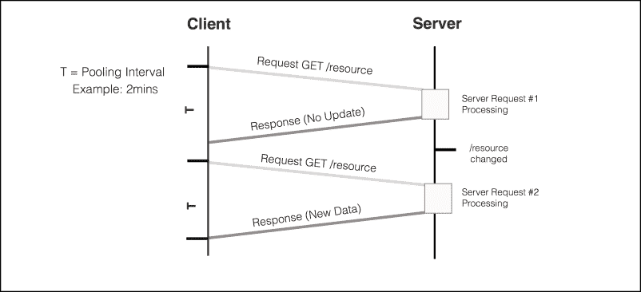
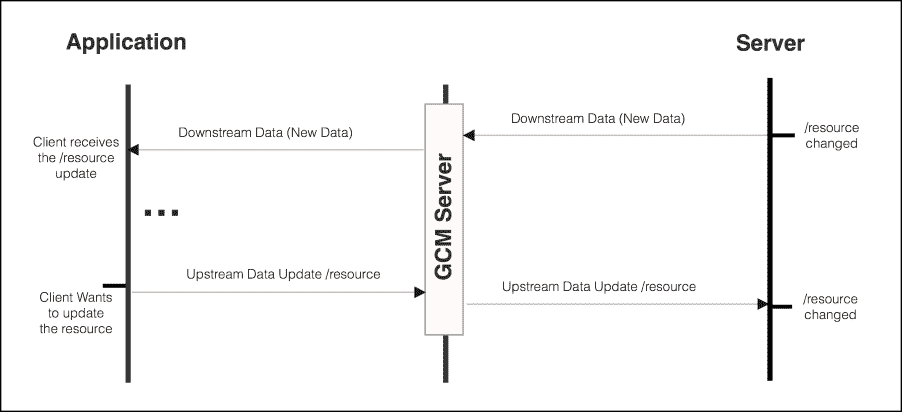
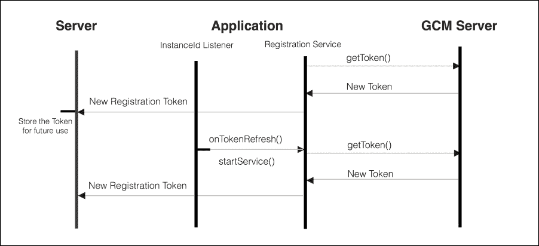

# 第十章：使用 GCM 的网络交互

在前面的章节中，为了更新我们示例所需的任何类型的动态数据，我们明确地启动了一个与远程服务器的连接，唤醒了网络射频和其他执行网络操作所需的资源。应用程序可能会获取新鲜数据，或者如果自上次获取以来没有变化，则获取完全相同的数据。

虽然这种通信-获取模型可能适用于大多数用例，但当数据不经常更改时，它可能会无谓地消耗电池资源和互联网带宽。

这种通常称为**数据轮询**的技术，当大量客户端尝试获取或验证数据是否已更改时，也可能增加服务器的负载。

轮询技术的替代方法是**数据推送**。在这种技术中，服务器告诉应用程序何时有新数据可用或数据已更改。当数据消费者（应用程序）收到通知时，它将启动与服务器的新交互以检索新鲜数据。

由于所需的同步较少，这将导致更少的网络交互，进而导致消耗更少的电池资源。

在本章中，我们将向您介绍**Google Cloud Messaging**（**GCM**），这是由 Google Play 服务提供的一项服务，可以帮助您构建需要数据推送或拉取消息服务的应用程序。GCM 提供了一种框架，以节能的方式向多个设备或设备组发送推送消息。

在本章中，我们将涵盖以下主题：

+   轮询与推送消息对比

+   如何为您的应用程序设置和配置**GCM**

+   使用 GCM 接收来自服务器的下行消息

+   从 GCM 主题流接收下行消息

+   使用 GCM 向您的服务器发送上行消息

+   使用`GcmNetworkManager`注册一次性网络任务和周期性网络任务

# GCM 简介

由于每次与您的服务器进行网络交互都可能唤醒无线射频接口，在能源资源有限的设备上，最小化您的应用程序尝试连接网络以同步数据的次数至关重要。

对于需要定期更新和最新数据的应用程序，如消息应用，通过每 x 分钟设置一个闹钟在后台轮询，然后唤醒射频并下载数据，可能会在几小时内耗尽电池。



图 1 - 从远程服务器轮询数据

GCM 为我们提供了一个平台，以小于 4096 字节的方式高效地发送通知，当有新数据要消费或同步时。这种交互模型减少了网络交互，无需不断轮询服务器以发现数据变化。



除了从您的服务器（使用 HTTP 或 XMPP 协议消息）向您的 Android 应用程序发送下游消息的能力之外，GCM 框架还提供了一个省电的通信通道，用于从您的应用程序向由您管理的 XMPP 服务器发送上游消息。

在 Android 设备上运行的 GCM 客户端提供了一个可靠且省电的连接，连接您的 GCM 服务器和设备。保持的连接高度优化，以最小化带宽和电池消耗。因此，对于需要高频网络数据更新的应用程序，如实时消息，使用 GCM 极为推荐。

此外，当设备离线且无法联系 GCM 服务时，平台能够保留队列中的消息，直到达到最多 20 条队列消息，并确保设备再次上线后立即投递消息。

# 为您的应用程序设置和配置 GCM。

要在您的应用程序上设置 Google 云消息，您需要在 GCM 上注册并在您的 Google 开发者控制台（[`developers.google.com/mobile/add`](https://developers.google.com/mobile/add)）上设置一个 Google API 项目：

1.  首先选择 **Android 应用程序平台**。

1.  指定您的应用程序名称。

    示例：`Asynchronous Android`

1.  提供您的应用程序包名。

    示例：`com.packpublishing.asynchronousandroid`

1.  选择 **云消息服务** 并 **启用 Google 云消息**。

1.  生成配置文件并将 JSON 配置文件 `google-services.json` 下载到您的计算机上。

1.  将您的凭证（服务器 API 密钥、发送者 ID）保存下来，以便在 GCM 平台上进行身份验证。

一旦您已在 GCM 上注册了您的应用程序，获取 `google-services.json` 配置文件并将其复制到您的 Android Studio 项目的 `app/` 或 `mobile/` 目录中。

接下来，将 Google Play 服务 SDK 添加到您的项目级别和应用程序级别的 `<PROJECT_DIRECTORY>/build.gradle` 文件中，并重新构建您的 Android Studio 项目：

```java
buildscript {
    repositories {
        jcenter()
    }
    dependencies {
        classpath 'com.android.tools.build:gradle:1.5.0'
        classpath 'com.google.gms:google-services:1.5.0-beta2'
    }
}
..
```

更新应用程序模块构建 `<PROJECT_DIRECTORY>/app/build.gradle`：

```java
apply plugin: 'com.android.application'

android {
    compileSdkVersion 23
    buildToolsVersion "21.1.1"
    defaultConfig {
        applicationId "com.packpublishing.asynchronousandroid"
        minSdkVersion 9
        targetSdkVersion 23
    }    
}
dependencies {
  ...
  compile 'com.google.android.gms:play-services-gcm:8.3.0'
}
apply plugin: 'com.google.gms.google-services'
```

要在您的 Android 应用程序上使用 GCM，您需要一个安装了 Android API 8 或更高版本且已安装 Google Play 商店的设备，或者如果您想使用 Google Play 服务提供的 GCM 新功能，则需要一个 API 级别为 9 的设备。

在我们的构建文件中声明了 Google 服务库依赖项后，我们就可以开始在应用程序上启动 GCM 基础设施。

要在您的应用程序中使用 GCM，您必须在您的 `AndroidManifest.xml` 文件中注册以下权限：

```java
<uses-permission android:name="android.permission.INTERNET" />
<!-- Required to wakeup the device and deliver messages --> 
<uses-permission android:name="android.permission.WAKE_LOCK" />

<permission android:name="<Package>.permission.C2D_MESSAGE"
        android:protectionLevel="signature"/>
<uses-permission android:name="<Package>.permission.C2D_MESSAGE"/>
   ...
</manifest>
```

### 注意

注意，您应将 `<Package>` 替换为您独特的应用程序包名，例如 `com.packpublishing.asynchronousandroid`。

## 注册 GCM 接收器

为了从 GCM 平台接收广播意图，我们将向 `AndroidManifest.xml` 应用程序元素添加 GCM `GcmReceiver`，这是 GCM 库提供的 `WakefulBroadcastReceiver` 子类：

```java
<receiver
  android:name="com.google.android.gms.gcm.GcmReceiver"
  android:exported="true"
  android:permission="com.google.android.c2dm.permission.SEND" >
  <intent-filter>
      <action android:name="com.google.android.c2dm.intent.RECEIVE" />
      <category android:name="<Package>" />
  </intent-filter>
</receiver>
```

此 `BroadcastReceiver` 在从 GCM 服务器接收到新的下行消息时接收一个意图，因此需要订阅具有操作 `com.google.android.c2dm.intent.RECEIVE` 的意图。

## 设置注册服务

为了从 GCM 平台接收下行消息，Android 应用程序需要一个注册令牌。注册令牌是由 GCM 服务器签发的秘密 ID，必须获取以在服务中标识设备。

为了获取注册令牌，我们将定义一个 `IntentService`，它将使用实例 ID API 获取注册令牌。让我们首先在 `AndroidManisfest.xml` 中定义它：

```java
  <service android:name=".chapter10.RegistrationIntentService"
           android:exported="false">
  </service>
```

我们的 `IntentService` 子类将在后台使用从 GCM 注册返回的 `SenderId` 获取新的注册令牌。一旦接收到新的注册令牌，它将被发送到我们的服务器以安全存储。该令牌是我们的通行证，用于访问 GCM 服务，因此，为了提交通知，服务器必须提供此令牌。在设备上，注册将由 GCM 框架隐式安全存储。

```java
public class RegistrationIntentService extends IntentService {

  @Override
  protected void onHandleIntent(Intent intent) {

    SharedPreferences sharedPreferences = PreferenceManager.
      getDefaultSharedPreferences(this);

    try {
      // Get the InstanceID Singleton
      InstanceID instanceID = InstanceID.getInstance(this);

      Log.i(TAG, "\n-----------------------------------------\n" +
                 " GCM App instance UUID: " + instanceID.getId() +
                 "\n-----------------------------------------\n"
            );

      // Retrieve the Sender Id from GCM Registration
      String senderId = getString(R.string.gcm_defaultSenderId);

      // Retrieve a token with a sender ID
      String token = instanceID.getToken(senderId, 
       GoogleCloudMessaging.INSTANCE_ID_SCOPE, null);

      // Save the Registration to the server
      sendRegistrationToServer(token);

   sharedPreferences.edit().
     putBoolean(MyChatActivity.SENT_TOKEN_TO_SERVER, true).
       apply();

    } catch (Exception e) {
      Log.d(TAG, "Failed to get registration token", e);
   sharedPreferences.edit().
     putBoolean(MyChatActivity.SENT_TOKEN_TO_SERVER, false).
       apply();    
    }
  }
}
```

一旦成功接收到注册令牌，我们更新默认应用程序共享首选项文件，将 `SENT_TOKEN_TO_SERVER` 设置为 `true`。此属性指示生成的令牌是否已发送到您的服务器。如果属性为 false，我们将发送令牌到您的服务器。否则，您的服务器应该已经收到了令牌。

如果在调用 `sendRegistrationToServer` 期间获取新令牌或更新我们服务器上的注册令牌时发生异常，我们将设置 `SENT_TOKEN_TO_SERVER` 为 `false`，确保稍后执行新的尝试。

尽管您可能希望将注册信息持久化到您的后端服务器，但到目前为止，我们将打印注册令牌到日志输出。您可以使用 `logcat` 选择该值以供将来在我们的示例中使用。

```java
  private void sendRegistrationToServer(String token) {       
    Log.i(TAG, " GCM Registration Token: " + token );
  }
```

## 实例 ID 监听器

第一次通过 `InstanceID.getInstance` 获取 `InstanceID` 时，会生成一个 UUID 应用标识符以在 GCM 平台上标识应用程序。

如果以下情况发生，实例 ID 可能会变得无效：

+   应用程序明确删除实例 ID (`Instance.deleteToken`)

+   设备进行了出厂重置

+   应用程序被卸载

+   用户清除应用程序数据

为了接收通知，每次注册令牌需要刷新时，我们将创建一个扩展 `InstanceIDListenerService` 的服务，注册到 `com.google.android.gms.iid.InstanceID` 意图，并将其包含在 `AndroidManifest.xml` 中：

```java
<service
  android:name=".chapter10.MyInstanceIDListenerService"
  android:exported="false">
  <intent-filter>
   <action android:name="com.google.android.gms.iid.InstanceID" />
  </intent-filter>
</service>

public class MyInstanceIDListenerService 
   extends InstanceIDListenerService {
   @Override
   public void onTokenRefresh() { 
     // Starts the Registration Service to obtain a new token
     Intent intent = new Intent(this, 
                                   RegistrationIntentService.class);
     startService(intent);     
     sharedPreferences.edit().
     putBoolean(MessagingActivity.SENT_TOKEN_TO_SERVER, false).
     apply();    
   }
}
```

当注册令牌需要刷新时，将调用 `onTokenRefresh` 回调。这可能发生在前一个令牌的安全受到损害的情况下，例如令牌被可疑使用。此过程通常由 `instanceID` 提供商启动。

Instance ID API 用于管理授权您的应用程序或您的服务器与 GCM 服务交互的安全令牌。



除了创建新的令牌外，`InstanceID` 单例实例还能够删除令牌或甚至使 `InstanceID` 失效。

```java
void  deleteInstanceID()
void  deleteToken(String authorizedEntity, String scope)
```

# 接收下行消息

在设置 GCM 客户端所需的基本块已经就绪的情况下，在我们的第一个 GCM 示例中，我们将通过 GCM 平台发送一条简单的下行消息，并将其作为通知打印到 Android 通知抽屉中。

为了处理 GCM 消息，我们需要实现一个继承自 `GcmListenerService` 的服务，并重写 `onMessageReceived(String,Bundle)` 方法。由于 `GcmReceiver` 继承自 `WakefulBroadcastReceiver`，可以保证 CPU 将会保持唤醒状态直到服务完成消息的投递。

我们的 `GcmListenerService` 子类将在接收到消息后立即创建一个 Android 通知。

```java
public class NotificationGCMHandler extends GcmListenerService {

  public static final int NOTIFICATION_ID ="GCMNotification".
                                            hashCode();

  @Override
  public void onMessageReceived(String from, Bundle data) {

    String msgType = data.getString("type");

    // Notification Message received from GCM.
    if ( msgType.startsWith("my_notifications") ) {
      createNotification(data.getString("title"),
                         data.getString("body"));
    }
  }
  private void createNotification(String title, String body) {   
   // Elided for brevity...
 }  
  }
```

我们还需要在 `AndroidManifest.xml` 中注册我们的 `GcmListenerService` 服务类，将服务注册为接收 `com.google.android.c2dm.intent.RECEIVE` 动作：

```java
  <service android:name=".chapter10.NotificationGCMHandler"
           android:exported="false" >
     <intent-filter>
        <action 
        android:name="com.google.android.c2dm.intent.RECEIVE"/>
     </intent-filter>
  </service>
```

为了启动与 GCM 的初始注册，我们将创建一个 Activity，该 Activity 将启动 `RegistrationService` 的 `IntentService` 以检索所需的令牌。然而，在我们尝试检索令牌之前，我们必须检查设备上是否提供了 Google Play 服务，并且安装的版本不早于客户端要求的版本。

让我们从实现 `Activty.onCreate` 方法开始，触发与 GCM 平台的交互：

```java
public class MyChatActivity extends Activity {
  public static final String SENT_TOKEN_TO_SERVER = "sent2Server";
  private final static int PLAY_SERVICES_RESOLUTION_REQUEST = 9000;
  @Override
  protected void onCreate(Bundle savedInstanceState) {
    super.onCreate(savedInstanceState);
    if (checkPlayServices()) {
      Log.i(LOG_TAG, "Registering to GCM");
      SharedPreferences sharedPref = PreferenceManager.
                                     getDefaultSharedPreferences(this);
      // Registering is started when there is no available token
      boolean sentToken = sharedPref.
                          getBoolean(SENT_TOKEN_TO_SERVER, false);
      if (!sentToken) {
        //...Print an error
      }
      Intent int = new Intent(this, RegistrationIntentService.
                              class);
      startService(int);
    }
  }
}
```

在我们开始注册服务之前，`checkPlayServices` 将验证设备上是否安装了 Google Play 服务。如果服务不可用，将向用户显示一个对话框，允许用户从 Play 商店下载它或在设备系统设置中启用它：

```java
private boolean checkPlayServices() {

  // Returns the singleton instance of GoogleApiAvailability.
  GoogleApiAvailability apiAvailability = GoogleApiAvailability.
                                          getInstance();
  // Verify if the Google Play Service installed is 
  // installed and compatible with GCM Library used
  int rc = apiAvailability.isGooglePlayServicesAvailable(this);
  if ( rc != ConnectionResult.SUCCESS ) {

    // The error can be resolved with a user action
    if (apiAvailability.isUserResolvableError(rc)) {

      // Shows a user action dialog to resolve the issue
      apiAvailability.getErrorDialog(this, 
        rc,PLAY_SERVICES_RESOLUTION_REQUEST).show();
    } else {
      Log.i(TAG, "This device is not supported.");
     // Finishing the Activiy
      finish();
    }
    return false;
  }
  return true;
}
```

当 `isGooglePlayServicesAvailable` 返回成功时，我们从函数中返回 true 并启动注册服务。

当函数返回一个可以通过用户操作解决的问题时，例如 `SERVICE_VERSION_UPDATE_REQUIRED`，将向用户显示一个本地化对话框以纠正问题。如果 Google Play 服务过时或缺失，对话框可能会将用户重定向到 Play 商店，或者如果设备上已禁用 Google Play 服务，则重定向到系统设置。

如果返回的错误不能通过用户操作解决，我们只需结束当前的 `Activity` 并打印一条日志消息，因为设备将无法在 GCM 中注册并接收下行消息。

是的！我们完成了 GCM 引导程序的应用程序，一旦我们启动`Activity`并注册到 GCM，设备就准备好接收 GCM 的下行消息。

记住，我们的注册服务会将注册令牌打印到日志输出中，所以当你第一次运行`MyChatActivity`时，不要忘记记录它。

```java
I ...:  GCM Application Instance Identifier: <InstanceId>
I ...:  GCM Registration Token: <Registration Token>
```

要与 GCM 交互，你可以设置一个使用服务器凭证连接到 GCM 服务的 HTTP 或 XMPP 后端服务器。为了简单和测试，我们将直接构建和提交 HTTP 消息。

要向我们的设备发送下行消息，我们必须发送一个包含 JSON 对象的 HTTP POST 消息，在有效载荷中设置`to`字段为我们的注册令牌，以及一个`data`对象字段，包含我们的自定义通知属性：`title`、`body`和`type`。

这里是一个 JSON 格式的消息，一旦`NotificationGCMHandler`从 GCM 接收到它，就会生成一个 Android 通知：

```java
{
  "data": {
    "title": "Hello from GCM",
    "body": "Hello from your fake server",
    "type": "my_notifications"
   },
   "to": "<DeviceRegistrationToken>"
}
```

要将 HTTP 消息提交到 GCM 平台，你可以使用 curl 命令或使用 chrome 网络应用程序 Postman（[`www.getpostman.com/`](http://www.getpostman.com/)）。以下是提交先前消息到 GCM 的 curl 命令：

```java
$ curl --request POST \
    --url https://gcm-http.googleapis.com/gcm/send \
    --header 'authorization: key=<Server API Key>' \
    --header 'Content-Type: application/json' \
    --data '{"data":{"title":"Hello from GCM","body":"Hello from   
   your fake server","type":"notification"},
            "to":"<DeviceRegistrationToken>"}'
```

不要忘记将`<Server API Key>`替换为在 Google Cloud Console 注册时生成的 API 密钥，并将`<DeviceRegistrationToken>`替换为你设备生成的令牌。请注意，下游数据消息的最大有效载荷为 4KB。

如果你的 GCM 设置一切顺利，你的数据对象属性将传递到数据包对象中的`onMessageReceived()`方法，GCM 服务将返回一个包含类似以下消息体的 HTTP 响应（200）：

```java
{
  "multicast_id": 6425212369847183592,
  "success": 1,
  "failure": 0,
  "canonical_ids": 0,
  "results": [{
    "message_id": "0:1456441876781708%69ee9872f9fd7ecd"
  }]
}
```

# 接收主题消息

下行消息允许我们发送短（4KB）消息来提醒用户有新的更新、新内容或甚至提醒。

下行消息是一个单向通信通道，用户可以接收消息，但不能直接响应它们或采取任何立即行动。

要构建交互式体验，例如聊天系统，我们必须支持双向通信，用户可以接收下行消息，也可以向其他设备或设备组发送上行消息。

在我们的下一个示例中，我们将基于 GCM 上行消息和主题消息功能构建一个简单的群组消息系统。群组消息系统将允许多个设备向共享消息通道发布文本消息。

GCM 主题消息允许你的后端服务器向具有特定主题的设备发送消息。一旦 GCM 收到特定主题的消息，它将透明地使用在 GCM 平台上管理的已订阅设备列表路由和传递消息。

主题由以下正则表达式后面的名称标识：

```java
      /topics/[a-zA-Z0-9-_.~%]+
```

要开始接收与特定主题名称相关的消息，一个 GCM 注册客户端应用程序必须使用自己的注册令牌和所需的主题流在 GCM 中进行订阅。

首先，我们将更新我们的 `RegistrationIntentService`，使用接收到的注册令牌将我们的应用程序订阅到 `"/topics/forum"` 消息流：

```java
public class RegistrationIntentService extends IntentService {

  private static final String TOPIC_NAME = "forum";

  @Override
  protected void onHandleIntent(Intent intent) {
    ...
    // Retrieve the token
    String token = instanceID.getToken(senderId, 
        GoogleCloudMessaging.INSTANCE_ID_SCOPE,null);
    ...
    // Subscribe to Topics
    subscribeTopics(token);
  }

  private void subscribeTopics(String token) {
    GcmPubSub pubSub = GcmPubSub.getInstance(this);
    try {
         pubSub.subscribe(token, "/topics/ " + TOPIC_NAME, null);
    } catch (Exception e) {
        Log.e(TAG, "Failed to subscribe to " + TOPIC_NAME, e);
    }
  ...
}
```

要将设备从 GCM "论坛" 主题中取消订阅，我们可以使用注册令牌和主题名称调用 `GcmPubSub` 的 `unsubscribe()` 方法。

主题消息以与我们在上一个示例中推送通知 GCM 消息相同的方式发送到我们的 `GcmListenerService` (`NotificationGCMHandler`)。主题消息发送到我们的应用程序，其中 `from` 字段存储主题名称 `/topics/forum`。

我将给出一个关于我们主题的典型主题消息的示例：

```java
{ 
  "to": "/topics/forum",
  "data": {
    "username": "heldervasc",
    "text": "I need to learn more about Android Development"
  }
}
```

数据对象字段是消息上的字段，我们可能用它来向应用程序传递自定义属性。在我们的示例中，它携带有关用户编写的用户名和文本的信息。

接下来，考虑到 `NotificationGCMHandler` 将接收从 GCM 发送的主题消息，我们将更新它以处理接收到的主题消息，并将每个主题消息广播到任何本地 `BroadcastReceiver`。

我们的 `NotificationGCMHandler` 将简单地封装主题消息到 Intent 中，并将它们调度到您进程内的本地 Activity。这种异步通信技术，在之前的章节中已解释，由于您的消息不会离开您的应用程序，因此更快、更安全：

```java
public class NotificationGCMHandler extends GcmListenerService {

  public static final String FORUM_TOPIC = "/topics/forum";
  public static final String USERNAME_KEY = "username";
  public static final String TEXT_KEY = "text";
  public static final String MSG_DELIVERY = "asyncforum";

  @Override
  public void onMessageReceived(String from, Bundle data) {

       // Verify if it is a forum message
    if (from.equals(FORUM_TOPIC)) {

     // Build an intent from the forum topic message. 
      Intent intent = new Intent(MSG_DELIVERY);
      intent.putExtra(USERNAME_KEY, data.getString(USERNAME_KEY));
      intent.putExtra(TEXT_KEY, data.getString(TEXT_KEY));

	  // Broadcast the intent to local interested objects
     LocalBroadcastManager.
       getInstance(this).sendBroadcast(intent);
    } else ... {
      ...
    }
  }
}
```

随着 `GcmListenerService` 将从我们的消息主题接收到的消息转发，现在是时候构建一个将要显示接收到的消息并使用 GCM 上行消息将消息发布到群聊的 Activity 了。

从上一章完成的工作开始，我们将创建一个 `MessagingActivity`，它还将验证 Google Play 服务是否可用，并在没有注册令牌的情况下启动 `RegistrationIntentService`：

```java
public class MessagingActivity extends Activity {

  @Override
  protected void onCreate(Bundle savedInstanceState) {
    super.onCreate(savedInstanceState);
    setContentView(R.layout.chat_layout);
    if (checkPlayServices()) {
     ...    
    }
  }   
}
```

要在我们的 Activity 中接收和显示主题消息，我们将创建一个匿名 `BroadcastReceiver` 子类，该类可以动态注册和注销接收动作为 `MSG_DELIVERY` 的本地 Intent。

由于我们只想在 Activity 处于前台时接收主题消息，我们将在 `onResume` 和 `onPause` 回调中注册和注销到本地广播：

```java
public class MessagingActivity extends Activity {
     ...
  @Override
  protected void onResume() {
    super.onResume();

    // Create an intent filter to receive forum Intents
    IntentFilter filter = new IntentFilter(
      NotificationGCMHandler.MSG_DELIVERY);

    // Register the local Receive to receive the Intents
    LocalBroadcastManager.getInstance(this).
      registerReceiver(onMessageReceiver, filter);
  }

  @Override
  protected void onPause() {
    super.onPause();
    // Unregister the Local Receiver
    LocalBroadcastManager.getInstance(this).
      unregisterReceiver(onMessageReceiver);
  }
}
```

剩下的工作就是在 UI 上显示我们的群聊消息，并实现接收广播 Intent 并使用消息用户名和文本更新 UI 的 `BroadcastReceiver`。

要处理广播 Intent，我们必须覆盖 `BroadcastReceiver` 的 `onReceive` 方法以接收本地 `Intent`：

```java
BroadcastReceiver onMessageReceiver = new BroadcastReceiver(){

  @Override
  public void onReceive(Context context, Intent intent) {

      TextView chatText = (TextView)findViewById(R.id.chatWindow);
      String username = intent.getStringExtra("username");
      String bodyText = intent.getStringExtra("text");
      String line = String.format("%s : %s%n", username,bodyText)
      // Prepend the message 
      chatText.setText( line + chatText.getText().toString());
  }
};
```

现在，如果您使用以下 `curl` 命令向 GCM 提交主题消息，您将在 UI `TextView`上看到一个新消息弹出：

```java
curl --request POST  \
--url "https://gcm-http.googleapis.com/gcm/send" \
--header 'authorization: <SERVER_API_KEY>'  \
--header 'Content-Type: application/json'  \
--data '{ "data": {  
        "username": "heldervasc",
        "text": "Welcome to Asynchronous Android group chat"
     },       
    "to": "/topics/forum"
   }'
```

# 发送上行消息

尽管我们能够接收聊天群组消息，但我们无法与应用程序的消息流进行交互。此外，为了使用 GCM 平台发送和处理上游消息，需要一个实现 XMPP 连接服务器协议的应用程序服务器来连接到 GCM 服务器并接收上游 XMPP 消息。

为了处理我们的群组消息，我们构建了一个非常基本的 XMPP 服务器，该服务器处理来自设备的上游消息，并将消息转发到主题消息。

基本 XMPP 服务器源代码可在 Packt Publishing 网站上找到。从 Packt 网站获取它，在运行之前，请更新`GCMServer.java`类文件中的静态字段，包括你的`SenderID`和`ServerKey`。

```java
private static final String SENDER_ID = "<YOUR_SENDER_ID>"; 
private static final String SERVER_KEY = "<SERVER_KEY>";
```

服务器将连接到 GCM 平台，启动一个 XMPP 会话，并处理发送到`<SENDER_ID>@gcm.googleapis.com`的所有消息。

要生成上游消息，我们在 UI 上创建了一个`EditText`，并创建了一个按钮，一旦触发，就会发送上游消息。要在 GCM 平台上发送上游消息，应用程序需要提供以下字段：

+   我们在 GCM 平台上的服务器地址是`<SENDER_ID>@gcm.googleapis.com`。

+   唯一的消息标识符（`message_id`）

+   带有自定义键/值对的报文负载

现在，让我们更新`MessagingActivity`以根据`EditText`输入字段发送上游消息。由于上游分发需要网络访问，而且正如你所知，我们无法在主`Thread`上执行网络操作，我们必须使用`AsyncTask`子类在主线程之外执行。在`Activity`类中，我们实现了一个基本的异步结构`AsyncJob`，用于在后台执行网络操作，并捕获上游请求过程中发生的任何异常。这个特殊用途的类可以用于不产生任何结果的背景任务：

```java
public abstract class AsyncJob 
  extends AsyncTask<Void, Void, Result<Void> > {

  @Override
  protected Result<Void> doInBackground(Void ...args) {
    Result<Void> result = new Result<Void>();
    try { runOnBackground() } 
    catch (Throwable e)  { result.error = e; }
    return result;
  }
  @Override
  protected void onPostExecute(Result<Void> result) {
    if ( result.error != null ) { onFailure(result.error);} 
    else { onSuccess();}
  }
  // Backrgound Execution Task
  abstract void runOnBackground() throws Exception;
  // Error Callback
  abstract void onFailure(Throwable e);
  // Success Function
  abstract void onSuccess();
}
```

使用`AsyncJob`，我们声明了三个抽象方法，任何`AsyncJob`子类都应该提供实现。`runOnBackground`应该实现后台任务，`OnFailure`应该用于处理执行异常，而`onSuccess`回调被调用以通知开发者任务已成功完成。

现在我们已经准备好实现`OnClicklistener`，它将在后台构建上游消息并将其发送到我们的 XMPP 服务器：

```java
OnClickListener sendListener = new OnClickListener() {

  @Override
  public void onClick(View v) {

    TextView msgText = (TextView) findViewById(R.id.msg);
    final String msgToSend = msgText.getText().toString();
    msgText.setText("");

    new AsyncJob() {
      @Override
      void runOnBackground() throws Exception {

        // Build the data Bundle wit our key/value pairs
        Bundle data = new Bundle();
        data.putString(USERNAME_KEY, "Helder");
        data.putString(EXT_KEY, msgToSend);
        data.putString("topic", NotificationGCMHandler.
                                FORUM_TOPIC);
        // Generate a random message Id
        String id = Integer.toString(new Random().nextInt());

       // Get the GCMMessaging instance
        GoogleCloudMessaging gcm = GoogleCloudMessaging.
          getInstance(MessagingActivity.this);

        // Sends the Message to the GCM platform
        gcm.send(getString(R.string.gcm_SenderId) + 
                 "@gcm.googleapis.com", id, data);
      }
      @Override
      void onFailure(Throwable e) {
//… Handle the exception
Log.e(TAG,"Failed to send upstream message to forum",e);
      }
      @Override
      void onSuccess() {
        //.. No Exception thrown 
}
    }.execute();
  }
};
```

在我们的示例中，我们创建了一个包含所有要分发的有效载荷数据的`Bundle`对象。除此之外，我们还使用`java.util.Random.nextInt`实例方法创建了一个唯一的消息 ID。

此消息接收以下参数：遵循格式`<SENDER_ID>@gcm.googleapis.com`的地址、从随机整数生成的唯一消息 ID 字符串，以及包含你的有效载荷的 bundle。

一旦我们调用`GoogleCloudMessaging.send`，如果有一个活跃的连接可用，新的上游消息将立即发送，否则消息将被排队。一旦重新建立连接，排队中的消息将被发送到 GCM 服务器。

### 注意

如果客户端在达到 20 条消息限制后尝试发送更多消息，它将返回一个错误。

`GoogleCloudMessaging` API 将以高效的方式重用和管理与 GCM 平台的连接，为我们透明地最大化设备电池寿命。

一旦消息被我们的 XMPP 服务器接收，消息将被发送到`/topics/forum`，因此它将更新我们输入的消息的 UI 消息流。

# GcmListenerService 投递回调

在某些情况下，由于缺乏网络连接，无法与 GCM 服务器建立连接时，消息可能会在本地队列中长时间保留。因此，为了在指定时间内丢弃未发送到 GCM 服务的消息，`GoogleCloudMessaging` API 提供了一个额外的发送方法，该方法可以接收一个 TTL（生存时间）时间来设置消息过期时间：

```java
void send (String to, String msgId, long timeToLive, Bundle data)
```

当您有只在特定时间范围内相关的消息时，这效果很好。如果生存时间为 0，我们将在不连接的情况下立即尝试发送并返回错误。这种情况不适用于我们的示例，因此我们将保留原始代码，使用不丢弃旧未发送消息的发送方法。

重要的是要理解，当长时间没有连接到 GCM 平台时，应用 GCM 客户端只能最多排队 20 条消息。

除了上游过期功能之外，`GcmListenerService`还允许我们通过重写`onMessageSent`和`onSendError`回调来接收上游消息的投递状态：

```java
    void onMessageSent(String msgId) 
    void onSendError(String msgId, String error)
```

当消息被投递到 GCM 并且有错误将消息投递到 GCM 连接服务器时，将调用`onMessageSent`回调。请注意，这两个回调都带有消息标识符作为参数，因此您应该使用此标识符来定位已发送或因错误而失败的消息。

由于效率原因，GCM 消息投递报告是以批量形式交付的，因此不要期望在您上传单条消息后立即收到回调执行。

要在我们的聊天示例中接收上游消息的投递状态，我们将更新我们的`NotificationGCMHandler`并重写`onMessageSent`和`onSendError`：

```java
public class NotificationGCMHandler extends GcmListenerService {
       ...
    @Override
    public void onMessageSent(String msgId) {
        super.onMessageSent(msgId);
        Log.i(TAG, "Message w/ id="+msgId+" send to GCM Server ");
    }

    @Override
    public void onSendError(String msgId, String error) {
        super.onSendError(msgId, error);
        Log.e(TAG, "Message w/ id=" + msgId + 
                   " send failed with error "+error);
    }
}
```

在我们的`GcmListenerService`回调中定义的回调方法将打印一条消息到应用程序日志输出，其中包含已发送或失败的消息。如果消息过期时间到达或达到上游排队消息的最大大小时，消息的投递可能会失败。

太好了！我们已经完成了基于 GCM 平台的群聊。在我们的旅程中，我们学习了如何使用一个电池高效的 API 向上和向下发送主题消息，该 API 维护与 Google 服务器的网络连接。该 API 允许我们在服务器和设备之间，或设备组之间创建双向通信通道。

# 使用 GCM 网络管理器执行任务

除了消息框架之外，GCM 库还包含 `GcmNetworkManager`，这是一个 API，允许我们在 API 级别 9（Android 2.1）及以上运行的设备上高效地安排重复或周期性任务。对于运行 API 级别 21（Lollipop）及以上的设备，GCM 网络管理器内部使用本地的 `JobScheduler` API，这在 第七章 中详细介绍了，*探索 JobScheduler API*。与 `JobScheduler` API 一样，它将尝试批量处理作业并减少从空闲状态唤醒的次数，以改善用户设备的电池寿命。

此外，使用 GCM 网络管理器，我们还可以设置启动作业执行应满足的条件，例如当设备处于充电状态或可不计费 WIFI 连接可用时。尽管 GCM API 提供了与 `JobScheduler` API 相同的标准，但它可以用于安装了 Google Play 服务的旧设备和新设备。

因此，在尝试使用它之前，您需要确保设备上可用的 Google Play 服务版本，使用 `GoogleApiAvailability` 类，就像我们在 GCM 示例中所做的那样。

查看我们之前示例中的 `checkPlayServices()` 函数，以获得更完整的解决方案。之前的函数将在需要任何用户操作来更新或安装 Google Play 服务时显示对话框。

我们可以在 GCM 网络管理器上安排任务执行，在以下条件下运行，例如：

+   当有特定的网络连接可用（任何网络可用，不计费的网络连接）

+   当设备连接到充电器时

+   在未来预定义的时间窗口内运行的任务

+   指定即使在重启后也要运行的任务

虽然支持的标准与之前覆盖的 Scheduler API 相同，并且适用于运行 Android Lollipop 的设备，但此 API 需要一些额外的必填标准，您应指定以在 GCM 网络上注册服务任务执行。

要构建和构造一个 GCM 任务，有两个 Builder 类可用：用于创建单次任务的 `OneoffTask.Builder`，以及用于注册定期以固定间隔运行的任务的 `PeriodicTask.Builder`。

## 构建一次性任务

`OneoffTask` 是一个将在未来指定的时间窗口内执行一次的任务。从 `OneoffTask.Builder` 配置 `OneoffTask` 可用的选项包括：

+   执行窗口范围（必填）

+   标签标识符（必填）

+   运行我们的任务所需的 `GcmTaskService` 子类（必填）

+   额外参数（可选）

+   任务持久性（可选）

+   必需网络（可选）

+   充电需求（可选）

+   更新当前任务（可选）

在我们的下一个示例中，我们将使用 GCM 网络管理器来安排账户设置的备份。当账户设置更新时，它们将存储在本地文件中，一旦备份运行，账户详情将通过上游消息推送到我们的 XMPP 服务器。为了保存我们的账户设置，我们将创建一个 Activity，显示一个表单来填写我们的个人详情。

表单将包含一个按钮，点击后会将我们的账户详情保存到本地文件，并注册一个 GCM 网络任务执行，将我们的详情推送到我们的网络 XMPP 服务器。

为了延长电池寿命并减少我们的计费移动互联网使用，我们将我们的备份任务注册为仅在 WIFI 网络可用且设备正在充电时运行，最多在调度后 4 小时内。

在我们将任务注册到 GCM 网络管理器之前，我们将我们的`GcmTaskService`添加到应用程序清单中：

```java
<service
  android:name=".chapter10.MyBackupService"
  android:exported="true"
android:permission="com.google.android.gms.permission.BIND_NETWORK_TASK_SERVICE">
  <intent-filter>
    <action 
   android:name="com.google.android.gms.gcm.ACTION_TASK_READY"/>
  </intent-filter>
</service>
```

在 Android 清单中，我们添加了接收 GCM 启动广播所需的 Intent 过滤器，并且为了保护我们的服务不被除 Google Play Services 之外的其他程序启动，我们添加了`com.google.android.gms.permission.BIND_NETWORK_TASK_SERVICE`权限。

接下来，我们准备注册一个一次性任务来备份存储在应用程序默认共享偏好文件中的本地账户详情。每当用户更新账户详情并在 UI 上点击保存按钮时，账户详情将被本地存储，并在 GCM NM 上构建和注册一个`OneoffTask`任务来发布更改到我们的网络服务器。

让我们看看保存按钮的`OnClickListener`是什么样的：

```java
public class AccountSettingsActivity extends Activity {

  public static final String TASK_BACKUP = "backup";

  public static long FOUR_HOUR = 3600*4L;

  // Executed when the user taps on save button
  OnClickListener listener = new OnClickListener() {

    @Override
    public void onClick(View v) {
      // Store the details on the default shared preferences file
      ...
	   // Obtain a GCM NM Instance 
      GcmNetworkManager gcmNM = GcmNetworkManager.
        getInstance(AccountSettingsActivity.this);      
      OneoffTask task = new OneoffTask.Builder()
        // Sets the Service to start
        .setService(MyBackupService.class)
        // Task Identifier
        .setTag(TASK_BACKUP)
           // Will run in the next 4 hours      
        .setExecutionWindow(0L, FOUR_HOUR)
        // Requires WIFI Network
        .setRequiredNetwork(Task.NETWORK_STATE_UNMETERED)
        // Requires Charging
        .setRequiresCharging(true)
           .build();

      gcmNM.schedule(task);
    }
  };
}
```

要从您的`Activity`注册任务，我们使用`Activity`上下文获取`GcmNetworkManage`r 的实例。接下来，我们创建了一个`OneoffTask.Builder`对象，并将任务设置为启动`MyBackupService`服务以完成任务，并在调度后至少 4 小时运行任务。

注意，框架将在所有条件都满足并且考虑到其他计划运行的任务的情况下立即启动您的作业。如前所述，GCM NM 将延迟作业执行并批量作业以减少从空闲状态唤醒 CPU 的次数。

现在，我们将创建一个扩展自`GcmTaskService`并实现以下方法的`MyBackupService`：

```java
int onRunTask(TaskParams args);
```

我们的`OnRunTask`方法将发布我们的账户详情更新到我们的 XMPP 服务器：

```java
public class MyBackupService extends GcmTaskService {

  @Override
  public int onRunTask(TaskParams taskParams) {
    Log.i(TAG, "Backing up the account settings");
    try {

      // Obtain the default Shared preference object
      SharedPreferences sp =PreferenceManager.
        getDefaultSharedPreferences(this);

      // Builds the upstream data bundle
      Bundle data = new Bundle();
      data.putString(FIRST_NAME, sp.getString(FIRST_NAME, ""));
      data.putString(LAST_NAME,sp.getString(LAST_NAME, ""));
      data.putString(AGE, sp.getString(AGE, ""));

      // Specify the resource to update (Optional)
      data.putString("resource","/account");
      data.putString("operation","update");

      String msgId = Integer.toString(new Random().nextInt());
      GoogleCloudMessaging gcm = GoogleCloudMessaging.
        getInstance(MyBackupService.this);
      gcm.send( SENDER_ID + "@gcm.googleapis.com", msgId, data);
    } catch (IOException e) {
      Log.e(TAG, "Failed to backup account", e);
      return GcmNetworkManager.RESULT_RESCHEDULE;
    }
    return GcmNetworkManager.RESULT_SUCCESS;
  }
}
```

为了执行`onRunTask`方法，GCM NM 启动的`GcmTaskService`将使用`THREAD_PRIORITY_BACKGROUND`优先级创建一个后台线程，并保持设备唤醒，持有 CPU `Wakelock`最多 3 分钟。执行 3 分钟后，如果您的任务没有返回，GCM NM 认为您的任务已超时，并将释放 CPU `Wakelock`。

### 注意

如果您的服务一次接收多个请求，您应该使用同步段序列化作业执行，以避免线程安全问题。

`onRunTask` 返回的结果代码将决定任务的执行成功（`RESULT_SUCCESS`）、失败（`RESULT_FAILURE`）或失败后重新安排（`RESULT_RESCHEDULE`）。在我们的特定示例中，如果在提交上行消息期间抛出异常，返回的结果代码 `RESULT_RESCHEDULE` 将强制任务在退避期（指数退避）后再次执行。

# 摘要

在本章中，我们学习了如何使用 GCM 平台提供的节能通信通道发送和接收数据。

首先，我们学习了轮询和推送/拉取通信技术之间的区别，以与网络服务器交互。GCM 使用的推送和拉取消息能够通过避免重复的服务器查询来更新用户数据，从而降低应用程序的电池效率。

同时，我们学习了如何在我们的应用程序中设置和配置 GCM 库。为了与 Google 服务交互，我们的设备获得了一个 `instanceID` 和注册令牌，以在 GCM 服务上验证和识别我们的设备。

接下来，我们学习了如何在我们的应用程序中处理通知消息和主题消息，并使用 GCM 上行消息与自定义 XMPP 服务器进行交互。同时，我们构建了一个群聊系统，该系统能够从不同的用户那里聚合消息，并在屏幕上显示一个统一的消息流。

最后，我们学习了如何使用 GCM 网络管理器来安排网络任务，这些任务在设备满足某些条件时运行，例如设备连接到 WIFI 网络。

在下一章中，我们将向读者介绍 `RXJava`，这是一个用于通过可观察数据流在 Java 中组合异步和基于事件的任务的库。
