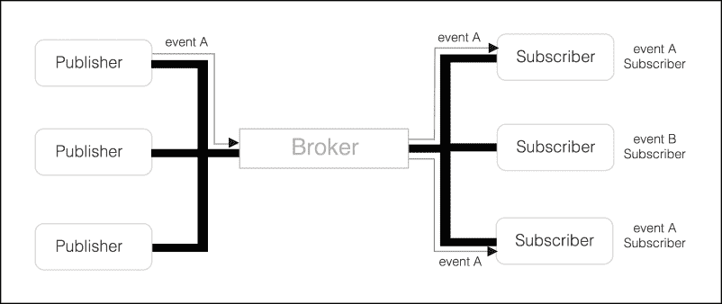

# 第十一章：探索基于总线通信

在前面的章节中，我们使用不同的技术在不同 Android 应用程序组件（`Activity`、`Fragment`、`Service`、`BroadcastReceiver`等）之间传播数据/事件/通知：

+   意图通过系统发送，携带通信消息或通知，以通知`Service`或`Activity`启动

+   使用广播意图从后台进程报告结果

+   处理器被用来在不同的进程和线程执行之间进行通信

这些技术通常涉及发送消息的组件和接收消息的组件之间的紧密耦合。通常，发送者将消息调度到特定的接收者，并处理接收者的生命周期以检测任何接收者不可用的情况。

在本章中，我们将向读者介绍一个由 `EventBus` 库提供的新构造和模式，这个模式在大多数情况下通过解耦事件生产者和事件消费者组件来简化不同应用程序组件之间的通信。

本章将涵盖以下主题：

+   介绍基于总线的通信

+   在你的项目中设置 `EventBus` 库

+   在总线中定义和调度事件

+   注册订阅者

+   使用 `threadMode` 异步处理事件

+   发布和移除粘性事件

# 基于总线的通信简介

基于总线的通信软件模式，也称为发布/订阅，是一种允许发送者和接收者实体在不要求它们显式知道对方的情况下进行通信的模式。这种通信模型抑制了组件之间的紧密耦合，并允许将消息从单个接收者传递到多个最终接收者。在通信模式中涉及五个不同的实体：发布者、订阅者、事件、总线和代理。

**发布者**将事件提交到由称为**代理**的实体控制的共享消息管道，称为**总线**，该代理管理提交的事件流，并将它们转发到之前在代理中注册以接收特定类型事件的实体列表，称为**订阅者**。

为了接收某些类型的事件，订阅者应在代理中创建一个订阅，代理应保持一个启用订阅的列表，并将事件转发给所有订阅者。

如果消费者对某一种事件失去兴趣，它将终止订阅，因此，代理将停止转发与订阅者相关的未订阅事件。



在这种松散耦合的通信模型中，发布者在共享的`Bus`中提交事件 A，而不了解将消费该事件的精确订阅者。同样，订阅者不知道提交事件的发送实体，除非事件 A 中发送了某些内容来识别事件的来源。

在 Android 特定情况下，它可以简化`Fragments`、`Activities`、`Services`或任何其他业务逻辑对象（如持久化服务）之间的通信，这些对象管理您的应用程序或 UI 状态。在我们的示例中，我们将使用该库在活动之间发送通知。然而，同样的结构也可以应用于服务与广播接收器之间的通信。

# EventBus 库

尽管有几个开源库能够实现这种模式在 Android 上的传递，但我们将基于流行的`event bus`库（[`greenrobot.org/eventbus/`](http://greenrobot.org/eventbus/））编写代码示例，因为它提供了高级功能和高性能。

该高性能库针对 Android 操作系统进行了优化，并且已被 Google Play 上许多流行的应用程序使用。

这些是`EventBus`库提供的先进功能，您应该了解：

+   基于注解的订阅 - 您可以通过注解 Android `Activity`、`Service`或`Fragment`实例方法来定义订阅方法

+   背景和主线程事件传递 - 订阅者可以定义事件将在哪个线程中传递，无论它是在后台还是主线程生成

+   事件和订阅者继承 - 我们可以通过扩展（Java 子类）其他事件或订阅者来构建事件或订阅者：

    ```java
    class OtherEvent extends MyEvent
    ```

+   无需配置 - 默认情况下，该库允许我们使用一个现成的默认`Bus`，无需显式实例化，并且可以从应用程序的任何地方提交事件：

    ```java
    EventBus.getDefault().post(new MyEvent());
    ```

在开始使用它之前，我们将向我们的模块或应用程序`build.gradle`文件中添加 GreenRobot `Eventbus`依赖项：

```java
dependencies {
   compile 'org.greenrobot:eventbus:3.0.0'
}
```

在我们深入探讨之前，我们将展示一个简单示例，其中我们使用该库从`BroadcastReceiver`向`Activity`发布一个简单事件。因此，`Activity`接收方法将在屏幕上提供通知。

首先，我们将创建一个`BroadcastListener`，它监听网络变化，并在移动网络不可用时在`Bus`中提交一个事件，当设备移动网络可用时，提交一个包含详细网络状态的事件。这些事件将在`Bus`中传播，并传递给所有感兴趣的订阅者，在我们的例子中，将是一个`Activity`，它将在屏幕上显示显示移动网络状态的消息。

# 定义事件

首先，我们将定义由发布者提交给`Bus`的 POJO 类，以通知感兴趣的实体移动网络连接是否可用：

```java
public class MobileNetConnectedEvent{
  public final String detailedState;
  public MobileAvailableEvent(String detailedState) {
    this.detailedState = detailedState;
  }
}
public class MobileNetDisconnectedEvent {}
```

`MobileNetConnectedEvent`事件是一个 POJO 类，当移动网络可用时将发送，并携带包含详细网络状态的字符串消息。

`MobileNetDisconnectedEvent`是一个不携带任何信息的事件，但它将通知事件订阅者网络连接已丢失。

# 提交事件

现在定义了事件后，我们将创建一个`BroadcastListener`，它将在设备上检测到任何网络连接变化（Wi-Fi、移动网络等）时从 Android OS 接收 Intent，并在移动连接发生变化时将事件提交到 Bus 中：

```java
public class MobileNetworkListener extends BroadcastReceiver {

  @Override
  public void onReceive(Context context, Intent intent) {
	 // Retrieve the NetworkInfo from the received Intent
    NetworkInfo info =(NetworkInfo)intent.
      getExtras().get(ConnectivityManager.EXTRA_NETWORK_INFO);
    if ( isMobileNetwork(context, info) && !info.isConnected()) {
	   // Publish an mobile network disconnected Event
      EventBus.getDefault().post(
        new MobileNetDisconnectedEvent());
    } else if ( isMobileNetwork(context, info) && 
                info.isConnected()) {
      // Publish an mobile network connected Event
      EventBus.getDefault().post(
        new MobileNetConnectedEvent(info.getState().toString()));
    }
  }
  public boolean isMobileNetwork(Context context, 
                             NetworkInfo info) {
    return info != null && 
           (info.getType() == ConnectivityManager.TYPE_MOBILE);
  }
}
```

正如我们之前描述的，默认的、可立即使用的`EventBus`可以从我们的应用程序的任何地方检索，因此，当收到关于移动网络的网络变化事件时，我们只需通过调用`EventBus.getDefault()`来获取默认的 Bus，并通过调用`Bus.post(Object event)`函数向其提交事件。

注意，我们将根据在`ConnectivityManager.EXTRA_NETWORK_INFO` Intent 额外信息中接收到的`NetworkInfo`来识别网络。

当检测到与移动网络相关的网络变化时，我们在默认的`Bus`中提交`MobileNetConnectedEvent`或`MobileNetDisconnectedEvent`。

# 注册订阅者

已经指定了`Publisher`/`Sender`类和事件类，剩下的只是将我们的`Activity`类注册以接收这两个事件并在屏幕上打印发送的事件。

正如我们之前所述，为了从`Bus`接收任何事件，`Subscriber`实体（可以是代码中的任何 Java 类）必须注册到 Bus 上并订阅它感兴趣的事件。

任何对象都必须通过调用`register`函数在 Bus 上注册，并提供一个带有`@org.greenrobot.eventbus.Subscribe`注解的单一`on<eventName>(EventType)`方法，以便对它感兴趣的所有类型的事件进行注册：

```java
@Subscribe
void on<EventClassname>(EventClassname event) {
 ...
}
```

让我们实现将在我们的 Activity 中处理`MobileNetDisconnectedEvent`和`MobileNetConnectedEvent`事件的函数：

```java
@Subscribe
public void 
onMobileNetDisconnectedEvent(MobileNetDisconnectedEvent event){

  String message = String.format(
    "Mobile connection is not available \n");
  appendToConsole(message);
}

@Subscribe
public void 
onMobileNetConnectedEvent(MobileNetConnectedEvent event){

  String message = String.format(
    "Mobile connection is available State - %s\n",
    event.getDetailedState());
  appendToConsole(message);
}
```

这两个公共回调都有`@Subscribe`注解，并且只有一个`MobileNetDisconnectedEvent`/`MobileNetConnectedEvent`对象作为方法参数。因此，每当我们的`BroadcastReceiver`发送者将这些事件发布到 Bus 上，并且`Activity`已经订阅了它们时，我们的回调会被通知，并在 UI 控制台屏幕上添加一条新消息。

最后，为了在我们的默认 Bus 上注册我们的`Activity`，我们将重写`onStart`和`onStop Activity`函数以分别进行注册和注销：

```java
    @Override
    public void onStart() {
        super.onStart();
        EventBus.getDefault().register(this);
    }

    @Override
    protected void onStop() {
        EventBus.getDefault().unregister(this);
        super.onStop();
    }
```

一旦我们注册了我们的类对象，Bus 将通过反射 API 遍历`Activity`方法，并检查是否有任何带有`Subscribe`注解的方法。一旦找到任何带有`@Subscribe`注解的方法，并且方法参数为 POJO 事件，它将注册实例方法，以便在事件在`Bus`上发布时调用。

一旦我们的`Activity`被销毁，我们将终止总线订阅，`Bus`将停止发送事件。在任何 Android 组件中，例如`Activity`、Fragment 和`Service`，我们应该根据组件的生命周期在总线上注册和注销。从总线中注销组件非常重要，否则总线将保持对已注册组件的引用，从而阻止其被垃圾回收。结果，它将在应用程序中产生内存泄漏。

# 线程模式

默认情况下，`EventBus`在发送者发布事件的同一线程中向订阅者传递事件。尽管这种传递方案可能适用于大多数用例，例如执行 Android UI 更改的事件，但当在事件回调中执行长时间操作时，订阅者可能会阻塞主线程，从而阻止系统及时运行 UI 渲染，并导致丢失一些 UI 帧。

为了应对在事件传递过程中可能发生的耗时操作，`EventBus`库允许我们定义`Bus`将调用以将事件传递给订阅者的线程（`ThreadMode`）。

`EventBus`支持四种模式，我们可以使用这些模式来控制事件传递行为：

+   `ThreadMode.POSTING` – 订阅者的回调将在发送者发布事件的同一线程中调用。这是默认行为，事件将同步发送到所有订阅了已分发事件的实体。

+   `ThreadMode.MAIN` - 总线将在主 UI 线程中调用订阅者的回调。因此，如果发送者在后台线程中运行时向`Bus`发布事件，总线将在主`Looper`中排队消息，事件将在主线程中传递。有关`Looper`和 Handler 如何工作的更多详细信息，请参阅第二章，*使用 Looper、Handler 和 HandlerThread 执行工作*。当事件在主线程中产生时，它表现得像`ThreadMode.POSTING`模式。

+   `ThreadMode.BACKGROUND` – 总线将在一个后台线程中调用订阅者的回调，这可以防止事件处理阻塞 UI 线程。请注意，`EventBus`仅使用一个后台线程来调用所有回调，因此，任何长时间运行的组件可能会延迟后续事件的传递。当事件在后台线程中产生时，它处于`ThreadMode.POSTING`模式。

+   `ThreadMode.ASYNC`- 总线将使用由总线管理的线程组调用订阅者的回调。从`Executors.newCachedThreadPool`创建的工作线程池将被回收，并可能用于执行阻塞操作，例如网络或长时间计算操作。

你应该根据消费事件所需的处理类型设置你的示例所需的线程模式。例如，当消费者更新 UI 时，如果生产者可以从后台线程发布事件，则应显式指定`ThreadMode.MAIN`。在其他情况下，如果消费者执行阻塞或密集型操作，你应该使用`ThreadMode.ASYNC`模式来跨多个线程处理事件。

为了显式确定`EventBus`在哪个线程上调用方法，我们必须在`Subscribe`注解中指定`threadMode`属性：

```java
// Execute the callback on a  Background Thread 
// managed by EventBus
@Subscribe(threadMode = ThreadMode.BACKGROUND )
public void onMyEvent(MyEvent event) {...}
```

通常，Android 应用程序需要运行后台任务以从网络服务或内容服务获取动态数据。检索到的数据随后被调度到主线程以在 UI 主线程中展示。在之前的章节中，我们使用了不同的技术（AsyncTask、Loader 和 HTTP 异步客户端）来完成这项任务。在我们的下一个示例中，我们将使用`ThreadMode.BACKGROUND`模式来执行一个 IO 阻塞操作，使用`EventBus`异步后台线程池检索产品信息。

基于前一次操作的结果，我们将构建一个包含产品详情的事件，并将其报告回主 UI 线程以更新屏幕上的产品。

我们的`Activity`将展示一个包含产品详情以及**下一页**和**上一页**按钮的`Fragment`，以便在产品列表之间浏览。正如之前所解释的，我们将使用`EventBus`将事件详情请求调度到后台线程，并使用事件将`Activity`后台方法的结果发布回`DetailsFragment`片段。

首先，我们将定义用于建模产品详情请求和产品详情的`RetrieveProductEvent`和`ProductDetailEvent` POJOs：

```java
public class RetrieveProductEvent {

    // Product Identifier
    final long identifier;
    ...
}

public class ProductDetailEvent {

    final long identifier;
    final String brand;
    final String name;
    final float price;

    ...
}
```

然后，我们将创建一个将注册到`Bus`并订阅接收带有产品数据的`ProductDetailEvent`事件的`Fragment`。正如你所知，为了防止内存资源泄漏，注册和注销`Fragment`在总线上是至关重要的，因此，我们将使用`Fragment`的`onResume`和`onPause`生命周期回调来实现这一点：

```java
public static class DetailFragment extends Fragment {

  @Override
  public void onResume() {
    EventBus.getDefault().register(this);
    super.onResume();
  }

  @Override
  public void onPause() {
    EventBus.getDefault().unregister(this);
    super.onPause();
  } 
  ...
}
```

由于我们希望在接收到`ProductDetailEvent`时更新 UI，我们将创建一个在`ThreadMode.MAIN`线程模式下运行的订阅者，因此，它将在主`Thread`中接收事件回调：

```java
public static class DetailFragment extends Fragment {
  ...
  @Subscribe(threadMode = ThreadMode.MAIN)
  public void onProductDetailEvent(ProductDetailEvent event) {
    Log.i(TAG,"Product details received for identifier"
               +event.identifier+" on" +   
               Thread.currentThread().getName());       
    // Update the Product Details on the UI
    brandTv.setText(event.brand);
    nameTv.setText(event.name);
    priceTv.setText(Float.toString(event.price));
  }

  @Override
  public View onCreateView(LayoutInflater inflater,
                           ViewGroup container,
                           Bundle savedInstanceState) {
    // Inflate the layout for this fragment
    return inflater.inflate(R.layout.detail_fragment, 
                            container, false);
  }

  @Override
  public void onViewCreated(View view, 
    Bundle savedInstanceState) {
    // Initialize the UI widgets
    ...
   }
}
```

随后，我们将创建一个加载`DetailsFragment`的`Activity`，并从产品目录请求加载第一个产品（`productId=0`）：

```java
public class PaginatedActivity extends FragmentActivity {

  int productId = 0;

  @Override
  public void onCreate(Bundle savedInstanceState) {
    super.onCreate(savedInstanceState);
    setContentView(R.layout.paginated_layout);

    // Loads the Details Fragment
    FragmentManager fragmentManager = getSupportFragmentManager();
    FragmentTransaction fragmentTransaction = fragmentManager.
                                              beginTransaction();
    DetailFragment fragment = new DetailFragment();
    fragmentTransaction.add(R.id.detail_fragment, fragment);
    fragmentTransaction.commit();

    // Request to load the first product
    EventBus.getDefault().post(
       new RetrieveProductEvent(productId));
    ...
  }
  @Override
  public void onStart() {
    super.onStart();
    EventBus.getDefault().register(this);
  }
  @Override
  protected void onStop() {
    EventBus.getDefault().unregister(this);
    super.onStop();
  }
}
```

`Activity`将为`DetailsFragment`创建一个`FragmentTransaction`并将其提交给`FragmentManager`。最后，它将在总线（bus）上发布一个事件以加载第一个新产品的事件`RetrieveProductEvent(productId)`。

接下来，我们将实现处理`RetrieveProductEvent`的订阅者方法，在后台获取指定标识符的产品详情，并将新的产品详情事件分发给所有感兴趣的实体：

```java
@Subscribe(threadMode = ThreadMode.ASYNC)
public void onRetrieveProductEvent(RetrieveProductEvent event) {
  Log.i(TAG, "Retrieving the product " + event.identifier 
              + " on " + Thread.currentThread().getName());

  // Retrieve on background the product details 
  // for the product with the event.identifier id
  ProductDetailEvent pde = ...;

  // Post an EventDetailsEvent on the Bus to 
  // publish the event details for the product requested
  EventBus.getDefault().post(pde);
}
```

使用`ThreadMode.ASYNC`，我们将强制`EventBus`在`EventBus`异步线程池中的一个线程上调用回调。这种线程模式用于执行可能需要阻塞一段时间或执行时间较长的异步操作，例如长时间的计算或网络操作。

根据您定义的线程模式，`EventBus`将管理所有必要的线程切换，以确保事件被发送到正确的线程组或单个线程，无论事件是从主线程还是后台线程分发的。

当请求的产品详情加载完成后，返回的`ProductDetailEvent`对象将被发布到总线上以进行进一步处理。

由于`DetailsFragment`已订阅`onProductDetailEvent`函数以在主线程接收`ProductDetailEvent`，总线代理将调用 UI 线程中的函数来更新`brandTv`、`nameTv`、`priceTv`和`TextView`小部件的产品详情。

使用`EventBus threadMode`功能，我们可以从应用程序中的任何线程提交事件到主线程，我们甚至可以使用干净简单的接口将工作交给后台执行行。

只为了结束这个例子，我们将添加两个按钮来浏览产品列表序列。**下一页**按钮将提交一个`RetrieveProductEvent`请求以获取列表中的下一个产品，而**上一页**按钮将提交一个`RetrieveProductEvent`以获取列表中的上一个产品：

```java
@Override
public void onCreate(Bundle savedInstanceState) {
  super.onCreate(savedInstanceState);
  setContentView(R.layout.paginated_layout);
  ...
  // Submit an event to load the next Product
  Button next = (Button)findViewById(R.id.next);
  next.setOnClickListener(new View.OnClickListener() {
    @Override
    public void onClick(View v) {
      EventBus.getDefault().post(
        new RetrieveProductEvent(++productId));
    }
  });  
  // Submit an event to load the previous Product
  Button prev = (Button)findViewById(R.id.previous);
  prev.setOnClickListener(new View.OnClickListener() {
    @Override
    public void onClick(View v) {
      if ( productId > 0 ) {
        EventBus.getDefault().post(
       new RetrieveProductEvent( --productId ));
      }
    }
  });
}
```

通过 EventBus 提供的`Publish`/`Subscribe`模式，我们能够更新`DetailFragment`，而无需与`Activity`共享严格的接口。此外，事件可能来自任何其他 Android 组件，并且结果将通过 Event Bus 在主线程中分发。

# 发布粘性事件

每当我们向总线发布一个事件时，EventBus 代理会自动将事件发送给所有当前订阅者，并且默认情况下会立即清除临时事件。在事件发送给当前订阅者之后注册的新订阅者将不会接收到该事件。

有时，新订阅者在总线上注册，但长时间内没有在总线上产生或提交新事件。因此，订阅者将等待总线上出现下一个事件，然后从中产生任何输出。

此外，当新订阅者负责更新 Android UI 组件（如`Activity`或`Fragment`）时，订阅者必须等待新事件的发生，因此，这可能会延迟 UI 更新很长时间。

为了解决这个问题，`EventBus`允许我们创建粘性事件，这些事件被保存在内存中，一旦它们在 Bus 上注册，就会传递给订阅者。`EventBus`将在内存中保留特定类型事件的最新事件，并在注册期间传递它，只要订阅者创建了一个带有粘性传递的订阅。

要在 Bus 上传递粘性事件，我们只需要调用`Bus.postSticky`函数而不是 post 函数：

```java
void postSticky(new MyEvent())
```

并创建一个带有`sticky`属性启用的`Subscriber`方法：

```java
  @Subscribe(sticky = true)
  public void onMyEvent(MyEvent event)
```

例如，`LocationManager`服务允许我们创建一个`LocationListener`，当设备的位置通过一定的`minDistance`发生变化时，接收当前的地理位置：

```java
LocationManager.
requestLocationUpdates(String provider,  // GPS or NETWORK
                       long minTime, float minDistance, 
                       LocationListener listener)
```

如果我们使用`LocationListener`在 Bus 上发布非粘性`LocationEvent`，并且设备的位置在一段时间内没有变化，新订阅者将不得不等待直到设备位置改变，才能从 Bus 接收当前位置：

```java
public class LocationEvent {

    final double latitude; // location latitude in degrees.
    final double longitude; // location longitude in degrees.

    LocationEvent(double latitude, double longitude) {
        this.latitude = latitude;
        this.longitude = longitude;
    }
}
```

此外，为了减少设备的能耗，位置更新的最小时间间隔（`minTime`）应该足够长，以便应用程序用户能够注意到，以便消除下一次事件等待粘性事件技术的时间。

如果我们注册带有粘性传递启用的`Subscriber`方法，新的粘性注册将立即从 Bus 获取最新位置，停止订阅者等待`LocationListener`发布的下一次位置更新。

为了演示这一点，首先我们将创建一个`Activity`，该`Activity`管理自己的`LocationListener`，接收位置更新，并在 Bus 上发布粘性`LocationEvent`事件：

```java
public class LocationActivity extends Activity {

  @Override
  public void onResume() {
    super.onResume();

    LocationManager manager = (LocationManager)
      getSystemService(Context.LOCATION_SERVICE);
	Location location = manager.getLastKnownLocation(
     LocationManager.GPS_PROVIDER);

   // Post the latest known position if available 
   if ( location != null ){
    EventBus.getDefault().postSticky(
            new LocationEvent(location.getLatitude(),
                              location.getLongitude()));
    }
    // Request a location update only if device location changed
    // Minimum time between updates: 5000ms 
    // Minimum distance between location updates: 100 meters
    manager.requestLocationUpdates(
LocationManager.GPS_PROVIDER, 5000, 100, listener);
  }

  @Override
  public void onPause() {
    super.onPause();
    LocationManager manager= (LocationManager)
      getSystemService(Context.LOCATION_SERVICE);
    manager.removeUpdates(listener);
  }

  //Handle location callback events
  private LocationListener listener = new LocationListener() {
    @Override
    public void onLocationChanged(Location location) {
      EventBus.getDefault().postSticky(
        new LocationEvent(location.getLatitude(),
                          location.getLongitude()));
    }
    @Override
    public void onProviderDisabled(String provider) { }
    @Override
    public void onProviderEnabled(String provider) { }
    @Override
    public void onStatusChanged(String provider, 
                                int status, Bundle extras) {}
  };
}
```

在前面的代码中，我们注册我们的匿名监听器以在`Activity`进入前台时接收位置更新，并在`Activity`暂停时注销监听器，以便被销毁或移出前台。我们注册监听器以几乎每五秒接收一次更新，并且当位置变化 100 米时。

同时，当从 GPS 位置提供程序获得最后已知位置时，我们在 Bus 上发布一个粘性事件，以将最后已知位置传递给未来的订阅者。

我们的`LocationListener`再次将`onLocationChanged`回调接收到的位置对象转换为`LocationEvent`对象，并在 Bus 上提交一个粘性事件。这个粘性事件将更新`EventBus`缓存的`LocationEvent`，一旦订阅者订阅，所有粘性`Subscriber`方法将立即获得此事件。

注意，我们假设设备上已启用 GPS 提供程序。为了更完整的示例，在您尝试使用`LocationManager`之前，请验证 GPS 位置是否可用，并在提供程序不可用时，要求用户在设备设置中启用它。

此外，为了接收位置更新，必须在应用程序权限中声明`android.permission.ACCESS_COARSE_LOCATION`或`android.permission.ACCESS_FINE_LOCATION`权限，或者在 API 级别大于 23（Marshmallow）的运行时请求这些权限。完整的源代码可在 Packt Publishing 网站上找到。查看完整的源代码可以了解如何请求所需的 Android 操作系统权限。

接下来，我们将创建一个按钮，该按钮启动新的`LocationEvent`订阅者，它们在`Bus`上立即注册和注销：

```java
Button newSubs = (Button)findViewById(R.id.launch);
newSubs.setOnClickListener(new View.OnClickListener() {
  @Override
  public void onClick(View v) {

    new Runnable() {
      @Subscribe(sticky = true)
      public void onLocationEvent(LocationEvent event) {
        String locTxt = String.format(
             "Lat[%f] Long[%f]", event.latitude, event.longitude);
        Log.i(TAG, "Last known Location is "+ locTxt);
        // Update the UI with the last position  
        // retrieved from the new Subscriber
        TextView locationTv = (TextView) 
                              findViewById(R.id.location);
        locationTv.setText(locTxt);
   }
      @Override
      public void run() {
        EventBus.getDefault().register(this);
        //...
        EventBus.getDefault().unregister(this);
      }
    }.run();
  }
});
```

按钮的`OnClickListener`中的代码将在总线上注册一个新的`Runnable`对象实例，并在之后注销。在注册期间，粘性`Subscriber`方法`onLocationEvent`将立即被调用，以处理通过我们的`LocationListener`在总线上发布的先前发布的 Location 粘性对象。

一旦接收到`LocationEvent`，`onLocationEvent`方法将使用最后的位置经纬度更新 UI，并在 Android 日志上打印位置。使用这种方法，粘性`Subscriber`方法无需等待位置变化即可接收设备位置并更新 UI。

# 移除粘性事件

在某些用例中，可能需要从总线中使粘性事件无效，并防止缓存的事件被传递给后续的订阅者。EventBus 允许我们通过调用以下函数来清除粘性事件：

+   `removeStickyEvent(<MyEventClass>)` – 移除并获取给定事件类型的最近粘性事件

+   `removeStickyEvent(Object event)` - 如果传入的事件等于指定的事件，则移除粘性事件

+   `removeAllStickyEvents()` - 移除所有类型的粘性事件

让我们使用一个`removeStickyEvent`函数来从总线上移除最新的粘性`LocationEvent`：

```java
// Check if the sticky event exist on the Bus  
LocationEvent evt = EventBus.getDefault().
                        getStickyEvent(LocationEvent.class);
// Check if the event is null
if ( evt != null) {
  EventBus.getDefault().removeStickyEvent(stickyEvent);
}
```

在我们从总线中移除粘性事件之后，最新的`LocationEvent`将从总线中移除，并且在向新的`LocationEvent`订阅者注册期间不会传递任何事件。

# 摘要

在本章中，我们学习了在 Android 应用程序中用于在解耦实体之间通信的发布/订阅消息模式。此模式必须应用于向一个或多个 Android 组件接收者发送事件通知或数据。

接下来，我们向读者介绍了`EventBus`，这是一个优化的开源库，为 Android 平台提供发布/订阅模式，并提供了如粘性事件和异步事件传递等高级功能。

随后，我们学习了如何设置库，如何建模事件，以及如何在默认的`Bus`上分发事件。总线作为一个接收事件的共享实体，将充当事件的中介和代理，将事件传递给之前订阅它们的最终接收者。

我们详细研究了 EventBus 的`threadMode`特性，该特性允许我们定义`Bus`将事件传递给订阅者的线程。因此，我们能够从发布线程中消费来自不同线程（后台线程、主线程和异步线程）的事件。

为了完成我们的旅程，我们学习了粘性事件，这些事件被缓存到 Bus 中，并在注册期间传递给新的粘性订阅者，从而防止这些方法在没有新数据的情况下等待下一个事件。
