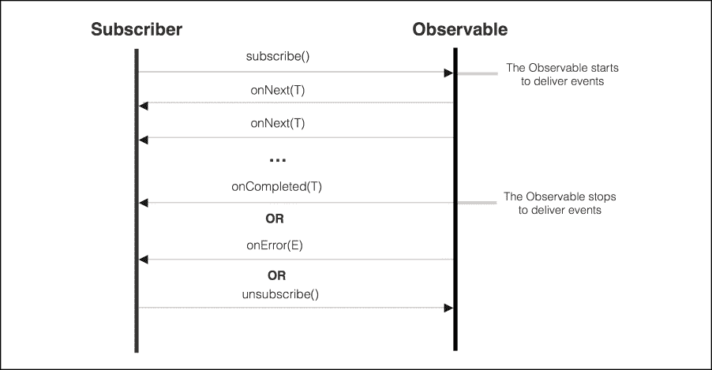
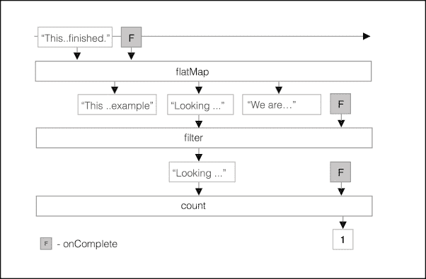

# 第十二章. 使用 RxJava 进行异步编程

在前面的章节中，我们一直在使用基于 Android 的结构，如`Loader`和`AsyncTask`，将工作从主线程卸载到低优先级的后台线程。

虽然这些直接的构造能够提供需要密集 I/O 操作或网络数据的成果，但它们不提供开箱即用的异常处理、任务组合和异步事件处理的解决方案。

此外，流行的`AsyncTask`结构无法处理`Activity`或片段配置更改或缓存配置更改之间的结果。因此，为了应对这类问题，大多数情况下开发者最终会创建大量的额外代码和复杂的流程来处理这些简单结构的特性。

为了简化可组合的异步工作开发，我们将向您介绍`RxJava`，这是一个函数式框架，它允许我们观察、转换、过滤并对事件流（点击、触摸、网络、I/O 事件等）做出反应，以便组合能够响应错误和链式异步计算的复杂执行行。

在本章中，我们将涵盖以下主题：

+   RxJava 简介

+   创建 Observables

+   转换 Observables

+   理解调度器

+   使用调度器执行异步 I/O

+   使用 RxJava 组合任务

+   使用 RxJava 观察 UI 事件

+   使用 RxJava 组合任务

+   使用 Subjects 进行工作

# RxJava 简介

`RxJava`是 Reactive Extensions (`ReactiveX`)在 JVM 上的实现，由 Netflix 开发，用于组合对可观察事件源的异步事件处理。

该框架通过允许我们创建可以被操作（输入/输出）函数拦截的事件流来扩展`Observer`模式，这些函数可以修改原始事件流并将结果或错误传递给最终的`Observer`。该框架抽象掉了诸如低级线程、同步、线程安全、并发数据结构和非阻塞 I/O 等问题。

在`RxJava`处理中，有三个主要的基本构建块相互作用，即`Observable`、`Observer`和`Subscriber`。

`Observable`是一个实体，它在任何时间点可以发出类型为 T（如 String 或任何 Java 类型）的事件序列（零个或多个事件），或者在事件处理过程中发生失败时发出`Throwable`。除此之外，它还提供了订阅其事件流和管理`Observer`订阅的方法。

`Single`是一种特殊的 Observable，它只能发出单个成功事件值或错误事件。

`Observer`，在注册为订阅者后，会消费由`Observable<T>`生成的类型为`T`的事件。一个`Observer`必须实现`Observer<T>`：

```java
public interface Observer<T> {

    void onCompleted();
    void onError(Throwable e);
    void onNext(T t);
}
```

任何 `Observer` 都会在它订阅的 `Observable` 发出新事件时接收到 `onNext` 回调，直到它收到 `onCompleted` 或 `onError` 以关闭事件流。

`Subscriber` 是一个辅助抽象类，如果你想要订阅支持，可以用作你的观察者的基类。`Subscriber` 类提供了取消 `Observable` 订阅的方法：

```java
abstract class Subscriber<T>
   implements Observer<T>, Subscription

public interface Subscription {

   void unsubscribe();
   boolean isUnsubscribed();
}
```

`unsubscribe` 是用于取消 `Observer` 订阅的函数。因此，一旦 `Observer` 订阅被终止，订阅者将不再接收由 `Observable` 生成的事件。

这里是一个简单的图表，展示了 `Observable` 和 `Subscriber` 之间的常见交互：



当 `Observable` 发出一个新项目时，`onNext(T)` 观察者回调会被调用。

当发现错误条件并且流将被终止时，`onError(Throwable)` 观察者回调会被调用以通知。

当流成功完成并且所有事件都成功传递时，`onCompleted()` 观察者回调会被调用以指示流已完成。

## 冷与热 Observable

根据 `Observable` 开始发出事件的时间，它可以被分类为热或冷。一个冷的 `Observable` 只有当观察者订阅它时才会开始向观察者发出事件。在这种情况下，预期观察者将接收到从开始到现在的流。

一个热的 `Observable` 会在创建后立即开始发出事件，因此观察者只会接收到订阅创建后发出的事件。在订阅之前发出的事件不会被观察者接收到。

# RxJava 设置

在我们继续之前，让我们将所需的库添加到你的项目中。如果你使用的是 Android Studio，只需将以下依赖项添加到模块 `build.gradle` 脚本中：

```java
dependencies {
    …
    compile 'io.reactivex:rxandroid:1.1.0'
    compile 'io.reactivex:rxjava:1.1.0'
}
```

`rxjava` 是一个库，它实现了 Java 上的响应式扩展 ([`reactivex.io/`](http://reactivex.io/))，而 `rxandroid` 是一个库，它为 Android 应用程序中用 `RxJava` 编写响应式组件添加了类。

# 创建 Observables

要创建一个 `Observable`，我们可以使用 `create` 函数从头开始创建一个 `Observable` 并显式调用观察者方法，或者我们可以使用内置的 `Observable` 创建方法，这些方法将常见的数据类型转换为 `Observable` 流。

让我们从简单的例子开始，创建一个使用创建 `Observable.from` 操作符发出 `String` 的 `Observable`：

```java
Observable<String> myObservable =
  Observable.from(Arrays.asList("Hello from RxJava",
                                "Welcome...",
                                "Goodbye"));
```

`Observable.from` 静态函数从一个数组创建 `Observable`，该数组将同步地将 `String` 项发出到任何观察者。创建的 `Observable` 将是一个冷 `Observable`，并且只有在观察者订阅它之后才会开始发出事件。

现在，让我们创建一个 `Subscriber`，它消费数据并将每个 `String` 打印到 Android 日志中，直到 `Observable` 调用 `onComplete` 回调：

```java
Subscriber<String> mySubscriber = new Subscriber<String>() {

  @Override
  public void onCompleted() {
    Log.i(TAG, "Rx Java events completed");
  }

  @Override
  public void onError(Throwable e) {
    Log.e(TAG, "Error found processing stream", e);
  }

  @Override
  public void onNext(String s) {
    Log.i(TAG, "New event -" + s);
  }
};
```

接下来，使用`Observable`和刚刚定义的订阅者类，一旦我们在`Observable`上订阅了`Subscriber`类，`onNext()`函数将被调用三次，传递之前定义的数组中的每个`String`。

随后，在所有`Strings`都被`Subscriber`消费后，将调用`onCompleted`函数来关闭流：

```java
myObservable.subscribe(mySubscriber);
```

`Observable`实例负责管理所有订阅，通知所有其`Subscribers`，并且它不会开始发射项目，直到我们订阅它们。

除了使用`Observable.from`或其他创建操作符之外，我们还可以通过调用`create`方法并实现`Observable.OnSubscribe<T>`来创建`Observable`，该实现明确调用`onNext`、`onError`和`onCompleted`。

让我们创建自己的`Observable`，使用`create`函数发射整数数字：

```java
Observable<Integer> myObservable = Observable.create(
   new Observable.OnSubscribe<Integer>() {
      @Override
      public void call(Subscriber<? super Integer> sub) {
          // Emitting Numbers
 sub.onNext(10);
 sub.onNext(3);
 sub.onNext(9);
          // Stream completed with success
 sub.onCompleted();
      }
  }
);
```

记住，一个表现良好的`Observable`必须在通过调用订阅者的`onNext`函数发射所有项目后，恰好一次尝试调用观察者的`onCompleted`或`onError`。

注意，之前的`Observable`也被归类为冷`Observable`，因为它只有在有订阅者实体订阅它时才会开始发射。

或者，我们可以使用`Action`函数订阅`Observable`，以处理在不同分离的函数中分发的项目。你需要做的只是传递一个`Action1<T>`函数用于事件处理，一个`Action1<Throwable>`用于错误发射，以及`Action0`以接收流完成通知。

让我们编写所需的动作函数，以响应我们的`Observable<String>`发射：

```java
Action1<Integer> onNextAction = new Action1<Integer>() {
  @Override
  public void call(Integer s) { Log.i(TAG, "New number :" + s); }
};
Action1<Throwable> onError = new Action1<Throwable>() {
  @Override
  public void call(Throwable t) {
     Log.e(TAG, "Error: " + t.getMessage(), t);
  }
};
Action0 onComplete = new Action0() {
  @Override
  public void call() { Log.i(TAG, "Rx number stream completed")}
};

myObservable.subscribe(onNextAction, onError, onComplete);
```

除了`from`操作符和`create`操作符函数之外，还有其他简单的`Observable`函数可以用来构建`Observable`：

+   `Observable.just`：从少量对象（最多 10 个对象）创建一个`Observable`：

    ```java
    Observable<Integer>.just(1,2,3)
    ```

+   `Observable.range`：发射一系列数字：

    ```java
    Observable.range(1,10);
    ```

# 转换`Observable`

除了广泛实现`Observable-Subscribe`软件模式的能力之外，`RxJava`框架还允许我们通过使用`Observable`操作符来转换、过滤、转换、聚合、操作和与`Observable`发射的项目流一起工作。这些实体能够在事件交付给最终的`Subscriber`之前完全转换事件流。

`RxJava`附带了一系列方便的操作符，能够转换事件的内容并控制事件交付的时间。

让我们描述在`RxJava`上可用的最常见操作符：

+   `map`：对每个发射的项目应用一个函数，并将函数的结果作为新项目发射。

+   `flatMap`：对源`Observable`发射的每个项目应用一个函数，其中该函数返回一个`Observable`，该`Observable`可以发射不同数量的项目或不同类型的事件。

+   `filter`: 一个转换操作符，它使用一个函数来验证源`Observable`发射的每个项目是否满足条件。如果条件通过，则项目被转发到后续的`Subscriber`。

+   `first`: 仅发射源`Observable`发射的第一个项目。

+   `count`: 发射从原始`Observable`接收到的项目数量。

+   `zip`: 使用一个函数将两个`Observables`的发射合并，该函数接收每个原始`Observable`的`N`个项作为参数。

+   `contains`: 发射一个`Boolean`事件，指示源`Observable`是否包含指定的`Object`。

+   `merge`: 将多个`Observers`的事件合并到一个事件流中。

+   `delay`: 通过指定的时间延迟发射一个项目。

要获取 RxJava 支持的完整、详细和最新的操作符列表，请查看 GitHub 上的`RxJava` Wiki（[`github.com/ReactiveX/RxJava/wiki/Alphabetical-List-of-Observable-Operators`](https://github.com/ReactiveX/RxJava/wiki/Alphabetical-List-of-Observable-Operators)）。

`RxJava`操作符通常处理一个`Observable`并返回一个`Observable`。这个设计特性允许我们链式调用操作符，创建一个由操作符组成的转换事件流序列。最后一个操作符负责将项目传递给`Subscriber`，或者在出错时传递错误。

现在，让我们创建第一个操作符示例，该示例将转换源`Observable`发射的多行文本，并传递一个包含包含单词`RxJava`的行数的整数。

```java
String content = "This is an example \n " +
                 "Looking for lines with the word RxJava\n" +
                 "We are finished.";
Observable
  .just(content)
  .flatMap(new Func1<String, Observable<String>>() {
    @Override
    public Observable<String> call(final String content) {
      return Observable.from(content.split("\n"));
    }})
  .filter(new Func1<String, Boolean>() {
       @Override
    public Boolean call(final String line) {
      return line.contains("RxJava");
    }
  })
  .count()
  .subscribe(new Subscriber<Integer>() {
    ...
    @Override
    public void onNext(Integer s) {
      Log.i(TAG, "Number of Lines " + s);
    }
  });
```

首先，我们使用`Observable.just`创建操作符从原始数据创建一个`Observable`，并将文本源作为唯一对象传递。

接下来，为了将原始文本拆分为行，我们使用`flatMap`操作符，它接收第一个`Observable`发射的原始文本，并返回一个由切片行数组创建的新`Observable`。

来自`flatMap`操作符的新`Observable`将为原始内容中的每一行发射一个单独的`String`，因此，为了计算包含单词`RxJava`的行数，我们将使用过滤操作符丢弃不包含该单词的行。

最后，我们将计算发射的事件数量，并将结果发布给期望整数结果的`Subscriber`。

这是之前功能管道的图形表示。



是的。丰富的转换操作符集允许我们创建一个复杂的函数处理链，该链能够在数据传输过程中进行转换，并以可读和功能性的方式将结果传递给任何`Subscriber`对象。

# 理解调度器

有一种错误的误解和信念，即`RxJava`处理默认是多线程的。`Observable`和由指定操作符应用的转换列表在订阅时发生的同一个线程上执行。

因此，在 Android 上，如果订阅在主线程上执行，操作符链处理将在主线程上运行，直到工作完成才会阻塞 UI。

虽然这种行为可能适用于轻量级处理任务，但当操作需要 IO 交互或 CPU 密集型计算时，任务执行可能会阻塞主 `Thread` 并导致应用程序崩溃，出现 ANR。

为了简化异步和并发执行，`RxJava` 框架允许我们定义一个 `Scheduler` 实体，该实体定义了工作单元执行的线程。

`subscribeOn(Scheduler)` 操作符允许我们设置定义订阅已发生的线程和 Observable 将开始操作的 `Scheduler`。

如果未指定 `Scheduler`，Observable 和操作将在调用 `subscribe` 函数的线程上运行。

在 Android 上，通常从运行在主线程上的 Android Activity 或 Fragment 中调用 `subscribe` 函数，然后如果任何操作需要大量时间才能完成，它将阻塞 UI 线程并降低 UI 响应性。

通过控制订阅发生的线程，我们控制了 Observable 和其操作符将要执行的线程，甚至控制了订阅者将接收回调的线程。

`observeOn(Scheduler)` 允许我们设置定义回调（`onNext`、`onError`、`onCompleted`）调用的线程的 `Scheduler`。

在 Observable 和操作符链中，我们可以多次使用 `ObserveOn` 来更改计算将运行的线程。

为了简化 `Scheduler` 的使用，`RxJava` 和 `RxAndroid` 库编译了一个预定义的 `Schedulers` 列表，可以直接使用来创建多线程异步链。

+   `Schedulers.immediate()`: 默认 `Scheduler`，返回一个在当前线程中立即执行工作的 `Scheduler`。

+   `Schedulers.trampoline()`: 返回一个 `Scheduler`，该 `Scheduler` 将当前线程中的工作排队，在当前工作完成后执行。

+   `Schedulers.newThread()`: 返回一个 `Scheduler`，创建一个新线程，并在新 `Thread` 上执行工作。

+   `Schedulers.computation()`: 返回一个用于计算密集型工作的 `Scheduler`。这可以用于事件循环、处理回调和其他计算工作。不要在此 `Scheduler` 上执行阻塞 IO 工作。此 `Scheduler` 使用固定大小的线程池，其大小取决于 CPU 以优化 CPU 使用并最小化 CPU 切换。

+   `Schedulers.io()`: 创建并返回一个 `Scheduler`，该 `Scheduler` 执行一个按需增长和缩小的线程池的工作，重用已创建的空闲线程来执行所需的工作。此 `Scheduler` 旨在异步执行阻塞 IO 任务，如网络或文件系统读写。

+   `Scheduler.from(Executor)`: 创建一个将在作为参数传递的`java.util.concurrent.Executor`上执行工作单元的`Scheduler`。

+   `AndroidSchedulers.mainThread()`: 创建一个在 Android 应用程序主线程上执行所需工作的`Scheduler`。这个由`RxAndroid`库提供的 Android `Scheduler`基于运行工作单元的串行`HandlerThread`。

+   `HandlerScheduler.from(Handler)`: 创建一个在指定的`Handler`上执行工作的`Scheduler`。`AndroidSchedulers.mainThread()`是这个`Scheduler`的一个特殊化，它在连接到 Android UI 线程的`Handler`上运行。

### 注意

默认情况下，`Rxjava`使用`Schedulers.immediate()`，它将观察者订阅到当前线程，并在当前线程上传递事件。

RxJava 允许我们定义自己的调度器，但就本书的范围而言，我们只会使用内置的调度器来满足我们的并发需求。

# 使用调度器执行 IO 操作

在下一个示例中，我们将使用`Schedulers`来模拟`AsyncTask`的行为，并在后台线程上从网络检索文本。随后，结果将发布到一个在主`Thread`上运行的`Subscriber`。

首先，我们将创建一个函数，该函数创建一个`Observable`，它发出从网络检索到的`String`：

```java
Observable<String> getTextFromNetwork(final String url) {

  return Observable.create(
    new Observable.OnSubscribe<String>() {
      @Override
      public void call(Subscriber<? super String> sub) {
        try {
          String text = downloadText(url);
 sub.onNext(text);
 sub.onCompleted();

        } catch (Throwable t) {
 sub.onError(t);
        }
      }
    }
  );
}
```

在我们指定用于运行异步调用的`Scheduler`之前，我们需要声明两个假设：

+   由于在`Observable`上运行代码执行网络操作，我们必须在后台线程上运行`Observable`。

+   为了发布结果并更新 UI，我们必须在主`Thread`上执行我们的订阅者回调

现在，让我们根据之前的假设和前面描述的`Scheduler`实体来构建异步的`RxJava`执行，以检索文本并更新 UI：

```java
class MySubscriber extends Subscriber<String> {

  @Override
  public void onCompleted() {}

  @Override
  public void onError(Throwable e) {
     // Shows a Toast on Error
     Toast.makeText(RxSchedulerActivity.this,
                    e.getMessage(),
                    Toast.LENGTH_LONG).show();
    Log.e(TAG, "Error retrieving ", e);  
  }

  @Override
  public void onNext(String text) {
    // Updates the UI on Success
    EditText textFrame = (EditText)findViewById(R.id.text);
    textFrame.setText(text);
  }
};   

   ...

getTextFromNetwork("http://demo1472539.mockable.io/mytext")
  .subscribeOn(Schedulers.io())
  .observeOn(AndroidSchedulers.mainThread())
  .subscribe(new MySubscriber())
);
```

`subscribeOn(Schedulers.io())`将使由`getTextFromNetwork`函数创建的`Observable`在用于阻塞 IO 操作的`Scheduler.io`线程池上运行。

一旦我们调用`subscribe`函数，`downloadText`将被排队在由`Schedulers.io()`创建的`Scheduler`管理的线程上运行，在`onNext()`函数中以`String`的形式发出结果。

`observeOn(AndroidSchedulers.mainThread())`确保`Subscriber`回调`onNext`、`onCompleted`和`onError`将在 Android 主线程上运行。因此，如果网络操作成功完成，将调用`OnNext`更新 EditText 以显示获得的结果。

如果在网络执行过程中抛出任何异常，则将一个`Throwable`对象传递给`Subscriber.onError`回调，该回调在 UI 线程上执行，并在 UI 上显示一个显示错误的`Toast`。

此示例展示了在`RxJava`上异步`call`是多么简单和简洁。此外，它抽象了您从线程管理中，就像`AsyncTask`所做的那样，并提供异常处理功能来处理异常错误。

# 取消订阅

当活动（Activity）或片段（Fragment）被销毁时，我们的链式操作可能会在后台继续运行，如果链式操作中包含对 Activity 或 Fragment 的引用，则可能会阻止 Activity 被销毁。当你不再需要链式操作的结果时，取消订阅并终止链式操作执行是有意义的。

当我们调用`Observable.subscribe()`函数时，它返回一个 Subscription 对象，可以用来立即终止链式操作：

```java
Subscription subscription = getTextFromNetwork(
               "http://demo1472539.mockable.io/mytet")
               ...
               .subscribe(new MySubscriber());
```

再次强调，对于这个任务来说，最合适的 Activity 生命周期方法是`onPause`，因为它在 Activity 完成之前一定会被调用：

```java
protected void onPause() {
  super.onPause();
  if ((subscription != null) && (isFinishing()))
    subscription.unsubscribe();
}
```

# 编写可观察对象

正如我们之前解释的，`Observable`接口是以一种允许我们链式组合不同的`Observables`来以函数式和声明式的方式创建复杂任务的方式定义的。

从我们之前的工作开始，在我们的下一个示例中，我们将利用`RxJava`的组成特性，执行一个依赖于前一个`Observable`的第二个网络调用，该`Observable`将使用网络服务下载的文本进行翻译，在我们将翻译后的文本发射到`Subscriber`之前。

为了在逻辑上独立的单元上执行网络翻译，我们将创建一个新的`Observable`，该`Observable`接收要翻译的文本，在网络中执行任务，并将翻译后的文本作为 String 类型输出给后续的`Observable`：

```java
Observable<String> translateOnNetwork(final String url,
                                      final String toTranslate) {
  return Observable.create(
    new Observable.OnSubscribe<String>() {
      @Override
      public void call(Subscriber<? super String> ts){
        try {
          String text = translateText(
            "http://demo1472539.mockable.io/translate",
             toTranslate);

 sub.onNext(text);
 sub.onCompleted();
        } catch (Throwable t) {
 sub.onError(t);
        }
      }
    }
  );
}
```

接下来，我们准备使用之前使用的相同`Subscriber`来链式执行网络操作并在 UI 上显示结果：

```java
getTextFromNetwork(RETRIEVE_TEXT_URL)
  .flatMap(new Func1<String, Observable<String>>() {
    @Override
    public Observable<String> call(String toTranslate) {
      return translateOnNetwork(TRANSLATE_URL, toTranslate);
    }
  })
  .subscribeOn(Schedulers.io())
  .observeOn(AndroidSchedulers.mainThread())
  .subscribe(new MySubscriber());
```

在`translateOnNetwork`上定义的网络 IO 操作，它依赖于`getTextFromNetwork`，只有在前一个操作成功完成后才会运行，并将`getTextFromNetwork`的结果作为参数。

在`translateOnNetwork Observable`接收到前一个网络操作中的文本内容后，它将使用这些内容作为其操作的输入，并在网络上对前一个内容进行翻译，调用函数`translateText(url, content)`。

由于`translateText()`成功完成，翻译后的内容被传递到下一个`Observable`。由于下一个`Observable`是`Subscriber`，结果在主线程上透明地传递，以更新 UI。

此外，由于我们重写了`Subscriber`的`onError`函数，如果在执行网络请求的过程中出现错误，错误将被传播到我们的回调函数中，以便得到适当的处理。因此，通过几行代码，我们能够通知用户异步任务失败，并且我们未能将预期的数据传递给他们。

太好了，我们用几行代码创建了一个复杂的任务，该任务在后台执行一系列异步网络操作，在主线程上交付结果，或者在出现错误时交付错误。

# 监控事件流

虽然到目前为止我们一直在使用 `Observable` 操作符来操作流事件，但也有一些操作符允许我们监控事件而不改变它们。这些操作符有时被称为实用操作符，能够在源 `Observable` 和最终 `Subscriber` 之间创建的 `Observable` 链上对事件或错误做出反应，而不产生任何副作用。

让我们列举它们并解释更常见的用于观察事件流的实用操作符：

+   `doOnSubscribe(Action0)`：注册一个 `Action0` 函数，当 `Subscriber` 订阅 `Observable` 时调用。

+   `doOnUnsubscribe(Action0)`：注册一个 `Action0` 函数，当 `Subscriber` 从 `Observable` 取消订阅时调用。

+   `doOnNext(Action1)`：注册一个 `Action1`，当源 `Observable` 发出新事件时调用。事件 `<T>` 对象也作为参数传递给 `Action1` 函数。

+   `doOnCompleted(Action0)`：注册一个 `Action0` 函数，当源 `Observable` 发出 `onComplete` 事件时调用。

+   `doOnError(Action1)`：注册一个 `Action1` 函数，当源 `Observable` 发出错误时调用。`OnError` 上发出的 `Throwable` 也传递给 `Action1.call` 函数。

+   `doOnTerminate(Action0)`：注册一个 `Action0` 函数，当源 `Observable` 发出错误或 `onComplete` 时调用。此回调函数还意味着之前的 `Observable` 将不再发出更多项目。

这些多用途操作符将允许我们观察和调试通常涉及多个转换的复杂链，创建进度对话框显示进度，缓存结果，甚至生成处理分析。

在我们的下一个示例中，我们将使用这些操作符在 Android 日志中记录我们之前的多网络操作的进度，并在操作进行时在屏幕上显示进度对话框：

```java
Observable.just(RETRIEVE_TEXT_URL)
  .doOnNext(new Action1<String>() { // Runing on the main Thread
    @Override
    public void call(String url) {
      progress = ProgressDialog.show(RxSchedulerActivity.this,
                 "Loading",
                 "Performing async operation", true);
      Log.i(TAG, "Network IO Operation will start "+ tmark());
    }
  })
  .observeOn(Schedulers.io()) // Running on a background Thread
  .flatMap(new Func1<String, Observable<String>>() {
    @Override
    public Observable<String> call(String url) {
      return getTextFromNetwork(url);
    }
  })
  .doOnNext(new Action1<String>() {
    @Override
    public void call(String text) {
      Log.i(TAG, "Text retrieved w/ success " + tMark());
      Log.i(TAG, "Translating the text " + tMark());
    }
  })
  .flatMap(new Func1<String, Observable<String>>() {
    @Override
    public Observable<String> call(String toTranslate) {
      return translateOnNetwork(TRANSLATE_URL, toTranslate);
    }
  })
  .doOnNext(new Action1<String>() {
    @Override
    public void call(String translatedText) {
      Log.i(TAG, "Translation finished " + tMark());
    }
  })
  .observeOn(
    AndroidSchedulers.mainThread() // Executing on main Thread
   )
  .doOnTerminate(new Action0() {
    @Override
    public void call() {  
      if (progress != null)
        progress.dismiss();
      Log.i(TAG, "Dismissing dialog " + tMark());
    }
  })
  // Starts the execution on the main Thread
  .subscribeOn(AndroidSchedulers.mainThread())
  .subscribe(new MySubscriber());
```

如你所知，要在 Android UI 中进行更改，运行代码在主线程上至关重要。因此，为了在主线程中从第一个 `Observable` 接收 `doOnNext`，我们使用 `subscribeOn()` 并传入 `AndroidSchedulers.mainThread()`，强制第一个 `Observable`（使用 `just` 操作符创建的），向主线程中的 `doOnNext` 发送通知。

一旦 `doOnNext()` 收到包含要检索文本的 URL 的字符串的通知，我们就在 UI 中显示进度对话框，并在 Android 日志中记录一条消息。

接下来，由于我们想在主线程之外执行网络操作，使用 `observeOn` 操作符，我们强制后续 `Observable` 向由 `IO Scheduler` 管理的线程发送通知。这意味着后续的操作符和 `Observable` 将在 IO `Scheduler` 线程中执行并发出事件。

同时，在每次网络操作之间，我们拦截第二个网络操作的开始，在`getTextFromNetwork`和`translateOnNetwork Observables`之间使用`doOnNext`打印 Android 中的消息。

当网络操作完成时，在我们用结果更新 UI 并关闭进度对话框之前，我们再次通过调用带有主`Thread Scheduler`的`observeOn()`操作符将执行切换到主线程。

在我们在屏幕上显示结果之前，使用`doOnTerminate`操作符注册一个`Action`函数，以便在之前启动的进度对话框中调用以关闭它。如前所述，无论链路以成功或错误结束，该函数都将被调用。

最后，将调用`Subscriber`回调来更新 UI 显示返回的结果或显示错误信息。

如果网络操作以成功结束，你应在 Android 日志中看到类似的日志流：

```java
...54.390 I Network IO Operation will start T[main]
...54.850 I Text retrieved w/ success T[RxCachedThreadScheduler-1]
...54.850 I Translating the text T[RxCachedThreadScheduler-1]
...55.160 I Translation finished T[RxCachedThreadScheduler-1]
...55.200 I Dismissing dialog on T[main]
```

为了调试目的，`[<Thread_Name>]`显示了记录消息的线程名称。

# 组合 Observables

在上一个示例中，我们使用了两个`Observable`来创建一个简单的网络操作序列。第二个异步操作使用第一个操作的结果操作，这两个按顺序执行的操作产生了一个字符串结果，用于更新 UI。

在我们的下一个示例中，我们将并行运行两个任务，并使用一个组合的`RxJava`操作符将两个操作的结果合并。每个操作将异步地从网络检索 JSON 对象，并将两个结果合并到 JSON 对象中，以生成传递给 UI 主`Thread`的 JSON 字符串。

由于我们只想从操作中发出一个事件或错误，我们将首次使用一种特殊的观察者类型，即`Single`。

虽然`Observable`能够调用`onNext`、`onError`和`onCompleted`观察者函数，但`Single`实体将只调用`onSuccess`或`onError`到`SingleSubscriber`：

```java
 // Success callback invoked on success
 void onSuccess(T value);

 // Callback to notify that an unrecoverable error has occurred
 void onError(Throwable error);
```

在其中一个回调函数被调用后，`Single`完成，对其的订阅结束。像常规`Observable`一样，`Single`对象发出的事件可以在到达最终的`SingleSubscriber`之前使用操作符进行处理。

现在，让我们定义两个从网络检索单个`JSONObject`的`Single`操作：

```java
Single<JSONObject> postSingle = Single.create(
  new Single.OnSubscribe<JSONObject>() {
    @Override
    public void call(SingleSubscriber<? super JSONObject> sub) {
      try {
        // Retrieve the Post content JSON Object
        sub.onSuccess(
         getJson("http://demo1472539.mockable.io/post"));
      } catch (Throwable t) {
        sub.onError(t);
      }
    }
  }
).subscribeOn(Schedulers.newThread());

Single<JSONObject> authorSingle = Single.create(
  new Single.OnSubscribe<JSONObject>() {
    @Override
    public void call(SingleSubscriber<? super JSONObject> sub) {
      try {
        // Retrieve the Author content JSON Object
        sub.onSuccess(
          getJson("http://demo1472539.mockable.io/author"));
      } catch (Throwable t) {
        sub.onError(t);
      }
    }
  }
).subscribeOn(Schedulers.newThread());
```

就像我们对之前的`Observable`所做的那样，我们使用了`Single.create`静态函数来构建一个自定义的`Single`实体，该实体在网络操作成功完成时显式调用`SingleSubscriber.onSuccess`函数，或者在`getJson`IO 操作抛出错误时调用`SingleSubscriber.onError`函数。

`getJSON`函数基本上通过连接到提供的 HTTP URL 来检索 JSON 对象，并返回一个`JSONObject`。

通过强制将 `Single` 对象 `subscribeOn` 到 `newThread Scheduler`，我们允许每个自定义的 `Single` 实体在新线程上并发运行它们的操作。

由于这两个操作将并行运行，我们需要使用组合操作符将 `Single` 结果组合成一个单一的 `JSONObject`，并将生成的 JSON `String` 发射到最终的 `SingleSubscriber`。对于我们的示例，合适的组合操作符是 `zip`，因为它能够等待两个或更多 `Single/Observable` 的结果，并对每个 `Single` 输出对象应用一个函数。

接收发射对象作为参数的函数可以产生相同类型或不同类型的结果。

这是将两个 `Single` 合并成一个 `Single<R>` 的 `zip` 操作符函数定义：

```java
   Single<R> zip(Single<T1> o1, // First Single
                 Single<T2> o2, // Second Single
                 final Func2<T1,T2,R> zipFunction)
```

在我们的示例中，`R` 是一个 `String`，`T1` 和 `T2` 是 `JSONObject`，而 `zipFunction` 接收 `JSONObjects` 参数以生成一个 `String` 作为结果。

现在，我们已经准备好使用 `zip` 操作符并将每个独立的异步操作的结果组合成一个 `String`。生成的字符串将更新一个 `Widget`，因此最终的 `Subscriber` 应该在主线程中调用。

让我们编写获取 `JSONObject` 部分并将生成的 `String` 分派到 UI 的功能代码：

```java
Single.zip(postSingle, authorSingle,
           new Func2<JSONObject, JSONObject, String>() {
  @Override
  public String call(JSONObject post, JSONObject author) {
    String result = null;

    // Create the Root JSON Object
    JSONObject rootObj = new JSONObject();
    try {
      // Add the post object to root JSON Object
      rootObj.put("post", post);
      // Add the author object to root JSON Object
      rootObj.put("author", author);
      // Save the JSON Object, Encode the JSON Object
      // into a String
       result = rootObj.toString(2);
    } catch (Exception e) {
       Exceptions.propagate(e);
    }
    return result;
  }
})
.observeOn(AndroidSchedulers.mainThread())
.subscribe(subscriber);
```

使用 `zip` 操作符，我们将两个操作的结果，`postSingle` 和 `authorSingle`，在由 `newThread` Scheduler 创建的新线程上组合，在接收两个 `JSONObjects` 作为参数并生成 `String` 的 `Func2` 上。

由于我们已经将 `Single` 订阅到在其自己的线程上工作，`zip` 函数将在由最后定义的 `Single` (`authorSingle`) 构建的线程上合并两个 `Singles` 的结果，产生类似于以下输出的日志：

```java
.040 I ...: Getting the Post Object on RxNewThreadScheduler-1
.050 I ...: Getting the Author Object on RxNewThreadScheduler-2
.660 I ...: Combining objects on RxNewThreadScheduler-2
```

在合并对象后，`Func2` 生成的 `String` 将被发送到主 `Thread` 中的最终 `Subscriber`。

剩下的只是实现一个简单的 `SingleSubscriber` 来更新 UI：

```java
SingleSubscriber<String> subscriber =
  new SingleSubscriber<String>() {
  ...
  @Override
  public void onSuccess(String result) { // Updates the UI }
};
```

# 使用 RxJava 观察 UI 事件

到目前为止，我们一直在使用 `RxJava` 处理和操作数据流，这简化了需要 IO 阻塞操作并可能挂起应用程序一段时间的异步开发。

在本节中，我们想要解释如何使用 `RxJava` 和响应式流来简化处理由 Android Widgets 生成的 UI 事件。

在我们的下一个示例中，我们将展示一个带有即时搜索结果输入字段的足球队伍列表。当你输入输入字段时，如果你输入的文本与列表中任何足球队伍的名称开头匹配，列表中的可用名称将被过滤。

为了达到所需的结果，我们将创建一个自定义的 `Observable`，该 `Observable` 将 `TextWatcher` 绑定到搜索输入字段，监听 `onTextChanged` 事件，并在文本更改时发射一个字符串事件。

观察者将提供一个响应式功能流，该流将过滤 Recycler View 中的队伍列表。

首先，我们将编写一个自定义可观察对象，当 `Observer` 订阅时，它会将 `TextWatcher` 注册到 `EditField`，并在订阅结束时注销 `TextWatcher`：

```java
public class TextChangeOnSubscribe
 implements OnSubscribe<String> {
  // Don't Prevent the GC from recycling the Activity
  WeakReference<EditText> editText;

  // Receive the EditText View to verify Changes
  public TextChangeOnSubscribe(EditText editText) {
    this.editText = new WeakReference<EditText>(editText);
  }

  @Override
  public void call(final Subscriber<? super String> subscriber) {
    final TextWatcher watcher = new TextWatcher() {

      @Override
      public void onTextChanged(
        CharSequence s, int start, int before, int count) {

        // Emit a new String when the text changes
        if (!subscriber.isUnsubscribed()) {
 subscriber.onNext(s.toString());
 }
      }
    };
    // Remove the Text change Watcher when the subscription ends
    subscriber.add(new MainThreadSubscription() {
      @Override
      protected void onUnsubscribe() {
        editText.get().removeTextChangedListener(watcher);
      }
    });
    // Sets the Watcher on the EditField
    editText.get().addTextChangedListener(watcher);
    subscriber.onNext("");
  }
};

...
EditText search = (EditText) findViewById(R.id.searchTv);
Observable<String> textChangeObs = Observable.
    create(new TextChangeOnSubscribe(search))
                                                     .debounce(400, TimeUnit.MILLISECONDS);
```

实现 `OnSubscribe<String>` 并接收订阅回调的 `TextChangeOnSubscribe` 类，一旦通过 `Subscriber` 执行订阅，就会在接收到的 `EditField` 中设置一个 `TextWatcher`。

当 `TextWatcher.onTextChanged` 被调用以通知 `EditField` 中的文本更改时，应该在订阅者中发出一个新的包含新内容的字符串事件。

要在 `EditField` 中注销 `TextWatcher`，我们在订阅者列表中添加一个 `MainThreadSubscription` 匿名类，该类从 `EditField` 中移除我们的 `TextChangeListener`。

为了防止文本更改事件在 UI 中生成过多的更新，我们使用了 `debounce` 操作符，只有在自上次文本更改事件以来有 400 毫秒的延迟时，才会发出新的搜索词。

接下来，我们将使用由我们的可观察对象生成的搜索事件来过滤 `ReciclerView` 列表中的队伍：

```java
List<String> soccerTeams = Arrays.asList(
  "Real Madrid","Barcelona","Sporting CP",...,"Chelsea");

subcription = Observable.combineLatest(
  // Observables
 Observable.just(soccerTeams), textChangeObs,
  // Combine Function
  new Func2<List<String>, String, List<String>>() {

    // Filter the list with the filter String and sort the list
    @Override
    public List<String> call(List<String> fullList,
                             String filter){
      List<String> result = new ArrayList<String>();
      for (String team : fullList) {
        if (team.startsWith(filter)) {
          result.add(team);
        }
      }
 // Sort the Collection
      Collections.sort(result);
      return result;
    }
  })
 .observeOn(AndroidSchedulers.mainThread())
  .subscribe(new Action1<List<String>>() {
    @Override
    public void call(List<String> teams) {
      // Update the Recycler View with a filtered list of Teams
      mAdapter = new MyAdapter(teams);
      mRecyclerView.setAdapter(mAdapter);
    }
  });
```

为了通过 `textChangeEvent` 发射的搜索词过滤足球队伍列表，我们在 `textChangeObs` 可观察对象和通过 `just` 操作符创建的足球队伍列表的可观察对象上应用了 `combineLatest` 操作符。

`combineLatest` 将使用指定的函数组合每个可观察对象发出的最新项，并根据该函数调用的结果发出项。

组合这两个可观察对象的函数将简单地使用 `onTextChanged` 发出的最后文本内容过滤足球列表，并对结果列表进行排序。

为了最终完成，创建一个新的 `RecyclerView.Adapter`，使用结果 `List<String>`，并将过滤后的队伍列表显示给用户。

注意，为了使用结果过滤列表更新我们的 `RecyclerView`，我们通过将 Android 主线程 `Scheduler` 传递给 `observeOn` 操作符，显式地将 `Observer` 设置为在主线程上运行。

### 注意

不要忘记在销毁 Activity 之前通过调用 `subcription.unsubscribe();` 终止订阅。

尽管出于教育目的，我们是从 Android EditField 小部件的文本更改事件中构建了自己的可观察对象，但有一个易于使用的开源库名为 RxBinding ([`github.com/JakeWharton/RxBinding`](https://github.com/JakeWharton/RxBinding))，它能够为 Android SDK 中大多数可用的 Android 小部件创建可观察对象。

如果你不想实现自己的可观察对象，或者以传统方式处理 UI 事件，你可以利用它来使用功能性的 RxJava 反应式范式处理 Android UI 事件。

# 与主题一起工作

到目前为止，我们一直在使用 `Observables`、`Subscriber`、`Observer` 和 `Scheduler` 实体来创建我们的 `RxJava` 函数式处理流程。在本节中，我们将向读者介绍 `RxJava` 框架中的新实体，即 `Subject`。`Subject` 是一种适配器或桥梁实体，充当 `Observable` 和 `Observer`：

```java
public abstract class      Subject<T,R>
                extends    Observable<R>
                implements Observer<T>
```

由于它可以充当 `Subscriber`，它可以订阅一个或多个发出泛型类型 `T` 的 `Objects` 的 `Observables`，并且由于它充当 `Observable`，它可以发出泛型类型 `R` 的事件并接收来自其他 `Subscriber` 的订阅。因此，它可以发出与接收相同类型的事件或发出不同类型的事件。

例如，`Subject<String, Integer>` 将接收类型为 `String` 的事件并发出类型为 `Integer` 的事件。

`Subject` 可以接收来自 `Observable` 的事件，并生成具有不同时序的新事件流，代理事件，转换为新的事件类型，排队事件，转换事件，甚至生成新事件。

`Subject` 总是被视为热 `Observable`，并在创建后立即开始发出事件。这是一个非常重要的 `Subject` 功能，当你想要处理完整的事件流序列时，你应该考虑它。

**RxJava** 包含一些标准 **Subject** 类，旨在用于不同的用例。以下列表将列举最常见的几个：

+   `AsyncSubject`：只有当源 `Observer` 通过调用 `onComplete()` 完成流时，才会发出源 `Observable` 最后发出的项目

+   `PublishSubject`：该 `Subject` 只向观察者传递订阅后发出的事件

+   `ReplaySubject`：发出源 `Observable` 发出的所有事件，即使是在订阅之前发出的

+   `BehaviorSubject`：在订阅完成后，发出源 `Observable` 最后发出的项目，然后继续发出源 `Observable` 发出的其他任何项目

在以下示例中，我们将向您展示如何使用 `PublishSubject` 并演示事件如何传播到最终订阅并后来取消订阅 `Subject` 的 `Observer`。此外，我们将在订阅前后向 `Subject` 提交事件：

```java
PublishSubject<Integer> pubSubject = PublishSubject.create();
pubSubject.onNext(1);
pubSubject.onNext(2);
Subscription subscription = pubSubject.doOnSubscribe(new Action0() {
  @Override
  public void call() {
    Log.i(TAG, "Observer subscribed to PublishSubject");
  }
}).doOnUnsubscribe(new Action0() {
  @Override
  public void call() {
    Log.i(TAG, "Observer unsubscribed to PublishSubject");
  }
}).subscribe(new Action1<Integer>() {
  @Override
  public void call(Integer integer) {
    Log.i(TAG, "New Event received from PublishSubject: " + integer);
  }
});
pubSubject.onNext(3);
pubSubject.onNext(4);
subscription.unsubscribe();
pubSubject.onNext(5);
pubSubject.onCompleted();
```

首先，我们通过调用 `PublishSubject.create` 静态函数创建了 `PublishSubject`，然后我们开始向其中传递整数并调用 `onNext` 函数。

同时，我们使用 `Action1` 函数订阅了 `Subject` 以消费事件。

为了打印订阅和取消订阅的确切时间，我们向 `doOnUnsubscribe` 和 `doOnSubscribe` 提供了一个 `Action0` 函数，该函数将消息打印到 Android 日志。

因此，上面的代码应该输出以下结果：

```java
... 43.230 I Observer subscribed to PublishSubject
... 43.230 I New Event received from PublishSubject: 3
... 43.230 I New Event received from PublishSubject: 4
... 43.230 I Observer unsubscribed to PublishSubject
```

如前所述，只有当最终的 `Observer` 订阅时发出的事件才会被发射到 `Action` 回调。因此，在订阅之前提交和取消订阅之后提交的事件不会被我们的 `Subscriber` 接收。

现在，为了比较，让我们尝试比较由 `ReplaySubject` 发射的事件流与提交给 Subject 的确切事件序列。

再次强调，`ReplaySubject` 类是通过调用 `create` 静态函数创建的，因此你应该看到以下输出：

```java
.600 I Observer subscribed to ReplaySubject
.600 I New Event received from ReplaySubject: 1
.600 I New Event received from ReplaySubject: 2
.600 I New Event received from ReplaySubject: 3
.600 I New Event received from ReplaySubject: 4
.600 I Observer unsubscribed to ReplaySubject
```

在 [`reactivex.io/documentation/subject.html`](http://reactivex.io/documentation/subject.html) 网站上，有一些图表可以帮助你直观地理解 Subject、Subscribers 和源 `Observable` 之间的交互。

如预期的那样，`ReplaySubject` 会接收提交给 `Subject` 的所有事件，即使是那些在订阅之前提交的事件也会被 `Observer` 接收。在 `Observer` 取消订阅后，它停止接收来自 `Subject` 的事件。

作为练习，你可以尝试为 `AsyncSubject` 和 `BehaviorSubject` 创建相同的操作。

# 概述

在本章的最后，我们学习了如何使用 `RxJava`，这是一个开源库，它帮助我们使用函数式和响应式处理管道处理 Android 应用程序的数据或事件流。

在前面的章节中，我们详细学习了 `RxJava` 的基本构建块——`Observable`、`Observer` 和 `Subscriber`。

接下来，我们介绍了一些 `RxJava` 最常见的操作符，这些操作符能够操作、转换和组合由 `Observable` 生成的事件流。

为了执行异步和并发操作，我们学习了 `Scheduler`，这是一个神奇的 `RxJava` 实体，它控制并发，并且能够将 `RxJava` 工作单元调度到后台线程，并将结果反馈到主 Android 线程。

接下来，通过使用自定义 `Observables` 和组合操作符，我们学习了如何关联和组合相互依赖的复杂阻塞或长时间计算操作，例如 REST API 网络操作。

同时，我们还学习了如何使用 `RxJava` 事件功能管道对发射 Android 小部件 UI 事件的自定义 `Observable` 进行响应。

最后，我们了解了 `Subject` 是 `RxJava` 实体，它可以充当 `Observer` 和 `Observable`，并且可以作为我们的源 `Observable` 和最终 `Observer` 之间的代理。

在本书的整个过程中，我们武装了自己，掌握了一系列强大的工具来构建响应式的 Android 应用程序。我们发现尽可能地将工作从主线程移除非常重要，并探讨了多种构造和异步技术，以提供最流畅和最酷的用户体验。

记住，为了保持应用程序的响应性并避免任何 UI 丢失帧，在主 UI 线程上运行的 Android 回调（`Service`、`Activity` 等）应该在 16 毫秒内终止。
