# 第一章。图形

在本章中，我们将涵盖以下主题：

+   简介

+   绘制精灵

+   为精灵上色

+   动画精灵

+   绘制 OpenGL 原语

+   播放视频文件

+   网格、粒子以及运动条纹效果

+   使用视网膜显示模式

+   1D 和 2D 缓动动作

+   渲染和纹理化 3D 立方体

+   渲染填充纹理的多边形

+   动画填充纹理的多边形

+   使用图层交换调色板

+   使用 CCTexture2DMutable 交换调色板

+   使用 AWTextureFilter 进行模糊和字体阴影

+   捕获和使用屏幕截图

+   使用 CCParallaxNode

+   使用 glColorMask 进行光照

# 简介

**Cocos2d** 首先是一个丰富的图形 API，它允许游戏开发者轻松访问广泛的功能。在本章中，我们将介绍 Cocos2d 的更多高级功能以及您如何使用这些功能来服务于各种不同的目的。我们还将解释尚未成为 Cocos2d 源代码一部分的高级技术。

为了本章节的目的，**图形**可以被认为是一个总称。我们还将介绍使用**动作**和**粒子**的高级技术。

# 绘制精灵

在 2D 游戏开发中最基本的任务是绘制一个**精灵**。Cocos2d 为用户提供了在这个领域的大量灵活性。在本食谱中，我们将介绍使用 `CCSprite`、精灵表、`CCSpriteFrameCache` 和 `CCSpriteBatchNode` 绘制精灵，还将介绍**米波映射**。为了使内容有趣且引人入胜，本书中的许多食谱都将有一个独特的主题。在本食谱中，我们看到的是来自《通过镜子看》的艾丽斯场景。

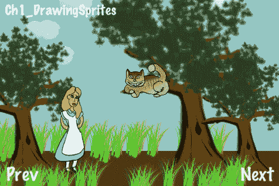

### 小贴士

您可以从您在 [`www.PacktPub.com`](http://www.PacktPub.com) 的账户中下载您购买的所有 Packt 书籍的示例代码文件。如果您在其他地方购买了这本书，您可以访问 [`www.PacktPub.com/support`](http://www.PacktPub.com/support) 并注册以将文件直接通过电子邮件发送给您。

## 准备工作

请参考项目 `RecipeCollection01` 以获取本食谱的完整工作代码。

## 如何实现...

执行以下代码：

```swift
@implementation Ch1_DrawingSprites
-(CCLayer*) runRecipe {
/*** Draw a sprite using CCSprite ***/
CCSprite *tree1 = [CCSprite spriteWithFile:@"tree.png"];
//Position the sprite using the tree base as a guide (y anchor point = 0)
[tree1 setPosition:ccp(20,20)];
tree1.anchorPoint = ccp(0.5f,0);
[tree1 setScale:1.5f];
[self addChild:tree1 z:2 tag:TAG_TREE_SPRITE_1];
/*** Load a set of spriteframes from a PLIST file and draw one by name ***/
//Get the sprite frame cache singleton
CCSpriteFrameCache *cache = [CCSpriteFrameCache sharedSpriteFrameCache];
//Load our scene sprites from a spritesheet
[cache addSpriteFramesWithFile:@"alice_scene_sheet.plist"];
//Specify the sprite frame and load it into a CCSprite
CCSprite *alice = [CCSprite spriteWithSpriteFrameName:@"alice.png"];
//Generate Mip Maps for the sprite
[alice.texture generateMipmap];
ccTexParams texParams = { GL_LINEAR_MIPMAP_LINEAR, GL_LINEAR, GL_CLAMP_TO_EDGE, GL_CLAMP_TO_EDGE };
[alice.texture setTexParameters:&texParams];
//Set other information.
[alice setPosition:ccp(120,20)];
[alice setScale:0.4f];
alice.anchorPoint = ccp(0.5f,0);
//Add Alice with a zOrder of 2 so she appears in front of other sprites
[self addChild:alice z:2 tag:TAG_ALICE_SPRITE];
//Make Alice grow and shrink.
[alice runAction: [CCRepeatForever actionWithAction:
[CCSequence actions:[CCScaleTo actionWithDuration:4.0f scale:0.7f], [CCScaleTo actionWithDuration:4.0f scale:0.1f], nil] ] ];
/*** Draw a sprite CGImageRef ***/
UIImage *uiImage = [UIImage imageNamed: @"cheshire_cat.png"];
CGImageRef imageRef = [uiImage CGImage];
CCSprite *cat = [CCSprite spriteWithCGImage:imageRef key:@"cheshire_cat.png"];
[cat setPosition:ccp(250,180)];
[cat setScale:0.4f];
[self addChild:cat z:3 tag:TAG_CAT_SPRITE];
/*** Draw a sprite using CCTexture2D ***/
CCTexture2D *texture = [[CCTextureCache sharedTextureCache] addImage:@"tree.png"];
CCSprite *tree2 = [CCSprite spriteWithTexture:texture];
[tree2 setPosition:ccp(300,20)];
tree2.anchorPoint = ccp(0.5f,0);
[tree2 setScale:2.0f];
[self addChild:tree2 z:2 tag:TAG_TREE_SPRITE_2];
/*** Draw a sprite using CCSpriteFrameCache and CCTexture2D ***/
CCSpriteFrame *frame = [CCSpriteFrame frameWithTexture:texture rect:tree2.textureRect];
[[CCSpriteFrameCache sharedSpriteFrameCache] addSpriteFrame:frame name:@"tree.png"];
CCSprite *tree3 = [CCSprite spriteWithSpriteFrame:[[CCSpriteFrameCache sharedSpriteFrameCache] spriteFrameByName:@"tree.png"]];
[tree3 setPosition:ccp(400,20)];
tree3.anchorPoint = ccp(0.5f,0);
[tree3 setScale:1.25f];
[self addChild:tree3 z:2 tag:TAG_TREE_SPRITE_3];
/*** Draw sprites using CCBatchSpriteNode ***/
//Clouds
CCSpriteBatchNode *cloudBatch = [CCSpriteBatchNode batchNodeWithFile:@"cloud_01.png" capacity:10];
[self addChild:cloudBatch z:1 tag:TAG_CLOUD_BATCH];
for(int x=0; x<10; x++){
CCSprite *s = [CCSprite spriteWithBatchNode:cloudBatch rect:CGRectMake(0,0,64,64)];
[s setOpacity:100];
[cloudBatch addChild:s];
[s setPosition:ccp(arc4random()%500-50, arc4random()%150+200)];
}
//Middleground Grass
int capacity = 10;
CCSpriteBatchNode *grassBatch1 = [CCSpriteBatchNode batchNodeWithFile:@"grass_01.png" capacity:capacity];
[self addChild:grassBatch1 z:1 tag:TAG_GRASS_BATCH_1];
for(int x=0; x<capacity; x++){
CCSprite *s = [CCSprite spriteWithBatchNode:grassBatch1 rect:CGRectMake(0,0,64,64)];
[s setOpacity:255];
[grassBatch1 addChild:s];
[s setPosition:ccp(arc4random()%500-50, arc4random()%20+70)];
}
//Foreground Grass
CCSpriteBatchNode *grassBatch2 = [CCSpriteBatchNode batchNodeWithFile:@"grass_01.png" capacity:10];
[self addChild:grassBatch2 z:3 tag:TAG_GRASS_BATCH_2];
for(int x=0; x<30; x++){
CCSprite *s = [CCSprite spriteWithBatchNode:grassBatch2 rect:CGRectMake(0,0,64,64)];
[s setOpacity:255];
[grassBatch2 addChild:s];
[s setPosition:ccp(arc4random()%500-50, arc4random()%40-10)];
}
/*** Draw colored rectangles using a 1px x 1px white texture ***/
//Draw the sky using blank.png
[self drawColoredSpriteAt:ccp(240,190) withRect:CGRectMake(0,0,480,260) withColor:ccc3(150,200,200) withZ:0];
//Draw the ground using blank.png
[self drawColoredSpriteAt:ccp(240,30) withRect:CGRectMake(0,0,480,60) withColor:ccc3(80,50,25) withZ:0];
return self;
}
-(void) drawColoredSpriteAt:(CGPoint)position withRect:(CGRect)rect withColor:(ccColor3B)color withZ:(float)z {
CCSprite *sprite = [CCSprite spriteWithFile:@"blank.png"];
[sprite setPosition:position];
[sprite setTextureRect:rect];
[sprite setColor:color];
[self addChild:sprite];
//Set Z Order
[self reorderChild:sprite z:z];
}
@end

```

## 它是如何工作的...

本食谱将带我们了解绘制精灵的多数常见方法：

+   从文件创建 CCSprite：

    首先，我们有绘制精灵最简单的方法。这涉及到使用 CCSprite 类的方法，如下所示：

    ```swift
    +(id)spriteWithFile:(NSString*)filename;

    ```

    这是初始化精灵最直接的方法，对于许多情况来说都是足够的。

+   从文件加载精灵的其他方法：

    之后，我们将看到使用 `UIImage/CGImageRef`、`CCTexture2D` 和使用 `CCTexture2D` 对象实例化的 `CCSpriteFrame` 创建 `CCSprite` 的示例。`CGImageRef` 的支持允许您将 Cocos2d 与其他框架和工具集结合。`CCTexture2D` 是纹理创建的底层机制。

+   使用 CCSpriteFrameCache 加载精灵表：

    接下来，我们将看到使用精灵最强大的方式，即 `CCSpriteFrameCache` 类。自 `Cocos2d-iPhone v0.99` 版本引入，`CCSpriteFrameCache` 单例是一个所有精灵帧的缓存。使用 **spritesheet** 及其关联的 `PLIST` 文件（使用 **Zwoptex** 创建，稍后会更详细地介绍）我们可以将多个精灵加载到缓存中。从这里，我们可以使用缓存中的精灵创建 `CCSprite` 对象：

    ```swift
    +(id)spriteWithSpriteFrameName:(NSString*)filename;

    ```

+   **Mipmapping：**

    Mipmapping 允许你在不产生精灵锯齿的情况下缩放纹理或放大缩小场景。当我们把爱丽丝缩小到很小的尺寸时，锯齿现象不可避免地会出现。开启 Mipmapping 后，Cocos2d 会动态生成低分辨率的纹理，以平滑出较小尺度下的任何像素化。请取消以下行的注释：

    ```swift
    [alice.texture generateMipmap];
    ccTexParams texParams = { GL_LINEAR_MIPMAP_LINEAR, GL_LINEAR, GL_CLAMP_TO_EDGE, GL_CLAMP_TO_EDGE };
    [alice.texture setTexParameters:&texParams];

    ```

    现在，你应该能看到爱丽丝变小时像素化的效果。

+   使用 CCSpriteBatchNode 绘制许多派生精灵：

    `CCSpriteBatchNode` 类，自 `v0.99.5` 版本开始添加，提供了一种高效的方式来重复绘制相同的精灵。创建批处理节点的方法如下：

    ```swift
    CCSpriteBatchNode *cloudBatch = [CCSpriteBatchNode batchNodeWithFile:@"cloud_01.png" capacity:10];

    ```

    然后，你可以使用以下代码创建任意数量的精灵：

    ```swift
    CCSprite *s = [CCSprite spriteWithBatchNode:cloudBatch rect:CGRectMake(0,0,64,64)];
    [cloudBatch addChild:s];

    ```

    将容量设置为计划绘制的精灵数量，告诉 Cocos2d 分配这么多空间。这是另一种提高效率的调整，尽管你并不绝对需要这样做。在这三个例子中，我们绘制了 10 个随机放置的云朵和 60 个随机放置的草丛。

+   绘制彩色矩形：

    最后，我们有一个相当简单但用途多样的技术。通过绘制一个空白 1px x 1px 白色纹理的精灵，然后着色并设置其 `textureRect` 属性，我们可以创建非常有用的彩色条：

    ```swift
    CCSprite *sprite = [CCSprite spriteWithFile:@"blank.png"];
    [sprite setTextureRect:CGRectMake(0,0,480,320)];
    [sprite setColor:ccc3(255,128,0)];

    ```

    在这个例子中，我们使用了这种技术来创建非常简单的地面和天空背景。

# 着色精灵

在上一个配方中，我们使用彩色矩形来绘制地面和天空。设置纹理颜色和透明度的能力是简单的工具，如果使用得当，可以创建非常酷的效果。在这个配方中，我们将创建一个电影场景，其中两个武士面对面，手持发光的剑。

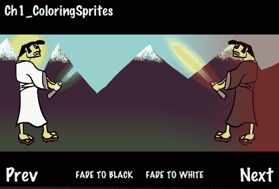

## 准备工作

请参考项目 `RecipeCollection01` 以获取此配方的完整工作代码。另外，请注意，为了简洁，一些代码已被省略。

## 如何做到...

执行以下代码：

```swift
#import "CCGradientLayer.h
@implementation Ch1_ColoringSprites
-(CCLayer*) runRecipe {
[self initButtons];
//The Fade Scene Sprite
CCSprite *fadeSprite = [CCSprite spriteWithFile:@"blank.png"];
[fadeSprite setOpacity:0];
[fadeSprite setPosition:ccp(240,160)];
[fadeSprite setTextureRect:CGRectMake(0,0,480,320)];
[self addChild:fadeSprite z:3 tag:TAG_FADE_SPRITE];
//Add a gradient below the mountains
//CCGradientDirectionT_B is an enum provided by CCGradientLayer
CCGradientLayer *gradientLayer = [CCGradientLayer layerWithColor: ccc4(61,33,62,255) toColor:ccc4(65,89,54,255) withDirection:CCGradientDirectionT_B width:480 height:100];
[gradientLayer setPosition:ccp(0,50)];
[self addChild:gradientLayer z:0 tag:TAG_GROUND_GRADIENT];
//Add a sinister red glow gradient behind the evil samurai
CCGradientLayer *redGradient = [CCGradientLayer layerWithColor:ccc4(0,0,0,0) toColor:ccc4(255,0,0,100) withDirection:CCGradientDirectionT_B width:200 height:200];
[redGradient setPosition:ccp(280,60)];
[redGradient setRotation:-90];
[self addChild:redGradient z:2 tag:TAG_RED_GRADIENT];
// Make the swords glow
[self glowAt:ccp(230,280) withScale:CGSizeMake(3.0f, 11.0f) withColor:ccc3(0,230,255) withRotation:45.0f withSprite:goodSamurai];
[self glowAt:ccp(70,280) withScale:CGSizeMake(3.0f, 11.0f) withColor:ccc3(255,200,2) withRotation:-45.0f withSprite:evilSamurai];
return self;
}
-(void) initButtons {
[CCMenuItemFont setFontSize:16];
//'Fade To Black' button
CCMenuItemFont* fadeToBlack = [CCMenuItemFont itemFromString:@"FADE TO BLACK" target:self selector:@selector(fadeToBlackCallback:)];
CCMenu *fadeToBlackMenu = [CCMenu menuWithItems:fadeToBlack, nil];
fadeToBlackMenu.position = ccp( 180 , 20 );
[self addChild:fadeToBlackMenu z:4 tag:TAG_FADE_TO_BLACK];
}
/* Fade the scene to black */
-(void) fadeToBlackCallback:(id)sender {
CCSprite *fadeSprite = [self getChildByTag:TAG_FADE_SPRITE];
[fadeSprite stopAllActions];
[fadeSprite setColor:ccc3(0,0,0)];
[fadeSprite setOpacity:0.0f];
[fadeSprite runAction:
[CCSequence actions:[CCFadeIn actionWithDuration:2.0f], [CCFadeOut actionWithDuration:2.0f], nil] ];
}
/* Create a glow effect */
-(void) glowAt:(CGPoint)position withScale:(CGSize)size withColor:(ccColor3B)color withRotation:(float)rotation withSprite:(CCSprite*)sprite {
CCSprite *glowSprite = [CCSprite spriteWithFile:@"fire.png"];
[glowSprite setColor:color];
[glowSprite setPosition:position];
[glowSprite setRotation:rotation];
[glowSprite setBlendFunc: (ccBlendFunc) { GL_ONE, GL_ONE }];
[glowSprite runAction: [CCRepeatForever actionWithAction:
[CCSequence actions:[CCScaleTo actionWithDuration:0.9f scaleX:size.width scaleY:size.height], [CCScaleTo actionWithDuration:0.9f scaleX:size.width*0.75f scaleY:size.height*0.75f], nil] ] ];
[glowSprite runAction: [CCRepeatForever actionWithAction:
[CCSequence actions:[CCFadeTo actionWithDuration:0.9f opacity:150], [CCFadeTo actionWithDuration:0.9f opacity:255], nil] ] ];
[sprite addChild:glowSprite];
}
@end

```

## 它是如何工作的...

这个配方展示了多种基于颜色的技术。

+   设置精灵颜色：

    最简单的颜色使用方法涉及使用以下方法设置精灵的颜色：

    ```swift
    -(void) setColor:(ccColor3B)color;

    ```

    设置精灵颜色有效地减少了你可以显示的颜色，但它允许在绘制中具有一定的程序灵活性。在这个配方中，我们使用 `setColor` 来做很多事情，包括绘制蓝色天空、黄色太阳、黑色“戏剧性电影条”等等。

    `ccColor3B` 是一个包含三个 `GLubyte` 变量的 C 结构体。使用以下辅助宏来创建 `ccColor3B` 结构体：

    ```swift
    ccColor3B ccc3(const GLubyte r, const GLubyte g, const GLubyte b);

    ```

    Cocos2d 还指定了一些预定义的颜色作为常量。这些包括以下内容：

    ```swift
    ccWHITE, ccYELLOW, ccBLUE, ccGREEN, ccRED,
    ccMAGENTA, ccBLACK, ccORANGE, ccGRAY

    ```

+   渐变到颜色：

    要将场景渐变到特定颜色，我们使用在上一个菜谱中提到的 blank.png 技术。我们首先绘制一个与屏幕大小相同的精灵，然后将精灵着色为我们想要渐变到的颜色，最后在精灵上运行一个 CCFadeIn 动作以渐变到该颜色：

    ```swift
    [fadeSprite setColor:ccc3(255,255,255)];
    [fadeSprite setOpacity:0.0f];
    [fadeSprite runAction: [CCFadeIn actionWithDuration:2.0f] ];

    ```

+   使用 CCGradientLayer：

    使用 CCGradientLayer 类，我们可以通过编程创建渐变。为了使背景中的山逐渐淡入到两个武士站立的地面上，我们使用这种方法创建了一个渐变：

    ```swift
    CCGradientLayer *gradientLayer = [CCGradientLayer layerWithColor:ccc4(61,33,62,255) toColor:ccc4(65,89,54,255) withDirection:CCGradientDirectionT_B width:480 height:100];
    [gradientLayer setPosition:ccp(0,50)];
    [self addChild:gradientLayer z:0 tag:TAG_GROUND_GRADIENT];

    ```

    由于`CCGradientLayer`允许你控制不透明度和颜色，它有很多用途。正如你所见，在邪恶武士的背后还有一个邪恶的红色光芒。

+   制作发光的精灵：

    为了让演示中的剑发光，我们使用微妙的颜色调整、加法混合和渐变缩放动作。首先，我们加载 Cocos2d 提供的**fire.png**精灵。通过独立改变其 X 和 Y 缩放比例，我们可以使它变细或变粗。一旦你得到了所需的缩放比例（在这个演示中我们使用 x:y 3:11，因为剑非常细），你可以不断缩放和淡入淡出精灵，以给效果增添一些活力。你还需要将混合函数设置为`{ GL_ONE, GL_ONE }`以实现加法混合。最后，将这个效果精灵添加到实际精灵上，使其看起来像在发光。

    ```swift
    CCSprite *glowSprite = [CCSprite spriteWithFile:@"fire.png"];
    [glowSprite setColor:color];
    [glowSprite setPosition:position];
    [glowSprite setRotation:rotation];
    [glowSprite setBlendFunc: (ccBlendFunc) { GL_ONE, GL_ONE }];
    [glowSprite runAction: [CCRepeatForever actionWithAction:
    [CCSequence actions:[CCScaleTo actionWithDuration:0.9f scaleX:size.width scaleY:size.height], [CCScaleTo actionWithDuration:0.9f scaleX:size.width*0.75f scaleY:size.height*0.75f], nil] ] ];
    [glowSprite runAction: [CCRepeatForever actionWithAction:
    [CCSequence actions:[CCFadeTo actionWithDuration:0.9f opacity:150], [CCFadeTo actionWithDuration:0.9f opacity:255], nil] ] ];
    [sprite addChild:glowSprite];

    ```

# 动画精灵

现在是时候给我们的精灵添加一些动画了。关于动画，应该强调的是，它的复杂程度取决于你如何实现。在这个菜谱中，我们将使用非常简单的动画来创建一个引人入胜的效果。我们将创建一个场景，其中蝙蝠在看起来令人毛骨悚然的城堡周围飞翔。我还添加了一个基于之前菜谱中制作剑发光的技术的基础上的酷炫闪电效果。

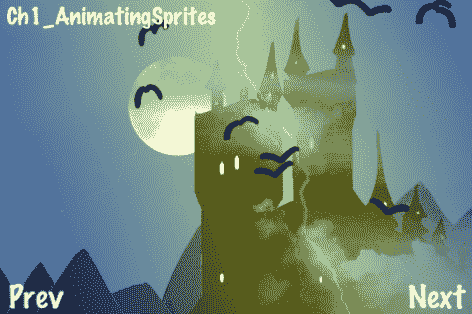

## 准备工作

请参考项目`RecipeCollection01`以获取此菜谱的完整工作代码。另外，请注意，为了简洁，一些代码已被省略。

## 如何实现...

执行以下代码：

```swift
//SimpleAnimObject.h
@interface SimpleAnimObject : CCSprite {
int animationType;
CGPoint velocity;
}
@interface Ch1_AnimatingSprites {
NSMutableArray *bats;
CCAnimation *batFlyUp;
CCAnimation *batGlideDown;
CCSprite *lightningBolt;
CCSprite *lightningGlow;
int lightningRemoveCount;
}
-(CCLayer*) runRecipe {
//Add our PLIST to the SpriteFrameCache
[[CCSpriteFrameCache sharedSpriteFrameCache] addSpriteFramesWithFile:@"simple_bat.plist"];
//Add a lightning bolt
lightningBolt = [CCSprite spriteWithFile:@"lightning_bolt.png"];
[lightningBolt setPosition:ccp(240,160)];
[lightningBolt setOpacity:64];
[lightningBolt retain];
//Add a sprite to make it light up other areas.
lightningGlow = [CCSprite spriteWithFile:@"lightning_glow.png"];
[lightningGlow setColor:ccc3(255,255,0)];
[lightningGlow setPosition:ccp(240,160)];
[lightningGlow setOpacity:100];
[lightningGlow setBlendFunc: (ccBlendFunc) { GL_ONE, GL_ONE }];
[lightningBolt addChild:lightningGlow];
//Set a counter for lightning duration randomization
lightningRemoveCount = 0;
//Bats Array Initialization
bats = [[NSMutableArray alloc] init];
//Add bats using a batch node.
CCSpriteBatchNode *batch1 = [CCSpriteBatchNode batchNodeWithFile:@"simple_bat.png" capacity:10];
[self addChild:batch1 z:2 tag:TAG_BATS];
//Make them start flying up.
for(int x=0; x<10; x++){
//Create SimpleAnimObject of bat
SimpleAnimObject *bat = [SimpleAnimObject spriteWithBatchNode:batch1 rect:CGRectMake(0,0,48,48)];
[batch1 addChild:bat];
[bat setPosition:ccp(arc4random()%400+40, arc4random()%150+150)];
//Make the bat fly up. Get the animation delay (flappingSpeed).
float flappingSpeed = [self makeBatFlyUp:bat];
//Base y velocity on flappingSpeed.
bat.velocity = ccp((arc4random()%1000)/500 + 0.2f, 0.1f/flappingSpeed);
//Add a pointer to this bat object to the NSMutableArray
[bats addObject:[NSValue valueWithPointer:bat]];
[bat retain];
//Set the bat's direction based on x velocity.
if(bat.velocity.x > 0){
bat.flipX = YES;
}
}
//Schedule physics updates
[self schedule:@selector(step:)];
return self;
}
-(float)makeBatFlyUp:(SimpleAnimObject*)bat {
CCSpriteFrameCache * cache = [CCSpriteFrameCache sharedSpriteFrameCache];
//Randomize animation speed.
float delay = (float)(arc4random()%5+5)/80;
CCAnimation *animation = [[CCAnimation alloc] initWithName:@"simply_bat_fly" delay:delay];
//Randomize animation frame order.
int num = arc4random()%4+1;
for(int i=1; i<=4; i+=1){
[animation addFrame:[cache spriteFrameByName:[NSString stringWithFormat:@"simple_bat_0%i.png",num]]];
num++;
if(num > 4){ num = 1; }
}
//Stop any running animations and apply this one.
[bat stopAllActions];
[bat runAction:[CCRepeatForever actionWithAction: [CCAnimate actionWithAnimation:animation]]];
//Keep track of which animation is running.
bat.animationType = BAT_FLYING_UP;
return delay; //We return how fast the bat is flapping.
}
-(void)makeBatGlideDown:(SimpleAnimObject*)bat {
CCSpriteFrameCache * cache = [CCSpriteFrameCache sharedSpriteFrameCache];
//Apply a simple single frame gliding animation.
CCAnimation *animation = [[CCAnimation alloc] initWithName:@"simple_bat_glide" delay:100.0f];
[animation addFrame:[cache spriteFrameByName:@"simple_bat_01.png"]];
//Stop any running animations and apply this one.
[bat stopAllActions];
[bat runAction:[CCRepeatForever actionWithAction: [CCAnimate actionWithAnimation:animation]]];
//Keep track of which animation is running.
bat.animationType = BAT_GLIDING_DOWN;
}
-(void)step:(ccTime)delta {
CGSize s = [[CCDirector sharedDirector] winSize];
for(id key in bats){
//Get SimpleAnimObject out of NSArray of NSValue objects.
SimpleAnimObject *bat = [key pointerValue];
//Make sure bats don't fly off the screen
if(bat.position.x > s.width){
bat.velocity = ccp(-bat.velocity.x, bat.velocity.y);
bat.flipX = NO;
}else if(bat.position.x < 0){
bat.velocity = ccp(-bat.velocity.x, bat.velocity.y);
bat.flipX = YES;
}else if(bat.position.y > s.height){
bat.velocity = ccp(bat.velocity.x, -bat.velocity.y);
[self makeBatGlideDown:bat];
}else if(bat.position.y < 0){
bat.velocity = ccp(bat.velocity.x, -bat.velocity.y);
[self makeBatFlyUp:bat];
}
//Randomly make them fly back up
if(arc4random()%100 == 7){
if(bat.animationType == BAT_GLIDING_DOWN){ [self makeBatFlyUp:bat]; bat.velocity = ccp(bat.velocity.x, -bat.velocity.y); }
else if(bat.animationType == BAT_FLYING_UP){ [self makeBatGlideDown:bat]; bat.velocity = ccp(bat.velocity.x, -bat.velocity.y); }
}
//Update bat position based on direction
bat.position = ccp(bat.position.x + bat.velocity.x, bat.position.y + bat.velocity.y);
}
//Randomly make lightning strike
if(arc4random()%70 == 7){
if(lightningRemoveCount < 0){
[self addChild:lightningBolt z:1 tag:TAG_LIGHTNING_BOLT];
lightningRemoveCount = arc4random()%5+5;
}
}
//Count down
lightningRemoveCount -= 1;
//Clean up any old lightning bolts
if(lightningRemoveCount == 0){
[self removeChildByTag:TAG_LIGHTNING_BOLT cleanup:NO];
}
}
@end

```

## 工作原理...

这个菜谱展示了如何通过使用`SimpleAnimObject`来结构动画类：

+   动画对象类结构：

    在切换动画时，通常需要跟踪动画对象的状态。在我们的例子中，我们使用`SimpleAnimObject`，它保持一个任意的`animationType`变量。我们还维护一个速度变量，它具有与动画帧延迟成反比的 Y 标量值：

    ```swift
    @interface SimpleAnimObject : CCSprite {
    int animationType;
    CGPoint velocity;
    }

    ```

    根据你想要动画系统有多深入，你应该维护更多信息，例如，例如，指向正在运行的`CCAnimation`实例的指针、帧信息以及物理体。

## 还有更多...

随着你对 Cocos2d 游戏开发的参与越来越深入，你将越来越倾向于使用 **异步操作** 来实现游戏逻辑和人工智能。这些操作由 `CCAction` 类派生，可用于从使用 `CCMoveBy` 移动 `CCNode` 到使用 `CCAnimate` 动画 `CCSprite` 的各种操作。当执行操作时，后台会维护一个异步计时机制。第一次编写游戏程序的开发者往往过度依赖这个特性。当运行多个操作时，这种技术所需的额外开销会迅速增加。在下面的示例中，我们使用了一个简单的整数计时器，允许我们调节屏幕上闪电持续的时间：

```swift
//Randomly make lightning strike
if(arc4random()%70 == 7){
if(lightningRemoveCount < 0){
[self addChild:lightningBolt z:1 tag:TAG_LIGHTNING_BOLT];
lightningRemoveCount = arc4random()%5+5;
}
}
//Count down
lightningRemoveCount -= 1;
//Clean up any old lightning bolts
if(lightningRemoveCount == 0){
[self removeChildByTag:TAG_LIGHTNING_BOLT cleanup:NO];
}

```

**同步计时器**，如前面代码片段中所示，通常但并非总是比异步操作更可取。随着你的游戏规模和范围的增长，请记住这一点。

# 绘制 OpenGL 原始图形

有时在 2D 游戏开发中，我们需要使用传统的 **OpenGL 原始图形**。通过这些，我们可以制作迷你地图、抬头显示和像子弹追踪和闪电爆炸这样的特殊效果等。在下面的场景中，我使用 Cocos2d 提供的所有原始绘图函数以及我调整并添加的一个函数创建了一个简单的图形。

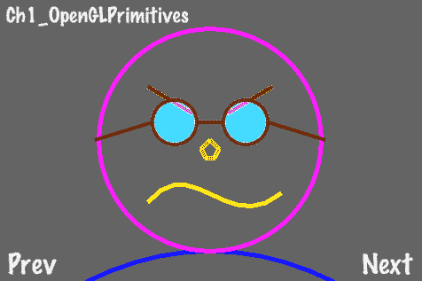

## 准备工作

请参考项目 `RecipeCollection01` 以获取此菜谱的完整工作代码。

## 如何实现...

执行以下代码：

```swift
/* Create a solid circle */
void ccDrawSolidCircle( CGPoint center, float r, float a, NSUInteger segs, BOOL drawLineToCenter)
{
//Check to see if we need to draw a line to the center
int additionalSegment = 1;
if (drawLineToCenter)
additionalSegment++;
const float coef = 2.0f * (float)M_PI/segs;
GLfloat *vertices = calloc( sizeof(GLfloat)*2*(segs+2), 1);
if( ! vertices )
return;
//Calculate line segments
for(NSUInteger i=0;i<=segs;i++)
{
float rads = i*coef;
GLfloat j = r * cosf(rads + a) + center.x;
GLfloat k = r * sinf(rads + a) + center.y;
vertices[i*2] = j * CC_CONTENT_SCALE_FACTOR();
vertices[i*2+1] =k * CC_CONTENT_SCALE_FACTOR();
}
vertices[(segs+1)*2] = center.x * CC_CONTENT_SCALE_FACTOR();
vertices[(segs+1)*2+1] = center.y * CC_CONTENT_SCALE_FACTOR();
//Draw our solid polygon
glDisable(GL_TEXTURE_2D);
glDisableClientState(GL_TEXTURE_COORD_ARRAY);
glDisableClientState(GL_COLOR_ARRAY);
glVertexPointer(2, GL_FLOAT, 0, vertices);
glDrawArrays(GL_TRIANGLE_FAN, 0, segs+additionalSegment);
glEnableClientState(GL_COLOR_ARRAY);
glEnableClientState(GL_TEXTURE_COORD_ARRAY);
glEnable(GL_TEXTURE_2D);
//Free up memory
free( vertices );
}
@implementation ShapeLayer
-(void) draw {
//Set line width.
glLineWidth(4.0f);
//Set point size
glPointSize(16);
//Enable line smoothing
glEnable(GL_LINE_SMOOTH);
//Draw a blue quadratic bezier curve
glColor4ub(0, 0, 255, 255);
ccDrawQuadBezier(ccp(100,0), ccp(240,70), ccp(380,0), 10);
//Draw a hollow purple circle
glColor4ub(255, 0, 255, 255);
ccDrawCircle(ccp(240,160), 125.0f, 0.0f, 100, NO);
//Draw a solid red lines
glColor4ub(255, 0, 0, 255);
ccDrawLine(ccp(170,220), ccp(220,190));
ccDrawLine(ccp(260,190), ccp(310,220));
//Draw a green point
glColor4ub(0, 255, 0, 255);
ccDrawPoint(ccp(200,180));
ccDrawPoint(ccp(280,180));
//Draw a turquoise solid circle
glColor4ub(0, 128, 255, 50);
ccDrawSolidCircle(ccp(200,180), 25.0f, 0.0f, 20, NO);
ccDrawSolidCircle(ccp(280,180), 25.0f, 0.0f, 20, NO);
//Draw a brown hollow circle
glColor4ub(64,32, 0, 255);
ccDrawCircle(ccp(200,180), 25.0f, 0.0f, 100, NO);
ccDrawCircle(ccp(280,180), 25.0f, 0.0f, 100, NO);
//Draw brown lines
glColor4ub(64,32, 0, 255);
ccDrawLine(ccp(225,180), ccp(255,180));
ccDrawLine(ccp(305,180), ccp(370,160));
ccDrawLine(ccp(175,180), ccp(110,160));
//Draw an orange polygon
glColor4ub(255, 128, 0, 255);
CGPoint vertices[5]={ ccp(230,150),ccp(240,160),ccp(250,150),ccp(245,140),ccp(235,140) };
ccDrawPoly(vertices, 5, YES);
//Draw a yellow cubic bezier curve
glColor4ub(255, 255, 0, 255);
ccDrawCubicBezier(ccp(170,90), ccp(220,150), ccp(260,50), ccp(320,100), 10);
//Restore original values
glLineWidth(1);
glDisable(GL_LINE_SMOOTH);
glColor4ub(255,255,255,255);
glPointSize(1);
}
@end
-(CCLayer*) runRecipe {
ShapeLayer *layer = [[ShapeLayer alloc] init];
[layer setPosition:ccp(0,0)];
[self addChild:layer z:2 tag:0];
return self;
}

```

## 它是如何工作的...

此菜谱展示了如何使用每个原始绘图函数：

+   覆盖 `draw` 方法：

    为了使用 OpenGL 绘图例程，我们必须覆盖 `CCNode` 的以下方法：

    ```swift
    -(void) draw;

    ```

    如 `CCNode.h` 中所述，覆盖此方法使我们能够控制底层的 OpenGL 绘图例程。以下 OpenGL 语句是隐含的：

    ```swift
    glEnableClientState(GL_VERTEX_ARRAY);
    glEnableClientState(GL_COLOR_ARRAY);
    glEnableClientState(GL_TEXTURE_COORD_ARRAY);
    glEnable(GL_TEXTURE_2D);

    ```

    为了覆盖此方法，我们创建了一个名为 `ShapeLayer` 的类，它继承自 `CCLayer`，因此也继承自 `CCNode`。一旦附加到场景，这个覆盖的绘图方法将每周期调用一次。

+   原始绘图函数：

    Cocos2d 中提供了以下原始绘图函数：

    ```swift
    void ccDrawPoint( CGPoint point );
    void ccDrawPoints( const CGPoint *points, NSUInteger numberOfPoints );
    void ccDrawLine( CGPoint origin, CGPoint destination );
    void ccDrawPoly( const CGPoint *vertices, NSUInteger numOfVertices, BOOL closePolygon );
    void ccDrawCircle( CGPoint center, float radius, float angle, NSUInteger segments, BOOL drawLineToCenter);
    void ccDrawQuadBezier(CGPoint origin, CGPoint control, CGPoint destination, NSUInteger segments);
    void ccDrawCubicBezier(CGPoint origin, CGPoint control1, CGPoint control2, CGPoint destination, NSUInteger segments);

    ```

    在所有这些之上，我们对 `ccDrawCircle` 进行了调整，以创建 `ccDrawSolidCircle`，如下所示：

    ```swift
    void ccDrawSolidCircle( CGPoint center, float r, float a, NSUInteger segs, BOOL drawLineToCenter);

    ```

    由于我们正在控制每一帧的 OpenGL 渲染调用，因此当在实时迷你地图中使用时，这种技术效果很好。我们将在后面的菜谱中探讨这一点。

## 还有更多...

如果你打算大量使用原始绘图，你可能想考虑使用 **顶点缓冲对象** OpenGL 扩展。使用 GL 函数 `glGenBuffers`、`glBindBuffer` 和 `glBufferData`，你可以将顶点和其他信息放入视频内存而不是系统内存。这可能会根据情况大幅提高性能。有关更多信息，请查看 Apple 开发者文档中 *OpenGL ES 编程指南 for iOS* 的 *处理顶点数据最佳实践* 部分，位于 [`developer.apple.com/library/ios/#documentation/3DDrawing/ Conceptual/OpenGLES_ProgrammingGuide/TechniquesforWorkingwithVertexData/TechniquesforWorkingwithVertexData.html`](http://developer.apple.com/library/ios/#documentation/3DDrawing/)。

# 播放视频文件

**过场场景**是一个自视频游戏早期就存在的概念。过场场景通常穿插在游戏玩法段落之间或在游戏加载时显示。对于更复杂的过场场景，使用全动态视频通常是有利的。在这个食谱中，我们将看到如何将视频插入到我们的游戏中。

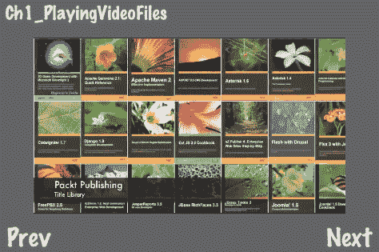

## 准备工作

请参考项目 `RecipeCollection01` 以获取此食谱的完整工作代码。

## 如何操作...

这个食谱需要额外的步骤将 **MediaPlayer iOS 框架**链接到我们的项目中：

1.  在 **组与文件**下右键点击你的项目。

1.  点击 **添加 | 已存在的框架**

1.  在 **iOS SDK** 下选择 **MediaPlayer.framework**

请记住，`RecipeCollection01` 已经链接了这个库。

现在，执行以下代码：

```swift
#import <MediaPlayer/MediaPlayer.h>
@interface Ch1_PlayingVideoFiles {
MPMoviePlayerController *moviePlayer;
}
@implementation Ch1_PlayingVideoFiles
-(CCLayer*) runRecipe {
//Load our video file
NSURL *url = [NSURL fileURLWithPath:[[NSBundle mainBundle] pathForResource:@"example_vid" ofType:@"mov"]];
//Create a MPMoviePlayerController object
moviePlayer = [[MPMoviePlayerController alloc] initWithContentURL:url];
//Register to receive a notification when the movie has finished playing.
[[NSNotificationCenter defaultCenter] addObserver:self
selector:@selector(moviePlayBackDidFinish:)
name:MPMoviePlayerPlaybackDidFinishNotification
object:moviePlayer];
//Set the movie's control style and whether or not it should automatically play.
if ([moviePlayer respondsToSelector:@selector(setFullscreen:animated:)]) {
//Use the new 3.2 style API.
moviePlayer.controlStyle = MPMovieControlStyleNone;
moviePlayer.shouldAutoplay = YES;
CGSize winSize = [[CCDirector sharedDirector] winSize];
moviePlayer.view.frame = CGRectMake(45, 50, winSize.width-90, winSize.height-100);
[[[CCDirector sharedDirector] openGLView] addSubview:moviePlayer.view];
} else {
//Use the old 2.0 style API.
moviePlayer.movieControlMode = MPMovieControlModeHidden;
[self playMovie];
}
return self;
}
-(void)moviePlayBackDidFinish:(NSNotification*)notification {
//If playback is finished we stop the movie.
[self stopMovie];
}
-(void)playMovie {
//We do not play the movie if it is already playing.
MPMoviePlaybackState state = moviePlayer.playbackState;
if(state == MPMoviePlaybackStatePlaying) {
NSLog(@"Movie is already playing.");
return;
}
[moviePlayer play];
}
-(void)stopMovie {
//We do not stop the movie if it is already stopped.
MPMoviePlaybackState state = moviePlayer.playbackState;
if(state == MPMoviePlaybackStateStopped) {
NSLog(@"Movie is already stopped.");
return;
}
//Since playback has finished we remove the observer.
[[NSNotificationCenter defaultCenter] removeObserver:self
name:MPMoviePlayerPlaybackDidFinishNotification
object:moviePlayer];
//If the moviePlayer.view was added to the openGL view, it needs to be removed.
if ([moviePlayer respondsToSelector:@selector(setFullscreen:animated:)]) {
[moviePlayer.view removeFromSuperview];
}
}
-(void)cleanRecipe {
[super cleanRecipe];
[self stopMovie];
[moviePlayer release];
}
@end

```

## 它是如何工作的...

这个食谱展示了如何加载、播放和停止一个电影。

+   使用 MPMoviePlayerController：

    这个食谱只是关于电影播放的冰山一角。电影也可以在全屏模式、纵向模式和多种其他选项下播放。请参考官方 Apple 文档以自定义和/或添加此技术。

+   `UsingObjective-C` 观察者：

    在进行 Cocos2d 编程时，**观察者模式**并不常用，但它是一个强大的机制，并且是推荐的方式来知道你的视频何时播放完毕。你可以通过参考官方的 `Objective-C` 文档来了解更多关于观察者的信息。

+   电影文件格式：

    根据 Apple 文档，建议你使用 `H.264/MPEG-4` 对视频进行压缩，`AAC` 音频，以及以下文件格式之一：`MOV`、`MP4`、`MPV`、`3GP`。

    还建议你的电影大小不超过 `640x480`，运行速度不超过 `30 FPS`。

    用于食谱中的电影是由 Apple 的 iMovie 软件创建和编码的。

    如需更多信息，请查阅官方 Apple iOS SDK 文档。

# 网格、粒子以及运动条纹效果

Cocos2d 配备了各种易于使用的特殊效果。在这里，我们只简要介绍所有效果，因为它们相当直接，在其他文本中也有很好的介绍。

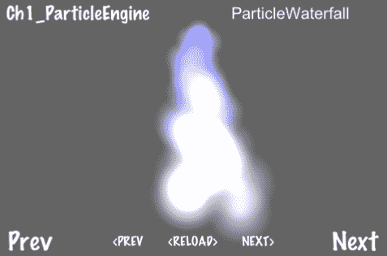

## 准备工作

请参考项目`RecipeCollection01`以获取此菜谱的完整工作代码。

## 如何做...

要在游戏中正确显示网格效果，你首先需要将`EAGLView pixelFormat`设置为`kEAGLColorFormatRGBA8`（默认设置为`kEAGLColorFormatRGB565`）。

通过进入你的项目文件中的`${PROJECT_NAME}AppDelegate.m`文件并更改以下代码来实现：

```swift
EAGLView *glView = [EAGLView viewWithFrame:[window bounds]
pixelFormat: kEAGLColorFormatRGB565
depthFormat:0
];

```

改成这样：

```swift
EAGLView *glView = [EAGLView viewWithFrame:[window bounds]
pixelFormat: kEAGLColorFormatRGBA8
depthFormat:0
];

```

然后，执行以下代码：

```swift
//Custom particle effect
@implementation ParticleWaterfall
-(id)init {
return [self initWithTotalParticles:400];
}
-(id)initWithTotalParticles:(int)p {
if(self != [super initWithTotalParticles: p])
return nil;
//Angle
angle = 270;
angleVar = 12;
//Emitter position
self.position = ccp(160, 60);
posVar = ccp(16, 4);
//Life of particles
life = 2;
lifeVar = 0.25f;
//Speed of particles
self.speed = 100;
self.speedVar = 20;
self.gravity = ccp(self.gravity.x, -5);
//Size of particles
startSize = 35.0f;
endSize = 100.0f;
//Color of particles
startColor = ccc4(0.4f, 0.4f, 1.0f, 0.6f);
startColorVar = ccc4(0,0,0,0);
endColor = ccc4(0.5f, 0.5f, 0.5f, 0);
endColorVar = ccc4(0,0,0,0);
//Additive
self.blendAdditive = NO;
return self;
}
@end
@interface Ch1_GridParticleMotionEffects
{
//Variables for motion streak effect
CCSprite *rocket;
CCMotionStreak *streak;
CGPoint rocketDirection;
}
@implementation Ch1_GridParticleMotionEffects
-(CCLayer*) runRecipe {
CGSize s = [[CCDirector sharedDirector] winSize];
/*** Grid effect demo ***/
//Create a CCSprite
CCSprite *sprite = [CCSprite spriteWithFile:@"colorable_sprite.png"];
[sprite setPosition:ccp(240,160)];
[self addChild:sprite z:1 tag:TAG_SPRITE];
//Create a grid effect
CCAction *gridEffect = [CCShaky3D actionWithRange:5 shakeZ:YES grid:ccg(15,10) duration:10];
//Run the effect
[sprite runAction:gridEffect];
/*** Particle effect demo ***/
//Create a simple fire particle effect
CCNode *fireEffect = [CCParticleFire node];
[self addChild:fireEffect z:1 tag:TAG_FIRE_EFFECT];
//Create a waterfall particle effect
CCNode *waterfallEffect = [ParticleWaterfall node];
[self addChild:waterfallEffect z:1 tag:TAG_WATERFALL_EFFECT];
/*** Motion streak demo ***/
//Set the rocket initially in a random direction.
rocketDirection = ccp(arc4random()%4+1,arc4random()%4+1);
//Add the rocket sprite.
rocket = [CCSprite spriteWithFile:@"rocket.png"];
[rocket setPosition:ccp(s.width/2, s.height/2)];
[rocket setScale:0.5f];
[self addChild:rocket];
//Create the streak object and add it to the scene.
streak = [CCMotionStreak streakWithFade:1 minSeg:1 image:@"streak.png" width:32 length:32 color:ccc4(255,255,255,255)];
[self addChild:streak];
streak.position = ccp(s.width/2, s.height/2);
[self schedule:@selector(step:)];
return self;
}
-(void)step:(ccTime)delta {
CGSize s = [[CCDirector sharedDirector] winSize];
//Make rocket bounce off walls
if(rocket.position.x > s.width || rocket.position.x < 0){
rocketDirection = ccp(-rocketDirection.x, rocketDirection.y);
}
else if(rocket.position.y > s.height || rocket.position.y < 0){
rocketDirection = ccp(rocketDirection.x, -rocketDirection.y);
}
//Slowly turn the rocket
rocketDirection = ccp(rocketDirection.x, rocketDirection.y+0.05f);
//Update rocket position based on direction
rocket.position = ccp(rocket.position.x + rocketDirection.x, rocket.position.y + rocketDirection.y);
[streak setPosition:rocket.position];
//Set the rocket's rotation
[rocket setRotation: radiansToDegrees(vectorToRadians(rocketDirection))];
}
@end

```

## 它是如何工作的...

在这个菜谱中，我们看到了许多东西。为了简洁起见，我在书中只包含了一个网格效果和两个粒子效果。每个库存网格和粒子效果都可以在`RecipeCollection01`中查看，还有一些自定义粒子效果，如`Waterfall`和`WaterSplash`。

+   自定义粒子：

    Cocos2d 粒子有许多变量，通常最有利的是通过子类化内置粒子来帮助你创建自己的。以下是一些内置的 Cocos2d 粒子：

    ```swift
    CCParticleExplosion, CCParticleFire, CCParticleFireworks, CCParticleFlower, CCParticleGalaxy, CCParticleMeteor, CCParticleRain, CCParticleSmoke, CCParticleSnow, CCParticleSpiral, CCParticleSun

    ```

+   使用 CCMotionStreak：

    动态条纹是向 CCNode 添加动态元素的好方法。这些通常可以与粒子结合，产生很好的效果。

    在创建动态条纹时，需要注意的一点是，当纹理弯曲回自身时，其纹理需要看起来很好。**垂直纹理**带有**透明渐变边缘**通常看起来最好。

# 使用 Retina 显示模式

iPhone 4 和 iPad 都支持 Apple 的**Retina 显示**模式。在 iPhone 4 上，这使分辨率加倍达到`960x640`。

Cocos2d 的制作者在将此功能集成到框架中时非常用心。通过简单的开关即可开启 Retina 显示。然而，让游戏在高清和标清模式下运行相似可能有些棘手。幸运的是，他们也考虑到了这一点。在这个菜谱中，我们将启用 Retina 显示，并显示一个高分辨率图像，如下面的截图所示：

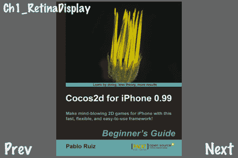

## 准备工作

要正确查看 Retina 显示，你需要一个 Retina 显示设备。在模拟器中，你需要执行以下操作以切换到**iPhone Retina**模拟：

1.  打开 iOS 模拟器。

1.  在文件菜单中点击**硬件 | 设备 | iPhone (Retina)**。

你当然也可以使用真实的 iPhone 4 或 iPad 设备。

## 如何做...

首先，你必须在应用程序中启用**Retina 显示**。进入`${PROJECT_NAME}AppDelegate.m`并*取消注释*以下行：

```swift
if( ! [director enableRetinaDisplay:YES] )
CCLOG(@"Retina Display Not supported");

```

现在将开启支持 Retina 显示的设备上的 Retina 显示，并关闭不支持 Retina 显示的设备上的 Retina 显示。

现在，执行以下代码：

```swift
-(CCLayer*) runRecipe {
//Switch to Retina mode to see the difference
CCSprite *sprite = [CCSprite spriteWithFile:@"cocos2d_beginner.png"];
[sprite setPosition:ccp(240,160)];
[sprite setScale:1.0f];
[self addChild:sprite];
return self;
}

```

## 它是如何工作的...

+   一物两用：

    正如你所见，我们创建的精灵现在非常大且细节丰富。如果你关闭 Retina Display 或在一个不支持它的设备上运行，你会看到一个更小、更模糊的精灵。这是因为 Retina Display 会选择每个精灵的更高分辨率版本（如果有的话）。我们使用`-hd`后缀指定更高分辨率的版本。因此，在 Retina Display 模式下，Cocos2d 会自动显示`cocos2d_beginner-hd.png`而不是`cocos2d_beginner.png`。

+   位置、尺寸等：

    据说 Cocos2d 会相应地转换所有坐标位置、尺寸比率和任何其他内容。你唯一需要改变的是添加高分辨率图像。

    建议在使用此功能时注意以下几点。低级别的 OpenGL 黑客技术通常不会显示成你想要的样子。对此保持警惕，并在考虑支持两种模式之前，确保在 Retina Display 模式下测试任何复杂的技术。

+   Retina Display 的缺点：

    Retina Display 的主要缺点仅仅是它占用的磁盘空间量。包括所有 HD 图像将使你的所有艺术资产占用的空间增加一倍以上。此外，更高分辨率的图像在运行时也会占用更多内存。

+   Retina Display 的优点。

    另一方面，苹果不断增加应用大小限制和设备内存。随着新硬件的推出和制作桌面应用的能力，对于 AAA 游戏来说，提高分辨率是必须的。

# 1D 和 2D 缓动动作

**缓动动作**允许你使用多种公式微调游戏中使用的动作。它们可以应用于任何动作：移动、缩放、淡入淡出等。具体到移动，可以应用一个小调整，允许在 X 轴和 Y 轴上独立进行*缓动*。这可以用来创建许多酷炫的效果。

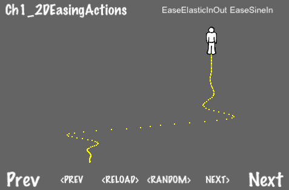

## 准备工作

请参考项目`RecipeCollection01`以获取此菜谱的完整工作代码。

## 如何操作...

执行以下代码：

```swift
@interface CCMoveByCustom : CCMoveBy
{}
-(void) update: (ccTime) t;
@end
@implementation CCMoveByCustom
-(void) update: (ccTime) t {
//Here we neglect to change something with a zero delta.
if(delta.x == 0){
[target_ setPosition:ccp( [(CCNode*)target_ position].x, (startPosition.y + delta.y*t ) )];
}else if(delta.y == 0){
[target_ setPosition:ccp( (startPosition.x + delta.x*t ), [(CCNode*)target_ position].y )];
}else{
[target_ setPosition:ccp( (startPosition.x + delta.x*t ), (startPosition.y + delta.y * t ) )];
}
}
@end
@implementation Ch1_EasingActions
-(CCLayer*) runRecipe {
/*** 1D Movement Ease Action ***/
//Create the basic action to move by a certain X and Y vector
CCActionInterval *action1D = [CCMoveBy actionWithDuration:2 position:ccp(200,200)];
//Create a sprite to move
CCSprite *spriteEase1D = [CCSprite spriteWithFile:@"colorable_sprite.png"];
[spriteEase1D setPosition:ccp(150,50)];
[self addChild:spriteEase1D z:1 tag:TAG_SPRITE_EASE_1D];
//Create an 'eased' movement action with a CCEase class
CCActionInterval *easeAction1D = [CCEaseInOut actionWithAction:action1D rate:2];
//Run the action
[spriteEase1D runAction:easeAction1D];
/*** 2D Movement Ease Action ***/
//Create two movement actions, one in each dimension
CCActionInterval *action2DX = [CCMoveByCustom actionWithDuration:2 position:ccp(200,0)];
CCActionInterval *action2DY = [CCMoveByCustom actionWithDuration:2 position:ccp(0,200)];
//Create a sprite to move
CCSprite *spriteEase2D = [CCSprite spriteWithFile:@"colorable_sprite.png"];
[spriteEase2D setPosition:ccp(150,50)];
[self addChild:spriteEase2D z:1 tag:TAG_SPRITE_EASE_2D];
//Create two 'eased' movement actions, one on each dimension
CCActionInterval *easeAction2DX = [CCEaseSineIn actionWithAction:action2DX];
CCActionInterval *easeAction2DY = [CCEaseBounceIn actionWithAction:action2DY];
//Run both actions
[spriteEase2D runAction:easeAction2DX];
[spriteEase2D runAction:easeAction2DY];
return self;
}
@end

```

## 它是如何工作的...

执行此代码后，你应该看到其中一个角色沿着直线向目的地移动，而另一个角色则以看似无序但经过计算的方式移动。

+   2D 缓动动作的使用：

    在今年夏天创建 iOS 游戏*GoldenAgeBaseball*时，我使用了`CCMoveByCustom`来模拟不同的投球。一个滑块向下移动并远离，一个切球只远离，一个沉球只向下。这种投球风格的变体对于投球/击球游戏机制的开发至关重要。

    总体而言，缓动动作给你的游戏带来了一种精致和专业的感觉。无论是平滑相机移动还是模拟棒球投球，缓动动作都是一项优秀的工具，可以帮助你将游戏调整到完美。

# 渲染和纹理化 3D 形状

虽然听起来很奇怪，但在 2D 游戏中，有时你只是想添加一些简单的**3D 图形**。无论你是创建酷炫的 2D/3D 混合游戏还是简单的带有 2D 用户界面的 3D 游戏，3D 图形都不是一件容易产生的事情。第三维的复杂性常常与 2D 编程范式冲突。

为了简单起见，这个配方将向您展示如何创建一个**简单的彩色立方体**和一个**简单的纹理立方体**。即使在制作 2D 游戏时，简单几何形状的用途也很多。然而，包括**着色器**和**3D 模型**在内的更多示例超出了本书的范围。

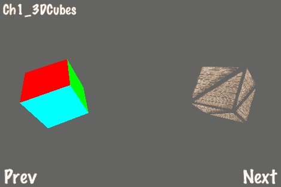

## 准备工作

请参考项目`RecipeCollection01`以获取此配方的完整工作代码。

## 如何操作...

执行以下代码：

```swift
#import "Vector3D.h"
@interface Cube3D : CCSprite
{
Vector3D *translation3D;
Vector3D *rotation3DAxis;
GLfloat rotation3DAngle;
bool drawTextured;
}
@property (readwrite, assign) Vector3D *translation3D;
@property (readwrite, assign) Vector3D *rotation3DAxis;
@property (readwrite, assign) GLfloat rotation3DAngle;
@property (readwrite, assign) bool drawTextured;
-(void) draw;
@end
@implementation Cube3D
@synthesize translation3D,rotation3DAxis,rotation3DAngle,drawTextured;
-(void) draw {
//Vertices for each side of the cube
const GLfloat frontVertices[]={ -0.5f,-0.5f,0.5f, 0.5f,-0.5f,0.5f, -0.5f,0.5f,0.5f, 0.5f,0.5f,0.5f};
const GLfloat backVertices[] = { -0.5f,-0.5f,-0.5f, -0.5f,0.5f,-0.5f, 0.5f,-0.5f,-0.5f, 0.5f,0.5f,-0.5f };
const GLfloat leftVertices[] = { -0.5f,-0.5f,0.5f, -0.5f,0.5f,0.5f, -0.5f,-0.5f,-0.5f, -0.5f,0.5f,-0.5f };
const GLfloat rightVertices[] = { 0.5f,-0.5f,-0.5f, 0.5f,0.5f,-0.5f, 0.5f,-0.5f,0.5f, 0.5f,0.5f,0.5f };
const GLfloat topVertices[] = { -0.5f,0.5f,0.5f, 0.5f,0.5f,0.5f, -0.5f,0.5f,-0.5f, 0.5f,0.5f,-0.5f };
const GLfloat bottomVertices[] = {-0.5f,-0.5f,0.5f,-0.5f,-0.5f,-0.5f,0.5f,-0.5f,0.5f, 0.5f,-0.5f,-0.5f };
//Coordinates for our texture to map it to a cube side
const GLfloat textureCoordinates[] = { 0,0, 1,0, 0,1, 1,1,};
//We enable back face culling to properly set the depth buffer
glEnable(GL_CULL_FACE);
glCullFace(GL_BACK);
//We are not using GL_COLOR_ARRAY
glDisableClientState(GL_COLOR_ARRAY);
//We disable GL_TEXTURE_COORD_ARRAY if not using a texture
if(!drawTextured){
glDisableClientState(GL_TEXTURE_COORD_ARRAY);
}
//Replace the current matrix with the identity matrix
glLoadIdentity();
//Translate and rotate
glTranslatef(translation3D.x, translation3D.y, translation3D.z);
glRotatef(rotation3DAngle, rotation3DAxis.x, rotation3DAxis.y, rotation3DAxis.z);
//Bind our texture if neccessary
if(drawTextured){
glBindTexture(GL_TEXTURE_2D, texture_.name);
}
//Here we define our vertices, set our textures or colors and finally draw the cube sides
glVertexPointer(3, GL_FLOAT, 0, frontVertices);
if(drawTextured){ glTexCoordPointer(2, GL_FLOAT, 0, textureCoordinates); }
else{ glColor4f(1.0f, 0.0f, 0.0f, 1.0f); }
glDrawArrays(GL_TRIANGLE_STRIP, 0, 4);
glVertexPointer(3, GL_FLOAT, 0, backVertices);
if(drawTextured){ glTexCoordPointer(2, GL_FLOAT, 0, textureCoordinates); }
else{ glColor4f(1.0f, 1.0f, 0.0f, 1.0f); }
glDrawArrays(GL_TRIANGLE_STRIP, 0, 4);
glVertexPointer(3, GL_FLOAT, 0, leftVertices);
if(drawTextured){ glTexCoordPointer(2, GL_FLOAT, 0, textureCoordinates); }
else{ glColor4f(1.0f, 0.0f, 1.0f, 1.0f); }
glDrawArrays(GL_TRIANGLE_STRIP, 0, 4);
glVertexPointer(3, GL_FLOAT, 0, rightVertices);
if(drawTextured){ glTexCoordPointer(2, GL_FLOAT, 0, textureCoordinates); }
else{ glColor4f(0.0f, 1.0f, 1.0f, 1.0f); }
glDrawArrays(GL_TRIANGLE_STRIP, 0, 4);
glVertexPointer(3, GL_FLOAT, 0, topVertices);
if(drawTextured){ glTexCoordPointer(2, GL_FLOAT, 0, textureCoordinates); }
else{ glColor4f(0.0f, 1.0f, 0.0f, 1.0f); }
glDrawArrays(GL_TRIANGLE_STRIP, 0, 4);
glVertexPointer(3, GL_FLOAT, 0, bottomVertices);
if(drawTextured){ glTexCoordPointer(2, GL_FLOAT, 0, textureCoordinates); }
else{ glColor4f(0.0f, 0.0f, 1.0f, 1.0f); }
glDrawArrays(GL_TRIANGLE_STRIP, 0, 4);
//We re-enable the default render state
glEnableClientState(GL_COLOR_ARRAY);
glEnableClientState(GL_TEXTURE_COORD_ARRAY);
glDisable(GL_CULL_FACE);
glColor4f(1.0f, 1.0f, 1.0f, 1.0f);
}
@end
@interface Ch1_3DCubes {
Cube3D *cube3d1;
Cube3D *cube3d2;
}
@implementation Ch1_3DCubes
-(CCLayer*) runRecipe {
//Load a textured cube and set initial variables
cube3d1 = [Cube3D spriteWithFile:@"crate.jpg"];
cube3d1.translation3D = [Vector3D x:2.0f y:0.0f z:-4.0f];
cube3d1.rotation3DAxis = [Vector3D x:2.0f y:2.0f z:4.0f];
cube3d1.rotation3DAngle = 0.0f;
cube3d1.drawTextured = YES;
[self addChild:cube3d1 z:3 tag:0];
//Load a colored cube and set initial variables
cube3d2 = [Cube3D spriteWithFile:@"blank.png"];
cube3d2.translation3D = [Vector3D x:-2.0f y:0.0f z:-4.0f];
cube3d2.rotation3DAxis = [Vector3D x:2.0f y:2.0f z:4.0f];
cube3d2.rotation3DAngle = 0.0f;
cube3d2.drawTextured = NO;
[self addChild:cube3d2 z:1 tag:1];
//Schedule cube rotation
[self schedule:@selector(step:)];
return self;
}
-(void) step:(ccTime)delta {
cube3d1.rotation3DAngle += 0.5f;
cube3d2.rotation3DAngle -= 0.5f;
}
@end

```

## 工作原理...

我们在这里看到的是 OpenGL ES 立方体渲染的快速入门课程，带有 Cocos2d 的变体。就像我们绘制 OpenGL 原语一样，这里我们创建另一个`CCNode`并重写其绘制方法以创建更复杂的 OpenGL 几何形状。

+   纹理化：

    我们利用`CCSprite`方法将纹理加载到内存中，以便我们可以将该纹理绑定用于 3D 绘制。这个过程相当直接。

+   深度测试、尺寸和转换：

    多亏了 Cocos2d 内置的深度测试，立方体将根据 Z 属性正确排序。`translation3D.z`值影响立方体的实际大小，而其`translation3D.x`和`translation3D.y`值影响它在屏幕上的位置，与`translation3D.z`成比例。

## 还有更多...

有关 3D 图形的更多信息，请参考第八章中的配方*使用 Cocos3d*，*提示、工具和端口*。

# 渲染纹理填充的多边形

当创建大型关卡的游戏时，很容易遇到内存限制。大地图也包含诸如草地、树木、山脉等物体的重复绘制。这个配方将向您展示如何高效地渲染一个用**重复纹理**填充的**多边形**。这些可以绘制成任何大小，同时仍然只占用很少的内存和 CPU 时间。

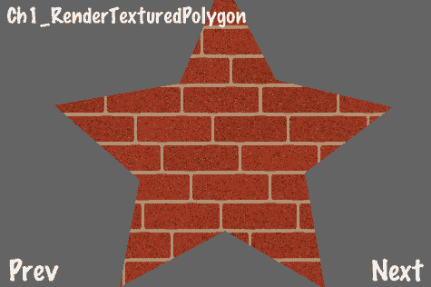

## 准备工作

请参考项目`RecipeCollection01`以获取此配方的完整工作代码。

## 如何操作...

执行以下代码：

```swift
#import "Vector3D.h"
//Included for CPP polygon triangulation
#import "triangulate.h"
#include <stdio.h>
#include <stdlib.h>
#include <string.h>
#include <assert.h>
@implementation TexturedPolygon
@synthesize vertices, triangles;
+(id) createWithFile:(NSString*)file withVertices:(NSArray*)verts {
/*** Create a TexturedPolygon with vertices only. ***/
/*** Perform polygon trianglulation to get triangles. ***/
//Initialization
TexturedPolygon *tp = [TexturedPolygon spriteWithFile:file];
tp.vertices = [[NSMutableArray alloc] init];
tp.triangles = [[NSMutableArray alloc] init];
//Polygon Triangulation
Vector2dVector a;
for(int i=0; i<[verts count];i+=1){
//Add polygon vertices
[tp.vertices addObject:[verts objectAtIndex:i]];
//Add polygon vertices to triangulation container
CGPoint vert = [[verts objectAtIndex:i] CGPointValue];
a.push_back( Vector2d(vert.x, vert.y) );
}
//Run triangulation algorithm
Vector2dVector result;
Triangulate::Process(a,result);
//Gather all triangles from result container
int tcount = result.size()/3;
for (int i=0; i<tcount; i++) {
const Vector2d &p1 = result[i*3+0];
const Vector2d &p2 = result[i*3+1];
const Vector2d &p3 = result[i*3+2];
//Add triangle index
[tp.triangles addObject: [tp getTriangleIndicesFromPoint1:ccp(p1.GetX(),p1.GetY()) point2:ccp(p2.GetX(),p2.GetY()) point3:ccp(p3.GetX(), p3.GetY())] ];
}
//Set texture coordinate information
[tp setCoordInfo];
return tp;
}
+(id) createWithFile:(NSString*)file withVertices:(NSArray*)verts withTriangles:(NSArray*)tris {
/*** Create a TexturedPolygon with vertices and triangles given. ***/
//Initialization
TexturedPolygon *tp = [TexturedPolygon spriteWithFile:file];
tp.vertices = [[NSMutableArray alloc] init];
tp.triangles = [[NSMutableArray alloc] init];
//Set polygon vertices
for(int i=0; i<[verts count];i+=1){
[tp.vertices addObject:[verts objectAtIndex:i]];
}
//Set triangle indices
for(int i=0; i<[tris count];i+=1){
[tp.triangles addObject:[tris objectAtIndex:i]];
}
//Set texture coordinate information
[tp setCoordInfo];
return tp;
}
-(Vector3D*) getTriangleIndicesFromPoint1:(CGPoint)p1 point2:(CGPoint)p2 point3:(CGPoint)p3 {
/*** Convert three polygon vertices to triangle indices ***/
Vector3D* indices = [Vector3D x:-1 y:-1 z:-1];
for(int i=0; i< [vertices count]; i++){
CGPoint vert = [[vertices objectAtIndex:i] CGPointValue];
if(p1.x == vert.x and p1.y == vert.y){
indices.x = i;
}else if(p2.x == vert.x and p2.y == vert.y){
indices.y = i;
}else if(p3.x == vert.x and p3.y == vert.y){
indices.z = i;
}
}
return indices;
}
-(void) addAnimFrameWithFile:(NSString*)file toArray:(NSMutableArray*)arr {
/*** For textured polygon animation ***/
ccTexParams params = {GL_NEAREST,GL_NEAREST_MIPMAP_NEAREST,GL_REPEAT,GL_REPEAT};
CCTexture2D *frameTexture = [[CCTextureCache sharedTextureCache] addImage:file];
[frameTexture setTexParameters:&params];
CCSpriteFrame *frame = [CCSpriteFrame frameWithTexture:frameTexture rect:self.textureRect];
[[CCSpriteFrameCache sharedSpriteFrameCache] addSpriteFrame:frameTexture name:file];
[arr addObject:frame];
}
-(void) setCoordInfo {
/*** Set texture coordinates for each vertex ***/
if(coords){ free(coords); }
coords = (ccV2F_T2F*)malloc(sizeof(ccV2F_T2F)*[vertices count]);
for(int i=0;i<[vertices count];i++) {
coords[i].vertices.x = [[vertices objectAtIndex:i] CGPointValue].x;
coords[i].vertices.y = [[vertices objectAtIndex:i] CGPointValue].y;
float atlasWidth = texture_.pixelsWide;
float atlasHeight = texture_.pixelsHigh;
coords[i].texCoords.u = (coords[i].vertices.x + rect_.origin.x)/ atlasWidth;
coords[i].texCoords.v = (contentSize_.height - coords[i].vertices.y + rect_.origin.y)/ atlasHeight ;
}
}
-(void) dealloc
{
//Release texture coordinates if necessary
if(coords) free(coords);
[super dealloc];
}
-(void) draw
{
/*** This is where the magic happens. Texture and draw all triangles. ***/
glDisableClientState(GL_COLOR_ARRAY);
glColor4ub( color_.r, color_.g, color_.b, quad_.bl.colors.a);
BOOL newBlend = NO;
if( blendFunc_.src != CC_BLEND_SRC || blendFunc_.dst != CC_BLEND_DST ) {
newBlend = YES;
glBlendFunc( blendFunc_.src, blendFunc_.dst );
}
glBindTexture(GL_TEXTURE_2D, texture_.name);
unsigned int offset = (unsigned int)coords;
unsigned int diff = offsetof( ccV2F_T2F, vertices);
glVertexPointer(2, GL_FLOAT, sizeof(ccV2F_T2F), (void*) (offset + diff));
diff = offsetof( ccV2F_T2F, texCoords);
glTexCoordPointer(2, GL_FLOAT, sizeof(ccV2F_T2F), (void*) (offset + diff));
for(int i=0;i<[triangles count];i++){
Vector3D *tri = [triangles objectAtIndex:i];
short indices[] = {tri.x, tri.y, tri.z};
glDrawElements(GL_TRIANGLE_STRIP, 3, GL_UNSIGNED_SHORT, indices);
}
if(newBlend) { glBlendFunc(CC_BLEND_SRC, CC_BLEND_DST); }
glColor4ub( 255, 255, 255, 255);
glEnableClientState(GL_COLOR_ARRAY);
}
@end
@implementation Ch1_RenderTexturedPolygon
-(CCLayer*) runRecipe {
CGSize s = [[CCDirector sharedDirector] winSize];
//Set polygon vertices
CGPoint vertexArr[] = { ccp(248,340), ccp(200,226), ccp(62,202), ccp(156,120), ccp(134,2), ccp(250,64), ccp(360,0), ccp(338,128), ccp(434,200), ccp(306,230) };
int numVerts = 10;
NSMutableArray *vertices = [[NSMutableArray alloc] init];
//Add vertices to array
for(int i=0; i<numVerts; i++){
[vertices addObject:[NSValue valueWithCGPoint:vertexArr[i]]];
}
//Note: Your texture size MUST be a product of 2 for this to work.
//Set texture parameters to repeat
ccTexParams params = {GL_NEAREST,GL_NEAREST_MIPMAP_NEAREST,GL_REPEAT,GL_REPEAT};
//Create textured polygon
TexturedPolygon *texturedPoly = [TexturedPolygon createWithFile:@"bricks.jpg" withVertices:vertices];
[texturedPoly.texture setTexParameters:&params];
texturedPoly.position = ccp(128,128);
//Add textured polygon to scene
[self addChild:texturedPoly z:1 tag:0];
return self;
}
@end

```

## 工作原理...

`TexturedPolygon`接受一组给定的**顶点**，并使用**多边形三角化算法**找到多边形内包含的所有三角形。然后使用 OpenGL 三角形带对这些三角形进行纹理化和绘制。

+   三角化：

    三角化，根据多边形的不同，可能是一个复杂的过程。这通常在地图加载时执行。对于非常复杂的多边形，在关卡创建期间执行多边形三角化并存储与多边形顶点一起的三角形**索引**可能是有益的。这可以加快关卡加载时间。

+   用途：

    纹理多边形有许多用途，包括静态地图纹理和背景纹理。

+   性能：

    使用这种技术，你可以高效地绘制几乎任何大小的多边形。空间需求取决于使用的每个纹理的大小，而不是每个多边形的大小。为了节省空间，修改 `TexturedPolygon` 以重用预先初始化的纹理。

+   注意事项：

    这种技术有几个注意事项。使用的纹理必须是正方形，每边的尺寸必须是 2n（16x16、32x32、64x64 等）。此外，纹理只能是单个文件，不能是精灵帧。

## 更多...

这个食谱可能是你第一次尝试将 `Objective-C` 和 `C++` 代码结合使用。这通常被称为 `Objective-C++`。有关更多信息，请参阅苹果官方开发者文档 *使用 C++ 与 Objective-C*，链接为 [`developer.apple.com/library/mac/#documentation/Cocoa/Conceptual/ObjectiveC/Articles/ocCPlusPlus.html`](http://developer.apple.com/library/mac/#documentation/Cocoa/Conceptual/ObjectiveC/Articles/ocCPlusPlus.html)。

# 动画纹理填充多边形

`TexturedPolygon` 也可以轻松动画化。这对于动画人群、海浪、沸腾的熔岩坑等非常有用。在示例中，我们看到一片动画的麦田。

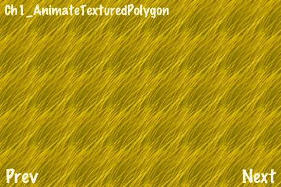

## 准备工作

请参考项目 `RecipeCollection01` 以获取此食谱的完整工作代码。

## 如何操作...

执行以下代码：

```swift
#import "Vector3D.h"
#import "TexturedPolygon.h"
@implementation Ch1_AnimateTexturedPolygon
-(CCLayer*) runRecipe {
CGSize s = [[CCDirector sharedDirector] winSize];
ccTexParams params = {GL_NEAREST, GL_NEAREST_MIPMAP_NEAREST, GL_REPEAT,GL_REPEAT};
//Create grass animated textured polygon
CGPoint grassVertexArr[] = { ccp(0,0), ccp(480,0), ccp(480,320), ccp(0,320) };
int grassNumVerts = 4;
NSMutableArray *grassVertices = [[NSMutableArray alloc] init];
for(int i=0; i<grassNumVerts; i++){
[grassVertices addObject:[NSValue valueWithCGPoint:ccp(grassVertexArr[i].x*1, grassVertexArr[i].y*1)]];
}
TexturedPolygon *grassPoly = [TexturedPolygon createWithFile:@"grass_tile_01.png" withVertices:grassVertices];
[grassPoly.texture setTexParameters:&params];
grassPoly.position = ccp(32,32);
[self addChild:grassPoly z:1 tag:1];
//Create swaying grass animation
NSMutableArray *grassAnimFrames = [NSMutableArray array];
//This is a two part animation with 'back' and 'forth' frames
for(int i=0; i<=6; i++){
[grassPoly addAnimFrameWithFile:[NSString stringWithFormat:@"grass_tile_0%d.png",i] toArray:grassAnimFrames];
}
for(int i=5; i>0; i--){
[grassPoly addAnimFrameWithFile:[NSString stringWithFormat:@"grass_tile_0%d.png",i] toArray:grassAnimFrames];
}
CCAnimation *grassAnimation = [[CCAnimation alloc] initWithName:@"grass_tile_anim" delay:0.1f];
for(int i=0; i<[grassAnimFrames count]; i++){
[grassAnimation addFrame:[grassAnimFrames objectAtIndex:i]];
}
CCActionInterval *grassAnimate = [CCSequence actions: [CCAnimate actionWithAnimation:grassAnimation restoreOriginalFrame:NO],
[CCDelayTime actionWithDuration:0.0f], nil];
CCActionInterval *grassRepeatAnimation = [CCRepeatForever actionWithAction:grassAnimate];
[grassPoly runAction:grassRepeatAnimation];
return self;
}
@end

```

## 工作原理...

通过使用 `CCAnimation` 动态更改纹理，我们可以创建非常简单的平铺动画。这个操作的唯一额外成本是为动画的每一帧分配的额外空间。

# 使用图层交换调色板

任何游戏开发者工具箱中的关键工具之一是能够交换颜色调色板。从 *NES* 上的 *The Legend of Zelda* 到 *Xbox* 上的 *Halo*，调色板交换是一种简单而有效的视觉提示，可以扩展有限的美术资源。

在以下示例中，你将学习如何使用图层进行调色板交换。我们在这个例子中使用了一个动画棒球运动员。

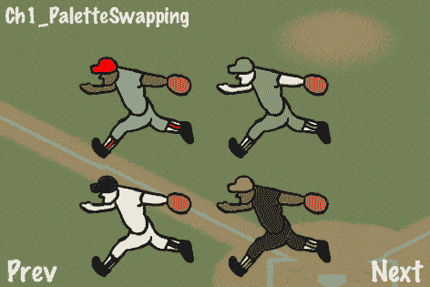

## 准备工作

请参考项目 `RecipeCollection01` 以获取此食谱的完整工作代码。

对于这个食谱，你需要一个图像处理程序。我推荐免费且易于使用的 *GIMP*。

## 如何操作...

我们将要做的第一件事是绘制精灵和可着色区域：

1.  用所有可动态着色的区域留白的方式绘制你的纹理。在你的图像编辑程序中，你的纹理应该看起来像以下这样：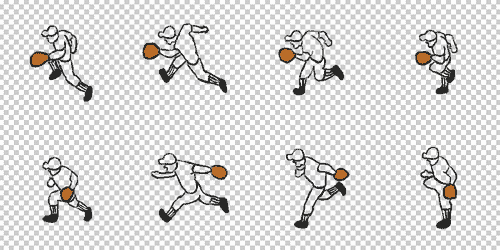

1.  创建一个新图层，并将特定区域着色为白色。在这个例子中，我们正在将他的制服（腿和衬衫）着色为白色：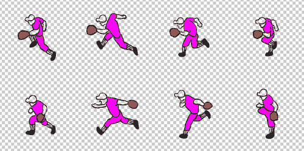

1.  隐藏其他图层，并将仅包含白色的单独图层保存为单独的纹理。

1.  对任何其他单独着色的部分重复此操作。

1.  一旦我们有了纹理，我们就可以编写一些代码：

    ```swift
    @implementation Ch1_PaletteSwapping
    -(CCLayer*) runRecipe {
    //Create a nice looking background
    CCSprite *bg = [CCSprite spriteWithFile:@"baseball_bg_02.png"];
    [bg setPosition:ccp(240,160)];
    bg.opacity = 100;
    [self addChild:bg z:0 tag:0];
    /*** Animate 4 different fielders with different color combinations ***/
    //Set color arrays
    ccColor3B colors1[] = {
    ccc3(255,217,161), ccc3(225,225,225), ccc3(0,0,150), ccc3(255,255,255) };
    ccColor3B colors2[] = {
    ccc3(140,100,46), ccc3(150,150,150), ccc3(255,0,0), ccc3(255,255,255) };
    ccColor3B colors3[] = {
    ccc3(255,217,161), ccc3(115,170,115), ccc3(115,170,115), ccc3(255,255,255) };
    ccColor3B colors4[] = {
    ccc3(140,100,46), ccc3(50,50,50), ccc3(255,255,0), ccc3(255,255,255) };
    //Animate fielders with colors
    [self animateFielderWithColors:colors1 withPosition:ccp(150,70)];
    [self animateFielderWithColors:colors2 withPosition:ccp(150,200)];
    [self animateFielderWithColors:colors3 withPosition:ccp(300,200)];
    [self animateFielderWithColors:colors4 withPosition:ccp(300,70)];
    return self;
    }
    -(void) animateFielderWithColors:(ccColor3B[])colors withPosition:(CGPoint)pos {
    //The names of our layers
    NSString *layers[] = { @"skin", @"uniform", @"trim", @"black_lines" };
    //Number of layers
    int numLayers = 4;
    for(int i=0; i<numLayers; i+=1){
    NSString *layerName = layers[i];
    ccColor3B color = colors[i];
    //We need each plist, the first frame name and finally a name for the animation
    NSString *plistName = [NSString stringWithFormat:@"fielder_run_%@.plist", layerName];
    NSString *firstFrameName = [NSString stringWithFormat:@"fielder_run_%@_01.png", layerName];
    NSString *animationName = [NSString stringWithFormat:@"fielder_run_%@", layerName];
    //Add plist frames to the SpriteFrameCache
    [[CCSpriteFrameCache sharedSpriteFrameCache] addSpriteFramesWithFile:plistName];
    //Get the first sprite frame
    CCSpriteFrame *firstFrame = [[CCSpriteFrameCache sharedSpriteFrameCache] spriteFrameByName:firstFrameName];
    //Create our sprite
    CCSprite *sprite = [CCSprite spriteWithSpriteFrame:firstFrame];
    //Set color and position
    sprite.position = pos;
    sprite.color = color;
    //Create the animation and add frames
    CCAnimation *animation = [[CCAnimation alloc] initWithName:animationName delay:0.15f];
    for(int i=1; i<=8; i+=1){
    CCSpriteFrame *frame = [[CCSpriteFrameCache sharedSpriteFrameCache] spriteFrameByName:[NSString stringWithFormat:@"fielder_run_%@_0%i.png",layerName,i]];
    [animation addFrame:frame];
    }
    //Run the repeating animation
    [sprite runAction:[CCRepeatForever actionWithAction: [CCAnimate actionWithAnimation:animation]]];
    //Finally, add the sprite
    [self addChild:sprite];
    }
    }
    @end

    ```

### 工作原理...

通过在主层（黑色轮廓）下方绘制可交换层，我们掩盖了着色中的任何不精确之处。对于像前一部分中显示的没有使用厚黑色轮廓的绘图这样的艺术作品，这种方法稍微困难一些。

+   效率—磁盘空间：

    在磁盘上保持你的 iOS 应用程序大小不超过一定范围总是一个好主意。这种技术在磁盘空间上相当容易，因为可交换的纹理由于简单的 PNG 压缩只占用很少的空间。

+   效率—内存使用：

    不幸的是，内存中纹理的大小由其像素大小决定。因此，如果你正在交换大型动画纹理，可能会遇到内存消耗问题。调色板交换纹理的内存消耗等于正常内存大小乘以要交换的调色板数量。

+   效率—CPU：

    当动画化调色板交换的纹理时，动画例程使用的 CPU 时间也将乘以可交换层的数量。这通常并不重要，因为动画本身占用的 CPU 时间非常少。

# 使用 CCTexture2DMutable 交换调色板

另一种调色板交换的方法涉及 **哨兵颜色** 和逐像素修改纹理的能力。这种方法可以帮助回收一些额外的磁盘和内存空间，但它通常需要大量的 CPU 时间。当与抗锯齿或混合纹理一起使用时，这种方法比之前的技术更混乱。

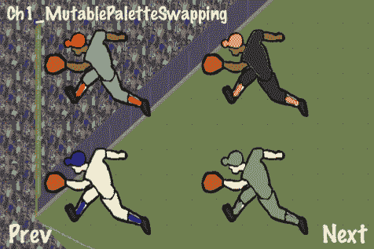

## 准备工作

请参阅 `project RecipeCollection01` 以获取此配方的完整工作代码。同时注意，包含的库 `CCTexture2DMutable` 并未包含在书中。

对于这个配方，你需要一个图像处理程序。再次推荐免费且易于使用的 *GIMP*。

## 如何做到这一点...

我们首先要做的是绘制一个包含由哨兵颜色定义的可着色区域的精灵。哨兵颜色通常是易于识别的基本颜色，并且可以程序化地替换。在这种情况下，我们将使用红色、蓝色和绿色：


在使用此技术时，最好尽可能避免抗锯齿和混合。根据你的纹理调整着色算法的容差可能很棘手。

现在，执行以下代码：

```swift
#import "CCTexture2DMutable.h"
@implementation Ch1_MutablePaletteSwapping
-(CCLayer*) runRecipe {
//Create a nice looking background
CCSprite *bg = [CCSprite spriteWithFile:@"baseball_bg_01.png"];
[bg setPosition:ccp(240,160)];
bg.opacity = 100;
[self addChild:bg z:0 tag:0];
/*** Animate 4 different fielders with different color combinations ***/
//Set color arrays
ccColor4B colors1[] = { ccc4(255,217,161,255), ccc4(225,225,225,255), ccc4(0,0,150,255) };
ccColor4B colors2[] = { ccc4(140,100,46,255), ccc4(150,150,150,255), ccc4(255,0,0,255) };
ccColor4B colors3[] = { ccc4(255,217,161,255), ccc4(115,170,115,255), ccc4(115,170,115,255) };
ccColor4B colors4[] = { ccc4(140,100,46,255), ccc4(50,50,50,255), ccc4(255,255,0,255) };
//Create texture copy to use as an immutable guide.
CCTexture2DMutable* textureCopy = [[[CCTexture2DMutable alloc] initWithImage:[UIImage imageNamed:@"fielder_run_sentinel_colors.png"]] autorelease];
//Create our sprites using mutable textures.
CCSprite *sprite1 = [CCSprite spriteWithTexture:[[[CCTexture2DMutable alloc] initWithImage:[UIImage imageNamed:@"fielder_run_sentinel_colors.png"]] autorelease]];
CCSprite *sprite2 = [CCSprite spriteWithTexture:[[[CCTexture2DMutable alloc] initWithImage:[UIImage imageNamed:@"fielder_run_sentinel_colors.png"]] autorelease]];
CCSprite *sprite3 = [CCSprite spriteWithTexture:[[[CCTexture2DMutable alloc] initWithImage:[UIImage imageNamed:@"fielder_run_sentinel_colors.png"]] autorelease]];
CCSprite *sprite4 = [CCSprite spriteWithTexture:[[[CCTexture2DMutable alloc] initWithImage:[UIImage imageNamed:@"fielder_run_sentinel_colors.png"]] autorelease]];
//Set sprite positions
[sprite1 setPosition:ccp(125,75)];
[sprite2 setPosition:ccp(125,225)];
[sprite3 setPosition:ccp(325,75)];
[sprite4 setPosition:ccp(325,225)];
//Swap colors in each sprite mutable texture and apply the changes.
[self swapColor:ccc4(0,0,255,255) withColor:colors1[0] inTexture:sprite1.texture withCopy:textureCopy];
[self swapColor:ccc4(0,255,0,255) withColor:colors1[1] inTexture:sprite1.texture withCopy:textureCopy];
[self swapColor:ccc4(255,0,0,255) withColor:colors1[2] inTexture:sprite1.texture withCopy:textureCopy];
[sprite1.texture apply];
/* CODE OMITTED */
//Finally, add the sprites to the scene.
[self addChild:sprite1 z:0 tag:0];
[self addChild:sprite2 z:0 tag:1];
[self addChild:sprite3 z:0 tag:2];
[self addChild:sprite4 z:0 tag:3];
return self;
}
-(void) swapColor:(ccColor4B)color1 withColor:(ccColor4B)color2 inTexture:(CCTexture2DMutable*)texture withCopy:(CCTexture2DMutable*)copy {
//Look through the texture, find all pixels of the specified color and change them.
//We use a tolerance of 200 here.
for(int x=0; x<texture.pixelsWide; x++){
for(int y=0; y<texture.pixelsHigh; y++){
if( [self isColor:[copy pixelAt:ccp(x,y)] equalTo:color1 withTolerance:200] ){
[texture setPixelAt:ccp(x,y) rgba:color2];
}
}
}
}
-(bool) isColor:(ccColor4B)color1 equalTo:(ccColor4B)color2 withTolerance:(int)tolerance {
//If the colors are equal within a tolerance we change them.
bool equal = YES;
if( abs(color1.r - color2.r) + abs(color1.g - color2.g) +
abs(color1.b - color2.b) + abs(color1.a - color2.a) > tolerance ){
equal = NO;
}
return equal;
}
@end

```

## 它是如何工作的...

无论好坏，这种技术与 *Adobe Photoshop* 和类似绘图程序中的颜色选择和替换工作方式相同。使用 `CCTexture2DMutable` 可能是一个缓慢的过程，并且这种方法仅推荐用于需要像素完美图形或对空间/内存要求非常严格的游戏。

# 使用 AWTextureFilter 进行模糊和字体阴影

通过利用 `CCTexture2DMutable` 类，`AWTextureFilter` 类可以用来创建一些酷炫的效果。这些包括 **高斯模糊**、选择性的高斯模糊以及如下场景中所示动态生成的字体阴影：

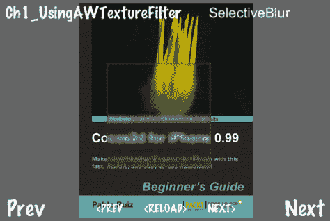

## 准备工作

请参考项目 `RecipeCollection01` 以获取此菜谱的完整工作代码。

## 如何操作...

执行以下代码：

```swift
#import "CCTexture2DMutable.h"
#import "AWTextureFilter.h"
@implementation Ch1_UsingAWTextureFilter
-(CCLayer*) runRecipe {
CGSize winSize = [[CCDirector sharedDirector] winSize];
//Pixel Format RGBA8888 is required for blur effects
[CCTexture2D setDefaultAlphaPixelFormat:kCCTexture2DPixelFormat_RGBA8888];
/*** Display a blurred texture ***/
//Create the blur mutable texture
CCTexture2DMutable *mutableBlurTexture = [[[CCTexture2DMutable alloc] initWithImage:[UIImage imageNamed:@"cocos2d_beginner.png"]] autorelease];
//Apply blur to the mutable texture
[AWTextureFilter blur:mutableBlurTexture radius:3];
//Create a sprite to show the blur
CCSprite *blurSprite = [CCSprite spriteWithTexture:mutableBlurTexture];
[blurSprite setPosition:ccp(winSize.width/2+blur.contentSize.width/2+1, winSize.height/2)];
//Add sprite to the scene
[self addChild:blurSprite z:0 tag:0];
/*** Display a selectively blurred texture ***/
//Create the mutable texture to selectively blur
CCTexture2DMutable *mutableSelectiveBlurTexture = [[[CCTexture2DMutable alloc] initWithImage:[UIImage imageNamed:@"cocos2d_beginner.png"]] autorelease];
//Apply selective blur to the mutable texture
[AWTextureFilter blur:mutableSelectiveBlurTexture radius:8 rect:CGRectMake(240-200, (winSize.height-160)-75, 150, 150)];
//Create a sprite to show the selective blur
CCSprite *selectiveBlurSprite = [CCSprite spriteWithTexture:mutableSelectiveBlurTexture];
[selectiveBlurSprite setPosition:ccp(winSize.width/2, winSize.height/2)];
//Add sprite to the scene
[self addChild:selectiveBlurSprite z:0 tag:1];
/*** Display dynamic font shadow effect ***/
//Create a background so we can see the shadow
CCLayerColor *background = [CCLayerColor layerWithColor:ccc4(200, 100, 100, 255) width:300 height:50];
[background setIsRelativeAnchorPoint:YES];
[background setAnchorPoint:ccp(0.5f, 0.5f)];
[background setPosition:ccp(winSize.width/2, winSize.height/2)];
//Create a sprite for the font label
CCSprite* labelSprite = [CCSprite node];
[labelSprite setPosition:ccp(winSize.width/2, winSize.height/2)];
//Create a sprite for the shadow
CCSprite* shadowSprite = [CCSprite node];
[shadowSprite setPosition:ccp(winSize.width/2+1, winSize.height/2+1)];
//Color it black
[shadowSprite setColor:ccBLACK];
//Add sprites to a node and the node to the scene
CCNode* node = [[CCNode alloc] init];
[node addChild:background z:-1];
[node addChild:shadowSprite z:0];
[node addChild:labelSprite z:1];
[self addChild:node z:-1 tag:2];
//Create a mutable texture with a string
CCTexture2DMutable *shadowTexture = [[[CCTexture2DMutable alloc] initWithString:@"Shadowed Text" fontName:@"Arial" fontSize:28] autorelease];
//Copy the mutable texture as non mutable texture
CCTexture2D *labelTexture = [[shadowTexture copyMutable:NO] autorelease];
//Set the label texture
[labelSprite setTexture:labelTexture];
[labelSprite setTextureRect:CGRectMake(0, 0, shadowTexture.contentSize.width, shadowTexture.contentSize.height)];
//Apply blur to the shadow texture
[AWTextureFilter blur:shadowTexture radius:4];
//Set the shadow texture
[shadowSprite setTexture:shadowTexture];
[shadowSprite setTextureRect:CGRectMake(0, 0, shadowTexture.contentSize.width, shadowTexture.contentSize.height)];
return self;
}

```

## 它是如何工作的...

`AWTextureFilter` 使用 `CCTexture2DMutable` 来实现令人印象深刻的高斯模糊效果。这是复杂像素操作的一个例子。

字体阴影：

`CCTexture2DMutable` 继承自 `CCTexture2D`。这允许我们使用以下方法：

```swift
- (id) initWithString:(NSString*)string fontName:(NSString*)name fontSize:(CGFloat)size;

```

这创建了一个标签纹理，然后我们可以通过创建一个偏移、变暗、模糊并最终绘制在原始标签纹理后面的类似纹理来创建模糊的字体阴影效果。

## 还有更多...

这里还有一些关于使用此模糊技术的其他建议：

+   将截图作为暂停菜单的背景进行模糊（参见本章下一节，*捕获和使用截图*）

+   结合颜色效果以产生酷炫的光晕效果

+   根据揭示类谜题和知识竞赛游戏的模糊半径进行增加或减少

# 捕获和使用截图

如上一次菜谱中所述，可以在游戏中捕获并使用截图来创建酷炫的效果，如暂停菜单的模糊背景。例如，在已发布的应用程序中，可以查看 *2K Sports NHL 2K11* 的暂停菜单。

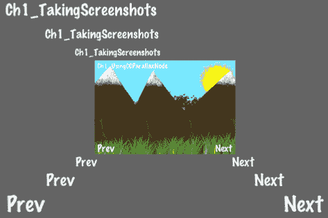

## 准备工作

请参考项目 `RecipeCollection01` 以获取此菜谱的完整工作代码。同时请注意，包含的 `Screenshot` 库在书中并未包含。

## 如何操作...

执行以下代码：

```swift
#import "Screenshot.h"
@implementation Ch1_TakingScreenshots
-(CCLayer*) runRecipe {
CCSprite* sprite = [CCSprite spriteWithTexture:[Screenshot takeAsTexture2D]];
[sprite setPosition:ccp(240,160)];
[sprite setScale:0.75f];
[self addChild:sprite z:0 tag:0];
return self;
}

```

## 它是如何工作的...

包含的 `Screenshot` 库使用了一些超出本书范围的复杂 iOS 技术。该库包含在 `RecipeCollection01` 中。你可以在那里查看它。

简而言之，`Screenshot` 会捕获当前屏幕上的内容并将其推入 `CCTexture2D` 以供你操作。

## 还有更多...

实时截图可用于各种用途，如下所示：

+   在比赛或关卡结束时，截图游戏中的精彩瞬间和高潮

+   考虑到你可以分析玩家当前正在看到的确切内容，你可以“打破第四面墙”（想想 *Metal Gear Solid* 中的 *Psycho Mantis*，在 *Sony PlayStation* 上）

+   类似于在 *Nintendo 64* 上的 *Pokemon Snap* 的游戏内用户控制摄像头

# 使用 CCParallaxNode

**Parallaxing** 是 2D 侧滚动视频游戏的基础。一个有能力的开发者如果不在 2D 侧滚动游戏中包含一个漂亮的透视背景，那将是失职的。Cocos2d 通过 CCParallaxNode 使透视变得简单。

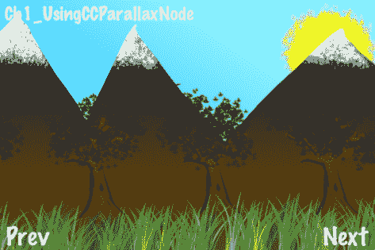

## 准备工作

请参考项目 `RecipeCollection01` 以获取此菜谱的完整工作代码。

## 如何操作...

执行以下代码：

```swift
@implementation Ch1_UsingCCParallaxNode
-(CCLayer*) runRecipe {
//Create four parallax sprites, one for each layer
CCSprite* parallaxLayer01 = [CCSprite spriteWithFile:@"parallax_layer_01.png"];
CCSprite* parallaxLayer02 = [CCSprite spriteWithFile:@"parallax_layer_02.png"];
CCSprite* parallaxLayer03 = [CCSprite spriteWithFile:@"parallax_layer_03.png"];
CCSprite* parallaxLayer04 = [CCSprite spriteWithFile:@"parallax_layer_04.png"];
//Create a parallax node and add all four sprites
CCParallaxNode* parallaxNode = [CCParallaxNode node];
[parallaxNode setPosition:ccp(0,0)];
[parallaxNode addChild:parallaxLayer01 z:1 parallaxRatio:ccp(0, 0) positionOffset:ccp(240,200)];
[parallaxNode addChild:parallaxLayer02 z:2 parallaxRatio:ccp(1, 0) positionOffset:ccp(240,100)];
[parallaxNode addChild:parallaxLayer03 z:3 parallaxRatio:ccp(2, 0) positionOffset:ccp(240,100)];
[parallaxNode addChild:parallaxLayer04 z:4 parallaxRatio:ccp(3, 0) positionOffset:ccp(240,20)];
[self addChild:parallaxNode z:0 tag:1];
//Move the node to the left then the right
//This creates the effect that we are moving to the right then the left
CCMoveBy* moveRight = [CCMoveBy actionWithDuration:5.0f position:ccp(-80, 0)];
CCMoveBy* moveLeft = [CCMoveBy actionWithDuration:2.5f position:ccp(80, 0)];
CCSequence* sequence = [CCSequence actions:moveRight, moveLeft, nil];
CCRepeatForever* repeat = [CCRepeatForever actionWithAction:sequence];
[parallaxNode runAction:repeat];
return self;
}
@end

```

## 它是如何工作的...

Cocos2d 使得创建看起来专业的滚动背景变得非常容易。`CCParallaxNode`将视差的概念分解为其关键组件。在下面的示例中，我们将四个精灵附加到`CCParallaxNode`的一个实例上。请注意，您可以将任何`CCNode`附加到`CCParallaxNode`。然后我们设置`parallaxRatio`和`parallaxOffset`以创建所需的效果。

+   **视差比率：**

    这个比率决定了游戏坐标如何影响这个特定视差层的坐标。`ccp(2,0)`的比率意味着精灵在 X 轴上滚动速度是两倍，而在 Y 轴上则完全不滚动。更高的（更快的）比率通常绘制得离相机更近。

+   **位置偏移：**

    每个子节点的位置偏移量代表当其父节点（`CCParallaxNode`）位于原点或`ccp(0,0)`时，它将被绘制的位置。一旦主`CCParallaxNode`实例移动，子节点将以适当的比率移动。

## 还有更多...

有多种方法可以循环视差背景。一种方法是在每一步检查`parallaxNode`的位置，并根据视差节点 X 位置除以屏幕大小的整数值调整所有子节点的位置偏移量：

```swift
parallaxNodeChildXOffset = baseXOffset + ((int) (self.position.x / winSize.width)) * winSize.width;

```

这实际上在`parallaxNode`移动一个完整屏幕宽度后重置了子节点的位置。

# 使用`glColorMask`进行光照

**光照**是大多数 3D 视频游戏的基本组成部分。2D 游戏本身并不自然地适合光照效果，但通过正确的技术，我们可以创建一个 2D 体验，其中光照扮演着至关重要的角色。这为我们的 2D 场景增添了悬念。

在这个菜谱中，我们看到一位僧人手持灯笼穿过一个黑暗的山洞。僧人的灯笼发出圆形的光，照亮了场景中的黑暗部分。随着僧人穿过山洞，一群蝙蝠变得可见。

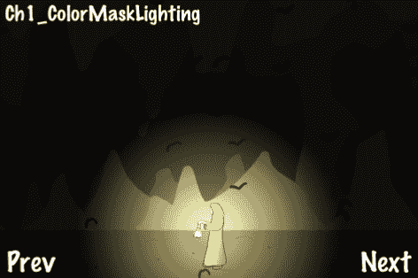

## 准备工作

请参考项目`RecipeCollection01`以获取此菜谱的完整工作代码。此外，请注意，用于创建“飞蝙蝠”效果的代码已被省略，因为那已经在之前的菜谱中介绍过了。

## 如何操作...

执行以下代码：

```swift
@interface Ch1_ColorMaskLighting : Recipe
{
SimpleAnimObject *burnSprite;
SimpleAnimObject *lightSprite;
SimpleAnimObject *monkSprite;
CCRenderTexture *darknessLayer;
NSMutableArray *bats;
CCAnimation *batFlyUp;
CCAnimation *batGlideDown;
}
@end
@implementation Ch1_ColorMaskLighting
-(CCLayer*) runRecipe {
//Add our PLISTs to the SpriteFrameCache singleton
CCSpriteFrameCache * cache = [CCSpriteFrameCache sharedSpriteFrameCache];
[cache addSpriteFramesWithFile:@"simple_bat.plist"];
[cache addSpriteFramesWithFile:@"monk_lantern.plist"];
//Add cave background
CCSprite *caveBg = [CCSprite spriteWithFile:@"cave.png"];
[caveBg setPosition:ccp(240,160)];
[self addChild: caveBg z:0 tag:TAG_CAVE_BG];
//Set up the burn sprite that will "knock out" parts of the darkness layer depending on the alpha value of the pixels in the image.
burnSprite = [SimpleAnimObject spriteWithFile:@"fire.png"];
burnSprite.position = ccp(50,50);
burnSprite.scale = 10.0f;
[burnSprite setBlendFunc: (ccBlendFunc) { GL_ZERO, GL_ONE_MINUS_SRC_ALPHA }];
[burnSprite retain];
burnSprite.velocity = ccp(1,0);
//Add a 'light' sprite which additively blends onto the scene. This represents the cone of light created by the monk's candle.
lightSprite = [SimpleAnimObject spriteWithFile:@"fire.png"];
lightSprite.position = ccp(50,50);
lightSprite.scale = 10.0f;
[lightSprite setColor:ccc3(100,100,50)];
[lightSprite setBlendFunc: (ccBlendFunc) { GL_ONE, GL_ONE }];
lightSprite.velocity = ccp(1,0);
[self addChild:lightSprite z:4 tag:TAG_LIGHT_SPRITE];
//Add the monk
monkSprite = [[SimpleAnimObject alloc] init];
monkSprite.position = ccp(50,50);
monkSprite.velocity = ccp(1,0);
[self addChild:monkSprite z:1 tag:TAG_MONK];
//Animate the monk to simulate walking.
CCAnimation *animation = [[CCAnimation alloc] initWithName:@"monk_lantern_walk" delay:0.1f];
for(int i=1; i<=5; i+=1){
[animation addFrame:[cache spriteFrameByName:[NSString stringWithFormat:@"monk_lantern_0%i.png",i]]];
}
for(int i=4; i>=2; i-=1){
[animation addFrame:[cache spriteFrameByName:[NSString stringWithFormat:@"monk_lantern_0%i.png",i]]];
}
[monkSprite runAction:[CCRepeatForever actionWithAction: [CCAnimate actionWithAnimation:animation]]];
//Add the 'darkness' layer. This simulates darkness in the cave.
darknessLayer = [CCRenderTexture renderTextureWithWidth:480 height:320];
darknessLayer.position = ccp(240,160);
[self addChild:darknessLayer z:0 tag:TAG_DARKNESS_LAYER];
//Schedule physics updates
[self schedule:@selector(step:)];
return self;
}
-(void)step:(ccTime)delta {
CGSize s = [[CCDirector sharedDirector] winSize];
//Clear the darkness layer for redrawing. Here we clear it to BLACK with 90% opacity.
[darknessLayer clear:0.0f g:0.0f b:0.0f a:0.9f];
//Begin the darkness layer drawing routine. This transforms to the proper location, among other things.
[darknessLayer begin];
//Limit drawing to the alpha channel.
glColorMask(0.0f, 0.0f, 0.0f, 1.0f);
//Draw the burn sprite only on the alpha channel.
[burnSprite visit];
//Reset glColorMask to allow drawing of colors.
glColorMask(1.0f, 1.0f, 1.0f, 1.0f);
//Finish transformation.
[darknessLayer end];
//Make the monk walk back and forth.
if(monkSprite.position.x > 480){
monkSprite.flipX = YES;
burnSprite.velocity = ccp(-1,0);
lightSprite.velocity = ccp(-1,0);
monkSprite.velocity = ccp(-1,0);
}else if(monkSprite.position.x < 0){
monkSprite.flipX = NO;
burnSprite.velocity = ccp(1,0);
lightSprite.velocity = ccp(1,0);
monkSprite.velocity = ccp(1,0);
}
//Update our SimpleAnimObjects
[burnSprite update:delta];
[lightSprite update:delta];
[monkSprite update:delta];
}
@end

```

## 它是如何工作的...

Cocos2d 仅暴露了足够的 OpenGL 绘制逻辑，使得复杂的渲染顺序操作看起来很容易。为了实现这种效果，我们使用`CCRenderTexture`。首先，我们使用以下调用清除屏幕：

```swift
[darknessLayer clear:0.0f g:0.0f b:0.0f a:0.9f];

```

我们随后通过`glColorMask`调用仅限制绘制到**alpha 通道**。这实际上告诉 OpenGL 根据我们渲染的内容来修改图形缓冲区的透明度（只有透明度，而不是颜色）。因此，我们渲染`fire.png`纹理来模拟 2D 光并在圆形中扩散。

最后，我们在上面添加另一个`fire.png`纹理以模拟光亮和颜色。

节点`darknessLayer`仅在屏幕的视图中绘制，而`burnSprite`和`lightSprite`则在灯笼的位置绘制。

## 还有更多...

使用类似的技术，可以创造出各种形状、大小和颜色的灯光。这包括像火炬这样的动画灯光、像汽车前灯这样的形状灯光，或者像爆炸时明亮的闪光这样的短暂快速灯光效果。

最重要的是，这种效果让我们能够用可能或可能不存在于游戏世界阴影中的事物来逗弄玩家。
