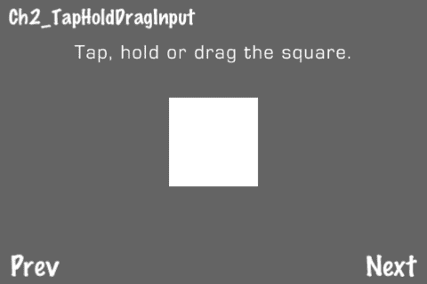
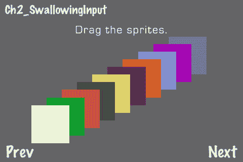
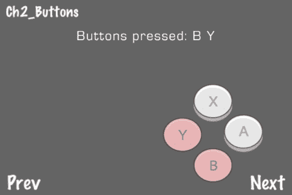
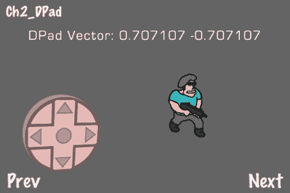
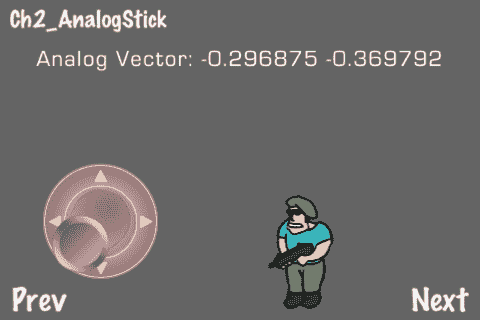
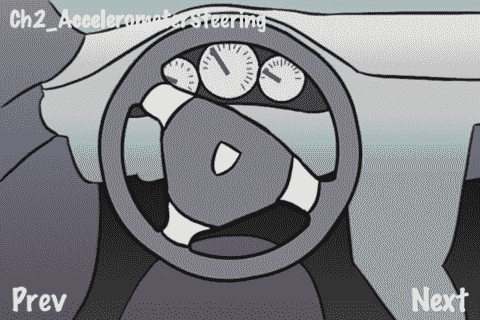
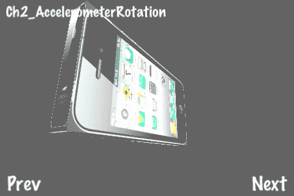
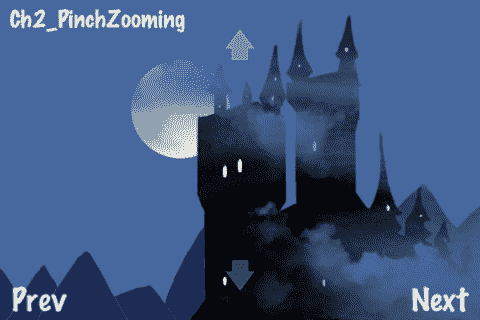
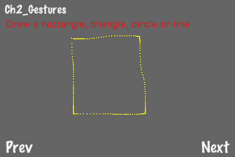

# 第二章. 用户输入

在本章中，我们将介绍以下内容：

+   点击、长按和拖动输入

+   深度测试输入

+   创建按钮

+   创建方向盘

+   创建模拟摇杆

+   使用加速度计进行转向

+   使用加速度计进行 3D 旋转

+   捏合缩放

+   执行手势

# 简介

没有用户输入，视频游戏仅仅是一个技术演示。iOS 触摸设备允许对用户输入进行无限定制的自定义。在本章中，我们将介绍使用 **触摸屏** 和 **加速度计** 的最常见输入方法。

# 点击、长按和拖动输入

**点击、长按** 和 **拖动** 是最常用的输入技术。它们构成了用户界面输入以及与游戏对象交互的基本构建块。在本菜谱中，我们通过继承 `CCSprite` 来创建一个可以处理触摸事件并保持一些自定义状态信息的精灵。这，加上一些逻辑，使我们能够触摸、长按和拖动这个精灵。



## 准备工作

请参考项目 *RecipeCollection01* 以获取此菜谱的完整工作代码。

## 如何实现...

执行以下代码：

```swift
//ColorTouchSprite.h
enum { TS_NONE, TS_TAP, TS_HOLD, TS_DRAG };
@interface ColorTouchSprite : CCSprite
{
@public
float holdTime; //How long have we held down on this?
int touchedState; //Current touched state
bool isTouched; //Are we touching this currently?
float lastMoved; //How long has it been since we moved this?
CGPoint lastTouchedPoint; //Where did we last touch?
const float releaseThreshold = 1.0f; //How long before we recognize a release
const float holdThreshold = 0.2f; //How long before a tap turns into a hold
const float lastMovedThreshold = 0.5f; //How long before we consider you to be 'not moving'
const int dragThreshold = 3; //We have a drag threshold of 3 pixels.
}
@end
@implementation ColorTouchSprite
@synthesize touchedState;
-(id) init {
holdTime = 0; lastMoved = 0; touchedState = TS_NONE;
isTouched = NO; lastTouchedPoint = ccp(0,0);
[self schedule:@selector(step:)];
return [super init];
}
-(void) step:(ccTime)dt {
//We use holdTime to determine the difference between a tap and a hold
if(isTouched){
holdTime += dt; lastMoved += dt;
}else{
holdTime += dt;
if(holdTime > releaseThreshold){
touchedState = TS_NONE;
}
}
//If you are holding and you haven't moved in a while change the state
if(holdTime > holdThreshold && isTouched && lastMoved > lastMovedThreshold){
touchedState = TS_HOLD;
}
}
/* Used to determine whether or not we touched this object */
- (CGRect) rect {
float scaleMod = 1.0f;
float w = [self contentSize].width * [self scale] * scaleMod;
float h = [self contentSize].height * [self scale] * scaleMod;
CGPoint point = CGPointMake([self position].x - (w/2), [self position].y - (h/2));
return CGRectMake(point.x, point.y, w, h);
}
/* Process touches */
-(void) ccTouchesBegan:(NSSet *)touches withEvent:(UIEvent *)event {
UITouch *touch = [touches anyObject];
CGPoint point = [touch locationInView: [touch view]];
point = [[CCDirector sharedDirector] convertToGL: point];
isTouched = YES; holdTime = 0; touchedState = TS_NONE;
lastTouchedPoint = point;
}
-(void) ccTouchesMoved:(NSSet *)touches withEvent:(UIEvent *)event {
if(!isTouched){ return; }
UITouch *touch = [touches anyObject];
CGPoint point = [touch locationInView: [touch view]];
point = [[CCDirector sharedDirector] convertToGL: point];
if(touchedState == TS_DRAG || distanceBetweenPoints(lastTouchedPoint, point) > dragThreshold){
touchedState = TS_DRAG;
self.position = point;
lastMoved = 0;
}
lastTouchedPoint = point;
}
-(void) ccTouchesEnded:(NSSet *)touches withEvent:(UIEvent *)event {
if(!isTouched){ return; }
UITouch *touch = [touches anyObject];
CGPoint point = [touch locationInView: [touch view]];
point = [[CCDirector sharedDirector] convertToGL: point];
//A short hold time after a touch ended means a tap.
if(holdTime < 10){
touchedState = TS_TAP;
}
holdTime = 0;
isTouched = NO;
lastTouchedPoint = point;
}
@end
#import "Helpers.h"
@implementation Ch2_TapHoldDragInput
-(CCLayer*) runRecipe {
self.isTouchEnabled = YES;
//Our message sprite
message = [CCLabelBMFont labelWithString:@"Tap, hold or drag the square." fntFile:@"eurostile_30.fnt"];
message.position = ccp(240,260);
message.scale = 0.75f;
[self addChild:message];
//Init the ColorTouchSprite
colorTouchSprite = [ColorTouchSprite spriteWithFile:@"blank.png"];
colorTouchSprite.position = ccp(240,160);
[colorTouchSprite setTextureRect:CGRectMake(0,0,100,100)];
[self addChild:colorTouchSprite];
[self schedule:@selector(step)];
return self;
}
/* Process touch events */
-(void) ccTouchesBegan:(NSSet *)touches withEvent:(UIEvent *)event {
UITouch *touch = [touches anyObject];
CGPoint point = [touch locationInView: [touch view]];
point = [[CCDirector sharedDirector] convertToGL: point];
//Helper function 'pointIsInRect' is defined in Helpers.h
if(pointIsInRect(point, [colorTouchSprite rect])){
[colorTouchSprite ccTouchesBegan:touches withEvent:event];
}
}
-(void) ccTouchesMoved:(NSSet *)touches withEvent:(UIEvent *)event {
/* CODE OMITTED */
}
-(void) ccTouchesEnded:(NSSet *)touches withEvent:(UIEvent *)event {
/* CODE OMITTED */
}
@end

```

## 工作原理...

首先，我们通过继承 `CCSprite` 创建 `ColorTouchSprite` 类。在这里，我们维护状态变量，以便我们能够区分点击、长按和拖动。我们还指定了一个 `(CGRect)rect` 方法。这个方法用于确定精灵是否被触摸。主菜谱层使用以下三个方法将触摸事件信息传递给这个精灵：

```swift
-(void) ccTouchesBegan:(NSSet *)touches withEvent:(UIEvent *)event;
-(void) ccTouchesMoved:(NSSet *)touches withEvent:(UIEvent *)event;
-(void) ccTouchesEnded:(NSSet *)touches withEvent:(UIEvent *)event;

```

这些方法相当直接。每次我们触摸层时，我们调用 `ccTouchesBegan`。当我们移动时，我们调用 `ccTouchesMoved`。最后，当我们抬起手指时，我们调用 `ccTouchesEnded`。每个方法都执行 `pointIsInRect` 检查，然后调用精灵上的相应触摸方法。最后，精灵运行一些简单的逻辑来确定状态，并允许拖动精灵。

## 还有更多...

之前使用的技术并非捕获输入的唯一方式。Cocos2d 还提供了 `CCTouchDispatcher` 类。使用这个类，你可以实现 `CCTargetedTouchDelegate` 协议中的方法，并将代理对象分配给自动处理你的触摸输入。

## 相关内容...

有关此方法的更多信息，请参阅官方 Cocos2d 文档和 Cocos2d 论坛。

# 深度测试输入

手动处理输入，如前一个菜谱所示，给我们提供了在高级别管理可触摸对象的机会。使用按 Z 轴顺序排序的精灵数组，我们可以“吞没输入”，这样背景精灵就不会受到影响。



## 准备工作

请参考项目 *RecipeCollection01* 以获取此菜谱的完整工作代码。

## 如何实现...

执行以下代码：

```swift
#import "ColorTouchSprite.h"
@implementation Ch2_DepthTestingInput
-(CCLayer*) runRecipe {
//Init the ColorTouchSprites
[self initSprites];
return self;
}
-(void) initSprites {
sprites = [[NSMutableArray alloc] init];
//We add 10 randomly colored sprites
for(int x=0; x<10; x++){
CCSprite *sprite = [ColorTouchSprite spriteWithFile:@"blank.png"];
/* CODE OMITTED */
}
}
/* Process touch events */
-(void) ccTouchesBegan:(NSSet *)touches withEvent:(UIEvent *)event {
UITouch *touch = [touches anyObject];
CGPoint point = [touch locationInView: [touch view]];
point = [[CCDirector sharedDirector] convertToGL: point];
//Process input for all sprites
for(id sprite in sprites){
if(pointIsInRect(point, [sprite rect])){
//Swallow the input
[sprite ccTouchesBegan:touches withEvent:event];
return;
}
}
}
-(void) ccTouchesMoved:(NSSet *)touches withEvent:(UIEvent *)event {
/* CODE OMITTED */
//Process input for all sprites
for(id sprite in sprites){
if(pointIsInRect(point, [sprite rect])){
[sprite ccTouchesMoved:touches withEvent:event];
}
}
}
-(void) ccTouchesEnded:(NSSet *)touches withEvent:(UIEvent *)event {
/* CODE OMITTED */
//Process input for all sprites
for(id sprite in sprites){
//End all input when you lift up your finger
[sprite ccTouchesEnded:touches withEvent:event];
}
}
@end

```

## 工作原理...

我们的精灵数组有一个**节点顺序**，这直接对应于它们的**Z**顺序。因此，遍历这些精灵会进行隐式的**深度测试**。当一个精灵触摸开始时，我们吞下输入，只允许触摸那个精灵。

+   注意事项：

    这种技术的唯一注意事项是，输入深度测试与精灵数组顺序相关联。任何对精灵**Z**顺序的修改都需要对数组中的节点进行**重新排序**。

# 创建按钮

**按钮**以某种形式被用于大多数游戏中。使用 Cocos2d 实现一个简单的按钮解决方案很容易，但创建一个支持**多指同时触摸**的按钮则更困难。在这个菜谱中，我们将实现一个简单但有效的解决方案来解决这个问题。



## 准备工作

请参阅项目*RecipeCollection01*以获取此菜谱的完整工作代码。

## 如何实现...

执行以下代码：

```swift
//TouchableSprite.h
@interface TouchableSprite : CCSprite
{
@public
bool pressed; //Is this sprite pressed
NSUInteger touchHash; //Used to identify individual touches
}
@end
@implementation TouchableSprite
- (bool)checkTouchWithPoint:(CGPoint)point {
if(pointIsInRect(point, [self rect])){
return YES;
}else{
return NO;
}
}
- (CGRect) rect {
//We set our scale mod to make sprite easier to press.
//This also lets us press 2 sprites with 1 touch if they are sufficiently close.
float scaleMod = 1.5f;
float w = [self contentSize].width * [self scale] * scaleMod;
float h = [self contentSize].height * [self scale] * scaleMod;
CGPoint point = CGPointMake([self position].x - (w/2), [self position].y - (h/2));
return CGRectMake(point.x, point.y, w, h);
}
- (void)ccTouchesBegan:(NSSet *)touches withEvent:(UIEvent *)event {
UITouch *touch = [touches anyObject];
CGPoint point = [touch locationInView: [touch view]];
point = [[CCDirector sharedDirector] convertToGL: point];
//We use circle collision for our buttons
if(pointIsInCircle(point, self.position, self.rect.size.width/2)){
touchHash = [touch hash];
[self processTouch:point];
}
}
- (void)ccTouchesMoved:(NSSet *)touches withEvent:(UIEvent *)event {
/* CODE OMITTED */
if(pointIsInCircle(point, self.position, self.rect.size.width/2)){
if(touchHash == [touch hash]){ //If we moved on this sprite
[self processTouch:point];
}else if(!pressed){ //If a new touch moves onto this sprite
touchHash = [touch hash];
[self processTouch:point];
}
}else if(touchHash == [touch hash]){ //If we moved off of this sprite
[self processRelease];
}
}
- (void)ccTouchesEnded:(NSSet *)touches withEvent:(UIEvent *)event {
/* CODE OMITTED */
if(touchHash == [touch hash]){ //If the touch which pressed this sprite ended we release
[self processRelease];
}
}
- (void)processTouch:(CGPoint)point {
pressed = YES;
}
buttonscreating- (void)processRelease {
pressed = NO;
}
@end
//GameButton.h
@interface GameButton : TouchableSprite {
@public
NSString* upSpriteFrame;
NSString* downSpriteFrame;
NSString* name;
}
@end
@implementation GameButton
- (void)processTouch:(CGPoint)point {
CCSpriteFrameCache *cache = [CCSpriteFrameCache sharedSpriteFrameCache];
[self setDisplayFrame:[cache spriteFrameByName:downSpriteFrame]];
pressed = true;
[self setColor:ccc3(255,200,200)];
}
- (void)processRelease {
CCSpriteFrameCache *cache = [CCSpriteFrameCache sharedSpriteFrameCache];
[self setDisplayFrame:[cache spriteFrameByName:upSpriteFrame]];
pressed = false;
[self setColor:ccc3(255,255,255)];
}
@end
@implementation Ch2_Buttons
-(CCLayer*) runRecipe {
//Init buttons data structure
buttons = [[NSMutableArray alloc] init];
//Create buttons
CCSpriteFrameCache *cache = [CCSpriteFrameCache sharedSpriteFrameCache];
[cache addSpriteFramesWithFile:@"dpad_buttons.plist"];
[self createButtonWithPosition:ccp(350,50) withUpFrame:@"b_button_up.png" withDownFrame:@"b_button_down.png" withName:@"B"];
/* CODE OMITTED */
//Schedule step method
[self schedule:@selector(step)];
return self;
}
/* Display pressed buttons */
-(void) step {
[message setString:@"Buttons pressed:"];
for(GameButton *b in buttons){
if(b.pressed){
[message setString:[NSString stringWithFormat:@"%@ %@",message.string,b.name]];
}
}
}
/* Button creation shortcut method */
-(void) createButtonWithPosition:(CGPoint)position withUpFrame:(NSString*)upFrame withDownFrame:(NSString*)downFrame withName:(NSString*)name {
CCSpriteFrameCache *cache = [CCSpriteFrameCache sharedSpriteFrameCache];
GameButton *button = [[GameButton alloc] init];
button.position = position;
[button setUpSpriteFrame:upFrame];
[button setDownSpriteFrame:downFrame];
[button setDisplayFrame:[cache spriteFrameByName:[button upSpriteFrame]]];
button.name = name;
[self addChild:button];
[buttons addObject:button];
}
-(void) ccTouchesBegan:(NSSet *)touches withEvent:(UIEvent *)event {
UITouch *touch = [touches anyObject];
CGPoint point = [touch locationInView: [touch view]];
point = [[CCDirector sharedDirector] convertToGL: point];
//Pass all touchesBegan events to GameButton instances
for(GameButton *b in buttons){
[b ccTouchesBegan:touches withEvent:event];
}
}
-(void) ccTouchesMoved:(NSSet *)touches withEvent:(UIEvent *)event {
/* CODE OMITTED */
}
-(void) ccTouchesEnded:(NSSet *)touches withEvent:(UIEvent *)event {
/* CODE OMITTED */
}
@end

```

## 它是如何工作的...

这个菜谱使用几个不同的类，所有这些类都从`CCSprite`派生，来创建逼真的按钮。这些按钮都可以独立触摸。

+   独立触摸多个按钮：

    要使多按钮触摸工作，我们首先在我们的`AppDelegate`文件中的主`UIWindow`上调用以下方法：

    ```swift
    [window setMultipleTouchEnabled:YES];

    ```

    然后，我们的`TouchableSprite`类使用唯一标识通过`ccTouches`方法的每个`UITouch`对象的哈希变量。这样我们就可以跟踪每个独特的触摸。触摸甚至可以用来同时触摸两个按钮。

+   用一个触摸点触摸两个按钮：

    我们的`(CGRect)rect`方法使用`scaleMod`为`1.5f`。这，加上使用`pointInCircle`进行触摸检测，允许我们用一个放置得当的触摸点同时按下两个按钮。这对许多游戏至关重要。例如，原始超级马里奥兄弟要求用户按下 B 按钮来跑步，同时按下 A 按钮来跳跃。这种技术允许类似地使用 Y 和 A 按钮。

# 创建方向垫

另一种视频游戏输入的基本形式是**方向垫**。在这个菜谱中，你将看到如何创建一个令人信服的 3D 方向垫，你将看到如何在游戏场景中正确处理方向垫信息。



## 准备工作

请参阅项目*RecipeCollection01*以获取此菜谱的完整工作代码。此外，请注意，为了简洁起见，一些代码已被省略。

## 如何实现...

执行以下代码：

```swift
#import "TouchableSprite.h"
@interface DPad : TouchableSprite {
@public
CGPoint pressedVector;
int direction;
}
@end
@implementation DPad
-(id)init {
self = [super init];
if (self != nil) {
pressedVector = ccp(0,0);
direction = DPAD_NO_DIRECTION;
CCSpriteFrameCache *cache = [CCSpriteFrameCache sharedSpriteFrameCache];
[cache addSpriteFramesWithFile:@"dpad_buttons.plist"];
//Set the sprite display frame
[self setDisplayFrame:[cache spriteFrameByName:@"d_pad_normal.png"]];
}
return self;
}
/* Process DPad touch */
- (void)processTouch:(CGPoint)point {
CCSpriteFrameCache *cache = [CCSpriteFrameCache sharedSpriteFrameCache];
//Set a color visual cue if pressed
[self setColor:ccc3(255,200,200)];
pressed = true;
CGPoint center = CGPointMake( self.rect.origin.x+self.rect.size.width/2, self.rect.origin.y+self.rect.size.height/2 );
//Process center dead zone
if(distanceBetweenPoints(point, center) < self.rect.size.width/10){
[self setDisplayFrame:[cache spriteFrameByName:@"d_pad_normal.png"]];
self.rotation = 0;
pressedVector = ccp(0,0);
direction = DPAD_NO_DIRECTION;
return;
}
//Process direction
float radians = vectorToRadians( CGPointMake(point.x-center.x, point.y-center.y) );
float degrees = radiansToDegrees(radians) + 90;
float sin45 = 0.7071067812f;
if(degrees >= 337.5 || degrees < 22.5){
[self setDisplayFrame:[cache spriteFrameByName:@"d_pad_horizontal.png"]];
self.rotation = 180; pressedVector = ccp(-1,0); direction = DPAD_LEFT;
}else if(degrees >= 22.5 && degrees < 67.5){
[self setDisplayFrame:[cache spriteFrameByName:@"d_pad_diagonal.png"]];
self.rotation = -90; pressedVector = ccp(-sin45,sin45); direction = DPAD_UP_LEFT;
}/* CODE OMITTED */
}
/* Process DPad release */
- (void)processRelease {
[self setColor:ccc3(255,255,255)];
CCSpriteFrameCache *cache = [CCSpriteFrameCache sharedSpriteFrameCache];
[self setDisplayFrame:[cache spriteFrameByName:@"d_pad_normal.png"]];
self.rotation = 0;
pressed = false;
pressedVector = ccp(0,0);
direction = DPAD_NO_DIRECTION;
}
@end
@implementation Ch2_DPad
-(CCLayer*) runRecipe {
//Add gunman sprites
CCSpriteFrameCache *cache = [CCSpriteFrameCache sharedSpriteFrameCache];
[cache addSpriteFramesWithFile:@"gunman.plist"];
//Initialize gunman
gunman = [SimpleAnimObject spriteWithSpriteFrame:[cache spriteFrameByName:@"gunman_stand_down.png"]];
gunman.position = ccp(240,160);
[self addChild:gunman];
gunmanDirection = DPAD_DOWN;
//Initialize DPad
[cache addSpriteFramesWithFile:@"dpad_buttons.plist"];
dPad = [[DPad alloc] init];
dPad.position = ccp(100,100);
[self addChild:dPad];
[self schedule:@selector(step:)];
return self;
}
-(void) step:(ccTime)delta {
//We reset the animation if the gunman changes direction
if(dPad.direction != DPAD_NO_DIRECTION){
if(gunmanDirection != dPad.direction){
resetAnimation = YES;
gunmanDirection = dPad.direction;
}
}
if(gunman.velocity.x != dPad.pressedVector.x*2 || gunman.velocity.y != dPad.pressedVector.y*2){
gunman.velocity = ccp(dPad.pressedVector.x*2, dPad.pressedVector.y*2);
resetAnimation = YES;
}
//Update gunman position
[gunman update:delta];
//Re-animate if necessary
if(resetAnimation){
[self animateGunman];
}
directional padcreating}
-(void) animateGunman {
CCSpriteFrameCache *cache = [CCSpriteFrameCache sharedSpriteFrameCache];
/* Animate our gunman */
CCAnimation *animation = [[CCAnimation alloc] initWithName:@"gunman_anim" delay:0.15f];
NSString *direction;
bool flipX = NO;
bool moving = YES;
if(gunman.velocity.x == 0 && gunman.velocity.y == 0){ moving = NO; }
if(gunmanDirection == DPAD_LEFT){ direction = @"right"; flipX = YES; }
else if(gunmanDirection == DPAD_UP_LEFT){ direction = @"up_right"; flipX = YES; }
/* CODE OMITTED */
//Our simple running loop
if(moving){
[animation addFrame:[cache spriteFrameByName:[NSString stringWithFormat:@"gunman_run_%@_01.png",direction]]];
/* CODE OMITTED */
}
directional padcreatinggunman.flipX = flipX;
[gunman runAction:[CCRepeatForever actionWithAction: [CCAnimate actionWithAnimation:animation]]];
}
/* Process touches */
-(void) ccTouchesBegan:(NSSet *)touches withEvent:(UIEvent *)event {
UITouch *touch = [touches anyObject];
CGPoint point = [touch locationInView: [touch view]];
point = [[CCDirector sharedDirector] convertToGL: point];
[dPad ccTouchesBegan:touches withEvent:event];
}
-(void) ccTouchesMoved:(NSSet *)touches withEvent:(UIEvent *)event {
/* CODE OMITTED */
}
-(void) ccTouchesEnded:(NSSet *)touches withEvent:(UIEvent *)event {
/* CODE OMITTED */
}
@end

```

## 它是如何工作的...

这个菜谱使用一些简单的技巧来制作令人信服的方向垫效果。首先，我们必须看看`DPad`类。

+   `DPad`类：

    `DPad`类通过首先从 DPad 图像的中心创建一个 2D 向量到触摸点的位置来确定触摸方向。然后它将图像分成八个方向切片。每个方向对应于不同的精灵帧。当一切组合在一起时，我们得到一个看起来很棒的伪 3D 效果。

+   处理 DPad 状态和 `pressedVector`：

    `DPad` 类维护一个方向枚举和一个方向向量。这使我们能够确定我们的“枪手”精灵应该面向哪个方向，以及我们应该如何设置他的 `velocity` 变量以引发移动。

+   DPad 死区：

    我们的 DPad 在中间大约有 10% 的 **死区**。这使得控制感觉对用户来说更加自然。我们这样做是因为，在真实的方向板上，直接按下中间会导致没有移动。

# 创建模拟摇杆

通过在上一个菜谱的基础上构建，我们可以创建一个更复杂的虚拟 **模拟摇杆**。这种输入方法测量向量的大小以及方向。我们还为模拟摇杆创建了一个酷炫的视觉效果。



## 准备工作

请参阅项目 *RecipeCollection01* 以获取此菜谱的完整工作代码。

## 如何实现...

执行以下代码：

```swift
#import "TouchableSprite.h"
//AnalogStick.h
@interface AnalogStick : TouchableSprite {
@public
CGPoint _pressedVector; //Internal _pressedVector with no outer dead zone
CCSprite *nub;
CCSprite *bar;
int direction;
}
@property (readonly) CGPoint pressedVector; //External pressedVector with a dead zone
@end
@implementation AnalogStick
-(id)init {
self = [super init];
if (self != nil) {
self.scale = 0.5f;
_pressedVector = ccp(0,0);
CCSpriteFrameCache *cache = [CCSpriteFrameCache sharedSpriteFrameCache];
[cache addSpriteFramesWithFile:@"analog_stick.plist"];
//Set the sprite display frame
[self setDisplayFrame:[cache spriteFrameByName:@"analog_pad.png"]];
//Init the bar, set position and display frame
bar = [[CCSprite alloc] init];
[bar setDisplayFrame:[cache spriteFrameByName:@"analog_bar.png"]];
[self repositionBarWithPoint:self.position];
[self addChild:bar];
//Init the nub, set position and display frame
nub = [[CCSprite alloc] init];
[self repositionNub];
[nub setDisplayFrame:[cache spriteFrameByName:@"analog_nub.png"]];
[self addChild:nub];
}
return self;
}
analog stickcreating, steps-(void)dealloc {
[nub release];
[bar release];
[super dealloc];
}
/* Process analog stick touch */
-(void)processTouch:(CGPoint)point {
self.pressed = YES;
[self setColor:ccc3(255,200,200)]; [nub setColor:ccc3(255,200,200)]; [bar setColor:ccc3(255,200,200)];
CGPoint center = CGPointMake( self.rect.origin.x+self.rect.size.width/2, self.rect.origin.y+self.rect.size.height/2 );
_pressedVector = CGPointMake((point.x-center.x)/(self.rect.size.width/2), (point.y-center.y)/(self.rect.size.height/2));
[self repositionNub];
[self repositionBarWithPoint:point];
[self resetDirection];
}
/* Process analog stick release */
-(void)processRelease {
[self setColor:ccc3(255,255,255)]; [nub setColor:ccc3(255,255,255)]; [bar setColor:ccc3(255,255,255)];
self.pressed = NO;
_pressedVector = ccp(0,0);
[self repositionNub];
[self repositionBarWithPoint:self.position];
}
/* Reposition the nub according to the pressedVector */
-(void)repositionNub {
float width = ([self contentSize].width);
float height = ([self contentSize].height);
nub.position = ccp(_pressedVector.x*(width/2)+width/2,
_pressedVector.y*(height/2)+height/2);
}
analog stickcreating, steps/* Reposition the bar according to a pressed point */
-(void)repositionBarWithPoint:(CGPoint)point {
float width = ([self contentSize].width);
float height = ([self contentSize].height);
//Rotation
float radians = vectorToRadians( _pressedVector );
float degrees = radiansToDegrees(radians);
bar.rotation = degrees;
//Set the display frame of the bar
CCSpriteFrameCache *cache = [CCSpriteFrameCache sharedSpriteFrameCache];
[bar setDisplayFrame:[cache spriteFrameByName:@"analog_bar.png"]];
//Calculate bar position
float distFromCenter = distanceBetweenPoints(point, self.position);
float sizeMod = distFromCenter / [self contentSize].width;
float oldHeight = bar.textureRect.size.height;
float newHeight = oldHeight * sizeMod * 5;
//Custom fixes
if(newHeight < 100){ newHeight = 100.0f; }
if(distFromCenter < 3){ newHeight = 0.0f; }
bar.textureRect = CGRectMake(bar.textureRect.origin.x,bar.textureRect.origin.y+ (oldHeight-newHeight),
bar.textureRect.size.width,newHeight );
bar.anchorPoint = ccp(0.5f,0);
CGPoint directionVector = radiansToVector(radians-PI/2);
bar.position = ccp(width/2 + directionVector.x*width/4, height/2 + directionVector.y*height/4);
}
/* Reset the direction based on the pressedVector */
-(void) resetDirection {
if(_pressedVector.x == 0 && _pressedVector.y == 0){
direction = AS_NO_DIRECTION;
return;
}
analog stickcreating, stepsfloat radians = vectorToRadians(_pressedVector);
float degrees = radiansToDegrees(radians) + 90;
if(degrees >= 337.5 || degrees < 22.5){
direction = AS_LEFT;
}else if(degrees >= 22.5 && degrees < 67.5){
direction = AS_UP_LEFT;
}/* CODE OMITTED */
}
-(float) magnitude {
float m = sqrt( pow(_pressedVector.x,2) + pow(_pressedVector.y,2) );
//25% end deadzone to make it easier to hold highest magnitude
m += 0.25f;
if(m > 1.0f){ m = 1.0f; }
return m;
}
-(CGPoint) pressedVector {
float m = sqrt( pow(_pressedVector.x,2) + pow(_pressedVector.y,2) );
m += 0.25f;
CGPoint pv = ccp(_pressedVector.x*1.25f, _pressedVector.y*1.25f);
//25% end deadzone to make it easier to hold highest magnitude
if(m > 1){
float radians = vectorToRadians(_pressedVector);
pv = radiansToVector(radians + PI/2);
}
return pv;
}
@end
@implementation Ch2_AnalogStick
-(CCLayer*) runRecipe {
self.isTouchEnabled = YES;
CCSpriteFrameCache *cache = [CCSpriteFrameCache sharedSpriteFrameCache];
[cache addSpriteFramesWithFile:@"gunman.plist"];
//Initialize gunman
gunman = [SimpleAnimObject spriteWithSpriteFrame:[cache spriteFrameByName:@"gunman_stand_down.png"]];
gunman.position = ccp(240,160);
[self addChild:gunman];
gunman.velocity = ccp(0,0);
gunmanDirection = AS_DOWN;
//Initialize analog stick
[cache addSpriteFramesWithFile:@"analog_stick.plist"];
analogStick = [[AnalogStick alloc] init];
analogStick.position = ccp(100,100);
[self addChild:analogStick];
[self schedule:@selector(step:)];
//This sets off a chain reaction.
[self animateGunman];
return self;
}
-(void) step:(ccTime)delta {
//Set gunman velocity and animate if necessary
if(analogStick.direction != AS_NO_DIRECTION){
if(analogStick.direction != gunmanDirection){
[gunman stopAllActions];
gunmanDirection = analogStick.direction;
[self animateGunman];
}
}
gunman.velocity = ccp(analogStick.pressedVector.x*4, analogStick.pressedVector.y*4);
[gunman update:delta];
}
-(void) animateGunman {
CCSpriteFrameCache *cache = [CCSpriteFrameCache sharedSpriteFrameCache];
float speed = [analogStick magnitude];
//Animation delay is inverse speed
float delay = 0.075f/speed;
if(delay > 0.5f){ delay = 0.5f; }
CCAnimation *animation = [[CCAnimation alloc] initWithName:@"gunman_anim" delay:delay];
NSString *direction;
bool flipX = NO;
bool moving = YES;
if(gunman.velocity.x == 0 && gunman.velocity.y == 0){ moving = NO; }
if(gunmanDirection == AS_LEFT){ direction = @"right"; flipX = YES; }
else if(gunmanDirection == AS_UP_LEFT){ direction = @"up_right"; flipX = YES; }
/* CODE OMITTED */
//Our simple animation loop
if(moving){
[animation addFrame:[cache spriteFrameByName:[NSString stringWithFormat:@"gunman_run_%@_01.png",direction]]];
/* CODE OMITTED */
}
gunman.flipX = flipX;
//animateGunman calls itself indefinitely
[gunman runAction:[CCSequence actions: [CCAnimate actionWithAnimation:animation],
[CCCallFunc actionWithTarget:self selector:@selector(animateGunman)], nil ]];
}
/* Process touches */
-(void) ccTouchesBegan:(NSSet *)touches withEvent:(UIEvent *)event {
UITouch *touch = [touches anyObject];
CGPoint point = [touch locationInView: [touch view]];
point = [[CCDirector sharedDirector] convertToGL: point];
[analogStick ccTouchesBegan:touches withEvent:event];
}
-(void) ccTouchesMoved:(NSSet *)touches withEvent:(UIEvent *)event {
/* CODE OMITTED */
}
-(void) ccTouchesEnded:(NSSet *)touches withEvent:(UIEvent *)event {
/* CODE OMITTED */
}
@end

```

## 它是如何工作的...

使用 `AnalogStick` 类为用户提供更精确的控制。

+   `AnalogStick` 类：

    与 `DPad` 类一样，`AnalogStick` 类确定方向。与 `DPad` 不同，它还使用以下行确定**大小**：

    ```swift
    CGPoint center = CGPointMake( self.rect.origin.x+self.rect.size.width/2, self.rect.origin.y+self.rect.size.height/2 );
    _pressedVector = CGPointMake((point.x-center.x)/(self.rect.size.width/2), (point.y-center.y)/(self.rect.size.height/2));

    ```

    这个触摸位置也决定了“小突起”和“杆”的位置和方向。不深入细节，这创建了一个很好的模拟摇杆视觉效果。像上一个菜谱中的 `DPad` 类一样，我们的 `AnalogStick` 类也包括一个死区。

+   `AnalogStick` 死区：

    这次，死区涉及到使可触摸区域的 25% 外围达到向量的最大值。为了实现这一点，我们存储一个内部 `_pressedVector` 变量，并给 `readonly` 访问权限的 `pressedVector` 属性。它指向一个执行正确计算的方法。我们提供这个区域的原因是让用户能够舒适地让“枪手”以最高速度奔跑。

# 使用加速度计进行转向

iOS 应用程序还有另一种形式的输入：**加速度计**。它测量 iOS 设备在 **X, Y** 和 **Z 平面**上的**方向**。设备方向是一个动态（如果稍微延迟）的输入机制，具有多种用途。其中一种用途是赛车视频游戏中的转向。



## 准备工作

请参阅项目 *RecipeCollection01* 以获取此菜谱的完整工作代码。

## 如何实现...

执行以下代码：

```swift
@implementation Ch2_AccelerometerSteering
-(CCLayer*) runRecipe {
//Enable the accelerometer and set its updateInterval
self.isAccelerometerEnabled = YES;
[[UIAccelerometer sharedAccelerometer] setUpdateInterval:(1.0 / 60)];
//Init car background
CCSprite *bg = [CCSprite spriteWithFile:@"car_dash.jpg"];
bg.position = ccp(240,160);
bg.opacity = 200;
[self addChild:bg z:0];
//Init steeringWheel sprite
steeringWheel = [CCSprite spriteWithFile:@"car_steering_wheel.png"];
steeringWheel.position = ccp(230,170);
[self addChild:steeringWheel z:1];
return self;
}
/* Handle accelerometer input */
- (void)accelerometer:(UIAccelerometer*)accelerometer didAccelerate:(UIAcceleration*)acceleration{
//Set steeringWheel rotation based on Y plane rotation
steeringWheel.rotation = -acceleration.y * 180;
}
@end

```

## 它是如何工作的...

当你直接看着屏幕时，左右旋转你的 iPhone 将导致看到方向盘旋转。包含在 `UIAcceleration` 变量中的 3D 向量在 iOS 设备旋转 90 度时上升或下降 1。因此，通过将这个旋转乘以 180 度，我们将 45 度的倾斜等同于方向盘的 90 度转向。

+   加速度计延迟：

    在机械上，加速度计与触摸屏相比有轻微的延迟。这使得它在需要绝对瞬间控制的某些游戏类型中的应用变得不切实际。

# 使用加速度计进行 3D 旋转

同时使用多个加速度计值可以允许用户在空间中操纵 3D 对象的旋转。这在 iOS 游戏的《超级猴子球》系列中得到了很好的应用。



## 准备工作

请参考项目 *RecipeCollection01* 以获取此菜谱的完整工作代码。请注意，此示例中省略了 `IphoneCube` 类代码，因为它与第一章中的 3D 立方体代码类似，

## 如何操作...

执行以下代码：

```swift
#import "IphoneCube.h"
@implementation Ch2_AccelerometerRotation
-(CCLayer*) runRecipe {
//Enable the accelerometer and set its updateInterval
self.isAccelerometerEnabled = YES;
[[UIAccelerometer sharedAccelerometer] setUpdateInterval:(1.0 / 60)];
//Init our textured box
iphoneCube = [[IphoneCube alloc] init];
iphoneCube.translation3D = [Vector3D x:0.0f y:0.0f z:-2.0f];
iphoneCube.rotation3DAxis = [Vector3D x:0.0f y:0.0f z:(PI/2 - 0.075f)];
[self addChild:iphoneCube z:3 tag:0];
return self;
}
/* Handle accelerometer input */
- (void)accelerometer:(UIAccelerometer*)accelerometer didAccelerate:(UIAcceleration*)acceleration{
//Set x and y box orientation
iphoneCube.rotation3DAxis.x = -acceleration.x * 180;
iphoneCube.rotation3DAxis.y = -acceleration.y * 180;
}
@end

```

## 工作原理...

在**X**或**Y**平面上旋转您的设备将导致屏幕上的虚拟 iPhone 旋转。我们将`acceleration`变量乘以 180，再次将我们的对象旋转得比设备本身多一倍。`IphoneCube`变量`rotation3DAxis`使用`glRotatef`在 3D 空间中旋转纹理盒。

# 捏合缩放

苹果的触摸设备普及了使用两个手指进行缩放和缩小的操作，这种方法仍然是任何广泛可用的触摸屏设备上缩放的最流行方式。在本菜谱中，我们将看到如何通过**捏合**来缩放场景。



## 准备工作

请参考项目 *RecipeCollection01* 以获取此菜谱的完整工作代码。另外请注意，前一个屏幕截图所示的箭头效果在以下代码中已被省略。

## 如何操作...

执行以下代码：

```swift
#import "IphoneCube.h"
@implementation Ch2_PinchZooming
-(CCLayer*) runRecipe {
//Enable touching
self.isTouchEnabled = YES;
//Set initial variables
arrowsIn = NO;
cameraZoom = 1.0f;
lastMultiTouchZoomDistance = 0.0f;
//Init background
bg = [CCSprite spriteWithFile:@"dracula_castle.jpg"];
bg.position = ccp(240,160);
[self addChild:bg];
//Set initial zoom
[self setCameraZoom:1];
return self;
}
/* Check for HUD input */
-(bool) hudPressedWithPoint:(CGPoint)point {
//There is no HUD.
return NO;
}
-(void) setCameraZoom:(float)zoom {
cameraZoom = zoom;
bg.scale = cameraZoom;
}
/* Check touches */
-(void) ccTouchesBegan:(NSSet *)touches withEvent:(UIEvent *)event {
UITouch *touch = [touches anyObject];
CGPoint point = [touch locationInView: [touch view]];
point = [[CCDirector sharedDirector] convertToGL: point];
//If HUD has not been touched we reset lastMultiTouchZoomDistance
if(![self hudPressedWithPoint:point]){
lastMultiTouchZoomDistance = 0.0f;
}
}
-(void) ccTouchesMoved:(NSSet *)touches withEvent:(UIEvent *)event {
CGSize s = [[CCDirector sharedDirector] winSize];
//Check for only 2 touches
if(touches.count == 2){
NSArray *twoTouch = [touches allObjects];
//Get both touches
UITouch *tOne = [twoTouch objectAtIndex:0];
UITouch *tTwo = [twoTouch objectAtIndex:1];
CGPoint firstTouch = [tOne locationInView:[tOne view]];
CGPoint secondTouch = [tTwo locationInView:[tTwo view]];
//If HUD hasn't been touched we use this distance and last distance to calculate zooming
if(![self hudPressedWithPoint:firstTouch] && ![self hudPressedWithPoint:secondTouch]){
CGFloat currentDistance = distanceBetweenPoints(firstTouch, secondTouch);
if(lastMultiTouchZoomDistance == 0){
lastMultiTouchZoomDistance = currentDistance;
}else{
float difference = currentDistance - lastMultiTouchZoomDistance;
float newZoom = (cameraZoom + (difference*cameraZoom/s.height));
if(newZoom < 1.0f){ newZoom = 1.0f; }
if(newZoom > 4.0f){ newZoom = 4.0f; }
[self setCameraZoom:newZoom];
lastMultiTouchZoomDistance = currentDistance;
}
}
}
}
-(void) ccTouchesEnded:(NSSet *)touches withEvent:(UIEvent *)event {
UITouch *touch = [touches anyObject];
CGPoint point = [touch locationInView: [touch view]];
point = [[CCDirector sharedDirector] convertToGL: point];
//If HUD has not been touched we reset lastMultiTouchZoomDistance
if(![self hudPressedWithPoint:point]){
lastMultiTouchZoomDistance = 0.0f;
}
}
@end

```

## 工作原理...

此菜谱处理两个独立的触摸并确定它们各自的距离。它保持这个变量以确定触摸是否变得更近或更远。然后，使用这个距离来计算新的缩放级别。以下代码行执行此操作，同时保持缩放效果平滑：

```swift
float newZoom = (cameraZoom + (difference*cameraZoom/s.height));

```

这实现了预期的效果。

+   处理多个同时触摸：

    如您所见，处理**多个触摸**与处理单个触摸类似。`touches`变量包含那个特定时刻的每个触摸。如果两个触摸一起移动，这个方法可以轻松地处理它们。

## 更多...

如果你想增加这项技术，尝试实现类似 iPhoto 的图像平移功能。这种平移/缩放组合已成为所有文档和图像查看器的标准，并且是许多 iOS 游戏的自然用户界面增强。

# 执行手势

**手势**可以作为功能输入快捷键。简单的手势，如滑动和滚动，已内置到许多苹果 UI 工具中。一些游戏，特别是《恶魔城：悲叹之晨》（DS）和《大野狼》（PS2、Wii），将手势用作核心游戏玩法机制。在本菜谱中，我们将实现一个简单且坦白说是粗略的手势系统。



## 准备工作

请参阅项目*RecipeCollection01*以获取此菜谱的完整工作代码。此外，请注意，为了简洁，省略了`GestureLine`和`GestureShapeLayer`类。`GestureLine`仅包含两个`CGPoint`结构。`GestureShapeLayer`绘制一个圆或一组线。

## 如何做...

执行以下代码：

```swift
#import "GestureLine.h"
#import "GestureShapeLayer.h"
@implementation Ch2_Gestures
-(CCLayer*) runRecipe {
//Init message
message = [CCLabelBMFont labelWithString:@"Draw a rectangle, triangle, circle or line" fntFile:@"eurostile_30.fnt"];
message.position = ccp(200,270);
message.scale = 0.65f;
[message setColor:ccc3(255,0,0)];
[self addChild:message z:3];
//Allow touching
self.isTouchEnabled = YES;
//Set font size
[CCMenuItemFont setFontSize:20];
//Add our breadcrumbs node
[self addBreadcrumbs];
//Init GestureShapeLayer
gestureShapeLayer = [[GestureShapeLayer alloc] init];
gestureShapeLayer.position = ccp(0,0);
[self addChild:gestureShapeLayer z:1];
return self;
}
/* Process touches */
-(void) ccTouchesBegan:(NSSet *)touches withEvent:(UIEvent *)event {
/* CODE OMITTED */
//Start a new gesture
[self newGestureWithPoint:point];
}
-(void) ccTouchesMoved:(NSSet *)touches withEvent:(UIEvent *)event {
/* CODE OMITTED */
//Add a point to our current gesture
[self addGesturePoint:point override:NO];
}
-(void) ccTouchesEnded:(NSSet *)touches withEvent:(UIEvent *)event {
/* CODE OMITTED */
//Finish our gesture
[self finishGestureWithPoint:point];
}
-(void) newGestureWithPoint:(CGPoint)point {
[self resetMessage];
//Init gesture variables
gestureShapeLayer.points = [[NSMutableArray alloc] init];
gestureShapeLayer.lines = [[NSMutableArray alloc] init];
firstPoint = point;
lastPoint = point;
vertex = point;
[gestureShapeLayer.points addObject:[NSValue valueWithCGPoint:point]];
gestureShapeLayer.drawCircle = NO;
gestureShapeLayer.drawLines = NO;
}
-(void) addGesturePoint:(CGPoint)point override:(bool)override {
//Set our angle change tolerance to 40 degrees. If it changes more than this we consider this a 'line'
float angleDiffTolerance = 40.0f;
//Check the old angle versus the new one
CGPoint vect = ccp(point.x-lastPoint.x, point.y-lastPoint.y);
float newAngle = radiansToDegrees( vectorToRadians(vect) );
//Add a line if the angle changed significantly
if(gestureShapeLayer.points.count > 1){
float angleDiff = angleDifference(newAngle, angle);
if(override || (angleDiff > angleDiffTolerance && distanceBetweenPoints(vertex, point) > 15.0f)){
[gestureShapeLayer.lines addObject:[GestureLine point1:vertex point2:point]];
vertex = point;
}
}
//Update values
angle = newAngle;
lastPoint = point;
[gestureShapeLayer.points addObject:[NSValue valueWithCGPoint:point]];
}
-(void) finishGestureWithPoint:(CGPoint)point {
[self addGesturePoint:point override:YES];
gestureShapeLayer.drawCircle = NO;
gestureShapeLayer.drawLines = NO;
//To finish gestures which require the end to be close to the beginning point we supply this distance tolerance
float lastPointTolerance = 100.0f;
//Rectangles, triangles and circles
if(distanceBetweenPoints(firstPoint, lastPoint) <= lastPointTolerance){
if(gestureShapeLayer.lines.count == 4){ //4 lines
[message setString:@"Rectangle"];
gestureShapeLayer.drawLines = YES;
}else if(gestureShapeLayer.lines.count == 3){ //3 lines
[message setString:@"Triangle"];
gestureShapeLayer.drawLines = YES;
}else if(gestureShapeLayer.lines.count <= 1){ //0 or 1 lines
[message setString:@"Circle"];
[gestureShapeLayer setCircleRectFromPoints];
gestureShapeLayer.drawCircle = YES;
}else{
[self resetMessage];
gestureShapeLayer.lines = [[NSMutableArray alloc] init];
}
}else{ //Lines and angles
if(gestureShapeLayer.lines.count == 1){ //1 line
[message setString:@"Line"];
gestureShapeLayer.drawLines = YES;
}else if(gestureShapeLayer.lines.count == 2){ //2 lines
[message setString:@"Angle"];
gestureShapeLayer.drawLines = YES;
}else{
[self resetMessage];
gestureShapeLayer.lines = [[NSMutableArray alloc] init];
}
}
}
@end

```

## 它是如何工作的...

这个手势系统跟踪用户输入的每个单独的点。每对点创建一个**2D 向量**。当当前向量的角度与上一个向量足够不同时，我们认为这是用户正在绘制的形状的新顶点。然后我们取这个顶点和上一个顶点，创建一条线。通过存储每个点和线，我们可以确定用户试图绘制的内容。

## 还有更多...

实现的这个系统还有很多不足之处。然而，它为更复杂和功能更强大的系统提供了概念基础。从某种角度看一系列的点，我们可以看到模式的出现。在这个例子中，我们寻找角度差异很大的连续向量来确定绘制的线条。其他如曲线、方向和点距离等因素可以导致更复杂形状的识别。
