# 第三章. 文件和数据

在本章中，我们将涵盖以下要点：

+   读取 PLIST 数据文件

+   读取 JSON 数据文件

+   读取 XML 数据文件

+   使用 NSUserDefaults 保存简单数据

+   将对象存档到存档文件中

+   修改嵌套元数据

+   将数据保存到 PLIST 文件中

+   将数据保存到 SQLite 数据库中

+   使用 Core Data 保存数据

# 简介

简单和复杂游戏都会**处理和持久化数据**。这包括高分、玩家资料和保存的游戏会话等。在本章中，我们将使用多种不同的技术来读取和写入数据。

# 读取 PLIST 数据文件

此菜谱以及随后的两个菜谱展示了如何将简单数据**读取和解析**到 Cocos2d 场景中。在这里，我们读取一个 **PLIST** 文件来创建一个描绘沙漠和几株仙人掌的场景。

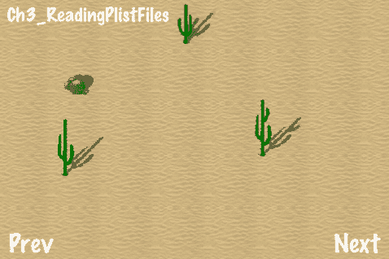

## 准备工作

请参考项目 *RecipeCollection01* 以获取此菜谱的完整工作代码。

## 如何操作...

执行以下代码：

```swift
#import <Foundation/Foundation.h>
/* This returns the full absolute path to a specified file in the bundle */
NSString* getActualPath( NSString* file )
{
NSArray* path = [file componentsSeparatedByString: @"."];
NSString* actualPath = [[NSBundle mainBundle] pathForResource: [path objectAtIndex: 0] ofType: [path objectAtIndex: 1]];
return actualPath;
}
@implementation Ch2_ReadingPlistFiles
-(CCLayer*) runRecipe {
//Initialize a read-only dictionary from our file
NSString *fileName = @"scene1.plist";
NSDictionary *dict = [NSDictionary dictionaryWithContentsOfFile:getActualPath(fileName)];
//Process this dictionary
[self processMap:dict];
return self;
}
-(void) processMap:(NSDictionary*)dict {
//Loop through all dictionary nodes to process individual types
NSArray *nodes = [dict objectForKey:@"nodes"];
for (id node in nodes) {
if([[node objectForKey:@"type"] isEqualToString:@"spriteFile"]){
[self processSpriteFile:node];
}else if([[node objectForKey:@"type"] isEqualToString:@"texturedPolygon"]){
[self processTexturedPolygon:node];
}
}
}
/* Process the 'spriteFile' type */
-(void) processSpriteFile:(NSDictionary*)nodeDict {
//Init the sprite
NSString *file = [nodeDict objectForKey:@"file"];
CCSprite *sprite = [CCSprite spriteWithFile:file];
//Set sprite position
NSDictionary *posDict = [nodeDict objectForKey:@"position"];
sprite.position = ccp([[posDict objectForKey:@"x"] floatValue], [[posDict objectForKey:@"y"] floatValue]);
//Each numeric value is an NSString or NSNumber that must be cast into a float
sprite.scale = [[nodeDict objectForKey:@"scale"] floatValue];
//Set the anchor point so objects are positioned from the bottom-up
sprite.anchorPoint = ccp(0.5,0);
//We set the sprite Z according to its Y to produce an isometric perspective
float z = [self getZFromY:[[posDict objectForKey:@"y"] floatValue]];
if([nodeDict objectForKey:@"z"]){
z = [[nodeDict objectForKey:@"z"] floatValue];
}
//Finally, add the sprite
[self addChild:sprite z:z];
}
/* Process the 'texturedPolygon' type */
-(void) processTexturedPolygon:(NSDictionary*)nodeDict {
//Process vertices
NSMutableArray *vertices = [[[NSMutableArray alloc] init] autorelease];
NSArray *vertexData = [nodeDict objectForKey:@"vertices"];
for(id vData in vertexData){
float x = [[vData objectForKey:@"x"] floatValue];
float y = [[vData objectForKey:@"y"] floatValue];
[vertices addObject:[NSValue valueWithCGPoint:ccp(x,y)]];
}
//Init our textured polygon
NSString *file = [nodeDict objectForKey:@"file"];
ccTexParams params = {GL_NEAREST,GL_NEAREST_MIPMAP_NEAREST,GL_REPEAT,GL_REPEAT};
TexturedPolygon *texturedPoly = [TexturedPolygon createWithFile:file withVertices:vertices];
[texturedPoly.texture setTexParameters:&params];
[texturedPoly retain];
//Set position
NSDictionary *posDict = [nodeDict objectForKey:@"position"];
texturedPoly.position = ccp([[posDict objectForKey:@"x"] floatValue], [[posDict objectForKey:@"y"] floatValue]);
//Add the texturedPolygon behind any sprites
[self addChild:texturedPoly z:0];
}
/* Our simple method used to order sprites by depth */
-(float) getZFromY:(float)y {
return 320-y;
}
@end

```

## 它是如何工作的...

从 PLIST 文件中加载数据是一种在程序内存中创建复杂数据结构的无缝方式。在这里，我们加载 `scene1.plist`，它包含一个字典数组。这相当于一个 `NSArray` 的 `NSDictionary` 值数组。在每一个字典中，我们有一个键为 'type' 的字符串值。这告诉应用程序它在查看什么类型的节点。PLIST 数据格式可以容纳无限深的数组和字典组合，最终包含包括布尔值、数据、日期、数字和字符串在内的原始数据类型。每一个都可以轻松转换为 `NSNumber`、`NSData`、`NSDate` 或 `NSString`。以下是我们的 PLIST 文件看起来像：

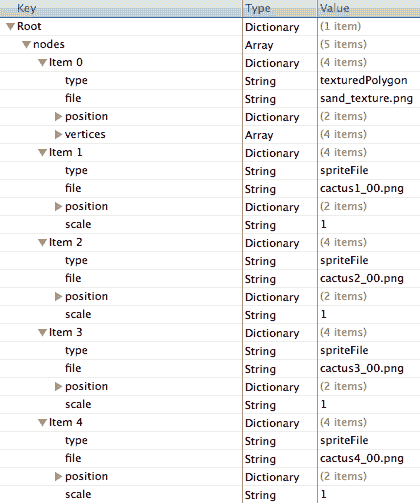

PLIST 文件仅是一个使用特定约定解析的 XML 文件。前面的图是 XML 数据的图形表示。您将在后面的示例中看到，数组和字典的组合是存储数据的标准。它们最终包含包括布尔值、数据、日期、数字和字符串在内的原始数据类型。每一个都可以轻松转换为 `NSNumber`、`NSData`、`NSDate` 或 `NSString`。以下是我们的 PLIST 文件看起来像：

+   使用 `getActualPath:`

    `getActualPath:` 方法提供了一个快速获取包资源完整文件路径的途径。这允许需要精确路径的类在文件系统中操作文件。

+   等距场景：

    如您所见，我们的场景有一些深度和阴影。这种技术是等距投影的模拟。这是一个没有消失点的模拟 3D 空间。它被用于无数 2D 游戏，并将成为本书中更多菜谱的主要特性。

# 读取 JSON 数据文件

**JSON** 代表 **JavaScript 对象表示法**。它是一种非常轻量且易于消费的数据打包方式。多亏了 `CJSONDeserializer` 库，读取 JSON 文件就像读取 PLIST 文件一样简单。在下面的场景中，我们看到一个有猫和几棵树的草地：

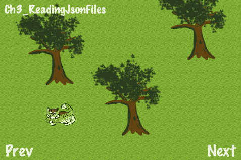

## 准备工作

请参考项目 *RecipeCollection01* 以获取此菜谱的完整工作代码。

## 如何操作...

执行以下代码：

```swift
#import "ActualPath.h"
@implementation Ch2_ReadingJsonFiles
-(CCLayer*) runRecipe {
//Initialize a read-only dictionary from our file
NSString *fileName = @"scene2.json";
NSString *jsonString = [[[NSString alloc] initWithContentsOfFile:getActualPath(fileName) encoding:NSUTF8StringEncoding error:nil] autorelease];
NSData *jsonData = [jsonString dataUsingEncoding:NSUTF32BigEndianStringEncoding];
NSDictionary *dict = [[CJSONDeserializer deserializer] deserializeAsDictionary:jsonData error:nil];
//Process this dictionary
[self processMap:dict];
return self;
}
-(void) processMap:(NSDictionary*)dict {
NSArray *nodes = [dict objectForKey:@"nodes"];
for (id node in nodes) {
if([[node objectForKey:@"type"] isEqualToString:@"spriteFile"]){
[self processSpriteFile:node];
}else if([[node objectForKey:@"type"] isEqualToString:@"texturedPolygon"]){
[self processTexturedPolygon:node];
}
}
}
/* Process the 'spriteFile' type */
-(void) processSpriteFile:(NSDictionary*)nodeDict {
/* CODE OMITTED */
}
/* Process the 'texturedPolygon' type */
-(void) processTexturedPolygon:(NSDictionary*)nodeDict {
/* CODE OMITTED */
}
/* Our simple method used to order sprites by depth */
-(float) getZFromY:(float)y {
return 320-y;
}
@end

```

## 它是如何工作的...

将 JSON 加载到只读 `NSDictionary` 中相当直接。以下是我们的 JSON 文件，其中省略了一些行：

```swift
{ "nodes":
[ { "type":"spriteFile", "file":"tree.png", "position":{"x":250,"y":50}, "scale":0.9 },
{ "type":"spriteFile", "file":"tree_shadow.png", "position":{"x":195,"y":51}, "scale":0.9, "z":-100 },
{ "type":"spriteFile", "file":"cheshire_cat.png", "position":{"x":120,"y":70}, "scale":0.3 },
{ "type":"spriteFile", "file":"actor_shadow.png", "position":{"x":120,"y":65}, "scale":1.75, "z":-100 },
{ "type":"texturedPolygon", "file":"grass_texture.png", "position":{"x":16,"y":16},
"vertices":[{"x":0,"y":0},{"x":480,"y":0},{"x":480,"y":320},{"x":0,"y":320}] },
{ "type":"rectangle", "position":{"x":0,"y":0}, "size":{"x":480,"y":320}, "meta": [{"type":"boundary"}] }
]
}

```

如你所见，JSON 格式非常简洁。一眼看去，它比 XML 更容易理解。

# 读取 XML 数据文件

最后，我们有了大家最喜欢的数据格式：基本的未加工 XML。对于这个菜谱，我们将使用 Google 的 **GDataXML** 库来读取和解析一个简单的 XML 文档。在下面的场景中，我们看到有岩石地形和一些巨石和杂草：

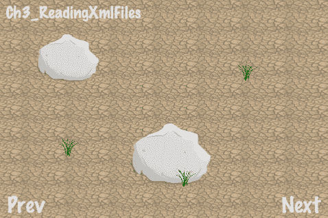

## 准备工作

请参考项目 *RecipeCollection01* 以获取此菜谱的完整工作代码。

## 如何操作...

我们需要做的第一件事是集成 Google 的 GData XML 工具：

1.  从这里下载并解压 `gdata-objectivec-client`：[`code.google.com/p/gdata-objectivec-client/downloads/list`](http://code.google.com/p/gdata-objectivec-client/downloads/list)

1.  在 `Source\XMLSupport` 文件夹中找到 `GDataXMLNode.h` 和 `GDataXMLNode.m` 文件，并将它们添加到你的项目中。

1.  在你的 **Project Navigator** 中点击你的 **Project**。

1.  在此右侧，点击你的**目标**。

1.  前往 **Build Settings** 选项卡。

1.  找到 **Search Paths\Header Search Paths** 设置。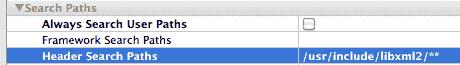

1.  将 `/usr/include/libxml2` 添加到列表中。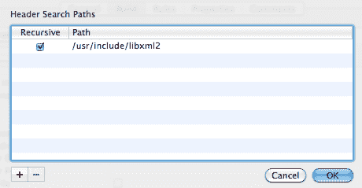

1.  找到 **Linking\Other Linker Flags** 部分。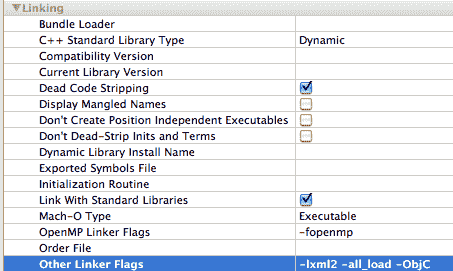

1.  将 `-lxml2` 添加到列表中。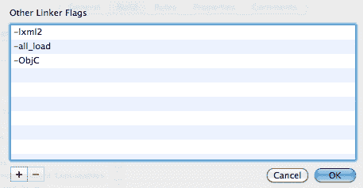

1.  将 `GDataXMLNode.h` 导入到你的代码中。如果它能编译并运行，那么你就已成功集成了 GDataXML。

现在，执行以下代码：

```swift
#import "GDataXMLNode.h"
@implementation Ch2_ReadingXmlFiles
-(CCLayer*) runRecipe {
//Read our file in as an NSData object
NSString *fileName = @"scene3.xml";
NSString *xmlString = [[[NSString alloc] initWithContentsOfFile:getActualPath(fileName) encoding:NSUTF8StringEncoding error:nil] autorelease];
NSData *xmlData = [xmlString dataUsingEncoding:NSUTF32BigEndianStringEncoding];
//Initialize a new GDataXMLDocument with our data
GDataXMLDocument *doc = [[[GDataXMLDocument alloc] initWithData:xmlData options:0 error:nil] autorelease];
//Process that document
[self processMap:doc];
return self;
}
-(void) processMap:(GDataXMLDocument*)doc {
//Find all elements of 'node' type
NSArray *nodes = [doc.rootElement elementsForName:@"node"];
//Loop through each element
for (GDataXMLElement *node in nodes) {
//Find the first (and assumed only) element with the name 'type' in this node
NSString *type = [[[node elementsForName:@"type"] objectAtIndex:0] stringValue];
//Process specific node types
if([type isEqualToString:@"spriteFile"]){
[self processSpriteFile:node];
}else if([type isEqualToString:@"texturedPolygon"]){
[self processTexturedPolygon:node];
}
}
}
/* Process the 'spriteFile' type */
-(void) processSpriteFile:(GDataXMLElement*)node {
//Init the sprite
NSString *file = [[[node elementsForName:@"file"] objectAtIndex:0] stringValue];
CCSprite *sprite = [CCSprite spriteWithFile:file];
//Set sprite position
GDataXMLElement *posElement = [[node elementsForName:@"position"] objectAtIndex:0];
sprite.position = ccp( [[[[posElement elementsForName:@"x"] objectAtIndex:0] stringValue] floatValue],
[[[[posElement elementsForName:@"y"] objectAtIndex:0] stringValue] floatValue]);
//Each element is considered a string first
sprite.scale = [[[[node elementsForName:@"scale"] objectAtIndex:0] stringValue] floatValue];
//Set the anchor point
sprite.anchorPoint = ccp(0.5,0);
//We set the sprite Z according to its Y to produce an isometric perspective
float z = [self getZFromY:sprite.position.y];
if([node elementsForName:@"z"].count > 0){
z = [[[[node elementsForName:@"z"] objectAtIndex:0] stringValue] floatValue];
}
//Finally, add the sprite
[self addChild:sprite z:z];
}
/* Process the 'texturedPolygon' type */
-(void) processTexturedPolygon:(GDataXMLElement*)node {
//Process vertices
NSMutableArray *vertices = [[[NSMutableArray alloc] init] autorelease];
NSArray *vertexData = [[[node elementsForName:@"vertices"] objectAtIndex:0] elementsForName:@"vertex"];
for(id vData in vertexData){
GDataXMLElement *vertexElement = (GDataXMLElement*)vData;
float x = [[[[vertexElement elementsForName:@"x"] objectAtIndex:0] stringValue] floatValue];
float y = [[[[vertexElement elementsForName:@"y"] objectAtIndex:0] stringValue] floatValue];
[vertices addObject:[NSValue valueWithCGPoint:ccp(x,y)]];
}
//Init our textured polygon
NSString *file = [[[node elementsForName:@"file"] objectAtIndex:0] stringValue];
ccTexParams params = {GL_NEAREST,GL_NEAREST_MIPMAP_NEAREST,GL_REPEAT,GL_REPEAT};
TexturedPolygon *texturedPoly = [TexturedPolygon createWithFile:file withVertices:vertices];
[texturedPoly.texture setTexParameters:&params];
//Set position
GDataXMLElement *posElement = [[node elementsForName:@"position"] objectAtIndex:0];
texturedPoly.position = ccp( [[[[posElement elementsForName:@"x"] objectAtIndex:0] stringValue] floatValue],
[[[[posElement elementsForName:@"y"] objectAtIndex:0] stringValue] floatValue]);
//Add the texturedPolygon behind any sprites
[self addChild:texturedPoly z:0];
}
/* Our simple method used to order sprites by depth */
-(float) getZFromY:(float)y {
return 320-y;
}
@end

```

## 它是如何工作的...

读取和处理 XML 文件与处理 PLIST 和 JSON 文件没有太大区别。在这种情况下，我们使用 `GDataXMLDocument` 和 `GDataXMLElement` 类。后者实现了 `(NSString*)stringValue` 方法，可以从其他值中解析出来。以下是我们在处理的 XML 文档的摘录：

```swift
<?xml version="1.0" encoding="ISO-8859-1"?>
<nodes>
<node>
<type>spriteFile</type>
<file>boulder.png</file>
<position><x>250</x><y>50</y></position>
<scale>0.9</scale>
</node>
<node>
<type>texturedPolygon</type>
<file>cracked_earth_texture.png</file>
<position> <x>32</x><y>32</y> </position>
<vertices>
<vertex> <x>0</x><y>0</y> </vertex>
<vertex> <x>480</x><y>0</y> </vertex>
<vertex> <x>480</x><y>320</y> </vertex>
<vertex> <x>0</x><y>320</y> </vertex>
</vertices>
</node>
</nodes>

```

纯 XML 比 PLIST 文件更难阅读，并且比 JSON 包含更多的标记语言冗余。然而，XML 允许使用 JSON 中缺失的两个功能：**属性**和**命名空间**。属性可以用来提供有关 **元素** 的额外信息。命名空间可以用来帮助减少元素之间的歧义。

## 相关信息...

更多关于 XML 规范的信息可以在：[`www.w3.org/TR/xml/`](http://www.w3.org/TR/xml/) 找到

# 使用 NSUserDefaults 保存简单数据

为了持久化用户设置和其他一些小数据，iOS 框架提供了 `NSUserDefaults` 类。在这个例子中，我们正在保存我们游戏的默认难度级别。

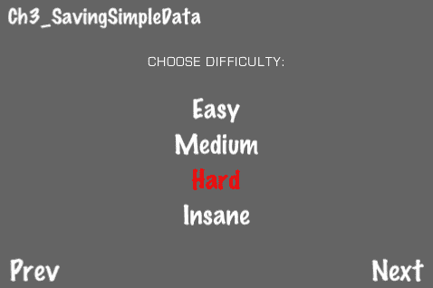

## 准备工作

请参考项目 *RecipeCollection01* 以获取此菜谱的完整工作代码。

## 如何操作...

执行以下代码：

```swift
@implementation Ch2_SavingSimpleData
-(CCLayer*) runRecipe {
//Set font size
[CCMenuItemFont setFontSize:30];
//Add main label
CCLabelBMFont *chooseDifficultyLabel = [CCLabelBMFont labelWithString:@"CHOOSE DIFFICULTY:" fntFile:@"eurostile_30.fnt"];
chooseDifficultyLabel.position = ccp(240,250);
chooseDifficultyLabel.scale = 0.5f;
[self addChild:chooseDifficultyLabel z:1];
//Add difficulty choices
easyMIF = [CCMenuItemFont itemFromString:@"Easy" target:self selector:@selector(chooseEasy)];
/* CODE OMITTED */
mainMenu = [CCMenu menuWithItems:easyMIF, mediumMIF, hardMIF, insaneMIF, nil];
[mainMenu alignItemsVertically];
mainMenu.position = ccp(240,140);
[self addChild:mainMenu z:1];
//Load any previously chosen difficulty
[self loadDifficulty];
return self;
}
-(void) loadDifficulty {
//If a difficulty is set we use that, otherwise we choose Medium
NSUserDefaults *defaults = [NSUserDefaults standardUserDefaults];
if([defaults stringForKey:@"simple_data_difficulty"]){
difficulty = [defaults stringForKey:@"simple_data_difficulty"];
[self setDifficultyFromValue];
}else{
[self chooseMedium];
}
}
-(void) saveDifficulty {
//Save our difficulty
NSUserDefaults *defaults = [NSUserDefaults standardUserDefaults];
[defaults setObject:difficulty forKey:@"simple_data_difficulty"];
[defaults synchronize];
}
-(void) setDifficultyFromValue {
//More menu color management
[self resetMenuColors];
if([difficulty isEqualToString:@"Easy"]){
[easyMIF setColor:ccc3(255,0,0)];
}else if([difficulty isEqualToString:@"Medium"]){
[mediumMIF setColor:ccc3(255,0,0)];
}/* CODE OMITTED */
[self saveDifficulty];
}
/* Shortcut callback methods */
-(void) chooseEasy {
difficulty = @"Easy";
[self setDifficultyFromValue];
}
/* CODE OMITTED */
@end

```

## 它是如何工作的...

`NSUserDefaults` 类使用与 PLIST 类似的格式。它可以接受包括 `NSString, NSData, NSNumber` 以及其他类型的对象。它也可以接受数组和字典。

+   加载数据：

    当加载 `NSUserDefaults` 数据时，以下这些关键行需要记住：

    ```swift
    if([defaults stringForKey:@"simple_data_difficulty"]){
    difficulty = [defaults stringForKey:@"simple_data_difficulty"];
    }

    ```

    `if` 语句简单地检查该条目是否已经存在。

+   保存数据：

    保存数据的过程也非常直接：

    ```swift
    NSUserDefaults *defaults = [NSUserDefaults standardUserDefaults];
    [defaults setObject:difficulty forKey:@"simple_data_difficulty"];
    [defaults synchronize];

    ```

### 参见...

在这个菜谱中，我们简要地看了菜单自定义。我们将在 第四章 中详细讨论这个主题。

# 将对象归档到归档文件中

类 `NSKeyedArchiver` 和 `NSKeyedUnarchiver` 允许我们以非常 **面向对象** 的方式持久化数据。通过遵守 `NSCoding` 协议，我们可以告诉归档器如何打包和解包我们任何类。在这个菜谱中，我们将打包一个具有许多龙与地下城风格属性的角色的数据。

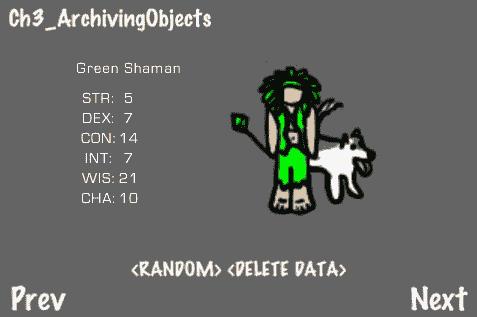

## 准备工作

请参考项目 *RecipeCollection01* 以获取此菜谱的完整工作代码。同时请注意，为了简洁，以下代码中省略了一些部分。

## 如何做到...

执行以下代码：

```swift
//SimpleCharacter.h
@interface SimpleCharacter : NSObject <NSCoding> {
NSString *charColor; NSString *charClass;
int strength; int dexterity; int constitution;
int intelligence; int wisdom; int charisma;
}
@property (readwrite, assign) NSString *charColor;
@property (readwrite, assign) NSString *charClass;
@property (readwrite, assign) int strength;
/* CODE OMITTED */
@end
@implementation SimpleCharacter
@synthesize charColor, charClass, strength, dexterity, constitution, intelligence, wisdom, charisma;
/* This merely adds this character with the proper color to a CCNode */
-(void) addCharacterToNode:(CCNode *)node atPosition:(CGPoint)position {
ccColor3B color;
if([charColor isEqualToString:@"Red"]){
color = ccc3(255,0,0);
}else if([charColor isEqualToString:@"Blue"]){
color = ccc3(0,0,255);
}/* CODE OMITTED */
CCSpriteFrameCache *cache = [CCSpriteFrameCache sharedSpriteFrameCache];
[cache addSpriteFramesWithFile:@"dnd_characters.plist"];
CCSprite *drawing = [CCSprite spriteWithSpriteFrame:[cache spriteFrameByName:[NSString stringWithFormat:@"dnd_%@_drawing.png",charClass]]];
CCSprite *colors = [CCSprite spriteWithSpriteFrame:[cache spriteFrameByName:[NSString stringWithFormat:@"dnd_%@_colors.png",charClass]]];
drawing.position = position; colors.position = position;
drawing.scale = 1.5f; colors.scale = 1.5f;
colors.color = color;
[node addChild:colors z:0 tag:0];
[node addChild:drawing z:1 tag:1];
}
/* This method determines how data is encoded into an NSCoder object */
- (void) encodeWithCoder: (NSCoder *)coder {
[coder encodeObject:charColor];
[coder encodeObject:charClass];
[coder encodeObject:[NSNumber numberWithInt:strength]];
/* CODE OMITTED */
}
/* This method determines how data is read out from an NSCode object */
-(id) initWithCoder: (NSCoder *) coder {
[super init];
charColor = [[coder decodeObject] retain];
charClass = [[coder decodeObject] retain];
strength = [[coder decodeObject] intValue];
/* CODE OMITTED */
return self;
}
/* Initialization */
-(id) init {
self = [super init];
if (self) {
charColor = @"Red"; charClass = @"Wizard";
strength = 10; dexterity = 10; constitution = 10;
intelligence = 10; wisdom = 10; charisma = 10;
}
return self;
}
/* All objects must be released here */
- (void) dealloc {
[charColor release]; [charClass release]; [super dealloc];
}
@end
@implementation Ch2_ArchivingObjects
-(CCLayer*) runRecipe {
//Load our character
[self loadCharacter];
return self;
}
-(void) loadCharacter {
//Our archive file name
NSString *fileName = @"dnd_character.archive";
//We get our file path
NSArray *paths = NSSearchPathForDirectoriesInDomains(NSDocumentDirectory, NSUserDomainMask, YES);
NSString *documentsDirectory = [paths objectAtIndex:0];
NSString *filePath = [documentsDirectory stringByAppendingPathComponent:fileName];
if(![[NSFileManager defaultManager] fileExistsAtPath:filePath]){
//If file doesn't exist in document directory create a new default character and save it
character = [[SimpleCharacter alloc] init];
[NSKeyedArchiver archiveRootObject:character toFile:filePath];
}else{
//If it does we load it
character = [[NSKeyedUnarchiver unarchiveObjectWithFile:filePath] retain];
}
//Add character and reload HUD
[character addCharacterToNode:self atPosition:ccp(300,180)];
[self loadHUD];
}
-(void) saveCharacter {
//Our archive file name
NSString *fileName = @"dnd_character.archive";
//We get our file path
NSArray *paths = NSSearchPathForDirectoriesInDomains(NSDocumentDirectory, NSUserDomainMask, YES);
NSString *documentsDirectory = [paths objectAtIndex:0];
NSString *filePath = [documentsDirectory stringByAppendingPathComponent:fileName];
//Save character
[NSKeyedArchiver archiveRootObject:character toFile:filePath];
}
-(void) deleteData {
//Our archive file name
NSString *fileName = @"dnd_character.archive";
//We get our file path
NSArray *paths = NSSearchPathForDirectoriesInDomains(NSDocumentDirectory, NSUserDomainMask, YES);
NSString *documentsDirectory = [paths objectAtIndex:0];
NSString *filePath = [documentsDirectory stringByAppendingPathComponent:fileName];
//Delete our file
[[NSFileManager defaultManager] removeItemAtPath:filePath error:nil];
//Set removal message
[message setString:@"Data deleted!"];
//Remove character node and load a new default character
[self removeCharacter];
[self loadCharacter];
}
@end

```

## 它是如何工作的...

正确地 **归档** 一个对象需要几个步骤。

+   遵守 `NSCoding` 协议：

    `NSCoding` 协议要求我们实现以下两个方法：

    ```swift
    - (void) encodeWithCoder: (NSCoder *)coder;
    -(id) initWithCoder: (NSCoder *) coder;

    ```

    一个方法将数据打包到 `NSCoder` 对象中，另一个方法从它解包数据。

+   使用 `Documents` 目录：

    您的应用程序对 iOS 框架指定的区域有写访问权限。这些包括 `Documents` 和 `Library` 目录。在本例和未来的示例中，我们可能会从应用程序包内的多个位置读取，但我们通常只会写入 `Documents` 目录。与磁盘上的其他区域不同，在此处保存的文件在应用程序升级时将得到保留。通常，我们会在以下代码中定位 `Documents` 目录内的文件：

    ```swift
    NSString *fileName = @"my.file";
    NSArray *paths = NSSearchPathForDirectoriesInDomains(NSDocumentDirectory, NSUserDomainMask, YES);
    NSString *documentsDirectory = [paths objectAtIndex:0];
    NSString *filePath = [documentsDirectory stringByAppendingPathComponent:fileName];

    ```

    这将返回绝对文件路径。

+   使用 `NSFileManager`: 

    我们还使用 `NSFileManager` 来确定文件是否存在，并在必要时删除文件。

    ```swift
    if([[NSFileManager defaultManager] fileExistsAtPath:filePath]){
    [[NSFileManager defaultManager] removeItemAtPath:filePath error:nil];
    }

    ```

+   使用 `NSKeyedArchiver` 和 `NSKeyedUnarchiver`:

    最后，有了这些工具在手，我们可以使用 `NSKeyedArchiver` 和 `NSKeyedUnarchiver` 类来归档和解档对象：

    ```swift
    //Archive
    character = [[SimpleCharacter alloc] init];
    [NSKeyedArchiver archiveRootObject:character toFile:filePath];
    //Un-archive
    character = [[NSKeyedUnarchiver unarchiveObjectWithFile:filePath] retain];

    ```

# 修改嵌套元数据

数据文件中的数据通常被加载到一个不可变的、嵌套的数组和大字典结构中。这个不可变结构使得数据不可编辑。在这个菜谱中，我们将读取一个嵌套的 JSON 数据结构，然后使用可变数据结构递归地重新创建数据，以便允许编辑数据。

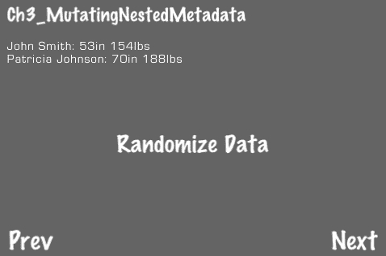

## 准备工作

请参考项目*RecipeCollection01*以获取此菜谱的完整工作代码。

## 如何做...

执行以下代码：

```swift
#import "GameHelper.h"
//Implementation
@implementation Ch3_MutatingNestedMetadata
-(CCLayer*) runRecipe {
[super runRecipe];
//Load JSON data
NSString *fileName = @"data_to_mutate.json";
NSString *jsonString = [[[NSString alloc] initWithContentsOfFile:getActualPath(fileName) encoding:NSUTF8StringEncoding error:nil] autorelease];
NSData *jsonData = [jsonString dataUsingEncoding:NSUTF32BigEndianStringEncoding];
NSDictionary *dict = [[CJSONDeserializer deserializer] deserializeAsDictionary:jsonData error:nil];
//Create deep mutable copy
dictMutable = [GameHelper makeRecMutableCopy:dict];
[dictMutable retain];
//Show JSON data
[self showJsonData:dictMutable];
//Add randomize button
[CCMenuItemFont setFontSize:30];
CCMenuItemFont *randomizeItem = [CCMenuItemFont itemFromString:@"Randomize Data" target:self selector:@selector(randomizeData)];
CCMenu *menu = [CCMenu menuWithItems:randomizeItem, nil];
menu.position = ccp(240,140);
[self addChild:menu z:1];
return self;
}
-(void) showJsonData:(NSDictionary*)dict {
[self showMessage:@""];
//Loop through all dictionary nodes to process individual types
NSMutableDictionary *nodes = [dict objectForKey:@"people"];
for (NSMutableDictionary* node in nodes) {
float height = [[node objectForKey:@"height"] floatValue];
float weight = [[node objectForKey:@"weight"] floatValue];
NSString *name = [node objectForKey:@"name"];
[self appendMessage:[NSString stringWithFormat:@"%@: %din %dlbs", name, (int)height, (int)weight]];
}
nested metadatamutating}
-(void) randomizeData {
//Randomize some data in 'dictMutable'
NSMutableArray *nodes = [dictMutable objectForKey:@"people"];
for (NSMutableDictionary* node in nodes) {
[node setObject:[NSNumber numberWithFloat:(float)(arc4random()%48)+30.0f] forKey:@"height"];
[node setObject:[NSNumber numberWithFloat:(float)(arc4random()%100)+100.0f] forKey:@"weight"];
}
[self showJsonData:dictMutable];
}
@end

```

## 它是如何工作的...

就像在前一节中，*读取 JSON 数据文件*，我们首先从 JSON 文件中读取数据。数据由一个嵌套数组、字典和字符串的`NSDictionary`对象组成。为了创建一个“深层”可变副本，我们在`GameHelper`类中调用以下方法：

```swift
+(NSMutableDictionary*) makeRecMutableCopy:(NSDictionary*)dict;

```

此方法假设根节点是一个字典。

+   `makeRecMutableCopy`方法：

    在这个菜谱中，我们省略了此方法的恐怖细节。简单地说，它递归地遍历嵌套结构，将`NSDictionary`对象转换为`NSMutableDictionary`对象，将`NSArray`对象转换为`NSMutableArray`对象。

+   修改数据树：

    一旦我们有一个嵌套的可变结构，我们就可以访问它并根据需要修改元素。点击**随机化数据**按钮以随机更改结构中的某些数据。

# 将数据保存到 PLIST 文件中

对于接下来的三个菜谱，我们有三个需要持久化其最高分的小游戏。在这个菜谱中，我们看到了一个打地鼠游戏，它将使用 PLIST 文件来维护一个最高分列表。

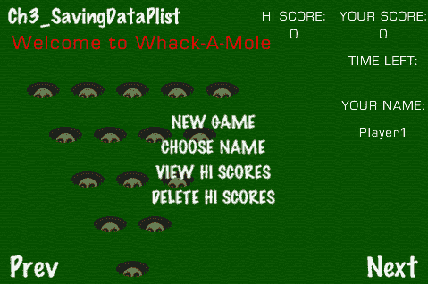

## 准备工作

请参考项目*RecipeCollection01*以获取此菜谱的完整工作代码。为了简洁起见，以下代码中省略了所有游戏逻辑。

## 如何做...

执行以下代码：

```swift
#import "ActualPath.h"
@implementation Ch2_SavingDataPlist
-(CCLayer*) runRecipe {
[self loadHiScores];
return self;
}
-(void) loadHiScores {
//Our template and file names
NSString *templateName = @"whackamole_template.plist";
NSString *fileName = @"whackamole.plist";
//Our dictionary
NSMutableDictionary *fileDict;
//We get our file path
NSArray *paths = NSSearchPathForDirectoriesInDomains(NSDocumentDirectory, NSUserDomainMask, YES);
NSString *documentsDirectory = [paths objectAtIndex:0];
NSString *filePath = [documentsDirectory stringByAppendingPathComponent:fileName];
if(![[NSFileManager defaultManager] fileExistsAtPath:filePath]){
//If file doesn't exist in document directory create a new one from the template
fileDict = [NSMutableDictionary dictionaryWithContentsOfFile:getActualPath(templateName)];
}else{
//If it does we load it in the dict
fileDict = [NSMutableDictionary dictionaryWithContentsOfFile:filePath];
}
//Load hi scores into our dictionary
hiScores = [fileDict objectForKey:@"hiscores"];
//Set the 'hiScore' variable (the highest score)
for(id score in hiScores){
int scoreNum = [[score objectForKey:@"score"] intValue];
if(hiScore < scoreNum){
hiScore = scoreNum;
}
}
//Write dict to file
[fileDict writeToFile:filePath atomically:YES];
}
-(void) addHiScore {
//Our template and file names
NSString *templateName = @"whackamole_template.plist";
NSString *fileName = @"whackamole.plist";
//Our dictionary
NSMutableDictionary *fileDict;
//We get our file path
NSArray *paths = NSSearchPathForDirectoriesInDomains(NSDocumentDirectory, NSUserDomainMask, YES);
NSString *documentsDirectory = [paths objectAtIndex:0];
NSString *filePath = [documentsDirectory stringByAppendingPathComponent:fileName];
if(![[NSFileManager defaultManager] fileExistsAtPath:filePath]){
//If file doesn't exist in document directory create a new one from the template
fileDict = [NSMutableDictionary dictionaryWithContentsOfFile:getActualPath(templateName)];
}else{
//If it does we load it in the dict
fileDict = [NSMutableDictionary dictionaryWithContentsOfFile:filePath];
}
//Load hi scores into our dictionary
hiScores = [fileDict objectForKey:@"hiscores"];
//Add hi score
bool scoreRecorded = NO;
//Add score if player's name already exists
for(id score in hiScores){
NSMutableDictionary *scoreDict = (NSMutableDictionary*)score;
if([[scoreDict objectForKey:@"name"] isEqualToString:currentPlayerName]){
if([[scoreDict objectForKey:@"score"] intValue] < currentScore){
[scoreDict setValue:[NSNumber numberWithInt:currentScore] forKey:@"score"];
}
scoreRecorded = YES;
}
}
//Add new score if player's name doesn't exist
if(!scoreRecorded){
NSMutableDictionary *newScore = [[NSMutableDictionary alloc] init];
[newScore setObject:currentPlayerName forKey:@"name"];
[newScore setObject:[NSNumber numberWithInt:currentScore] forKey:@"score"];
[hiScores addObject:newScore];
}
//Write dict to file
[fileDict writeToFile:filePath atomically:YES];
}
-(void) deleteHiScores {
//Our file name
NSString *fileName = @"whackamole.plist";
//We get our file path
NSArray *paths = NSSearchPathForDirectoriesInDomains(NSDocumentDirectory, NSUserDomainMask, YES);
NSString *documentsDirectory = [paths objectAtIndex:0];
NSString *filePath = [documentsDirectory stringByAppendingPathComponent:fileName];
//Delete our file
[[NSFileManager defaultManager] removeItemAtPath:filePath error:nil];
[message setString:@"Hi scores deleted!"];
hiScore = 0;
[self loadHiScores];
}
@end

```

## 它是如何工作的...

我们首先做的事情是检查`Documents`目录中的`whackamole.plist`文件，并将该数据加载到`fileDict`字典中。如果我们找不到该文件，我们将从`Resources/Data`文件夹中打开`whackamole_template.plist`。它看起来像这样：

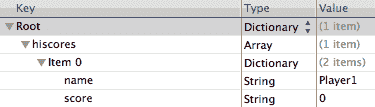

无论我们加载哪个文件，加载行看起来都像这样：

```swift
fileDict = [NSMutableDictionary dictionaryWithContentsOfFile:filePath];

```

在修改`fileDict`字典后，我们将它保存到`Documents`目录下的`whackamole.plist`中：

```swift
[fileDict writeToFile:filePath atomically:YES];

```

考虑到所有因素，这是一个非常简单的方式来持久化数据。

# 将数据保存到 SQLite 数据库中

我们第二个游戏是一个“飞碟射击”游戏，飞碟被射入空中，目标是尽可能在规定时间内射下尽可能多的飞碟。对于这个游戏，我们将使用 SQLite 数据库来持久化最高分数据。我们将使用**FMDB Objective-C SQLite 包装器**来访问代码中的 SQLite 数据库，并使用**Firefox 插件 SQLite Manager**来创建初始数据库文件。


## 准备工作

请参考项目*RecipeCollection01*以获取此菜谱的完整工作代码。为了简洁起见，以下代码中省略了所有游戏逻辑。

## 如何做...

要使用 SQLite，我们首先需要做一些事情：

1.  首先，我们需要添加`libsqlite3.0.dylib`框架。你可以通过右键单击你的项目，然后转到**添加 > 已存在的框架**，然后在**iOS 4.x SDK**下选择`libsqlite3.0.dylib`。

1.  接下来，我们需要将 FMDB Objective-C SQLite 包装器添加到我们的项目中。FMDB 可以从这里下载：[`github.com/ccgus/fmdb`](http://https://github.com/ccgus/fmdb)。

1.  从这里下载并安装 Firefox 插件 SQLite Manager：[`addons.mozilla.org/en-US/firefox/addon/sqlite-manager/`](http://https://addons.mozilla.org/en-US/firefox/addon/sqlite-manager/)

现在我们需要创建一个新的 SQLite 数据库作为我们的默认数据库模板。进入 **SQLite Manager** 并转到 **数据库 > 新数据库**。对于我们的项目，我们创建了 `skeetshooter_template.sqlite`，其中包含一个名为 **hiscores** 的表，该表具有 **name** 和 **score** 字段：

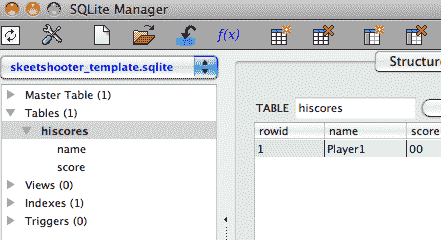

一旦我们有了数据库模板，执行以下代码：

```swift
#import "ActualPath.h"
#import <Foundation/Foundation.h>
#import "FMDatabase.h"
@implementation Ch2_SavingDataSQLite
-(CCLayer*) runRecipe {
[self loadHiScores];
return self;
}
-(void) dealloc {
//Release our database
[db close]; [db release]; [super dealloc];
}
-(NSArray *) createDictionariesArrayFromFMResultSet:(FMResultSet *)rs fields:(NSString *)fields {
//Parse field string into an array
NSArray * listFields = [fields componentsSeparatedByString:@","];
//Create an array of dictionaries from each field
NSMutableArray * items = [NSMutableArray arrayWithCapacity:1];
while ([rs next]) {
NSMutableDictionary * item = [NSMutableDictionary dictionaryWithCapacity:1];
for (int i = 0; i < [listFields count]; i++) {
NSString * key = [listFields objectAtIndex:i];
NSString * value = [rs stringForColumn: key];
if (value == NULL) value = @"";
[item setObject:value forKey:key];
}
[items addObject:item];
}
[rs close];
return items;
}
-(void) writeNewScore:(int)score forName:(NSString*)name {
//Find the hi score with this name
NSString *selectQuery = [NSString stringWithFormat:@"SELECT * FROM hiscores WHERE name = '%@'", name];
FMResultSet *rs = [db executeQuery:selectQuery];
//What is the score? Is there a score at all?
int storedScore = -1;
while([rs next]){
storedScore = [[rs stringForColumn:@"score"] intValue];
}
[rs close];
if(storedScore == -1){
//Name doesn't exist, add it
NSString *insertQuery = [NSString stringWithFormat:@"INSERT INTO hiscores (name, score) VALUES ('%@','%i')", name, score];
rs = [db executeQuery:insertQuery];
while([rs next]){};
[rs close];
}else if(score > storedScore){
//Write new score for existing name
NSString *updateQuery = [NSString stringWithFormat:@"UPDATE hiscores SET score='%i' WHERE name='%@'", score, name];
rs = [db executeQuery:updateQuery];
while([rs next]){};
[rs close];
}
}
-(void) loadHiScores {
//Our file and template names
NSString *fileName = @"skeetshooter.sqlite";
NSString *templateName = @"skeetshooter_template.sqlite";
//We get our file path
NSArray *paths = NSSearchPathForDirectoriesInDomains(NSDocumentDirectory, NSUserDomainMask, YES);
NSString *documentsDirectory = [paths objectAtIndex:0];
NSString *filePath = [documentsDirectory stringByAppendingPathComponent:fileName];
//If file doesn't exist in document directory create a new one from the template
if(![[NSFileManager defaultManager] fileExistsAtPath:filePath]){
[[NSFileManager defaultManager] copyItemAtPath:getActualPath(templateName)
toPath:[NSString stringWithFormat:@"%@/%@", documentsDirectory, fileName] error:nil];
}
//Initialize the database
if(!db){
db = [FMDatabase databaseWithPath:filePath];
[db setLogsErrors:YES];
[db setTraceExecution:YES];
[db retain];
if(![db open]){ NSLog(@"Could not open db.");
}else{ NSLog(@"DB opened successfully.");}
}
//Select all hi scores
FMResultSet *rs = [db executeQuery:@"select * from hiscores"];
//Load them into an array of dictionaries
hiScores = [[NSMutableArray alloc] init];
hiScores = [self createDictionariesArrayFromFMResultSet:rs fields:@"name,score"];
//Set hi score
for(id score in hiScores){
int scoreNum = [[score objectForKey:@"score"] intValue];
if(hiScore < scoreNum){
hiScore = scoreNum;
}
}
}
-(void) addHiScore {
//Add hi score to db
[self writeNewScore:currentScore forName:currentPlayerName];
//Reset dictionary
FMResultSet *rs = [db executeQuery:@"SELECT * FROM hiscores"];
hiScores = [self createDictionariesArrayFromFMResultSet:rs fields:@"name,score"];
}
-(void) deleteHiScores {
//Our file name
NSString *fileName = @"skeetshooter.sqlite";
//We get our file path
NSArray *paths = NSSearchPathForDirectoriesInDomains(NSDocumentDirectory, NSUserDomainMask, YES);
NSString *documentsDirectory = [paths objectAtIndex:0];
NSString *filePath = [documentsDirectory stringByAppendingPathComponent:fileName];
//Delete our file
[[NSFileManager defaultManager] removeItemAtPath:filePath error:nil];
[message setString:@"Hi scores deleted!"];
hiScore = 0;
//Close and release our db pointer
[db close]; [db release]; db = nil;
//Load new blank hi scores
[self loadHiScores];
}
@end

```

## 它是如何工作的...

将数据保存到 SQLite 数据库与使用 PLIST 文件略有不同。读取和写入 SQLite 数据库的主要方式是通过以下方法：

```swift
- (FMResultSet *)executeQuery:(NSString*)sql;

```

这将返回一个 `FMResultSet` 对象，然后可以遍历：

```swift
FMResultSet *rs = [db executeQuery:@"SELECT * FROM mytable"];
while([rs next]){
somevalue = [[rs stringForColumn:@"myfield"] intValue];
}
[rs close];

```

确保迭代你创建的每个 `FMResultSet` 对象，并调用 `[rs close]`，否则 SQLite 将会抛出错误。

+   查询你的 SQLite 数据库：

    使用这个简单但强大的界面，你可以执行在 SQLite 数据库上通常允许的任何类型的查询。在这个菜谱中，我们有一个包含两个值的表。请随意尝试更复杂的数据模型。

# 使用 Core Data 保存数据

我们的第三个游戏是一个记忆卡牌游戏，你必须翻过一组组卡片。翻到两张匹配的卡片，你得到一分。翻到两张不匹配的卡片，你得到一次失误。三次失误，你就出局了。对于这个游戏，我们使用苹果的 **Core Data** 模式来持久化高分数据。

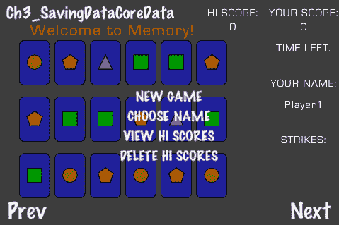

## 准备工作

请参考项目 *RecipeCollection01* 以获取此菜谱的完整工作代码。为了简洁起见，以下代码中省略了所有游戏逻辑。

## 如何操作...

设置基于 Core Data 的菜谱需要多个步骤。

首先，我们需要添加 CoreData 框架。你可以通过在项目上右键单击并选择 **添加 > 已存在框架** 来完成此操作，然后在 **iOS 4.x SDK** 下选择 `CoreData.framework`。

1.  在你的资源中创建一个名为 `Data Model` 的新文件夹。在这个文件夹内，创建一个名为 `Hiscore` 的类，它继承自 `ManagedObject:`。

    ```swift
    //Hiscore.h
    #import <CoreData/CoreData.h>
    @interface Hiscore : NSManagedObject
    {}
    @property (nonatomic, retain) NSString * name;
    @property (nonatomic, retain) NSNumber * score;
    @end
    //Hiscore.m
    #import "Hiscore.h"
    @implementation Hiscore
    @dynamic name;
    @dynamic score;
    @end

    ```

1.  添加此类后，右键单击项目并选择 **添加 > 新文件**。在 **iOS** 和 **资源** 下选择并创建一个新的 **数据模型**。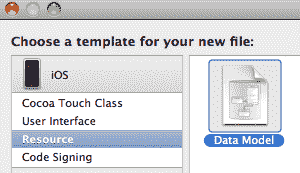

1.  将此数据模型命名为 `hiscore`，并在提示时将现有的 `Hiscore` 类添加到该数据模型中。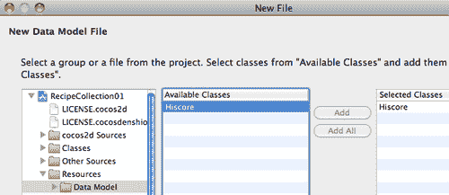

1.  在 XCode 中单击 `hiscores.xcdatamodel`。单击 `Hiscore` 实体，然后向其中添加两个新属性，这两个属性对应于 `Hiscore` 类中的两个属性：

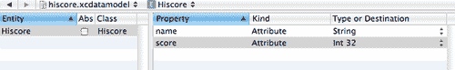

现在，我们已经准备好开始编写代码。执行以下操作：

```swift
#import <UIKit/UIKit.h>
#import "Hiscore.h"
@interface Ch2_SavingDataCoreData : SimpleTimedGameRecipe <NSFetchedResultsControllerDelegate>
{
NSManagedObjectModel *managedObjectModel;
NSManagedObjectContext *managedObjectContext;
NSPersistentStoreCoordinator *persistentStoreCoordinator;
}
@property (nonatomic, retain, readonly) NSManagedObjectModel *managedObjectModel;
@property (nonatomic, retain, readonly) NSManagedObjectContext *managedObjectContext;
@property (nonatomic, retain, readonly) NSPersistentStoreCoordinator *persistentStoreCoordinator;
@end
@implementation Ch2_SavingDataCoreData
-(CCLayer*) runRecipe {
[self loadHiScores];
return self;
}
/* Returns the managed object context for the application.
If the context doesn't already exist, it is created and bound to the persistent store coordinator for the application. */
- (NSManagedObjectContext *) managedObjectContext {
//Return the managedObjectContext if it already exists
if (managedObjectContext != nil) {
return managedObjectContext;
}
//Init the managedObjectContext
NSPersistentStoreCoordinator *coordinator = [self persistentStoreCoordinator];
if (coordinator != nil) {
managedObjectContext = [[NSManagedObjectContext alloc] init];
[managedObjectContext setPersistentStoreCoordinator: coordinator];
}
return managedObjectContext;
}
/* Returns the managed object model for the application.
If the model doesn't already exist, it is created by merging all of the models found in the application bundle. */
- (NSManagedObjectModel *)managedObjectModel {
//Return the managedObjectModel if it already exists
if (managedObjectModel != nil) {
return managedObjectModel;
}
//Init the managedObjectModel
managedObjectModel = [[NSManagedObjectModel mergedModelFromBundles:nil] retain];
return managedObjectModel;
}
/* Returns the persistent store coordinator for the application.
If the coordinator doesn't already exist, it is created and the application's store added to it. */
- (NSPersistentStoreCoordinator *)persistentStoreCoordinator {
//Return the persistentStoreCoordinator if it already exists
if (persistentStoreCoordinator != nil) {
return persistentStoreCoordinator;
}
//Our file name
NSString *fileName = @"memory.sqlite";
//We get our file path
NSArray *paths = NSSearchPathForDirectoriesInDomains(NSDocumentDirectory, NSUserDomainMask, YES);
NSString *documentsDirectory = [paths objectAtIndex:0];
NSString *filePath = [documentsDirectory stringByAppendingPathComponent:fileName];
NSURL *filePathURL = [NSURL fileURLWithPath:filePath];
//Init the persistentStoreCoordinator
persistentStoreCoordinator = [[NSPersistentStoreCoordinator alloc] initWithManagedObjectModel:[self managedObjectModel]];
[persistentStoreCoordinator addPersistentStoreWithType:NSSQLiteStoreType configuration:nil URL:filePathURL options:nil error:nil];
return persistentStoreCoordinator;
}
-(void) loadHiScores {
//Initialization
managedObjectContext = self.managedObjectContext;
//Attempt to create SQLite database
NSEntityDescription *entity;
@try{
//Define our table/entity to use
entity = [NSEntityDescription entityForName:@"Hiscore" inManagedObjectContext:managedObjectContext];
}@catch (NSException *exception){
NSLog(@"Caught %@: %@", [exception name], [exception reason]);
//Copy SQLite template because creation failed
NSString *fileName = @"memory.sqlite";
NSString *templateName = @"memory_template.sqlite";
//File paths
NSArray *paths = NSSearchPathForDirectoriesInDomains(NSDocumentDirectory, NSUserDomainMask, YES);
NSString *documentsDirectory = [paths objectAtIndex:0];
NSString *filePath = [documentsDirectory stringByAppendingPathComponent:fileName];
if(![[NSFileManager defaultManager] fileExistsAtPath:filePath]){
//If file doesn't exist in document directory create a new one from the template
[[NSFileManager defaultManager] copyItemAtPath:getActualPath(templateName)
toPath:[NSString stringWithFormat:@"%@/%@", documentsDirectory, fileName] error:nil];
}
//Finally define our table/entity to use
entity = [NSEntityDescription entityForName:@"Hiscore" inManagedObjectContext:managedObjectContext];
}
//Set up the fetch request
NSFetchRequest *request = [[NSFetchRequest alloc] init];
[request setEntity:entity];
//Define how we will sort the records with a descriptor
NSSortDescriptor *sortDescriptor = [[NSSortDescriptor alloc] initWithKey:@"score" ascending:NO];
NSArray *sortDescriptors = [NSArray arrayWithObject:sortDescriptor];
[request setSortDescriptors:sortDescriptors];
[sortDescriptor release];
//Init hiScores
hiScores = [[managedObjectContext executeFetchRequest:request error:nil] mutableCopy];
//Add an intial score if necessary
if(hiScores.count < 1){
currentScore = 0;
currentPlayerName = @"Player1";
[self addHiScore];
hiScores = [[managedObjectContext executeFetchRequest:request error:nil] mutableCopy];
}
//Set the hi score
Hiscore *highest = [hiScores objectAtIndex:0];
hiScore = [highest.score intValue];
}
-(void) addHiScore {
bool hasScore = NO;
//Add score if player's name already exists
for(id score in hiScores){
Hiscore *hiscore = (Hiscore*)score;
if([hiscore.name isEqualToString:currentPlayerName]){
hasScore = YES;
if(currentScore > [hiscore.score intValue]){
hiscore.score = [NSNumber numberWithInt:currentScore];
}
}
}
//Add new score if player's name doesn't exist
if(!hasScore){
Hiscore *hiscoreObj = (Hiscore *)[NSEntityDescription insertNewObjectForEntityForName:@"Hiscore" inManagedObjectContext:managedObjectContext];
[hiscoreObj setName:currentPlayerName];
[hiscoreObj setScore:[NSNumber numberWithInt:currentScore]];
[hiScores addObject:hiscoreObj];
}
//Save managedObjectContext
[managedObjectContext save:nil];
}
-(void) deleteHiScores {
//Delete all Hi Score objects
NSFetchRequest * allHiScores = [[NSFetchRequest alloc] init];
[allHiScores setEntity:[NSEntityDescription entityForName:@"Hiscore" inManagedObjectContext:managedObjectContext]];
[allHiScores setIncludesPropertyValues:NO]; //only fetch the managedObjectID
NSArray * hs = [managedObjectContext executeFetchRequest:allHiScores error:nil];
[allHiScores release];
for (NSManagedObject *h in hs) {
[managedObjectContext deleteObject:h];
}
//Our file name
NSString *fileName = @"memory.sqlite";
//We get our file path
NSArray *paths = NSSearchPathForDirectoriesInDomains(NSDocumentDirectory, NSUserDomainMask, YES);
NSString *documentsDirectory = [paths objectAtIndex:0];
NSString *filePath = [documentsDirectory stringByAppendingPathComponent:fileName];
//Delete our file
[[NSFileManager defaultManager] removeItemAtPath:filePath error:nil];
[message setString:@"Hi scores deleted!"];
hiScore = 0;
[hiScores removeAllObjects];
[hiScores release];
hiScores = nil;
//Finally, load clean hi scores
[self loadHiScores];
}
@end

```

## 它是如何工作的...

经过一些复杂的初始化后，我们可以使用以下代码来操作一个简单的`Hiscore`对象数组：

```swift
NSFetchRequest *request = [[NSFetchRequest alloc] init];
[request setEntity:entity];
//Define how we will sort the records with a descriptor
NSSortDescriptor *sortDescriptor = [[NSSortDescriptor alloc] initWithKey:@"score" ascending:NO];
NSArray *sortDescriptors = [NSArray arrayWithObject:sortDescriptor];
[request setSortDescriptors:sortDescriptors];
[sortDescriptor release];
//Load hiScores
hiScores = [[managedObjectContext executeFetchRequest:request error:nil] mutableCopy];

```

修改这些对象中的任何一个后，我们可以使用以下行将它们全部保存：

```swift
[managedObjectContext save:nil];

```

可以使用以下代码添加新条目：

```swift
Hiscore *hiscoreObj = (Hiscore *)[NSEntityDescription insertNewObjectForEntityForName:@"Hiscore" inManagedObjectContext:managedObjectContext];
[hiscoreObj setName:currentPlayerName];
[hiscoreObj setScore:[NSNumber numberWithInt:currentScore]];
[hiScores addObject:hiscoreObj];

```

Core Data 的更复杂的使用或解释超出了本书的范围。本例仅作为使用 Core Data 的工作介绍。

## 还有更多...

在 XCode 中正确配置 Core Data 有时可能有些棘手。

+   SQLite 数据库创建错误：

    根据情况，Core Data 可能无法从您创建的模型中创建 SQLite 数据库。要解决这个问题，请确保您的`xcdatamodel`文件和您的`NSManagedObject`类在磁盘上以及在同一 XCode 组中位于相同的文件夹。如果这不能解决问题，请从项目中删除这些文件，但不要从磁盘上删除，然后重新添加它们。如果这还不行，您还可以手动创建一个 SQLite 数据库。这需要您遵循 Core Data 约定。为了帮助这个过程，我包括了`memory_template.sqlite`文件。此文件具有正确的 Core Data 数据库结构。如果它无法创建 SQLite 数据库，食谱也将使用此文件。

+   处理错误：

    在许多示例中，我们指定了`error:nil`。要实际处理这些错误，请执行以下操作：

    ```swift
    NSError *error = nil;
    if (![hiscore.managedObjectContext save:&error]) {
    NSLog(@"Unresolved error %@, %@", error, [error userInfo]);
    exit(-1);
    }

    ```

使用 Core Data 有时可能显得有些过度。然而，具有复杂底层数据结构的应用程序
