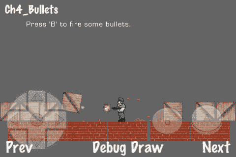

# 第四章 物理学

在本章中，我们将涵盖以下内容：

+   Box2D 设置和调试绘图

+   创建碰撞响应例程

+   使用不同形状

+   拖动和碰撞过滤

+   操作物理属性

+   应用冲量

+   应用力

+   异步销毁身体

+   使用关节

+   创建车辆

+   角色移动

+   模拟子弹

+   模拟和渲染绳子

+   创建俯视等距游戏引擎

# 简介

多年来，物理引擎在视频游戏中被用来增加屏幕上动作的真实感。在许多游戏中，物理在游戏玩法中起着至关重要的作用。Cocos2d 随带两个流行的 2D 物理引擎：**Box2D** 和 **Chipmunk**。在本章中，我们将使用 Box2D 作为首选引擎来解释游戏中物理的常见用法。这里的大多数菜谱都可以轻松修改以使用 Chipmunk 或任何其他类似物理引擎。

# Box2D 设置和调试绘图

在我们的第一个物理菜谱中，我们将探索创建 Box2D 项目和设置 Box2D 世界的基础知识。示例创建了一个场景，允许用户创建逼真的 2D 块。


## 准备工作

请参考项目 *RecipeCollection02* 以获取此菜谱的完整工作代码。

## 如何操作...

我们需要做的第一件事是使用内置的 Box2D 项目模板创建一个 Box2D 项目：

1.  前往**文件** | **新建项目**。

1.  在**用户模板**下点击**Cocos2d**。

1.  现在，右键点击**Cocos2d Box2d 应用程序**。

1.  点击**选择**，命名你的项目，然后点击**保存**。

现在，执行以下代码：

```swift
#import "Box2D.h"
#import "GLES-Render.h"
//32 pixels = 1 meter
#define PTM_RATIO 32
@implementation Ch4_BasicSetup
-(CCLayer*) runRecipe {
[super runRecipe];
/* Box2D Initialization */
//Set gravity
b2Vec2 gravity;
gravity.Set(0.0f, -10.0f);
//Initialize world
bool doSleep = YES;
world = new b2World(gravity, doSleep);
world->SetContinuousPhysics(YES);
//Initialize debug drawing
m_debugDraw = new GLESDebugDraw( PTM_RATIO );
world->SetDebugDraw(m_debugDraw);
uint32 flags = 0;
flags += b2DebugDraw::e_shapeBit;
m_debugDraw->SetFlags(flags);
//Create level boundaries
[self addLevelBoundaries];
//Add batch node for block creation
CCSpriteBatchNode *batch = [CCSpriteBatchNode batchNodeWithFile:@"blocks.png" capacity:150];
[self addChild:batch z:0 tag:0];
//Add a new block
CGSize screenSize = [CCDirector sharedDirector].winSize;
[self addNewSpriteWithCoords:ccp(screenSize.width/2, screenSize.height/2)];
//Schedule step method
Box2D setupsteps[self schedule:@selector(step:)];
return self;
}
/* Adds a polygonal box around the screen */
-(void) addLevelBoundaries {
CGSize screenSize = [CCDirector sharedDirector].winSize;
//Create the body
b2BodyDef groundBodyDef;
groundBodyDef.position.Set(0, 0);
b2Body *body = world->CreateBody(&groundBodyDef);
//Create a polygon shape
b2PolygonShape groundBox;
//Add four fixtures each with a single edge
groundBox.SetAsEdge(b2Vec2(0,0), b2Vec2(screenSize.width/PTM_RATIO,0));
body->CreateFixture(&groundBox,0);
groundBox.SetAsEdge(b2Vec2(0,screenSize.height/PTM_RATIO), b2Vec2(screenSize.width/PTM_RATIO,screenSize.height/PTM_RATIO));
body->CreateFixture(&groundBox,0);
groundBox.SetAsEdge(b2Vec2(0,screenSize.height/PTM_RATIO), b2Vec2(0,0));
body->CreateFixture(&groundBox,0);
groundBox.SetAsEdge(b2Vec2(screenSize.width/PTM_RATIO,screenSize.height/PTM_RATIO), b2Vec2(screenSize.width/PTM_RATIO,0));
body->CreateFixture(&groundBox,0);
}
/* Adds a textured block */
-(void) addNewSpriteWithCoords:(CGPoint)p {
CCSpriteBatchNode *batch = (CCSpriteBatchNode*) [self getChildByTag:0];
//Add randomly textured block
int idx = (CCRANDOM_0_1() > .5 ? 0:1);
int idy = (CCRANDOM_0_1() > .5 ? 0:1);
CCSprite *sprite = [CCSprite spriteWithBatchNode:batch rect:CGRectMake(32 * idx,32 * idy,32,32)];
[batch addChild:sprite];
sprite.position = ccp( p.x, p.y);
//Define body definition and create body
b2BodyDef bodyDef;
bodyDef.type = b2_dynamicBody;
bodyDef.position.Set(p.x/PTM_RATIO, p.y/PTM_RATIO);
bodyDef.userData = sprite;
b2Body *body = world->CreateBody(&bodyDef);
//Define another box shape for our dynamic body.
b2PolygonShape dynamicBox;
dynamicBox.SetAsBox(.5f, .5f);//These are mid points for our 1m box
//Define the dynamic body fixture.
b2FixtureDef fixtureDef;
fixtureDef.shape = &dynamicBox;
fixtureDef.density = 1.0f;
fixtureDef.friction = 0.3f;
body->CreateFixture(&fixtureDef);
}
/* Draw debug data */
-(void) draw {
//Disable textures
glDisable(GL_TEXTURE_2D);
glDisableClientState(GL_COLOR_ARRAY);
glDisableClientState(GL_TEXTURE_COORD_ARRAY);
//Draw debug data
world->DrawDebugData();
Box2D setupsteps//Re-enable textures
glEnable(GL_TEXTURE_2D);
glEnableClientState(GL_COLOR_ARRAY);
glEnableClientState(GL_TEXTURE_COORD_ARRAY);
}
/* Update graphical positions using physical positions */
-(void) step: (ccTime) dt {
//Set velocity and position iterations
int32 velocityIterations = 8;
int32 positionIterations = 3;
//Steo the Box2D world
world->Step(dt, velocityIterations, positionIterations);
//Update sprite position and rotation to fit physical bodies
for (b2Body* b = world->GetBodyList(); b; b = b->GetNext()) {
if (b->GetUserData() != NULL) {
CCSprite *obj = (CCSprite*)b->GetUserData();
obj.position = CGPointMake( b->GetPosition().x * PTM_RATIO, b->GetPosition().y * PTM_RATIO);
obj.rotation = -1 * CC_RADIANS_TO_DEGREES(b->GetAngle());
}
}
}
/* Tap to add a block */
- (void)ccTouchesEnded:(NSSet *)touches withEvent:(UIEvent *)event {
for( UITouch *touch in touches ) {
CGPoint location = [touch locationInView: [touch view]];
location = [[CCDirector sharedDirector] convertToGL: location];
[self addNewSpriteWithCoords: location];
}
}
@end

```

## 它是如何工作的...

Box2D 示例项目是理解物理系统外观的简单方法。

+   初始化：

    在 `b2World` 对象初始化时，我们设置了一些事情，包括重力、对象**休眠**和连续物理。休眠允许静止的身体占用更少的系统资源。重力通常在 Y 方向上设置为负数，但可以使用以下方法在 `b2World` 上随时重置：

    ```swift
    void SetGravity(const b2Vec2& gravity);

    ```

    除了存储对主 `b2World` 实例的指针外，我们通常还存储对 `GLESDebugDraw` 实例的指针。

+   调试绘图：

    调试绘图由 `GLESDebugDraw` 类处理，该类在 `GLES-Render.h` 中定义。调试绘图包括在屏幕上绘制五个不同的元素。这些包括**形状**、**关节**连接、**AABB**（轴对齐边界框）、**广相**对和**质心**位。

+   视觉到物理绘图比例：

    我们将常量`PTM_RATIO`定义为 32，以便在物理世界和视觉世界之间进行一致的转换。**PTM**代表**像素到米**。Box2D 以米为单位测量身体，并构建和优化以与 0.1 到 10.0 米大小的身体一起工作。将此比例设置为 32 是屏幕上形状出现 3.2 到 320 像素之间的常见约定。除了优化之外，Box2D 身体大小没有上限或下限。

+   关卡边界：

    在这个和许多未来的示例中，我们添加了一个大致覆盖整个屏幕的水平边界。这是通过创建一个具有四个**固定体**的`b2Body`对象来处理的。每个固定体都有一个定义单个**边缘**的`b2Polygon`形状。创建边缘通常涉及以下步骤：

    ```swift
    b2BodyDef bodyDef;
    bodyDef.position.Set(0, 0);
    b2Body *body = world->CreateBody(&bodyDef);
    b2PolygonShape poly;
    poly.SetAsEdge(b2Vec2(0,0), b2Vec2(480/PTM_RATIO,0));
    body->CreateFixture(&poly,0);

    ```

    由于这些边缘没有相应的视觉组件（它们是不可见的），我们不需要设置`bodyDef.userData`指针。

+   创建方块：

    块的创建方式与创建关卡边界的方式大致相同。我们不是调用`SetAsEdge`，而是调用`SetAsBox`来创建一个矩形多边形。然后我们设置**固定体**的`density`和`friction`属性。我们还设置`bodyDef.userData`以指向我们创建的`CCSprite`。这连接了视觉和物理，并允许我们的`step:`方法根据需要重新定位精灵。

+   安排世界步长：

    最后，我们安排我们的`step`方法。在这个方法中，我们使用以下代码运行一个离散的`b2World`步长：

    ```swift
    int32 velocityIterations = 8;
    int32 positionIterations = 3;
    world->Step(dt, velocityIterations, positionIterations);

    ```

    Box2D 的`world Step`方法将物理引擎向前推进一步。Box2D 约束求解器在两个阶段运行：速度阶段和位置阶段。这些确定物体的移动速度以及它们在游戏世界中的位置。将这些变量设置得更高会导致更精确的模拟，但会牺牲速度。Box2D 手册中建议将`velocityIterations`设置为 8，将`positionIterations`设置为 3。使用 dt 变量同步应用程序的逻辑时间与物理时间。如果游戏步长花费了过多的时间，物理系统将快速前进以补偿。这被称为**可变时间步长**。另一种选择是将时间步长设置为 1/60 秒的**固定时间步长**。除了物理步长之外，我们还将所有`CCSprites`根据它们各自的`b2Body`位置和旋转进行重新定位和重新定向：

    ```swift
    for (b2Body* b = world->GetBodyList(); b; b = b->GetNext()) {
    if (b->GetUserData() != NULL) {
    CCSprite *obj = (CCSprite*)b->GetUserData();
    obj.position = CGPointMake( b->GetPosition().x * PTM_RATIO, b->GetPosition().y * PTM_RATIO);
    obj.rotation = -1 * CC_RADIANS_TO_DEGREES(b->GetAngle());
    }
    }

    ```

    将这些代码片段放在一起，可以将物理世界与视觉世界同步。

# 创建碰撞响应例程

为了高效且有序地使用 Box2D，我们必须创建几个包装类来封装特定的功能。在这个菜谱中，我们将使用这些类将碰撞响应例程添加到之前菜谱中的简单下落方块演示中。


## 准备工作

请参考项目 *RecipeCollection02* 以获取此菜谱的完整工作代码。另外，请注意，为了简洁，一些代码已被省略。

## 如何实现...

执行以下代码：

```swift
/* GameObject.h */
@interface GameObject : CCNode {
@public
GameArea2D *gameArea; b2Body *body; b2BodyDef *bodyDef;
b2FixtureDef *fixtureDef; b2PolygonShape *polygonShape;
b2CircleShape *circleShape; CCSprite *sprite;
int typeTag; bool markedForDestruction;
}
/* GameSensor.h */
@interface GameSensor : GameObject {}
@property (readonly) int type;
@end
/* GameMisc.h */
@interface GameMisc : GameObject {
@public
float life;
}
@property (readonly) int type;
@property (readwrite, assign) float life;
@end
collision response routinescreating/* BasicContactListener.h */
class basicContactListener : public b2ContactListener
{
public:
void BeginContact(b2Contact* contact);
};
void basicContactListener::BeginContact(b2Contact* contact)
{
b2Body *bodyA = contact->GetFixtureA()->GetBody();
b2Body *bodyB = contact->GetFixtureB()->GetBody();
//Handle collision using your custom routine
if(bodyA and bodyB){
GameObject *objA = (GameObject*)bodyA->GetUserData();
GameObject *objB = (GameObject*)bodyB->GetUserData();
GameArea2D *gameArea = (GameArea2D*)objA.gameArea;
[gameArea handleCollisionWithObjA:objA withObjB:objB];
}
}
/* GameArea2D.h */
@implementation GameArea2D
-(CCLayer*) runRecipe {
/* CODE OMITTED */
//Add contact filter and contact listener
world->SetContactListener(new basicContactListener);
/* CODE OMITTED */
//Add button to hide/show debug drawing
CCMenuItemFont* swapDebugDrawMIF = [CCMenuItemFont itemFromString:@"Debug Draw" target:self selector:@selector(swapDebugDraw)];
CCMenu *swapDebugDrawMenu = [CCMenu menuWithItems:swapDebugDrawMIF, nil];
swapDebugDrawMenu.position = ccp( 260 , 20 );
[self addChild:swapDebugDrawMenu z:5];
//Schedule our every tick method call
[self schedule:@selector(step:)];
return self;
}
/* This is called from 'basicContactListener'. It will need to be overridden. */
-(void) handleCollisionWithObjA:(GameObject*)objA withObjB:(GameObject*)objB {
/** ABSTRACT **/
}
/* Destroy the world upon exit */
- (void) dealloc {
delete world; world = NULL;
delete m_debugDraw;
[super dealloc];
}
/* Debug information is drawn over everything */
-(void) initDebugDraw {
DebugDrawNode * ddn = [DebugDrawNode createWithWorld:world];
[ddn setPosition:ccp(0,0)];
[gameNode addChild:ddn z:100000];
}
/* When we show debug draw we add a number of flags to show specific information */
-(void) showDebugDraw {
debugDraw = YES;
uint32 flags = 0;
flags += b2DebugDraw::e_shapeBit;
flags += b2DebugDraw::e_jointBit;
flags += b2DebugDraw::e_aabbBit;
flags += b2DebugDraw::e_pairBit;
flags += b2DebugDraw::e_centerOfMassBit;
m_debugDraw->SetFlags(flags);
collision response routinescreating}
@end
@implementation Ch4_CollisionResponse
-(CCLayer*) runRecipe {
/* CODE OMITTED */
//Create circular GameSensor object
GameSensor *gameObjSensor = [[GameSensor alloc] init];
gameObjSensor.gameArea = self;
//Create the body definition
gameObjSensor.bodyDef->type = b2_staticBody;
gameObjSensor.bodyDef->position.Set(240/PTM_RATIO,160/PTM_RATIO);
gameObjSensor.bodyDef->userData = gameObjSensor;
//Create the body
gameObjSensor.body = world->CreateBody(gameObjSensor.bodyDef);
//Create the shape and fixture
gameObjSensor.circleShape = new b2CircleShape();
gameObjSensor.circleShape->m_radius = 1.0f;
//Create the fixture definition
gameObjSensor.fixtureDef->shape = gameObjSensor.circleShape;
gameObjSensor.fixtureDef->isSensor = YES;
//Create the fixture
gameObjSensor.body->CreateFixture(gameObjSensor.fixtureDef);
//Create level boundaries
[self addLevelBoundaries];
//Add block batch sprite
CCSpriteBatchNode *batch = [CCSpriteBatchNode batchNodeWithFile:@"blocks.png" capacity:150];
[gameNode addChild:batch z:0 tag:0];
return self;
collision response routinescreating}
/* Our base collision handling routine */
-(void) handleCollisionWithObjA:(GameObject*)objA withObjB:(GameObject*)objB {
//SENSOR to MISC collision
if(objA.type == GO_TYPE_SENSOR && objB.type == GO_TYPE_MISC){
[self handleCollisionWithSensor:(GameSensor*)objA withMisc:(GameMisc*)objB];
}else if(objA.type == GO_TYPE_MISC && objB.type == GO_TYPE_SENSOR){
[self handleCollisionWithSensor:(GameSensor*)objB withMisc:(GameMisc*)objA];
}
//MISC to MISC collision
else if(objA.type == GO_TYPE_MISC && objB.type == GO_TYPE_MISC){
[self handleCollisionWithMisc:(GameMisc*)objA withMisc:(GameMisc*)objB];
}
}
/* Handling collision between specific types of objects */
-(void) handleCollisionWithSensor:(GameSensor*)sensor withMisc:(GameMisc*)misc {
[message setString:@"Box collided with sensor"];
[self runAction:[CCSequence actions:[CCDelayTime actionWithDuration:0.5f],
[CCCallFunc actionWithTarget:self selector:@selector(resetMessage)], nil]];
}
-(void) handleCollisionWithMisc:(GameMisc*)a withMisc:(GameMisc*)b {
[message setString:@"Box collided with another box"];
[self runAction:[CCSequence actions:[CCDelayTime actionWithDuration:0.5f],
[CCCallFunc actionWithTarget:self selector:@selector(resetMessage)], nil]];
}
/* Adding a new block */
-(void) addNewObjectWithCoords:(CGPoint)p {
/* CODE OMITTED */
}
- (void)ccTouchesEnded:(NSSet *)touches withEvent:(UIEvent *)event {
for( UITouch *touch in touches ) {
CGPoint location = [touch locationInView: [touch view]];
location = [[CCDirector sharedDirector] convertToGL: location];
[self addNewObjectWithCoords: location];
}
}
@end

```

## 它是如何工作的...

这个菜谱为本章的其余部分奠定了基础。在这里，我们看到与之前相同的块创建菜谱，但现在当块相互碰撞或与 **传感器** 碰撞时，会在屏幕上打印一条消息。

+   `GameObject:`

    `GameObject` 类封装了 Box2D 数据结构，以帮助简化 Box2D 对象创建的过程。它还包括一个指向其父 `GameArea` 对象的指针以及我们稍后会用到的其他信息。`GameObject` 被设计为一个抽象基类，应该为特定用途进行扩展。

+   传感器：

    附着到 `b2Body` 上的 **固定体** 可以设置为 '传感器模式'。这允许碰撞响应例程在没有身体在物理世界中实际存在的情况下运行。不会发生物理碰撞响应。我们已经在 `GameSensor` 类中封装了这个功能。可以通过检查其类型属性来区分此类对象的其他对象。

+   `GameMisc:`

    `GameMisc` 类作为一个典型的 `GameObject` 扩展的例子存在。在 `GameMisc` 中添加的唯一功能是我们将在后面的菜谱中使用的生命变量。

+   `GameArea2D:`

    `GameArea2D` 类是动作发生的地方。在这里，我们封装了之前菜谱中概述的大多数功能。除此之外，我们还有一个 `DebugDrawNode` 实例和一个名为 `gameNode` 的 `CCNode` 实例。这允许我们将调试信息和游戏信息分别从主场景中绘制出来。随着菜谱变得更加复杂，这个特性将非常有用。

+   接触监听器：

    类 `b2ContactListener` 通常被重写以允许自定义碰撞响应处理。我们扩展 `b2ContactListener` 来创建 `basicContentListener` 类。有四种方法可以扩展以在多个不同的间隔检测碰撞：

    ```swift
    void BeginContact(b2Contact* contact);
    void EndContact(b2Contact* contact);
    void PreSolve(b2Contact* contact, const b2Manifold* oldManifold);
    void PostSolve(b2Contact* contact, const b2ContactImpulse* impulse);

    ```

    `BeginContact` 和 `EndContact` 方法相当直观。前者在两个固定体开始接触时被调用，后者在它们停止接触时被调用。`PreSolve` 和 `PostSolve` 方法在接触求解器例程运行前后被调用。我们将在后面的菜谱中使用这个功能。对于这个菜谱，我们只关心 `BeginContact`。在这个方法中，我们从 `body->GetUserData()` 中检索两个 `GameObject` 实例，并将它们传递给相应 `GameArea` 实例中的下一个方法：

    ```swift
    -(void) handleCollisionWithObjA:(GameObject*)objA withObjB:(GameObject*)objB;

    ```

    那个方法检查对象类型，并最终在屏幕上显示不同的消息。

## 更多...

在这个例子中，方块正在与一个静态传感器发生碰撞。传感器不会移动，因为它的身体`type`属性被设置为`b2_staticBody`。静态物体永远不会移动，并且它们不会相互碰撞。每个方块都有其`type`属性设置为`b2_dynamicBody`。动态物体可以自由移动，并且与所有其他物体发生碰撞。

# 使用不同的形状

Box2D 身体的主要属性是其形状。Box2D 使用两个类，`b2PolygonShape`和`b2CircleShape`，来表示任何可能的形状。在这个菜谱中，我们将创建许多不同的形状。


## 准备工作

请参阅项目*RecipeCollection02*以获取此菜谱的完整工作代码。

## 如何做到这一点...

执行以下代码：

```swift
@implementation Ch4_DifferentShapes
/* Here add an object randomly chosen from a rectangle, square, circle, convex polygon and multi-fixture concave polygon. */
-(void) addNewObjectWithCoords:(CGPoint)p
{
//Initialize the object
GameMisc *obj = [[GameMisc alloc] init];
obj.gameArea = self;
obj.bodyDef->type = b2_dynamicBody;
obj.bodyDef->position.Set(p.x/PTM_RATIO, p.y/PTM_RATIO);
obj.bodyDef->userData = obj;
obj.body = world->CreateBody(obj.bodyDef);
obj.fixtureDef->density = 1.0f;
obj.fixtureDef->friction = 0.3f;
obj.fixtureDef->restitution = 0.2f;
//Pick a random shape, size and texture
int num = arc4random()%5;
if(num == 0){
/* Create square object */
/* CODE OMITTED */
//Create shape, add to fixture def and finally create the fixture
obj.polygonShape = new b2PolygonShape();
obj.polygonShape->SetAsBox(shapeSize/PTM_RATIO, shapeSize/PTM_RATIO);
obj.fixtureDef->shape = obj.polygonShape;
obj.body->CreateFixture(obj.fixtureDef);
}else if(num == 1){
/* Create circle object */
/* CODE OMITTED */
//Create shape, add to fixture def and finally create the fixture
obj.circleShape = new b2CircleShape();
obj.circleShape->m_radius = shapeSize/PTM_RATIO;
obj.fixtureDef->shape = obj.circleShape;
obj.fixtureDef->restitution = 0.9f;
obj.body->CreateFixture(obj.fixtureDef);
}else if(num == 2){
/* Create rectangle object */
/* CODE OMITTED */
//Create shape, add to fixture def and finally create the fixture
obj.polygonShape = new b2PolygonShape();
obj.polygonShape->SetAsBox(shapeSize.x/PTM_RATIO, shapeSize.y/PTM_RATIO);
obj.fixtureDef->shape = obj.polygonShape;
obj.body->CreateFixture(obj.fixtureDef);
}else if(num == 3){
/* Create convex polygon object */
/* CODE OMITTED */
shapes, Box2Dcreating//Create shape, add to fixture def and finally create the fixture
obj.polygonShape = new b2PolygonShape();
obj.polygonShape->Set(vertices, numVerts);
obj.fixtureDef->shape = obj.polygonShape;
obj.body->CreateFixture(obj.fixtureDef);
}else if(num == 4){
/* Create concave multi-fixture polygon */
/* CODE OMITTED */
//Create two opposite rectangles
for(int i=0; i<2; i++){
CGPoint shapeSize;
if(i == 0){ shapeSize = ccp(2.0f, 0.4f);
}else{ shapeSize = ccp(0.4f, 2.0f); }
CGPoint vertexArr[] = { ccp(0,0), ccp(shapeSize.x,0), ccp(shapeSize.x,shapeSize.y), ccp(0,shapeSize.y) };
int32 numVerts = 4;
b2Vec2 vertices[4];
NSMutableArray *vertexArray = [[[NSMutableArray alloc] init] autorelease];
shapes, Box2Dcreating//Set vertices
for(int i=0; i<numVerts; i++){
vertices[i].Set(vertexArr[i].x, vertexArr[i].y);
[vertexArray addObject:[NSValue valueWithCGPoint:ccp(vertexArr[i].x *PTM_RATIO, vertexArr[i].y*PTM_RATIO)]];
}
//Create textured polygon
ccTexParams params = {GL_NEAREST,GL_NEAREST_MIPMAP_NEAREST, GL_REPEAT,GL_REPEAT};
CCSprite *sprite = [TexturedPolygon createWithFile:@"box2.png" withVertices:vertexArray];
[sprite.texture setTexParameters:&params];
[sprite setPosition:ccp(0,0)];
[sprite setColor:color];
[obj.sprite addChild:sprite];
//Create shape, set shape and create fixture
obj.polygonShape = new b2PolygonShape();
obj.polygonShape->Set(vertices, numVerts);
obj.fixtureDef->shape = obj.polygonShape;
obj.body->CreateFixture(obj.fixtureDef);
}
}
//Set a random color
[obj.sprite setColor:ccc3(arc4random()%255, arc4random()%255, arc4random()%255)];
}
- (void)ccTouchesEnded:(NSSet *)touches withEvent:(UIEvent *)event {
for( UITouch *touch in touches ) {
CGPoint location = [touch locationInView: [touch view]];
location = [[CCDirector sharedDirector] convertToGL: location];
[self addNewObjectWithCoords: location];
}
}
@end

```

## 它是如何工作的...

在这个菜谱中，我们随机创建具有五种不同形状的物体：正方形、圆形、矩形、一个奇特的凸多边形和一个简单的凹多边形。

+   矩形：

    矩形是通过与前面两个菜谱中相同的`b2PolygonShape`方法`SetAsBox`创建的。在这个例子中，我们有一个简单的纹理正方形以及一个矩形柱图像。

+   圆形：

    在 Box2D 中，圆形是一个特殊情况，并且它们在`b2CircleShape`类中有一个特殊的类。初始化后，我们只需设置圆形形状的`m_radius`变量。在这个例子中，我们还给圆形形状的对象赋予了一个高的`restitution`值，使它们能够弹跳。我们将在另一个菜谱中更深入地介绍这一点。

+   凸形多边形：

    单个多边形必须是**凸形**。这意味着多边形内部的所有角度都小于 180 度。在这个例子中，我们创建了一个具有 8 个顶点的奇特形状的凸多边形。我们使用`TexturedPolygon`来准确绘制这个多边形。有关`TexturedPolygon`类的更多信息，请参阅第一章，图形。

+   凹形多边形：

    **凹形**多边形可以通过创建多个凸多边形并将它们通过多个固定件链接到单个物体上来表示。在这个例子中，我们通过在同一个物体上创建两个固定件将两个简单的凸多边形链接在一起。我们反转宽度和高度值以创建一个简单的 L 形物体。使用这种技术，你可以创建任意复杂的形状。

+   `GameObject`的扩展性：

    `GameObject`类主要是为单个固定件身体设计的。它包含一个`CCSprite`对象，一个`b2FixtureDef`等。然而，正如你在凹形多边形示例中看到的，你可以创建多个`CCSprite`对象并将它们链接到主要的`GameObject`精灵上。你还可以在`GameObject`实例内重用 Box2D 对象指针，以便轻松创建多个固定件和形状。

# 拖动和碰撞过滤

在之前的菜谱中，我们处理了用户输入，允许用户拖动一个物体。在这个例子中，我们看到一个装满水果的碗，这些水果可以在屏幕上拖动。一块水果不会与其他水果发生碰撞。


## 准备工作

请参考项目 *RecipeCollection02* 以获取此菜谱的完整工作代码。

## 如何操作...

执行以下代码：

```swift
enum { //Collision bits for filtering
CB_GROUND = 1<<0,
CB_FRUIT = 1<<2,
CB_BOWL = 1<<4
};
@implementation Ch4_DraggingAndFiltering
-(CCLayer*) runRecipe {
[super runRecipe];
[message setString:@"Pick up the fruit."];
//Create level boundaries
[self addLevelBoundaries];
dragging featureusing//Add fruit bowl
[self addFruitBasket];
//Initialization of any variables
fruitGrabbed = NO;
return self;
}
/* Add basket and fruit objects */
-(void) addFruitBasket {
/* Add the basket */
/* CODE OMITTED */
//Add physical parts
b2BodyDef bowlBodyDef;
bowlBodyDef.position.Set(0, 0);
bowlBodyDef.type = b2_staticBody;
b2Body *body = world->CreateBody(&bowlBodyDef);
b2PolygonShape bowlShape;
b2FixtureDef bowlFixtureDef;
bowlFixtureDef.restitution = 0.5f;
bowlFixtureDef.filter.categoryBits = CB_BOWL;
bowlFixtureDef.filter.maskBits = CB_FRUIT;
//Rim left
bowlShape.SetAsEdge(b2Vec2(120.0f/PTM_RATIO,120.0f/PTM_RATIO), b2Vec2(180.0f/PTM_RATIO,0.0f/PTM_RATIO));
bowlFixtureDef.shape = &bowlShape;
body->CreateFixture(&bowlFixtureDef);
/* CODE OMITTED */
dragging featureusing/* Add fruit */
fruitObjects = [[[NSMutableArray alloc] init] autorelease];
[self addFruit:@"fruit_banana.png" position:ccp(210,200) shapeType:@"rect"];
[self addFruit:@"fruit_apple.png" position:ccp(230,200) shapeType:@"circle"];
[self addFruit:@"fruit_grapes.png" position:ccp(250,200) shapeType:@"rect"];
[self addFruit:@"fruit_orange.png" position:ccp(270,200) shapeType:@"circle"];
}
/* Add a fruit object with circle physical properties */
-(void) addFruit:(NSString*)spriteFrame position:(CGPoint)p shapeType:(NSString*)s {
//Create GameMisc object
GameMisc *fruit = [[GameMisc alloc] init];
fruit.gameArea = self;
//Define body def and create body
fruit.bodyDef->type = b2_dynamicBody;
fruit.bodyDef->position.Set(p.x/PTM_RATIO, p.y/PTM_RATIO);
fruit.bodyDef->userData = fruit;
fruit.body = world->CreateBody(fruit.bodyDef);
//Create fixture def
fruit.fixtureDef->density = 1.0f;
fruit.fixtureDef->friction = 0.3f;
fruit.fixtureDef->restitution = 0.4f;
fruit.fixtureDef->filter.categoryBits = CB_FRUIT;
fruit.fixtureDef->filter.maskBits = CB_GROUND | CB_BOWL; //Fruit does not collide with other fruit
//Create sprite
fruit.sprite = [CCSprite spriteWithSpriteFrameName:spriteFrame];
fruit.sprite.position = ccp(p.x,p.y);
if([s isEqualToString:@"circle"]){
/* Set fixture shape and sprite scale */
float textureSize = 160;
float shapeSize = 40;
dragging featureusingfruit.sprite.scale = shapeSize / textureSize * 2;
[gameNode addChild:fruit.sprite z:2];
fruit.circleShape = new b2CircleShape();
fruit.circleShape->m_radius = shapeSize/PTM_RATIO;
fruit.fixtureDef->shape = fruit.circleShape;
}else if([s isEqualToString:@"rect"]){
/* Set fixture shape and sprite scale */
CGPoint textureSize = ccp(300,100);
CGPoint shapeSize = ccp(60,20);
fruit.sprite.scaleX = shapeSize.x / textureSize.x * 2;
fruit.sprite.scaleY = shapeSize.y / textureSize.y * 2;
[gameNode addChild:fruit.sprite z:2];
fruit.polygonShape = new b2PolygonShape();
fruit.polygonShape->SetAsBox(shapeSize.x/PTM_RATIO, shapeSize.y/PTM_RATIO);
fruit.fixtureDef->shape = fruit.polygonShape;
}
//Finally create the fixture
fruit.body->CreateFixture(fruit.fixtureDef);
//Add object to container
[fruitObjects addObject:fruit];
grabbedFruit = fruit;
}
-(void) ccTouchesBegan:(NSSet *)touches withEvent:(UIEvent *)event {
UITouch *touch = [touches anyObject];
CGPoint point = [touch locationInView: [touch view]];
point = [[CCDirector sharedDirector] convertToGL: point];
/* Grab the nearest fruit */
//We first grab a fruit.
dragging featureusing//Then, if another fruit is closer we grab that until we finally have the closest one.
float grabbedDistance = distanceBetweenPoints(point, ccp(grabbedFruit.body->GetPosition().x*PTM_RATIO, grabbedFruit.body->GetPosition().y*PTM_RATIO));
for(int i=0; i<fruitObjects.count; i++){
GameMisc *fruit = [fruitObjects objectAtIndex:i];
float thisDistance = distanceBetweenPoints(ccp(fruit.body->GetPosition().x*PTM_RATIO, fruit.body->GetPosition().y*PTM_RATIO), point);
if(thisDistance < grabbedDistance){
grabbedFruit = fruit;
grabbedDistance = thisDistance;
}
}
//Set the fruit to 'grabbed'
fruitGrabbed = YES;
//Immediately move the fruit
[self ccTouchesMoved:touches withEvent:event];
}
-(void) ccTouchesMoved:(NSSet *)touches withEvent:(UIEvent *)event {
UITouch *touch = [touches anyObject];
CGPoint point = [touch locationInView: [touch view]];
point = [[CCDirector sharedDirector] convertToGL: point];
/* Reposition the grabbed fruit */
grabbedFruit.body->SetTransform(b2Vec2(point.x/PTM_RATIO, point.y/PTM_RATIO), grabbedFruit.body->GetAngle());
b2Vec2 moveDistance = b2Vec2( (point.x/PTM_RATIO - grabbedFruit.sprite.position.x/PTM_RATIO), (point.y/PTM_RATIO - grabbedFruit.sprite.position.y/PTM_RATIO) );
lastFruitVelocity = b2Vec2(moveDistance.x*20, moveDistance.y*20);
}
-(void) ccTouchesEnded:(NSSet *)touches withEvent:(UIEvent *)event {
/* Release the fruit */
fruitGrabbed = NO;
dragging featureusinggrabbedFruit.body->SetLinearVelocity(lastFruitVelocity);
}
-(void) step: (ccTime) dt {
[super step:dt];
/* Suspend the fruit in mid-air while it is grabbed */
if(fruitGrabbed){
grabbedFruit.body->SetLinearVelocity(b2Vec2_zero);
}
}
@end

```

## 它是如何工作的...

在这个例子中，我们创建了一个逼真的“抓取”效果。我们通过使用 `SetTransform` 方法重新定位最近的 Box2D 物体来实现这一点：

```swift
grabbedFruit.body->SetTransform(b2Vec2(point.x/PTM_RATIO, point.y/PTM_RATIO), grabbedFruit.body->GetAngle());

```

我们然后存储物体之前移动的距离，以确定最终速度，并允许用户松手时物体被“抛出”。我们使用 `SetLinearVelocity` 方法应用这个速度：

```swift
grabbedFruit.body->SetLinearVelocity(lastFruitVelocity);

```

当用户在屏幕上有手指时，为了使水果悬浮在空中，我们将物体速度设置为 `b2Vec2_zero`，此时它被抓住。

+   碰撞过滤：

    在这个例子中，我们不允许水果与其他水果碰撞，以便它们可以整齐地放在碗中。我们通过设置水果的固定件上的 `filter` 属性来实现这一点。具体来说，我们设置了 `categoryBits` 和 `maskBits`：

    ```swift
    enum {
    CB_GROUND = 1<<0,
    CB_FRUIT = 1<<2,
    CB_BOWL = 1<<4
    };
    fruit.fixtureDef->filter.categoryBits = CB_FRUIT;
    fruit.fixtureDef->filter.maskBits = CB_GROUND | CB_BOWL;

    ```

    `categoryBits` 变量表示这是什么类型的物体。`maskBits` 变量表示它应该与哪些类型的物体碰撞。这两个属性都使用 **位** 和 **布尔逻辑** 来指定物体应该如何交互。例如，| 表示“或”。因此，我们说 `CB_FRUIT` 类别可以与 `CB_GROUND` 或 `CB_BOWL` 类别碰撞。或者，可以使用 **过滤器组** 来设置过滤器。此外，请注意，如果您没有指定对象的固定件的 `filter` 变量，则它将不会与设置了过滤器的对象碰撞。有关过滤器的更多信息，请参阅 Box2D 手册：[`www.box2d.org/manual.html`](http://www.box2d.org/manual.html)。

# 操纵物理特性

Box2D 允许用户在物体上设置物理特性以创建各种效果。在这个例子中，我们看到一块冰块将箱子推下斜坡。我们还看到了一些弹跳球。


## 准备工作

请参考项目 *RecipeCollection02* 以获取此菜谱的完整工作代码。

## 如何操作...

执行以下代码：

```swift
@implementation Ch4_PhysicalProperties
-(CCLayer*) runRecipe {
[super runRecipe];
[message setString:@"Friction and restitution"];
//Variable initialization
movableObjects = [[[NSMutableArray alloc] init] autorelease];
objectGrabbed = NO;
//Create level boundaries
[self addLevelBoundaries];
/* Add a crate, a block of ice, bouncing balls and a ledge */
//Crate with 0.4f friction
[self addBlockWithSpriteFile:@"crate2.png" friction:0.4f textureSize:64.0f shapeSize:20.0f position:ccp(130,250)];
//Ice block with 0.0f friction
[self addBlockWithSpriteFile:@"ice_block.png" friction:0.0f textureSize:70.0f shapeSize:20.0f position:ccp(10,250)];
//Ball with size 5.0f and restitution 0.9f
[self addBallWithShapeSize:5.0f restitution:0.9f position:ccp(450,200) color:ccc3(255,0,0)];
//Ball with size 10.0f and restitution 0.8f
[self addBallWithShapeSize:10.0f restitution:0.8f position:ccp(400,200) color:ccc3(255,128,0)];
//Ball with size 15.0f and restitution 0.7f
[self addBallWithShapeSize:15.0f restitution:0.7f position:ccp(350,200) color:ccc3(255,255,0)];
//Ball with size 20.0f and restitution 0.6f
[self addBallWithShapeSize:20.0f restitution:0.6f position:ccp(300,200) color:ccc3(0,255,0)];
//Add brick ledge
[self addLedge];
return self;
}
/* Add a block with a certain texture, size, position and friction */
-(void) addBlockWithSpriteFile:(NSString*)file friction:(float)friction textureSize:(float)textureSize shapeSize:(float)shapeSize position:(CGPoint)p {
/* CODE OMITTED */
}
/* Add a ball with a certain size, position, color and restitution */
-(void) addBallWithShapeSize:(float)shapeSize restitution:(float)restitution position:(CGPoint)p color:(ccColor3B)color {
/* CODE OMITTED */
}
/* Add a brick textured ledge polygon to show the blocks sliding down */
-(void) addLedge {
GameMisc *obj = [[GameMisc alloc] init];
obj.gameArea = self;
physical propertiesmanipulatingobj.bodyDef->position.Set(0,100/PTM_RATIO);
obj.body = world->CreateBody(obj.bodyDef);
obj.fixtureDef->density = 1.0f;
obj.fixtureDef->friction = 0.3f;
obj.fixtureDef->restitution = 0.2f;
float polygonSize = 4;
CGPoint vertexArr[] = { ccp(0,0.8f), ccp(2,0.5f), ccp(2,0.7f), ccp(0,1) };
int32 numVerts = 4;
b2Vec2 vertices[4];
NSMutableArray *vertexArray = [[[NSMutableArray alloc] init] autorelease];
for(int i=0; i<numVerts; i++){
vertices[i].Set(vertexArr[i].x*polygonSize, vertexArr[i].y*polygonSize);
[vertexArray addObject:[NSValue valueWithCGPoint:ccp(vertexArr[i].x*PTM_RATIO*polygonSize,
vertexArr[i].y*PTM_RATIO*polygonSize)]];
}
ccTexParams params = {GL_NEAREST,GL_NEAREST_MIPMAP_NEAREST,GL_REPEAT,GL_REPEAT};
obj.sprite = [TexturedPolygon createWithFile:@"bricks2.png" withVertices:vertexArray];
[obj.sprite.texture setTexParameters:&params];
[obj.sprite setPosition:ccp(0,100)];
[gameNode addChild:obj.sprite z:1];
obj.polygonShape = new b2PolygonShape();
obj.polygonShape->Set(vertices, numVerts);
obj.fixtureDef->shape = obj.polygonShape;
obj.body->CreateFixture(obj.fixtureDef);
}
@end

```

## 它是如何工作的...

在这个例子中，我们看到多个具有不同物理特性的物体。

+   密度：

    物体的**密度**决定了移动物体所需的力的大小。两个大小不同但密度相同的物体将具有不同的质量。较大的物体自然需要更大的力来移动。

+   摩擦：

    **摩擦**决定了物体相对于另一个物体移动的难易程度。物理爱好者可能会指出静摩擦和动摩擦之间的区别。Box2D 将它们合并为一个变量，同时假设静摩擦和动摩擦的比例是恒定的。在我们的例子中，冰块完全没有摩擦。这意味着它可以在任何表面上滑动。这允许冰块慢慢地将箱子推下斜坡，直到它最终落在弹跳球上。

+   弹性系数：

    术语**恢复系数**与弹性可以互换。这衡量了物体的“弹性”。具有恢复系数为 `1.0f` 的物体理论上会永远弹跳。在我们的例子中，我们看到四个具有不同恢复系数的球。这导致它们以不同的速率弹跳。为了看到这些差异的实际效果，请迅速抓住冰块，在它推动箱子越过边缘之前。

# 施加冲量

在 Box2D 中，可以使用**冲量**和**力**来移动物体。在这个菜谱中，我们将使用冲量来准确地将篮球射入篮球网。


## 准备工作

请参考项目 *RecipeCollection02* 以获取此菜谱的完整工作代码。

## 如何做到这一点...

执行以下代码：

```swift
enum { //Object type tags
TYPE_OBJ_BASKETBALL = 0,
TYPE_OBJ_SHOOTER = 1,
TYPE_OBJ_NET_SENSOR = 2
};
@implementation Ch4_Impulses
-(CCLayer*) runRecipe {
[super runRecipe];
[message setString:@"Shoot the ball in the hoop."];
//Create level boundaries
[self addLevelBoundaries];
//Add level background
CCSprite *bg = [CCSprite spriteWithFile:@"bball_bg.png"];
bg.position = ccp(240,160);
[gameNode addChild:bg z:0];
//Add basketball
[self addBasketball];
//Add basketball net
[self addBasketballNet];
//Add shooter
[self addShooter];
return self;
impulsesapplying}
/* Add a basketball net with a sensor */
-(void) addBasketballNet {
/* CODE OMITTED */
//Add net sensor
GameSensor *gameObjSensor = [[GameSensor alloc] init];
gameObjSensor.typeTag = TYPE_OBJ_NET_SENSOR;
gameObjSensor.gameArea = self;
gameObjSensor.bodyDef->type = b2_staticBody;
gameObjSensor.bodyDef->position.Set(0,0);
gameObjSensor.bodyDef->userData = gameObjSensor;
gameObjSensor.body = world->CreateBody(gameObjSensor.bodyDef);
gameObjSensor.polygonShape = new b2PolygonShape();
gameObjSensor.polygonShape->SetAsEdge(b2Vec2(370.0f/PTM_RATIO,200.0f/PTM_RATIO), b2Vec2(380.0f/PTM_RATIO,200.0f/PTM_RATIO));
gameObjSensor.fixtureDef->shape = gameObjSensor.polygonShape;
gameObjSensor.fixtureDef->isSensor = YES;
gameObjSensor.body->CreateFixture(gameObjSensor.fixtureDef);
}
/* Add a basketball */
-(void) addBasketball {
/* CODE OMITTED */
}
/* Add a shooter with reverse karate chop action! */
-(void) addShooter {
/* CODE OMITTED */
impulsesapplying}
-(void) ccTouchesBegan:(NSSet *)touches withEvent:(UIEvent *)event {
UITouch *touch = [touches anyObject];
CGPoint point = [touch locationInView: [touch view]];
point = [[CCDirector sharedDirector] convertToGL: point];
/* Apply an impulse when the user touches the screen */
CGPoint vect = ccp(point.x - basketball.body->GetPosition().x*PTM_RATIO, point.y - basketball.body->GetPosition().y*PTM_RATIO);
basketball.body->ApplyLinearImpulse(b2Vec2(vect.x/20, vect.y/20) , basketball.body->GetPosition() );
}
/* Main collision handling routine */
-(void) handleCollisionWithObjA:(GameObject*)objA withObjB:(GameObject*)objB {
//SENSOR to MISC collision
if(objA.type == GO_TYPE_SENSOR && objB.type == GO_TYPE_MISC){
[self handleCollisionWithSensor:(GameSensor*)objA withMisc:(GameMisc*)objB];
}else if(objA.type == GO_TYPE_MISC && objB.type == GO_TYPE_SENSOR){
[self handleCollisionWithSensor:(GameSensor*)objB withMisc:(GameMisc*)objA];
}
}
/* SENSOR to MISC collision */
-(void) handleCollisionWithSensor:(GameSensor*)sensor withMisc:(GameMisc*)misc {
if(misc.typeTag == TYPE_OBJ_BASKETBALL && sensor.typeTag == TYPE_OBJ_NET_SENSOR){
//Animate the net when the shooter makes a basket
/* CODE OMITTED */
}else if(misc.typeTag == TYPE_OBJ_BASKETBALL && sensor.typeTag == TYPE_OBJ_SHOOTER){
//Animate the shooter's arm and apply an impulse when he touches the ball */
impulsesapplying/* CODE OMITTED */
basketball.body->SetLinearVelocity(b2Vec2(0,0));
basketball.body->ApplyLinearImpulse(b2Vec2(3.5f, 7) , basketball.body->GetPosition() );
}
}
@end

```

## 它是如何工作的...

在这个场景中，我们看到一名篮球运动员将篮球射入篮筐。当他接触到篮球时，他将篮球射入篮筐。

+   冲量：

    当篮球触碰到篮球运动员时，我们重置篮球的速度，然后施加一个精确的冲量以准确地将篮球射入篮筐：

    ```swift
    basketball.body->SetLinearVelocity(b2Vec2(0,0));
    basketball.body->ApplyLinearImpulse(b2Vec2(3.5f, 7) , basketball.body->GetPosition() );

    ```

    应用冲量，立即改变物体的**动量**。而不是在一段时间内施加力，冲量施加瞬时力以立即改变物体的方向。如果需要，冲量还会唤醒一个休眠的物体。

+   `GameObject` 类型标签：

    `GameObject` 类的实例迄今为止已被扩展类指定的 `type` 属性所识别。为了进行更细粒度的对象识别，你可以使用 `typeTag` 枚举。这允许我们标记对象以执行多项任务。在这个例子中，我们使用 `typeTag` 在碰撞响应期间正确地动画化篮球运动员以及篮球网。

# 施加力

与冲量不同，力必须在一段时间内施加才能在物理世界中显著移动一个物体。在这个菜谱中，我们看到我们太阳系的模拟。


## 准备工作

请参考项目 *RecipeCollection02* 以获取此菜谱的完整工作代码。

## 如何做到这一点...

执行以下代码：

```swift
@implementation Ch4_Forces
-(CCLayer*) runRecipe {
[super runRecipe];
//Set our gravity to 0
world->SetGravity(b2Vec2(0,0));
//Level background
CCSprite *bg = [CCSprite spriteWithFile:@"solar_system_bg.png"];
bg.position = ccp(240,160);
[gameNode addChild:bg z:0];
//Add Planets
planets = [[[NSMutableDictionary alloc] init] autorelease];
[[CCSpriteFrameCache sharedSpriteFrameCache] addSpriteFramesWithFile:@"solar_system.plist"];
forcesapplying[self addPlanetWithSpriteFrameName:@"sun.png" position:ccp(240,160)];
[self addPlanetWithSpriteFrameName:@"mercury.png" position:ccp(210,160)];
[self addPlanetWithSpriteFrameName:@"venus.png" position:ccp(195,160)];
[self addPlanetWithSpriteFrameName:@"earth.png" position:ccp(170,160)];
[self addPlanetWithSpriteFrameName:@"mars.png" position:ccp(150,160)];
[self addPlanetWithSpriteFrameName:@"jupiter.png" position:ccp(120,160)];
[self addPlanetWithSpriteFrameName:@"saturn.png" position:ccp(90,160)];
[self addPlanetWithSpriteFrameName:@"uranus.png" position:ccp(60,160)];
[self addPlanetWithSpriteFrameName:@"neptune.png" position:ccp(30,160)];
//Apply initial impulses to planets
[[planets objectForKey:@"mercury.png"] body]->ApplyLinearImpulse(b2Vec2(0,0.075f), [[planets objectForKey:@"mercury.png"] body]->GetPosition());
[[planets objectForKey:@"venus.png"] body]->ApplyLinearImpulse(b2Vec2(0,0.25f), [[planets objectForKey:@"venus.png"] body]->GetPosition());
[[planets objectForKey:@"earth.png"] body]->ApplyLinearImpulse(b2Vec2(0,0.45f), [[planets objectForKey:@"earth.png"] body]->GetPosition());
[[planets objectForKey:@"mars.png"] body]->ApplyLinearImpulse(b2Vec2(0,0.175f), [[planets objectForKey:@"mars.png"] body]->GetPosition());
[[planets objectForKey:@"jupiter.png"] body]->ApplyLinearImpulse(b2Vec2(0,1.3f), [[planets objectForKey:@"jupiter.png"] body]->GetPosition());
[[planets objectForKey:@"saturn.png"] body]->ApplyLinearImpulse(b2Vec2(0,4.5f), [[planets objectForKey:@"saturn.png"] body]->GetPosition());
[[planets objectForKey:@"uranus.png"] body]->ApplyLinearImpulse(b2Vec2(0,0.6f), [[planets objectForKey:@"uranus.png"] body]->GetPosition());
[[planets objectForKey:@"neptune.png"] body]->ApplyLinearImpulse(b2Vec2(0,0.8f), [[planets objectForKey:@"neptune.png"] body]->GetPosition());
//Fast forward about 16 seconds to create realistic orbits from the start
for(int i=0; i<1000; i++){
[self step:0.016666667f];
forcesapplying}
return self;
}
/* Every tick applies a force on each planet according to how large it is and how far it is from the sun. This simulates heavenly rotation. */
-(void) step:(ccTime)dt {
[super step:dt];
GameMisc *sun = [planets objectForKey:@"sun.png"];
for(id key in planets){
GameMisc *planet = [planets objectForKey:key];
if(![key isEqualToString:@"sun.png"]){
CGPoint vect = ccp(sun.body->GetPosition().x - planet.body->GetPosition().x, sun.body->GetPosition().y - planet.body->GetPosition().y);
float planetSize = pow([planet.sprite contentSize].width,2);
float dist = distanceBetweenPoints(ccp(sun.body->GetPosition().x, sun.body->GetPosition().y),
ccp(planet.body->GetPosition().x, planet.body->GetPosition().y));
float mod = dist/planetSize*2000;
planet.body->ApplyForce(b2Vec2(vect.x/mod, vect.y/mod) , planet.body->GetPosition() );
}
}
}
/* Add a planet with a spriteFrame and a position. We determine the shape size from the texture size. */
-(void) addPlanetWithSpriteFrameName:(NSString*)frameName position:(CGPoint)p {
/* CODE OMITTED */
}
@end

```

## 它是如何工作的...

在这个场景中，我们看到八个行星围绕太阳运行。它们的运行速度大致相同。

+   力：

    每个行星都受到一个指向太阳方向的恒定力的作用：

    ```swift
    planet.body->ApplyForce(b2Vec2(vect.x/mod, vect.y/mod) , planet.body->GetPosition() );

    ```

    这，加上由冲量施加的初始动量，形成了一个围绕太阳的轨道。施加的力考虑了行星的大小和距离太阳的距离，其方式与真实重力相似。

+   扭矩：

    当施加力或冲量时，你必须指定力或冲量作用在物体上的点。如果这不是物体的质心，那么物体还会受到**扭矩**的作用。这将改变物体的角速度并使其旋转。

+   重力：

    正如你在本例中看到的，将重力设置为 `b2Vec2(0.0f, 0.0f)` 会创建一个从上到下的物理模拟。

## 参见...

将重力设置为 `b2Vec2(0.0f, 0.0f)` 创建一个上下模拟。我们将在后面的菜谱中使用这项技术，包括本章后面找到的 *创建上下等距游戏引擎*。

# 异步刚体销毁

到目前为止，我们已经学习了如何创建刚体，如何重新定位它们，以及如何施加力和冲量来在屏幕上移动它们。在这个例子中，我们将看到如何在物理模拟期间销毁一个刚体。这是一个非常棘手的过程，如果不小心，可能会导致错误和游戏崩溃。


## 准备工作

请参阅项目 *RecipeCollection02* 以获取此菜谱的完整工作代码。同时请注意，为了简洁，以下代码中省略了一些内容。

## 如何实现...

执行以下代码：

```swift
@interface GameObjectCallback : NSObject {
@public
GameObject *gameObject;
NSString *callback;
}
@end
@interface QueuedAction : NSObject {
@public
GameObject* gameObject;
CCAction* action;
}
@end
@interface GameArea2D : Recipe {
NSMutableArray *bodiesToDestroy;
NSMutableArray *postDestructionCallbacks;
NSMutableArray *bodiesToCreate;
NSMutableArray *queuedActions;
}
@implementation GameArea2D
-(void) step: (ccTime) dt {
//Process body destruction/creation
[self destroyBodies];
[self createBodies];
[self runQueuedActions];
}
asynchronous body destructionsteps/* Mark a body for destruction */
-(void) markBodyForDestruction:(GameObject*)obj {
[bodiesToDestroy addObject:[NSValue valueWithPointer:obj]];
}
/* Destroy queued bodies */
-(void) destroyBodies {
for(NSValue *value in bodiesToDestroy){
GameObject *obj = (GameObject*)[value pointerValue];
if(obj && obj.body && !obj.markedForDestruction){
obj.body->SetTransform(b2Vec2(0,0),0);
world->DestroyBody(obj.body);
obj.markedForDestruction = YES;
}
}
[bodiesToDestroy removeAllObjects];
//Call all game object callbacks
for(NSValue *value in postDestructionCallbacks){
GameObjectCallback *goc = (GameObjectCallback*)value;
[goc.gameObject runAction:[CCCallFunc actionWithTarget:goc.gameObject selector:NSSelectorFromString(goc.callback)]];
}
[postDestructionCallbacks removeAllObjects];
}
/* Mark a body for creation */
-(void) markBodyForCreation:(GameObject*)obj {
[bodiesToCreate addObject:[NSValue valueWithPointer:obj]];
}
asynchronous body destructionsteps/* Create all queued bodies */
-(void) createBodies {
for(NSValue *value in bodiesToCreate){
GameObject *obj = (GameObject*)[value pointerValue];
obj.body = world->CreateBody(obj.bodyDef);
obj.body->CreateFixture(obj.fixtureDef);
}
[bodiesToCreate removeAllObjects];
}
/* Run any queued actions after creation/destruction */
-(void) runQueuedActions {
for(NSValue *value in queuedActions){
QueuedAction *qa = (QueuedAction*)[value pointerValue];
GameObject *gameObject = (GameObject*)qa.gameObject;
CCAction *action = (CCAction*)qa.action;
[gameObject runAction:action];
}
[queuedActions removeAllObjects];
}
@end
@implementation Ch4_AsyncBodyDestruction
-(CCLayer*) runRecipe {
[super runRecipe];
[message setString:@"Tap to throw a grenade."];
//Create level boundaries
[self addLevelBoundaries];
asynchronous body destructionsteps//Add gunman
[self addGunman];
//Initialize explosion animation
[[CCSpriteFrameCache sharedSpriteFrameCache] addSpriteFramesWithFile:@"explosion5.plist"];
//Initialize grenade container
grenades = [[[NSMutableArray alloc] init] autorelease];
return self;
}
-(void) step:(ccTime)delta {
[super step:delta];
//Grenade life cycle
for(id obj in grenades){
GameMisc *grenade = (GameMisc*)obj;
grenade.life -= delta;
//If a grenade is out of life we mark it for destruction, do cleanup and finally animate an explosion
if(grenade.life < 0){
[self markBodyForDestruction:grenade];
[grenades removeObject:obj];
[self explosionAt:grenade.sprite.position];
[gameNode removeChild:grenade.sprite cleanup:NO];
}
}
//Explosion life cycle
for(id obj in explosions){
GameMisc *explosion = (GameMisc*)explosion;
explosion.life -= delta;
if(explosion.life < 0){
[explosions removeObject:explosion];
[gameNode removeChild:explosion.sprite cleanup:YES];
}
}
}
asynchronous body destructionsteps/* Callback for throwing the arm. This involves animating the arm and creating a grenade */
-(void) throwGrenade {
CCSpriteFrameCache *cache = [CCSpriteFrameCache sharedSpriteFrameCache];
//Animate the arm
CCAnimation *animation = [[CCAnimation alloc] initWithName:@"gunmanStandRightArmEmpty" delay:1.0f];
[animation addFrame:[cache spriteFrameByName:@"gunman_stand_right_arm_empty.png"]];
[gunmanArm runAction:[CCRepeatForever actionWithAction:[CCAnimate actionWithAnimation:animation]]];
//Create and launch a grenade
GameMisc *grenade = [[GameMisc alloc] init];
grenade.life = 5.0f;
grenade.gameArea = self;
CGPoint grenadePosition = ccp(65,150);
grenade.bodyDef->type = b2_dynamicBody;
grenade.bodyDef->position.Set(grenadePosition.x/PTM_RATIO, grenadePosition.y/PTM_RATIO);
grenade.body = world->CreateBody(grenade.bodyDef);
grenade.body->SetTransform(b2Vec2(grenadePosition.x/PTM_RATIO, grenadePosition.y/PTM_RATIO),PI/2);
CGPoint textureSize = ccp(16,16);
CGPoint shapeSize = ccp(7,7);
grenade.sprite = [CCSprite spriteWithSpriteFrameName:@"gunman_grenade.png"];
grenade.sprite.position = ccp(grenadePosition.x,grenadePosition.y);
grenade.sprite.scaleX = shapeSize.x / textureSize.x * 2;
grenade.sprite.scaleY = shapeSize.y / textureSize.y * 2;
[gameNode addChild:grenade.sprite z:1];
grenade.circleShape = new b2CircleShape();
grenade.circleShape->m_radius = shapeSize.x/PTM_RATIO;
grenade.fixtureDef->shape = grenade.circleShape;
grenade.body->CreateFixture(grenade.fixtureDef);
[grenades addObject:grenade];
grenade.body->ApplyLinearImpulse(b2Vec2(1.0f,2.0f) , grenade.body->GetPosition() );
grenade.body->SetAngularVelocity(PI);
}
@end

```

## 它是如何工作的...

在这个菜谱中，我们有能力投掷在五秒后爆炸的手榴弹。爆炸会发射出附近区域的其他任何物体。

+   销毁 `b2Body`：

    Box2D 不允许在 `world->Step(dt, velocityIterations, positionIterations)` 调用期间销毁刚体。因此，碰撞响应例程和定时回调不能同步启动刚体的销毁。为了解决这个问题，我们创建了一个简单的异步系统，可以排队等待销毁和创建刚体。此系统使用以下方法：

    ```swift
    -(void) markBodyForDestruction:(GameObject*)obj;
    -(void) destroyBodies;
    -(void) markBodyForCreation:(GameObject*)obj;
    -(void) createBodies;
    -(void) runQueuedActions;

    ```

    每个物理步骤完成后都会创建和销毁刚体。

+   `GameObjectCallback` 和 `QueuedAction`：

    `GameObjectCallback` 和 `QueuedAction` 辅助类允许我们在对象创建/删除后排队方法回调和 `CCAction` 实例以供使用。这有助于在游戏运行时保持操作逻辑的顺序。

+   `GameObject` 生命：

    在 `GameMisc` 类中，我们添加了一个 `life` 值。在这个菜谱中，我们将使用它。每个手榴弹的 `life` 会逐渐减少直到爆炸。创建的爆炸也是一个 `GameMisc` 对象，具有与其动画持续时间相对应的固定 `life`。生命值也可以用于演员和可破坏物体。

# 使用关节

我们尚未调查 Box2D 的最后一个主要功能是 **关节**。关节允许我们将对象连接起来，创建像滑轮、杠杆和简单电机这样的简单机械。在这个菜谱中，我们将学习如何使用关节创建一个简单的跷跷板。


## 准备工作

请参阅项目 *RecipeCollection02* 以获取此菜谱的完整工作代码。同时请注意，为了简洁，以下代码中省略了一些内容。

## 如何实现...

执行以下代码：

```swift
@implementation Ch4_Joints
-(CCLayer*) runRecipe {
[super runRecipe];
[message setString:@"Drop the weight on the see-saw"];
//Initialization
movableObjects = [[[NSMutableArray alloc] init] autorelease];
objectGrabbed = NO;
//Create level boundaries
[self addLevelBoundaries];
//Add objects
[self addSeeSaw];
[self addBoxWithPosition:ccp(130,120) file:@"crate2.png" density:1.0f];
[self addBoxWithPosition:ccp(160,120) file:@"crate2.png" density:1.0f];
[self addBoxWithPosition:ccp(145,150) file:@"crate2.png" density:1.0f];
[self addBoxWithPosition:ccp(270,100) file:@"weight.png" density:15.0f];
return self;
}
/* Create a complex see-saw object */
-(void) addSeeSaw {
/* The triangle is the static base of the see-saw */
CGPoint trianglePosition = ccp(240,50);
GameMisc *triangle = [[GameMisc alloc] init];
triangle.gameArea = self;
triangle.bodyDef->type = b2_staticBody;
triangle.bodyDef->position.Set(trianglePosition.x/PTM_RATIO, trianglePosition.y/PTM_RATIO);
triangle.body = world->CreateBody(triangle.bodyDef);
jointsusing//Our triangle polygon
float polygonSize = 2.0f;
CGPoint vertexArr[] = { ccp(0,0), ccp(1,0), ccp(0.5f,1) };
int32 numVerts = 3;
b2Vec2 vertices[3];
NSMutableArray *vertexArray = [[[NSMutableArray alloc] init] autorelease];
for(int i=0; i<numVerts; i++){
vertices[i].Set(vertexArr[i].x*polygonSize, vertexArr[i].y*polygonSize);
[vertexArray addObject:[NSValue valueWithCGPoint:ccp(vertexArr[i].x*PTM_RATIO*polygonSize,
vertexArr[i].y*PTM_RATIO*polygonSize)]];
}
ccTexParams params = {GL_NEAREST,GL_NEAREST_MIPMAP_NEAREST,GL_REPEAT,GL_REPEAT};
triangle.sprite = [TexturedPolygon createWithFile:@"box.png" withVertices:vertexArray];
[triangle.sprite.texture setTexParameters:&params];
[triangle.sprite setPosition:ccp(trianglePosition.x,trianglePosition.y)];
[gameNode addChild:triangle.sprite z:1];
triangle.polygonShape = new b2PolygonShape();
triangle.polygonShape->Set(vertices, numVerts);
triangle.fixtureDef->shape = triangle.polygonShape;
triangle.body->CreateFixture(triangle.fixtureDef);
/* The plank is the dynamic part of the see-saw */
CGPoint plankPosition = ccp(270,80);
GameMisc *plank = [[GameMisc alloc] init];
plank.gameArea = self;
plank.bodyDef->type = b2_dynamicBody;
plank.bodyDef->position.Set(plankPosition.x/PTM_RATIO, plankPosition.y/PTM_RATIO);
plank.body = world->CreateBody(plank.bodyDef);
jointsusingplank.body->SetTransform(b2Vec2(plankPosition.x/PTM_RATIO, plankPosition.y/PTM_RATIO),PI/2);
CGPoint textureSize = ccp(54,215);
CGPoint shapeSize = ccp(12,180);
plank.sprite = [CCSprite spriteWithFile:@"column2.png"];
plank.sprite.position = ccp(plankPosition.x,plankPosition.y);
plank.sprite.scaleX = shapeSize.x / textureSize.x * 2;
plank.sprite.scaleY = shapeSize.y / textureSize.y * 2;
[gameNode addChild:plank.sprite z:1];
plank.polygonShape = new b2PolygonShape();
plank.polygonShape->SetAsBox(shapeSize.x/PTM_RATIO, shapeSize.y/PTM_RATIO);
plank.fixtureDef->shape = plank.polygonShape;
plank.body->CreateFixture(plank.fixtureDef);
/* We initialize a revolute joint linking the plank to the triangle */
b2RevoluteJointDef rjd;
b2RevoluteJoint* joint;
rjd.Initialize(plank.body, triangle.body, b2Vec2(trianglePosition.x/PTM_RATIO + polygonSize/2, trianglePosition.y/PTM_RATIO + polygonSize/2));
joint = (b2RevoluteJoint*)world->CreateJoint(&rjd);
}

```

## 它是如何工作的...

通过将重物放在一边，我们可以将轻质箱子从另一边抛向空中。这是通过一个简单的关节实现的。

+   关节类型：

    所有关节连接两个 Box2D 物体。每个关节都由一个从`b2Joint`派生的类表示。这些包括`b2PulleyJoint, b2WeldJoint, b2RopeJoint`等。Box2D 所有关节类型的全面概述超出了本书的范围。请参阅 Box2D 测试床中的每个关节的示例代码以及 Box2D 手册页面[`www.box2d.org/manual.html`](http://www.box2d.org/manual.html)。

+   旋转关节：

    在这个例子中，我们使用`b2RevoluteJoint`来迫使两个物体共享一个共同的锚点：

    ```swift
    b2RevoluteJointDef rjd;
    b2RevoluteJoint* joint;
    rjd.Initialize(plank.body, triangle.body, b2Vec2(trianglePosition.x/PTM_RATIO + polygonSize/2, trianglePosition.y/PTM_RATIO + polygonSize/2));
    joint = (b2RevoluteJoint*)world->CreateJoint(&rjd);

    ```

    通过将动态的`plank`物体固定到静态的`triangle`物体上，在这个例子中，我们已经限制了`plank`在 X 轴和 Y 轴上的运动。现在它不能移动，它只能旋转。这产生了真实的跷跷板效果。

# 创建车辆

结合两个或多个关节可以产生一些有趣的效果。在这个例子中，我们将创建一个可以在关卡中驾驶的汽车。


## 准备工作

请参阅项目*RecipeCollection02*以获取此菜谱的完整工作代码。此外，请注意，为了简洁，以下代码中省略了一些内容。

## 如何做...

执行以下代码：

```swift
@implementation Ch4_Vehicles
-(CCLayer*) runRecipe {
[super runRecipe];
[message setString:@"Press and hold to drive car."];
//Initialization
pressedLeft = NO;
pressedRight = NO;
//Create level
[self createLevel];
//Add taxi
[self addTaxi];
return self;
}
-(void) createLevel {
/* Create a sine wave road for our car */
b2BodyDef groundBodyDef;
groundBodyDef.position.Set(0, 0);
b2Body *body = world->CreateBody(&groundBodyDef);
vehiclecreatingb2PolygonShape groundBox;
b2FixtureDef groundFixtureDef;
groundFixtureDef.restitution = 0.0f;
groundFixtureDef.friction = 10.0f; //The road has a lot of friction
groundFixtureDef.filter.categoryBits = CB_GROUND;
groundFixtureDef.filter.maskBits = CB_CAR | CB_WHEEL;
groundBox.SetAsEdge(b2Vec2(-960/PTM_RATIO,0), b2Vec2(-960/PTM_RATIO,200/PTM_RATIO));
groundFixtureDef.shape = &groundBox;
body->CreateFixture(&groundFixtureDef);
groundBox.SetAsEdge(b2Vec2(960/PTM_RATIO,0), b2Vec2(960/PTM_RATIO,200/PTM_RATIO));
groundFixtureDef.shape = &groundBox;
body->CreateFixture(&groundFixtureDef);
float32 x1; float32 y1;
for(int u = -1; u < 2; u++){
//Add Edge Shapes
x1 = -15.0f;
y1 = 2.0f * cosf(x1 / 10.0f * b2_pi);
for (int32 i = 0; i < 60; ++i)
{
float32 x2 = x1 + 0.5f;
float32 y2 = 2.0f * cosf(x2 / 10.0f * b2_pi);
b2PolygonShape shape;
shape.SetAsEdge(b2Vec2(x1 + u*960/PTM_RATIO, y1), b2Vec2(x2 + u*960/PTM_RATIO, y2));
body->CreateFixture(&shape, 0.0f);
vehiclecreatingx1 = x2;
y1 = y2;
}
//Add corresponding graphics
CCSprite *bg = [CCSprite spriteWithFile:@"road_bg.png"];
bg.position = ccp(u*960,70);
[gameNode addChild:bg z:0];
CCSprite *fg = [CCSprite spriteWithFile:@"road_fg.png"];
fg.position = ccp(u*960,70);
[gameNode addChild:fg z:2];
}
/* Add two bricks walls so you can't drive off the course */
[self addBrickWallSpriteAtPosition:ccp(970,60)];
[self addBrickWallSpriteAtPosition:ccp(-970,60)];
}
-(void) addTaxi {
// NOTE: In b2Settings.h we increased the b2_maxPolygonVertices definition:
// #define b2_maxPolygonVertices 16
[[CCSpriteFrameCache sharedSpriteFrameCache] addSpriteFramesWithFile:@"taxi.plist"];
CGPoint taxiPosition = ccp(-960,80);
float taxiScale = 0.2f;
taxi = [[GameMisc alloc] init];
taxi.gameArea = self;
taxi.bodyDef->type = b2_dynamicBody;
taxi.bodyDef->position.Set(taxiPosition.x/PTM_RATIO, taxiPosition.y/PTM_RATIO);
taxi.body = world->CreateBody(taxi.bodyDef);
taxi.fixtureDef->filter.categoryBits = CB_CAR;
taxi.fixtureDef->filter.maskBits = CB_GROUND;
taxi.fixtureDef->density = 0.5f;
taxi.fixtureDef->friction = 0.25f;
taxi.fixtureDef->restitution = 0.0f;
//Polygon
/* CODE OMITTED */
vehiclecreating//Wheels
CGPoint wheelPosition[] = { ccp(taxiPosition.x + 16, taxiPosition.y), ccp(taxiPosition.x + 43, taxiPosition.y) };
for(int i=0; i<2; i++){
GameMisc *wheel = [[GameMisc alloc] init];
if(i == 0){
wheel1 = wheel;
}else{
wheel2 = wheel;
}
wheel.gameArea = self;
wheel.bodyDef->type = b2_dynamicBody;
wheel.bodyDef->position.Set(wheelPosition[i].x/PTM_RATIO, wheelPosition[i].y/PTM_RATIO);
wheel.body = world->CreateBody(wheel.bodyDef);
wheel.body->SetTransform(b2Vec2(wheelPosition[i].x/PTM_RATIO, wheelPosition[i].y/PTM_RATIO),PI/2);
wheel.fixtureDef->filter.categoryBits = CB_WHEEL;
wheel.fixtureDef->filter.maskBits = CB_GROUND;
wheel.fixtureDef->density = 10.0f;
wheel.fixtureDef->friction = 10.0f;
wheel.fixtureDef->restitution = 0.0f;
CGPoint textureSize = ccp(52,51);
CGPoint shapeSize = ccp(9,9);
wheel.sprite = [CCSprite spriteWithSpriteFrameName:@"taxi_wheel.png"];
wheel.sprite.position = ccp(wheelPosition[i].x,wheelPosition[i].y);
wheel.sprite.scaleX = shapeSize.x / textureSize.x * 2;
wheel.sprite.scaleY = shapeSize.y / textureSize.y * 2;
[gameNode addChild:wheel.sprite z:1];
wheel.circleShape = new b2CircleShape();
wheel.circleShape->m_radius = shapeSize.x/PTM_RATIO;
wheel.fixtureDef->shape = wheel.circleShape;
wheel.body->CreateFixture(wheel.fixtureDef);
wheel.body->SetAngularDamping(1.0f);
//Add Joint to connect wheel to the taxi
vehiclecreatingb2RevoluteJointDef rjd;
b2RevoluteJoint* joint;
rjd.Initialize(wheel.body, taxi.body, b2Vec2(wheelPosition[i].x/PTM_RATIO, wheelPosition[i].y/PTM_RATIO));
joint = (b2RevoluteJoint*)world->CreateJoint(&rjd);
}
}
-(void) step: (ccTime) dt {
[super step:dt];
gameNode.position = ccp(-taxi.sprite.position.x + 240, -taxi.sprite.position.y + 160);
//Front wheel drive
//We apply some counter-torque to steady the car
if(pressedRight){
wheel2->body->ApplyTorque(-20.0f);
taxi->body->ApplyTorque(5.0f);
}else if(pressedLeft){
wheel1->body->ApplyTorque(20.0f);
taxi->body->ApplyTorque(-5.0f);
}
}
@end

```

## 它是如何工作的...

通过按屏幕的任意一侧，我们可以看到汽车向前或向后行驶，直到不可避免地撞到关卡两端的一堵砖墙。

+   汽车：

    在 Box2D 中创建一个简单的汽车，你所要做的就是使用旋转关节将两个圆圈连接到一个多边形上。每个圆圈，或称为“车轮”，具有高密度和摩擦力，有助于它在道路上拉动汽车。它还具有低恢复力，以限制弹跳。当放置在不平的表面上时，汽车将向前或向后滚动。此外，为了简化，汽车的底盘实际上是一个凸多边形。

+   驾驶汽车：

    要驾驶汽车，我们在前轮上施加扭矩，同时在汽车本身上施加一些反扭矩：

    ```swift
    wheel2->body->ApplyTorque(-20.0f);
    taxi->body->ApplyTorque(5.0f);

    ```

    反扭矩的作用方式与尾翼保持汽车平衡的方式相同。

+   创建弯曲的道路：

    这个菜谱中的道路是 Box2D 中曲面形状的一个很好的例子。我们使用许多小的**边缘**固定件来构建一个高多边形曲线。

+   摄像头：

    在这个菜谱中，我们最终使用了`gameNode`。通过重新定位此节点，我们有效地将摄像头与**HUD**分开单独定位：

    ```swift
    gameNode.position = ccp(-taxi.sprite.position.x + 240, -taxi.sprite.position.y + 160);

    ```

    我们将在另一个菜谱中深入讨论摄像头的使用。

## 更多...

在这个例子中，车辆远非完美。尝试使用**旋转关节**将车轮从车底伸出，并添加一些减震。

+   `b2_maxPolygonVertices：`

    由于我们的汽车有超过八个顶点，我们必须覆盖`b2_maxPolygonVertices`的定义。这位于文件`b2Settings.h`中。新的定义看起来像这样：

    ```swift
    #define b2_maxPolygonVertices 16

    ```

+   这允许我们定义具有多达 16 个顶点的多边形。

# 角色移动

在一个关卡中移动一个角色可能比你想象的要复杂。在本菜谱中，我们将介绍 2D 侧滚动角色移动的基础。


## 准备工作

请参阅项目 *RecipeCollection02* 以获取此菜谱的完整工作代码。此外，请注意，以下代码中省略了一些内容以简化。

## 如何操作...

执行以下代码：

```swift
@implementation SideScrollerRecipe
-(void) step:(ccTime)delta {
[super step:delta];
//Apply gunman running direction
if(dPad.direction == DPAD_LEFT || dPad.direction == DPAD_UP_LEFT || dPad.direction == DPAD_DOWN_LEFT){
gunmanDirection = DPAD_LEFT;
gunman.body->ApplyForce(b2Vec2(-35.0f,0), gunman.body->GetPosition());
((CCSprite*)[gunman.sprite getChildByTag:0]).flipX = YES;
}else if(dPad.direction == DPAD_RIGHT || dPad.direction == DPAD_UP_RIGHT || dPad.direction == DPAD_DOWN_RIGHT){
gunmanDirection = DPAD_RIGHT;
gunman.body->ApplyForce(b2Vec2(35.0f,0), gunman.body->GetPosition());
((CCSprite*)[gunman.sprite getChildByTag:0]).flipX = NO;
}
//Decrement jump counter
jumpCounter -= delta;
//Did the gunman just hit the ground?
if(!onGround){
if((gunman.body->GetLinearVelocity().y - lastYVelocity) > 2 && lastYVelocity < -2){
gunman.body->SetLinearVelocity(b2Vec2(gunman.body->GetLinearVelocity().x,0));
onGround = YES;
}else if(gunman.body->GetLinearVelocity().y == 0 && lastYVelocity == 0){
gunman.body->SetLinearVelocity(b2Vec2(gunman.body->GetLinearVelocity().x,0));
onGround = YES;
}
}
//Did he just fall off the ground without jumping?
if(onGround){
if(gunman.body->GetLinearVelocity().y < -2.0f && lastYVelocity < -2.0f && (gunman.body->GetLinearVelocity().y < lastYVelocity)){
onGround = NO;
charactermoving}
}
//Store last velocity
lastYVelocity = gunman.body->GetLinearVelocity().y;
//Keep him upright on the ground
if(onGround){
gunman.body->SetTransform(gunman.body->GetPosition(),0);
}
//Animate gunman if his speed changed significantly
float speed = gunman.body->GetLinearVelocity().x;
if(speed < 0){ speed *= -1; }
if(speed > lastXSpeed*2){
[[gunman.sprite getChildByTag:0] stopAllActions];
[self animateGunman];
}
//Keep the gunman in the level
b2Vec2 gunmanPos = gunman.body->GetPosition();
if(gunmanPos.x > 530/PTM_RATIO || gunmanPos.x < (-50/PTM_RATIO) || gunmanPos.y < -100/PTM_RATIO){
gunman.body->SetTransform(b2Vec2(2,10), gunman.body->GetAngle());
}
//Process input for the A button
for(id b in buttons){
GameButton *button = (GameButton*)b;
if(button.pressed && [button.name isEqualToString:@"A"]){
[self processJump];
}else{
jumpCounter = -10.0f;
}
}
}
/* Initialize gunman */
-(void) initGunman {
gunman = [[GameMisc alloc] init];
/* CODE OMITTED */
gunman.body->SetLinearDamping(2.0f);
}
/* Process jump */
-(void) processJump {
if(onGround && jumpCounter < 0){
//Start a jump. Starting requires you to not be moving on the Y.
jumpCounter = 0.4f;
gunman.body->ApplyLinearImpulse(b2Vec2(0,20.0f), gunman.body->GetPosition());
onGround = NO;
}else if(jumpCounter > 0){
//Continue a jump
gunman.body->ApplyForce(b2Vec2(0,65.0f), gunman.body->GetPosition());
}
}

```

## 它是如何工作的...

在本菜谱中，我们可以让“枪手”在关卡中奔跑和跳跃。这里使用的动画程序是基于之前菜谱中使用的。

+   向左和向右移动：

    使用方向垫，我们可以将枪手移动到左边或右边。这涉及到在 X 轴上对物体施加力：

    ```swift
    gunman.body->ApplyForce(b2Vec2(35.0f,0), gunman.body->GetPosition());

    ```

    随后，枪手的动画速度基于他的 X 轴移动速度。

+   阻尼：

    为了在空中和地面上减慢枪手的速度，我们在身体上设置一个 **线性阻尼** 值：

    ```swift
    gunman.body->SetLinearDamping(2.0f);

    ```

    这会逐渐减少枪手在所有方向上的速度。这有两个作用：一方面产生空气阻力，另一方面在他没有积极奔跑时减慢他的速度。

+   跳跃：

    要创建一个舒适的马里奥式跳跃，我们需要应用一些技巧并存储几个变量。跳跃只应该在枪手站在一个物体上时发生。用户应该能够按住跳跃按钮进行更高跳跃，即直到某个点。为了实现所有这些，我们使用以下变量：

    ```swift
    float lastYVelocity;
    float jumpCounter;
    bool onGround;

    ```

    变量 `lastYVelocity` 用于确定枪手是否最近触地，或者他只是从地面上跑开（而不是从地面上跳开）。Y 速度的微妙变化可以告诉我们这些信息。变量 `jumpCounter` 用于限制跳跃高度。计数器会不断递减。重置到最初跳跃时的时间是枪手向上推力的最大时间。这个时间可以修改，以允许某些角色跳得更高或更低。跳跃首先是一个初始冲量，然后是一个持续的向上推力。当用户松开跳跃按钮时，我们重置 `jumpCounter`，枪手开始下落。

# 模拟子弹

子弹和其他快速移动的物体是许多电子游戏的基本组成部分。在本菜谱中，我们将看到如何正确实现子弹物理。



## 准备工作

请参阅项目 *RecipeCollection02* 以获取此菜谱的完整工作代码。此外，请注意，以下代码中省略了一些内容以简化。

## 如何操作...

执行以下代码：

```swift
@implementation Ch4_Bullets
/* Fire the gun */
-(void) fireGun {
//Fire 10 bullets per second
if(fireCount > 0){
return;
}
fireCount = 0.2f;
CCSpriteFrameCache *cache = [CCSpriteFrameCache sharedSpriteFrameCache];
//Fire bullet in the correct direction
float gunAngle = -gunman.body->GetAngle() + PI/2;
if(gunmanDirection == DPAD_LEFT){ gunAngle += PI; }
CGPoint bulletVector = ccp( sin(gunAngle), cos(gunAngle) );
//Create bullet and shell casing
bulletssimulatingfor(int i=0; i<2; i++){
//Create bullet or casing object
//NOTE: It might be more efficient to re-use a group of bullet objects instead of creating new bullets each time
GameMisc *bullet = [[GameMisc alloc] init];
bullet.gameArea = self;
bullet.typeTag = TYPE_OBJ_BULLET;
if(i == 1){
bullet.typeTag = TYPE_OBJ_SHELL;
}
bullet.life = 2.0f;
if(i == 1){
bullet.life = 5.0f;
}
//Calculate bullet/casing position as being slightly ahead of the gunman
CGPoint bulletPosition = ccp( gunman.sprite.position.x + bulletVector.x*10, gunman.sprite.position.y + bulletVector.y*10 );
if(i == 1){
bulletPosition = ccp( gunman.sprite.position.x, gunman.sprite.position.y );
}
//Create body using body definition
bullet.bodyDef->type = b2_dynamicBody;
if(i == 0){
bullet.bodyDef->bullet = YES;
}
bullet.bodyDef->position.Set(bulletPosition.x/PTM_RATIO, bulletPosition.y/PTM_RATIO);
bullet.body = world->CreateBody(bullet.bodyDef);
//Set the angle of the bullet/casing in the direction of the firing gun
bullet.body->SetTransform(bullet.body->GetPosition(), gunAngle);
CGPoint textureSize = ccp(17,17);
CGPoint shapeSize = ccp(2,2);
//Create the bullet sprite
bulletssimulatingbullet.sprite = [CCSprite spriteWithFile:@"bullet.png"];
bullet.sprite.position = ccp(bulletPosition.x,bulletPosition.y);
bullet.sprite.scaleX = shapeSize.x / textureSize.x * 2.25f;
bullet.sprite.scaleY = shapeSize.y / textureSize.y * 2.25f;
//If this is a shell casing make it a golden color
if(i == 1){ bullet.sprite.color = ccc3(255,200,0); }
//Add object
[gameNode addChild:bullet.sprite z:1];
//Set bullet shape
bullet.polygonShape = new b2PolygonShape();
bullet.polygonShape->SetAsBox(shapeSize.x/PTM_RATIO/2, shapeSize.y/PTM_RATIO);
bullet.fixtureDef->shape = bullet.polygonShape;
//Create fixture and configure collision
bullet.fixtureDef->density = 20.0f;
bullet.fixtureDef->friction = 1.0f;
bullet.fixtureDef->restitution = 0.0f;
if(i == 0){
bullet.fixtureDef->filter.categoryBits = CB_BULLET;
bullet.fixtureDef->filter.maskBits = CB_OTHER;
}else{
bullet.fixtureDef->filter.categoryBits = CB_SHELL;
bullet.fixtureDef->filter.maskBits = CB_OTHER | CB_SHELL;
}
bullet.body->CreateFixture(bullet.fixtureDef);
//Add this bullet to our container
[bullets addObject:bullet];
//If this is a bullet, fire it. If its a shell, eject it.
if(i == 0){
//Fire the bullet by applying an impulse
bullet.body->ApplyLinearImpulse(b2Vec2(bulletVector.x*50, bulletVector.y*50), bullet.body->GetPosition());
}else{
//Eject the shell
float radians = vectorToRadians(bulletVector);
radians += 1.85f * PI;
CGPoint shellVector = radiansToVector(radians);
if(shellVector.x > 0){ shellVector.y *= -1; }
bullet.body->ApplyLinearImpulse(b2Vec2(shellVector.x, shellVector.y), bullet.body->GetPosition());
}
}
}
-(void) handleCollisionWithMisc:(GameMisc*)a withMisc:(GameMisc*)b {
//If a bullet touches something we set life to 0 and process the impact on that object
if(a.typeTag == TYPE_OBJ_BULLET && b.typeTag == TYPE_OBJ_BOX && a.life > 0){
a.life = 0;
[self bulletImpactAt:a.sprite.position onObject:b];
[message setString:@"Bullet hit"];
}else if(b.typeTag == TYPE_OBJ_BULLET && a.typeTag == TYPE_OBJ_BOX && b.life > 0){
b.life = 0;
[self bulletImpactAt:b.sprite.position onObject:a];
[message setString:@"Bullet hit"];
}
//Reset our message
[self runAction:[CCSequence actions:[CCDelayTime actionWithDuration:5.0f],
[CCCallFunc actionWithTarget:self selector:@selector(resetMessage)], nil]];
}
/* Process the bullet impact */
-(void) bulletImpactAt:(CGPoint)p onObject:(GameMisc*)obj {
//Here we use some trigonometry to determine exactly where the bullet impacted on the box.
float dist = distanceBetweenPoints(p, obj.sprite.position); //Hypotenuse
float xDist = obj.sprite.position.x - p.x; //Opposite side
float yDist = obj.sprite.position.y - p.y; //Adjacent side
bulletssimulatingfloat xAngle = asin(xDist/dist);
float yAngle = acos(yDist/dist);
float objSize = [obj.sprite contentSize].width/2 * obj.sprite.scale;
float newXDist = xDist - sin(xAngle) * objSize;
float newYDist = yDist - cos(yAngle) * objSize;
p = ccp( p.x + newXDist, p.y + newYDist );
//Animate bullet impact
float delay = 0.035f;
float duration = 8 * delay;
GameMisc *blastmark = [[GameMisc alloc] init];
blastmark.sprite = [CCSprite spriteWithSpriteFrameName:@"blastmark_0000.png"];
blastmark.life = duration;
blastmark.sprite.position = p;
blastmark.sprite.scale = 0.2f;
blastmark.sprite.opacity = 100;
CCSpriteFrameCache *cache = [CCSpriteFrameCache sharedSpriteFrameCache];
CCAnimation *animation = [[CCAnimation alloc] initWithName:@"blastmark" delay:delay];
for(int i=0; i<8; i+=1){
[animation addFrame:[cache spriteFrameByName:[NSString stringWithFormat:@"blastmark_000%i.png",i]]];
}
[blastmark.sprite stopAllActions];
[blastmark.sprite runAction:
[CCSpawn actions:
[CCFadeOut actionWithDuration:duration],
[CCAnimate actionWithAnimation:animation],
nil
]
];
[gameNode addChild:blastmark.sprite z:5];
[explosions addObject:blastmark];
//Decrement the box life
obj.life -= 1.0f;
}
@end

```

## 它是如何工作的...

按下 **B** 按钮会触发枪口闪光，发射子弹对象，并弹出已使用的弹壳。枪口闪光只是一个动画，但子弹和弹壳是物理对象。

+   设置子弹标志：

    在菜谱中，我们将子弹身体的标志设置为识别它为一个快速移动的投射物：

    ```swift
    bullet.bodyDef->bullet = YES;

    ```

    设置此标志允许子弹正确地与其他动态物体发生碰撞。当两个动态物体发生碰撞时，Box2D 仅在每个离散物理步骤中执行碰撞检测。这意味着在每个循环中，所有动态物理物体都有离散的位置。正因为如此，当一个物体移动得足够快时，它有可能穿过它应该与之碰撞的物体。将这个快速移动的物体指定为子弹，允许 Box2D 执行连续碰撞检测，使该物体能够以任何速度与其他动态物体发生碰撞。

+   动画子弹撞击：

    在我们的示例中，我们使用了一些三角学来确定子弹落在二维盒形物体的外围。对于更复杂的形状，你可以从 Box2D 求解器中检索接触法线。这将有助于确定两个物体确切碰撞的位置。有关 **接触法线** 的更多信息，请参阅 Box2D 文档。

# 模拟和渲染线索

Box2D 库最近新增了 `b2RopeJoint` 功能。在本教程中，我们将了解如何实现这一功能在物理和视觉上的应用。


## 准备工作

请参考项目 *RecipeCollection02* 以获取本教程的完整工作代码。同时请注意，为了简洁，以下代码中省略了一些内容。

## 如何实现...

执行以下代码：

```swift
#import "VRope.h"
@implementation Ch4_Rope
-(CCLayer*) runRecipe {
[super runRecipe];
[message setString:@"Press B to fire a rope."];
//Initialization
onRope = NO;
ropeUseTimer = 0;
//Move gunman to left
gunman.body->SetTransform(b2Vec2(2,10), gunman.body->GetAngle());
//Create buttons
[self createButtonWithPosition:ccp(340,75) withUpFrame:@"b_button_up.png" withDownFrame:@"b_button_down.png" withName:@"B"];
[self createButtonWithPosition:ccp(420,75) withUpFrame:@"a_button_up.png" withDownFrame:@"a_button_down.png" withName:@"A"];
//Create ground
/* CODE OMITTED */
//Add invisible rope anchor
[self addRopeAnchor];
ropesimulatingreturn self;
}
-(void) step:(ccTime)delta {
[super step:delta];
//Process button input
for(id b in buttons){
GameButton *button = (GameButton*)b;
if(button.pressed && [button.name isEqualToString:@"B"]){
if(!onRope){
[self useRope];
}else{
[self releaseRope];
}
}
if(button.pressed && [button.name isEqualToString:@"A"]){
if(onRope){
[self releaseRope];
}else{
[self processJump];
}
}else if(!button.pressed && [button.name isEqualToString:@"A"]){
jumpCounter = -10.0f;
}
}
//Update all ropes
for(id v in vRopes){
VRope *rope = (VRope*)v;
[rope update:delta];
[rope updateSprites];
}
//Decrement our use timer
ropesimulatingropeUseTimer -= delta;
}
-(void) addRopeAnchor {
//Add rope anchor body
b2BodyDef anchorBodyDef;
anchorBodyDef.position.Set(240/PTM_RATIO,350/PTM_RATIO); //center body on screen
anchorBody = world->CreateBody(&anchorBodyDef);
//Add rope spritesheet to layer
ropeSpriteSheet = [CCSpriteBatchNode batchNodeWithFile:@"rope.png" ];
[self addChild:ropeSpriteSheet];
//Init array that will hold references to all our ropes
vRopes = [[[NSMutableArray alloc] init] autorelease];
}
-(void) useRope {
if(ropeUseTimer > 0){
return;
}else{
ropeUseTimer = 0.2f;
}
//The rope joint goes from the anchor to the gunman
b2RopeJointDef jd;
jd.bodyA = anchorBody;
jd.bodyB = gunman.body;
jd.localAnchorA = b2Vec2(0,0);
jd.localAnchorB = b2Vec2(0,0);
jd.maxLength= (gunman.body->GetPosition() - anchorBody->GetPosition()).Length();
ropesimulating//Create VRope with two b2bodies and pointer to spritesheet
VRope *newRope = [[VRope alloc] init:anchorBody body2:gunman.body spriteSheet:ropeSpriteSheet];
//Create joint
newRope.joint = world->CreateJoint(&jd);
[vRopes addObject:newRope];
//Keep track of 'onRope' state
onRope = !onRope;
}
-(void) releaseRope {
if(ropeUseTimer > 0){
return;
}else{
ropeUseTimer = 0.2f;
}
//Jump off the rope
[self processJump];
//Destroy the rope
for(id v in vRopes){
VRope *rope = (VRope*)v;
world->DestroyJoint(rope.joint);
[rope removeSprites];
[rope release];
}
[vRopes removeAllObjects];
//Keep track of 'onRope' state
onRope = !onRope;
}
@end

```

## 工作原理...

按下 **B** 键将线索射入中间缺口上方的关卡。这允许枪手跨越缺口。

+   使用线索关节：

    线索关节的初始化方式与其他关节类似。它连接两个物体在两个特定的局部点：

    ```swift
    b2RopeJointDef jd;
    jd.bodyA = anchorBody;
    jd.bodyB = gunman.body;
    jd.localAnchorA = b2Vec2(0,0);
    jd.localAnchorB = b2Vec2(0,0);

    ```

    然后我们设置最大线索长度并创建关节：

    ```swift
    jd.maxLength= (gunman.body->GetPosition() - anchorBody->GetPosition()).Length();
    newRope.joint = world->CreateJoint(&jd);

    ```

    这允许用户在锚点周围的圆形弧线上摆动。

+   使用 `VRope`：

    `VRope` 类允许我们可视化线索。`VRope` 的一个实例存储了两个连接的物体和连接关节，然后在每一帧中创建线索的真实描绘：

    ```swift
    //Update all ropes
    for(id v in vRopes){
    VRope *rope = (VRope*)v;
    [rope update:delta];
    [rope updateSprites];
    }

    ```

    从原始的 Pitfall 街机游戏到较新的 Worms 游戏，线索在游戏中已经使用了多年。它们以比仅仅跑步和跳跃更动态的方式将玩家与世界连接起来。

# 创建俯视等距游戏引擎

通过对 Box2D 进行一些修改，我们可以将二维世界转变为 2.5D 世界。在本教程中，我们将看到 2.5D **沙盒** 的实际应用。


## 准备工作

请参考项目 *RecipeCollection02* 以获取本教程的完整工作代码。同时请注意，为了简洁，本教程中省略了大量代码。

## 如何实现...

执行以下代码：

```swift
@interface GameIsoObject : GameObject {
@public
float yModifier; //This is typically half the height of the object. It allows us to change the sprite y.
float actualImageSize; //This is the actual size of the image (48x48, 96x96, etc)
float inGameSize; //This is how large the object in the game is.
float zModifier; //Changes the depth testing for this object.
CCSprite *spriteShadow;
Vector3D *bounceCoefficient; //x, y, z, lower is bouncier for Z
Vector3D *rollCoefficient;
}
@end
/* IsometricContactListener.h */
class isometricContactListener : public b2ContactListener
{
public:
void BeginContact(b2Contact* contact);
void EndContact(b2Contact* contact);
void PreSolve(b2Contact* contact, const b2Manifold* oldManifold);
};
top-down isometric game enginecreatingvoid isometricContactListener::BeginContact(b2Contact* contact)
{
b2Body *bodyA = contact->GetFixtureA()->GetBody();
b2Body *bodyB = contact->GetFixtureB()->GetBody();
if(bodyA and bodyB){
float lowerZSize;
if(bodyA->GetZPosition() < bodyB->GetZPosition()){ lowerZSize = bodyA->GetZSize(); }
else{ lowerZSize = bodyB->GetZSize(); }
//Check for Z Miss and disable collision if neccessary
if( absoluteValue(bodyA->GetZPosition() - bodyB->GetZPosition()) > lowerZSize ) { //If distance is greater than the height of the bottom one
contact->SetEnabled(false);
if(bodyA->GetHandleZMiss() || bodyB->GetHandleZMiss()){
GameObject *gameObjectA = (GameObject*)bodyA->GetUserData();
GameObject *gameObjectB = (GameObject*)bodyB->GetUserData();
[gameObjectA->gameArea handleZMissWithObjA:gameObjectA withObjB:gameObjectB];
bodyA->SetHandleZMiss(false);
bodyB->SetHandleZMiss(false);
}
//If no Z Miss handle collision
}else {
GameObject *gameObjectA = (GameObject*)bodyA->GetUserData();
GameObject *gameObjectB = (GameObject*)bodyB->GetUserData();
[gameObjectA->gameArea handleCollisionWithObjA:gameObjectA withObjB:gameObjectB];
top-down isometric game enginecreating}
}
}
/* END IsometricContactListener.h */
@implementation Ch4_TopDownIsometric
-(CCLayer*) runRecipe {
[super runRecipe];
//Iso debug drawing
m_debugDraw = new IsoGLESDebugDraw( PTM_RATIO, PERSPECTIVE_RATIO, gameAreaSize );
world->SetDebugDraw(m_debugDraw);
//Special isometric gravity, contact filter and contact listener
world->SetGravity(b2Vec2(0,0));
world->SetContactListener(new isometricContactListener);
return self;
}
/* We override all physical calculations here */
-(void) step: (ccTime) delta {
//Update Physics
int32 velocityIterations = 8;
int32 positionIterations = 3;
world->Step(delta, velocityIterations, positionIterations);
float deltaMod = delta/0.01666666667f;
for (b2Body* b = world->GetBodyList(); b; b = b->GetNext()) {
//Z Miss handling allows us to know when an object passes over or under another object
b->SetHandleZMiss(YES);
if (b->GetUserData() != NULL) {
//Synchronize the sprites position and rotation with the corresponding body
top-down isometric game enginecreatingGameIsoObject *gameObject = (GameIsoObject*)b->GetUserData();
if(gameObject.sprite) {
if(gameObject.bodyDef->type == b2_dynamicBody){
//Process Z velocity and position
gameObject.body->SetZVelocity( gameObject.body->GetZVelocity() - GRAVITY*deltaMod );
gameObject.body->SetZPosition( gameObject.body->GetZPosition() + gameObject.body->GetZVelocity()*deltaMod );
//Process object bouncing and rolling
if(gameObject.body->GetZPosition() < (-0.01f)){
gameObject.body->SetZPosition(0.01f);
gameObject.body->SetZVelocity( gameObject.body->GetZVelocity() * -1 );
b2Vec2 worldVector = gameObject.body->GetLinearVelocityFromLocalPoint(b2Vec2(0,0));
if(absoluteValue(gameObject.body->GetZVelocity()) > 1.0f){
[self handleCollisionWithGroundWithObj:gameObject];
gameObject.body->ApplyLinearImpulse( b2Vec2( gameObject.bounceCoefficient.x*worldVector.x*-1, gameObject.bounceCoefficient.y*worldVector.y*-1 ), gameObject.body->GetPosition() );
gameObject.body->SetZVelocity( gameObject.body->GetZVelocity() * (1-gameObject.bounceCoefficient.z) );
}else{
gameObject.body->ApplyLinearImpulse( b2Vec2( gameObject.rollCoefficient.x*worldVector.x*-1, gameObject.rollCoefficient.y*worldVector.y*-1 ), gameObject.body->GetPosition() );
gameObject.body->SetZVelocity( gameObject.body->GetZVelocity() * (1-gameObject.rollCoefficient.z) );
}
}
//Change sprite positions based on body positions
gameObject.sprite.position = CGPointMake( convertPositionX(gameAreaSize, b->GetPosition().x * PTM_RATIO), convertPositionY(gameAreaSize, b->GetPosition().y * PTM_RATIO * PERSPECTIVE_RATIO) + gameObject.yModifier + gameObject.body->GetZPosition() * zHeightModifier * PERSPECTIVE_RATIO);
gameObject.spriteShadow.position = CGPointMake( convertPositionX(gameAreaSize, b->GetPosition().x * PTM_RATIO), convertPositionY(gameAreaSize, b->GetPosition().y * PTM_RATIO * PERSPECTIVE_RATIO));
//Modify sprite scale based on Z (height)
[gameObject.sprite setScale:( gameObject.body->GetZPosition()*scaleHeightMultiplier + gameObject->inGameSize/gameObject->actualImageSize )];
gameObject.spriteShadow.scale = gameObject.body->GetZPosition()/100;
if(gameObject.spriteShadow.scale > 1){ gameObject.spriteShadow.scale = 1; }
//Sprite depth testing based on Y (depth)
[self setZOrderByBodyPosition:gameObject];
}else if(gameObject.bodyDef->type == b2_staticBody){
//Static bodies are only positioned and depth tested
gameObject.sprite.position = CGPointMake( convertPositionX(gameAreaSize, b->GetPosition().x * PTM_RATIO), convertPositionY(gameAreaSize, b->GetPosition().y * PTM_RATIO * PERSPECTIVE_RATIO) + gameObject.yModifier + gameObject.body->GetZPosition() * zHeightModifier * PERSPECTIVE_RATIO);
[self setZOrderByBodyPosition:gameObject];
gameObject.spriteShadow.position = CGPointMake( convertPositionX(gameAreaSize, b->GetPosition().x * PTM_RATIO), convertPositionY(gameAreaSize, b->GetPosition().y * PTM_RATIO * PERSPECTIVE_RATIO));
}
}
}
}
//Process body creation/destruction
[self destroyBodies];
[self createBodies];
[self runQueuedActions];
//Follow gunman with camera
gameNode.position = ccp((-gunman.spriteShadow.position.x)*cameraZoom + 240, (-gunman.spriteShadow.position.y)*cameraZoom + 160);
}
top-down isometric game enginecreating/* Fire a bouncy ball */
-(void) fireBall {
if(fireCount < 0){
GameIsoObject *ball = [self addBallAtPoint:ccp(gunman.body->GetPosition().x*PTM_RATIO + lastPressedVector.x*20.0f, gunman.body->GetPosition().y*PTM_RATIO*PERSPECTIVE_RATIO + lastPressedVector.y*20.0f)];
ball.body->ApplyLinearImpulse(b2Vec2(lastPressedVector.x*1.75f, lastPressedVector.y*1.75f), ball.body->GetPosition());
ball.body->SetZVelocity( gunman.body->GetZVelocity()*5.0f + 10.0f );
ball.body->SetZPosition( gunman.body->GetZPosition() + 40.0f);
fireCount = 10;
}else{
fireCount--;
}
}
/* Process a jump */
-(void) processJump {
//You can only jump if you are standing or running. You also need to be on the ground.
if(gunman.body->GetZPosition() > 1.0f){
return;
}
//Make him jump
[[gunman.sprite getChildByTag:0] stopAllActions];
gunman.body->SetZVelocity(7.5f);
}
/* Convert a body position to a world position */
-(CGPoint) getWorldPosition:(GameIsoObject*)g {
return CGPointMake(g.body->GetPosition().x * PTM_RATIO, g.body->GetPosition().y * PTM_RATIO * PERSPECTIVE_RATIO);
}
/* A camera bound limiting routine */
- (bool) checkCameraBoundsWithFailPosition:(CGPoint*)failPosition {
CGSize screenSize = [CCDirector sharedDirector].winSize;
bool passed = true;
top-down isometric game enginecreatingfloat fsx = (gameAreaSize.x/2)*cameraZoom;
float fsy = (gameAreaSize.y/2)*cameraZoom;
float ssx = screenSize.width;
float ssy = screenSize.height;
if( [gameNode position].y < -(fsy - ssy) ) {
(*failPosition).y = -(fsy - ssy);
passed = false;
}else if( [gameNode position].y > fsy) {
(*failPosition).y = fsy;
passed = false;
}else{ //Passed
(*failPosition).y = [gameNode position].y;
}
if( [gameNode position].x < -(fsx - ssx) ) {
(*failPosition).x = -(fsx - ssx);
passed = false;
}else if( [gameNode position].x > fsx) {
(*failPosition).x = fsx;
passed = false;
}else { //Passed
(*failPosition).x = [gameNode position].x;
}
return passed;
}
/* Depth testing */
-(void) setZOrderByBodyPosition:(GameIsoObject*)g {
float fixedPositionY = gameAreaSize.y - (g.body->GetPosition().y * PTM_RATIO * PERSPECTIVE_RATIO) + g.zModifier;
[g.sprite.parent reorderChild:g.sprite z:fixedPositionY];
}
/* Add a tree object */
-(void) addTreeAtPoint:(CGPoint)treePosition {
GameIsoObject *tree = [[GameIsoObject alloc] init];
/* CODE OMITTED */
}
/* Add a ball with a random size at a position */
-(GameIsoObject*) addBallAtPoint:(CGPoint)ballPosition {
GameIsoObject *ball = [[GameIsoObject alloc] init];
//Bounce and roll coefficients determine how high the ball boucnes and how fast the ball rolls
ball.bounceCoefficient = [Vector3D x:0.05f y:0.05f z:0.1f*scaleMod];
top-down isometric game enginecreatingball.rollCoefficient = [Vector3D x:0.0005f y:0.0005f z:0.5f];
/* CODE OMITTED */
return ball;
}
@end

```

## 工作原理...

在本教程中，我们控制枪手在一个伪 3D 世界中奔跑。按下 **B** 键使他向空中发射彩色弹球。按下 **A** 键使他跳跃。与之前的教程类似，用户可以捏合来缩放。

+   Box2D 修改：

    为了创建一个相对逼真的 3D 效果，我们需要在`b2Body`类内部存储更多的数据。通过在 RecipeCollection02 项目中搜索字符串"Isometric Additions"，你将找到四组对`b2Body`类的扩展。这些更改添加了以下变量：

    ```swift
    float32 m_zPosition;
    float32 m_zSize;
    float32 m_zVelocity;
    bool m_handleZMiss;

    ```

    位置、大小和速度变量使我们能够在 Z 平面上进行一些基本的物理计算。`m_handleZMiss`变量告诉我们，当一个对象在 Z 平面上经过另一个对象上方或下方时，是否向回调方法发送消息。

+   `GameIsoObject`类：

    这个新类添加了一些我们可以用在我们的引擎中的新变量。特别是，`yModifier`和`zModifier`是简单的值，分别用于帮助精灵定位和深度测试。变量`actualImageSize`和`inGameSize`有助于确定基线图像缩放。

+   `isometricContactListener`类：

    在这里，我们使用我们的接触监听器来检查第三维或'Z'维的碰撞。如果两个物体在 X 和 Y 轴上相撞，但在 Z 轴上错过，那么我们禁用物理碰撞响应：

    ```swift
    contact->SetEnabled(false);

    ```

    我们还在相应的 gameArea 实例上调用以下函数：

    ```swift
    -(void) handleZMissWithObjA:(GameObject*)objA withObjB:(GameObject*)objB;

    ```

    这很有用，例如，当你想确定某人是否跳过了栅栏，或者在一个体育视频游戏中球是否越过了墙壁。

+   Z 平面的物理：

    这个配方覆盖了正常的`step`例程以使用自己的自定义例程。在这里，我们处理 Z 物理。这涉及到假设一个任意、静态的地面在 Z=0。物体受到一个`GRAVITY`常数的作用，该常数随着每一步时间的流逝而减少 Z 速度。这确保了 Z 轴上的物理与 Box2D 物理保持同步。

+   弹跳和滚动：

    每个`GameIsoObject`都有一个`bounceCoefficient`和`rollCoefficient`。这些`Vector3D`实例决定了所有三个平面上物体的恢复力和摩擦力：

    ```swift
    ball.bounceCoefficient = [Vector3D x:0.05f y:0.05f z:0.1f*scaleMod];
    ball.rollCoefficient = [Vector3D x:0.0005f y:0.0005f z:0.5f];

    ```

    这与 Box2D 阻尼、恢复力和摩擦变量相结合，允许进行大量的自定义。

+   `PERSPECTIVE_RATIO`和深度测试：

    这个等距设置假设一个透视比为`0.5f`。这意味着，对于 Y 轴上的每`1.0f`距离，我们在屏幕上只能看到`0.5f`的距离。用更简单的话说，你可以认为这相当于摄像机以 45 度角向下看地面。这作为我们强制透视的数学参考。因此，当我们从物理转换到视觉（或反之亦然）时，我们在 X 和 Y 轴上使用`PTM_RATIO`，在 Y 轴上只使用`PERSPECTIVE_RATIO`。在我们的步进例程中，我们还应用了深度测试。为此，我们只需使用 Y 轴上的物体位置来确定物体深度。所有精灵都会持续重新排序。

+   Z 轴上的阴影和图像缩放：

    为了进一步增强等距视角的视觉效果，我们使用 spriteShadow 变量在每一个物体下添加阴影。这个阴影始终保持在高度 Z=0 的位置。当物体向上移动时，它会增加大小。此外，高海拔的物体也会稍微放大。这就是为什么我们需要为我们的 GameIsoObject 精灵设置一个基线缩放。当这两个效果结合在一起时，它们会给人更强的 3D 空间印象。此外，正如您从树木和墙壁中看到的，阴影可以精细绘制（树木）或程序生成（墙壁）。

+   相机限制和缩放：

    在以下方法中，我们限制相机在`gameArea`边缘之外的移动：

    ```swift
    - (bool) checkCameraBoundsWithFailPosition:(CGPoint*)failPosition;

    ```

    然后将此方法与捏合缩放结合，使用户能够放大和缩小以进一步查看游戏区域。如果您计划使用此游戏中的缩放功能，我强烈建议使用米派映射来平滑缩小的纹理。

## 更多内容...

之前提供的 Z 平面的物理模拟非常简单。例如，此示例不允许地形高度变化或 Z 轴上的正确物理碰撞响应。不幸的是，更复杂的模拟超出了本书的范围。

+   带有深度的侧滚动：

    这种技术可以很容易地修改，以创建侧滚动等距场景，而不是俯视等距场景。这方面的例子包括世嘉 Genesis 游戏机的《街头霸王》和《NBA Jam》。游戏角度将被缩短到`0.25f`或更低。此外，自定义的 Z 轴应表示深度而不是高度，因为大多数物理交互都发生在宽度方向上。
