# 第六章。音频

在本章中，我们将涵盖以下主题：

+   播放声音和音乐

+   修改音频属性

+   淡入淡出声音和音乐

+   在游戏中使用音频

+   在游戏中使用定位音频

+   计量背景音乐

+   为动画计量对话

+   录音音频

+   流式音频

+   使用 iPod 音乐库

+   创建 MIDI 合成器

+   语音识别和语音合成

# 简介

根据你制作的游戏类型，添加音频可能从简单到令人畏惧的任务。在本章中，我们将将声音和音乐集成到游戏示例中。我们还将使用诸如计量、录音、语音识别等高级音频技术。

# 播放声音和音乐

大多数游戏使用各种音效，最多只有几条不同的背景音乐轨道。"**CocosDenshion**"是 Cocos2d 内置的音频库。它提供包括**SimpleAudioEngine** API 在内的多项功能。在本食谱中，我们将使用此 API 来播放声音和音乐。

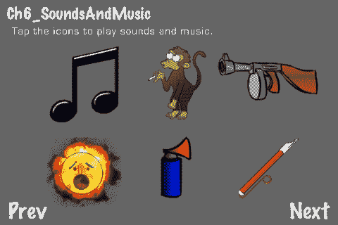

## 准备中

请参阅项目*RecipeCollection02*以获取本食谱的完整工作代码。

## 如何做...

执行以下代码：

```swift
#import "SimpleAudioEngine.h"
@implementation Ch6_SoundsAndMusic
-(CCLayer*) runRecipe {
//Initialize the audio engine
sae = [SimpleAudioEngine sharedEngine];
//Background music is stopped on resign and resumed on become active
[[CDAudioManager sharedManager] setResignBehavior:kAMRBStopPlay autoHandle:YES];
//Initialize source container
soundSources = [[NSMutableDictionary alloc] init];
//Add the sounds
[self loadSoundEffect:@"crazy_chimp.caf"];
[self loadSoundEffect:@"rapid_gunfire.caf"];
[self loadSoundEffect:@"howie_scream.caf"];
[self loadSoundEffect:@"air_horn.caf"];
[self loadSoundEffect:@"slide_whistle.caf"];
//Add the background music
[self loadBackgroundMusic:@"hiphop_boss_man_by_p0ss.mp3"];
//Add menu items
CCMenuItemSprite *musicItem = [self menuItemFromSpriteFile:@"music_note.png" tag:0];
CCMenuItemSprite *chimpItem = [self menuItemFromSpriteFile:@"you_stupid_monkey.png" tag:1];
CCMenuItemSprite *gunItem = [self menuItemFromSpriteFile:@"tommy_gun.png" tag:2];
CCMenuItemSprite *screamItem = [self menuItemFromSpriteFile:@"yaaargh.png" tag:3];
CCMenuItemSprite *airHornItem = [self menuItemFromSpriteFile:@"air_horn.png" tag:4];
CCMenuItemSprite *slideWhistleItem = [self menuItemFromSpriteFile:@"slide_whistle.png" tag:5];
//Create our menu
CCMenu *menu = [CCMenu menuWithItems: musicItem, chimpItem, gunItem, screamItem, airHornItem, slideWhistleItem, nil];
[menu alignItemsInColumns: [NSNumber numberWithUnsignedInt:3], [NSNumber numberWithUnsignedInt:3], nil];
menu.position = ccp(240,140);
[self addChild:menu];
return self;
}
//Play sound callback
-(void) playSoundNumber:(id)sender {
CCMenuItem *item = (CCMenuItem*)sender;
int number = item.tag;
if(number == 0){
[self playBackgroundMusic:@"hiphop_boss_man_by_p0ss.mp3"];
}else if(number == 1){
[self playSoundFile:@"crazy_chimp.caf"];
}else if(number == 2){
[self playSoundFile:@"rapid_gunfire.caf"];
}else if(number == 3){
[self playSoundFile:@"howie_scream.caf"];
}else if(number == 4){
[self playSoundFile:@"air_horn.caf"];
}else if(number == 5){
[self playSoundFile:@"slide_whistle.caf"];
}
}
-(void) loadBackgroundMusic:(NSString*)fn {
//Pre-load background music
[sae preloadBackgroundMusic:fn];
}
-(void) playBackgroundMusic:(NSString*)fn {
if (![sae isBackgroundMusicPlaying]) {
//Play background music
[sae playBackgroundMusic:fn];
}else{
//Stop music if its currently playing
[sae stopBackgroundMusic];
}
}
-(CDSoundSource*) loadSoundEffect:(NSString*)fn {
//Pre-load sound
[sae preloadEffect:fn];
//Init sound
CDSoundSource *sound = [[sae soundSourceForFile:fn] retain];
//Add sound to container
[soundSources setObject:sound forKey:fn];
return sound;
}
-(void) playSoundFile:(NSString*)fn {
//Get sound
CDSoundSource *sound = [soundSources objectForKey:fn];
//Play sound
[sound play];
}
-(void) cleanRecipe {
//Stop background music
[sae stopBackgroundMusic];
for(id s in soundSources){
//Release source
CDSoundSource *source = [soundSources objectForKey:s];
[source release];
}
[soundSources release];
//End engine
[SimpleAudioEngine end];
sae = nil;
[super cleanRecipe];
}
@end

```

## 它是如何工作的...

`SimpleAudioEngine`类为用户提供了一个非常简单的接口来进行基本的音频播放。`[SimpleAudioEngine sharedEngine]`单例仅仅是 CocosDenshion 提供的`[CDAudioManager sharedManager]`单例的一个简化包装。

+   初始化：

    不需要初始化`SimpleAudioEngine`。在本食谱中，我们只是维护对`[SimpleAudioEngine sharedEngine]`的指针以缩短一些代码。我们使用以下行设置**辞职行为**。这会改变应用挂起或被其他方式中断时的音频行为。

    ```swift
    [[CDAudioManager sharedManager] setResignBehavior:kAMRBStopPlay autoHandle:YES];

    ```

    这将覆盖由`CDAudioManager`实现的`UIApplicationDelegate`下指定的`applicationWillResignActive`方法。其他辞职类型在`CDAudioManager.h`中定义。这个方法会在辞职（在 iOS 设备上按下主页按钮）时停止背景音乐，并在应用变为活动状态时播放背景音乐。

+   播放音效：

    我们将要播放的每个音效都是`CDSoundSource`的一个实例。"加载"音效涉及使用`SimpleAudioEngine`预先加载它。不预先加载就播放声音会导致延迟和降低音质。要预先加载声音，请使用以下行：

    ```swift
    [sae preloadEffect:@"crazy_chimp.caf"];

    ```

    初始化`CDSoundSource`对象：

    ```swift
    CDSoundSource *sound = [[sae soundSourceForFile:fn] retain];

    ```

    最后，保持对该对象的引用：

    ```swift
    NSMutableDictionary *soundSources = [[[NSMutableDictionary alloc] init] autorelease];
    [soundSources setObject:sound forKey:fn];

    ```

    要播放声音，我们只需获取引用并调用播放方法：

    ```swift
    CDSoundSource *sound = [soundSources objectForKey:fn];
    [sound play];

    ```

    `SimpleAudioEngine`隐藏了此过程的复杂方面。

+   播放背景音乐：

    播放背景音乐与播放音效类似，但一次只能播放一首背景音乐：

    ```swift
    [sae preloadBackgroundMusic: @"hiphop_boss_man_by_p0ss.mp3"];
    [sae playBackgroundMusic:@"hiphop_boss_man_by_p0ss.mp3"];

    ```

    如果需要，你可以获取实际背景音乐`CDLongAudioSource`对象的引用：

    ```swift
    CDLongAudioSource *bgm = [CDAudioManager sharedManager].backgroundMusic;

    ```

    此类优化用于较长的音频片段，如音乐和旁白。

## 更多...

实时音频解码和播放，尤其是在移动设备上，需要使用特定的音频格式。

+   CDSoundSource 格式：

    声音效果的推荐编码为未压缩音频文件的 **16 位单声道 Wave** 和在 **CAF** 容器中的 **IMA4**，用于有损音频文件。

+   转换为 IMA4 音频文件：

    在基于 Unix 的系统上，您可以使用 **afconvert** 工具将多种格式转换为 IMA4：

```swift
afconvert -f caff -d ima4 mysound.wav

```

+   CDLongAudioSource 格式：

    对于音乐和其他长音频的播放，任何由 Apple 的 `AVAudioPlayer` 支持的格式都可以使用。通常使用的格式是 **MP3**。

+   内存大小：

    虽然压缩音频可以减少磁盘空间需求，但所有声音效果都以 **16 位未压缩 PCM** 格式存储在内存中。因此，压缩声音效果不会减少您应用程序的内存占用。这对于更大、声音更密集的游戏来说是一个因素。

# 修改音频属性

CocosDenshion 提供了更改音频源 **音调、增益** 和 **声像** 属性的功能。音调是频率，增益是音量，声像是左右扬声器之间调整音量的方式。在本例中，我们将创建一个音乐弯曲乐器来显示这些属性被动态修改。

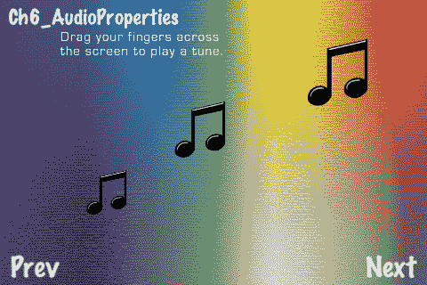

## 准备工作

请参考项目 *RecipeCollection02* 以获取此菜谱的完整工作代码。

## 如何操作...

执行以下代码：

```swift
#import "SimpleAudioEngine.h"
@implementation Ch6_AudioProperties
-(CCLayer*) runRecipe {
//Enable accelerometer support
self.isAccelerometerEnabled = YES;
[[UIAccelerometer sharedAccelerometer] setUpdateInterval:(1.0 / 60)];
//Add background
CCSprite *bg = [CCSprite spriteWithFile:@"synth_tone_sheet.png"];
bg.position = ccp(240,160);
[self addChild:bg];
//Initialize the audio engine
sae = [SimpleAudioEngine sharedEngine];
//Background music is stopped on resign and resumed on becoming active
[[CDAudioManager sharedManager] setResignBehavior:kAMRBStopPlay autoHandle:YES];
//Initialize note container
notes = [[NSMutableDictionary alloc] init];
noteSprites = [[NSMutableDictionary alloc] init];
//Preload tone
[sae preloadEffect:@"synth_tone_mono.caf"];
return self;
}
-(void) ccTouchesBegan:(NSSet *)touches withEvent:(UIEvent *)event {
//Process multiple touches
for(int i=0; i<[[touches allObjects] count]; i++){
UITouch *touch = [[touches allObjects] objectAtIndex:i];
CGPoint point = [touch locationInView: [touch view]];
point = [[CCDirector sharedDirector] convertToGL: point];
//Use [touch hash] as a key for this sound source
NSString *key = [NSString stringWithFormat:@"%d",[touch hash]];
if([notes objectForKey:key]){
CDSoundSource *sound = [notes objectForKey:key];
[sound release];
[notes removeObjectForKey:key];
CCSprite *sprite = [noteSprites objectForKey:key];
[self removeChild:sprite cleanup:YES];
[noteSprites removeObjectForKey:key];
}
//Play our sound with custom pitch and gain
CDSoundSource *sound = [[sae soundSourceForFile:@"synth_tone_mono.caf"] retain];
[sound play];
sound.looping = YES;
[notes setObject:sound forKey:key];
sound.pitch = point.x/240.0f;
sound.gain = point.y/320.0f;
//Show music note where you touched
CCSprite *sprite = [CCSprite spriteWithFile:@"music_note.png"];
sprite.position = point;
[noteSprites setObject:sprite forKey:key];
sprite.scale = (point.y/320.0f)/2 + 0.25f;
[self addChild:sprite];
}
}
-(void) ccTouchesMoved:(NSSet *)touches withEvent:(UIEvent *)event {
//Adjust sound sources and music note positions
for(int i=0; i<[[touches allObjects] count]; i++){
UITouch *touch = [[touches allObjects] objectAtIndex:i];
CGPoint point = [touch locationInView: [touch view]];
point = [[CCDirector sharedDirector] convertToGL: point];
NSString *key = [NSString stringWithFormat:@"%d",[touch hash]];
if([notes objectForKey:key]){
CDSoundSource *sound = [notes objectForKey:key];
sound.pitch = point.x/240.0f;
sound.gain = point.y/320.0f;
CCSprite *sprite = [noteSprites objectForKey:key];
sprite.position = point;
sprite.scale = (point.y/320.0f)/2 + 0.25f;
}
}
}
-(void) ccTouchesEnded:(NSSet *)touches withEvent:(UIEvent *)event {
//Stop sounds and remove sprites
for(int i=0; i<[[touches allObjects] count]; i++){
UITouch *touch = [[touches allObjects] objectAtIndex:i];
CGPoint point = [touch locationInView: [touch view]];
point = [[CCDirector sharedDirector] convertToGL: point];
NSString *key = [NSString stringWithFormat:@"%d",[touch hash]];
if([notes objectForKey:key]){
//Stop and remove sound source
CDSoundSource *sound = [notes objectForKey:key];
[sound stop];
[sound release];
[notes removeObjectForKey:key];
//Remove sprite
CCSprite *sprite = [noteSprites objectForKey:key];
[self removeChild:sprite cleanup:YES];
[noteSprites removeObjectForKey:key];
}
}
}
//Adjust sound pan by turning the device sideways
- (void) accelerometer:(UIAccelerometer*)accelerometer didAccelerate:(UIAcceleration*)acceleration{
for(id s in notes){
CDSoundSource *sound = [notes objectForKey:s];
sound.pan = -acceleration.y; //"Turn" left to pan to the left speaker
}
}
@end

```

## 如何工作...

此菜谱所需的第一件事是一个短、恒定、中音范围的合成音。这是在 **GarageBand** 中创建的，然后使用 **Audacity** 进行修改。当您触摸屏幕时，音符就会播放：

```swift
CDSoundSource *sound = [[sae soundSourceForFile:@"synth_tone_mono.caf"] retain];
[sound play];
sound.looping = YES;

```

现在我们需要根据触摸的 X 位置设置 `pitch` 在 0 到 2 之间：

```swift
sound.pitch = point.x/240.0f;

```

我们根据触摸的 Y 位置设置 `gain` 属性在 0 到 1 之间：

```swift
sound.gain = point.y/320.0f;

```

摇动设备将设置 `pan` 属性。向左倾斜以在您的左耳听到更多音调，向右倾斜以在您的右耳听到更多音调：

```swift
for(id s in notes){
CDSoundSource *sound = [notes objectForKey:s];
sound.pan = -acceleration.y; //"Turn" left to pan to the left speaker
}

```

如您所见（并可听到），在播放声音的同时，可以实时修改音频属性，以创建真正酷炫的效果。

## 更多...

在此菜谱中使用的 `@"synth_tone_mono.caf"` 文件被特别编码为 **单声道** 音效。这是因为 **声像** 属性只能在单声道音效上设置。

# 淡化声音和音乐

从 Cocos2d 动作中汲取灵感，CocosDenshion 提供了一些用于淡化声音和音乐的类。这些是 `CDLongAudioSourceFader` 和 `CDXPropertyModifierAction`。在本例中，我们将看到如何淡化/取消淡化所有声音、单个声音和音乐，以及如何交叉淡化两个音乐源。

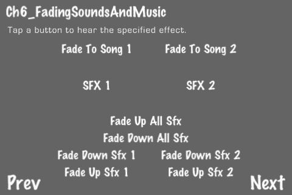

## 准备工作

请参考项目 RecipeCollection02 以获取此菜谱的完整工作代码。

## 如何操作...

执行以下代码：

```swift
#import "SimpleAudioEngine.h"
#import "CDXPropertyModifierAction.h"
@implementation Ch6_FadingSoundsAndMusic
-(CCLayer*) runRecipe {
//Initialize the audio engine
sae = [SimpleAudioEngine sharedEngine];
//Background music is stopped on resign and resumed on becoming active
[[CDAudioManager sharedManager] setResignBehavior:kAMRBStopPlay autoHandle:YES];
//Initialize source container
soundSources = [[NSMutableDictionary alloc] init];
musicSources = [[NSMutableDictionary alloc] init];
//Add music
[self loadMusic:@"hiphop_boss_man_by_p0ss.mp3"];
[self loadMusic:@"menu_music_by_mrpoly.mp3"];
//Add sounds
[self loadSoundEffect:@"gunman_pain.caf"];
[self loadSoundEffect:@"synth_tone.caf"];
//Add menu items
/* CODE OMITTED */
return self;
}
//Play music callback
-(void) playMusicNumber:(id)sender {
CCMenuItem *item = (CCMenuItem*)sender;
int number = item.tag;
if(number == 0){
[self fadeOutPlayingMusic];
[self fadeInMusicFile:@"hiphop_boss_man_by_p0ss.mp3"];
}else if(number == 1){
[self fadeOutPlayingMusic];
[self fadeInMusicFile:@"menu_music_by_mrpoly.mp3"];
}
}
//Fade out any music sources currently playing
-(void) fadeOutPlayingMusic {
for(id m in musicSources){
//Release source
CDLongAudioSource *source = [musicSources objectForKey:m];
if(source.isPlaying){
//Create fader
CDLongAudioSourceFader* fader = [[CDLongAudioSourceFader alloc] init:source interpolationType:kIT_Exponential startVal:source.volume endVal:0.0f];
[fader setStopTargetWhenComplete:NO];
//Create a property modifier action to wrap the fader
CDXPropertyModifierAction* fadeAction = [CDXPropertyModifierAction actionWithDuration:3.0f modifier:fader];
[fader release];//Action will retain
CCCallFuncN* stopAction = [CCCallFuncN actionWithTarget:source selector:@selector(stop)];
[[CCActionManager sharedManager] addAction:[CCSequence actions:fadeAction, stopAction, nil] target:source paused:NO];
}
}
}
//Fade in a specific music file
-(void) fadeInMusicFile:(NSString*)fn {
//Stop music if its playing and return
CDLongAudioSource *source = [musicSources objectForKey:fn];
if(source.isPlaying){
[source stop];
return;
}
//Set volume to zero and play
source.volume = 0.0f;
[source play];
//Create fader
CDLongAudioSourceFader* fader = [[CDLongAudioSourceFader alloc] init:source interpolationType:kIT_Exponential startVal:source.volume endVal:1.0f];
[fader setStopTargetWhenComplete:NO];
//Create a property modifier action to wrap the fader
CDXPropertyModifierAction* fadeAction = [CDXPropertyModifierAction actionWithDuration:1.5f modifier:fader];
[fader release];//Action will retain
[[CCActionManager sharedManager] addAction:[CCSequence actions:fadeAction, nil] target:source paused:NO];
}
-(void) fadeUpAllSfx:(id)sender {
//Fade up all sound effects
[CDXPropertyModifierAction fadeSoundEffects:2.0f finalVolume:1.0f curveType:kIT_Linear shouldStop:NO];
}
-(void) fadeDownAllSfx:(id)sender {
//Fade down all sound effects
[CDXPropertyModifierAction fadeSoundEffects:2.0f finalVolume:0.0f curveType:kIT_Linear shouldStop:NO];
}
-(void) fadeUpSfxNumber:(id)sender {
//Fade up a specific sound effect
CCMenuItem *item = (CCMenuItem*)sender;
int number = item.tag;
CDSoundSource *source;
if(number == 0){
source = [soundSources objectForKey:@"gunman_pain.caf"];
}else if(number == 1){
source = [soundSources objectForKey:@"synth_tone.caf"];
}
source.gain = 0.0f;
[CDXPropertyModifierAction fadeSoundEffect:2.0f finalVolume:1.0f curveType:kIT_Linear shouldStop:NO effect:source];
}
-(void) fadeDownSfxNumber:(id)sender {
//Fade down a specific sound effect
CCMenuItem *item = (CCMenuItem*)sender;
int number = item.tag;
CDSoundSource *source;
if(number == 0){
source = [soundSources objectForKey:@"gunman_pain.caf"];
}else if(number == 1){
source = [soundSources objectForKey:@"synth_tone.caf"];
}
source.gain = 1.0f;
[CDXPropertyModifierAction fadeSoundEffect:2.0f finalVolume:0.0f curveType:kIT_Linear shouldStop:NO effect:source];
}
@end

```

## 如何工作...

在这个菜谱中，我们直接使用 `CDLongAudioSource` 而不是使用 `SimpleAudioEngine` 提供的 `backgroundMusic` 源。这允许我们在给定时间内播放多个长音频源。

+   交叉淡入长音频源：

    交叉淡入涉及同时淡入一个源和淡出一个源。首先，我们初始化一个 `CDLongAudioSourceFader` 对象来指定淡出值和插值类型：

    ```swift
    CDLongAudioSourceFader* fader = [[CDLongAudioSourceFader alloc] init:source interpolationType:kIT_Linear startVal:source.volume endVal:0.0f];
    [fader setStopTargetWhenComplete:NO];

    ```

    在这种情况下，我们希望从源当前音量开始线性淡出。然后我们创建一个具有指定持续时间的 `CDXPropertyModifierAction` 对象。我们还在这一点上释放了淡出对象：

    ```swift
    CDXPropertyModifierAction* fadeAction = [CDXPropertyModifierAction actionWithDuration:3.0f modifier:fader];
    [fader release];

    ```

    在淡出音轨后，我们希望停止其播放。为此，我们创建一个 `CCCallFuncN` 动作：

    ```swift
    CCCallFuncN* stopAction = [CCCallFuncN actionWithTarget:source selector:@selector(stop)];

    ```

    最后，我们按顺序运行这些操作：

    ```swift
    [[CCActionManager sharedManager] addAction:[CCSequence actions:fadeAction, stopAction, nil] target:source paused:NO];

    ```

    执行此操作，以及其他轨道的“淡入”操作，将创建所需的交叉淡入效果。

+   淡出单个音效：

    `CDXPropertyModifierAction` 类提供了一个方便的方法来淡出单个音效：

    ```swift
    [CDXPropertyModifierAction fadeSoundEffect:2.0f finalVolume:0.0f curveType:kIT_Linear shouldStop:YES effect:source];

    ```

    在上一个例子中，我们淡出指定的音源 2 秒，然后在我们完成时停止音源播放。

+   淡出所有音效：

    所有当前正在播放的音效也可以使用以下方便方法淡出：

    ```swift
    [CDXPropertyModifierAction fadeSoundEffects:2.0f finalVolume:0.0f curveType:kIT_Linear shouldStop:YES];

    ```

    这将对所有正在播放的音效应用相同的“淡出”效果。

# 在游戏中使用音频

虽然 `SimpleAudioEngine` 可能很简单，但它足够高效，可以用于任何类型的游戏。在这个菜谱中，我们将向第四章中提到的 **子弹** 演示（ch04.html "第四章。物理"）添加音效和音乐，

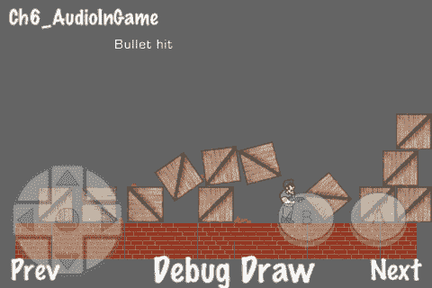

## 准备工作

请参考项目 *RecipeCollection02* 以获取此菜谱的完整工作代码。

## 如何操作...

执行以下代码：

```swift
#import "Ch4_Bullets.h"
#import "SimpleAudioEngine.h"
@interface Ch6_AudioInGame : Ch4_Bullets
/* CODE OMITTED */
@end
@implementation Ch6_AudioInGame
-(CCLayer*) runRecipe {
[super runRecipe];
//Initialize the audio engine
sae = [SimpleAudioEngine sharedEngine];
//Background music is stopped on resign and resumed on becoming active
[[CDAudioManager sharedManager] setResignBehavior:kAMRBStopPlay autoHandle:YES];
//Initialize source container
soundSources = [[NSMutableDictionary alloc] init];
//Add the sounds
[self loadSoundEffect:@"bullet_fire_no_shell.caf" gain:1.0f];
[self loadSoundEffect:@"bullet_casing_tink.caf" gain:0.25f];
[self loadSoundEffect:@"gunman_jump.caf" gain:1.5f];
[self loadSoundEffect:@"box_break.wav" gain:1.5f];
//Add the background music
[self loadBackgroundMusic:@"hiphop_boss_man_by_p0ss.mp3"];
sae.backgroundMusicVolume = 0.5f;
[self playBackgroundMusic:@"hiphop_boss_man_by_p0ss.mp3"];
return self;
}
//Jump sound override
-(void) processJump {
if(onGround && jumpCounter < 0){
[self playSoundFile:@"gunman_jump.caf"];
}
[super processJump];
}
//Fire gun sound override
-(void) fireGun {
if(fireCount <= 0){
[self playSoundFile:@"bullet_fire_no_shell.caf"];
}
[super fireGun];
}
//Box explosion sound override
-(void) boxExplosionAt:(CGPoint)p withRotation:(float)rot {
[self playSoundFile:@"box_break.wav"];
[super boxExplosionAt:p withRotation:rot];
}
//Bullet casing sound override
-(void) handleCollisionWithMisc:(GameMisc*)a withMisc:(GameMisc*)b {
if(a.typeTag == TYPE_OBJ_SHELL || b.typeTag == TYPE_OBJ_SHELL){
[self playSoundFile:@"bullet_casing_tink.caf"];
}
[super handleCollisionWithMisc:a withMisc:b];
}
@end

```

## 它是如何工作的...

使用本章中描述的技术，我们可以通过添加音效和音乐来给我们的射击盒演示增添一些活力。

+   声音缓冲区：

    默认情况下，`CDAudioManager` 为每个音源分配一个声音缓冲区。因此，每次我们播放 `@"bullet_fire_no_shell.caf"` 音效时，如果它已经在播放过程中，我们实际上会停止该音效的播放。这对于大多数游戏中的音效使用情况是足够的。

## 还有更多...

寻找适合你游戏使用的音效可能是一个既有趣又繁琐的过程。尽管存在大量的免费音效，但通常很难找到适合特定情况的正确音效。或者，一个麦克风和一些音频生成和操作软件可以大有帮助。例如，效果 `@"bullet_casing_tink.caf"` 是通过使用 GarageBand 播放钢琴的最高音符创建的。另一个程序，**sfxr**，可以用来生成简单的 8 位风格音效。Cocoa 版本，**cfxr**，可以在此处下载：[`thirdcog.eu/apps/cfxr`](http://thirdcog.eu/apps/cfxr)。

# 在游戏中使用位置音频

为了增加我们在游戏中使用的声音的真实感，我们可以根据游戏中的因素修改音频属性。在这个例子中，我们使用**源距离**、**可听范围**和**对象大小**来确定**增益**、**音调**和**声像**。我们将通过向第四章中的**TopDownIsometric**演示添加声音来演示这一点，

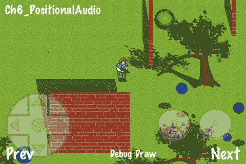

## 准备工作

请参阅项目 *RecipeCollection02* 以获取此菜谱的完整工作代码。

## 如何做到这一点...

执行以下代码：

```swift
#import "Ch4_TopDownIsometric.h"
#import "SimpleAudioEngine.h"
enum {
CGROUP_NON_INTERRUPTIBLE = 0
};
@interface Ch6_PositionalAudio : Ch4_TopDownIsometric
/* CODE OMITTED */
@end
@implementation Ch6_PositionalAudio
-(CCLayer*) runRecipe {
//Run our top-down isometric game recipe
[super runRecipe];
//Initialize max audible range
audibleRange = 20.0f;
//Initialize the audio engine
sae = [SimpleAudioEngine sharedEngine];
//Background music is stopped on resign and resumed on becoming active
[[CDAudioManager sharedManager] setResignBehavior:kAMRBStopPlay autoHandle:YES];
//Preload the sounds
[sae preloadEffect:@"forest_birds_ambience.caf"];
[sae preloadEffect:@"kick_ball_bounce.caf"];
[sae preloadEffect:@"gunman_jump.caf"];
[sae preloadEffect:@"bullet_fire_no_shell.caf"];
//Non-interruptible ball source group
[[CDAudioManager sharedManager].soundEngine setSourceGroupNonInterruptible:CGROUP_NON_INTERRUPTIBLE isNonInterruptible:YES];
//Add the sounds
ballSource = [[sae soundSourceForFile:@"kick_ball_bounce.caf"] retain];
forestBirdsSource = [[sae soundSourceForFile:@"forest_birds_ambience.caf"] retain];
gunmanJumpSource = [[sae soundSourceForFile:@"gunman_jump.caf"] retain];
fireBallSource = [[sae soundSourceForFile:@"bullet_fire_no_shell.caf"] retain];
//Start playing forest bird source
forestBirdsSource.gain = 0.0f;
forestBirdsSource.looping = YES;
[forestBirdsSource play];
//Customize fire ball sound
fireBallSource.pitch = 2.0f;
fireBallSource.gain = 0.5f;
return self;
}
-(void) step:(ccTime)delta {
[super step:delta];
//Play forest bird source with gain based on distance from gunman
float distance = 10000.0f;
for(int i=0; i<[trees count]; i++){
GameObject *tree = [trees objectAtIndex:i];
float thisDistance = distanceBetweenPoints(ccp(tree.body->GetPosition().x,tree.body->GetPosition().y),
ccp(gunman.body->GetPosition().x, gunman.body->GetPosition().y));
if(thisDistance < distance){ distance = thisDistance; }
}
//If closest tree is outside of audible range we set gain to 0.0f
if(distance < audibleRange){
forestBirdsSource.gain = (audibleRange-distance)/audibleRange;
}else{
forestBirdsSource.gain = 0.0f;
}
}
//Fire ball sound override
-(void) fireBall {
if(fireCount < 0){
[fireBallSource play];
}
[super fireBall];
}
//Jump sound override
-(void) processJump {
if(gunman.body->GetZPosition() <= 1.0f){
[gunmanJumpSource play];
}
[super processJump];
}
-(void) handleCollisionWithGroundWithObj:(GameObject*)gameObject {
[super handleCollisionWithGroundWithObj:gameObject];
//Play ball bounce sound with gain based on distance from gunman
if(gameObject.typeTag == TYPE_OBJ_BALL){
float distance = distanceBetweenPoints(ccp(gameObject.body->GetPosition().x, gameObject.body->GetPosition().y), ccp(gunman.body->GetPosition().x, gunman.body->GetPosition().y));
if(distance < audibleRange){
float gain = (audibleRange-distance)/audibleRange;
float pan = (gameObject.body->GetPosition().x - gunman.body->GetPosition().x)/distance;
float pitch = ((((GameIsoObject*)gameObject).inGameSize / 10.0f) * -1) + 2;
if(distance < audibleRange){
[self playBallSoundWithGain:gain pan:pan pitch:pitch];
}
}
}
}
-(void) playBallSoundWithGain:(float)gain pan:(float)pan pitch:(float)pitch {
//Play the sound using the non-interruptible source group
[[CDAudioManager sharedManager].soundEngine playSound:ballSource.soundId sourceGroupId:CGROUP_NON_INTERRUPTIBLE pitch:pitch pan:pan gain:gain loop:NO];
}
@end

```

## 它是如何工作的...

创建逼真的声音环境涉及以创造性的方式改变音频属性。

+   森林氛围：

    对于这个菜谱，我们有一个 30 秒循环的森林氛围片段，代替背景音乐播放。我们根据玩家与最近树木的距离确定这个声音源的`增益`属性：

    ```swift
    if(distance < audibleRange){
    forestBirdsSource.gain = (audibleRange-distance)/audibleRange;
    }else{
    forestBirdsSource.gain = 0.0f;
    }

    ```

    如果所有树木都在可听范围内，则将`增益`设置为零。

+   球弹跳声音：

    为了创建一个引人入胜的球弹跳声音效果，我们修改了所有三个音频属性。`增益`属性由距离决定：

    ```swift
    float gain = (audibleRange-distance)/audibleRange;

    ```

    `声像`属性由 X 平面的距离决定：

    ```swift
    float pan = (gameObject.body->GetPosition().x - gunman.body->GetPosition().x)/distance;

    ```

    最后，`音调`属性由球的大小决定：

    ```swift
    float pitch = ((((GameIsoObject*)gameObject).inGameSize / 10.0f) * -1) + 2;

    ```

    这些修改共同创造了一系列独特的声音。这增加了听觉体验的深度。

+   使用多个声音缓冲区：

    由于我们同时有多个球启动弹跳声音效果，单个缓冲区将不再足够。我们现在需要同一个声音多次播放。为了实现这一点，我们使用一个特殊的**源组**。源组只是将声音分组在一起以操纵它们如何播放的一种方式。例如，你可能希望两个声音源共享一个缓冲区。在这种情况下，我们指定源组为不可中断：

    ```swift
    enum { CGROUP_NON_INTERRUPTIBLE = 0 };
    [[CDAudioManager sharedManager].soundEngine setSourceGroupNonInterruptible:CGROUP_NON_INTERRUPTIBLE isNonInterruptible:YES];

    ```

    现在，使用此源组播放的所有声音都将获得一个开放缓冲区。要指定在播放声音时使用源组，我们使用以下行：

    ```swift
    [[CDAudioManager sharedManager].soundEngine playSound:ballSource.soundId sourceGroupId:CGROUP_NON_INTERRUPTIBLE pitch:pitch pan:pan gain:gain loop:NO];

    ```

    现在，可以听到多个具有不同音频属性的球弹跳声音效果相互重叠。

+   缓冲区最大数量：

    可用的最大声音缓冲区数量和缓冲区增量在`CDConfig.h`中指定：

    ```swift
    #define CD_BUFFERS_START 64
    #define CD_BUFFERS_INCREMENT 16

    ```

    在默认情况下，在 64 个缓冲区填满后，再分配 16 个。这些可以根据具有特定音频要求的应用程序进行自定义。

# 测量背景音乐

`CDAudioManager`类封装了`AVAudioPlayer`类。使用这个类我们可以访问更底层的音频功能。在这个菜谱中，我们将动态读取当前播放的背景音乐的**平均电平**和**峰值电平**。我们可以使用这些信息来同步或提示动画。

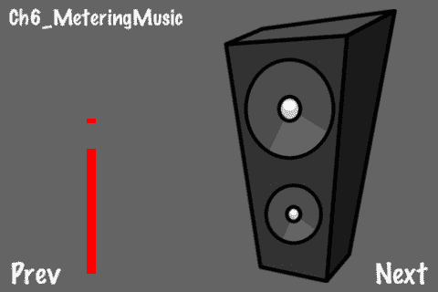

## 准备工作

请参阅项目 *RecipeCollection02* 以获取此菜谱的完整工作代码。

## 如何做到这一点...

执行以下代码：

```swift
#import "SimpleAudioEngine.h"
@implementation Ch6_MeteringMusic
-(CCLayer*) runRecipe {
//Initialize the audio engine
sae = [SimpleAudioEngine sharedEngine];
//Background music is stopped on resign and resumed on becoming active
[[CDAudioManager sharedManager] setResignBehavior:kAMRBStopPlay autoHandle:YES];
//Set peak and average power initially
peakPower = 0;
avgPower = 0;
//Init speaker sprites (speakerBase, speakerLarge and speakerSmall)
/* CODE OMITTED */
//Init meter sprites (avgMeter and peakMeter)
/* CODE OMITTED */
//Add the background music
[sae preloadBackgroundMusic:@"technogeek_by_mrpoly.mp3"];
[sae playBackgroundMusic:@"technogeek_by_mrpoly.mp3"];
//Enable metering
[CDAudioManager sharedManager].backgroundMusic.audioSourcePlayer.meteringEnabled = YES;
//Schedule step method
[self schedule:@selector(step:)];
return self;
}
-(void) step:(ccTime)delta {
[self setPeakAndAveragePower];
[self animateMeterAndSpeaker];
}
-(void) setPeakAndAveragePower {
//Update meters
[[CDAudioManager sharedManager].backgroundMusic.audioSourcePlayer updateMeters];
//Get channels
int channels = [CDAudioManager sharedManager].backgroundMusic.audioSourcePlayer.numberOfChannels;
//Average all the channels
float peakPowerNow = 0;
float avgPowerNow = 0;
for(int i=0; i<channels; i++){
float peak = [[CDAudioManager sharedManager].backgroundMusic.audioSourcePlayer peakPowerForChannel:i];
float avg = [[CDAudioManager sharedManager].backgroundMusic.audioSourcePlayer averagePowerForChannel:i];
peakPowerNow += peak/channels;
avgPowerNow += avg/channels;
}
//Change from a DB level to a 0 to 1 ratio
float adjustedPeak = pow(10, (0.05 * peakPowerNow));
float adjustedAvg = pow(10, (0.05 * avgPowerNow));
//Average it out for smoothing
peakPower = (peakPower + adjustedPeak)/2;
avgPower = (avgPower + adjustedAvg)/2;
}
-(void) animateMeterAndSpeaker {
//Average meter
[avgMeter setTextureRect:CGRectMake(0,0,10,avgPower*500.0f)];
//Peak meter
peakMeter.position = ccp(100,20+peakPower*500.0f);
//Animate speaker
speakerLarge.scale = powf(avgPower,0.4f)*2;
speakerSmall.scale = powf(avgPower,0.4f)*2;
}
@end

```

## 它是如何工作的...

访问动态计测功能需要在 `CDLongAudioSource` 对象内部使用 `audioSourcePlayer` 引用，在本例中，`backgroundMusic`。在我们开始之前，我们启用计测：

```swift
[CDAudioManager sharedManager].backgroundMusic.audioSourcePlayer.meteringEnabled = YES;

```

现在，我们每周期收集所有播放通道的**平均**和**峰值**分贝水平。我们平均这些数字：

```swift
[[CDAudioManager sharedManager].backgroundMusic.audioSourcePlayer updateMeters];
int channels = [CDAudioManager sharedManager].backgroundMusic.audioSourcePlayer.numberOfChannels;
for(int i=0; i<channels; i++){
float peak = [[CDAudioManager sharedManager].backgroundMusic.audioSourcePlayer peakPowerForChannel:i];
float avg = [[CDAudioManager sharedManager].backgroundMusic.audioSourcePlayer averagePowerForChannel:i];
peakPowerNow += peak/channels;
avgPowerNow += avg/channels;
}

```

之后，我们将平均和峰值分贝水平转换为 0 到 1 之间的比率。这使得数字更容易应用于动画。

```swift
//Change from a DB level to a 0 to 1 ratio
float adjustedPeak = pow(10, (0.05 * peakPowerNow));
float adjustedAvg = pow(10, (0.05 * avgPowerNow));
//Average it out for smoothing
peakPower = (peakPower + adjustedPeak)/2;
avgPower = (avgPower + adjustedAvg)/2;

```

在设置新的 `peakPower` 和 `avgPower` 变量时，我们也分割差异。这使音量变化更加平滑。

# 动画计测对话框

`LongAudioSource` 对象可以是任何类型的音频，而不仅仅是音乐。在这个配方中，我们将使用计测技术来动画化社交的参议员 Beauregard Claghorn 的嘴巴。

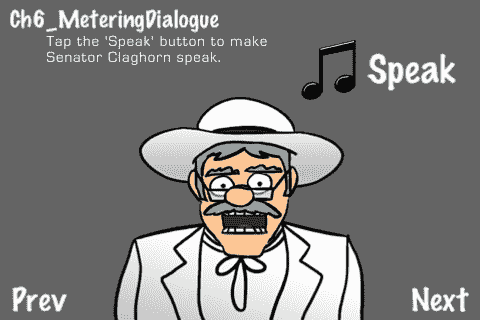

## 准备工作

请参阅项目 *RecipeCollection02* 以获取此配方的完整工作代码。

## 如何做...

执行以下代码：

```swift
#import "SimpleAudioEngine.h"
@implementation Ch6_MeteringDialogue
-(CCLayer*) runRecipe {
/* CODE OMITTED */
//Add the sounds
[self loadLongAudioSource:@"claghorn_a_joke_son.caf"];
[self loadLongAudioSource:@"claghorn_carolina.caf"];
/* CODE OMITTED */
//Add the background music
[self loadBackgroundMusic:@"dixie_1916.mp3"];
/* CODE OMITTED */
//Play background music
[self playBackgroundMusic:@"dixie_1916.mp3"];
//Have Claghorn introduce himself
[self playLongAudioSource:@"claghorn_howdy.caf"];
}
-(void) step:(ccTime)delta {
/* CODE OMITTED */
[self setPeakAndAveragePower];
[self animateClaghorn];
}
-(void) setPeakAndAveragePower {
//Find our playing audio source
CDLongAudioSource *audioSource = nil;
for(id s in soundSources){
CDLongAudioSource *source = [soundSources objectForKey:s];
if(source.isPlaying){
audioSource = source;
break;
}
}
//Update meters
[audioSource.audioSourcePlayer updateMeters];
/* CODE OMITTED */
}
-(void) animateClaghorn {
/* Custom mouth animation */
float level = avgPower;
//Make sure he's actually speaking
if(level == 0){
claghornEyebrows.position = ccp(240,120);
claghornMouth.position = ccp(240,120);
lastAudioLevel = level;
return;
}
//Level bounds
if(level <= 0){ level = 0.01f; }
if(level >= 1){ level = 0.99f; }
//Exaggerate level ebb and flow
if(level < lastAudioLevel){
//Closing mouth
lastAudioLevel = level;
level = powf(level,1.5f);
}else{
//Opening mouth
lastAudioLevel = level;
level = powf(level,0.75f);
}
//If mouth is almost closed, close mouth
if(level < 0.1f){ level = 0.01f; }
//Blink if level > 0.8f
if(level > 0.8f && !isBlinking){
[self blink];
[self runAction:[CCSequence actions:[CCDelayTime actionWithDuration:0.5f],
[CCCallFunc actionWithTarget:self selector:@selector(unblink)], nil]];
}
//Raise eyebrows if level > 0.6f
if(level > 0.6f){
claghornEyebrows.position = ccp(240,120 + level*5.0f);
}else{
claghornEyebrows.position = ccp(240,120);
}
//Set mouth position
claghornMouth.position = ccp(240,120 - level*19.0f);
}
-(CDLongAudioSource*) loadLongAudioSource:(NSString*)fn {
//Init source
CDLongAudioSource *source = [[CDLongAudioSource alloc] init];
source.backgroundMusic = NO;
[source load:fn];
//Enable metering
source.audioSourcePlayer.meteringEnabled = YES;
//Add sound to container
[soundSources setObject:source forKey:fn];
return source;
}
-(void) playLongAudioSource:(NSString*)fn {
//Get sound
CDLongAudioSource *audioSource = [soundSources objectForKey:fn];
bool aSourceIsPlaying = NO;
for(id s in soundSources){
CDLongAudioSource *source = [soundSources objectForKey:s];
if(source.isPlaying){
[source stop];
[source rewind];
aSourceIsPlaying = YES;
break;
}
}
//Play sound
if(!aSourceIsPlaying){
//Play sound
[audioSource play];
[self runAction: [CCSequence actions: [CCDelayTime actionWithDuration:[audioSource.audioSourcePlayer duration]],
[CCCallFunc actionWithTarget:audioSource selector:@selector(stop)],
[CCCallFunc actionWithTarget:audioSource selector:@selector(rewind)], nil]];
}
}
@end

```

## 它是如何工作的...

与之前的配方类似，我们使用从 `setPeakAndAveragePower` 收集的信息来运行动画。与之前的配方不同，我们有多个 `CDLongAudioSource` 对象可供选择。在这里，我们找到当前正在播放的源，并用于计测：

```swift
CDLongAudioSource *audioSource = nil;
for(id s in soundSources){
CDLongAudioSource *source = [soundSources objectForKey:s];
if(source.isPlaying){
audioSource = source;
break;
}
}
[audioSource.audioSourcePlayer updateMeters];

```

在计算 `avgPower` 之后，我们然后夸大该数字的峰值和谷值，以帮助模拟 Claghorn 嘴巴的快速张合：

```swift
if(level < lastAudioLevel){
lastAudioLevel = level;
level = powf(level,1.5f);
}else{
lastAudioLevel = level;
level = powf(level,0.75f);
}

```

此外，我们还动画化眨眼、眼球移动和眉毛。将这些动画与计测链接起来，可以创建一个很好的嘴巴运动效果。

# 流式音频

在第一章，*图形*中，我们使用了 `MPMoviePlayerController` 类来播放全动作视频。在这个配方中，我们将使用类似的技术来创建流式音频播放器。

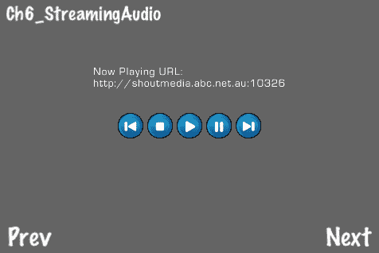

## 准备工作

请参阅项目 *RecipeCollection02* 以获取此配方的完整工作代码。

## 如何做...

将 `MediaPlayer` 框架链接到您的项目中。现在，执行以下代码：

```swift
#import <MediaPlayer/MediaPlayer.h>
#import "AppDelegate.h"
@implementation Ch6_StreamingAudio
-(CCLayer*) runRecipe {
//Create music player buttons
[[CCSpriteFrameCache sharedSpriteFrameCache] addSpriteFramesWithFile:@"music_player.plist"];
CCMenuItemSprite *prevItem = [self menuItemFromSpriteFile:@"music_player_prev.png" target:self selector:@selector(previousSong:)];
/* CODE OMITTED */
//Create menu
/* CODE OMITTED */
//Initial variable values
sourceIndex = 0;
isPlaying = NO;
//Streaming sources
streamingSources = [[NSMutableArray alloc] init];
[streamingSources addObject:@"http://shoutmedia.abc.net.au:10326"];
[streamingSources addObject:@"http://audioplayer.wunderground.com/drgruver/Philadelphia.mp3.m3u"];
[streamingSources addObject:@"http://s8.mediastreaming.it:7050/"];
[streamingSources addObject:@"http://www.radioparadise.com/musiclinks/rp_64aac.m3u"];
[streamingSources addObject:@"http://streaming.wrek.org:8000/wrek_HD-2.m3u"];
//Init movie playing (music streamer in this case)
moviePlayer = [[MPMoviePlayerController alloc] init];
moviePlayer.movieSourceType = MPMovieSourceTypeStreaming;
moviePlayer.view.hidden = YES;
((AppDelegate*)[UIApplication sharedApplication].delegate).window addSubview:moviePlayer.view];
//Set initial stream source
[self setStreamSource];
return self;
}
//Next callback
- (void) nextSong:(id)sender {
[self setIsPlaying];
sourceIndex++;
if(sourceIndex > [streamingSources count]-1){
sourceIndex = 0;
}
[self setStreamSource];
}
//Previous callback
- (void) previousSong:(id)sender {
[self setIsPlaying];
sourceIndex--;
if(sourceIndex < 0){
sourceIndex = [streamingSources count]-1;
}
[self setStreamSource];
}
-(void) setIsPlaying {
if(moviePlayer.playbackState == MPMoviePlaybackStatePlaying){
isPlaying = YES;
}
}
-(void) setStreamSource {
[moviePlayer stop];
moviePlayer.contentURL = [NSURL URLWithString:[streamingSources objectAtIndex:sourceIndex]];
if(isPlaying){
[self playMusic:nil];
}
}
@end

```

## 它是如何工作的...

这个配方的工作方式与我们之前在第一章中看到的类似，即*图形*。一个关键的区别是，在这里我们指定了 `mediaSourceType`，并且我们还隐藏了播放器视图：

```swift
moviePlayer.movieSourceType = MPMovieSourceTypeStreaming;
moviePlayer.view.hidden = YES;

```

这设置了播放器进行音频流。

+   达到 `AppDelegate:`

    在 **Cocos2d** 中，`AppDelegate` 类是实现 `UIApplicationDelegate` 协议的最高级类。该协议指定了主 `UIApplication` 单例指向的委托。这个委托处理重要应用程序事件。为了将我们的 `moviePlayer` 对象添加到我们的视图中，我们通过 `UIApplication` 单例访问这个委托：

    ```swift
    ((AppDelegate*)[UIApplication sharedApplication].delegate).window addSubview:moviePlayer.view];

    ```

    如您所见，这涉及到将 `delegate` 属性**转换为** `AppDelegate*` 类型。

+   切换电台：

    更改流源涉及停止播放并更改`contentURL`属性：

    ```swift
    [moviePlayer stop];
    moviePlayer.contentURL = [NSURL URLWithString:[streamingSources objectAtIndex:sourceIndex]];
    if(isPlaying){
    [self playMusic:nil];
    }

    ```

    这样用户可以在保持播放的同时无缝切换频道。

+   实时流格式：

    本食谱中使用的流源示例使用苹果的**HTTP 实时流**协议。这允许通过**HTTP**进行优雅的实时流传输，且无需太多麻烦。您可以在此处了解更多关于此协议的信息：[`developer.apple.com/resources/http-streaming/`](http://developer.apple.com/resources/http-streaming/)。

+   流式传输文件：

    单个文件，使用如**MP3**的格式，也可以使用此技术通过简单的**HTTP**服务器进行流式传输。

+   流式传输视频：

    通过将此食谱与第一章“图形”中的视频播放食谱相结合，您还可以进行视频流式传输。兼容格式和其他要求在上文提到的网站上详细说明。作为一个好的经验法则，任何可以使用 iOS 设备内置**Safari**网络浏览器播放的文件类型或 URL 通常也可以使用`MPMoviePlayerController`播放。

## 还有更多...

此前，我们提到了`UIApplication`**单例**。单例是在运行时实例化的顶级全局对象。Cocos2d 在很大程度上采用了单例模式。按照惯例，通过以“shared”一词开头的类方法（[类`sharedClass`]）访问的任何对象都是单例。您可以使用包含在`SynthesizeSingleton.h`文件中的**宏**创建自己的自定义单例对象。有关更多信息，请参阅**Cocos2d 食谱网站**的“更多食谱”部分，网址为[`cocos2dcookbook.com/more_recipes`](http://cocos2dcookbook.com/more_recipes)。

# 录音音频

大多数 iOS 设备的一个显著特性是能够录音。在这个食谱中，我们将使用麦克风录音并将音频保存到磁盘上的临时位置，使用`AVAudioRecorder`类。然后我们将使用`CDSoundEngine`类以修改后的音高播放它。

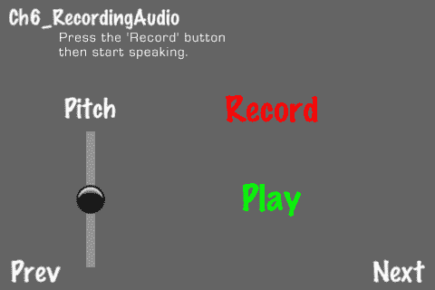

## 准备工作

请参考项目*RecipeCollection02*以获取本食谱的完整工作代码。

## 如何做到这一点...

将`CoreAudio`和`AVFoundation`框架链接到您的项目中。现在，执行以下代码：

```swift
#import <AVFoundation/AVFoundation.h>
#import <CoreAudio/CoreAudioTypes.h>
#import "CocosDenshion.h"
@interface Ch6_RecordingAudio : Recipe <AVAudioRecorderDelegate>
{ /* CODE OMITTED */}
@implementation Ch6_RecordingAudio
-(CCLayer*) runRecipe {
//Set initial pitch and recorded temp file object
pitch = 1.0f;
recordedTmpFile = nil;
//Init audio session
[self initAudioSession];
/* CODE OMITTED */
return self;
}
-(void) initAudioSession {
//Our AVAudioSession singleton pointer
AVAudioSession * audioSession = [AVAudioSession sharedInstance];
//Set up the audioSession for playback and record.
[audioSession setCategory:AVAudioSessionCategoryPlayAndRecord error:nil];
//Activate the session
[audioSession setActive:YES error:nil];
//Init CDSoundEngine
soundEngine = [[CDSoundEngine alloc] init];
//Define source groups
NSArray *defs = [NSArray arrayWithObjects: [NSNumber numberWithInt:1],nil];
[soundEngine defineSourceGroups:defs];
}
-(void) recordAudio {
//Set settings dictionary: IMA4 format, 44100 sample rate, 2 channels
NSMutableDictionary* recordSetting = [[[NSMutableDictionary alloc] init] autorelease];
[recordSetting setValue :[NSNumber numberWithInt:kAudioFormatAppleIMA4] forKey:AVFormatIDKey];
[recordSetting setValue:[NSNumber numberWithFloat:44100.0] forKey:AVSampleRateKey];
[recordSetting setValue:[NSNumber numberWithInt: 2] forKey:AVNumberOfChannelsKey];
//Set recording temp file location on disk
recordedTmpFile = [NSURL fileURLWithPath:[NSTemporaryDirectory() stringByAppendingPathComponent: [NSString stringWithString: @"recording.caf"]]];
//Init AVAudioRecorder with location and settings
recorder = [[AVAudioRecorder alloc] initWithURL:recordedTmpFile settings:recordSetting error:nil];
//Set delegate and start recording
[recorder setDelegate:self];
[recorder prepareToRecord];
[recorder record];
}
-(void) playAudio {
//Override the audio to go back to the speaker
UInt32 audioRouteOverride = kAudioSessionOverrideAudioRoute_Speaker;
AudioSessionSetProperty(kAudioSessionProperty_OverrideAudioRoute, sizeof (audioRouteOverride),&audioRouteOverride);
//Get the file path to the recorded audio
NSString *filePath = [NSTemporaryDirectory() stringByAppendingPathComponent: [NSString stringWithString: @"recording.caf"]];
//Play our recorded audio
[soundEngine loadBuffer:0 filePath: filePath];
[soundEngine playSound:0 sourceGroupId:0 pitch:pitch pan:0.0f gain:10.0f loop: NO];
}
-(void) stopRecordingAudio {
//Stop recording
[recorder stop];
}
- (void) unloadAudioSession {
//Remove temp file
NSFileManager * fm = [NSFileManager defaultManager];
if(recordedTmpFile){ [fm removeItemAtURL:recordedTmpFile error:nil]; }
//Release recorder
[recorder dealloc];
recorder = nil;
//Release sound engine
[soundEngine release];
//Deactivate audio session
AVAudioSession * audioSession = [AVAudioSession sharedInstance];
[audioSession setActive:NO error:nil];
}
@end

```

## 它是如何工作的...

录音和播放音频将向我们介绍一些新的类和概念。

+   初始化音频会话：

    因为我们想录音，所以我们必须设置一个特定的**音频会话**。音频会话是一种配置我们将要使用的音频输入和输出设置的途径。`AVAudioSession`单例封装了这一功能。首先，我们需要设置**会话类别**以允许录音和播放：

    ```swift
    [[AVAudioSession sharedInstance] setCategory:AVAudioSessionCategoryPlayAndRecord error:nil];

    ```

    然后我们需要激活会话：

    ```swift
    [[AVAudioSession sharedInstance] setActive:YES error:nil];

    ```

    CocosDenshion 通常做这些事情，但在这个食谱中，我们需要对音频系统有更细粒度的控制。

+   初始化 CDSoundEngine：

    在这里，我们还初始化了一个`CDSoundEngine`对象：

    ```swift
    soundEngine = [[CDSoundEngine alloc] init];
    NSArray *defs = [NSArray arrayWithObjects: [NSNumber numberWithInt:1],nil];
    [soundEngine defineSourceGroups:defs];

    ```

    我们将使用它来播放我们录制的音频。

+   录制音频：

    配方的核心，录制音频，需要几个步骤。首先，我们使用音频录制格式和我们要存储录制的音频的位置初始化`AVAudioRecorder`对象：

    ```swift
    NSMutableDictionary* recordSetting = [[[NSMutableDictionary alloc] init] autorelease];
    [recordSetting setValue :[NSNumber numberWithInt:kAudioFormatAppleIMA4] forKey:AVFormatIDKey];
    [recordSetting setValue:[NSNumber numberWithFloat:44100.0] forKey:AVSampleRateKey];
    [recordSetting setValue:[NSNumber numberWithInt: 2] forKey:AVNumberOfChannelsKey];
    recordedTmpFile = [NSURL fileURLWithPath:[NSTemporaryDirectory() stringByAppendingPathComponent: [NSString stringWithString: @"recording.caf"]]];
    recorder = [[AVAudioRecorder alloc] initWithURL:recordedTmpFile settings:recordSetting error:nil];

    ```

    我们指定我们的代理对象：

    ```swift
    [recorder setDelegate:self];

    ```

    最后，我们开始录音：

    ```swift
    [recorder prepareToRecord];
    [recorder record];

    ```

    录制将持续到我们调用停止例程：

    ```swift
    [recorder stop];

    ```

    记录将不会停止，直到记录器收到`stop`消息或代理收到错误。例如，磁盘可能已满。

+   `AVAudioRecorderDelegate`协议：

    通过指定我们的`Ch6_RecordingAudio`类遵循`AVAudioRecorderDelegate`协议，我们同意处理包括错误在内的一系列方法调用。如果我们未能这样做，这些错误将被抛出。在这个例子中，为了简洁起见，我们跳过了这一步，但在一个专业的应用程序中，建议您处理`AVAudioRecorder`类可能想要传递的任何消息。

+   播放我们录制的音频：

    一旦录制的音频存储在磁盘上，我们就可以播放它。在 iPhone 上，当音频会话类别为`AVAudioSessionCategoryPlayAndRecord`时，扬声器输出会被重定向到耳机扬声器。因此，在我们能够正确播放录制的音频之前，我们必须将播放重定向到扬声器：

    ```swift
    UInt32 audioRouteOverride = kAudioSessionOverrideAudioRoute_Speaker;
    AudioSessionSetProperty(kAudioSessionProperty_OverrideAudioRoute, sizeof (audioRouteOverride),&audioRouteOverride);

    ```

    现在，使用`CDSoundEngine`，我们可以将录制的音频加载到缓冲区并播放它：

    ```swift
    NSString *filePath = [NSTemporaryDirectory() stringByAppendingPathComponent: [NSString stringWithString: @"recording.caf"]];
    [soundEngine loadBuffer:0 filePath: filePath];
    [soundEngine playSound:0 sourceGroupId:0 pitch:pitch pan:0.0f gain:10.0f loop:NO];

    ```

    在上述行中，可以修改**音调、平衡**和**增益**属性。在这个例子中，您可以修改音调。尝试录制您的声音，然后改变音调。

# 使用 iPod 音乐库

有时用户可能希望将他们个人收藏中的音乐曲目添加到游戏的背景中。在这个例子中，我们将创建一个简单的音乐播放器，可以从设备上的**iPod 音乐库**中加载歌曲、专辑和播放列表。

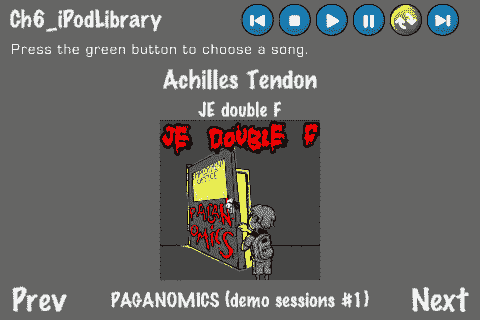

## 准备工作

请参阅项目*RecipeCollection02*以获取此配方的完整工作代码。

## 如何实现...

将`MediaPlayer`框架链接到您的项目中。现在，执行以下代码：

```swift
#import <MediaPlayer/MediaPlayer.h>
#import "AppDelegate.h"
@interface Ch6_iPodLibrary : Recipe <MPMediaPickerControllerDelegate>
{ /* CODE OMITTED */ }
@implementation Ch6_iPodLibrary
-(CCLayer*) runRecipe {
//Device detection
NSString *model = [[UIDevice currentDevice] model];
//Show a blank recipe if we use the simulator
if([model isEqualToString:@"iPhone Simulator"]){
message.position = ccp(240,250);
[self showMessage:@"This recipe is not compatible with the Simulator. \nPlease connect a device."];
return self;
}
/* CODE OMITTED */
//Init music player
musicPlayer = [MPMusicPlayerController iPodMusicPlayer];
[musicPlayer setRepeatMode:MPMusicRepeatModeAll];
//Initial sync of display with music player state
[self handleNowPlayingItemChanged:nil];
//Register for music player notifications
NSNotificationCenter *notificationCenter = [NSNotificationCenter defaultCenter];
[notificationCenter addObserver:self selector:@selector(handleNowPlayingItemChanged:)
name:MPMusicPlayerControllerNowPlayingItemDidChangeNotification object:musicPlayer];
[musicPlayer beginGeneratingPlaybackNotifications];
return self;
}
- (void) handleNowPlayingItemChanged:(id)notification {
//Get the current playing item
MPMediaItem *currentItem = musicPlayer.nowPlayingItem;
//Set labels
if([currentItem valueForProperty:MPMediaItemPropertyTitle]){
[songLabel setString: [NSString stringWithFormat:@"%@",[currentItem valueForProperty:MPMediaItemPropertyTitle]]];
[artistLabel setString: [NSString stringWithFormat:@"%@",[currentItem valueForProperty:MPMediaItemPropertyArtist]]];
[albumLabel setString: [NSString stringWithFormat:@"%@",[currentItem valueForProperty:MPMediaItemPropertyAlbumTitle]]];
}
//Get album artwork
MPMediaItemArtwork *artwork = [currentItem valueForProperty:MPMediaItemPropertyArtwork];
UIImage *artworkImage = nil;
if(artwork) { artworkImage = [artwork imageWithSize:CGSizeMake(100,100)]; }
//Remove current album art if necessary
if(albumArt){
[self removeChild:albumArt cleanup:YES];
albumArt = nil;
}
//Set album art
if(artworkImage){
CCTexture2D *texture = [[[CCTexture2D alloc] initWithImage:artworkImage] autorelease];
albumArt = [CCSprite spriteWithTexture:texture];
[self addChild:albumArt z:1];
albumArt.position = ccp(240,120);
albumArt.scale = 0.25f;
}
}
//Play callback
-(void)playMusic:(id)sender { [musicPlayer play]; }
//Pause callback
-(void)pauseMusic:(id)sender{ [musicPlayer pause]; }
//Stop callback
-(void)stopMusic:(id)sender{ [musicPlayer stop]; }
//Next callback
- (void)nextSong:(id)sender { [musicPlayer skipToNextItem]; }
//Previous callback
- (void)previousSong:(id)sender {
//After 3.5 seconds hitting previous merely rewinds the song
static NSTimeInterval skipToBeginningOfSongIfElapsedTimeLongerThan = 3.5;
NSTimeInterval playbackTime = musicPlayer.currentPlaybackTime;
if (playbackTime <= skipToBeginningOfSongIfElapsedTimeLongerThan) {
//Previous song
[musicPlayer skipToPreviousItem];
} else {
//Rewind to beginning of current song
[musicPlayer skipToBeginning];
}
}
//Add music callback
- (void)openMediaPicker:(id)sender {
//Unit music MPMediaPickerController
MPMediaPickerController *mediaPicker = [[MPMediaPickerController alloc] initWithMediaTypes:MPMediaTypeMusic];
mediaPicker.delegate = self;
mediaPicker.allowsPickingMultipleItems = YES;
//Present picker as a modal view
((AppDelegate*)[UIApplication sharedApplication].delegate).viewController presentModalViewController:mediaPicker animated:YES];
[mediaPicker release];
}
- (void)mediaPicker: (MPMediaPickerController *)mediaPicker didPickMediaItems:(MPMediaItemCollection *)mediaItemCollection {
//Dismiss the picker
((AppDelegate*)[UIApplication sharedApplication].delegate).viewController dismissModalViewControllerAnimated:YES];
//Assign the selected item(s) to the music player and start playback.
[musicPlayer stop];
[musicPlayer setQueueWithItemCollection:mediaItemCollection];
[musicPlayer play];
}
- (void)mediaPickerDidCancel:(MPMediaPickerController *)mediaPicker {
//User chose no items, dismiss the picker
((AppDelegate*)[UIApplication sharedApplication].delegate).viewController dismissModalViewControllerAnimated:YES];
}
-(void) cleanRecipe {
//Stop player
[musicPlayer stop];
//Stop music player notifications
[[NSNotificationCenter defaultCenter] removeObserver:self name:MPMusicPlayerControllerNowPlayingItemDidChangeNotification object:musicPlayer];
[[NSNotificationCenter defaultCenter] removeObserver:self
name:MPMusicPlayerControllerPlaybackStateDidChangeNotification object:musicPlayer];
[[NSNotificationCenter defaultCenter] removeObserver:self
name:MPMusicPlayerControllerVolumeDidChangeNotification object:musicPlayer];
[musicPlayer endGeneratingPlaybackNotifications];
//Release player
[musicPlayer release];
musicPlayer = nil;
[super cleanRecipe];
}
@end

```

## 它是如何工作的...

按下绿色按钮将打开标准 iPod 媒体选择器。有些游戏选择创建自己的选择器以更好地匹配他们的用户界面。在这个例子中，我们为了简单起见选择了默认媒体选择器。

+   初始化`MPMusicPlayerController`：

    首先，我们创建我们的`MPMusicPlayerController`对象：

    ```swift
    musicPlayer = [MPMusicPlayerController iPodMusicPlayer];
    [musicPlayer setRepeatMode:MPMusicRepeatModeAll];

    ```

    我们将播放器设置为`MPMusicRepeatModeAll`，这样我们的`nextSong`和`previousSong`方法就可以循环播放歌曲。

+   获取**现在播放**音频信息：

    每当**现在播放**项目发生变化时，我们希望得到通知，以便我们可以获取媒体信息。为此，我们将我们的配方对象设置为`musicPlayer`对象的观察者，并允许接收此类通知：

    ```swift
    NSNotificationCenter *notificationCenter = [NSNotificationCenter defaultCenter];
    [notificationCenter addObserver:self selector:@selector(handleNowPlayingItemChanged:)
    name:MPMusicPlayerControllerNowPlayingItemDidChangeNotification object:musicPlayer];
    [musicPlayer beginGeneratingPlaybackNotifications];

    ```

    作为观察者，我们的类将通过调用 `handleNowPlayingItemChanged` 方法得到通知。在这里，我们检查当前播放的 `MPMediaItem` 对象，以获取包括歌曲标题、艺术家姓名、专辑名称和专辑封面在内的信息：

    ```swift
    MPMediaItem *currentItem = musicPlayer.nowPlayingItem;
    if([currentItem valueForProperty:MPMediaItemPropertyTitle]){
    [songLabel setString: [NSString stringWithFormat:@"%@",[currentItem valueForProperty:MPMediaItemPropertyTitle]]];
    [artistLabel setString: [NSString stringWithFormat:@"%@",[currentItem valueForProperty:MPMediaItemPropertyArtist]]];
    [albumLabel setString: [NSString stringWithFormat:@"%@",[currentItem valueForProperty:MPMediaItemPropertyAlbumTitle]]];
    }
    MPMediaItemArtwork *artwork = [currentItem valueForProperty:MPMediaItemPropertyArtwork];
    UIImage *artworkImage = nil;
    if(artwork) { artworkImage = [artwork imageWithSize:CGSizeMake(100,100)]; }

    ```

    然后，我们将创建的 `UIImage` 对象放入场景中，使用第一章中描述的技术。

+   使用 `MPMediaPickerController:` 

    当用户触摸绿色按钮时，我们初始化一个 `MPMediaPickerController` 对象并指定其代理：

    ```swift
    MPMediaPickerController *mediaPicker = [[MPMediaPickerController alloc] initWithMediaTypes:MPMediaTypeMusic];
    mediaPicker.delegate = self;
    mediaPicker.allowsPickingMultipleItems = YES;

    ```

    然后，我们将选择器添加到屏幕上，以“模式视图”的形式展示它。这让我们可以动画化选择器滑入屏幕：

    ```swift
    ((AppDelegate*)[UIApplication sharedApplication].delegate).viewController presentModalViewController:mediaPicker animated:YES];

    ```

    当选择器打开时，用户可以从歌曲、播放列表、专辑等中进行选择。

+   `MPMediaPickerControllerDelegate:` 

    遵循此代理，我们实现了以下方法：

    ```swift
    -(void) mediaPicker:(MPMediaPickerController *)mediaPicker didPickMediaItems:(MPMediaItemCollection *)mediaItemCollection;
    -(void) mediaPickerDidCancel:(MPMediaPickerController *)mediaPicker;

    ```

    这些对应于至少选择一个项目和选择零个项目的情况。在选择一个或多个项目后，我们关闭模式视图，将项目添加到我们的播放器中，然后播放第一个项目：

    ```swift
    ((AppDelegate*)[UIApplication sharedApplication].delegate).viewController dismissModalViewControllerAnimated:YES];
    [musicPlayer stop];
    [musicPlayer setQueueWithItemCollection:mediaItemCollection];
    [musicPlayer play];

    ```

    如果用户没有选择任何项目，我们简单地关闭模式视图控制器。

## 还有更多...

`MPMusicPlayerController` 类实际上正在访问你当前使用的设备的 iPod 功能。让你的应用程序访问外部资源，增加了我们需要考虑的几个额外条件：

+   确定当前设备类型：

    如您从前面的代码中看到的那样，或者如果您在模拟器中尝试运行此配方，我们将在非真实设备上完全禁用此配方。我们这样做是因为模拟器上没有安装 iPod 音乐播放器应用程序，这会导致抛出错误。确定设备型号很简单：

    ```swift
    NSString *model = [[UIDevice currentDevice] model];

    ```

    这条字符串会告诉你你的应用程序正在运行什么型号。在我们的例子中，我们检查字符串 @"iPhone Simulator"。

+   `UIApplicationDelegate` 协议：

    使用 iPod 资源的一个副作用是，在挂起我们的应用程序后，音乐将继续播放。虽然你可以切换到 iPod 应用本身来停止播放的音乐，但我们希望在挂起我们的应用程序时停止它，并在将应用程序恢复时继续播放。在 AppDelegate.mm 中，我们的应用程序实现了由 UIApplicationDelegate 协议指定的某些方法：

    ```swift
    - (void)applicationWillResignActive:(UIApplication *)application;
    - (void)applicationDidBecomeActive:(UIApplication *)application;

    ```

    通常，Cocos2d 只在这里调用 pause 和 resume。我们将添加代码在挂起 iPod 音乐播放器时暂停它，在激活时播放它：

    ```swift
    - (void)applicationWillResignActive:(UIApplication *)application {
    [[CCDirector sharedDirector] pause];
    //Pause the music player if its playing
    if(![[[UIDevice currentDevice] model] isEqualToString:@"iPhone Simulator"]){
    MPMusicPlayerController *musicPlayer = [MPMusicPlayerController iPodMusicPlayer];
    if(musicPlayer.playbackState == MPMusicPlaybackStatePlaying){
    [musicPlayer pause];
    }
    }
    }
    - (void)applicationDidBecomeActive:(UIApplication *)application {
    [[CCDirector sharedDirector] resume];
    //Play the music play if its paused
    if(![[[UIDevice currentDevice] model] isEqualToString:@"iPhone Simulator"]){
    MPMusicPlayerController *musicPlayer = [MPMusicPlayerController iPodMusicPlayer];
    if(musicPlayer.playbackState == MPMusicPlaybackStatePaused){
    [musicPlayer play];
    }
    }
    }

    ```

    根据需要，可以在这里添加其他代码。

# 创建 MIDI 合成器

随着 iOS 4.0 的发布，iPhone、iPad 和 iPod Touch 现在可以利用强大的 **MIDI** 协议。对于允许用户生成自己的声音和音乐的游戏，或者对于想要酷炫复古声音但内存占用不大的游戏，MIDI 合成是完成这项工作的工具。在这个配方中，我们将使用出色的 **MobileSynth** 库创建 MIDI 合成器。

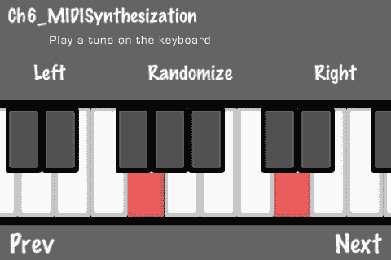

## 准备工作

请参考项目*RecipeCollection02*以获取此菜谱的完整工作代码。

## 如何做...

将`AudioToolbox`框架链接到你的项目中。现在，执行以下代码：

```swift
#import "MIDISampleGenerator.h"
static const int kWhiteKeyNumbers[] = { 0, 2, 4, 5, 7, 9, 11 };
static const int kWhiteKeyCount = sizeof(kWhiteKeyNumbers) / sizeof(int);
static const int kBlackKey1Numbers[] = { 1, 3 };
static const int kBlackKey1Count = sizeof(kBlackKey1Numbers) / sizeof(int);
static const int kBlackKey2Numbers[] = { 6, 8, 10 };
static const int kBlackKey2Count = sizeof(kBlackKey2Numbers) / sizeof(int);
@implementation Ch6_MIDISynthesization
-(CCLayer*) runRecipe {
//Init sample generator
sampleGenerator = [[MIDISampleGenerator alloc] init];
//Init keyboard
[self initKeyboard];
return self;
}
-(void) initKeyboard {
/* CODE OMITTED */
}
-(void) randomize:(id)sender {
//Randomize values including Modulation, Oscillation, Filter, etc
[sampleGenerator randomize];
}
-(bool) keyPressed:(CCSprite*)key withHash:(NSString*)hashKey {
//Set darker key color
[key setColor:ccc3(255,100,100)];
//Play note
[sampleGenerator noteOn:key.tag];
//Keep track of touch
[keyTouches setObject:[NSNumber numberWithInt:key.tag] forKey:hashKey];
return YES;
}
-(bool) keyReleased:(int)note remove:(bool)remove {
/* CODE OMITTED */
if(keyReleased){
//Stop playing note
[sampleGenerator noteOff:note];
//Remove tracking
if(remove){ [keyTouches removeObjectForKey:[NSNumber numberWithInt:note]]; }
}
return keyReleased;
}
@end

```

## 它是如何工作的...

这个菜谱让你能在虚拟键盘上播放两个**八度**的合成声音。

+   `MIDISampleGenerator`类：

    `MIDISampleGenerator`类是专门为这个菜谱创建的，以便模糊使用 MobileSynth 的一些更粗糙的细节。MobileSynth 库提供了一系列令人眼花缭乱的音效合成选项来生成声音。其中包括，仅举几个例子，调制、振荡、滤波、琶音以及一些与音量相关的效果。**随机化**按钮随机化这些效果中的一系列，以便用户能够快速轻松地了解合成化可能性的范围。

+   扩展合成器：

    想象一下，合成器可以扩展到将一首歌（一系列定时音符）记录到数据文件中，然后像自动钢琴一样将其输入合成器。这可以作为生成大量复古风格的电子游戏音乐的一种简单解决方案，而这些音乐不会占用太多空间（想想《Mega Man》）。同样的情况也适用于音效。

## 更多...

关于**MobileSynth**的更多信息，您可以访问他们的网站：[`code.google.com/p/mobilesynth/`](http://code.google.com/p/mobilesynth/)

# 语音识别和文本到语音

在机器学习、量子计算和 3D 打印的宿命组合孕育出统治全人类的暴政人工智能生命体之前，我们需要满足于半智能设备，这些设备是我们手动编程的。这个谜团中的重要部分是语言处理。在这个菜谱中，我们将使用**OpenEars**库让我们的 iOS 设备说话并识别一些基本的英语对话。

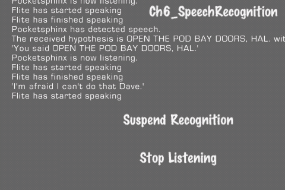

## 准备工作

由于使用**OpenEars**所需的库大小，这个菜谱有自己的项目。请参考项目*Ch6_SpeechRecognition*以获取此菜谱的完整工作代码。

## 如何做...

**OpenEars**的安装过程很复杂。其中之一是它需要配置四个其他库：**flite、pocketsphinx、sphinxbase**和**wince**。OpenEars 库本身是一个嵌入的 XCode 项目，该项目与你的项目静态链接。

建议您首先查看`Ch6_SpeechRecognition`项目。从那里，您可以仔细遵循[`www.politepix.com/openears/`](http://www.politepix.com/openears/)上列出的步骤来设置和配置示例项目。

在遵循“入门”和“为 OpenEars 配置你的应用”页面上的步骤之后，你可以转到“在应用中使用 OpenEars”页面。在这里，你将被告知创建一个**语料库**文件。这是一个包含我们希望 OpenEars 识别的所有单词和短语的文件。我们的语料库文件看起来像这样：

```swift
HELLO, HAL. DO YOU READ ME, HAL?
OPEN THE POD BAY DOORS, HAL.
WHAT'S THE PROBLEM?
WHAT ARE YOU TALKING ABOUT, HAL?
I DON'T KNOW WHAT YOU'RE TALKING ABOUT, HAL.
WHERE THE HELL'D YOU GET THAT IDEA, HAL?
ALRIGHT, HAL. I'LL GO IN THROUGH THE EMERGENCY AIRLOCK.
HAL, I WON'T ARGUE WITH YOU ANYMORE. OPEN THE DOORS.

```

然后，我们将此文件上传到卡内基梅隆大学提供的**Sphinx**知识库创建工具，网址为：[`www.speech.cs.cmu.edu/tools/lmtool-new.html`](http://www.speech.cs.cmu.edu/tools/lmtool-new.html)。该工具将为您生成多个文件。将`.lm`文件重命名为`.languagemodel`文件。同时下载`.dic`文件。按照以下说明将这些文件添加到您的项目中：[`www.politepix.com/openears/yourapp/`](http://www.politepix.com/openears/yourapp/)。

现在，我们已经准备好开始编码了。我们主要的代码片段将给用户一些自信的 HAL 9000 响应：

```swift
#import "cocos2d.h"
#import "AudioSessionManager.h"
#import "OpenEarsEventsObserver.h"
#import "PocketsphinxController.h"
#import "FliteController.h"
@interface MainLayer : CCLayer <OpenEarsEventsObserverDelegate>
{ /* CODE OMITTED */ }
@end
@implementation MainLayer
-(id) init
{
if( (self=[super init])) {
/* CODE OMITTED */
//Init AudioSessionManager and start session
audioSessionManager = [[AudioSessionManager alloc] init];
[audioSessionManager startAudioSession];
//Init pocketsphinx, flite and OpenEars
pocketsphinxController = [[PocketsphinxController alloc] init];
fliteController = [[FliteController alloc] init];
openEarsEventsObserver = [[OpenEarsEventsObserver alloc] init];
//Text to speech
[self say:@"Welcome to OpenEars."];
[self runAction:[CCSequence actions:[CCDelayTime actionWithDuration:4.0f],
[CCCallFunc actionWithTarget:self selector:@selector(welcomeMessage)], nil]];
//Start the Pocketsphinx continuous listening loop.
[pocketsphinxController startListening];
//Set this is an OpenEars observer delegate
[openEarsEventsObserver setDelegate:self];
/* CODE OMITTED */
}
return self;
}
-(void) welcomeMessage {
//Greet the user with a message about his pitiful human brain
[self say:@"Hello Dave. I've just picked up a fault in your brain. \nIt's going to go 100% failure in 72 hours. \nWould you like me to open the pod bay doors?"];
}
-(void) saySomething {
//Respond with a random response
int num = arc4random()%5;
if(num == 0){
[self say:@"This mission is too important for me to allow you to \njeopardize it Dave."];
}
/* CODE OMITTED */
}
-(void) say:(NSString*)str { /* CODE OMITTED */
//Have flite speak the message (text to speech)
[fliteController say:str];
}
-(void) suspendRecognition { /*CODE OMITTED */
//Suspend recognition
[pocketsphinxController suspendRecognition];
}
-(void) resumeRecognition { /* CODE OMITTED */
//Suspend recognition
[pocketsphinxController resumeRecognition];
}
-(void) stopListening { /* CODE OMITTED */
//Stop listening
[pocketsphinxController stopListening];
}
-(void) startListening { /* CODE OMITTED */
//Start listening
[pocketsphinxController startListening];
}
//Delivers the text of speech that Pocketsphinx heard and analyzed, along with its accuracy score and utterance ID.
- (void) pocketsphinxDidReceiveHypothesis:(NSString *)hypothesis recognitionScore:(NSString *)recognitionScore utteranceID:(NSString *)utteranceID {
//Display information
[self showMessage:[NSString stringWithFormat:@"The received hypothesis is %@ with a score of %@ and an ID of %@", hypothesis, recognitionScore, utteranceID]]; //Log it.
//Tell the user what we heard
[self say:[NSString stringWithFormat:@"You said %@",hypothesis]]; //React to it by telling our FliteController to say the heard phrase.
//Respond with a witty retort
[self runAction:[CCSequence actions:[CCDelayTime actionWithDuration:4.0f],
[CCCallFunc actionWithTarget:self selector:@selector(saySomething)], nil]];
}
@end

```

## 它是如何工作的...

尝试将语料库文件中的几行话输入到演示应用中。在安静的房间里，结果可以非常准确。

+   实例化音频会话、控制器和观察者：

    在我们能够做任何事情之前，我们需要实例化音频会话以及提供文本到语音和语音识别功能的三个控制器：

    ```swift
    audioSessionManager = [[AudioSessionManager alloc] init];
    [audioSessionManager startAudioSession];
    pocketsphinxController = [[PocketsphinxController alloc] init];
    fliteController = [[FliteController alloc] init];
    openEarsEventsObserver = [[OpenEarsEventsObserver alloc] init];

    ```

    `PocketsphinxController`对象提供了语音识别 API。`FliteController`对象提供了文本到语音 API。最后，`OpenEarsEventsObserver`提供了一个协议，代表两个控制器进行回调。

+   使用 FliteController：

    `FliteController` API 非常简单直接。只需调用 say 方法，Flite 将通过默认音频通道生成计算机语音。

+   使用 PocketsphinxController：

    `PocketsphinxController` API 允许您使用以下四个方法来管理 Pocketsphinx 何时监听以及何时积极尝试识别语音：

    ```swift
    [pocketsphinxController suspendRecognition];
    [pocketsphinxController resumeRecognition];
    [pocketsphinxController stopListening];
    [pocketsphinxController startListening];

    ```

    这种基本级别的控制让您能够管理何时使用处理器时间实际尝试识别语音模式。

+   `OpenEarsEventsObserverDelegate`协议：

    此协议负责代表`PocketsphinxController`和`FliteController`调用多个方法。需要特别注意的重要方法是主 Pocketsphinx 语音识别假设方法。这将告诉你 Pocketsphinx 听到了什么，并且还会给它一个置信度分数：

    ```swift
    - (void) pocketsphinxDidReceiveHypothesis:(NSString *)hypothesis recognitionScore:(NSString *)recognitionScore utteranceID:(NSString *)utteranceID;

    ```

    当 Pocketsphinx 正在监听并尝试识别时，此方法将由任何离散声音触发。然而，您可以使用`recognitionScore`来过滤掉背景噪音和其他
