# 第七章。AI 和逻辑

在本章中，我们将涵盖以下内容：

+   处理 AI 路标

+   向移动目标发射弹丸

+   AI 视线

+   使用 Boids 进行 AI 群集

+   在网格上进行 A*路径查找

+   在 Box2D 世界中进行 A*路径查找

+   在 TMX 瓦片地图上进行 A*路径查找

+   在横版滚动游戏中进行 A*路径查找

+   运行 Lua 脚本

+   动态加载 Lua 脚本

+   使用 Lua 进行对话树

# 简介

所有模拟智能行为的游戏都使用一种形式的**人工智能**（AI）。根据不同的游戏玩法需求，使用不同的技术来模拟行为。在本章中，我们将实现其中的一些技术。

# 处理 AI 路标

最基本的 AI 过程之一涉及在物理环境中移动 AI 演员。为此，我们将创建一个**队列**的**路标**。每个路标代表我们希望演员移动到的下一个位置。

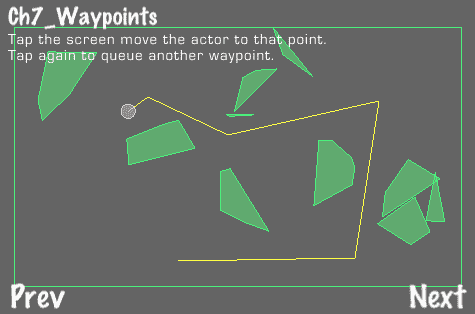

## 准备工作

请参阅项目*RecipeCollection03*以获取此菜谱的完整工作代码。

## 如何做到这一点...

执行以下代码：

```swift
#import "GameWaypoint.h"
@interface GameActor : GameObject {
NSMutableArray *waypoints;
float runSpeed;
}
@end
@implementation GameActor
-(void) processWaypoints {
bool removeFirstWaypoint = NO;
//The actor's position onscreen
CGPoint worldPosition = CGPointMake(self.body->GetPosition().x * PTM_RATIO, self.body->GetPosition().y * PTM_RATIO);
//Process waypoints
for(GameWaypoint *wp in waypoints){
float distanceToNextPoint = [GameHelper distanceP1:worldPosition toP2:CGPointMake(wp.position.x, wp.position.y)];
//If we didn't make progress to the next point, increment timesBlocked
if(distanceToNextPoint >= wp.lastDistance){
timesBlocked++;
//Drop this waypoint if we failed to move a number of times
if(timesBlocked > TIMES_BLOCKED_FAIL){
distanceToNextPoint = 0.0f;
}
}else{
//If we are just starting toward this point we run our pre-callback
wp.lastDistance = distanceToNextPoint;
[wp processPreCallback];
}
//If we are close enough to the waypoint we move onto the next one
if(distanceToNextPoint <= WAYPOINT_DIST_THRESHOLD){
removeFirstWaypoint = YES;
[self stopRunning];
//Run post callback
[wp processPostCallback];
}else{
//Keep running toward the waypoint
float speedMod = wp.speedMod;
//Slow down close to the waypoint
if(distanceToNextPoint < [self runSpeed]/PTM_RATIO){
speedMod = (distanceToNextPoint)/([self runSpeed]/PTM_RATIO);
}
[self runWithVector:ccp(wp.position.x - worldPosition.x, wp.position.y - worldPosition.y) withSpeedMod:speedMod withConstrain:NO ];
break;
}
}
if(removeFirstWaypoint){
[waypoints removeObjectAtIndex:0];
timesBlocked = 0;
}
}
@end
@implementation Ch7_Waypoints
-(CCLayer*) runRecipe {
//Add polygons
[self addRandomPolygons:10];
//Create Actor
[self addActor];
/* CODE OMITTED */
return self;
}
-(void) step: (ccTime) dt {
[super step:dt];
//Process actor waypoints
[actor processWaypoints];
//Turn actor toward next waypoint
if(actor.waypoints.count > 0){
CGPoint movementVector = ccp(actor.body->GetLinearVelocity().x, actor.body->GetLinearVelocity().y);
actor.body->SetTransform(actor.body->GetPosition(), -1 * [GameHelper vectorToRadians:movementVector] + PI_CONSTANT/2);
}
}
/* Draw all waypoint lines */
-(void) drawLayer {
glColor4ub(255,255,0,32);
CGPoint actorPosition = ccp(actor.body->GetPosition().x*PTM_RATIO, actor.body->GetPosition().y*PTM_RATIO);
if(actor.waypoints.count == 1){
GameWaypoint *gw = (GameWaypoint*)[actor.waypoints objectAtIndex:0];
ccDrawLine(actorPosition, gw.position);
}else if(actor.waypoints.count > 1){
for(int i=0; i<actor.waypoints.count-1; i++){
GameWaypoint *gw = (GameWaypoint*)[actor.waypoints objectAtIndex:i];
GameWaypoint *gwNext = (GameWaypoint*)[actor.waypoints objectAtIndex:i+1];
if(i == 0){
//From actor to first waypoint
ccDrawLine(actorPosition, gw.position);
ccDrawLine(gw.position, gwNext.position);
}else{
//From this waypoint to next one
ccDrawLine(gw.position, gwNext.position);
}
}
}
glColor4ub(255,255,255,255);
}
/* Add a new waypoint when you touch the screen */
-(void) tapWithPoint:(CGPoint)point {
ObjectCallback *goc1 = [ObjectCallback createWithObject:self withCallback:@"movingToWaypoint"];
ObjectCallback *goc2 = [ObjectCallback createWithObject:self withCallback:@"reachedWaypoint"];
GameWaypoint *wp = [GameWaypoint createWithPosition:[self convertTouchCoord:point] withSpeedMod:1.0f];
wp.preCallback = goc1;
wp.postCallback = goc2;
[actor addWaypoint:wp];
}
@end

```

## 它是如何工作的...

路标处理涉及在每一步将演员移动到下一个路标。如果演员停止向下一个点前进，则该点将被丢弃。

+   `GameWaypoint：`

    `GameWaypoint`类包含多个变量，其中最重要的是路标的位置以及演员应该以多快的速度移动到该点。

+   处理路标：

    `GameActor`类中存储了一个`GameWaypoint`对象列表。在每一帧中都会调用`processWaypoints`方法。这会将演员移动到下一个路标。此过程的伪代码如下：

    ```swift
    for all waypoints
    if we didn't make progress, increment timesBlocked
    if we have reached this waypoint we remove it and move to the next
    else keep running toward this waypoint and break the loop

    ```

    使用这种基本逻辑，我们在 2D 空间中将演员移动到每个后续路标。

+   `ObjectCallback：`

    包含了额外的功能，允许在演员到达特定路标前后进行方法回调。这些使用`ObjectCallback`类，该类简单地使用以下行在现有类上调用方法：

    ```swift
    [preCallback.obj performSelector:NSSelectorFromString(preCallback.callback)];

    ```

    这使我们能够结合逻辑和 AI 角色移动。

+   使用凸包算法创建随机多边形：

    为了用随机生成的多边形填充我们的物理世界，我们使用单调链凸包算法生成我们的多边形顶点：

    ```swift
    NSMutableArray *convexPolygon = [GameHelper convexHull:points];

    ```

    此方法接受一组随机生成的点，并返回围绕这些点的顶点数组。尽管我们使用这个算法的原因相当简单，但该算法还有许多其他应用，从简单的 AI 到高级计算机视觉。有关此算法的更多信息，请参阅此处：[`en.wikibooks.org/wiki/Algorithm_Implementation/Geometry/Convex_hull/Monotone_chain`](http://en.wikibooks.org/wiki/Algorithm_Implementation/Geometry/Convex_hull/Monotone_chain)。

# 向移动目标发射弹丸

为了使人工智能演员能够与环境进行真实交互，它们必须进行人类玩家自然做出的计算。一种常见的交互涉及向移动目标发射投射物。

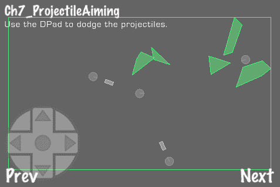

## 准备工作

请参阅项目*RecipeCollection03*以获取此菜谱的完整工作代码。

## 如何做...

执行以下代码：

```swift
@implementation Ch7_ProjectileAiming
-(void) step: (ccTime) dt {
[super step:dt];
/* CODE OMITTED */
//Firing projectiles
fireCount += dt;
if(fireCount > 1.0f){
fireCount = 0;
[self fireMissiles];
}
}
/* Each enemy fires a missile object */
-(void) fireMissiles {
for(int i=0; i<enemies.count; i++){
GameActor *enemy = [enemies objectAtIndex:i];
//Create missile
GameMisc *missile = [[GameMisc alloc] init];
missile.gameArea = self;
missile.tag = GO_TAG_MISSILE;
missile.bodyDef->type = b2_dynamicBody;
missile.bodyDef->position.Set( enemy.body->GetPosition().x, enemy.body->GetPosition().y );
missile.bodyDef->userData = missile;
missile.body = world->CreateBody(missile.bodyDef);
missile.polygonShape = new b2PolygonShape();
missile.polygonShape->SetAsBox(0.5f, 0.2f);
missile.fixtureDef->density = 10.0f;
missile.fixtureDef->shape = missile.polygonShape;
missile.fixtureDef->filter.categoryBits = CB_MISSILE;
missile.fixtureDef->filter.maskBits = CB_EVERYTHING & ~CB_MISSILE & ~CB_ENEMY;
missile.body->CreateFixture(missile.fixtureDef);
//Calculate intercept trajectory
Vector3D *point = [self interceptSrc:missile dst:actor projSpeed:20.0f];
if(point){
//Align missile
CGPoint pointToFireAt = CGPointMake(point.x, point.y);
CGPoint directionVector = CGPointMake(pointToFireAt.x - missile.body->GetPosition().x, pointToFireAt.y - missile.body->GetPosition().y);
float radians = [GameHelper vectorToRadians:directionVector];
missile.body->SetTransform(missile.body->GetPosition(), -1 * radians + PI_CONSTANT/2);
//Fire missile
CGPoint normalVector = [GameHelper radiansToVector:radians];
missile.body->SetLinearVelocity( b2Vec2(normalVector.x*20.0f, normalVector.y*20.0f) );
}
[missiles addObject:missile];
}
}
/* Find the intercept angle given projectile speed and a moving target */
-(Vector3D*) interceptSrc:(GameObject*)src dst:(GameObject*)dst projSpeed:(float)projSpeed {
float tx = dst.body->GetPosition().x - src.body->GetPosition().x;
float ty = dst.body->GetPosition().y - src.body->GetPosition().y;
float tvx = dst.body->GetLinearVelocity().x;
float tvy = dst.body->GetLinearVelocity().y;
//Get quadratic equation components
float a = tvx*tvx + tvy*tvy - projSpeed*projSpeed;
float b = 2 * (tvx * tx + tvy * ty);
float c = tx*tx + ty*ty;
//Solve quadratic equation
Vector3D *ts = [GameHelper quadraticA:a B:b C:c];
//Find the smallest positive solution
Vector3D *solution = nil;
if(ts){
float t0 = ts.x;
float t1 = ts.y;
float t = MIN(t0,t1);
if(t < 0){ t = MAX(t0,t1); }
if(t > 0){
float x = dst.body->GetPosition().x + dst.body->GetLinearVelocity().x*t;
float y = dst.body->GetPosition().y + dst.body->GetLinearVelocity().y*t;
solution = [Vector3D x:x y:y z:0];
}
}
return solution;
}
@end

```

## 它是如何工作的...

在这个菜谱中，我们创建了三个向玩家发射投射物的敌对演员。每个投射物都以足够的速度和方向发射，即使玩家在移动也能击中玩家。

+   计算拦截轨迹：

    如果我们给出了演员和敌人的位置、速度以及我们可以发射投射物的速度，我们可以通过为玩家和投射物创建一个距离随时间变化的方程来计算'拦截角度'。然后我们使用**二次方程**来找到这些线相交的时间。公式如下：

    ```swift
    x = (-b +/- sqrt(b2 - 4ac)) / 2a

    ```

    为了得到 a、b 和 c 变量，我们进行以下操作，其中`tx`和`ty`是位置向量的分量，`tvx`和`tvy`是速度向量的分量：

    ```swift
    float a = tvx*tvx + tvy*tvy - projSpeed*projSpeed;
    float b = 2 * (tvx * tx + tvy * ty);
    float c = tx*tx + ty*ty;

    ```

    然后我们使用我们的`GameHelper`二次方程法：

    ```swift
    Vector3D *ts = [GameHelper quadraticA:a B:b C:c];

    ```

    二次方法返回一个`Vector3D`对象，以便在`NSObject`内部方便地存储两个浮点原语。如果对象为 nil，则公式的判别式为`<= 0.0f`。否则，我们取最小的非零解。我们使用这个来最终计算发射解决方案：

    ```swift
    float x = dst.body->GetPosition().x + dst.body->GetLinearVelocity().x*t;
    float y = dst.body->GetPosition().y + dst.body->GetLinearVelocity().y*t;
    solution = [Vector3D x:x y:y z:0];

    ```

    投射物可以以最初指定的速度向这个方向发射。如果移动目标保持航向，投射物将与之相撞。

+   使用布尔代数进行 Box2D 过滤：

    就像在第四章“物理”中一样，这里我们使用类别位和掩码位来防止某些物理对象类型相撞。在这个菜谱中，我们通过使用'一切位'（0xFFFF）以及一些更高级的布尔逻辑来扩展我们对这种技术的使用：

    ```swift
    missile.fixtureDef->filter.categoryBits = CB_MISSILE;
    missile.fixtureDef->filter.maskBits = CB_EVERYTHING & ~CB_MISSILE & ~CB_ENEMY;

    ```

    这可以防止导弹与发射它们的敌人相撞，以及彼此相撞。

# 人工智能视线

人类使用五种不同的感官与环境互动。其中之一，视觉，是计算机科学的一个分支，称为**计算机视觉**。在这个例子中，我们使用**射线投射**在 Box2D 环境中实现基本的视觉测试，以查看玩家和敌对人工智能演员之间是否有其他对象。

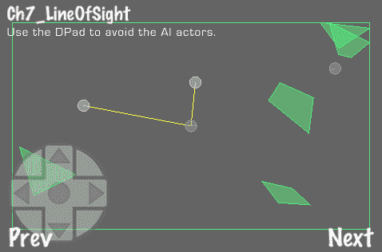

## 准备工作

请参阅项目*RecipeCollection03*以获取此菜谱的完整工作代码。

## 如何做...

执行以下代码：

```swift
class RayCastAnyCallback : public b2RayCastCallback
{
public:
RayCastAnyCallback()
{
m_hit = false;
}
float32 ReportFixture( b2Fixture* fixture, const b2Vec2& point,
const b2Vec2& normal, float32 fraction)
{
b2Body* body = fixture->GetBody();
void* userData = body->GetUserData();
if (userData)
{
int32 index = *(int32*)userData;
if (index == 0)
{
// filter
return -1.0f;
}
}
m_hit = true;
m_point = point;
m_normal = normal;
m_fraction = fraction;
m_fixture = fixture;
return 0.0f;
}
bool m_hit;
b2Vec2 m_point;
b2Vec2 m_normal;
float32 m_fraction;
b2Fixture *m_fixture;
};
@implementation Ch7_LineOfSight
-(void) step: (ccTime) dt {
[super step:dt];
/* CODE OMITTED */
//Make the enemies follow the actor
[self followActorWithEnemies];
}
-(void) followActorWithEnemies {
//If enemies can see the actor they follow
for(int i=0; i<enemies.count; i++){
//Align enemies
GameActor *enemy = [enemies objectAtIndex:i];
CGPoint directionVector = CGPointMake(actor.body->GetPosition().x - enemy.body->GetPosition().x, actor.body->GetPosition().y - enemy.body->GetPosition().y);
float radians = [GameHelper vectorToRadians:directionVector];
enemy.body->SetTransform(enemy.body->GetPosition(), -1 * radians + PI_CONSTANT/2);
RayCastClosestCallback callback;
world->RayCast(&callback, enemy.body->GetPosition(), actor.body->GetPosition());
//Did the raycast hit anything?
enemy.tag = 0; //Assume it didn't
//Note that in this case we are using the 'tag' property for something other than its intended purpose.
if(callback.m_hit){
//Is the closest point the actor?
if(callback.m_fixture->GetBody() == actor.body){
//If so, follow the actor
b2Vec2 normal = b2Vec2( callback.m_normal.x * -5.0f, callback.m_normal.y * -5.0f);
enemy.body->ApplyForce(normal, actor.body->GetPosition());
enemy.tag = 1; //Set seeing flag to true
}
}
}
}
/* Draw each enemy 'sight line' if they can see you */
-(void) drawLayer {
for(int i=0; i<enemies.count; i++){
GameActor *enemy = [enemies objectAtIndex:i];
if(enemy.tag == 1){
glColor4ub(255,255,0,32);
CGPoint actorPosition = ccp(actor.body->GetPosition().x*PTM_RATIO, actor.body->GetPosition().y*PTM_RATIO);
CGPoint enemyPosition = ccp(enemy.body->GetPosition().x*PTM_RATIO, enemy.body->GetPosition().y*PTM_RATIO);
ccDrawLine(actorPosition, enemyPosition);
glColor4ub(255,255,255,255);
}
}
}
@end

```

## 它是如何工作的...

当可以在敌对演员和玩家之间画一条直线而不穿过关卡几何时，我们认为玩家对敌人来说是可见的，然后敌人开始跟随玩家。

+   使用`RayCastClosest：`

    我们使用以下方法对 Box2D 世界执行射线测试：

    ```swift
    RayCastClosestCallback callback;
    world->RayCast(&callback, enemy.body->GetPosition(), actor.body->GetPosition());

    ```

    类 `RayCastClosestCallback` 封装了类 `b2RayCastCallback`。当我们调用 `RayCast` 方法并传入这个类的实例时，我们就能判断我们的射线是否触碰到一个 Box2D 几何体。它还维护了一个指向它首次接触到的几何体的指针。这是离我们的源点最近的几何体。

+   过滤掉第一个找到的几何体：

    由于射线投射通常涉及从一个几何体向另一个几何体投射，所以第一个找到的几何体会被过滤掉。

+   `RayCast.h:`

    我们的 `RayCast.h` 文件还包含类 `RayCastAnyCallback` 和 `RayCastMultipleCallback`。`any` 类在射线上找到任何几何体，而 `multiple` 类维护一个几何体列表。

## 还有更多...

射线投射有许多用途。一个简单的例子是掩体机制。当敌人感到脆弱时，它可以找到玩家无法看穿的最近的几何体。另一个用途涉及到使用射线投射返回的 **法线** 点。这是与指定几何体碰撞的确切点。这可以用来创建激光武器或瞬间子弹冲击。

# 使用 Boids 的 AI 鸟群

通过在游戏中放置更多的敌人，我们开始需要一些基于群体的 AI。在视频游戏和电影中广泛使用的一个流行算法是 **Boids** 算法。它模拟 **鸟群** 行为。在这个菜谱中，我们将创建大量聚集在一起并追逐玩家的敌人。

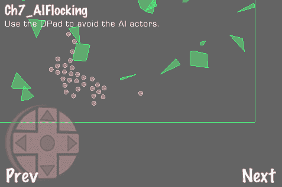

## 准备工作

请参考项目 *RecipeCollection03* 以获取此菜谱的完整工作代码。

## 如何做到这一点...

执行以下代码：

```swift
@interface Ch7_AIFlocking : Ch7_LineOfSight {}
/* CODE OMITTED */
@end
@implementation Ch7_AIFlocking
-(void) step:(ccTime)delta {
[super step:delta];
//Process the 'boids' flocking algorithm
[self processBoids];
}
/* Make the flock of 'boids' follow the actor */
-(void) followActorWithEnemies {
//All enemies constantly follow the actor
for(int i=0; i<enemies.count; i++){
//Align enemies
GameActor *enemy = [enemies objectAtIndex:i];
CGPoint directionVector = CGPointMake(actor.body->GetPosition().x - enemy.body->GetPosition().x, actor.body->GetPosition().y - enemy.body->GetPosition().y);
float radians = [GameHelper vectorToRadians:directionVector];
enemy.body->SetTransform(enemy.body->GetPosition(), -1 * radians + PI_CONSTANT/2);
b2Vec2 normal = actor.body->GetPosition() - enemy.body->GetPosition();
CGPoint vector = ccp(normal.x, normal.y);
CGPoint normalVector = [GameHelper radiansToVector:[GameHelper vectorToRadians:vector]];
//If so, follow the actor
b2Vec2 v = enemy.body->GetLinearVelocity();
enemy.body->SetLinearVelocity(b2Vec2(v.x + normalVector.x*0.2f, v.y + normalVector.y*0.2f));
}
}
/* Process boids algorithm */
-(void) processBoids {
for(int i=0; i<enemies.count; i++){
GameActor *b = [enemies objectAtIndex:i];
b2Vec2 v1 = b2Vec2(0,0);
b2Vec2 v2 = b2Vec2(0,0);
b2Vec2 v3 = b2Vec2(0,0);
v1 = [self boidRule1:b];
v2 = [self boidRule2:b];
v3 = [self boidRule3:b];
b2Vec2 v = b.body->GetLinearVelocity();
b2Vec2 newV = v+v1+v2+v3;
/* Limit velocity */
float vLimit = 7.5f;
b2Vec2 absV = b2Vec2([GameHelper absoluteValue:newV.x], [GameHelper absoluteValue:newV.y]);
if(absV.x > vLimit || absV.y > vLimit){
float ratio;
if(absV.x > absV.y){
ratio = vLimit / absV.x;
}else{
ratio = vLimit / absV.y;
}
newV = b2Vec2( newV.x*ratio, newV.y*ratio );
}
b.body->SetLinearVelocity(newV);
}
}
/* Clump the Boids together */
-(b2Vec2) boidRule1:(GameActor*)bJ {
//The variable 'pcJ' represents the center point of the flock
b2Vec2 pcJ = b2Vec2(0,0);
float N = enemies.count;
//Add up all positions
for(int i=0; i<enemies.count; i++){
GameActor *b = [enemies objectAtIndex:i];
if(b != bJ){
pcJ += b.body->GetPosition();
}
}
//Average them out
pcJ = b2Vec2(pcJ.x/(N-1), pcJ.y/(N-1));
//Return 1/100 of the velocity required to move to this point
return b2Vec2( (pcJ.x - bJ.body->GetPosition().x)/100.0f, (pcJ.y - bJ.body->GetPosition().y)/100.0f );
}
/* Keep the Boids apart from each other */
-(b2Vec2) boidRule2:(GameActor*)bJ {
//Set optimal distance boids should keep between themselves (padding)
float padding = 1.5f;
//The variable 'c' represents the velocity required to move away from any other boids in this one's personal space
b2Vec2 c = b2Vec2(0,0);
//If an ememy is too close we add velocity required to move away from it
for(int i=0; i<enemies.count; i++){
GameActor *b = [enemies objectAtIndex:i];
if(b != bJ){
CGPoint bPos = ccp(b.body->GetPosition().x, b.body->GetPosition().y);
CGPoint bJPos = ccp(bJ.body->GetPosition().x, bJ.body->GetPosition().y);
if([GameHelper distanceP1:bPos toP2:bJPos] < padding){
c = c - (b.body->GetPosition() - bJ.body->GetPosition());
}
}
}
return c;
}
/* Match up all Boid velocities */
-(b2Vec2) boidRule3:(GameActor*)bJ {
//The variable 'pvJ' represents the total velocity of all the boids combined
b2Vec2 pvJ = b2Vec2(0,0);
//Get the total velocity
for(int i=0; i<enemies.count; i++){
GameActor *b = [enemies objectAtIndex:i];
if(b != bJ){
pvJ += b.body->GetLinearVelocity();
}
}
//Get this boid's velocity
b2Vec2 v = bJ.body->GetLinearVelocity();
//Return the difference averaged out over the flock then divided by 30
return b2Vec2((pvJ.x - v.x)/30.0f/enemies.count, (pvJ.y - v.y)/30.0f/enemies.count);
}
@end

```

## 它是如何工作的...

Boids 算法使用一些简单概念来创建逼真的角色鸟群。它使用三个规则，在每个帧上作用于每个角色的速度。这些规则调整它们的行为，以保持鸟群而不过度影响其他力量。

+   **Boids 规则 1—保持** 鸟群在一起：

    为了使角色鸟群保持在一起，我们首先通过平均所有角色的位置来获取鸟群的重心。然后我们调整角色的速度，使每个角色向鸟群中心移动 1%。

+   **Boids 规则 2—给予** 角色一些个人空间：

    为了防止鸟群过于聚集，我们检查每个角色。如果某个角色在某个空间阈值内还有其他角色，那么我们就将这个角色移动到离其他角色这个距离。当这个操作应用于所有角色时，就会达到一个良好的平衡。

+   **Boids 规则 3—匹配** 所有角色的速度：

    最后，所有角色应该以大致相同的速度一起移动。在规则 1 中，我们平均了所有角色的位置。在这个规则中，我们平均了所有角色的速度，然后给每个角色加上该速度的分数（1/30）。这确保了所有角色的均匀移动速度。

+   将角色移动到玩家身边：

    将敌人角色移动到玩家身边涉及找到指向玩家的归一化向量，然后将该向量与一定大小的向量相加到角色的线性速度上：

    ```swift
    enemy.body->SetLinearVelocity(b2Vec2(v.x + normalVector.x*0.2f, v.y + normalVector.y*0.2f));

    ```

    我们还限制了每个角色的速度，以防止它们快速冲向一个方向：

    ```swift
    float vLimit = 7.5f;
    b2Vec2 absV = b2Vec2([GameHelper absoluteValue:newV.x], [GameHelper absoluteValue:newV.y]);
    if(absV.x > vLimit || absV.y > vLimit){
    float ratio;
    if(absV.x > absV.y){
    ratio = vLimit / absV.x;
    }else{
    ratio = vLimit / absV.y;
    }
    newV = b2Vec2( newV.x*ratio, newV.y*ratio );
    }
    b.body->SetLinearVelocity(newV);

    ```

    当所有这些方法结合在一起时，我们得到一个逼真的群聚效果，适用于鸟群、蜜蜂，甚至僵尸。

# 网格上的 A* 寻路

一个经典视频游戏问题就是寻路问题。在游戏过程中，智能角色通常需要绕过障碍物进行导航。**A* 搜索算法**（也称为**A 星**）通常用于通过有效地遍历构建的节点图来解决寻路问题。在这个菜谱中，我们将演示基于网格的 A* 寻路。

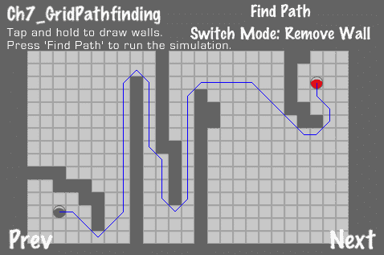

## 准备工作

请参阅项目 *RecipeCollection03* 以获取此菜谱的完整工作代码。

## 如何操作...

执行以下代码：

```swift
/* AStarNode */
@interface AStarNode : NSObject
{
CGPoint position; //The node's position on our map
NSMutableArray *neighbors; //An array of neighbor AStarNode objects
bool active; //Is this node active?
float costMultiplier; //Use this to multiply the normal cost to reach this node.
}
@end
@implementation AStarNode
/* Cost to node heuristic */
-(float) costToNode:(AStarNode*)node {
CGPoint src = ccp(self.position.x, self.position.y);
CGPoint dst = ccp(node.position.x, node.position.y);
float cost = [GameHelper distanceP1:src toP2:dst] * node.costMultiplier;
return cost;
}
@end
/* AStarPathNode */
@interface AStarPathNode : NSObject
{
AStarNode *node; //The actual node this "path" node points to
AStarPathNode *previous; //The previous node on our path
float cost; //The cumulative cost of reaching this node
}
@end
@implementation AStarPathNode
/* Our implementation of the A* search algorithm */
+(NSMutableArray*) findPathFrom:(AStarNode*)fromNode to:(AStarNode*)toNode {
NSMutableArray *foundPath = [[NSMutableArray alloc] init];
if(fromNode.position.x == toNode.position.x && fromNode.position.y == toNode.position.y){
return nil;
}
NSMutableArray *openList = [[[NSMutableArray alloc] init] autorelease];
NSMutableArray *closedList = [[[NSMutableArray alloc] init] autorelease];
AStarPathNode *currentNode = nil;
AStarPathNode *aNode = nil;
AStarPathNode *startNode = [AStarPathNode createWithAStarNode:fromNode];
AStarPathNode *endNode = [AStarPathNode createWithAStarNode:toNode];
[openList addObject:startNode];
while(openList.count > 0){
currentNode = [AStarPathNode lowestCostNodeInArray:openList];
if( currentNode.node.position.x == endNode.node.position.x &&
currentNode.node.position.y == endNode.node.position.y){
//Path Found!
aNode = currentNode;
while(aNode.previous != nil){
//Mark path
[foundPath addObject:[NSValue valueWithCGPoint: CGPointMake(aNode.node.position.x, aNode.node.position.y)]];
aNode = aNode.previous;
}
[foundPath addObject:[NSValue valueWithCGPoint: CGPointMake(aNode.node.position.x, aNode.node.position.y)]];
return foundPath;
}else{
//Still searching
[closedList addObject:currentNode];
[openList removeObject:currentNode];
for(int i=0; i<currentNode.node.neighbors.count; i++){
AStarPathNode *aNode = [AStarPathNode createWithAStarNode:[currentNode.node.neighbors objectAtIndex:i]];
aNode.cost = currentNode.cost + [currentNode.node costToNode:aNode.node] + [aNode.node costToNode:endNode.node];
aNode.previous = currentNode;
if(aNode.node.active && ![AStarPathNode isPathNode:aNode inList:openList] && ![AStarPathNode isPathNode:aNode inList:closedList]){
[openList addObject:aNode];
}
}
}
}
//No Path Found
return nil;
}
@end
/* Ch7_GridPathfinding */
@implementation Ch7_GridPathfinding
-(CCLayer*) runRecipe {
//Initial variables
gridSize = ccp(25,15);
nodeSpace = 16.0f;
touchedNode = ccp(0,0);
startCoord = ccp(2,2);
endCoord = ccp(gridSize.x-3, gridSize.y-3);
foundPath = [[NSMutableArray alloc] init];
//Create 2D array (grid)
grid = [[NSMutableArray alloc] initWithCapacity:((int)gridSize.x)];
for(int x=0; x<gridSize.x; x++){
[grid addObject:[[NSMutableArray alloc] initWithCapacity:((int)gridSize.y)]];
}
//Create AStar nodes and place them in the grid
for(int x=0; x<gridSize.x; x++){
for(int y=0; y<gridSize.y; y++){
//Add a node
AStarNode *node = [[AStarNode alloc] init];
node.position = ccp(x*nodeSpace + nodeSpace/2, y*nodeSpace + nodeSpace/2);
[[grid objectAtIndex:x] addObject:node];
}
}
//Add neighbor nodes
for(int x=0; x<gridSize.x; x++){
for(int y=0; y<gridSize.y; y++){
//Add a node
AStarNode *node = [[grid objectAtIndex:x] objectAtIndex:y];
//Add self as neighbor to neighboring nodes
[self addNeighbor:node toGridNodeX:x-1 Y:y-1]; //Top-Left
[self addNeighbor:node toGridNodeX:x-1 Y:y]; //Left
[self addNeighbor:node toGridNodeX:x-1 Y:y+1]; //Bottom-Left
[self addNeighbor:node toGridNodeX:x Y:y-1]; //Top
[self addNeighbor:node toGridNodeX:x Y:y+1]; //Bottom
[self addNeighbor:node toGridNodeX:x+1 Y:y-1]; //Top-Right
[self addNeighbor:node toGridNodeX:x+1 Y:y]; //Right
[self addNeighbor:node toGridNodeX:x+1 Y:y+1]; //Bottom-Right
}
}
/* CODE OMITTED */
return self;
}
/* Find a path from the startNode to the endNode */
-(void) findPath:(id)sender {
AStarNode *startNode = [[grid objectAtIndex:(int)startCoord.x] objectAtIndex:(int)startCoord.y];
AStarNode *endNode = [[grid objectAtIndex:(int)endCoord.x] objectAtIndex:endCoord.y];
if(foundPath){
[foundPath removeAllObjects];
[foundPath release];
}
foundPath = nil;
//Run the pathfinding algorithm
foundPath = [AStarPathNode findPathFrom:startNode to:endNode];
if(!foundPath){
[self showMessage:@"No Path Found"];
}else{
[self showMessage:@"Found Path"];
}
}
/* Helper method for adding neighbor nodes */
-(void) addNeighbor:(AStarNode*)node toGridNodeX:(int)x Y:(int)y {
if(x >= 0 && y >= 0 && x < gridSize.x && y < gridSize.y){
AStarNode *neighbor = [[grid objectAtIndex:x] objectAtIndex:y];
[node.neighbors addObject:neighbor];
}
}
@end

```

## 它是如何工作的...

A* 算法使用启发式方法在节点图上执行最佳优先搜索。首先，我们必须创建这个节点图。

+   `AStarNode:`

    节点图由一组节点组成，每个节点代表一个现实世界的位置。这被封装在 `AStarNode` 类中。

+   存储节点：

    对于这个菜谱，我们将我们的节点存储在一个嵌套的 2D `NSArray` 结构中。这不是 A* 算法所必需的，而仅仅是一个用于存储节点的约定。有了这个结构，我们可以快速识别到点的最近 `AStarNode`。我们还可以以简单、逻辑的方式将节点相互连接。

+   连接节点：

    通过每个节点维护其相邻节点列表的方式将节点相互连接。在这个网格设置中，每个节点以八个不同方向链接到八个其他节点。为了移除对角线移动，节点将只在四个方向上连接而不是八个。

+   创建“墙壁”：

    在这个菜谱中，较暗色的“墙壁”代表不可导航的区域。这些节点简单地设置为 `active = NO`。当运行 A* 算法时，它们会被跳过。

+   `AStarPathNode:`

    用于查找和存储最佳路径的数据结构是一个由 `AStarPathNode` 对象组成的链表。此类存储一个节点、前一个节点以及从该节点到目标的总估计成本。

+   寻找路径：

    一旦我们的节点创建并连接起来，我们就调用以下方法来寻找路径：

    ```swift
    +(NSMutableArray*) findPathFrom:(AStarNode*)fromNode to:(AStarNode*)toNode;

    ```

    这执行了对最佳路径的贪婪最佳优先搜索。使用的贪婪启发式是简单的“鸟飞”距离到目标的绝对值：

    ```swift
    /* Cost to node heuristic */
    -(float) costToNode:(AStarNode*)node {
    CGPoint src = ccp(self.position.x, self.position.y);
    CGPoint dst = ccp(node.position.x, node.position.y);
    float cost = [GameHelper distanceP1:src toP2:dst] * node.costMultiplier;
    return cost;
    }

    ```

    根据与节点图构建相关的假设以及它与移动成本的关系，可以使用其他启发式方法。例如，一个小的改进可能是使用节点到目标的斜边距离而不是绝对 2D 空间距离。如果我们禁用对角线移动，那么我们就会想使用曼哈顿启发式方法来估计网格上的移动成本。

## 更多内容...

`AStarNode`类包含一个`costModifier`变量。这可以用来增加对这个特定节点的相对成本。一个增加移动成本的节点可以代表像泥地或浅水这样的崎岖地形。其他 AI 概念也可以混合到路径查找算法中。例如，一个特定的区域或节点组可能比其他区域或节点组更危险。AI 演员在确定路径时必须权衡速度与危险。

# 在 Box2D 世界中进行 A*路径查找

A*算法的真正乐趣在于将其应用于更复杂的场景。在这个菜谱中，我们将将上一个菜谱的基于网格的技术应用于充满随机生成多边形的 Box2D 世界。


## 准备中

请参考项目 *RecipeCollection03* 以获取此菜谱的完整工作代码。

## 如何操作...

执行以下代码：

```swift
@interface Ch7_Box2DPathfinding : GameArea2D
{
NSMutableArray *grid;
float nodeSpace; //The space between each node, increase this to increase A* efficiency at the cost of accuracy
int gridSizeX;
int gridSizeY;
}
@end
@implementation Ch7_Box2DPathfinding
-(CCLayer*) runRecipe {
//Initial variables
nodeSpace = 32.0f;
actorRadius = nodeSpace/PTM_RATIO/3;
/* CODE OMITTED */
//Remove neighbors from positive TestPoint and RayCast tests
for(int x=0; x<gridSizeX; x++){
for(int y=0; y<gridSizeY; y++){
//Add a node
AStarNode *node = [[grid objectAtIndex:x] objectAtIndex:y];
//If a node itself is colliding with an object we cut off all connections
for (b2Body* b = world->GetBodyList(); b; b = b->GetNext()){
if (b->GetUserData() != NULL) {
GameObject *obj = (GameObject*)b->GetUserData();
if(obj->polygonShape){
b2Vec2 nodePosition = b2Vec2(node.position.x/PTM_RATIO, node.position.y/PTM_RATIO);
//Test this node point against this polygon
if(obj->polygonShape->TestPoint(b->GetTransform(), nodePosition)){
for(int i=0; i<node.neighbors.count; i++){
//Remove connections
AStarNode *neighbor = [node.neighbors objectAtIndex:i];
[node.neighbors removeObject:neighbor];
[neighbor.neighbors removeObject:node];
}
}
}
}
}
//Test all node to neighbor connections using a RayCast test
for(int i=0; i<node.neighbors.count; i++){
AStarNode *neighbor = [node.neighbors objectAtIndex:i];
//Do a RayCast from the node to the neighbor.
//If there is something in the way, remove the link
b2Vec2 nodeP = b2Vec2(node.position.x/PTM_RATIO, node.position.y/PTM_RATIO);
b2Vec2 neighborP = b2Vec2(neighbor.position.x/PTM_RATIO, neighbor.position.y/PTM_RATIO);
//Do 4 tests (based on actor size)
for(float x = -actorRadius; x <= actorRadius; x+= actorRadius*2){
for(float y = -actorRadius; y <= actorRadius; y+= actorRadius*2){
RayCastAnyCallback callback;
world->RayCast(&callback, b2Vec2(nodeP.x+x,nodeP.y+y), b2Vec2(neighborP.x+x,neighborP.y+y));
if(callback.m_hit){
//Remove connections
[node.neighbors removeObject:neighbor];
[neighbor.neighbors removeObject:node];
break; break;
}
}
}
}
}
}
return self;
}
/* Find a path and add it (as a set of waypoints) when we tap the screen */
-(void) tapWithPoint:(CGPoint)point {
//Convert touch coordinate to physical coordinate
CGPoint endPoint = [self convertTouchCoord:point];
if(endPoint.x < 0 || endPoint.y < 0 || endPoint.x >= gameAreaSize.x*PTM_RATIO || endPoint.y >= gameAreaSize.y*PTM_RATIO){
return;
}
//Actor position
CGPoint actorPosition = ccp(actor.body->GetPosition().x*PTM_RATIO, actor.body->GetPosition().y*PTM_RATIO);
//We use the last waypoint position if applicable
if(actor.waypoints.count > 0){
actorPosition = [[actor.waypoints objectAtIndex:actor.waypoints.count-1] position];
}
//Starting node
AStarNode *startNode = [[grid objectAtIndex:(int)(actorPosition.x/nodeSpace)] objectAtIndex:(int)(actorPosition.y/nodeSpace)];
//Make sure the start node is actually properly connected
if(startNode.neighbors.count == 0){
bool found = NO; float n = 1;
while(!found){
//Search the nodes around this point for a properly connected starting node
for(float x = -n; x<= n; x+= n){
for(float y = -n; y<= n; y+= n){
if(x == 0 && y == 0){ continue; }
float xIndex = ((int)(actorPosition.x/nodeSpace))+x;
float yIndex = ((int)(actorPosition.y/nodeSpace))+y;
if(xIndex >= 0 && yIndex >= 0 && xIndex < gridSizeX && yIndex < gridSizeY){
AStarNode *node = [[grid objectAtIndex:xIndex] objectAtIndex:yIndex];
if(node.neighbors.count > 0){
startNode = node;
found = YES;
break; break;
}
}
}
}
n += 1;
}
}
//End node
AStarNode *endNode = [[grid objectAtIndex:(int)(endPoint.x/nodeSpace)] objectAtIndex:(int)(endPoint.y/nodeSpace)];
//Run the pathfinding algorithm
NSMutableArray *foundPath = [AStarPathNode findPathFrom:startNode to:endNode];
if(!foundPath){
[self showMessage:@"No Path Found"];
}else{
[self showMessage:@"Found Path"];
//Add found path as a waypoint set to the actor
for(int i=foundPath.count-1; i>=0; i--){
CGPoint pathPoint = [[foundPath objectAtIndex:i] CGPointValue];
[actor addWaypoint:[GameWaypoint createWithPosition:pathPoint withSpeedMod:1.0f]];
}
}
}
@end

```

## 它是如何工作的...

就像在上一个菜谱中一样，我们首先为我们的`AStarNode`对象创建一个 2D 嵌套`NSArray`容器。在将所有节点连接起来之后，我们需要调整图，以准确反映 Box2D 世界中的 2D 几何形状。

+   删除相邻节点：

    为了正确表示 2D 世界几何形状，我们需要删除指向这些静态固定装置的节点图的边缘。为此，我们首先找到所有位于形状内部的节点。这涉及到使用以下方法：

    ```swift
    obj->polygonShape->TestPoint(b->GetTransform(), nodePosition);

    ```

+   这将返回该点是否位于形状内。如果是，我们切断与此节点的所有连接。除了这个之外，我们还对每个相邻连接进行射线投射测试：

    ```swift
    world->RayCast(&callback, b2Vec2(nodeP.x+x,nodeP.y+y), b2Vec2(neighborP.x+x,neighborP.y+y));

    ```

+   每个连接都会进行四次测试。我们这样做是为了近似演员的圆形形状。如果这个射线投射击中了一个固定装置，我们会移除这个连接。

## 还有更多...

这种技术在小型关卡中效果很好。然而，为大型关卡生成节点图可能是一个非常耗时的过程。

+   加快加载时间：

    为了减少地图加载时间，相邻节点的删除应由关卡编辑器完成，并且相邻连接应与节点和几何形状一起存储在地图文件中。我们在应用程序的运行时这样做，以给你一个过程的概念，而不必创建一个实现此技术的 Cocos2d 关卡编辑器。

# 在 TMX 瓦片地图上的 A*路径查找

如果你已经跳到了第八章，*技巧、工具和端口*，你会看到一个菜谱，展示如何使用 Tiled 应用程序与 TMX 瓦片工具集。在这个菜谱中，我们创建了一个 2.5D 冒险游戏。为了看到我们的基于网格的路径查找技术在行动中的效果，我们重载了第八章，*技巧、工具和端口*的菜谱，名为*使用 Tiled 创建关卡*。


## 准备中

请参考项目 *RecipeCollection03* 以获取此菜谱的完整工作代码。

## 如何操作...

执行以下代码：

```swift
@interface Ch7_TileMapPathfinding : Ch8_TMXTilemap
{
NSMutableArray *grid;
float actorRadius;
}
@end
@implementation Ch7_TileMapPathfinding
-(CCLayer*) runRecipe {
//Shorter variable names
float mw = tileMap.mapSize.width;
float mh = tileMap.mapSize.height;
float tw = tileMap.tileSize.width;
float th = tileMap.tileSize.height;
/* CODE OMITTED */
//Create active and inactive nodes determined by the "Collidable" TMX layer
CCTMXLayer *collidableLayer = [tileMap layerNamed:@"Collidable"];
for(int x=0; x<mw; x++){
for(int y=0; y<mh; y++){
//Add a node
AStarNode *node = [[AStarNode alloc] init];
node.position = ccp(x*tw + tw/2, y*th + th/2);
if([collidableLayer tileAt:ccp(x,y)]){ node.active = NO; }
[[grid objectAtIndex:x] addObject:node];
}
}
/* CODE OMITTED */
return self;
}
@end

```

## 它是如何工作的...

在这个菜谱中，我们可以看到我们的算法通过一些漂亮的动画 AI 角色动作变得生动起来。我们只需将`nodeSpace`替换为`tileMap.tileSize.width/height`，并将`gridSizeX/Y`替换为`tileMap.mapSize.width/height`。现在我们的角色可以在森林和其他障碍物周围移动。

# 在横版游戏中进行 A*路径查找

A*算法是一种通用的节点图遍历程序，可以应用于许多抽象问题。在 2D 横版游戏中，空间以复杂、非线性的方式遍历。期望演员在平台上奔跑并从平台跳到平台。通过一些额外的数学计算，我们可以将我们的 A*技术定制为解决这个问题。

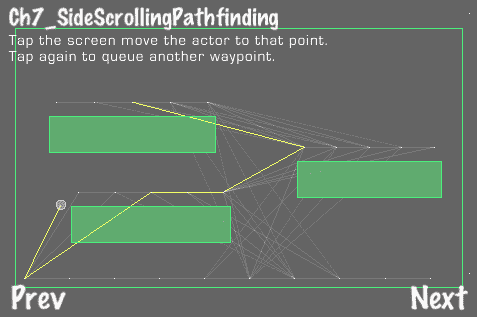

## 准备工作

下面的代码为了简洁而进行了大量编辑。请参考项目*RecipeCollection03*以获取此菜谱的完整工作代码。

## 如何做到这一点...

执行以下代码：

```swift
/* SSAStarNode */
@implementation SSAStarNode
-(float) costToNeighbor:(SSNeighborNode*)nn {
SSAStarNode *node = nn.node;
//Here we use jumping/running to determine cost. We could also possibly use a heuristic.
CGPoint src = ccp(self.position.x/PTM_RATIO, self.position.y/PTM_RATIO);
CGPoint dst = ccp(node.position.x/PTM_RATIO, node.position.y/PTM_RATIO);
float cost;
if(node.body == self.body){
//Compute simple distance
float runTime = ([GameHelper distanceP1:src toP2:dst]) / actor.runSpeed;
cost = runTime * node.costMultiplier;
}else{
//Compute a jump
float y = dst.y - src.y;
if(y == 0){ y = 0.00001f; } //Prevent divide by zero
CGPoint launchVector = nn.launchVector;
float gravity = actor.body->GetWorld()->GetGravity().y;
Vector3D *at = [GameHelper quadraticA:gravity*0.5f B:launchVector.y C:y*-1];
float airTime;
if(at.x > at.y){
airTime = at.x;
}else{
airTime = at.y;
}
cost = airTime * node.costMultiplier;
}
return cost;
}
@end
/* SSGameActor */
@implementation SSGameActor
+(Vector3D*) canJumpFrom:(CGPoint)src to:(CGPoint)dst radius:(float)radius world:(b2World*)world maxSpeed:(CGPoint)maxSpeed {
float x = dst.x - src.x;
float y = dst.y - src.y;
if(y == 0){ y = 0.00001f; } //Prevent divide by zero
bool foundJumpSolution = NO;
bool triedAngles = NO;
CGPoint launchVector;
float jumpHeightMod = 0.5f;
while(!triedAngles){
//Gravity
float gravity = world->GetGravity().y;
if(gravity == 0){ gravity = 0.00001f; } //Prevent divide by zero
launchVector = [SSGameActor getLaunchVector:CGPointMake(x,y) jumpHeightMod:jumpHeightMod gravity:gravity];
bool hitObject = NO;
bool movingTooFast = NO;
/* Make sure jump doesn't hit an object */
Vector3D *at = [GameHelper quadraticA:gravity*0.5f B:launchVector.y C:y*-1];
float airTime;
if(at.x > at.y){ airTime = at.x; }else{ airTime = at.y; }
//Do a ray test sequence (from 0.1 to 0.9 of airTime)
for(float t=airTime/10; t<airTime-airTime/10; t+= airTime/10){
if(hitObject){ break; }
float t1 = t + airTime/10;
float x1 = launchVector.x * t + src.x;
float y1 = launchVector.y * t + (0.5f) * gravity * pow(t,2) + src.y;
float x2 = launchVector.x * t1 + src.x;
float y2 = launchVector.y * t1 + (0.5f) * gravity * pow(t1,2) + src.y;
//Point Test
/* CODE OMITTED */
//RayCast Test
/* CODE OMITTED */
}
//Make sure the launchVector is not too fast for this actor
if(!hitObject){
if([GameHelper absoluteValue:launchVector.x] > maxSpeed.x || [GameHelper absoluteValue:launchVector.y] > maxSpeed.y){
movingTooFast = YES;
}
}
if(hitObject || movingTooFast){
//This jump failed, try another
if(jumpHeightMod <= 0.5f && jumpHeightMod >= 0.2f){ //First, try 0.5f to 0.1f
jumpHeightMod -= 0.1f;
}else if(jumpHeightMod > 0.5f && jumpHeightMod < 1.0f){ //Then try 0.6f to 1.0f
jumpHeightMod += 0.1f;
}else if(jumpHeightMod < 0.2f){
jumpHeightMod = 0.6f;
}else if(jumpHeightMod >= 1.0f){
//FAIL
triedAngles = YES;
}
}else{
//SUCCESS
foundJumpSolution = YES;
triedAngles = YES;
}
}
if(foundJumpSolution){
return [Vector3D x:launchVector.x y:launchVector.y z:0];
}else{
return nil;
}
}
+(CGPoint) getLaunchVector:(CGPoint)vect jumpHeightMod:(float)jumpHeightMod gravity:(float)gravity {
//Gravity
if(gravity == 0){ gravity = 0.00001f; } //Prevent divide by zero
//The angle between the points
float directionAngle = [GameHelper vectorToRadians:ccp(vect.x, vect.y)];
//Jump height is a percentage of X distance, usually 0.5f
float apexX;
if(vect.y > 0){ apexX = vect.x - (vect.x*0.5f*pow([GameHelper absoluteValue:sinf(directionAngle)],0.5f/jumpHeightMod));
}else{ apexX = vect.x*0.5f*pow([GameHelper absoluteValue:sinf(directionAngle)],0.5f/jumpHeightMod); }
float apexY;
if(vect.y > 0){ apexY = vect.y + [GameHelper absoluteValue:vect.x*jumpHeightMod]*[GameHelper absoluteValue:sinf(directionAngle)];
}else{ apexY = [GameHelper absoluteValue:vect.x*jumpHeightMod]*[GameHelper absoluteValue:sinf(directionAngle)]; }
//Get launch vector
float vectY = sqrtf(2*(-1)*gravity*apexY);
float vectX = (apexX*(-1)*gravity) / vectY;
return CGPointMake(vectX, vectY);
}
@end
/* Ch7_SideScrollingPathfinding */
@implementation Ch7_SideScrollingPathfinding
-(CCLayer*) runRecipe {
/* CODE OMITTED */
//Distance between nodes that the actor can run between
float nodeRunDistInterval = 100.0f;
//How far to search for nodes the actor can jump to
float maxJumpSearchDist = 500.0f;
//Add some nodes to the bottom of the level
for(float x=20.0f; x<=gameAreaSize.x*PTM_RATIO-20.0f; x+=nodeRunDistInterval){
//Add node
/* CODE OMITTED */
}
//Link those nodes together as 'run neighbors'
for(int i=0; i<nodes.count-1; i++){
SSAStarNode *n1 = (SSAStarNode*)[nodes objectAtIndex:i];
SSAStarNode *n2 = (SSAStarNode*)[nodes objectAtIndex:i+1];
[self linkRunNeighbor:n1 with:n2];
}
/* Add nodes to all level platforms */
for(b2Body *b = world->GetBodyList(); b; b = b->GetNext()){
if (b->GetUserData() != NULL) {
GameObject *obj = (GameObject*)b->GetUserData();
if(obj.tag == GO_TAG_WALL && obj->polygonShape){
//Nodes on this body only
NSMutableArray *nodesThisBody = [[[NSMutableArray alloc] init] autorelease];
//Process each polygon vertex
for(int i=0; i<obj->polygonShape->m_vertexCount; i++){
b2Vec2 vertex = obj->polygonShape->m_vertices[i];
//All nodes are 1 unit above their corresponding platform
b2Vec2 nodePosition = b2Vec2(vertex.x + b->GetPosition().x,vertex.y + b->GetPosition().y+1.0f);
//Move nodes inward to lessen chance of missing a jump
if(obj->polygonShape->m_centroid.x < vertex.x){
nodePosition = b2Vec2(nodePosition.x-0.5f, nodePosition.y);
}else{
nodePosition = b2Vec2(nodePosition.x+0.5f, nodePosition.y);
}
//If this node position is not inside the polygon we create an SSAStarNode
if(!obj->polygonShape->TestPoint(b->GetTransform(), nodePosition)){
//Add node
/* CODE OMITTED */
}
}
//Add in-between nodes (for running)
bool done = NO;
while(!done){
if(nodesThisBody.count == 0){ break; }
done = YES;
for(int i=0; i<nodesThisBody.count-1; i++){
SSAStarNode *n1 = (SSAStarNode*)[nodesThisBody objectAtIndex:i];
SSAStarNode *n2 = (SSAStarNode*)[nodesThisBody objectAtIndex:i+1];
if([GameHelper absoluteValue:n1.position.y-n2.position.y] > 0.1f){
//These are not side by side
continue;
}
if( [GameHelper distanceP1:n1.position toP2:n2.position] > nodeRunDistInterval ){
CGPoint midPoint = [GameHelper midPointP1:n1.position p2:n2.position];
b2Vec2 mp = b2Vec2(midPoint.x/PTM_RATIO, midPoint.y/PTM_RATIO);
//If node is not in the polygon, add it
if(!obj->polygonShape->TestPoint(b->GetTransform(), mp)){
//Add node
/* CODE OMITTED */
break;
}
}
}
}
//Link all of the neighboring nodes on this body
for(int i=0; i<nodesThisBody.count-1; i++){
if(nodesThisBody.count == 0){ break; }
SSAStarNode *n1 = (SSAStarNode*)[nodesThisBody objectAtIndex:i];
SSAStarNode *n2 = (SSAStarNode*)[nodesThisBody objectAtIndex:i+1];
if([GameHelper absoluteValue:n1.position.y-n2.position.y] > 0.1f){
//These are not side by side
continue;
}
//Two-way link
[self linkRunNeighbor:n1 with:n2];
}
}
}
}
//Neighbor all other nodes (for jumping)
for(int i=0; i<nodes.count; i++){
for(int j=0; j<nodes.count; j++){
if(i==j){ continue; }
SSAStarNode *n1 = (SSAStarNode*)[nodes objectAtIndex:i];
SSAStarNode *n2 = (SSAStarNode*)[nodes objectAtIndex:j];
if(n1.body == n2.body){ continue; }
if( [GameHelper distanceP1:n1.position toP2:n2.position] <= maxJumpSearchDist ){
CGPoint src = ccp(n1.position.x/PTM_RATIO, n1.position.y/PTM_RATIO);
CGPoint dst = ccp(n2.position.x/PTM_RATIO, n2.position.y/PTM_RATIO);
//Calculate our jump "launch" vector
Vector3D *launchVector3D = [SSGameActor canJumpFrom:src to:dst radius:actor.circleShape->m_radius*1.5f world:world maxSpeed:actor.maxSpeed];
if(launchVector3D){
//Only neighbor up if a jump can be made
//1-way link
if(![n1 containsNeighborForNode:n2]){
//Add neighbor
/* CODE OMITTED */
}
}
}
}
}
return self;
}
@end

```

## 它是如何工作的...

首先，我们必须创建我们的节点图。在俯视的 2D 环境中，我们只需使用网格，然后剔除任何碰撞的边。在横版环境中，我们需要有不同的思考方式。在这样的环境中，演员必须始终站在关卡几何形状的顶部。除此之外，他们还有两种不同的方式穿越关卡：**奔跑**和**跳跃**。

+   在平台上奔跑：

    为了让演员能够在平台上奔跑，我们需要在每个平台上创建一串 A*节点。从这些节点中的一个开始，演员可以轻松地移动到同一身体上的其他节点。

+   从平台跳到平台：

    要到达另一个平台，演员必须跳到那里。这增加了复杂性。我们需要执行将演员安全地发射到另一个平台所需的计算。我们还需要检查演员跳跃轨迹中的几何形状，并根据需要调整跳跃的角度。在我们可以实现这个功能之前，我们需要将其封装在我们创建的新类中，这些新类是我们当前类的子类。

+   `SSAStarNode:`

    `SSAStarNode`包含对 b2Body 对象的引用以及`SSGameActor`对象。当演员在这个节点上休息时，身体对象代表演员所在的身体。由于需要演员的大小、跳跃速度和奔跑速度等信息来执行一些上述计算，因此保留了演员的引用。

+   `SSGameWaypoint:`

    我们的新航点类包含一个`moveType`枚举，用于指定演员是否应该向航点的位置**奔跑**或**跳跃**。它还包含一个`launchVector`，用于指定如果需要跳跃，所需的冲量向量。

+   `SSGameActor:`

    新的演员类有一个`maxSpeed`变量，它决定了演员可以跑多快以及可以跳多高。此类还封装了我们新修改的`processWaypoints`方法以及其他几个方法：

    ```swift
    -(void) runToWaypoint:(SSGameWaypoint*)wp speedMod:(float)speedMod constrain:(bool)constrain;
    -(void) jumpToWaypoint:(SSGameWaypoint*)wp;
    +(Vector3D*) canJumpFrom:(CGPoint)src to:(CGPoint)dst radius:(float)radius world:(b2World*)world maxSpeed:(CGPoint)maxSpeed;
    +(CGPoint) getLaunchVector:(CGPoint)vect jumpHeightMod:(float)jumpHeightMod gravity:(float)gravity;

    ```

    `runToWaypoint`方法简单地设置演员的速度，使其向左或向右跑。`jumpToWaypoint`方法使用航点的`launchVector`发射演员。`canJumpFrom`方法确定是否可以跳到某个特定点。这涉及到对 Box2D 世界的几何形状进行多次跳跃角度测试。每个跳跃抛物线被分成 10 个直线段，这些直线段被射向地图几何形状进行测试。这足以满足我们的碰撞检测需求。最后，`getLaunchVector`方法，它被`canJumpFrom`方法使用，根据着陆点和相对于 X 跳跃宽度的 Y 跳跃高度确定演员的`launchVector`。

+   `SSAStarPathNode:`

    这个类与`AStarPathNode`类似。它包含一个`SSGameWaypoint`指针以方便使用。在更新的`findPathFrom`方法中，我们创建这个航点并设置其`launchVector`。这确保了`launchVector`只在加载时计算。

+   `SSNeighborNode:`

    由于我们现在有两种从节点到节点移动的方法，我们需要一种更复杂的方式来存储图边信息。而不是简单地存储指向相邻节点的指针，这个类封装了该节点以及`moveType`、`cost`和`launchVector`。

+   创建我们的节点图—运行节点：

    首先，我们必须创建我们的关键节点。这些就像动画中的关键帧。它们位于每个平台顶部的每个顶点略微上方。然后我们在这些节点之间添加节点。最后，这些“运行节点”通过设置`moveType`变量为`MOVE_TYPE_RUN`相互连接。

+   创建我们的节点图—跳跃节点：

    一旦在每个平台上设置了运行节点，我们就创建跳跃节点。这涉及到在每个节点周围搜索，确定演员是否可以从该节点跳到找到的节点，然后最终创建相邻链接。我们逐个创建这些链接，因为向上跳跃到达节点与向下跳跃非常不同。

+   调整侧滚路径查找：

    这种技术需要大量调整才能正常工作。例如，用于确定是否到达航点的 X 和 Y 距离阈值差异很大。另一个调整涉及到，如果航点被阻挡，整个航点集必须被丢弃。也许另一个版本可以通过在错过节点前添加新路径来挽救节点路径的第二部分。

# 运行 Lua 脚本

许多商业游戏都使用一种**脚本语言**来隔离和抽象它们的**游戏逻辑**。其中最受欢迎的是**Lua**。在本教程中，我们将 Lua 集成到我们的项目中。

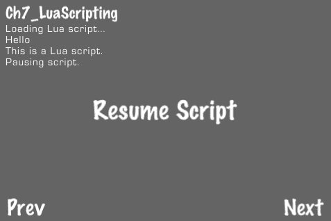

## 准备工作

请参阅项目*RecipeCollection03*以获取此教程的完整工作代码。

## 如何操作...

可以通过几个简单的步骤将 Lua 添加到您的项目中：

1.  在导航器中突出显示你的项目。在窗口中间的底部，点击 **Add Target:**

1.  将目标命名为 "Lua"。这将在你的项目文件夹中创建一个新文件夹，紧挨着你的主要目标文件夹。它还应创建一个新的组。

1.  从 [`www.lua.org`](http://www.lua.org) 下载 Lua 源代码并将其复制到该文件夹。

1.  右键点击 **Lua** 组并选择 **Add Files to "Your**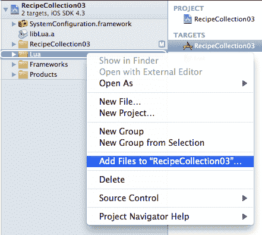

1.  导航到 `src` 目录并添加该目录下所有文件，除了 `lua.c, luac.c, Makefile` 和 `print.c`。同时，确保取消选中 **Copy items into destination groups folder** 并在 **Add to Targets** 部分只选择 **Lua**。

1.  到目前为止，你应该能够无错误地构建 Lua 目标。

1.  在中间面板中，点击你的项目的主要目标。展开 **Link Binary With Libraries**。点击左下角的 **+** 符号并将 **libLua.a** 库添加到列表中：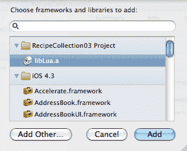

1.  收起此内容并展开 **Target Dependencies**。将目标 **Lua** 添加为此目标的依赖项：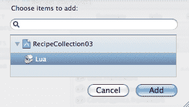

1.  就这样。Lua 现已集成。清理并构建你的项目以确保其正确集成。

执行以下代码：

```swift
#import "mcLua.hpp"
@interface Ch7_LuaScripting : Recipe
{
class mcLuaManager * lua_;
mcLuaScript * sc;
}
@end
//Callback pointer
Ch7_LuaScripting *lsRecipe = nil;
//Static append message C function
static int lsAppendMessage(lua_State * l)
{
//Pass lua string into append message method
[lsRecipe appendMessage:[NSString stringWithUTF8String:lua_tostring(l,1)]];
return 0;
}
@implementation Ch7_LuaScripting
-(CCLayer*) runRecipe {
//Set callback pointer
lsRecipe = self;
//Lua initialization
lua_ = new mcLuaManager;
//Lua function wrapper library
static const luaL_reg scriptLib[] =
{
{"appendMessage", lsAppendMessage },
{NULL, NULL}
};
lua_->LuaOpenLibrary("scene",scriptLib);
//Open Lua script
sc = lua_->CreateScript();
NSString *filePath = [[NSBundle mainBundle] pathForResource:@"show_messages.lua" ofType:@""];
sc->LoadFile([filePath UTF8String]);
//Set initial update method counter
lua_->Update(0);
//Schedule step method
[self schedule: @selector(step:)];
//Resume button
CCMenuItemFont *resumeItem = [CCMenuItemFont itemFromString:@"Resume Script" target:self selector:@selector(resumeScript:)];
CCMenu *menu = [CCMenu menuWithItems:resumeItem, nil];
[self addChild:menu];
return self;
}
-(void) step:(ccTime)delta {
//Update Lua script runner
lua_->Update(delta);
}
/* Resume script callback */
-(void) resumeScript:(id)sender {
sc->YieldResume();
}
@end

```

## 它是如何工作的...

这些和随后的食谱使用 Robert Grzesek 的 `mcLua` API 来简化 Lua 脚本的加载和执行。它还允许多个脚本的并发执行。

+   `mcLuaManager` 类：

    `mcLuaManager` 类是管理所有运行脚本的顶级类：

    ```swift
    class mcLuaManager lua_ = new mcLuaManager;

    ```

    它负责运行脚本以及它们的创建和销毁。

+   加载并启动脚本：

    加载 Lua 脚本是一个相当直接的过程：

    ```swift
    mcLuaScript *sc = lua_->CreateScript();
    NSString *filePath = [[NSBundle mainBundle] pathForResource:@"show_messages.lua" ofType:@""];
    sc->LoadFile([filePath UTF8String]);

    ```

    一旦文件加载，我们调用 `mcLuaManager` 类的 `Update` 方法：

    ```swift
    lua_->Update(0);

    ```

    这将启动已加载的脚本并运行。

+   静态函数库：

    在 Lua 脚本中，可以根据分配给对象标识符的函数库调用全局方法。mcLua API 默认将一些函数分配给脚本对象。这些包括 `waitSeconds, waitFrames` 和 `pause`。它们可以在 Lua 脚本内部调用：

    ```swift
    script.waitSeconds(1);

    ```

    在这个例子中，我们还创建了一个名为 `appendMessage` 的回调方法并将其分配给名为 `scene` 的对象。为此，我们首先创建一个静态 C 函数：

    ```swift
    static int lsAppendMessage(lua_State * l)
    {
    [lsRecipe appendMessage:[NSString stringWithUTF8String:lua_tostring(l,1)]];
    return 0;
    }

    ```

    当食谱加载时，我们创建一个 Lua 脚本库链接器数组并将其使用 `mcLua` API 提供的 `LuaOpenLibrary` 加载到内存中：

    ```swift
    lua_ = new mcLuaManager;
    static const luaL_reg scriptLib[] =
    {
    {"appendMessage", lsAppendMessage },
    {NULL, NULL}
    };
    lua_->LuaOpenLibrary("scene", scriptLib);

    ```

    一旦加载，我们就可以从 Lua 脚本本身调用该函数：

    ```swift
    scene.appendMessage("This is a Lua script.");

    ```

    最后，如果脚本被暂停（从脚本内部或外部）它可以从外部脚本恢复：

    ```swift
    sc->YieldResume();

    ```

    一起，这个库允许你的 Lua 脚本与你的应用程序交互。

# 动态加载 Lua 脚本

类似 Lua 这样的脚本语言的强大之处在于，脚本可以在 **运行时** 加载和重新加载。这意味着您可以在不重新编译 Objective-C++ 代码的情况下测试您的游戏逻辑。在这个菜谱中，我们将从本地 **Web 服务器** 加载远程脚本。

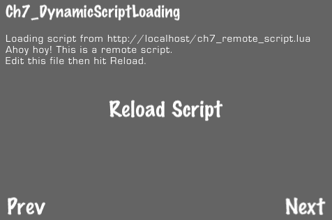

## 准备工作

请参考项目 *RecipeCollection03* 以获取此菜谱的完整工作代码。

## 如何操作...

执行以下代码：

```swift
#import "mcLua.hpp"
#import "Reachability.h"
@interface Ch7_DynamicScriptLoading : Recipe
{
class mcLuaManager * lua_;
}
@end
//Callback pointer
Ch7_DynamicScriptLoading *dslRecipe = nil;
//Static append message C function
static int dslAppendMessage(lua_State * l)
{
//Pass lua string into append message method
[dslRecipe appendMessage:[NSString stringWithUTF8String:lua_tostring(l,1)]];
return 0;
}
@implementation Ch7_DynamicScriptLoading
-(CCLayer*) runRecipe {
//Superclass initialization
[super runRecipe];
//Set callback pointer
dslRecipe = self;
//Lua initialization
lua_ = new mcLuaManager;
//Lua function wrapper library
static const luaL_reg scriptLib[] =
{
{"appendMessage", dslAppendMessage },
{NULL, NULL}
};
lua_->LuaOpenLibrary("scene",scriptLib);
//Load Lua script
[self loadScript];
//Set initial update method counter
lua_->Update(0);
//Schedule step method
[self schedule: @selector(step:)];
//Reload script button
CCMenuItemFont *reloadItem = [CCMenuItemFont itemFromString:@"Reload Script" target:self selector:@selector(loadScript)];
CCMenu *menu = [CCMenu menuWithItems:reloadItem, nil];
[self addChild:menu];
return self;
}
-(void) step:(ccTime)delta {
//Update Lua script runner
lua_->Update(delta);
}
-(void) loadScript{
//Reset message
[self resetMessage];
//Make sure localhost is reachable
Reachability* reachability = [Reachability reachabilityWithHostName:@"localhost"];
NetworkStatus remoteHostStatus = [reachability currentReachabilityStatus];
if(remoteHostStatus == NotReachable) {
[self showMessage:@"Script not reachable."];
}else{
[self appendMessage:@"Loading script from http://localhost/ch7_remote_script.lua"];
//Load script via NSURL
mcLuaScript *sc = lua_->CreateScript();
NSString *remoteScriptString = [NSString stringWithContentsOfURL:[NSURL URLWithString:@"http://localhost/ch7_remote_script.lua"]
encoding:NSUTF8StringEncoding error:nil];
sc->LoadString([remoteScriptString UTF8String]);
}
}
@end

```

## 它是如何工作的...

加载远程脚本最简单的方法是使用本地 Web 服务器。这样我们就可以绕过 `NSBundle` 和相对受限的 iOS 文件系统。Mac OSX 预装了内置的 Apache HTTP Web 服务器。可以通过转到 **系统偏好设置** | **互联网和无线** | **共享** | **Web 共享**：来启用和配置它。

+   加载远程脚本：

    我们不是从文件系统中读取我们的脚本，而是使用 `NSURL` 通过 HTTP 加载它：

    ```swift
    mcLuaScript *sc = lua_->CreateScript();
    NSString *remoteScriptString = [NSString stringWithContentsOfURL:[NSURL URLWithString:@"http://localhost/ch7_remote_script.lua"] encoding:NSUTF8StringEncoding error:nil];
    sc->LoadString([remoteScriptString UTF8String]);

    ```

    在您的本地 Web 服务器上编辑文件并点击重新加载按钮只是重新加载脚本。这是一种简单但有效的方法，可以快速开发和测试游戏逻辑。

+   Reachability：

    在这个例子中，我们使用苹果的 Reachability 库来帮助我们确定是否可以通过网络访问脚本。没有这个工具，我们的 `stringWithContentsOfURL` 方法会抛出错误。

# 使用 Lua 创建对话树

Lua 允许程序员编写针对通用 **接口** 的代码，并稍后关注 **实现**。这种将游戏逻辑与游戏音频/视觉元素展示的细节分开，是任何游戏引擎的重要部分。在这个菜谱中，我们将使用 Lua 创建一个小型的基于故事的游戏。

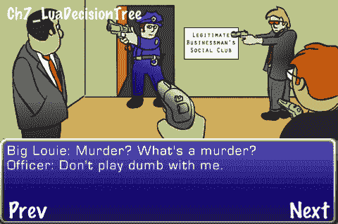

## 准备工作

请参考项目 *RecipeCollection03* 以获取此菜谱的完整工作代码。

## 如何操作...

执行以下代码：

```swift
//Static C functions
static int ldtLogic(lua_State * l) {
int num = [ldtRecipe logic:[NSString stringWithUTF8String:lua_tostring(l,1)]];
lua_pushnumber(l,num);
return 1;
}
static int ldtPresentOptions(lua_State * l) {
[ldtRecipe presentOptions];
ldtRecipe.sc->YieldPause();
return (lua_yield(l, 0));
}
@implementation Ch7_LuaDecisionTree
/* Logic callback */
-(int) logic:(NSString*)str {
int num = 0;
if([str isEqualToString:@"Put guns down"]){
gunsDown = YES;
}else if([str isEqualToString:@"Are guns down?"]){
if(gunsDown){
num = 1;
}else{
num = 0;
}
}else if([str isEqualToString:@"You win"]){
[self showMessage:@"You WIN!!"];
}
return num;
}
/* Present options callback */
-(void) presentOptions {
text = @"";
[textLabel setString:text];
optionsNode.visible = YES;
}
/* Select option callback */
-(void) selectOption:(id)sender {
/* CODE OMITTED */
//Resume the script
sc->YieldResume();
}
@end
/* decision_tree.lua */
function start()
scene.desc("You are deep undercover with the mafia.");
scene.anim("Open door");
scene.anim("Enter officer");
scene.anim("Louie looks away");
scene.dialog("Officer: Alright Big Louie. This is a raid. You're under arrest for the murder of Frankie Boy Caruso.");
scene.anim("Pull guns");
scene.dialog("Big Louie: Murder? What's a murder?");
scene.dialog("Officer: Don't play dumb with me.");
scene.dialog("Big Louie: A one-man raid? You must have a death wish.");
scene.anim("Louie looks at you");
scene.dialog("Big Louie: What do YOU think we should do with him?");
scene.dialogOption("You can't take him out now. There are too many witnesses.");
scene.dialogOption("I say take him out. He's here alone.");
scene.dialogOption("He's a cop. We'll have a mess on our hands if we take him down.");
scene.presentOptions();
if scene.getResponse() == 1 then
tooManyWitnesses();
elseif scene.getResponse() == 2 then
hereAlone();
elseif scene.getResponse() == 3 then
bigMess();
end
end
function tooManyWitnesses()
scene.dialog("Big Louie: Whaddya mean too many witnesses? These are all my men...");
scene.anim("Louie scowls");
scene.dialog("Big Louie: ...and YOU! Blast him boys.");
script.waitSeconds(1);
scene.anim("Gun pointed at you");
scene.desc("You are dead.");
end
function bigMess()
scene.dialog("Big Louie: I don't like it, but, you're right.");
scene.dialog("Big Louie: Men, you can put your guns down.");
scene.logic("Put guns down");
scene.anim("Put guns down");
scene.desc("Louie's men lower their weapons");
scene.anim("Louie looks away");
scene.dialog("Big Louie: Cop, looks like you have a new lease on life.");
scene.actionOption("Pull your gun on Big Louie");
scene.actionOption("Pull your gun on Big Louie's men");
scene.presentOptions();
if scene.getResponse() == 1 then
pullGunOnLouie();
elseif scene.getResponse() == 2 then
pullGunOnMen();
end
end
function hereAlone()
scene.anim("Officer shocked");
script.waitSeconds(1);
scene.dialog("Officer: Jerry! What the hell are you doing?!");
scene.anim("Louie scowls");
scene.dialog("Big Louie: Jerry? You lying scumbag! We trusted you...blast him boys.");
script.waitSeconds(1);
scene.anim("Gun pointed at you");
scene.desc("You are dead.");
end
function pullGunOnLouie()
scene.anim("Pull gun on Louie");
scene.anim("Louie scowl");
scene.dialog("Big Louie: This guy's a Fed! Blast him!");
script.waitSeconds(1);
scene.anim("Gun pointed at you");
scene.desc("You are dead.");
end
function pullGunOnMen()
gunsDown = scene.logic("Are guns down?");
scene.anim("Pull gun on men");
if gunsDown == 1 then
scene.anim("Louie scowls");
scene.dialog("Big Louie: You played me for a fool!");
scene.anim("Louie looks away");
scene.dialog("Officer: You're under arrest Big Louie.");
scene.dialog("Big Louie: I'll be back on the streets in twenty-four hours!");
scene.dialog("Officer: We'll try to make it twelve.");
scene.anim("Louie looks at you");
scene.logic("You win");
scene.desc("You win!");
else
scene.anim("Louie scowls");
scene.dialog("Big Louie: This guy's a Fed! Blast him!");
script.waitSeconds(1);
scene.anim("Gun pointed at you");
scene.desc("You are dead.");
end
end
start();

```

## 它是如何工作的...

对于这个菜谱，我们创建了一些回调函数来处理动画、对话框和逻辑。其中一些，如选项提示，在脚本恢复之前等待用户响应。其他函数，如 `ldtLogic`，有返回值。

+   使用 Lua 传递和返回变量：

    Lua 的变量传递机制相当简单。函数传递一个 lua_State 指针。然后可以从这个指针指向的堆栈中检索数据：

    ```swift
    lua_State * l;
    NSString *str = [NSString stringWithUTF8String:lua_tostring(l,1)];

    ```

    Lua 支持同时返回多个变量。要从我们的回调函数中返回一个变量，我们必须首先将变量推入堆栈：

    ```swift
    int num = 7;
    lua_pushnumber(l,num);

    ```

    然后，我们指定要返回的变量数量作为一个整数：

    ```swift
    return 1;

    ```

    所有基本的 C 类型都可以使用 Lua 传递和返回。

+   本地 Lua 函数：

    在我们的脚本文件中，我们使用了多个本地 Lua 函数。除了最初的 `start()` 函数调用外，所有内容都被封装在函数中。本地函数也支持返回多个
