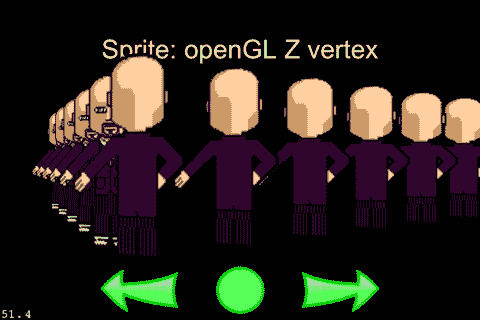
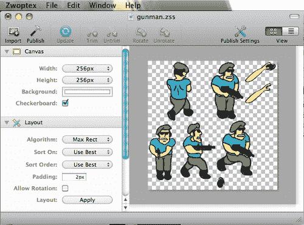
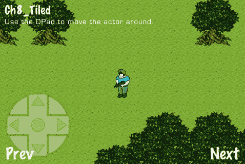
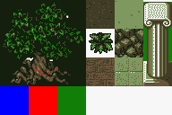
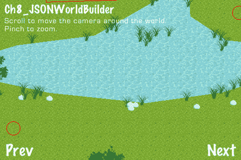
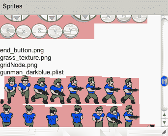
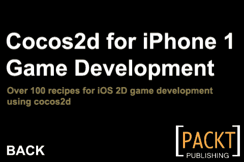
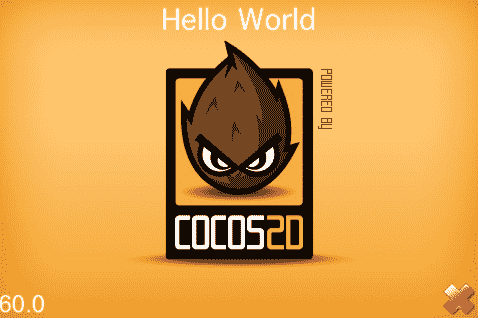
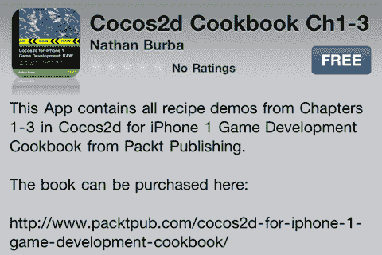

# 第八章.技巧、工具和端口

本章将涵盖以下主题：

+   简介

+   访问 Cocos2d-iPhone 测试平台

+   使用 Zwoptex 打包纹理

+   使用 Tiled 创建关卡

+   使用 JSONWorldBuilder 创建关卡

+   使用 CocosBuilder 创建场景

+   使用 Cocos2d-X

+   使用 Cocos3d

+   发布您的应用

# 简介

在本章中，我们将通过介绍一些常用的工具来增强 Cocos2d 游戏开发来结束本章。我们还将介绍 Cocos2d 衍生项目，并指导您在苹果的 App Store 上发布应用的流程。

# 访问 Cocos2d-iPhone 测试平台

**Cocos2d-iPhone 测试平台** 是一系列示例的集合，旨在测试错误、展示功能，并通过有用的示例指导程序员。在本食谱中，我们将介绍这个非常有用的工具。



## 准备工作

首先，我们必须从 [`www.cocos2d-iphone.org/download`](http://www.cocos2d-iphone.org/download) 下载 Cocos2d 源代码。解压缩主源代码包后，双击 `cocos2d.xcworkspace` 文件。

## 如何操作...

在 XCode 的 **方案选择** 菜单中，您现在可以选择运行测试平台的哪个部分。这些测试包括一切——绘图、物理、声音、网络等等。

## 它是如何工作的...

在 `cocos2d-ios` 目标的 `tests` 文件夹中，您可以找到每个单独测试的源文件。在这里，您可以玩转这些演示，以获得自己游戏的灵感。

### **Box2D 测试平台**

由于 Cocos2d-iPhone 框架的范围，许多其他测试平台都包含在 Cocos2d-iPhone 测试平台中。通过构建 `Box2dTestBed` 方案，我们可以运行针对 Cocos2d 定制的官方 Box2D 测试平台版本。

# 使用 Zwoptex 打包纹理

手动创建精灵表可以是一个繁琐的过程。为了解决这个问题，我们使用 **Zwoptex 纹理打包器** 将单个精灵打包到尽可能小的区域。在本食谱中，我们将详细介绍这个过程。



## 准备工作

首先，我们必须下载并安装 Zwoptex 应用程序。访问 [`zwoptexapp.com/`](http://zwoptexapp.com/) 并点击 **下载** 链接。将应用程序拖到您的 `Applications` 文件夹。

## 如何操作...

一旦启动 Zwoptex，点击 **文件 | 新建**。您应该看到一个空白画布。以下是一些画布的属性：

+   画布大小：

    如您在 Zwoptex 中所见，画布的宽度和高度只能达到 2048 像素。此外，它们只能是 2 的幂。在 iPhone 3G 及更早的设备上，未压缩的纹理最大尺寸为 1024x1024。在支持 OpenGL ES 2.0 的新设备上，从 iPhone 3GS 开始，未压缩的纹理可以达到 2048x2048 像素。纹理仅在 2 的幂次下加载到内存中。考虑到所有这些因素，Zwoptex 限制了您可以使用画布的大小。

+   导入精灵：

    精灵通过简单地从 Finder 中将单个文件拖放到画布上导入到画布中。它们将重叠在一起。它们也将用红色框勾勒出来。

+   应用布局：

    在布局标题下调整任何设置后，我们可以点击应用按钮。这将重新排列精灵以适应画布大小。如果所有精灵都无法适应，一些精灵仍然会有红色的框包围着。这表示有重叠。

+   发布：

    一旦我们的精灵在图纸上正确排列，并且我们的 Zwoptex 文件已保存，我们就可以发布我们的图集。这将创建一个 PLIST 文件和一个 PNG 文件。通过将这些文件添加到我们的 XCode Cocos2d 项目中，我们现在可以在我们的应用程序中使用它们。

## 它是如何工作的...

Zwoptex 使用偏移和其他定位技巧，旨在尽可能多地挤压精灵到一个图集中。

## 参见...

Zwoptex 的一个流行替代品是**TexturePacker**。可以从[`www.texturepacker.com/`](http://www.texturepacker.com/)下载。

# 使用 Tiled 创建层级

游戏开发者工具箱中最重要的武器之一是**层级编辑器**。在这个菜谱中，我们将使用*Tiled*层级编辑器创建一个层级。然后我们将使用这个层级创建一个简单的俯视世界。



## 准备工作

请参阅项目`RecipeCollection03`以获取此菜谱的完整工作代码。

## 如何操作...

执行以下代码：

```swift
//Interface
@interface Ch8_Tiled : GameArea2D {
CCTMXTiledMap *tileMap;
}
@end
//Implementation
@implementation Ch8_Tiled
-(CCLayer*) runRecipe {
//Load TMX tilemap file
tileMap = [CCTMXTiledMap tiledMapWithTMXFile:@"tilemap.tmx"];
//Set game area size based on tilemap size
[self setGameAreaSize];
//Superclass initialization and message
[super runRecipe];
[self showMessage:@"Use the DPad to move the actor around."];
//Add tile map
[gameNode addChild:tileMap z:0];
/* Re-order layers according to their Y value. This creates isometric depth. */
//Our layers
CCTMXLayer *collidableLayer = [tileMap layerNamed:@"Collidable"];
CCTMXLayer *ground = [tileMap layerNamed:@"Ground"];
CCTMXLayer *wall = [tileMap layerNamed:@"Wall"];
//Gather all the layers into a container
float mw = tileMap.mapSize.width; float mh = tileMap.mapSize.height;
float tw = tileMap.tileSize.width; float th = tileMap.tileSize.height;
NSMutableDictionary *layersToReorder = [[[NSMutableDictionary alloc] init] autorelease];
for( CCTMXLayer* child in [tileMap children] ) {
//Skip tiles marked "Collidable", "Ground" and "Wall"
if(child == ground){ continue; }
else if(child == wall){ continue; }
else if(child == collidableLayer){ continue; }
//Gather all the layers
for(float x=0; x<mw; x+=1){
for(float y=mh-1; y>=0; y-=1){
CCSprite *childTile = [child tileAt:ccp(x,y)];
CCSprite *collideTile = [collidableLayer tileAt:ccp(x,y)];
if(childTile && collideTile){
[layersToReorder setObject:[NSNumber numberWithFloat:y] forKey:[child layerName]];
x=mw; y=-1;
}
}
}
}
//Re-order gathered layers
for(id key in layersToReorder){
NSString *str = (NSString*)key;
[tileMap reorderChild:[tileMap layerNamed:str] z:[[layersToReorder objectForKey:key] floatValue]];
}
//Set the ground to z=0
[tileMap reorderChild:ground z:0];
//Add Box2D boxes to represent all layers marked "Collidable"
for(float x=0; x<mw; x+=1){
for(float y=0; y<mh; y+=1){
if([collidableLayer tileAt:ccp(x,y)]){
[self addBoxAtPoint:ccp(x*tw, mh*th - y*th) size:ccp(tw/2,th/2)];
}
}
}
//Remove the "Collidable" layer art as it's only an indicator for the level editor
[tileMap removeChild:collidableLayer cleanup:YES];
return self;
}
-(void) step: (ccTime) dt {
[super step:dt];
/* CODE OMITTED */
//Re-order the actor
float mh = tileMap.mapSize.height;
float th = tileMap.tileSize.height;
CGPoint p = [actor.sprite position];
float z = -(p.y/th) + mh;
[tileMap reorderChild:actor.sprite z:z ];
}
-(void) setGameAreaSize {
//Set gameAreaSize based on tileMap size
gameAreaSize = ccp((tileMap.mapSize.width * tileMap.tileSize.width)/PTM_RATIO,(tileMap.mapSize.height * tileMap.tileSize.height)/PTM_RATIO); //Box2d units
}
-(void) addActor {
//Get spawn point from tile object named "SpawnPoint"
if(!spawnPoint){
CCTMXObjectGroup *objects = [tileMap objectGroupNamed:@"Objects"];
NSAssert(objects != nil, @"'Objects' object group not found");
NSMutableDictionary *sp = [objects objectNamed:@"SpawnPoint"];
NSAssert(sp != nil, @"SpawnPoint object not found");
int x = [[sp valueForKey:@"x"] intValue];
int y = [[sp valueForKey:@"y"] intValue];
spawnPoint = [Vector3D x:x y:y z:0];
}
//Add actor
/* CODE OMITTED */
[tileMap addChild:actor.sprite z:[[tileMap layerNamed:@"0"] vertexZ]];
}
@end

```

## 它是如何工作的...

此菜谱加载了一个使用**Tiled**应用程序创建的 TMX `tilemap`。然后它使用`tilemap`中的信息创建一个 2.5D 游戏世界。这是按照以下步骤完成的：

1.  安装 Tiled：

    首先，我们必须下载并安装`Tiled`应用程序。访问[`www.mapeditor.org/`](http://www.mapeditor.org/)并点击**Tiled Qt 0.7.0 for Mac OS X**链接。将应用程序拖到您的`Applications`文件夹中。

1.  创建新层级：

    打开 Tiled 并点击**文件 | 新建**以创建一个新的层级。

1.  选择视角：

    如您从网站上的`Tiled`截图中所见，可以选择两种视角类型。当您第一次点击**文件 | 新建**在**Tiled**菜单中，您将不得不在**正交**和**等距**视角之间做出选择。每种视角都创建不同的视觉风格和世界对象布局。在我们的例子中，我们选择了**正交**，因为它更直接一些。

1.  地图大小：

    地图大小以瓦片为单位测量。对于我们的地图，我们选择了 50x50 的大小。

1.  瓦片大小：

    在`Tiled`中，瓦片大小可以是可变的。在这个例子中，我们选择了默认大小 32x32 像素。这意味着我们可以保持我们的艺术资产小巧。

1.  创建`tileset`：

    在 `Tiled` 中，主要使用的资源是 `tileset`。这是一个根据在 Tiled 中选择的瓦片大小创建的精灵表。要创建此精灵表，打开 Zwoptex，创建一个新文件，并将 `Padding` 设置为 0px。然后，将 32x32 像素的图像拖放到精灵表上。此 PNG 文件是瓦片集文件。与使用相应的 PLIST 文件来管理精灵信息不同，`Tiled` 简单地使用位置信息来匹配精灵和瓦片。对于这个配方，我们的 `tileset` 看起来如下：

    

    因此，在将其加载到级别之前，请确保您的瓦片集是正确的。最后，点击 **地图 | 新瓦片集**。命名您的瓦片集并指定您的 PNG 精灵表。

1.  瓦片层：

    Tiled 支持创建多个重叠层。通常，这些层用于将图形元素重叠放置。除此之外，层还可以指定信息。在我们的级别中，红色区域可以被认为是“可碰撞的”。这将通过程序处理。

    **对象层：**

    除了瓦片之外，**对象**也可以放置以指示非瓦片数据，如物品位置。在我们的级别中，我们放置了一个“生成点”对象来指示玩家应该生成的位置。有关此用法的示例，请参阅位于 `RecipeCollection03, CCTMXTiledMap` 的 `Resources/Tilemaps` 文件夹中的 `tilemap.tmx` 文件。

    +   一旦我们的地图完成，我们将运行以下代码片段来将 `tilemap` 资源加载到游戏中：

        ```swift
        CCTMXTiledMap *tileMap = [CCTMXTiledMap tiledMapWithTMXFile:@"tilemap.tmx"];
        [gameNode addChild:tileMap z:0];

        ```

        `CCTMXTiledMap` 对象包含对每个瓦片的引用，作为一个 `CCSprite` 对象，以及一些结构来组织这些文件。

    +   CCTMXTileLayer

        要访问瓦片层，我们使用以下代码：

        ```swift
        CCTMXLayer *collidableLayer = [tileMap layerNamed:@"Collidable"];

        ```

        要遍历所有 `CCTMXLayer` 对象，我们也可以使用以下行：

        ```swift
        for( CCTMXLayer* child in [tileMap children] ) {
        //Do Something
        }

        ```

    +   访问瓦片的精灵涉及到调用 `tileAt` 方法：

        ```swift
        float x = 0; float y = 0;
        CCSprite *tileSprite = [collidableLayer tileAt:ccp(x,y)];

        ```

    当调用 `tileAt` 方法时，这些精灵会懒加载创建。更多信息，请参考 Cocos2d-iPhone API 参考页面中的 `CCTMXTiledMap`。

1.  重新排序瓦片：

    在我们的示例中，为了创建正确的透视错觉，我们将遍历所有瓦片精灵并重新排序它们。这仅仅涉及到根据每个瓦片的 Y 位置在 `tileMap` 上调用 `reorderChild` 方法。

1.  添加 Box2D 几何形状：

    要创建物理级别几何形状，我们处理“可碰撞”层并为每个找到的瓦片创建适当大小的盒子对象：

    ```swift
    for(float x=0; x<mw; x+=1){
    for(float y=0; y<mh; y+=1){
    if([collidableLayer tileAt:ccp(x,y)]){
    [self addBoxAtPoint:ccp(x*tw, mh*th - y*th) size:ccp(tw/2,th/2)];
    }
    }
    }

    ```

    使用这个特殊的 `collidableLayer` 允许级别艺术与我们要使其可碰撞的位置完全对齐。这产生了这样的错觉：每棵树的底部是可碰撞的，而树枝不是。

1.  处理级别对象：

    级别对象使用 `CCTMXObjectGroup` 类进行处理：

    ```swift
    CCTMXObjectGroup *objects = [tileMap objectGroupNamed:@"Objects"];

    ```

1.  接下来，我们处理我们的 `SpawnPoint` 对象：

    ```swift
    NSMutableDictionary *sp = [objects objectNamed:@"SpawnPoint"];
    int x = [[sp valueForKey:@"x"] intValue];
    int y = [[sp valueForKey:@"y"] intValue];
    spawnPoint = [Vector3D x:x y:y z:0];

    ```

    我们现在可以在地图上的这个位置生成玩家。

## 参见...

更多关于使用 `Tiled` 的信息，请参考位于 [`github.com/bjorn/tiled/wiki`](http://github.com/bjorn/tiled/wiki) 的 `Tiled` 维基。

# 使用 JSONWorldBuilder 创建层级

使用瓦片创建游戏关卡是一种适用于许多游戏的技巧。然而，在本菜谱中，我们将使用**JSONWorldBuilder**关卡编辑器以更非线性的方式创建一个关卡。



## 准备工作

请参考项目`RecipeCollection03`以获取此菜谱的完整工作代码。

## 如何操作...

执行以下代码：

```swift
#import "ActualPath.h"
#import "CJSONDeserializer.h"
//Interface
@interface Ch8_JSONWorldBuilder : GameArea2D
{
NSDictionary *mapData;
CGPoint canvasSize;
NSMutableArray *lineVerticesA;
NSMutableArray *lineVerticesB;
NSMutableArray *points;
}
@end
//Implementation
@implementation Ch8_JSONWorldBuilder
-(CCLayer*) runRecipe {
//Load our map file
[self loadMap:@"world.json"];
return self;
}
/* Called after the map has been loaded into a container but before assets have been loaded */
-(void) finishInit {
//Superclass initialization and message
[super runRecipe];
/* CODE OMITTED */
//Init line/point containers
lineVerticesA = [[NSMutableArray alloc] init];
lineVerticesB = [[NSMutableArray alloc] init];
points = [[NSMutableArray alloc] init];
}
/* Our load map method */
-(void) loadMap:(NSString*)mapStr {
/* CODE OMITTED */
//Add all sprite frames for listed plist files
NSArray *plistFiles = [mapData objectForKey:@"plistFiles"];
for (id plistFile in plistFiles) {
[[CCSpriteFrameCache sharedSpriteFrameCache] addSpriteFramesWithFile:plistFile];
}
//List of PNG files is also available
NSArray *pngFiles = [mapData objectForKey:@"pngFiles"];
//Pre process data
[self preProcessMapData];
//Process map nodes
NSDictionary *mapNodes = [mapData objectForKey:@"mapNodes"];
for (id mapNodeKey in mapNodes) {
NSDictionary *mapNode = [mapNodes objectForKey:mapNodeKey];
NSString *nodeType = [mapNode objectForKey:@"type"];
//Process node types
if([nodeType isEqualToString:@"sprite"]){
[self processSprite:mapNode];
}else if([nodeType isEqualToString:@"tiledSprite"]){
[self processTiledSprite:mapNode];
}else if([nodeType isEqualToString:@"line"]){
[self processLine:mapNode];
}else if([nodeType isEqualToString:@"point"]){
[self processPoint:mapNode];
}
}
}
-(void) preProcessMapData {
//Set canvasSize and gameAreaSize from map file
canvasSize = ccp( [[mapData objectForKey:@"canvasWidth"] floatValue], [[mapData objectForKey:@"canvasHeight"] floatValue] );
gameAreaSize = ccp( canvasSize.x/PTM_RATIO, canvasSize.y/PTM_RATIO );
//Finish map initialization
[self finishInit];
}
/* Process a sprite node. This represents a single sprite onscreen */
-(void) processSprite:(NSDictionary*)mapNode {
//Get node information
NSString *texture = [mapNode objectForKey:@"selectedSpriteY"];
float originX = [[mapNode objectForKey:@"originX"] floatValue];
/* CODE OMITTED */
//Get metadata
NSDictionary *metaPairs = [mapNode objectForKey:@"meta"];
for (id metaKey in metaPairs) {
NSString* metaValue = [metaPairs objectForKey:metaKey];
//Check for key "tag"
if([metaKey isEqualToString:@"tag"]){
tag = ((int)[metaValue dataUsingEncoding:NSUTF8StringEncoding]);
}
}
/* CODE OMITTED */
//Finally, add the sprite
[gameNode addChild:sprite z:zIndex-24995 tag:tag];
}
/* Process a tiled sprite. */
-(void) processTiledSprite:(NSDictionary*)mapNode {
//Get node information
NSString *texture = [mapNode objectForKey:@"selectedSpriteY"];
NSMutableDictionary *frames = [[[NSMutableDictionary alloc] init] autorelease];
float originX = [[mapNode objectForKey:@"originX"] floatValue];
/* CODE OMITTED */
//Get metadata
NSDictionary *metaPairs = [mapNode objectForKey:@"meta"];
for (id metaKey in metaPairs) {
NSString* metaValue = [metaPairs objectForKey:metaKey];
//Check for key "tag" or key "frame" (for animation)
if([metaKey isEqualToString:@"tag"]){
tag = ((int)[metaValue dataUsingEncoding:NSUTF8StringEncoding]);
}else if ([metaKey rangeOfString:@"frame"].location != NSNotFound){
[frames setObject:metaValue forKey:metaKey];
}
}
//Get any masks to be applied to this tiled sprite
NSArray *masks = [mapNode objectForKey:@"masks"];
//OpenGL texture parameters
ccTexParams params = {GL_NEAREST,GL_NEAREST_MIPMAP_NEAREST,GL_REPEAT,GL_REPEAT};
//If a mask exists, apply it
if([masks count] > 0){
/* CODE OMITTED */
//Create TexturedPolygon object
TexturedPolygon *tp = [TexturedPolygon createWithFile:texture withVertices:vertices withTriangles:triangles];
[tp.texture setTexParameters:&params];
//Set position
float x = originX - (canvasSize.x/2);
float y = canvasSize.y - originY - (canvasSize.y/2);
tp.position = ccp( x, y-height );
/* CODE OMITTED */
//Finally, add the node
[gameNode addChild:tp z:zIndex-24995];
}else if([frames count] > 0){
/* If we have a non-masked tiled animated sprite */
/* CODE OMITTED */
}else{
//Use a regular Sprite
CCSprite *sprite = [CCSprite spriteWithFile:texture rect:CGRectMake(0,0,width,height)];
[sprite.texture setTexParameters:&params];
//Set position
float x = originX - (canvasSize.x/2);
float y = canvasSize.y - originY - (canvasSize.y/2);
sprite.position = ccp( x+width/2, y-height/2 );
//Add the node
[gameNode addChild:sprite z:zIndex-24999];
}
}
/* Process a line */
-(void) processLine:(NSDictionary*)mapNode{
//Get line information
NSArray *drawnLines = [mapNode objectForKey:@"drawnLines"];
/* CODE OMITTED */
//Add information to our line containers
[lineVerticesA addObject:[NSValue valueWithCGPoint:ccp(fromX, canvasSize.y-fromY)]];
[lineVerticesB addObject:[NSValue valueWithCGPoint:ccp(toX, canvasSize.y-toY)]];
}
/* Process a point */
-(void) processPoint:(NSDictionary*)mapNode{
//Get point information
float originX = [[mapNode objectForKey:@"originX"] floatValue];
float originY = [[mapNode objectForKey:@"originY"] floatValue];
originY = canvasSize.y - originY;
//If metadata is appropriate, add point to container
/* CODE OMITTED */
}
-(void) cleanRecipe {
[lineVerticesA release];
[lineVerticesB release];
[points release];
[super cleanRecipe];
}
@end

```

## 如何工作...

此菜谱加载由 JSONWorldBuilder 创建的 JSON 关卡文件：

1.  安装 JSONWorldBuilder：

    首先，我们必须下载并安装 JSONWorldBuilder 应用程序。JSONWorldBuilder 的源代码可以在`http://github.com/n8dogg/JSONWorldBuilder`找到。要下载最新的`build`版本，请点击**下载**，下载源代码压缩包，解压它，最后查看 build 文件夹。在这里，你会找到一个包含最新 JSONWorldBuilder 应用程序的压缩包。将应用程序拖到你的`Applications`文件夹中。

1.  创建新关卡：

    自动打开 JSONWorldBuilder 会创建一个新关卡。要清除你目前正在工作的关卡，请选择**文件 | 新地图**。

1.  指定资源文件夹：

    JSONWorldBuilder 设计用于与 PNG 图像文件以及 PNG/PLIST 组合一起工作。当你指定资源文件夹时，我们告诉编辑器这些资源所在的位置。点击**资源 | 指定资源**文件夹。这将弹出一个提示。一旦指定了一个文件夹，精灵窗口将填充精灵。点击精灵图集名称以隐藏/显示单个精灵：

    

    点击单个精灵将选择它用于编辑器。

1.  精灵印章：

    在**精灵**窗口中选择一个精灵后，点击左侧菜单中的**精灵印章**工具。现在，通过点击画布，你可以将选定的精灵重复地印在画布上。

1.  精灵选择器：

    要移动你刚刚印章的精灵，点击**精灵选择器**工具。现在，点击并拖动画布上的精灵以移动它。

1.  绘制瓦片精灵：

    要绘制瓦片精灵，点击**绘制瓦片精灵**工具。现在点击并拖动鼠标以创建一个带有选定纹理的矩形瓦片区域。在编辑器中，你可以使用精灵图集或单个图像文件作为瓦片纹理。然而，请注意，我们一直在使用的`TexturedPolygon`类需要单个图像文件才能正常工作。

1.  绘制遮罩：

    现在，我们在画布上有一个瓦片精灵，我们可以对其进行遮罩。这意味着我们将它切割成形状。使用**精灵**工具选择你放置在画布上的瓦片精灵。现在选择**绘制遮罩**工具。在瓦片精灵上或其周围单击一次以开始遮罩创建过程。这涉及到通过连续的鼠标点击创建多边形，最后回到你最初点击的位置以完成多边形。

1.  线条、点和多边形：

    可以使用线条、点和多边形将空间信息添加到您的地图中。这些分别使用 **创建线条、创建点** 和 **创建多边形** 工具创建。请注意，您需要点击并拖动来创建线条。

1.  形状选择器：

    **形状选择器** 工具将允许您在画布上选择和重新定位形状。

1.  移动相机、缩放和画布调整大小：

    **移动相机** 工具允许我们平移相机的位置。在右侧的 **Nav** 窗口中，您可以点击 + 或 - 按钮来缩放相机。您还可以调整画布大小。

1.  地图对象窗口：

    在 **地图对象** 窗口中，您可以指定诸如对象位置和瓦片对象大小等信息。在这里，您还可以以键/值字典的形式添加元标签，在 X 和/或 Y 轴上翻转图像，以及在 Z 轴上重新排列对象。

1.  加载我们的地图：

    一旦我们创建了地图，我们就可以继续在 Cocos2d 中加载它。我们使用 `CJSONDeserializer` 遍历我们的地图文件并处理数据。在处理一些初始信息后，`loadMap` 方法根据地图节点类型调用四个不同的方法：

    ```swift
    -(void) processSprite:(NSDictionary*)mapNode;
    -(void) processTiledSprite:(NSDictionary*)mapNode;
    -(void) processLine:(NSDictionary*)mapNode;
    -(void) processPoint:(NSDictionary*)mapNode;

    ```

    每个方法处理适当的节点，并将精灵信息附加到 `gameNode` 对象或绘图信息附加到 `drawLayer`。元数据也在这类方法中处理，尽管它也可以在 `loadMap` 方法中处理。

# 使用 CocosBuilder 创建场景

并非只有级别可以使用 **所见即所得** 编辑器构建。在这个配方中，我们将使用 **CocosBuilder** 创建一个简单的菜单场景。



## 准备工作

请参阅项目 `RecipeCollection03` 以获取此配方的完整工作代码。

## 如何操作...

执行以下代码：

```swift
#import "CCBReader.h"
//Implementation
@implementation Ch8_CocosBuilder
-(CCLayer*) runRecipe {
//Add button to push CocosBuilder scene
[CCMenuItemFont setFontSize:32];
CCMenuItemFont *pushItem = [CCMenuItemFont itemFromString:@"Push CocosBuilder Scene" target:self selector:@selector(pushScene)];
CCMenu *pushMenu = [CCMenu menuWithItems:pushItem, nil];
pushMenu.position = ccp(240,160);
[self addChild:pushMenu];
return self;
}
/* Push scene callback */
-(void) pushScene {
CCScene* scene = [CCBReader sceneWithNodeGraphFromFile:@"scene.ccb" owner:self];
[[CCDirector sharedDirector] pushScene:scene];
}
/* Callback called from CocosBuilder scene */
-(void) back {
[[CCDirector sharedDirector] popScene];
}
@end

```

## 它是如何工作的...

此配方加载 CocosBuilder CCB 场景及其相关资源：

1.  安装 CocosBuilder：

    首先，我们必须下载并安装 **CocosBuilder** 应用程序。转到 `http://cocosbuilder.com/?page_id=11` 并点击 **下载 CocosBuilder 应用程序** 链接。将应用程序拖到您的 `Applications` 文件夹中。

1.  开始：

    CocosBuilder 允许我们创建从 CCNode 派生的对象分层布局。可用的节点类型包括 `CCLayer, CCSprite, CCMenu` 和 `CCParticleSystem`。这些节点的文件资源应与 CCB 文件本身位于同一文件夹中。因此，在创建新的 CCB 文件之前，我们必须创建一个文件夹并填充我们想要使用的资源。完成后，点击 **文件 | 新建**。选择 **CCNode** 作为 **根对象类型**。将此文件保存到您创建的文件夹中。如果您以后想添加更多资源，只需将它们复制到文件夹中，然后点击 **对象 | 重新加载资源**。

1.  添加对象：

    要将对象作为根 `CCNode` 对象的子对象添加，请单击根节点，然后单击 **对象 | 添加对象为子对象**。然后单击您想要添加的对象类型。

1.  添加 CCSprite 对象：

    在我们的示例中，我们添加了三个`CCSprite`对象。精灵对象总是添加而没有相应的纹理文件。在添加黑色精灵后，选择你的精灵文件/图集和对应的精灵名称，在**CCSprite**标题下的右侧。

1.  添加带有回调的`CCMenuItemImage`：

    我们还添加了一个`CCMenu`对象和一个子`CCMenuItemImage`。在`CCMenuItemImage`对象上，我们指定了一个回调。当"所有者"对象返回时，将调用该方法。

1.  加载我们的场景：

    在 Cocos2d 中，我们使用以下行来加载场景文件，设置场景的"所有者"，并最终推送场景：

    ```swift
    CCScene* scene = [CCBReader sceneWithNodeGraphFromFile:@"scene.ccb" owner:self];
    [[CCDirector sharedDirector] pushScene:scene];

    ```

    在场景中点击**返回**按钮会调用我们配方文件中的返回方法，然后场景被弹出。使用这些工具，你可以快速搭建游戏菜单和其他独立场景。

# 使用 Cocos2d-X

Cocos2d 不仅限于 iOS 开发。**Cocos2d-X**是 Cocos2d-iPhone 的**C++**移植版。使用 Cocos2d-X，我们可以为包括 Mac、PC、Linux、Android 等多个平台开发游戏。在本教程中，我们将安装 Cocos2d-X XCode 模板，创建一个简单的 Cocos2d-X 应用程序，并介绍 Cocos2d-X 测试平台。



## 准备工作

请参考项目`Ch8_Cocos2d-X`以获取本教程的完整工作代码。

## 如何操作...

执行以下代码：

```swift
#include "HelloWorldScene.h"
#include "SimpleAudioEngine.h"
using namespace cocos2d;
using namespace CocosDenshion;
CCScene* HelloWorld::scene()
{
//'scene' is an autorelease object
CCScene *scene = CCScene::node();
//'layer' is an autorelease object
HelloWorld *layer = HelloWorld::node();
//Add layer as a child to scene
scene->addChild(layer);
return scene;
}
// on "init" you need to initialize your instance
bool HelloWorld::init()
{
//Super initialization
if ( !CCLayer::init() )
{
return false;
}
//Add a menu item with "X" image, which is clicked to quit the program. You may modify it.
//Add a "close" icon to exit the progress. it's an autorelease object
CCMenuItemImage *pCloseItem = CCMenuItemImage::itemFromNormalImage("CloseNormal.png", "CloseSelected.png", this, menu_selector(HelloWorld::menuCloseCallback) );
pCloseItem->setPosition( ccp(CCDirector::sharedDirector()->getWinSize().width - 20, 20) );
//Create menu, it's an autorelease object
CCMenu* pMenu = CCMenu::menuWithItems(pCloseItem, NULL);
pMenu->setPosition( CCPointZero );
this->addChild(pMenu, 1);
//Add a label shows "Hello World"
// create and initialize a label
CCLabelTTF* pLabel = CCLabelTTF::labelWithString("Hello World", "Thonburi", 34);
//Ask director the window size
CCSize size = CCDirector::sharedDirector()->getWinSize();
//Position the label on the center of the screen
pLabel->setPosition( ccp(size.width / 2, size.height - 20) );
//Add the label as a child to this layer
this->addChild(pLabel, 1);
//Add "HelloWorld" splash screen"
CCSprite* pSprite = CCSprite::spriteWithFile("HelloWorld.png");
//Position the sprite on the center of the screen
pSprite->setPosition( ccp(size.width/2, size.height/2) );
//Add the sprite as a child to this layer
this->addChild(pSprite, 0);
return true;
}
void HelloWorld::menuCloseCallback(CCObject* pSender)
{
CCDirector::sharedDirector()->end();
#if (CC_TARGET_PLATFORM == CC_PLATFORM_IOS)
exit(0);
#endif
}

```

## 它是如何工作的...

本教程展示了 Cocos2d-X 的基本用法示例，操作如下：

1.  安装 Cocos2d-X XCode 模板：

    首先，我们必须下载最新的 Cocos2d-X 版本并安装 XCode 模板。访问[`www.cocos2d-x.org/projects/cocos2d-x/wiki/Download`](http://www.cocos2d-x.org/projects/cocos2d-x/wiki/Download)并下载最新的源代码包。解压包后，你会找到用于创建多个开发环境项目的工具。要安装 XCode 模板，打开**终端**，导航到 Cocos2d-X 文件夹，并运行以下命令：

    ```swift
    sudo sh install-templates-xcode.sh

    ```

    这将安装模板。

1.  创建 Cocos2d-X 项目：

    要使用新安装的 XCode 模板创建项目，请点击**文件 | 新建 | 新建**项目。在 iOS 下，你应该能看到`cocos2d-x`。在此之下，有一些用于 Box2D、Chipmunk 和 Lua 集成的模板。选择其中一个。

1.  使用 Cocos2d-X：

    如前述代码所示，`Cocos2d-X`是将 Cocos2d-iPhone 完整移植到 C++的版本。有关`Cocos2d-X`的更多信息，请参阅位于`http://www.cocos2d-x.org/embedded/cocos2d-x/classes.html`的**Cocos2d-X | Doxygen**文档。

1.  Cocos2d-X 测试平台：

    在测试文件夹中，你可以找到针对不同操作系统的多个测试项目。在`test.ios`文件夹中打开项目`test.xcodeproj`。这是 Cocos2d 测试平台的彻底移植，增加了简单的菜单系统，使得在示例之间导航更加容易。

# 使用 Cocos3d

Cocos2d 是一个如此通用的框架，它甚至已经被移植并扩展为一个名为 **Cocos3d** 的 **3D 游戏引擎**。在这个配方中，我们将安装 Cocos3d XCode 模板，创建一个示例 Cocos3d 应用程序，并介绍 Cocos3d 的 `demo 混合项目`。


## 准备工作

请参考 `Ch8_Cocos3d` 项目以获取本配方的完整工作代码。

## 如何操作...

执行以下代码：

```swift
#import "Ch8_Cocos3dWorld.h"
#import "CC3PODResourceNode.h"
#import "CC3ActionInterval.h"
#import "CC3MeshNode.h"
#import "CC3Camera.h"
#import "CC3Light.h"
@implementation Ch8_Cocos3dWorld
-(void) dealloc {
[super dealloc];
}
-(void) initializeWorld {
//Create the camera, place it back a bit, and add it to the world
CC3Camera* cam = [CC3Camera nodeWithName: @"Camera"];
cam.location = cc3v( 0.0, 0.0, 6.0 );
[self addChild: cam];
//Create a light, place it back and to the left at a specific position (not just directional lighting), and add it to the world
CC3Light* lamp = [CC3Light nodeWithName: @"Lamp"];
lamp.location = cc3v( -2.0, 0.0, 0.0 );
lamp.isDirectionalOnly = NO;
[cam addChild: lamp];
//This is the simplest way to load a POD resource file and add the nodes to the CC3World, if no customized resource subclass is needed.
[self addContentFromPODResourceFile: @"hello-world.pod"];
//Create OpenGL ES buffers for the vertex arrays to keep things fast and efficient, and to save memory, release the vertex data in main memory because it is now redundant.
[self createGLBuffers];
[self releaseRedundantData];
//That's it! The model world is now constructed and is good to go.
//But to add some dynamism, we'll animate the 'hello, world' message using a couple of cocos2d actions...
//Fetch the 'hello, world' 3D text object that was loaded from the POD file and start it rotating
CC3MeshNode* helloTxt = (CC3MeshNode*)[self getNodeNamed: @"Hello"];
CCActionInterval* partialRot = [CC3RotateBy actionWithDuration: 1.0 rotateBy: cc3v(0.0, 30.0, 0.0)];
[helloTxt runAction: [CCRepeatForever actionWithAction: partialRot]];
//To make things a bit more appealing, set up a repeating up/down cycle to change the color of the text from the original red to blue, and back again.
GLfloat tintTime = 8.0f;
ccColor3B startColor = helloTxt.color;
ccColor3B endColor = { 50, 0, 200 };
CCActionInterval* tintDown = [CCTintTo actionWithDuration: tintTime red: endColor.r green: endColor.g blue: endColor.b];
CCActionInterval* tintUp = [CCTintTo actionWithDuration: tintTime red: startColor.r green: startColor.g blue: startColor.b];
CCActionInterval* tintCycle = [CCSequence actionOne: tintDown two: tintUp];
[helloTxt runAction: [CCRepeatForever actionWithAction: tintCycle]];
}
/* This template method is invoked periodically whenever the 3D nodes are to be updated. */
-(void) updateBeforeTransform: (CC3NodeUpdatingVisitor*) visitor {}
/* This template method is invoked periodically whenever the 3D nodes are to be updated. */
-(void) updateAfterTransform: (CC3NodeUpdatingVisitor*) visitor {}
@end

```

## 它是如何工作的...

这个配方展示了 Cocos3d 的基本应用示例。

1.  安装 Cocos3d XCode 模板：

    首先，我们必须下载最新的 Cocos3d 版本并安装 XCode 模板。访问 `http://brenwill.com/cocos3d/`。在右侧，你应该能看到最新的 Cocos3d 源代码包。下载并解压该包。要安装 XCode 模板，打开终端，导航到最近解压的 Cocos3d 文件夹，并运行以下命令：

    ```swift
    sudo sh install-cocos3d.sh

    ```

    这将安装模板。

1.  创建 Cocos3d 项目：

    要使用新安装的 XCode 模板创建项目，请点击 **文件 | 新建 | 新建项目**。在 iOS 下，你应该能看到 cocos3d。在此选择 **cocos3d 应用程序**。

1.  使用 Cocos3d：

    在我们创建的简单示例中，我们看到一个读取 **"hello, world"** 的 3D 字体渲染。这个 3D 模型是一个在 Maya 或 3DS Max 中创建的 PowerVR POD 文件，并使用 PVRGeoPOD 导出。有关 Cocos3d 的更多信息，请参阅位于（截至本文撰写时）`http://brenwill.com/docs/cocos3d/0.6.0-sp/api/` 的 Cocos3d 文档。

1.  CC3DemoMashUp：

    在源代码包中，你可以找到 XCode 工作空间文件 `cocos3d.xcworkspace`。打开它，你会找到 `CC3DemoMashUp` 目标。这个混合体包含了许多使用网格模型、摄像机、灯光、凹凸贴图、动画等高级示例。

# 发布你的应用

当你最终完成创建你的应用后，就是时候在 Apple 的 App Store 上发布它了。在这个配方中，我们将介绍这个过程。



## 准备工作

本配方的范围相当广泛。因此，我们将提供一个大致的过程概述以及支持性文档，以帮助您将应用发布到 App Store。这些步骤主要基于 **iOS 配置文件门户** 中 **分发** 部分的指南。您需要一个有效的 **iOS 开发者账号** 来访问此指南。另一个优秀的指南可以在以下位置找到（需要有效的 iOS 开发者账号）：[`adcdownload.apple.com/ios/ios_developer_program_user_guide/ ios_developer_program_user_guide__standard_program_v2.7__final_9110.pdf`](http://adcdownload.apple.com/ios/ios_developer_program_user_guide/)。

## 如何操作...

一旦您的应用完成，就是时候开始为 App Store 准备您的应用了：

1.  iOS 配置文件门户：

    iOS 配置文件门户是创建和管理开发证书和配置文件的地方，通常与 XCode 一起使用。您可以通过访问`http://developer.apple.com/ios/manage/overview/index.action`或通过访问`http://developer.apple.com/devcenter/ios/index.action`并点击 iOS **配置文件门户**来找到该门户。一旦您在那里，请转到门户的**App IDs**部分。

1.  创建显式的 App ID：

    到目前为止，您可能一直使用带有星号作为 ID 后缀的**App ID**将应用程序配置到设备上。此通配符允许轻松地将任何应用程序发布到已注册的设备。然而，如果我们想将我们的应用程序发布到 App Store 并启用如`Push Notification`等功能，我们需要创建一个显式的 App ID。点击**新建 App ID**，并在**App ID 后缀**下输入一个正确的反向域名样式字符串，而不是输入一个*。例如，这将是`com.domainname.appname`。这是您的**包标识符**。完成此操作后，请转到 iOS 配置文件门户的**分发**部分。

1.  获取您的分发证书：

    这是你必须开始仔细遵循屏幕上指示的地方。点击**获取您的 iOS 分发证书**以显示第一组指示。在这里，您将被告知使用 Mac 上的**钥匙串访问**应用程序生成一个**证书签名请求**。然后，此请求将在线提交。一旦批准，您就可以下载并安装您的分发证书。

1.  创建分发配置文件：

    接下来，我们必须创建一个新的“配置文件”，专门用于在 App Store 上的分发。这可以在 iOS 配置文件门户的**配置**选项卡下处理。请记住，此配置文件不会允许您直接将应用推送到设备。为此，请查看**Ad Hoc 分发**。

1.  为分发构建您的应用程序：

    一旦您的**分发配置文件**安装完毕，您必须在 XCode 中创建一个新的**构建配置**以进行分发。此配置指定了必要的证书和配置文件以及之前创建的特定**包标识符**。此步骤还将引导您设置 Entitlements.plist 文件。最后，您构建应用程序并将其压缩以进行传输。

1.  在 iTunes Connect 中添加您的应用：

    如我们之前所讨论的，**iTunes Connect**是一套工具，帮助开发者发布他们的应用程序并管理应用程序信息。您可以通过访问[`itunesconnect.apple.com/`](http://itunesconnect.apple.com/)来登录 iTunes Connect。一旦您登录到 iTunes Connect，您需要点击**管理您的应用程序**。然后，在左上角点击**添加新应用**以开始添加新的应用程序。按照屏幕上的说明操作。这包括上传应用程序图标、图片和描述。完成之后，返回到**管理您的应用程序**页面，选择您刚刚创建的应用程序。最后，点击**准备上传二进制文件**并填写任何必要的信息。现在，您的应用程序应该显示为**等待上传**状态。

1.  使用应用加载器：

    现在是时候使用**应用加载器**上传您的应用程序了。应用加载器是一个独立的 Mac 应用程序，用于处理应用程序的上传。您可以从[`itunesconnect.apple.com/apploader/ApplicationLoader_1.3.dmg`](http://itunesconnect.apple.com/apploader/ApplicationLoader_1.3.dmg)下载应用加载器。一旦您安装了应用加载器，打开它并开始上传我们之前打包的应用程序。有关使用应用加载器的更多信息，请参阅此处提供的文档：[`itunesconnect.apple.com/docs/UsingApplicationLoader.pdf`](https://itunesconnect.apple.com/docs/UsingApplicationLoader.pdf)。

1.  App Store 审核流程：

    一旦您的应用程序上传完毕，它将被放入队列中等待苹果的审核。这个过程可能需要一周以上，所以请耐心等待。一旦您的应用程序获得批准，您将看到一个小的绿色指示灯，应用程序状态将显示为**准备销售**。给苹果 24-48 小时的时间，您的应用程序应该就会出现在 App Store 上！有关 App Store 审查指南的更多信息，请参阅此页面：[`developer.apple.com/appstore/guidelines.html`](http://developer.apple.com/appstore/guidelines.html)。
