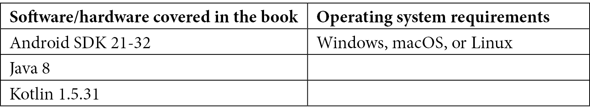

# 前言

随着应用程序代码库的增加，开发者维护现有功能并引入新功能变得越来越困难。在这本清洁架构的书中，您将学习如何识别何时以及如何出现这个问题，以及如何构建代码以克服它。

本书首先解释了清洁架构原则和 Android 架构组件，然后探讨了涉及的工具、框架和库。您将学习如何在数据和领域层中构建您的应用程序，每个层中包含的技术，以及每个层在保持应用程序清洁方面所起的作用。您将了解如何将代码组织到这两个层中，以及组装它们所涉及的组件。最后，我们将介绍表示层以及可以应用于实现解耦和可测试代码库的图案。

在本书结束时，您将能够按照清洁架构原则构建应用程序，并拥有维护和测试应用程序所需的知识。

# 本书面向对象

本书面向希望了解如何管理其应用程序复杂性的 Android 开发者，并且对于寻找清洁架构和集成各种 Android 技术的指南的中级或高级 Android 开发者来说，本书也极具推荐价值。熟悉 Android 应用开发基础的新开发者也会发现本书很有用。

# 本书涵盖内容

*第一章*，*开始使用清洁架构*，首先介绍了 Android 应用程序在业务逻辑结构方面的演变，以及这些方法引起的问题。然后，它将过渡到如何应用某些模式来解决这些问题，揭示其他一系列问题。最后，将介绍清洁架构的概念，以及如何使用其原则来解决之前提出的一些问题。

*第二章*，*深入数据源*，介绍了可用于实现数据层以及书中后续将使用的工具和框架，例如 Kotlin 流和协程、Retrofit、Room 和 DataStore。

*第三章*，*理解 Android 上的数据表示*，介绍了可用于实现表示层的 Android 工具和框架，并将详细说明和扩展书中后续将使用的工具，例如 Android ViewModel 和 Jetpack Compose。

*第四章*，*管理 Android 应用程序中的依赖项*，提供了依赖注入的快速概述及其工作原理。它简要探讨了 Android 开发中可用的某些依赖注入工具，并以 Hilt 依赖注入框架结束，因为它将在本书的许多练习中使用，并对它进行了更详细的解释。

*第五章*，*构建 Android 应用程序的领域层*，描述了如何构建领域层以及该层包含哪些组件。您将了解实体和用例或交互器，以及它们在设计应用程序架构时扮演的角色。

*第六章*，*组装仓库*，涵盖了数据层及其在管理应用程序数据时的职责，以及它如何使用仓库模式来实现这一点。

*第七章*，*构建数据源*，继续探索数据层以及可以在 Android 中定义的一些数据源示例。您将了解如何使用远程数据源从各种服务器加载数据，以及本地数据源，如 Room 和 DataStore。

*第八章*，*实现 MVVM 架构*，介绍了 MVVM 架构模式及其如何在应用程序的表现层中使用。您将学习如何使用 Android ViewModel 和 LiveData 构建 MVVM 应用程序并将用例集成到 ViewModel 中。

*第九章*，*实现 MVI 架构*，介绍了 MVI 架构模式及其如何在应用程序的表现层中使用。您将学习如何使用 Kotlin 流和 Android ViewModel 来实现 MVI 模式。

*第十章*，*整合一切*，通过分析实现这些概念的应用程序示例，探讨了干净架构的好处，然后添加了 Espresso 和 Jetpack Compose 的仪器测试。UI 测试的引入是一个很好的例子，说明了我们如何在不修改应用程序代码的情况下，为了测试目的注入和更改应用程序中的某些行为。

# 为了充分利用本书

您需要在您的计算机上安装 Android Studio IDE（版本 Arctic Fox 2020.3.1 Patch 3 或更高版本）并安装 Java 8。使用 Java 11 等较新版本的 Java 可能会在构建某些练习时导致错误。在尝试本书中提供的练习之前，建议您了解如何在模拟器或设备上触发构建以及从 Android Studio 中进行 Gradle 同步。



您可以通过优化数据加载方式、引入内存缓存或集成新的网络调用以获取用户额外的数据来扩展本书的最终练习。您还可以通过添加与数据列表的交互、打开新屏幕并断言正确数据显示来改进仪器测试。

**如果您正在使用本书的数字版，我们建议您亲自输入代码或从本书的 GitHub 仓库（下一节中提供链接）获取代码。这样做将帮助您避免与代码复制和粘贴相关的任何潜在错误。**

# 下载示例代码文件

本书代码包也托管在 GitHub 上，网址为[`github.com/PacktPublishing/Clean-Android-Architecture`](https://github.com/PacktPublishing/Clean-Android-Architecture)。如果代码有更新，它将在现有的 GitHub 仓库中更新。

我们还有其他来自我们丰富图书和视频目录的代码包，可在[`github.com/PacktPublishing/`](https://github.com/PacktPublishing/)找到。查看它们！

# 代码实战

本书代码实战视频可在[`bit.ly/3LqAa30`](https://bit.ly/3LqAa30)查看

# 下载彩色图像

我们还提供了一份包含本书中使用的截图和图表的彩色图像 PDF 文件。您可以从这里下载：[`static.packt-cdn.com/downloads/9781803234588_ColorImages.pdf`](https://static.packt-cdn.com/downloads/9781803234588_ColorImages.pdf)

# 使用的约定

本书使用了许多文本约定。

`文本中的代码`: 表示文本中的代码单词、数据库表名、文件夹名、文件名、文件扩展名、路径名、虚拟 URL、用户输入和 Twitter 昵称。以下是一个示例：“在`resources`文件夹中，创建一个名为`mockito-extensions`的子文件夹。在这个文件夹中，创建一个名为`org.mockito.plugins.MockMaker`的文件，并在该文件中添加文本`mock-maker-inline`。”

代码块设置如下：

```java
data class User(
    val id: String,
    val firstName: String,
    val lastName: String,
    val email: String
) {
    fun getFullName() = "$firstName $lastName"
}
```

当我们希望您注意代码块中的特定部分时，相关的行或项目将以粗体显示：

```java
…
@Composable
fun Screen(viewModel: MainViewModel = viewModel(factory = MainViewModelFactory())) {
    viewModel.uiStateLiveData.observeAsState().value?.let {
        UserList(uiState = it)
    }
}
…
```

**粗体**: 表示新术语、重要单词或屏幕上看到的单词。例如，菜单或对话框中的单词会以**粗体**显示。以下是一个示例：“在 Android Studio 中使用**Empty Compose Activity**创建一个新项目。”

小贴士或重要注意事项

看起来像这样。

# 联系我们

我们始终欢迎读者的反馈。

**一般反馈**: 如果您对本书的任何方面有疑问，请通过 customercare@packtpub.com 发送电子邮件，并在邮件主题中提及本书标题。

**勘误**：尽管我们已经尽一切努力确保内容的准确性，但错误仍然可能发生。如果您在这本书中发现了错误，我们将非常感激您能向我们报告。请访问[www.packtpub.com/support/errata](http://www.packtpub.com/support/errata)并填写表格。

**盗版**：如果您在互联网上发现任何形式的我们作品的非法副本，如果您能提供位置地址或网站名称，我们将不胜感激。请通过版权@packtpub.com 与我们联系，并附上材料的链接。

**如果您有兴趣成为作者**：如果您在某个领域有专业知识，并且您有兴趣撰写或为书籍做出贡献，请访问[authors.packtpub.com](http://authors.packtpub.com)。

# 分享您的想法

一旦您阅读了《Clean Android Architecture》，我们非常期待听到您的想法！请点击此处直接进入此书的亚马逊评论页面并分享您的反馈。

您的评论对我们和科技社区都非常重要，它将帮助我们确保我们提供的是高质量的内容。
