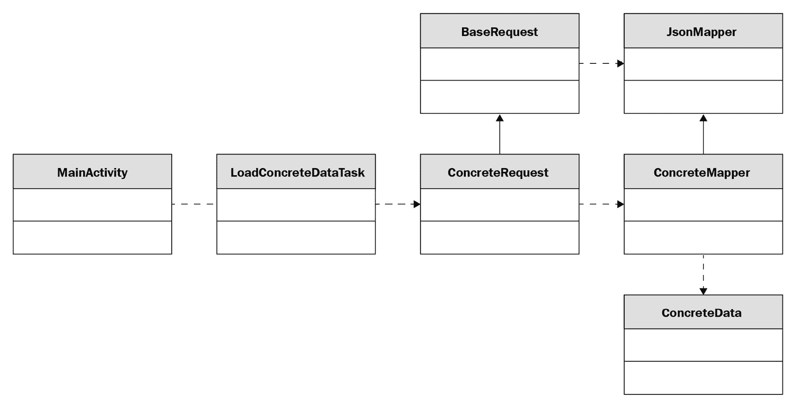
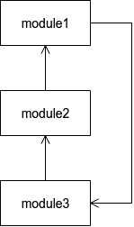
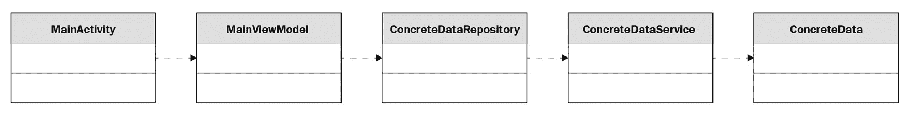
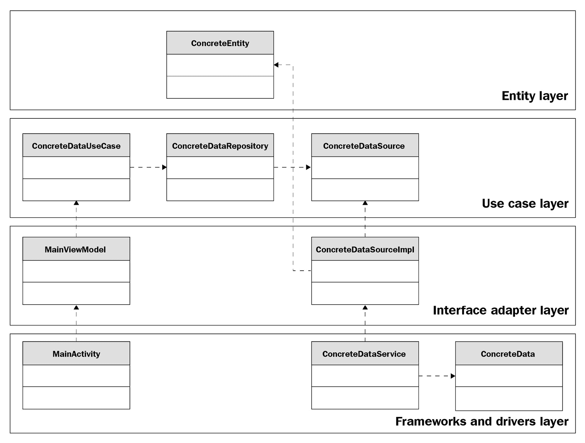

# 第一章：*第一章*：开始使用清洁架构

在本章中，我们将回顾过去如何实现一个功能，同时分析该方法可能存在的问题和问题。然后，我们将探讨软件开发的一些关键设计原则，并将这些原则应用于我们的遗留示例。之后，我们将介绍 Android 平台的演变以及出现的各种库和框架。我们还将看到它们如何在遵守各种软件设计原则的同时进行集成。

之后，我们将介绍清洁架构，以便我们知道我们的系统需要改进什么，以及作为开发者，我们必须提出哪些问题，以便我们可以创建一个健壮、可扩展、可维护和可测试的应用程序。

本章我们将涵盖以下主要主题：

+   遗留应用程序的架构

+   软件设计原则

+   探索 Android 的演变

+   进入清洁架构

到本章结束时，您将了解 Android 开发的演变、其架构和设计概念，以及清洁架构的概念以及如何用它来构建灵活、可维护和可测试的应用程序。

# 技术要求

对于本章，您需要 Android Studio Arctic Fox 2020.3.1 补丁 3。

以下是本章的硬件要求：

+   Windows:

    +   64 位 Microsoft® Windows® 8/10

    +   x86_64 CPU 架构；第二代 Intel Core 或更新的处理器，或支持 Windows Hypervisor 的 AMD CPU

    +   至少 8 GB 的 RAM 或更多

    +   至少 8 GB 的可用磁盘空间（IDE + Android SDK + Android 模拟器）

    +   最小屏幕分辨率 1,280 x 800

+   Mac:

    +   macOS® 10.14 (Mojave) 或更高版本

    +   基于 ARM 的芯片，或支持 Hypervisor.Framework 的第二代 Intel Core 或更新的处理器

    +   至少 8 GB 的 RAM 或更多

    +   至少 8 GB 的可用磁盘空间（IDE + Android SDK + Android 模拟器）

    +   最小屏幕分辨率 1,280 x 800

+   Linux:

    +   支持 Gnome、KDE 或 Unity DE 的任何 64 位 Linux 发行版；GNU C Library (glibc) 2.31 或更高版本

    +   x86_64 CPU 架构；第二代 Intel Core 或更新的处理器，或支持 AMD 虚拟化 (AMD-V) 和 SSSE3 的 AMD 处理器

    +   至少 8 GB 的 RAM 或更多

    +   至少 8 GB 的可用磁盘空间（IDE + Android SDK + Android 模拟器）

    +   最小屏幕分辨率 1,280 x 800

# 遗留应用程序的架构

在本节中，我们将回顾 Android 应用程序过去是如何构建的，以及开发者在使用该方法时遇到的困难。

在我们开始分析一个较老的应用程序之前，我们必须区分应用程序的架构和设计。借用建筑行业的术语，我们可以将架构定义为建筑结构的计划；设计则是指创建建筑每个部分的计划。将这一概念转化为软件工程领域，我们可以认为应用程序或系统的架构是定义一个计划，该计划将包含业务和技术需求，而软件设计则涉及将所有组件、模块和框架整合到这个计划中。在一个理想的世界里，你希望以识别你房屋架构的方式识别应用程序的架构。

现在，让我们看看 Android 应用程序的四个主要组件：

+   **活动**：这些代表与用户交互的入口点。

+   **服务**：这些代表应用程序在后台运行的原因入口点，例如大型下载或音频播放。

+   **广播接收器**：这些允许系统以各种原因与应用程序交互。

+   **内容提供者**：这些代表应用程序管理应用数据的方式。

使用和依赖这些组件给开发者带来了挑战，因为应用程序的架构变得依赖于 Android 框架，尤其是在实现单元测试时。为了理解为什么这是一个问题，让我们看看一些较老的应用程序代码的例子。假设你被要求从一个后端服务获取一些数据。这些数据将通过 HTTP 连接以 JSON 的形式提供。

看到一个像`BaseRequest.java`这样的类并不罕见，它会执行请求并依赖于`JsonMapper.java`这种形式的抽象来将数据从`String`转换为**普通 Java 对象**（**POJO**）。以下代码展示了如何实现获取数据的一个示例：

```java
public class BaseRequest<O> {
    private final JsonMapper<O> mapper;
    protected BaseRequest(JsonMapper<O> mapper) {
        this.mapper = mapper;
    }
    public O execute() {
        try {
            URL url = new URL("schema://host.com/path");
            HttpURLConnection urlConnection = 
                (HttpURLConnection) url.openConnection();
            int code = urlConnection.getResponseCode();
            StringBuilder sb = new StringBuilder();
            BufferedReader rd = new BufferedReader(new 
            InputStreamReader(urlConnection.
                getInputStream()));
            String line;
            while ((line = rd.readLine()) != null) {
               sb.append(line);
            }
            return mapper.convert(new JSONObject
                (sb.toString()));
        } catch (Exception e) {
            …
        } finally {
            if (urlConnection != null) {
                urlConnection.disconnect();
            }
        }
        return null;
    }
}
```

在`execute`方法中，我们会使用`HttpURLConnection`连接到后端服务并检索数据。然后，我们会将其读取到一个`String`中，接着将其转换为`JSONObject`，然后传递给`JsonMapper`以转换为 POJO。

`JsonMapper.java`接口可能看起来像这样：

```java
interface JsonMapper<T> {
    T convert(JSONObject jsonObject) throws JSONException;
}
```

此接口代表了将`JSONObject`转换为任何 POJO 的抽象。

泛型使用允许我们将这种逻辑应用于任何 POJO。在我们的案例中，POJO 应该看起来像`ConcreteData.java`：

```java
public class ConcreteData {
    private final String field1;
    private final String field2;
    public ConcreteData(String field1, String field2) {
        this.field1 = field1;
        this.field2 = field2;
    }
    public String getField1() {
        return field1;
    }
    public String getField2() {
        return field2;
    }
}
```

`ConcreteData`类将负责存储我们从后端服务接收到的数据。在这种情况下，我们只有两个`String`实例变量。

现在，我们需要创建一个具体的`JsonMapper.java`，它将负责将`JSONObject`转换为`ConcreteData`：

```java
public class ConcreteMapper implements JsonMapper<ConcreteData> {
    @Override
    public ConcreteData convert(JSONObject jsonObject) {
        return new ConcreteData(jsonObject.optString
            ("field1"), jsonObject.optString("field2"));
    }
} 
```

`convert`方法创建一个新的`ConcreteData`对象，从`JSONObject`对象中提取数据，并填充`field1`和`field2`的值。

接下来，我们必须创建一个扩展`BaseRequest`并使用`ConcreteMapper`的`ConcreteRequest.java`：

```java
public class ConcreteRequest extends BaseRequest<ConcreteData> {
    public ConcreteRequest() {
        super(new ConcreteMapper());
    }
}
```

这个类将从`BaseRequest`继承`execute`方法，并提供一个新的`ConcreteMapper`对象，以便我们可以将后端数据转换为`ConcreteData`。

最后，我们可以在我们的`Activity`中使用这个方法来执行请求并更新我们的`AsyncTask`类，该类提供了一套在单独的线程上执行工作并在主线程上处理结果的方法。然而，使用内部`AsyncTask`类可能会创建上下文泄露的风险（如果由于任何原因，`Activity`对象被销毁，那么在`AsyncTask`运行时垃圾收集器将无法收集`Activity`对象，因为`Activity`依赖于`AsyncTask`）。为了避免这种情况，建议的方法是为我们的`Activity`创建一个`WeakReference`。这样，如果`Activity`对象被用户或系统销毁，其引用可以被垃圾收集器收集。

现在，让我们看看我们的`MainActivity`的代码：

```java
public class MainActivity extends Activity {
    private TextView textView;
    @Override
    protected void onCreate(Bundle savedInstanceState) {
        super.onCreate(savedInstanceState);
        setContentView(R.layout.activity_main);
        this.textView = findViewById(R.id.text_view);
        new LoadConcreteDataTask(this).execute();
    }
    private void update(ConcreteData concreteData) {
        textView.setText(concreteData.getField1());
    }    
}
```

这个类负责加载 UI 并启动`LoadConcreteDataTask`。然后，`LoadConcreteDataTask`将调用`update`方法来在用户界面中显示数据。

`LoadConcreteDataTask`必须是`MainActivity`的内部类：

```java
public class MainActivity extends Activity {
    …
    private static class LoadConcreteDataTask extends 
        AsyncTask<Void, Void, ConcreteData> {
        private final WeakReference<MainActivity> 
            mainActivityWeakReference;
        private LoadConcreteDataTask(MainActivity 
           mainActivity) {
            this.mainActivityWeakReference = new 
                WeakReference<>(mainActivity);
        }
        @Override
        protected ConcreteData doInBackground(Void... 
            voids) {
            return new ConcreteRequest().execute();
        }
        @Override
        protected void onPostExecute(ConcreteData 
            concreteData) {
            super.onPostExecute(concreteData);
            MainActivity mainActivity = 
                mainActivityWeakReference.get();
            if (mainActivity != null) {
                mainActivity.update(concreteData);
            }
        }
    }
}
```

在`LoadConcreteDataTask`中，我们利用`doInBackground`方法，它在单独的线程上执行以加载数据，然后在`onPostExecute`方法中更新我们的 UI。我们还持有`MainActivity`的`WeakReference`，以便在销毁时可以安全地垃圾回收。这也意味着在更新用户界面之前，我们需要检查引用是否仍然存在。

上述代码的类图如下所示：



图 1.1 – 一个较老 Android 应用的类图

在这里，我们可以看到依赖关系如何从`MainActivity`移动到`ConcreteRequest`类，其中`MainActivity`和`LoadConcreteDataTask`之间存在一个例外，这两个类相互依赖。这是一个问题，因为类之间耦合在一起，对其中一个的更改意味着对另一个的更改。在本章的后面部分，我们将探讨一些可以帮助我们避免此类依赖关系的原则。

既然我们已经了解了遗留应用程序的样子，让我们看看如果我们遵循这条路径可能会遇到哪些问题。

## 遗留分析

在本节中，我们将分析遗留应用程序中的一些问题。

让我们提出以下问题：

1.  我们可以单元测试什么？

1.  如果不是显示`ConcreteData`中`field1`的值，而是需要显示`field1+field2`，会发生什么？

1.  当这个特定屏幕的需求发生变化并且需要从另一个端点检索数据时会发生什么？

1.  如果我们需要引入缓存或 SQLite 持久性会发生什么？

1.  如果另一个活动需要这个特定的用例会发生什么？

让我们来回答这些问题：

+   `androidTest` 和 `test` 目录。从理论上讲，我们可以编写我们的单元测试，以便它们可以在模拟器上运行，但这需要更多的时间和稳定性。现在，我们可以使用 Firebase Test Lab 等技术将这些类型的测试在云中执行，但这不可避免地会花费我们金钱，并且避免此类成本符合我们的利益。实际上，我们只剩下一种选择，那就是尽可能多地使用本地单元测试而不是受仪器化的测试。为了解决这个问题，我们需要将我们使用的 Android 组件与 Java 组件分开。

+   `MainActivity` 或在 `ConcreteData` 类中添加一个返回连接结果的方法。但任何一种方法都会带来不利因素。如果我们把连接移动到 `MainActivity`，我们将把可以单元测试的逻辑放入一个很难测试且不应该进行单元测试的类中。如果我们创建一个在 `ConcreteData` 中连接的方法，我们可能会给这个类赋予它不应该有的责任，因为它更多地与 UI 相关，而不是 JSON 本身的实际表示。如果将来网络方面是由另一个团队开发的，你将需要依赖那个特定的团队来创建这个更新。

+   `AsyncTask` 或在同一个 `LoadConcreteData` 类中执行两个请求然后更新 UI。如果我们创建一个单独的 `AsyncTask`，那么我们将需要让活动负责管理结果并平衡两个 `AsyncTask`，这再次产生了关于测试的问题。如果我们在一个 `AsyncTask` 中执行请求，那么 `AsyncTask` 的责任增加，我们可能想要避免这种情况。

+   `LoadConcreteDataTask`。在这里，我们遇到了与前面问题相同的问题。如果我们使用了请求类，我们最终将承担比处理数据库调用更多的责任来处理 HTTP 连接。如果我们使用 `LoadConcreteDataTask`，我们将使第五个问题的答案变得更加困难。

+   `LoadConcreteDataTask` 类。现在，让我们想象另一个具有完全不同 UI 和对数据进行不同解释的活动将依赖于相同的用例。一个解决方案是将 `LoadConcreteDataTask` 复制到新的活动中。这不是一个好主意，因为需求的变化将迫使开发者更改所有任务。更好的方法是创建一个新的抽象，这将消除 `LoadConcreteDataTask` 和 `Activity` 之间的依赖关系。这将使我们能够为两个活动重用相同的类。假设活动需要为每种解释提供不同类型的数据。在这里，我们可以遵循 `JsonMapper` 的例子，创建一个接口，将 `ConcreteData` 转换为通用类型，为每个活动提供两种实现，并创建必要的 POJO 以进行转换。

可以在这里提出的一个问题是，“将业务逻辑导出到另一个项目需要多少工作量？”这是一个重要的问题，因为它突出了我们应该如何构建我们的代码，以便其他人可以重用它，而不会给他们集成带来痛苦。如果我们回答这个问题，我们必须首先问，“业务逻辑在哪里？”答案可能是 `LoadConcreteDataTask`。我们能将其导出并发布到其他开发者可以获取的地方吗？

答案是否定的，因为它依赖于 `MainActivity`。这个问题突出了定义架构的一个重要方面，即确定组件的边界。组件可以被定义为最小的可交付代码片段。在我们的情况下，它相当于一个模块。现在，假设我们处于可以交付我们的 `LoadConcreteDataTask` 的位置。一个后续问题是，“数据是否托管在相同的服务上？”接着是，“它是否是相同的 JSON 格式？”在这里，我们需要在 `LoadConcreteDataTask` 和 `BaseRequest` 之间划清界限，并消除对数据检索方式的这种依赖。

提出并回答这些问题的原因是，所有这些场景都已经在过去发生过，它们很可能在应用程序的生命周期中再次发生。作为开发者，我们倾向于根据时间限制、我们所在团队施加的严谨性、我们通过不断挑战自己快速交付东西的雄心，以及我们的经验或团队的经验，以不同的方式回答这些问题。我们有机会选择一个不那么理想的解决方案，或者陷入一个我们必须在煎锅和火之间做出选择的情况，这代表了一个问题。有时，从我们的日常工作中退一步，问自己这些问题，进行心智实验，看看我们的代码可能如何结束在这些场景中，并评估如果现在发生或 1 或 2 年后会发生什么，这是有益的。

许多 Android 开发者发现自己处于的一个常见场景是，由于测试需要花费太多时间，并且需要尽快上市，导致缺乏对测试的投资。在这些案例中，随着时间的推移，应用程序变得越来越难以维护，因此需要雇佣更多的开发者来保持与较少开发者时的相同团队生产力。当代码以需要单元测试的概念编写时，我们编写代码的方式就会变得更加严谨和可维护。我们开始跟踪我们如何创建实例，区分我们可以测试和不能测试的事物，我们应用创建型设计模式，并且我们还缩短了我们类中方法的长度，以及其他一些事情。

现在我们已经了解了过去应用程序是如何编写的，以及由于采取的方法（例如，由于依赖 Android 框架而导致的测试性和可维护性问题）所引起的问题。接下来，我们将探讨一些将证明对我们编写应用程序有用的设计原则。

# 软件设计原则

在本节中，我们将分析一套被全球开发者采用的、用于改进他们系统的设计原则，这些原则也可以应用于 Android 开发。我们将主要关注由*罗伯特·马丁*（也称为 Uncle Bob）为类和组件定义的原则，因为它们非常适合 Android 开发。

根据上一节中的示例，我们了解到我们的代码库应该是可维护的、可理解的和灵活的。有一套软件设计原则，当我们在开发类或组件时，可以寻求帮助。将组件视为可以作为系统一部分发布的最小代码量。在 Android 中，你可以将它们视为独立的模块。它们不一定需要是模块，但可以组织成仿佛它们是模块的样子。

## SOLID 原则

这些是一些最知名的设计原则。这个名字是一个缩写，代表了一组由*罗伯特·马丁*收集的设计原则。这些原则如下：

+   单一职责原则

+   开放封闭原则

+   李斯克替换原则

+   接口隔离原则

+   依赖倒置原则

让我们详细看看这些原则：

+   使用`BaseRequest`类来改变 HTTP 请求的执行方式。假设我们现在有两个不同的 AsyncTasks 将会加载数据。这两个 AsyncTasks 都将受到`BaseRequest`类变化的影响。一个解决方案是为每个特定的用例委托请求的执行给不同的类。这也会允许开发者在不更改相同源文件的情况下，工作于与后端通信相关的不同特性。

+   **开放-封闭原则**：这表示一个类应该对扩展开放，对修改封闭。回顾我们的例子，这个原则会回答“如果一个活动需要这个特定的用例会发生什么？”这个问题。我们讨论的如何回答这个问题的抽象将作为实现此原则的好例子。

+   `Bird` 和一个名为 `Duck` 的子类。如果你在代码中使用 `Bird` 的引用，并将这些用法替换为 `Duck`，那么你的代码应该保持不变。一个违反此原则的著名例子是有一个名为 `Rectangle` 的类，它有两个名为 `width` 和 `height` 的成员，以及一个名为 `Square` 的子类。实际上，正方形是矩形的一种，但我们对正方形的建模不会是矩形，因为 `Square` 中的规则意味着宽度和高度将始终必须相同。如果你要交换这两个依赖项，那么你的代码就会出错。

+   `OnClickListener`、`OnLongClickListener` 和 `OnTouchListener`。

+   **依赖倒置原则**：这表示我们应该依赖于抽象而不是具体实现。这里的想法是尽可能多地依赖于抽象类和接口。考虑到我们很多时候都依赖于具体实现，这可能会非常困难。在这里，我们应该确定代码中那些经常开发和需要变更的部分，并在我们的代码和这些类之间引入抽象层。一种保护方法是通过依赖注入框架，如 Dagger 和 Hilt，这些框架生成工厂来创建易变组件。

SOLID 原则在**面向对象编程**（**OOP**）领域被广泛应用，以创建灵活的应用程序，能够融入新的功能和需求。以下原则是对 SOLID 原则的扩展。

## 组件内聚原则

我们可以通过组件中类的归属程度或哪些类属于某个特定组件来定义内聚性。在过去，组件是根据上下文组装的，没有任何特定的指导原则。这会导致问题，例如，组件依赖项的变化会触发此组件依赖项的变化，而这对依赖项没有任何相关性。

以下三个原则如下：

+   **重用/发布等价原则**（**REP**）：这表示我们应该将可以一起发布的类分组到组件中。在 Android 开发中，这会转化为确保你创建的每个模块都能够被其他开发者发布和使用。

+   **共同封闭原则**（**CCP**）：这表示组件应该只有一个改变的理由。这个原则是组件单职责原则的应用。

+   **通用重用原则**（**CRP**）：这一原则指出，一个组件应该只包含应该一起使用的类。这代表了你的组件的接口分离原则。在 Android 中，这意味着你应该确保你的 Android 模块的用户依赖于该模块中的所有类，而不仅仅是其中的一些。

当这些原则被整合时，它们之间可能会产生冲突。REP 和 CCP 倾向于使组件更大，而 CRP 则倾向于使它们更小。理念是始终匹配当前的应用需求，并在这些原则之间找到平衡点。之后，你应该持续监控新需求如何影响这一平衡点。

现在我们已经看到如何通过组件内聚原则将 SOLID 应用于构建特定的组件，接下来让我们学习如何管理一组组件。

## 组件耦合原则

这些原则处理的是如何在 Android 应用程序中管理组件之间的关系。在 Android 中，这可以通过如何管理不同模块之间的 Gradle 依赖来表示。原则如下：

+   **无环依赖原则**：这一原则指出，我们应该避免组件之间的循环依赖。将这一原则应用于 Android，意味着我们的模块之间的依赖不应该形成循环（例如，模块 A 依赖于模块 B，而模块 B 又依赖于模块 A）。幸运的是，当前构建系统强制执行了这一规则，不允许循环依赖。解决这一问题的方法之一是创建一个新的模块，在其中应用依赖倒置原则，并使其中一个模块依赖于抽象，在第二个模块中创建实现。如果这不可能实现，我们可以创建一个新的模块，它可以依赖于现有的两个模块。以下图表中可以看到这一示例：

![图 1.2 – 循环模块依赖]



图 1.2 – 循环模块依赖

+   **稳定依赖原则**：这一原则指出，稳定性较低的模块应该依赖于稳定性较高的模块。一个组件的稳定性定义为输出依赖（对其他组件的依赖）与总依赖数的比率。这个数字越接近 0，组件就越稳定。这意味着稳定的组件应该避免因变更而引起潜在问题，因为这将对依赖于稳定组件的组件造成问题。避免稳定组件和易变组件之间依赖的一种解决方案是使用抽象组件。这些组件将只包含抽象。

+   **稳定抽象原则**：这一原则指出，可能发生变化的组件应该更加具体，而稳定的组件应该更加抽象。这一原则代表了开放封闭原则的应用。我们希望我们的高级架构决策足够灵活，以便在不修改现有源代码的情况下进行更改。我们可以通过使用抽象类来实现这一点。组件的抽象程度定义为组件内部抽象类和接口的数量与组件中类总数的比率。该值越接近 1，组件的抽象程度就越高。稳定性和抽象性都为 0 的组件代表了一个**痛苦区域**，因为它很难更改。稳定性和抽象性都为 1 的组件被称为**无用区域**，因为我们有一个没有实现的独立组件。目标是尽可能多地让组件处于 0 稳定性和 1 抽象性或 1 稳定性和 0 抽象性的范围内。

因此，我们已经探讨了应该帮助我们解决在开发应用程序时遇到的一些关键设计原则。SOLID 原则告诉我们如何将代码结构化为类，而组件内聚原则和组件耦合原则则告诉我们如何将类结构化为独立的模块，以及如何建立这些模块之间的关系。在下一节中，我们将看到这些原则如何导致 Android 平台的演变，以及应用程序现在可能的样子。

# 探索 Android 的演变

在本节中，我们将探讨对 Android 框架及其支持库的关键发布和变更，这些变更塑造了应用程序的开发，以及应用程序如何因为这些变更而发展演变。

我们首先查看了一个较老 Android 应用程序中的代码示例，然后讨论我们应该融入我们工作的设计原则。现在，让我们看看 Android 框架是如何演变的，以及我们最初的一些问题是如何得到解答的。我们将分析一些可以融入 Android 应用程序的新库、框架和技术。

## 碎片

碎片的引入旨在解决开发者面临的重要问题——即活动代码会变得太大且难以管理。它们是在 Android Honeycomb 上发布的，这是一个仅针对平板电脑的 Android 版本。引入碎片还旨在解决在横屏和竖屏活动中显示不同内容的问题。碎片旨在控制活动用户界面的部分。

另一项由片段带来的改进是能够在运行时更改和替换片段。甚至还有一个专门的后退栈用于片段，活动将负责这些片段。这带来了一些成本：片段的生命周期比活动的生命周期更加复杂，其中会有片段的视图被销毁，但片段本身并未被销毁。另一个成本是两个片段之间的通信。如果你需要更新由 Fragment1 处理的用户界面，因为 Fragment2 发生了变化，那么你需要通过活动进行通信。这意味着每次一个片段需要被不同的活动重用时，活动就必须适应这种情况：

![Figure 1.3 – Activity and fragment life cycle]

![Figure 1.03_B18320.jpg]

![Figure 1.3 – Activity and fragment life cycle]

在前面的图中，我们可以看到活动生命周期和片段生命周期的区别。我们可以观察到片段在`onCreateView`方法和`onDestroyView`方法之间有自己的内部生命周期，用于管理它们显示的视图。这通常是为什么在许多应用程序中，你会看到这些方法被用来加载数据，并在另一端取消订阅可能触发用户界面变化的任何操作。

## Gradle 构建系统

初始时，Android 开发使用 Eclipse IDE 和 Ant 作为其构建系统。这为应用程序带来了一些限制。当时，如 flavors 这样的功能是不可用的。Android Studio 的发布，以及 Gradle 构建系统的引入，提供了新的机会和功能。这使我们能够编写额外的脚本，并轻松集成插件和工具，例如应用程序的性能监控、Google Play 服务、Firebase Crashlytics 等。这通常是通过`".gradle"`文件完成的。这些文件是用一种叫做 Groovy 的语言编写的。另一个添加的改进是使用`".gradle.kts"`扩展，其中我们可以使用 Kotlin 语言提供相同的配置。以下代码显示了模块的`build.gradle`文件看起来像什么：

```java
plugins {
    id 'com.android.application'
}
android {
    compileSdk 31
    defaultConfig {
        minSdk 21
        targetSdk 31
        versionCode 1
        versionName "1.0"
    }
    buildTypes {
        release {
        }
    }
    compileOptions {
    }
}
dependencies {
    implementation ""
}
```

在`plugins`部分，我们可以定义外部插件，这些插件将提供某些方法和脚本，我们的项目可以使用。例如，包括注解处理插件、`Parcelize`插件和 Room 插件。在这种情况下，`com.android.application`插件为我们提供了`android`配置，然后我们可以使用它来指定应用程序版本、我们希望应用程序能够访问的 Android 版本、各种编译选项以及应用程序应该如何为最终用户构建的配置。在`dependencies`部分，我们指定要添加到项目中的外部库。

## 网络连接

许多流行的网络库已经出现，主要是在开源社区中。在 Google Play 中的应用程序中，很大一部分依赖于 HTTP 通信，其中很大一部分使用 JSON 数据。随着网络库的加入，JSON 序列化/反序列化到 POJOs 也被采纳。这意味着对开发者来说，与后端的通信被简化了——我们不再需要关心实际的通信是如何进行的；我们只需指向我们想要的数据来源，并提供进行此通信所需的模型。库将处理其余部分。一些最受欢迎的库包括 Volley 和 Retrofit。在对象序列化方面，我们有如 Moshi 和 GSON 这样的库。

## 谦逊的物体

由于活动和片段难以进行单元测试，它们内部的代码需要分成可测试部分和不可测试部分。由于这种必要性，出现了两种模式：**模型视图演示者**（**MVP**）和**模型视图视图模型**（**MVVM**）。有时，这些模式被称为架构模式。这不应该与整个应用程序的架构相混淆。想法是将活动和片段转变为没有逻辑的谦逊对象，保留对用户界面对象的引用，并将逻辑转移到演示者和视图模型中，我们可以为它们编写单元测试。我们将在*第八章**，*实现 MVVM 架构*中更多地关注每个模式的特定细节。

## 功能性范式

正如面向对象的语言已经从函数式编程中采纳了范式，Android 开发世界也以 RxJava 的形式采纳了这种范式。函数式编程基于这样的前提：程序是由函数的组合而不是像 Java 中的命令式语句构建的。RxJava 是一个库，允许开发者实现事件驱动应用程序。它提供了可观察对象（用于发射数据）和订阅者（用于订阅该数据）。这个库对开发者有吸引力的是它处理线程的方式。假设你想要在一个单独的线程上执行操作，然后你想要转换你的数据——在这里你需要做的就是调用你想要的数据，应用映射函数，然后订阅以获取最终结果。额外的优势是你可以链式调用不同的操作，让它们被处理，并获取所有操作的结果。所有这些都消除了创建和管理不同的 AsyncTasks 或线程的需求。

## Kotlin 的采用

RxJava 引入了函数式编程的一些方面。其采用和过渡到 Kotlin 编程语言又增加了其他方面。其中最重要的一个是可变性的概念。在 Java 中，所有变量都是可变的，除非通过 `final` 关键字声明为不可变。在 Kotlin 中，所有变量都必须声明其可变性。这为什么很重要？因为多线程。如果你有一个应用程序，其中多个线程同时执行并且它们都与同一个对象交互，你最终会陷入同时修改相同值或创建死锁的情况，其中一个线程会等待另一个线程释放资源，但第二个线程需要访问第一个线程当前持有的资源。这种引入有助于开发者追求更高的不可变性，这将增加线程安全性，因为不可变变量是线程安全的。Lambda 代表了 Kotlin 的另一个伟大特性，它允许在处理回调时减少样板代码。采用 Kotlin 的其他好处包括，你可以通过引入数据类来移除样板代码，数据类代表 POJOs，以及引入密封类，这允许开发者定义类似枚举的结构，可以携带数据。

## 依赖注入

依赖注入代表了对象调用和对象创建的解耦。为什么这很重要？主要是因为测试。为具有依赖注入的类编写单元测试比添加额外责任更容易，例如为该类中的所有依赖项创建新实例。另一个好处是在我们依赖于抽象的情况下。如果我们依赖于一个抽象，我们可以根据不同的情况轻松地在不同的实现之间切换。已经出现了几个库来解决这个问题：Dagger、Koin 和 Hilt。Dagger 更像是一个通用库，不仅适用于 Android，也适用于其他基于 Java 的平台。它旨在使用组件和模块来管理我们的依赖项。组件负责管理依赖项的方式，而模块负责提供适当的依赖项。它依赖于注解处理器，这些处理器生成负责管理我们依赖项的必要代码。Koin 被称为服务定位器库。它保存所有依赖项的集合，当需要特定的依赖项时，它会查找并提供它。Koin 是一个特定于 Android 的库，它提供了注入特定 Android 依赖项的支持。Hilt 是这些库中最新的，它是建立在 Dagger 之上的。它移除了 Dagger 所需的样板代码，并提供了对 Android 依赖项的支持。

## Android 架构组件

这通过一系列帮助开发者使他们的应用可扩展、可测试和可维护的库来表示。这些库影响处理活动、片段生命周期、数据持久化、后台工作和 UI 的组件。在这里，我们看到了生命周期所有者（如活动和片段）的概念引入，Android ViewModel 和 LiveData。这些是为了解决开发者在使用系统销毁和重新创建生命周期所有者时管理生命周期所有者状态的问题。它将过去由生命周期所有者处理并委托给 Android ViewModel 的逻辑放在了其中。Android ViewModel 和 LiveData 的组合帮助开发者实现了 MVVM 模式，这也是生命周期感知的。这意味着开发者不再需要在生命周期所有者被销毁时停止后台任务。

Room 的引入意味着开发者不再需要与 SQLite 框架进行交互，这导致了大量样板代码的编写，用于定义表和各种查询。开发者不再需要处理 SQLite 交互及其带来的众多依赖；相反，他们可以专注于创建自己的模型，并提供需要查询、删除、更新和删除的抽象；Room 将负责实际的实现。DataStore 对 SharedPreferences 的作用类似于 Room 对 SQLite 的作用。这是在我们想要以键值对的形式存储数据而不是使用整个表时的情况。DataStore 提供了两种存储数据的方式：安全类型数据和无类型安全数据。

随着这些新持久化库的添加，采用了 Repository 模式。这个模式背后的想法是创建一个将与我们应用中所有数据源进行交互的类。例如，让我们假设我们有一些数据需要从后端获取，然后可能需要存储在本地，以便用户可以离线查看。我们的仓库将负责从网络类获取数据，然后使用持久化类进行存储。仓库将位于本地和远程类以及希望访问这些数据的类之间。

关于 UI，我们现在可以访问视图绑定和数据绑定。这两者都处理活动（activities）和片段（fragments）如何处理在 XML 布局文件中声明的视图。视图绑定为我们在 XML 中定义的每个视图生成引用。这解决了开发者过去可能会遇到的问题，即从 XML 文件中删除了一个视图，但由于另一个文件中存在同名视图，应用程序仍然可以运行。这过去会导致崩溃，因为 `findViewById` 函数会返回 `null`。使用视图绑定，我们在编译时就知道我们的层次结构中有哪些视图，以及没有哪些视图。数据绑定允许我们将视图绑定到数据源。例如，我们可以将 XML 文件中的 `TextView` 直接绑定到源代码中的一个字段。这种方法通常与 MVVM 模式配合良好，其中 ViewModel 更新由 XML 中的视图绑定的某些字段。这将更新视图将显示的内容，而无需与活动交互。

## 协程和流

协程是 Kotlin 语言的一个特性。协程背后的想法是以非常简化的方式异步执行数据。我们不再需要创建线程或 AsyncTasks（已被弃用）来管理并发，因为这一切都在底层管理。其他特性包括它不受特定线程的约束，并且可以被挂起和恢复。流是协程的扩展，我们可以有多次数据发射，例如 RxJava，提供类似的好处。

## Jetpack Compose

这允许开发者通过组合函数直接在 Kotlin 中构建 UI，而不需要使用 XML 文件。这减少了构建 UI 需要编写的代码量。提供了与其他 Android 架构组件库的兼容性，使得更容易集成到您的应用程序中。以下是一个 Compose 的示例：

```java
class MainActivity : ComponentActivity() {
    override fun onCreate(savedInstanceState: Bundle?) {
        super.onCreate(savedInstanceState)
        setContent {
            ExampleTheme {
                Surface {
                    ExampleScreen()
                }
            }
        }
    }
}
@Composable
fun ExampleScreen() {
    Column(modifier = Modifier.padding(16.dp)) {
        TextField(
            value = "",
            onValueChange = {
                // Handle text change
            },
            label = { Text("Input") }
        )
        Text(text = "Example text")
        Button(onClick = {
            // Handle button click
        }) {
            Text(text = "Button")
        }
    }
}
```

在这个示例中，我们可以看到一个包含输入字段、显示 `Example Text` 的文本和一些带有 `Button` 文本的按钮的屏幕。屏幕布局被定义为带有 `@Compose` 注解的函数。然后通过 `setContent` 方法将这些内容设置在活动中，其中提供了一个主题。我们将在本书的后面部分进一步介绍 Jetpack Compose 的工作原理。

现在，让我们看看在将示例代码通过上述一些 Android 框架和更新转换后，*遗留应用程序架构*部分的代码将如何看起来。我们所有的代码现在都将迁移到 Kotlin。我们将使用 Retrofit 和 Moshi 库进行网络和 JSON 序列化，以及 Hilt 进行依赖注入，以及 ViewModel、LiveData 和 Compose 进行 UI 层。我们将在接下来的章节中讨论这些库的工作原理。

`ConcreteData` 类将看起来像这样：

```java
@JsonClass(generateAdapter = true)
data class ConcreteData(
    @Json(name = "field1") val field1: String,
    @Json(name = "field1") val field2: String
)
```

`ConcreteData`类现在是一个 Kotlin 数据类，并使用 Moshi 库进行 JSON 转换。接下来，让我们看看当我们使用 Retrofit 等工具处理 HTTP 通信时，我们的 HTTP 请求将是什么样子：

```java
interface ConcreteDataService {

    @GET("/path")
    suspend fun getConcreteData(): ConcreteData
}
```

由于我们使用 Retrofit 和 OkHttp，我们只需要定义我们想要连接的端点模板和我们想要的数据；库将处理其余部分。`suspend`关键字对于 Kotlin flows 来说将非常有用。

现在，让我们定义一个负责在单独线程上调用此 HTTP 调用的存储库类：

```java
class ConcreteDataRepository @Inject constructor(private val concreteDataService: ConcreteDataService) {

    fun getConcreteData(): Flow<ConcreteData> {
        return flow {
            val fooList = concreteDataService.
                getConcreteData()
            emit(fooList)
        }.flowOn(Dispatchers.IO)
    }
}
```

`ConcreteDataRepository`将依赖于`ConcreteDataService`，它将调用以获取数据。它将负责通过使用 Kotlin flows 在单独的线程上检索数据。构造函数将使用`@Inject`注解，因为我们使用 Hilt，它将`ConcreteDataService`注入到`ConcreteDataRepository`中。

现在，让我们创建一个`ViewModel`，它将依赖于存储库来加载适当的数据：

```java
@HiltViewModel
class MainViewModel @Inject constructor(private val concreteDataRepository: ConcreteDataRepository) :
    ViewModel() {

    private val _concreteData = MutableLiveData
        <ConcreteData>()
    val concreteData: LiveData<ConcreteData> get() = 
        _concreteData

    fun loadConcreteData() {
        viewModelScope.launch {
            concreteDataRepository.getConcreteData()
                .collect { data ->
                    _concreteData.postValue(data)
                }
        }
    }
}
```

`MainViewModel`将使用`ConcreteDataRepository`检索数据，订阅结果，并在`LiveData`中发布结果，`MainActivity`将订阅此`LiveData`。

现在，让我们创建`MainActivity`：

```java
@AndroidEntryPoint
class MainActivity : ComponentActivity() {
    override fun onCreate(savedInstanceState: Bundle?) {
        super.onCreate(savedInstanceState)
        setContent {
            Screen()
        }
    }
}

@Composable
fun Screen(mainViewModel: MainViewModel = viewModel()){
    mainViewModel.loadConcreteData()
    UpdateText()
}

@Composable
fun UpdateText(mainViewModel: MainViewModel = viewModel()) {
    val concreteData by mainViewModel.concreteData.
        observeAsState(ConcreteData("test", "test"))
    MessageView(text = concreteData.field1)

}

@Composable
fun MessageView(text: String) {
    Text(text = text)
}
```

`MainActivity`现在使用 Jetpack Compose 编写。它将在屏幕创建时触发数据加载，然后订阅`ViewModel`的`LiveData`，当数据加载时，将在屏幕上更新文本。

由于我们使用 Hilt 进行依赖注入，因此我们需要在模块中定义我们的外部依赖项，如下所示：

```java
@Module
@InstallIn(SingletonComponent::class)
class ApplicationModule {

    @Singleton
    @Provides
    fun provideHttpClient(): OkHttpClient {
        return OkHttpClient
            .Builder()
            .readTimeout(15, TimeUnit.SECONDS)
            .connectTimeout(15, TimeUnit.SECONDS)
            .build()
    }
}
```

首先，我们必须提供`OkHttp`客户端，它用于发出 HTTP 请求。

接下来，我们需要提供 JSON 序列化：

```java
@Module
@InstallIn(SingletonComponent::class)
class ApplicationModule {
    … 
    @Singleton
    @Provides
    fun provideConverterFactory(): MoshiConverterFactory = MoshiConverterFactory.create()
}
```

我们使用 Moshi 库进行 JSON 序列化，因此我们需要提供一个工厂，该工厂将被 Retrofit 用于 JSON 转换。

接下来，我们需要提供一个 Retrofit 对象：

```java
@Module
@InstallIn(SingletonComponent::class)
class ApplicationModule {
    …
    @Singleton
    @Provides
    fun provideRetrofit(
        okHttpClient: OkHttpClient,
        gsonConverterFactory: MoshiConverterFactory
    ): Retrofit {
        return Retrofit.Builder()
            .baseUrl("schema://host.com")
            .client(okHttpClient)
            .addConverterFactory(gsonConverterFactory)
            .build()
    }
}
```

Retrofit 对象需要一个基础 URL，它将作为我们后端服务的宿主，`OkHttpClient`，以及之前提供的 JSON 转换器工厂。

最后，我们需要提供之前定义的模板：

```java
@Module
@InstallIn(SingletonComponent::class)
class ApplicationModule {

    @Singleton
    @Provides
    fun provideConcreteDataService(retrofit: Retrofit): 
        ConcreteDataService =
           retrofit.create(ConcreteDataService::class.java)
}
```

在这里，我们将使用 Retrofit 创建`ConcreteDataService`的实例，该实例将通过 Hilt 注入到`ConcreteDataRepository`中。

最后，我们需要在`Application`类中初始化 Hilt：

```java
@HiltAndroidApp
class MyApplication : Application()
```

这段代码代表了 Android 开发在时间上 10 年的跳跃。回到我们在遗留分析部分提出的初始示例问题，我们可以看到我们回答了很多。如果我们想在应用中引入持久性，我们现在有一个可以为我们管理这一点的仓库。我们还拥有许多可以单独进行单元测试的类，因为 Hilt 的引入以及我们将 Android 框架依赖项分离开来。我们还引入了流程，这允许我们在需要连接到多个源并更轻松地处理多线程时操纵和处理数据。Kotlin 和 Retrofit 的引入也使我们能够减少代码量。如果我们绘制这个图，它看起来会如下所示：



图 1.4 – 一个较新 Android 应用的类图

在这里，我们可以看到类之间的依赖关系是从一个方向到另一个方向，这是另一个积极的方面。Retrofit 的引入在处理 HTTP 请求时为我们节省了很多麻烦。但是，关于如何处理 `ConcreteData` 的问题仍然存在。我们可以看到它从 `ConcreteDataService` 流向 `MainActivity`。想象一下，如果我们想从不同的 URL 提供数据，并且使用不同的 POJO 表示，这意味着所有类都必须进行更改以适应这一点。这违反了单一职责原则，因为 `ConcreteData` 类被用来服务于我们应用中的多个角色。在下一节中，我们将尝试寻求解决这个问题的方法，并讨论如何正确地构建我们的类和组件。

通过以上内容，我们已经探讨了 Android 平台和工具的演变，使用最新工具和库的应用可能的样子，以及这种演变如何解决了开发者过去遇到的一些问题。然而，我们仍未解决所有问题。在下一节中，我们将讨论清洁架构的概念以及我们如何利用它使我们的应用更加灵活，并能更好地适应变化。

# 进入清洁架构

在本节中，我们将讨论清洁架构的概念、它解决的问题以及如何将其应用于 Android 应用。

架构可以看作是构建一个能够解决业务和技术需求的高层次解决方案。目标应该是尽可能长时间地保留尽可能多的选项。从 Android 开发的角度来看，我们已经看到平台发展壮大，为了平衡平台新增的功能和我们的应用程序及其维护的新变化，我们需要为我们的应用程序提供一个非常好的基础，以便它能够适应变化。Android 开发中架构的常见方法是将应用程序分为三个层次——用户界面、领域和数据层。这里的问题是领域层依赖于数据层，因此当数据层发生变化时，领域层也需要进行相应的更改。

清洁架构代表了多种架构的集成，这些架构提供了对框架、用户界面和数据库的独立性，同时也能进行测试。其形状类似于洋葱，其中依赖关系指向内层。这些层如下：

+   **实体层**：这一层是最内层，由持有数据或业务关键功能的对象表示。

+   **用例层**：这一层实现了系统的业务逻辑。

+   **接口适配层**：这一层负责在框架和驱动程序与用例之间转换数据。这一层将包含诸如 ViewModels 和演示者等组件，以及各种转换器，这些转换器负责将网络和持久性相关的数据转换为实体。

+   **框架和驱动层**：这一层是最外层，由活动、片段、网络组件和持久性组件等组成。

让我们考虑一个场景：你最近被一家初创公司雇佣为他们的首位 Android 工程师。你已经得到了一个关于你被要求开发的应用程序应该做什么的基本想法，但并没有什么具体的内容；用户界面尚未确定，负责后端的团队本身也是新手，他们那边也没有什么具体的内容。你所知道的是一组用例，这些用例指定了应用程序的功能：登录系统、加载任务列表并添加新任务、删除任务和编辑现有任务。产品负责人告诉你，你应该使用模拟数据来工作，这样他们可以感受到产品的感觉，并与用户界面和用户体验团队讨论改进和修改。

你在这里面临一个选择：你可以尽可能快地构建产品所有者请求的产品，然后不断地重构代码以适应每个新的集成和需求的变化，或者你可以花更多的时间，考虑到未来可能对你的方法产生的影响。如果你选择第一种方法，那么你可能会发现自己处于许多开发者都曾遇到的情况，那就是回去正确地更改事物。让我们假设你选择了第二种方法。那么你需要做什么呢？你可以开始将你的代码解耦成单独的层。你知道 UI 会变化，所以你需要将其隔离，以便当它发生变化时，变化只会局限于那个特定的部分。通常，UI 被称为表示层。

接下来，你想要解耦业务逻辑。这是处理你的应用程序将使用的数据的具体事情。这通常在领域层完成。最后，你想要解耦数据的加载和存储方式。这将是你处理集成库（如 Room 和 Retrofit）的部分，通常被称为数据层。因为需求尚未确定，你还想要解耦你想要处理用例的方式，以便如果用例发生变化，你可以保护其他部分不受该变化的影响。如果你旋转*图 1.4*中的类图，你会看到对这个示例的分层方法。

正如我们之前提到的，`ConcreteData`出现在我们示例中的所有类中并不是一个好主意。这是因为，最终，我们选择 Retrofit 和 Moshi 的事实不应该影响到应用程序的其他部分。如果情况相反，活动或`ViewModel`会做同样的事情。最终，我们选择实现 UI 或我们应该使用哪个网络库代表细节。我们的领域层不应该受到这些选择中的任何影响。

我们在这里所做的是在我们系统的组件之间建立边界，以便一个组件的变化不会影响到另一个组件的变化。在 Android 中，即使我们使用了最新的库和框架，我们也应该确保我们的领域仍然受到这些框架变化的保护。回到启动示例，假设你已经选择了解耦你的组件并选择合适的边界，经过多次演示和迭代后，你的公司决定雇佣额外的开发者来开发新的、独立的功能。如果这些开发者遵循你设定的指南，他们可以以最小的重叠程度进行工作。

Android 开发文档的建议是利用模块化。其中一个论点是它提高了构建速度，因为当你在一个特定的模块上工作时，构建应用程序时不会重建其他模块 – 相反，它会缓存它们。将你的应用程序拆分为多个模块还有另一个目的。

让我们回到启动阶段。一切都很顺利，人们都很喜欢你的产品，所以你的公司决定向其他业务开放你的 API，以便它们可以集成到自己的系统中。你的公司还希望提供一个 Android 库，以便业务更容易访问你的 API。你已经在应用程序中集成了这个逻辑；你只需要导出它。你想要导出哪些功能？全部？没有？他们想要本地持久化数据吗？他们想要一些 UI 还是不要？如果你的模块是以适当的边界拆分的，那么你将能够容纳所有这些功能。我们想要的是一个可以轻松插入和拔出的系统。

将我们之前的示例过渡到这种方法，我们会有如下内容。`ConcreteData` 类和 `ConcreteDataService` 将保持不变：

```java
@JsonClass(generateAdapter = true)
data class ConcreteData(
    @Json(name = "field1") val field1: String,
    @Json(name = "field1") val field2: String
)
interface ConcreteDataService {

    @GET("/path")
    suspend fun getConcreteData(): ConcreteData
}
```

现在，我们需要隔离 Retrofit 库并为它创建接口适配器。但要做到这一点，我们需要定义我们的实体：

```java
data class ConcreteEntity(
    val field1: String,
    val field2: String
)
```

它看起来像是 `ConcreteData` 的重复，但这是一种虚假重复的情况。实际上，随着事物的演变，这两个类可能包含不同的数据，因此它们需要被分离。

为了隔离 Retrofit 调用，我们需要反转我们仓库的依赖。所以，让我们创建一个新的接口，它将返回 `ConcreteEntity`：

```java
interface ConcreteDataSource {

    suspend fun getConcreteEntity(): ConcreteEntity
}
```

在我们的实现中，我们将调用 Retrofit 服务接口：

```java
class ConcreteDataSourceImpl(private val concreteDataService: ConcreteDataService) :
    ConcreteDataSource {

    override suspend fun getConcreteEntity(): 
        ConcreteEntity {
        val concreteData = concreteDataService.
            getConcreteData()
        return ConcreteEntity(concreteData.field1, 
            concreteData.field2)
    }
}
```

在这里，我们已经调用了 `ConcreteDataService` 并将网络模型转换为实体。

现在，我们的仓库将变成以下形式：

```java
class ConcreteDataRepository @Inject constructor(private val concreteDataSource: ConcreteDataSource) {

    suspend fun getConcreteEntity(): ConcreteEntity {
        return concreteDataSource.getConcreteEntity()
    }
```

`ConcreteDataRepository` 将依赖于 `ConcreteDataSource` 以避免对网络层的依赖。

现在，我们需要构建用例来检索 `ConcreteEntity`：

```java
class ConcreteDataUseCase @Inject constructor(private val concreteDataRepository: ConcreteDataRepository) {

    fun getConcreteEntity(): Flow<ConcreteEntity> {
        return flow {
            val fooList = concreteDataRepository.
                getConcreteEntity()
            emit(fooList)
        }.flowOn(Dispatchers.IO)
    }
}
```

`ConcreteDataUseCase` 将依赖于 `ConcreteDataRepository` 来检索数据并使用 Kotlin 流发射数据。

现在，`MainViewModel` 需要被修改以调用用例。为此，它将使用 `ConcreteEntity` 中的 `field1` 对象：

```java
@HiltViewModel
class MainViewModel @Inject constructor(private val concreteDataUseCase: ConcreteDataUseCase) :
    ViewModel() {

    private val _textData = MutableLiveData<String>()
    val textData: LiveData<String> get() = _textData

    fun loadConcreteData() {
        viewModelScope.launch {
            concreteDataUseCase.getConcreteEntity()
                .collect { data ->
                    _textData.postValue(data.field1)
                }
        }
    }
}
```

`MainViewModel` 现在将依赖于 `ConcreteDataUseCase` 并检索 `ConcreteEntity`，其中它将提取 `field1`。然后这将设置在 `LiveData` 中。

`MainActivity` 将被更新以使用来自 `MainViewModel` 的 `textData` 对象：

```java
@AndroidEntryPoint
class MainActivity : ComponentActivity() {
    override fun onCreate(savedInstanceState: Bundle?) {
        super.onCreate(savedInstanceState)
        setContent {
            Screen()
        }
    }
}

@Composable
fun Screen(mainViewModel: MainViewModel = viewModel()){
    mainViewModel.loadConcreteData()
    UpdateText()
}

@Composable
fun UpdateText(mainViewModel: MainViewModel = viewModel()) {
    val text by mainViewModel.textData.
        observeAsState("test")
    MessageView(text = text)

}

@Composable
fun MessageView(text: String) {
    Text(text = text)
}
```

这样，`MainActivity` 就被更新为使用 `LiveData`，它发射一个 `String` 而不是 `ConcreteData` 对象。

最后，Hilt 模块将被更新如下：

```java
@Module
@InstallIn(SingletonComponent::class)
class ApplicationModule {
    … 
    @Singleton
    @Provides
    fun provideHttpClient(): OkHttpClient {
        return OkHttpClient
            .Builder()
            .readTimeout(15, TimeUnit.SECONDS)
            .connectTimeout(15, TimeUnit.SECONDS)
            .build()
    }

    @Singleton
    @Provides
    fun provideConverterFactory(): MoshiConverterFactory = 
        MoshiConverterFactory.create()

    @Singleton
    @Provides
    fun provideRetrofit(
        okHttpClient: OkHttpClient,
        gsonConverterFactory: MoshiConverterFactory
    ): Retrofit {
        return Retrofit.Builder()
            .baseUrl("schema://host.com")
            .client(okHttpClient)
            .addConverterFactory(gsonConverterFactory)
            .build()
    }

    @Singleton
    @Provides
    fun provideCurrencyService(retrofit: Retrofit): 
        ConcreteDataService =
        retrofit.create(ConcreteDataService::class.java)
    @Singleton
    @Provides
    fun provideConcreteDataSource(concreteDataService: 
        ConcreteDataService): ConcreteDataSource =
        ConcreteDataSourceImpl(concreteDataService)
}
```

在这里，我们可以看到 `ConcreteDataUseCase` 只调用了 `ConcreteDataRepository`，而 `ConcreteDataRepository` 又只调用了 `ConcreteDataSource`。你可能想知道为什么这个样板代码是必要的。在这种情况下，我们有一点点虚假的重复。随着代码的增长，`ConcreteDataRepository` 可能会连接到其他数据源，而 `ConcreteDataUseCase` 可能需要连接到多个存储库来合并数据。对于 `ConcreteData` 和 `ConcreteEntity` 也是如此。这种方法的另一个好处是在开发过程中强制执行更多的严谨性，并创造了一致性。

让我们看一下下面的图表，看看它与 *图 1.4* 的比较：



图 1.5 – 清洁架构

如果我们看最上面的一行，我们会看到用例和实体。我们还可以看到依赖关系是从底部的类到顶部的类，这与这里从外部层到内部层的依赖关系相似。你可能注意到的不同之处在于，我们的示例没有提到模块的使用。在本书的后面部分，我们将探讨如何将清洁架构应用于多个模块以及如何管理它们。

现在，我们回到了初创公司，你开始着手开发应用程序，其中你定义了一些实体和用例，并放置了一个简单的用户界面。产品负责人要求你明天提供一个带有一些模拟数据的演示。你能做什么？你可以创建一个新的数据源实现，并插入一些你可以用来满足演示条件的模拟对象。你展示了应用程序的演示，并收到了一些关于你用户界面的反馈。这意味着你可以更改你的活动和片段以适当地渲染数据，而这不会影响任何其他组件。如果用例发生变化会怎样？在这种情况下，这将传播到其他层。但这取决于变化，但这种情况是可以预料的。

# 摘要

在本章中，我们探讨了 Android 应用过去的样子以及开发者当时可能会遇到的所有问题。我们研究了最重要的软件设计原则，例如 SOLID，以更好地理解如何改进我们的代码以及这些原则如何帮助 Android 平台发展。我们还探讨了随着新软件范式的引入而采用的新编程语言，事件库和框架的添加，引入架构组件以帮助开发者编写更可测试的应用程序，以及构建用户界面的新方法。最后，我们介绍了清洁架构，它帮助我们构建可维护、可测试且更独立的应用程序。我们通过一个小示例来观察所有这些变化，从它们可能在 2010 年的样子到它们现在的样子。

在下一章中，我们将深入探讨在 Android 上加载、存储和管理数据的库。我们将结合它们使用干净的架构来构建一个应用程序。
