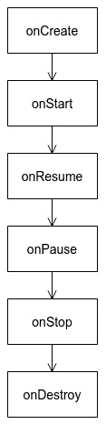
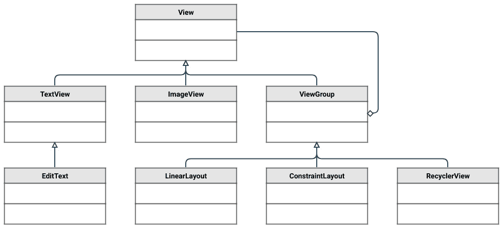
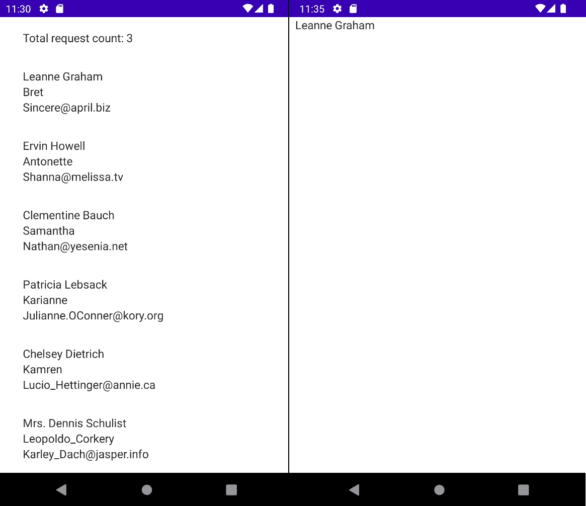

# 第三章：*第三章*: 在 Android 上理解数据展示

在本章中，我们将研究可用于在 `ViewModel` 和 `Lifecycle` 库上展示数据的库。然后，我们将分析 UI 工作的一些方面，并查看 Jetpack Compose 库如何通过其声明式方法彻底改变了 UI 的构建。最后，我们将探讨如何使用带有 `Compose` 扩展的 `Navigation` 库在 Compose 中构建的不同屏幕之间进行导航。

本章将涵盖以下主要内容：

+   分析生命周期感知组件

+   使用 Jetpack Compose 构建用户界面

到本章结束时，你将熟悉如何使用 ViewModel 和 Compose 在 UI 上展示数据。

# 技术要求

硬件和软件要求如下：

+   Android Studio Arctic Fox 2020.3.1 补丁 3

本章的代码文件可以在以下位置找到：[`github.com/PacktPublishing/Clean-Android-Architecture/tree/main/Chapter3`](https://github.com/PacktPublishing/Clean-Android-Architecture/tree/main/Chapter3)。

查看以下视频，了解代码的实际应用：[`bit.ly/3lmMIOg`](https://bit.ly/3lmMIOg)

# 分析生命周期感知组件

在本节中，我们将分析活动和片段的生命周期以及在使用它们时可能出现的潜在问题。我们还将观察 ViewModel 和 LiveData 的引入如何解决这些问题。

当 Android 操作系统和其开发框架发布时，活动是开发应用程序时最常用的组件，因为它们代表了应用程序与用户之间交互的入口点。随着显示技术和分辨率的提高，应用程序可以展示更多用户可以与之交互的信息和控制。对于开发者来说，这意味着管理单个活动逻辑所需的代码量增加了，尤其是在处理横屏和竖屏的不同布局时。片段的引入旨在解决这些问题之一。处理屏幕不同部分的逻辑的责任现在可以分配到不同的片段中。

然而，片段的引入并没有解决开发者所面临的所有问题，主要是因为活动和片段都有自己的生命周期。处理生命周期创造了应用程序出现上下文泄漏的可能性，而生命周期的组合和继承使得活动和片段都难以进行单元测试。

活动的生命周期如下：



图 3.1 – 活动生命周期

在 *图 3.1* 中，我们可以看到活动最著名的六个状态：

+   *创建时间*: 当调用 `onCreate` 方法时，活动进入此状态。当系统创建活动时，将调用此方法。

+   *启动*：当调用`onStart`方法时，活动进入此状态。这将在活动对用户可见时被调用。

+   *已恢复*：当调用`onResume`方法时，活动进入此状态。这将在活动获得焦点（用户可以与之交互）时被调用。

当活动不再获得焦点时，将调用以下三个状态。这可能是由于用户关闭活动、将其置于后台或另一个组件获得焦点引起的：

+   *暂停*：当调用`onPause`方法时，活动进入此状态。这将在活动可见但不再获得焦点时被调用。

+   *停止*：当调用`onStop`方法时，活动进入此状态。这将在活动不再可见时被调用。

+   *销毁*：当调用`onDestroy`方法时，活动进入此状态。这将在操作系统销毁活动时被调用。

当我们在代码中使用活动时，处理生命周期将看起来像这样：

```kt
class MyActivity : Activity() {
    override fun onCreate(savedInstanceState: Bundle?) {
        super.onCreate(savedInstanceState)
    }
    override fun onStart() {
        super.onStart()
    }
    override fun onResume() {
        super.onResume()
    }
    override fun onPause() {
        super.onPause()
    }
    override fun onStop() {
        super.onStop()
    }
    override fun onDestroy() {
        super.onDestroy()
    }
}
```

我们可以看到，我们需要扩展`Activity`类，如果我们想在特定状态下执行特定操作，我们可以覆盖与该状态相关的方法并调用`super`调用。这是活动难以进行单元测试的主要原因。`super`调用不仅会调用我们的代码，还会调用父类的代码。活动难以测试的另一个原因是系统是实例化类的，这意味着我们无法使用类的构造函数进行注入，而必须依赖于设置器来注入模拟对象。

应该在*销毁*状态和垃圾回收之间做出重要区分。一个*销毁*的活动并不意味着它将被垃圾回收。垃圾回收的简单定义是：垃圾回收是释放不再使用的内存的过程。每个创建的对象都会占用一定量的内存。当垃圾回收器想要释放内存时，它会查看那些不再被其他对象引用的对象。如果我们想确保对象将被垃圾回收，我们需要确保那些比它们存活时间长的其他对象不会引用我们想要回收的对象。在 Android 中，我们希望调用`onDestroy`方法。这是因为它们往往占用大量内存，如果我们调用`onDestroy`方法之后的任何方法，最终会导致崩溃或错误。防止上下文对象被回收的泄漏被称为**上下文泄漏**。让我们来看一个简单的例子：

```kt
interface MyListener {
    fun onChange(newText: String)
}
object MyManager {
    private val listeners = mutableListOf<MyListener>()
    fun addListener(listener: MyListener) {
        listeners.add(listener)
    }
    fun performLogic() {
        listeners.forEach {
            it.onChange("newText")
        }
    }
}
```

在这里，我们有一个`MyManager`类，其中我们收集在调用`performLogic`时将被调用的`MyListener`列表。请注意，`MyManager`类是使用`object`关键字定义的。这将使`MyManager`类成为静态的，这意味着类的实例将与应用程序进程的生命周期一样长。如果我们想让活动在调用`performLogic`方法时进行监听，我们将有如下所示的内容：

```kt
class MyActivity : Activity(), MyListener {
    override fun onCreate(savedInstanceState: Bundle?) {
        super.onCreate(savedInstanceState)
        MyManager.addListener(this)
    }
    override fun onChange(newText: String) {
        myTextView.setText(newText)
    }
}
```

在这里，`MyListener`在`MyActivity`中实现，当`onChange`被调用时，`myTextView`将被更新。当活动被销毁时，上下文泄露就发生在这里。由于`MyActivity`是一个`MyListener`，并且它的引用被保存在生命周期较长的`MyManager`中，垃圾收集器将不会从内存中移除`MyActivity`实例。如果在`MyActivity`被销毁后调用`performLogic`，我们将得到`NullPointerException`，因为`myTextView`将被设置为 null；或者，如果多个`MyActivity`实例泄露，这可能会消耗整个应用程序的内存。对此的一个简单修复是在销毁时移除对`MyActivity`的引用：

```kt
object MyManager {
    …
    fun removeListener(listener: MyListener){
        listeners.remove(listener)
    }
    …
}
class MyActivity : Activity(), MyListener {
    …
    override fun onDestroy() {
        MyManager.removeListener(this)
        super.onDestroy()
    }
    …
}
```

在这里，我们添加了一个简单的方法来从列表中移除`MyListener`并在`onDestroy`方法中调用它。

与片段一起工作会导致与活动相同类型的问题。片段有自己的生命周期，并从父`Fragment`类继承，这使得它们容易受到上下文泄露和难以单元测试的影响。

片段的生命周期如下：

![Figure 3.2 – Fragment 生命周期]

![Figure 3.02_B18320.jpg]

Figure 3.2 – Fragment 生命周期

在*Figure 3.2*中，我们可以看到片段具有与活动相似的生命周期状态。`onAttach`和`onDetach`回调处理片段附加到和从活动中分离的情况。当活动完成其自己的`onCreate`调用时，会调用`onActivityCreated`。`onCreateView`和`onDestroyView`回调处理填充和销毁片段的视图。这些回调存在的一个原因是片段回退栈。这是一个栈结构，其中保存了片段，以便当用户按下*Back*按钮时，当前片段从栈中弹出，并显示上一个片段。当片段在回退栈中被替换时，它们不会被完全销毁；只是销毁它们的视图以节省内存。当它们被弹出以供用户查看时，它们将不会被重新创建，并且会调用`onCreateView`。

为了解决处理活动和片段生命周期引起的问题，创建了一套库，这些库是`androidx.lifecycle`组的一部分。引入了`Lifecycle`类，它负责保持当前的生命周期状态和处理生命周期事件之间的转换。`Lifecycle`类的事件和状态如下：

![Figure 3.3 – 生命周期状态]

![Figure 3.03_B18320.jpg]

图 3.3 – 生命周期状态

在 *图 3.3* 中，我们可以看到 `Lifecycle` 类只有四个状态（*INITIALIZED*、*CREATED*、*STARTED* 和 *DESTROYED*），并且它将处理六个事件（`ON_CREATE`、`ON_START`、`ON_RESUME`、`ON_PAUSE`、`ON_STOP` 和 `ON_DESTROY`）。如果我们希望某个类具有生命周期感知能力，它将需要实现 `LifecycleOwner` 接口。活动（activities）和片段（fragments）已经实现了这个接口。我们可以看到，对于活动，事件与现有的回调相匹配，但对于片段，需要一些更改以匹配这些新事件。`onAttach`、`onDetach` 和 `onActivityCreated` 方法已被弃用，因此不应与新的 `Lifecycle` 库一起使用。对片段所做的另一个更改是引入了一个 `viewLifecycleObserver` 实例变量，它用于处理 `onCreateView` 和 `onDestroyView` 之间的生命周期。当注册生命周期感知组件并希望更新 UI 时，应使用此观察者。

在 Android 中，当发生配置更改（例如设备旋转和语言更改）时，活动（activities）和片段（fragments）将被重新创建（当前实例将被销毁，并将创建一个新的实例）。这通常会在数据加载期间发生配置更改或当我们想要恢复之前加载的数据时引起问题。`ViewModel` 类旨在解决这个问题，以及活动（activities）和片段（fragments）的可测试性问题。`ViewModel` 将一直存在，直到与之连接的活动或片段被销毁且不会被重新创建。`ViewModel` 提供了一个 `onCleared` 方法，可以重写以清除对任何挂起操作的任何订阅。

`ViewModel` 通常与一个名为 `LiveData` 的类配对。这是一个生命周期感知组件，用于观察和发射数据。这两个类的组合消除了上下文泄漏的风险，因为 `LiveData` 只会在观察者在 *STARTED* 或 *RESUMED* 状态时发射数据。一个额外的优点是它会保留最后持有的数据；因此，在配置更改的情况下，`LiveData` 中保留的最后数据将被重新发射。这个优点允许活动（activities）和片段（fragments）观察这些变化，并将 UI 恢复到它们被重新创建之前的状态。在 Jetpack Compose 中，由于 Compose 自带的状态处理类，不需要 `LiveData`。

要使用 `ViewModel` 和 `LiveData`，您需要在 `build.gradle` 中添加以下库：

```kt
implementation "androidx.lifecycle:lifecycle-viewmodel-ktx:2.4.0"
implementation "androidx.lifecycle:lifecycle-livedata-ktx:2.4.0"
```

为了与 Jetpack Compose 集成，我们需要以下内容：

```kt
implementation "androidx.lifecycle:lifecycle-viewmodel-compose:2.4.0"
implementation "androidx.compose.runtime:runtime-livedata:2.4.0 "
```

一个 `ViewModel` 和 `LiveData` 实现的例子看起来可能像这样：

```kt
class MyViewModel : ViewModel() {
    private val _myLiveData = MutableLiveData("")
    val myLiveData: LiveData<String> = _myLiveData
    init {
        _myLiveData.value = "My new value"
    }
}
```

在前面的示例中，我们扩展了 `ViewModel` 类并定义了两个 `LiveData` 实例变量。`_myLiveData` 变量定义为 `MutableLiveData` 并设置为私有，这是为了防止其他对象更改 `LiveData` 的值。`myLiveData` 变量是公共的，可以被 `Lifecycle` 拥有者用来观察 `LiveData` 的变化。

要在活动或片段中获取 ViewModel 的实例，我们可以使用以下方法：

```kt
class MainActivity : AppCompatActivity() {
    override fun onCreate(savedInstanceState: Bundle?) {
        super.onCreate(savedInstanceState)
        …
        val myViewModel : MyViewModel by viewModels()
        …
    }
}
```

在这里，`viewModels` 方法将检索 `MyViewModel` 的实例。此方法提供了传递 `ViewModelProvider.Factory` 对象的能力。这在我们需要在 ViewModel 中注入各种对象的情况下很有用。这看起来可能像这样：

```kt
        val myViewModel : MyViewModel by viewModels {
            object : ViewModelProvider.Factory {
                override fun <T : ViewModel> 
                    create(modelClass: Class<T>): T {
                    return MyViewModel() as T
                }
            }
        }
```

如果我们想观察 `LiveData` 的变化，我们需要做类似以下的事情：

```kt
class MainActivity : ComponentActivity() {
    override fun onCreate(savedInstanceState: Bundle?) {
        …
        super.onCreate(savedInstanceState)
        val myViewModel: MyViewModel by viewModels()
        myViewModel.myLiveData.observe(this) { text ->
            myTextView.text = text
        }
        …
    }
}
```

在前面的示例中，我们调用了 `observe` 方法，其中我们传递活动作为 `LifecycleOwner`，并传递一个 Lambda 作为 `Observer`，当 `LiveData` 的值发生变化时，它将被调用。

如果我们想在 Jetpack Compose 中使用 `ViewModel` 和 `LiveData`，我们必须做以下事情：

```kt
@Composable
fun MyScreen(viewModel: MyViewModel = viewModel()) {
    viewModel.myLiveData.observeAsState().value?.let {
        MyComposable(it)
    }
}
@Composable
fun MyComposable(text: String){
    …
}
```

在这里，我们使用 `viewModel` 方法来获取 `MyViewModel` 实例。此方法还提供了传递 `ViewModelProvider.Factory` 实例的可能性，例如之前的 `viewModel` 方法。`observeAsState` 扩展方法将观察 `LiveData` 的变化并将它们转换为 Compose 的 `State` 对象。

在本节中，我们讨论了活动（activities）和片段（fragments）的生命周期如何工作，以及开发者处理它们时遇到的问题。我们分析了生命周期感知组件（如 ViewModel 和 LiveData）是如何解决这些问题的。`ViewModel` 类本身代表了对 **模型-视图-ViewModel**（**MVVM**）模式的实现，这将在未来的章节中讨论。在下一节中，我们将查看一个练习，我们将使用 ViewModel 和 LiveData，并将它们与 Kotlin 流结合起来。

## 练习 3.1 – 使用 ViewModel 和 LiveData

修改 *第 2.5 章* 的 *练习 2.5*，即 *第二章*，*深入数据源*，以便将 UI 的状态保存在 `MainViewModel` 内部的 `LiveData` 对象中，而不是使用 Compose 的 `State` 对象，并显示 `"Total request count: x"`，其中 `x` 是列表顶部的请求数量。

要完成这个练习，你需要构建以下内容：

+   在 `strings.xml` 中添加指定的文本。

+   创建一个 `MainTextFormatter` 类，它将有一个返回 `"Total request count: x"` 文本的方法。

+   在 `MainViewModel` 中添加对 `MainTextFormatter` 的依赖，并将格式化后的文本作为值传递给 `UiState.count` 对象。

+   删除 `resultState` 并用 `LiveData` 对象替换它。

+   更新 `@Composable` 函数以使用 `LiveData`。

按照以下步骤完成练习：

1.  将 Jetpack Compose 的 `LiveData` 扩展库添加到 `app/build.gradle`：

    ```kt
        implementation "androidx.compose.runtime:runtime-livedata:$compose_version"
    ```

1.  在 `strings.xml` 中添加 `"Total request count"` 文本：

    ```kt
        <string name="total_request_count">Total request count: %d</string>
    ```

1.  按照以下方式创建 `MainTextFormatter` 类：

    ```kt
    class MainTextFormatter(private val 
        applicationContext: Context) {
        fun getCounterText(count: Int) =
            applicationContext.getString(R.string.total_request_co
        unt, count)
    }
    ```

我们创建这个类的原因是为了防止 `MainViewModel` 类内部可能出现的上下文泄漏，通过在 `MainViewModel` 类中包含一个 `Context` 对象。在这里，我们有一个方法，它将计数作为参数并返回所需的文本。

1.  在 `MainViewModel` 中注入 `MainTextFormatter` 并使用格式化文本作为 `UiState.count` 对象的值：

    ```kt
    class MainViewModel(
        …
        private val mainTextFormatter: MainTextFormatter
    ) : ViewModel() {
        …
        init {
            viewModelScope.launch {
                    …
                    .flatMapConcat { users ->
                        appDataStore.savedCount.map { 
                            count ->
                            UiState(
                                users,
                               mainTextFormatter.getCounterText(count)
                            )
                        }
                    }
                    …
            }
        }
    }
    ```

1.  接下来，在 `MyApplication` 类中创建 `MainTextFormatter` 类的实例：

    ```kt
    class MyApplication : Application() {
        companion object {
            …
            lateinit var mainTextFormatter: 
                MainTextFormatter
        }
        override fun onCreate() {
            super.onCreate()
            …
            mainTextFormatter = MainTextFormatter(this)
        }
    }
    ```

1.  现在，更新 `MainViewModelFactory` 以使用刚刚创建的 `MainTextFormatter`，并将其传递给 `MainViewModel`：

    ```kt
    class MainViewModelFactory : ViewModelProvider.Factory {
        override fun <T : ViewModel> create(modelClass: 
            Class<T>): T =
            MainViewModel(
                MyApplication.userService,
                MyApplication.userDao,
                MyApplication.appDataStore,
                MyApplication.mainTextFormatter
            ) as T
    }
    ```

1.  接下来，将 `LiveData` 添加到 `MainViewModel`：

    ```kt
    class MainViewModel(
        …
    ) : ViewModel() {
        private val _uiStateLiveData = 
            MutableLiveData(UiState())
        val uiStateLiveData: LiveData<UiState> = 
            _uiStateLiveData
        init {
            viewModelScope.launch {
                    …
                    .collect {
                        _uiStateLiveData.value = it
                    }
            }
        }
    }
    ```

这里，我们定义了两个 `LiveData` 变量，一个用于更新值，另一个用于观察，并在 `collect` 方法中更新 `LiveData` 的值。

1.  在 `MainActivity` 中，更新 `@Composable` 函数以使用 `LiveData`：

    ```kt
    …
    @Composable
    fun Screen(viewModel: MainViewModel = viewModel(factory = MainViewModelFactory())) {
        viewModel.uiStateLiveData.observeAsState().value?.let {
            UserList(uiState = it)
        }
    }
    …
    ```

在这里，我们调用来自 `MainViewModel` 的 `LiveData` 的 `observeAsState` 扩展方法，然后调用 `UserList` 方法，这将针对每个新值重新绘制 UI。


图 3.4 – 练习 3.1 的输出

如果我们运行应用程序，我们将看到相同的用户列表，在顶部，我们将看到 `"Total request count: x"` 而不是之前仅有的 `x` 字符，如图 3.4 所示。在这个练习中，我们使用了 Jetpack Compose 来渲染 UI。在接下来的部分中，我们将分析 Android 如何处理 UI，并更深入地探讨 Jetpack Compose 框架。

# 使用 Jetpack Compose 构建 UI

在本节中，我们将分析如何使用 `View` 层次结构构建 Android 应用程序的 UI，并探讨这对应用程序的影响。然后，我们将探讨 Jetpack Compose 如何简化并改变 UI 的构建方式，以及我们如何使用 Compose 创建 UI。我们将从如何与其他库集成以及如何构建简单 UI 的角度来探讨 Jetpack Compose。有关如何构建更复杂 UI 的更多信息，您可以参考以下官方文档：[`developer.android.com/jetpack/compose`](https://developer.android.com/jetpack/compose)。

Android 处理 UI 的方式是通过 `View` 层次结构。`View` 的子类处理用户可以与之交互的特定 UI 组件。层次结构看起来类似于以下图表：



图 3.5 – 视图层次结构

`TextView` 类用于在屏幕上显示文本，`EditText` 用于处理用户输入的文本，`Button` 用于在屏幕上渲染按钮。`ViewGroup` 类是一个专门的子类。它代表负责在屏幕上对视图进行分组和排列的各种布局类的基类。在这里，我们可以找到如 `LinearLayout`（按垂直或水平顺序依次分组视图）、`RelativeLayout`（相对于父视图或彼此分组视图）或更近期的 `ConstraintLayout` 类，它提供了各种方式来定位视图，而无需创建许多嵌套布局（因为它对性能不利），这就是为什么它变得非常普遍。当处理未知长度的项目列表时，会使用如 `ListView` 和 `RecyclerView` 这样的对象。两者都需要创建适配器，适配器将负责将列表中的对象与相关的 `View` 配对，以便在 UI 中渲染列表中的行。

使用 `ListViews` 容易因为滚动时为每一行重新创建视图而造成效率低下，因此在长列表中会创建大量视图，然后被垃圾回收。为了解决这个问题，开发者必须实现一个名为 `RecyclerView` 的模式，该模式通过使用 `ViewHolder` 来解决此问题。这意味着如果用户查看包含 100 项的列表，并且屏幕上有 10 项可见，那么在屏幕上可见的 10 项将会有 10 个视图来表示每一行。当用户向下滚动时，最初创建的 10 个视图将显示当前可见项的内容。开发者还可以通过扩展任何现有的 `View` 类来创建自定义视图。这在某些 UI 组件需要在不同的活动、片段或其他自定义视图中重复使用时非常有用。

为了向用户显示这些视图，我们需要使用活动和片段。对于活动，这需要在 `onCreate` 方法中调用 `setContentView` 方法，而在片段中，我们需要在 `onCreateView` 方法中返回一个 `View` 对象。我们可以在 Java 或 Kotlin 中创建活动或片段的整个布局，但这会导致编写大量代码。此外，我们可以为不同的屏幕尺寸或设备旋转使用不同的布局，这导致了使用 `res/layout` 文件夹，在其中我们可以指定布局可能的外观。以下是一个示例：

```kt
<?xml version="1.0" encoding="utf-8"?>
<androidx.constraintlayout.widget.ConstraintLayout
    xmlns:android="http://schemas.android.com/apk/res/android"
    xmlns:app="http://schemas.android.com/apk/res-auto"
    android:layout_width="match_parent"
    android:layout_height="match_parent">
    <TextView
        android:id="@+id/text_view"
        android:layout_width="wrap_content"
        android:layout_height="wrap_content"
        android:text="Hello World"
        app:layout_constraintStart_toStartOf="parent"
        app:layout_constraintTop_toTopOf="parent" />
</androidx.constraintlayout.widget.ConstraintLayout>
```

在前面的示例中，我们定义了 `ConstraintLayout`，它只包含显示 `"Hello World"` 文本的 `TextView`。为了获取 `TextView` 的引用，以便我们可以在动作或数据加载时更改文本，我们需要使用来自 `Activity` 类或 `View` 类的 `findViewById` 方法。这看起来可能如下所示：

```kt
class MainActivity : ComponentActivity() {
    override fun onCreate(savedInstanceState: Bundle?) {
        super.onCreate(savedInstanceState)
        setContentView(R.layout.activity_main)
        val textView = 
            findViewById<TextView>(R.id.text_view)
        textView.text = "Hello new world"
    }
}
```

这种方法可能会导致应用程序中的崩溃。开发者需要确保当为`Activity`或`Fragment`设置布局并使用`findViewById`时，视图被添加到布局文件中。随着 Kotlin 的引入，这最初是通过 Kotlin Synthetics 框架解决的，该框架为布局中声明的视图生成扩展。Kotlin Synthetics 会为 View 的`android:id` XML 标签生成一个扩展，这在代码中是可访问的。后来，这被`ViewBinding`所取代。当在项目中使用`ViewBinding`时，会为每个布局生成一个类，该类将持有布局中所有视图的引用，消除了与`findViewById`相关的潜在崩溃。所有这些关于创建 UI 的方法都被定义为**命令式**，因为我们需要指定界面使用的视图，并控制当数据更改时如何更新视图。

另一种方法是使用`View`层次结构，而不是使用`@Composable`函数，在`@Composable`函数中，我们指定我们想在屏幕上显示的内容，而不需要考虑如何显示它，我们还可以使用 Kotlin 以比通常更少的代码创建 UI。在 Compose 中，`Hello World`示例可能如下所示：

```kt
class MainActivity : ComponentActivity() {
    override fun onCreate(savedInstanceState: Bundle?) {
        super.onCreate(savedInstanceState)
        setContent {
            Surface {
                HelloWorld()
            }
        }
    }
}
@Composable
fun HelloWorld() {
    Text(text = "Hello World")
}
```

如果我们想因为数据的变化而更新文本，我们需要使用`Compose`库中的`State`对象。Compose 会观察这些状态，当值发生变化时，Compose 会重新绘制与该状态关联的 UI。以下是一个例子：

```kt
@Composable
fun HelloWorld() {
    val text = remember { mutableStateOf("Hello World") }
    ShowText(text = text.value) {
        text.value = text.value + "0"
    }
}
@Composable
fun ShowText(text: String, onClick: () -> Unit) {
    ClickableText(
        text = AnnotatedString(text = text),
        onClick = {
            onClick()
        })
}
```

在这个例子中，当文本被点击时，`0` 字符会被添加到文本中，并且 UI 会更新。这是因为使用了`mutableStateOf`。需要`remember`方法是因为这个状态被保存在一个`@Composable`函数内部，并且它用于在重新组合发生时（UI 被重新绘制）保持状态完整。为了使文本可点击，我们需要将`Text`改为`ClickableText`。我们使用两个`@Composable`函数的原因是我们希望尽可能使`@Composable`函数可重用。这被称为`HelloWorld`组件从无状态组件（`ShowText`）。

当涉及到渲染项目列表时，Compose 提供了一个简单的方法以`Column`（当列表长度已知且较短时）和`LazyColumn`（当项目列表未知且可能很长时）的形式渲染它们。以下是一个来自*练习 3.1*的例子：

```kt
LazyColumn(modifier = Modifier.padding(16.dp)) {
        item(uiState.count) {
            Column(modifier = Modifier.padding(16.dp)) {
                Text(text = uiState.count)
            }
        }
        items(uiState.userList) {
            Column(modifier = Modifier.padding(16.dp)) {
                Text(text = it.name)
                Text(text = it.username)
                Text(text = it.email)
            }
        }
    }
```

在这里，我们在项目列表的顶部显示一个标题，然后我们使用另一个列来设置行的填充；然后，我们使用`items`函数显示整个项目列表，并为每一行设置填充并显示一个包含三个文本的组。

如果我们要显示输入字段和按钮，我们可以查看我们在*练习 2.1*中如何实现 UI，见*第二章*，*深入数据源*：

```kt
@Composable
fun Calculator(
    a: String, onAChanged: (String) -> Unit,
    b: String, onBChanged: (String) -> Unit,
    result: String,
    onButtonClick: () -> Unit
) {
    Column(modifier = Modifier.padding(16.dp)) {
        OutlinedTextField(
            value = a,
            onValueChange = onAChanged,
            keyboardOptions = KeyboardOptions(keyboardType 
                = KeyboardType.Number),
            label = { Text("a") }
        )
        OutlinedTextField(
            value = b,
            onValueChange = onBChanged,
            keyboardOptions = KeyboardOptions(keyboardType 
                = KeyboardType.Number),
            label = { Text("b") }
        )
        Text(text = result)
        Button(onClick = onButtonClick) {
            Text(text = "Calculate")
        }
    }
}
```

在这里，我们使用了`OutlinedTextField`来渲染相当于`TextInputLayout`的效果。如果我们想要相当于简单的`EditText`，我们可以使用`TextField`。对于显示按钮，我们可以使用`Button`方法，该方法使用`Text`来渲染按钮上的文本。

Compose 还与其他库集成，例如`ViewModel`和`LiveData`：

```kt
@Composable
fun Screen(viewModel: MainViewModel = viewModel(factory = MainViewModelFactory())) {
    viewModel.uiStateLiveData.observeAsState().value?.let {
        UserList(uiState = it)
    }
}
```

在这里，我们可以将`ViewModel`作为参数传递到我们的`Composable`函数中，并使用`observeAsState`函数将`LiveData`转换为`State`对象，然后由 Compose 观察以重新绘制 UI。Compose 还支持与`Hilt`库的集成。当 Hilt 添加到项目中时，则无需为 ViewModel 指定`Factory`。

Compose 的另一个重要特性是它如何处理不同屏幕之间的导航。Compose 导航建立在`androidx.navigation`库之上。这使得 Compose 可以使用`NavHost`和`NavController`组件在屏幕之间导航。屏幕是用 Compose 构建的，这意味着仅使用 Compose 的应用程序理想情况下只有一个活动。这消除了与活动和片段生命周期相关的任何潜在问题。要将导航引入项目，需要以下库：

```kt
dependencies {
    … 
    implementation "androidx.navigation:navigation-compose:2.4.0-rc01"
    …
}
```

如果我们要从一个屏幕导航到另一个屏幕，我们需要获取`NavHostController`并将其传递给一个表示应用程序结构的`@Composable`方法：

```kt
Surface {
    val navController = rememberNavController()
    AppNavigation(navController = navController)
}
```

`AppNavigation` `@Composable`方法看起来可能如下所示：

```kt
@Composable
fun AppNavigation(navController: NavHostController) {
    NavHost(navController, startDestination = "screen1") {
        composable(route = "screen1") {
            Screen1(navController)
        }
        composable(
            route = "screen2/{param}",
            arguments = listOf(navArgument("param") { type 
                = NavType.StringType })
        ) {
            Screen2(navController, 
                it.arguments?.getString("param").orEmpty())
        }
    }
}
```

在`AppNavigation`中，我们调用`NavHost` `@Composable`函数，在其中我们将放置应用程序的屏幕以及每个屏幕的路径。在这种情况下，`Screen1`将有一个简单的路径用于导航，而`Screen2`在导航到时会需要一个参数，通过`{param}`表示法来指示。对于参数，我们需要指定参数的类型。在这种情况下，它将是`String`，`NavType.StringType`表示这一点。如果我们希望传递更复杂的参数，那么我们需要提供我们自己的自定义类型，并指示它们应该如何序列化和反序列化。当我们想要从`Screen1`导航到`Screen2`时，我们需要做以下操作：

```kt
@Composable
fun Screen1(navController: NavController) {
    Column(modifier = Modifier.clickable {
        navController.navigate("screen2/test")
    }) {
        Text(text = "My text")
    }
}
```

当在`Screen1`中点击`Column`时，它将调用`NavController`导航到`Screen2`并传递`test`参数。`Screen2`看起来如下所示：

```kt
@Composable
fun Screen2(navController: NavController, text: String) {
    Column {
        Text(text = text)
    }
}
```

`Screen2`将使用从`it.arguments?.getString("param").orEmpty()`提取的文本，并在 UI 上显示它。

在本节中，我们讨论了 Android 如何处理 UI。我们回顾了命令式方法，然后介绍了 Uis 的声明式方法。我们分析了 Jetpack Compose 库以及它试图解决的问题，例如更少的代码和不需要 XML 布局声明。它遵循来自其他技术（如 React 和 SwiftUI）的库的原则，并展示了从函数式编程的角度如何构建 UI。在下一节中，我们将查看如何使用 Compose 在应用程序的两个屏幕之间导航的练习。

## 练习 3.2 – 使用 Jetpack Compose 导航

修改 *练习 3.1*，将当前的 `@Composable` 函数移动到一个名为 `UserListScreen` 的新文件中，然后创建一个包含新 `@Composable` 函数的新文件，这些函数将渲染一个简单的文本 `UserScreen`。当列表中的用户被点击时，新屏幕将被打开，并显示用户的姓名。

要完成练习，你需要构建以下内容：

1.  创建一个名为 `AppNavigation` 的密封类，它将有两个变量。第一个变量，名为 `route`，将是 `String` 类型，第二个变量，名为 `argumentName`，也将是 `String` 类型，默认为 `empty`。`AppNavigation` 的两个子类将是 `Users`（将 `route` 变量设置为 `"users"`) 和 `User`（将 `route` 设置为 `"users/{name}"`，然后 `argumentName` 设置为 `name`，并有一个创建特定名称路由的方法）。

1.  在 `MainActivity` 中，将屏幕 `@Composable` 函数重命名为 `Users`，并使用 `NavController` 对象在列表行上设置点击监听器，导航到 `AppNavigation` 中的 `User` 类的路由。

1.  创建一个名为 `User` 的新 `@Composable` 函数，它将负责显示简单的 `Text`，并将文本作为参数显示。

1.  在 `MainActivity` 中，创建一个名为 `MainApplication` 的 `@Composable` 函数，它将使用 `NavHost` `@Composable` 函数在两个屏幕之间建立导航链接。

按照以下步骤完成练习：

1.  在 `app/build.gradle` 中添加 Compose 的 `navigation` 库：

    ```kt
    dependencies {
        … 
        implementation "androidx.navigation:navigation-compose:2.4.0-rc01"
        …
    }
    ```

1.  创建 `AppNavigation` 类，它将保存每个屏幕的路由和参数信息：

    ```kt
    private const val ROUTE_USERS = "users"
    private const val ROUTE_USER = "users/%s"
    private const val ARG_USER_NAME = "name"
    sealed class AppNavigation(val route: String, val 
        argumentName: String = "") {
        object Users : AppNavigation(ROUTE_USERS)
        object User : AppNavigation
            (String.format(ROUTE_USER, "{$ARG_USER_NAME}")
                , ARG_USER_NAME) {
            fun routeForName(name: String) = 
                String.format(ROUTE_USER, name)
        }
    }
    ```

由于导航依赖于 URL 来识别不同的屏幕，我们可以利用 Kotlin 中的密封类和对象来跟踪每个屏幕所需的输入。

1.  将 `MainActivity` 中的屏幕 `@Composable` 函数重命名为 `Users` 并添加 `NavController` 作为参数：

    ```kt
    @Composable
    fun Users(
        navController: NavController,
        viewModel: MainViewModel = viewModel(factory =  
            MainViewModelFactory())
    ) {
        viewModel.uiStateLiveData.observeAsState().value?.let {
            UserList(uiState = it, navController)
        }
    }
    ```

1.  接下来，将 `NavController` 参数传递给 `UserList` 并实现用户行的事件监听器：

    ```kt
    @Composable
    fun UserList(uiState: UiState, navController: NavController) {
        LazyColumn(modifier = Modifier.padding(16.dp)) {
            item(uiState.count) {
                Column(modifier = Modifier.padding(16.dp)) {
                    Text(text = uiState.count)
                }
            }
            items(uiState.userList) {
                Column(modifier = Modifier
                    .padding(16.dp)
                    .clickable {
                        navController.navigate
                          (AppNavigation.User.routeForName
                               (it.name))
                    }) {
                    Text(text = it.name)
                    Text(text = it.username)
                    Text(text = it.email)
                }
            }
        }
    }
    ```

1.  在 `MainActivity` 中创建 `User` `@Composable` 函数：

    ```kt
    @Composable
    fun User(text: String) {
        Column {
            Text(text = text)
        }
    }
    ```

1.  现在，创建一个使用 `NavHost` 在 `MainActivity` 中设置两个屏幕之间导航的 `App` `@Composable` 函数：

    ```kt
    @Composable
    fun App(navController: NavHostController) {
        NavHost(navController, startDestination = 
            AppNavigation.Users.route) {
            composable(route = AppNavigation.Users.route) {
                Users(navController)
            }
            composable(
                route = AppNavigation.User.route,
                arguments = listOf(navArgument
                    (AppNavigation.User.argumentName) {
                    type = NavType.StringType
                })
            ) {
                User(it.arguments?.getString(AppNavigation.User.argumentName).orEmpty())
            }
        }
    }
    ```

1.  最后，当在 `MainActivity` 中设置 `Activity` 内容时，调用 `App` 函数：

    ```kt
    class MainActivity : ComponentActivity() {
        override fun onCreate(savedInstanceState: Bundle?) {
            super.onCreate(savedInstanceState)
            setContent {
                Exercise0302Theme { 
            // Replace this with your application's theme
                    Surface {
                        val navController = 
                            rememberNavController()
                        App(navController = navController)
                    }
                }
            }
        }
    }
    ```



图 3.6 – 练习 3.2 的输出

如果我们运行应用程序，我们应该看到之前相同的用户列表，如果我们点击一个用户，它将过渡到一个新的屏幕，该屏幕将显示所选用户的姓名，如图 *图 3.6* 所示。如果我们按下 *返回* 按钮，我们应该看到初始的用户列表；这是因为默认情况下，`navigation` 库处理返回导航。

在这个练习中，我们分析了如何使用 Jetpack Compose 在应用程序中在两个屏幕之间进行导航。在未来的章节中，当我们必须在不同的模块之间导航到不同的屏幕时，我们将重新审视导航。

# 摘要

在本章中，我们分析了如何在 Android 中展示数据，并讨论了我们现在可用的库。我们探讨了 Android 生命周期以及应用程序可能面临的与生命周期相关的问题，然后探讨了库如 `ViewModel` 和 `LiveData` 如何解决这些问题的大部分。然后我们研究了 Android 中 UI 的工作方式以及我们需要如何处理使用 XML 定义布局，在这些布局中我们会插入需要显示的视图，以及当数据发生变化时我们需要如何更新视图的状态。然后我们研究了 Jetpack Compose 如何以声明式函数式的方式解决这些问题。我们基于上一章的练习来展示如何在单个应用程序中集成多个库并显示来自互联网的数据。

在下一章中，我们将处理管理应用程序内部的依赖关系以及可用于此目的的库。
