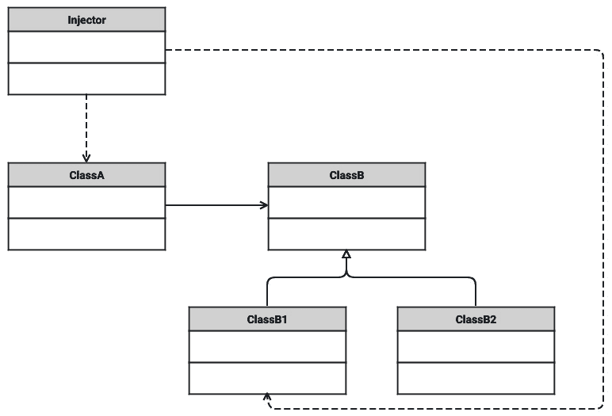
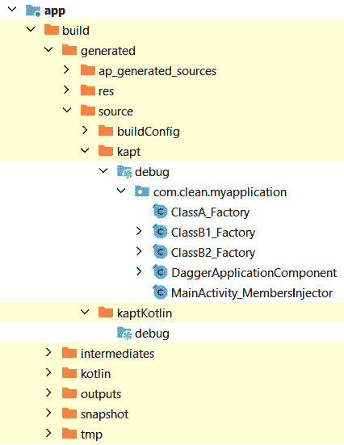

# *第四章*：在 Android 应用程序中管理依赖

在本章中，我们将分析 **依赖注入**（**DI**）的概念及其提供的优势，并查看过去在 Android 应用程序中是如何通过手动注入或使用 Dagger 2 来实现的。我们将回顾一些在 Android 应用程序中使用的库，并更详细地查看 Hilt 库以及它是如何简化 Android 应用的 DI 的。

在本章中，我们将涵盖以下主题：

+   DI 简介

+   使用 Dagger 2 管理依赖

+   使用 Hilt 管理依赖

到本章结束时，你将熟悉 DI 模式以及 Dagger 和 Hilt 等库，这些库可以用于管理 Android 应用程序中的依赖项。

# 技术要求

硬件和软件要求如下：

+   Android Studio Arctic Fox 2020.3.1 补丁 3

本章的代码文件可以在以下位置找到：[`github.com/PacktPublishing/Clean-Android-Architecture/tree/main/Chapter4`](https://github.com/PacktPublishing/Clean-Android-Architecture/tree/main/Chapter4)。

查看以下视频以查看代码的实际应用：[`bit.ly/38yFDHz`](https://bit.ly/38yFDHz)

# DI 简介

在本节中，我们将探讨 DI 是什么，它提供的优势以及这个概念是如何应用于 Android 应用的。然后，我们将探讨一些 DI 库以及它们是如何工作的。

当一个类依赖于另一个类的功能时，两个类之间就创建了一个依赖。要调用你依赖的类的功能，你需要实例化它，如下例所示：

```kt
 class ClassA() {
    private val b: ClassB = ClassB()
    fun executeA() {
        b.executeB()
    }
}
class ClassB() {
    fun executeB() {

    }
}
```

在这个例子中，`ClassA` 创建了一个新的 `ClassB` 实例，然后当调用 `executeA` 时，它将调用 `executeB`。这引发了一个问题，因为 `ClassA` 将承担创建 `ClassB` 的额外责任。让我们看看如果 `ClassB` 需要变为以下内容时会发生什么：

```kt
class ClassB(private val myFlag: Boolean) {

    fun executeB() {
        if (myFlag) {
            // Do something
        } else {
            // Do something else
        }
    }
}
```

在这里，我们向 `ClassB` 添加了 `myFlag` 变量，该变量在 `executeB` 方法中使用。这个更改将导致编译错误，因为现在 `ClassA` 需要修改才能使代码编译。

```kt
class ClassA() {
    private val b: ClassB = ClassB(true)
    fun executeA() {
        b.executeB()
    }
}
```

在这里，我们需要在创建 `ClassB` 时提供一个布尔值。

当应用程序的代码库增加时，对这些类型的变化进行修改将使维护变得困难。解决这个问题的一个方案是将我们使用依赖项的方式与我们创建依赖项的方式分开，并将创建委托给不同的对象。继续前面的例子，我们可以将 `ClassA` 重写为以下内容：

```kt
class ClassA(private val b: ClassB) {
    fun executeA() {
        b.executeB()
    }
}
```

在这里，我们移除了 `ClassB` 的实例化，并将变量移动到了 `ClassA` 的构造函数中。现在，我们可以创建一个负责创建两个类实例的类，如下所示：

```kt
class Injector() {
    fun createA(b: ClassB) = ClassA(b)
    fun createB() = ClassB(true)
}
```

在这里，我们有一个新的类，它将使用`ClassB`作为参数创建`ClassA`的实例，并且还有一个单独的方法用于创建`ClassB`的实例。理想情况下，当程序初始化时，我们需要初始化所有依赖项并适当地传递它们：

```kt
fun main(args : Array<String>) {
    val injector = Injector()
    val b = injector.createB()
    val a = injector.createA(b)
}
```

在这里，我们创建了`Injector`，它负责创建我们的实例，然后调用`Injector`的适当方法来检索每个类的适当实例。我们在这里所做的是所谓的 DI。不是`ClassA`创建`ClassB`的实例，而是它将通过构造函数注入一个`ClassB`的实例，这也被称为*构造函数注入*。

在`ClassB`中，我们在`executeB`方法中有一个`if-else`语句。我们可以在那里引入一个抽象，因此我们将`if-else`语句拆分为两个单独的实现：

```kt
class ClassA(private val b: ClassB) {
    fun executeA() {
        b.executeB()
    }
}
interface ClassB {
    fun executeB()
}
class ClassB1() : ClassB {
    override fun executeB() {
        // Do something
    }
}
class ClassB2() : ClassB {
    override fun executeB() {
        // Do something else
    }
}
```

在这里，`ClassA`保持不变，而`ClassB`已成为一个接口，有两个实现，分别称为`ClassB1`和`ClassB2`，代表`if-else`分支的实现。在这里，我们也可以使用`Injector`类来注入这两个实现之一，而无需对`ClassA`进行任何更改：

```kt
class Injector() {
    fun createA(b: ClassB) = ClassA(b)
    fun createB() = ClassB1()
}
```

在`createB`方法中，我们返回一个`ClassB1`的实例，然后稍后将其注入到`ClassA`中。这代表了 DI 的另一个好处，我们可以使我们的代码依赖于抽象而不是具体实现，并为不同的目的提供不同的具体实现。基于此，我们可以定义以下角色，当涉及到 DI 时：

+   `ClassB1`和`ClassB2`在我们的例子中）

+   `ClassB`在我们的例子中）

+   `ClassA`在我们的例子中）

+   `Injector`在我们的例子中）



Figure 4.1 – DI 类图

前面的图显示了我们的例子和 DI 模式的类图。我们可以观察到`Injector`类负责创建和注入依赖项，`ClassA`是接收依赖项的客户端，`ClassB`是接口，而`ClassB1`和`ClassB2`代表服务。

DI 的类型有多种分类，它们主要围绕两种注入依赖项的方式：

+   **构造函数注入**：依赖项通过构造函数传递。

+   **字段注入**：依赖项通过 setter 方法或更改实例变量传递。这也可以称为**setter 注入**，并且还可以扩展到**接口注入**，其中 setter 方法被抽象为一个接口。

DI 的另一个好处是它使代码更容易测试。当依赖项注入到对象中时，它使类更容易测试，因为在测试代码中，我们可以注入允许我们模拟各种行为的对象，称为**mocks**。

在本节中，我们介绍了依赖注入（DI）模式，它的工作原理以及它解决的问题。开发者可以通过设置注入器手动管理应用程序的依赖和注入。但是，随着应用程序的增长，手动管理变得越来越困难，尤其是在我们希望某些对象只与其他对象一起存在，而不是与应用程序一样长，或者处理同一类的不同实例时。有各种 DI 框架和库可以管理所有这些情况，在 Android 中，最常用的之一就是 Dagger 2。

# 使用 Dagger 2 管理依赖项

在本节中，我们将分析 Dagger 2 库，它如何处理 DI，它的工作原理，它如何集成到 Android 应用程序中，以及它可能引起的问题。

Dagger 2 库依赖于基于注解处理的代码生成，这将生成执行 DI 所需的样板代码。该库是用 Java 编写的，并且用于 Android 应用程序之外的各个项目。因为它是用 Java 编写的，所以它为用 Java、Kotlin 或两者编写的应用程序提供了兼容性。该库使用 `@Inject`、`@Named`、`@Qualifier`、`@Scope` 和 `@Singleton` 构建）。

当集成 Dagger 2 时，有三个主要概念是我们需要考虑的：

+   用于类的 `@Module` 注解和用于方法的 `@Provides` 注解。为了避免过多的 `@Module` 定义，我们可以在构造函数上使用 `@Inject` 注解，这将提供对象作为依赖项。

+   `@Inject` 注解。

+   `@Component` 注解。

为了将 Dagger 2 添加到 Android 应用程序中，你首先需要将 Kotlin 注解处理器插件添加到使用 Dagger 2 的模块的 `build.gradle` 文件中：

```kt
plugins {
    … 
    id 'kotlin-kapt'
    …
}
```

在这里，我们添加了 `kotlin-kapt` 插件以允许 Dagger 2 生成 DI 所需的代码。接下来，我们需要 Dagger 2 依赖项：

```kt
dependencies {
    …
    implementation 'com.google.dagger:dagger:2.40.5'
    kapt 'com.google.dagger:dagger-compiler:2.40.5'
    …
}
```

在这里，我们向 Dagger 2 库添加了一个依赖，以及一个用于代码生成的注解处理库的依赖。库的版本应该是库仓库中可用的最新稳定版本。

让我们重新介绍上一节中的示例：

```kt
class ClassA(private val b: ClassB) {
    fun executeA() {
        b.executeB()
    }
}
interface ClassB {
    fun executeB()
}
class ClassB1() : ClassB {
    override fun executeB() {
        // Do something
    }
}
class ClassB2() : ClassB {
    override fun executeB() {
        // Do something else
    }
}
```

这里，我们有相同的类和相同的依赖项。我们不需要定义 `Injector` 类，而是可以使用 Dagger 2 来定义 `@Module`：

```kt
@Module
class ApplicationModule {
    @Provides
    fun provideClassA(b: ClassB): ClassA = ClassA(b)
    @Provides
    fun provideClassB(): ClassB = ClassB1()
}
```

在这里，我们使用 `@Module` 注解了类，并为每个实例使用了 `@Provides` 注解。我们可以进一步使用 `@Inject` 注解来简化这一点，并从 `ApplicationModule` 中删除 `@Provides` 方法：

```kt
class ClassA @Inject constructor(private val b: ClassB) {
   …
}
class ClassB1 @Inject constructor() : ClassB {
    …
}
class ClassB2 @Inject constructor() : ClassB {
    …
}
```

在前面的代码中，我们已经为每个构造函数添加了`@Inject`。对于`ClassA`来说，它将同时扮演向`ClassB`注入的角色，并将`ClassA`作为依赖提供给其他对象。然而，存在一个问题，因为`ClassA`依赖于抽象而不是具体实现，所以 Dagger 将不知道应该为`ClassA`提供哪个实例。现在，我们可以在`ApplicationModule`中添加一个被`@Binds`注解的方法，将抽象与实现连接起来：

```kt
@Module
abstract class ApplicationModule {
    @Binds
    abstract fun bindClassB(b: ClassB1): ClassB
}
```

在这里，我们添加了`bindClassB`抽象方法，该方法被`@Binds`注解。这个方法将告诉 Dagger 2 将`ClassB1`实现与`ClassB`抽象连接起来。为了避免大的`@Provides`注解，我们应该尝试在无法修改代码的地方使用注解，而在可能的情况下使用`@Inject`在构造函数上，并使用`@Binds`。

现在，我们需要创建连接器：

```kt
@Singleton
@Component(modules = [ApplicationModule::class])
interface ApplicationComponent
```

在这里，我们定义了一个`@Component`，在其中我们指定应用程序将使用的模块。`@Singleton`注解告诉 Dagger，这个组件中的所有依赖将与应用程序的生命周期一样长。在这个时候，我们应该在应用程序上触发构建。这将触发编译，生成一个`DaggerApplicationComponent`类。这是一个`ApplicationComponent`的实现，Dagger 2 将处理它。这个类将用于创建整个依赖图。在 Android 中，我们需要一个入口点，这由`Application`类表示：

```kt
class MyApplication : Application() {
    lateinit var component: ApplicationComponent
    override fun onCreate() {
        super.onCreate()
        component = DaggerApplicationComponent.create()
    }
}
```

在这里，在`MyApplication`类中，我们使用`DaggerApplicationComponent`创建依赖图。这将遍历图中的所有模块并调用所有的`@Provides`方法。`@Component`注解还有另一个作用，即在构造函数注入不可用时定义成员注入。在 Android 中，这种情况发生在处理生命周期组件，如活动和片段时，因为我们不允许修改这些类的默认构造函数。为此，我们可以这样做：

```kt
@Singleton
@Component(modules = [ApplicationModule::class])
interface ApplicationComponent {
    fun inject(mainActivity: MainActivity)
}
```

在`ApplicationComponent`中，我们添加了一个名为`inject`的方法和想要执行注入的`Activity`。在`MainActivity`类中，我们需要做以下操作：

```kt
class MainActivity : AppCompatActivity() {
    @Inject
    lateinit var a: ClassA
    override fun onCreate(savedInstanceState: Bundle?) {
        super.onCreate(savedInstanceState)
        setContentView(R.layout.activity_main)
        (application as 
             MyApplication).component.inject(this)
        a.executeA()
    }
}
```

在这里，我们需要访问在 `MyApplication` 中创建的 `ApplicationComponent` 实例，然后从 `ApplicationComponent` 中调用 `inject` 方法。这将初始化变量 `a` 为 Dagger 2 创建的实例。然而，这种方法有一个问题，因为所有依赖项都将与应用程序的生命周期一样长。这意味着当不需要依赖项时，Dagger 2 需要保留它们在内存中。Dagger 2 以范围和子组件的形式提供了解决方案。我们可以创建一个新的范围，这将告诉 Dagger 2 只在 Activity 存活期间保留某些依赖项，然后将其应用于子组件，这将处理更小的依赖项图。

```kt
@Scope
@MustBeDocumented
@kotlin.annotation.Retention(AnnotationRetention.RUNTIME)
annotation class ActivityScope
```

在这里，我们创建了一个新的 `@Scope` 注解，它将指示依赖项将与活动一样长。接下来，我们将使用 `@ActivityScope` 创建一个 `@Subcomponent` 注解的类：

```kt
@ActivityScope
@Subcomponent(modules = [ApplicationModule::class])
interface MainSubcomponent {
    fun inject(mainActivity: MainActivity)
} 
```

在这里，我们定义了一个子组件，它将使用 `ApplicationModule` 并为 `MainActivity` 中的字段注入提供了一个 `inject` 方法。之后，我们需要告诉 Dagger 2 创建 `MainSubcomponent`，通过修改 `ApplicationComponent`：

```kt
@Singleton
@Component
interface ApplicationComponent {
    fun createMainSubcomponent(): MainSubcomponent
}
```

在这里，我们从 `@Component` 中移除了 `ApplicationModule`，并用一个 `createMainSubcomponent` 方法替换了 `inject` 方法，这将允许 Dagger 创建 `MainSubcomponent`。最后，我们需要在 `MainActivity` 中访问 `MainSubcomponent` 并注入 `ClassA` 依赖项：

```kt
class MainActivity : AppCompatActivity() {
    @Inject
    lateinit var a: ClassA
    override fun onCreate(savedInstanceState: Bundle?) {
        super.onCreate(savedInstanceState)
        setContentView(R.layout.activity_main)
        (application as MyApplication).component.
            createMainSubcomponent().inject(this)
        a.executeA()
    }
}
```

在这里，我们从 `MyApplication` 访问 `ApplicationComponent` 实例，然后创建 `MainSubcomponent` 并将 `ClassA` 依赖项注入到 `a` 变量中。Dagger 2 生成的代码可以在 `{module}/build/generated/source/kapt/{build type}` 文件夹中看到，看起来类似于以下图：



图 4.2 – 生成的 Dagger 类

在前面的图中，我们可以看到 Dagger 将为 `ApplicationComponent` 接口以及 `MainSubcomponent` 实现生成实现。对于需要注入的依赖项，它将生成一个 `Factory` 类来创建依赖项。在我们通过成员注入的地方，它将创建一个 `Injector` 类，该类将负责设置成员变量的值，例如 `MainActivity` 类。

在本节中，我们讨论了 Dagger 2 库以及如何使用它来提供和注入依赖。因为它是在 Android 之外的框架中使用的库，所以它需要特定的解决方案来在活动和片段中注入，使用成员注入器和子组件。通过引入 Dagger Android 库来尝试解决这个问题，该库处理了创建 `@Subcomponent` 注解的类的创建，并引入了新的注解来指示子组件应该如何创建。最近，Hilt 库的引入通过进一步简化开发者需要编写的代码量，并提供了与 ViewModel 等组件更好的兼容性，更有效地解决了这些问题。在下一节中，我们将查看 Hilt 库以及它是如何解决这些问题的。

# 使用 Hilt 管理依赖

在本节中，我们将讨论 Hilt DI 库，如何在 Android 应用程序中使用它，以及它相对于 Dagger 2 库提供的额外功能。

Hilt 是一个建立在 Dagger 2 之上的库，专注于 Android 应用程序。这是为了移除在应用程序中使用 Dagger 2 所需要的额外样板代码。Hilt 移除了使用 `@Component` 和 `@Subcomponent` 注解的类来使用 Dagger 2 的需求，并转而提供新的注解：

+   在 Android 类中注入依赖时，我们可以为 `Application` 类使用 `@HiltAndroidApp`，为活动、片段、服务、广播接收器和视图使用 `@AndroidEntryPoint`，以及为 `ViewModels` 使用 `@HiltViewModel`。

+   当使用 `@Module` 注解时，我们现在可以选择使用 `@InstallIn` 并指定一个 `@DefineComponent` 注解的类，它代表模块将被添加到的组件。Hilt 提供了一套有用的组件来安装模块：

    +   `@SingletonComponent`：这将使依赖与应用程序生命周期相同。

    +   `@ViewModelComponent`：这将使依赖与 `ViewModel` 生命周期相同。

    +   `@ActivityComponent`：这将使依赖与 `Activity` 生命周期相同。

    +   `@FragmentComponent`：这将使依赖与 `Fragment` 生命周期相同。

    +   `@ServiceComponent`：这将使依赖与 `Service` 生命周期相同。

为了在项目中使用 Hilt，它需要一个 Gradle 插件，该插件需要作为依赖添加到项目的根 `build.gradle` 文件中：

```kt
buildscript {
    repositories {
        …
    }
    dependencies {
        …
        classpath 'com.google.dagger:hilt-android-gradle-
            plugin:2.40.5'
    }
}
```

然后，我们需要将注解处理器插件和 Hilt 插件添加到我们想要在 Gradle 模块中使用 Hilt 库的 `build.gradle` 文件中：

```kt
plugins {
    …
    id 'kotlin-kapt'
    id 'dagger.hilt.android.plugin'
}
```

这两个插件的组合使得 Hilt 能够生成注入依赖所需的源代码。最后，我们还需要将依赖添加到 Hilt 库中：

```kt
dependencies {
    …
    implementation 'com.google.dagger:hilt-android:2.40.5'
    kapt 'com.google.dagger:hilt-compiler:2.40.5'
    …
}
```

在这里，我们需要对库本身的依赖以及对注解处理器的依赖，就像在 Dagger 2 中那样必要。

现在，让我们重新引入上一节中的示例：

```kt
class ClassA @Inject constructor(private val b: ClassB) {
    fun executeA() {
        b.executeB()
    }
}
interface ClassB {
    fun executeB()
}
class ClassB1 @Inject constructor() : ClassB {
    override fun executeB() {
        // Do something
    }
}
class ClassB2 @Inject constructor() : ClassB {
    override fun executeB() {
        // Do something else
    }
}
```

在这里，我们可以保持我们类的相同结构，并像之前那样使用 `@Inject` 注解。将提供这些依赖项的 `@Module` 注解的类将类似于 Dagger 2 模块：

```kt
@Module
@InstallIn(SingletonComponent::class)
abstract class ApplicationModule {
    @Binds
    abstract fun bindClassB(b: ClassB1): ClassB
}
```

在 `ApplicationModule` 类中，我们保持之前的实现不变，但现在我们添加了 `@InstallIn` 注解，这将使此模块提供的依赖项的生命周期与应用程序的生命周期相同。接下来，我们需要触发组件的生成：

```kt
@HiltAndroidApp
class MyApplication : Application()
```

在这里，我们不再需要使用 `DaggerApplicationComponent` 来手动触发依赖图的创建，而是使用 `@HiltAndroidApp`，这将为我们完成这项工作，并提供将依赖项注入到 `MyApplication` 类的能力。最后，我们需要将依赖项注入到 `Activity` 中：

```kt
@AndroidEntryPoint
class MainActivity : AppCompatActivity() {
    @Inject
    lateinit var a: ClassA
    override fun onCreate(savedInstanceState: Bundle?) {
        super.onCreate(savedInstanceState)
        setContentView(R.layout.activity_main)
        a.executeA()
    }
}
```

在这里，我们使用 `@AndroidEntry` 入口点通知 Hilt 我们想要将依赖注入到 Activity 中，然后像在 Dagger 2 中那样使用 `@Inject` 注解。Hilt 生成的代码将类似于以下图示，并可在 `{module}/build/generated/source/kapt/{构建类型}` 中找到：


图 4.3 – 生成的 Hilt 类

在前面的图中，我们可以看到类似于 Dagger 2 生成的 `Factory` 类，但 Hilt 将生成额外的类来处理与 Dagger 2 一起工作时所需的样板工作，例如处理活动或片段的注入或在 `Application` 类中创建依赖图。

在本节中，我们讨论了 Hilt 库，我们如何使用它来管理 Android 应用程序中的依赖项，以及它如何消除了 Dagger 2 所需的样板代码。在下一节中，我们将探讨将 Hilt 集成到应用程序中与其他库一起使用的练习。

## Exercise 04.01 – 使用 Hilt 管理依赖项

修改来自 *第三章* 的 *Exercise 03.02 – 使用 Jetpack Compose 进行导航*，以便它将使用 Hilt 来管理应用程序中的依赖项。

要完成练习，你需要执行以下操作：

1.  将 Hilt 库添加到项目中。

1.  创建一个 `NetworkModule` 类，它将提供 Retrofit 依赖项。

1.  创建一个 `PersistenceModule` 类，它将提供 Room 和 Data Store 依赖项。

1.  清理 `MyApplication` 类，删除 `MainViewModelFactory` 类，并改用 `@HiltViewModel` 注解。

1.  修改 `MainActivity`，使其从 Hilt Compose Navigation 库中获取 `MainView` 模型的实例。

按照以下步骤完成练习：

1.  将 Hilt Gradle 插件添加到根项目的 `build.gradle` 文件：

    ```kt
    buildscript {
        repositories {
            …
        }
        dependencies {
            …
            classpath 'com.google.dagger:hilt-android-
                gradle-plugin:2.40.5'
        }
    }
    ```

1.  将 Gradle 插件应用到 app 模块中的 `build.gradle` 文件：

    ```kt
    plugins {
        …
        id 'dagger.hilt.android.plugin'
    }
    ```

1.  将 Hilt 库依赖项添加到 app 模块的 `build.gradle` 文件：

    ```kt
    dependencies {
        …
        implementation 'com.google.dagger:hilt-android
            :2.40.5'
        kapt 'com.google.dagger:hilt-compiler:2.40.5'
        implementation 'androidx.hilt:hilt-navigation-
            compose:1.0.0-rc01'
        …
    }
    ```

在这里，我们添加了一个允许 Hilt 与 Jetpack Compose Navigation 库一起工作的依赖项。

1.  在一个 `NetworkModule` 类中提供网络依赖项：

    ```kt
    @Module
    @InstallIn(SingletonComponent::class)
    class NetworkModule {
        @Provides
        fun provideOkHttpClient(): OkHttpClient = 
            OkHttpClient
            .Builder()
            .readTimeout(15, TimeUnit.SECONDS)
            .connectTimeout(15, TimeUnit.SECONDS)
            .build()
        @Provides
        fun provideMoshi(): Moshi = Moshi.Builder().
            add(KotlinJsonAdapterFactory()).build()
        @Provides
        fun provideRetrofit(okHttpClient: OkHttpClient, 
            moshi: Moshi): Retrofit = Retrofit.Builder()
            .baseUrl("https://jsonplaceholder.typicode.com/")
            .client(okHttpClient)
            .addConverterFactory(MoshiConverterFactory.create
        (moshi))
            .build()
        @Provides
        fun provideUserService(retrofit: Retrofit): 
            UserService =
                retrofit.create(UserService::class.java)
    }
    ```

在这里，我们将所有网络相关的依赖项移动到单独的方法中，分别为 `OkHttplClient`、`Moshi`、`Retrofit` 以及最终的 `UserService` 类。

1.  接下来，创建一个 `PersistenceModule` 类，它将返回所有持久化相关的依赖项：

    ```kt
    val Context.dataStore: DataStore<Preferences> by preferencesDataStore(name = "my_preferences")
    @Module
    @InstallIn(SingletonComponent::class)
    class PersistenceModule {
        @Provides
        fun provideAppDatabase(@ApplicationContext 
            context: Context): AppDatabase =
            Room.databaseBuilder(
                context,
                AppDatabase::class.java, "my-database"
            ).build()
        @Provides
        fun provideUserDao(appDatabase: AppDatabase): 
            UserDao = appDatabase.userDao()
        @Provides
        fun provideAppDataStore(@ApplicationContext 
            context: Context) = AppDataStore
                (context.dataStore)
    }
    ```

在这里，我们将所有与 Room 相关的类和数据存储类移动到了这里。对于 `DataStore`，我们要求在文件的最顶层声明 `Context.dataStore` 文件，因此我们需要将其保留在这里。使用 `@ApplicationContext` 的目的是表示 `Context` 对象是应用程序的上下文，而不是其他上下文对象，例如 `Activity` 对象或 `Service` 对象。这个注解是一个 `Qualifier`，其目的是区分同一类的不同实例（在这种情况下，是为了区分应用程序上下文和活动上下文）。 

1.  将 `@Inject` 注解添加到 `MainTextFormatter` 类的构造函数中：

    ```kt
    class MainTextFormatter @Inject constructor(@ApplicationContext private val applicationContext: Context) {
        fun getCounterText(count: Int) =
            applicationContext.getString(R.string.total_
                request_count, count)
    }
    ```

这样可以让 Hilt 在每次使用 `MainTextFormatter` 作为依赖项时提供一个新的实例。在这里，我们还需要使用 `@ApplicationContext` 注解来使用应用程序的 `Context` 对象。

1.  在 `MyApplication` 类中删除所有依赖项，并添加 `@HiltAndroidApp` 注解：

    ```kt
    @HiltAndroidApp
    class MyApplication : Application()
    ```

1.  删除 `MainViewModelFactory` 类。

1.  将 `@HiltViewModel` 注解添加到 `MainViewModel` 类，并将 `@Inject` 添加到构造函数：

    ```kt
    @HiltViewModel
    class MainViewModel @Inject constructor(
        private val userService: UserService,
        private val userDao: UserDao,
        private val appDataStore: AppDataStore,
        private val mainTextFormatter: MainTextFormatter
    ) : ViewModel() {
       …
    }
    ```

1.  在 `MainActivity` 的 `Users` `@Composable` 方法中删除对 `MainViewModelFactory` 的引用：

    ```kt
    @Composable
    fun Users(
        navController: NavController,
        viewModel: MainViewModel
    ) {
        …
    }
    ```

1.  将 `MainActivity` 中的 `@Composable` `App` 方法修改为在调用 `Users` 方法时提供 `MainViewModel` 实例：

    ```kt
    @Composable
    fun App(navController: NavHostController) {
        NavHost(navController, startDestination = AppNavigation.Users.route) {
            composable(route = AppNavigation.Users.route) {
                Users(navController, hiltViewModel())
            }
            composable(
                route = AppNavigation.User.route,
                arguments = listOf(navArgument
                    (AppNavigation.User.argumentName) {
                    type = NavType.StringType
                })
            ) {
                User(it.arguments?.getString(AppNavigation.User.
        argumentName).orEmpty())
            }
        }
    }
    ```

这里，我们使用了 `hiltViewModel` 方法，它来自与 Navigation 库兼容的 Hilt 库。

1.  在 `MainActivity` 上添加 `@AndroidEntryPoint` 注解：

    ```kt
    @AndroidEntryPoint
    class MainActivity : ComponentActivity() {
        …
    }
    ```

1.  如果在构建应用程序时遇到 `Records requires ASM8` 错误，请在根项目的 `gradle.properties` 文件中添加以下内容：

    ```kt
    android.jetifier.ignorelist=moshi-1.13.0
    ```

这个错误是由当前 Android 构建工具中存在的兼容性问题引起的，应该在后续更新中解决。

如果我们运行本练习涵盖的应用程序，功能界面应该与之前相同。Hilt 在这里的作用是简化我们管理依赖项的方式，这体现在我们如何简化了 `MyApplication` 类，仅留下一个简单的注解，以及我们移除了 `MainViewModelFactory`，它本身必须依赖于 `MyApplication` 类。我们还可以看到将 Hilt 与我们在练习中使用的其他库集成是多么容易。

# 摘要

在本章中，我们探讨了 DI 模式以及一些可用于将此模式应用于 Android 应用的流行库。我们最初探讨了 Dagger 2 及其如何集成到应用中，然后分析了基于 Dagger 2 构建的 Hilt 库，该库解决了 Android 开发中的一些特定问题。

还有其他库可以用来管理依赖关系，例如 Koin，它使用服务定位器模式（其中创建一个注册表，可以从中获取依赖项）并专为 Kotlin 开发而开发。本章的练习展示了如何将 Hilt 与其他库集成到 Android 应用中。问题是，应用仍然没有形状；没有我们可以指出的东西来表明用例是什么。在接下来的章节中，我们将进一步探讨如何使用 Clean Architecture 原则来结构化我们的代码，从而给它一个形状，从定义实体和用例开始。
