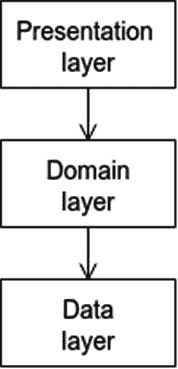
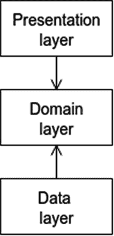
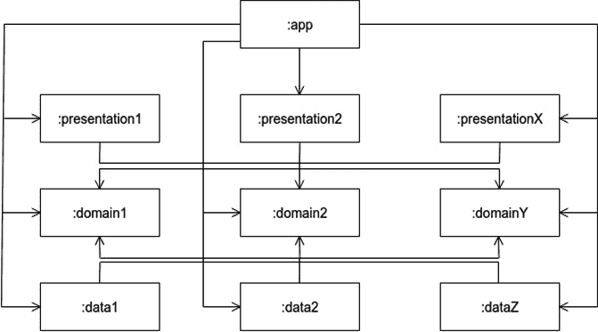
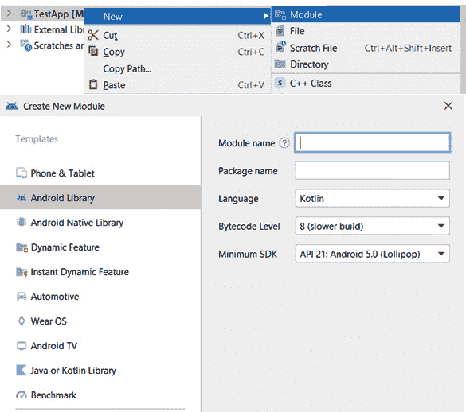

# *第五章*: 构建安卓应用程序的领域

在本章中，我们将分析 Android 应用程序的典型架构及其三个主要层（**表示层**、**领域层**和**数据层**）。然后，我们将学习如何将其转换为 clean architecture，并重点关注位于架构中心的领域层。接下来，我们将探讨它在应用程序架构中的作用以及其实体和用例。最后，我们将通过一个练习来了解如何设置一个具有多个模块的 Android Studio 项目，并使用它们来构建领域层。

在本章中，我们将涵盖以下主题：

+   介绍应用的架构

+   创建领域层

到本章结束时，您将熟悉应用程序的领域层、领域实体和用例。

# 技术要求

这些是硬件和软件要求：

+   Android Studio – Arctic Fox | 2020.3.1 Patch 3

本章的代码文件可以在以下位置找到：[`github.com/PacktPublishing/Clean-Android-Architecture/tree/main/Chapter5`](https://github.com/PacktPublishing/Clean-Android-Architecture/tree/main/Chapter5).

查看以下视频，了解代码的实际应用：[`bit.ly/3826FH6`](https://bit.ly/3826FH6)

# 介绍应用的架构

在本节中，我们将讨论适用于 Android 应用程序的最常见架构，以及它如何与 **clean architecture** 原则相结合，并了解我们理想中应该如何构建我们的代码库。

在前几章的练习中，我们看到了对于需要集成多个数据源进行网络和持久化的应用程序，我们不得不在 `ViewModel` 类中放置大量逻辑。在这些示例中，`ViewModel` 具有多重职责，包括从互联网获取数据、本地持久化以及保留用户界面中所需的信息。除了这些额外的职责外，`ViewModel` 还依赖于不同的数据源；这意味着网络或持久化库的任何变化都需要修改 `ViewModel`。为了解决这个问题，我们的代码需要分成具有不同职责的单独层。通常，这些层将类似于以下图示：



图 5.1 – 应用架构图

在 *图 5.1* 中，我们可以看到有三个具有不同职责的层：

+   `ViewModels`.

+   **领域层**: 此层负责从数据层获取数据并执行可以在应用程序中跨层重用的业务逻辑。

+   **数据层**: 此层负责处理与数据管理相关的应用程序的业务逻辑。

我们可以在分层架构之上应用*清洁架构*原则，通过将领域层置于中心，如图*5.2*所示，并使其成为存储我们的*实体*和*用例*的地方。在外层是表示层和数据层，它们由`ViewModels`和`Repositories`表示，以及**框架层**（由用户界面、持久化和网络框架表示）：



图 5.2 – 应用层依赖关系图

在前面的图中，我们可以看到领域层和数据层之间的依赖关系是反转的。领域层仍然会从数据层获取数据，但由于它具有反转的依赖关系，它将受到该层任何变化的较小影响，就像任何变化发生在表示层，它们不会影响领域层一样。如果应用程序受到用例变化的任何影响，那么它将驱动表示层和数据层的变更。

为了分离层，我们可以使用**Android 模块**。这将帮助我们通过避免层之间的不必要依赖来对项目施加进一步的严谨性。这也帮助提高了大型应用程序的构建时间，因为 Gradle 构建缓存只会重新构建有代码更改的模块。这看起来可能像以下图示：



图 5.3 – 应用模块图

我们可以看到，对于每一层，我们并不需要有限数量的模块，或者我们不需要在三层之间有对应的模块。每一层的扩展可以由不同的因素驱动，例如数据源、应用程序的使用、在数据源中使用的技术和协议（对于某些数据使用 REST API，对于其他数据类型使用蓝牙或近场通信）。用例的使用可能也是一个因素（例如，为多个应用程序使用的一组特定用例）。我们可能想要扩展表示层，因为某些屏幕是如何分组以形成应用程序内部某些隔离的功能和流程的（例如，应用程序的设置部分或登录/注册流程）。一个值得注意的有趣方面是`:app`模块，它具有组合所有依赖项并将它们组装在一起的作用。在这里，我们将收集所有必需的依赖项并初始化它们。

这里需要注意的一个重要事项是，模块本身并不等同于层；数据模块可以依赖于较低级别的数据模块。实际上，这种情况会在一个层的模块需要依赖于同一层的另一个模块时发生。如果我们在这两个模块之间创建依赖关系，我们可能会得到一个循环依赖关系，这是我们不希望的。在这种情况下，我们需要在这两个模块之间创建一个公共模块，该模块将包含所需的依赖项。例如，如果我们想从`:presentation1`中的一个屏幕导航到`:presentation2`中的屏幕或任何其他屏幕，我们需要创建一个新的模块，所有展示模块都将依赖于它，并且将存储处理导航所需的数据或逻辑。当讨论展示层时，我们将更详细地探讨这个问题。

要在 Android Studio 中创建一个新的模块，您需要在 Android Studio 中右键单击项目，选择**新建**，然后选择**模块**，如图所示：



图 5.4 – 创建新的 Android Studio 模块

然后，您将被提示选择模块类型，根据功能，您可以选择`build.gradle`文件。文件中的插件部分将指示已创建 Android 库：

```kt
plugins {
    id 'com.android.library'
    …
}
```

如果我们想向新创建的模块添加依赖项，我们可以在`app`模块中使用以下内容：

```kt
dependencies {
    implementation(project(path: ":my-new-module"))
    …
}
```

向模块添加依赖项的语法类似于添加外部依赖项的语法，并且是通过 Gradle 的`implementation`方法实现的。其余部分表示`app`模块将依赖于同一项目内的另一个模块。

在本节中，我们分析了 Android 应用架构的层级以及如何将这些层应用于清洁架构原则。在下一节中，我们将探讨如何构建领域层。

# 创建领域层

在本节中，我们将讨论如何构建领域层以及它包含的内容，并通过某些示例进行说明。最后，我们将查看一个创建领域层的练习。

因为领域层位于应用程序的中心，它将需要最少的依赖项。这意味着构成领域层的 Gradle 模块将是项目中最稳定的模块。这是为了避免因为领域模块使用的依赖项中发生的变化而导致其他模块发生变化。领域应该负责定义应用程序的实体和用例。

实体由包含数据的主要不可变对象表示。假设我们想将用户表示为一个实体。我们可能会得到以下内容：

```kt
data class User(
    val id: String,
    val firstName: String,
    val lastName: String,
    val email: String
) {
    fun getFullName() = "$firstName $lastName"
}
```

这里，我们使用了一个简单的`data class`，并使用`val`关键字声明所有字段为不可变。我们还有一个针对此对象的业务逻辑函数，它将返回用户的完整名称。

接下来，我们需要定义我们的用例。因为用例将需要从数据层获取数据，我们首先需要为我们的存储库创建一个抽象，最终我们会得到以下内容：

```kt
interface UserRepository {
    fun getUser(id: String): User
}
```

这里，我们只有一个简单的方法，它将根据`id`返回一个用户。现在，我们可以创建一个用于检索用户的用例：

```kt
class GetUserUseCase(private val userRepository: UserRepository) {
    fun getUser(id: String) = userRepository.getUser(id)
}
```

在前面的例子中，我们定义了一个用于检索用户的用例，它将依赖于`UserRepository`来检索用户信息。如果我们查看前面的例子，我们可以看到一些冗余，因为用例没有任何额外的逻辑，只是返回存储库的值。用例的好处在于，当我们想要组合多个存储库的多个结果时。

假设我们想要将用户与特定的位置关联起来，如下所示：

```kt
data class Location(
    val id: String,
    val userId: String,
    val lat: Double,
    val long: Double
)
```

这里，我们只保留与特定用户关联的纬度和经度。现在，假设我们会有一个用于不同位置的存储库：

```kt
interface LocationRepository {
    fun getLocation(userId: String): Location
}
```

这里，我们再次有一个存储库的抽象，它有一个根据`userId`获取特定位置的方法。如果我们想获取一个用户及其关联的位置，我们需要为这个创建一个特定的用例：

```kt
class GetUserWithLocationUseCase(
    private val userRepository: UserRepository,
    private val locationRepository: LocationRepository
) {
    fun getUser(id: String) =
        UserWithLocation(userRepository.getUser(id), locationRepository.getLocation(id))
}
data class UserWithLocation(
    val user: User,
    val location: Location
)
```

在前面的例子中，我们创建了一个新的实体`UserWithLocation`，它将存储`User`和`Location`。`UserWithLocation`将随后用作`GetUserWithLocationUseCase`中`getUser`方法的返回结果。这将依赖于`UserRepository`和`LocationRepository`来获取相关数据。

我们还可以通过处理线程来进一步改进用例。因为用例将主要处理检索和管理数据，这需要异步处理，所以我们应该在单独的线程上处理。我们可以使用**Kotlin flows**来管理这个，我们最终可能会得到如下所示的存储库：

```kt
interface UserRepository {
    fun getUser(id: String): Flow<User>
}
interface LocationRepository {
    fun getLocation(id: String): Flow<Location>
}
```

这里，我们将方法的返回类型更改为 Kotlin flow，它可能会发出数据流或单个项目。现在，我们可以在用例中组合流中的不同流：

```kt
class GetUserWithLocationUseCase(
    private val userRepository: UserRepository,
    private val locationRepository: LocationRepository
) {
    fun getUser(id: String) = combine(
        userRepository.getUser(id),
        locationRepository.getLocation(id)
    ) { user, location ->
        UserWithLocation(user, location)
    }.flowOn(Dispatchers.IO)
}
```

在这里，我们将`User`和`Location`流组合成一个`UserWithLocation`流，并将数据检索操作在`IO`调度器上执行。

经常在处理数据加载和管理时，尤其是从互联网上，我们可能会遇到不同的错误，这些错误我们必须考虑在我们的用例中。为了解决这个问题，我们可以定义错误实体。定义它们有很多可能性，包括扩展`Throwable`类、定义特定的数据类、两者的组合，或者将它们与密封类结合：

```kt
sealed class UseCaseException(override val cause: Throwable?) : Throwable(cause) {
    class UserException(cause: Throwable) : 
        UseCaseException(cause)

    class LocationException(cause: Throwable) : 
        UseCaseException(cause)

    class UnknownException(cause: Throwable) : 
        UseCaseException(cause)
    companion object {
        fun extractException(throwable: Throwable): 
            UseCaseException {
            return if (throwable is UseCaseException) 
                throwable else UnknownException(throwable)
        }
    }
}
```

在这里，我们创建了一个密封类，它将作为子类为每个实体提供一个专用错误，以及一个未知错误来处理我们没有考虑到的错误，还有一个伴随方法，该方法将检查一个 `Throwable` 对象，并返回 `UnknownException` 以处理任何不是 `UseCaseException` 的 `Throwable`。我们需要确保错误通过流程流传播，但首先，我们可以将成功实体与错误实体组合起来，以确保用例的消费者不需要再次检查 `Throwable` 的类型并进行类型转换。我们可以使用以下方法来实现：

```kt
sealed class Result<out T : Any> {
    data class Success<out T : Any>(val data: T) : 
        Result<T>()
    class Error(val exception: UseCaseException) : 
        Result<Nothing>()
}
```

在这里，我们定义了一个 `Result` 密封类，它将有两个子类用于成功和错误。`Success` 类将包含用例的相关数据，而 `Error` 类将包含之前定义的异常。如果需要，`Error` 类可以进一步扩展以包含数据以及错误，如果我们想显示缓存的或持久化的数据作为占位符。现在我们可以修改用例以包含 `Result` 类和错误状态：

```kt
class GetUserWithLocationUseCase(
    private val userRepository: UserRepository,
    private val locationRepository: LocationRepository
) {
    fun getUser(id: String) = combine(
        userRepository.getUser(id),
        locationRepository.getLocation(id)
    ) { user, location ->
        Result.Success(UserWithLocation(user, location)) as 
            Result<UserWithLocation>
    }.flowOn(Dispatchers.IO)
        .catch {
            emit(Result.Error(UseCaseException.
                extractException(it)))
        }
}
```

在这里，我们返回 `Result.Success`，如果没有发生错误，它将包含 `UserWithLocation` 对象，并使用 `catch` 操作符来发出带有在获取数据时发生的 `UseCaseException` 的 `Result.Error`。因为这些操作将在多个用例中重复，我们可以使用抽象来创建一个模板，说明每个用例的行为，并让实现只处理必要的数据。一个例子可能如下所示：

```kt
abstract class UseCase<T : Any, R : Any>(private val dispatcher: CoroutineDispatcher) {
    fun execute(input: T): Flow<Result<R>> = 
        executeData(input)
        .map {
            Result.Success(it) as Result<R>
        }
        .flowOn(dispatcher)
        .catch {
            emit(Result.Error(UseCaseException.
                extractException(it)))
        }
    internal abstract fun executeData(input: T): Flow<R>
}
```

在前面的例子中，我们定义了一个抽象类，它将包含 `execute` 方法，该方法将调用抽象的 `executeData` 方法，然后将该方法的输出映射到 `Result` 对象中，接着在 `CoroutineDispatcher` 上设置流程，最后在 `catch` 操作符中处理错误。这个实现的代码如下。请注意，`executeData` 方法的 `internal` 关键字将只使该方法在当前模块中可访问。这是因为我们只想让用例的用户调用 `execute` 方法：

```kt
class GetUserWithLocationUseCase(
    dispatcher: CoroutineDispatcher,
    private val userRepository: UserRepository,
    private val locationRepository: LocationRepository
) : UseCase<String, UserWithLocation>(dispatcher) {
    override fun executeData(input: String): 
        Flow<UserWithLocation> {
        return combine(
            userRepository.getUser(input),
            locationRepository.getLocation(input)
        ) { user, location ->
            UserWithLocation(user, location)
        }
    }
}
```

在这个例子中，`GetUserWithLocationUseCase` 只需要在 `executeData` 方法中处理与用例相关的必要数据。我们可以通过引入对所需输入和输出的进一步抽象来使用泛型来绑定用例要处理的数据类型：

```kt
abstract class UseCase<T : UseCase.Request, R : UseCase.Response>(private val dispatcher: CoroutineDispatcher) {
    …
    interface Request
    interface Response
}
```

在这里，我们将 `UseCase` 类中的泛型绑定到了两个接口——`Request` 和 `Response`。前者由用例所需的输入数据表示，后者由用例的输出表示。实现现在看起来像这样：

```kt
class GetUserWithLocationUseCase(
    dispatcher: CoroutineDispatcher,
    private val userRepository: UserRepository,
    private val locationRepository: LocationRepository
    ) : UseCase<GetUserWithLocationUseCase.Request, 
    GetUserWithLocationUseCase.Response>(dispatcher) {
    override fun executeData(input: Request): Flow
        <Response> {
        return combine(
            userRepository.getUser(input.userId),
            locationRepository.getLocation(input.userId)
        ) { user, location ->
            Response(UserWithLocation(user, location))
        }
    }
    data class Request(val userId: String) : UseCase.
        Request
    data class Response(val userWithLocation: 
        UserWithLocation) : UseCase.Response
}
```

在这里，我们提供了`Request`和`Response`类的实现，并在扩展基类时使用了它们。在这种情况下，`Request`和`Response`类代表**数据传输对象**。当我们为用例创建模板时，观察它们的演变非常重要，因为随着复杂性的增加，模板可能变得不适用。

通常，我们将有机会从现有的较小用例中构建一个新的用例。假设在检索用户和位置时，我们有两个独立的用例：

```kt
 class GetUserUseCase(
    dispatcher: CoroutineDispatcher,
    private val userRepository: UserRepository
    ) : UseCase<GetUserUseCase.Request, 
    GetUserUseCase.Response>(dispatcher) {
    override fun executeData(input: Request): Flow
        <Response> {
        return userRepository.getUser(input.userId)
            .map {
                Response(it)
            }
    }
    data class Request(val userId: String) : UseCase.
        Request
    data class Response(val user: User) : UseCase.Response
}
class GetLocationUseCase(
    dispatcher: CoroutineDispatcher,
    private val locationRepository: LocationRepository
    ) : UseCase<GetLocationUseCase.Request, 
    GetLocationUseCase.Response>(dispatcher) {
    override fun executeData(input: Request): Flow
        <Response> {
        return locationRepository.getLocation(input.userId)
            .map {
                Response(it)
            }
    }
    data class Request(val userId: String) : UseCase
        .Request
    data class Response(val location: Location) : UseCase.
        Response
}
```

在前面的例子中，我们为每个用例检索用户和位置创建了两个类。

我们可以将`GetUserWithLocationUseCase`修改为使用现有的用例，如下所示：

```kt
class GetUserWithLocationUseCase(
    dispatcher: CoroutineDispatcher,
    private val getUserUseCase: GetUserUseCase,
    private val getLocationUseCase: GetLocationUseCase
    ) : UseCase<GetUserWithLocationUseCase.Request, 
        GetUserWithLocationUseCase.Response>(dispatcher) {
    override fun executeData(input: Request): Flow
        <Response> {
        return combine( getUserUseCase.executeData
                (GetUserUseCase.Request(input.userId)),
            getLocationUseCase.executeData
                (GetLocationUseCase.Request(input.userId))
        ) { userResponse, locationResponse ->
            Response(UserWithLocation(userResponse.user, 
                locationResponse.location))
        }
    }
    data class Request(val userId: String) : UseCase
        .Request
    data class Response(val userWithLocation:  
         UserWithLocation) : UseCase.Response
}
```

在这里，我们将依赖关系更改为使用两个现有的用例而不是仓库，从每个用例中调用`executeData`方法，然后使用这两个用例的响应构建一个新的`Response`。

在本节中，我们探讨了如何使用实体、用例和抽象为仓库构建领域层。在接下来的章节中，我们将探讨与构建领域层相关的练习。

## 练习 05.01 – 构建领域层

在这个练习中，我们将创建一个新的项目，`domain`模块将被创建。此模块将包含包含以下数据的实体：

+   `User`: 这将有一个`Long`类型的 ID 和一个名字、用户名和电子邮件。

+   `Post`: 这将有一个 ID 和一个用户 ID，类型为`Long`，标题和正文。

+   `Interaction`: 这将包含与该应用的总交互次数。

+   `Errors`: 这是在帖子或用户无法加载时使用的。

应用程序需要定义以下用例：

+   根据 ID 检索包含用户信息的帖子列表，并按交互数据分组

+   根据 ID 检索特定用户的信息

+   根据 ID 检索特定帖子的信息

+   更新交互数据

要完成此练习，您需要执行以下操作：

+   在 Android Studio 中创建一个新的项目。

+   在根`build.gradle`文件中创建所有库依赖项及其版本的映射。

+   在 Android Studio 中创建`domain`模块。

+   创建所需的数据和错误实体。

+   创建一个`Result`类，它将包含成功和错误场景。

+   创建用于获取用户、帖子和信息交互的仓库抽象。

+   创建所需的四个用例。

按照以下步骤完成练习：

1.  在 Android Studio 中创建一个新的项目并选择**Empty Compose Activity**。

1.  在根`build.gradle`文件中，添加以下配置，这些配置将用于项目中的所有模块：

    ```kt
    buildscript {
        ext {
            javaCompileVersion = JavaVersion.VERSION_1_8
            jvmTarget = "1.8"
            defaultCompileSdkVersion = 31
            defaultTargetSdkVersion = 31
            defaultMinSdkVersion = 21
            …
    }
    ```

1.  在同一文件中，添加 Gradle 模块将使用的库版本：

    ```kt
    buildscript {
        ext {
            …
            versions = [
                    androidGradlePlugin: "7.0.4",
                    kotlin             : "1.5.31",
                    hilt               : "2.40.5",
                    coreKtx            : "1.7.0",
                    appCompat          : "1.4.1",
                    compose            : "1.0.5",
                    lifecycleRuntimeKtx: "2.4.0",
                    activityCompose    : "1.4.0",
                    material           : "1.5.0",
                    coroutines         : "1.5.2",
                    junit              : "4.13.2",
                    mockito            : "4.0.0",
                    espressoJunit      : "1.1.3",
                    espressoCore       : "3.4.0"
            ]
            …
    }
    ```

1.  在同一文件中，添加整个项目将使用的插件依赖项的映射。

    ```kt
    buildscript {
        ext {
            …
            gradlePlugins = [
                    android: "com.android.tools.build:
                        gradle:${versions.
                            androidGradlePlugin}",
                    kotlin : "org.jetbrains.kotlin:kotlin-    
                        gradle-plugin:${versions.kotlin}",
                    hilt   : "com.google.dagger:hilt-
                        android-gradle-plugin:
                            ${versions.hilt}"
            ]
            …
    }
    ```

1.  接下来，您需要将`androidx`库的依赖项添加到`androidx`库中：

    ```kt
    buildscript {
        ext {
            …
            androidx = [
                    core                   : "androidx.core:core-ktx:${versions.coreKtx}",
                    appCompat              : "androidx.appcompat:appcompat:${versions.appCompat}",
                    composeUi              : "androidx.compose.ui:ui:${versions.compose}",
                    composeMaterial        : "androidx.compose.material:material:${versions.compose}",
                    composeUiToolingPreview: "androidx.compose.ui:ui-tooling-preview:${versions.compose}",
                    lifecycleRuntimeKtx    : "androidx.lifecycle:lifecycle-runtime-ktx:${versions.lifecycleRuntimeKtx}",
                    composeActivity        : "androidx.activity:activity-compose:${versions.activityCompose}"
            ]
            …
    }
    ```

1.  接下来，添加剩余的用于材料设计、依赖注入和测试的库：

    ```kt
    buildscript {
        ext {
            …
            material = [
                    material: "com.google.android.
                        material:material:$
                            {versions.material}"
            ]
            coroutines = [
                    coroutinesAndroid: "org.jetbrains.
                        kotlinx:kotlinx-coroutines-
                           android:${versions.coroutines}"
            ]
            di = [
                    hiltAndroid : "com.google.dagger:hilt-
                        android:${versions.hilt}",
                    hiltCompiler: "com.google.dagger:hilt-
                        compiler:${versions.hilt}"
            ]
            test = [
                    junit     : 
                        "junit:junit:${versions.junit}",
                    coroutines: "org.jetbrains.kotlinx:
                        kotlinx-coroutines-test:
                            ${versions.coroutines}",
                    mockito   : "org.mockito.kotlin:
                       mockito-kotlin:${versions.mockito}"
            ]
            androidTest = [
                    junit             : "androidx.test.ext
                        :junit:${versions.espressoJunit}",
                    espressoCore      : "androidx.test.
                        espresso:espresso-core:$
                            {versions.espressoCore}",
                    composeUiTestJunit: "androidx.compose.
                    ui:ui-test-junit4:${versions.compose}"
            ]
        }
        …
    }
    ```

1.  在同一文件中，您需要将之前的映射替换为插件依赖项：

    ```kt
    buildscript {
         …
        dependencies {
            classpath gradlePlugins.android
            classpath gradlePlugins.kotlin
            classpath gradlePlugins.hilt
        }
    }
    ```

1.  现在，您需要切换到应用模块中的`build.gradle`文件，并将现有的配置更改为顶级`build.gradle`文件中定义的配置：

    ```kt
    android {
        compileSdk defaultCompileSdkVersion
        defaultConfig {
            …
            minSdk defaultMinSdkVersion
            targetSdk defaultTargetSdkVersion
            versionCode 1
            versionName "1.0"
            …
        }
        …
        compileOptions {
            sourceCompatibility javaCompileVersion
            targetCompatibility javaCompileVersion
        }
        kotlinOptions {
            jvmTarget = jvmTarget
            useIR = true
        }
        buildFeatures {
            compose true
        }
        composeOptions {
            kotlinCompilerExtensionVersion 
                versions.compose
        }
        …
    }
    ```

1.  在同一文件中，您需要将依赖项替换为顶级`build.gradle`文件中定义的依赖项：

    ```kt
    dependencies {
        implementation androidx.core
        implementation androidx.appCompat
        implementation material.material
        implementation androidx.composeUi
        implementation androidx.composeMaterial
        implementation androidx.composeUiToolingPreview
        implementation androidx.lifecycleRuntimeKtx
        implementation androidx.composeActivity
        testImplementation test.junit
    }
    ```

1.  在 Android Studio 中，执行**同步项目与 Gradle 文件**命令，然后执行**构建项目**命令以确保项目构建时没有错误。

1.  为项目创建一个名为`domain`的新模块，该模块将是一个 Android 库模块。

1.  在`domain`模块的`build.gradle`文件中，确保您有以下插件：

    ```kt
    plugins {
        id 'com.android.library'
        id 'kotlin-android'
        id 'kotlin-kapt'
        id 'dagger.hilt.android.plugin'
    }
    ```

1.  在同一文件中，确保您使用顶级`build.gradle`文件中定义的配置：

    ```kt
    android {
        compileSdk defaultCompileSdkVersion
        defaultConfig {
            minSdk defaultMinSdkVersion
            targetSdk defaultTargetSdkVersion
            …
        }
        …
        compileOptions {
            sourceCompatibility javaCompileVersion
            targetCompatibility javaCompileVersion
        }
        kotlinOptions {
            jvmTarget = jvmTarget
        }
    }
    ```

1.  在同一文件中，您需要添加以下依赖项：

    ```kt
    dependencies {
        implementation coroutines.coroutinesAndroid
        implementation di.hiltAndroid
        kapt di.hiltCompiler
        testImplementation test.junit
        testImplementation test.coroutines
        testImplementation test.mockito
    }
    ```

1.  使用 Gradle 文件同步项目，并再次构建项目以确保 Gradle 配置正确。

1.  在`domain`模块中，创建一个名为`entity`的新包。

1.  在`entity`包中，创建一个名为`Post`的类，该类将包含`id`、`userId`、`title`和`body`：

    ```kt
    data class Post(
        val id: Long,
        val userId: Long,
        val title: String,
        val body: String
    )
    ```

1.  在同一包中，创建一个名为`User`的类，该类将包含`id`、`name`、`username`和`email`：

    ```kt
    data class User(
        val id: Long,
        val name: String,
        val username: String,
        val email: String
    )
    ```

1.  接下来，创建一个名为`PostWithUser`的类，该类将包含`post`和`user`信息：

    ```kt
    data class PostWithUser(
        val post: Post,
        val user: User
    )
    ```

1.  在同一包中，创建一个名为`Interaction`的类，该类将包含总点击次数：

    ```kt
    data class Interaction(val totalClicks: Int)
    ```

1.  现在，我们需要创建错误实体：

    ```kt
    sealed class UseCaseException(cause: Throwable) : Throwable(cause) {
        class PostException(cause: Throwable) : 
            UseCaseException(cause)
        class UserException(cause: Throwable) : 
            UseCaseException(cause)
        class UnknownException(cause: Throwable) : 
            UseCaseException(cause)
        companion object {
            fun createFromThrowable(throwable: Throwable): 
                UseCaseException {
                return if (throwable is UseCaseException) 
                throwable else UnknownException(throwable)
            }
        }
    }
    ```

在这里，我们定义了当加载帖子信息或用户信息出现问题时抛出的异常，以及当其他事情出错时抛出的`UnknownException`。

1.  接下来，让我们创建`Result`类，该类将包含成功和错误信息：

    ```kt
    sealed class Result<out T : Any> {
        data class Success<out T : Any>(val data: T) : 
            Result<T>()
        class Error(val exception: UseCaseException) : 
            Result<Nothing>()
    }
    ```

1.  现在，我们需要继续定义存储库的抽象，为此，我们创建一个名为`repository`的新包。

1.  在`repository`包中，创建一个用于管理帖子数据的接口：

    ```kt
    interface PostRepository {
        fun getPosts(): Flow<List<Post>>
        fun getPost(id: Long): Flow<Post>
    }
    ```

1.  在同一包中，创建一个用于管理用户数据的接口：

    ```kt
    interface UserRepository {
        fun getUsers(): Flow<List<User>>
        fun getUser(id: Long): Flow<User>
    }
    ```

1.  在同一包中，创建一个用于管理交互数据的接口：

    ```kt
    interface InteractionRepository {
        fun getInteraction(): Flow<Interaction>
        fun saveInteraction(interaction: Interaction): 
            Flow<Interaction>
    }
    ```

1.  现在，我们继续到用例部分，首先创建一个名为`usecase`的新包。

1.  在此包中，创建`UseCase`模板：

    ```kt
    abstract class UseCase<I : UseCase.Request, O : UseCase.Response>(private val configuration: Configuration) {
        fun execute(request: I) = process(request)
            .map {
                Result.Success(it) as Result<O>
            }
            .flowOn(configuration.dispatcher)
            .catch {
                emit(Result.Error(UseCaseException.
                    createFromThrowable(it)))
            }
        internal abstract fun process(request: I): Flow<O>
        class Configuration(val dispatcher: 
            CoroutineDispatcher)
        interface Request
        interface Response
    }
    ```

在此模板中，我们定义了数据传输对象的抽象，以及一个包含`CoroutineDispatcher`的`Configuration`类。创建此`Configuration`类的原因是能够在不修改`UseCase`子类的情况下添加其他参数用于用例。我们有一个`abstract`方法，该方法将由子类实现以从存储库中检索数据，以及一个`execute`方法，该方法将数据转换为`Result`，处理错误场景，并设置适当的`CoroutineDispatcher`。

1.  在`usecase`包中，创建一个用于检索包含用户信息和交互数据的帖子列表的用例：

    ```kt
    class GetPostsWithUsersWithInteractionUseCase @Inject constructor(
        configuration: Configuration,
        private val postRepository: PostRepository,
        private val userRepository: UserRepository,
        private val interactionRepository: 
            InteractionRepository
        ) : GetPostsWithUsersWithInteractionUseCase 
        GetPostsWithUsersWithInteractionUseCase {
        override fun process(request: Request): 
            Flow<Response> =
            combine(
                postRepository.getPosts(),
                userRepository.getUsers(),
                interactionRepository.getInteraction()
            ) { posts, users, interaction ->
                val postUsers = posts.map { post ->
                    val user = users.first {
                        it.id == post.userId
                    }
                    PostWithUser(post, user)
                }
                Response(postUsers, interaction)
            }
        object Request : UseCase.Request
        data class Response(
            val posts: List<PostWithUser>,
            val interaction: Interaction
        ) : UseCase.Response
    }
    ```

在这个类中，我们扩展了`UseCase`类，并在`process`方法中结合了帖子、用户和交互流程。因为没有输入要求，`Request`类将必须为空，而`Response`类将包含一个包含组合用户和帖子信息以及交互数据的列表。`@Inject`注解将帮助我们在此演示层中注入此用例。

1.  在同一包中，创建一个用于通过 ID 检索帖子的用例：

    ```kt
    class GetPostUseCase @Inject constructor(
        configuration: Configuration,
        private val postRepository: PostRepository
        ) : UseCase<GetPostUseCase.Request, 
        GetPostUseCase.Response>(configuration) {
        override fun process(request: Request): Flow
            <Response> =
            postRepository.getPost(request.postId)
                .map {
                    Response(it)
                }
        data class Request(val postId: Long) : UseCase.
            Request
        data class Response(val post: Post) : UseCase.
            Response
    }
    ```

1.  在同一包中，创建一个用于通过 ID 检索用户的用例：

    ```kt
    class GetUserUseCase @Inject constructor(
        configuration: Configuration,
        private val userRepository: UserRepository
        ) : UseCase<GetUserUseCase.Request,
        GetUserUseCase.Response>(configuration) {
        override fun process(request: Request): Flow
            <Response> =
            userRepository.getUser(request.userId)
                .map {
                    Response(it)
                }
        data class Request(val userId: Long) : UseCase.
            Request
        data class Response(val user: User) : UseCase.
            Response
    }
    ```

1.  现在，我们继续到最后一个用例，用于更新交互数据：

    ```kt
    class UpdateInteractionUseCase @Inject constructor(
        configuration: Configuration,
        private val interactionRepository: 
            InteractionRepository
        ) : UseCase<UpdateInteractionUseCase.Request, 
        UpdateInteractionUseCase.Response>(configuration) {
        override fun process(request: Request): Flow
            <Response> {
            return interactionRepository.saveInteraction
                (request.interaction)
                .map {
                    Response
                }
        }
        data class Request(val interaction: Interaction) : 
             UseCase.Request
        object Response : UseCase.Response
    }
    ```

1.  为了单元测试代码，我们需要在`domain`模块的`test`文件夹中创建一个名为`resources`的新文件夹。

1.  在`resources`文件夹内，创建一个名为`mockito-extensions`的子文件夹；在这个文件夹内，创建一个名为`org.mockito.plugins.MockMaker`的文件；并在该文件内添加以下文本——`mock-maker-inline`。这允许 Mockito 测试库模拟`final` Java 类，在 Kotlin 中意味着所有不带`open`关键字的类。

1.  在`domain`模块的测试文件夹中创建一个名为`UseCaseTest`的新类：

    ```kt
    class UseCaseTest {
        @ExperimentalCoroutinesApi
        private val configuration = UseCase.Configuration
            (TestCoroutineDispatcher())
        private val request = mock<UseCase.Request>()
        private val response = mock<UseCase.Response>()
        @ExperimentalCoroutinesApi
        private lateinit var useCase: 
            UseCase<UseCase.Request, UseCase.Response>
        @ExperimentalCoroutinesApi
        @Before
        fun setUp() {
            useCase = object : UseCase<UseCase.Request, 
                UseCase.Response>(configuration) {
                override fun process(request: Request):  
                    Flow<Response> {
                    assertEquals(this@UseCaseTest.request, 
                        request)
                    return flowOf(response)
                }
            }
        }
    }
    ```

这里，我们为`UseCase`类提供了一个实现，它将返回一个模拟的响应。

1.  接下来，创建一个测试方法来验证`execute`方法的成功场景：

    ```kt
        @ExperimentalCoroutinesApi
        @Test
        fun testExecuteSuccess() = runBlockingTest {
            val result = useCase.execute(request).first()
            assertEquals(Result.Success(response), result)
        }
    ```

这里，我们断言`execute`方法的结果是`Success`并且它包含模拟的响应。

1.  接下来，创建一个名为`GetPostsWithUsersWithInteractionUseCaseTest`的新测试类：

    ```kt
    class GetPostsWithUsersWithInteractionUseCaseTest {
        private val postRepository = mock<PostRepository>()
        private val userRepository = mock<UserRepository>()
        private val interactionRepository = mock<InteractionRepository>()
        private val useCase = GetPostsWithUsersWithInteractionUseCase(
            mock(),
            postRepository,
            userRepository,
            interactionRepository
        )
    }
    ```

这里，我们模拟了所有仓库并将模拟注入我们想要测试的类中。

1.  最后，创建一个测试方法来验证我们正在测试的用例中的`process`方法：

    ```kt
        @ExperimentalCoroutinesApi
        @Test
        fun testProcess() = runBlockingTest {
            val user1 = User(1L, "name1", "username1", "email1")
            val user2 = User(2L, "name2", "username2", "email2")
            val post1 = Post(1L, user1.id, "title1", "body1")
            val post2 = Post(2L, user1.id, "title2", "body2")
            val post3 = Post(3L, user2.id, "title3", "body3")
            val post4 = Post(4L, user2.id, "title4", "body4")
            val interaction = Interaction(10)
            whenever(userRepository.getUsers()).thenReturn
                (flowOf(listOf(user1, user2)))
            whenever(postRepository.getPosts()).thenReturn
              (flowOf(listOf(post1, post2, post3, post4)))whenever(interactionRepository.getInteraction
                ()).thenReturn(flowOf(interaction))
            val response = useCase.process
                (GetPostsWithUsersWithInteractionUseCase.
                    Request).first()
            assertEquals(
                GetPostsWithUsersWithInteractionUseCase.
                    Response(
                    listOf(
                        PostWithUser(post1, user1),
                        PostWithUser(post2, user1),
                        PostWithUser(post3, user2),
                        PostWithUser(post4, user2),
                    ), interaction
                ),
                response
            )
        }
    ```

这里，我们提供了模拟的用户和帖子列表以及一个模拟的交互，然后我们为每个仓库调用返回这些，然后断言结果是包含四个帖子、由两个用户编写以及模拟交互的列表。

如果我们运行这两个方法的测试，它们应该会通过。为了测试剩余的用例，我们可以应用与`GetPostsWithUsersWithInteractionUseCaseTest`相同的原理——创建模拟仓库，将它们注入我们希望测试的对象中，然后定义`process`方法的输入模拟和预期的结果，这将给我们以下截图所示输出：

![图 5.5 – 用例单元测试的输出

![img/Figure_5.05_B18320.jpg]

图 5.5 – 用例单元测试的输出

在本节中，我们进行了一个练习，创建了一个简单的领域，其中包含实体、几个简单的用例以及一个结合了多个数据源的特定用例。领域模块依赖于 flows 和 Hilt。这意味着这些库的更改可能会影响我们的领域模块。这个决定是因为这些库在响应式编程和依赖注入方面提供的优势。由于我们在定义用例时考虑了依赖注入，这使得它们更容易测试，因为我们能够非常容易地将模拟对象注入到测试对象中。

# 摘要

在本章中，我们探讨了 Android 应用程序架构的分层结构，并专注于领域层，讨论了实体和用例的主题。我们还学习了如何使用依赖倒置将用例和实体置于我们架构的中心。我们通过创建可以在底层实现的仓库抽象来实现这一点。我们还学习了如何使用库模块来强制层之间的分离。

在本章的练习中，我们为 Android 应用程序创建了一个领域模块，提供了一个领域层可能的样子示例。在下一章中，我们将专注于数据层，我们将提供在领域层定义的仓库抽象的实现，并讨论我们如何使用这些仓库来管理应用程序的数据。
