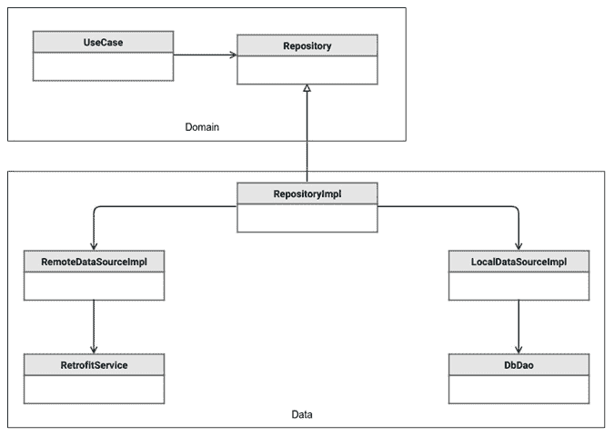
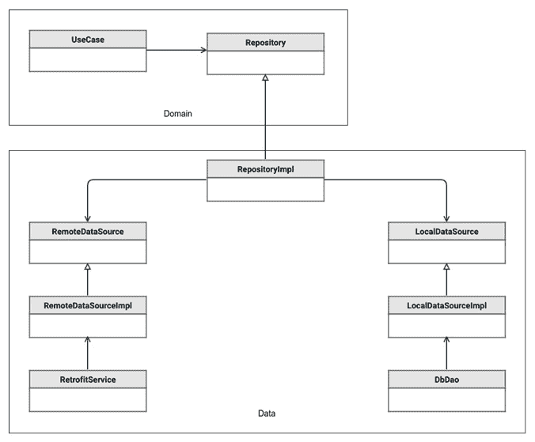
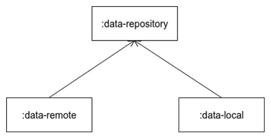
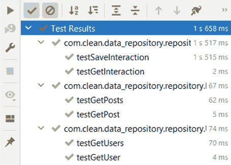

# *第六章*：组装仓库

在本章中，我们将首先讨论应用程序的数据层以及构成这一层的组件，包括仓库和数据源。然后，我们将继续讨论仓库这一应用程序层的组件及其在管理应用程序数据中的作用。在本章的练习中，我们将继续上一章开始的项目，提供上一章中定义的抽象的仓库实现，并引入针对不同类型数据源的新抽象。

在本章中，我们将涵盖以下主题：

+   创建数据层

+   创建仓库

到本章结束时，你将了解数据层是什么以及我们如何为 Android 应用程序创建仓库。

# 技术要求

硬件和软件要求如下：

+   Android Studio Arctic Fox 2020.3.1 补丁 3

本章的代码文件可以在以下位置找到：[`github.com/PacktPublishing/Clean-Android-Architecture/tree/main/Chapter6`](https://github.com/PacktPublishing/Clean-Android-Architecture/tree/main/Chapter6).

查看以下视频以查看代码的实际应用：[`bit.ly/3NpAhNs`](https://bit.ly/3NpAhNs)

# 创建数据层

在本节中，我们将探讨 Android 应用程序的数据层以及通常构成数据层的组件。

数据层是数据创建和管理的层。这意味着这一层负责创建、读取、更新和删除数据，以及管理和确保来自互联网的数据与持久数据同步。

在上一章中，我们了解到用例依赖于仓库类的抽象，并且可以为不同数据类型存在多个仓库。仓库代表数据层的入口点，并负责管理多个数据源并集中数据。数据源代表数据层的另一个组件，并负责管理特定来源的数据（互联网、Room、数据存储等）。

下图展示了特定数据集的数据层示例，该数据集使用两个数据源：



图 6.1 – 数据层示例

在前面的图示中，我们有一个数据层连接到领域层的示例。我们可以观察到 `UseCase` 类依赖于一个 `Repository` 抽象，它代表领域层。数据层由 `RepositoryImpl` 表示，它是 `Repository` 抽象的实现。`RepositoryImpl` 类依赖于两个数据源实现：`RemoteDataSourceImpl` 和 `LocalDataSourceImpl`。每个数据源随后依赖于特定实现来管理来自互联网的数据，在 `RetrofitService` 的情况下使用 Retrofit，或者在 `DbDao` 的情况下使用特定的数据访问类。

这种方法由于 `RepositoryImpl` 和 `RemoteDataSourceImpl` 之间的直接依赖而存在问题，问题出现在我们可能想要用替代品替换 Retrofit 或 Room 时。如果我们可能想要用其他库替换这些库，我们可能会在 `RepositoryImpl` 类中引起变化，这违反了单一职责原则。解决方案类似于我们解决用例和仓库之间依赖关系的解决方案，即反转仓库和数据源之间的依赖关系。这看起来将如下所示：



图 6.2 – 倒置依赖的数据层

在前面的图示中，我们为每个数据源引入了两个抽象，分别命名为 `RemoteDataSource` 和 `LocalDataSource`。`RepositoryImpl` 现在依赖于这两个抽象，并且所有 Retrofit 或 Room 相关对象与领域实体之间的转换现在应放置在 `RemoteDataSourceImpl` 或 `LocalDataSourceImpl` 中，这些实现继承新的抽象并将继续处理 Retrofit 或 Room 的数据。如果我们想将数据层拆分为不同的 Gradle 模块，我们将有以下情况：



图 6.3 – 数据层模块

前面的图示展示了仓库与本地和远程数据源之间的 Gradle 模块依赖关系。在这里，我们可以看到依赖反转的好处，它允许我们拥有一个独立的仓库模块，而不依赖于 Retrofit 或 Room。

在本节中，我们讨论了数据层及其内部组件，以及如何管理所有组件之间的依赖关系。在下一节中，我们将更详细地探讨仓库及其实现方法。

# 创建仓库

在本节中，我们将探讨仓库是什么以及它在应用程序数据层中扮演的角色，以及我们如何使用各种数据源创建仓库。

仓库代表应用程序使用的数据的抽象，它负责管理和集中化来自一个或多个数据源的数据。

在上一章中，我们定义了以下实体：

```kt
data class User(
    val id: String,
    val firstName: String,
    val lastName: String,
    val email: String
) {
    fun getFullName() = "$firstName $lastName"
}
```

在这里，我们有一个简单的`User`数据类，包含一些相关字段。`User`数据的仓库抽象如下：

```kt
interface UserRepository {
    fun getUser(id: String): Flow<User>
}
```

在这里，我们有一个名为`UserRepository`的接口，它负责在 Kotlin 流中获取用户信息。

如果我们想从互联网上获取数据，我们必须首先定义一个`UserRemoteDataSource`抽象：

```kt
interface UserRemoteDataSource {
    fun getUser(id: String): Flow<User>
}
```

在这种情况下，我们有一个类似于`UserRepository`定义的接口，它有一个简单的`User`对象检索方法。现在我们可以实现`UserRepository`以使用此数据源：

```kt
class UserRepositoryImpl(private val userRemoteDataSource: 
    UserRemoteDataSource) : UserRepository {

    override fun getUser(id: String): Flow<User> = 
        userRemoteDataSource.getUser(id)

}
```

在这里，我们有一个对`UserRemoteDataSource`的依赖，并调用`getUser`方法。如果我们想将远程用户数据本地持久化，我们需要定义一个`UserLocalDataSource`抽象，它将负责插入用户：

```kt
interface UserLocalDataSource {
    suspend fun insertUser(user: User)
}
```

在这里，我们有一个将用户插入本地存储的方法。现在我们可以更新`UserRepositoryImpl`以连接数据源，并在检索后插入用户：

```kt
class UserRepositoryImpl(
    private val userRemoteDataSource: UserRemoteDataSource,
    private val userLocalDataSource: UserLocalDataSource
) : UserRepository {
    override fun getUser(id: String): Flow<User> = 
        userRemoteDataSource.getUser(id)
        .onEach { 
            userLocalDataSource.insertUser(it)
        }
}
```

这代表了一个简单的数据源使用案例，但我们可以使用仓库来提升用户体验。例如，我们可以更改仓库实现以返回保存的数据，并为远程获取数据提供一个单独的方法。我们可以利用流，它可以在流中发射多个用户：

```kt
interface UserLocalDataSource {
    suspend fun insertUser(user: User)
    fun getUser(id: String): Flow<User>
}
```

在前面的例子中，我们添加了`getUser`方法来检索本地持久化的`User`对象。我们需要修改仓库抽象如下：

```kt
interface UserRepository {
    fun getUser(id: String): Flow<User>
    fun refreshUser(id: String): Flow<User>
}
```

在这里，我们添加了`refreshUser`方法，当实现时，将负责从互联网上获取新用户。实现如下：

```kt
class UserRepositoryImpl(
    private val userRemoteDataSource: UserRemoteDataSource,
    private val userLocalDataSource: UserLocalDataSource
) : UserRepository {
    override fun getUser(id: String): Flow<User> = 
        userLocalDataSource.getUser(id)
    override fun refreshUser(id: String): Flow<User> = 
        userRemoteDataSource.getUser(id)
        .onEach {
            userLocalDataSource.insertUser(it)
        }
}
```

在这里，我们在`getUser`方法中返回持久化的用户，在`refreshUser`方法中，我们现在获取远程数据并将其本地插入。如果我们使用 Room 等库，这将触发新的`User`对象的发射，该对象将来自`UserLocalDataSource`。这意味着所有`getUser`方法的订阅者都将收到更改通知并接收一个新的`User`对象。

我们还可以使用仓库在内存中缓存数据。以下是一个例子：

```kt
class UserRepositoryImpl(
    private val userRemoteDataSource: UserRemoteDataSource,
    private val userLocalDataSource: UserLocalDataSource
) : UserRepository {
    private val usersFlow = MutableStateFlow
        (emptyMap<String, User>().toMutableMap())
    override fun getUser(id: String): Flow<User> = 
        usersFlow.flatMapLatest {
        val user = it[id]
        if (user != null) {
            flowOf(user)
        } else {
            userLocalDataSource.getUser(id)
                .onEach { persistedUser ->
                    saveUser(persistedUser)
                }
        }
    }
    override fun refreshUser(id: String): Flow<User> = 
        userRemoteDataSource.getUser(id)
        .onEach {
            saveUser(it)
            userLocalDataSource.insertUser(it)
        }
    private fun saveUser(user: User) {
        val map = usersFlow.value
        map[user.id] = user
        usersFlow.value = map
    }
}
```

在这里，我们添加了一个新的`MutableStateFlow`对象，它将持有一个映射，其中键由用户 ID 表示，值是用户。在`getUser`方法中，我们检查用户是否存储在内存中，如果存在则返回内存值，否则我们获取持久化数据，之后将其存储在内存中。在`refreshUser`方法中，我们将值持久化并本地持久化数据。

由于我们定义了仓库抽象以返回实体，我们应该尽可能在仓库和数据源抽象中使用实体。然而，我们可能需要特定的对象定义来处理从数据源获取的数据。我们可以在这一层定义这些特定的类，然后将其转换为仓库实现中的实体。

在本节中，我们看到了如何创建仓库以及它们如何被用来管理应用程序中的数据。在接下来的章节中，我们将查看一个练习，我们将为应用程序创建仓库。

## 练习 06.01 – 创建仓库

修改 *练习 05.01：构建领域层*，以便在 Android Studio 中创建一个新的库模块。该模块将命名为 `data-repository`，并将依赖于 `domain` 模块。在此模块中，我们将实现领域模块中的仓库类，如下所示：

+   `UserRepositoryImpl` 将依赖于以下数据源：`UserRemoteDataSource`，它将获取列表和按 ID 获取用户，以及 `UserLocalDataSource`，它将包含插入用户列表和获取相同列表的方法。`UserRepositoryImpl` 将始终加载远程用户并将它们本地化。

+   `PostRepositoryImpl` 将依赖于以下数据源：`PostRemoteDataSource`，它将获取用户列表和按 ID 获取用户，以及 `PostLocalDataSource`，它将包含插入帖子列表和获取相同列表的方法。`PostRepositoryImpl` 将始终加载远程帖子并将它们本地化。

+   `InteractionRepositoryImpl` 将依赖于单一的数据源 `LocalInteractionDataSource`，它将负责加载交互并保存。`InteractionRepositoryImpl` 将加载交互并保存一个新的交互。

要完成此练习，你需要执行以下操作：

+   在 Android Studio 中创建数据仓库模块

+   创建用户的数据源和仓库

+   创建帖子的数据源和仓库

+   创建交互数据源和仓库

按照以下步骤完成练习：

1.  创建一个名为 `data-repository` 的新模块，它将是一个 Android 库模块。

1.  确保在顶级 `build.gradle` 文件中，以下依赖项已设置：

    ```kt
    buildscript {
         …
        dependencies {
            classpath gradlePlugins.android
            classpath gradlePlugins.kotlin
            classpath gradlePlugins.hilt
        }
    }
    ```

1.  在 `data-repository` 模块的 `build.gradle` 文件中，确保以下插件存在：

    ```kt
    plugins {
        id 'com.android.library'
        id 'kotlin-android'
        id 'kotlin-kapt'
        id 'dagger.hilt.android.plugin'
    }
    ```

1.  在同一文件中，将配置更改为顶级 `build.gradle` 文件中定义的配置：

    ```kt
    android {
        compileSdk defaultCompileSdkVersion
        defaultConfig {
            minSdk defaultMinSdkVersion
            targetSdk defaultTargetSdkVersion
            …
        }
        …
        compileOptions {
            sourceCompatibility javaCompileVersion
            targetCompatibility javaCompileVersion
        }
        kotlinOptions {
            jvmTarget = jvmTarget
        }
    }
    ```

1.  在同一文件中，确保以下依赖项已指定：

    ```kt
    dependencies {
        implementation(project(path: ":domain"))
        implementation coroutines.coroutinesAndroid
        implementation di.hiltAndroid
        kapt di.hiltCompiler
        testImplementation test.junit
        testImplementation test.coroutines
        testImplementation test.mockito
    }
    ```

在这里，我们使用`implementation`方法向`:domain`模块添加依赖，就像其他库被引用一样。在 Gradle 中，我们也有使用`api`方法的选项。这使得模块的依赖对其他模块是公开的。这反过来可能会产生潜在的副作用，例如泄露应该保持私有的依赖。在这个例子中，由于两个模块之间关系紧密（这将使得所有依赖于`:data-repository`的模块不必添加对`:domain`的依赖），使用`api`方法对`:domain`模块可能更有帮助。然而，像 Hilt 和 Coroutines 这样的依赖应该使用`implementation`方法，因为我们希望避免在未使用这些库的模块中暴露这些库。

1.  在`data-repository`模块中，创建一个名为`data_source`的新包。

1.  在`data_source`包内，创建一个名为`remote`的新包。

1.  在`remote`包内，创建`RemoteUserDataSource`接口：

    ```kt
    interface RemoteUserDataSource {
        fun getUsers(): Flow<List<User>>
        fun getUser(id: Long): Flow<User>
    }
    ```

1.  在`remote`包内，创建`RemotePostDataSource`接口：

    ```kt
    interface RemotePostDataSource {
        fun getPosts(): Flow<List<Post>>
        fun getPost(id: Long): Flow<Post>
    }
    ```

1.  在`data_source`包内，创建一个名为`local`的新包。

1.  在`local`包内，创建`LocalUserDataSource`接口：

    ```kt
    interface LocalUserDataSource {
        fun getUsers(): Flow<List<User>>
        suspend fun addUsers(users: List<User>)
    }
    ```

1.  在`local`包内，创建`LocalPostDataSource`接口：

    ```kt
    interface LocalPostDataSource {
        fun getPosts(): Flow<List<Post>>
        suspend fun addPosts(posts: List<Post>)
    }
    ```

1.  在`local`包内，创建`LocalInteractionDataSource`包：

    ```kt
    interface LocalInteractionDataSource {
        fun getInteraction(): Flow<Interaction>
        suspend fun saveInteraction(interaction: Interaction)
    }
    ```

1.  在`data_source`包旁边，创建一个名为`repository`的新包。

1.  在`repository`包内，创建`UserRepositoryImpl`类：

    ```kt
    class UserRepositoryImpl @Inject constructor(
        private val remoteUserDataSource: 
            RemoteUserDataSource,
        private val localUserDataSource: 
            LocalUserDataSource
    ) : UserRepository {
        override fun getUsers(): Flow<List<User>> = 
            remoteUserDataSource.getUsers()
            .onEach {
                localUserDataSource.addUsers(it)
            }
        override fun getUser(id: Long): Flow<User> = remoteUserDataSource.getUser(id)
            .onEach {
                localUserDataSource.addUsers(listOf(it))
            }
    }
    ```

在这里，我们从远程数据源获取用户数据并将其存储在本地。

1.  在同一个包内，创建`PostRepositoryImpl`类：

    ```kt
    class PostRepositoryImpl @Inject constructor(
        private val remotePostDataSource: 
            RemotePostDataSource,
        private val localPostDataSource: 
            LocalPostDataSource
    ) : PostRepository {
        override fun getPosts(): Flow<List<Post>> = 
            remotePostDataSource.getPosts()
            .onEach {
                localPostDataSource.addPosts(it)
            }
        override fun getPost(id: Long): Flow<Post> = 
            remotePostDataSource.getPost(id)
            .onEach {
                localPostDataSource.addPosts(listOf(it))
            }
    }
    ```

在这里，我们从远程数据源获取帖子数据，并使用本地数据源来持久化数据。

1.  在同一个包内，创建`InteractionRepositoryImpl`类：

    ```kt
    class InteractionRepositoryImpl @Inject constructor(
        private val interactionDataSource: 
            LocalInteractionDataSource
    ) : InteractionRepository {
        override fun getInteraction(): Flow<Interaction> = 
            interactionDataSource.getInteraction()
        override fun saveInteraction(interaction: 
           Interaction): Flow<Interaction> = flow {
            interactionDataSource.saveInteraction(interaction)
            this.emit(Unit)
        }.flatMapLatest {
            getInteraction()
        }
    }
    ```

在这里，我们只是与本地数据源交互来读取和存储数据。

1.  我们现在想使用 Hilt 将仓库抽象与实现绑定，因此我们需要在`data_source`和`repository`包旁边创建一个名为`injection`的新包。

1.  在`injection`包内，创建一个名为`RepositoryModule`的类：

    ```kt
    @Module
    @InstallIn(SingletonComponent::class)
    abstract class RepositoryModule {
        @Binds
        abstract fun bindPostRepository(postRepositoryImpl
            : PostRepositoryImpl): PostRepository
        @Binds
        abstract fun bindUserRepository
            (userRepositoryImpl: UserRepositoryImpl): 
                UserRepository
        @Binds
        abstract fun bindInteractionRepository
            (interactionRepositoryImpl: 
                InteractionRepositoryImpl): 
                    InteractionRepository
    }
    ```

在这里，我们使用`@Binds` Hilt 注解，它将带有`@Inject`注解的仓库实现与抽象映射。

1.  为了对代码进行单元测试，我们现在需要在`data-repository`模块的测试文件夹中创建一个名为`resources`的新文件夹。

1.  在资源文件夹内，创建一个名为`mockito-extensions`的文件夹，在这个文件夹内创建一个名为`org.mockito.plugins.MockMaker`的文件，并在该文件内添加以下文本：`mock-maker-inline`。

1.  为`UserRepositoryImpl`方法创建一个`UserRepositoryImplTest`类进行单元测试：

    ```kt
    class UserRepositoryImplTest {
        private val remoteUserDataSource = 
            mock<RemoteUserDataSource>()
        private val localUserDataSource = 
            mock<LocalUserDataSource>()
        private val repositoryImpl = UserRepositoryImpl
            (remoteUserDataSource, localUserDataSource)

    }
    ```

1.  在`UserRepositoryImplTest`类中，为每个仓库方法添加一个测试方法：

    ```kt
    class UserRepositoryImplTest {
         …
        @ExperimentalCoroutinesApi
        @Test
        fun testGetUsers() = runBlockingTest {
            val users = listOf(User(1, "name", "username", 
                "email"))
            whenever(remoteUserDataSource.getUsers()).
                thenReturn(flowOf(users))
            val result = repositoryImpl.getUsers().first()
            assertEquals(users, result)
            verify(localUserDataSource).addUsers(users)
        }
        @ExperimentalCoroutinesApi
        @Test
        fun testGetUser() = runBlockingTest {
            val id = 1L
            val user = User(id, "name", "username", 
                "email"
    )
            whenever(remoteUserDataSource.getUser(id))
                .thenReturn(flowOf(user))
            val result = repositoryImpl.getUser(id).
                first()
            assertEquals(user, result)
            verify(localUserDataSource).addUsers(listOf(user))
        }
    }
    ```

在这个类中，我们通过模拟本地数据和远程数据源，并验证从远程数据源获取的数据是否被插入到本地数据源中，对`UserRepositoryImpl`类中的每个方法进行单元测试。

1.  创建一个`PostRepositoryImplTest`类来测试`PostRepositoryImpl`类：

    ```kt
    class PostRepositoryImplTest {
        private val remotePostDataSource = 
            mock<RemotePostDataSource>()
        private val localPostDataSource = 
            mock<LocalPostDataSource>()
        private val repositoryImpl = PostRepositoryImpl
            (remotePostDataSource, localPostDataSource)
    }
    ```

1.  为`PostRepositoryImpl`类中的每个方法创建单元测试：

    ```kt
    class PostRepositoryImplTest {
        …
        @ExperimentalCoroutinesApi
        @Test
        fun testGetPosts() = runBlockingTest {
            val posts = listOf(Post(1, 1, "title", 
                "body"))
            whenever(remotePostDataSource.getPosts())
                .thenReturn(flowOf(posts))
            val result = repositoryImpl.getPosts().first()
            Assert.assertEquals(posts, result)
            verify(localPostDataSource).addPosts(posts)
        }
        @ExperimentalCoroutinesApi
        @Test
        fun testGetPost() = runBlockingTest {
            val id = 1L
            val post = Post(id, 1, "title", "body")
            whenever(remotePostDataSource.getPost(id)).thenReturn(flowOf(post))
            val result = 
                repositoryImpl.getPost(id).first()
            Assert.assertEquals(post, result)
            verify(localPostDataSource).addPosts(listOf(post))
        }
    }
    ```

在这个类中，我们执行了为`UserRepositoryImpl`执行的相同测试。

1.  创建一个`InteractionRepositoryImplTest`类来测试`InteractionRepositoryImpl`类：

    ```kt
    class InteractionRepositoryImplTest {
        private val localInteractionDataSource = 
            mock<LocalInteractionDataSource>()
        private val repositoryImpl = 
            InteractionRepositoryImpl
            (localInteractionDataSource)
    }
    ```

1.  为`InteractionRepositoryImpl`类中的每个方法创建单元测试：

    ```kt
    class InteractionRepositoryImplTest {
        …
        @ExperimentalCoroutinesApi
        @Test
        fun testGetInteraction() = runBlockingTest {
            val interaction = Interaction(10)
            whenever(localInteractionDataSource.
                getInteraction()).
                    thenReturn(flowOf(interaction))
            val result = repositoryImpl.getInteraction()
                .first()
            assertEquals(interaction, result)
        }
        @ExperimentalCoroutinesApi
        @Test
        fun testSaveInteraction() = runBlockingTest {
            val interaction = Interaction(10)
            whenever(localInteractionDataSource.
                getInteraction()).thenReturn
                    (flowOf(interaction))
            val result = repositoryImpl.saveInteraction
                (interaction).first()
            veriy(localInteractionDataSource).
                 saveInteraction(interaction)
            assertEquals(interaction, result)
        }
    }
    ```

在这个类中，我们模拟本地数据源，然后验证仓库对`LocalInteractionDataStore`模拟的适当调用。

如果我们运行测试，我们应该看到以下截图类似的内容：



图 6.4 – 仓库单元测试的输出

在这个练习中，我们在一个新模块中实现了我们的仓库，并为仓库将使用的源定义了新的抽象。在这里，我们继续与其他库的集成，例如 Hilt 用于依赖注入，以及 Kotlin flows 以响应式方法处理数据。依赖注入的使用使得单元测试的编写变得简单，因为我们能够轻松提供模拟。

# 摘要

在本章中，我们开始探讨 Android 应用程序的数据层，并概述了该层包含的组件。我们还研究了负责管理一个或多个数据源提供的数据的仓库组件，并提供了构建不同仓库的示例。我们还探讨了仓库和数据源之间的关系，以及我们如何通过依赖倒置进一步解耦组件，以保持我们的仓库不受用于获取数据的库的变化影响。最后，我们查看了一个关于如何使用本地和远程数据源构建仓库的练习。在下一章中，我们将继续探讨数据层，以及我们如何使用 Room 和 Retrofit 等库集成远程和本地数据源。
