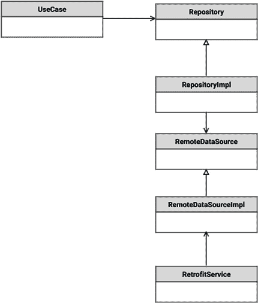
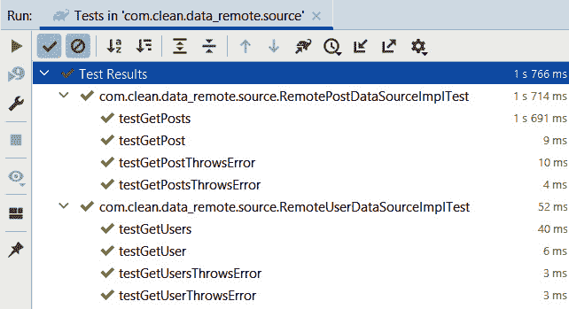
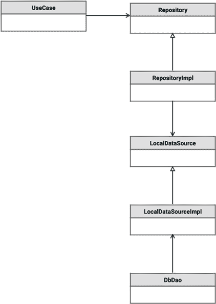
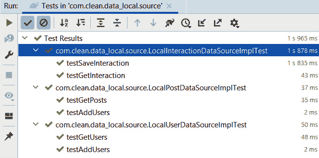
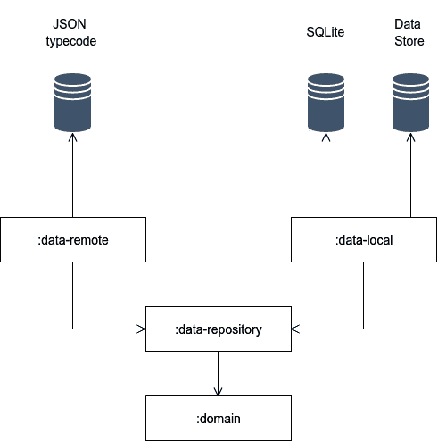

# 第七章：*第七章*：构建数据源

在本章中，我们将继续关注数据层，通过讨论如何实现本地和远程数据源以及它们在整洁架构中的作用来继续关注数据层。首先，我们将探讨如何构建远程数据源以及它们如何通过调用 Retrofit 从互联网获取数据。然后，我们将探讨实现本地数据源以及它们如何与 Room 和 Data Store 交互以在本地持久化数据。在章节的练习中，我们将继续之前的练习，并添加章节中讨论的数据源，看看我们如何将它们连接到 Room 和 Retrofit。

在本章中，我们将涵盖以下主题：

+   构建和使用远程数据源

+   构建和集成本地数据源

到本章结束时，你将了解数据源的作用，如何实现使用 Retrofit、Room 和 Data Store 管理应用程序数据的远程和本地数据源，以及我们如何将这些数据源分离到单独的库模块中。

# 技术要求

硬件和软件要求如下：

+   Android Studio – Arctic Fox | 2020.3.1 Patch 3

本章的代码文件可以在此处找到：[`github.com/PacktPublishing/Clean-Android-Architecture/tree/main/Chapter7`](https://github.com/PacktPublishing/Clean-Android-Architecture/tree/main/Chapter7).

查看以下视频以查看代码的实际应用：[`bit.ly/3yOa7jE`](https://bit.ly/3yOa7jE)

# 构建和使用远程数据源

在本节中，我们将探讨如何构建远程数据源以及如何结合 Retrofit 使用它们从互联网获取和操作数据。

在前几章中，我们为数据源定义了抽象，这些数据源是存储库依赖以操作数据。这是因为我们想要避免存储库对数据源的依赖，而是让数据源依赖于存储库。对于远程数据源，这看起来像以下图示：



图 7.1 – 远程数据源类图

远程数据源的实现有两个角色。它将调用网络层来获取和操作数据，并将数据转换为领域实体或，如果需要，存储库所需的中介数据。

让我们看看前几章中定义的实体：

```kt
data class User(
    val id: String,
    val firstName: String,
    val lastName: String,
    val email: String
) {
    fun getFullName() = "$firstName $lastName"
}
```

这里，我们有与领域定义相同的 `User` 数据类。现在让我们假设我们从互联网以 JSON 格式获取以下数据：

```kt
data class UserApiModel(
    @Json(name = "id") val id: String,
    @Json(name = "first_name") val firstName: String,
    @Json(name = "last_name") val lastName: String,
    @Json(name = "email") val email: String
)
```

在这里，我们有一个 `UserApiModel` 类，其中我们定义了与 `User` 类相同的字段，并使用 Moshi 库的 `@Json` 注解进行注解。

远程数据源抽象看起来如下：

```kt
interface UserRemoteDataSource {
    fun getUser(id: String): Flow<User>
}
```

这是我们在上一章中定义的抽象。在我们编写此类的实现之前，我们首先需要指定我们的 Retrofit 服务：

```kt
interface UserService {
    @GET("/users/{userId}")
    suspend fun getUser(@Path("userId") userId: String): 
        UserApiModel
}
```

这是一个典型的 Retrofit 服务类，它将从 `/users/{userId}` 端点获取 `UserApiModel` 类。我们现在可以创建数据源实现来从 `UserService` 获取用户：

```kt
data class UserRemoteDataSourceImpl(private val userService: UserService) : UserRemoteDataSource {
    override fun getUser(id: String): Flow<User> {
        return flow {
            emit(userService.getUser(id))
        }.map {
            User(it.id, it.firstName, it.lastName,
                it.email)
        }
    }
}
```

在这里，我们实现了 `UserRemoteDataSource` 接口，并在 `getUser` 方法中调用 `UserService` 依赖项中的 `getUser` 方法。一旦获得 `UserApiModel`，我们将其转换为 `User` 类。

在本节中，我们探讨了如何使用 Retrofit 库构建远程数据源来操作来自互联网的数据。在下一节中，我们将查看一个练习，展示如何实现远程数据源。

## 练习 07.01 – 构建远程数据源

修改 *练习 06.01 – 创建仓库*，以便在 Android Studio 中创建一个新的库模块。模块名称为 `data-remote`。此模块将依赖于 `domain` 和 `data-repository`。该模块将负责从 [`jsonplaceholder.typicode.com/`](https://jsonplaceholder.typicode.com/) 获取用户和帖子作为 JSON。

用户将具有以下 JSON 表示形式：

```kt
{
    "id": 1,
    "name": "Leanne Graham",
    "username": "Bret",
    "email": "Sincere@april.biz"
}
```

帖子将具有以下 JSON 表示形式：

```kt
{
    "userId": 1,
    "id": 1,
    "title": "sunt aut facere repellat provident 
        occaecati excepturi optio reprehenderit",
    "body": "quia et suscipit\nsuscipit recusandae consequuntur expedita et cum\nreprehenderit molestiae ut ut quas totam\nnostrum rerum est autem sunt rem eveniet architecto"
}
```

该模块需要实现以下功能：

+   `UserApiModel` 和 `PostApiModel`，它们将保存来自 JSON 的数据。

+   `UserService`，它将从 `/users` URL 返回 `UserApiModel` 列表，并根据 `/users/{userId}` URL 的 ID 返回 `UserApiModel`。

+   `PostService`，它将从 `/posts` URL 返回 `PostApiModel` 列表，并根据 `/post/{postId}` URL 的 ID 返回 `PostApiModel`。

+   `RemoteUserDataSourceImpl`，它将实现 `RemoteUserDataSource`，调用 `UserService`，并返回 `Flow`，如果调用 `UserService` 时出现错误，则发出 `User` 对象列表或 `UseCaseException.UserException`。基于 ID 返回 `User` 的相同方法也将被采用。

+   `RemotePostDataSourceImpl` 将实现 `RemotePostDataSource`，调用 `PostService`，并返回 `Flow`，如果调用 `PostService` 时出现错误，则发出 `Post` 对象列表或 `UseCaseException.PostException`。基于 ID 返回帖子的相同方法也将被采用。

要完成此练习，您需要执行以下操作：

1.  创建 `data-remote` 模块。

1.  创建 `UserApiModel` 和 `UserService` 类。

1.  创建 `PostApiModel` 和 `PostService` 类。

1.  为 `RemoteUserDataSource` 和 `RemotePostDataSource` 创建远程数据源实现。

按照以下步骤完成练习：

1.  创建一个名为 `data-remote` 的新模块，它将是一个 Android 库模块。

1.  确保在顶级 `build.gradle` 文件中设置了以下依赖项：

    ```kt
    buildscript {
         …
        dependencies {
            classpath gradlePlugins.android
            classpath gradlePlugins.kotlin
            classpath gradlePlugins.hilt
        }
    }
    ```

1.  在同一文件中，将网络库添加到库映射中：

    ```kt
        ext {
            …
            versions = [
                    …
                    okHttp             : "4.9.0",
                    retrofit           : "2.9.0",
                    moshi              : "1.13.0",
                    …
            ]
            …
            network = [
                    okHttp       : "com.squareup.okhttp3:
                        okhttp:${versions.okHttp}",
                    retrofit     : "com.squareup.retrofit2
                        :retrofit:${versions.retrofit}",
                    retrofitMoshi: "com.squareup.retrofit2
                        :converter-moshi:$
                            {versions.retrofit}",
                    moshi        : "com.squareup.moshi:
                        moshi:${versions.moshi}",
                    moshiKotlin  : "com.squareup.moshi:
                        moshi-kotlin:${versions.moshi}"
            ]
            …
        }
    ```

1.  在 `data-remote` 模块的 `build.gradle` 文件中，确保存在以下插件：

    ```kt
    plugins {
        id 'com.android.library'
        id 'kotlin-android'
        id 'kotlin-kapt'
        id 'dagger.hilt.android.plugin'
    }
    ```

1.  在同一文件中，将配置更改为顶级 `build.gradle` 文件中定义的配置：

    ```kt
    android {
        compileSdk defaultCompileSdkVersion
        defaultConfig {
            minSdk defaultMinSdkVersion
            targetSdk defaultTargetSdkVersion
            …
        }
        compileOptions {
            sourceCompatibility javaCompileVersion
            targetCompatibility javaCompileVersion
        }
        kotlinOptions {
            jvmTarget = jvmTarget
        }
    }
    ```

在这里，我们确保新的模块将使用与项目其余部分相同的配置，包括编译和最小/最大 Android 版本，以便更容易地在所有模块之间更改配置。

1.  在同一文件中，添加对网络库和 `data-repository` 以及 `domain` 模块的依赖项：

    ```kt
    dependencies {
        implementation(project(path: ":domain"))
        implementation(project(path: ":data-repository"))
        implementation coroutines.coroutinesAndroid
        implementation network.okHttp
        implementation network.retrofit
        implementation network.retrofitMoshi
        implementation network.moshi
        implementation network.moshiKotlin
        implementation di.hiltAndroid
        kapt di.hiltCompiler
        testImplementation test.junit
        testImplementation test.coroutines
        testImplementation test.mockito
    }
    ```

1.  在顶级 `gradle.properties` 文件中，为 `moshi` 添加以下配置：

    ```kt
    android.jetifier.ignorelist=moshi-1.13.0
    ```

1.  在 `data-remote` 模块的 `AndroidManifest.xml` 文件中，添加互联网权限：

    ```kt
    <?xml version="1.0" encoding="utf-8"?>
    <manifest xmlns:android="http://schemas.android.com/apk/res/android"
        package="com.clean.data_remote">
        <uses-permission android:name="android.permission.INTERNET" />
    </manifest>
    ```

1.  在 `data-remote` 模块中，创建一个名为 `networking` 的新包。

1.  在 `networking` 包中，创建一个名为 `user` 的新包。

1.  在 `user` 包中，创建一个名为 `UserApiModel` 的新类：

    ```kt
    data class UserApiModel(
        @Json(name = "id") val id: Long,
        @Json(name = "name") val name: String,
        @Json(name = "username") val username: String,
        @Json(name = "email") val email: String
    )
    ```

1.  在同一包中，创建一个名为 `UserService` 的新接口：

    ```kt
    interface UserService {
        @GET("/users")
        suspend fun getUsers(): List<UserApiModel>
        @GET("/users/{userId}")
        suspend fun getUser(@Path("userId") userId: Long): 
            UserApiModel
    }
    ```

1.  在 `networking` 包中，创建一个名为 `post` 的新包。

1.  在 `post` 包中，创建一个名为 `PostApiModel` 的新类：

    ```kt
    data class PostApiModel(
        @Json(name = "id") val id: Long,
        @Json(name = "userId") val userId: Long,
        @Json(name = "title") val title: String,
        @Json(name = "body") val body: String
    )
    ```

1.  在同一包中，创建一个名为 `PostService` 的新接口：

    ```kt
    interface PostService {
        @GET("/posts")
        suspend fun getPosts(): List<PostApiModel>
        @GET("/posts/{postId}")
        suspend fun getPost(@Path("postId") id: Long): 
            PostApiModel
    }
    ```

1.  在 `data-remote` 模块中，创建一个名为 `source` 的新包。

1.  在 `source` 包中，创建一个名为 `RemoteUserDataSourceImpl` 的新类：

    ```kt
    class RemoteUserDataSourceImpl @Inject constructor(private val userService: UserService) :
        RemoteUserDataSource {
        override fun getUsers(): Flow<List<User>> = flow {
            emit(userService.getUsers())
        }.map { users ->
            users.map { userApiModel ->
                convert(userApiModel)
            }
        }.catch {
            throw UseCaseException.UserException(it)
        }
        override fun getUser(id: Long): Flow<User> = flow {
            emit(userService.getUser(id))
        }.map {
            convert(it)
        }.catch {
            throw UseCaseException.UserException(it)
        }

        private fun convert(userApiModel: UserApiModel) =
            User(userApiModel.id, userApiModel.name, 
                userApiModel.username, userApiModel.email)
    }
    ```

这里，我们调用 `UserService` 中的 `getUsers` 和 `getUser` 方法，然后将 `UserApiModel` 对象转换为 `User` 对象，以避免其他层依赖于与网络相关的数据。同样的原则也适用于错误处理。如果发生网络错误，例如 `HTTP 404` 状态码，异常将是 `HttpException`，它是 Retrofit 库的一部分。

1.  在 `source` 包中，创建一个名为 `RemotePostDataSourceImpl` 的新类：

    ```kt
    class RemotePostDataSourceImpl @Inject constructor(private val postService: PostService) :
        RemotePostDataSource {

        override fun getPosts(): Flow<List<Post>> = flow {
            emit(postService.getPosts())
        }.map { posts ->
            posts.map { postApiModel ->
                convert(postApiModel)
            }
        }.catch {
            throw UseCaseException.PostException(it)
        }
        override fun getPost(id: Long): Flow<Post> = flow {
            emit(postService.getPost(id))
        }.map {
            convert(it)
        }.catch {
            throw UseCaseException.PostException(it)
        }
        private fun convert(postApiModel: PostApiModel) =
            Post(postApiModel.id, postApiModel.userId, 
                postApiModel.title, postApiModel.body)
    }
    ```

这里，我们遵循与 `RemoteUserDataSourceImpl` 类相同的原理。

1.  在 `data-remote` 模块中，创建一个名为 `injection` 的新包。

1.  在 `injection` 包中，创建一个名为 `NetworkModule` 的新类：

    ```kt
    @Module
    @InstallIn(SingletonComponent::class)
    class NetworkModule {
        @Provides
        fun provideOkHttpClient(): OkHttpClient = 
            OkHttpClient
            .Builder()
            .readTimeout(15, TimeUnit.SECONDS)
            .connectTimeout(15, TimeUnit.SECONDS)
            .build()
        @Provides
        fun provideMoshi(): Moshi = Moshi.Builder().add
            (KotlinJsonAdapterFactory()).build()
        @Provides
        fun provideRetrofit(okHttpClient: OkHttpClient, 
            moshi: Moshi): Retrofit = Retrofit.Builder()
            .baseUrl
                 ("https://jsonplaceholder.typicode.com/")
            .client(okHttpClient)
            .addConverterFactory
                (MoshiConverterFactory.create(moshi))
            .build()
        @Provides
        fun provideUserService(retrofit: Retrofit): 
            UserService =
            retrofit.create(UserService::class.java)
        @Provides
        fun providePostService(retrofit: Retrofit): 
            PostService =
            retrofit.create(PostService::class.java)
    }
    ```

这里，我们提供了网络所需的 Retrofit 和 `OkHttp` 依赖项。

1.  在 `injection` 包中，创建一个名为 `RemoteDataSourceModule` 的类：

    ```kt
    @Module
    @InstallIn(SingletonComponent::class)
    abstract class RemoteDataSourceModule {
        @Binds
        abstract fun bindPostDataSource(postDataSourceImpl: RemotePostDataSourceImpl): RemotePostDataSource
        @Binds
        abstract fun bindUserDataSource
            (userDataSourceImpl: 
                RemoteUserDataSourceImpl):
     RemoteUserDataSource
    }
    ```

这里，我们使用 Hilt 将此模块中的实现与 `data-repository` 模块中定义的抽象绑定。

1.  为了单元测试代码，我们现在需要在 `data-remote` 模块的 `test` 文件夹中创建一个名为 `resources` 的新文件夹。

1.  在 `resources` 文件夹内，创建一个名为 `mockito-extensions` 的文件夹；在这个文件夹内，创建一个名为 `org.mockito.plugins.MockMaker` 的文件；并在该文件中添加以下文本 – `mock-maker-inline`。

1.  创建一个名为 `RemoteUserDataSourceImplTest` 的测试类，该类将测试 `RemoteUserDataSourceImpl` 内部方法的成功场景：

    ```kt
    class RemoteUserDataSourceImplTest {
        private val userService = mock<UserService>()
        private val userDataSource = 
            RemoteUserDataSourceImpl(userService)
        @ExperimentalCoroutinesApi
        @Test
        fun testGetUsers() = runBlockingTest {
            val remoteUsers = listOf(UserApiModel(1, 
                "name", "username", "email"))
            val expectedUsers = listOf(User(1, "name", 
                "username", "email"))
            whenever(userService.getUsers()).
                thenReturn(remoteUsers)
            val result = userDataSource.getUsers().first()
            Assert.assertEquals(expectedUsers, result)
        }
        @ExperimentalCoroutinesApi
        @Test
        fun testGetUser() = runBlockingTest {
            val id = 1L
            val remoteUser = UserApiModel(id, "name", 
                "username", "email")
            val user = User(id, "name", "username", 
                "email")
            whenever(userService.getUser(id))
                .thenReturn(remoteUser)
            val result = userDataSource.getUser(id).
                first()
            Assert.assertEquals(user, result)
        }
    }
    ```

这里，我们正在模拟 `UserService` 接口并提供模拟用户数据，然后这些数据将被 `RemoteDataSourceImpl` 获取并转换。

1.  在相同的测试类中，添加错误场景：

    ```kt
    class RemoteUserDataSourceImplTest {
        …
        @ExperimentalCoroutinesApi
        @Test
        fun testGetUsersThrowsError() = runBlockingTest {
            whenever(userService.getUsers()).thenThrow
                (RuntimeException())
            userDataSource.getUsers().catch {
                Assert.assertTrue(it is UseCaseException.
                    UserException)
            }.collect()
        }
        @ExperimentalCoroutinesApi
        @Test
        fun testGetUserThrowsError() = runBlockingTest {
            val id = 1L
            whenever(userService.getUser(id)).thenThrow
                (RuntimeException())
            userDataSource.getUser(id).catch {
                Assert.assertTrue(it is UseCaseException.
                    UserException)
            }.collect()
        }
    }
    ```

在这里，我们正在模拟 `UserService` 抛出的错误，然后由 `RemoteUserDataSourceImpl` 转换为 `UseCaseException.UserException`。

1.  创建一个名为 `RemotePostDataSourceImplTest` 的测试类，它将具有与 `RemoteUserDataSourceImplTest` 相似的测试方法，用于帖子：

    ```kt
    class RemotePostDataSourceImplTest {
        private val postService = mock<PostService>()
        private val postDataSource = 
            RemotePostDataSourceImpl(postService)
        @ExperimentalCoroutinesApi
        @Test
        fun testGetPosts() = runBlockingTest {
            val remotePosts = listOf(PostApiModel(1, 1, 
                "title", "body"))
            val expectedPosts = listOf(Post(1, 1, "title", 
                "body"))
            whenever(postService.getPosts()).thenReturn
                (remotePosts)
            val result = postDataSource.getPosts().first()
            Assert.assertEquals(expectedPosts, result)
        }
        @ExperimentalCoroutinesApi
        @Test
        fun testGetPost() = runBlockingTest {
            val id = 1L
            val remotePost = PostApiModel(id, 1, "title", 
                "body")
            val expectedPost = Post(id, 1, "title", 
                "body")
            whenever(postService.getPost(id)).thenReturn
                (remotePost)
            val result = postDataSource.getPost(id).
                first()
            Assert.assertEquals(expectedPost, result)
        }
    }
    ```

在这里，我们正在对帖子做我们在 `RemoteUserDataSourceImplTest` 中对用户所做的事情。

1.  在 `RemotePostDataSourceImplTest` 中添加错误场景：

    ```kt
    class RemotePostDataSourceImplTest {
        …
        @ExperimentalCoroutinesApi
        @Test
        fun testGetPostsThrowsError() = runBlockingTest {
            whenever(postService.getPosts()).thenThrow
                (RuntimeException())
            postDataSource.getPosts().catch {
                Assert.assertTrue(it is UseCaseException.
                    PostException)
            }.collect()
        }
        @ExperimentalCoroutinesApi
        @Test
        fun testGetPostThrowsError() = runBlockingTest {
            val id = 1L
            whenever(postService.getPost(id)).thenThrow
                (RuntimeException())
            postDataSource.getPost(id).catch {
                Assert.assertTrue(it is UseCaseException.
                    PostException)
            }.collect()
        }
    }
    ```

如果我们运行测试，我们应该看到如下图所示的内容：



图 7.2 – 远程数据源单元测试输出

在这个练习中，我们向应用程序添加了一个新模块，我们可以看到如何将远程数据源添加到应用程序中。为了获取数据，我们使用 OkHttp 和 Retrofit 等库，并将它们与用于获取用户和帖子的数据源实现相结合。在下一节中，我们将扩展应用程序以介绍本地数据源，我们将在这里持久化我们获取的数据。

# 构建和集成本地数据源

在本节中，我们将分析如何构建本地数据源并将它们与 Room 和 Data Store 等库集成。

本地数据源的结构与远程数据源类似。抽象由上层提供，实现负责调用持久化框架的方法并将数据转换为实体，如下面的图所示：



图 7.3 – 本地数据源图

假设我们在前面的章节中定义了相同的 `UserEntity`：

```kt
data class User(
    val id: String,
    val firstName: String,
    val lastName: String,
    val email: String
) {
    fun getFullName() = "$firstName $lastName"
}
```

让我们对 `UserLocalDataSource` 做相同的假设：

```kt
interface UserLocalDataSource {
    suspend fun insertUser(user: User)
    fun getUser(id: String): Flow<User>
}
```

我们现在需要提供一个实现，该实现将操作来自 Room 的数据。首先，我们需要为 Room 定义一个用户实体：

```kt
@Entity(tableName = "user")
data class UserEntity(
    @PrimaryKey @ColumnInfo(name = "id") val id: String,
    @ColumnInfo(name = "first_name") val firstName: String,
    @ColumnInfo(name = "last_name") val lastName: String,
    @ColumnInfo(name = "email") val email: String
)
```

现在，我们可以定义 `UserDao`，它通过 ID 查询用户并插入用户：

```kt
@Dao
interface UserDao {
    @Query("SELECT * FROM user where id = :id")
    fun getUser(id: String): Flow<UserEntity>
    @Insert(onConflict = OnConflictStrategy.REPLACE)
    fun insertUser(users: UserEntity)
}
```

最后，数据源的实施看起来像这样：

```kt
class UserLocalDataSourceImpl(private val userDao: UserDao) : UserLocalDataSource {
    override suspend fun insertUser(user: User) {
        userDao.insertUser(UserEntity(user.id, 
            user.firstName, user.lastName, user.email))
    }
    override fun getUser(id: String): Flow<User> {
        return userDao.getUser(id).map {
            User(it.id, it.firstName, it.lastName, 
                it.email)
        }
    }
}
```

在这里，本地数据源调用 `UserDao` 来插入和检索用户，并将域实体转换为 Room 实体。

如果我们想使用 Data Store 而不是 Room 与本地数据存储实现，我们可以有如下示例：

```kt
private val KEY_ID = stringPreferencesKey("key_id")
private val KEY_FIRST_NAME = 
    stringPreferencesKey("key_first_name")
private val KEY_LAST_NAME = 
    stringPreferencesKey("key_last_name")
private val KEY_EMAIL = stringPreferencesKey("key_email")
class UserLocalDataSourceImpl(private val dataStore: 
    DataStore<Preferences>) : UserLocalDataSource {
    override suspend fun insertUser(user: User) {
        dataStore.edit {
            it[KEY_ID] = user.id
            it[KEY_FIRST_NAME] = user.firstName
            it[KEY_LAST_NAME] = user.lastName
            it[KEY_EMAIL] = user.email
        }
    }
    override fun getUser(id: String): Flow<User> {
        return dataStore.data.map {
            User(
                it[KEY_ID].orEmpty(),
                it[KEY_FIRST_NAME].orEmpty(),
                it[KEY_LAST_NAME].orEmpty(),
                it[KEY_EMAIL].orEmpty()
            )
        }
    }
}
```

在这里，我们使用一个键来存储 `User` 对象的每个字段的数据。`getUser` 方法不使用 ID 来搜索用户，这表明对于这个特定的用例，Room 是更合适的方法。

在本节中，我们探讨了如何使用 Room 和 Data Store 库构建本地数据源，以便能够在设备上本地查询和持久化数据。接下来，我们将查看一个练习，展示我们如何实现本地数据存储。

## 练习 07.02 – 构建本地数据源

修改*练习 07.01 – 构建远程数据源*，以便创建一个名为`data-local`的新 Android 库模块。此模块将依赖于`domain`和`data-repository`。

该模块将实现以下功能：

+   `UserEntity`和`PostEntity`，将保存从`User`和`Post`持久化的数据

+   `UserDao`和`PostDao`，将负责持久化和检索`UserEntity`和`PostEntity`列表

+   `LocalUserDataSourceImpl`和`LocalPostDataSourceImpl`，将负责调用`UserDao`和`PostDao`对象以持久化数据，并将数据转换为`User`和`Post`对象

+   `LocalInteractionDataSourceImpl`，将负责持久化`Interaction`对象

要完成此练习，您需要执行以下操作：

1.  创建`data-local`模块。

1.  创建`UserEntity`和`PostEntity`类。

1.  为用户和帖子创建 DAO。

1.  创建数据源实现。

按照以下步骤完成练习：

1.  创建一个名为`data-local`的新模块，它将是一个 Android 库模块。

1.  确保在顶级`build.gradle`文件中，以下依赖项已设置：

    ```kt
    buildscript {
         …
        dependencies {
            classpath gradlePlugins.android
            classpath gradlePlugins.kotlin
            classpath gradlePlugins.hilt
        }
    }
    ```

1.  在同一文件中，将持久化库添加到库映射中：

    ```kt
        ext {
            …
            versions = [
                    …
                    room               : "2.4.0",
                    datastore          : "1.0.0",
                    …
            ]
            …
            persistence = [
                    roomRuntime : "androidx.room:room-
                        runtime:${versions.room}",
                    roomKtx     : "androidx.room:room-
                         ktx:${versions.room}",
                    roomCompiler: "androidx.room:room-
                        compiler:${versions.room}",
                    datastore   : "androidx.datastore:
                        datastore-preferences:$
                           {versions.datastore}"
            ]
            …
        }
    ```

1.  在`data-local`模块的`build.gradle`文件中，确保存在以下插件：

    ```kt
    plugins {
        id 'com.android.library'
        id 'kotlin-android'
        id 'kotlin-kapt'
        id 'dagger.hilt.android.plugin'
    }
    ```

1.  在同一文件中，将配置更改为顶级`build.gradle`文件中定义的配置：

    ```kt
    android {
        compileSdk defaultCompileSdkVersion
        defaultConfig {
            minSdk defaultMinSdkVersion
            targetSdk defaultTargetSdkVersion
            …
        }
        compileOptions {
            sourceCompatibility javaCompileVersion
            targetCompatibility javaCompileVersion
        }
        kotlinOptions {
            jvmTarget = jvmTarget
        }
    }
    ```

1.  在同一文件中，添加网络库和`data-repository`以及`domain`模块的依赖项：

    ```kt
    dependencies {
        implementation(project(path: ":domain"))
        implementation(project(path: ":data-repository"))
        implementation coroutines.coroutinesAndroid
        implementation persistence.roomRuntime
        implementation persistence.roomKtx
        kapt persistence.roomCompiler
        implementation persistence.datastore
        implementation di.hiltAndroid
        kapt di.hiltCompiler
        testImplementation test.junit
        testImplementation test.coroutines
        testImplementation test.mockito
    }
    ```

1.  在`data-local`模块中，创建一个名为`db`的新包。

1.  在`db`包中，创建一个名为`user`的新包。

1.  在`user`包中，创建`UserEntity`类：

    ```kt
    @Entity(tableName = "user")
    data class UserEntity(
        @PrimaryKey @ColumnInfo(name = "id") val id: Long,
        @ColumnInfo(name = "name") val name: String,
        @ColumnInfo(name = "username") val username: 
            String,
        @ColumnInfo(name = "email") val email: String
    )
    ```

1.  在同一包中，创建`UserDao`接口：

    ```kt
    @Dao
    interface UserDao {
        @Query("SELECT * FROM user")
        fun getUsers(): Flow<List<UserEntity>>
        @Insert(onConflict = OnConflictStrategy.REPLACE)
        fun insertUsers(users: List<UserEntity>)
    }
    ```

1.  在`db`包中，创建一个名为`post`的新包。

1.  在`post`包中，创建一个名为`PostEntity`的新类：

    ```kt
    @Entity(tableName = "post")
    data class PostEntity(
        @PrimaryKey @ColumnInfo(name = "id") val id: Long,
        @ColumnInfo(name = "userId") val userId: Long,
        @ColumnInfo(name = "title") val title: String,
        @ColumnInfo(name = "body") val body: String
    )
    ```

1.  在同一包中，创建一个名为`PostDao`的新接口：

    ```kt
    @Dao
    interface PostDao {
        @Query("SELECT * FROM post")
        fun getPosts(): Flow<List<PostEntity>>
        @Insert(onConflict = OnConflictStrategy.REPLACE)
        fun insertPosts(users: List<PostEntity>)
    }
    ```

1.  在`db`包中，创建`AppDatabase`类：

    ```kt
    @Database(entities = [UserEntity::class, PostEntity::class], version = 1)
    abstract class AppDatabase : RoomDatabase() {
        abstract fun userDao(): UserDao
        abstract fun postDao(): PostDao
    }
    ```

1.  在`data-local`模块中，创建一个名为`source`的新包。

1.  在`source`包中，创建一个名为`LocalUserDataSourceImpl`的新类：

    ```kt
    class LocalUserDataSourceImpl @Inject constructor(private val userDao: UserDao) :
        LocalUserDataSource {
        override fun getUsers(): Flow<List<User>> = 
            userDao.getUsers().map { users ->
            users.map {
                User(it.id, it.name, it.username, 
                    it.email)
            }
        }
        override suspend fun addUsers(users: List<User>) = 
            userDao.insertUsers(users.map {
            UserEntity(it.id, it.name, it.username, 
                it.email)
        })
    }
    ```

在这里，在`getUsers`方法中，我们从`UserDao`检索`UserEntity`对象列表并将它们转换为`User`对象。在`addUsers`方法中，我们执行相反的操作，将待插入的`User`对象列表转换为`UserEntity`对象。

1.  在同一包中，创建`LocalPostDataSourceImpl`类：

    ```kt
    class LocalPostDataSourceImpl @Inject constructor(private val postDao: PostDao) :
        LocalPostDataSource {
        override fun getPosts(): Flow<List<Post>> = 
           postDao.getPosts().map { posts ->
            posts.map {
                Post(it.id, it.userId, it.title, it.body)
            }
        }
        override suspend fun addPosts(posts: List<Post>) = 
            postDao.insertPosts(posts.map {
            PostEntity(it.id, it.userId, it.title, 
                it.body)
        })
    }
    ```

这里，我们遵循与`LocalUserDataSourceImpl`相同的做法。

1.  在同一包中，创建`LocalInteractionDataSourceImpl`类：

    ```kt
    internal val KEY_TOTAL_TAPS = intPreferencesKey("key_total_taps")
    class LocalInteractionDataSourceImpl @Inject constructor(private val dataStore: DataStore<Preferences>) :
        LocalInteractionDataSource {
        override fun getInteraction(): Flow<Interaction> {
            return dataStore.data.map {
                Interaction(it[KEY_TOTAL_TAPS] ?: 0)
            }
        }
        override suspend fun saveInteraction(interaction: 
            Interaction) {
            dataStore.edit {
                it[KEY_TOTAL_TAPS] = 
                    interaction.totalClicks
            }
        }
    }
    ```

在这里，我们使用偏好数据存储库来持久化交互对象，通过为`Interaction`类中的每个字段保留不同的键，在这种情况下，将只有一个键用于总点击数。

1.  在`data-local`模块中，创建一个名为`injection`的新包。

1.  在`injection`包中，创建一个名为`PersistenceModule`的新类：

    ```kt
    val Context.dataStore: DataStore<Preferences> by preferencesDataStore(name = "my_preferences")
    @Module
    @InstallIn(SingletonComponent::class)
    class PersistenceModule {
        @Provides
        fun provideAppDatabase(@ApplicationContext 
            context: Context): AppDatabase =
            Room.databaseBuilder(
                context,
                AppDatabase::class.java, "my-database"
            ).build()
        @Provides
        fun provideUserDao(appDatabase: AppDatabase): 
            UserDao = appDatabase.userDao()
        @Provides
        fun providePostDao(appDatabase: AppDatabase): 
            PostDao = appDatabase.postDao()
        @Provides
        fun provideLocalInteractionDataSourceImpl
            (@ApplicationContext context: Context) =
            LocalInteractionDataSourceImpl(context.dataStore)
    } 
    ```

在这里，我们提供了所有 Data Store 和 Room 依赖项。

1.  在同一个包中，创建一个名为`LocalDataSourceModule`的新类，在其中我们将抽象与绑定连接起来：

    ```kt
    @Module
    @InstallIn(SingletonComponent::class)
    abstract class LocalDataSourceModule {
        @Binds
        abstract fun bindPostDataSource
           (lostDataSourceImpl: LocalPostDataSourceImpl): 
               LocalPostDataSource
        @Binds
        abstract fun bindUserDataSource
            (userDataSourceImpl: LocalUserDataSourceImpl): 
                LocalUserDataSource
        @Binds
        abstract fun bindInteractionDataStore
            (interactionDataStore:LocalInteractionData
                SourceImpl): LocalInteractionDataSource
    }
    ```

1.  为了单元测试代码，我们现在需要在`data-local`模块的测试文件夹中创建一个名为`resources`的新文件夹。

1.  在`resources`文件夹中，创建一个名为`mockito-extensions`的文件夹；在这个文件夹中，创建一个名为`org.mockito.plugins.MockMaker`的文件；并在该文件中添加以下文本——`mock-maker-inline`。

1.  创建`LocalUserDataSourceImplTest`测试类：

    ```kt
    class LocalUserDataSourceImplTest {
        private val userDao = mock<UserDao>()
        private val userDataSource = 
            LocalUserDataSourceImpl(userDao)
        @ExperimentalCoroutinesApi
        @Test
        fun testGetUsers() = runBlockingTest {
            val localUsers = listOf(UserEntity(1, "name", 
                "username", "email"))
            val expectedUsers = listOf(User(1, "name", 
                "username", "email"))
            whenever(userDao.getUsers()).thenReturn
                (flowOf(localUsers))
            val result = userDataSource.getUsers().first()
            Assert.assertEquals(expectedUsers, result)
        }
        @ExperimentalCoroutinesApi
        @Test
        fun testAddUsers() = runBlockingTest {
            val localUsers = listOf(UserEntity(1, "name", 
                "username", "email"))
            val users = listOf(User(1, "name", "username", 
                "email"))
            userDataSource.addUsers(users)
            verify(userDao).insertUsers(localUsers)
        }
    }
    ```

在这里，我们模拟了`UserDao`类，并使用它为`LocalUserDataSourceImpl`提供模拟数据，然后将其转换为`User`对象。

1.  创建`LocalPostDataSourceImplTest`测试类：

    ```kt
    class LocalPostDataSourceImplTest {
        private val postDao = mock<PostDao>()
        private val postDataSource = 
            LocalPostDataSourceImpl(postDao)
        @ExperimentalCoroutinesApi
        @Test
        fun testGetPosts() = runBlockingTest {
            val localPosts = listOf(PostEntity(1, 1, 
                "title", "body"))
            val expectedPosts = listOf(Post(1, 1, "title", 
                "body"))
            whenever(postDao.getPosts()).thenReturn
                (flowOf(localPosts))
            val result = postDataSource.getPosts().first()
            Assert.assertEquals(expectedPosts, result)
        }
        @ExperimentalCoroutinesApi
        @Test
        fun testAddUsers() = runBlockingTest {
            val localPosts = listOf(PostEntity(1, 1, 
                "title", "body"))
            val posts = listOf(Post(1, 1, "title", 
                "body"))
            postDataSource.addPosts(posts)
            verify(postDao).insertPosts(localPosts)
        }
    }
    ```

在这里，我们为帖子执行与在`LocalUserDataSourceImplTest`中对用户执行的相同类型的测试。

1.  创建`LocalInteractionDataSourceImplTest`测试类：

    ```kt
    class LocalInteractionDataSourceImplTest {
        private val dataStore = mock<DataStore
            <Preferences>>()
        private val interactionDataSource = 
            LocalInteractionDataSourceImpl(dataStore)
        @ExperimentalCoroutinesApi
        @Test
        fun testGetInteraction() = runBlockingTest {
            val clicks = 10
            val interaction = Interaction(clicks)
            val preferences = mock<Preferences>()
            whenever(preferences[KEY_TOTAL_TAPS]).
                thenReturn(clicks)
            whenever(dataStore.data).thenReturn
                (flowOf(preferences))
            val result = interactionDataSource.
                getInteraction().first()
            assertEquals(interaction, result)
        }
        @ExperimentalCoroutinesApi
        @Test
        fun testSaveInteraction() = runBlockingTest {
            val clicks = 10
            val interaction = Interaction(clicks)
            val preferences = mock<MutablePreferences>()
            whenever(preferences.toMutablePreferences())
                .thenReturn(preferences)
            whenever(dataStore.updateData(any())).
                thenAnswer {
                runBlocking {
                    it.getArgument<suspend (Preferences) -
                     > Preferences>(0).invoke(preferences)
                }
                preferences
            }
            interactionDataSource.saveInteraction(interaction)
            verify(preferences)[KEY_TOTAL_TAPS] = clicks
        }
    }
    ```

在这里，在`testSaveInteraction`方法中，我们需要模拟`updateData`方法而不是`DataStore`类的`edit`方法。这是因为`edit`方法是一个扩展函数，我们无法使用当前库进行模拟，而必须依赖于它调用的方法，即`updateData`。

如果我们运行测试，我们应该看到如下所示的图：



图 7.4 – 本地数据源单元测试输出

如果我们在练习中绘制模块图，我们会看到如下所示的图：



图 7.5 – 练习 07.02 模块图

我们可以看到`:data-remote`和`:data-local`模块彼此隔离。这两个模块有不同的职责和处理不同的依赖。`:data-remote`处理从互联网获取数据，而`:data-local`处理使用 Room 将数据持久化到 SQLite，并使用 Data Store 处理文件。这使我们的代码更具灵活性，因为我们能够改变我们获取数据的方式——例如，不会影响我们持久化数据的方式。

在这个练习中，我们在应用程序中创建了一个新的模块，其中我们处理本地数据源。为了持久化数据，我们使用了 Room 和 Data Store 等库，并将它们与本地数据存储集成。

# 摘要

在本章中，我们探讨了数据源的概念以及我们在 Android 应用程序中可用的不同类型的数据源。我们从远程数据源开始，看到了一些如何构建数据源并将其与 Retrofit 和 OkHttp 等库结合的例子。本地数据源与远程数据源遵循类似的原则，在这里，我们使用了 Room 和 Data Store 来实现这一点。

在练习中，我们将数据源作为不同模块的一部分进行了实现。这样做是为了避免在应用程序的其他层与我们所使用的特定数据源框架之间创建任何不必要的依赖。在下一章中，我们将探讨如何构建表示层并向用户展示数据。我们还将探索如何将表示层拆分为独立的模块，并通过引入可以被其他表示模块共享的模块，从一个模块的屏幕导航到另一个模块的屏幕。
