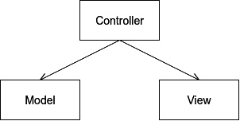
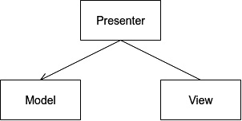
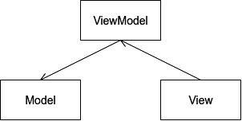
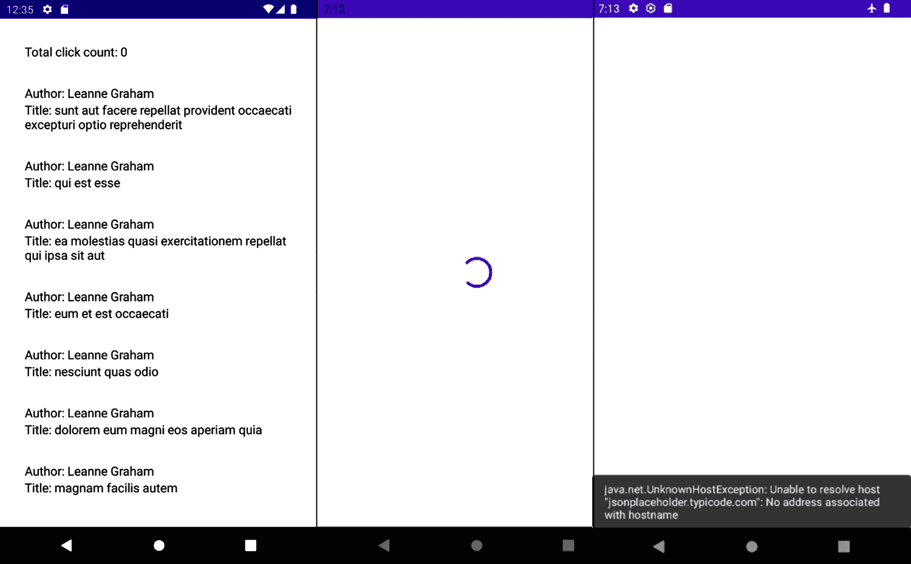
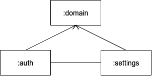
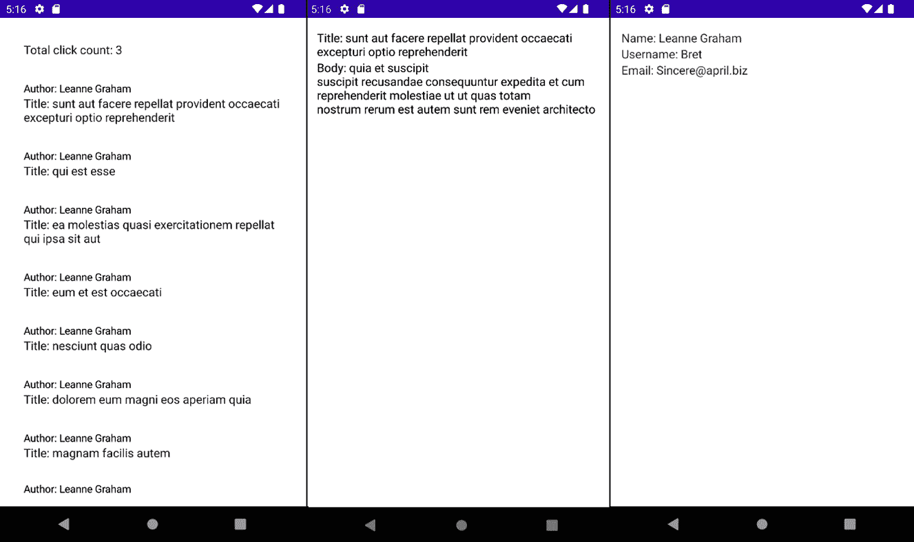

# 第八章：*第八章*: 实现 MVVM 架构

在本章中，我们将探讨 Android 应用程序如何向最终用户展示数据。我们将回顾可用于数据展示的架构模式，并分析它们之间的差异。稍后，我们将探讨**模型-视图-视图模型（MVVM）**模式，它在分离业务逻辑和用户界面更新中所起的作用，以及我们如何使用**Android 架构组件**来实现它。最后，我们将探讨如何将表示层拆分到多个库模块中。在本章的练习中，我们将整合前几章中构建的层与使用 MVVM 构建的表示层，我们将创建一个将插入到领域层以获取和更新数据的表示层，并且我们还将探讨如何在表示层的不同模块之间处理常见的逻辑。

在本章中，我们将涵盖以下主题：

+   在 Android 应用程序中展示数据

+   使用 MVVM 展示数据

+   在多个模块中展示数据

到本章结束时，你将能够使用 ViewModel 架构组件在 Android 应用程序中实现 MVVM 架构模式，并且能够将表示层拆分为独立的库模块。

# 技术要求

本章有以下硬件和软件要求：

+   Android Studio Arctic Fox 2020.3.1 Patch 3

本章的代码文件可以在以下位置找到：[`github.com/PacktPublishing/Clean-Android-Architecture/tree/main/Chapter8`](https://github.com/PacktPublishing/Clean-Android-Architecture/tree/main/Chapter8)。

查看以下视频以查看代码的实际运行情况：[`bit.ly/3FZJWIl`](https://bit.ly/3FZJWIl)

# 在 Android 应用程序中展示数据

在本节中，我们将探讨适用于在 Android 应用程序中展示数据的各种架构模式，并分析它们的优缺点。

早期的 Android 应用程序依赖于类似于`android.widget.View`层次结构的模式，模型负责管理应用程序的数据。组件之间的关系看起来可能如下：



图 8.1 – Android MVC 关系图

从*图 8.1*中，我们可以看到由活动表示的控制器会与模型交互以获取和操作数据，然后它会用相关信息更新视图。

理念是将每个`Activity`尽可能沙盒化，以便它们可以在多个应用程序之间提供和共享（就像相机应用程序被其他应用程序打开来拍照并将这些照片提供给那些应用程序一样）。正因为如此，活动需要通过意图启动，而不是通过实例化它们。通过移除直接实例化`Activity`的能力，我们失去了通过构造函数注入依赖的能力。另一个我们需要考虑的因素是活动具有生命周期状态，我们在应用程序中的每个`Activity`中继承这些状态。所有这些因素加在一起使得`Activity`非常难以测试，或者几乎不可能进行单元测试，除非我们使用像**Robolectric**这样的库，或者依赖于 Android 设备或模拟器的仪器化测试。这两种选项都速度较慢，在需要在使用测试云（如**Firebase Test Lab**）运行测试的情况下，仪器化测试可能成本较高。

为了解决存在于活动中的单元测试逻辑问题，以及后来片段中的问题，对`Activity`的各种适应以及`android.widget.View`层次结构变为 View，`Presenter`负责从模型中获取数据并执行所需的逻辑，更新`View`，而模型具有与 MVC 相同的责任来处理应用程序的数据。这些组件之间的关系如下所示：




图 8.2 – MVP 关系

组件之间关系的有趣方面是`Presenter`和`View`之间的双向关系。`Presenter`将更新`View`的相关数据，但`View`也会在必要时调用`Presenter`以进行用户交互。由于这两个组件之间的关系，需要定义一个契约，如下所示：

```kt
interface Presenter {
    fun loadUsers()
    fun validateInput(text: String)
}
interface View {
    fun showUsers(users: List<User>)
    fun showInputError(error: String)
} 
```

在这里，我们有一个`View`接口和一个`Presenter`接口。`Presenter`的实现可能看起来像这样：

```kt
class PresenterImpl(
    private val view: View,
    private val getUsersUseCase: GetUsersUseCase
) : Presenter {
    private val scope = CoroutineScope(Dispatchers.Main)
    override fun loadUsers() {
        scope.launch {
            getUsersUseCase.execute()
                .collect { users ->
                    view.showUsers(users)
                }
        }
    }
    override fun validateInput(text: String) {
        if (text.isEmpty()) {
            view.showInputError("Invalid input")
        }
    }
}
```

在这里，`PresenterImpl`类依赖于`View`类以及一个`GetUsersUseCase`对象，该对象将返回一个包含用户列表的`Flow`对象。当`Presenter`接收到用户列表时，它将调用`View`中的`showUsers`方法。当调用`validateInput`方法时，`Presenter`将检查文本是否为空，并使用错误信息调用`View`中的`showInputError`方法。`View`的实现可能如下所示：

```kt
class MainActivity : ComponentActivity(), View {
    @Inject
    private lateinit var presenter: Presenter
    private lateinit var usersAdapter: UsersAdapter
    private lateinit var editText: EditText
    private lateinit var errorView: TextView
    override fun onCreate(savedInstanceState: Bundle?) {
        super.onCreate(savedInstanceState)
        …
        editText.addTextChangedListener(object : 
            TextWatcher {
            …
            override fun afterTextChanged(s: Editable?) {
                presenter.validateInput(s?.toString().orEmpty())
            }
        })
        presenter.loadUsers()
    }
    override fun showUsers(users: List<User>) {
        usersAdapter.add(users)
    }
    override fun showInputError(error: String) {
        errorView.text = error
    }
}
```

在这里，我们在 `MainActivity` 中实现了 `View` 接口；在方法的实现中，我们调用适当的 `View-` 相关类来显示相关数据，例如在 `TextView` 对象中显示无效输入的错误消息，以及在 `RecyclerView.Adapter` 对象中设置数据。为了验证输入，当 `EditText` 对象中的文本发生变化时，它将调用 `Presenter` 来验证新的文本。`Presenter` 依赖项将通过某种形式的依赖注入来实现。

因为演示者最终将执行后台操作，我们面临造成 `Context` 泄漏的风险。这意味着我们需要将 `Activity` 的生命周期考虑进 MVP 协议中。为了实现这一点，我们将在 `Presenter` 中定义一个 `close` 方法：

```kt
interface Presenter {
    …
    fun close()
}
```

在前面的代码片段中，我们添加了 `close` 方法，该方法将在 `Activity` 的 `onDestroy` 方法中被调用，如下所示：

```kt
override fun onDestroy() {
        presenter.close()
        super.onDestroy()
}
```

`close` 方法的实现必须清理所有可能引起泄漏的资源：

```kt
class PresenterImpl(
    private val view: View,
    private val getUsersUseCase: GetUsersUseCase
) : Presenter {
    private val scope = CoroutineScope(Dispatchers.Main)
    …
    override fun close() {
        scope.cancel()
    }
}
```

在这里，我们正在取消对 `Flow` 对象的订阅，以确保在 `Activity` 被销毁后不会收到任何更新。

在本节中，我们回顾了在 Android 应用程序中使用过的先前架构模式，从早期 Android 应用程序中使用的类似 MVC 的方法到 MVP，旨在解决最初方法的一些问题。尽管 MVP 在过去很受欢迎，并且仍然存在于一些 Android 应用程序中，但它已经被逐渐淘汰，主要是因为 Android 架构组件的发布，这些组件依赖于 MVVM 模式，以及 Jetpack Compose，它更适合与数据流一起工作，而数据流更适合 MVVM。在接下来的部分中，我们将探讨 MVVM 架构模式以及它与 MVP 作为概念的不同之处。

# 使用 MVVM 展示数据

在本节中，我们将分析 **模型-视图-视图模型（Model-View-ViewModel**） 架构模式及其在 Android 应用程序中的实现方式。

MVVM 代表了一种对 Humble Object 模式的不同方法，它试图将逻辑从活动和片段中提取出来。在 MVVM 中，视图由活动和片段表示，就像在 MVP 中一样，模型扮演相同的角色，管理数据，而视图模型则位于两者之间，当视图需要数据时，从模型请求数据。三者之间的关系如下：



图 8.3 – MVVM 关系

在*图 8.3*中，我们看到三个组件之间存在单向关系。视图依赖于 ViewModel，而 ViewModel 依赖于模型。这提供了更多的灵活性，因为多个视图可以使用相同的 ViewModel。为了在视图中更新数据，MVVM 需要一个**观察者模式**的实现。这意味着 ViewModel 使用一个**可观察的**对象，视图将订阅并响应数据的变化。

要开发 Android 应用程序，我们有使用 Android Architecture Components 库的可能性，这些库提供了一个`ViewModel`类，该类解决了活动和片段生命周期的问题，并结合了用于订阅流或协程的协程扩展，当活动和片段处于数据显示无效状态时停止数据发射，以避免上下文泄露。

从`LiveData`的角度来看（它充当视图可以订阅的可观察对象）。一个`ViewModel`类的示例可能如下所示：

```kt
class MyViewModel(
    private val getUsersUseCase: GetUsersUserUseCase
) : ViewModel() {
    private val _usersFlow =
        MutableStateFlow<List<UiUser>>(listOf<UiUser>())
    val usersFlow: StateFlow<List<UiUser>> = _usersFlow
    fun load() {
        viewModelScope.launch {
            getUsersUseCase.execute()
                .map {
                    // Convert List<User> to List<UiUser>
                }
                .collect {
                    _usersFlow.value = it
                }
        }
    }
}
```

在这里，我们加载一个`User`对象的列表，并将其保存在一个`StateFlow`对象中。这个`StateFlow`对象取代了`LiveData`，代表视图将订阅的可观察对象。当视图需要用户列表时，它将调用`load`方法。

在本节中，我们分析了 MVVM 架构模式和它与 MVP 模式之间的区别。在下一节中，我们将探讨如何在 Android 应用程序中使用 MVVM 来展示数据。

## 练习 08.01 – 实现 MVVM

修改*第七章*中的*练习 7.02*，*构建本地数据源*，以便创建一个新的模块`presentation-posts`。该模块将负责使用 MVVM 显示`GetPostsWithUsersWithInteractionUseCase`的数据。数据将以以下格式显示：

+   一个包含以下文本的标题："总点击次数：x"，其中 x 是从`Interaction`类中的`totalClicks`字段获取的点击次数

+   一系列帖子，其中每一行包含以下内容："作者：x"和"标题：y"，其中 x 是`User`类中的`name`字段，y 是`Post`类中的`title`字段

+   当数据正在加载时的加载视图

+   当出现错误时的`Snackbar`视图

要完成这个练习，你需要做以下事情：

1.  创建`presentation-post`模块。

1.  创建一个新的密封类`UiState`，它将具有子类`Loading`、`Error`（将包含错误消息）和`Success`（将包含帖子数据）。

1.  创建一个名为`PostListItemModel`的新类，该类将包含`id`、`author`和`name`作为字段。

1.  创建一个名为`PostListModel`的新类，该类将包含一个`headerText`字段和一个`PostListItemModel`对象的列表。

1.  创建一个名为`PostListConverter`的新类，该类将`Result.Success`对象转换为`UiState.Success`，它包含`PostListModel`对象，并将`Result.Error`对象转换为`UiState.Error`对象。

1.  创建一个名为`PostListViewModel`的新类，该类将从`GetPostsWithUsersWithInteractionUseCase`加载数据，使用`PostListConverter`转换数据，并将`UiState`存储在`StateFlow`中。

1.  创建一个新的 Kotlin 文件，其中将包含负责绘制 UI 的`@Composable`方法。

1.  修改`app`模块中的`MainActivity`，使其显示帖子列表。

按照以下步骤完成练习：

1.  创建一个名为`presentation-post`的新模块，它将是一个 Android 库模块。

1.  确保在顶级`build.gradle`文件中设置了以下依赖项：

    ```kt
    buildscript {
        …
        dependencies {
            classpath gradlePlugins.android
            classpath gradlePlugins.kotlin
            classpath gradlePlugins.hilt
        }
    }
    ```

1.  在同一文件中，将持久化库添加到库映射中：

    ```kt
    buildscript {
        ext {
            …
            versions = [
                    …
                    viewModel            : "2.4.0",
                    navigationCompose    : "2.4.0-rc01",
                    hiltNavigationCompose: "1.0.0-rc01",
                    …
            ]
            …
            androidx = [
                    …
                    viewModelKtx           : "androidx.
                        lifecycle:lifecycle-viewmodel-
                            ktx:${versions.viewModel}",
                    viewModelCompose       : "androidx.
                        lifecycle:lifecycle-viewmodel- 
                           compose:${versions.viewModel}",
                    navigationCompose      : "androidx.
                    navigation:navigation-compose:$
                        {versions.navigationCompose}",
                    hiltNavigationCompose  : "androidx.
                        hilt:hilt-navigation-compose:$
                         {versions.hiltNavigationCompose}"
            ]
            …
        }
        …
    }
    ```

在这里，我们添加了 ViewModel 库以及导航库（将在后续练习中使用）的依赖项。

1.  在`presentation-post`模块的`build.gradle`文件中，确保存在以下插件：

    ```kt
    plugins {
        id 'com.android.library'
        id 'kotlin-android'
        id 'kotlin-kapt'
        id 'dagger.hilt.android.plugin'
    }
    ```

1.  在同一文件中，将配置更改为顶级`build.gradle`文件中定义的配置：

    ```kt
    android {
        compileSdk defaultCompileSdkVersion
        defaultConfig {
            minSdk defaultMinSdkVersion
            targetSdk defaultTargetSdkVersion
            …
        }
        …
        compileOptions {
            sourceCompatibility javaCompileVersion
            targetCompatibility javaCompileVersion
        }
        kotlinOptions {
            jvmTarget = jvmTarget
            useIR = true
        }
        buildFeatures {
            compose true
        }
        composeOptions {
            kotlinCompilerExtensionVersion versions.
                compose
        }
    }
    ```

在这里，我们保持与应用程序中其他模块相同的配置一致，并集成了 Jetpack Compose 配置。

1.  在同一文件中，添加网络库和领域模块的依赖项：

    ```kt
    dependencies {
        implementation(project(path: ":domain"))
        implementation coroutines.coroutinesAndroid
        implementation androidx.composeUi
        implementation androidx.composeMaterial
        implementation androidx.viewModelKtx
        implementation androidx.viewModelCompose
        implementation androidx.lifecycleRuntimeKtx
        implementation androidx.navigationCompose
        implementation di.hiltAndroid
        kapt di.hiltCompiler
        testImplementation test.junit
        testImplementation test.coroutines
        testImplementation test.mockito
    }
    ```

1.  在`presentation-post`模块中创建一个名为`list`的包。

1.  在`list`包中创建`UiState`类：

    ```kt
    sealed class UiState<T : Any> {
        object Loading : UiState<Nothing>()
        data class Error<T : Any>(val errorMessage: 
            String) : UiState<T>()
        data class Success<T : Any>(val data: T) : 
            UiState<T>()
    }
    ```

1.  在同一包中，创建一个名为`PostListModels`的文件。

1.  在`PostListModels`文件中，创建`PostListItemModel`类：

    ```kt
    data class PostListItemModel(
        val id: Long,
        val userId: Long,
        val authorName: String,
        val title: String
    )
    ```

1.  在同一文件中，创建`PostListModel`类：

    ```kt
    data class PostListModel(
        val headerText: String = "",
        val items: List<PostListItemModel> = listOf()
    )
    ```

1.  在`presentation-post`模块的`src/main`文件夹中，创建一个名为`res`的文件夹。

1.  在`res`文件夹中，创建一个名为`values`的新文件夹。

1.  在`values`文件夹中，创建一个名为`strings.xml`的文件。

1.  在`strings.xml`文件中，添加以下字符串：

    ```kt
    <?xml version="1.0" encoding="utf-8"?>
    <resources>
        <string name="total_click_count">Total click 
            count: %d</string>
        <string name="author">Author: %s</string>
        <string name="title">Title: %s</string>
    </resources>
    ```

1.  在`list`包中，创建`PostListConverter`类：

    ```kt
    class PostListConverter @Inject constructor(@ApplicationContext private val context: Context) {
        fun convert(postListResult: Result
            <GetPostsWithUsersWithInteractionUseCase.
                Response>): UiState<PostListModel> {
            return when (postListResult) {
                is Result.Error -> {
                    UiState.Error(postListResult.
                     exception.localizedMessage.orEmpty())
                }
                is Result.Success -> {
                    UiState.Success(PostListModel(
                        headerText = context.getString(
                            R.string.total_click_count,
                            postListResult.data.
                                interaction.totalClicks
                        ),
                        items = postListResult.data.
                            posts.map {
                            PostListItemModel(
                                it.post.id,
                                it.user.id,
                                context.getString(R.string.author, it.user.name),
                                context.getString(R.string.title, it.post.title)
                            )
                        }
                    ))
                }
            }
        }
    }
    ```

在这里，我们将`Result.Success`和`Result.Error`对象转换为等效的`UiState`对象，这些对象将用于向用户显示信息。

1.  在`list`包中，创建`PostListViewModel`类：

    ```kt
    @HiltViewModel
    class PostListViewModel @Inject constructor(
        private val useCase: 
            GetPostsWithUsersWithInteractionUseCase,
        private val converter: PostListConverter
    ) : ViewModel() {
        private val _postListFlow =
            MutableStateFlow<UiState
                <PostListModel>>(UiState.Loading)
        val postListFlow: 
            StateFlow<UiState<PostListModel>> = 
                _postListFlow
        fun loadPosts() {
            viewModelScope.launch {
                useCase.execute
                  (GetPostsWithUsersWithInteractionUseCase
                       .Request)
                    .map {
                        converter.convert(it)
                    }
                    .collect {
                        _postListFlow.value = it
                    }
            }
        }
    }
    ```

在这里，我们从`GetPostsWithUsersInteractionUseCase`对象获取帖子列表和用户列表，然后将其转换为`UiState`对象，最后使用`UiState`对象更新`StateFlow`。

1.  在`list`包中，创建一个名为`PostListScreen`的文件。

1.  在`PostListScreen`文件中，添加一个用于显示加载小部件和`Snackbar`方法的方法：

    ```kt
    @Composable
    fun Error(errorMessage: String) {
        Column(
            modifier = Modifier.fillMaxSize(),
            verticalArrangement = Arrangement.Bottom
        ) {
            Snackbar {
                Text(text = errorMessage)
            }
        }
    }
    @Composable
    fun Loading() {
        Column(
            modifier = Modifier.fillMaxSize(),
            verticalArrangement = Arrangement.Center,
            horizontalAlignment = 
                Alignment.CenterHorizontally,
        ) {
            CircularProgressIndicator()
        }
    }
    ```

1.  在同一文件中，添加一个用于显示帖子列表和标题的方法：

    ```kt
    @Composable
    fun PostList(
        postListModel: PostListModel
    ) {
        LazyColumn(modifier = Modifier.padding(16.dp)) {
            item(postListModel.headerText) {
                Column(modifier = Modifier.padding(16.dp)) {
                    Text(text = postListModel.headerText)
                }
            }
            items(postListModel.items) { item ->
                Column(
                    modifier = Modifier
                        .padding(16.dp)
                ) {
                    Text(text = item.authorName)
                    Text(text = item.title)
                }
            }
        }
    }
    ```

1.  在同一文件中，添加一个方法来监控`postListFlow`的值，并根据状态值调用前面三个方法之一：

    ```kt
    @Composable
    fun PostListScreen(
        viewModel: PostListViewModel
    ) {
        viewModel.loadPosts()
        viewModel.postListFlow.collectAsState().value.let { state ->
            when (state) {
                is UiState.Loading -> {
                    Loading()
                }
                is UiState.Error -> {
                    Error(state.errorMessage)
                }
                is UiState.Success -> {
                    PostList(state.data)
                }
            }
        }
    }
    ```

1.  在 `app` 模块的 `build.gradle` 文件中，确保添加以下插件：

    ```kt
    plugins {
        id 'com.android.application'
        id 'kotlin-android'
        id 'kotlin-kapt'
        id 'dagger.hilt.android.plugin'
    }
    ```

1.  在同一文件中，确保添加以下依赖项：

    ```kt
    dependencies {
        implementation(project(path: ":presentation-
            post"))
        implementation(project(path: ":domain"))
        implementation(project(path: ":data-remote"))
        implementation(project(path: ":data-local"))
        implementation(project(path: ":data-repository"))
        implementation androidx.core
        implementation androidx.appCompat
        implementation material.material
        implementation androidx.composeUi
        implementation androidx.composeMaterial
        implementation androidx.composeUiToolingPreview
        implementation androidx.lifecycleRuntimeKtx
        implementation androidx.composeActivity
        implementation androidx.navigationCompose
        implementation androidx.hiltNavigationCompose
        implementation di.hiltAndroid
        kapt di.hiltCompiler
        testImplementation test.junit
    }
    ```

1.  在 `app` 模块中，创建一个名为 `injection` 的包。

1.  在 `injection` 包中，创建一个名为 `AppModule` 的类：

    ```kt
    @Module
    @InstallIn(SingletonComponent::class)
    class AppModule {
        @Provides
        fun provideUseCaseConfiguration() = 
            UseCase.Configuration(Dispatchers.IO)
    }
    ```

在这里，我们提供了一个 `UseCase.Configuration` 依赖项，它将被注入到所有的 `UseCase` 子类中。

1.  在 `app` 模块中，创建一个名为 `PostApplication` 的类：

    ```kt
    @HiltAndroidApp
    class PostApplication : Application()
    ```

1.  将 `PostApplication` 类添加到 `app` 模块的 `AndroidManifest.xml` 文件中：

    ```kt
        <application
            …
            android:name=".PostApplication"
            …
       >
    ```

1.  修改 `MainActivity` 类，使其使用导航库从 `presentation-post` 模块导航到 `PostListScreen` 功能：

    ```kt
    @AndroidEntryPoint
    class MainActivity : ComponentActivity() {
        override fun onCreate(savedInstanceState: Bundle?) {
            super.onCreate(savedInstanceState)
            setContent {
                CleanAppTheme {
                    Surface(color = MaterialTheme.
                        colors.background) {
                        val navController = 
                            rememberNavController()
                        App(navController = navController)
                    }
                }
            }
        }
    }
    @Composable
    fun App(navController: NavHostController) {
        NavHost(navController, startDestination = 
            "/posts") {
            composable(route = "/posts") {
                PostListScreen(hiltViewModel())
            }
        }
    }
    ```

如果我们运行应用程序，我们应该看到以下屏幕：



图 8.4 – 练习 08.01 的输出

我们可以看到每篇帖子的标题列表和作者姓名。目前总点击次数为 0，因为我们还没有连接任何逻辑，并且尚未修改该值。我们将在后续的练习中添加该逻辑。如果在加载此列表时发生错误，则将显示一个包含 `Exception` 对象描述的 snackbar，而在数据加载时，将显示一个不确定的进度条。

在本节中，我们使用 MVVM 架构模式实现了 Android 应用程序的表示层，并将其连接到应用程序的领域层以向用户显示数据。在下一节中，我们将扩展这个层到多个模块，并查看如何在不同的模块之间导航屏幕。

# 在多个模块中呈现数据

在本节中，我们将探讨如何将表示层分割成多个模块，如何处理这些模块之间的交互，以及它们如何共享相同的数据。

在开发 Android 应用程序时，我们可以将屏幕分组到不同的模块中。例如，我们可以将登录或注册流程分组到一个名为 *authentication* 的库模块中，或者如果我们有一个设置部分，我们可以将这些屏幕分组到一个单独的模块中。有时这些屏幕将与应用程序的其余部分有共同点，例如使用相同的加载进度条或相同的错误机制。其他时候，这些屏幕必须从其他模块导航到屏幕。我们现在需要问的问题是，如何在两个模块或其他同一级别的模块之间不创建依赖关系的情况下实现这一点。对这些模块有直接的依赖关系将会有创建循环依赖的风险，如下所示：



图 8.5 – 模块循环依赖

在 *图 8.5* 中，我们展示了如果我们想从 `:auth` 模块导航到 `:settings` 模块，反之亦然，可能会发生什么。这目前是不可能的，因为这两个模块之间存在循环依赖。为了解决这个问题，我们需要创建一个新的模块。这个模块将持有两个模块之间共享的常见逻辑和常见数据。这看起来如下所示：

![Figure 8.6 – 常见展示模块

![img/Figure_8.06_B18320.jpg]

图 8.6 – 常见展示模块

在 *图 8.6* 中，我们添加了 `:common` 模块，该模块将包含可重用的视图或 `@Composable` 函数以及应用中的导航数据。随着时间的推移，这个模块将增长，因此它可以拆分为不同的模块，每个模块持有应用的不同常见功能（导航、UI、常见逻辑等）。

如果我们正在使用 Jetpack Compose 为我们的应用程序，那么我们可以依赖在 *第三章* 的 *练习 03.02 – 使用 Jetpack Compose 进行导航* 中完成的工作，其中我们为应用导航定义了以下结构：

```kt
private const val ROUTE_USERS = "users"
private const val ROUTE_USER = "users/%s"
private const val ARG_USER_NAME = "name"
sealed class AppNavigation(val route: String, val 
    argumentName: String = "") {
    object Users : AppNavigation(ROUTE_USERS)
    object User : AppNavigation(String.format(ROUTE_USER, 
        "{$ARG_USER_NAME}"), ARG_USER_NAME) {
        fun routeForName(name: String) = 
            String.format(ROUTE_USER, name)
    }
}
```

当列表中的用户被点击时，`routeForName` 方法会从 `Users` 屏幕调用，然后 `NavHost` 方法会使用该路由来打开 `User` 屏幕。在处理多个模块时，将在 `:common` 模块中存储模块之间共享的路由，以便每个模块都可以访问该路由。然后，具有 `NavHost` 的 `:app` 模块将能够导航到每个屏幕。

当涉及到处理不同模块之间的常见逻辑，例如显示相同的错误或加载视图时，我们可以在 `:common` 模块中声明可组合函数：

```kt
@Composable
fun Error(errorMessage: String) {
    …
}
@Composable
fun Loading() {
    …
} 
```

如果不同模块中的不同屏幕共享相同的状态，我们可以有如下类似的情况：

```kt
@Composable
fun <T> CommonScreen(state: State<T>, onSuccess: 
    @Composable (T) -> Unit) {
    when (result) {
        is State.Success -> {
            onSuccess(result.data)
        }
        is State.Error -> {
            Error(result.errorMessage)
        }
        is State.Loading -> {
            Loading()
        }
    }
}
```

在这里，我们将检查当前状态并显示常见的错误和加载视图，而屏幕本身只需关注成功状态。

在本节中，我们探讨了如何将展示层拆分为多个模块，以及如何处理这些模块之间的常见元素。在下一节中，我们将探讨一个练习，说明如何实现这一点。将展示层拆分为多个模块将减少应用程序构建时间，因为 Gradle 缓存只会重新构建包含更改的模块。另一个好处是，它为应用程序的范围划定了界限，这在仅导出应用程序的某些功能时将是有益的。

## 练习 08.02 – 多模块数据展示

修改 *练习 08.01 – 实现 MVVM*，以便创建两个新的模块：`presentation-post` 和 `presentation-common`。

`presentation-common` 模块将包含以下内容：

+   将 `UiState` 类从 `presentation-post` 模块移动过来。

+   `CommonResultConverter`将是一个具有两个方法的抽象类：`convert`是一个将`Result`对象转换为`UiState`对象的具体方法，而`convertSuccess`是一个用于将`Result.Success`中的数据转换的抽象方法。

+   `CommonScreen`将包含用于显示不同类型`UiState`的`@Composable`方法，以及两个额外的用于显示错误 snackbar 和进度条的方法。这两个方法将从`PostListScreen`移动过来。

+   `AppNavigation`将包含导航到帖子列表、单个帖子以及单个用户的路由。

+   `presentation-post`模块将添加一个额外的包来显示单个帖子的信息，格式如下：标题：x 和正文：y，其中 x 是帖子的标题，y 是帖子的正文。为了显示这些信息，需要创建一个新的`ViewModel`和`Converter`类，这些类将把`GetPostUseCase`中的数据转换过来。当点击作者文本时，应用将导航到用户屏幕；当点击`Post`列表项时，应用将导航到帖子屏幕。点击其中任何一个，都会调用`UpdateInteractionUseCase`来增加点击次数，这将随后反映在列表标题中。

+   `presentation-user`将以以下格式显示单个用户的信息：姓名：x，用户名：y，和电子邮件：z，其中 x、y 和 z 由`User`实体中的信息表示。用户数据将从`GetUserUseCase`加载。

+   `app`模块将更新以处理所有这些屏幕之间的导航。

要完成这个练习，你需要执行以下操作：

1.  创建`presentation-common`模块。

1.  将`UiState`类和`Error`以及`Loading` `@Composable`函数移动到`CommonScreen`文件中，并创建一个新的`@Composable`函数，该函数将处理`CommonScreen`文件中每种类型的`UiState`对象。

1.  创建`CommonResultConverter`类。

1.  创建`AppNavigation`类。

1.  修改`presentation-post`中的类以重用前面的类和方法。

1.  创建负责显示单个帖子信息的`PostScreen`、`PostViewModel`、`PostConverter`和`PostModel`类。

1.  创建`presentation-user`模块。

1.  创建负责显示单个帖子信息的`UserScreen`、`UserViewModel`、`UserConverter`和`UserModel`类。

1.  实现屏幕间的导航。

1.  在`PostListViewModel`中添加更新点击次数的逻辑。

按照以下步骤完成练习：

1.  创建`presentation-common`和`presentation-user` Android 库模块。

1.  将*练习 08.01 – 实现 MVVM*中的步骤 3-5 应用于这些新模块。

1.  在`presentation-post`和`presentation-user`模块的`build.gradle`文件中，确保添加了对`presentation-common`的依赖项。

    ```kt
    dependencies {
        …
        implementation(project(path: ":presentation-common"))
        …
    }
    ```

1.  在 `presentation-common` 模块中，创建一个新的包，命名为 `state`。

1.  将 `UiState` 类移动到前面的包中。

1.  在同一个包中，创建 `CommonResultConverter` 类：

    ```kt
    abstract class CommonResultConverter<T : Any, R : Any> {
        fun convert(result: Result<T>): UiState<R> {
            return when (result) {
                is Result.Error -> {
                    UiState.Error(result.exception.
                        localizedMessage.orEmpty())
                }
                is Result.Success -> {
                    UiState.Success(convertSuccess
                        (result.data))
                }
            }
        }
        abstract fun convertSuccess(data: T): R
    }
    ```

在这里，对于任何带有异常信息的 `Result.Error` 对象，我们返回 `UiState.Error`，对于 `Result.Success`，我们返回 `UiState.Success` 并使用 `Result.Success` 对象内部的数据的抽象。这代表了一种解决方案，说明了我们如何提取显示错误的公共逻辑。

1.  修改 `presentation-post` 模块中的 `PostListConverter` 类，使其扩展 `CommonResultConverter` 并为 `convertSuccess` 方法提供实现：

    ```kt
    class PostListConverter @Inject constructor (@ApplicationContext private val context: Context) :
        CommonResultConverter<GetPostsWithUsersWithInteraction
        UseCase.Response, PostListModel>() {
        override fun convertSuccess(data: 
            GetPostsWithUsersWithInteractionUseCase.
                Response): PostListModel {
            return PostListModel(
                headerText = context.getString(
                    R.string.total_click_count,
                    data.interaction.totalClicks
                ),
                items = data.posts.map {
                    PostListItemModel(
                        it.post.id,
                        it.user.id,
                        context.getString(R.string.author, 
                            it.user.name),
                        context.getString(R.string.title, 
                            it.post.title)
                    )
                }
            )
        }
    }
    ```

在这里，我们只处理将 `GetPostsWithUsersWithInteractionUseCase.Response` 转换为 `PostListModel`，允许父类处理错误。

1.  在 `presentation-common` 模块的 `state` 包中，创建一个名为 `CommonScreen` 的新文件。

1.  在 `CommonScreen` 文件中，添加一个 `CommonScreen` `@Composable` 方法，它将检查 `UiState` 并对 `UiState.Error` 调用 `Error`，对 `UiState.Loading` 调用 `Loading`：

    ```kt
    @Composable
    fun <T : Any> CommonScreen(state: UiState<T>, onSuccess: @Composable (T) -> Unit) {
        when (state) {
            is UiState.Loading -> {
                Loading()
            }
            is UiState.Error -> {
                Error(errorMessage = state.errorMessage)
            }
            is UiState.Success -> {
                onSuccess(state.data)
            }
        }
    }
    ```

1.  将 `PostListScreen` 中的 `Error` 和 `Loading` `@Composable` 函数移动到 `CommonScreen` 文件中。

1.  修改 `presentation-post` 模块中的 `PostListScreen` `@Composable` 方法，使其使用 `CommonScreen` 方法：

    ```kt
    @Composable
    fun PostListScreen(
        viewModel: PostListViewModel
    ) {
        viewModel.loadPosts()
        viewModel.postListFlow.collectAsState().value.let 
            { state ->
            CommonScreen(state = state) {
                PostList(postListModel = it)
            }
        }
    }
    ```

现在，整个转换和显示帖子列表的逻辑将只处理相关对象，将错误和加载场景留在 `presentation-common` 模块中。

1.  在 `presentation-common` 中，创建一个新的包，命名为 `navigation`。

1.  在 `navigation` 包中，创建一个名为 `PostInput` 的类：

    ```kt
    data class PostInput(val postId: Long)
    ```

这个类旨在表示帖子屏幕加载数据所需的输入。

1.  在同一个包中，创建一个名为 `UserInput` 的类：

    ```kt
    data class UserInput(val userId: Long)
    ```

这个类旨在表示用户屏幕加载数据所需的输入。

1.  在同一个包中，创建一个新的类，命名为 `NavRoutes`：

    ```kt
    private const val ROUTE_POSTS = "posts"
    private const val ROUTE_POST = "posts/%s"
    private const val ROUTE_USER = "users/%s"
    private const val ARG_POST_ID = "postId"
    private const val ARG_USER_ID = "userId"
    sealed class NavRoutes(
        val route: String,
        val arguments: List<NamedNavArgument> = 
            emptyList()
    ) {
        …
    }
    ```

在这里，我们定义了每个屏幕的路径。帖子屏幕将没有参数，但用户和帖子屏幕将需要 `postId` 和 `userId` 的值。

1.  在 `NavRoutes` 类中创建 `Posts` 类：

    ```kt
    sealed class NavRoutes(
        val route: String,
        val arguments: List<NamedNavArgument> = 
            emptyList()
    ) {
        object Posts : NavRoutes(ROUTE_POSTS)
    }
    ```

1.  在 `NavRoutes` 类中创建 `Post` 类：

    ```kt
    sealed class NavRoutes(
        val route: String,
        val arguments: List<NamedNavArgument> = 
            emptyList()
    ) {
        object Post : NavRoutes(
            route = String.format(ROUTE_POST, 
                "{$ARG_POST_ID}"),
            arguments = listOf(navArgument(ARG_POST_ID) {
                type = NavType.LongType
            })
        ) {
            fun routeForPost(postInput: PostInput) = 
               String.format(ROUTE_POST, postInput.postId)
            fun fromEntry(entry: NavBackStackEntry): 
                PostInput {
                return PostInput(entry.arguments?.
                    getLong(ARG_POST_ID) ?: 0L)
            }
        }
    }
    ```

在这里，我们需要将 `Post` 输入分解为 URL 的参数。`routeForPost` 方法将为具有 ID `1` 的 `Post` 对象创建一个 `/posts/1` URL。`fromEntry` 方法将从导航条目对象重新组装 `PostInput` 对象。我们采取这种方法的理由是，导航库不鼓励使用 `Parcelable`，这意味着在不同屏幕之间传递数据将不得不通过 URL 来完成。为了避免在多个模块之间跟踪参数时出现任何问题，我们可以使用对象，并将从参数中读取和构造参数的逻辑隔离到这个类中。

1.  在 `NavRoutes` 类内部创建 `User` 类：

    ```kt
    sealed class NavRoutes(
        val route: String,
        val arguments: List<NamedNavArgument> = emptyList()
    ) {
        object User : NavRoutes(
            route = String.format(ROUTE_USER, 
                "{$ARG_USER_ID}"),
            arguments = listOf(navArgument(ARG_USER_ID) {
                type = NavType.LongType
            })
        ) {
            fun routeForUser(userInput: UserInput) = 
               String.format(ROUTE_USER, userInput.userId)
            fun fromEntry(entry: NavBackStackEntry): 
                UserInput {
                return UserInput(entry.arguments?.getLong
                    (ARG_USER_ID) ?: 0L)
            }
        }
    }
    ```

这里，我们应用与`Post`类相同的原理。

1.  在`presentation-post`模块中创建一个名为`single`的新包：

1.  在`single`包内创建`PostModel`类：

    ```kt
    data class PostModel(
        val title: String,
        val body: String
    )
    ```

1.  在`single`包内创建`PostConverter`类：

    ```kt
    class PostConverter @Inject constructor(@ApplicationContext private val context: Context) :
        CommonResultConverter<GetPostUseCase.Response, 
            PostModel>() {
        override fun convertSuccess(data: 
            GetPostUseCase.Response): PostModel {
            return PostModel(
                context.getString(R.string.title, 
                    data.post.title),
                context.getString(R.string.body, 
                    data.post.body)
            )
        }
    }
    ```

1.  将`body`字符串添加到`presentation-post`模块的`strings.xml`中：

    ```kt
    <resources>
        …
        <string name="body">Body: %s</string>
    </resources>
    ```

1.  在`single`包内创建`PostViewModel`类：

    ```kt
    @HiltViewModel
    class PostViewModel @Inject constructor(
        private val postUseCase: GetPostUseCase,
        private val postConverter: PostConverter
    ) : ViewModel() {
        private val _postFlow =
            MutableStateFlow<UiState<PostModel>>(UiState.Loading)
        val postFlow: StateFlow<UiState<PostModel>> = 
            _postFlow
        fun loadPost(postId: Long) {
            viewModelScope.launch {
                postUseCase.execute(GetPostUseCase.
                    Request(postId))
                    .map {
                        postConverter.convert(it)
                    }
                    .collect {
                        _postFlow.value = it
                    }
            }
        }
    }
    ```

这里，我们使用`GetPostUseCase`加载特定帖子的信息，并使用之前定义的转换器将数据转换为`PostModel`，该模型将被设置在`Flow`对象中。

1.  在`single`包内创建`PostScreen`文件，该文件将显示帖子信息：

    ```kt
    @Composable
    fun PostScreen(
        viewModel: PostViewModel,
        postInput: PostInput
    ) {
        viewModel.loadPost(postInput.postId)
        viewModel.postFlow.collectAsState().value.let { 
            result ->
            CommonScreen(result) { postModel ->
                Post(postModel)
            }
        }
    }
    @Composable
    fun Post(postModel: PostModel) {
        Column(modifier = Modifier.padding(16.dp)) {
            Text(text = postModel.title)
            Text(text = postModel.body)
        }
    }
    ```

这里，我们遵循与`PostListScreen`文件相同的原理，将方法分为两个，`PostScreen`用于观察`UiState`对象，`PostListScreen`用于处理用户界面绘制。

1.  在`presentation-user`模块中，创建一个名为`single`的新包：

1.  在`single`包内创建一个名为`UserModel`的新类：

    ```kt
    data class UserModel(
        val name: String,
        val username: String,
        val email: String
    )
    ```

1.  在`single`包内创建一个名为`UserConverter`的新类：

    ```kt
    class UserConverter @Inject constructor(@ApplicationContext private val context: Context) :
        CommonResultConverter<GetUserUseCase.Response, 
            UserModel>() {

        override fun convertSuccess(data: GetUserUseCase.
            Response): UserModel {
            return UserModel(
                context.getString(R.string.name,
                    data.user.name),
                context.getString(R.string.username, 
                    data.user.username),
                context.getString(R.string.email, 
                    data.user.email)
            )
        }
    }
    ```

1.  在`presentation-user`模块的`main`文件夹内创建`res/values/strings.xml`文件：

    ```kt
    <?xml version="1.0" encoding="utf-8"?>
    <resources>
        <string name="name">Name: %s</string>
        <string name="username">Username: %s</string>
        <string name="email">Email: %s</string>
    </resources>
    ```

1.  在`single`包内创建`UserViewModel`：

    ```kt
    @HiltViewModel
    class UserViewModel @Inject constructor(
        private val userUseCase: GetUserUseCase,
        private val converter: UserConverter
    ) : ViewModel() {
        private val _userFlow =
            MutableStateFlow<UiState<UserModel>>
                (UiState.Loading)
        val userFlow: StateFlow<UiState<UserModel>> = 
            _userFlow
        fun loadUser(userId: Long) {
            viewModelScope.launch {
                userUseCase.execute
                    (GetUserUseCase.Request(userId))
                    .map {
                        converter.convert(it)
                    }
                    .collect {
                        _userFlow.value = it
                    }
            }
        }
    }
    ```

这里，我们从`GetUserUseCase`获取用户数据，使用`UserConverter`进行转换，并将结果发布在`Flow`对象中。

1.  在`single`包内创建`UserScreen`文件：

    ```kt
    @Composable
    fun UserScreen(
        viewModel: UserViewModel,
        userInput: UserInput
    ) {
        viewModel.loadUser(userInput.userId)
        viewModel.userFlow.collectAsState().value.let { 
            result ->
            CommonScreen(result) { userModel ->
                User(userModel)
            }
        }
    }
    @Composable
    fun User(userModel: UserModel) {
        Column(modifier = Modifier.padding(16.dp)) {
            Text(text = userModel.name)
            Text(text = userModel.username)
            Text(text = userModel.email)
        }
    }
    ```

这里，我们采用与其他屏幕相同的方法，在一个方法中订阅`UiState`的变化，在另一个方法中显示用户信息。

1.  在`PostListScreen`中添加点击监听器：

    ```kt
    @Composable
    fun PostList(
        postListModel: PostListModel,
        onRowClick: (PostListItemModel) -> Unit,
        onAuthorClick: (PostListItemModel) -> Unit
    ) {
        LazyColumn(modifier = Modifier.padding(16.dp)) {
            …
            items(postListModel.items) { item ->
                Column(modifier = Modifier
                    .padding(16.dp)
                    .clickable {
                        onRowClick(item)
                    }) {
                    ClickableText(text = AnnotatedString(
                        text = item.authorName), onClick =  
                    {
                        onAuthorClick(item)
                    })
                    Text(text = item.title)
                }
            }
        }
    }
    ```

在前面的代码片段中，我们指定了行被点击和作者被点击时的点击监听器。因为我们正在应用状态提升，我们希望将点击监听器传播到`PostList`方法的调用者。为此，我们为每个点击监听器定义了一个参数，作为一个接受行数据作为输入且不需要返回结果的 lambda 函数。有关 lambda 的更多信息，请参阅此处：[`kotlinlang.org/docs/lambdas.html#function-types`](https://kotlinlang.org/docs/lambdas.html#function-types)。

1.  修改`PostListScreen`的`@Composable`方法，以便当用户点击时，我们导航到用户界面，当行被点击时，我们导航到帖子：

    ```kt
    @Composable
    fun PostListScreen(
        viewModel: PostListViewModel,
        navController: NavController
    ) {
        viewModel.loadPosts()
        viewModel.postListFlow.collectAsState().value.let 
            { state ->
            CommonScreen(state = state) {
                PostList(it, { postListItem ->
                    navController.navigate(NavRoutes.Post.
                        routeForPost(PostInput
                            (postListItem.id)))
                }) { postListItem ->
                    navController.navigate(NavRoutes.User.
                        routeForUser(UserInput
                            (postListItem.userId)))
                }
            }
        }
    }
    ```

1.  在`app`模块的`build.gradle`中，确保添加了对`presentation-common`和`presentation-user`的依赖：

    ```kt
    dependencies {
        …
        implementation(project(path: ":presentation-
            user"))
        implementation(project(path: ":presentation-
            common"))
        …
    }
    ```

1.  在`MainActivity`文件中，修改`App`方法，以便实现不同屏幕之间的导航：

    ```kt
    @Composable
    fun App(navController: NavHostController) {
        NavHost(navController, startDestination = 
            NavRoutes.Posts.route) {
            composable(route = NavRoutes.Posts.route) {
                PostListScreen(hiltViewModel(), 
                    navController)
            }
            composable(
                route = NavRoutes.Post.route,
                arguments = NavRoutes.Post.arguments
            ) {
                PostScreen(
                    hiltViewModel(),
                    NavRoutes.Post.fromEntry(it)
                )
            }
            composable(
                route = NavRoutes.User.route,
                arguments = NavRoutes.User.arguments
            ) {
                UserScreen(
                    hiltViewModel(),
                    NavRoutes.User.fromEntry(it)
                )
            }
        }
    }
    ```

这里，我们将应用程序中的所有屏幕添加到导航图中，对于`UserScreen`和`PostScreen`，我们从导航图条目中提取`UserInput`和`PostInput`对象。我们现在需要添加交互。

1.  在`PostListModel`内部添加一个`Interaction`字段：

    ```kt
    data class PostListModel(
        …
        val interaction: Interaction
    )
    ```

1.  修改`PostListConverter`以包含`interaction`字段：

    ```kt
    class PostListConverter @Inject constructor (@ApplicationContext private val context: Context) :
        CommonResultConverter<GetPostsWithUsersWithInteraction
        UseCase.Response, PostListModel>() {
        override fun convertSuccess(data: 
            GetPostsWithUsersWithInteractionUseCase.
                Response): PostListModel {
            return PostListModel(
                …
                interaction = data.interaction
            )
        }
    }
    ```

1.  在 `PostListViewModel` 中添加对 `UpdateInteractionUseCase` 的引用，并添加一个更新交互的方法：

    ```kt
    @HiltViewModel
    class PostListViewModel @Inject constructor(
        …
        private val updateInteractionUseCase: 
            UpdateInteractionUseCase
    ) : ViewModel() {
        …
        fun updateInteraction(interaction: Interaction) {
            viewModelScope.launch {
                updateInteractionUseCase.execute(
                    UpdateInteractionUseCase.Request(
                        interaction.copy(
                            totalClicks = interaction.
                                totalClicks + 1
                        )
                    )
                ).collect()
            }
        }
    }
    ```

1.  修改 `PostListScreen` 的 `@Composable` 方法，使其在每次点击时调用更新交互：

    ```kt
    @Composable
    fun PostListScreen(
        viewModel: PostListViewModel,
        navController: NavController
    ) {
        …
        viewModel.postListFlow.collectAsState().value.let 
            { state ->
            CommonScreen(state = state) {
                PostList(it, { postListItem ->
                    viewModel.updateInteraction(it.interaction)
                    …
                }) { postListItem ->
                    viewModel.updateInteraction(it.interaction)
                    …
                }
            }
        }
    }
    ```

如果我们运行应用程序，我们将看到如下图的输出：



图 8.7 – 练习 08.02 的输出

从 *图 8.7* 我们可以看到，当点击行时，我们会进入显示帖子信息的屏幕，当点击作者时，我们会进入用户信息屏幕。通过将 `NavRoutes` 类放在 `presentation-common` 模块中，我们可以从位于同一模块（帖子）的屏幕和位于不同模块（用户）的屏幕上导航到帖子列表。创建额外模块的解决方案是避免循环依赖的好方法，这不仅适用于表示层中的模块，也适用于其他层中的模块。

在这个练习中，我们学习了如何将表示层分割成独立的模块，以及我们如何使用公共模块来存储层中所有模块所需的共享逻辑和数据。这是一种技术，如果我们想将应用程序的其他层分割开，我们也可以使用它。

# 摘要

在本章中，我们探讨了 Android 应用程序的表示层以及实现此层的一些不同方法，例如 MVC、MVP 和 MVVM。我们决定专注于 MVVM 方法，因为它涉及生命周期和与 Jetpack Compose 的兼容性带来了许多好处。然后我们探讨了当我们想要将表示层分割到多个模块时会发生什么，以及我们如何解决这些模块之间的公共逻辑。在下一章中，我们将进一步构建 MVVM 模式，并研究 **模型-视图-意图**（**MVI**）模式，该模式进一步利用可观察模式将用户操作纳入可观察的状态。
