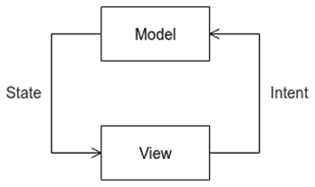
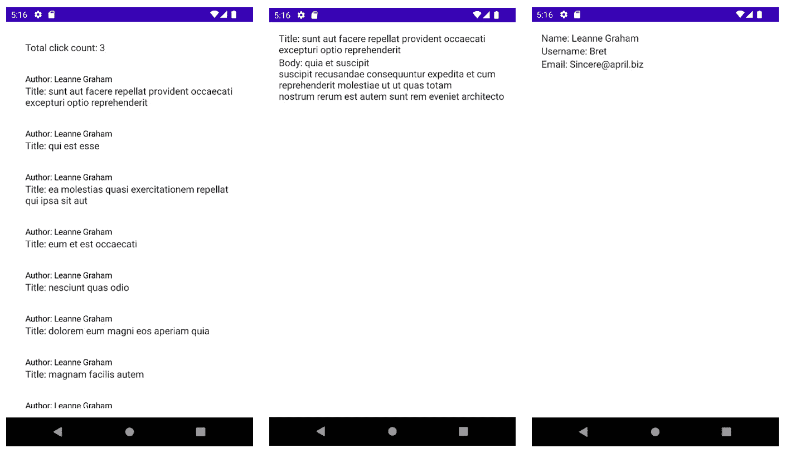

# 第九章：*第九章*：实现 MVI 架构

在本章中，我们将介绍**模型-视图-意图**（**MVI**）的概念以及它为管理应用程序状态提供的优势。我们将从分析 MVI 是什么开始，然后继续使用 Kotlin 流来实现它。在本章的练习中，我们将基于上一章的练习，并使用 MVI 模式重新实现它们，以突出这种模式如何集成到具有多个模块的应用程序的表现层。

在本章中，我们将涵盖以下主题：

+   介绍 MVI

+   使用 Kotlin 流实现 MVI

到本章结束时，你将能够使用 Kotlin 流在多模块 Android 应用程序中实现 MVI 架构模式。

# 技术要求

硬件和软件要求如下：

+   Android Studio Arctic Fox 2020.3.1 补丁 3

本章的代码文件可以在以下位置找到：[`github.com/PacktPublishing/Clean-Android-Architecture/tree/main/Chapter9`](https://github.com/PacktPublishing/Clean-Android-Architecture/tree/main/Chapter9).

查看以下视频以查看代码的实际应用：[`bit.ly/3FYZKLn`](https://bit.ly/3FYZKLn)

# 介绍 MVI

在本节中，我们将探讨 MVI 架构模式是什么，它试图解决的问题，以及它为解决这些问题提供的解决方案。

让我们假设你需要为应用程序开发一个配置屏幕。它将加载现有配置，并需要切换各种开关，以及使用现有数据预填充输入字段。在加载数据之后，用户可以修改这些字段中的每一个。为了实现这一点，你可能需要保留这些字段所表示数据的可变引用，以便当用户更改值时，引用会发生变化。

这可能由于这些字段的可变性而引发问题，尤其是在处理并发操作或它们的顺序时。解决这个问题的一种方法是将数据设置为不可变，并将其组合成一个用户界面可以观察的状态。应用或用户需要对用户界面进行的任何更改将通过响应式数据流来完成。然后，该流将创建一个新的状态来表示更改并更新用户界面。

这基本上是 MVI 的工作方式。在 MVI 中，**视图**扮演着与 MVP 或 MVVM 中相同的角色，而**模型**持有用户界面的状态，并且代表单一的真实来源。**意图**表示对状态的任何更改，这将随后被更新。在*图 9.1*中，我们可以看到**视图**将向**模型**发送**意图**，然后**模型**将触发状态的变化，这将更新**视图**：

注意

在 MVI 的上下文中，术语“意图”与用于与不同 Android 组件交互的 Android `Intent`类不同。



图 9.1 – MVI 图

这个图中缺少的是 **ViewModel** 或 **Presenter** 的等效物。这是因为 MVI 模式不是这些模式的替代品，而是建立在它们之上的。

为了可视化这可能是什么样子，让我们看看一个 `ViewModel` 的例子：

```kt
class MyViewModel @Inject constructor(
    private val getMyDataUseCase: GetMyDataUseCase
) : ViewModel() {
    private val _myDataFlow =
        MutableStateFlow<MyData>(MyData())
    val myDataFlow: StateFlow<MyData> = _myDataFlow
    var text: String = ""
    fun loadMyData() {
        viewModelScope.launch {
            getMyDataUseCase.execute
                (GetPostsWithUsersWithInteractionUseCase.
                    Request)
                .collect {
                    _myDataFlow.value = it
                }
        }
    }
}
```

在前面的例子中，我们定义了一个名为 `MyViewModel` 的类，其中包含一个加载数据的使用案例和一个 `text` 变量，该变量将在用户更改它时由视图进行更改。我们可以看到，`text` 变量是一个可变的变量，可以从持有要加载数据的 `StateFlow` 变量中访问，并且我们有一个加载数据的方法。要将前面的代码过渡到 MVI，我们首先需要定义一个将持有要加载数据和文本的状态。这将代表我们的真相来源。对于前面的例子，这个状态将如下所示：

```kt
data class MyState(
        val myData: MyData = MyData(),
        val text: String = ""
)
```

在 `MyState` 类中，我们将要加载数据和要更改的文本移动。现在，我们需要识别动作；在这种情况下，我们有两个动作：加载数据和用用户引入的新值更新文本的值：

```kt
    sealed class MyAction {
        object LoadAction : MyAction()
        data class UpdateAction(val text: String) : 
            MyAction()
    }
```

在前面的例子中，我们将动作表示为一个密封类，并定义了两个动作：加载数据和更新文本。接下来，我们需要创建适当的数据流来处理动作和管理状态：

```kt
    private val _myStateFlow = MutableStateFlow<MyState>
        (MyState())
    val myStateFlow: StateFlow<MyState> = _myDataFlow
    private val _actionFlow: MutableSharedFlow<MyAction> = 
        MutableSharedFlow()
```

在前面的例子中，我们将 `StateFlow` 变量更改为持有之前定义的状态对象，并添加了一个类似的 `SharedFlow` 变量，该变量将负责管理用户插入的动作。我们现在需要订阅并处理这些动作：

```kt
class MyViewModel @Inject constructor(
    private val getMyDataUseCase: GetMyDataUseCase
) : ViewModel() {
    …
    init {
        viewModelScope.launch {
            action.collect { action ->
                when (action) {
                    is MyViewModel.MyAction.LoadAction -> {
                        loadMyData()
                    }
                    is MyViewModel.MyAction.UpdateAction -> {
                        _myDataFlow.emit(_myDataFlow.value.copy(text = 
    action.text))
                    }
                }
            }
        }
    }
    fun submitAction(action: MyAction) {
        viewModelScope.launch {
            _action.emit(action)
        }
    }
    private fun loadMyData() {
        getMyDataUseCase.execute
            (GetPostsWithUsersWithInteractionUseCase.
                Request)
            .collect {
                _myDataFlow.value = it
            }
    }
    …
}
```

在 `init` 块中，我们正在收集动作，然后，对于每个动作，我们执行所需的操作。视图将调用 `submitAction` 方法，并传递它希望 ViewModel 执行的动作。对于这个例子，`MyAction` 在 MVI 上下文中扮演 Intent 的角色，而 ViewModel 将位于视图和模型之间，并负责管理模型和视图之间的数据流，以及管理状态。

当涉及到 MVI 模式的实现时，针对不同的技术和不同的架构模式有许多不同的变体。从 RxJava 到 `LiveData`，再到流和协程，到 MVVM 和 MVP，都有不同的方法来实现这个模式，并且有不同的变体。

有些是使用诸如状态机等概念构建的，有些使用基本的流，还有些使用第三方开源库。从前面的例子中，我们可以看到这个模式引入了一些样板代码，因此在进行研究并监控任何应用程序中模式的初始引入时非常重要。在接下来的部分中，我们将探讨如何使用 Kotlin 流实现 MVI。

# 使用 Kotlin 流实现 MVI

在本节中，我们将探讨如何使用 Kotlin 流实现 MVI 架构模式，以及这种方法的优势和劣势。

在前面的章节中，我们定义了一个使用`StateFlow`和`SharedFlow`的 MVI 方法，如下例所示：

```kt
    private val _myStateFlow = MutableStateFlow<MyState>(MyState())
    val myStateFlow: StateFlow<MyState> = _myDataFlow
    private val actionFlow: MutableSharedFlow<MyAction> = MutableSharedFlow()
```

在这里使用的不同类型的流服务于不同的目的。`MutableStateFlow`会发出它持有的最后一个值，这对于用户界面来说很好，因为我们希望它显示最后加载数据，就像`LiveData`的工作方式一样。`SharedFlow`没有这个特性，这对于动作来说很有用，因为我们不希望最后一个动作被发射两次。我们还需要考虑的另一个方面是单次事件，这些事件应该使用通道流来发射。这将在视图需要响应通道中的事件以显示吐司警报或处理导航到新屏幕时很有用。我们可以使用以下方式来实现：

```kt
class MyViewModel @Inject constructor(
    private val getMyDataUseCase: GetMyDataUseCase
) : ViewModel() {
    …
    private val _myStateFlow = MutableStateFlow<MyState>
        (MyState())
    val myStateFlow: StateFlow<MyState> = _myDataFlow
    private val actionFlow: MutableSharedFlow<MyAction> = 
        MutableSharedFlow()
    private val _myOneOffFlow = Channel<MyOneOffEvent>()
    val myOneOffFlow = _myOneOffFlow.receiveAsFlow()
    … 
}
```

在前面的例子中，我们将`Channel`信息与`ViewModel`的其余部分集成在一起。因为一个应用程序最终会有多个`ViewModel`，我们可以创建一个将在整个应用程序中使用的模板。我们可以从为每个状态、动作和一次性事件定义抽象开始：

```kt
interface UiState
interface UiAction
interface UiSingleEvent
```

在这里，我们选择了一个简单的接口来表示`ViewModel`将使用的数据流中的每一个。接下来，我们可以定义`ViewModel`的模板，该模板可以被应用程序中使用的`ViewModel`继承：

```kt
abstract class MviViewModel<S : UiState, A : UiAction, E : UiSingleEvent> : ViewModel() {
    private val _uiStateFlow: MutableStateFlow<S> by lazy {
        MutableStateFlow(initState())
    }
    val uiStateFlow: StateFlow<S> = _uiStateFlow
    private val actionFlow: MutableSharedFlow<A> = 
        MutableSharedFlow()
    private val _singleEventFlow = Channel<E>()
    val singleEventFlow = _singleEventFlow.receiveAsFlow()
    …
}
```

在前面的例子中，我们为`ViewModel`将使用的每个流使用了泛型。这为`MutableStateFlow`创建了一个问题，因为它需要一个初始值。因为我们没有具体的值来初始化，我们需要创建一个提供初始值的抽象方法：

```kt
abstract class MviViewModel<S : UiState, A : UiAction, E : UiSingleEvent> : ViewModel() {
    …
    init {
        viewModelScope.launch {
            actionFlow.collect {
                handleAction(it)
            }
        }
    }
    abstract fun initState(): S
    abstract fun handleAction(action: A)
}
```

除了`initState`抽象之外，我们还添加了`handleAction`抽象。当因为用户操作或屏幕加载提交新动作时，将调用此方法。由于可变变量被设置为私有，我们需要公开方法来将这些事件发射到这些流中：

```kt
abstract class MviViewModel<S : UiState, A : UiAction, E : 
    UiSingleEvent> : ViewModel() {
    …
    fun submitAction(action: A) {
        viewModelScope.launch {
            actionFlow.emit(action)
        }
    }
    fun submitState(state: S) {
        viewModelScope.launch {
            _uiStateFlow.value = state
        }
    }
    fun submitSingleEvent(event: E) {
        viewModelScope.launch {
            _singleEventFlow.send(event)
        }
    }
}
```

在前面的例子中，我们添加了在每个特定数据流上发射、发送或更改值的方法。为了实现特定场景的模板，我们需要为`UiState`创建具体实现：

```kt
sealed class MyUiState : UiState {
    data class Success(val myData: MyData) : MyUiState()
    object Error : MyUiState()
    object Loading : MyUiState()
}
```

在前面的例子中，我们定义了屏幕可能具有的不同状态。现在，我们可以为`UiAction`创建具体实现：

```kt
sealed class MyUiAction : UiAction {
    object Load : MyUiAction()
    object Click : MyUiAction()
}
```

在这里，我们定义了一个当需要加载数据时的动作，以及当用户界面上点击时的另一个动作：

```kt
sealed class MyUiSingleEvent : UiSingleEvent {
    data class ShowToast(val text: String) : 
        MyUiSingleEvent()
}
```

对于单次触发的事件，我们定义了一个显示吐司警报的事件。最后，我们可以实现`ViewModel`的具体实现：

```kt
class MyViewModel : MviViewModel<MyUiState, MyUiAction, 
    MyUiSingleEvent>() {
    override fun initState(): MyUiState = MyUiState.Loading
    override fun handleAction(action: MyUiAction) {
        when (action) {
            is MyUiAction.Load -> {
                viewModelScope.launch {
                    val state: UiState = // Fetch UI state
                    submitState(state)
                }
            }
            is MyUiAction.Click -> {
                // Handle logic for clicks
                submitSingleEvent(MyUiSingleEvent.
                    ShowToast("Toast"))
            }
        }
    }
}
```

在前面的示例中，我们扩展了 `MviViewModel` 类，并为泛型传递了 `MyUiState`、`MyUiAction` 和 `MyUiSingleEvent`。在 `initState` 方法中，我们返回 `Loading` 状态，并在 `handleAction` 方法中检查操作，然后加载数据或处理点击事件，然后提交事件以显示 toast 提醒。

如果我们想要将 `ViewModel` 与 Jetpack Compose 集成，我们将不得不使用如下示例：

```kt
@Composable
fun MyScreen(
    viewModel: MyViewModel
) {
    viewModel.submitAction(MyUiAction.Load)
    viewModel.uiStateFlow.collectAsState().value.let { 
        state ->
        when (state) {
            is MyUiState.Loading -> {
            }
            is MyUiState.Success -> {
                MySuccessScreen(state.myData) {
                    viewModel.submitAction(MyUiAction.
                        Click)
                }
            }
            is MyUiState.Error -> {
            }
        }
    }
}
```

我们可以看到，观察 `UiState` 将与 MVVM 相同；然而，如果我们希望通知 `ViewModel` 任何更改，我们将需要使用 `submitAction` 方法。对于 `UiSingleEvents` 对象，我们需要使用 `LaunchedEffect` 函数，因为我们不希望 Jetpack Compose 持续重新组合和重新执行相同的代码块；我们只想执行一次，因此我们需要使用如下所示的内容：

```kt
@Composable
fun MyScreen(
    viewModel: MyViewModel
) {
    …
    LaunchedEffect(Unit, {
        viewModel.singleEventFlow.collectLatest {
            when (it) {
                is MyUiSingleEvent.ShowToast -> {
                    // Show Toast
                }
            }
        }
    })
}
```

在此示例中，我们在 `LaunchedEffect` 方法内部从 `Channel` 收集数据，并在接收到 `ShowToast` 事件时显示一个 toast 提醒。`LaunchedEffect` 还可以用来确保我们不会因为 Jetpack Compose 的重新组合机制而触发多次数据加载：

```kt
@Composable
fun MyScreen(
    viewModel: MyViewModel
) {
    LaunchedEffect(Unit, {
        viewModel.submitAction(MyUiAction.Load)
    }
}
```

在前面的代码片段中，我们将对 `submitAction` 的调用移动到了 `LaunchedEffect` 内部，以避免多次触发加载。有关 Jetpack Compose 侧效应的更多信息，请参阅此处：[`developer.android.com/jetpack/compose/side-effects`](https://developer.android.com/jetpack/compose/side-effects)。

在本节中，我们展示了如何将 MVI 架构模式与流程和 Jetpack Compose 集成。我们看到了如何使用 `UiAction` 接口及其实现将视图和 `ViewModel` 之间的交互转换为意图。我们还看到了由于添加了样板代码，以及在使用 Jetpack Compose 时需要使用 `LaunchedEffect` 和 `Channel` 等方法来发出一次性事件，该模式的一些缺点。在下一节中，我们将创建一个应用程序，我们将迁移一个之前的练习以使用 MVI。

## 练习 09.01 – 转向 MVI

修改 *第八章 08.02 – 多模块数据展示*，从 *第八章*，*实现 MVVM 架构*，以便表示层使用 MVI 架构模式。`UiState` 类将保持不变，代表每个屏幕的状态。在 `presentation-common` 模块中，将添加新的接口来表示操作和一次性事件。在同一模块中，将实现 `MviViewModel` 抽象类，它将是应用程序中其他 `ViewModel` 使用的模板。对于 `PostListViewModel`，我们将创建用于加载数据、点击帖子以及点击作者的新用户操作，并且需要两个新的一次性事件来打开这些屏幕。对于 `PostViewModel` 和 `UserViewModel`，我们将创建单个用户操作，该操作将负责在屏幕上加载数据。

要完成这个练习，你需要做以下事情：

1.  在 `presentation-common` 中，创建一个名为 `UiAction` 的接口和一个名为 `UiSingleEvent` 的接口，然后创建 `MviViewModel` 模板。

1.  在 `presentation-post` 模块的 `list` 包中，创建一个名为 `PostListUiAction` 的密封类，它将包含三个子类，分别称为 `Load`、`UserClick` 和 `PostClick`。然后，创建一个名为 `PostListUiSingleEvent` 的密封类，它将有两个子类，分别称为 `OpenUserScreen` 和 `OpenPostScreen`。然后，修改 `PostListViewModel` 和 `PostListScreen` 以使用指定的操作和事件。

1.  在 `presentation-post` 模块的 `single` 包中，创建一个名为 `PostUiAction` 的密封类，它将有一个名为 `Load` 的子类，该子类将包含帖子的 ID。然后，修改 `PostViewModel` 和 `PostScreen` 以使用指定的操作。

1.  在 `presentation-user` 模块的 `single` 包中，创建一个名为 `UserUiAction` 的密封类，它将有一个名为 `Load` 的子类，该子类将包含用户的 ID。然后，修改 `UserViewModel` 和 `UserScreen` 以使用指定的操作。

按照以下步骤完成练习：

1.  在 `presentation-common` 模块的 `状态` 包中，创建一个名为 `UiAction` 的接口：

    ```kt
    interface UiAction
    ```

1.  在同一包中，创建一个名为 `UiSingleEvent` 的接口：

    ```kt
    interface UiSingleEvent
    ```

1.  在同一包中，创建一个名为 `MviViewModel` 的抽象类：

    ```kt
    abstract class MviViewModel<T : Any, S : UiState<T>, A : UiAction, E : UiSingleEvent> : ViewModel() {
    }
    ```

由于我们正在使用泛型的 `UiState` 类，因此我们还需要在 `MviViewModel` 的泛型规范中提供该泛型字段。

1.  在 `MviViewModel` 类中，添加必要的流程和通道，以保存状态、操作和事件：

    ```kt
    abstract class MviViewModel<T : Any, S : UiState<T>, A : UiAction, E : UiSingleEvent> : ViewModel() {
        private val _uiStateFlow: MutableStateFlow<S> by 
            lazy {
            MutableStateFlow(initState())
        }
        val uiStateFlow: StateFlow<S> = _uiStateFlow
        private val actionFlow: MutableSharedFlow<A> = 
            MutableSharedFlow()
        private val _singleEventFlow = Channel<E>()
        val singleEventFlow = _singleEventFlow.
            receiveAsFlow()
    }
    ```

在这个片段中，我们定义了 `StateFlow` 变量来保存最后发出的值，这将用于管理用户界面的状态，`SharedFlow` 用于处理用户操作，以及 `Channel` 用于处理一次性事件。在 `MviViewModel` 类中，我们还定义了泛型，以便将状态、操作和一次性事件绑定到它们各自的数据类型。

1.  在 `MviViewModel` 中添加初始化状态和处理操作的抽象方法：

    ```kt
    abstract class MviViewModel<T : Any, S : UiState<T>, A : UiAction, E : UiSingleEvent> : ViewModel() {
        …
        init {
            viewModelScope.launch {
                actionFlow.collect {
                    handleAction(it)
                }
            }
        }
        abstract fun initState(): S
        abstract fun handleAction(action: A)
    }
    ```

在这个片段中，我们添加了提供 `StateFlow` 初始值的抽象，然后处理用户操作的收集，这些操作将在 `handleAction` 方法中处理。

1.  在 `MviViewModel` 中添加提交状态、事件和操作的必需方法：

    ```kt
    abstract class MviViewModel<T : Any, S : UiState<T>, A : UiAction, E : UiSingleEvent> : ViewModel() {
        …
        fun submitAction(action: A) {
            viewModelScope.launch {
                actionFlow.emit(action)
            }
        }
        fun submitState(state: S) {
            viewModelScope.launch {
                _uiStateFlow.value = state
            }
        }
        fun submitSingleEvent(event: E) {
            viewModelScope.launch {
                _singleEventFlow.send(event)
            }
        }
    }
    ```

在这个片段中，我们定义了一组方法，用于将数据发射到两个 `Flow` 对象和一个 `Channel` 对象。

1.  在 `presentation-post` 模块的 `list` 包中创建 `PostListUiAction` 类及其子类：

    ```kt
    sealed class PostListUiAction : UiAction {
        object Load : PostListUiAction()
        data class UserClick(val userId: Long, val 
            interaction: Interaction) : PostListUiAction()
        data class PostClick(val postId: Long, val 
            interaction: Interaction) : PostListUiAction()
    }
    ```

在这里，我们定义了一个密封类，用于加载数据和点击用户和帖子。每个都将实现 `UiAction` 接口。

1.  在相同的包中创建 `PostListUiAction` 类及其子类：

    ```kt
    sealed class PostListUiSingleEvent : UiSingleEvent {
        data class OpenUserScreen(val navRoute: String) : 
            PostListUiSingleEvent()
        data class OpenPostScreen(val navRoute: String) : 
            PostListUiSingleEvent()
    }
    ```

在这里，我们定义了一个密封类，用于在需要打开用户和帖子屏幕时发出一次性事件，这就是为什么我们实现了 `UiSingleEvent`。

1.  在相同的包中，修改 `PostListViewModel` 以扩展 `MviViewModel`：

    ```kt
    @HiltViewModel
    class PostListViewModel @Inject constructor(
        private val useCase: 
            GetPostsWithUsersWithInteractionUseCase,
        private val converter: PostListConverter,
        private val updateInteractionUseCase: 
            UpdateInteractionUseCase
    ) : MviViewModel<PostListModel, UiState<PostListModel>
    , PostListUiAction, PostListUiSingleEvent>() {
         …
    }
    ```

在这个片段中，我们扩展了 `MviViewModel` 并将之前定义的类型以及现有的 `PostListModel` 类型提供给泛型字段。这是因为我们希望这个 `ViewModel` 能够绑定到在 `PostListScreen` 中发生的数据、操作和一次性事件。

1.  在 `PostListViewModel` 类中实现 `initState` 方法：

    ```kt
    @HiltViewModel
    class PostListViewModel @Inject constructor(
        …
    ) : MviViewModel<PostListModel, UiState<PostListModel>
        , PostListUiAction, PostListUiSingleEvent>() {
        override fun initState(): UiState<PostListModel> = 
            UiState.Loading
    }
    ```

在这个片段中，我们实现了 `initState` 方法，并提供了 `UiState.Loading` 值，这将反过来使父类的 `uiStateFlow` 字段初始化为 `Loading` 值。

1.  在 `PostListViewModel` 类中实现 `handleAction` 方法：

    ```kt
    @HiltViewModel
    class PostListViewModel @Inject constructor(
        …
    ) : MviViewModel<PostListModel, UiState<PostListModel>
        , PostListUiAction, PostListUiSingleEvent>() {
        …
        override fun handleAction(action: 
            PostListUiAction) {
            when (action) {
                is PostListUiAction.Load -> {
                    loadPosts()
                }
                is PostListUiAction.PostClick -> {
                    updateInteraction(action.interaction)
                    submitSingleEvent(
                        PostListUiSingleEvent.
                            OpenPostScreen(
                            NavRoutes.Post.routeForPost(
                                PostInput(action.postId)
                            )
                        )
                    )
                }
                is PostListUiAction.UserClick -> {
                    updateInteraction(action.interaction)
                    submitSingleEvent(
                        PostListUiSingleEvent.
                            OpenUserScreen(
                            NavRoutes.User.routeForUser(
                                UserInput(action.userId)
                            )
                        )
                    )
                }
            }
        }
    }
    ```

在这个片段中，我们实现了 `handleAction` 方法，它将检查我们需要处理哪些操作，并为每个操作执行必要的操作。对于加载，我们将调用 `loadPosts` 方法；对于点击用户和帖子，我们将调用 `updateInteraction` 方法，然后提交一个一次性事件以打开用户和帖子屏幕。

1.  在 `PostListViewModel` 类中实现 `loadPosts` 方法：

    ```kt
    @HiltViewModel
    class PostListViewModel @Inject constructor(
        …
    ) : MviViewModel<PostListModel, UiState<PostListModel>
        , PostListUiAction, PostListUiSingleEvent>() {
        …
        private fun loadPosts() {
            viewModelScope.launch {
                useCase.execute
                (GetPostsWithUsersWithInteractionUseCase.
                Request)
                    .map {
                        converter.convert(it)
                    }
                    .collect {
                        submitState(it)
                    }
            }
        }
    }
    ```

在这个片段中，我们从 `GetPostsWithUsersWithInteractionUseCase` 加载数据，并通过从父类继承的 `submitState` 方法收集并更新 `uiStateFlow`。

1.  在 `PostListViewModel` 类中实现 `updateInteraction` 方法：

    ```kt
    @HiltViewModel
    class PostListViewModel @Inject constructor(
        …
    ) : MviViewModel<PostListModel, UiState<PostListModel>
        , PostListUiAction, PostListUiSingleEvent>() {
        …
        private fun updateInteraction(interaction: 
            Interaction) {
            viewModelScope.launch {
                updateInteractionUseCase.execute(
                    UpdateInteractionUseCase.Request(
                        interaction.copy(
                            totalClicks = interaction.
                                totalClicks + 1
                        )
                    )
                ).collect()
            }
        }
    }
    ```

在这个方法中，我们实现了 `updateInteraction` 方法，它将使用 `UpdateInteractionUseCase` 提交一个带有递增点击次数的新值。

1.  修改`presentation-post`模块中`list`包下的`PostListScreen`文件中的`PostListScreen`方法，使其改用`submitAction`方法：

    ```kt
    @Composable
    fun PostListScreen(
        viewModel: PostListViewModel,
        navController: NavController
    ) {
        LaunchedEffect(Unit) {
            viewModel.submitAction(PostListUiAction.Load)
        }
        viewModel.uiStateFlow.collectAsState().value.let { 
            state ->
            CommonScreen(state = state) {
                PostList(it, { postListItem ->
                    viewModel.submitAction
                        (PostListUiAction.PostClick
                        (postListItem.id, it.interaction))
                }) { postListItem ->
                    viewModel.submitAction
                        (PostListUiAction.UserClick
                        (postListItem.id, it.interaction))
                }
            }
        }
    }
    ```

在这里，我们正在改变与`PostListViewModel`的交互方式。我们不是为加载和更新交互调用每个单独的方法，而是使用`MviViewModel`中的`submitAction`方法。为了加载数据，我们使用`LaunchedEffect`，这样当 Jetpack Compose 触发重新组合时，数据加载不会被重新触发。我们还订阅了`uiStateFlow`而不是`postListFlow`，后者不再存在。

1.  在同一方法中，订阅`singleEventFlow`，以便在接收到适当的事件时打开`PostScreen`和`UserScreen`：

    ```kt
    @Composable
    fun PostListScreen(
        viewModel: PostListViewModel,
        navController: NavController
    ) {
        …
        LaunchedEffect(Unit) {
            viewModel.singleEventFlow.collectLatest {
                when (it) {
                    is PostListUiSingleEvent.
                        OpenPostScreen -> {    navController.navigate
                        (it.navRoute)
                    }
                    is PostListUiSingleEvent.
                        OpenUserScreen -> {
                        navController.navigate
                        (it.navRoute)
                    }
                }
            }
        }
    }
    ```

在这个片段中，我们需要监控`singleEventFlow`的事件，然后检查发出的事件并打开适当的屏幕。

1.  在`presentation-post`模块的`single`包中，创建`PostUiAction`类及其子类：

    ```kt
    sealed class PostUiAction : UiAction {
        data class Load(val postId: Long) : PostUiAction()
    }
    ```

1.  在同一包中，修改`PostViewModel`使其扩展`MviViewModel`：

    ```kt
    @HiltViewModel
    class PostViewModel @Inject constructor(
        private val postUseCase: GetPostUseCase,
        private val postConverter: PostConverter
    ) : MviViewModel<PostModel, UiState<PostModel>, 
        PostUiAction, UiSingleEvent>() {
    }
    ```

在这里，我们使用新创建的`PostUiAction`，但由于我们没有一次性事件来订阅，我们将使用`UiSingleEvent`接口。

1.  在同一类中，实现`initState`和`handleAction`方法：

    ```kt
    @HiltViewModel
    class PostViewModel @Inject constructor(
        …
    ) : MviViewModel<PostModel, UiState<PostModel>, 
        PostUiAction, UiSingleEvent>() {
        override fun initState(): UiState<PostModel> = 
            UiState.Loading
        override fun handleAction(action: PostUiAction) {
            when (action) {
                is PostUiAction.Load -> {
                    loadPost(action.postId)
                }
            }
        }
        private fun loadPost(postId: Long) {
            viewModelScope.launch {
                postUseCase.execute
                    (GetPostUseCase.Request(postId))
                    .map {
                        postConverter.convert(it)
                    }
                    .collect {
                        submitState(it)
                    }
            }
        }
    }
    ```

在这里，我们实现`initState`方法并返回`UiState.Loading`值，以及`handleAction`方法。对于`handleAction`，我们只有加载数据的操作，这将使用`GetPostUseCase`检索帖子数据，然后通过`submitState`方法更新`uiStateFlow`。

1.  修改`presentation-post`模块中`single`包下的`PostScreen`文件中的`PostScreen`方法，使其改用`Load`操作：

    ```kt
    @Composable
    fun PostScreen(
        viewModel: PostViewModel,
        postInput: PostInput
    ) {
        viewModel.uiStateFlow.collectAsState().value.let {
            result ->
            CommonScreen(result) { postModel ->
                Post(postModel)
            }
        }
        LaunchedEffect(postInput.postId) {
            viewModel.submitAction(PostUiAction.
                Load(postInput.postId))
        }
    }
    ```

在这个片段中，我们遵循与`PostListScreen`相同的原理，在那里我们将与`PostViewModel`的交互替换为使用`submitAction`方法，并使用`LaunchedEffect`来隔离数据加载。

1.  在`presentation-user`模块的`single`包中，创建`UserUiAction`类及其子类：

    ```kt
    sealed class UserUiAction : UiAction {
        data class Load(val userId: Long) : UserUiAction()
    }
    ```

1.  在同一包中，修改`UserViewModel`使其扩展`MviViewModel`类：

    ```kt
    @HiltViewModel
    class UserViewModel @Inject constructor(
        private val userUseCase: GetUserUseCase,
        private val converter: UserConverter
    ) : MviViewModel<UserModel, UiState<UserModel>, 
        UserUiAction, UiSingleEvent>() {
    }
    ```

在这里，我们使用新创建的`UserUiAction`，但由于我们没有一次性事件来订阅，我们将使用`UiSingleEvent`接口。

1.  在同一类中，实现`initState`和`handleAction`方法：

    ```kt
    @HiltViewModel
    class UserViewModel @Inject constructor(
        …
    ) : MviViewModel<UserModel, UiState<UserModel>, 
        UserUiAction, UiSingleEvent>() {
        override fun initState(): UiState<UserModel> = 
            UiState.Loading
        override fun handleAction(action: UserUiAction) {
            when (action) {
                is UserUiAction.Load -> {
                    loadUser(action.userId)
                }
            }
        }
        private fun loadUser(userId: Long) {
            viewModelScope.launch {
                userUseCase.execute
                    (GetUserUseCase.Request(userId))
                    .map {
                        converter.convert(it)
                    }
                    .collect {
                        submitState(it)
                    }
            }
        }
    }
    ```

在这里，我们遵循与`PostViewModel`相同的原理，即实现`initState`方法以返回`UiState.Loading`，然后在`handleAction`中检查类型，对于`Load`操作，我们加载用户信息。

1.  修改`presentation-user`模块中`single`包下的`UserScreen`文件中的`UserScreen`方法，使其改用`Load`操作：

    ```kt
    @Composable
    fun UserScreen(
        viewModel: UserViewModel,
        userInput: UserInput
    ) {
        viewModel.uiStateFlow.collectAsState().value.let { 
            result ->
            CommonScreen(result) { userModel ->
                User(userModel)
            }
        }
        LaunchedEffect(userInput.userId) {
            viewModel.submitAction(UserUiAction.
                Load(userInput.userId))
        }
    }
    ```

在这个片段中，我们遵循与`PostScreen`相同的原理，将`UserViewModel`的交互替换为使用`submitAction`方法，并使用`LaunchedEffect`来隔离数据加载。

如果我们运行应用程序，我们将看到与*练习 08.02 – 多模块数据表示*相同的输出：



图 9.2 – 练习 09.01 的输出

在将 MVI 引入练习后，我们可以看到由于 Jetpack Compose 要求状态来管理用户界面，我们已经有了一定的基础。这代表了我们在前几章中创建`UiState`类的原因之一。我们还通过添加样板代码和处理一次性事件观察到了该模式的缺点，后者不仅限于 MVI。`MviViewModel`的使用展示了我们如何在表示层的不同模块中拥有相同的模板。

从纯净架构的角度来看，我们可以看到我们在表示层所做的更改并没有影响到应用程序的其他层，这是一个表明我们正在走正确道路的迹象。

# 摘要

在本章中，我们研究了 MVI 架构模式及其为使用反应式数据流的应用程序提供的优势，通过将用户和应用程序操作集中到数据的一个单向流中。

然后，我们探讨了如何使用 Kotlin 流来实现这种模式，以及它与其他模式（如 MVP 和 MVVM）结合时扮演的角色，重点是 MVVM。我们可以在简单的表示中观察到该模式的缺点，但在具有复杂用户界面且接受多个用户输入的应用程序中，这些输入可以改变其他输入的状态，其优势变得更加明显。在章节的练习中，我们探讨了如何将具有 MVVM 的应用程序过渡到 MVI，以及它如何适应纯净架构。

在下一章中，我们将退后一步，回顾到目前为止我们已经实现和研究的成果。我们将看看我们可以如何改进，以及我们如何可以利用应用程序的不同层，以及我们如何为应用程序可能具有的各种配置交换依赖项。
