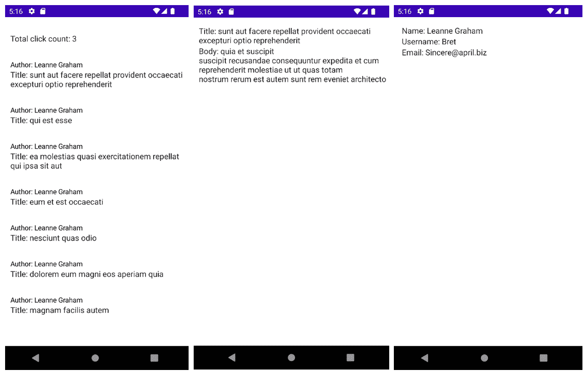
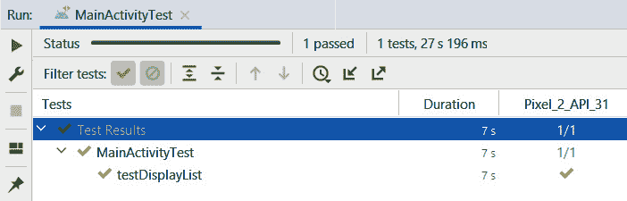

# 第十章：*第十章*：整合一切

在本章中，我们将分析前几章中我们所做的工作，并探讨我们可以以不同的方式改进应用程序的层级。稍后，我们将探讨在将仪器测试集成到应用程序中时的清洁架构的好处，我们将用模拟依赖替换数据源依赖，以确保测试的可靠性。

在本章中，我们将涵盖以下主题：

+   检查模块依赖

+   仪器测试

到本章结束时，你将能够识别并删除应用程序用例层中的外部依赖，以强制执行**共同封闭原则**（**CCP**），并了解如何在 Android 上使用模拟数据源创建仪器测试。

# 技术要求

硬件和软件要求如下：

+   Android Studio Arctic Fox 2020.3.1 Patch 3

本章的代码文件可以在以下位置找到：[`github.com/PacktPublishing/Clean-Android-Architecture/tree/main/Chapter10`](https://github.com/PacktPublishing/Clean-Android-Architecture/tree/main/Chapter10)。

查看以下视频，了解代码的实际应用：[`bit.ly/3sLr0HS`](https://bit.ly/3sLr0HS)

# 检查模块依赖

在本节中，我们将分析在前几章创建的应用程序中不同模块之间使用的依赖项。

随着从*第九章*的*练习 09.01 – 转向 MVI*过渡，我们现在有一个完全功能的应用程序，它被分割成独立的模块，代表不同的层级。我们可以通过查看每个模块中的`build.gradle`文件中的`dependencies`块，并特别关注`implementation(project(path: "{module}"))`行，来分析不同模块之间的关系。如果我们绘制一个图表，它看起来会像以下这样：

![图 10.1 – 练习 09.01 的模块依赖图]

](img/Figure_10.01_B18320.jpg)

图 10.1 – 练习 09.01 的模块依赖图

在前面的图表中，我们可以看到`:domain`模块，它是领域层的一部分，位于中心，其他层的模块都依赖于它。`:app`模块负责组装所有依赖项，这意味着它将依赖于所有其他模块。这意味着我们处于良好的清洁架构位置，因为我们希望实体和用例对其他组件的依赖最小化。如果我们继续分析每个模块的`build.gradle`文件，并包括外部依赖项，我们将看到每个模块对外部库的额外依赖：

![图 10.2 – 练习 09.01 的模块依赖图，包含外部依赖]

](img/Figure_10.02_B18320.jpg)

图 10.2 – 练习 09.01 的模块依赖图，包含外部依赖

在 *图 10.2* 中，我们可以看到我们的模块使用的一些相关外部依赖。`:data-remote` 使用 Retrofit 和 OkHttp 的依赖进行网络操作，`:data-local` 模块依赖于 Room 和 DataStore，而表示层模块依赖于 Compose、ViewModel 和 Android 框架。在整个项目中使用的依赖项包括协程、flows 和 Hilt。

对 Hilt 和协程的依赖可能会对 `:domain` 和 `:data-repository` 模块造成问题。我们希望这两个模块尽可能稳定，而外部依赖会在我们更新这些库的版本时每次都造成问题。我们决定使用 flows，因为它们具有线程优势、响应式方法，并且因为它们是作为 Kotlin 框架的扩展开发的。如果我们想要使用 Kotlin Multiplatform 对多个平台进行适配，它们可能仍然会存在问题。一个解决方案是开发一个反应式插件，该插件将抽象化 flows 的使用，并在不同的模块中使用这种抽象。这将使我们能够在不更改模块内部代码的情况下交换不同的反应式库。虽然这个解决方案会解决问题，但它带来了很多负担，因为我们需要从 flows 框架中抽象出项目所需的数据流和操作符，这将给我们带来更多的代码需要维护。

当涉及到 Hilt 依赖时，我们可以从 `:domain` 和 `:data-repository` 模块中移除对 Hilt 的引用，并将 Hilt 模块移动到 `:app` 中。另一个解决方案是创建新的 Gradle 模块，这些模块将负责提供必要的依赖。例如，可以创建一个 `:domain-hilt` 模块，其中包含一个 `@Module` 注解的类，该类将提供 `:domain` 模块所需的所有依赖项。这种方法可以用于其他我们希望导出到使用不同依赖注入框架的应用程序中的模块，以避免在这些项目中依赖 Hilt。

随着应用程序开发新功能和演进，模块依赖将增加；这意味着我们应该花时间评估项目中的依赖项。这将帮助我们识别潜在问题，并确定我们是否可以正确地扩展应用程序。我们还应该考虑外部依赖，并分析它们对我们项目的影响。在下一节中，我们将探讨一个关于如何减少领域和仓库模块对 Hilt 依赖的练习。

## 练习 10.01 – 减少依赖

修改 *第九章* 中 *练习 09.01 – 转向 MVI*，*实现 MVI 架构*，以便 `domain` 和 `data-repository` 模块将不再依赖于 Hilt，而是从 `app` 模块内部提供这些模块的依赖项。

在完成这个练习之前，你需要做以下事情：

1.  从`domain`模块中移除 Hilt。

1.  从`GetPostsWithUsersWithInteractionUseCase`、`GetPostUseCase`、`GetUserUseCase`和`UpdateInteractionUseCase`类中删除`@Inject`注解。

1.  将`AppModule`类重命名为`UseCaseModule`，并使用`@Provides`为前面的对象提供依赖。

1.  从`data-repository`模块中移除 Hilt，并删除`@Inject`注解的引用。

1.  将`RepositoryModule`从`data-repository`模块移动到`app`模块，并使用`@Provides`为`PostRepository`、`UserRepository`和`InteractionRepository`提供依赖。

按照以下步骤完成练习：

1.  在`domain`模块的`build.gradle`文件中，移除对`kapt`和 Hilt 插件的引用：

    ```java
    plugins {
        id 'com.android.library'
        id 'kotlin-android'
    }
    ```

1.  在同一个文件中，从`dependencies`块中删除 Hilt 的引用：

    ```java
    dependencies {
        implementation coroutines.coroutinesAndroid
        testImplementation test.junit
        testImplementation test.coroutines
        testImplementation test.mockito
    }
    ```

1.  从`GetPostsWithUsersWithInteractionUseCase`中删除`@Inject`的引用：

    ```java
    class GetPostsWithUsersWithInteractionUseCase(
        configuration: Configuration,
        private val postRepository: PostRepository,
        private val userRepository: UserRepository,
        private val interactionRepository: 
            InteractionRepository
    ) : UseCase<GetPostsWithUsersWithInteractionUseCase.
        Request,
            GetPostsWithUsersWithInteractionUseCase.
                Response>(configuration) {
        …
    }
    ```

1.  从`GetPostUseCase`中删除`@Inject`的引用：

    ```java
    class GetPostUseCase(
        configuration: Configuration,
        private val postRepository: PostRepository
    ) : UseCase<GetPostUseCase.Request, GetPostUseCase.
        Response>(configuration) {
        …
    }
    ```

1.  从`GetUserUseCase`中删除`@Inject`的引用：

    ```java
    class GetUserUseCase(
        configuration: Configuration,
        private val userRepository: UserRepository
    ) : UseCase<GetUserUseCase.Request, GetUserUseCase.
        Response>(configuration) {
        …
    }
    ```

1.  从`UpdateInteractionUseCase`中删除`@Inject`的引用：

    ```java
    class UpdateInteractionUseCase(
        configuration: Configuration,
        private val interactionRepository: 
            InteractionRepository
    ) : UseCase<UpdateInteractionUseCase.Request, 
       UpdateInteractionUseCase.Response>(configuration) {
        …
    }
    ```

1.  在 app 模块中，将`AppModule`重命名为`UseCaseModule`。

1.  在`UseCaseModule`类中的 app 模块，为`GetPostsWithUsersWithInteractionUseCase`提供依赖：

    ```java
    @Module
    @InstallIn(SingletonComponent::class)
    class UseCaseModule {
        …
        @Provides
        fun   
        provideGetPostsWithUsersWithInteractionUseCase(
            configuration: UseCase.Configuration,
            postRepository: PostRepository,
            userRepository: UserRepository,
            interactionRepository: InteractionRepository
        ): GetPostsWithUsersWithInteractionUseCase = 
           GetPostsWithUsersWithInteractionUseCase(
            configuration,
            postRepository,
            userRepository,
            interactionRepository
        ) 
    }
    ```

在这里，我们需要使用`@Provides`，因为我们不再处于同一个模块中，这意味着我们应该将其视为外部依赖，这需要`@Provides`注解，类似于我们提供 Room 和 Retrofit 依赖的方式。

1.  在同一个类中，为`GetPostUseCase`提供依赖：

    ```java
    @Module
    @InstallIn(SingletonComponent::class)
    class UseCaseModule {
        …
        @Provides
        fun provideGetPostUseCase(
            configuration: UseCase.Configuration,
            postRepository: PostRepository
        ): GetPostUseCase = GetPostUseCase(
            configuration,
            postRepository
        )
    }
    ```

在这个片段中，我们遵循上一步的方法。

1.  在同一个类中，为`GetUserUseCase`提供依赖：

    ```java
    @Module
    @InstallIn(SingletonComponent::class)
    class UseCaseModule {
        …
        @Provides
        fun provideGetUserUseCase(
            configuration: UseCase.Configuration,
            userRepository: UserRepository
        ): GetUserUseCase = GetUserUseCase(
            configuration,
            userRepository
        )
    }
    ```

在这个片段中，我们遵循上一步的方法。

1.  在同一个类中，为`UpdateInteractionUseCase`提供依赖：

    ```java
    @Module
    @InstallIn(SingletonComponent::class)
    class UseCaseModule {
        …
        @Provides
        fun provideUpdateInteractionUseCase(
            configuration: UseCase.Configuration,
            interactionRepository: InteractionRepository
        ): UpdateInteractionUseCase = 
           UpdateInteractionUseCase(
            configuration,
            interactionRepository
        )
    }
    ```

在这个片段中，我们遵循上一步的方法。

1.  在`data-repository`模块的`build.gradle`文件中，移除对`kapt`和 Hilt 插件的引用：

    ```java
    plugins {
        id 'com.android.library'
        id 'kotlin-android'
    }
    ```

1.  在同一个文件中，从`dependencies`块中删除 Hilt 的引用：

    ```java
    dependencies {
        implementation(project(path: ":domain"))
        implementation coroutines.coroutinesAndroid
        testImplementation test.junit
        testImplementation test.coroutines
        testImplementation test.mockito
    }
    ```

1.  将`RepositoryModule`类从`data-repository`模块的注入包移动到`app`模块的注入包，并使该类非抽象。

1.  从`InteractionRepositoryImpl`中删除`@Inject`的引用：

    ```java
    class InteractionRepositoryImpl(
        private val interactionDataSource: LocalInteractionDataSource
    ) : InteractionRepository {
        …
    }
    ```

1.  从`PostRepositoryImpl`中删除`@Inject`的引用：

    ```java
    class PostRepositoryImpl(
        private val remotePostDataSource: 
            RemotePostDataSource,
        private val localPostDataSource: 
            LocalPostDataSource
    ) : PostRepository {
        …
    }
    ```

1.  从`UserRepositoryImpl`中删除`@Inject`的引用：

    ```java
    class UserRepositoryImpl(
        private val remoteUserDataSource: 
            RemoteUserDataSource,
        private val localUserDataSource: 
            LocalUserDataSource
    ) : UserRepository {
        …
    }
    ```

1.  在`RepositoryModule`类中，将`bindPostRespository`方法替换为`@Provides`方法：

    ```java
    @Module
    @InstallIn(SingletonComponent::class)
    abstract class RepositoryModule {
        @Provides
        fun providePostRepository(
            remotePostDataSource: RemotePostDataSource,
            localPostDataSource: LocalPostDataSource
        ): PostRepository = PostRepositoryImpl(
            remotePostDataSource,
            localPostDataSource
        )
        …
    }
    ```

这里，我们不再能够使用`@Binds`注解，因为我们从`PostRepositoryImpl`类中移除了`@Inject`注解，并且因为它是一个外部依赖，我们将需要使用`@Provides`。

1.  在同一个文件中，将`bindUserRepository`方法替换为`@Provides`方法：

    ```java
    @Module
    @InstallIn(SingletonComponent::class)
    abstract class RepositoryModule {
        …
        @Provides
        fun provideUserRepository(
            remoteUserDataSource: RemoteUserDataSource,
            localUserDataSource: LocalUserDataSource
        ): UserRepository = UserRepositoryImpl(
            remoteUserDataSource,
            localUserDataSource
        )
        …
    }
    ```

1.  在同一个文件中，将`bindInteractionRepositorymethod`替换为`@Provides`方法：

    ```java
    @Module
    @InstallIn(SingletonComponent::class)
    abstract class RepositoryModule {
        …
        @Provides
        fun provideInteractionRepository(
            interactionDataSource: 
                LocalInteractionDataSource
        ): InteractionRepository = 
           InteractionRepositoryImpl(
            interactionDataSource
        )
        …
    }
    ```

如果我们运行应用程序，我们应该看到与*练习 09.01 – 转换到 MVI*中相同的输出：



图 10.3 – 练习 10.01 的输出

项目现在处于`domain`和`data-repository`模块不再依赖于 Hilt 的状态。这意味着所有依赖这两个模块的其他模块将较少暴露于由 Hilt 更新引起的潜在问题。这也意味着，在未来，如果我们想要更改应用程序中使用的依赖注入框架，`domain`和`data-repository`模块将不会受到影响。在接下来的部分中，我们将探讨如何使用模拟数据创建仪器测试来测试模块是否良好集成以及传递的数据是否得到适当处理。

# 仪器测试

在本节中，我们将探讨如何对 Android 应用程序进行仪器测试，以及我们如何利用依赖注入注入模拟数据或添加与测试相关的逻辑，而无需修改应用程序代码的结构。

仪器测试是一组在 Android 设备或模拟器上运行的测试，由`androidTest`目录中的测试表示。就像 Android 开发的其它部分一样，仪器测试在多年中不断发展，以提高测试代码的质量，并提供了创建更好测试和断言的能力。最初，测试是通过使用如`ActivityTestCase`、`ContentProviderTestCase`和`ServiceTestCase`等测试类来完成的，这些类主要用于在隔离状态下测试应用程序的各个组件。Espresso 测试库的添加使我们能够轻松地测试用户可能执行的多项活动作为旅程的一部分。

为了将 Espresso 及其相关库添加到项目中，需要在任何模块的`build.gradle`文件中添加以下内容：

```java
dependencies {
    …
    androidTestImplementation "androidx.test:core:1.4.0"
    androidTestImplementation "androidx.test:runner:1.4.0 "
    androidTestImplementation "androidx.test:rules:1.4.0 "
    androidTestImplementation 
        "androidx.test.ext:junit:1.1.3 "
    androidTestImplementation 
        "androidx.test.espresso:espresso-core:3.4.0 "
    androidTestImplementation "androidx.test.espresso.
        idling:idling-concurrent:3.4.0 "
}
```

以下是一个使用 Espresso 编写的测试示例：

```java
    @Test
    fun myTest(){
        ActivityScenario.launch(MainActivity::class.java).
            moveToState(Lifecycle.State.RESUMED)
        onView(withId(R.id.my_id))
            .perform(click())
            .check(isDisplayed())
    }
```

在前面的例子中，我们使用`ActivityScenario`启动方法来启动`MainActivity`并将`Activity`状态转换为`RESUMED`。然后我们使用`onView`，它需要`ViewMatcher`，并通过`withId`根据其 ID 查找`View`并返回包含该信息的`ViewMatcher`。然后我们有使用`perform`的选项，它需要`ViewAction`。这是当我们想要与某些视图交互时的情况。我们还可以使用`check`方法执行`ViewAssertion`。在这种情况下，我们正在检查视图是否显示。

另一个有助于测试的有用补充是协调器。当我们需要删除测试生成的数据，这些数据可能保存在内存中或持久化在设备上，进而可能影响其他测试并导致它们故障时，协调器非常有用。协调器的作用是在每次执行测试之前卸载应用程序，这样每个测试都将在一个新安装的应用程序上进行。为了将协调器添加到应用程序中，您需要在模块的`build.gradle`文件中添加它：

```java
android {
    …
    defaultConfig {
        …
        testInstrumentationRunnerArguments 
            clearPackageData: 'true'
        testOptions {
            execution 'ANDROIDX_TEST_ORCHESTRATOR'
        }
        …
    }
}
```

这将在测试执行中添加协调器配置，并在每次测试后传递删除应用程序数据的指令。要将协调器依赖项添加到项目中，需要以下操作：

```java
dependencies {
    …
    androidTestUtil "androidx.test:orchestrator: 1.4.1"
}
```

Espresso 还附带了许多扩展，其中之一是`IdlingResource`的概念。当运行本地测试（在开发机上运行的测试）和仪器化测试时，它们会在专门的一组线程上运行。Espresso 测试库将监控应用程序的主线程，当它空闲时，将执行所需的断言。如果应用程序使用后台线程，Espresso 需要一种方式来通知这一点。我们可以使用`IdlingResource`来指示 Espresso 在继续执行之前等待某个动作完成。`IdlingResource`的一个例子是`CountingIdlingResource`，它将为 Espresso 需要等待的每个操作保持一个计数器。在每次长时间运行的操作之前，计数器会增加，操作完成后会减少。在每次测试之前，`IdlingResource`需要注册，测试完成后注销：

```java
class MyClass(private val countingIdlingResource: 
    CountingIdlingResource) {
    fun doOperation() {
        countingIdlingResource.increment()
        // Perform long running operation
        countingIdlingResource.decrement()
    }
}
```

在前面的例子中，我们在`doOperation`方法开始时增加`CountingIdlingResource`的计数，在执行我们打算进行的长时间操作之后减少。为了注册和注销`IdlingResource`，我们可以执行以下操作：

```java
    lateinit var countingIdlingResource : CountingIdlingResource
    @Before
    fun setUp(){
        IdlingRegistry.getInstance().register
            (countingIdlingResource)
    }
    @After
    fun tearDown(){
        IdlingRegistry.getInstance().
            unregister(countingIdlingResource)
    }
```

在这个例子中，我们在`setUp`方法中注册`IdlingResource`，由于`@Before`注解，该方法在每次测试之前被调用，并在`tearDown`方法中注销它，由于`@After`注解，该方法在每次测试之后被调用。

因为`IdlingResource`是 Espresso 的一部分，但在执行应用程序代码内的操作时需要使用它，所以我们希望避免在相关代码中使用`IdlingResource`。为此，我们可以通过装饰包含操作的类，然后使用依赖注入将装饰过的依赖注入到测试中。为了装饰代码，我们需要有一个操作抽象。以下是一个例子：

```java
interface MyInterface {
    fun doOperation()
}
class MyClass : MyInterface {
    override fun doOperation() {
        // Implement long running operation
    }
}
```

在前面的例子中，我们创建了一个定义`doOperation`方法的接口，然后我们通过将长时间运行的操作实现为类来使用该接口。现在我们可以创建一个属于`androidTest`文件夹的类，它将装饰当前类的实现：

```java
class MyDecoratedClass(
    private val myInterface: MyInterface,
    private val countingIdlingResource: 
        CountingIdlingResource
) : MyInterface {
    override fun doOperation() {
        countingIdlingResource.increment()
        myInterface.doOperation()
        countingIdlingResource.decrement()
    }
}
```

在这里，我们实现了 `MyInterface` 的另一个版本，它将持有对抽象和 `CountingIdlingResource` 的引用。当调用 `doOperation` 时，我们将增加 `IdlingResource`，调用操作，然后，当操作完成时，减少 `IdlingResource`。

如果我们想要将新依赖项注入到测试中，我们首先需要定义一个新的扩展 `Application` 的类，该类将包含包含测试依赖项的依赖项图。如果我们使用 Hilt，它已经以 `HiltTestApplication` 的形式提供了这样的类。如果我们想要将 Hilt 集成到受测测试中，我们需要将以下依赖项添加到模块的 `build.gradle` 文件中：

```java
dependencies {
    androidTestImplementation "com.google.dagger:hilt-
        android-testing:2.40.5"
    kaptAndroidTest "com.google.dagger:hilt-android-
        compiler: 2.40.5"
}
```

要将 `HiltTestApplication` 类提供给测试，我们需要更改受测测试运行器。一个新测试运行器的示例如下：

```java
class MyTestRunner : AndroidJUnitRunner() {
    override fun newApplication(cl: ClassLoader?, name: 
        String?, context: Context?): Application {
        return super.newApplication(cl, 
            HiltTestApplication::class.java.name, context)
    }
}
```

在此示例中，我们扩展了 `AndroidJUnitRunner`，并在 `newApplication` 方法中调用 `super` 方法，并将 `HiltTestApplication` 作为 `name` 传递。这意味着当测试执行时，将使用 `HiltTestApplication` 而不是我们在主代码中定义的 `Application` 类。我们现在需要更改模块的 `build.gradle` 文件中的配置以使用前面的运行器：

```java
android {
    …
    defaultConfig {
        …
        testInstrumentationRunner "com.test.MyTestRunner"
        …
        }
    }
}
```

这允许受测测试使用我们创建的运行器。现在假设我们有一个以下模块，它将提供初始依赖项：

```java
@Module
@InstallIn(SingletonComponent::class)
abstract class MyModule {
    @Binds
    abstract fun bindMyClass(myClass: MyClass): MyInterface
}
```

在这里，我们使用简单的绑定将实现连接到抽象。在 `androidTest` 文件夹中，我们可以创建一个新的模块，在其中用装饰实例替换此实例：

```java
@Module
@TestInstallIn(
    components = [SingletonComponent::class],
    replaces = [MyModule::class]
)
class MyDecoratedModule {
    @Provides
    fun provideIdlingResource() = 
        CountingIdlingResource("my-idling-resource")
    @Provides
    fun provideMyDecoratedClass(countingIdlingResource:  
        CountingIdlingResource) =
        MyDecoratedClass(MyClass(), countingIdlingResource)
}
```

在此示例中，我们使用了 `@TestInstallIn` 注解，这将使此模块中的依赖项与测试应用程序的生命周期保持一致，并替换上一个模块中的依赖项。然后我们可以为 `IdlingResource` 和 `MyDecoratedClass` 提供依赖项，后者将包装 `MyClass` 并使用 `IdlingResource`。如果我们想要这些更改在测试中生效，我们需要以下更改：

```java
@HiltAndroidTest
class MyActivityTest {
    @get:Rule(order = 0)
    var hiltAndroidRule = HiltAndroidRule(this)
    @Inject
    lateinit var idlingResource: CountingIdlingResources
    @Before
    fun setUp(){
        hiltAndroidRule.inject()
        IdlingRegistry.getInstance().register
            (idlingResource)
    }
    @After
    fun tearDown(){
       IdlingRegistry.getInstance().unregister
           (idlingResource)
    }
}
```

在此示例中，我们使用了 `@HiltAndroidTest` 注解，因为我们想要将 `CountingIdlingResources` 注入到测试中。然后我们使用了 `HiltAndroidTestRule` 来执行注入。我们还给它赋予了测试规则执行顺序中的最高优先级。最后，我们能够在类中的每个测试中注册和注销 `CountingIdlingResources`。

Jetpack Compose 自带测试库，需要将以下配置添加到模块的 `build.gradle` 文件中：

```java
dependencies {
    androidTestImplementation "androidx.compose.ui:ui-test-
        junit4:1.0.5"
    debugImplementation "androidx.compose.ui:ui-test-
        manifest:1.0.5"
}
```

要为 Jetpack Compose 组件编写测试，当我们想要测试单个可组合方法时，需要使用 `createComposeRule` 定义一个 Compose 测试规则，或者如果我们想要测试整个活动的 Compose 内容，则使用 `createAndroidComposeRule`。一个示例如下：

```java
class MyTest {
    @get:Rule
    var composeTestRule = createAndroidComposeRule
        (MyActivity::class.java)
}
```

在前面的例子中，我们定义了一个测试规则，该规则将负责测试 `MyActivity` 内部的 Compose 内容。如果我们想让测试与用户界面交互或断言它显示正确的信息，我们将有如下结构：

```java
    @Test
    fun testDisplayList() {
        composeTestRule.onNode()
            .assertIsDisplayed()
            .performClick()
    }
```

在这个例子中，我们使用 `onNode` 方法来定位特定的元素，例如 `Text` 或 `Button`。然后我们有 `assertIsDisplayed` 方法，用于检查节点是否显示。最后，我们有 `performClick` 方法，它将点击元素。Jetpack Compose 使用它自己的 `IdlingResource` 类型，可以在 Compose 测试规则中注册，类似于以下示例：

```java
    lateinit var idlingResource: IdlingResource
    @Before
    fun setUp() {
        composeTestRule.registerIdlingResource
            (idlingResource)
    }
    @After
    fun tearDown() {
        composeTestRule.unregisterIdlingResource
            (idlingResource)
    }
```

从干净架构的角度来看，我们应该努力使我们的应用程序代码尽可能可测试。这适用于本地测试，如单元测试和仪器测试。我们希望确保测试是可靠的；这通常意味着我们需要移除对网络调用的依赖，这意味着我们需要提供一种方法将模拟数据注入应用程序而不修改应用程序的代码。我们还需要能够将 `IdlingResources` 注入到应用程序中，或者使用装饰依赖项来验证用户插入的数据是否是数据层接收到的正确数据。这也涉及到装饰这些依赖项以添加额外逻辑的能力，而不修改应用程序的代码。在下一节中，我们将查看一个练习，我们将向应用程序中注入包含测试逻辑的各种依赖项，并评估引入它们的难度。

## 练习 10.02 – 仪器测试

向 *Exercise 10.01 – 减少依赖* 添加一个仪器测试，该测试将断言以下数据显示在屏幕上：

![Figure 10.4 – 练习 10.02 的预期输出

![img/Figure_10.04_B18320.jpg]

Figure 10.4 – 练习 10.02 的预期输出

为了实现这一点，你需要创建一个新的 `RemotePostDataSource` 实现，该实现将返回四个帖子；其中两个帖子属于一个用户，另外两个帖子属于另一个用户。同样，对于返回两个用户的 `RemoteUserDataSource`，也需要执行同样的操作。这些实现需要注入到测试中。为了确保测试将等待后台工作完成，你需要用 `IdlingResource` 装饰每个仓库，这些 `IdlingResource` 也需要注入到测试中。

在完成这个练习之前，你需要做以下事情：

1.  将测试库集成到应用模块中。

1.  创建 `PostAppTestRunner`，它将被用来向 Android 仪器测试运行器提供 `HiltTestApplication`。

1.  创建一个 `ComposeCountingIdlingResource` 类，它将包装一个 Espresso 的 `CountingIndlingResource` 并实现 Compose 的 `IdlingResource`。

1.  创建`MockRemotePostDataSource`和`MockRemoteUserDataSource`，它们将负责返回在*图 10.4*中展示的用户和帖子。

1.  创建`IdlingInteractionRepository`、`IdlingUserRepository`和`IdlingPostRepository`，这些类将装饰`InteractionRepository`、`UserRepository`和`PostRepository`，并使用`ComposeCountingIdlingResource`，当加载数据时将增加计数，当数据加载完成时将减少计数。

1.  创建`IdlingRepositoryModule`和`MockRemoteDataSourceModule`，它们将分别在测试中替换`RepositoryModule`和`RemoteDataSourceModule`。

1.  创建`MainActivityTest`，它将有一个测试，并使用`createAndroidComposeRule`来断言显示模拟数据列表。

按照以下步骤完成练习：

1.  在顶级`build.gradle`文件中，添加以下库版本：

    ```java
    buildscript {
        ext {
            …
            versions = [
                    …
                    androidTestCore      : "1.4.0",
                    androidTestJunit     : "1.1.3",
                    orchestrator         : "1.4.1"
            ]
            …
    }
    ```

1.  在相同的文件中，确保添加以下`androidTest`依赖项：

    ```java
    buildscript {
        ext {
           …
            androidTest = [
                    junit             : "androidx.test.ext
                        :junit:${versions.espressoJunit}",
                    espressoCore      : "androidx.test.
                        espresso:espresso-core:${versions.
                            espressoCore}",
                    idlingResource    : "androidx.test.
                        espresso:espresso-idling-resource
                            :${versions.espressoCore}",
                    composeUiTestJunit: "androidx.compose.
                        ui:ui-test-junit4:$
                            {versions.compose}",
                    composeManifest   : "androidx.compose
                        .ui:ui-test-manifest:$
                            {versions.compose}",
                    hilt              : "com.google.
                        dagger:hilt-android-testing:$
                            {versions.hilt}",
                    hiltCompiler      : "com.google.
                         dagger:hilt-android-compiler:$
                            {versions.hilt}",
                    core              : "androidx.test:
                        core:${versions.androidTestCore}",
                    runner            : "androidx.test:
                        runner:$
                            {versions.androidTestCore}",
                    rules             : "androidx.test:
                       rules:${versions.androidTestCore}",
                    orchestrator      : "androidx.test:
                        orchestrator:$
                            {versions.orchestrator}"
            ]
        }
        …
    }
    ```

在这里，我们正在定义所有将要使用的测试库的映射，以便它们可以在多个模块中使用。

1.  在应用模块的`build.gradle`文件中，添加所需的测试依赖项：

    ```java
    dependencies{
        …
        androidTestImplementation androidTest.junit
        androidTestImplementation androidTest.espressoCore
        androidTestImplementation 
            androidTest.idlingResource
        androidTestImplementation androidTest.core
        androidTestImplementation androidTest.rules
        androidTestImplementation androidTest.runner
        androidTestImplementation androidTest.hilt
        kaptAndroidTest androidTest.hiltCompiler
        androidTestImplementation 
            androidTest.composeUiTestJunit
        debugImplementation androidTest.composeManifest
        androidTestUtil androidTest.orchestrator
    }
    ```

1.  在应用模块的`androidTest`文件夹中，在`java/{package-name}`文件夹内创建`PostAppTestRunner`类：

    ```java
    class PostAppTestRunner : AndroidJUnitRunner() {
        override fun newApplication(cl: ClassLoader?, 
            name: String?, context: Context?): Application {
            return super.newApplication(cl, 
                HiltTestApplication::class.java.name, 
                    context)
        }
    }
    ```

1.  在应用模块的`build.gradle`文件中，设置以下测试配置。确保将`{package-name}`替换为`PostAppTestRunner`所在的包：

    ```java
    android {
        …
        defaultConfig {
            …
            testInstrumentationRunner "{package-name}.
                PostAppTestRunner"
            testInstrumentationRunnerArguments 
                clearPackageData: 'true'
            testOptions {
                execution 'ANDROIDX_TEST_ORCHESTRATOR'
            }
        }
    }
    ```

1.  在应用模块的`androidTest`文件夹中，在`java/{package-name}`文件夹内创建以下包 – `idling`、`injection`、`remote`、`repository`和`test`。

1.  在`idling`包内，创建一个名为`ComposeCountingIdlingResource`的新类：

    ```java
    class ComposeCountingIdlingResource(name: String) : 
        IdlingResource {
        private val countingIdlingResource = 
            CountingIdlingResource(name)
        override val isIdleNow: Boolean
            get() = countingIdlingResource.isIdleNow
        fun increment() = countingIdlingResource.
            increment()
        fun decrement() = countingIdlingResource.
            decrement()
    }
    ```

在这里，我们使用了 Espresso 的`CountingIdlingResource`类来执行增加、减少和通过`isIdleNow`方法提供其当前空闲状态逻辑，该方法由 Jetpack Compose 使用。

1.  在相同的包中，创建一个名为`IdlingUtils`的文件，包含以下方法：

    ```java
    fun <T> Flow<T>.attachIdling(
        countingIdlingResource:  
            ComposeCountingIdlingResource
    ): Flow<T> {
        return onStart {
            countingIdlingResource.increment()
        }.onEach {
            countingIdlingResource.decrement()
        }
    }
    ```

这是一个扩展函数，我们可以在收集`Flow`之前增加`IdlingResource`，在`Flow`的第一个值被发射时减少它。

1.  在`repository`包中，创建一个名为`IdlingInteractionRepository`的类：

    ```java
    class IdlingInteractionRepository(
        private val interactionRepository: InteractionRepository,
        private val countingIdlingResource: ComposeCountingIdlingResource
    ) : InteractionRepository {
        override fun getInteraction(): Flow<Interaction> {
            return interactionRepository.getInteraction()
                .attachIdling(countingIdlingResource)
        }
        override fun saveInteraction(interaction: 
            Interaction): Flow<Interaction> {
            return interactionRepository.
                saveInteraction(interaction)
                .attachIdling(countingIdlingResource)
        }
    }
    ```

这个类有一个对`ComposeCountingIdlingResource`对象的引用和之前创建的`attachIdling`方法，当数据加载或保存时增加计数，当完成这些操作时减少计数。

1.  在相同的包中，创建一个名为`IdlingPostRepository`的类：

    ```java
    class IdlingPostRepository(
        private val postRepository: PostRepository,
        private val countingIdlingResource: 
            ComposeCountingIdlingResource
    ) : PostRepository {
        override fun getPosts(): Flow<List<Post>> =
            postRepository.getPosts().attachIdling
                (countingIdlingResource)
        override fun getPost(id: Long): Flow<Post> =
            postRepository.getPost(id).
                attachIdling(countingIdlingResource)
    }
    ```

在这个片段中，我们遵循上一步的方法。

1.  在相同的包中，创建一个名为`IdlingUserRepository`的类：

    ```java
    class IdlingUserRepository(
        private val userRepository: UserRepository,
        private val countingIdlingResource: 
            ComposeCountingIdlingResource
    ) : UserRepository {
        override fun getUsers(): Flow<List<User>> =
            userRepository.getUsers()
                .attachIdling(countingIdlingResource)
        override fun getUser(id: Long): Flow<User> =
            userRepository.getUser(id)
                .attachIdling(countingIdlingResource)
    }
    ```

在这个片段中，我们遵循上一步的方法。

1.  在`injection`包中，创建`IdlingRepositoryModule`类：

    ```java
    @Module
    @TestInstallIn(
        components = [SingletonComponent::class],
        replaces = [RepositoryModule::class]
    )
    class IdlingRepositoryModule {
    }
    ```

1.  在 `IdlingRepositoryModule` 类中，提供一个对 `ComposeCountingIdlingResource` 的依赖，这将是一个跨所有仓库的单例：

    ```java
    @Module
    @TestInstallIn(
        components = [SingletonComponent::class],
        replaces = [RepositoryModule::class]
    )
    class IdlingRepositoryModule {
        @Singleton
        @Provides
        fun provideIdlingResource(): 
            ComposeCountingIdlingResource =
            ComposeCountingIdlingResource
                ("repository-idling")
    }
    ```

在这个片段中，我们提供了一个 `ComposeCountingIdlingResource` 的单例实例，以便当多个仓库同时加载数据时，将使用相同的计数器为它们所有。

1.  在同一文件中，提供一个对 `IdlingPostRepository` 的依赖：

    ```java
    @Module
    @TestInstallIn(
        components = [SingletonComponent::class],
        replaces = [RepositoryModule::class]
    )
    class IdlingRepositoryModule {
        …
        @Provides
        fun providePostRepository(
            remotePostDataSource: RemotePostDataSource,
            localPostDataSource: LocalPostDataSource,
            countingIdlingResource: 
                ComposeCountingIdlingResource
        ): PostRepository = IdlingPostRepository(
            PostRepositoryImpl(
                remotePostDataSource,
                localPostDataSource
            ),
            countingIdlingResource
        )
    }
    ```

在这个片段中，我们提供了一个 `IdlingPostRepository` 的实例，它将包装一个 `PostRepositoryImpl` 的实例，并且有一个对之前定义的 `ComposeCountingIdlingResource` 实例的引用。

1.  在同一文件中，提供一个对 `IdlingUserRepository` 的依赖：

    ```java
    @Module
    @TestInstallIn(
        components = [SingletonComponent::class],
        replaces = [RepositoryModule::class]
    )
    class IdlingRepositoryModule {
        …
        @Provides
        fun provideUserRepository(
            remoteUserDataSource: RemoteUserDataSource,
            localUserDataSource: LocalUserDataSource,
            countingIdlingResource: 
                ComposeCountingIdlingResource
        ): UserRepository = IdlingUserRepository(
            UserRepositoryImpl(
                remoteUserDataSource,
                localUserDataSource
            ),
            countingIdlingResource
        )
    }
    ```

在这个片段中，我们提供了一个 `IdlingUserRepository` 的实例，它将包装一个 `UserRepositoryImpl` 的实例，并且有一个对之前定义的 `ComposeCountingIdlingResource` 实例的引用。

1.  在同一文件中，提供一个对 `IdlingInteractionRepository` 的依赖：

    ```java
    @Module
    @TestInstallIn(
        components = [SingletonComponent::class],
        replaces = [RepositoryModule::class]
    )
    class IdlingRepositoryModule {
        …
        @Provides
        fun provideInteractionRepository(
            interactionDataSource: 
                LocalInteractionDataSource,
            countingIdlingResource: 
                ComposeCountingIdlingResource
        ): InteractionRepository = 
           IdlingInteractionRepository(
            InteractionRepositoryImpl(
                interactionDataSource
            ),
            countingIdlingResource
        )
    }
    ```

在这个片段中，我们提供了一个 `IdlingInteractionRepository` 的实例，它将包装一个 `InteractionRepositoryImpl` 的实例，并且有一个对之前定义的 `ComposeCountingIdlingResource` 实例的引用。

1.  在 `remote` 包中，创建一个名为 `MockRemoteUserDataSource` 的类，并创建一个代表测试数据的 `User` 对象列表：

    ```java
    class MockRemoteUserDataSource @Inject constructor() : 
        RemoteUserDataSource {
        private val users = listOf(
            User(
                id = 1L,
                name = "name1",
                username = "username1",
                email = "email1"
            ),
            User(
                id = 2L,
                name = "name2",
                username = "username2",
                email = "email2"
            )
        )
        override fun getUsers(): Flow<List<User>> = flowOf
            (users)
        override fun getUser(id: Long): Flow<User> = 
            flowOf(users[0])
    }
    ```

在这里，我们创建了一个列表，其中返回两个用户，并将其放入 `Flow` 的 `getUsers` 方法中。

1.  在同一包中，创建一个名为 `MockRemotePostDataSource` 的类，并创建一个代表测试数据的 `Post` 对象列表：

    ```java
    class MockRemotePostDataSource @Inject constructor() : 
        RemotePostDataSource {
        private val posts = listOf(
            Post(
                id = 1L,
                userId = 1L,
                title = "title1",
                body = "body1"
            ),
            Post(
                id = 2L,
                userId = 1L,
                title = "title2",
                body = "body2"
            ),
            Post(
                id = 3L,
                userId = 2L,
                title = "title3",
                body = "body3"
            ),
            Post(
                id = 4L,
                userId = 2L,
                title = "title4",
                body = "body4"
            )
        )
        override fun getPosts(): Flow<List<Post>> = 
            flowOf(posts)
        override fun getPost(id: Long): Flow<Post> = 
            flowOf(posts[0])
    }
    ```

与我们对用户所做的一样，我们创建了一个帖子列表，并将前两个帖子连接到第一个用户，将最后两个帖子连接到第二个用户。

1.  在 `injection` 包中，创建一个名为 `MockRemoteDataSourceModule` 的类，它将负责将之前的两个实现绑定到抽象：

    ```java
    @Module
    @TestInstallIn(
        components = [SingletonComponent::class],
        replaces = [RemoteDataSourceModule::class]
    )
    abstract class MockRemoteDataSourceModule {
        @Binds
        abstract fun bindPostDataSource(
            postDataSourceImpl: MockRemotePostDataSource): 
                RemotePostDataSource
        @Binds
        abstract fun bindUserDataSource(userDataSourceImpl
              : MockRemoteUserDataSource): 
                  RemoteUserDataSource
    }
    ```

1.  在 `test` 包中，创建一个名为 `MainActivityTest` 的类：

    ```java
    @HiltAndroidTest
    class MainActivityTest {
        @get:Rule(order = 0)
        var hiltAndroidRule = HiltAndroidRule(this)
        @get:Rule(order = 1)
        var composeTestRule = createAndroidComposeRule
            (MainActivity::class.java)
        @Inject
        lateinit var idlingResource: 
            ComposeCountingIdlingResource
        @Before
        fun setUp() {
            hiltAndroidRule.inject()
            composeTestRule.
                registerIdlingResource(idlingResource)
        }
        @After
        fun tearDown() {
            composeTestRule.unregisterIdlingResource
                (idlingResource)
        }
    }
    ```

在这里，我们正在初始化我们的测试规则，这些规则是针对 Hilt 和 Compose 的，并且按照这个确切顺序。然后，我们将 `ComposeCountingIdlingResource` 注入到测试类中，以便我们可以将其注册到 Compose 测试规则中。

1.  在 `MainActivityTest` 类中，添加一个测试，该测试将断言所需的数据显示在屏幕上：

    ```java
    @HiltAndroidTest
    class MainActivityTest {
        …
        @Test
        fun testDisplayList() {
            composeTestRule.onNodeWithText("Total click 
                count: 0")
                .assertIsDisplayed()
            composeTestRule.onAllNodesWithText("Author: 
                name1")
                .assertCountEquals(2)
            composeTestRule.onAllNodesWithText("Author: 
                name2")
                .assertCountEquals(2)
            composeTestRule.onNodeWithText("Title: 
                title1")
                .assertIsDisplayed()
            composeTestRule.onNodeWithText("Title: 
                title2")
                .assertIsDisplayed()
            composeTestRule.onNodeWithText("Title: 
                title3")
                .assertIsDisplayed()
            composeTestRule.onNodeWithText("Title: 
                title4")
                .assertIsDisplayed()
        }
    }
    ```

在这里，我们添加了一个测试，断言标题文本被显示，每个用户都显示在其帖子中，并且每个帖子都被显示。

如果我们运行测试，我们应该看到以下输出：



图 10.5 – 练习 10.02 的测试输出

作为这项练习的一部分，我们通过更改远程数据源并基于现有功能添加`IdlingResources`到我们的仓库中，能够在不更改应用现有代码的情况下向应用提供模拟数据。这两种技术都使用了依赖注入，并且由于抽象的存在，我们在执行依赖反转时引入了应用的不同层。这使得应用代码可测试，并为我们提供了测试不同场景和创建各种类型测试的机会，以确保不同组件的集成。

# 摘要

在本章中，我们分析了之前章节中进行的练习，并发现了应用模块依赖中可能存在的问题。我们研究了这些问题的潜在解决方案。然后，我们探讨了清洁架构的实际应用，即实现仪器化测试，以及我们如何更改应用的数据源以确保测试的可靠性。我们探讨了如何使用 Jetpack Compose 和 Hilt 实现仪器化测试，并提供依赖注入，然后在一个练习中应用了它们，该练习中我们更改了测试的依赖项。这仅仅是一个清洁架构好处的例子。在其他情况下，当使用多个版本发布类似的应用并希望为每个要构建的应用注入不同的实现或配置时，也会有其他好处。另一个好处是在处理多个平台（如 Android 和 iOS）时，我们可以使用跨平台框架无差别地定义实体、用例和仓库，然后注入每个平台检索和持久化数据的具体实现。

在*第九章*《实现 MVI 架构》中，我们展示了如何在不影响其他层的情况下更改应用的表现层。在清洁应用中，数据层也应该能够做到这一点。我们看到了库是如何随着时间的推移而改变和演化的。当网络库发生变化时，我们应该能够过渡到新的库，而不会在其他应用模块中引起问题。同样的原则也可以应用于本地存储。我们应该能够从 Room 转换到其他本地数据持久化方式。一个关于模块应该如何创建的好规则是，将每个模块视为一个可以发布的库，并想象自己是最终用户。你现在应该对清洁架构应该如何工作、它试图解决的问题以及如何将其应用于 Android 应用有一个很好的了解。
