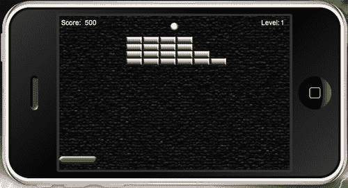
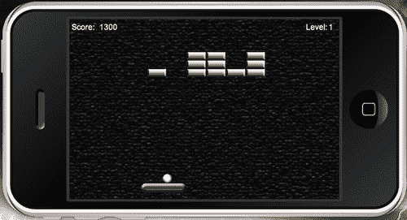
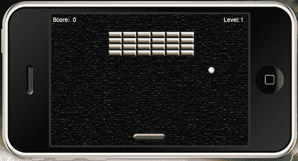
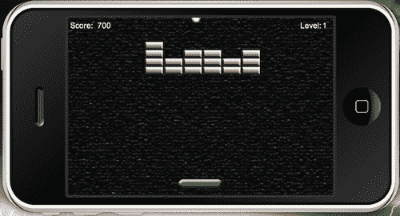
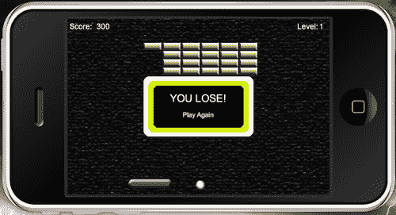

# 第四章：游戏控制

> 到目前为止，我们在上一章中完成了游戏的一半。我们通过将游戏对象引入屏幕来开始开发项目的初始结构。目前，拍子和球的移动是无效的，但模拟器中显示的所有内容都相应地缩放到了原始游戏设计。完成本教程的最后阶段是添加游戏中将发生的所有动作，包括对象移动和更新分数。

在本章中，我们将涵盖：

+   使用触摸事件和加速度计移动拍子

+   场景中所有游戏对象的碰撞检测

+   碰撞检测后移除对象

+   球在屏幕边界内的移动

+   计算分数

+   胜利和失败条件

最后冲刺！我们可以做到！

# 向上移动方向

如果让物体出现在屏幕上让你兴奋，那么等你看到它们移动！Breakout 游戏的主要目标是保持球在拍子位置上方，以保持游戏状态，并使其与所有砖块碰撞以完成关卡。保持悬念流动的是对整个游戏屏幕中球移动的期待。如果没有在游戏对象上添加物理边界以进行碰撞检测，这是不可能的。

# 让我们更加物理化

在上一章中，我们讨论了如何将物理引擎集成到代码中。我们还开始将物理体实现到砖块对象中，现在我们需要将相同的操作应用于其他活动游戏对象，如拍子和球。让我们继续本教程的最后部分。我们将继续使用`Breakout`项目文件夹中的`main.lua`文件。

## physics.addBody()

使用一行代码，Corona 显示对象可以被转换成模拟物理对象。

+   如果没有指定形状信息，显示对象将采用原始图像的实际矩形边界来创建物理体。例如，如果显示对象是 100 x 100 像素，那么这将物理体的实际大小。

+   如果指定了形状，则物体边界将遵循形状提供的多边形。形状坐标必须按顺时针顺序定义，并且生成的形状必须是凸形状。

+   如果指定了半径，则物体边界将是圆形的，并且位于创建物理体的显示对象中间。

物体形状是一个相对于显示对象中心的局部（x,y）坐标表。

语法：

+   圆形形状：

    ```java
    physics.addBody(object, [bodyType,] {density=d, friction=f, bounce=b [,radius=r]})

    ```

+   多边形形状：

    ```java
    physics.addBody(object, [bodyType,] {density=d, friction=f, bounce=b [,shape=s]})

    ```

例如：

圆形物体：

```java
local ball = display.newImage("ball.png")
physics.addBody( ball, "dynamic" { density = 1.0, friction = 0.3, bounce = 0.2, radius = 25 } )

```

多边形物体：

```java
local rectangle = display.newImage("rectangle.png")
rectangleShape = { -6,-48, 6,-48, 6,48, -6,48 }
physics.addBody( rectangle, { density=2.0, friction=0.5, bounce=0.2,
shape=rectangleShape } )

```

参数：

+   `Object` (对象): 一个显示对象。

+   `bodyType` (字符串): 指定身体类型是可选的。它使用一个字符串参数在第一个身体元素之前。可能的类型是`"static", "dynamic"`和`"kinematic"`。如果没有指定值，默认类型是`"dynamic"`。

    +   静态身体不会移动，也不会相互交互；静态对象的例子包括地面或弹球机的墙壁。

    +   动态身体受到重力和其他身体类型碰撞的影响。

    +   动力学对象受到力的作用，但不受到重力的影响，因此你应该通常将可拖动对象设置为`"kinematic"`，至少在拖动事件期间。

+   `Density`（数值）：乘以身体形状的面积以确定质量。基于水的标准值 1.0。较轻的材料（如木材）的密度小于 1.0，而较重的材料（如石头）的密度大于 1.0。默认值为`1.0`。

+   `Friction`（数值）：可以是任何非负值；0 表示没有摩擦，1.0 表示相当强的摩擦。默认值为`0.3`。

+   `Bounce`（数值）：确定物体在碰撞后返回的速度量。默认值为`0.2`。

+   `Radius`（数值）：边界圆的像素半径。

+   `Shape`（数值）：形状值以形状顶点的表格形式表示，{x1,y1,x2,y2,...,xn,yn}。例如，`rectangleShape = { -6,-48, 6,-48, 6,48, -6,48 }`。坐标必须按顺时针顺序定义，并且生成的形状必须是凸形状。（物理假设对象的 0,0 点为对象的中心。负 x 位于对象中心的左侧，负 y 位于对象中心的顶部）。

# 开始物理操作——启动挡板和球的物理属性

目前，我们的显示对象相当静止。为了开始游戏，我们必须激活挡板和球体的物理属性，以便在游戏中发生任何类型的移动。

1.  在`gameLevel1()`函数上方创建一个名为`startGame()`的新函数。

    ```java
    function startGame()

    ```

1.  添加以下行以实例化挡板和球的物理属性：

    ```java
    physics.addBody(paddle, "static", {density = 1, friction = 0, bounce = 0})
    physics.addBody(ball, "dynamic", {density = 1, friction = 0, bounce = 0})

    ```

1.  创建一个事件监听器，使用背景显示对象来移除`startGame()`的`"tap"`事件。使用`end`结束函数。

    ```java
    background:removeEventListener("tap", startGame)
    end

    ```

1.  在上一章中我们创建的`addGameScreen()`函数中，必须在调用`gameLevel1()`函数之后添加以下行。这样，当背景被触摸时，实际上开始游戏。

    ```java
    background:addEventListener("tap", startGame)

    ```

## 刚才发生了什么？

挡板对象具有`"static"`类型的身体，因此它不会受到任何对其发生的碰撞的影响。

球对象具有`"dynamic"`类型的身体，因为我们希望它能够受到由于墙壁边缘、砖块和挡板方向变化而产生的屏幕碰撞的影响。

在`startGame()`函数中移除背景上的事件监听器，这样它就不会影响游戏中应用的任何其他触摸事件。

# 挡板移动

让桨在两侧移动是必须完成的关键动作之一。游戏设计的一部分是保护球不达到屏幕底部。我们将在模拟器和加速度计中分离桨的移动。模拟器中的移动使我们能够通过触摸事件进行测试，因为加速度计动作无法在模拟器中测试。

# 行动时间——在模拟器中拖动桨

目前，桨没有任何移动。屏幕上没有设置用于转换的坐标，所以让我们创建它。

1.  在`addGameScreen()`函数下方，创建一个名为`dragPaddle(event)`的新函数。

    ```java
    function dragPaddle(event)

    ```

1.  接下来，我们将专注于在游戏屏幕的边界内移动桨的左右移动。

    ```java
    if isSimulator then
    if event.phase == "began" then
    moveX = event.x - paddle.x
    elseif event.phase == "moved" then
    paddle.x = event.x - moveX
    end
    if((paddle.x - paddle.width * 0.5) < 0) then
    paddle.x = paddle.width * 0.5
    elseif((paddle.x + paddle.width * 0.5) > display.contentWidth) then
    paddle.x = display.contentWidth - paddle.width * 0.5
    end
    end
    end

    ```

    在前面的代码块中添加代码以启用模拟器中的桨移动，然后关闭函数。添加此代码块的原因是模拟器不支持加速度计事件。

    

## 刚才发生了什么？

我们创建了一个函数，其中拖动事件仅在模拟器中起作用。对于`if event.phase == "began"`，已经触摸到桨上。在`elseif event.phase == "moved"`时，触摸已经在桨上移动。

为了防止桨越过墙壁边界，当桨击中坐标时，`paddle.x`在 x 方向上不会越过`< 0`。当桨滑到屏幕的右侧时，`paddle.x`在 x 方向上不会越过`> display.contentWidth`。

屏幕右侧没有指定的坐标，因为代码应该是适用于 iOS 和 Android 设备上所有屏幕尺寸的通用代码。这两个平台具有不同的屏幕分辨率，因此`display.contentWidth`考虑了它们。

# 行动时间——使用加速度计移动桨

如前所述，加速度计事件无法在模拟器中测试。它们只有在将游戏构建上传到设备上才能看到结果时才起作用。桨的移动将在水平轴上的关卡墙壁边界内。

1.  在`dragPaddle()`函数下方，创建一个名为`movePaddle(event)`的新函数。

    ```java
    function movePaddle(event)

    ```

1.  使用`yGravity`添加加速度计运动。它提供了 y 方向上的重力加速度。

    ```java
    paddle.x = display.contentCenterX - (display.contentCenterX * (event.yGravity*3))

    ```

1.  添加关卡墙壁边界并关闭函数：

    ```java
    if((paddle.x - paddle.width * 0.5) < 0) then
    paddle.x = paddle.width * 0.5
    elseif((paddle.x + paddle.width * 0.5) > display.contentWidth) then
    paddle.x = display.contentWidth - paddle.width * 0.5
    end
    end

    ```

## 刚才发生了什么？

要使加速度计运动与设备一起工作，我们必须使用`yGravity`。

### 注意

当使用`xGravity`和`yGravity`时，加速度计事件基于纵向比例。当为横向模式指定显示对象时，`xGravity`和`yGravity`值会切换以补偿事件以正确工作。

我们已经为桨应用了与`function dragPaddle():`相同的代码。

```java
if((paddle.x - paddle.width * 0.5) < 0) then
paddle.x = paddle.width * 0.5
elseif((paddle.x + paddle.width * 0.5) > display.contentWidth) then
paddle.x = display.contentWidth - paddle.width * 0.5
end

```

这仍然使桨不会越过任何墙壁边界。

# 球与桨的碰撞

每次球与挡板碰撞时，球的运动必须流畅。这意味着在游戏场地的所有方向上都要进行适当的方向改变。

# 行动时间——使球反弹到挡板上

我们将检查球击中挡板的哪一侧，以选择球下一次移动的方向。在现实环境中，确保运动轨迹跟随任何方向的击打是很重要的。在每次挡板碰撞中，我们都要确保球向上移动。

1.  在`movePaddle()`函数之后为球创建一个名为`bounce()`的新函数。

    ```java
    function bounce()

    ```

1.  在 y 方向的速度中添加一个-3 的值。这将使球向上移动：

    ```java
    vy = -3

    ```

1.  检查与`paddle`和`ball`的碰撞，并关闭函数：

    ```java
    if((ball.x + ball.width * 0.5) < paddle.x) then
    vx = -vx
    elseif((ball.x + ball.width * 0.5) >= paddle.x) then
    vx = vx
    end
    end

    ```

## 刚才发生了什么？

当球与挡板碰撞时，其运动轨迹会根据球触碰到挡板的哪一侧而有所不同。在`if`语句的第一部分，球在 x 方向上向 0 移动。`if`语句的最后部分显示球在 x 方向上向屏幕的对面移动。

# 从场景中移除对象

设备上的资源有限。尽管我们希望它们像桌面一样强大，能够存储大量内存，但它们还没有达到那个水平。这就是为什么在应用程序中不再使用显示对象时，从显示层次结构中移除显示对象很重要。这通过减少内存消耗并消除不必要的绘制来帮助提高整体系统性能。

当创建显示对象时，它默认被添加到显示层次结构的根对象中。这个对象是一种特殊类型的组对象，称为**舞台对象**。

为了防止一个对象在屏幕上渲染，需要将其从场景中移除。对象需要从其父对象中显式移除。这将对象从显示层次结构中移除。这可以通过以下两种方式中的任何一种来完成：

`myImage.parent:remove( myImage )` -- 从层次结构中移除`myImage`

或者

`myImage:removeSelf( )` -- 与上面相同

这并没有从显示对象中释放所有内存。为了确保显示对象被正确移除，我们需要消除所有对该对象的变量引用。

## 变量引用

即使显示对象已经从层次结构中移除，也存在一些情况下对象仍然存在。为了做到这一点，我们将属性设置为`nil`。

```java
local ball = display.newImage("ball.png")
local myTimer = 3
function time()
myTimer = myTimer - 1
print(myTimer)
if myTimer == 0 then
ball:removeSelf()
ball = nil
end
end
timer.performWithDelay( 1000, time, myTimer )

```

# 一块接一块

游戏中的砖块是主要的障碍，因为必须清除它们才能进入下一轮。在这个版本的 Breakout 中，玩家必须在一轮内摧毁所有砖块。未能做到这一点将导致从当前级别的开始重新开始。

# 行动时间——移除砖块

当球与砖块碰撞时，我们将使用应用于桨的相同技术来确定球将跟随的侧面。当砖块被击中时，我们需要找出哪个砖块被触摸，然后从舞台和砖块组中移除它。每次移除砖块都会将 100 分加到得分上。得分将从得分常量中取出并添加到当前得分作为文本。

1.  在`gameLevel2()`函数下方创建一个名为`removeBrick(event):`的函数。

    ```java
    function removeBrick(event)

    ```

1.  使用`if`语句检查球击中砖块的哪一侧。在检查事件时，我们将事件引用到对象名称`"brick"`。这是我们给我们的`brick`显示对象起的名字：

    ```java
    if event.other.name == "brick" and ball.x + ball.width * 0.5 < event.other.x + event.other.width * 0.5 then
    vx = -vx
    elseif event.other.name == "brick" and ball.x + ball.width * 0.5 >= event.other.x + event.other.width * 0.5 then
    vx = vx
    end

    ```

1.  添加以下`if`语句，当球与一个砖块碰撞时从场景中移除砖块。在碰撞发生后，将`score`增加 1。启动`scoreNum`以获取`score`的值并乘以`scoreIncrease:`。

    ```java
    if event.other.name == "brick" then
    vy = vy * -1
    event.other:removeSelf()
    event.other = nil
    bricks.numChildren = bricks.numChildren - 1
    score = score + 1
    scoreNum.text = score * scoreIncrease
    scoreNum:setReferencePoint(display.CenterLeftReferencePoint)
    scoreNum.x = 54
    end

    ```

1.  当所有砖块从关卡中销毁后，创建一个在**Alert**屏幕上弹出的`if`语句，以显示胜利条件，并将`gameEvent`字符串设置为`"win"`。

    ```java
    if bricks.numChildren < 0 then
    alertScreen("YOU WIN!", "Continue")
    gameEvent = "win"
    end

    ```

1.  使用`end`关闭函数。

    ```java
    end

    ```

    

## 刚才发生了什么？

如果你记得上一章，我们给`brick`对象起了一个叫`"brick"`的名字。

当球击中任何单个砖块的左侧时，球会向左移动。当球击中砖块的右侧时，它会向右移动。每个物体的宽度作为一个整体来计算球移动的方向。

当砖块被击中时，球会向上弹起（y 方向）。在每次碰撞后，球与砖块接触；物体从场景中移除并从记忆中销毁。

`bricks.numChildren -1`从最初的总砖块数中减去计数。当移除砖块时，每次得分增加 100 分。`scoreNum`文本对象在每次击中砖块时更新得分。

当所有砖块消失后，**Alert**屏幕会弹出通知玩家已赢得关卡。我们还设置了`gameEvent = "win"`，这将在另一个函数中使用，以将事件过渡到新场景。

# 方向变化

除了球与桨的运动之外，其他因素还包括与墙边界的碰撞状态。当发生碰撞时，球会改变方向。每个动作都有一个反应，就像现实世界的物理一样。

# 行动时间——更新球

球需要在没有重力影响的情况下连续移动。我们必须考虑侧墙、顶部和底部墙壁。当任何边界发生碰撞时，x 和 y 方向的速度必须反映相反的方向。我们需要设置坐标，球只能通过这些坐标移动，并且当它通过桨区域下方的区域时发出警报。

1.  在`removeBrick(event)`函数下方创建一个名为`updateBall()`的新函数。

    ```java
    function updateBall()

    ```

1.  添加球体运动：

    ```java
    ball.x = ball.x + vx
    ball.y = ball.y + vy

    ```

1.  添加 x 方向的球体运动：

    ```java
    if ball.x < 0 or ball.x + ball.width > display.contentWidth then
    vx = -vx
    end

    ```

    

1.  添加 y 方向的球体运动：

    ```java
    if ball.y < 0 then
    vy = -vy
    end

    ```

    

1.  在**游戏界面**底部碰撞时添加球体运动。创建一个失去**警报**屏幕和一个名为`"lose"`的游戏事件。使用`end`关闭函数。

    ```java
    if ball.y + ball.height > paddle.y + paddle.height then
    alertScreen("YOU LOSE!", "Play Again") gameEvent = "lose"
    end
    end

    ```

    

## 刚才发生了什么？

当球体在任何地方移动时，当它击中墙壁时需要改变正确的方向。任何时间球体击中侧墙时，我们使用`vx = -vx`。当球体击中顶部边界时，使用`vy = -vy`。球体不反射相反方向的情况只有当它击中屏幕底部时。

**警报**屏幕显示失败条件，强调玩家**再次游戏**。在另一个`if`语句中使用`gameEvent = "lose"`来重置当前级别。

# 级别过渡

当出现胜利或失败条件时，游戏需要一种方式来过渡到下一级或重复当前级别。主要游戏对象必须重置到起始位置，并重新绘制砖块。当你第一次开始游戏时，基本上有相同的概念。

# 行动时间——重置和更改级别

我们需要创建设置游戏第一级和第二级的函数。如果需要重玩游戏级别，只能访问用户失去的当前级别。

1.  创建一个名为`changeLevel1()`的新函数。这将放置在`updateBall()`函数下方：

    ```java
    function changeLevel1()

    ```

1.  当玩家输掉回合时清除`砖块`组并重置它们：

    ```java
    bricks:removeSelf()
    bricks.numChildren = 0
    bricks = display.newGroup()

    ```

1.  移除`alertDisplayGroup`：

    ```java
    alertBox:removeEventListener("tap", restart)
    alertDisplayGroup:removeSelf()
    alertDisplayGroup = nil

    ```

1.  重置`球体`和`挡板`位置：

    ```java
    ball.x = (display.contentWidth * 0.5) - (ball.width * 0.5)
    ball.y = (paddle.y - paddle.height) - (ball.height * 0.5) -2
    paddle.x = display.contentWidth * 0.5

    ```

1.  重新绘制当前级别的`砖块`：

    ```java
    gameLevel1()

    ```

1.  为`背景`对象添加一个事件监听器以调用`startGame()`。关闭函数。

    ```java
    background:addEventListener("tap", startGame)
    end

    ```

1.  接下来创建一个名为`changeLevel2()`的新函数。应用与`changeLevel1()`相同的所有代码，但确保为`gameLevel2()`重新绘制`砖块`。

    ```java
    function changeLevel2()
    bricks:removeSelf()
    bricks.numChildren = 0
    bricks = display.newGroup()
    alertBox:removeEventListener("tap", restart)
    alertDisplayGroup:removeSelf()
    alertDisplayGroup = nil
    ball.x = (display.contentWidth * 0.5) - (ball.width * 0.5)
    ball.y = (paddle.y - paddle.height) - (ball.height * 0.5) -2
    paddle.x = display.contentWidth * 0.5
    gameLevel2() -- Redraw bricks for level 2
    background:addEventListener("tap", startGame)
    end

    ```

## 刚才发生了什么？

当需要重置或更改级别时，必须从板上擦除显示对象。在这种情况下，我们使用`bricks:removeSelf()`移除了`砖块`组。

当任何**警报**屏幕弹出时，无论是胜利还是失败，在重置过程中也会移除整个`alertDisplayGroup`。`球体`和`挡板`被设置回起始游戏位置。

调用`gameLevel1()`重新绘制第一级的砖块。该函数包含`砖块`显示对象和`砖块`组的初始设置。

再次使用`背景`对象调用`startGame()`函数，并添加事件监听器。当需要设置第二级时，使用与`changeLevel1()`函数中相同的程序，但调用`changeLevel2()`，并使用`gameLevel2()`重新绘制砖块。

## 英雄尝试——添加更多级别

目前，游戏只有两个级别。要扩展这个游戏，可以添加更多级别。它们可以使用为`gameLevel1()`和`gameLevel2()`创建的逻辑创建，通过调整用于创建砖块行和列的数字。你必须创建一个新的函数来重置级别。我们可以使用在`changeLevel1()`和`changeLevel2()`上执行的方法来重新创建级别并重置它。

# 有赢有输

没有什么比赢得胜利的期待更令人兴奋的了。直到你犯了一个小小的错误，导致你不得不从头开始。别担心，这并不是世界末日，你总是可以再次尝试并从击败级别的错误中学习。

程序中发生的游戏事件，如胜利或失败条件，会通知玩家他们的进度。游戏必须有一种方法来指导玩家进行哪些操作以重新播放级别或进入下一个级别。

# 行动时间——创建胜利和失败条件

为了让游戏在游戏中出现任何警报，我们需要为每个级别中可能出现的每个场景创建一些`if`语句。当这种情况发生时，分数需要重置为零。

1.  在`alertScreen()`函数下方，创建一个新的函数，称为`restart():`

    ```java
    function restart()

    ```

1.  创建一个`if`语句以处理第一级完成时的`"win"`游戏事件，并过渡到**第 2 级**。

    ```java
    if gameEvent == "win" and currentLevel == 1 then
    currentLevel = currentLevel + 1
    changeLevel2()
    levelNum.text = tostring(currentLevel)

    ```

    ### 注意

    `tostring()`函数可以将任何参数转换为字符串。在上面的例子中，当发生`"win"`游戏事件时，`currentLevel`的值从 1 变为 2。该值将转换为字符串格式，`levelNum`文本对象可以在屏幕上显示**第 2 级**。

1.  当第二级完成时，添加一个`elseif`语句以处理`"win"`游戏事件，并通知玩家游戏已完成。

    ```java
    elseif gameEvent == "win" and currentLevel == 2 then
    alertScreen(" Game Over", " Congratulations!")
    gameEvent = "completed"

    ```

1.  在第一级添加另一个`elseif`语句以处理`"lose"`游戏事件。将分数重置为零并重新播放第 1 级。

    ```java
    elseif gameEvent == "lose" and currentLevel == 1 then
    score = 0
    scoreNum.text = "0"
    changeLevel1()

    ```

1.  在第二级添加另一个`elseif`语句以处理`"lose"`游戏事件。将分数重置为零并重新播放第 2 级。

    ```java
    elseif gameEvent == "lose" and currentLevel == 2 then
    score = 0
    scoreNum.text = "0"
    changeLevel2()

    ```

1.  最后，添加另一个`elseif`语句以处理`gameEvent = "completed"`。使用`end`关闭函数。

    ```java
    elseif gameEvent == "completed" then
    alertBox:removeEventListener("tap", restart)
    end
    end

    ```

1.  现在，我们需要回溯并使用`alertBox`对象为`alertScreen()`函数添加一个事件监听器。我们将将其添加到函数的底部。这将激活`restart()`函数。

    ```java
    alertBox:addEventListener("tap", restart)

    ```

## 刚才发生了什么？

`restart()`函数检查游戏过程中发生的所有`gameEvent`和`currentLevel`变量。当游戏事件检查字符串`"win"`时，它也会查看语句列表，以查看哪些为真。例如，如果玩家在第一级获胜，则玩家将进入第二级。

当玩家失败时，`gameEvent == "lose"`变为真，代码检查玩家在哪个级别失败。对于玩家失败的任何级别，分数将重置为 0，并将玩家当前所在的级别重新设置。

# 激活事件监听器

在这个游戏中，事件监听器基本上是开启和关闭对象的移动。我们已经编写了执行游戏对象动作的函数来运行关卡。现在，是时候使用某种类型的事件来激活它们了。正如您在前一章中注意到的，我们可以向显示对象添加事件监听器或使它们全局运行。

## 碰撞事件

物理引擎中的碰撞事件是通过 Corona 的事件监听器模型发生的。有三个新的事件类型：

+   `"collision"`：此事件包括`"began"`和`"ended"`阶段，分别表示初始接触和接触断裂的时刻。这些阶段存在于正常两体碰撞和身体-传感器碰撞中。如果您没有实现`"collision"`监听器，则此事件不会触发。

+   `"preCollision"`：在对象开始交互之前触发的事件类型。根据您的游戏逻辑，您可能希望检测此事件并条件性地覆盖碰撞。它还可能导致每次接触时多次报告，并影响应用程序性能。

+   `"postCollision"`：在对象交互之后触发的事件类型。这是唯一报告碰撞力的事件。如果您没有实现`"postCollision"`监听器，则此事件不会触发。

    ### 注意

    碰撞是在对象对之间报告的，并且可以通过运行时监听器全局检测，或者使用表监听器在对象内部本地检测。

### 全局碰撞监听器

当检测到运行时事件时，每个碰撞事件都包含`event.object1`，其中包含参与碰撞的 Corona 显示对象的表 ID。

例如：

```java
local physics = require "physics"
physics.start()
local box1 = display.newImage( "box.png" )
physics.addBody( box1, "dynamic", { density = 1.0, friction = 0.3, bounce = 0.2 } )
box1.myName = "Box 1"
local box2 = display.newImage( "box.png", 0, 350)
physics.addBody( box2, "static", { density = 1.0, friction = 0.3, bounce = 0.2 } )
box2.myName = "Box 2"
local function onCollision( event )
if event.phase == "began" and event.object1.myName == "Box 1" then
print( "Collision made." )
end
end
Runtime:addEventListener( "collision", onCollision )

```

### 本地碰撞监听器

当在对象内部使用表监听器检测时，每个碰撞事件都包含`event.other`，其中包含参与碰撞的另一个显示对象的表 ID。

例如：

```java
local physics = require "physics"
physics.start()
local box1 = display.newImage( "box.png" )
physics.addBody( box1, "dynamic", { density = 1.0, friction = 0.3, bounce = 0.2 } )
box1.myName = "Box 1"
local box2 = display.newImage( "box.png", 0, 350)
physics.addBody( box2, "static", { density = 1.0, friction = 0.3, bounce = 0.2 } )
box2.myName = "Box 2"
local function onCollision( self, event )
if event.phase == "began" and self.myName == "Box 1" then
print( "Collision made." )
end
end
box1.collision = onCollision
box1:addEventListener( "collision", box1 )
box2.collision = onCollision
box2:addEventListener( "collision", box2 )

```

# 行动时间——添加游戏监听器

对于我们为游戏对象创建的许多函数，我们需要激活事件监听器，以便它们可以运行代码，并在游戏停止时禁用它们。

1.  为了完成这个游戏，我们需要创建的最后一个函数是`gameListeners()`，它也将有一个名为`event`的参数。这应该紧接在`gameLevel2()`函数之后。

    ```java
    function gameListeners(event)

    ```

1.  使用`if`语句添加以下事件监听器，以在应用程序中启动几个事件：

    ```java
    if event == "add" then
    Runtime:addEventListener("accelerometer", movePaddle)
    Runtime:addEventListener("enterFrame", updateBall)
    paddle:addEventListener("collision", bounce)
    ball:addEventListener("collision", removeBrick)
    paddle:addEventListener("touch", dragPaddle)

    ```

1.  接下来，我们将为事件监听器添加一个`elseif`语句，用于删除事件并关闭函数。

    ```java
    elseif event == "remove" then
    Runtime:removeEventListener("accelerometer", movePaddle)
    Runtime:removeEventListener("enterFrame", updateBall)
    paddle:removeEventListener("collision", bounce)
    ball:removeEventListener("collision", removeBrick)
    paddle:removeEventListener("touch", dragPaddle)
    end
    end

    ```

1.  为了使`function gameListeners()`正常工作，我们需要在`startGame()`函数中使用参数中的`"add"`字符串来实例化它。将其放置在函数末尾之前。

    ```java
    gameListeners("add")

    ```

1.  在`alertScreen()`函数中，将参数中的`"remove"`字符串添加到函数的开始处。

    ```java
    gameListeners("remove")

    ```

1.  所有代码都已编写！现在请在模拟器中运行游戏。应用程序也已准备好适配设备。制作一个适合你正在开发的设备所需尺寸的简单图标图像。编译构建并在你的设备上运行它。

## 刚才发生了什么？

对于`event`参数有两个`if`语句集，`"add"`和`"remove"`。

此函数中的所有事件监听器在使游戏运行方面都发挥着重要作用。`"accelerometer"`和`"enterframe"`作为运行时事件使用，因为它们没有特定的目标。

`paddle`和`ball`都有`"collision"`事件，它们将在任何对象接触时执行其功能。

`"touch"`事件允许用户触摸并拖动挡板，使其可以在模拟器中来回移动。

注意`event == "remove"`会移除游戏中所有活跃的事件监听器。当游戏开始时，`gameListeners("add")`被激活。当达到胜利或失败条件时，`gameListeners("remove")`被激活。

## 来吧，英雄——让我们把一切都颠倒过来。

如果我们决定将游戏上下颠倒呢？换句话说，将挡板放置在屏幕顶部附近，球在挡板下方，砖块组靠近屏幕底部。

你需要考虑的事情：

+   现在顶部墙壁是你必须阻止球进入的区域。

+   球与砖块碰撞时移动的 y 方向。

+   当球与底部墙壁碰撞时，它必须从底部墙壁反弹。

正如你所见，在从负值切换到正值以及反之亦然之前，有几件事情需要考虑。确保验证你的逻辑，并确保在创建这个新变体时它是有意义的。

# 结果出来了！

让我们逐块重申，以确保我们已经将所有内容添加到我们的游戏中。你也可以参考第四章文件夹中的`Breakout Final`文件夹，查看最终代码。我们确保介绍了游戏中使用的变量。我们还初始化了`main()`函数，该函数启动游戏。实现了**主菜单**屏幕，包含游戏标题和**开始游戏**按钮。

```java
-- Hide Status Bar
display.setStatusBar(display.HiddenStatusBar)
-- Physics Engine
local physics = require "physics"
physics.start()
physics.setGravity(0, 0)
-- Accelerometer
system.setAccelerometerInterval( 100 )
-- Menu Screen
local menuScreenGroup -- display.newGroup()
local mmScreen
local playBtn
-- Game Screen
local background
local paddle
local brick
local ball
-- Score/Level Text
local scoreText
local scoreNum
local levelText
local levelNum
-- alertDisplayGroup
local alertDisplayGroup -- display.newGroup()
local alertBox
local conditionDisplay
local messageText
-- Variables
local _W = display.contentWidth / 2
local _H = display.contentHeight / 2
local bricks = display.newGroup()
local brickWidth = 35
local brickHeight = 15
local row
local column
local score = 0
local scoreIncrease = 100
local currentLevel
local vx = 3
local vy = -3
local gameEvent = ""
local isSimulator = "simulator" == system.getInfo("environment")
-- Main Function
function main()
mainMenu()
end
function mainMenu()
menuScreenGroup = display.newGroup()
mmScreen = display.newImage("mmScreen.png", 0, 0, true)
mmScreen.x = _W
mmScreen.y = _H
playBtn = display.newImage("playbtn.png")
playBtn:setReferencePoint(display.CenterReferencePoint)
playBtn.x = _W; playBtn.y = _H + 50
playBtn.name = "playbutton"
menuScreenGroup:insert(mmScreen)
menuScreenGroup:insert(playBtn)
-- Button Listeners
playBtn:addEventListener("tap", loadGame)
end

```

接下来，我们将`menuScreenGroup`从舞台移除以加载主游戏区域。游戏的主要显示对象，如挡板、球和砖块被添加。分数和关卡数字作为 UI 元素显示，并在整个游戏过程中更新。同时添加了模拟器和加速度计中的挡板移动以及挡板和球的碰撞检测。

```java
function loadGame(event)
if event.target.name == "playbutton" then
-- Start Game
transition.to(menuScreenGroup,{time = 0, alpha=0, onComplete = addGameScreen})
playBtn:removeEventListener("tap", loadGame)
end
end
function addGameScreen()
background = display.newImage("bg.png", 0, 0, true )
background.x = _W
background.y = _H
paddle = display.newImage("paddle.png")
paddle.x = 240; paddle.y = 300
paddle.name = "paddle"
ball = display.newImage("ball.png")
ball.x = 240; ball.y = 290
ball.name = "ball"
-- Text
scoreText = display.newText("Score:", 5, 2, "Arial", 14)
scoreText:setTextColor(255, 255, 255, 255)
scoreNum = display.newText("0", 54, 2, "Arial", 14)
scoreNum:setTextColor(255, 255, 255, 255)
levelText = display.newText("Level:", 420, 2, "Arial", 14)
levelText:setTextColor(255, 255, 255, 255)
levelNum = display.newText("1", 460, 2, "Arial", 14)
levelNum:setTextColor(255, 255, 255, 255)
-- Build Level Bricks
gameLevel1()
-- Start Listener
background:addEventListener("tap", startGame)
end
-- Used to drag the paddle on the simulator
function dragPaddle(event)
if isSimulator then
if event.phase == "began" then
moveX = event.x - paddle.x
elseif event.phase == "moved" then
paddle.x = event.x - moveX
end
if((paddle.x - paddle.width * 0.5) < 0) then
paddle.x = paddle.width * 0.5
elseif((paddle.x + paddle.width * 0.5) > display.contentWidth) then
paddle.x = display.contentWidth - paddle.width * 0.5
end
end
end
function movePaddle(event)
-- Accelerometer Movement
--must be yGravity since it's landscape
paddle.x = display.contentCenterX - (display.contentCenterX * (event.yGravity*3))
-- Wall Borders
if((paddle.x - paddle.width * 0.5) < 0) then
paddle.x = paddle.width * 0.5
elseif((paddle.x + paddle.width * 0.5) > display.contentWidth) then
paddle.x = display.contentWidth - paddle.width * 0.5
end
end
function bounce()
vy = -3
-- Paddle Collision, check the which side of the paddle the ball hits, left, right
if((ball.x + ball.width * 0.5) < paddle.x) then
vx = -vx
elseif((ball.x + ball.width * 0.5) >= paddle.x) then
vx = vx
end
end

```

挡板和球的物理属性被添加到游戏开始时。为两个关卡各自创建了砖块布局。我们从游戏对象需要激活时开始添加事件监听器，并在游戏结束后移除。

```java
function startGame()
-- Physics
physics.addBody(paddle, "static", {density = 1, friction = 0, bounce = 0})
physics.addBody(ball, "dynamic", {density = 1, friction = 0, bounce = 0})
background:removeEventListener("tap", startGame)
gameListeners("add")
end
-- HOW TO BUILD BLOCKS
function gameLevel1()
currentLevel = 1
bricks:toFront()
local numOfRows = 4
local numOfColumns = 4
local brickPlacement = {x = (_W) - (brickWidth * numOfColumns ) / 2 + 20, y = 50}
for row = 0, numOfRows - 1 do
for column = 0, numOfColumns - 1 do
-- Create a brick
local brick = display.newImage("brick.png")
brick.name = "brick"
brick.x = brickPlacement.x + (column * brickWidth)
brick.y = brickPlacement.y + (row * brickHeight)
physics.addBody(brick, "static", {density = 1, friction = 0, bounce = 0})
bricks.insert(bricks, brick)
end
end
end
function gameLevel2()
currentLevel = 2
bricks:toFront()
local numOfRows = 5
local numOfColumns = 8
local brickPlacement = {x = (_W) - (brickWidth * numOfColumns ) / 2 + 20, y = 50}
for row = 0, numOfRows - 1 do
for column = 0, numOfColumns - 1 do
-- Create a brick
local brick = display.newImage("brick.png")
brick.name = "brick"
brick.x = brickPlacement.x + (column * brickWidth)
brick.y = brickPlacement.y + (row * brickHeight)
physics.addBody(brick, "static", {density = 1, friction = 0, bounce = 0})
bricks.insert(bricks, brick)
end
end
end
function gameListeners(event)
if event == "add" then
Runtime:addEventListener("accelerometer", movePaddle)
Runtime:addEventListener("enterFrame", updateBall)
paddle:addEventListener("collision", bounce)
ball:addEventListener("collision", removeBrick)
-- Used to drag the paddle on the simulator
paddle:addEventListener("touch", dragPaddle)
elseif event == "remove" then
Runtime:removeEventListener("accelerometer", movePaddle)
Runtime:removeEventListener("enterFrame", updateBall)
paddle:removeEventListener("collision", bounce)
ball:removeEventListener("collision", removeBrick)
-- Used to drag the paddle on the simulator
paddle:removeEventListener("touch", dragPaddle)
end
end

```

每当球与砖块碰撞时，砖块就会从场景中移除。对于每个墙壁、挡板或砖块的碰撞，都会更新球的方向变化。每次发生胜负条件时，所有游戏对象都会重置，以开始当前或新关卡。

```java
--BRICK REMOVAL
function removeBrick(event)
-- Check the which side of the brick the ball hits, left, right
if event.other.name == "brick" and ball.x + ball.width * 0.5 < event.other.x + event.other.width * 0.5 then
vx = -vx
elseif event.other.name == "brick" and ball.x + ball.width * 0.5 >= event.other.x + event.other.width * 0.5 then
vx = vx
end
-- Bounce, Remove
if event.other.name == "brick" then
vy = vy * -1
event.other:removeSelf()
event.other = nil
bricks.numChildren = bricks.numChildren - 1
-- Score
score = score + 1
scoreNum.text = score * scoreIncrease
scoreNum:setReferencePoint(display.CenterLeftReferencePoint)
scoreNum.x = 54
end
-- Check if all bricks are destroyed
if bricks.numChildren < 0 then
alertScreen("YOU WIN!", "Continue")
gameEvent = "win"
end
end
-- BALL FUNCTION
function updateBall()
-- Ball Movement
ball.x = ball.x + vx
ball.y = ball.y + vy
-- Wall Collision
if ball.x < 0 or ball.x + ball.width > display.contentWidth then
vx = -vx
end--Left
if ball.y < 0 then
vy = -vy
end--Up
if ball.y + ball.height > paddle.y + paddle.height then
alertScreen("YOU LOSE!", "Play Again") gameEvent = "lose"
end--down/lose
end
-- RESET LEVEL
function changeLevel1()
-- Clear Level Bricks
bricks:removeSelf()
bricks.numChildren = 0
bricks = display.newGroup()
-- Remove Alert
alertBox:removeEventListener("tap", restart)
alertDisplayGroup:removeSelf()
alertDisplayGroup = nil
-- Reset Ball and Paddle position
ball.x = (display.contentWidth * 0.5) - (ball.width * 0.5)
ball.y = (paddle.y - paddle.height) - (ball.height * 0.5) -2
paddle.x = display.contentWidth * 0.5
-- Redraw Bricks
gameLevel1()
-- Start
background:addEventListener("tap", startGame)
end
function changeLevel2()
-- Clear Level Bricks
bricks:removeSelf()
bricks.numChildren = 0
bricks = display.newGroup()
-- Remove Alert
alertBox:removeEventListener("tap", restart)
alertDisplayGroup:removeSelf()
alertDisplayGroup = nil
-- Reset Ball and Paddle position
ball.x = (display.contentWidth * 0.5) - (ball.width * 0.5)
ball.y = (paddle.y - paddle.height) - (ball.height * 0.5) -2
paddle.x = display.contentWidth * 0.5
-- Redraw Bricks
gameLevel2()
-- Start
background:addEventListener("tap", startGame)
end

```

当发生条件时，一个**警报**屏幕弹出，通知玩家发生了什么。创建触发警报的显示对象为一个函数。最后，创建胜负参数以确定当前关卡是否需要重玩、进入下一关卡，或者游戏是否已经完成。

```java
function alertScreen(title, message)
gameListeners("remove")
alertBox = display.newImage("alertBox.png")
alertBox.x = 240; alertBox.y = 160
transition.from(alertBox, {time = 300, xScale = 0.5, yScale = 0.5, transition = easing.outExpo})
conditionDisplay = display.newText(title, 0, 0, "Arial", 38)
conditionDisplay:setTextColor(255,255,255,255)
conditionDisplay.xScale = 0.5
conditionDisplay.yScale = 0.5
conditionDisplay:setReferencePoint(display.CenterReferencePoint)
conditionDisplay.x = display.contentCenterX
conditionDisplay.y = display.contentCenterY - 15
messageText = display.newText(message, 0, 0, "Arial", 24)
messageText:setTextColor(255,255,255,255)
messageText.xScale = 0.5
messageText.yScale = 0.5
messageText:setReferencePoint(display.CenterReferencePoint)
messageText.x = display.contentCenterX
messageText.y = display.contentCenterY + 15
alertDisplayGroup = display.newGroup()
alertDisplayGroup:insert(alertBox)
alertDisplayGroup:insert(conditionDisplay)
alertDisplayGroup:insert(messageText)
alertBox:addEventListener("tap", restart)
end
-- WIN/LOSE ARGUMENT
function restart()
if gameEvent == "win" and currentLevel == 1 then
currentLevel = currentLevel + 1
changeLevel2()--next level
levelNum.text = tostring(currentLevel)
elseif gameEvent == "win" and currentLevel == 2 then
alertScreen(" Game Over", " Congratulations!")
gameEvent = "completed"
elseif gameEvent == "lose" and currentLevel == 1 then
score = 0
scoreNum.text = "0"
changeLevel1()--same level
elseif gameEvent == "lose" and currentLevel == 2 then
score = 0
scoreNum.text = "0"
changeLevel2()--same level
elseif gameEvent == "completed" then
alertBox:removeEventListener("tap", restart)
end
end
main()

```

注意变量和函数的大小写敏感，以防遇到错误。同时，确保检查代码中是否缺少任何必要的标点符号。这些很容易被忽略。请参考模拟器中的**终端**窗口以获取任何错误参考。

## 突击测验——与游戏控制操作

1.  如何正确地从舞台中移除显示对象？

    +   a. `remove()`

    +   b. `object:remove()`

    +   c. `object:removeSelf(); object = nil`

    +   d. 以上都不是

1.  正确的方式是将以下显示对象转换为物理对象是什么？

    ```java
    local ball = display.newImage("ball.png")

    ```

    +   a. `physics.addBody( circle, { density=2.0, friction=0.5, bounce=0.2, radius = 25 } )`

    +   b. `physics.addBody( circle, "dynamic", { density=2.0, friction=0.5, bounce=0.2, radius = 15 } )`

    +   c. a 和 b

    +   d. 以上都不是

1.  以下函数中，`"began"`一词的最佳代表是什么？

    ```java
    local function onCollision( event )
    if event.phase == "began" and event.object1.myName == "Box 1" then
    print( "Collision made." )
    end
    end

    ```

    +   a. 手指在屏幕上移动

    +   b. 手指从屏幕上抬起

    +   c. 系统取消了跟踪起始触摸

    +   d. 手指触摸了屏幕

# 摘要

恭喜！你已经完成了你的第一个游戏！你应该为自己感到非常自豪。现在你已经体验到了使用 Corona 制作应用程序的简单性。制作一个应用程序可能只需要几百行代码。

在本章中，我们涵盖了以下内容：

+   通过触摸事件为挡板添加了移动

+   介绍了加速度计功能

+   为所有受影响的游戏对象实现了碰撞事件监听器

+   当游戏屏幕上不再需要时，从内存中移除对象

+   实现了将球作为物理对象的移动

+   更新了每次砖块碰撞的得分板

+   学会了如何处理胜负条件

过去的两章现在看起来并不那么糟糕了，不是吗？随着我们在 Lua 中继续编程，我们正在熟悉工作流程。只要你继续使用不同的游戏框架，理解起来一定会更容易。

下一章将包含另一个肯定会吸引你注意力的游戏。我们将为显示对象创建动画精灵表。这难道不是视觉盛宴吗？
