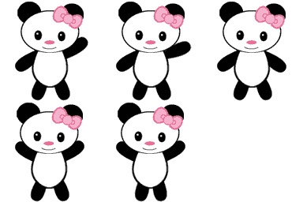
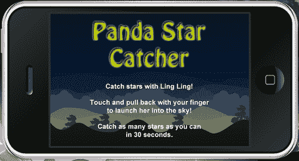
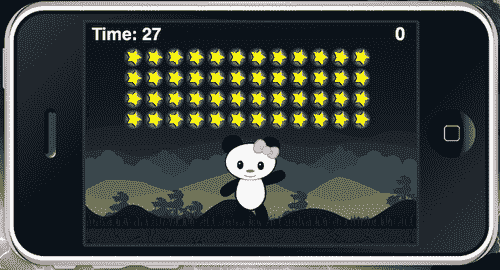
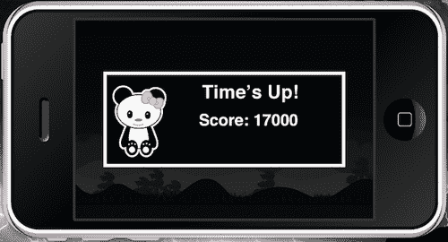
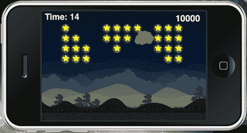
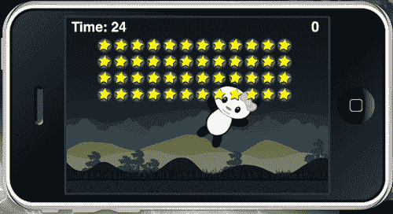

# 第五章。为我们的游戏添加动画

> 在我们的移动游戏开发之旅中，我们取得了良好的开端。我们已经经历了大量的编程，从在屏幕上显示对象到编写用户可以看到的游戏逻辑。Corona SDK 最强大的功能之一是任何显示对象都可以被动画化。这是对 Corona 提供的灵活图形模型的证明。

动画为游戏中的用户体验增添了众多特色。这是通过生成一系列帧来实现的，这些帧从一帧平滑地过渡到另一帧。我们将亲身体验并应用这些知识到我们将要创建的新游戏中。

在本章中，我们将：

+   使用运动和过渡工作

+   使用电影剪辑动画

+   使用精灵表动画

+   为显示对象创建游戏循环

+   构建我们的下一个游戏框架

让我们开始动画吧！

# 熊猫星捕手

本节涉及创建我们的第二个游戏，名为《熊猫星捕手》。主要前提是一只名叫玲玲的熊猫，它需要在计时器耗尽之前向天空发射，尽可能多地捕捉星星。熊猫将被动画化，并且对于每个应用的动作（如发射前的设置和它在空中时）都会有不同的动作。弹射机制也将被应用于将玲玲发射到空中。您可能在《愤怒的小鸟》和《城堡粉碎》等游戏中见过类似的功能。

# 让我们开始让一切动起来

我们在第三章中介绍了过渡，*构建我们的第一个游戏：Breakout*，并对它进行了简要的介绍。让我们更深入地探讨它们。

## 过渡

过渡库允许您通过允许您对显示对象的一个或多个属性进行缓动，仅用一行代码创建动画。我们之前在第三章讨论了过渡的基础，

这可以通过`transition.to`方法完成，该方法接受一个显示对象和一个包含控制参数的表。控制参数指定动画的持续时间和显示对象属性的最终值。属性的中间值由一个也作为控制参数指定的缓动函数确定。

`transition.to():` 使用`easing`过渡在一段时间内动画化显示对象的属性。

语法：`handle = transition.to( target, params )`

使用的参数如下：

+   `target:` 将成为过渡目标的一个显示对象。

+   `params:` 一个指定将被动画化的显示对象属性以及一个或多个以下可选的非动画属性（非动画属性）的表：

    +   `params.time:` 指定过渡的持续时间（以毫秒为单位）。默认情况下，持续时间为 500 毫秒（0.5 秒）。

    +   `params.transition:` 默认为`easing.linear`。

    +   `params.delay:` 指定补间开始前的延迟时间，以毫秒为单位（默认无延迟）。

    +   `params.delta:` 它是一个布尔值，指定是否将非控制参数解释为最终结束值或为值的改变。默认为 `nil`，表示 false。

    +   `params.onStart:` 在补间开始之前调用的函数或表监听器。

    +   `params.onComplete:` 在补间完成后调用的函数或表监听器。

## 缓动

`easing` 库是过渡库使用的插值函数集合：

+   `easing.linear( t, tMax, start, delta ):` 这个函数定义了一个没有加速度的恒定运动。

+   `easing.inQuad( t, tMax, start, delta ):` 这个函数在过渡中执行动画属性值的二次插值。

+   `easing.outQuad( t, tMax, start, delta ):` 这个函数开始时运动速度快，然后随着执行减速到零速度。

+   `easing.inOutQuad( t, tMax, start, delta ):` 这个函数从零速度开始动画，加速，然后减速到零速度。

+   `easing.inExpo( t, tMax, start, delta ):` 这个函数从零速度开始运动，然后在执行过程中加速运动。

+   `easing.outExpo( t, tMax, start, delta ):` 这个函数开始时运动速度快，然后随着执行减速到零速度。

+   `easing.inOutExpo( t, tMax, start, delta ):` 这个函数从零速度开始运动，加速，然后使用指数缓动方程减速到零速度。

您可以创建自己的缓动函数，在起始值和最终值之间进行插值。函数的参数定义如下：

+   `t:` 是从过渡开始以来的时间，以毫秒为单位

+   `tMax:` 是过渡的持续时间

+   `start:` 是起始值

+   `delta:` 是值的改变（最终值 = 起始值 + delta）

例如：

```java
local square = display.newRect( 0, 0, 50, 50 )
square:setFillColor( 255,255,255 )
square.x = 50; square.y = 100
local square2 = display.newRect( 0, 0, 50, 50 )
square2:setFillColor( 255,255,255 )
square2.x = 50; square2.y = 300
transition.to( square, { time=1500, x=250, y=0 } )
transition.from( square2, { time=1500, x=250, y=0, transition = easing.outExpo } )

```

# 计时函数的值

使用可以在以后调用的函数，在组织应用程序中游戏对象出现的时间时可能很有帮助。计时器库将使我们能够及时处理我们的函数。

## 计时器

`timer` 函数使您能够触发在您选择的特定延迟（以毫秒为单位）的事件。

+   `timer.performWithDelay( delay, listener [, iterations] )`

    在延迟毫秒后调用监听器，并返回一个可以传递给 `timer.cancel()` 以在调用监听器之前取消计时器的句柄。

    示例：

    ```java
    local function myEvent()
    print( "myEvent called" )
    end
    timer.performWithDelay( 1000, myEvent )

    ```

+   `timer.cancel( timerId )`

    取消使用 `timer.performWithDelay()` 启动的计时器操作。

    参数：

    +   `timerId:` `timer.performWithDelay()` 调用返回的处理句柄。

    示例：

    ```java
    local count = 0
    local function myEvent()
    count = count + 1
    print( count )
    if count >= 3 then
    timer.cancel( myTimerID ) -- Cancels myTimerID
    end
    end
    myTimerID = timer.performWithDelay( 1000, myEvent, 0 )

    ```

+   `timer.pause( timerId )`

    暂停使用 `timer.performWithDelay()` 启动的计时器。

    参数：

    +   `timerId:` 来自 `timer.performWithDelay()` 的计时器 ID。

    示例：

    ```java
    local count = 0
    local function myEvent()
    count = count + 1
    print( count )
    if count >= 5 then
    timer.pause( myTimerID ) -- Pauses myTimerID
    end
    end
    myTimerID = timer.performWithDelay( 1000, myEvent, 0 )

    ```

+   `timer.resume( timerId )`

    使用 `timer.pause( timerId )` 暂停已暂停的计时器。

    参数：

    +   `timerID:` 来自 `timer.performWithDelay()` 的计时器 ID。

    示例：

    ```java
    local function myEvent()
    print( "myEvent called" )
    end
    myTimerID = timer.performWithDelay( 3000, myEvent ) -- wait 3 seconds
    result = timer.pause( myTimerID ) -- Pauses myTimerID
    print( "Time paused at " .. result )
    result = timer.resume( myTimerID ) -- Resumes myTimerID
    print( "Time resumed at " .. result )

    ```

# 电影剪辑或精灵图。有什么区别？

Corona SDK 包含一个用于构建动画精灵的 *精灵图* 功能。有关精灵图的更多信息，请参阅以下链接：[`developer.anscamobile.com/reference/sprite-sheets`](http://developer.anscamobile.com/reference/sprite-sheets)。

**精灵图** 是节省纹理内存的有效方式。它们在涉及复杂角色动画或多种动画类型时推荐使用。

精灵图需要更多的编码和更高级的设置。它们需要构建一个大的动画帧图。电影剪辑库更容易上手，并且可以更快地将 Flash 内容移植过来，因为电影剪辑帧可以作为 PNG 序列从 Flash 中导出。

# 电影剪辑

外部电影剪辑库允许你从一系列图片中创建动画精灵，可以使用与其他 Corona 显示对象相同的技巧在屏幕上移动它们。

电影剪辑库是一个外部模块，`movieclip.lua`，可以与你的项目一起包含，并使用 `require` 命令加载。

电影剪辑库可以在 Corona SDK 内的 `SampleCode/Graphics` 文件夹中的 `Movieclip` 示例项目中找到。

## 电影剪辑函数

使用一系列图片返回一个动画对象。你可以使用返回的动画对象的方法来控制其播放，例如 `play()`, `stop()` 和 `reverse()`。

+   `movieclip.newAnim( frames ):` 使用在帧表中提供的图像文件名数组创建一个动画精灵：

    ```java
    myAnimation = movieclip.newAnim{ "1.png", "2.png", "3.png", "4.png", "5.png"}

    ```

+   `object:play():` 以正向方向开始播放动画精灵。当达到序列的末尾时，它将从开始处重复播放。

+   `object:play{ startFrame=a, endFrame=b, loop=c, remove=shouldRemove }:` 以正向运动开始动画精灵。当达到由 `endFrame` 给出的帧号时，它将循环回到由 `startFrame` 给出的帧号并继续播放：

    ```java
    myAnimation:play{ startFrame=1, endFrame=4, loop=5, remove=true }

    ```

    动画可以根据你指定的次数循环播放。使用 `0` 将使动画无限循环。

    移除参数是一个布尔标志，如果设置为 true，当给定序列完成后，电影剪辑将自动删除自己。默认值是 `false`。

+   `object:reverse():` 以反向方向播放动画精灵。当达到图像集的开始时，它将循环回到最后一张图像并继续反向播放。

+   `object:reverse{ startFrame=a, endFrame=b, loop=c, remove=shouldRemove }:` 以反向顺序开始动画精灵。当达到由 `endFrame` 给出的帧号时，它将循环回到由 `startFrame` 给出的帧号并继续播放。

    动画可以根据你指定的次数循环播放。使用 `0` 将使动画无限循环。

    移除参数是一个布尔标志，如果设置为 true，当给定序列完成后，电影剪辑将自动删除自己。默认值是`false`。

+   `object:nextFrame():` 重置任何正在进行的动画序列，将动画移动到总序列中的下一张图像，并停止。

+   `object:previousFrame():` 重置任何正在进行的动画序列，将动画移动到总序列中的上一张图像，并停止。

+   `object:setLabels( labels ):` 向先前创建的对象添加可选标签，使用表将标签名称分配给选定的帧号：

    语法：`object:setLabels{ frameLabel1=num1, frameLabel2=num2, ..., frameLabelN = numN }`

    示例：

    ```java
    myAnimation:setLabels{ main=1, end=30 }

    ```

+   `object:stop():` 在当前帧停止精灵的动画。

+   `object:stopAtFrame( frame ):` 将动画跳转到指定的帧，可以是帧号或可选的帧标签。

    ```java
    myAnimation:stopAtFrame(2)
    myAnimation:play()
    myAnimation:stopAtFrame("label")
    myAnimation:reverse()

    ```

+   `object:setDrag:` 当将拖动设置为 true 时，将任何电影剪辑转换为可拖动的对象。`limitX` 和 `limitY` 参数限制拖动到 x 或 y 轴，并且可以使用边界参数指定对象的拖动边界，格式为 `{left, top, width, height}`。

    `onPress, onDrag` 和 `onRelease` 参数接受在发生这些事件时要调用的函数名称。所有参数都是可选的。

    ```java
    myAnimation:setDrag{ drag=true, limitX=false, limitY=false, onPress=myPressFunction, onDrag=myDragFunction,
    onRelease=myReleaseFunction, bounds={ 20, 20, 100, 25 }}

    ```

    要再次关闭可拖动属性，将拖动设置为 false：

    ```java
    myAnimation:setDrag{ drag=false }

    ```

# 这是精灵狂热！

精灵图是 2D 动画，编译成多个帧，合并成一个纹理图像。这是一种节省纹理内存的有效方法。对移动设备有益，并最小化了加载时间。

## 精灵 API

以下行使精灵功能在精灵命名空间下可用：

```java
require "sprite"

```

+   `sprite.newSpriteSheet:` 该函数创建一个新的精灵图。

    ```java
    spriteSheet = sprite.newSpriteSheet("myImage.png", frameWidth, frameHeight) -- the width/height of each animation in the sprite sheet

    ```

    例如，假设精灵图中的帧数是 `floor(imageWidth/frameWidth) * floor(imageHeight/frameHeight)`。第一帧放置在左上角，从左到右读取，如果适用，则继续下一行。以下精灵图有 5 帧，每帧 128 x 128 像素。整个精灵图图像是 384 x 256 像素。如果要在 Corona 中集成，一个示例方法如下所示：

    ```java
    spriteSheet = sprite.newSpriteSheet("pandaSheet.png", 128, 128)

    ```

    

+   `spriteSet = sprite.newSpriteSet(spriteSheet, startFrame, frameCount):` 从精灵图中创建一个新的精灵集。精灵集定义了属于同一角色或另一个移动资源的帧集合，这些帧可以进一步细分为不同的播放动画序列。精灵集是一个 Lua 表，包含一个或多个动画序列的键，用于特定角色。

+   `sprite.add( spriteSet, "sequenceName", startFrame, frameCount, time, [loopCount]):` 将名为 "sequenceName" 的序列添加到指定的精灵集中。该序列有 `frameCount` 帧，并且它将播放指定毫秒数的时间。每个序列的帧率可以通过修改 `time` 参数单独控制。

+   `spriteSheet:dispose():` 释放精灵图集及其纹理内存。它还会对使用该图集的所有精灵实例调用 `removeSelf()`，将它们从舞台中移除。所有属于已移除精灵图集的精灵、序列和集合都不可访问。

    ```java
    local sprite = require("sprite")
    local spriteSheet = sprite.newSpriteSheet("mySprite.png")
    spriteSheet:dispose()

    ```

+   `si = sprite.newSprite( spriteSet ):` 创建一个新的精灵实例。

+   `si:prepare([sequence]):` 停止播放当前动画序列，设置新的当前序列，并移动到该序列的第一帧。

+   `si:play():` 播放动画序列，从当前帧开始。

+   `si:pause():` 停止动画，但帧保持在最后显示的帧上。稍后可以通过 `play()` 继续播放。

+   `si:addEventListener("sprite", listener):` 当精灵实例动画有事件时通知监听器。传递给监听器的事件具有以下字段：

    `event.sprite`: 触发事件的精灵；其当前属性也可以通过事件访问。

    `event.phase`: 阶段可以是以下之一：

    +   `"end":` 精灵停止播放

    +   `"loop":` 精灵循环（从最后一帧到第一帧，或反向方向）

    +   `"next":` 播放精灵的下一帧

# 游戏时间！

现在我们已经学会了如何设置对象移动、电影剪辑和精灵图集，让我们尝试将它们整合到 `Panda Star Catcher` 中！您可以从 Packt 网站下载本书附带的配套项目文件。在第五章文件文件夹中有一个名为 `Panda Star Catcher` 的项目文件夹。它已经为您设置了 `config.lua` 和 `build.settings` 文件。艺术资源也包含在该文件夹中。您会注意到构建和运行时配置与 第三章，*构建我们的第一个游戏：Breakout* 和 第四章，*游戏控制* 中的设置相似。本教程与 iOS 和 Android 设备兼容。

项目文件夹中包含的图形已设计为在两个平台上正确显示。



# 行动时间——设置变量

让我们从介绍运行游戏所需的所有变量开始。

1.  在 `Panda Star Catcher` 项目文件夹中创建一个新的 `main.lua` 文件并将其添加进去。

1.  让我们从隐藏设备上的状态栏并设置游戏所需的所有变量开始：

    ```java
    display.setStatusBar( display.HiddenStatusBar ) -- Hides the status bar
    -- Display groups
    local hudGroup = display.newGroup() -- Displays the HUD
    local gameGroup = display.newGroup()
    local levelGroup = display.newGroup()
    local stars = display.newGroup() -- Displays the stars
    -- Modules
    local sprite = require("sprite")
    local physics = require ("physics")
    local mCeil = math.ceil
    local mAtan2 = math.atan2
    local mPi = math.pi
    local mSqrt = math.sqrt
    -- Game Objects
    local background
    local ground
    local powerShot
    local arrow
    local panda
    local poof
    local starGone
    local scoreText
    local gameOverDisplay
    -- Variables
    local gameIsActive = false
    local waitingForNewRound
    local restartTimer
    local counter
    local timerInfo
    local numSeconds = 30 -- Time the round starts at
    local counterSize = 50
    local gameScore = 0 -- Round starts at a score of 0
    local starWidth = 30
    local starHeight = 30

    ```

## 刚才发生了什么？

我们在应用程序开始时隐藏了状态栏。这仅适用于 iOS 设备。已设置了四个不同的组，它们在游戏中都扮演着重要的角色。

你会注意到`gameIsActive = false`。这使我们能够在显示对象需要停止动画、出现在屏幕上并受到触摸事件影响时激活应用程序的属性来影响回合。

在代码的开头已经设置了计时器的元素。`numSeconds = 30`。这是回合从秒开始倒计时的时长。`starWidth`和`starHeight`描述了对象的总体尺寸。

# 让我们开始这一轮

在熊猫可以发射之前，我们需要将其加载到游戏屏幕上。熊猫将从屏幕底部过渡并向上移动，在发生任何触摸事件之前。

# 行动时间——开始游戏

目前我们需要设置熊猫的离屏位置，并让它过渡到起始发射位置，以便用户与之交互。

1.  在添加变量后，创建一个新的局部函数`startNewRound()`，并添加一个`if`语句以将`panda`对象初始化到场景中。

    ```java
    local startNewRound = function()
    if panda then

    ```

1.  在`startNewRound()`内部添加一个新的局部函数`activateRound()`。设置屏幕上`panda`显示对象的起始位置，并添加`ground:toFront()`以确保地面出现在熊猫角色之前。

    ```java
    local activateRound = function()
    waitingForNewRound = false
    if restartTimer then
    timer.cancel( restartTimer )
    end
    ground:toFront()
    panda.x = 240;
    panda.y = 300;
    panda.rotation = 0
    panda.isVisible = true
    panda.isBodyActive = true

    ```

1.  创建另一个名为`pandaLoaded()`的局部函数。将`gameIsActive`设置为`true`，并将`panda`对象的空气和碰撞属性设置为`false`。添加`panda:toFront()`以确保它出现在屏幕上所有其他游戏对象的前面，并将身体类型设置为`"static"`。

    ```java
    local pandaLoaded = function()
    gameIsActive = true
    panda.inAir = false
    panda.isHit = false
    panda:toFront()
    panda.bodyType = "static"
    end

    ```

1.  在 1000 毫秒内将熊猫过渡到`y=225`的位置。当补间动画完成后，使用`onComplete`命令调用`pandaLoaded()`函数。使用`end`关闭`activateRound()`函数并调用它。关闭`panda`的`if`语句和`startNewRound()`函数的`end`。

    ```java
    transition.to( panda, { time=1000, y=225, onComplete=pandaLoaded } )
    end
    activateRound()
    end
    end

    ```

    

## 刚才发生了什么？

当关卡激活时，熊猫在玩家可见之前被放置在地面下方。对于`pandaLoaded()`，通过`gameIsActive = true`激活游戏，熊猫准备好由玩家发射。熊猫从地面水平过渡到屏幕上可以访问的区域。

# 呼啸而去！

熊猫在完成转身后需要从舞台上消失。我们不会让它消失得无影无踪，而是当它与屏幕上的任何物体碰撞时，会添加一个呼啸效果。

# 行动时间——在舞台上重新加载熊猫

当熊猫在空中停留一定时间或撞击屏幕外的区域时，它将变成一团烟雾。当熊猫与屏幕边缘或地面发生碰撞事件时，它将被一个*呼啸*图像所取代。为了使*呼啸*效果生效，熊猫的可见属性必须关闭。当碰撞发生后，熊猫需要在游戏仍然激活的情况下重新加载到屏幕上。

1.  创建一个名为`callNewRound()`的局部函数。包括一个名为`isGameOver`的局部变量，并将其设置为`false`。

    ```java
    local callNewRound = function()
    local isGameOver = false

    ```

1.  在当前函数中，创建一个名为`pandaGone()`的新局部函数。为熊猫添加新属性，使其不再显示在游戏舞台上。

    ```java
    local pandaGone = function()
    panda:setLinearVelocity( 0, 0 )
    panda.bodyType = "static"
    panda.isVisible = false
    panda.isBodyActive = false
    panda.rotation = 0
    poof.x = panda.x; poof.y = panda.y
    poof.alpha = 0
    poof.isVisible = true

    ```

1.  为`poof`对象添加一个名为`fadePoof()`的新函数。使用`onComplete`命令，过渡`time=50`和`alpha=1`。使`poof`对象在`time=100`和`alpha=0`时淡出。关闭`pandaGone()`函数，并使用`timer.peformWithDelay`调用它。

    ```java
    local fadePoof = function()
    transition.to( poof, { time=100, alpha=0 } )
    end
    transition.to( poof, { time=50, alpha=1.0, onComplete=fadePoof } )
    restartTimer = timer.performWithDelay( 300, function()
    waitingForNewRound = true;
    end, 1)
    end
    local poofTimer = timer.performWithDelay( 500, pandaGone, 1 )

    ```

1.  当`isGameOver`仍然为`false`时，为`startNewRound()`添加一个`timer.peformWithDelay`。关闭`callNewRound()`函数。

    ```java
    if isGameOver == false then
    restartTimer = timer.performWithDelay( 1500, startNewRound, 1 )
    end
    end

    ```

## 刚才发生了什么？

当熊猫不再显示在屏幕上，时钟仍在倒计时，会开始新一轮。当`isGameOver`仍然为`false`时，熊猫通过调用`startNewRound()`重新加载。

熊猫碰撞通过`pandaGone()`发生。所有物理属性通过应用`panda.isVisible = false`和`pandaisBodyActive = false`变为不活跃。

熊猫消失的确切位置，烟雾会出现。当`poof.x = panda.x; poof.y = panda.y. poof`通过`fadePoof()`变得可见一段时间时，这就会发生。一旦它消失，新一轮等待，这使得`waitingForNewRound = true`。

# 赢得一些分数

当熊猫捕捉到天空中的任何星星时，就会获得分数。游戏由计时器运行，因此玩家的任务是尽可能多地捕捉星星，直到时间用完。让我们积累一些分数吧！

# 显示游戏分数的时间到了

分数通过名为`scoreNum`的参数更新，并在游戏过程中显示。分数数字通过`gameScore`接收。

1.  下一个要创建的函数是名为`setScore()`的函数，带有名为`scoreNum`的参数。

    ```java
    local setScore = function( scoreNum )

    ```

1.  使用一个名为`newScore`的局部变量，并将其设置为`scoreNum`。设置`gameScore = newScore`。为`gameScore`提供一个`if`语句，以便在游戏过程中设置分数为`0`。

    ```java
    local newScore = scoreNum
    gameScore = newScore
    if gameScore < 0 then gameScore = 0; end

    ```

1.  在`scoreText`显示对象中添加并使其等于`gameScore`。关闭函数。

    ```java
    scoreText.text = gameScore
    scoreText.xScale = 0.5; scoreText.yScale = 0.5
    scoreText.x = (480 - (scoreText.contentWidth * 0.5)) - 15
    scoreText.y = 20
    end

    ```

## 刚才发生了什么？

对于`setScore = function(scoreNum)`，我们设置一个名为`scoreNum`的参数。`scoreNum`将通过`local newScore`不断更新游戏分数，`newScore`将通过`gameScore`更新，它为分数记录提供基础。同时，`scoreText`将在游戏过程中显示`gameScore`的值。

# 当游戏结束时

这款游戏中没有失败者。每个人都赢了！你仍然可以通过在计时器用完之前尽可能多地捕捉星星来保持你的肾上腺素激增。当一切结束时，我们仍然需要在时间用完时得到通知。

# 显示游戏结束屏幕的时间到了

我们需要设置游戏结束屏幕，并在回合结束时显示玩家所达到的最终分数。

1.  创建一个名为`callGameOver()`的新局部函数。

    ```java
    local callGameOver = function()

    ```

1.  将`gameIsActive`设置为`false`并暂停物理引擎。从舞台中移除`panda`和`stars`对象。

    ```java
    gameIsActive = false
    physics.pause()
    panda:removeSelf()
    panda = nil
    stars:removeSelf()
    stars = nil

    ```

1.  显示游戏结束对象并将它们插入到`hudGroup`组中。使用`transition.to`方法在屏幕上显示游戏结束对象。

    ```java
    local shade = display.newRect( 0, 0, 480, 320 )
    shade:setFillColor( 0, 0, 0, 255 )
    shade.alpha = 0
    gameOverDisplay = display.newImage( "gameOverScreen.png")
    gameOverDisplay.x = 240; gameOverDisplay.y = 160
    gameOverDisplay.alpha = 0
    hudGroup:insert( shade )
    hudGroup:insert( gameOverDisplay )
    transition.to( shade, { time=200, alpha=0.65 } )
    transition.to( gameOverDisplay, { time=500, alpha=1 } )

    ```

1.  使用名为`newScore`的局部变量更新最终得分。将`counter`和`scoreText`的`isVisible`设置为`false`。再次引入`scoreText`以在设备屏幕上的不同位置显示最终得分。关闭函数。

    ```java
    local newScore = gameScore
    setScore( newScore )
    counter.isVisible = false
    scoreText.isVisible = false
    scoreText.text = "Score: " .. gameScore
    scoreText.xScale = 0.5; scoreText.yScale = 0.5
    scoreText.x = 280
    scoreText.y = 160
    scoreText:toFront()
    timer.performWithDelay( 1000, function() scoreText.isVisible = true; end, 1 )
    end

    ```

    

## 刚才发生了什么？

`callGameOver()`在时间耗尽或所有星星收集完毕时显示游戏结束屏幕。我们将`gameIsActive`设置为`false`并暂停所有物理，这样熊猫就不能通过任何其他屏幕触摸来移动。然后从场景中移除熊猫和星星。

`shade`和`gameOverDisplay`通过`transition.to`变得可见，因此通知玩家回合已结束。最终得分将在回合结束时在`gameOverDisplay`对象前显示。

# 背景显示

熊猫需要在游戏中有一个通用的位置设置。让我们设置背景和地面对象。

# 开始行动——添加背景元素

1.  将`background`和`ground`显示对象添加到`drawBackground()`函数中。将这些对象插入名为`gameGroup`的组中。

    ```java
    local drawBackground = function()
    background = display.newImage( "background.png" )
    background.x = 240; background.y = 160
    gameGroup:insert( background )
    ground = display.newImage( "ground.png" )
    ground.x = 240; ground.y = 300
    local groundShape = { -240,-18, 240,-18, 240,18, -240,18 }
    physics.addBody( ground, "static", { density=1.0, bounce=0, friction=0.5, shape=groundShape } )
    gameGroup:insert( ground )
    end

    ```

## 刚才发生了什么？

`background`和`ground`显示对象放置在名为`drawBackground()`的函数中。`ground`有一个定制的物理形状，其大小与原始显示对象不同。如果熊猫不小心碰到地面，它将能够与之碰撞而不会掉下去。

# 头上显示！

在游戏可以开始之前，我们需要一个关于如何操作游戏控制的一般想法。幸运的是，我们只需添加一个解释如何玩的游戏帮助屏幕。**HUD（抬头显示**）也需要显示，以便玩家可以了解剩余时间以及累积了多少分数。

# 开始行动——显示计时器和得分

让我们设置需要显示的游戏中的帮助屏幕和 HUD 元素。

1.  创建一个新的局部函数`hud()`。

    ```java
    local hud = function()

    ```

1.  在游戏开始时显示`helpText`10 秒。通过将其滑动到左侧并设置可见性为`false`来实现过渡。将`helpText`添加到`hudGroup`组中。

    ```java
    local helpText = display.newImage("help.png")
    helpText.x = 240; helpText.y = 160
    helpText.isVisible = true
    hudGroup:insert( helpText )
    timer.performWithDelay( 10000, function() helpText.isVisible = false; end, 1 )
    transition.to( helpText, { delay=9000, time=1000, x=-320, transition=easing.inOutExpo })

    ```

1.  在屏幕顶部附近显示`counter`和`scoreText`。也将`scoreText`添加到`hudGroup`组中。使用`end`关闭函数。

    ```java
    counter = display.newText( "Time: " .. tostring( numSeconds ), 0, 0, "Helvetica-Bold", counterSize )
    counter:setTextColor( 255, 255, 255, 255 )
    counter.xScale = 0.5; counter.yScale = 0.5
    counter.x = 60; counter.y = 15
    counter.alpha = 0
    transition.to( counter, { delay=9000, time=1000, alpha=1, transition=easing.inOutExpo })
    hudGroup:insert( counter )
    scoreText = display.newText( "0", 470, 22, "Helvetica-Bold", 52 )
    scoreText:setTextColor( 255, 255, 255, 255 ) --> white
    scoreText.text = gameScore
    scoreText.xScale = 0.5; scoreText.yScale = 0.5
    scoreText.x = (480 - (scoreText.contentWidth * 0.5)) - 15
    scoreText.y = 15
    scoreText.alpha = 0
    transition.to( scoreText, { delay=9000, time=1000, alpha=1, transition=easing.inOutExpo })
    hudGroup:insert( scoreText )
    end

    ```

## 刚才发生了什么？

`helpText`在游戏开始前出现，并在主设备显示上停留 9 秒，然后在 1 秒内过渡到 x 方向的-320。这是通过`transition.to( helpText, { delay=9000, time=1000, x=-320, transition=easing.inOutExpo })`实现的。

`counter` 显示 `"Time: " .. tostring( numSeconds )`，其中 `numSeconds` 是倒计时的秒数，从 30 秒开始。它位于屏幕的右上角。

`scoreText` 显示 `gameScore` 并在每次星星碰撞时更新。这将放置在屏幕的右上角。`local hud = function()` 中的所有对象都插入到 `hudGroup` 中。

# 一次又一次

这款游戏有一个计时器，玩家必须与之竞争，以便在计时器耗尽之前尽可能多地捕捉星星。我们将一帮助文本离开舞台后立即开始倒计时。

# 行动时间——设置计时器

我们需要创建几个函数来激活倒计时，并在游戏结束时在 0 秒时停止倒计时。

1.  使用一个名为 `myTimer()` 的局部函数设置游戏计时器的倒计时。

    ```java
    local myTimer = function()

    ```

1.  计时器的秒数以 1 的增量增加。使用 `counter` 文本对象，使用 `numSeconds` 显示时间。打印出 `numSeconds` 以在 **终端** 窗口中查看倒计时。

    ```java
    numSeconds = numSeconds - 1
    counter.text = "Time: " .. tostring( numSeconds )
    print(numSeconds)

    ```

1.  创建一个 `if` 语句，当计时器耗尽或所有星星都消失时。在块中，取消计时器并调用 `callGameOver()` 以结束回合。使用 `end` 关闭 `myTimer()` 函数。

    ```java
    if numSeconds < 1 or stars.numChildren <= 0 then
    timer.cancel(timerInfo)
    panda:pause()
    restartTimer = timer.performWithDelay( 300, function() callGameOver(); end, 1 )
    end
    end

    ```

1.  使用一个名为 `startTimer()` 的新局部函数启动 `myTimer()` 函数。这将从游戏开始时的开始倒计时。

    ```java
    local startTimer = function()
    print("Start Timer")
    timerInfo = timer.performWithDelay( 1000, myTimer, 0 )
    end

    ```

## 刚才发生了什么？

主要计时器函数在 `myTimer()` 中。我们使用 `numSeconds = numSeconds -1` 来倒计时秒数。秒数将在 `counter` 显示对象中更新。`print(numSeconds)` 将在终端窗口中更新，以查看代码中倒计时的速度。

当时间耗尽或所有星星都被收集时，创建一个 `if` 语句来检查是否有任何参数为 `true`。当任何语句评估为 `true` 时，计时器停止倒计时，熊猫动画暂停，并调用 `callGameOver()` 函数。这将调用显示游戏结束界面的函数。

计时器通过 `local startTimer = function()` 以每 1000 毫秒（相当于 1 秒）的速率启动倒计时。

# 它如此发光

熊猫需要另一个元素来显示发射到天空之前添加了多少力量。我们将添加一个微妙的类似发光的显示对象来表示这一点。

# 行动时间——制作强力射击

我们需要为 `powerShot` 创建一个单独的函数，以便在熊猫准备发射时调用。

1.  通过一个名为 `createPowerShot()` 的新局部函数显示 `powerShot` 对象。将其插入到 `gameGroup` 组中。

    ```java
    local createPowerShot = function()
    powerShot = display.newImage( "glow.png" )
    powerShot.xScale = 1.0; powerShot.yScale = 1.0
    powerShot.isVisible = false
    gameGroup:insert( powerShot )
    end

    ```

## 刚才发生了什么？

通过 `createPowerShot()` 函数创建 `powerShot` 对象，并在熊猫设置发射时调用。

# 熊猫！

一旦屏幕上出现一些动画，将会非常激动人心。我们的主要角色将在游戏过程中应用每个动作时都有指定的动画。

# 是时候行动了——创建熊猫角色

我们需要设置熊猫的碰撞事件，并使用精灵表相应地动画化它。

1.  我们需要创建一个本地函数，用于引入熊猫的碰撞和触摸事件。我们将称之为 `createPanda()`。

    ```java
    local createPanda = function()

    ```

1.  当熊猫与星星碰撞时，使用 `onPandaCollision()` 函数，参数为 `self` 和 `event`。每次与星星或屏幕边缘发生碰撞时，通过 `callNewRound()` 重新加载 `panda`。

    ```java
    local onPandaCollision = function( self, event )
    if event.phase == "began" then
    if panda.isHit == false then
    panda.isHit = true
    if event.other.myName == "star" then
    callNewRound( true, "yes" )
    else
    callNewRound( true, "no" )
    end
    if event.other.myName == "wall" then
    callNewRound( true, "yes" )
    else
    callNewRound( true, "no" )
    end
    elseif panda.isHit then
    return true
    end
    end
    end

    ```

1.  创建一个方向箭头，允许用户瞄准发射熊猫的区域。将其插入到 `gameGroup` 组中。

    ```java
    arrow = display.newImage( "arrow.png" )
    arrow.x = 240; arrow.y = 225
    arrow.isVisible = false
    gameGroup:insert( arrow )

    ```

1.  为 `panda` 显示对象创建精灵表，该对象有三个不同的动画序列，分别称为 `"set"`、`"crouch"` 和 `"air"`。

    ```java
    local pandaSheet = sprite.newSpriteSheet( "pandaSprite.png", 128, 128 )
    local spriteSet = sprite.newSpriteSet(pandaSheet, 1, 5)
    sprite.add( spriteSet, "set", 1, 2, 200, 0 )
    sprite.add( spriteSet, "crouch", 3, 1, 1, 0 )
    sprite.add( spriteSet, "air", 4, 2, 100, 0 )
    panda = sprite.newSprite( spriteSet )
    panda:prepare("set")
    panda:play()

    ```

1.  在熊猫起飞前添加 `panda` 的属性。

    ```java
    panda.x = 240; panda.y = 225
    panda.isVisible = false
    panda.isReady = false
    panda.inAir = false
    panda.isHit = false
    panda.isBullet = true
    panda.trailNum = 0
    panda.radius = 12
    physics.addBody( panda, "static", { density=1.0, bounce=0.4, friction=0.15, radius=panda.radius } )
    panda.rotation = 0

    ```

1.  使用 `"collision"` 为 `panda` 设置碰撞，并应用事件监听器。

    ```java
    panda.collision = onPandaCollision
    panda:addEventListener( "collision", panda )

    ```

1.  创建 `poof` 对象。

    ```java
    poof = display.newImage( "poof.png" )
    poof.alpha = 1.0
    poof.isVisible = false

    ```

1.  将 `panda` 和 `poof` 插入到 `gameGroup` 组中。结束函数。

    ```java
    gameGroup:insert( panda )
    gameGroup:insert( poof )
    end

    ```

1.  我们需要滚动到 `activateRound()` 函数，并添加熊猫的 `"set"` 动画序列。

    ```java
    panda:prepare("set")
    panda:play()

    ```

## 发生了什么？

熊猫发生的碰撞事件从 `if event.phase == "began"` 开始。熊猫通过多个 `if` 语句在屏幕上重新加载。`event.other.myName == "star"` 将调用新的一轮，以及当熊猫向舞台的右侧、左侧或顶部边缘飞出时。

熊猫的精灵表有三组动画。它们被称为 `"set"`、`"air"` 和 `"crouch"`。精灵表中总共有五帧。

在起飞前设置熊猫的物理属性。身体类型设置为 `"static"`，在空中时将改变。

熊猫的碰撞事件通过 `panda:addEventListener( "collision", panda )` 调用。

现在精灵表已设置，需要在 `activateRound()` 函数中添加 `"set"` 动画以启动移动。

# 星空

星星在游戏中扮演着重要角色。它是熊猫必须越过以在时钟用完前获得分数的主要障碍。

# 是时候行动了——创建星星碰撞

星星碰撞需要被创建并从舞台移除，以便为玩家累积分数。

1.  为星星碰撞创建一个名为 `onStarCollision()` 的函数，并具有 `self` 和 `event` 参数。

    ```java
    local onStarCollision = function( self, event )

    ```

1.  在发生碰撞时，添加 `if` 语句从游戏屏幕中移除 `stars` 子对象。每次屏幕上移除一个星星时，分数增加 500。使用 `end.` 结束函数。

    ```java
    if event.phase == "began" and self.isHit == false then
    self.isHit = true
    print( "star destroyed!")
    self.isVisible = false
    self.isBodyActive = false
    stars.numChildren = stars.numChildren - 1
    if stars.numChildren < 0 then
    stars.numChildren = 0
    end
    self.parent:remove( self )
    self = nil
    local newScore = gameScore + 500
    setScore( newScore )
    end
    end

    ```

    

## 发生了什么？

星星碰撞发生在第一次接触时，假设星星尚未被熊猫触摸，`if event.phase == "began"` 和 `self.isHit == false`。星星通过 `self.parent:remove( self )` 和 `self = nil` 从屏幕上移除。通过 `gameScore` 增加分数，并更新到 `setScore = (scoreNum)`。

## 英雄尝试——跟踪星星计数

尝试跟踪熊猫在游戏过程中捕获了多少星星。逻辑与创建游戏分数的方式相似。每个捕获的星星都需要增加 1，作为每次碰撞的计数。星星计数放置在`onStarCollision()`函数中。需要创建一个新的函数和方法来显示星星计数文本，并且每次计数变化时都需要更新。

# 屏幕触摸

熊猫将通过创建类似于弹弓的发射机制来跨越比赛场地以到达星星。力量将在推动熊猫向上运动中扮演重要角色。

# 行动时间——发射熊猫

让我们为熊猫添加一个触摸事件，使其向星星发射。`powerShot`对象将发挥作用，帮助玩家可视化熊猫发射到空中之前施加的力量。

1.  实现熊猫的触摸事件。创建一个名为`onScreenTouch()`的本地函数，带有事件参数。

    ```java
    local onScreenTouch = function( event )

    ```

1.  当`gameIsActive`被启动时，通过使用`event.phase == "began"`添加一个`if`语句，以处理触摸事件开始时的情况。在此事件期间，使用`"crouch"`动画来准备熊猫发射。

    ```java
    if gameIsActive then
    if event.phase == "began" and panda.inAir == false then
    panda.y = 225
    panda.isReady = true
    powerShot.isVisible = true
    powerShot.alpha = 0.75
    powerShot.x = panda.x; powerShot.y = panda.y
    powerShot.xScale = 0.1; powerShot.yScale = 0.1
    arrow.isVisible = true
    panda:prepare("crouch")
    panda:play()

    ```

1.  使用`event.phase == "ended"`添加一个`elseif`语句，以处理触摸事件结束时的情况。创建一个新的本地函数`fling()`，它将包含熊猫向`star`对象发射时的属性。应用与触摸事件拖动方向相反的力量。当触摸事件从角色拉远时，将`powerShot`显示对象向外扩展。

    ```java
    elseif event.phase == "ended" and panda.isReady then
    local fling = function()
    powerShot.isVisible = false
    arrow.isVisible = false
    local x = event.x
    local y = event.y
    local xForce = (panda.x-x) * 4
    local yForce = (panda.y-y) * 4
    panda:prepare("air")
    panda:play()
    panda.bodyType = "dynamic"
    panda:applyForce( xForce, yForce, panda.x, panda.y )
    panda.isReady = false
    panda.inAir = true
    end
    transition.to( powerShot, { time=175, xScale=0.1, yScale=0.1, onComplete=fling} )
    end
    if powerShot.isVisible == true then
    local xOffset = panda.x
    local yOffset = panda.y
    local distanceBetween = mCeil(mSqrt( ((event.y - yOffset) ^ 2) + ((event.x - xOffset) ^ 2) ))
    powerShot.xScale = -distanceBetween * 0.02
    powerShot.yScale = -distanceBetween * 0.02
    local angleBetween = mCeil(mAtan2( (event.y - yOffset), (event.x - xOffset) ) * 180 / mPi) + 90
    panda.rotation = angleBetween + 180
    arrow.rotation = panda.rotation
    end
    end
    end

    ```

    

## 刚才发生了什么？

一旦游戏激活并且熊猫被加载到屏幕上，就可以开始触摸事件以发射熊猫。熊猫将从`"static"`物理状态变为`"dynamic"`物理状态。随着熊猫被事件触摸拉得越远，`powerShot`显示对象的大小会增加。

熊猫发射的力量是通过`local fling = function()`应用的。通过`xForce`和`yForce`创建力量发射。通过`panda:applyForce( xForce, yForce, panda.x, panda.y )`推动熊猫对象。请注意，身体类型变为`"dynamic"`，这样重力就可以影响该对象了。

# 组织显示对象

当回合被设置后，游戏对象的显示层次结构需要重新排列。最重要的对象显示在屏幕的前方。

# 行动时间——重新排列层次

1.  需要创建一个新的本地函数`reorderLayers()`，以在游戏过程中组织屏幕上对象的显示层次结构。

    ```java
    local reorderLayers = function()
    gameGroup:insert( levelGroup )
    ground:toFront()
    panda:toFront()
    poof:toFront()
    hudGroup:toFront()
    end

    ```

## 刚才发生了什么？

`gameGroup, hudGroup`和其他显示对象在游戏屏幕的显示层次结构中进行了重新组织。最重要的对象被置于最前方，而最不重要的对象则位于后方。

# 创建星星

星星将填满游戏，以便熊猫可以尽可能多地捕捉到它们。天空肯定会被它们填满。

# 行动时间——在关卡中创建星星

我们需要在游戏中添加星星的布局，并让它们移动以增加它们活跃的视觉效果。需要应用一个碰撞事件，这样当 panda 碰到它们时，它们就会被移除。

1.  创建一个名为 `createStars()` 的新函数，并通过 `for` 循环布局 `star` 对象。添加一个 `"collision"` 事件，该事件将由 `onStarCollision()` 调用，当星星被熊猫击中时移除星星。星星在 10 秒内向前和向后旋转，每次旋转 1080 度和-1080 度。这将允许星星向前和向后旋转三个完整的间隔。为屏幕的左右两侧创建墙壁。

    ```java
    local createStars = function()
    starsstarscreating, in levellocal numOfRows = 4
    local numOfColumns = 12
    local starPlacement = {x = (display.contentWidth * 0.5) - (starWidth * numOfColumns ) / 2 + 10, y = 50}
    for row = 0, numOfRows - 1 do
    for column = 0, numOfColumns - 1 do
    -- Create a star
    local star = display.newImage("star.png")
    star.name = "star"
    star.isHit = false
    star.x = starPlacement.x + (column * starWidth)
    star.y = starPlacement.y + (row * starHeight)
    physics.addBody(star, "static", {density = 1, friction = 0, bounce = 0})
    stars.insert(stars, star)
    star.collision = onStarCollision
    star:addEventListener( "collision", star )
    local function starAnimation()
    local starRotation = function()
    transition.to( star, { time=10000, rotation = 1080, onComplete=starAnimation })
    end
    transition.to( star, { time=10000, rotation = -1080, onComplete=starRotation })
    end
    starAnimation()
    end
    end
    local leftWall = display.newRect (0, 0, 0, display.contentHeight)
    leftWall.name = "wall"
    local rightWall = display.newRect (display.contentWidth, 0, 0, display.contentHeight)
    rightWall.name = "wall"
    physics.addBody (leftWall, "static", {bounce = 0.0, friction = 10})
    physics.addBody (rightWall, "static", {bounce = 0.0, friction = 10})
    reorderLayers()
    end

    ```

## 刚才发生了什么？

屏幕上显示的星星数量由 `numOfRows` 和 `numOfColumns` 设置。通过一个 `for` 循环来显示每个单独的星星对象，并将其放置在 `stars` 组中。`star` 的碰撞通过事件监听器通过 `onStarCollision()` 来检测。

`leftWall` 和 `rightWall` 也有物理属性，并且会考虑到与 panda 的碰撞检测。

星星通过 `starAnimation()` 和 `starRotation()` 动画化。每个函数都会在每个星星对象上旋转 10 秒（10000 毫秒），并在 1080 度和-1080 度之间交替。

## 英雄行动——创建 movieclip

目前星星通过同时旋转来获得一些运动。尝试通过让它们以各种大小变化来给图像添加更多特性。这可以通过制作一系列相同的图像并改变资产本身的大小（而不是图像大小）来实现。需要使用图像处理软件程序来完成这项工作。创建尽可能多的图像，并将它们设置到 movieclip 函数中。在游戏过程中运行它。

# 开始游戏

游戏在时钟开始倒计时并且熊猫加载到屏幕上时开始。一旦熊猫被设置在屏幕上，玩家需要快速瞄准并发射它，以便可以立即重新加载熊猫。

# 行动时间——初始化游戏

需要初始化物理和剩余的游戏功能以运行游戏。所有游戏动作都需要延迟，直到 **帮助** 屏幕离开舞台。

1.  通过创建一个名为 `gameInit()` 的新函数来开始游戏，该函数将包含 `physics` 属性并激活舞台上的显示对象。

    ```java
    local gameInit = function()
    physics.start( true )
    physics.setGravity( 0, 9.8 )
    drawBackground()
    createPowerShot()
    createPanda()
    createStars()
    hud()

    ```

1.  使用 `"touch"` 为 `onScreenTouch()` 添加一个 `Runtime` 事件监听器。

    ```java
    Runtime:addEventListener( "touch", onScreenTouch )

    ```

1.  让关卡和计时器晚 10 秒开始，这样用户就有时间阅读帮助文本。关闭函数，并通过 `gameInit()` 开始游戏。

    ```java
    local gameTimer = timer.performWithDelay( 10000, function() startNewRound(); end, 1 )
    local gameTimer = timer.performWithDelay( 10000, function() startTimer(); end, 1 )
    end
    gameInit()

    ```

所有代码都已完成！在模拟器中运行游戏，亲自看看它是如何工作的。

## 刚才发生了什么？

通过`gameInit()`初始化回合。此时运行物理引擎和剩余的功能。同时添加了`onScreenTouch()`的事件监听器。`startNewRound()`和`startTimer()`函数在启动应用程序后 10 秒通过`timer.performWithDelay()`启动。

## 突击测验——图形动画

1.  正确停止精灵图集动画的方法是什么？

    +   a. `sprite:stop()`

    +   b. `sprite:pause()`

    +   c. `sprite:dispose()`

    +   d. 以上都不是

1.  你如何使电影剪辑动画无限循环？

    +   a. `myAnimation:play{ startFrame=1, endFrame=4, loop=1, remove=true }`

    +   b. `myAnimation:play{ startFrame=1, endFrame=4, loop=-1, remove=true }`

    +   c. `myAnimation:play{ startFrame=1, endFrame=4, loop=0, remove=true }`

    +   d. `myAnimation:play{ startFrame=1, endFrame=4, loop=100, remove=true }`

1.  你如何创建一个新的精灵图集？

    +   a. `spriteSheet = sprite.newSpriteSheetFromData( "myImage.png", spriteData )`

    +   b. `spriteSheet = sprite.newSpriteSheetFromData( "myImage.png", spriteSet )`

    +   c. `spriteSheet = sprite.newSpriteSheet("myImage.png", frameWidth, frameHeight)`

    +   d. 以上都不是

# 概述

我们的第二款游戏，熊猫星捕手终于完成了！我们现在对编写更多函数和不同类型的游戏逻辑有了很好的掌握。现在我们有了动画经验！做得好！

我们研究了：

+   深入探讨过渡和应用缓动技术

+   理解电影剪辑和精灵图集之间的区别

+   为需要不断在屏幕上重新加载的显示对象创建游戏循环

+   对显示对象施加力量，使其朝向指定的方向推进

+   添加一个碰撞事件，从显示对象切换到另一个显示对象

我们在整章中完成制作了另一款游戏！在 Corona SDK 中工作非常简单且易于学习。它甚至不需要数千行代码来创建一个简单的游戏。

在下一章，我们将学习创建游戏中的另一个重要元素，音效和音乐！你将有一个美好的体验。
