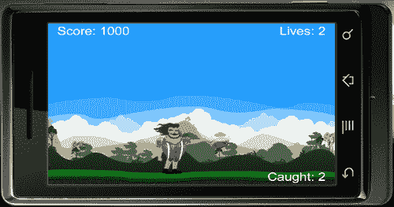

# 第七章。物理：下落物体

> 有许多方法可以将物理引擎与显示对象结合使用。到目前为止，我们已经处理了移除具有碰撞的对象、通过舞台区域移动对象以及通过施加对抗重力的力来发射对象，仅举几个例子。现在我们将探索另一种机制，允许重力控制环境。我们将要创建的下一个游戏将涉及下落的物理物体。

本章将讨论的要点是：

+   与更多物理体一起工作

+   定制身体构造

+   跟踪捕获的物体

+   与后碰撞一起工作

+   创建下落物体

在这个部分，让我们再创建一个有趣简单的游戏。让我们开始吧！

# 创建我们的新游戏：鸡蛋掉落

到目前为止的每一步都让我们对 iOS/Android 设备上的游戏开发有了更多的了解。在这个新的部分中，我们的游戏将包括音效，这将增强我们游戏中的感官体验。

### 小贴士

确保您使用的是 Corona SDK 版本 2011.704 的最新稳定版本。

我们将要创建的新游戏被称为**鸡蛋掉落**。玩家控制主要角色，即一个拿着平底锅的伐木工。在游戏过程中，鸡蛋从天空中掉落，伐木工的任务是用手中的平底锅接住鸡蛋，不让它们掉到地上。每个接住的鸡蛋获得 500 分。玩家开始时有 3 条生命。当一个鸡蛋未能击中平底锅而击中地面时，就会失去一条生命。当所有 3 条生命都用完时，游戏结束。

在开始新的游戏项目时，请确保从“第七章”文件夹中获取“鸡蛋掉落”文件。您可以从 Packt 网站 [www.packt.com](http://www.packt.com) 下载本书附带的项目文件。它包含所有为您构建的必要文件，例如 `build.settings, config.lua, ui.lua`，音频文件和游戏所需的美术资源。在开始编码之前，您必须在项目文件夹中创建一个新的 `main.lua` 文件。


## 初始变量

这将是我们的第一个完整游戏设置，其中包含许多 Corona SDK 的特点。我们将结合到目前为止所学的基础知识，包括变量、显示对象、物理引擎、触摸/加速度计事件和音频。Corona 的许多 API 都易于使用和理解。这显示了使用 Corona 进行快速学习曲线，即使基本没有编程知识。

# 行动时间——设置变量

让我们开始介绍我们将使用来创建游戏的变量。这将包括显示对象、用于计数的整数以及在游戏过程中预加载的主要音效。

1.  隐藏状态栏并添加名为 `gameGroup` 的 `display.newGroup()`。

    ```java
    display.setStatusBar( display.HiddenStatusBar )
    local gameGroup = display.newGroup()

    ```

1.  在游戏中包含外部模块。

    ```java
    local sprite = require "sprite"
    local physics = require "physics"
    local ui = require "ui"

    ```

1.  添加显示对象。

    ```java
    local background
    local ground
    local charObject
    local friedEgg
    local scoreText
    local eggText
    local livesText
    local shade
    local gameOverScreen

    ```

1.  添加变量。

    ```java
    local gameIsActive = false
    local startDrop
    local gameLives = 3
    local gameScore = 0
    local eggCount = 0
    local mRand = math.random

    ```

1.  创建鸡蛋边界和密度。

    ```java
    local eggDensity = 1.0
    local eggShape = { -12,-13, 12,-13, 12,13, -12,13 }
    local panShape = { 15,-13, 65,-13, 65,13, 15,13 }

    ```

1.  设置加速度计和音频。

    ```java
    system.setAccelerometerInterval( 100 )
    local eggCaughtSound = audio.loadSound( "friedEgg.wav" )
    local gameOverSound = audio.loadSound( "gameover.wav" )

    ```

## 刚才发生了什么？

我们继续创建与 Panda Star Catcher 游戏类似的变量设置。通过将它们分组、显示对象、音频等来组织它们更有效率。

显示的许多变量都有指定的整数，以满足游戏目标。这包括`gameLives = 3`和`eggCount = 0`等值。

## 控制主角

加速度计事件与游戏的主范围配合得最好。它使你能够在不触摸屏幕的情况下查看游戏环境的全部区域。必要的触摸事件对于用户界面按钮，如暂停、菜单、播放等是有意义的。

# 行动时间——移动角色

鸡蛋将从屏幕的各个不同区域从天空落下。让我们为主角准备移动通过屏幕上所有潜在区域的能力。

1.  设置一个新的局部函数`moveChar()`，带有`event`参数。

    ```java
    local moveChar = function(event)

    ```

1.  为角色添加加速度计移动。

    ```java
    charObject.x = display.contentCenterX -
    (display.contentCenterX * (event.yGravity * 3))

    ```

1.  在屏幕上角色移动的地方创建角色边界。这使得角色可以保持在游戏屏幕内，不会越过屏幕外的边界。

    ```java
    if((charObject.x - charObject.width * 0.5) < 0) then
    charObject.x = charObject.width * 0.5
    elseif((charObject.x + charObject.width * 0.5) >
    display.contentWidth) then
    charObject.x = display.contentWidth - charObject.width *
    0.5
    end
    end

    ```

## 刚才发生了什么？

要使加速度计移动与设备一起工作，我们必须使用`yGravity`。

### 注意

当使用`xGravity`和`yGravity`时，加速度计事件基于纵向比例。当指定显示对象为横向模式时，`xGravity`和`yGravity`的值会切换以补偿事件以正确工作。

你会注意到第 3 步中的代码阻止了`charObject`越过任何墙壁边界。

## 来吧，英雄——添加触摸事件

目前角色由加速度计控制。另一种控制角色的方法是触摸事件。尝试用`"touch"`替换事件监听器并使用事件参数，以便触摸事件正常工作。

如果你记得我们如何在第三章中结合 Breakout 的挡板移动，*Building our First Game: Breakout* 和第四章的*Game Controls*，*Game Controls* 对于模拟器，应该非常相似。

## 更新分数

当分数更新时，它指的是我们的文本显示对象，并将数值转换为字符串。

例如：

```java
gameScore = 100
scoreText = display.newText( "Score: " .. gameScore, 0, 0, "Arial",
45 )
scoreText:setTextColor( 255, 255, 255, 255 )
scoreText.x = 160; scoreText.y = 100

```

在前面的例子中，你会注意到我们将`gameScore`的值设置为`100`。在下面的`scoreText`行中，使用`gameScore`来连接字符串`"Score: "`和`gameScore`的值。这样做通过`scoreText`以字符串格式显示`gameScore`的值。

# 行动时间——设置分数

谁不喜欢一些友好的竞争呢？我们对之前章节中制作的游戏的计分板很熟悉。因此，我们并不陌生于如何跟踪分数。

1.  创建一个名为`setScore()`的局部函数，带有名为`scoreNum`的参数。

    ```java
    local setScore = function( scoreNum )

    ```

1.  设置变量来计算分数。

    ```java
    local newScore = scoreNum
    gameScore = newScore
    if gameScore < 0 then gameScore = 0; end

    ```

1.  当在游戏过程中获得分数时更新分数，并关闭函数。

    ```java
    scoreText.text = "Score: " .. gameScore
    scoreText.xScale = 0.5; scoreText.yScale = 0.5
    scoreText.x = (scoreText.contentWidth * 0.5) + 15
    scoreText.y = 15
    end

    ```

## 刚才发生了什么？

当在任意函数中调用 `setScore(scoreNum)` 时，它将引用所有使用变量 `gameScore` 的方法。假设在应用程序开始时 `gameScore = 0`，其值增加到 `gameScore` 设置的值。

在 `scoreText.text = "Score: " .. gameScore, "Score: "` 中，`"Score: "` 是在游戏过程中显示在设备上的字符串。`gameScore` 获取变量当前赋予的值并将其显示为字符串。

## 显示环境

合理设置显示对象有助于玩家想象主要角色与环境之间的关系。由于我们的主要角色是伐木工，所以他置身于森林或专注于自然的区域中是有意义的。

# 行动时间——绘制背景

在本节中，我们将填充屏幕上的环境显示对象。这包括我们的背景和地面对象，并添加物理元素到我们的地面，以便我们可以为它指定碰撞事件。

1.  创建一个名为 `drawBackground()` 的局部函数。

    ```java
    local drawBackground = function()

    ```

1.  添加背景图像。

    ```java
    background = display.newImageRect( "bg.png", 480, 320 )
    background.x = 240; background.y = 160
    gameGroup:insert( background )

    ```

1.  添加地面元素并创建地面物理边界。关闭函数。

    ```java
    ground = display.newImageRect( "grass.png", 480, 75 )
    ground.x = 240; ground.y = 325
    ground.myName = "ground"
    local groundShape = { -285,-18, 285,-18, 285,18, -285,18 }
    physics.addBody( ground, "static", { density=1.0, bounce=0,
    friction=0.5, shape=groundShape } )
    gameGroup:insert( ground )
    end

    ```

## 刚才发生了什么？

`background` 和 `ground` 显示对象放置在名为 `drawBackground()` 的函数中。由于我们的一些图像正在采用**动态缩放**，因此使用了 `display.newImageRect()` 函数。`ground` 显示对象有一个定制的物理形状，其大小与原始显示对象不同。

我们的 `background` 对象被放置在设备屏幕区域的中心，并插入到 `gameGroup` 中。

`ground` 显示对象放置在显示区域的底部附近。它通过 `ground.myName = "ground"` 被赋予一个名称。我们稍后会使用 `"ground"` 名称来确定碰撞事件。通过 `groundShape` 为地面创建了一个定制的物理形状，这允许地面的身体影响分配给显示对象的尺寸。当 `physics.addBody()` 被初始化时，我们使用 `groundShape` 作为形状参数。接下来，将 `ground` 设置为 `gameGroup`。

## 显示抬头显示

在游戏中，**抬头显示（HUD）** 是用来向玩家视觉传达信息的方法。在许多游戏中，常见的显示功能包括健康/生命值、时间、武器、菜单、地图等。这使玩家能够保持警觉，了解游戏过程中正在发生的事情。当涉及到跟踪生命值时，你希望了解在角色耗尽继续游戏的机会之前还剩下多少。

# 行动时间——设计 HUD

在尝试让玩家的游戏体验变得愉快的同时，显示的信息与游戏相关并且放置得战略性地，这样就不会干扰主要游戏区域。

1.  创建一个名为`hud()`的新局部函数。

    ```java
    local hud = function()

    ```

1.  显示在游戏过程中捕获的鸡蛋的文本。

    ```java
    eggText = display.newText( "Caught: " .. eggCount, 0, 0,
    "Arial", 45 )
    eggText:setTextColor( 255, 255, 255, 255 )
    eggText.xScale = 0.5; eggText.yScale = 0.5
    eggText.x = (480 - (eggText.contentWidth * 0.5)) - 15
    eggText.y = 305
    gameGroup:insert( eggText )

    ```

1.  添加跟踪生命值的文本。

    ```java
    livesText = display.newText( "Lives: " .. gameLives, 0, 0,
    "Arial", 45 )
    livesText:setTextColor( 255, 255, 255, 255 ) --> white
    livesText.xScale = 0.5; livesText.yScale = 0.5 --> for
    clear retina display text
    livesText.x = (480 - (livesText.contentWidth * 0.5)) - 15
    livesText.y = 15
    gameGroup:insert( livesText )

    ```

1.  添加分数文本并关闭函数。

    ```java
    scoreText = display.newText( "Score: " .. gameScore, 0, 0,
    "Arial", 45 )
    scoreText:setTextColor( 255, 255, 255, 255 ) --> white
    scoreText.xScale = 0.5; scoreText.yScale = 0.5 --> for
    clear retina display text
    scoreText.x = (scoreText.contentWidth * 0.5) + 15
    scoreText.y = 15
    gameGroup:insert( scoreText )
    end

    ```

    

## 刚才发生了什么？

`eggText`显示对象将在屏幕的右下角找到。在游戏过程中，它仍然对用户可见，同时又不干扰主要焦点。注意`eggText = display.newText( "Caught: " .. eggCount, 0, 0, "Arial", 45 )`将在值更新时引用`eggCount`。

`livesText`显示对象的设置与`eggText`类似。它位于屏幕的右上角。由于其在游戏中的重要性，这个对象的放置相当突出。它位于一个从背景中容易注意到的地方，允许玩家在游戏中参考。当`gameLives`更新时，`livesText`会减少数字。

`scoreText`的初始设置从`hud()`函数开始。它位于屏幕的左上角，与`livesText`相对。

## 创建游戏生命值

如果游戏中没有后果，那么就没有紧迫感去完成主要目标。为了在游戏过程中保持玩家的参与度，引入一些具有挑战性的元素将保持竞争性和兴奋感。在游戏中添加后果会给玩家带来紧张感，并给予他们更多生存下去的动力。

# 行动时间——计算生命值

跟踪剩余生命值使玩家了解游戏何时结束。

1.  设置名为`livesCount()`的函数。

    ```java
    local livesCount = function()

    ```

1.  每次数字减少时显示生命值的文本。

    ```java
    gameLives = gameLives - 1
    livesText.text = "Lives: " .. gameLives
    livesText.xScale = 0.5; livesText.yScale = 0.5 --> for
    clear retina display text
    livesText.x = (480 - (livesText.contentWidth * 0.5)) - 15
    livesText.y = 15
    print(gameLives .. " eggs left")
    if gameLives < 1 then
    callGameOver()
    end
    end

    ```

## 刚才发生了什么？

`livesCount()`是一个单独的函数，用于更新`gameLives`。它确保你知道`gameLives = gameLives -1`。这减少了代码开始时实例化的设置值。当`gameLives`的值发生变化时，它会通过`livesText`显示更新。函数末尾的`print`语句用于在终端窗口中跟踪计数。

当`gameLives < 1`时，将调用`callGameOver()`函数，该函数将显示游戏的结束元素。

## 英雄尝试——为游戏生命值添加图像

目前，游戏使用屏幕上的显示文本来显示游戏过程中剩余生命值的数量。为了使 HUD 显示更具吸引力，可以通过创建/添加与游戏相关的小图标，如鸡蛋或煎锅。

需要创建并有序放置三个单独的显示对象，以便当生命被夺走时，对象的透明度减少到`0.5`。

需要创建一个方法，以便当游戏生命值减少到`0`时，所有三个显示对象都会受到影响。

## 介绍主要角色

我们的主要角色将在游戏过程中应用每个动作时进行动画。我们还将创建一个**复杂身体构造**，因为对其碰撞点的关注将指向他持有的对象，而不是他的整个身体。

### 复杂身体构造

也可能从多个元素中构建一个身体。每个身体元素都指定为一个具有自己物理属性的独立多边形形状。

由于**Box2D**中的碰撞多边形必须是凸形的，任何具有凹形形状的游戏对象都必须通过附加多个身体元素来构建。

复杂身体构造的构造函数与简单多边形身体构造函数相同，只是列出了多个身体元素：

```java
physics.addBody( displayObject, [bodyType,] bodyElement1,
[bodyElement2, ...] )

```

每个身体元素可能有自己的物理属性，以及为其碰撞边界定义的形状。例如：

```java
local hexagon = display.newImage("hexagon.png")
hexagon.x = hexagon.contentWidth
hexagon.y = hexagon.contentHeight
hexagonShape = { -20,-40, 20, -40, 40, 0, 20,40, -20,40, -40,0 }
physics.addBody( hexagon, "static", { density = 1.0, friction = 0.8,
bounce = 0.3, shape=hexagonShape } )

```

与简单情况一样，`bodyType`属性是可选的，如果未指定，则默认为`"dynamic"`。

# 行动时间——创建角色

主要角色是通过精灵表创建的，需要设置以查看它提供的动画。其他将出现的显示图像包括碰撞物理对象时的裂缝鸡蛋。

1.  创建一个名为`createChar()`的新局部函数。

    ```java
    local createChar = function()

    ```

1.  创建主要角色的精灵表。

    ```java
    local characterSheet = sprite.newSpriteSheet
    ( "charSprite.png",128, 128 )
    local spriteSet = sprite.newSpriteSet(characterSheet, 1, 4)
    sprite.add( spriteSet, "move", 1, 4, 400, 0 )
    charObject = sprite.newSprite( spriteSet )
    charObject:prepare("move")
    charObject:play()

    ```

1.  设置主要角色的起始位置和物理属性。

    ```java
    charObject.x = 240; charObject.y = 250
    physics.addBody( charObject, "static", { density=1.0,
    bounce=0.4, friction=0.15, shape=panShape } )
    charObject.rotation = 0
    charObject.isHit = false
    charObject.myName = "character"

    ```

1.  在鸡蛋发生碰撞后添加过渡图像。

    ```java
    friedEgg = display.newImageRect( "friedEgg.png", 40, 23 )
    friedEgg.alpha = 1.0
    friedEgg.isVisible = false
    gameGroup:insert( charObject )
    gameGroup:insert( friedEgg )
    end

    ```

    

## 刚才发生了什么？

所指的精灵表称为`spriteSet`，并从`"charSprite.png"`中获取动画的前`4`帧。我们通过`sprite.add( spriteSet, "move", 1, 4, 400, 0 )`创建了一个动画集。每次调用`"move"`时，它都会从帧`1`开始动画，并在`400`毫秒内播放`4`帧。

主要显示对象称为`charObject`，它具有`spriteSet`的特性。当它调用`prepare("move")`时，在执行`play()`命令时，该动画序列会播放。

对角色物理身体的一个重要更改是，其主要碰撞点将指向动画中使用的煎锅。对角色身体的任何碰撞检测都不会被读取。`charObject`被赋予一个名为`"character"`的名称，这将用于检测包括掉落的鸡蛋在内的碰撞。

我们还在这个函数中放置了煎蛋，以准备碰撞。

## 添加后碰撞

我们想确保在对象与另一个对象交互后立即发生事件类型。在后碰撞的瞬间，我们可以确认两个物体之间的碰撞力。这有助于我们确定被摧毁的物体是以一定的力量完成的。

### 碰撞处理

在处理 Box2D 物理引擎时要小心。如果 Corona 代码尝试修改仍在碰撞中的对象，Box2D 仍然在它们上执行迭代数学运算，这会导致崩溃。

为了实现防崩溃的碰撞检测，不要立即发生碰撞。

为了防止崩溃，不要在碰撞期间修改/创建/销毁物理对象。

如果你需要根据碰撞修改/创建/销毁一个对象，你的碰撞处理器应该设置一个标志或添加一个时间延迟，以便稍后通过 `timer.performWithDelay()` 来执行更改。

## 物体属性

许多原生的 Box2D 方法已经被转换为简单的点属性以供显示对象使用。以下示例显示了一个使用构造方法之一创建的物体 `newBody`。

### body.isAwake

这是一个布尔值，表示当前物体的清醒状态。默认情况下，所有物体在没有交互的情况下几秒钟后会自动 *进入休眠*。物体停止模拟，直到发生某种碰撞或其他交互将其唤醒。

```java
newBody.isAwake = true
local object = newBody.isAwake

```

### body.isBodyActive

这是一个布尔值，表示物体的活动状态。非活动物体不会被销毁，但它们会被从模拟中移除，并停止与其他物体交互。

```java
newBody.isBodyActive = true
local object = newBody.isBodyActive

```

### body.isBullet

这是一个布尔值，表示一个被当作 *子弹* 处理的物体。子弹受到连续碰撞检测的影响。默认值为 `false.`

```java
newBody.isBullet = true
local object = newBody.isBullet

```

### body.isSensor

这是一个布尔属性，用于设置物体中所有元素的 `isSensor` 属性。传感器会穿过其他物体而不是反弹，但会检测到一些碰撞。此属性作用于所有身体元素，并将覆盖元素本身的任何 `isSensor` 设置。

```java
newBody.isSensor = true

```

### body.isSleepingAllowed

这是一个布尔值，表示一个允许进入休眠状态的物体。处于清醒状态的物体在倾斜重力等情况下很有用，因为休眠的物体不会对全局重力的变化做出反应。默认值为 `true.`

```java
newBody.isSleepingAllowed = true
local object = newBody.isSleepingAllowed

```

### body.isFixedRotation

这是一个布尔值，表示即使物体即将加载或受到非中心力，其旋转也应该被锁定。默认值为 `false.`

```java
newBody.isFixedRotation = true
local object = newBody.isFixedRotation

```

### body.angularVelocity

这是当前角速度的值，单位为每秒度数。

```java
newBody.angularVelocity = 50
local myVelocity = newBody.angularVelocity

```

### body.linearDamping

这是控制物体线性运动阻尼的值。这是角速度随时间减少的速率。默认值为 `0`

```java
newBody.linearDamping = 5
local object = newBody.linearDamping

```

### body.angularDamping

这是控制物体旋转阻尼的值。默认值为 `0.`

```java
newBody.angularDamping = 5
local object = newBody.angularDamping

```

### body.bodyType

这是一个表示正在模拟的物理身体类型的字符串值。可用的值有 `"static"`、`"dynamic"` 和 `"kinematic"`：

+   `static` 物体不会移动或相互交互。静态物体的例子包括地面或迷宫的墙壁。

+   `dynamic` 物体受到重力和其他物体类型碰撞的影响。

+   `kinematic`对象受到力的作用，但不受重力的影响。对于可拖动的对象，应在拖动事件期间将其设置为`"kinematic"`。

默认身体类型是`"dynamic"`。

```java
newBody.bodyType = "kinematic"
local currentBodyType = newBody.bodyType

```

# 行动时间——创建鸡蛋碰撞

我们在之前创建的示例游戏中处理了碰撞。处理碰撞后需要引入力来执行碰撞后事件的完成。

1.  创建一个名为`onEggCollision()`的新局部函数，带有两个参数`self`和`event`。

    ```java
    local onEggCollision = function( self, event )

    ```

1.  当力大于`1`且`not self.isHit`时创建一个`if`语句。添加`eggCaughtSound`声音效果。

    ```java
    if event.force > 1 and not self.isHit then
    audio.play( eggCaughtSound )

    ```

1.  使`self`不可见并停用，并用`friedEgg`显示对象替换它。

    ```java
    self.isHit = true
    print( "Egg destroyed!")
    self.isVisible = false
    friedEgg.x = self.x; friedEgg.y = self.y
    friedEgg.alpha = 0
    friedEgg.isVisible = true

    ```

1.  创建一个函数，使用`onComplete`命令将`friedEgg`显示对象过渡到舞台并使其淡出。

    ```java
    local fadeEgg = function()
    transition.to( friedEgg, { time=500, alpha=0 } )
    end
    transition.to( friedEgg, { time=50, alpha=1.0,
    onComplete=fadeEgg } )
    self.parent:remove( self )
    self = nil

    ```

1.  使用`if event.other.myName == "character"`，当主要角色抓住鸡蛋时更新`eggCount`。对于每次碰撞，通过`500`分更新`gameScore`。如果鸡蛋碰到地面，使用`elseif event.other.myName == "ground"`并使用`livesCount()`减少生命值。

    ```java
    if event.other.myName == "character" then
    eggCount = eggCount + 1
    eggText.text = "Caught: " .. eggCount
    eggText.xScale = 0.5; eggText.yScale = 0.5 --> for
    clear retina display text
    eggText.x = (480 - (eggText.contentWidth * 0.5)) - 15
    eggText.y = 305
    print("egg caught")
    local newScore = gameScore + 500
    setScore( newScore )
    elseif event.other.myName == "ground" then
    livesCount()
    print("ground hit")
    end
    end
    end

    ```

    

## 刚才发生了什么？

使用`onEggCollision( self, event )`，我们通过`if`语句设置函数，对于`event.force > 1 and not self.isHit`。当两个语句都返回`true`时，播放鸡蛋的声音效果。初始从天空落下的鸡蛋在碰撞时从场景中移除，并使用`friedEgg`显示对象在相同位置替换，通过`friedEgg.x = self.x; friedEgg.y = self.y`。

函数`fadeEgg()`通过`transition.to( eggCrack, { time=50, alpha=1.0, onComplete=fadeCrack } )`在`50`毫秒内使新替换的鸡蛋对象出现在舞台上，然后使用`onComplete`命令，通过`transition.to( eggCrack, { time=500, alpha=0 } )`将对象返回到不可见状态。

当从`event.other.myName`调用名称`"character"`时，每个碰撞都会分配给该名称，`eggCount + 1`。因此，`eggText`会更新为`eggCount`值。`setScore( newScore )`每次碰撞到`"character"`时都会增加`500`分。当碰撞到`"ground"`时，调用`livesCount()`函数，该函数通过`1`减去生命值。

## 使显示对象下落

我们将通过学习如何将物理对象添加到场景中，并让它们在游戏中的随机区域落下，来应用主要资产。物理引擎将考虑我们为鸡蛋显示对象创建的动态物理体。

# 行动时间——添加鸡蛋对象

想象一个充满下落鸡蛋的世界。这并不完全真实，但在这个游戏中，我们正在创建这个元素。至少我们将确保应用重力和现实世界的物理。

1.  创建一个名为`eggDrop()`的新局部函数。

    ```java
    local eggDrop = function()

    ```

1.  添加`egg`显示对象属性。

    ```java
    local egg = display.newImageRect( "egg.png", 26, 30 )
    egg.x = 240 + mRand( 120 ); egg.y = -100
    egg.isHit = false
    physics.addBody( egg, "dynamic",{ density=eggDensity,
    bounce=0,friction=0.5, shape=eggShape } )
    egg.isFixedRotation = true
    gameGroup:insert( egg )

    ```

1.  为`egg`显示对象添加`postCollision`事件。

    ```java
    egg.postCollision = onEggCollision
    egg:addEventListener( "postCollision", egg )
    end

    ```

    

## 刚才发生了什么？

我们将设置`egg`的`x`值为`240 + mRand( 120 )`。`mRand`函数等于`math.random`，这将允许`egg`在以 50 为 x 方向的`120`像素区域内随机出现。

确保将`egg.isHit = false`设置为对碰撞事件正确应用至关重要。物理体被设置为`"dynamic"`，因此它会响应重力并使物体下落。我们为创建的`egg`定制了密度和形状，这已经在代码的开始部分完成。

碰撞要正常工作，最后一个重要细节是将`egg`添加到`onEggCollision()`函数中，使用`egg.postCollision = onEggCollision`，然后使事件监听器使用`"postCollision"`事件，通过`egg:addEventListener( "postCollision", egg )`。

# 行动时间——制作鸡蛋下落

我们将执行鸡蛋的计时器，这样他们就可以开始在屏幕上放下鸡蛋。

1.  创建一个名为`eggTimer()`的本地函数，并使用`timer.performWithDelay`每秒（1000 毫秒）重复地放下一个鸡蛋。使用`eggDrop()`来激活下落。

    ```java
    local eggTimer = function()
    startDrop = timer.performWithDelay( 1000, eggDrop, 0 )
    end

    ```

1.  在`onEggCollision()`函数的第一个`if`语句中，使用`timerID, startDrop`取消计时器。添加语句`if gameLives < 1`以停止鸡蛋的下落。

    ```java
    if gameLives < 1 then
    timer.cancel( startDrop )
    print("timer cancelled")
    end

    ```

## 刚才发生了什么？

为了让鸡蛋从天空开始下落，我们创建了一个名为`eggTimer()`的函数。它通过每次`1000`毫秒（1 秒）后无限期地让鸡蛋下落来激活`eggDrop()`函数，使用`startDrop = timer.performWithDelay( 1000, eggDrop, 0 )`。

返回到`onEggCollision()`，我们希望检查`gameLives`是否小于`1`。当这个语句为真时，鸡蛋将停止下落。这是通过`timer.cancel( startDrop ). startDrop`完成的，`startDrop`是我们在`eggTimer()`中设置的`timerID`。

## 结束游戏玩法

每一场游戏的开始总会有一个结束。无论是简单的*你赢了*、*你输了*，还是仅仅的*游戏结束*，它都为玩家提供了一个结局。通知玩家这些事件是很重要的，这样他们可以反思所获得的成就。

# 行动时间——调用游戏结束

我们将确保当**游戏结束**显示屏幕弹出时，我们当前正在运动的任何显示对象都会停止移动，事件监听器也会被禁用。除了我们**游戏结束**屏幕的视觉显示外，我们还将添加一个声音通知，这也有助于触发事件。

1.  创建一个新的本地函数`callGameOver()`，并将其放置在`setScore()`函数之后和`drawBackground()`函数之前。

    ```java
    local callGameOver = function()

    ```

1.  当**游戏结束**显示弹出时，引入声音效果。将`gameIsActive`设置为`false`并暂停游戏中的物理。

    ```java
    audio.play( gameOverSound )
    gameIsActive = false
    physics.pause()

    ```

1.  创建一个覆盖当前背景的阴影。

    ```java
    shade = display.newRect( 0, 0, 570, 320 )
    shade:setFillColor( 0, 0, 0, 255 )
    shade.x = 240; shade.y = 160
    shade.alpha = 0

    ```

1.  显示**游戏结束**窗口并重复最终得分。

    ```java
    gameOverScreen = display.newImageRect( "gameOver.png", 400,
    300 )
    local newScore = gameScore
    setScore( newScore )
    gameOverScreen.x = 240; gameOverScreen.y = 160
    gameOverScreen.alpha = 0
    gameGroup:insert( shade )
    gameGroup:insert( gameOverScreen )
    transition.to( shade, { time=200, alpha=0.65 } )
    transition.to( gameOverScreen, { time=500, alpha=1 } )

    ```

1.  在 **游戏结束** 屏幕上显示 **得分**。

    ```java
    scoreText.isVisible = false
    scoreText.text = "Score: " .. gameScore
    scoreText.xScale = 0.5; scoreText.yScale = 0.5 --> for
    clear retina display text
    scoreText.x = 240
    scoreText.y = 160
    scoreText:toFront()
    timer.performWithDelay( 0,
    function() scoreText.isVisible = true; end, 1 )
    end

    ```

    

## 刚才发生了什么？

我们的 `gameOver()` 函数触发了我们在代码开始时预加载的 `gameOverSound` 声音效果。我们确保通过 `gameIsActive = false` 没有禁用任何事件，例如加速度计的运动。

我们显示对象的元素在此时以 `shade`, `gameOverScreen`, 和 `scoreText` 的形式出现。

如果你注意到了，当游戏通过 `scoreText.isVisible = false` 结束时，`scoreText` 会消失，然后使用 `timer.performWithDelay( 0, function() scoreText.isVisible = true; end, 1 )` 在屏幕的不同区域重新出现。

## 开始游戏

我们将激活所有剩余的函数，并让它们相应地运行。

# 到时候——激活游戏

在所有游戏元素设置到位后，现在是时候启动应用程序了。

1.  创建一个名为 `gameActivate()` 的新局部函数，并插入 `gameIsActive = true`。将函数放在 `moveChar()` 函数之上。

    ```java
    local gameActivate = function()
    gameIsActive = true
    end

    ```

1.  通过创建一个名为 `gameStart()` 的新函数来初始化所有游戏动作。

    ```java
    local gameStart = function()

    ```

1.  启动物理属性并设置下落物体的重力。

    ```java
    physics.start( true )
    physics.setGravity( 0, 9.8 )

    ```

1.  激活所有实例化的函数。为 `charObject` 使用 `"touch"` 添加事件监听器给 `moveChar()` 函数。

    ```java
    drawBackground()
    createChar()
    eggTimer()
    hud()
    gameActivate()
    Runtime:addEventListener("accelerometer", moveChar)
    end

    ```

1.  实例化 `gameStart()` 函数并返回 `gameGroup` 组。

    ```java
    gameStart()
    return gameGroup

    ```

## 刚才发生了什么？

如果你记得，在代码的开始部分，我们设置了 `gameIsActive = false`。然后我们通过 `gameActivate()` 函数更改了状态，使 `gameIsActive = true`。我们使 `gameStart()` 函数应用所有初始游戏元素。这包括物理引擎和重力的开始。同时，我们初始化了所有剩余的函数。

一旦所有函数都被激活，`gameGroup` 需要被返回，这样所有显示对象在游戏过程中都会出现。

为了确保你的显示对象的物理对象边界在正确的位置，请在 `gameStart()` 函数中使用 `physics.setDrawMode( "hybrid" )`。

## 快速问答——图形动画

1.  它是用来检索或设置文本对象的文本字符串的吗？

    +   a. `object.text`

    +   b. `object.size`

    +   c. `object:setTextColor()`

    +   d. 以上都不是

1.  哪个函数可以将任何参数转换为字符串？

    +   a. `tonumber()`

    +   b. `print()`

    +   c. `tostring()`

    +   d. `nil`

1.  哪种类型的物体受到重力和其他物体类型碰撞的影响？

    +   a. 动态

    +   b. 运动学

    +   c. 静态

    +   d. 以上都不是

# 摘要

我们应用程序的游戏构建现在完成了。既然我们已经熟悉了使用物理引擎的各种方法，这也显示了使用 Box2D 和设计涉及物理体的其他游戏的简便性。

我们对以下内容有了更清晰的认识：

+   应用动态和静态物理体的用法

+   为我们显示对象的物理属性构造一个定制的形状

+   通过变量给出的值跟踪捕获到的对象数量

+   使用后碰撞来切换图像

在下一章中，我们将通过使用**Storyboard API**创建多功能菜单屏幕来完善游戏体验。我们还将学习如何添加暂停动作、保存高分，以及了解更多关于数据保存和卸载文件的知识。

使用 Corona SDK 帮助我们以最短的时间设计和开发游戏。让我们继续为我们的游戏添加最后的修饰吧！
