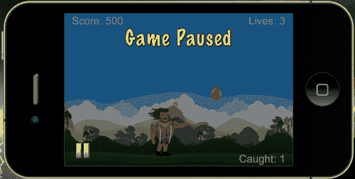
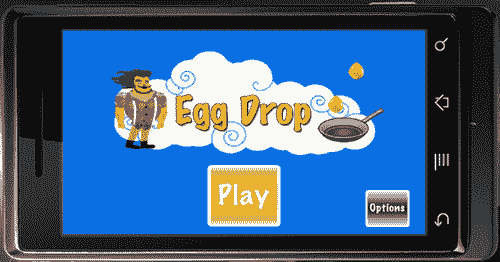
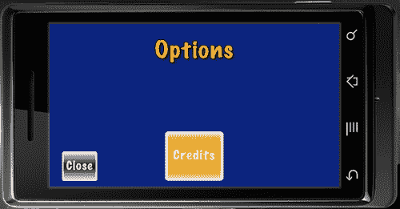

# 第八章：操作 Storyboard

> 我们已经将我们的游戏“鸡蛋掉落”进行了扩展，探索了创建游戏物理的方法，以便与碰撞检测反应，并跟踪其他有用的数据，如生命值和得分系统。我们还与自定义物理体合作，并为我们的显示对象创建名称，这些名称适用于游戏得分计数。
> 
> 接下来，我们将添加一个菜单系统，该系统包括对游戏的介绍，并在游戏过程中应用暂停菜单，以及在游戏结束后保存高分。
> 
> 我们正在完成一个具有必要元素的应用程序，使其准备好发布到 App Store 或 Google Play Store。

在本章中，我们将学习以下主题：

+   保存高分

+   添加暂停菜单

+   使用 Storyboard API 更改场景

+   添加加载屏幕

+   添加主菜单和选项菜单

让我们继续前进！

# “鸡蛋掉落”的继续

我们已经完成了“鸡蛋掉落”游戏的主游戏部分，作为我们应用程序的基础。现在是我们包括如何在游戏中途暂停动作以及如何保存高分的时候了。我们还将添加一些新的场景，这将帮助我们以简单快捷的方式介绍和过渡到游戏。

在第八章的“资源”文件夹中，获取所有图像和文件资源，并将它们复制到您当前的“鸡蛋掉落”项目文件夹中。您可以从 Packt 网站下载与本书配套的项目文件。我们将使用这些文件为我们的游戏添加最后的修饰。

# 数据保存

保存文件信息在游戏开发的许多方面都有应用。我们用它来保存高分、游戏设置，如声音开/关、锁定/解锁关卡等。它们不是必需的，但如果您想在应用程序中包含这些功能，那么它们是很好的。

在 Corona SDK 中，应用程序是沙盒化的，这意味着您的文件（应用程序图像、数据和首选项）存储在一个其他应用程序无法访问的位置。您的文件将驻留在特定于应用程序的目录中，用于文档、资源或临时文件。这种限制与您的设备上的文件有关，而与您在 Mac 或 PC 上编码无关。

## BeebeGames 类用于保存和加载数值

我们将使用由乔纳森·比比（Jonathan Beebe）创建的 BeebeGames 类。它提供了许多简单且有用的功能，可用于游戏。其中一些值得注意的功能包括一种简单的保存和加载数据的方式，我们将将其添加到我们的游戏中。有关 BeebeGames 类的更多信息，请参阅：[`developer.anscamobile.com/code/beebegames-class`](http://developer.anscamobile.com/code/beebegames-class)。您可以从链接下载文件，并查看与动画、过渡、计时器等相关的方法，以防您将来需要使用它们。目前，我们将专注于为我们的游戏轻松保存和加载值的方法。

保存和加载数值的示例：

```java
-- Public Method: saveValue() --> save single-line file (replace contents) 
function saveValue( strFilename, strValue )
-- will save specified value to specified file
local theFile = strFilename
local theValue = strValue
local path = system.pathForFile( theFile, system.DocumentsDirectory )
-- io.open opens a file at path. returns nil if no file found
-- "w+": update mode, all previous data is erased
local file = io.open( path, "w+" )
if file then
-- write game score to the text file
file:write( theValue )
io.close( file )
end
end
-- Public Method: loadValue() --> load single-line file and store it into variable
function loadValue( strFilename )
-- will load specified file, or create new file if it doesn't exist
local theFile = strFilename
local path = system.pathForFile( theFile, system.DocumentsDirectory )
-- io.open opens a file at path. returns nil if no file found
-- "r": read mode
local file = io.open( path, "r" )
if file then
-- read all contents of file into a string
-- "*a": reads the whole file, starting at the current position
local contents = file:read( "*a" )
io.close( file )
return contents
else
-- create file b/c it doesn't exist yet
-- "w": write mode
file = io.open( path, "w" )
file:write( "0" )
io.close( file )
return "0"
end
end

```

## 获取文件路径

这些文件的路径对于你的应用程序是唯一的。要创建文件路径，你使用`system.pathForFile`函数。以下代码使用应用程序的资源目录作为`Icon.png`的基目录生成应用程序图标的绝对路径：

```java
local path = system.pathForFile( "Icon.png", system.ResourceDirectory )

```

通常，你的文件必须位于以下三个可能的基目录之一：

+   应该使用`system.DocumentsDirectory`来保存需要在应用程序会话之间持久化的文件。

+   `system.TemporaryDirectory`是一个临时目录。写入此目录的文件在后续的应用程序会话中不一定存在。它们可能存在，也可能不存在。

+   `system.ResourceDirectory`是所有应用程序资源存在的目录。请注意，你不应该在此目录中创建、修改或添加文件。

    ### 注意

    更多关于文件的信息可以在：[`developer.anscamobile.com/content/files`](http://developer.anscamobile.com/content/files)。

## 读取文件

要读取文件，使用`io`库。这个库允许你根据绝对路径打开文件。

## 写入文件

要写入文件，你遵循与读取文件相同的许多步骤。而不是使用读取方法，你将数据（字符串或数字）写入文件。

# 是时候行动了——保存和加载高分

当**游戏结束**屏幕显示时，我们将保存和加载最终得分和最高分的值。

1.  打开我们为 Egg Drop 创建的`main.lua`文件。我们将继续使用相同的文件，并添加更多代码，以对游戏进行新的修改。

1.  在所有其他初始化变量附近的位置添加两个新变量，`local highScoreText`和`local highScore`。

    ```java
    local highScoreText
    local highScore

    ```

1.  在预加载的声音文件之后介绍`saveValue()`函数。

    ```java
    local saveValue = function( strFilename, strValue )
    -- will save specified value to specified file
    local theFile = strFilename
    local theValue = strValue
    local path = system.pathForFile( theFile, system.DocumentsDirectory )
    -- io.open opens a file at path. returns nil if no file found
    local file = io.open( path, "w+" )
    if file then
    -- write game score to the text file
    file:write( theValue )
    io.close( file )
    end
    end

    ```

1.  添加`loadValue()`函数。

    ```java
    local loadValue = function( strFilename )
    -- will load specified file, or create new file if it doesn't exist
    local theFile = strFilename
    local path = system.pathForFile( theFile, system.DocumentsDirectory )
    -- io.open opens a file at path. returns nil if no file found
    local file = io.open( path, "r" )
    if file then
    -- read all contents of file into a string
    local contents = file:read( "*a" )
    io.close( file )
    return contents
    else
    -- create file b/c it doesn't exist yet
    file = io.open( path, "w" )
    file:write( "0" )
    io.close( file )
    return "0"
    end
    end

    ```

1.  在`callGameOver()`函数的末尾，创建一个`if`语句来比较`gameScore`和`highScore`。使用`saveValue()`函数保存最高分。

    ```java
    if gameScore > highScore then
    highScore = gameScore
    local highScoreFilename = "highScore.data"
    saveValue( highScoreFilename, tostring(highScore) )
    end

    ```

1.  接下来，在相同的`callGameOver()`函数中添加`highScoreText`显示文本，以在游戏结束时显示最高分。

    ```java
    highScoreText = display.newText( "Best Game Score: " .. tostring( highScore ), 0, 0, "Arial", 30 )
    highScoreText:setTextColor( 255, 255, 255, 255 )
    highScoreText.xScale = 0.5; highScoreText.yScale = 0.5
    highScoreText.x = 240
    highScoreText.y = 120
    gameGroup:insert( highScoreText )

    ```

1.  在`gameStart()`函数的末尾，使用`loadValue()`函数加载高分。

    ```java
    local highScoreFilename = "highScore.data"
    local loadedHighScore = loadValue( highScoreFilename )
    highScore = tonumber(loadedHighScore)

    ```

    

## 刚才发生了什么？

在游戏级别中初始化了`saveValue()`和`loadValue()`函数后，我们创建了一个`if`语句来比较`gameScore`，这是游戏过程中的当前分数，以及`highScore`，这是迄今为止获得的最高分。当`gameScore`的结果更高时，它将替换保存的`highScore`数据。

为了保存值，需要创建一个数据文件。我们创建了一个名为`local highScoreFilename = "highscore.data"`的变量。我们使用`highScoreFilename`作为参数调用`saveValue()`函数。`tostring(highScore)`将被转换为字符串。

当**游戏结束**屏幕可见时，`highScoreText`显示从`highScore`保存的值，位于获得的`gameScore`上方。添加高分可以给玩家一个挑战最高分的动力，并为游戏增加重玩价值。

在`gameStart()`函数中，在游戏开始时加载`highScore.data`中的值非常重要。通过使用我们创建的保存`highScore`的相同数据文件，我们也可以在整个游戏中使用它来加载值。要加载值，`local highScore`调用`loadValue(highScoreFileName)`。这将从`highScore.data`中获取信息。为了获取值，`tonumber(loadedHighScore)`将其从字符串转换为整数，并可以用来显示`highScore`的值。

# 暂停游戏

你是否曾在玩游戏的过程中突然需要去洗手间或者手抽筋？显然，任何这些情况都需要你将注意力从游戏进度中移开，并且你需要暂时停止当前动作来满足这些需求。这时暂停按钮就派上用场了，你可以停止那一刻的动作，在你准备好再次玩游戏时继续。 

# 行动时间——暂停游戏

这不仅仅是创建一个按钮，还包括暂停屏幕上的所有动作，包括物理效果和计时器。

1.  在代码开始附近初始化所有其他变量的位置添加变量`local pauseBtn`和`local pauseBG`。在脚本顶部附近的`gameOverSound`之后预加载`btnSound`音频。

    ```java
    -- Place near other game variables
    local pauseBtn
    local pauseBG
    -- Place after gameOverSound
    local btnSound = audio.loadSound( "btnSound.wav" )

    ```

1.  在`hud()`函数和`scoreText`块之后创建另一个函数，该函数将运行暂停按钮的事件。将函数命名为`onPauseTouch(event)`。通过将`gameIsActive`设置为`false`暂停游戏中的物理效果，并让暂停元素出现在屏幕上。

    ```java
    local onPauseTouch = function( event )
    if event.phase == "release" and pauseBtn.isActive then
    audio.play( btnSound )
    -- Pause the game
    if gameIsActive then
    gameIsActive = false
    physics.pause()
    local function pauseGame()
    timer.pause( startDrop )
    print("timer has been paused")
    end
    timer.performWithDelay(1, pauseGame)
    -- SHADE
    if not shade then
    shade = display.newRect( 0, 0, 570, 380 )
    shade:setFillColor( 0, 0, 0, 255 )
    shade.x = 240; shade.y = 160
    gameGroup:insert( shade )
    end
    shade.alpha = 0.5
    -- SHOW MENU BUTTON
    if pauseBG then
    pauseBG.isVisible = true
    pauseBG.isActive = true
    pauseBG:toFront()
    end
    pauseBtn:toFront()

    ```

1.  当游戏暂停后，让物理效果再次激活并移除所有暂停显示对象。

    ```java
    else
    if shade then
    display.remove( shade )
    shade = nil
    end
    if pauseBG then
    pauseBG.isVisible = false
    pauseBG.isActive = false
    end
    gameIsActive = true
    physics.start()
    local function resumeGame()
    timer.resume( startDrop )
    print("timer has been resumed")
    end
    timer.performWithDelay(1, resumeGame)
    end
    end
    end

    ```

1.  在`onPauseTouch()`函数之后添加`pauseBtn` UI 按钮和`pauseBG`显示对象。

    ```java
    pauseBtn = ui.newButton{
    defaultSrc = "pausebtn.png",
    defaultX = 44,
    defaultY = 44,
    overSrc = "pausebtn-over.png",
    overX = 44,
    overY = 44,
    onEvent = onPauseTouch,
    id = "PauseButton",
    text = "",
    font = "Helvetica",
    textColor = { 255, 255, 255, 255 },
    size = 16,
    emboss = false
    }
    pauseBtn.x = 38; pauseBtn.y = 288
    pauseBtn.isVisible = false
    pauseBtn.isActive = false
    gameGroup:insert( pauseBtn )
    pauseBG = display.newImageRect( "pauseoverlay.png", 480, 320 )
    pauseBG.x = 240; pauseBG.y = 160
    pauseBG.isVisible = false
    pauseBG.isActive = false
    gameGroup:insert( pauseBG )

    ```

1.  为了在游戏过程中显示`pauseBtn`，需要在`gameActivate()`函数中将其设置为可见和激活状态。

    ```java
    pauseBtn.isVisible = true
    pauseBtn.isActive = true

    ```

1.  当游戏结束时，在`callGameOver()`函数中禁用`pauseBtn`。将代码放在`physics.pause()`行之后。

    ```java
    pauseBtn.isVisible = false
    pauseBtn.isActive = false

    ```

    

## 刚才发生了什么？

我们创建了`onPauseTouch(event)`函数来控制游戏过程中发生的所有暂停事件。为了暂停游戏中的所有运动，我们将`gameIsActive`的布尔值更改为`false`，并将`physics.pause()`用于停止所有下落的鸡蛋。接下来，暂停`startDrop`计时器，这样只要暂停函数仍然有效，从天空下落的鸡蛋就不会随着时间的推移而积累。

当按下暂停按钮时，会调用一个名为`shade`的略微透明的覆盖层出现。这将使用户的注意力从游戏场景中转移开，并允许用户在游戏活动不活跃时进行区分。

通过使它可见并激活，**游戏暂停**横幅也会显示在屏幕顶部。`pauseBG`通过`pauseBG:toFront()`被推到显示层次结构的前面。

要取消暂停，我们需要逆转暂停显示项出现的流程。当`pauseBtn`第二次被按下时，通过`display.remove(shade); shade = nil. pauseBG.isVisible`和`pauseBG.isActive`都将设置为`false`。

记得我们设置`gameIsActive`为`false`的时候吗？嗯，现在是时候将其设置回`true`了。这也意味着通过`physics.start()`恢复物理。计时器通过局部函数`resumeGame()`恢复，并在函数内部调用`timer.resume(startDrop)`。

`pauseBtn`和`pauseBG`显示对象被插入到`if`语句块的末尾。一旦游戏可玩，`pauseBtn`就会显示为可见和激活。当**游戏结束**屏幕出现时，它是不可见和无效的。这是因为当游戏结束时没有其他触摸事件会干扰。

# Storyboard API

Storyboard API 为开发者提供了一个简单的方法来控制带有或没有过渡的场景。这是一个用于显示菜单系统，甚至管理游戏中多个级别的优秀场景管理库。Storyboard 还附带了一系列过渡效果。它们可以在` storyboard.gotoScene()` API 参考页面找到：[`developer.anscamobile.com/reference/index/storyboardgotoscene`](http://developer.anscamobile.com/reference/index/storyboardgotoscene)。

更多关于 Storyboard API 的信息可以在 *Anscamobile* 网站上找到：[`developer.anscamobile.com/content/storyboard`](http://developer.anscamobile.com/content/storyboard)。

我们的场景管理将类似于在[`developer.anscamobile.com/reference/index/scene-template`](http://developer.anscamobile.com/reference/index/scene-template)显示的场景模板。

您还可以从[`github.com/ansca/Storyboard-Sample`](http://https://github.com/ansca/Storyboard-Sample)下载*Storyboard 示例代码*，并在 Corona 模拟器中运行项目文件，以熟悉其工作方式。

## 使用 Storyboard API 进行游戏开发

您可能会想知道我们如何将 Storyboard 应用于 Egg Drop。实际上，这非常简单。我们需要修改一些游戏代码以使其与 Storyboard 兼容，并为在游戏开始前应用的菜单系统创建一些新场景。

# 行动时间——修改游戏文件

我们将把当前的`main.lua`文件重命名为`maingame.lua`，并将一些额外的行添加到我们的游戏代码中。

### 小贴士

请确保更改 Egg Drop 项目文件夹内的文件名。

1.  在代码顶部附近删除以下行。我们将在本章后面创建的另一个场景中隐藏状态栏。`gameGroup` 显示组将被调整以适应 Storyboard 参数。

    ```java
    display.setStatusBar( display.HiddenStatusBar )
    local gameGroup = display.newGroup()

    ```

1.  在代码的最顶部，通过添加 `local storyboard = require( "storyboard" )` 和 `local scene = storyboard.newScene()` 来实现 Storyboard，这样我们就可以调用场景事件。

    ```java
    local storyboard = require( "storyboard" )
    local scene = storyboard.newScene()

    ```

1.  在 `local loadValue = function( strFilename )` 之后，添加 `createScene()` 事件。我们还将把我们的 `gameGroup` 显示组添加回来，但放在场景的视图属性下。同时，添加 `in storyboard.removeScene( "loadgame" )`。`"loadgame"` 场景将在本章后面介绍。

    ```java
    -- Called when the scene's view does not exist:
    function scene:createScene( event )
    local gameGroup = self.view
    -- completely remove loadgame's view
    storyboard.removeScene( "loadgame" )
    print( "\nmaingame: createScene event")
    end

    ```

1.  在 `createScene()` 事件之后，创建 `enterScene()` 事件，并在 `gameActivate()` 函数之前添加它。`enterScene()` 将过渡所有屏幕上的游戏功能。同时，在场景的视图属性中包含 `gameGroup`。

    ```java
    -- Called immediately after scene has moved onscreen:
    function scene:enterScene( event )
    local gameGroup = self.view

    ```

1.  在 `gameStart()` 函数之后，删除 `return gameGroup` 行。

    ```java
    return gameGroup -- Code will not run if this line is not removed

    ```

1.  接下来，使用 `end` 关闭 `function scene: enterScene( event )`。

    ```java
    print( "maingame: enterScene event" )
    end

    ```

1.  创建 `exitScene()` 和 `destroyScene()` 事件。

    ```java
    -- Called when scene is about to move offscreen:
    function scene:exitScene( event )
    print( "maingame: exitScene event" )
    end
    -- Called prior to the removal of scene's "view" (display group)
    function scene:destroyScene( event )
    print( "((destroying maingame's view))" )
    end

    ```

1.  最后，为所有场景事件创建事件监听器，并在代码末尾添加 `return scene`。

    ```java
    -- "createScene" event is dispatched if scene's view does not exist
    scene:addEventListener( "createScene", scene )
    -- "enterScene" event is dispatched whenever scene transition has finished
    scene:addEventListener( "enterScene", scene )
    -- "exitScene" event is dispatched before next scene's transition begins
    scene:addEventListener( "exitScene", scene )
    -- "destroyScene" event is dispatched before view is unloaded, which can be
    -- automatically unloaded in low memory situations, or explicitly via a call to
    -- storyboard.purgeScene() or storyboard.removeScene().
    scene:addEventListener( "destroyScene", scene )
    return scene

    ```

## 刚才发生了什么？

使用 Storyboard API 将帮助我们更容易、更快地切换场景。每次你想将新场景加载到视图中时，都需要添加 `require("storyboard")`。`local scene = storyboard.newScene()` 将允许我们调用场景事件：`createScene()`、`enterScene()`、`exitScene()` 和 `destroyScene()`。

在游戏代码的末尾，我们添加了所有场景事件的事件监听器，并添加了 `return scene`。

使用 Storyboard 管理每个场景的格式将类似于前面的代码。大部分游戏代码将在 `createScene()` 和 `enterScene()` 事件触发场景显示时被分发。当你想要清理或卸载监听器、音频、资源等时，将使用 `exitScene()` 和 `destroyScene()` 事件。

# 组织游戏

我们已经习惯了将 `main.lua` 作为我们的主要源文件来展示游戏代码的每一个细节。现在是时候借助 Storyboard API 高效地组织它了。

# 是时候添加新的 main.lua 文件了

在使用 Storyboard 的同时，我们的 `main.lua` 文件仍然至关重要，因为它是 Corona SDK 在模拟器中启动应用程序时首先查看的文件。我们将添加一些代码来更改游戏中的场景。

1.  创建一个全新的文件名为 `main.lua`，并让我们把状态栏添加回来。

    ```java
    display.setStatusBar( display.HiddenStatusBar )

    ```

1.  导入 Storyboard 并加载名为 `loadmainmenu` 的第一个场景。我们将在接下来的几节中创建这个场景。

    ```java
    -- require controller module
    local storyboard = require ( "storyboard" )
    -- load first screen
    storyboard.gotoScene( "loadmainmenu" )

    ```

## 刚才发生了什么？

为了在整个应用程序中整合 Storyboard，我们调用了 `local storyboard = require ( "storyboard" )` 模块。场景将通过 `storyboard.gotoScene( "loadmainmenu" )` 进行更改，这是一个引导用户到主菜单屏幕的加载屏幕。

# 新的游戏过渡

现在我们已经介绍了 Storyboard API，我们可以应用一些期待已久的过渡效果，这将有助于我们的游戏。一种方法是在游戏结束后过渡出游戏。

# 操作时间——游戏结束后切换屏幕

现在我们已经重命名了我们的游戏文件，让我们添加一个场景过渡，这样我们的游戏在游戏结束后就不会卡在 **Game Over** 屏幕上了。

在我们的 `maingame.lua` 文件中，添加一个名为 `local menuBtn` 的新变量，其中所有其他变量都在代码的开始部分初始化。在 `callGameOver()` 函数内部，在 `highScoreText` 代码之后添加以下行：

```java
local onMenuTouch = function( event )
if event.phase == "release" then
audio.play( btnSound )
storyboard.gotoScene( "mainmenu", "fade", 500 )
end
end
menuBtn = ui.newButton{
defaultSrc = "menubtn.png",
defaultX = 60,
defaultY = 60,
overSrc = "menubtn-over.png",
overX = 60,
overY = 60,
onEvent = onMenuTouch,
id = "MenuButton",
text = "",
font = "Helvetica",
textColor = { 255, 255, 255, 255 },
size = 16,
emboss = false
}
menuBtn.x = 100; menuBtn.y = 260
gameGroup:insert( menuBtn )

```


## 刚才发生了什么？

为了从 **Game Over** 屏幕过渡出来，创建了一个菜单按钮来改变场景。在 `onMenuTouch()` 函数中，当按钮 `release` 时，我们调用了 `storyboard.gotoScene( "mainmenu", "fade", 500 )`。这将允许应用程序过渡到主菜单，我们将在本章后面创建它。

## 英雄试炼——重新开始游戏

现在你已经了解了 Storyboard API 如何与场景切换以及使用 UI 按钮在它们之间进行过渡，那么在 **Game Over** 屏幕出现后创建一个重新开始游戏的按钮如何？到目前为止，应用程序允许用户在游戏结束时返回到菜单屏幕。

在 `callGameOver()` 函数内，需要创建一个新的本地函数，该函数将使用 UI 按钮系统运行一个事件来使用 Storyboard 改变场景。提示：如果你当前正在该场景中，你不能调用相同的场景。

# 创建加载界面

加载界面提供了程序正在加载的反馈。这通过通知用户下一个屏幕正在加载，因此他们不会假设应用程序崩溃，特别是如果下一个屏幕正在加载大量数据。

# 操作时间——添加加载界面

当应用程序启动以及游戏关卡开始之前，我们将放置加载界面。这告诉用户还有更多内容或信息正在到来。

1.  在你的项目文件夹中创建一个名为 `loadmainmenu.lua` 的新文件。

1.  导入 Storyboard 并添加 `storyboard.newScene()` 函数。

    ```java
    local storyboard = require( "storyboard" )
    local scene = storyboard.newScene()

    ```

1.  创建两个名为 `myTimer` 和 `loadingImage` 的本地变量。在 `createScene()` 事件和 `screenGroup` 显示组中添加。

    ```java
    local myTimer
    local loadingImage
    -- Called when the scene's view does not exist:
    function scene:createScene( event )
    local screenGroup = self.view
    print( "\nloadmainmenu: createScene event" )
    end

    ```

1.  创建 `enterScene()` 事件并添加 `screenGroup` 显示组。

    ```java
    -- Called immediately after scene has moved onscreen:
    function scene:enterScene( event )
    local screenGroup = self.view
    print( "loadmainmenu: enterScene event" )

    ```

1.  介绍 `loadingImage` 显示对象。

    ```java
    loadingImage = display.newImageRect( "loading.png", 480, 320 )
    loadingImage.x = 240; loadingImage.y = 160
    screenGroup:insert( loadingImage )

    ```

1.  创建另一个名为 `goToMenu()` 的本地函数，并调用 `storyboard.gotoScene( "mainmenu", "zoomOutInFadeRotate", 500 )` 来将场景更改为 `"mainmenu"`。

    ```java
    local goToMenu = function()
    storyboard.gotoScene( "mainmenu", "zoomOutInFadeRotate", 500 )
    end

    ```

1.  使用计时器函数，并在 1000 毫秒后调用 `goToMenu()` 一次。使用计时器 ID `myTimer` 定义它。使用 `end` 关闭 `enterScene()` 事件。

    ```java
    myTimer = timer.performWithDelay( 1000, goToMenu, 1 )
    end

    ```

1.  调用 `exitScene()` 和 `destroyScene()` 事件。在 `exitScene()` 事件中，取消 `myTimer`。

    ```java
    -- Called when scene is about to move offscreen:
    function scene:exitScene()
    if myTimer then timer.cancel( myTimer ); end
    print( "loadmainmenu: exitScene event" )
    end
    -- Called prior to the removal of scene's "view" (display group)
    function scene:destroyScene( event )
    print( "((destroying loadmainmenu's view))" )
    end

    ```

1.  为所有场景事件添加事件监听器并`return scene`。保存并关闭文件。

    ```java
    -- "createScene" event is dispatched if scene's view does not exist
    scene:addEventListener( "createScene", scene )
    -- "enterScene" event is dispatched whenever scene transition has finished
    scene:addEventListener( "enterScene", scene )
    -- "exitScene" event is dispatched before next scene's transition begins
    scene:addEventListener( "exitScene", scene )
    -- "destroyScene" event is dispatched before view is unloaded, which can be
    scene:addEventListener( "destroyScene", scene )
    return scene

    ```

1.  在你的项目文件夹中创建一个名为`loadgame.lua`的新文件。我们将创建另一个加载屏幕，该屏幕出现在游戏场景`maingame.lua`之前。使用`storyboard.gotoScene( "maingame", "flipFadeOutIn", 500 )`来切换场景。保存并关闭文件。

    ```java
    local storyboard = require( "storyboard" )
    local scene = storyboard.newScene()
    local myTimer
    local loadingImage
    -- Called when the scene's view does not exist:
    function scene:createScene( event )
    local screenGroup = self.view
    -- completely remove mainmenu
    storyboard.removeScene( "mainmenu" )
    print( "\nloadgame: createScene event" )
    end
    -- Called immediately after scene has moved onscreen:
    function scene:enterScene( event )
    local screenGroup = self.view
    print( "loadgame: enterScene event" )
    loadingImage = display.newImageRect( "loading.png", 480, 320 )
    loadingImage.x = 240; loadingImage.y = 160
    screenGroup:insert( loadingImage )
    local changeScene = function()
    storyboard.gotoScene( "maingame", "flipFadeOutIn", 500 )
    end
    myTimer = timer.performWithDelay( 1000, changeScene, 1 )
    end
    -- Called when scene is about to move offscreen:
    function scene:exitScene()
    if myTimer then timer.cancel( myTimer ); end
    print( "loadgame: exitScene event" )
    end
    -- Called prior to the removal of scene's "view" (display group)
    function scene:destroyScene( event )
    print( "((destroying loadgame's view))" )
    end
    -- "createScene" event is dispatched if scene's view does not exist
    scene:addEventListener( "createScene", scene )
    -- "enterScene" event is dispatched whenever scene transition has finished
    scene:addEventListener( "enterScene", scene )
    -- "exitScene" event is dispatched before next scene's transition begins
    scene:addEventListener( "exitScene", scene )
    -- "destroyScene" event is dispatched before view is unloaded, which can be
    scene:addEventListener( "destroyScene", scene )
    return scene

    ```

    

## 刚才发生了什么？

在`loadmainmenu.lua`文件中，一旦`loadingImage`被添加到屏幕上，我们创建了`goToMenu()`函数来将场景切换到`"mainmenu"`，并使用过渡`" zoomOutInFadeRotate"`，该过渡在淡入背景时放大并旋转加载屏幕图像。`myTimer = timer.performWithDelay( 1000, goToMenu, 1 )`在 1000 毫秒（一秒）后执行函数，并只运行一次。这足以查看图像并使其淡出。

所有显示对象都通过`function scene:enterScene( event ). loadingImage`进入场景。为了确保场景变化后没有定时器在运行，`myTimer`通过使用`timer.cancel(myTimer)`在`function scene:exitScene()`中停止运行。

`loadgame.lua`的代码与`loadmainmenu.lua`类似。对于此文件，Storyboard 将场景过渡到`maingame.lua`，即游戏文件。

# 创建主菜单

主菜单或标题屏幕是玩家在玩游戏之前看到的第一个印象之一。它通常会显示与实际游戏相关的小图像或风景片段，并显示应用程序的标题。

有如**Start**或**Play**之类的按钮，鼓励玩家在愿意的情况下进入游戏，以及一些次要按钮如**Options**，用于查看设置和其他相关信息，这些信息可能与应用程序相关。

# 操作时间——添加主菜单

我们将通过引入游戏标题、**Play**按钮和**Options**按钮来创建游戏的前端，这些按钮可以轻松地在应用程序的不同场景之间切换。

1.  创建一个名为`mainmenu.lua`的新文件，并导入 Storyboard 和 UI 模块，`storyboard.newScene()`函数以及计时器和音频的变量。

    ```java
    local storyboard = require( "storyboard" )
    local scene = storyboard.newScene()
    local ui = require("ui")
    local btnAnim
    local btnSound = audio.loadSound( "btnSound.wav" )

    ```

1.  创建`createScene()`事件。添加以下行，`storyboard.removeScene( "maingame" )`和`storyboard.removeScene( "options" )`，这将移除`"maingame"`和`"options"`场景。移除`"maingame"`将在玩家从主游戏屏幕过渡到主菜单屏幕后发生。移除`"options"`将在玩家从设置屏幕过渡到主菜单屏幕后发生。

    ```java
    -- Called when the scene's view does not exist:
    function scene:createScene( event )
    local screenGroup = self.view
    -- completely remove maingame and options
    storyboard.removeScene( "maingame" )
    storyboard.removeScene( "options" )
    print( "\nmainmenu: createScene event" )
    end

    ```

1.  添加`enterScene()`事件和`backgroundImage`显示对象。

    ```java
    -- Called immediately after scene has moved onscreen:
    function scene:enterScene( event )
    local screenGroup = self.view
    print( "mainmenu: enterScene event" )
    local backgroundImage = display.newImageRect( "mainMenuBG.png", 480, 320 )
    backgroundImage.x = 240; backgroundImage.y = 160
    screenGroup:insert( backgroundImage )

    ```

1.  引入`playBtn`显示对象，并创建一个名为`onPlayTouch(event)`的函数，该函数使用`storyboard.gotoScene()`将场景切换到`"loadgame"`。使用`"fade"`效果来切换场景。

    ```java
    local playBtn
    local onPlayTouch = function( event )
    if event.phase == "release" then
    audio.play( btnSound )
    storyboard.gotoScene( "loadgame", "fade", 300 )
    end
    end
    playBtn = ui.newButton{
    defaultSrc = "playbtn.png",
    defaultX = 100,
    defaultY = 100,
    overSrc = "playbtn-over.png",
    overX = 100,
    overY = 100,
    onEvent = onPlayTouch,
    id = "PlayButton",
    text = "",
    font = "Helvetica",
    textColor = { 255, 255, 255, 255 },
    size = 16,
    emboss = false
    }
    playBtn.x = 240; playBtn.y = 440
    screenGroup:insert( playBtn )

    ```

1.  使用 `easing.inOutExpo` 过渡，将 `playBtn` 显示对象在 500 毫秒内过渡到 `y = 260`。通过 `btnAnim` 初始化。

    ```java
    btnAnim = transition.to( playBtn, { time=500, y=260, transition=easing.inOutExpo } )

    ```

1.  介绍 `optBtn` 显示对象并创建一个名为 `onOptionsTouch(event)` 的函数。使用 `storybook.gotoScene()` 通过 `"crossFade"` 效果将场景过渡到 `"options"`。

    ```java
    local optBtn
    local onOptionsTouch = function( event )
    if event.phase == "release" then
    audio.play( btnSound )
    storyboard.gotoScene( "options", "crossFade", 300 )
    end
    end
    optBtn = ui.newButton{
    defaultSrc = "optbtn.png",
    defaultX = 60,
    defaultY = 60,
    overSrc = "optbtn-over.png",
    overX = 60,
    overY = 60,
    onEvent = onOptionsTouch,
    id = "OptionsButton",
    text = "",
    font = "Helvetica",
    textColor = { 255, 255, 255, 255 },
    size = 16,
    emboss = false
    }
    optBtn.x = 430; optBtn.y = 440
    screenGroup:insert( optBtn )

    ```

1.  使用 `easing.inOutExpo` 过渡，将 `optBtn` 显示对象在 500 毫秒内过渡到 `y = 280`。通过 `btnAnim` 初始化。使用 `end` 关闭 `scene:enterScene( event )` 函数。

    ```java
    btnAnim = transition.to( optBtn, { time=500, y=280, transition=easing.inOutExpo } )
    end

    ```

1.  创建 `exitScene()` 事件并取消 `btnAnim` 过渡。同时，创建 `destroyScene()` 事件。

    ```java
    -- Called when scene is about to move offscreen:
    function scene:exitScene()
    if btnAnim then transition.cancel( btnAnim ); end
    print( "mainmenu: exitScene event" )
    end
    -- Called prior to the removal of scene's "view" (display group)
    function scene:destroyScene( event )
    print( "((destroying mainmenu's view))" )
    end

    ```

1.  为所有场景事件添加事件监听器，并使用 `return scene` 保存并关闭文件。

    ```java
    -- "createScene" event is dispatched if scene's view does not exist
    scene:addEventListener( "createScene", scene )
    -- "enterScene" event is dispatched whenever scene transition has finished
    scene:addEventListener( "enterScene", scene )
    -- "exitScene" event is dispatched before next scene's transition begins
    scene:addEventListener( "exitScene", scene )
    -- "destroyScene" event is dispatched before view is unloaded, which can be
    scene:addEventListener( "destroyScene", scene )
    return scene

    ```

    

## 刚才发生了什么？

在主菜单屏幕上，我们添加了一个显示游戏标题、**Play** 按钮和**选项**按钮的图像。**选项**按钮目前尚未启用。`onPlayTouch()` 函数将场景过渡到 `"loadgame"`。这将场景更改为 `loadgame.lua`。**Play** 按钮放置在 x = 240; y = 440（中间和屏幕外）。当场景加载时，`playBtn` 过渡到 y = 260，使其从屏幕底部弹出，耗时 500 毫秒。

**选项**按钮做类似的事情。`optBtn` 放置在舞台的右侧，并在 500 毫秒内弹出至 y = 280。

通过 `scene:exitScene()` 函数，使用 `transition.cancel( btnAnim )` 取消 `btnAnim` 过渡。清理计时器、过渡和事件监听器在每次更改场景时都很重要，以防止在应用程序中发生潜在的内存泄漏。

# 创建一个选项菜单

选项菜单允许用户更改游戏中的各种设置或包含无法在主菜单中显示的其他信息。游戏可以有多个选项，也可以只有一个。有时选项菜单也可以称为设置菜单，它为玩家提供相同类型的定制体验。

# 是时候添加选项菜单了

我们将添加一个可以通过主菜单访问的选项菜单。我们将添加一个名为 **Credits** 的新 UI 按钮，当按下时，将用户引导到信用屏幕。

1.  创建一个名为 `options.lua` 的新文件，并导入 Storyboard 和 UI 模块、`storybook.newScene()` 函数以及计时器和音频变量。

    ```java
    local storyboard = require( "storyboard" )
    local scene = storyboard.newScene()
    local ui = require("ui")
    local btnAnim
    local btnSound = audio.loadSound( "btnSound.wav" )

    ```

1.  创建 `createScene()` 事件。添加 `storyboard.removeScene ( "mainmenu" )`，这将移除 `"mainmenu"` 场景。这将在玩家从主菜单屏幕过渡到选项屏幕后发生。接下来，添加 `storyboard.removeScene( "creditsScreen" )`。这将在玩家从信用屏幕过渡回选项屏幕后移除 `"creditsScreen"`。

    ```java
    -- Called when the scene's view does not exist:
    function scene:createScene( event )
    local screenGroup = self.view
    -- completely remove mainmenu and creditsScreen
    storyboard.removeScene( "mainmenu" )
    storyboard.removeScene( "creditsScreen" )
    print( "\noptions: createScene event" )
    end

    ```

1.  添加 `enterScene()` 事件和 `backgroundImage` 显示对象。

    ```java
    -- Called immediately after scene has moved onscreen:
    function scene:enterScene( event )
    local screenGroup = self.view
    print( "options: enterScene event" )
    local backgroundImage = display.newImageRect( "optionsBG.png", 480, 320 )
    backgroundImage.x = 240; backgroundImage.y = 160
    screenGroup:insert( backgroundImage )

    ```

1.  为致谢屏幕创建一个按钮。使用 `easing.inOutExpo` 过渡将 `creditsBtn` 显示对象过渡到 y = 260，持续 500 毫秒。通过 `btnAnim` 初始化它。

    ```java
    local creditsBtn
    local onCreditsTouch = function( event )
    if event.phase == "release" then
    audio.play( btnSound )
    storyboard.gotoScene( "creditsScreen", "crossFade", 300 )
    end
    end
    creditsBtn = ui.newButton{
    defaultSrc = "creditsbtn.png",
    defaultX = 100,
    defaultY = 100,
    overSrc = "creditsbtn-over.png",
    overX = 100,
    overY = 100,
    onEvent = onCreditsTouch,
    id = "CreditsButton",
    text = "",
    font = "Helvetica",
    textColor = { 255, 255, 255, 255 },
    size = 16,
    emboss = false
    }
    creditsBtn.x = 240; creditsBtn.y = 440
    screenGroup:insert( creditsBtn )
    btnAnim = transition.to( creditsBtn, { time=500, y=260, transition=easing.inOutExpo } )

    ```

1.  创建一个加载主菜单的**关闭**按钮。使用 `end` 关闭 `scene:enterScene ( event )`。

    ```java
    local closeBtn
    local onCloseTouch = function( event )
    if event.phase == "release" then
    audio.play( tapSound )
    storyboard.gotoScene( "mainmenu", "zoomInOutFadeRotate", 500 )
    end
    end
    closeBtn = ui.newButton{
    defaultSrc = "closebtn.png",
    defaultX = 60,
    defaultY = 60,
    overSrc = "closebtn-over.png",
    overX = 60,
    overY = 60,
    onEvent = onCloseTouch,
    id = "CloseButton",
    text = "",
    font = "Helvetica",
    textColor = { 255, 255, 255, 255 },
    size = 16,
    emboss = false
    }
    closeBtn.x = 50; closeBtn.y = 280
    screenGroup:insert( closeBtn )
    end

    ```

1.  创建 `exitScene()` 事件并取消 `btnAnim` 过渡。同时，创建 `destroyScene()` 事件。将事件监听器添加到所有场景事件和 `return scene`。保存并关闭你的文件。

    ```java
    -- Called when scene is about to move offscreen:
    function scene:exitScene()
    if btnAnim then transition.cancel( btnAnim ); end
    print( "options: exitScene event" )
    end
    -- Called prior to the removal of scene's "view" (display group)
    function scene:destroyScene( event )
    print( "((destroying options's view))" )
    end
    -- "createScene" event is dispatched if scene's view does not exist
    scene:addEventListener( "createScene", scene )
    -- "enterScene" event is dispatched whenever scene transition has finished
    options menuoptions menuaddingscene:addEventListener( "enterScene", scene )
    -- "exitScene" event is dispatched before next scene's transition begins
    scene:addEventListener( "exitScene", scene )
    -- "destroyScene" event is dispatched before view is unloaded, which can be
    scene:addEventListener( "destroyScene", scene )
    return scene

    ```

    

## 刚才发生了什么？

在这个场景中，`creditsBtn` 将以类似于创建主菜单的方式操作。**致谢**按钮目前仍然不可用。在 `onCreditsTouch()` 函数中，场景过渡到 `"creditsScreen"`，并使用 `"crossFade"` 作为效果。当场景加载时，从屏幕外位置，`creditsBtn` 在 500 毫秒内过渡到 y=260。

为此场景创建了一个**关闭**按钮，以便用户有返回上一个屏幕的方法。使用 `onCloseTouch()` 函数，当 `closeBtn` 被释放时，Storyboard 将场景切换到 `"mainmenu"`。按下**关闭**按钮时将显示主菜单屏幕。通过 `scene:exitScene()` 函数取消 `btnAnim` 过渡。

# 创建一个致谢屏幕

致谢屏幕通常会显示并列出参与游戏制作的所有人。它还可以以感谢某些个人和用于创建最终项目的程序的形式包含其他信息。

# 是时候添加一个致谢屏幕了

我们将要创建的致谢屏幕将基于一个从引入它的上一个屏幕过渡到该屏幕的触摸事件。

1.  创建一个名为 `creditsScreen.lua` 的新文件，并导入 Storyboard、`storyboard.newScene()` 函数和 `backgroundImage` 变量。

    ```java
    local storyboard = require( "storyboard" )
    local scene = storyboard.newScene()
    local backgroundImage

    ```

1.  创建 `createScene()` 事件。添加 `storyboard.removeScene ( "options" )` 行，这将删除 `"options"` 场景。这将在玩家从选项屏幕过渡到致谢屏幕后发生。

    ```java
    -- Called when the scene's view does not exist:
    function scene:createScene( event )
    local screenGroup = self.view
    -- completely remove options
    storyboard.removeScene( "options" )
    print( "\ncreditsScreen: createScene event" )
    end

    ```

1.  添加 `enterScene()` 事件和 `backgroundImage` 显示对象。

    ```java
    -- Called immediately after scene has moved onscreen:
    function scene:enterScene( event )
    local screenGroup = self.view
    print( "creditsScreen: enterScene event" )
    backgroundImage = display.newImageRect( "creditsScreen.png", 480, 320 )
    backgroundImage.x = 240; backgroundImage.y = 160
    screenGroup:insert( backgroundImage )

    ```

1.  创建一个名为 `changeToOptions()` 的局部函数，带有事件参数。让该函数通过在 `backgroundImage` 上的触摸事件使用 Storyboard 将场景切换回选项屏幕。使用 `end` 关闭 `scene:enterScene( event )` 函数。

    ```java
    local changeToOptions = function( event )
    if event.phase == "began" then
    storyboard.gotoScene( "options", "crossFade", 300 )
    end
    end
    backgroundImage:addEventListener( "touch", changeToOptions)
    end

    ```

1.  创建 `exitScene()` 和 `destroyScene()` 事件。将事件监听器添加到所有场景事件和 `return scene`。保存并关闭你的文件。

    ```java
    -- Called when scene is about to move offscreen:
    function scene:exitScene()
    print( "creditsScreen: exitScene event" )
    end
    -- Called prior to the removal of scene's "view" (display group)
    function scene:destroyScene( event )
    print( "((destroying creditsScreen's view))" )
    end
    -- "createScene" event is dispatched if scene's view does not exist
    scene:addEventListener( "createScene", scene )
    -- "enterScene" event is dispatched whenever scene transition has finished
    scene:addEventListener( "enterScene", scene )
    -- "exitScene" event is dispatched before next scene's transition begins
    scene:addEventListener( "exitScene", scene )
    -- "destroyScene" event is dispatched before view is unloaded, which can be
    scene:addEventListener( "destroyScene", scene )
    return scene

    ```

    

## 刚才发生了什么？

信用屏幕使用事件监听器。`changeToOptions(event)` 函数将告诉 Storyboard 将场景更改为 `"options"`，使用 `storyboard.gotoScene ( "options", "crossFade", 500 )`。在函数的末尾，`backgroundImage` 将在屏幕被触摸时激活事件监听器。`backgroundImage` 被插入到 `screenGroup` 中，在 `scene:enterScene( event )` 函数之下。现在鸡蛋掉落游戏已经完全可以使用 Storyboard 操作。在模拟器中运行游戏。你将能够过渡到本章中创建的所有场景，并玩这个游戏。

## 尝试英雄——添加更多关卡

现在鸡蛋掉落游戏已经完成，并且拥有一个工作的菜单系统，通过创建更多关卡来挑战自己。为了加入额外的关卡，需要添加一些位置上的小改动。记得在改变场景时应用 Storyboard。

尝试创建以下内容：

+   级别选择屏幕

+   添加额外关卡的关卡编号按钮

在创建新关卡时，参考 `maingame.lua` 中的格式。可以通过改变鸡蛋从天空掉落的速度间隔或添加其他需要避免的游戏资源来改变新关卡。在这个游戏框架中，有如此多的可能性来添加自己的特色。试试看吧！

## 突击测验——游戏过渡和场景

1.  你调用哪个函数来使用 Storyboard 改变场景？

    +   a. `storybook()`

    +   b. `storybook.gotoScene()`

    +   c. `storyboard(changeScene)`

    +   d. 以上都不是

1.  哪个函数可以将任何参数转换为数字？

    +   a. `tonumber()`

    +   b. `print()`

    +   c. `tostring()`

    +   d. nil

1.  你如何暂停计时器？

    +   a. `timer.cancel()`

    +   b. `physics.pause()`

    +   c. `timer.pause( timerID )`

    +   d. 以上都不是

1.  你如何恢复计时器？

    +   a. `resume()`

    +   b. `timer.resume( timerID )`

    +   c. `timer.performWithDelay()`

    +   d. 以上都不是

# 摘要

恭喜！我们有一个足够完整的游戏可以进入 App Store 或 Google Play Store。当然，不是使用这个确切的游戏，但我们已经学到了足够的材料来创建一个。完成游戏框架是一项伟大的成就，尤其是在如此短的时间内完成这样简单的事情。

这里有一些你学到的技能：

+   使用 `saveValue()` 和 `loadValue()` 保存高分

+   理解如何暂停物理/计时器

+   显示暂停菜单

+   使用 Storyboard API 改变场景

+   使用加载屏幕创建场景之间的过渡

+   使用主菜单介绍游戏标题和子菜单

本章是一个重要的里程碑。我们在前几章中学到的所有内容都应用到了这个示例游戏中。最棒的是，它只用了不到一天的开发时间来编写代码。另一方面，艺术资源则是另一回事。

我们还有许多关于 Corona SDK 功能需要学习。在下一章中，我们将更详细地介绍如何优化我们的游戏资源以适应高分辨率设备。我们还将介绍如何在 Facebook 和 Twitter 上发布消息，以及如何将我们的应用程序与 Openfeint 同步！
