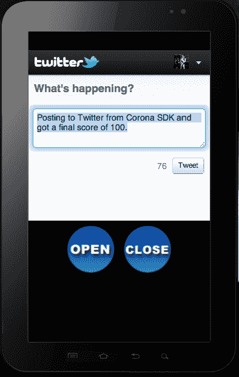
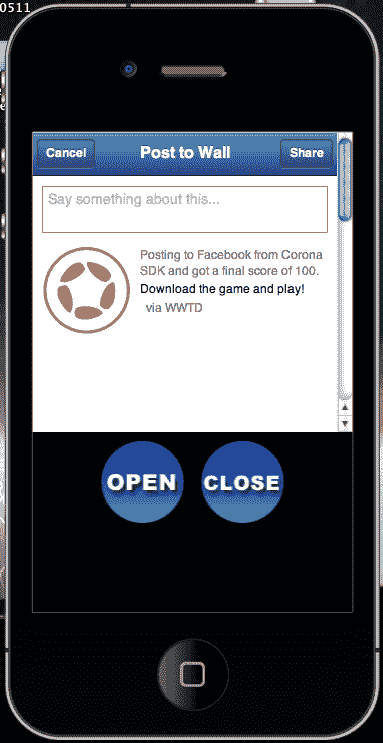
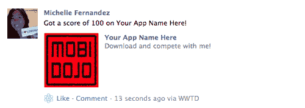
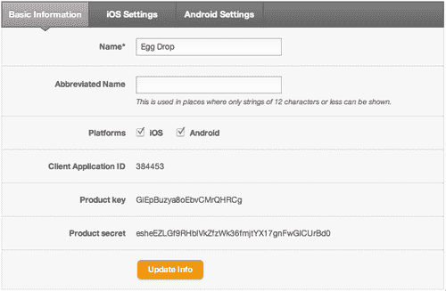
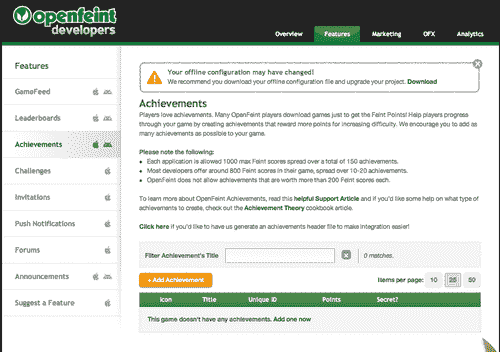
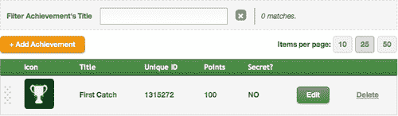
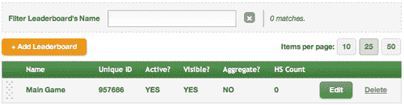

# 第九章. 处理多个设备和应用的网络连接

> 允许您的应用程序集成到社交网络中是推广您最终产品的一个好方法。许多游戏允许玩家上传他们的高分，并与玩相同游戏的用户分享。一些游戏提供需要成功完成的挑战，以解锁成就。社交网络增强了游戏体验，并为开发者提供了很好的曝光。
> 
> 我们还将更详细地介绍构建配置，因为我们越来越习惯于编程。了解配置您的设备构建的重要性对于跨平台开发是强制性的。这是 Corona SDK 可以轻松处理 iOS 和 Android 设备的能力。

在本章中，我们将学习以下主题：

+   重新访问配置设置

+   发布 Twitter 消息

+   发布 Facebook 消息

+   使用 OpenFeint 添加成就和排行榜

让我们添加这些最后的修饰吧！

# 返回配置

在第二章中简要讨论了构建设置和运行时配置，即《Lua 快速入门和 Corona 框架》。现在让我们更具体地探讨在 iOS 和 Android 平台上处理各种设备的方法。

## 构建配置

有多种处理设备方向的方法，以匹配您游戏设计所需的方向设置。

### 方向支持（iOS）

有一些场景下，您希望原生 UI 元素自动旋转，或者以某种特定方式旋转，但同时也想在 Corona 中保持一个固定的坐标系。

要锁定 Corona 的方向，同时允许原生 iPhone UI 元素旋转，请在 `build.settings` 中添加一个内容参数，如下所示：

```java
settings =
{
orientation =
{
default = "portrait",
content = "portrait",
supported =
{
"landscapeLeft", "landscapeRight", "portrait", "portraitUpsideDown",
},
},
}

```

要将 Corona 的内部坐标系锁定为纵向方向，同时将 iPhone UI 元素锁定为横向方向，您可以在 `build.settings` 中执行以下操作：

```java
settings =
{
orientation =
{
default ="landscapeRight",
content = "portrait",
supported =
{
"landscapeRight", "landscapeLeft",
},
},
}

```

### 方向支持（Android）

Android 平台支持两种方向：`portrait` 和 `landscapeRight`。方向 `landscapeLeft` 和 `portraitUpsideDown` 对 Android 没有影响。此外，Android 目前不支持自动旋转。默认方向不影响 Android 设备。方向初始化为设备的实际方向（除非只指定了一个方向）。

这里是一个 Android 特定的 `build.settings` 文件示例（您也可以在同一文件中结合 Android 和 iPhone 设置）：

```java
settings =
{
android =
{
versionCode = "2",
versionName = "2.0"
},
androidPermissions =
{
"android.permission.INTERNET"
},
orientation =
{
default = "portrait"
},
}

```

### 版本代码和版本名称（Android）

`versionCode` 和 `versionName` 可以在 `build.settings` 中的可选 `"android"` 表中设置。

`versionCode`字段默认为`"1"`，而`versionName`字段在`build.settings`文件中未设置时默认为`"1.0"`。当将应用程序的更新版本提交到 Google Play Store 时，`versionCode`和`versionName`也必须更新。所有`versionCode`的版本号都必须是整数。`versionCode`不能包含任何小数。`versionName`可以包含小数。

更多信息，请参阅*android:versionCode*和*android:versionName:*`http://developer.android.com/guide/topics/manifest/manifest-element.html#vcode.`

### 注意

`versionCode`是一个内部数字，用于区分 Google Play Store 中的应用程序发布。它不同于 Corona 构建对话框中提供的版本。`versionName`是显示给用户的版本号。

### 应用权限（Android）

可以使用可选的`"androidPermissions"`表来指定权限，使用与*AndroidManifest Reference:* [`developer.android.com/reference/android/Manifest.permission.html`](http://developer.android.com/reference/android/Manifest.permission.html)中给出的字符串值。

开发者应使用符合其应用程序要求的权限。例如，如果需要网络访问，则需要设置 Internet 权限。

## 在更简单的层面上进行内容缩放

如果您以前从未处理过这些问题，那么在多台设备上进行内容缩放有时可能会令人沮丧。虽然 iPhone 和 iPhone 4 可以轻松地在均匀的范围内进行缩放，但需要一些其他个别尺寸来使用 iPad 调整屏幕尺寸，其分辨率为 768 x 1024。Droid 的分辨率为 480 x 854，三星 Galaxy 平板电脑的分辨率为 600 x 1024，仅举几个例子。

当设置您的`config.lua`，就像我们在前面的章节中所做的那样，我们将内容设置为`width = 320, height = 480`，和`scale = "letterbox"`。如果为 Android 设备构建，`"zoomStretch"`最适合适应平台上的不同屏幕尺寸。这有助于在 iOS/Android 设备之间构建，并展示足够大的显示图像，以适应各种屏幕尺寸。

如果您想要适应更大的屏幕尺寸然后缩小，请使用 iPad 的屏幕尺寸。您的`config.lua`将类似于以下代码：

```java
application =
{
content =
{
width = 768,
height = 1024,
scale = "letterbox"
}
}

```

虽然前面的例子是另一种缩放内容的方法，但重要的是要记住，与较大的（高分辨率）图像相关的纹理内存限制。虽然 iPad、iPhone 4 和三星 Galaxy 平板电脑可以很好地处理这个问题，但 iPhone 3GS 和更老设备将拥有远少于纹理内存来处理大型图形。

解决这个潜在问题的方法之一是使用*动态图像分辨率*来替换更适合低端设备和高端设备的资源。我们将在本节稍后更详细地讨论这个话题。

### 两者之最佳

如您可能已注意到，我们在示例应用中使用的某些背景图片的尺寸为 380 x 570。这个尺寸恰好是 iOS 和 Android 所有常见设备上整个屏幕的填充尺寸。而且，它还是补偿任何设备上高分辨率和低分辨率图片的中间地带。

为了尽可能均匀地显示您的内容，以下设置必须相应地进行：

`config.lua`的设置如下：

```java
application =
{
content =
{
width = 320,
height = 480,
scale = "letterbox"
}
}

```

在包含任何显示图片的任何文件中，典型的背景显示如下：

```java
local backgroundImage = display.newImage( "bg.png", true )
backgroundImage.x = display.contentWidth / 2
backgroundImage.y = display.contentHeight / 2

```

任何大小为 320 x 480 的内容都被认为是焦点区域。任何在该区域之外的内容将被裁剪，但在任何设备上都会用内容填充整个屏幕。

## 动态图像分辨率的深层含义

我们知道我们可以交换用于 iOS 设备的基图像`"image.png"`（用于 3GS 及以下）和双分辨率图像`"image@2x.png"`（用于具有视网膜显示屏的 iPhone 4）。这仅发生在苹果设备能够判断屏幕尺寸是原始内容分辨率的两倍时。

可用命名方案来处理 iPad 和 Android 手机等设备。了解如何处理针对提议的设备受影响的资源缩放是成功的一半。我们将不得不定义 Corona 需要解决的分辨率缩放级别。

使用以下行：`display.newImageRect( [parentGroup,] filename [, baseDirectory] w, h )`将调用您的动态分辨率图片。

通常，我们使用`["@2x"] = 2`来调用 iOS 设备项目中可用的更高分辨率图片：

```java
application =
{
content =
{
width = 320,
height = 480,
scale = "letterbox",
imageSuffix =
{
["@2x"] = 2,
},
},
}

```

前面的示例仅适用于 iPhone 4 和 iPad，因为它超过了这两个设备上的基本尺寸 320 x 480。如果我们想让它对 Droid 可用，缩放阈值将是 1.5。对于三星 Galaxy 平板等 Android 平板来说，缩放阈值是 1.875。那么我们如何得出这些数字呢？很简单。取高端设备的宽度除以 320（基本尺寸）。例如：

Droid 的尺寸为 480 x 854。将 480 除以 320 等于 1.5。

三星 Galaxy 平板的尺寸为 600 x 1024。将 600 除以 320 等于 1.875。

如果试图在同一个项目中管理 iOS 和 Android 设备，您可以在`config.lua`中更改您的`imageSuffix`如下：

```java
imageSuffix =
{
["@2x"] = 1.5, -- this will handle most Android devices such as the Droid, Nexus, Galaxy Tablet, etc...
}

```

-- 或者

```java
imageSuffix =
{
["@2x"] = 1.8, -- this will handle the Galaxy Tablet and similar sized devices
}

```

使用上述任一示例将触发提议的 Android 设备显示更高分辨率的图片。

`imageSuffix`不一定必须是`"@2x"`，它可以像`"@2", "_lrg"`或甚至`"-2x"`这样的任何东西。只要您的更高分辨率图片在主图片名称后有预期的后缀，它就能正常工作。

## 高分辨率精灵图集

高分辨率精灵表的处理方式与动态图像分辨率不同。虽然您可以使用相同的命名约定来区分您的高分辨率图像和基本图像，但精灵表将无法使用`display.newImageRect()`来引用。

如果您当前的内容缩放比例在`config.lua`文件中设置为`width = 320, height = 480`，并且`scale = "letterbox"`，那么以下设备的缩放输出将展示以下内容：

+   `iPhone = 1`

+   `iPhone 4 = 0.5`

+   `Droid = 0.666666668653488`

+   `iPad = 0.46875`

应用一个与 iPhone 缩放匹配的基本精灵表，将显示清晰、干净的图像。当相同的精灵表应用于 iPhone 4 时，显示将匹配设备的内容缩放，但精灵表在边缘会略显像素化和模糊。使用`display.contentScaleX`和调用一些方法可以为您解决这个问题。请注意，`displayScale < 1`将根据前述设备缩放访问高分辨率精灵表。

```java
local spriteSheet
local myObject
local displayScale = display.contentScaleX - scales sprite sheets down
if displayScale < 1 then - pertains to all high-res devices 
spriteSheet = sprite.newSpriteSheet( "mySprite@2x.png", 512, 512 )
else
spriteSheet = sprite.newSpriteSheet( "mySprite.png", 256, 256 )
end
local spriteSet = sprite.newSpriteSet(spriteSheet, 1, 4)
sprite.add( spriteSet, "walk", 1, 4, 300, 0 ) -- play 4 frames every 300 ms
myObject = sprite.newSprite( spriteSet )
if displayScale < 1 then --scale the high-res sprite sheet if you're on a high-res device. 
myObject.xScale = .5; myObject.yScale = .5
end
myObject.x = display.contentWidth / 2
myObject.y = display.contentHeight / 2
myObject.x = 150; myObject.y = 195
myObject:prepare("walk")
myObject:play()

```

# 网络化您的应用

当您完成主要游戏框架的开发后，如果您决定进行网络化，考虑一下如何实现它是很好的。

我们在生活的某个时刻都使用过某种网络工具，比如推特和 Facebook。也许您目前正在使用这些应用程序，但重点是您已经阅读了其他用户关于新游戏发布的更新，或者有人正在传播下载游戏并与他们竞争的消息。您可以成为那个开发者，开发他们正在谈论的游戏！

在您的游戏中加入网络机制并不麻烦。只需几行代码就可以让它工作。

## 发布到推特

推特，推特，推特……推特是一种连接您与最新感兴趣信息的网络工具。它也是一个分享您业务和游戏信息的优秀工具。通过推广您的应用程序来接触游戏开发社区。

为了在推特上发布内容，您需要在以下网址创建一个推特账户：[`twitter.com/`](http://twitter.com/) 并确保您已登录。

# 实践时间——在您的应用中添加推特

我们将通过 UI 按钮访问一个网络服务，在我们的应用中实现推特功能。

1.  在`Chapter 9`文件夹中，将`Twitter Web Pop-Up`项目文件夹复制到您的桌面。所有需要的配置、库和资源都已经包含在内。您可以从 Packt 网站下载本书附带的项目文件。

1.  创建一个新的`main.lua`文件并将其保存到项目文件夹中。

1.  在代码开头设置以下变量：

    ```java
    display.setStatusBar( display.HiddenStatusBar )
    local ui = require("ui")
    local openBtn
    local closeBtn
    local score = 100

    ```

1.  创建一个名为`onOpenTouch()`的局部函数，并带有事件参数。添加一个`if`语句，以便事件接收一个`"release"`动作。

    ```java
    local onOpenTouch = function( event )
    if event.phase == "release" then

    ```

1.  使用名为`message`的局部变量，添加以下字符串语句并将`score`连接起来。

    ```java
    local message = "Posting to Twitter from Corona SDK and got a final score of " ..score.. "."

    ```

1.  添加 `local myString` 并对 `message` 应用 `string.gsub()` 以替换空格实例。

    ```java
    local myString = string.gsub(message, "( )", "%%20")

    ```

1.  介绍 `native.showWebPopup()` 函数，该函数链接到 Twitter 账户。将 `myString` 拼接到预加载的消息中。关闭函数。

    ```java
    native.showWebPopup(0, 0, 320, 300, "http://twitter.com/intent/tweet?text="..myString)
    end
    end

    ```

1.  设置 `openBtn` UI 函数。

    ```java
    openBtn = ui.newButton{
    defaultSrc = "openbtn.png",
    defaultX = 90,
    defaultY = 90,
    overSrc = "openbtn-over.png",
    overX = 90,
    overY = 90,
    onEvent = onOpenTouch,
    }
    openBtn.x = 110; openBtn.y = 350

    ```

1.  创建一个名为 `onCloseTouch()` 的本地函数，带有 `event` 参数。添加一个 `if` 语句，其中 `event.phase == "release"` 以激活 `native.cancelWebPopup()`。

    ```java
    local onCloseTouch = function( event )
    if event.phase == "release" then
    native.cancelWebPopup()
    end
    end

    ```

1.  设置 `closeBtn` UI 函数。

    ```java
    closeBtn = ui.newButton{
    defaultSrc = "closebtn.png",
    defaultX = 90,
    defaultY = 90,
    overSrc = "closebtn-over.png",
    overX = 90,
    overY = 90,
    onEvent = onCloseTouch,
    }
    closeBtn.x = 210; closeBtn.y = 350

    ```

1.  保存文件并在模拟器中运行项目。确保你已连接到互联网以查看结果。

    ### 注意

    如果你目前未登录到你的 Twitter 账户，你将需要在看到我们代码中推文的成果之前登录。

    

## 刚才发生了什么？

在代码的顶部附近，我们设置了一个变量 `local score = 100`。这将在我们的 Twitter 消息中使用。

在 `onOpenTouch(event)` 函数中，当释放 `openBtn` 时，将加载一个网页弹出窗口。将要发布的文本以字符串格式显示在变量 `local message` 下。你会注意到我们将 `score` 拼接到字符串中，以便在消息发布中显示其值。

`local myString, string.gsub()` 用于替换字符串中模式指示的所有实例。在这种情况下，它将消息中的字符串内部搜索每个单词之间的每个空格，并将其替换为 `%20\. %20`。`%20` 编码 URL 参数以表示空格。额外的 `%` 作为转义字符。

`native.showWebPopup()` 函数以 320 x 300 的尺寸显示；大约占设备屏幕尺寸的一半。要显示的 Twitter 消息对话框的 URL 被添加并拼接 `myString`。

当网页弹出窗口不再需要使用并需要关闭时，`onCloseTouch(event)` 由 `closeBtn` 调用。这将获取 `event` 参数 `"release"` 并调用 `native.cancelWebPopup()`。这个特定的函数将关闭当前的网页弹出窗口。

## 发布到 Facebook

另一个可以用来分享你的游戏信息的社交网络工具是 Facebook。你可以轻松自定义帖子以链接有关你的游戏的信息或分享关于高分的信息，并坚持要求其他用户下载它。

为了发布到 Facebook，你需要登录到你的 Facebook 账户或在此处创建一个：[`www.facebook.com/`](http://www.facebook.com/)。你将需要从 *Facebook 开发者* 网站获取一个 App ID：[`developers.facebook.com/`](https://developers.facebook.com/)。App ID 是你网站的唯一标识符，它决定了用户和应用程序页面/网站之间应有的安全级别。

一旦您创建了 App ID，您还需要编辑应用信息并选择您希望如何与 Facebook 集成。您有几种选择，例如：网站、原生 iOS 应用和原生 Android 应用，仅举几例。必须选择网站集成并填写有效的 URL，以便 Facebook 将重定向到处理网页弹窗的指定 URL。

# 操作时间——将 Facebook 添加到您的应用中

与我们的 Twitter 示例类似，我们还将结合使用带有网页弹窗的 Facebook 帖子。

1.  在 `第九章` 文件夹中，将 `Facebook Web Pop-Up` 项目文件夹复制到您的桌面。所有必要的配置、库和资源都已包含在内。您可以从 Packt 网站下载本书附带的项目文件。

1.  创建一个新的 `main.lua` 文件并将其保存到项目文件夹中。

1.  在代码开头设置以下变量：

    ```java
    display.setStatusBar( display.HiddenStatusBar )
    local ui = require("ui")
    local openBtn
    local closeBtn
    local score = 100

    ```

1.  创建一个名为 `onOpenTouch()` 的本地函数，并带有事件参数。当事件接收到 `"release"` 动作时，添加一个 `if` 语句。

    ```java
    local onOpenTouch = function( event )
    if event.phase == "release" then

    ```

1.  添加以下本地变量，包括我们将要实现到 Facebook 帖子中的字符串。

    ```java
    local appId = "0123456789" -- Your personal FB App ID from the facebook developer's website
    local message1 = "Your App Name Here"
    local message2 = "Posting to Facebook from Corona SDK and got a final score of " ..score.. "."
    local message3 = "Download the game and play!"
    local myString1 = string.gsub(message1, "( )", "%%20")
    local myString2 = string.gsub(message2, "( )", "%%20")
    local myString3 = string.gsub(message3, "( )", "%%20")

    ```

1.  介绍链接到 Facebook 账户的本地网页弹窗功能。包括 Facebook 对话框的参数，该对话框重定向您首选网站的 URL，以触摸模式显示并连接到您的应用 URL，以及显示您的应用图标或公司标志的图像 URL。使用字符串方法连接所有变量以输出所有消息。关闭函数。添加 `openBtn` UI 函数。（您需要将以下所有 URL 信息替换为您自己的）。

    ```java
    native.showWebPopup(0, 0, 320, 300, "http://www.facebook.com/dialog/feed?app_id=" .. appId .. "&redirect_uri=http://www.yourwebsite.com&display=touch&link=http://www.yourgamelink.com&picture=http://www.yourwebsite.com/image.png&name=" ..myString1.. "&caption=" ..myString2.. "&description=".. myString3)
    end
    end
    openBtn = ui.newButton{
    defaultSrc = "openbtn.png",
    defaultX = 90,
    defaultY = 90,
    overSrc = "openbtn-over.png",
    overX = 90,
    overY = 90,
    onEvent = onOpenTouch,
    }
    openBtn.x = 110; openBtn.y = 350

    ```

    ### 注意

    更多有关 Facebook 对话的信息可以在 *Facebook 开发者* 网站上找到：[`developers.facebook.com/docs/reference/dialogs/`](http://developers.facebook.com/docs/reference/dialogs/)。

1.  创建一个名为 `onCloseTouch()` 的本地函数，并带有事件参数。添加一个 `if` 语句，条件为 `event.phase == "release"` 以激活 `native.cancelWebPopup()`。设置 `closeBtn` UI 函数。

    ```java
    local onCloseTouch = function( event )
    if event.phase == "release" then
    native.cancelWebPopup()
    end
    end
    closeBtn = ui.newButton{
    defaultSrc = "closebtn.png",
    defaultX = 90,
    defaultY = 90,
    overSrc = "closebtn-over.png",
    overX = 90,
    overY = 90,
    onEvent = onCloseTouch,
    }
    closeBtn.x = 210; closeBtn.y = 350

    ```

1.  保存文件并在模拟器中运行项目。确保您已连接到互联网，并且您的 Facebook 账户，以便查看结果。

## 刚才发生了什么？

在 `onOpenTouch(event)` 函数中，当按下并释放 `openBtn` 时，会调用几个变量。请注意，`local appId` 指示的是在 Facebook 开发者网站上创建应用后可以获得的数字字符串。

`message1, message2` 和 `message3` 是显示消息帖子的字符串。`myString1, myString2` 和 `myString3` 帮助替换 `message1, message2` 和 `message3` 中的空格。

`native.showWebPopup()` 函数以 320 x 300 的尺寸显示，并将对话框 URL 显示给 Facebook。以下参数相应显示：

+   `app_id` — 示例：`"1234567"`（这是你在 Facebook 开发者网站上创建的唯一 ID）。

+   `redirect_uri` — 用户点击对话框中的按钮后要重定向到的 URL。这是参数中必需的。

+   `display` — 显示用于渲染对话框的模式。

    +   `touch` — 用于智能手机设备，如 iPhone 和 Android。使对话框屏幕适应小尺寸。

+   `link` — 附带在帖子中的链接。

+   `picture` — 发布帖子的图片的 URL。

+   `name—name` — 链接附件的名称。

+   `caption` — 链接的标题（出现在链接名称下方）。

+   `description` — 链接的描述（出现在链接标题下方）。

当不再需要使用网页弹出窗口并需要关闭时，`closeBtn` 会调用 `onCloseTouch(event)`。这将获取事件参数 `"release"` 并调用 `native.cancelWebPopup()`。这个特定的函数将关闭当前的网页弹出窗口。

# Facebook Connect

该库提供了一系列函数，通过官方的 Facebook Connect 接口与 [`www.facebook.com`](http://www.facebook.com) 进行交互。

# 行动时间 — 使用 Facebook Connect 发布分数

Facebook Connect 是通过使用本地的 Facebook UI 功能在墙面上发表帖子的另一种方式。我们将创建一种不同的方式来发布消息和分数到新闻源。为了了解 Facebook Connect 的工作原理，你需要将构建加载到设备上以查看结果。它不会在模拟器中运行。

1.  在 `第九章` 文件夹中，将 `Facebook Connect` 项目文件夹复制到你的桌面。所有需要的配置、库和资源都已经包含在内。你可以从 Packt 网站下载本书附带的项目文件。

1.  创建一个新的 `main.lua` 文件并将其保存到项目文件夹中。

1.  在代码开头设置以下变量：

    ```java
    display.setStatusBar( display.HiddenStatusBar )
    local ui = require("ui")
    local facebook = require "facebook"
    local fbBtn
    local score = 100

    ```

1.  创建一个带有事件参数的局部函数 `onFBTouch()`。添加一个包含 `event.phase == release` 的 `if` 语句。同时包括你的 Facebook 应用 ID，以字符串格式。

    ```java
    local onFBTouch = function( event )
    if event.phase == "release" then
    local fbAppID = "0123456789" -- Your FB App ID from facebook developer's panel 

    ```

1.  在 `onFBTouch(event)` 中创建另一个局部函数 `facebookListener()`，它也有一个事件参数。包括一个引用 `"session"` 等于 `event.type` 的 `if` 语句。

    ```java
    local facebookListener = function( event )
    if ( "session" == event.type ) then

    ```

1.  在 `if` 语句中添加另一个条件，其中 `"login"` 等于 `event.phase`。包含一个名为 `theMessage` 的局部变量来显示你想与其他 Facebook 用户分享的消息。

    ```java
    if ( "login" == event.phase ) then
    local theMessage = "Got a score of " .. score .. " on Your App Name Here!"

    ```

1.  添加 `facebook.request()` 函数，该函数将以下消息发布到用户的 Facebook 墙上。在 `facebookListener(event)` 函数中，使用 `end` 关闭任何剩余的 `if` 语句。

    ```java
    facebook.request( "me/feed", "POST", {
    message=theMessage,
    name="Your App Name Here",
    caption="Download and compete with me!",
    link="http://itunes.apple.com/us/app/your-app-name/id382456881?mt=8",
    picture="http://www.yoursite.com/yourimage.png"} )
    end
    end
    end

    ```

    ### 注意

    `link` 参数演示了一个 iOS 应用的 URL。你可以将 URL 指向一个类似 [`play.google.com/store/apps/details?id=com.yourcompany.yourappname`](https://play.google.com/store/apps/details?id=com.yourcompany.yourappname) 的 Android 应用，或者选择一个通用的网站 URL。

1.  调用包含你的 appID、监听器和权限以在用户的 Facebook 墙上发布消息的`facebook.login()`。关闭`onFBTouch(event)`函数的其余部分。

    ```java
    facebook.login( fbAppID, facebookListener, { "publish_stream" } )
    end
    end

    ```

1.  启用`fbBtn` UI 功能并保存你的文件。

    ```java
    fbBtn = ui.newButton{
    defaultSrc = "facebookbtn.png",
    defaultX = 100,
    defaultY = 100,
    overSrc = "facebookbtn-over.png",
    overX = 100,
    overY = 100,
    onEvent = onFBTouch,
    }
    fbBtn.x = 160; fbBtn.y = 160

    ```

1.  为 iOS 或 Android 创建一个新的设备构建。将构建加载到你的设备上并运行应用程序。在你可以看到应用程序的结果之前，你将被要求登录到你的 Facebook 账户。

## 刚才发生了什么？

需要完成的重要事情之一是`require "facebook"`，以便使 Facebook API 能够工作。我们还创建了一个名为`score`的局部变量，其值为 100。

`onFBTouch(event)`函数会在`fbBtn`的`"release"`事件发生时启动事件参数。在函数内部，`fbAppID`以字符串格式包含字符。这将是一组唯一的数字，你必须从 Facebook 开发者网站获取。当你在这个网站上创建一个应用页面时，App ID 会为你创建。

另一个函数`facebookListener(event)`被创建，它将启动所有`fbConnect`事件。在包含`("login" == event.phase)`的`if`语句中，将请求通过`"me/feed, "POST"`发布消息。该 feed 包含以下内容：

+   `message=theMessage`—指的是属于变量的字符串。它还会连接分数，以便显示其值。

+   `name`—包含你的应用名称或主题的消息。

+   `caption`—一个简短的具有说服力的消息，以吸引其他用户注意玩游戏。

+   `link`—从 App Store 或 Google Play Store 下载游戏的 URL。

+   `picture`—包含你的图像的 URL，用于显示你的应用图标或游戏的视觉表示。

在设置好参数后，`facebook.login()`将引用`fbAppID`，`facebookListener()`将检查是否正在使用有效的应用程序 ID 在 Facebook 上发布。成功后，将通过`"publish_stream"`发布帖子。

## 尝试英雄——创建一个对话框

看看你是否能找出如何使用 Facebook Connect 和与前面示例相同的设置来显示对话框。以下行将显示为：

```java
facebook.showDialog( {action="stream.publish"} )

```

现在看看代码中`facebook.showDialog()`可以访问的位置。这是另一种向 Facebook 发布消息的方法。

# OpenFeint 的奇妙之处

OpenFeint 是一个第三方库，它使社交游戏功能，如公开排行榜和成就成为可能。更多信息，请参阅[`www.openfeint.com/`](http://www.openfeint.com/)。

一旦你准备好将你的移动游戏公开联网，实现排行榜和成就系统非常简单。

你需要在 OpenFeint 开发者网站上创建一个用户账户：[`www.openfeint.com/developers`](http://www.openfeint.com/developers)，以将它的功能集成到你的应用程序中。

## 游戏网络 API

游戏网络允许访问第三方库，如 OpenFeint、Papaya 和 Game Center，这些库可以启用社交游戏功能，如公开排行榜和成就。一旦你在应用程序中实现它们，API 将能够访问这些库。我们将重点关注易于使用的 OpenFeint 库，该库将实现游戏网络 API 的以下功能。

以下行使游戏网络功能在 OpenFeint 命名空间下可用：

```java
local gameNetwork = require "gameNetwork"

```

### gameNetwork.init()

初始化游戏网络提供者所需的产品密钥、密钥、显示名称等。登录到你的 OpenFeint 开发者账户后，你需要选择“添加新游戏”按钮并创建一个新的应用程序名称。**App ID、产品密钥**和**产品密钥**可以在应用程序名称的**应用程序信息**部分找到。

语法：

```java
gameNetwork.init( providerName [, parms ...] )

```

参数：

+   `providerName`—游戏网络提供者的字符串 ("openfeint")

+   `parms`—"openfeint" 提供商所需的附加参数

    +   `Product Key`—应用程序 OpenFeint 产品密钥的字符串（由 OpenFeint 提供）

    +   `Product Secret`—应用程序产品密钥的字符串（由 OpenFeint 提供）

    +   `Display Name`—在 OpenFeint 排行榜和其他视图中显示的名称字符串

    +   `App ID`—应用程序 ID 的字符串（由 OpenFeint 提供）

示例：

```java
gameNetwork.init( "openfeint", "<OpenFeint Product Key>", "<OpenFeint Product Secret>", "Display Name", "<App ID>" )

```

使用指定的产品密钥、密钥和显示名称初始化应用程序。这应该只调用一次。

### gameNetwork.show()

在屏幕上显示来自游戏网络提供者的信息。

对于 OpenFeint 提供商，以下配置中启动 OpenFeint 仪表板：排行榜、挑战、成就、好友、游戏、高分。

语法：

```java
gameNetwork.show( name [, data] )

```

参数：

+   `name`—OpenFeint 提供商支持的字符串：

    +   `gameNetwork.show()`—启动 OpenFeint 仪表板

    +   `gameNetwork.show( "leaderboards")`—打开用户的排行榜仪表板

    +   `gameNetwork.show( "challenges")`—打开用户的挑战仪表板（在 Android 上不支持）

    +   `gameNetwork.show( "achievements")`—打开用户的成就仪表板

    +   `gameNetwork.show( "friends")`—打开用户的好友仪表板（在 Android 上不支持）

    +   `gameNetwork.show( "playing ")`—打开用户的游戏仪表板（在 Android 上不支持）

    +   `gameNetwork.show( "highscore", "LeaderboardID")`—打开特定项目的用户高分仪表板

+   `data-String`—当 OpenFeint 仪表板视图为`"highscore"`时，字符串应包含`"leaderboardID"`属性，其值是对应的 OpenFeint 排行榜 ID。

### gameNetwork.request()

向/从游戏网络提供者发送或请求信息。

语法：

```java
gameNetwork.request( command [, parms ...] )

```

参数：

+   `command`—OpenFeint 提供商支持的字符串：

    +   `setHighScore`

    +   `unlockAchievement`

    +   `uploadBlob`—在 Android 上不支持

    +   `downloadBlob`—在 Android 上不支持

+   `parms`—在先前的 OpenFeint 命令中使用的参数：

    +   `setHighScore: { leaderboardID="123456", score=50 }`

    +   `unlockAchievement: "achievementId"`

    +   `uploadBlob: "uploadBlob", key, data`

    +   `downloadBlob: key, [listener]`—监听 `"completion"` 事件，其中 `"blob"` 键被设置

示例：

以下解锁指定的成就：

```java
gameNetwork.request( "unlockAchievement", "achievementId" )

```

以下在排行榜上设置高分：

```java
gameNetwork.request( "setHighScore", { leaderboardID="1234567", score=50, displayText="50 points" } )

```

前面的函数接受一个包含以下元素的表作为参数：

+   `leaderboardID:` 字符串。OpenFeint 排行榜的 ID，高分应在此排行榜上发布。

+   `score:` 数字。要发布到指定排行榜的新高分值。

+   `displayText:` 字符串。一个可选的字符串，用于显示在由分数参数分配的数值分数所在的位置。

以下是在云中使用 OpenFeint 的 *网络保存卡* 功能保存游戏数据：

```java
gameNetwork.request( "uploadBlob", key, data )

```

以下下载之前保存并上传的 blob 数据：

```java
gameNetwork.request( "downloadBlob", key, listener ) -- listener for "completion" event with "blob" key set.

```

# 立刻使用 OpenFeint

在这本书中我们已经制作的游戏中实现 OpenFeint 有什么更好的方法呢！

# 操作时间——在 Egg Drop 中设置 OpenFeint 排行榜和成就

我们将把我们的 Egg Drop 游戏与到目前为止讨论过的 OpenFeint 功能结合起来。

1.  在 OpenFeint 开发者网站上创建一个账户：[`openfeint.com/developers`](http://openfeint.com/developers)。您可以使用 **Egg Drop** 作为游戏名称进行测试，然后稍后删除它。您可以选择使其适用于 iOS 或 Android 或两者都适用。选择权在您手中。登录后，点击 **账户信息** 选项卡以查看 **产品密钥、产品密钥** 和 **客户端应用程序 ID**。这些需要添加到您的应用程序中。

1.  从 `第九章` 文件夹中，将 `Egg Drop with OF` 项目文件夹复制到您的桌面。您可以从 Packt 网站下载本书附带的项目文件。打开 `mainmenu.lua` 文件。在 UI 模块之后插入游戏网络功能，并使用从 OpenFeint 开发者账户获得的信息进行初始化。

    ```java
    local gameNetwork = require("gameNetwork")
    gameNetwork.init( "openfeint", "<OpenFeint Product Key>", "<OpenFeint Product Secret>", "Display Name", "<App ID>" )

    ```

1.  在与 `optBtn` 相关的代码块下方，创建一个名为 `local ofBtn` 的新 UI 按钮，该按钮在 500 毫秒内从屏幕外过渡到 y=280。添加一个名为 `onOFTouch()` 的本地函数，带有 `event` 参数。当 `event.phase == "release"` 时，让游戏网络显示排行榜。保存并关闭您的文件。

    ```java
    local ofBtn
    local onOFTouch = function( event )
    if event.phase == "release" then
    audio.play( btnSound )
    gameNetwork.show( "leaderboards" )
    end
    end
    ofBtn = ui.newButton{
    defaultSrc = "ofbtn.png",
    defaultX = 60,
    defaultY = 60,
    overSrc = "ofbtn-over.png",
    overX = 60,
    overY = 60,
    onEvent = onOFTouch,
    id = "OFButton",
    text = "",
    font = "Helvetica",
    textColor = { 255, 255, 255, 255 },
    size = 16,
    emboss = false
    }
    ofBtn.x = 50; ofBtn.y = 440
    screenGroup:insert( ofBtn )
    btnAnim = transition.to( ofBtn, { time=500, y=280, transition=easing.inOutExpo } )

    ```

1.  返回 OpenFeint 开发者门户，点击 **功能** 选项卡，然后点击 **成就** 选项卡。点击橙色按钮，上面写着 **添加成就**。

1.  我们将创建的特定成就是当角色第一次接住鸡蛋时。为成就创建一个标题，确定您想要从 1000 个 Feint 积分中确定的点值，并写一个简短的订阅说明。如果您愿意，可以添加成就图标，但在这个教程中不是必需的。完成操作后，点击**保存成就**。

1.  在下一屏，您将看到添加的成就以及一个**唯一标识符**，我们将使用它来在游戏中创建一个成就。您将使用为您在 OpenFeint 中生成的唯一标识符，而不是以下截图显示的那个：

1.  在项目文件夹中打开`maingame.lua`文件。在`onEggCollision()`函数中，找到包含`event.force > 1.0 and self.isHit == false`的`if`语句。在函数底部附近创建另一个`if`语句，当接住一个鸡蛋时，请求`gameNetwork()`、成就和您的唯一标识符。

    ```java
    if eggCount == 1 then
    gameNetwork.request( "unlockAchievement", "1315272" ) -- replace the Unique ID with the one you created in OpenFeint
    end

    ```

1.  返回 OpenFeint 开发者门户，点击**排行榜**标签。点击显示**添加排行榜**的橙色按钮。您可以创建任何与关卡相关的名称。您可以保留复选框不变。点击**保存排行榜**按钮。

1.  在下一屏，您将看到排行榜的新唯一标识符。

1.  在`maingame.lua`文件中，找到`callGameOver()`函数。在说`gameScore > highScore`的`if`语句中，添加请求将游戏最高分发布到 OpenFeint 的`gameNetwork()`请求。使用唯一标识符填写`排行榜 ID`。您将使用在 OpenFeint 中为您生成的唯一标识符来确定最高分，`score=gamescore`。保存您的文件。

    ```java
    gameNetwork.request( "setHighScore", { leaderboardID="957686", score=gameScore } ) -- replace the Unique ID with the one you created in OpenFeint

    ```

1.  成就排行榜的添加已完成！OpenFeint 的功能不能在模拟器上运行。您需要将游戏构建加载到设备上才能查看结果。

## 刚才发生了什么？

`gameNetwork.init()`使用游戏网络提供者所需的参数初始化一个应用，这些参数包括`("openfeint","<OpenFeint 产品密钥>", "<OpenFeint 产品密钥>", "显示名称", "<应用 ID>")`。

主菜单显示`ofBtn`并建立到`gameNetwork.show ( "leaderboards" )`的连接，并打开用户的排行榜仪表板。

当添加成就时，我们在`onEggCollision()`函数中添加了`if eggCount == 1 then gameNetwork.request( "unlockAchievement", "1315272" ) end`，因为我们知道`eggCount`是通过主要角色的每一次碰撞来跟踪的。这将解锁 OpenFeint 中的成就，因为我们通过我们创建的唯一 ID 指定了它。

排行榜跟踪每个级别中实现的最高分。我们在`callGameOver()`函数和比较`gameScore`和`highScore`的`if`语句中添加了`gameNetwork.request( "setHighScore", { leaderboardID="957686", score=gameScore } )`。如果达到了该级别的最高分，它将被发送到 OpenFeint 中的排行榜，在开发者门户中设置的唯一 ID 下。

### 注意

当你在开发者门户下注册时，拥有 OpenFeint 会员不需要支付任何费用。当你完成你的游戏时，请确保注册它，这样它就可以在公众中完全访问 OpenFeint 功能。

## 尝试一下英雄——添加更多 OpenFeint 成就

通过使用当前的游戏，尝试想出其他可以解锁的成就，并找出它们如何通过 OpenFeint 访问。以下是一些帮助你开始的想法：

+   达到一定数量的积分

+   捕捉一定数量的鸡蛋

+   在所有三个生命都可用的情况下，捕捉一定数量的鸡蛋

有许多可能性可以创造。试试看！

## 快速问答——处理社交网络

1.  什么是指定降低高分辨率精灵图集的特定 API？

    +   a. `object.xScale`

    +   b. `display.contentScaleX`

    +   c. `object.xReference`

    +   d. 以上都不是

1.  在整个应用程序中，可以向用户授予的最大 Feint 积分是多少？

    +   a. 200

    +   b. 750

    +   c. 10000

    +   d. 1000

1.  以下哪个是`gameNetwork.init()`所需的有效参数？

    +   a. App ID

    +   b. 产品密钥

    +   c. 产品密钥

    +   d. 所有以上选项

# 摘要

我们在我们的应用程序中涵盖了更多关于增强配置设置和集成当今媒体中最受欢迎的三个社交网络的内容。

我们深入研究了以下内容：

+   构建设置

+   动态内容缩放和动态图像分辨率

+   高分辨率精灵图集

+   将消息推送到 Twitter 和 Facebook

+   在 OpenFeint 中实现成就和排行榜

在下一章中，我们将介绍如何将我们的游戏提交到 App Store 和 Google Play Store 的过程。你绝对不想错过这个机会！
