# 第十章。优化、测试和发布你的游戏

> 将游戏开发到完成是一个巨大的成就。这是向世界分享它并让其他人能够玩你的新应用迈出的一步。使用 Corona SDK 创建你的游戏的好处是，你有选择为 iOS 和/或 Android 构建应用。你想要确保你的应用已准备好提交，以便可以在你正在开发的移动平台上分发。我们将介绍准备你的游戏以发布状态所需的过程。

在本章中，我们将学习以下主题：

+   提高你应用的性能

+   为 App Store 设置分发配置文件

+   在 iTunes Connect 中管理应用信息

+   学习如何提交应用至应用加载器

+   为 Android 签署应用

+   学习如何提交应用至 Google Play 商店

# 理解内存效率

在开发你的应用时，你应该始终考虑你的设计选择如何影响你应用的性能。尽管计算能力和内存都有所提升，但设备内存仍然有其限制。在设备内部进行性能和优化不仅能够实现更快的响应时间，还能帮助最小化内存使用并最大化电池寿命。

内存是移动设备上的重要资源。当消耗过多内存时，设备可能会在你最意想不到的时候强制退出你的应用。以下是在开发过程中需要注意的一些事项：

+   **消除内存泄漏**：允许内存泄漏存在意味着你的应用中会有额外的已使用内存，这会占用宝贵的空间。尽管 Lua 具有自动内存管理功能，但你的代码中仍然可能发生内存泄漏。例如，当你将全局变量引入你的应用中时，你有责任告诉 Lua 当它们不再需要时，以便释放内存。这可以通过在代码中使用 `nil` 来实现 `(myVariable = nil)`。

+   **显示的图像应尽可能小**：你可能想在场景中有许多显示图像，但这可能会占用过多的纹理内存。精灵表单可能会在你的应用中占用大量内存。它们应该尽可能以最小的尺寸创建，并具有适当数量的帧来清晰地展示动画。对于你显示的所有项目，规划出哪些元素始终在你的背景和前景中。如果有可能将几个图像组合在一起而不移动，请这样做。当添加多个显示图像时，这将节省一些内存。

+   **不要一次性加载所有资源**：避免在资源实际需要之前加载资源文件。这将有助于节省内存，并防止你的应用在尝试一次性加载过多内容时崩溃。

+   **从显示层次结构中移除对象**：当创建显示对象时，它会被隐式地添加到显示层次结构中。当你不再需要显示对象时，你应该从显示层次结构中移除它，特别是当对象包含图像时。这可以通过使用`display.remove( myImage ); myImage = nil`来完成。

    例如：

    ```java
    local box = display.newRect( 0, 50, 100, 100)
    box:setFillColor( 255, 255, 255, 255 )
    box.alpha = 1
    local function removeBox()
    if box.alpha == 1 then
    print("box removed")
    display.remove( box )
    box = nil
    end
    end
    timer.performWithDelay( 1000, removeBox, 1 ) -- Runs timer to 1000 milliseconds before calling the block within removeBox()

    ```

+   尽可能使声音文件变小：使用 Audacity 这样的免费程序或你偏好的音频软件压缩音乐或音效，并为设备构建。最好是对比未压缩的音频和压缩的音频，以听到质量上的差异。这将帮助你确定在音质和文件大小之间一个好的平衡点。

## 图形

如果你不注意同时使用的图像的大小和数量，显示图像会占用大量的纹理内存。

### 组合对象

如果几个对象的属性被设置为相同的值，最好将对象添加到一组中，然后修改组的属性。这将使你的编码更加容易，并优化你的动画。

### 当不需要时关闭动画

当不需要时忘记停止动画在后台运行，或者当你只是让它们不可见时，这是很容易发生的。

当你包含一个监听器如`"enterFrame"`，并且注册在监听器下的对象被设置为`.isVisible = false`时，即使它不在屏幕上显示，它也会在后台继续运行。确保在不需要监听器时将其移除。

### 优化图像大小

当你处理大文件时，尤其是全屏图像，由于加载所需的时间和消耗的大量内存，你的应用程序的响应速度会变慢。在使用大图像时，尽量使用像 Photoshop 或 Pngcrush 这样的图像编辑工具尽可能多地压缩文件大小。这将有助于减小文件大小并减轻应用程序卡顿的痛苦。压缩大图像尺寸从长远来看会对你有益。

# 分发 iOS 应用程序

一旦你的游戏最终调试并完成，接下来是什么？假设你已经注册了 iOS 开发者计划，在应用程序可以提交到 App Store 之前，有一些指南必须遵循。

## 准备你的应用程序图标

根据你的应用程序为哪些 iOS 设备开发，应用程序图标需要各种图像大小和命名约定。你可以在 Apple 开发者网站上 iOS 人类界面指南的**应用程序图标**部分找到最新信息：[`developer.apple.com/library/ios/documentation/UserExperience/Conceptual/MobileHIG/MobileHIG.pdf`](https://developer.apple.com/library/ios/documentation/UserExperience/Conceptual/MobileHIG/MobileHIG.pdf)。

以下是为应用程序图标的要求，它们也需要是`.png`格式：

+   `iTunesArtwork`—512x512 像素图像。此图像需要移除 .png 扩展名。

+   `Icon.png`—57x57 像素图像。用于 App Store 和 iPhone 3G/iPod Touch 的主屏幕。

+   `Icon@2x.png`—114x114 像素图像。用于 iPhone 4/4S 主屏幕。

+   `Icon-72.png`—72x72 像素图像。用于 iPad 主屏幕。

+   `Icon-72@2x.png`—144x144 像素图像。用于 iPad（高分辨率）主屏幕。

+   `Icon-Small.png`—29x29 像素图像。用于 Spotlight 和设置。

+   `Icon-Small@2x.png`—58x58 像素图像。用于 iPhone 4/4S Spotlight 和设置。

+   `Icon-Small-50.png`—50x50 像素图像。用于 iPad Spotlight 和设置。

+   `Icon-Small-50@2x.png`—100x100 像素图像。用于 iPad（高分辨率）Spotlight 和设置。

在您的 `build.settings` 文件中，您需要包含您在应用程序中为所有构建的设备提供的图标引用。以下是在创建通用构建时设置文件的示例：

```java
settings =
{
orientation =
{
default = "landscapeRight",
},
iphone =
{
plist =
{
CFBundleIconFile = "Icon.png",
CFBundleIconFiles = {
"Icon.png",
"Icon@2x.png",
"Icon-72.png",
"Icon-72@2x.png",
"Icon-Small.png",
"Icon-Small@2x.png",
"Icon-Small-50.png",
"Icon-Small-50@2x.png",
},
},
},
}

```

您不需要在 plist 中包含 iTunesArtwork 图像，但请确保将其插入到您的构建项目文件夹中。

# 行动时间—设置 App Store 的分发证书和配置文件

我们专注于创建开发证书和配置文件，以便在设备上测试和调试我们的应用程序。现在我们必须创建它们的分发版本，以便提交 iOS 应用程序。请注意，苹果公司可以随时更改其网站的设计。因此，如果步骤和截图不匹配，请不要沮丧。

1.  登录您的 Apple 开发者账户，并前往 iOS 配置文件门户。选择 App ID。创建一个新的 App ID，使其与您的应用程序相关联，以便您可以识别它。如果您在开发过程中已经使用了一个现有的 App ID，您可以忽略此步骤。如果您选择使用现有的 Bundle Seed ID，否则请选择**生成新**，如果这是您在包中的第一次，或者如果您只是想创建一个新的独立应用程序。

    在**包标识符（App ID 后缀）**字段中，指定您应用程序的唯一标识符。建议您使用反向域名样式字符串，即 `com.domainname.appname`。您需要将**domainname**替换为您自己的域名，将**appname**替换为您自己的应用程序名称。

    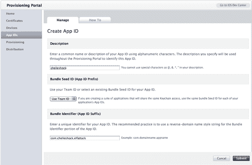

1.  导航到**配置文件门户**的配置文件部分，并选择**分发**选项卡。选择**分发方法**旁边的**App Store**单选按钮。创建**分发配置文件名称**。检查以确保您的 iOS **分发证书**已显示。最后，选择您计划用于创建**分发配置文件**的**App ID**。点击**提交**按钮。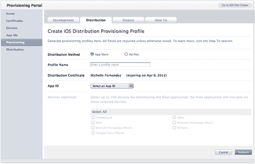

1.  刷新您的浏览器并下载您的新**分发配置文件**。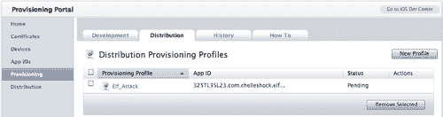

1.  如果 Xcode 尚未打开，请启动它，然后在键盘上按*Shift + Command + 2*以打开**组织者**。在**库**下，选择**配置文件**部分。将您下载的`.mobileprovision`文件拖到**组织者**窗口中。这将自动将您的`.mobileprovision`文件复制到正确的目录，或者双击文件以添加它。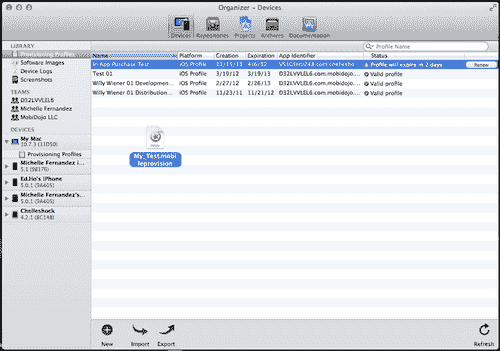

## 刚才发生了什么？

您使用的**App ID**对于识别您将要提交的应用至关重要。最好使用一个独特的反向域名风格字符串。至于您的**包标识符（App ID 前缀）**，您可以生成一个新的，也可以使用现有的。如果您在应用程序中实现 Game Center 或内购功能，请不要使用通配符（星号*）。**包 ID**需要完全唯一。

为了在 App Store 分发，您需要创建一个 App Store 分发配置文件。任何其他配置文件，无论是开发还是临时配置文件，都将不被接受。这个过程与创建开发配置文件类似。

您可以在 Apple 开发者网站上找到有关分发配置文件的更多信息：[`developer.apple.com/ios/manage/distribution/index.action`](http://https://developer.apple.com/ios/manage/distribution/index.action)（如果您尚未这样做，您将被要求登录到您的 Apple 开发者账户）。Anscamobile 的网站：[`developer.anscamobile.com/content/building-devices-iphoneipad`](http://developer.anscamobile.com/content/building-devices-iphoneipad)。

# iTunes Connect

iTunes Connect 是一套基于 Web 的工具，允许您提交和管理您在 App Store 上分发的应用程序。在 iTunes Connect 中，您将能够检查合同的状态，设置您的税务和银行信息，获取销售和财务报告，请求促销代码，管理用户、应用程序、元数据和您的内购目录。

## 合同、税务和银行

如果您计划销售您的应用程序，您需要有一个付费的商业协议，以便它可以在 App Store 上发布。您将必须请求一个与 iOS 付费应用程序相关的合同。所有这些操作都通过 iTunes Connect 下的**合同、税务**和**银行**链接完成。

在请求合同时，请注意可能发生的问题，例如，当苹果第一次处理您的信息时的延误以及/或在 iTunes Connect 中更改您的当前联系信息（即，如果您搬到了不同的地点，地址变更）。确保您的合同信息始终是最新的责任在于您，您需要持续联系苹果以获得支持。

# 操作时间——在 iTunes Connect 中管理您的应用

我们将介绍如何在 iTunes Connect 中设置您的应用信息。有关用户账户、合同和银行等其他您想要设置的信息，可以在以下 URL 找到：[`developer.apple.com/appstore/resources/submission/`](http://https://developer.apple.com/appstore/resources/submission/)。

1.  在[`itunesconnect.apple.com/`](http://itunesconnect.apple.com/)登录 iTunes Connect。您的登录信息与您的 iOS 开发者账户相同。登录后，选择**管理您的应用**。点击**添加新应用**按钮。**应用名称**是您应用的名称。**SKU 编号**是应用的唯一字母数字标识符。您的**包标识符**是在 iOS 配置文件门户中创建的。填写信息并点击**继续**。![操作时间——在 iTunes Connect 中管理您的应用]

1.  下一步是选择您希望应用在 App Store 上上线的时间和您想要收取的**价格层级**。有一个可选的复选框用于**教育机构折扣**。这仅适用于您希望为同时购买多份副本的教育机构提供折扣的情况。完成后点击**继续**。![操作时间——在 iTunes Connect 中管理您的应用]

1.  接下来，填写关于您应用的**元数据**部分。这包括版本号、您游戏的描述、类别、与您的应用相关的关键词、版权信息、联系信息和支持网址。![操作时间——在 iTunes Connect 中管理您的应用]

1.  **评分**部分基于您应用的内容。对于每个描述，选择最能描述您应用的频率级别。某些内容类型会导致自动拒绝，例如，在您的应用中展示的现实主义暴力或针对个人或群体的攻击等。您可以在以下 URL 了解更多关于**App Store 审查指南**的信息：[`developer.apple.com/appstore/resources/approval/guidelines.html`](http://https://developer.apple.com/appstore/resources/approval/guidelines.html)。![操作时间——在 iTunes Connect 中管理您的应用]

1.  如前文在**上传**部分所述，您需要一个较大版本的应用程序图标、iPhone/iPod Touch 截图和 iPad 截图（如果您的应用程序在 iPad 上运行）的内容。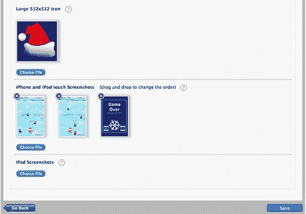

1.  您将看到一个关于应用程序信息的页面摘要。检查确保一切显示正确，然后点击**完成**。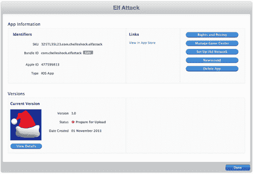

1.  您将被返回到您的版本详情页面。注意一个写着**准备上传二进制文件**的按钮。点击该按钮，您将需要回答一些关于**出口合规性**的问题。一旦完成，您将通过**应用程序加载器**上传二进制文件的权限。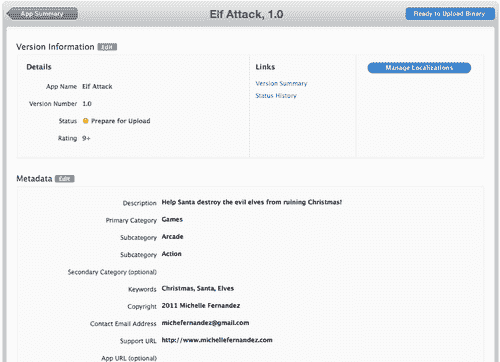

## 刚才发生了什么？

从现在开始，当您在 App Store 中分发应用程序时，您将在 iTunes Connect 中管理您的应用程序。您想要显示的关于您应用程序的每一条信息都是在 iTunes Connect 中完成的。

一旦您进入关于**应用程序信息**的部分，请确保您的**SKU 编号**是唯一的，并且它与您的应用程序相关，以便您稍后可以识别它。此外，请确保您为应用程序指定的**捆绑 ID**是正确的。

**权利和定价**部分中的应用程序可用性控制着一旦批准，您希望应用程序何时上线。从提交之日起设置在未来几周内的日期是个不错的选择。只要提交没有问题，从**审查中**到**准备销售**的审查过程可能需要几天到几周的时间。价格层级是您设置应用程序价格的地方，或者它可以设置为**免费**。您可以点击**查看定价矩阵**以确定您希望销售应用程序的价格。

在**元数据**部分填写信息是客户在 App Store 中能看到的内容。**评分**部分与苹果内容描述相关。请确保频率级别尽可能接近您应用程序的内容。

**上传**部分是您包含 512 x 512 像素的应用程序图标和最适合您应用程序视觉的截图的地方。请确保您提供正确的图像大小。一旦您返回到**应用程序信息**屏幕，您会注意到状态显示为**准备上传**。当您在版本详情页上点击**准备上传二进制文件**按钮时，您将回答关于出口合规性的问题。不久之后，状态将变为**等待上传**。

更多关于 iTunes Connect 的信息可以在以下网址找到：[`itunesconnect.apple.com/docs/iTunesConnect_DeveloperGuide.pdf`](http://https://itunesconnect.apple.com/docs/iTunesConnect_DeveloperGuide.pdf)。

# 在 Corona 中构建用于分发的 iOS 应用程序

我们已经到了将您的 iOS 应用程序提交到 App Store 的最后阶段。假设您已经测试了您的应用程序，并使用您的开发配置文件进行了调试，您现在可以创建一个分发构建，这将创建您的应用程序的二进制 ZIP 文件。

# 操作时间——构建您的应用程序并将其上传到应用加载器

是时候创建用于 iOS 分发的最终游戏构建版本，并将其上传到应用加载器，以便在苹果的审核委员会下进行审核。

1.  启动 Corona 模拟器，导航到应用程序项目文件夹，并运行它。转到 Corona 模拟器菜单栏，选择**文件 | 构建 | iOS**。填写所有应用程序详细信息。确保您的**应用程序名称**和**版本**与您在 iTunes Connect 账户中显示的一致。选择**设备**以构建应用程序包。接下来，从**支持设备**下拉菜单中选择您的应用程序是为哪个目标设备（iPhone 或 iPad）创建的。

    在**代码签名标识**下拉菜单下，选择您在 iOS 配置文件门户中创建的**分发配置文件**。在**保存到文件夹**部分，点击**浏览**并选择您希望应用程序保存的位置。完成后，点击**构建**按钮。

    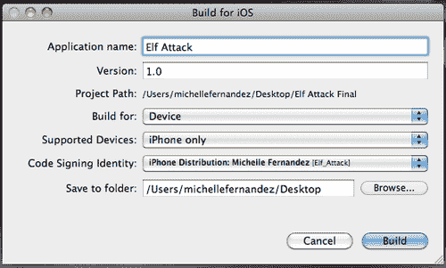

1.  当构建编译完成后，您将看到一个显示您的应用程序已准备好分发的界面。选择**上传到 App Store**按钮。操作时间——构建您的应用程序并将其上传到应用加载器

1.  当**欢迎使用应用加载器**窗口弹出时，使用您的 iTunes Connect 信息登录。然后您将被带到另一个窗口，您可以选择**交付您的应用程序**或**创建新包**。选择**交付您的应用程序**。下一个窗口显示一个下拉菜单；选择您将要提交的应用程序的名称，然后点击**下一步**按钮。操作时间——构建您的应用程序并将其上传到应用加载器

1.  在 iTunes Connect 中找到的可用应用程序信息将显示出来。验证其正确性，然后点击**选择**按钮。操作时间——构建您的应用程序并将其上传到应用加载器

1.  点击省略号 (...) 按钮在提交前替换当前文件，然后选择**发送**按钮。操作时间——构建您的应用程序并将其上传到应用加载器

1.  应用加载器将开始提交您的应用程序二进制文件到 App Store。操作时间——构建您的应用程序并将其上传到应用加载器

1.  如果二进制文件上传成功，你将收到确认你的二进制文件已交付到 App Store 的消息。当你的应用程序进入审核、准备销售、上线等状态时，你可以在 iTunes Connect 中检查应用程序的状态。每当应用程序状态发生变化时，都会向你发送一封电子邮件。就是这样！这就是你提交应用程序到 App Store 的方法！！行动时间——构建你的应用程序并将其上传到应用程序加载器

1.  当你的应用程序在 App Store 中被审核并批准后，你可以进入 iTunes Connect 并调整可用日期，如果它在你建议的发布日期之前被批准。你的应用程序将立即在 App Store 中上线。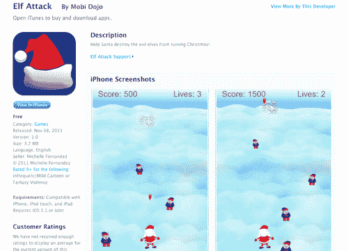

## 刚才发生了什么？

在构建你的应用程序时，在**代码签名标识**下，请选择为你创建的发布构建的发布配置文件。在构建编译完成后，你可以启动应用程序加载器。确保你已经安装了 Xcode。选择**上传到 App Store**按钮后，应用程序加载器将立即启动。

当你在应用程序加载器中时，一旦你将二进制信息加载到 iTunes Connect，你的应用程序名称就会显示在下拉菜单中。当你交付你的应用程序时，从你保存文件的位置选择已压缩的二进制文件。

文件上传后，将出现一个确认窗口，并且会向分配给你的 Apple 账户的 Apple ID 发送一封电子邮件。你的二进制文件将在 iTunes Connect 中显示为**等待审核**状态。

经过所有这些步骤，你现在正式知道如何将 iOS 应用程序提交到 App Store。太棒了！

## 成为英雄——制作通用的 iOS 构建

如果你只为 iPhone 开发了应用程序，尝试将其实现为 iPad 版本，这样它就可以成为通用构建。使用你从上一章学到的知识，利用`build.settings`和`config.lua`调整你的应用程序大小。同时，别忘了你的应用程序图标所需的内容。这就像一石二鸟！

# Google Play 商店

Google Play 商店是一个发布平台，帮助你向全球用户宣传、销售和分发你的 Android 应用程序。

要注册为 Google Play 开发者并开始发布，请访问 Google Play Android 开发者控制台网站发布者网站。你可以在以下 URL 注册账户：[`play.google.com/apps/publish/`](http://https://play.google.com/apps/publish/)。

## 创建启动器图标

启动器图标是一种代表您应用的图形。启动器图标由应用使用，并出现在用户的首页上。启动器图标也可以用来表示进入您应用的快捷方式。这些图标与为 iOS 应用创建的图标类似。以下是需要满足的启动器图标要求，它们也需要是 32 位的`.png`格式：

+   `Icon-ldpi.png`—36x36 像素图像。需要达到 120 dpi。用于低密度屏幕。

+   `Icon-mdpi.png`—48x48 像素图像。需要达到 160 dpi。用于中等密度屏幕。

+   `Icon-hdpi.png`—72x72 像素图像。需要达到 240 dpi。用于高密度屏幕。

+   `Icon-xhdpi.png`—96x96 像素图像。需要达到 320 dpi。用于超高密度屏幕。

启动器图标需要在您构建应用时放置在您的项目文件夹中。Google Play Store 还要求您有一个 512 x 512 像素的图标版本，该版本将在构建上传时在开发者控制台中上传。有关启动器图标的更多信息，请访问：[`developer.android.com/guide/practices/ui_guidelines/icon_design_launcher.html`](http://developer.android.com/guide/practices/ui_guidelines/icon_design_launcher.html)。

# 行动时间——为 Google Play Store 签名您的应用

Android 系统要求所有已安装的应用都必须使用由应用开发者持有的私钥签名的证书进行数字签名。Android 系统使用证书作为识别应用作者和建立应用之间信任关系的手段。证书不用于控制用户可以安装哪些应用。证书不需要由证书颁发机构签名；它可以自签名。证书可以在 Mac 或 Windows 系统上签名。

1.  在 Mac 上，转到**应用程序 | 工具 | 终端**。在 Windows 上，转到**开始菜单 | 所有程序 | 附件 | 命令提示符**。使用 Keytool 命令，输入以下行并按*Enter:* 

    ```java
    keytool -genkey -v -keystore my-release-key.keystore -alias aliasname -keyalg RSA -validity 999999 

    ```

    ### 小贴士

    将`my-release-key`替换为您的应用名称。此外，如果您添加超过 999999（即额外的 9）的任何额外数字，应用将显示为损坏。

    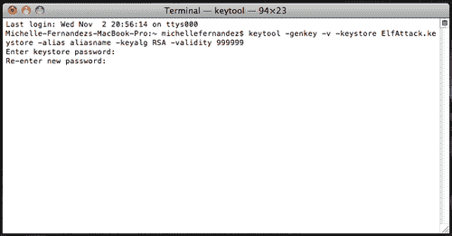

1.  您将被要求输入密钥库密码。从这里开始，您将创建一个唯一的密码，这是作为开发者您必须想出来的。您将需要重新输入它。随后将询问的其他问题涉及您的开发者/公司信息、位置等。填写所有信息。一旦您完成了所需信息，您就生成了一个用于签名 Android 构建的密钥。有关应用签名的更多信息，请访问：[`developer.android.com/guide/publishing/app-signing.html`](http://developer.android.com/guide/publishing/app-signing.html)。

1.  启动 Corona 模拟器，导航到应用程序项目文件夹，并运行它。转到 Corona 模拟器的菜单栏，选择 **文件 | 构建 | Android**。填写与您的应用程序相关的 **应用程序名称** 和 **版本** 信息。使用 Java 方案指定一个 **包** 名称。在 **密钥库** 下，选择 **浏览** 按钮以定位您的已签名私钥，然后从下拉菜单中选择您为发布构建生成的密钥。您将被提示输入用于在 Keytool 命令中签名应用程序的密钥库密码。在 **密钥别名** 下，从下拉菜单中选择 **aliasname**，并在提示时输入您的密码。选择 **浏览** 按钮以选择应用程序构建的位置。完成后，选择 **构建** 按钮。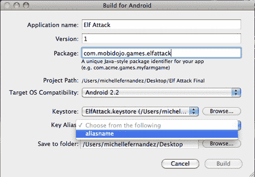

## 刚才发生了什么？

Keytool 会生成一个名为 `my-release-key.keystore` 的文件作为密钥库。密钥库和密钥由您输入的密码保护。密钥库包含一个密钥，有效期为 999999 天。别名是一个您稍后将要使用的名称，用于在签名应用程序时引用此密钥库。

您的密钥库密码是在您在 Corona 中构建应用程序时创建并必须记住的。如果您想为别名名称使用不同的密码，将会有一个选项。当您在终端或命令提示符中时，您可以按 *Enter* 使用相同的密码。

当您在 Corona 中创建构建时，请确保您的版本号是一个没有特殊字符的整数。此外，您还必须确保您的 `build.settings` 包含 `versionCode`。这将与您的版本号相同。有关更多信息，请参阅 第九章，*处理多个设备和网络应用程序*。

您构建中的 Java 方案是您域名的反向，后面附加了您的产品/公司名称以及您的应用程序名称。例如，`com.mycompany.games.mygame`。

当您使用私有密钥构建应用程序并选择了一个别名名称后，`.apk` 文件将被创建并准备好在 Google Play 商店上发布。

# 行动时间——将应用提交到 Google Play 商店

我们将使用开发者控制台。这是您创建开发者配置文件以发布到 Google Play 商店的地方。

1.  一旦您登录到开发者控制台，点击显示 **上传应用程序** 的按钮。您将看到一个弹出窗口，允许您上传您的构建。点击 **选择文件** 按钮，找到您的应用程序的 `.apk` 文件。选择 **上传** 按钮。当您的 `.apk` 文件上传后，点击 **保存** 按钮。最后，点击 **关闭** 按钮。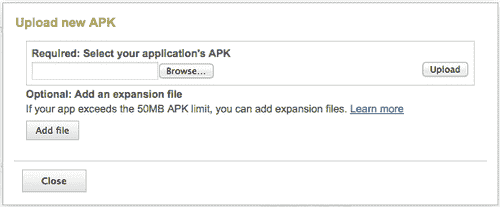

1.  选择**APK 文件**选项卡，然后按屏幕右侧的**激活**链接激活 `.apk` 文件。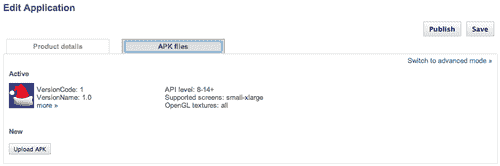

1.  现在，选择**产品详情**选项卡。在**上传资源**部分，您需要从您的应用程序中提供一些截图和 512 x 512 像素的您的应用程序图标版本。如果您愿意，还可以包括可选的图形和视频。滚动到页面底部的**列表详情**部分。填写有关您的应用程序的详细信息，包括应用程序**标题、描述、应用程序类型**和**类别**。下一部分是**发布选项**。勾选与您的应用程序相关的信息。定价默认为**免费**。如果您想制作付费版本，您必须设置 Google Checkout 的商家账户。下一部分是**联系信息**。填写必要的信息。最后一部分是**同意**。仔细了解发布到 Google Play 商店的必要条件，并勾选复选框。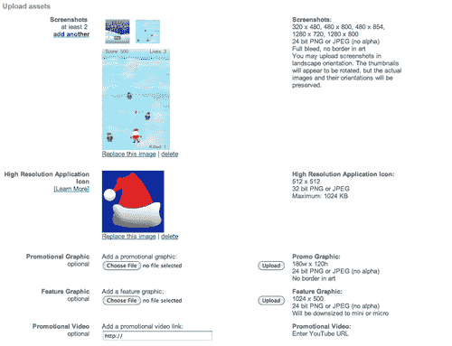

1.  一旦您在**产品详情**选项卡中填写了详细信息，请点击**保存**按钮，这样您所有的 APK 信息就会保存在开发者控制台中。

1.  最后，点击**发布**按钮。您将被带到开发者控制台的主屏幕，您的应用程序状态将显示为**已发布**。恭喜您，您已将应用程序发布到 Google Play 商店！！操作时间——提交应用至 Google Play 商店

## 刚才发生了什么？

开发者控制台页面显示了一个简单的分步过程，说明如何发布您的 `.apk` 文件。当您在**APK 文件**选项卡中时，选择**激活**链接将允许控制台检查构建与哪些设备兼容。

发布应用程序所需的资源显示了每个部分旁边可接受的分辨率和图像类型。包括促销图形、特色图形和促销视频是可选的，但最好为您的应用程序页面添加足够的内容。这将使其对潜在客户更具吸引力。

完成与您的应用程序相关的所有信息后，请确保保存您的进度。一旦您点击**发布**按钮，您就完成了！您应该能够在发布后的一小时内看到您的应用程序在 Google Play 商店中。

## 英雄尝试——添加更多促销内容

Google Play 商店为您提供了许多推广应用程序的选项。您可以从开发者控制台添加额外的资源。尝试以下操作：

+   添加一个促销图形。

+   添加一个特色图形。

+   创建您应用程序的促销视频。像 YouTube 这样的网站是分享游戏预告片的好方法。

## 快速问答——发布应用程序

1.  在创建 iOS 分发配置文件时，您需要使用哪种分发方式？

    +   a. 开发

    +   b. App Store

    +   c. 临时性的

    +   d. 以上都不是

1.  你从哪里查询已提交的 iOS 应用程序的状态？

    +   a. iTunes Connect

    +   b. iOS 配置文件门户

    +   c. 应用程序加载器

    +   d. 以上都不是

1.  构建适用于 Google Play 商店的应用程序需要什么？

    +   a. 在 Keytool 命令下创建私钥

    +   b. 使用调试密钥签名你的应用程序

    +   c. 使用你的私钥签名你的应用程序

    +   d. a 和 c

# 摘要

通过本章，我们取得了巨大的里程碑。我们不仅知道了如何提交到一个主要的应用市场，而且两个！将你的应用程序发布到 App Store 和 Google Play Store 最终并不是一个可怕的地方。

我们已经涵盖了以下主题：

+   内存效率的重要性

+   为分发到 App Store 创建配置文件

+   管理 iTunes Connect

+   将二进制文件提交到应用程序加载器

+   为 Android 应用程序签名发布版本

+   将`.apk`文件提交到 Google Play 商店

在下一章和最后一章中，我们将讨论将应用内购买应用到你的应用程序的所有内容。我们将深入研究 Corona 的商店模块，学习如何进行购买、交易等！你不想错过这个激动人心的章节。
