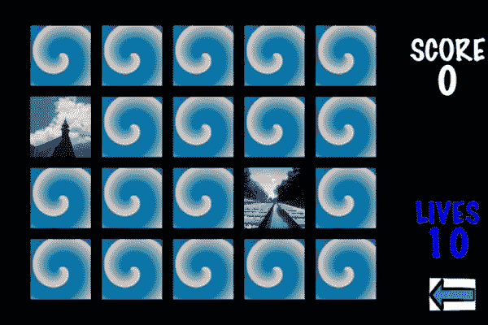
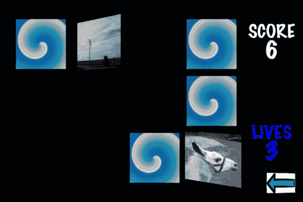

# 第一章 感谢记忆游戏

在儿童时期，我们通过玩游戏学习了许多有用的技能。我们学会了协调、策略和记忆技能。这些都是我们一生中都会拥有的技能。一个完美的开始就是传统的童年游戏。

在本章中，我们涵盖了以下主题：

+   场景与图层

+   精灵和精灵图集

+   加载顺序文件

+   随机生成游戏区域

+   触摸处理

+   使用动作

+   基本匹配策略

+   得分

+   跟踪生命值

+   游戏结束条件

+   SimpleSoundEngine

# 项目是...

我们将从经典的**记忆游戏**开始。不仅仅是任何记忆游戏——*就是*那个让孩子们到处都感到快乐和挫折的记忆游戏。如果你从未接触过这个游戏（真的吗？），游戏玩法很简单。游戏区域是一组带有漂亮图片的瓷砖，背面是通用图像。你翻转两张瓷砖来看是否匹配。如果不匹配，你将它们翻回。挑选另一对瓷砖，看看它们是否匹配。重复这个过程，直到所有瓷砖都匹配。让我们看看完成的游戏：



我们的记忆游戏需要足够灵活，以便允许游戏中有不同的技能水平。我们将通过改变棋盘上的记忆瓷砖数量来创建不同的技能水平。如果有四块瓷砖（每种设计各两块），那就相当简单。创建一个 4 x 5 的瓷砖网格要更具挑战性（20 块瓷砖，10 种设计）。我们将构建一个单一的项目，它可以动态地处理这些变化。

我们的游戏在两个方面将与传统版本略有不同：它仅限单人游戏，我们将添加一种输掉游戏的方式，使其更具趣味性。我们将在稍后详细介绍这一点。

### 注意

在本章中，我们将详细介绍几个基础的设计方法，这些方法将在整本书中使用。为了避免代码重复，后续章节将省略我们在这里覆盖的一些样板细节。

# 让我们构建一个菜单

我们将从默认的 cocos2d v2.x - cocos2d iOS 模板开始构建项目。一旦项目创建完成，我们首先删除`HelloWorldLayer.h/.m`文件。`HelloWorld`是学习代码结构的好起点，但我们实际上并不需要（或需要）这个样板类来做任何事情（别忘了在`IntroLayer.m`类的顶部删除`#import "HelloWorldLayer.h"`）。现在我们将保留`IntroLayer.m`的`makeTransition`类底部的引用。

在 cocos2d 框架中最常用的类之一可能是`CCLayer`。`CCLayer`是（通常）在屏幕上表示的对象，并作为我们游戏的“画布”。我们以`CCLayer`对象为基础，然后创建它的子类来添加我们自己的游戏代码。

另一个经常使用的类是 `CCScene` 类。可以将 `CCScene` 类视为 `CCLayer` 对象的“容器”。`CCScene` 对象很少用于比添加 `CCLayer`s 作为子对象更多的事情。一个很好的比较是计算机时代之前的卡通制作。每个场景都是由堆叠的透明塑料片组成的，每张塑料片上都有场景的不同部分：每个主要角色都有自己的层，另一个用于背景，另一个用于场景的每个不同元素。这些塑料片相当于 `CCLayer` 对象，而 `CCScene` 类就是这些堆叠起来在屏幕上显示的地方。

我们将从基本的 `CCLayer` 子类 `MTMenuLayer` 开始。我们创建一个标题和一个基本的菜单。我们需要注意我们如何从菜单调用 `MTPlayfieldScene` 类（我们的主要游戏屏幕）。 

**文件名：** `MTMenuLayer.m`

```swift
-(void) startGameEasy {
    [[CCDirector sharedDirector] replaceScene:
     [MTPlayfieldScene sceneWithRows:2 andColumns:2]];
}

-(void) startGameMedium {
    [[CCDirector sharedDirector] replaceScene:
     [MTPlayfieldScene sceneWithRows:3 andColumns:4]];
}

-(void) startGameHard {
    [[CCDirector sharedDirector] replaceScene:
     [MTPlayfieldScene sceneWithRows:4 andColumns:5]];
}
```

您会注意到，`startGameXXX` 方法调用的是场景的自定义构造函数，而不是常用的 `[MyLayer scene]`。我们将在稍后解释 `sceneWithRows:andColumns:` 方法。

本书将不会在文本中包含完整的代码。对于讨论不感兴趣的部分将被省略。

### 小贴士

**下载示例代码**

您可以从您在 [`www.packtpub.com`](http://www.packtpub.com) 的账户中下载您购买的所有 Packt 书籍的示例代码文件。如果您在其他地方购买了这本书，您可以访问 [`www.packtpub.com/support`](http://www.packtpub.com/support) 并注册以获取文件

直接发送到您的邮箱。

## 场景在哪里？

哦，您注意到了吗？cocos2d 模板中包含一个在层（在 `HelloWorldLayer` 中）内部的类方法 `+(id)` scene。虽然这种方法可行，但随着我们构建更复杂的场景和多个层，它可能会导致混淆。当您调用一个接受 `CCScene` 对象作为参数的方法时，使用基于模板的方法可能看起来有些奇怪，而您传递的是一个像 `[MySpecialLayer scene]` 这样的值。那么您是在引用 `CCScene` 对象还是 `CCLayer` 对象呢？在这个例子中，您传递一个像 `[MySpecialScene scene]` 这样的值在逻辑上会更有意义。当请求 `CCScene` 对象时传递场景对象会更清晰。`CCScene` 对象是一个更高级的容器，它被设计用来包含 `CCLayer` 对象，所以为什么不保持它作为一个独立的类呢？让我们继续检查我们的方法：

**文件名：** `MTMenuScene.h`

```swift
#import <Foundation/Foundation.h>
#import "cocos2d.h"
#import "MTMenuLayer.h"

@interface MTMenuScene : CCScene {
}

+(id)scene;

@end
```

**文件名：** `MTMenuScene.m`

```swift
#import "MTMenuScene.h"

@implementation MTMenuScene

+(id)scene {
    return( [ [ [ self alloc ] init ] autorelease ] );
}

-(id) init
{
  if( (self=[super init])) {
        MTMenuLayer *layer = [MTMenuLayer node];
        [self addChild: layer];
  }
  return self;
}

@end
```

在这里，我们遵循了场景方法返回一个 `autoreleased` 对象的惯例。我们不会在它上面显式调用 `alloc`（当我们实例化类时），所以我们不“拥有”这个对象。

现在，我们可以回到 `IntroLayer.m` 文件，并将 `makeTransition` 方法更改为指向我们新的菜单场景：

```swift
-(void) makeTransition:(ccTime)dt
{
  [[CCDirector sharedDirector] replaceScene:
     [CCTransitionFade transitionWithDuration:1.0
        scene:[MTMenuScene scene] withColor:ccWHITE]];
} 
```

我们还需要确保在 `AppDelegate.m` 文件中导入了 `MTMenuScene.h` 文件。现在我们的菜单已经完成，我们可以专注于游戏本身。

### 注意

重要的是要注意，这种使用 `CCScene` 作为结构中单独类的做法并不被普遍采用。许多人选择遵循与模板相同的方法。两种方法都可以工作，但我们属于“阵营”，强烈认为这些应该保持分离，就像我们在这里所做的那样。两种方法都是完全有效的编码实践，你可以自由地以其他方式组织你的代码。

## 构建游戏区域

接下来，我们将添加一个 `CCScene` 类来驱动我们的主游戏屏幕，这里命名为 `MTPlayfieldScene`。这部分代码与之前定义的 `MTMenuScene` 类非常相似，只是在这里我们定义了一个方法 `sceneWithRows:andColumns:` 而不是之前代码中使用的更简单的场景方法。

**文件名:** `MTPlayfieldScene.m`

```swift
+(id) sceneWithRows:(NSInteger)numRows
         andColumns:(NSInteger)numCols {
  return [[[self alloc] sceneWithRows:numRows
                             andColumns:numCols]
                                    autorelease];
}

-(id) sceneWithRows:(NSInteger)numRows
         andColumns:(NSInteger)numCols {

  if( (self=[super init])) {
        // Create an instance of the MTPlayfieldLayer
        MTPlayfieldLayer *layer = [MTPlayfieldLayer
                                   layerWithRows:numRows
                                   andColumns:numCols];
        [self addChild: layer];
  }
  return self;
} 
```

这里是我们之前在 `MTMenuLayer` 中引用的定制 `sceneWithRows:andColumns:` 方法。类方法处理 `alloc` 和 `init` 方法，并将其标识为自动释放的对象，因此我们不必担心稍后释放它。`sceneWithRows:andColumns:` 方法直接将行和列变量传递给 `MTPlayfieldLayer` 类的定制 `init` 方法 `layerWithRows:andColumns:`。这使得我们可以通过场景将请求的值传递到层，在那里我们可以稍后使用这些值。

# 我们需要精灵

在我们开始构建游戏区域之前，我们需要一些用于游戏中的图形。我们的设计要求使用正方形图像作为瓦片，以及一个用于瓦片共同背面的图像。因为我们希望它们能够适应不同的尺寸（针对不同的技能等级），我们需要足够大的图像，以便在最简单的技能等级（即两个乘以两个的网格）上看起来很好。除非你的目标是“像素块”的外观，否则你永远不希望放大图像。根据屏幕大小，我们希望瓦片的宽度为 150 点，高度为 150 点。由于我们希望在 iPhone（和 iPod Touch）Retina 显示屏设备上使用更好的图形，我们的-hd 图形版本需要是 300 像素乘以 300 像素。

### 小贴士

点是有效使用 cocos2d 的最简单方式。在较旧的 iOS 设备上，一个点等于屏幕上的一个像素。在 Retina 显示屏设备上，一个点等于 *两个* 像素，它们在屏幕上占据与非 Retina 屏幕上的一个像素相同的物理空间。从实用角度来看，这意味着一旦你提供了-hd 图形，cocos2d 将把 Retina 和非 Retina 布局视为相同，无需额外的布局代码。你 *可以* 如果真的想的话用像素来做事情，但我们不建议养成这种习惯。

对于这款游戏，我们将使用各种照片。为了达到正确的宽高比和尺寸，需要进行一些调整。这是利用 Mac OS X 中的 Automator 的一个绝佳地方。本章源代码中有一个名为`Helpers`的文件夹，里面有一个 Automator 脚本。当你运行它时，它会提示选择一个图像文件夹。一旦选择，它将在你的桌面上创建一个名为`ch1_tiles`的文件夹，并包含按顺序编号的图像（即`tile1.png`、`tile2.png`等等），每个图像的尺寸正好是 300 像素×300 像素。

需要另外两张图片来构建游戏：`backButton.png`将用于导航，而`tileback.png`将作为翻转时瓷砖背面的图像。

## 构建精灵图集

**精灵图集**是任何有效的 cocos2d 游戏的基础之一。将所有精灵编译到精灵图集中可以让 cocos2d 加载更少的文件，同时赋予你使用批处理节点的功能。在这里，我们不会深入探讨`CCSpriteBatchNode`类的“内部细节”，只从高层次上简要说明。当你将精灵图集加载到批处理节点中时，它充当所有图集上精灵的“父节点”。当你使用批处理节点时，绘制屏幕上精灵的调用会被批量处理，这可以提升性能。这种批量绘制允许系统以绘制一个精灵的相同效率（和速度）绘制 100 个精灵。简而言之，批处理节点允许你在不降低游戏速度的情况下在屏幕上绘制更多内容。

制作精灵图集需要两个文件：纹理（图像文件）和 plist 文件。我们甚至不想去尝试手动构建精灵图集。幸运的是，有许多专为这个目的构建的非常好用的工具。在 cocos2d 社区中，最成熟的精灵图集工具是 TexturePacker ([`www.texturepacker.com`](http://www.texturepacker.com)) 和 Zwoptex ([`zwopple.com/zwoptex`](http://zwopple.com/zwoptex))，尽管也有许多新应用可供选择。你使用哪个工具完全取决于个人喜好。无论使用哪种工具，你都需要创建图像的标准版和-hd 版本。（大多数当前工具都内置了辅助选项以简化此过程。）

无论使用哪种工具，期望的结果是四个文件：`memorysheet.png`、`memorysheet.plist`、`memorysheet-hd.png`和`memorysheet-hd.plist`。-hd 文件包含适用于 iPhone Retina 显示屏的 300 像素×300 像素的图像，而其他文件包含适用于非 Retina iPhone 显示屏的 150 像素×150 像素的图像。我们还将在两个精灵图集中包含适当尺寸的`backButton.png`和`tileback.png`文件。让我们看看我们将用于这款游戏的最终精灵图集：


# 进入游戏场

现在我们已经准备好进入游戏区域层本身。我们知道我们需要跟踪游戏屏幕的大小、每个瓷砖的大小、游戏板的大小以及当瓷砖以网格形式排列时它们之间的间距。

## 创建游戏区域头文件

在头文件中，我们还声明了类方法 `initWithRows:andColumns:`，这是我们之前在 `MTPlayfieldScene` 类中调用的。

**文件名:** `MTPlayfieldLayer.h`

```swift
#import <Foundation/Foundation.h>
#import "cocos2d.h"
#import "MTMemoryTile.h"
#import "SimpleAudioEngine.h"
#import "MTMenuScene.h"

@interface MTPlayfieldLayer : CCLayer {
    CGSize size; // The window size from CCDirector

    CCSpriteBatchNode *memorysheet;

    CGSize tileSize; // Size (in points) of the tiles

    NSMutableArray *tilesAvailable;
    NSMutableArray *tilesInPlay;
    NSMutableArray *tilesSelected; 

    CCSprite *backButton;

    NSInteger maxTiles;

    float boardWidth; // Max width of the game board
    float boardHeight; // Max height of the game board

    NSInteger boardRows; // Total rows in the grid
    NSInteger boardColumns; // Total columns in the grid

    NSInteger boardOffsetX; // Offset from the left
    NSInteger boardOffsetY; // Offset from the bottom
    NSInteger padWidth; // Space between tiles
    NSInteger padHeight; // Space between tiles

    NSInteger playerScore; // Current score value
    CCLabelTTF *playerScoreDisplay; // Score label

    NSInteger livesRemaining; // Lives value
    CCLabelTTF *livesRemainingDisplay; // Lives label
    BOOL isGameOver;
}

+(id) layerWithRows:(NSInteger)numRows
         andColumns:(NSInteger)numCols;

@end
```

在头文件中需要指出的一点是 `CGSize size` 变量。这是一个方便的变量，我们用它来避免重复输入。名称 `size` 是 `winSize` 的缩写，这是一个 `CCDirector` 类将为您提供用于标识屏幕大小的值，单位为点。每次使用时，您都可以从 `CCDirector` 中读取该值，但这样做会使您的代码行稍微长一些。我们的方法将正常工作，只要我们不支持同一层中的纵向和横向模式。如果我们允许两种方向，那么我们缓存在 `size` 变量中的值将是不正确的。由于我们的应用程序只允许 `LandscapeLeft` 和 `LandscapeRight` 方向，两种方向的大小是相同的，因此 `size` 将在我们的游戏中保持稳定。

## 创建游戏区域层

在 `MTPlayfieldLayer.m` 文件中，我们实现了自定义的 `layerWithRows:andColumns:` 和 `initWithRows:andColumns:` 方法，具体如下：

**文件名:** `MTPlayfieldLayer.m`

```swift
+(id) layerWithRows:(NSInteger)numRows
         andColumns:(NSInteger)numCols {
  return [[[self alloc] initWithRows:numRows
                    andColumns:numCols] autorelease];
}

-(id) initWithRows:(NSInteger)numRows
        andColumns:(NSInteger)numCols {
    if (self == [super init]) {

        self.isTouchEnabled = YES;

        // Get the window size from the CCDirector
        size = [[CCDirector sharedDirector] winSize];

        // Preload the sound effects
        [self preloadEffects];

        // make sure we've loaded the spritesheets
        [[CCSpriteFrameCache sharedSpriteFrameCache]
         addSpriteFramesWithFile:@"memorysheet.plist"];
        memorysheet = [CCSpriteBatchNode
                batchNodeWithFile:@"memorysheet.png"];

        // Add the batch node to the layer
        [self addChild:memorysheet];

        // Add the back Button to the bottom right corner
        backButton = [CCSprite spriteWithSpriteFrameName:
                      @"backbutton.png"];
        [backButton setAnchorPoint:ccp(1,0)];
        [backButton setPosition:ccp(size.width - 10, 10)];
        [memorysheet addChild:backButton];

        // Maximum size of the actual playing field
        boardWidth = 400;
        boardHeight = 320;

        // Set the board rows and columns
        boardRows = numRows;
        boardColumns = numCols;

        // If the total number of card positions is
        // not even, remove one row
        // This against an impossible board
        if ( (boardRows * boardColumns) % 2 ) {
            boardRows--;
        }

        // Set the number of images to choose from
        // We need 2 of each, so we halve the total tiles
        maxTiles = (boardRows * boardColumns) / 2;
        // Set up the padding between the tiles
        padWidth = 10;
        padHeight = 10;

        // We set the desired tile size
        float tileWidth = ((boardWidth -
                            (boardColumns * padWidth))
                           / boardColumns) - padWidth;
        float tileHeight = ((boardHeight -
                             (boardRows * padHeight))
                            / boardRows) - padHeight;

        // We force the tiles to be square
        if (tileWidth > tileHeight) {
            tileWidth = tileHeight;
        } else {
            tileHeight = tileWidth;
        }

        // Store the tileSize so we can use it later
        tileSize = CGSizeMake(tileWidth, tileHeight);

        // Set the offset from the edge
        boardOffsetX = (boardWidth - ((tileSize.width +
                        padWidth) * boardColumns)) / 2;
        boardOffsetY = (boardHeight - ((tileSize.height+
                        padHeight) * boardRows)) / 2;

        // Set the score to zero
        playerScore = 0;

        // Initialize the arrays

        // Populate the tilesAvailable array
        [self acquireMemoryTiles];

        // Generate the actual playfield on-screen
        [self generateTileGrid];

        // Calculate the number of lives left
        [self calculateLivesRemaining];

        // We create the score and lives display here
        [self generateScoreAndLivesDisplay];
    }
  return self;
}
```

类方法 `layerWithRows:andColumns:` 是我们在之前的 `MTPlayfieldScene` 类中看到的那个方法。类方法调用 `alloc` 和 `initWithRows:andColumns:` 方法，然后通过一个 `autorelease` 调用来包装所有这些操作，因为它是一个方便的方法。实例方法 `initWithRows:AndColumns:`（由类方法调用）设置了一些在头文件中建立的变量，包括将传递的 `numRows` 和 `numColumns` 参数分配到实例变量 `boardRows` 和 `boardColumns` 中。

记忆游戏传统上以方形或矩形布局进行。它们还需要游戏中有偶数个瓷砖，因为每种类型的瓷砖将有两个。由于我们允许行数和列数的灵活参数，某些组合将无法工作。请求五行五列意味着我们将有 25 个瓷砖在板上，这是不可能获胜的。为了保护我们的游戏不受这些无效值的影响，我们将 `boardRows` 乘以 `boardColumns`。如果结果是奇数（使用 % 2 检查），则从游戏中移除一个 `boardRow`。从先前的例子中，如果我们请求一个五乘五的板（结果为 25 个瓷砖），代码将将其更改为四乘五的网格，该网格有 20 个瓷砖。

我们还在这里设置了`tileSize`值，基于瓷砖的均匀间距，以及我们将在瓷砖之间使用的额外填充空间。因为我们需要正方形瓷砖，所以还有一个额外的检查来强制瓷砖成为正方形，即使源图像不是正方形也是如此。这将扭曲图像，但不会破坏游戏机制。此外，`boardOffsetX`和`boardOffsetY`变量只是确保棋盘将在可用的棋盘空间中居中。

# 游戏流程

我们需要在游戏中使用几个数组来帮助跟踪瓷砖。第一个，`tilesAvailable`，将用于加载和构建游戏区域。第二个，`tilesInPlay`，将包含所有尚未匹配的瓷砖。第三个，`tilesSelected`，将用于匹配检测方法。由于我们处理的瓷砖数量相对较少，使用这种多数组结构将非常适合我们的目的，而不会引起任何性能问题。现在让我们添加数组的代码：

**文件名：** `MTPlayfieldLayer.h` (已在变量声明中)

```swift
    NSMutableArray *tilesAvailable;
    NSMutableArray *tilesInPlay;
    NSMutableArray *tilesSelected; 
```

**文件名：** `MTPlayfieldLayer.m` (`initWithRows`，在“初始化数组”之后添加)

```swift
        tilesAvailable = [[NSMutableArray alloc]
                          initWithCapacity:maxTiles];
        tilesInPlay = [[NSMutableArray alloc]
                       initWithCapacity:maxTiles];
        tilesSelected = [[NSMutableArray alloc]
                         initWithCapacity:2]; MTPlayfieldLayer.m:
- (void) dealloc
{ 
    // Release of the arrays
    [tilesAvailable release];
    [tilesInPlay release];
    [tilesSelected release];

  [super dealloc];
 }
```

在这里，我们在头文件中作为变量建立了三个`NSMutableArray`数组，在`initWithRows:andColumns:`方法中实例化了它们，并将它们添加到一个新的`dealloc`方法中。`dealloc`方法释放了这三个数组。`[super dealloc]`调用始终是必需的，并且它应该是`dealloc`方法的最后一行。这个对`super dealloc`的调用告诉当前类的父类执行它需要做的任何清理工作。这一点很重要，因为我们的当前类不需要担心由父`CCLayer`类执行的任何清理细节。

# 瓷砖堆

现在我们需要定义瓷砖本身的类。我们需要跟踪一些瓷砖变量，我们将使用`MTMemoryTile`类来处理一些触摸检测和瓷砖动画。

## 记忆瓷砖类

为了这个目的，我们将继承`CCSprite`。这将允许我们仍然将其视为`CCSprite`，但我们将通过其他方法和属性来增强它，这些方法和属性是针对瓷砖的特定功能。

**文件名：** `MTMemoryTile.h`

```swift
#import <Foundation/Foundation.h>
#import "cocos2d.h"
#import "SimpleAudioEngine.h"

// MemoryTile is a subclass of CCSprite
@interface MTMemoryTile : CCSprite {
    NSInteger _tileRow;
    NSInteger _tileColumn;

    NSString *_faceSpriteName;

    BOOL isFaceUp;
}

@property (nonatomic, assign) NSInteger tileRow;
@property (nonatomic, assign) NSInteger tileColumn;
@property (nonatomic, assign) BOOL isFaceUp;
@property (nonatomic, retain) NSString *faceSpriteName;

// Exposed methods to interact with the tile
-(void) showFace;
-(void) showBack;
-(void) flipTile;
-(BOOL) containsTouchLocation:(CGPoint)pos;

@end 
```

在这里，我们使用下划线前缀来声明变量，但我们将相应的属性设置为没有下划线前缀。这通常是为了避免意外直接设置变量值，从而绕过属性的 getter 和 setter 方法。这种拆分命名在`.m`文件中的`@synthesize`语句中最终确定，其中属性将被设置为变量。这些语句将具有基本格式：

```swift
@synthesize propertyName = _variableName;
```

我们在这个类中提前规划，包括三个我们将用于瓷砖动画的方法的头文件：`flipTile`、`showFace`和`showBack`。这个类将负责处理自己的动画。

我们游戏中的所有动画都将使用 cocos2d 动作完成。动作本质上是一些可以“运行”在大多数类型的 cocos2d 对象上（例如，`CCLayer`，`CCSprite`等）的变换。框架中定义了相当多的不同动作。其中一些最常用的动作包括`CCMoveTo`（移动对象），`CCScaleTo`（改变对象的缩放），以及`CCCallFunc`（调用另一个方法）。动作是一个“点火后忘记”的功能。一旦你安排了一个动作，除非你明确地更改动作（例如调用`stopAllActions`），否则动作将继续直到完成。这通过在`CCSequence`动作中“包装”几个动作进一步扩展，这允许你将几个动作链接在一起，按照指定的顺序运行。

我们将在整本书中广泛使用`CCSequence`“链接”。动作可以在大多数 cocos2d 对象上运行，但它们最常见的是通过`runAction:`方法在`CCSprite`和`CCLayer`对象上调用。

**文件名：** `MTMemoryTile.m`

```swift
@implementation MTMemoryTile

@synthesize tileRow = _tileRow;
@synthesize tileColumn = _tileColumn;
@synthesize faceSpriteName = _faceSpriteName;
@synthesize isFaceUp;

-(void) dealloc {
    // We set this to nil to let the string go away
    self.faceSpriteName = nil;

    [super dealloc];
}

-(void) showFace {
    // Instantly swap the texture used for this tile
    // to the faceSpriteName 
    [self setDisplayFrame:[[CCSpriteFrameCache
                            sharedSpriteFrameCache]
                spriteFrameByName:self.faceSpriteName]];

    self.isFaceUp = YES;
}

-(void) showBack {
    // Instantly swap the texture to the back image
    [self setDisplayFrame:[[CCSpriteFrameCache
                            sharedSpriteFrameCache]
                spriteFrameByName:@"tileback.png"]];

    self.isFaceUp = NO;
}

-(void) changeTile {
    // This is called in the middle of the flipTile
    // method to change the tile image while the tile is
    // "on edge", so the player doesn't see the switch
    if (isFaceUp) {
        [self showBack];
    } else {
        [self showFace];
    }
}

-(void) flipTile {
    // This method uses the CCOrbitCamera to spin the
    // view of this sprite so we simulate a tile flip

    // Duration is how long the total flip will last
    float duration = 0.25f;

    CCOrbitCamera *rotateToEdge = [CCOrbitCamera
                actionWithDuration:duration/2 radius:1
                deltaRadius:0 angleZ:0 deltaAngleZ:90
                angleX:0 deltaAngleX:0];
    CCOrbitCamera *rotateFlat = [CCOrbitCamera
                actionWithDuration:duration/2 radius:1
                deltaRadius:0 angleZ:270 deltaAngleZ:90
                angleX:0 deltaAngleX:0];
    [self runAction:[CCSequence actions: rotateToEdge,
                      [CCCallFunc actionWithTarget:self
                      selector:@selector(changeTile)],
                      rotateFlat, nil]];

    // Play the sound effect for flipping
    [[SimpleAudioEngine sharedEngine] playEffect:
                                    SND_TILE_FLIP];
}

- (BOOL)containsTouchLocation:(CGPoint)pos
{
    // This is called from the CCLayer to let the object
    // answer if it was touched or not
  return CGRectContainsPoint(self.boundingBox, pos);
}
@end
```

我们将不会在这个类中使用触摸处理程序，因为我们无论如何都需要在主层中处理匹配逻辑。相反，我们公开`containsTouchLocation`方法，以便层可以“询问”单个瓦片是否被触摸。这使用瓦片的`boundingBox`，这是 cocos2d 中内置的功能。`boundingBox`是一个`CGRect`，代表围绕精灵图像本身的最小矩形。

我们还看到了`showFace`和`showBack`方法。这些方法将为瓦片设置一个新的显示帧。为了保留用于此瓦片面部的精灵帧名称，我们使用`faceSpriteName`变量来保存精灵帧名称（它也是原始图像文件名）。我们不需要保留瓦片背面的变量，因为所有瓦片都将使用相同的图像，因此我们可以安全地硬编码该名称。

`flipTile`方法利用`CCOrbitCamera`通过围绕精灵图像旋转“相机”来变形瓦片。这是一种视觉技巧，并不是完美的翻转（屏幕边缘附近发生了一些额外的变形），但它提供了相当不错的动画，而不需要大量的重编码或预渲染动画。在这里，我们使用`CCSequence`动作来排队三个动作。第一个动作`rotateToEdge`将瓦片绕其轴旋转，直到它边缘对齐屏幕。第二个动作调用`changeFace`方法，这将立即在瓦片的前后之间进行交换。第三个动作`rotateFlat`完成旋转，回到原始的“平坦”方向。相同的`flipTile`方法可以用于翻转到前面和翻转到后面，因为正在使用的`isFaceUp`布尔值允许`changeTile`方法知道是否应该显示前面或后面。让我们看看以下截图，它显示了瓦片的翻转，处于翻转过程中：



### 小贴士

**下载本书的彩色图像**

我们还为您提供了一个包含本书中使用的截图/图表彩色图像的 PDF 文件。彩色图像将帮助您更好地理解输出中的变化。

您可以从[`www.packtpub.com/sites/default/files/downloads/9007OS_ColoredImages.pdf`](http://www.packtpub.com/sites/default/files/downloads/9007OS_ColoredImages.pdf)下载此文件。

## 加载瓷砖

现在我们有了我们的瓷砖类，我们准备将一些瓷砖加载到`tilesAvailable`数组中：

**文件名:** `MTPlayfieldLayer.m`

```swift
-(void) acquireMemoryTiles {
    // This method will create and load the MemoryTiles
    // into the tilesAvailable array

    // We assume the tiles all use standard names
    for (int cnt = 1; cnt <= maxTiles; cnt++) {
        // Load the tile into the array
        // We loop so we add each tile in the array twice
        // This gives us a matched pair of each tile
        for (NSInteger tileNo = 1; tileNo <= 2; tileNo++) {
            // Generate the tile image name
            NSString *imageName = [NSString
                    stringWithFormat:@"tile%i.png", cnt];

            //Create a new MemoryTile with this image
            MTMemoryTile *newTile = [MTMemoryTile
                    spriteWithSpriteFrameName:imageName];

            // We capture the image name for the card face
            [newTile setFaceSpriteName:imageName]; 

            // We want the tiles to start face down
            [newTile showBack];

            // Add the MemoryTile to the array
            [tilesAvailable addObject:newTile];
        }
    }
}
```

在这里，我们遍历所有需要的独特瓷砖（最多到`maxTiles`的值，这是设置为板上可用空间一半的值）。在这个循环内部，我们设置另一个计数到`2`的`for`循环。我们这样做是因为我们需要每个瓷砖的两个副本来组装我们的板。因为我们已经确定我们的瓷砖被命名为`tile#.png`，我们创建一个带有递增名称的`NSString`，并使用标准的`CCSprite`构造函数创建一个`MTMemoryTile`对象。正如我们之前所说的，我们想要保留图像名称的副本用于`showFace`方法，所以我们设置`faceSpriteName`变量为该值。如果所有瓷砖都是正面朝上，那就不会是一个很好的游戏，所以我们调用`showBack`，这样在屏幕上使用之前，瓷砖都是背面朝下。最后，我们将我们刚刚创建的瓷砖添加到`tilesAvailable`数组中。一旦此方法完成，`tilesAvailable`数组将是我们在瓷砖上唯一的保留。

## 绘制瓷砖

现在我们需要在每个位置随机选择一个瓷砖来形成一个漂亮的网格。首先，我们需要确定每个瓷砖应该放置的位置。如果我们使用固定数量的瓷砖，我们可以使用绝对定位。为了适应动态数量的瓷砖，我们添加了一个“辅助”方法来确定定位，如下所示：

**文件名:** `MTPlayfieldLayer.m`

```swift
-(CGPoint) tilePosforRow:(NSInteger)rowNum
               andColumn:(NSInteger)colNum {
    // Generate the coordinates for each tile
    float newX = boardOffsetX +
            (tileSize.width + padWidth) * (colNum - .5);
    float newY = boardOffsetY +
            (tileSize.height + padHeight) * (rowNum - .5);

    return ccp(newX, newY);
}
```

为了计算 x 位置，我们确定单个瓷砖的总占用面积以及相关的填充。我们将这个值乘以列数减去一半。然后，我们将这个结果加到之前计算出的板偏移量上。为什么我们要减去一半？这是因为我们的位置是基于瓷砖的完整大小和填充。我们需要的是瓷砖的中心点，因为那是我们的`anchorPoint`（即瓷砖将围绕其翻转或旋转的点）。我们需要这个锚点在左侧中心（对于`CCSprite`对象来说，这是默认的`anchorPoint`），因为当我们翻转瓷砖时，翻转将基于这个`anchorPoint`，所以我们希望它们围绕瓷砖的中间翻转。现在我们已经确定了瓷砖的位置，我们可以继续在屏幕上构建瓷砖。

**文件名:** `MTPlayfieldLayer.m`

```swift
-(void) generateTileGrid {
    // This method takes the tilesAvailable array,
    // and deals the tiles out to the board randomly
    // Tiles used will be moved to the tilesInPlay array

    // Loop through all the positions on the board
    for (NSInteger newRow = 1; newRow <= boardRows; newRow++) {
        for (NSInteger newCol = 1; newCol <= boardColumns;
           newCol++) {

            // We randomize each card slot
            NSInteger rndPick = (NSInteger)arc4random() %
                                ([tilesAvailable count]);

            // Grab the MemoryTile from the array
            MTMemoryTile *newTile = [tilesAvailable
                                objectAtIndex:rndPick];

            // Let the card "know" where it is
            [newTile setTileRow:newRow];
            [newTile setTileColumn:newCol];

            // Scale the tile to size
            float tileScaleX = tileSize.width /
                            newTile.contentSize.width;

            // We scale by X only (tiles are square)
            [newTile setScale:tileScaleX];

            // Set the positioning for the tile
            [newTile setPosition:[self tilePosforRow:newRow
                                        andColumn:newCol]];

            // Add the tile as a child of our batch node
            [self addChild:newTile];

            // Since we don't want to re-use this tile,
            // we remove it from the array
            [tilesAvailable removeObjectAtIndex:rndPick];

            // We retain the MemoryTile for later access
            [tilesInPlay addObject:newTile];
        }
    }    
}
```

在这里，我们使用两个嵌套的`for`循环来遍历所有行和所有列。我们使用`arc4random()`从`tilesAvailable`数组中选择一个随机瓷砖，并构建一个新的`MTMemoryTile`对象，该对象引用所选的瓷砖。在设置`MTMemoryTile`对象代表哪一行和哪一列的变量之后，我们设置瓷砖的缩放因子。由于我们的图像比大多数游戏类型所需的都要大，我们将所需的`tileSize`除以实际的`contentSize`。当应用时，这将正确地将我们的图像缩放到所需的显示大小。我们只使用 x（宽度）值，因为我们已经在`initWithRows:andColumns:`方法中强制执行了图像总是正方形的。

我们使用`tilePosforRow`方法来确定它应该在层上的位置，并将其添加进去。在将其添加到层之后，我们还将新的瓷砖添加到`tilesInPlay`数组中，并从`tilesAvailable`数组中移除它。通过从`tilesAvailable`中移除它，我们确保我们不会两次选择相同的瓷砖。在嵌套循环的所有迭代之后，`tilesAvailable`数组应该为空，并且棋盘应该完全用瓷砖填充。

# 添加交互性

现在我们已经在棋盘上有了随机排列的瓷砖网格，我们需要添加触摸处理程序来让我们与之交互。由于我们的游戏机制相当简单，我们将只使用`ccTouchesEnded`方法，如下所示：

**文件名：** `MTPlayfieldLayer.m`

```swift
-(void) ccTouchesEnded:(NSSet *)touches
             withEvent:(UIEvent *)event {

    // If game over, go back to the main menu on any touch
    if (isGameOver) {
        [[CCDirector sharedDirector]
                    replaceScene:[MTMenuScene node]];
    }

    UITouch *touch = [touches anyObject];

    CGPoint location = [touch locationInView: [touch view]];
    CGPoint convLoc = [[CCDirector sharedDirector]
                            convertToGL:location];

    // If the back button was pressed, we exit
    if (CGRectContainsPoint([backButton boundingBox],
                            convLoc)) {
        [[CCDirector sharedDirector]
                replaceScene:[MTMenuScene node]];
    }

    // If we have 2 tiles face up, do not respond
    if ([tilesSelected count] == 2) {
        return;
    } else {
        // Iterate through tilesInPlay to see which tile
        // was touched
        for (MTMemoryTile *aTile in tilesInPlay) {
            if ([aTile containsTouchLocation:convLoc] &&
                [aTile isFaceUp] == NO) {
                // Flip the tile
                [aTile flipTile];
                // Hold the tile in a buffer array
                [tilesSelected addObject:aTile];

                // Call the score/fail check,
                // if it is the second tile
                if ([tilesSelected count] == 2) {
                    // We delay so player can see cards
                   [self scheduleOnce:@selector(checkForMatch)
                                 delay:1.0];
                   break;
                }

            }
        }
    }
}
```

在触摸处理程序中，触摸是通过`NSSet`提供的。然而，由于我们没有启用多个触摸，我们可以确信我们只会得到一个我们关心的单一触摸。为什么这个游戏中没有多触摸功能？多个同时触摸会让玩家感到困惑，并且会极大地复杂化确定哪些瓷砖应该进行检查以匹配的代码。因此，通过不启用多触摸，我们节省了额外的努力，并减少了游戏流程中的困惑。

方法的第一部分检查我们是否达到了游戏结束状态（由`isGameOver`变量中的`YES`值表示），任何在达到游戏结束后的触摸都将将玩家返回到菜单屏幕。

方法的第二部分是检测对返回按钮的触摸。`location`和`convLoc`变量一起将触摸转换为我们游戏屏幕中的坐标。我们使用这个位置来检查是否触摸了`backButton`。如果已经触摸，无论游戏中发生什么，我们也会退出到菜单屏幕。

我们接下来检查确保`tilesSelected`数组中没有两个项目。`tilesSelected`数组包含已经翻转过来的瓷砖。如果有两个瓷砖已经翻转过来，这意味着匹配检查尚未解决。在这些情况下，我们不希望让用户继续翻转瓷砖，所以我们简单地返回而不响应触摸。这将有效地丢弃触摸，因此我们可以安全地继续我们的游戏。

如果我们还没有选择两个瓷砖，那么我们就遍历`tilesInPlay`数组中的所有瓷砖，并对其进行轮询以确定：a) 是否被触摸？b) 是否面朝下。如果这两个条件都为`true`，我们向被触摸的瓷砖发送消息以翻转它（`flipTile`），并将其添加到`tilesSelected`数组中。如果这是添加到`tilesSelected`数组的第二个瓷砖，我们将在一秒后调用`checkForMatch`方法。这种延迟有两个好处：它允许玩家看到他们刚刚做出的潜在匹配，并且有足够的时间完成遍历`tilesInPlay`数组，这样我们就不会冒着修改数组的危险。**修改**数组意味着你在它被评估时尝试更改它。如果我们跳过了延迟，`checkForMatch`方法就会导致这种修改（和崩溃），因为它可以从`tilesInPlay`数组中移除瓷砖。试试看吧。当你知道你做错了什么时，实际看到错误信息将有助于你了解稍后当你不知道自己做了什么时崩溃的位置。

## 检查匹配

由于我们已经为游戏的其余机制做了很多准备工作，因此检查匹配瓷砖的逻辑可能非常简单可能会让人感到惊讶。由于我们在`MTMemoryTile`对象内部存储了每个瓷砖使用的图像名称，所以只需要比较这两个名称是否相同即可。

**文件名：** MTPlayfieldLayer.m

```swift
-(void) checkForMatch {
    // Get the MemoryTiles for this comparison
    MTMemoryTile *tileA = [tilesSelected objectAtIndex:0];
    MTMemoryTile *tileB = [tilesSelected objectAtIndex:1];

    // See if the two tiles matched
    if ([tileA.faceSpriteName
            isEqualToString:tileB.faceSpriteName]) {
        // We remove the matching tiles
        [self removeMemoryTile:tileA];
        [self removeMemoryTile:tileB];
    } else {
        // No match, flip the tiles back
        [tileA flipTile];
        [tileB flipTile];
    }

    // Remove the tiles from tilesSelected
    [tilesSelected removeAllObjects];
}

-(void) removeMemoryTile:(MTMemoryTile*)thisTile {
    [thisTile removeFromParentAndCleanup:YES];
}
```

如果你还记得，在`ccTouchesEnded`方法中，我们将翻转的瓷砖存储在`tilesSelected`数组中。我们的逻辑只允许数组中有两个对象，并且只有当数组中有两个对象时才调用`checkForMatch`方法。由于这些限制，我们可以安全地假设该数组中存在索引`0`和索引`1`的对象。（我们创建对它们的引用作为`tileA`和`tileB`以使代码更简单。）

在这一点上，调用`isEqualToString`对`tileA`的`faceSpriteName`变量，并传递`tileB`的`faceSpriteName`变量的值是微不足道的。如果这些字符串相等，我们就找到了匹配。在比较字符串时，你不能使用`==`操作符，你必须使用`isEqualToString:`。

当找到匹配时，我们调用`removeMemoryTile`方法，该方法简单地移除传递的瓷砖。如果没有找到匹配，我们向每个瓷砖发送消息，使其翻转回来。由于我们已经通过匹配或翻转瓷砖解决了匹配问题，因此我们从`tilesSelected`数组中移除瓷砖，以便有一个空数组来保存下一个可能的匹配。

# 得分和兴奋感

游戏与我们所涵盖的开发工作配合得很好，但有几个地方我们可以添加一些视觉亮点和一些兴奋感。玩家喜欢有计分的游戏。他们还喜欢动画。拥有失败的能力可以带来兴奋感。让我们给玩家他们想要的东西。

我们使用 `CCLabelTTF` 标签构建分数和生命值显示，其中 `playerScore` 和 `livesRemaining` 作为它们的标签内容。这些被声明为层的变量，因此我们可以轻松地更新它们。当我们开始动画瓦片时，知道分数和生命值显示在屏幕上的位置将是有用的。

向屏幕添加文本主要有两种方法：`CCLabelTTF` 和 `CCLabelBMFont`。两者都有其用途，我们在这里简要概述。`CCLabelTTF` 使用标准的 TTF 字体文件。它在屏幕上绘制文本的方式效率不高，可能会在某些应用中引起性能问题。另一种方法，`CCLabelBMFont`，使用字体的位图（图像文件），并在内部使用批处理节点来渲染文本。这意味着它在绘制时非常高效，几乎没有性能问题。除了使用 TTF 文件与图像文件的区别外，为它们编码的方式非常相似。`BMFont` 文件的一个潜在问题是，你必须在一个位图中拥有整个字体。如果你使用大字体大小，这通常意味着你需要省略一些可能需要的字符，以支持国际键盘。TTF 文件没有这个问题。此外，如果你想要使用不同的字体大小，使用 `CCLabelBMFont` 方法通常会有多个字体的版本。在这本书中，我们将使用 `CCLabelTTF` 标签，因为我们没有在这些项目中遇到任何性能（帧率）问题。

如果我们遇到性能问题，我们肯定会切换到使用 `CCLabelBMFont` 而不是 `CCLabelTTF`。我们将将其转换为使用 `CCLabelBMFont` 类的任务留给读者去完成。（对于位图的创建，一个很好的资源是 Glyph Designer，可在 [`glyphdesigner.71squared.com`](http://glyphdesigner.71squared.com) 获取。）

**文件名：** `MTPlayfieldLayer.m`

```swift
-(CGPoint) scorePosition {
    return ccp(size.width - 10 - tileSize.width/2,
               (size.height/4) * 3);
}

-(CGPoint) livesPosition {
    return ccp(size.width - 10 - tileSize.width/2,
               size.height/4);
}
```

而不是在多个地方硬编码值，创建辅助方法如 `scorePosition` 和 `livesPosition` 是一种更受欢迎的方法，这些方法返回屏幕上这些元素的位置的 `CGPoint` 引用。在这里，我们看到计算结果，将分数和生命值放置在屏幕的左侧边缘附近，分数位于屏幕的三分之二处，生命值位于屏幕的四分之一处。

创建简单的标签非常基础，使用我们上面看到的定位。要了解分数和生命值是如何创建的，请参阅本书的配套代码包。

现在，当玩家完成一次成功的匹配时，我们需要一种方法来评分和动画瓦片。当匹配得分时，我们将瓦片飞到分数处，然后让它们缩小到分数位置，直到消失。让我们看看这是如何工作的：

**文件名：** `MTPlayfieldLayer.m`

```swift
-(void) scoreThisMemoryTile:(MTMemoryTile*)aTile {
    // We set a baseline speed for the tile movement
    float tileVelocity = 600.0;

    // We calculate the time needed to move the tile
    CGPoint moveDifference = ccpSub([self scorePosition],
                                    aTile.position);
    float moveDuration = ccpLength(moveDifference) /
                                    tileVelocity;
    // Define the movement actions
    CCMoveTo *move = [CCMoveTo actionWithDuration:
               moveDuration position:[self scorePosition]];
    CCScaleTo *scale = [CCScaleTo actionWithDuration:0.5
                                            scale:0.001];
    CCDelayTime *delay = [CCDelayTime
                          actionWithDuration:0.5];
    CCCallFuncND *remove = [CCCallFuncND
                    actionWithTarget:self
                    selector:@selector(removeMemoryTile:)
                    data:aTile];

    // Run the actions
    [aTile runAction:[CCSequence actions:move, scale,
                      delay, remove, nil]];

    // Play the sound effect
    [[SimpleAudioEngine sharedEngine]
                        playEffect:SND_TILE_SCORE];

    // Remove the tile from the tilesInPlay array
    [tilesInPlay removeObject:aTile];

    // Add 1 to the player's score
    playerScore++;

    // Recalculate the number of lives left
    [self calculateLivesRemaining];
}
```

在这里，我们大量利用了 cocos2d 动作，使用了`CCMoveTo`、`CCScaleTo`、`CCDelayTime`和`CCCallFuncND`等标准动作。我们飞向分数效果的一个方面是我们希望瓷砖以恒定的速度移动。如果我们为`CCMoveTo`动作硬编码一个持续时间，那么靠近分数的瓷砖会移动得慢，而远离分数的瓷砖会移动得非常快。为了达到恒定的速度，我们设置了一个期望的速度（`tileVelocity`），然后计算瓷砖与分数的距离。我们将这些值除以得到这个瓷砖正确的移动持续时间。在我们启动动作后，我们将分数加一（`playerScore++`），并调用`calculateLivesRemaining`方法（我们很快就会看到）。

# 动画化分数

现在我们已经添加了瓷砖动画，现在我们应该对分数本身做一些更吸引人的处理。

**文件名:** `MTPlayfieldLayer.m`

```swift
-(void) animateScoreDisplay {
    // We delay for a second to allow the tiles to get
    // to the scoring position before we animate
    CCDelayTime *firstDelay = [CCDelayTime
                actionWithDuration:1.0];
    CCScaleTo *scaleUp = [CCScaleTo
                actionWithDuration:0.2 scale:2.0];
    CCCallFunc *updateScoreDisplay = [CCCallFunc
                actionWithTarget:self
                selector:@selector(updateScoreDisplay)];
    CCDelayTime *secondDelay = [CCDelayTime
                actionWithDuration:0.2];
    CCScaleTo *scaleDown = [CCScaleTo
                actionWithDuration:0.2 scale:1.0];

    [playerScoreDisplay runAction:[CCSequence actions:
                firstDelay, scaleUp, updateScoreDisplay,
                secondDelay, scaleDown, nil]];
} 

-(void) updateScoreDisplay {
    // Change the score display to the new value
    [playerScoreDisplay setString:
     [NSString stringWithFormat:@"%i", playerScore]];

    // Play the "score" sound
    [[SimpleAudioEngine sharedEngine]
                            playEffect:SND_SCORE];
} 
```

我们最终决定将分数放大，改为新值，然后再将其缩回正常大小。这一切都是通过标准的 cocos2d 动作完成的，因此我们可以通过其他效果添加更多亮点。一个`CCRotateTo`动作在分数更新时旋转分数可能会增加一个很好的效果。对于这款游戏，我们将坚持这种更简单的动画。我们将添加这些类型增强作为对读者的挑战，以增加更多的“视觉亮点”。

## 添加生命值和游戏结束

现在我们来到了决定玩家如何赢或输的点。当你成功匹配了板上的所有瓷砖时，你就赢了。在一个像这样的单人游戏中，失败可能不那么明显。我们的方法是给玩家一定数量的生命值。当你走一步并且未能匹配瓷砖时，你会失去一个生命值。失去所有生命值，游戏就结束了。挑战在于决定玩家应该有多少生命值。经过测试几种方法后，我们确定最激动人心的方式是将生命值设置为当前板上瓷砖数量的一半。如果板上有 20 个瓷砖，玩家就有 10 个生命值。一旦玩家成功匹配，生命值将根据新的瓷砖数量重新计算。这给生命值减少带来了一些紧张感，并鼓励玩家更加仔细地思考他们的走法。

**文件名:** `MTPlayfieldLayer.m`

```swift
-(void) animateLivesDisplay {
    // We delay for a second to allow the tiles to flip back
    CCScaleTo *scaleUp = [CCScaleTo
            actionWithDuration:0.2 scale:2.0];
    CCCallFunc *updateLivesDisplay = [CCCallFunc
            actionWithTarget:self
            selector:@selector(updateLivesDisplay)];
    CCCallFunc *resetLivesColor = [CCCallFunc
            actionWithTarget:self
            selector:@selector(resetLivesColor)];
    CCDelayTime *delay = [CCDelayTime
            actionWithDuration:0.2];
    CCScaleTo *scaleDown = [CCScaleTo
            actionWithDuration:0.2 scale:1.0];
    [livesRemainingDisplay runAction:[CCSequence actions:
            scaleUp, updateLivesDisplay, delay, scaleDown,
            resetLivesColor, nil]];
}

-(void) updateLivesDisplayQuiet {
    // Change the lives display without the fanfare
    [livesRemainingDisplay setString:[NSString
            stringWithFormat:@"%i", livesRemaining]];
}

-(void) updateLivesDisplay {
    // Change the lives display to the new value
    [livesRemainingDisplay setString:[NSString
            stringWithFormat:@"%i", livesRemaining]];
    // Change the lives display to red
    [livesRemainingDisplay setColor:ccRED];

    // Play the "wrong" sound
    [[SimpleAudioEngine sharedEngine]
                        playEffect:SND_TILE_WRONG];

    [self checkForGameOver];
}

-(void) calculateLivesRemaining {
    // Lives equal half of the tiles on the board
    livesRemaining = [tilesInPlay count] / 2;
}

-(void) resetLivesColor {
    // Change the Lives counter back to blue
    [livesRemainingDisplay setColor:ccBLUE];
} 
```

代码的前一部分看起来与得分方法非常相似。我们利用 cocos2d 动作来动画化生命值的显示，这次我们还在生命值减少时将文本变为红色，并在`CCSequence`动作序列结束时将其变回蓝色。这里值得注意的一点是`updateLivesDisplayQuiet`方法。当玩家成功匹配时，该方法会被调用，这样我们就可以在不使用玩家失去生命时使用的“哦不”的喧闹声的情况下，将生命值更改为新的值。

我们现在需要考虑两种游戏结束条件。如果`livesRemaining`为零，玩家失败。如果`tilesInPlay`数组为空，玩家获胜。这似乎是把这些条件组合成一个单独的方法来检查的好时机。

**文件名:** `MTPlayfieldLayer.m`

```swift
-(void) checkForGameOver {
    NSString *finalText;
    // Player wins
    if ([tilesInPlay count] == 0) {
        finalText = @"You Win!";
    // Player loses
    } else if (livesRemaining <= 0) {
        finalText = @"You Lose!";
    } else {
        // No game over conditions met
        return;
    }

    // Set the game over flag
    isGameOver = YES;

    // Display the appropriate game over message
    CCLabelTTF *gameOver = [CCLabelTTF
                    labelWithString:finalText
                    fontName:@"Marker Felt" fontSize:60];
    [gameOver setPosition:ccp(size.width/2,size.height/2)];
    [self addChild:gameOver z:50];
}
```

## 将所有元素整合在一起

我们在代码中添加了额外的闪光和华丽效果，但我们还没有将它们全部整合在一起。大部分新代码都集成到了`checkForMatch`方法中，所以让我们看看整合后的样子：

**文件名:** `MTPlayfieldLayer.m`

```swift
-(void) checkForMatch {
    // Get the MemoryTiles for this comparison
    MTMemoryTile *tileA = [tilesSelected objectAtIndex:0];
    MTMemoryTile *tileB = [tilesSelected objectAtIndex:1];

    // See if the two tiles matched
    if ([tileA.faceSpriteName
            isEqualToString:tileB.faceSpriteName]) {
        // We start the scoring, lives, and animations
        [self scoreThisMemoryTile:tileA];
        [self scoreThisMemoryTile:tileB];
        [self animateScoreDisplay];
        [self calculateLivesRemaining];
        [self updateLivesDisplayQuiet];
        [self checkForGameOver];

    } else {
        // No match, flip the tiles back
        [tileA flipTile];
        [tileB flipTile];

        // Take off a life and update the display
        livesRemaining--;
        [self animateLivesDisplay];
    }

    // Remove the tiles from tilesSelected
    [tilesSelected removeAllObjects];
}
```

现在我们已经有一个功能齐全的游戏，包括得分、生命值、获胜方式和失败方式。但仍有一个必要的元素尚未添加。

## 很安静...太安静了

一些休闲游戏设计师犯的一个主要错误是低估了音频的重要性。当你在没有电脑辅助的情况下玩一个安静的游戏时，总有微小的声音。玩单人纸牌游戏时，牌会发出轻柔的“噗嗤”声。在桌面游戏中，标记在移动时会发出“咔嗒”声。视频游戏也应该有这些“偶然”的声音效果。这些是按钮点击声、出错时的蜂鸣声等等。

我们将使用`CocosDenshion`，这是 cocos2d 捆绑的音频引擎。`CocosDenshion`包括一个非常易于使用的接口，命名为`SimpleAudioEngine`。为了初始化它，你需要将其导入到你的类中（包括`AppDelegate.m`文件），并在`application:didFinishLaunchingWithOptions:`方法的末尾添加一行（在返回`YES;`行之前）。

**文件名:** `AppDelegate.m`

```swift
    // Initialize the SimpleAudioEngine
    [SimpleAudioEngine sharedEngine]; 
```

对于我们的实现，我们希望预加载所有声音效果，以便在第一次播放声音效果时没有延迟。我们通过从`MTPlayfieldLayer`的`initWithRows:andColumns:`方法中调用的一个方法来实现这一点。

**文件名:** `MTPlayfieldLayer.m`

```swift
-(void) preloadEffects {
    // Preload all of our sound effects
    [[SimpleAudioEngine sharedEngine]
                        preloadEffect:SND_TILE_FLIP];
    [[SimpleAudioEngine sharedEngine]
                        preloadEffect:SND_TILE_SCORE];
    [[SimpleAudioEngine sharedEngine]
                        preloadEffect:SND_TILE_WRONG];
    [[SimpleAudioEngine sharedEngine]
                        preloadEffect:SND_SCORE];
}
```

`SimpleAudioEngine`的`preloadEffect`方法实际上接受一个`NSString`作为参数。我们定义了常量来保存声音文件的名称。（这些常量位于`MTPlayfieldLayer.m`文件的顶部，在`@implementation`语句之上。）

```swift
#define SND_TILE_FLIP @"button.caf"
#define SND_TILE_SCORE @"whoosh.caf"
#define SND_TILE_WRONG @"buzzer.caf"
#define SND_SCORE @"harprun.caf" 
```

我们为什么要这样做？通过在单个位置使用`#define`语句，我们可以轻松地更改我们正在使用的声音文件，而不是依赖于在整个代码中查找并替换功能来更改文件名。完成此操作后，无论我们想在何处播放`button.caf`文件，我们都可以简单地将其称为`SND_TILE_FLIP`（无需引号），Xcode 会处理其余部分。

我们在代码中加入了各种声音效果，但不会详细介绍每个声音触发的地方。当你想要播放一个声音效果时，你可以用一行代码来调用它，如下所示：

```swift
    [[SimpleAudioEngine sharedEngine]
                            playEffect:SND_SCORE];
```

没有什么比这更简单了！

# 摘要

我们在这个记忆游戏中已经覆盖了很多内容。到现在，你应该已经熟悉了我们将在整本书中继续使用的关于`CCScene`和`CCLayer`组织的方法论。我们使用了一个自定义的`init`方法来使我们的游戏引擎更加灵活。我们还涵盖了动作的有效使用、`SimpleSoundEngine`、处理触摸的几种方法以及一些基本的游戏流程智能。而这仅仅是个开始！在下一章中，我们将探讨一个现代流行的游戏，即三消游戏。我们将探索解决匹配检测问题的几种方法，并在过程中构建一个有趣的游戏。
