# 第三章：理解 Vuforia

在本章中，我们将介绍 Vuforia SDK 提供的组件以及如何构建 AR 场景。将 SDK 添加到项目中的方法以及如何包含和激活应用中要识别的可追踪数据将得到介绍。我们将从头创建一个非常简单的项目，类似于 Vuforia 提供的示例项目，以了解所有组件是如何组合在一起的。

# 使用 Vuforia 创建 Unity 项目

从上一章，我们知道如何从 Unity 中轻松创建一个项目。不要忘记在项目名称中排除任何空格。这将创建一个空项目，我们可以在其上构建我们的 AR 应用。

默认情况下，Unity 项目是预设为 PC 和 Mac 独立平台的。我们需要将其更改为 iOS。当前平台始终在窗口标题栏的顶部可见。

### 小贴士

**下载示例代码**

您可以从您在[`www.packtpub.com`](http://www.packtpub.com)的账户下载您购买的所有 Packt 书籍的示例代码文件。如果您在其他地方购买了这本书，您可以访问[`www.packtpub.com/support`](http://www.packtpub.com/support)并注册，以便将文件直接通过电子邮件发送给您。

以下截图显示了平台切换。

在切换平台后，是时候将 Vuforia SDK 添加到我们的项目中了。为此，点击菜单栏中的**资产**菜单，然后在**导入包 ...**内部点击**自定义包**。这正是我们将 Vuforia 示例项目导入到我们项目中的方式。

现在找到 Vuforia SDK 的安装位置，并选择要导入到项目中的 Vuforia Unity 包。以下截图显示了导入 Vuforia 包的过程：

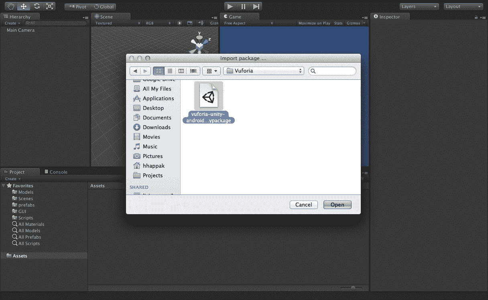

现在已经将整个 Vuforia 库添加到项目中，我们可以开始查看它所包含的组件。所有构成 Vuforia 项目的组件都在项目中的**Qualcomm 增强现实**文件夹内。这个文件夹将包含控制 AR 体验行为的所有脚本。不仅包括脚本，还有一些着色器和纹理。它们主要用于 AR 应用的视频背景渲染。

幸运的是，我们不必直接处理大多数这些脚本，因为 Vuforia 将必要的组件捆绑在 Unity 预制件中，可以直接将其拖放到场景中。

# Vuforia 预制件

**预制件**本质上是一种在 Unity 中创建的资产类型，用作可重复使用的游戏对象，存储在项目视图中。预制件可以插入到场景中任意多次，并应用任何对象变换。当添加到场景中时，它们基本上是原始预制件的实例，并与其链接。当对原始预制件应用更改时，所有其实例都将复制它，因为它们本质上是其克隆。

预制件是 Unity 不可或缺的工具。它使得创建标准场景组件变得容易得多。想象一下，如果我们正在制作一个包含许多非玩家角色敌人的游戏。手动构建每一个敌人将花费很多时间，但如果我们创建一个单独的敌人预制件并多次克隆它，这将使构建场景变得容易得多。此外，如果我们想要编辑整个敌人 NPC，我们只需编辑预制件，更改就会传播。

Unity 预制件还使得在项目之间共享组件变得容易，如果它们要导出为 Unity 包。这正是高通公司对 Vuforia 组件所做的事情。构成 AR 场景的所有组件都存储为预制件，随时可以拖放到场景中；我们只需调整其参数即可。

所有 Vuforia 预制件都可以在**Qualcomm Augmented Reality**文件夹中的**Prefabs**文件夹内找到。以下截图显示了**Qualcomm Augmented Reality Prefabs**文件夹：

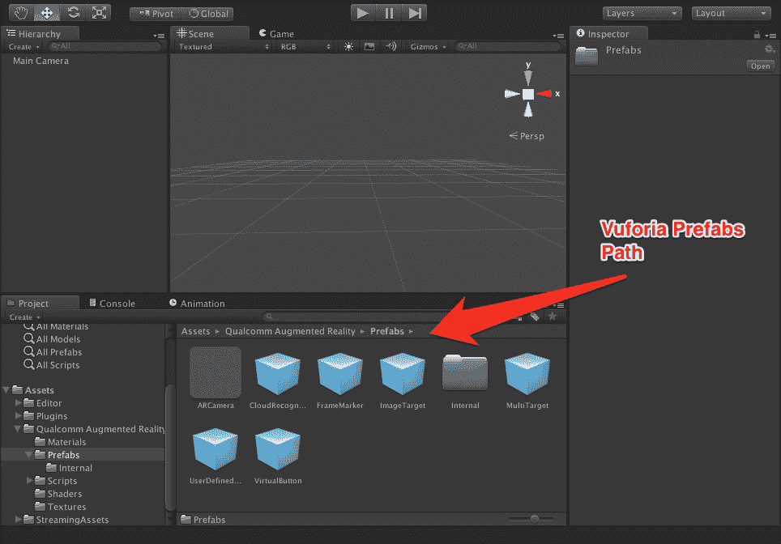

在**Prefabs**文件夹内，我们将找到之前解释的所有组件，例如**ImageTarget**预制件和**FrameMarker**预制件。我们还将找到**ARCamera**预制件，这是任何类型 AR 应用中的共同点。

默认情况下，当 Unity 创建一个新的场景时，它会向场景中添加一个相机，例如在**Hierarchy**面板中显示的那个。在我们的案例中，我们将使用 Vuforia 的专用**ARCamera**预制件。因此，我们需要首先从**Hierarchy**面板中删除**Main Camera**对象。

简单地从场景的**Hierarchy**中选择**Main Camera**，然后右键单击它，然后点击**Delete**。现在将**ARCamera**预制件拖放到场景中。场景的任何位置都可以。现在为了关注其位置，从**Hierarchy**面板中选择**ARCamera**，并按住*F*键盘键直到焦点在其上。当按住*F*键时，确保鼠标指针在场景面板上，否则焦点将不起作用。以下截图显示了添加到场景中的**ARCamera**预制件：

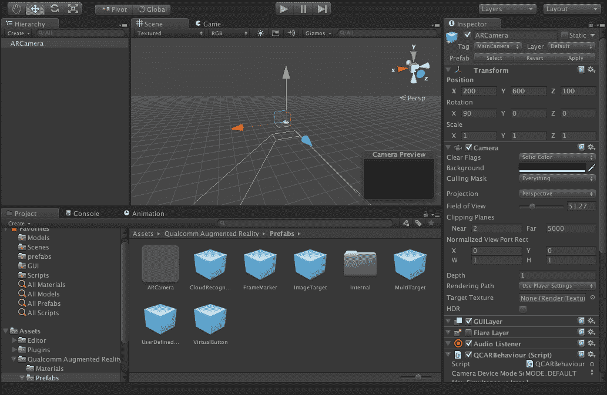

添加其余组件同样简单。现在我们已经将一个**ARCamera**预制件添加到场景中，我们还需要将**ImageTarget**预制件也添加到场景中。将**ImageTarget**预制件拖放到场景的任何位置。

这个预制件是我们将添加 3D 内容的平台。它还将持有应用程序将跟踪以定位`ARCamera`的方式，正如我们在示例应用中看到的那样。以下截图显示了添加到场景中的**ImageTarget**预制件：

根据将 `ImageTarget` 预制体放置在场景中的位置，变换部分中显示的游戏世界中的位置将不同。**变换**基本上是游戏对象在游戏世界中的位置。变换包含三个不同的向量，分别代表对象位置的不同数据。这些数据如下：

+   **位置**：这是对象在三个轴（x、y 和 z）上的位置

+   **旋转**：这是对象在三个轴（x、y 和 z）上的旋转

+   **缩放**：这是对象与游戏世界中原始大小相比的尺寸比例

对象可以在世界的任何地方，但建议将世界的地板保持在 *y=0*。通过将地板保持在 `0`，当通过脚本更改对象的变换时，它将大大简化代码的许多其他方面。因此，现在将所有 `ImageTarget` 的位置更改为 (*x=0*，*y=0*，*z=0*)。这将使对象位于世界的原点，并简化后续游戏对象的定位方面。以下截图显示了图像目标检查器：

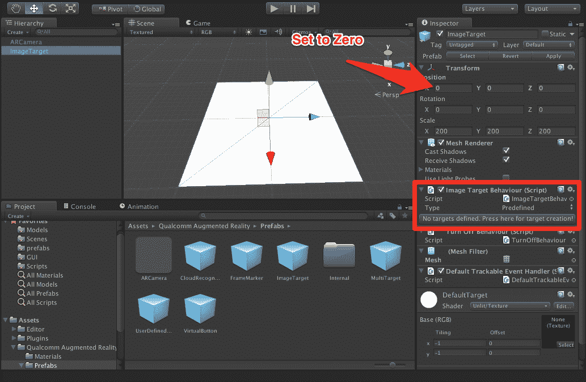

如检查器所示，有许多针对 Image Target 的设置，一开始可能会让人感到有些令人畏惧。其中之一是名为 **Image Target 行为（脚本）** 的组件，如上图所示；它负责将图像目标数据附加到图像目标对象上。目前，它还没有在应用中定义任何目标，因为我们还没有添加任何，因此图像目标的表示是白色的。

我们需要做的第一件事是将图像目标的数据添加到应用中。我们通过导入与书中内容一起提供的名为 `exampleDataset.unitypackage` 的数据集 Unity 包来实现。以导入所有其他 Unity 包相同的方式导入该包。以下截图显示了 **exampleDataset.unityPackage**：

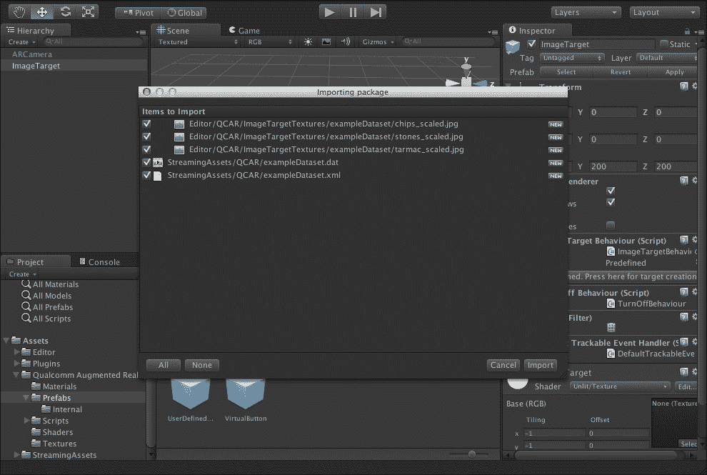

这个包本质上包含的是目标图像的数据，Vuforia 的跟踪算法可以从摄像头的视频流中有效地查找这些数据。它还携带了目标图像的纹理表示，以便在开发应用时在 Unity 编辑器中查看。

现在项目包含了跟踪数据，`ImageTarget` 预制体内部将出现一个新的选择，用于 **Image Target 行为**。我们将能够选择从目标包中导入的任何图像，并且 `ImageTarget` 预制体会立即采用它。

首先，我们需要选择包含图像的数据集。从下拉菜单中，我们可以选择唯一的可用数据集，名为 **exampleDataset**。从下面的下拉菜单中，我们可以选择特定的目标图像。选择目标图像石头。注意，游戏世界中的 **ImageTarget** 表示现在携带了目标图像。以下截图显示了数据集选择：

数据集本质上是一组图像目标，Vuforia 将同时跟踪其中任何图像。在我们导入的数据集中，我们有来自 Vuforia 示例项目的图像。应用将在任何给定时间跟踪所有三幅图像，直到找到任何图像来在其上渲染 3D 材质。

应用可以有多个数据集，每个数据集中可以有多达 100 个图像。这是 Vuforia 可以跟踪的大量图像。我们还有能力从编辑器或脚本中激活和停用任何数据集。

当我们将数据集添加到`ImageTarget`时，它立即在世界上表示了图像目标，但这并不一定意味着`ARCamera`会跟踪该数据集。为此，我们首先需要激活数据集，并告诉`ARCamera`开始跟踪该数据集。

从**层次结构**面板中单击**ARCamera**对象。在检查器中，我们可以找到**脚本**组件**数据集加载行为（脚本）**。在该组件内部，将有一个带有标签**加载数据集 exampleDataset**的复选框。如果我们点击复选框，将出现另一个带有标签**激活**的复选框。也点击它。现在数据集已加载并激活。以下截图显示了在**ARCamera**中激活的数据集。

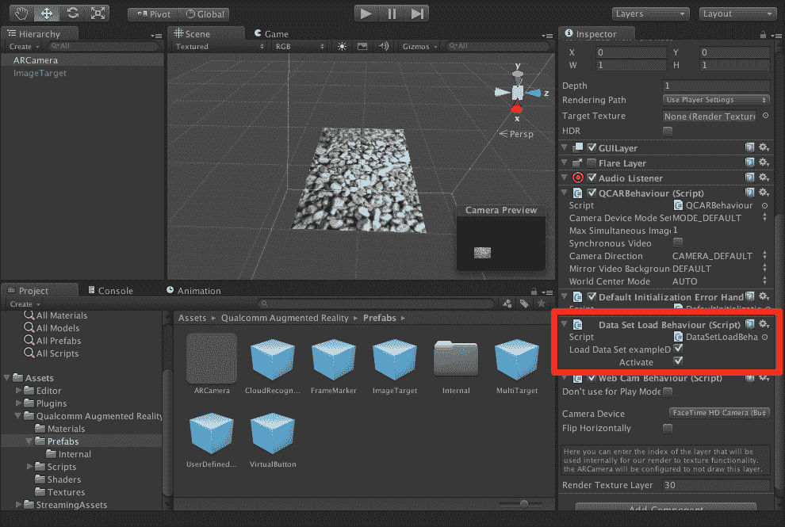

我们需要分别加载和激活数据集，这有一个特别的原因。如果添加到`ARCamera`组件，数据集将在场景开始时加载但不一定跟踪。从脚本中，我们可以然后启用和禁用任何数据集的跟踪，而无需加载开销。这种方式下，过程非常快。

现在我们知道 Vuforia 不仅知道要跟踪哪些可跟踪对象，而且正在积极跟踪它们。我们添加了`ImageTarget`预制件，并将其设置为**Stones**图像目标。如果我们按播放并给相机展示石头图像目标，除了控制台日志声明它已检测到图像目标外，不会发生任何事。我们甚至可能会注意到`ARCamera`在编辑器中疯狂地围绕图像目标在游戏世界中移动。这仅仅是因为我们还没有将任何 3D 内容附加到目标图像上。

## 导入和附加 3D 对象

Unity 能够从许多成熟的格式导入 3D 模型。模型可以从任何 3D 建模应用程序创建，例如 3D max、Maya 和 Blender。只要模型以 Unity 支持的格式导出，就可以轻松将其导入到项目中。

Unity 支持的格式如下：

+   Maya (`.mb`和`.ma`)

+   3D Studio Max (`.max`)

+   Cheetah 3D (`.jas`)

+   Cinema 4D (`.c4d`)

+   Blender (`.blend`)

+   Modo (`.lxo`)

+   Autodesk (`.fbx`)

+   COLLADA

+   Carrara

+   Lightwave

+   XSI 5.x

+   SketchUp Pro

+   Wings 3D

+   3D studio (`.3ds`，在 Mac OSX 上不工作)

+   Wavefront (`.obj`)

+   绘制交换文件（`.dxf`）

列表相当广泛。可以相当安全地假设 Unity 将支持大多数已知的 3D 模型格式。注意，尽管如此，Unity 使用 3D 建模应用程序将模型格式转换为 FBX，然后可以被 Unity 导入。这个过程主要是自动的，并产生平滑的结果，大大简化了工作流程。

现在是时候将我们自己的 3D 模型添加到项目中了。首先，我们需要在项目中创建一个用于模型的文件夹。我们将使用它来包含项目中所有的模型。在**Assets**根文件夹中创建一个文件夹，并将其命名为`Models`。

从**Assets**菜单的顶部导入资产很容易完成。从菜单中选择**Import New Asset**，然后指向章节的资产文件夹并选择`frog.fbx`文件。Unity 将立即开始导入资产。以下截图显示了 Unity 导入的**Frog**资产：

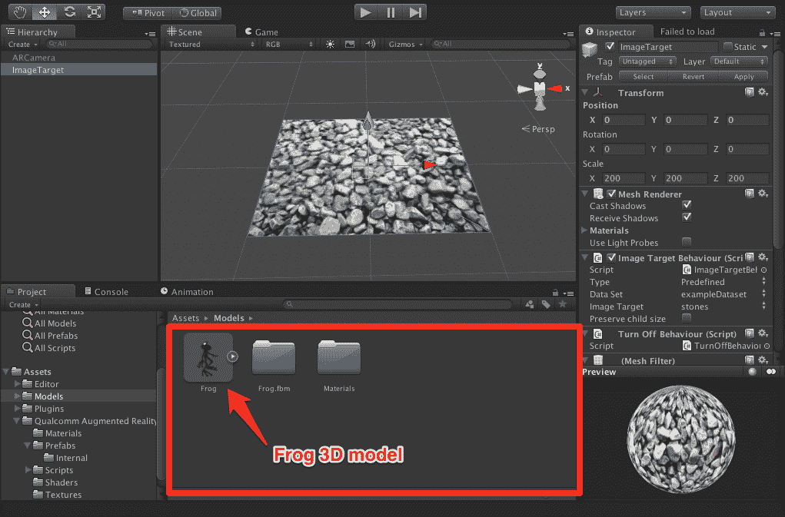

现在我们已经在项目中有了 3D 模型，将模型添加到 Unity 项目是如此简单。这是一个好消息，因为对于游戏引擎来说，添加模型是项目中完成的最重要的任务之一。你在想为什么 3D 模型是青蛙吗？这是因为对于开发者来说，保持幽默感通常是件好事；这有助于。 

当导入 3D 模型时，它为我们创建了两个文件夹和一个文件。这些文件夹包含 3D 模型的材质和 FBX 导入的设置。文件实际上是一个带有附加材质的 Unity 预制件，可以直接拖放到场景中。Unity 会自动为我们创建预制件。

现在我们可以将**Frog**预制件拖动并放入我们的场景中。青蛙 3D 模型将出现在我们的游戏世界中。以下截图显示了添加到场景中的青蛙模型：

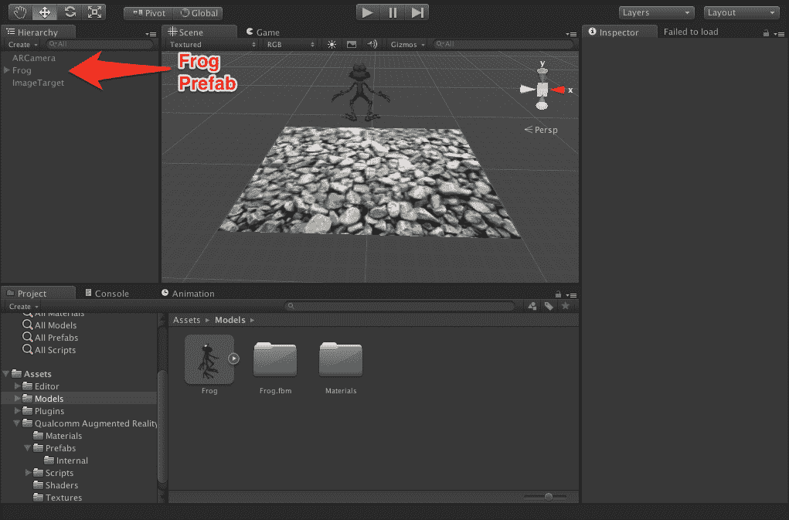

就像当我们添加`ImageTarget`预制件时，青蛙在场景中的位置几乎肯定是不正确的。我们需要将其放置在`ImageTarget`的上方，并使其朝向正确的方向，但首先我们需要更好地估算其相对于`ImageTarget`的位置。记得当我们添加`ImageTarget`时，我们将其放置在游戏世界的原点`(0,0,0)`位置。我们将以青蛙作为第一步做同样的事情。

从**Hierarchy**中选择青蛙，然后在**Transform**位置检查器面板中，将 x、y 和 z 设置为零。以下截图显示了青蛙在原点位置：

首先要注意青蛙的错误是它沉入了`ImageTarget`中。另一个问题是它对于`ImageTarget`来说太小了。

首先，我们将尝试将青蛙放置在`ImageTarget`上方。在 Unity 的左上角，确保您已选择方向十字按钮。这允许我们更改选中对象的位罝。注意从青蛙中伸出的绿色、蓝色和红色轴。它们是对象在游戏世界中的相对位置。绿色代表 y 轴，红色代表 x 轴，蓝色代表 z 轴。我们希望将对象在 y 轴上移动以使其位于`ImageTarget`上方。为此，只需拖动绿色轴并将鼠标向上移动；对象将随之一同上升。

将青蛙放置在`ImageTarget`的任何上方。现在不必完美。以下截图显示了青蛙在 y 轴上方的位置：

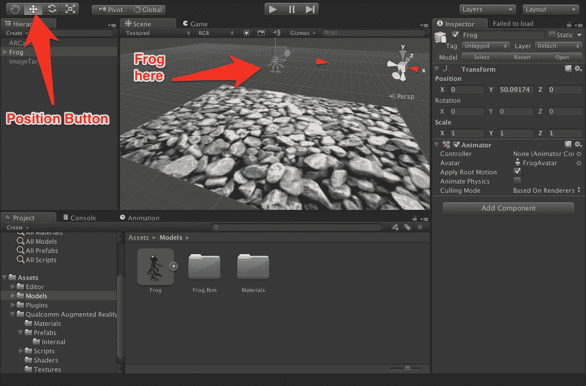

现在来看第二个问题，它的尺寸；我们需要将其放大很多才能适应`ImageTarget`。

当青蛙被选中时，从左上角的菜单中点击**缩放**按钮。它是带有箭头从正方形中出来的最后一个图标右侧。

缩放按钮允许我们在场景中的任意轴或所有轴上缩放对象。由于我们需要对象在所有方向上均匀缩放以避免青蛙在一个方向上比另一个方向拉伸得更多，因此我们需要点击现在表示在物体上的三个轴原点处的正方形，然后拖动鼠标经过它。以下截图显示了放大后的青蛙对象：

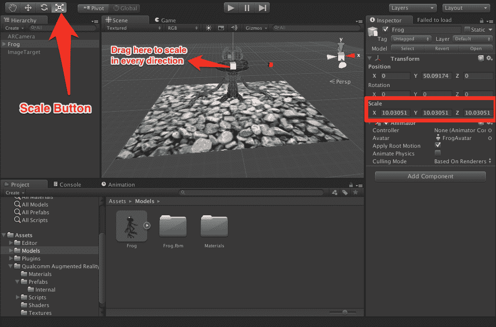

在检查器中将缩放值设置为`10`应该足够，但由于没有约束，我们可以将其放大或缩小到我们想要的大小。

现在，我们需要使青蛙面向正确的方向，与它现在面向的方向相反。为此，我们需要在左上角的菜单中激活旋转按钮。

一旦激活旋转按钮，物体上的轴将看起来相当不同。首先，它们在本质上呈球形，而不仅仅是(x, y, 和 z)轴。

旋转功能与其他变换工具的外观不同，但工作方式相似。通过拖动(x, y, 和 z)轴，我们可以围绕任意一个轴旋转对象。剩余的白色轴是用于方便访问的对角旋转。

拖动绿色 y 轴以使物体朝向正确的方向旋转。注意检查器中的旋转数据在 y 轴周围变化。我们需要它达到`180`或`-180`度。注意，我们只需在检查器的旋转部分输入那个数字即可达到相同的结果。以下截图显示了旋转后的青蛙对象：

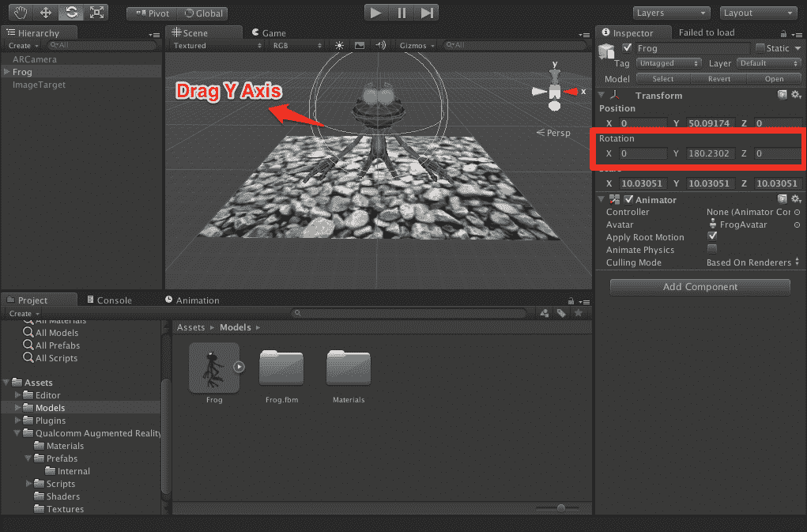

现在青蛙已经旋转到相对于可追踪对象的方向正确，我们只需要将其位置提高，使其正好位于可追踪对象上方。我们可以用与之前相同的方式做到这一点。但这次我们需要更加小心，并且必须旋转编辑器相机几次，以确保青蛙从所有角度都定位正确。以下截图显示了正确定位的青蛙：

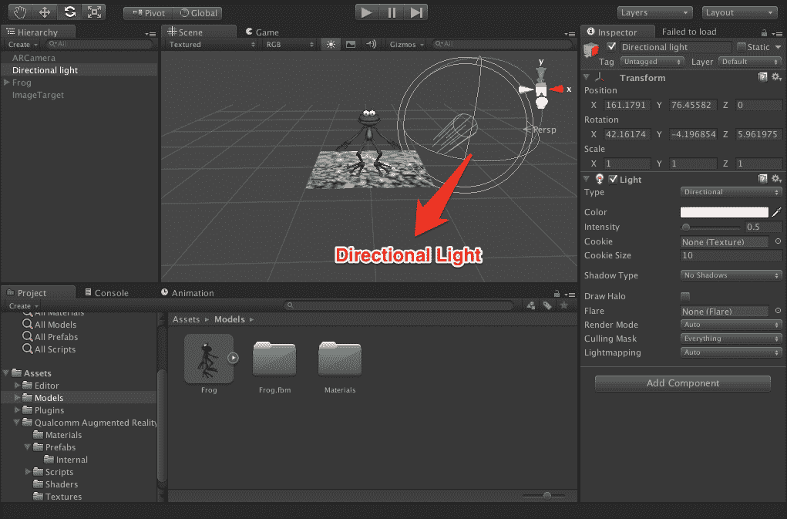

现在青蛙已经完美地定位在图像目标上方，一切正常。不过，你会注意到青蛙似乎颜色很暗淡。这主要是因为场景中没有任何光源；这正是我们接下来要添加的。

从顶部菜单中选择**GameObject**。从菜单中点击**Create Other**菜单下的**Directional Light**。这将在你的场景中添加一个名为 Directional Light 的对象。以下截图显示了添加到场景中的 Directional Light：

方向光是一种场景光，很容易添加且对设备资源便宜。它本质上就像太阳一样，照亮你指向的方向上的任何对象。我们只需要调整对象的旋转。它在游戏世界中的位置并不重要，因为它的光仅基于其方向，而不是其位置。

现在青蛙已经定位在我们想要的位置，看起来也很不错。我们可能会想现在就按下**播放按钮**来测试 AR 体验。如果我们这样做，并将可追踪对象展示给相机，青蛙将正确显示。但一旦可追踪对象从相机中丢失，我们会发现青蛙仍然停留在屏幕上。这是因为我们没有将青蛙与图像目标进行父化。

## Unity 中的对象父化

Unity 的**层次结构**面板之所以被命名为这个名字，有一个很好的原因。那就是它代表了场景中对象的层次结构。如果我们点击**层次结构**面板中青蛙对象旁边的箭头，它将揭示其下的一组对象。这些对象实际上是青蛙对象的子对象。

父对象青蛙在**层次结构**下包含许多子对象，这本质上意味着子对象的变换将跟随父对象。当我们移动青蛙对象时，我们不需要单独移动子对象，它们会自动与父对象一起移动。这是幸运的，因为那样会花费很多时间。

在 Unity 中进行父化有多个原因。无论是脚本访问、变换还是简单的分组，Unity 的父化是一个非常重要的功能。

为了使图像目标能够正确工作，我们必须将它们作为任何它们将要显示的 3D 内容的父对象。这对于 Vuforia 能够控制何时以及如何显示 3D 内容以匹配图像目标来说是一个必须的条件。

要将其设置为父对象，我们只需将青蛙对象拖动并放置在**层次结构**面板中的`ImageTarget`对象上。以下截图显示了已设置为父对象的青蛙对象：

通过点击**播放按钮**来测试它后，我们的 AR 项目应该能够正常工作并正确显示青蛙。如果我们遵循上一章中解释的设置，我们可以在设备上部署它。

通过本章，我们学习了如何在 Unity 中从头开始构建 Vuforia 项目，如何导入和展示我们的 3D 对象，以及如何添加和设置 Vuforia 组件以正确显示它们。

# 摘要

在本章中，我们开始了我们的新 Unity 项目，并向我们介绍了添加 Vuforia SDK 后的项目。我们了解了术语 prefab 的含义，并探讨了 Vuforia SDK 内部包装的不同 prefab。我们看到了如何使用 Vuforia prefab 构建 AR 场景，特别是`ARCamera` prefab 和`ImageTarget` prefab。然后我们了解了将目标添加到项目中的方法以及如何在我们的项目中激活这些数据集。我们还看到了将 3D 模型添加到 Unity 项目并按我们的喜好在场景中定位以及添加适当光照的简便性。

在下一章中，我们将了解如何在目标管理器中创建我们自己的目标数据集，以及如何从我们选择的照片中获得最佳的目标结果。
