# 第四章。可追踪项和追踪

可追踪项是 AR 体验的一个基本组成部分。它是我们构建的整个世界的基石。我们可以拥有世界上最好的 AR 内容，但如果可追踪项不适合，体验将大大降低。在本章中，我们将尝试了解如何创建和使用合适的可追踪项的细节。我们还将探讨如何修改可追踪项以增加其在应用程序中的可追踪性。

# 图像目标的可追踪项是什么？

可追踪项是 AR 应用程序可以追踪的一组特征。这可以是任何东西，从传统的二维码，其中一组黑白二进制代码决定了检测到的对象，到我们在上一章中体验到的图像目标，其中可追踪项只是一个图像。

对于图像目标，仅使用图像本身的自然特征作为在现实世界中检测图像的方式，并计算 AR 相机应该放置的位置。自然特征被分析、存储在数据库中，然后用于与相机输入流进行比较。这自然使得根据其特征，图像可以被跟踪得有多有效。

# 创建图像目标

使用 Vuforia 的 **目标管理器** 可以使这个过程变得简单。目标管理器是由高通提供的在线工具，它可以自动分析和创建用于在应用程序中部署的图像目标数据库。它还可以管理包含多个目标的多个数据集。

要到达这个目标管理器，只需访问以下网址：[`developer.vuforia.com/target-manager`](https://developer.vuforia.com/target-manager)。

以下屏幕截图显示了 **目标管理器**：

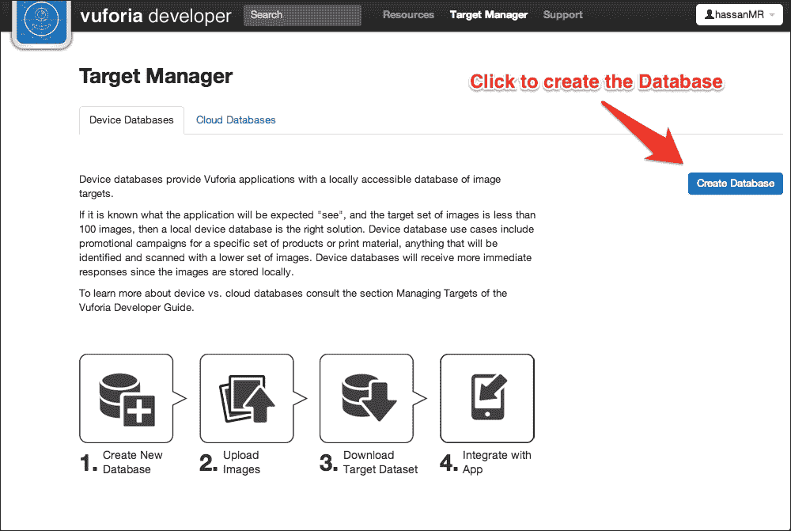

你应该会看到一个类似于上面的视图。这是目标管理器——我们将使用它来创建所有目标并维护它们的工具。目标管理器可以用于本地目标数据集和基于云的数据集。在这本书中，我们将专注于 **设备数据库**。

首先，让我们创建一个数据库，我们将使用它来查看创建目标的过程。点击 **创建数据库** 按钮，并将数据库命名为第四章。以下图像显示了在 **目标管理器** 中创建的数据集：

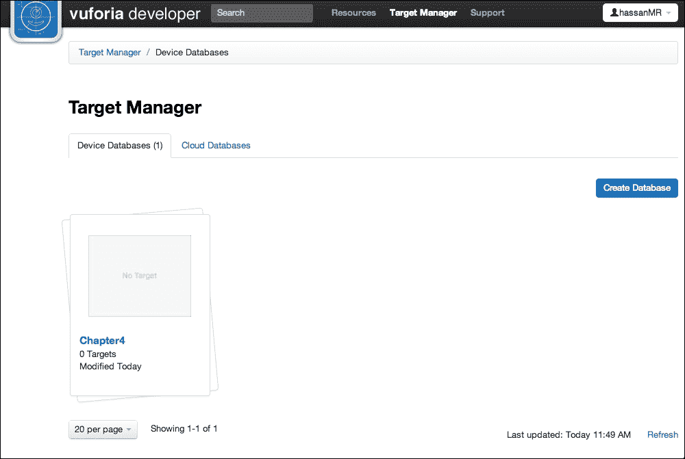

现在我们有一个数据集。目前我们的数据集是空的，但我们可以向数据集中添加多个图像目标，以便 AR 应用程序跟踪所有这些目标。我们甚至可以在这个视图中创建多个数据集，每个数据集都有自己的目标集。

现在我们需要做的是创建我们的第一个图像目标。首先，我们将使用之前在 Vuforia 示例项目中使用的石头图像。这将给我们一个关于如何创建示例项目的图像目标的思路。

点击数据库以打开它。我们将在右侧找到一个添加目标按钮；点击它。以下图像显示了目标创建：

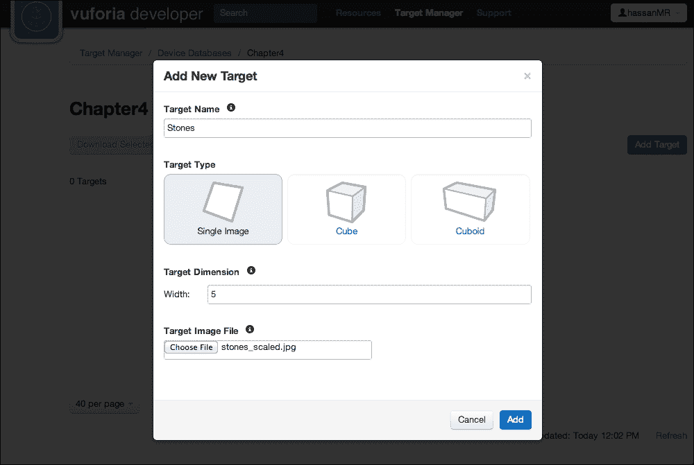

创建目标参数非常简单。对于名称，我们将选择“Stones”，就像在示例应用中一样。对于目标类型，我们将保持为“单张图像”。其他两种类型用于 Vuforia 中的多目标预制件，用于检测世界中的 3D 对象。

最后一个参数，目标尺寸，是一个重要的参数。这个数字是场景中图像目标的表现。它决定了出现在其上的对象如何缩放，以及它占据了场景中虚拟空间多少空间。换句话说，在 Unity 3D 环境中，这是一个很容易被忽略的值。这是由于 Unity 中可以轻松编辑的缩放属性。然而，在 OpenGL 环境中，这个值非常重要。目前，我们可以将其设置为 5 个单位。这是 Unity 3D 场景中的 5 个单位距离。

点击**添加**按钮，上传图像。目标将会有处理标签；处理需要几分钟时间。给它一些时间，然后点击目标以查看其详细信息窗口。以下图像显示了“Stones”目标的详细信息窗口：

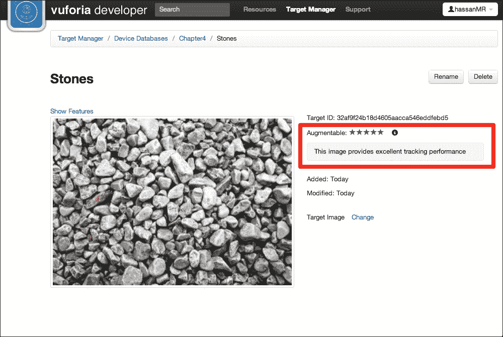

这是刚刚添加到数据库中的目标的详细信息窗口。在右侧，我们将找到有关目标的所有详细信息。它以目标在所有数据库中的唯一 ID 开始，包括基于云的和本地的。这对于目标的全球识别很有用。

在**目标 ID**下方，我们将找到可增强分数。这是目标最重要的功能。它展示了目标在应用中的追踪效果。这个目标有 5 星中的 5 星；这是因为图像中的特征非常适合追踪。

# 可追踪分数

影响可追踪分数的因素有几个，但首先我们需要了解分数是如何影响图像的可追踪性的。

可增强分数基于 5 星。它如下表示增强性：

+   **4 到 5 星之间**：可追踪目标非常适合 AR 应用。它可以处理部分图像被遮挡的情况，并且应用仍然能够追踪它。它也可以在低光和其他环境噪声中追踪。

+   **2 到 3 星之间**：可追踪目标是可增强的。在理想条件下，它将运行良好。如果部分图像被遮挡，可能表现不佳。这是不会影响用户体验的最小分数目标。

+   **1 星**：这是可追踪性的最低分数。这意味着图像将被应用识别，但体验会受到影响。务必避免获得这个分数。

+   **0 星**：图像根本不适合可追踪性；图像中缺乏足够的可识别特征，使得应用无法识别。这个图像将完全不会被应用识别。

在追踪内容受限的情况下，并且我们知道在良好的光照和没有遮挡的情况下使用条件将是空闲的，我们可以争取 2 到 3 星。否则，最好争取 4 到 5 星，以便用户能够最优使用。任何低于 2 星的都应该完全避免。

# 什么决定了可追踪物的评分？

可追踪物是使用 Vuforia 进行 AR 体验的基础。理解和创建一个合适的可追踪物对于体验要稳健和有用至关重要。目标管理器中分配给可追踪物的分数是我们对目标图像将要表现出的稳健性的指示，但是什么决定了这个分数？

理解这一点的最好方式是了解 Vuforia 如何追踪图像。想法很简单；它在图像周围的所有集群中寻找对比边缘的位置。这些边缘被追踪，基于存储在数据集中的位置图，Vuforia 可以告诉可追踪物在现实世界中的相对位置，并相应地在其上方渲染 3D 内容。这特别意味着追踪图像并不是由其颜色或其中真正包含的内容决定的，而是由图像中对比边缘的数量以及它们在图像上的分布情况决定的。

为了更好地理解这一点，我们可以查看我们刚刚上传的图片中当前可识别的边缘。要做到这一点，只需简单地点击网页左上角的**显示特征**链接。以下图片显示了图像目标石头的特征：

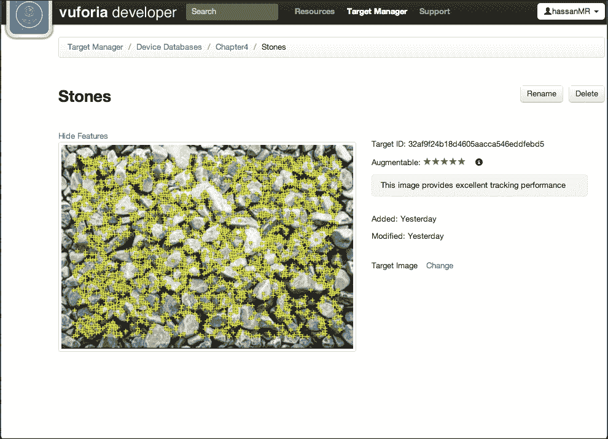

一旦点击了**显示特征**链接，图像目标管理器就会在目标图像上叠加一个覆盖层，显示它检测到的可识别边缘，这些边缘可以在 Vuforia 图像目标中进行追踪。注意，它只追踪`石头`之间的暗色边缘，而忽略图像中的其他部分。它甚至只追踪`石头`之间的高对比度边缘，而忽略一些较浅的边缘。

还要注意的是，图像中找到的边缘数量很多，并且均匀地分布在图像周围。这是使这张图像适合追踪的重要因素之一。

为了对比这张图片的结果，让我们尝试一个在目标管理器上尝试会得到 1 星评分的图片。以下图片显示了添加到目标图像中的景观图像：

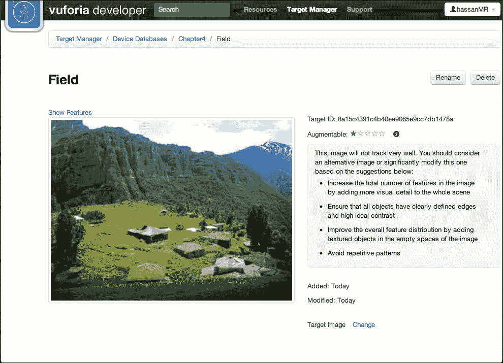

在添加这张图片之前，直观地，我们可能会认为这张图片适合追踪。它确实有很多广角景观的细节。但将这张图片添加到**目标管理器**后，得到了惊人的 1 星结果。

这张图片低分的主要原因在于整个图片都是绿色调。这极大地减弱了图片中的对比边缘。

如果我们点击顶部的**显示特征**链接，我们将能够看到目标管理器从图像中检测到的内容。以下图像显示了山景图像中的特征：

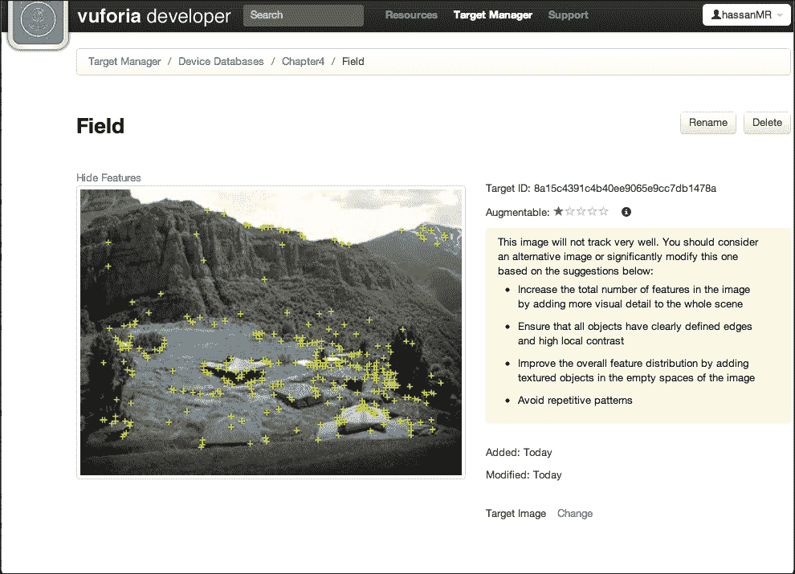

立即，我们注意到图像中检测到的特征数量比石头少得多。它只检测到了图像中物体阴影产生的边缘，这显然不足以给它评出超过 1 星的分数。

## 特征定义

为了帮助我们获得更高的分数，我们必须了解目标管理器正在寻找哪些特征。我们知道目标管理器在图像中寻找的主要是边缘，但具体是哪种边缘？为了理解这一点，我们需要了解特征的定义。

特征是图像中尖锐且刺状的细节，就像边缘的角落。特征必须非常对比鲜明才能被发现，并且必须均匀地分布在图像中，以随机的方式。以下图像显示了识别出的形状和特征：

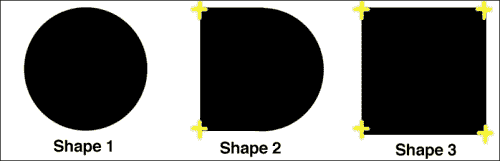

在上面所示的形状中，我们可以看到特征的黄色十字表示。表示如下：

+   **形状 1**：它是一个完美的圆形，没有任何角落，因此，在它里面没有可识别的特征。

+   **形状 2**：它左侧有一个边缘，有两个可识别的角落。这导致在形状中可识别的两个特征。

+   **形状 3**：它是一个有四个边缘和四个角落的正方形。这导致在形状中有四个可识别的特征。

这意味着任何曲线物体几乎都不会产生特征。主要来说，由于人类和动物具有曲线性质，它们在可追踪性方面非常差。

## 通过增强对比度来提高分数

提高图像分数的最简单方法之一就是简单地增强图像的对比度。特征检测寻找像上面那样的尖锐边缘；当图像对比度低时，这样做非常困难。就像我们之前使用的风景图像一样，图像得分低的主要原因是图像对比度低。那么，当我们使用像 Photoshop 或 Gimp 这样的照片编辑应用程序增加图像的对比度和光级时会发生什么呢？以下图像显示了增强对比度的风景图像：

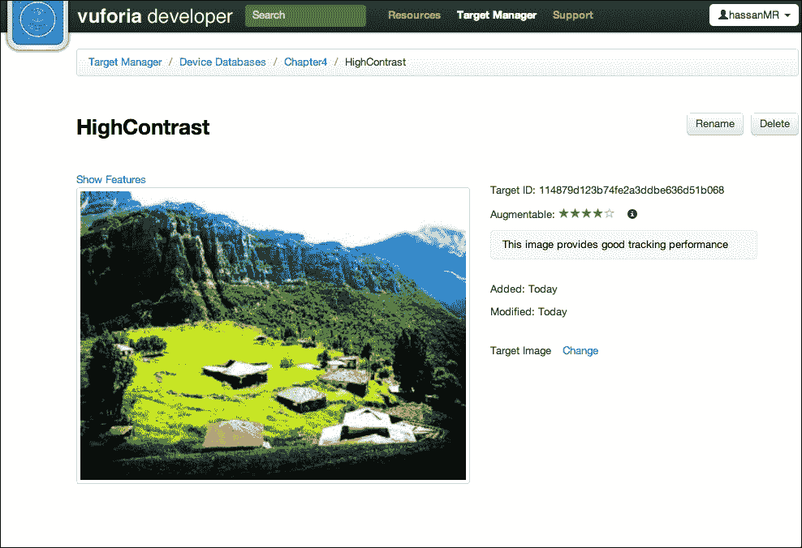

分数从 1 星评分跃升至 4 星评分。如您所见，如果您将现在使用的图像与我们之前使用的图像进行比较，图像的对比度得到了极大的增强，目标管理器现在很容易检测到这样的阴影和边缘。让我们看看目标管理器检测到的特征。以下图像显示了高对比度图像中的特征：

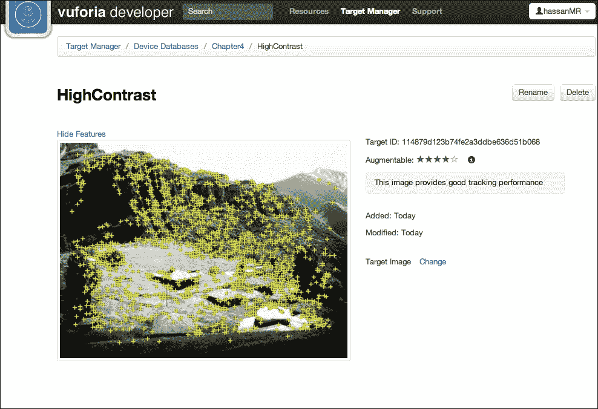

图像中检测到的特征远远多于之前图像中目标管理器找到的特征。大多数特征位于山和树影周围。注意绿色田野仍然产生很少的特征，但山和树木的特征足以产生 4 星的高分。

非常推荐增强用于 AR 应用的图像目标的对比度。拥有最佳的可追踪性对体验大有裨益。

## 图像目标上的特征分布

在图像上具有可识别的特征很重要，但它们的分布方式也同样重要。我们可以在图像的某一部分识别所有特征，而在另一部分则没有。这种不平衡会大大降低分数，因为它阻碍了 AR 应用在现实世界中检测图像相对位置的能力。例如，检查下面的图像目标。以下图像显示了湖泊目标：

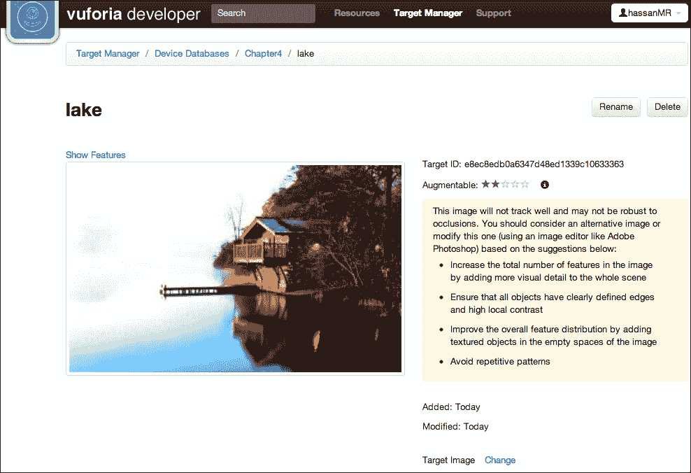

这是一张添加到图像目标管理器的湖泊图像目标。它有很多细节，但图像的左侧除了湖泊外几乎都是空的。这张图像得到了 2 星的评价，这是在增强图像对比度之后的结果。

要了解分数低的原因，让我们看看检测到的特征。以下图像显示了湖泊房屋目标中的特征：

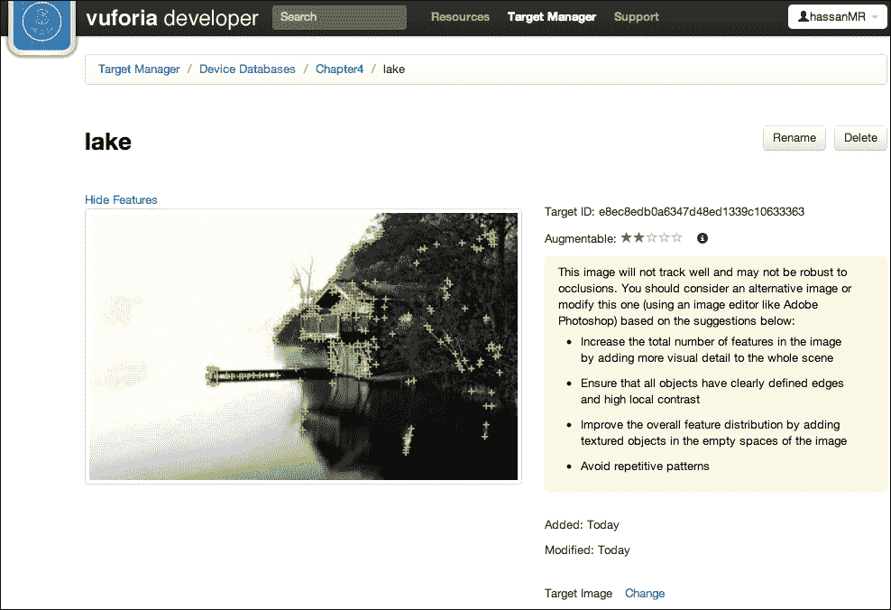

如预期的那样，检测到的所有特征都位于图像的右侧，而左侧则完全为空。这对 AR 应用中的遮挡管理和相对位置检测非常不利。它将进行跟踪，但目标将非常差。

## 如何增强特征分布

通过明显的方法增强特征分布，即向图像的空白空间添加对象。如果我们向上述图像的空侧添加纹理对象，新对象产生可检测的特征后，它自然会提高其分数。但如果对目标可以包含的内容有限制，那么在实际操作中改变目标的组成可能并不总是可行的选择。例如，如果目标是杂志或小册子的一部分，而我们无法控制可以向图像添加的内容。然而，我们始终可以控制从目标中移除什么。

如果我们能够从图像目标中移除空白空间，并取目标中细节丰富且特征分布良好的子集，我们就可以绕过这个问题。有趣的是，即使我们只提供子集的数据，AR 应用也会在大型图像上正常触发。例如，检查我们之前添加的湖泊目标的子集目标。以下图显示了湖泊图像目标的子集：

如我们所见，上面的图像只是湖泊图像的一个子集，其中只可见湖泊房屋。现在，由于目标管理器可以聚焦于更小的区域，我们立即可以识别出更多特征。这也增强了图像上的特征分布。这使得这个可追踪目标的得分提升到 3 星。

AR 应用会触发到这个图像，无论它是以这个子集形式存在，还是在对湖泊房屋进行裁剪之前被原始图像所影响。这是在尝试为图像目标获得更高分数时需要记住的一个非常有用的功能。

AR 内容的定位需要根据相对于原始湖泊图像而不是子集进行调整。这可以通过在 Unity 中对 AR 内容的定位应用偏移量来轻松实现。

## 图像目标中的图案

我们现在明白在图像上需要有良好的特征分布，但有一点需要记住：图像上重复的图案只计算一次，这意味着如果我们整个图像目标上都有重复的图案，得分将会非常糟糕。请查看以下图像目标。以下图显示了雪花图案的图像目标：

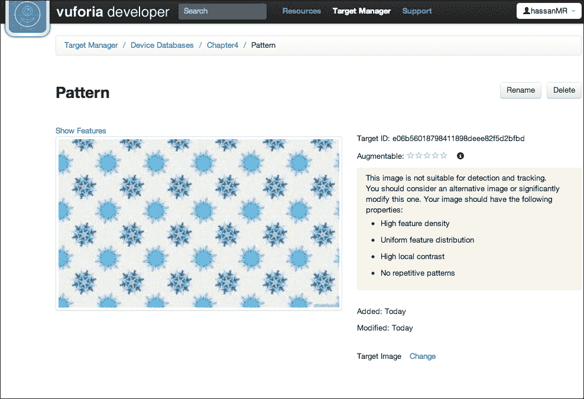

上述图像使用时得到的分数令人震惊，只有 0 星。这个图像主要是雪花的重复图案。如果我们检查检测到的特征，我们会看到如下图像。以下图显示了雪花图案中的特征：

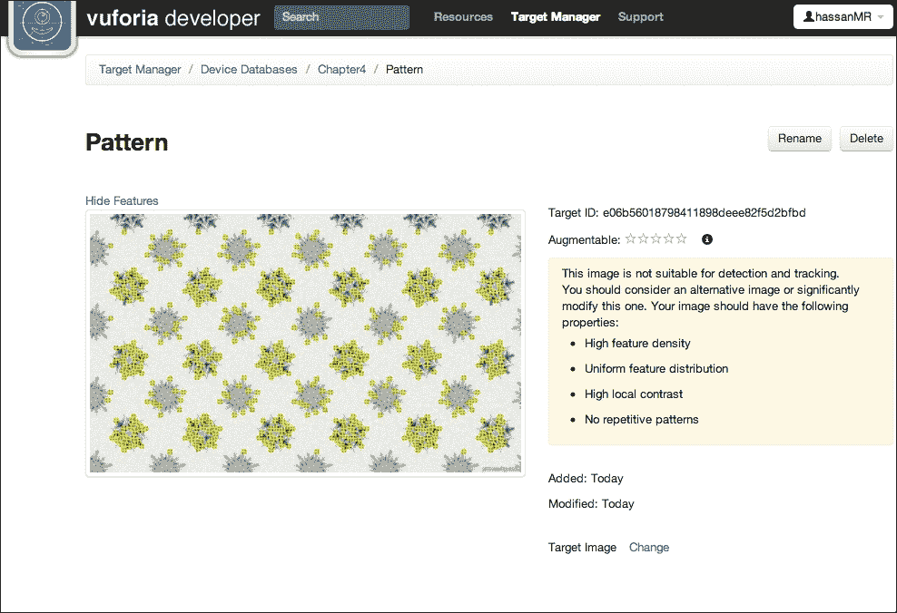

如我们所见，图像中检测到的特征足够多，可以有效地进行增强，但目标管理器却给它评了 0 星。从应用的角度来看，它将完全无法被检测到。

为了理解为什么会这样，我们需要问自己以下问题：如果我们从图像中心取一个子集，它是否与更大的图像可区分？答案是肯定的，图案在图像周围对称地重复。如果应用将检测到的特征与数据集中的特征进行比较，它将无法在现实世界中找到目标的相对位置。

# 将数据集导出到 Unity

现在我们知道了如何选择和创建我们的可追踪目标，将它们导出到 Unity 就变得容易多了。以下图显示了要导出的突出显示的目标：

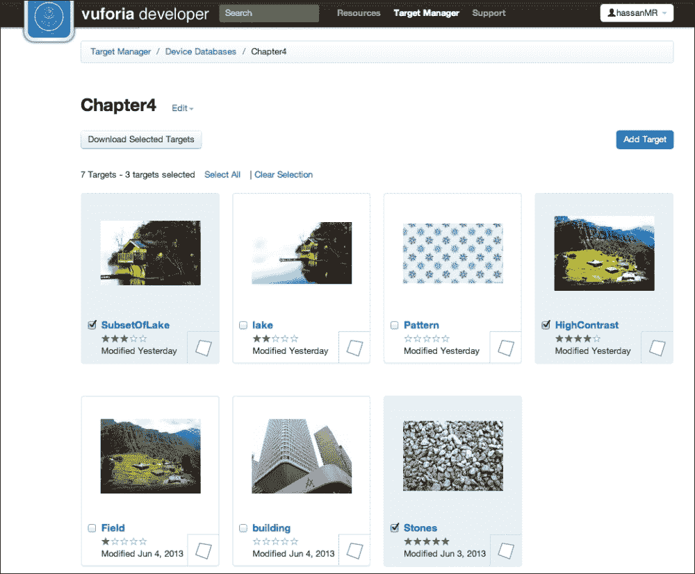

从数据集的视图中，我们可以选择我们想要导出的目标。只需简单地选择任意数量的目标进行部署。一旦选择了目标，我们可以在左上角点击**下载所选目标**。以下图显示了**下载所选目标**：

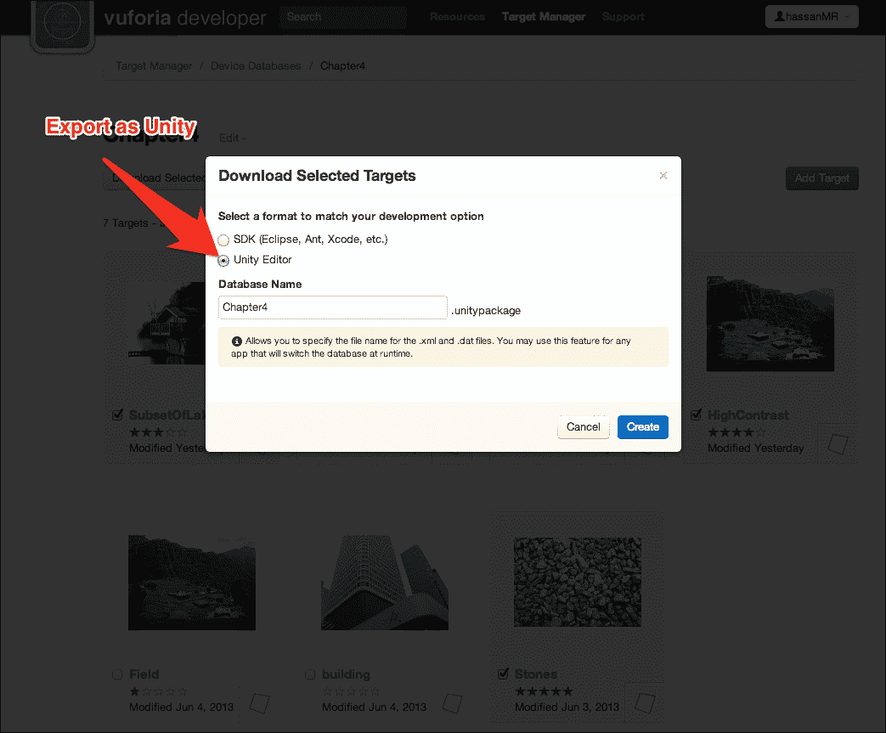

从开发选项列表中，选择**Unity 编辑器**作为选项。建议在目标管理器中保持数据库名称与目标名称相同，这样在以后更新数据集时会更加方便。这将下载一个我们可以轻松导入到项目中的 Unity 包文件，就像我们在示例项目中做的那样。

正如我们所看到的，在目标管理器中创建数据集相当简单，使得创建项目更加流畅。

# 摘要

在本章中，我们了解了使用高通的目标管理器创建自己的可追踪对象和数据集的过程。我们还探讨了如何设计和使用一个能够在我们应用中实现最佳追踪性的可追踪对象。我们看到了什么因素会使可追踪对象变得不好，例如图案和特征分布，以及什么因素会使它变得好，例如对比度和边缘。我们学到了一些提高我们可追踪对象追踪性评分的小技巧，例如从原始图像中取子集或在 Photoshop 或类似应用程序中增加对比度。有了这些知识，我们很容易优化 AR 最重要的基础，即我们的可追踪对象。

在下一章中，我们将从头开始创建一个将成为 AR 游戏的项目。技术和代码的级别将比本书迄今为止所探讨的更高，并将使我们更接近 Unity 和 Vuforia 的全部潜力。
