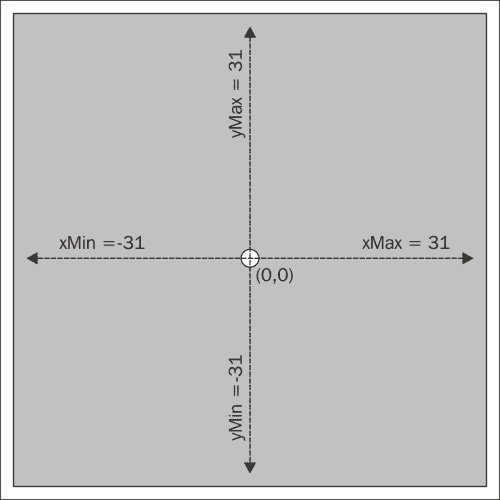
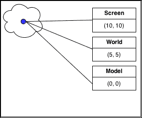
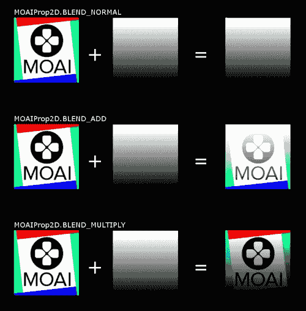

# 第五章. 在屏幕上显示图像

为了开发游戏，我们需要获得的一项基本技能是**图像处理**。在本章中，我们将讨论一些对这个主题有用的方面，这将有助于我们的游戏。我们将介绍 Decks 和 Props 的概念，并讨论如何处理它们以制作我们的游戏图形。

# Decks 和道具简介

在 Moai SDK 中，所有的资产（图像、瓦片集、网格和表面）都在 Decks 中定义。你可以将 Deck 视为一个对象的几何形状。**Decks** 存储了精灵的实际图像数据，例如。它们不会显示在屏幕上，直到你使用 Prop 引用它们。你可以将 Decks 视为 Prop 的绘制方法。

有许多类型的 Decks，例如 `MOAIGfxQuad2D` 处理单个图像。`MOAITileDeck2D` 用于加载瓦片集（或图集）并引用其瓦片（我们将在本书的后面使用它）。

**Props** 基本上是一组信息和给定 Deck 的引用。它们持有诸如位置、缩放和旋转等信息；并且是你在屏幕上看到的实际对象。

这种分离非常实用，因为它允许你重复使用分配给特定资产的记忆。我们将使用它来处理所有的瓦片，而不是加载瓦片背面的图片 20 次，我们只需加载一次并指向它。

# 我们的第一张图片

我们需要做的第一件事是有一个实际的图像。在这个例子中，我们将使用我们 *Concentration* 游戏的瓦片背面，你可以从本书的网站上获取它，以及这个例子的完整源代码。

首先，我们需要一个层。一个**层**将一个或多个 Props 组合在一起，并作为在不同 Prop 集之间控制渲染优先级的一种方式。例如，你可以有一个用于背景的层，在其上方还有一个用于对象的层，当你向背景层添加一个新的 Prop 时，它将显示在对象层的 Props 下方。

### 注意

`MOAILayer` 继承自 `MOAIProp`，所以你可以将其视为一个将其他 Props 组合在一起的 Prop。你可以在一个层上调用 `MOAIProp` 的任何方法。

为了创建一个层，你必须按照以下方式实例化 `MOAILayer2D`（在代码中在视口初始化下方输入此内容，第四章，*使用 Moai 的第一个游戏*）：

1.  首先，我们创建我们的层：

    ```swift
    layer = MOAILayer2D.new ()
    ```

1.  我们需要告诉那个层使用我们的视口。这是通过使用 `setViewport()` 方法完成的。

    ```swift
    layer:setViewport ( viewport )
    ```

1.  现在我们必须创建我们的 Deck。由于我们只显示一个简单的图像，我们将使用 `MOAIGfxQuad2D`，它用于此目的。

    1.  我们创建 Deck 对象。

        ```swift
        imageGfx = MOAIGfxQuad2D.new ()
        ```

    1.  我们使用 `setTexture()` 方法并将我们资产的路径传递给它（在这种情况下是瓦片的背面）。这就是我们告诉 Deck 实际上使用我们的图像的地方。

        ```swift
        imageGfx:setTexture ( 'assets/tile_back.png' )
        ```

    1.  第三行设置几何形状。`MOAIGfxQuad2D` 有一个矩形几何形状。为了定义它，我们可以使用 `setRect`，它接收四个数字，`xMin`、`yMin`、`xMax` 和 `yMax`。

        ```swift
        imageGfx:setRect ( -31, -31, 31, 31 )
        ```

    我们将采用约定，对象坐标 `(0, 0)` 位于中心。这样，由于我们希望以 62 x 62 的大小显示图像，实际包含它的矩形可以定义为具有 `xMin = -31`、`yMin = -31`、`xMax = 31` 和 `yMax = 31` 的矩形，因为我们希望它的 `(0,0)` 位于图像的中心。我们可以用 `setRect ( 0, 0, 62, 62 )` 来定义它，这样中心就会在左上角，但为了简单起见，让我们保持 `(0,0)` 在图像中心的约定。只需注意，这非常强大。你可以根据你想要如何操作它们来不同地定义矩形。

    

1.  下一步是设置我们的属性。

    1.  首先，我们创建属性。

        ```swift
        imageProp = MOAIProp2D.new ()
        ```

    1.  然后我们告诉属性使用 `imageGfx` 作为牌组。这是我们将它们连接在一起的时刻。我们说的是这个属性将是我们瓷砖背面的图像实例。

        ```swift
        imageProp:setDeck (imageGfx)
        ```

    1.  第三行将属性移动到屏幕中心。

        ```swift
        imageProp:setLoc (0, 0)
        ```

        ### 小贴士

        我们使用 `setLoc()` 方法将图像移动到瓷砖的背面。你可以更改参数并观察它的行为。默认情况下，`(0,0)` 是屏幕中心，所以 *x* 中的负值将对象移动到左边，正值将其移动到右边。*y* 中的负值将对象向下移动，正值将其向上移动。这与计算机图形学中使用的典型坐标系不同，它将 `(0,0)` 设置在左上角，并且 *y* 轴向下增长。

1.  下一步是将我们的属性插入到我们创建的层中，这样它就会在层渲染时渲染。

    ```swift
    layer:insertProp (imageProp)
    ```

1.  最后一步是使该层可渲染。

    ```swift
    renderTable = { layer }
    MOAIRenderMgr.setRenderTable (renderTable)
    ```

这是一件有趣的事情来讨论。我们在这里所做的是，首先创建一个包含层作为其第一个对象的表，然后告诉 `MOAIRenderMgr` 使用那个表进行渲染。

为了配置渲染，我们需要告诉 `MOAIRenderMgr` 我们想要渲染的内容。这是通过使用 **渲染表** 来完成的。正如我们在 第三章 中所讨论的，*基本 Moai SDK 概念*，使用 `setRenderTable()` 传递的表和子表将在下一个渲染步骤中渲染。所以，例如，如果你想移除所有正在渲染的对象，你不需要遍历它们，你只需要将一个空表传递给 `setRenderTable()` 方法。

在处理这个时，你必须小心。如果对象突然消失，请留意你正在渲染的表。

# 坐标系

总有一天，如果你在开发多平台游戏，你需要了解涉及的不同坐标系。

在 Moai SDK 中，我们至少有三种重要的坐标系需要记住并有效利用。

## 窗口/屏幕坐标

这是附加到您窗口上的坐标系。您通常在接收鼠标或触摸屏输入时需要处理它。您也可以使用它来设计您的 GUI。如果您在点击时遇到任何奇怪的行为，请务必检查您是否正确地将输入坐标转换为世界坐标或甚至模型坐标。

## 世界坐标

这是您在设置视口缩放时定义的坐标系，也是您在屏幕上定位 Prop 时通常会使用的坐标系。这是多平台魔法发生的地方，因为这个坐标系抽象了不同的屏幕分辨率，这样您就不需要考虑所有这些分辨率。需要处理纵横比变化，但这是一个单独的话题。

## 模型坐标

这个坐标系是 Prop 使用的坐标系。它与 Prop 几何相关。

在检查碰撞时非常有用。给定世界中的一个任意点，将其转换为模型坐标将得到一个在 *x* 和 *y* 方向上从 Prop 的中心有一定偏移的点。如果您知道 Prop 的大小，您实际上可以检查该点是否在 Prop 的边界内。

在坐标系之间切换可以大大简化您的游戏逻辑。



幸运的是，在 Moai SDK 中处理这个坐标噩梦非常简单。

有一些方法将帮助我们完成这项任务：

+   `MOAILayer2D` 有方法在窗口和世界坐标之间进行转换（`wndToWorld` 和 `worldToWnd`）。

+   `MOAIProp2D` 有方法在世界坐标和模型坐标之间进行转换（`modelToWorld` 和 `worldToModel`）。

因此，您将想要使用这些方法，以便根据您正在处理的实体进行计算。当我们实现 *集中注意力* 游戏的游戏玩法时，我们会使用这些方法。

# 混合模式

您肯定会玩的一个很酷的功能是 **混合模式**。

Moai SDK 允许您使用 `setBlendMode()` 方法为某个 Prop 定义混合模式。这将允许您修改其像素在屏幕上渲染的方式。

您可以选择 `MOAIProp2D.BLEND_NORMAL`、`MOAIProp2D.BLEND_ADD` 和 `MOAIProp2D.BLEND_MULTIPLY`。

`MOAIProp2D.BLEND_NORMAL` 是默认行为，基本上会覆盖像素，覆盖其下的一切。

`MOAIProp2D.BLEND_ADD` 执行加法混合。它将您试图绘制的像素的值添加到屏幕上该像素的先前值。这对于粒子系统以及创建类似 *Tron* 的发光效果非常有用。它还可以用于创建场景的静态照明。

`MOAIProp2D.BLEND_MULTIPLY` 将屏幕上像素和它试图绘制的像素的值相乘。这对于创建静态阴影非常有用。



# 摘要

在本章中，我们学习了关于牌组（Decks）和道具（Props）的内容——Moai SDK 提供用于处理图像的对象。我们看到了如何将这些对象与视口结合，并在屏幕上显示图像。我们还讨论了坐标系及其重要性，以及何时使用哪种坐标系以便于计算（并且正确！）我们还介绍了混合模式的使用，这对于创建灯光和阴影的漂亮效果非常有用。

下一章将是我们极简游戏框架的基础，即资源管理器。这包含了处理内存中对象加载和缓存的代码。我们将使用它来避免在需要使用图像或声音时重复初始化代码。
