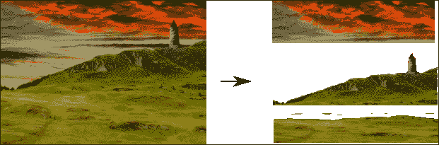
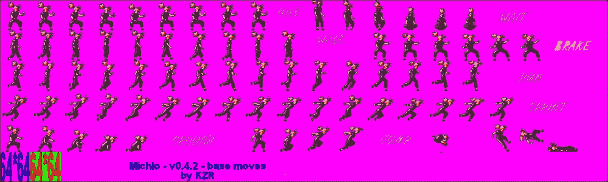
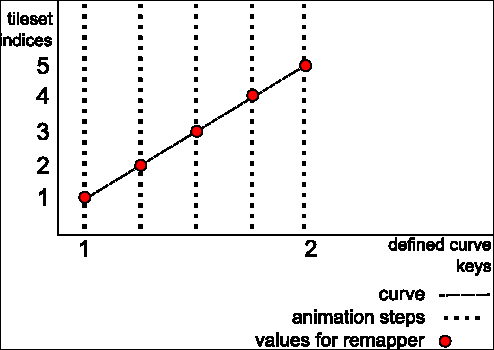

# 第八章。让我们构建一个平台游戏！

既然我们已经熟悉了处理输入和资源，为什么不尝试构建一个平台游戏原型呢？这将是一个很好的挑战，将使我们接触到更多概念和与 Moai SDK 一起工作的方法。

为了构建这个游戏，我们将复制上一章代码的全部内容，并从`game.lua`中清除所有特定于*Concentration*游戏的代码。

+   删除文件顶部的所有常量，对瓷砖的定义（但保留`resource_definitions`，因为我们将要使用它）。

+   从`Game:start ()`方法中删除`self.wasClicking = false`。

+   从`Game:initialize ()`中删除对`initializeTiles`和`restartGamePlay`的调用。

+   删除方法`Game:initializeTiles()`、`Game:restartGamePlay ()`、`Game:choseCell ()`、`Game:alreadySelectedTile()`、`Game:swapTile ()`、`Game:resetTiles ()`和`Game:removeTiles()`。

这应该就足够了；现在您应该可以开始了。

# 背景

我们将向屏幕插入一个背景：

1.  我们要做的第一件事是显示一个背景。现在这对您来说应该很容易。一个好主意是搜索[www.opengameart.org](http://www.opengameart.org)以找到合适的背景。这正是本章代码中所做的，您将在其中找到一个背景。

1.  让我们添加定义。如果您使用的是书中代码中未提供的图像，只需更改尺寸和文件名即可（此代码应放在`resources_definition`内部）：

    ```swift
      background = {
        type = RESOURCE_TYPE_IMAGE, 
        fileName = 'background/wizardtower.png', 
        width = 1000, height = 700
      },
    ```

1.  现在，让我们在`initialize ()`方法的底部添加一行来加载背景：

    ```swift
    self:loadBackground ()
    ```

1.  现在让我们定义这个方法：

    ```swift
    function Game:loadBackground()

      self.background = {}
      self.background.deck = ResourceManager:get('background')

      local prop = MOAIProp2D.new ()
      prop:setDeck (self.background.deck)
      prop:setLoc (0, 0)

      self.background.prop = prop

      self.layer:insertProp (prop)

    end
    ```

这不是什么新东西，对吧？这是我们之前在第五章中加载图像所做的一样，*在屏幕上显示图像*。

现在，让我们玩一下摄像机并滚动它。

### 小贴士

在加载背景时，请考虑您要针对的平台。

纹理的最大尺寸根据**着色器模型**而有所不同。如果您使用的是 1024 x 1024 或更小的纹理，那么您将是安全的；如果您发现有些纹理没有显示在屏幕上，请再次检查这一点。请记住，您始终可以将纹理分割成更小的部分，并在不同的 Props 中加载多个。我们在*The Insulines*的第二场景中遇到了这个问题；由于它太大，一些电脑上无法工作，因此我们不得不将其分割。

# 摄像机和滚动

如果您计划创建 2D 游戏，一个重要的事情是要掌握如何使用摄像机，这正是我们现在要做的。

在`game.lua`中的`Game:initialize ()`的开始处输入以下代码：

```swift
  self.camera = MOAICamera2D.new ()
```

1.  我们在这里所做的就是使用内置的`MOAICamera2D`类创建一个新的摄像机。

1.  接下来，我们需要将摄像机分配给每一层。在视口分配`(self.layer:setViewport ( viewport ))`下方，添加以下代码行：

    ```swift
      self.layer:setCamera ( self.camera )
    ```

    这将层绑定到那个相机。就是这样；当你移动相机时，你会看到视口会跟随，如果你上下缩放相机，它会相应地放大和缩小。我们将写几行代码来演示这一点。

1.  在`Game:processInput ()`中编写以下代码：

    ```swift
      local x, y = InputManager:deltaPosition () 
    ```

    我们正在使用`InputManager`中的一个方法，该方法返回当前鼠标位置和上一个位置之间的差异。

    ```swift
      self.camera:moveLoc ( x, 0, 0.5, MOAIEaseType.LINEAR )
    ```

我们使用`moveLoc ()`方法移动相机，并通过`x`传递增量，`y`不传递任何内容。第三个参数告诉`moveLoc ()`用半秒钟的时间来完成移动。第三个参数用于定义动画的曲线，在这种情况下，我们使其线性，所以它将产生速度恒定的移动。我们稍后会更深入地探讨这一点。

### 小贴士

`MOAIEaseType`定义了我们动画中一些有用的曲线；你可以在[`getmoai.com/docs/class_m_o_a_i_ease_type.html`](http://getmoai.com/docs/class_m_o_a_i_ease_type.html)查看它们。

如果你现在运行游戏，你会看到当你移动鼠标时，背景向左和向右滚动。这是由于相机移动的结果。

所以，当你想要滚动时，你只需要移动相机，而不是移动屏幕上的所有对象。

我们稍后可以滚动相机以跟随角色的移动。

## 垂直透视

垂直透视是一种在游戏中经常使用（并且滥用）的效果，因为它在 2D 场景中创造出深度感。主要思想是创建不同距离的图像层，当滚动时，这些图像以不同的速度移动。这模仿了在现实中，从观众（观察者）距离不同的物体（远处的物体移动速度比近处的物体慢）发生的情况。

我们可以通过将背景分割成不同的图像（每个图像代表一个不同的平面）来实现这一点。



在这里，我们看到旧的背景被分割成三层：

+   有云的背景

+   一个较远的塔

+   一些较近的小山丘

现在，我们需要做的是让它们以不同的速度移动。

## 设置层

在 Moai SDK 中，你可以使用一个名为`MOAILayer2D`的方法`setParallax ()`来实现这一点。

让我们来看看它。

1.  正如我们所见，我们需要几个层来完成这个任务。我们将用层的表格替换当前的层。在`Game:initialize ()`中，用对`self:setupLayers ()`的调用替换层初始化的行。

1.  然后我们创建实际的方法：

    ```swift
    function Game:setupLayers ()

      self.layers = {}
      self.layers.background = MOAILayer2D.new ()
      self.layers.farAway = MOAILayer2D.new ()
      self.layers.main = MOAILayer2D.new ()
    ```

    1.  我们将为每个我们想要的深度平面创建一个层。在这个例子中，我们将使用三个平面：一个背景平面，一个远处的平面和一个主要平面。（我们的角色和所有游戏对象都应该放在主要平面内）

        ```swift
         for key, layer in pairs ( self.layers ) do
            layer:setViewport ( viewport )
            layer:setCamera ( self.camera )
          end
        ```

    1.  然后我们遍历所有层，并正确地分配视口和相机。

        ```swift
          local renderTable = {
            self.layers.background,
            self.layers.farAway,
            self.layers.main
          }
        ```

    1.  现在，我们按顺序创建一个包含层的渲染表。

        ```swift
          MOAIRenderMgr.setRenderTable(renderTable)
        end
        ```

    1.  我们将使其变得活跃。

现在我们有了可以玩垂直透视的层。

## 向不同距离添加图像

现在，我们将显示每个层的图像，以便您可以看到这是多么酷：

```swift
local resource_definitions = {

  background = {
    type = RESOURCE_TYPE_IMAGE, 
    fileName = 'background/background_parallax.png', 
    width = 1500, height = 197,
  },

  farAway = {
    type = RESOURCE_TYPE_IMAGE, 
    fileName = 'background/far_away_parallax.png', 
    width = 625, height = 205,
  },

  main = {
    type = RESOURCE_TYPE_IMAGE, 
    fileName = 'background/main_parallax.png', 
    width = 975, height = 171,
  },

}
```

1.  我们需要这三个资源定义：每个层一个。这些图像可以在本章的源代码中找到。

    我们还需要一些其他信息，但不是将其添加到`resource_definitions`表中，我们将创建另一个表。即使对象和定义看起来相同，它们之间在概念上存在细微的区别，所以最好将它们分开。

1.  在`resource_definitions`表下方写下以下代码：

    ```swift
    local background_objects = {

      background = {
        position = { 0, 70 },
        parallax = { 0.05, 0.05 }
      },

      farAway = {
        position = { 0, 50 },
        parallax = { 0.1, 0.1 }
      },

      main = {
        position = { 0, -75 },
        parallax = { 1, 1 }
      },

    }
    ```

    我们在这里所做的是为创建的每个对象定义位置和视差信息。严格来说，视差是为包含对象的层。

1.  现在，我们将重写`Game:loadBackground ()`，使其看起来如下：

    ```swift
    function Game:loadBackground ()

      self.background = {}

      for name, attributes in pairs(background_objects) do
    ```

    1.  我们遍历在`background_objects`中定义的所有内容：

        ```swift
            local b = {}
            b.deck = ResourceManager:get ( name )
        ```

    1.  我们使用`background_objects`表中的键来加载牌组。

        ```swift
            b.prop = MOAIProp2D.new ()
            b.prop:setDeck ( b.deck )
            b.prop:setLoc ( unpack(attributes.position) )
        ```

    1.  在这里，我们使用在`background_objects`中定义的位置属性：

        ```swift
            self.layers[name]:insertProp ( b.prop )
        self.layers[name]:setParallax ( unpack(attributes.parallax) )
        ```

    1.  在这里，我们使用`setParallax`并使用我们在背景对象中定义的视差属性：

        ```swift
            self.background[name] = b
          end

        end
        ```

就这样，我们现在可以开始了。运行游戏并移动鼠标。你现在应该能看到三个不同的层以不同的速度移动。

现在，我们准备添加主要角色，让我们直接跳到那里！

# 主要角色

为了创建我们的角色，我们需要一个包含行走、跑步和跳跃动画的精灵表。

它应该看起来像以下图像：



1.  首先，我们将创建一个资源定义，如下所示（将其放在背景资源定义下方）：

    ```swift
      character = {
        type = RESOURCE_TYPE_TILED_IMAGE,
        fileName = 'character/character.png',
        tileMapSize = {20, 6},
        width = 64, height = 64,
      }
    ```

    这与我们在*Concentration*游戏中使用的是一样的，但请注意，我们添加了`width`和`height`。这是瓦片的尺寸。在*Concentration*游戏中，我们在网格中定义了瓦片的尺寸，但现在没有网格，所以我们需要在这里定义它。

1.  为了处理这个定义，我们需要在`resource_manager.lua`中的`loadTiledImage`函数内添加一些行，就在调用`setSize()`之后：

    ```swift
      if definition.width and definition.height then
        local half_width = definition.width / 2
        local half_height = definition.height / 2
        tiledImage:setRect ( -half_width, -half_height, half_width, half_height )
      end
    ```

    前面的代码与`loadImage`中的代码类似；区别在于我们将`width`和`height`除以二，并使用得到的结果作为矩形的尺寸。

1.  让我们创建一个名为`character.lua`的文件来开始创建我们的角色（别忘了在`game.lua`中`require`该文件），并向其中添加以下代码：

    ```swift
    module ( "Character", package.seeall )

    local character_object = {
      position = { 0, 0 },
    }
    This table will be used to setup some initialization parameters.
    function Character:initialize (layer)
      self.deck = ResourceManager:get ( 'character' )
      self.prop = MOAIProp2D.new ()
      self.prop:setDeck ( self.deck )
      self.prop:setLoc ( unpack(character_object.position) )
      layer:insertProp ( self.prop )
    end
    ```

这基本上与我们在屏幕上加载图像时所做的是一样的；这里的重要部分是 initialize 接收一个层作为参数，并将 Prop 添加到该层。你能猜到为什么吗？

原因如下：在`game.lua`中的`Game:initialize ()`的底部添加以下行（就在调用`loadBackground`之后）：

```swift
  Character:initialize ( self.layers.main )
```

哇，我们的角色现在出现在屏幕上了。喜欢吗？我觉得它相当静态。让我们添加一些动画。

## 动画

现在我们将开始处理动画。在本节中，我们将介绍三个新的类：`MOAIDeckRemapper`、`MOAIAnimCurve` 和 `MOAIAnim`。让我们看看它们是如何交互的。

1.  首先，在 `character.lua` 中的 `character_object` 表上，让我们在以下位置添加以下内容：

    ```swift
    animations = {
        idle = {
          startFrame = 1,
          frameCount = 9,
          time = 0.1,
          mode = MOAITimer.LOOP
        },

        run = {
          startFrame = 41,
          frameCount = 16,
          time = 0.03,
          mode = MOAITimer.LOOP
        },

        jump = {
          startFrame = 89,
          frameCount = 3,
          time = 0.1,
          mode = MOAITimer.NORMAL
        },
      }
    ```

    这是我们要使用的三个动画的定义。看看它，你会发现我们定义了一个起始帧（动画开始的瓦片集索引），帧数（动画的帧数；这些帧需要按照前面的示例顺序放置在瓦片集中），每帧之间的时间，以及动画模式。

    类似于 `MOAIEaseType`，`MOAITimer` 有许多不同的动画模式。你可以在 [`getmoai.com/docs/class_m_o_a_i_timer.html`](http://getmoai.com/docs/class_m_o_a_i_timer.html) 查看它们。

1.  然后，我们需要添加一个 `MOAIDeckRemapper`。`MOAIDeckRemapper` 与动画曲线结合使用，以便告诉属性在每个动画步骤中应该显示哪个瓦片集索引。在 `Character:initialize()` 中输入以下代码：

    ```swift
      self.remapper = MOAIDeckRemapper.new ()
      self.remapper:reserve ( 1 )
    ```

    1.  我们将仅重映射一个索引（角色动画帧），因此我们只保留一个重映射器索引。

        ```swift
          self.prop:setRemapper ( self.remapper )
        ```

    1.  然后我们将重映射器分配给属性（Prop）。

    

    为了使动画能够运行，我们需要创建一个曲线。它将被用来告诉我们的 `MOAIDeckRemapper` 实例在给定的动画步骤中应该使用哪个瓦片集索引。

    重映射器将负责将当前属性（Prop）的索引更改为正确的索引。

    有趣的是，这些曲线是通过设置动画中给定点的值的键来定义的。然后，使用 `MOAIEaseType` 曲线对这些值进行插值。

    这真的很方便，因为我们不需要指定动画中的每个点，只需要两个点，其余的将通过插值生成。让我们看看它是如何工作的。

1.  让我们创建一个方法来添加动画并逐步审查它。

    ```swift
    function Character:addAnimation ( name, startFrame, frameCount, time, mode )
      local curve = MOAIAnimCurve.new ()
    ```

    1.  首先，我们创建一个动画曲线。这些曲线用于生成在帧之间移动的特定行为。我们创建一系列点来生成曲线（插值值）。动画将在特定时间查询曲线并使用其值。

        ```swift
          curve:reserveKeys ( 2 )
        ```

    1.  **键**是我们用来定义曲线的值。这里我们需要两个键（曲线的开始和结束），但你可能需要更多（例如，如果动画的某些部分需要比其他部分运行得更快或类似的情况）。

        ```swift
          curve:setKey ( 1, 0, startFrame, MOAIEaseType.LINEAR )
        ```

    1.  使用 `setKey()` 我们定义一个键：

        第一个参数是键号（从一开始）。第二个参数是键应该发生的时间；在这种情况下，由于这是动画的第一个键，所以时间是零。然后，我们传递该键的值；在我们的例子中，它将是我们的 `startFrame`，然后是 `MOAIEaseType`。缓动类型是一种告诉动画使用不同曲线的方式。在这种情况下，我们使用的是线性曲线。

        ```swift
          curve:setKey ( 2, time * frameCount, 
            startFrame + frameCount, MOAIEaseType.LINEAR )
        ```

    1.  第二个键将是最后一个。对于第二个参数（`time`），我们将帧之间的时间乘以帧数，应该是动画的总时间。之后，我们告诉它在`startFrame`之后的`frameCount`帧处停止，并且再次使用线性插值。

        当创建我们的动画时，这将创建一个从时间 0 的`startFrame`到曲线末尾的`startFrame + frameCount`的线性函数。这正是我们动画所需要的。

        ```swift

          local anim = MOAIAnim:new ()
          anim:reserveLinks (1)
          anim:setLink ( 1, curve, self.remapper, 1 )
        ```

    1.  接下来，我们创建我们的动画，预留一个将用于将曲线连接到重映射器的链接，然后我们将它们连接起来。

        这里会发生的事情是，当我们开始动画时，它将遍历曲线，并将曲线的结果传递给重映射器。当这种情况发生时，重映射器将改变 Prop 显示的图像。调用末尾的是我们将使用的重映射器的索引；因为我们只预留了一个，所以我们在这里传递一个。

        ```swift
          anim:setMode ( mode )
        ```

    1.  在这里，我们设置了定义的动画模式。

        ```swift
          self.animations[name] = anim

        end
        ```

    1.  完成此操作后，我们将动画存储为我们传递的参数名称下。

        这种工作方式并不简单，因此你可能需要一段时间来处理它。你应该尝试调整定义和参数，以了解`MOAIAnim` + `MOAIAnimCurve` + `MOAIDeckRemapper`工作流程的交互方式。

        我们将定义一些辅助方法来处理这些动画：

        ```swift
        function Character:getAnimation ( name )
          return self.animations[name]
        end
        ```

1.  `getAnimation`返回按名称索引的动画。

    ```swift
    function Character:stopCurrentAnimation ()

      if self.currentAnimation then
        self.currentAnimation:stop ()
      end

    end
    ```

1.  在这个方法中，如果存在，我们将停止正在运行的动画。

1.  以下方法用于启动动画。让我们看看它。

    ```swift
    function Character:startAnimation ( name )

      self:stopCurrentAnimation ()
    ```

    1.  首先，我们停止当前动画。

    1.  停止动画非常重要，因为正在运行的动画会消耗一些内存，如果我们不停止它，我们最终会有大量的动画一直在运行，消耗大量内存。我们在开发*The Insulines*时也发现了这一点。

        ```swift
          self.currentAnimation = self:getAnimation ( name )
        ```

    1.  然后我们通过名称索引获取动画。

        ```swift
          self.currentAnimation:start ()
        ```

    1.  然后我们启动它。

        ```swift
          return self.currentAnimation
        end
        ```

    1.  然后，我们返回它，以防我们稍后想对它做些什么（例如，阻塞协程以链接多个动画，记得吗？）。

1.  我们需要做的最后一件事是解析在`character_object`内部定义的所有动画，并创建必要的动画。为此，转到`Character:initialize`，并在底部包含以下代码：

    ```swift
      self.animations = {}

      for name, def in pairs ( character_object.animations ) do
        self:addAnimation ( name, def.startFrame, def.frameCount,
          def.time, def.mode )
      end
    ```

在这里，我们正在遍历所有定义的动画，并使用属性作为`addAnimation()`方法的参数。

结果将是所有动画都将包含在`Character.animations`中，我们将能够通过之前创建的方法（`startAnimation`和`stopAnimation`）访问它们。为了检查一切是否正常工作，请添加以下行：

```swift
  self:startAnimation ( 'run' )
```

这应该会启动正在运行的动画。你可能需要通过更改定义中的参数并调用不同的动画来稍微实验一下。

# 摘要

在本章中，我们开始为我们的平台游戏原型实现初始结构。我们创建了一个摄像头并学习了如何移动它。我们还尝试了层和视差效果。然后我们添加了我们的角色，并了解了如何从瓦片图像创建动画。

在下一章中，我们将使用已经随 Moai SDK 一起发布的 Box2D 引擎，将一些物理知识引入原型。
